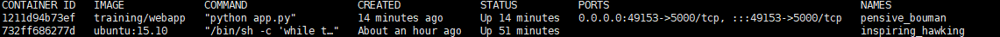
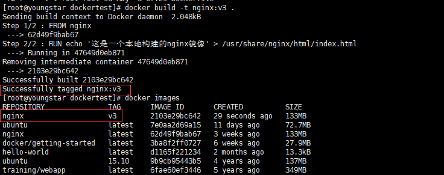

# 1 基础命令及使用

## 1.1 Hello world

使用docker run命令在容器内运行一个应用程序

```shell
docker run ubuntu:15.10 /bin/echo "Hello world"
```

各参数解析：

​	docker  docker命令前缀(Docker的二进制执行文件)

​	run 与docker组合来运行一个容器

​	ubuntu:15.10 指定运行的镜像，如果镜像不存在docker就会在镜像仓库下载公共镜像

## 1.2 运行交互式容器

通过 -i -t 两个参数实现交互

```shell
docker run -i -t ubuntu:15.10 /bin/bash
```

-t 在新容器内指定一个终端

-t 允许对容器进行标准输入(STDIN)进行交互(可以写命令)

在该模式下可以通过exit命令退出容器(或者CTRL+D)

## 1.3 容器后台模式

**使用以下命令创建一个以进程方式运行的容器(后台运行的容器)**

```shell
docker run -d ubuntu:15.10 /bin/sh -c "while true; do echo hello world; sleep 1; done"
#或 run(运行) ubuntu:15.10/ubuntu 镜像名 /bin/sh和/bin/bash 指定不同linux的shell模式
docker run -itd  ubuntu /bin/bash
```

**查看容器状况**

```shell
docker ps
```



CONTAINER ID: 容器 ID。

IMAGE: 使用的镜像。

COMMAND: 启动容器时运行的命令。

CREATED: 容器的创建时间。

STATUS: 容器状态(容器状态有7种，up/running代表运行中)。

PORTS: 容器的端口信息和使用的连接类型（tcp\udp）。

(0.0.0.0:49153->5000/tcp 49153  表示容器内部的5000端口映射到主机端口的49153上)

NAMES: 自动分配的容器名称。

查看所有容器状况

```shell
docker ps -a
# -a 加了-a参数查看所有停止/运行的容器状况，不加则展示在运行的容器
```

### 1.3.1 进入容器

在使用 **-d** 参数时，容器启动后会进入后台。此时想要进入容器，可以通过以下指令进入：

**docker attach**

```shell
docker attach
#  如果从这个容器退出，会导致容器的停止
```

**docker exec**：推荐使用 docker exec 命令，因为此退出容器终端，不会导致容器的停止。

```shell
docker exec -it 243c32535da7 /bin/bash
```


## 1.4 容器基本命令

**停止容器**

```shell
docker stop 732ff686277d
```

stop后的参数可以为 容器ID/容器名称

**启动已停止的容器**

```shell
docker start 732ff686277d 
```

**重启容器**

```shell
docker restart 732ff686277d 
```

查看本地镜像

```shell
docker images
```


## 1.5 Docker Dockerfile

Dockerfile 是一个用来构建镜像的文本文件，文本内容包含了一条条构建镜像所需的指令和说明。

**基本使用方式：**

在空目录下，新建一个名为 Dockerfile 文件，并在文件内添加以下内容：

```shell
FROM nginx
RUN echo '这是一个本地构建的nginx镜像' > /usr/share/nginx/html/index.html
```

创建完后，在该目录执行指令

```shell
docker build -t nginx:v3 .
```

最后一个 . 是指上下文路径

上下文路径，是指 docker 在构建镜像，有时候想要使用到本机的文件（比如复制），docker build 命令得知这个路径后，会将路径下的所有内容打包。

输出下列内容表示构建成功




## 1.6 Docker Compose

- 使用 Dockerfile 定义应用程序的环境。
- 使用 docker-compose.yml 定义构成应用程序的服务，这样它们可以在隔离环境中一起运行。
- 最后，执行 docker-compose up 命令来启动并运行整个应用程序。

yml 样例

```yml
# yaml 配置
version: '3'
services:
  web:
    build: .
    ports:
     - "5000:5000"
  redis:
    image: "redis:alpine"
```

### version

指定本 yml 依从的 compose 哪个版本制定的。

### build

指定为构建镜像上下文路径

启动命令

```shell
docker-compose up
#加-d表示后台运行
docker-compose up -d
```


