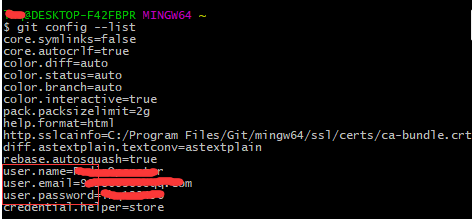
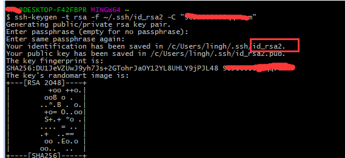
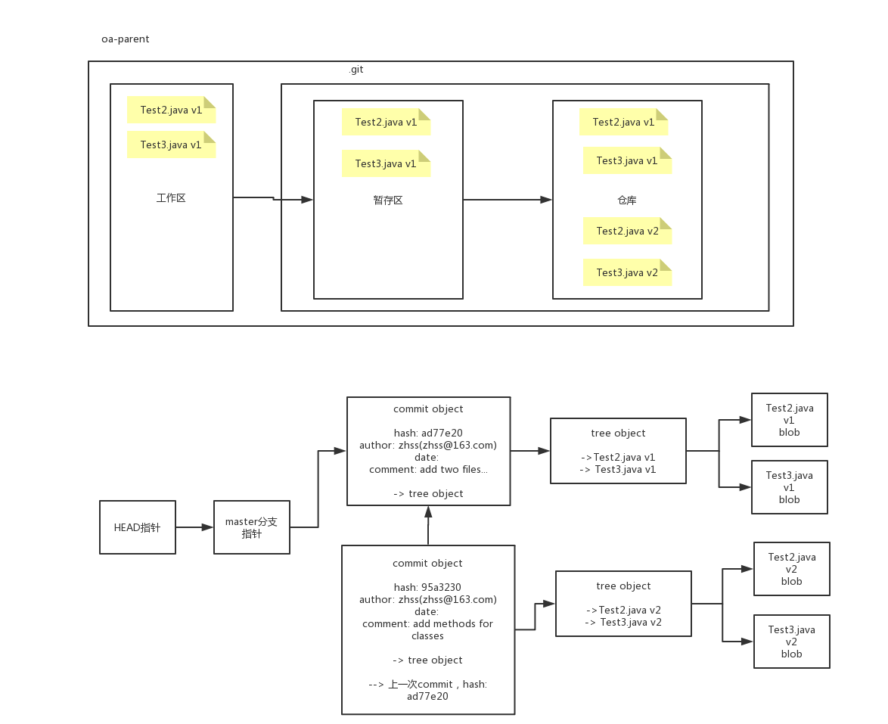
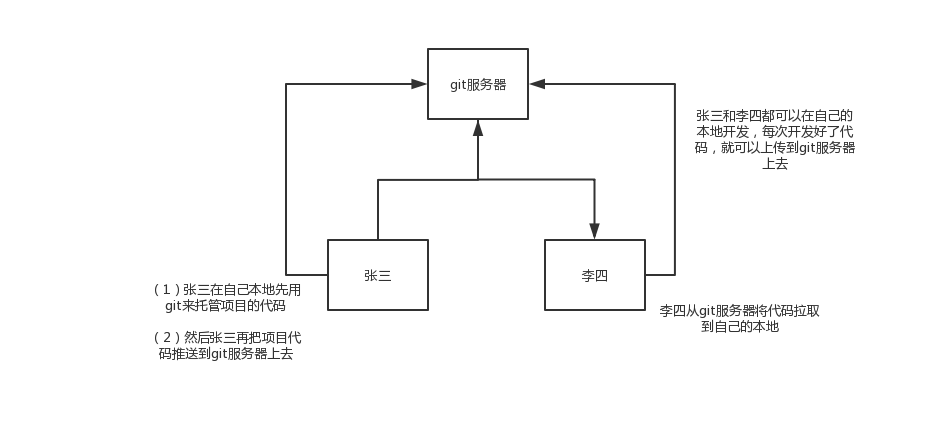
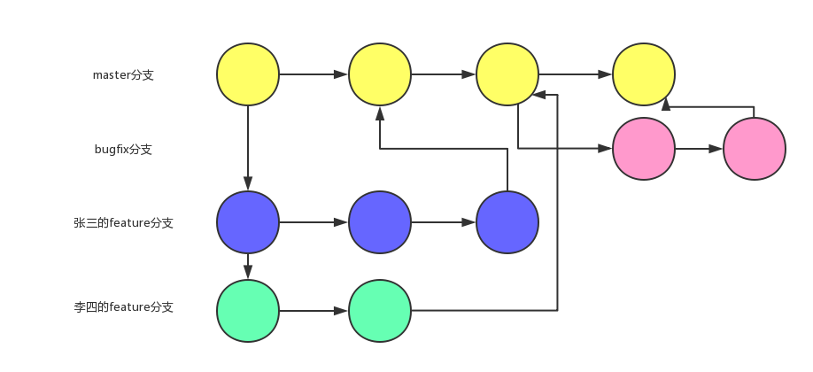

# 1 git背景

**1 本地版本控制系统**

​	最早的版本控制系统了，比较知名的是**RCS**，就是在本地对你的文件的每次修改维护一系列的patch，每个patch就是两个文件版本之间的修改。然后如果你要回到某个历史版本上，RCS会通过path的应用来恢复任何一个时间点的文件。

​	这个方式比较Low，常见于上世纪八十年代，就一个程序员写一个系统，编程，只要自己可以管理自己的代码版本即可，不需要跟别人协作。

**2 集中式版本控制系统**

​	后来人们遇到的问题就是，不是只有自己需要在本地对文件版本进行控制，尤其是软件开发人员，需要多人写作，对同一份代码进行版本控制。比如每个人都要对代码进行修改，那么每个人都会更新出一个版本的代码。

​	这个时候就需要集中式的版本控制系统，就是弄一个服务器，上面放所有代码文件，并且进行版本控制，接着多个开发人员在本地连接服务器，进行代码从服务器检出到本地，代码的修改，以及代码修改的提交到服务器。

​	比较知名的有**CVS**和**SVN**，很长一段时间内，尤其在上个世纪的90年代到2000年初期，基本就是版本控制的标准。持续到了2005年，2010年之前，还是蛮广泛的。SVN，比如说，大名鼎鼎的百度，当年也是SVN去做代码版本控制。

​	但是集中式版本控制系统最大的问题，就在于单点故障，如果服务器故障一段时间，那么那段时间里，各个开发人员几乎啥也干不了了，没法从服务器检出最新代码，没法提交代码。如果更加坑爹的事情发生，就是服务器的磁盘坏了，结果还没有备份，那么完蛋了，所有的代码全部丢失。

**3 分布式版本控制系统**

​	这种模式下，每个开发人员自己的本地电脑，都会从服务器检出一份完整的代码包括历史所有的版本到本地。相当于每个开发人员本地都有一份完整的代码版本的副本拷贝。此外，每个开发人员自己本地都有一个完整的版本控制系统。

​	如果服务器有任何故障，开发人员在自己本地可以做所有的工作，包括代码版本的切换，代码修改的提交，等等所有的版本控制操作，不会影响自己的工作。如果服务器磁盘坏了，数据丢失，那么可以将某个开发人员本地的版本库拷贝一份到服务器，去恢复数据即可。

大名鼎鼎的分布式版本控制系统，就是**Git**

**优点：**

​	(1) 服务器所有代码在本地都有副本拷贝

​	(2) 服务器断网故障，本地也可以使用，不需要联网能进行版本控制

​	(3) 服务器磁盘损坏，代码全都丢失，也可以基于本地代码进行恢复

# 2 git绑定远程仓库

## 2.1 下载git，安装git，一直下一步即可，傻瓜式操作

## 2.2绑定github

```shell
ssh-keygen -t rsa -C "your_email@youremail.com"
```

后面的是注册GitHub时候的邮箱地址，后面的一些操作我们默认回车就可以


然后绑定SSH key，进入github


其中的title随便填，下面的粘贴在你电脑上生成的key。点击添加之后，则添加成功：


验证是否绑定本地成功，在git-bash中验证，输入指令：

```shell
ssh -T git@github.com
```


由于github每次执行commit操作时，都会记录username和email，所以需要设置

```shell
git config --global user.name "youngstar"
git config --global user.email "youngstar@123.com"
```

## 2.3 本地git目录绑定，上传github

### 2.3.1 建立远程仓库


输入远程仓库名,及打勾README file文件，初始仓库需要一个默认文件，才能绑定


### 2.3.2 本地仓库绑定远程仓库

本地目录也新建一个空的README.MD


在本地需要上传/绑定github目录下输入git初始化命令

```shell
git init
```

然后将目录下文件提交到本地仓库

```shell
git add.
git commit -m "first commit"
```

复制远程仓库ssh


然后关联远程仓库，并推送到远程仓库

```shell
git remote add origin git@github.com:wangjiax9/practice.git 
#关联远程仓库，用ssh关联
git push -u origin master 
#把本地库的所有内容推送到远程库上
```

### 2.3.3 修改github默认展示分支

可以将master设为默认展示分支


## 2.4 linux建立远程仓库并绑定

安装git

```shell
git --version
#先查看没有就直接安装
yum install -y git
```

在centos上创建一个git用户来运行git服务：

```shell
groupadd git
adduser git -g git
```

**windows本地生成对应秘钥，重命名rsa避免覆盖之前的，输入生成秘钥命令根据提示取名**

```shell
ssh-keygen -t rsa
#生成秘钥在用户目录的.ssh目录下
#可选后续参数写邮箱
```

将公钥放入authorized_keys，如果没有该文件则创建

```shell
cd /home/git/
mkdir .ssh
chmod 755 .ssh
touch .ssh/authorized_keys
chmod 644 .ssh/authorized_keys
#把公钥导入到/home/git/.ssh/authorized_keys文件里，一行一个。
```

初始化Git仓库

使用/srv/oa-parent.git目录作为远程仓库，在/srv目录下输入命令：

```shell
git init --bare oa-parent.git
#Git会创建一个裸仓库，裸仓库没有工作区。因为服务器上的Git仓库就是为了共享，不会让用户直接登录到服务器上去修改工作区的，而且服务器上的Git仓库通常都以.git结尾。然后，把owner改为git：
chown -R git:git oa-parent.git
#将对应账户改为git
```

禁用shell登录

一般出于安全考虑，第二步创建的git用户是不允许使用shell的，我们可以编辑/etc/passwd文件

```shell
#找到类似下面的一行：
git:x:1001:1001:,,,:/home/git:/bin/bash
#改为：
git:x:1001:1001:,,,:/home/git:/usr/bin/git-shell
#这样，git用户可以正常通过ssh使用git推送和下载代码，但是无法通过shell登录的，因为我们为git用户指定的git-shell是每次一登录就自动退出
```

基于git服务器和远程仓库上传和下载代码

```shell
git remote add origin ssh://git@192.168.31.244:/srv/oa-parent.git
#本地仓库，添加远程仓库

git push -u origin master
#将本地仓库和git服务器上的远程仓库关联起来
#-u，将本地仓库的master分支和远程仓库的master分支关联起来
```

在另一个文件夹克隆远程仓库(测试是否生效，如果克隆成功，代码和刚才上传的本地仓库一致则说明配置成功)

```shell
git clone ssh://git@192.168.31.244:/srv/oa-parent.git
```

大概流程

（1）搭建起来了一个git服务器

（2）在git服务器上创建了一个远程仓库，bare裸仓库

（3）将本地的项目代码推送到了远程仓库

（4）在本地另外一个目录，模拟成另外一个研发人员，在自己本地将远程仓库中的项目代码克隆到了本地

引用：https://www.cnblogs.com/HuSay/p/9101130.html

## 2.5 git配置多账户

如果配置了全局账户需要先删除全局账户

```shell
git config --list
#查看配置
```



使用以下命令删除全局配置

```shell
# 移除全局配置账户
git config --global --unset user.name
#查看全局用户名
git config --global user.name
# 移除全局配置邮箱
git config --global --unset user.email
# 查看全局邮箱
git config --global user.email
# 移除全局密码
git config --global --unset user.password
# 查看全局密码
git config --global user.password

```

**生成对应秘钥，重命名rsa避免覆盖之前的，输入生成秘钥命令根据提示取名**

```shell
ssh-keygen -t rsa
#生成秘钥在用户目录的.ssh目录下
#可选后续参数写邮箱
```



**将rsa公钥加入对应git远程仓库中**

不同远程仓库添加的位置不同，自行查询(github见2.2)

**配置config文件**

```shell
# 配置user1 
Host github.com
HostName github.com
IdentityFile C:\\Users\\lingh\\.ssh\\id_rsa
PreferredAuthentications publickey
User user1

# 配置user2
Host localhost
HostName localhost
IdentityFile C:\\Users\\lingh\\.ssh\\id_rsa2
PreferredAuthentications publickey
User user2

#Host    　　主机别名
#HostName　　服务器真实地址
#IdentityFile　　私钥文件路径
#PreferredAuthentications　　认证方式
#User　　用户名
#Host主机别名 相当于git@Host:YoungStar9527/myNotes.git(git@github.com:YoungStar9527/myNotes.git )
```

终端测试ssh key是否生效

```shell
ssh -T git@user1.github.com
ssh -T git@user2.github.com
#如果git远程仓库安全策略配置了禁用ssh直列会抛出异常，不过不影响正常使用(clone push pull等操作)
```

为git各仓库单独配置邮箱

```shell
git config user.name "user1"
git config user.email "user1@email.com"

```

引用：https://www.pianshen.com/article/302848775/

# 3 git配置与基本命令

## 3.1 git基本配置操作与命令

​	打开git-bash，进入一个模拟了linux环境的命令行的界面，然后通过这里就可以去操作git，同时也可以认为git-bash是一个windows上的linux命令行模拟器，因为linux上的大部分命令都可以执行，包括ssh

```shell
git --version
#检查一下git的版本号
```

在win10的用户目录下的.gitconfig文件为git的基本配置文件(类似maven的全局配置文件setting.xml)

```shell
C:\Users\18146\.gitconfig
#18146为用户目录名
```

​	一般都不会直接修改git的配置文件来进行配置，一般都是执行git config命令，来修改我们的各个不同的范围的配置，比如全局的配置，或者是项目特殊的配置

​	配置用户名和邮箱，安装好git之后第一个事情，就是配置自己的用户名和邮箱，后面每次你提交代码的时候，都会带上你的个人信息

```shell
git config --global user.name "zhss"
git config --global user.email "zhss@163.com"
git config --global
#就是设置当前用户范围内的配置，对机器上的其他用户是无效的
git config --system
#就是对当前机器上所有用户都生效
git config
#就是对当前所在的git项目本身生效
```

 **查看信息**

```shell
git config --list
#查看所有的配置项
git config user.name
#查看某个配置项
git add --help
#git帮助文档
```

**初始化git(在这个项目的根目录下面执行)**

```shell
git init
#执行了git init命令之后，意思就是说，要让git托管这个项目的代码，后续这个项目中的所有代码的变动，都可以作为一个版本提交到git中，git会管理这个项目的每个版本的代码，同时后续我们就可以基于git对这个项目进行各种各样的版本控制的功能  

#git init命令执行之后，做的第一件事情，此时就会创建一个.git隐藏目录，这里包含了git的所有的文件，就是每个版本的代码都会存储在.git目录中。之前我们不是说，如果要对HelloWorld.java文件进行版本控制的话，实际上是要保留这个文件的多个版本的代码的，如果自己手工做，那么就是保存多个代码文件。

#.git目录中，实际上就是存储了你的每个代码文件的每个版本，每个版本就是一个独立的文件。历史版本都被存储在了.git目录中。
```

**进行代码托管/版本控制/提交代码**

```shell
git add --all .
#将该目录下所有代码加入暂存区
git commit -m 'initial project version'
#将暂存区的代码提交到repository(仓库中)
```

 **gitignore配置(配置忽略文件)**

确保.gitignore文件和.git文件夹在同级目录

```shell
#         # 此为注释 – 将被 Git 忽略
*.a       # 忽略所有 .a 结尾的文件
!lib.a    # 但 lib.a 除外（排除）
/TODO     # 仅仅忽略项目根目录下的 TODO 文件，不包括 subdir/TODO
build/    # 忽略 build/ 目录下的所有文件
doc/*.txt # 会忽略 doc/notes.txt 但不包括 doc/server/arch.txt
```

在.gitignore中已经标明忽略的文件，当git push的时候还会出现在push的目录中，原因是这些文件因为在git中有缓存，这时候我们就应该先把本地缓存删除，然后再进行git的push。git清除本地缓存命令如下：

```shell
git rm -r --cached .
git add .
git commit -m 'update .gitignore'
```

引用：https://www.cnblogs.com/xuanjiange/p/13458618.html

**git add扩展**

```shell
git add --all .
#git add . 就是将当前新增或者是修改过的文件，加入暂存区，但是加了--all之后，如果有文件被删除，也会将文件被删除的状态加入暂存区中
#一般工作中，都是用git add --all .
#但是也可以直接git add 某个文件，把指定的文件加入到暂存区中
```


## 3.2 git解决中文展示乱码

1.打开git bash后，

```text
对窗口右键->Options->Text->Locale改为zh_CN，Character set改为UTF-8
关闭git bash，再打开，可以显示中文了。
```

2.如果前一种方法不行

则在git bash中尝试执行下面内容

```text
git config --global core.quotepath false  
关闭git bash，再打开，可以显示中文了。
```

3.如果前面不行

```text
git config --global i18n.commitencoding utf-8    #如果是GBK 请换成gbk
git config --global i18n.logoutputencoding utf-8   #如果是GBK 请换成gbk
export LESSCHARSET=utf-8
关闭git bash，再打开，可以显示中文了。
```

引用：https://zhuanlan.zhihu.com/p/114362960

## 3.3 基于git log查看提交历史

在我们提交了很多次之后，可以查看提交历史，使用git log命令即可，可以看到每次commit的信息，包括了commit的SHA-1、作者、日期、提交说明。


**HEAD -> master的含义**


HEAD，指针，指向了我们当前所处的分支，因为当前我们默认就处于master分支上，所以HEAD指针就是指向master的

**git log常用参数**

```shell
git log --patch -2，
#--patch可以显示每次提交之间的diff，同时-n可以指定显示最近几个commit。这个是很有用的，可以看最近两次commit之间的代码差异，进行code review是比较方便的。
 
用git log --stat
#可以显示每次commit的统计信息，包括修改了几个文件，有多少行插入，多少行删除。
 
用git log --pretty=oneline
#可以每个commit显示一行，就是一个commit SHA-1和一个提交说明。用git log --pretty=format:"%h - %an, %ar : %s"，可以显示短hash、作者、多长时间以前、提交说明。
 
用git log --oneline --abbrev-commit --graph
#这是最有用的，可以看到整个commit树结构，包括如何合并的，就显示每个commit的SHA-1和提交说明，同时SHA-1显示短值。

#--oneline：显示一行，不要显示多行那么多东西，一行里，就显示commit的标识符，SHA-1 hash值，40位的；提交备注；显示分支和HEAD指向哪个commit

#--abbrev-commit：commit的标识符，每一次commit，都有一个唯一的标识符，就是一个SHA-1 hash值，40位，显示一个短值，默认显示前7位，就是说前7位就可以唯一定位这个commit了，不需要完整的40位

#--graph：显示图形化的commit历史，这个大家后面学习到分支那里就知道了，如果有分支的话，commit历史会形成一棵树的形状，这个时候用--graph可以看清楚这颗commit树长什么样子，很有的

```

**git提交历史深入剖析图**


**图中名词解释(下图)：blob就是版本，tree object就是指针指向对应的版本文件，commit object就是对应版本提交(git log中对应的信息)，comment就是提交代码的注释**

**图中流程解释：下图对应的是上图commit(提交)到仓库后的版本对应信息，master指向的是最新的版本代码，最新版本代码又保留上一个的版本的指针**


​	在工作区修改代码之后，执行git add命令，会将代码放入版本库中的暂存区；接着执行git commit命令之后，会将暂存区中的代码提交到版本库中的master分支上，而HEAD指针就指向master分支的最新一次提交。

​	所以现在我们就很清楚了，git add，其实就是可以多次修改代码，多次git add，然后将每次修改的代码，都放入暂存区中；而git commit，就是一次性将暂存区中的代码，全部提交到master分支上，master分支会出现一个最新的commit，也就是一个最新的代码版本；而HEAD作为一个指针，永远指向master分支的最新一次commit的代码版本。

## 3.4 git版本控制

```shell
git reset --hard HEAD^
#就可以回退到上一个版本
#HEAD^，代表了什么？
#HEAD -> master -> commit（add methods for classes）
#HEAD^，代表的是commit（add methods for classes）的上一个commit（add two files）
git reset --hard HEAD^
#就是将仓库、暂存区、工作区，全部恢复到上一个commit（add two files）对应的状态
git reset --hard HEAD~5
#退回到HEAD之前的倒数第5个commit的状态
git reset --hard d324644
#指定一个commit的hash值，回退到很老的版本(一般使用hash值得前7位即可)
#在不引起歧义的情况下，可以用前面n位。git命令中支持的最短的hash值是4位的
#于“歧义”的例子，假如某个仓库里有个object的名字/hash值前五位是12345，另一个前五位是12346，那么用1234就有歧义
git reset
#这个命令，可以任意穿梭到历史的任何一个版本上去
#如果我要回来呢？重新回到之前add methods for classes那个commit对应的版本
git reflog
#查看git reflog 可以查看所有分支的所有操作记录（包括已经被删除的 commit 记录和 reset 的操作）
```

git最核心的原理

（1）三个区域：工作区、暂存区、仓库

（2）提交历史：在仓库中，blob->tree->commit->master-HEAD，这套东西形成了git的数据结构



# 4 git本地仓库结构与文件状态

## 4.1 git本地仓库结构

git项目有3个主要的部分组成：

工作区（working directory / working tree），暂存区（staging area），版本库（git directory / repository）

**working directory / working tree：工作区，**保存的是一个项目当前的一个版本对应的所有文件，这些文件是从git版本库中的压缩后的数据库中提取出来，然后放到我们的磁盘上去。

**staging area：暂存区**，就是一个文件，包含在git版本库中，主要是保存了下一次要提交到的那些文件信息。在git中，对暂存区有另外一个名称，叫做index，也就是索引。

**git directory / repository：git版本库**，其实就是git用于存储自己的元数据，以及文档数据库的地方，默认就是在项目的.git隐藏目录中

上面三个区域的协作关系大致如下：

（1）首先会在工作区修改某个版本的文件

（2）将某些修改后的文件放入git暂存区中，准备下一次提交到git版本库中去

（3）执行一个提交操作，将暂存区中的文件保作为一个快照保存到git版本库中去

如果一个文件，已经有一个版本被保存到了版本库，那么就是committed状态；如果这个文件被修改了，同时被加入了暂存区，那么就是staged状态；如果这个文件修改了，还没有加入暂存区，那么就是modified状态。

工作区，working directory

所谓的工作区，指的就是当前你的git管理的项目，在本地的那个目录，也就是你能直接看到，编辑的那个目录，这就是工作区。


## 4.2 git相关机制

（1）**快照机制**：每次提交文件，都是保存一份这个文件当前这个状态的一个完整快照，同时对这次提交维护一个指针，指向这个文件快照(而CVS，SVN等，是通过一开始提交一个原始文件，然后后面每次对文件进行修改之后再次提交，都维护这次提交对应的一个差异)

（2）**本地化操作**：大多数的git版本控制操作，只要在本地执行即可，所有的版本文件都在本地，因此操作是非常快速的。比如说通过git查看提交历史，比较历史文件的差异，都可以在本地完成，不需要通过服务器做任何事情

（3）**完整性保证**：git在存储任何文件之前，都会对其执行一个校验和，然后用校验和指向那个文件。

​	这是git内核保证的，这样我们是不可以手工修改git版本库中的任何文件的，因为修改了文件之后，会导致计算出来的校验和与之前保存的校验和不匹配，文件会破损。

​	git用的是**SHA-1** hash算法来计算校验和，这是一个40位的字符串，基于文件的内容计算出来的，看起来大概是这样的：

​	24b9da6552252987aa493b52f8696cd6d3b00373

​	如果手动破坏.git中存储的文件的内容，git会不承认，因为内容变化之后，会导致内容计算出来的SHA-1 40位的hash值变化，跟之前存储的hash值不同，就认为文件破损

（4）**仅仅添加数据**：基本是向仓库(repository)添加数据，基本不会丢失。

## 4.2 git文件状态

**通过git status查看文件状态**


**PS:git默认中文展示会乱码(下图是配置展示中文设置后)**


**PS:绿色就是已经add(暂存区/staged),红色就是没有add(工作区)**

**代码文件分成两种，一种是tracked，一种是untracked**。tracked文件就是已经提交到git版本库中的文件，后面可以处于modified或者staged状态；untracked文件，就是从来没有提交到git版本库的代码文件（也从来没有放入暂存区）。

**git管理的文件有三种状态：提交状态（committed），修改状态（modified），暂存状态（staged）。**

提交状态：我们的文件已经安全的保存在git的本地数据库中了。

修改状态：我们修改了文件，但是还没有提交到git的数据库中去。

暂存状态：将修改后的文件标记为即将通过下一次提交，保存到git数据库中去。

（1）新文件刚创建：untracked，此时仅仅停留在工作区中

（2）git add 新文件：new file，此时已经被追踪了，放入了暂存区中 => staged

（3）git commit 新文件：committed，已经被追踪了，放入了git仓库中 => committed

（4）修改那个文件：modified，changes not staged to be committed，没有加入暂存区，被修改的内容仅仅停留在工作区中 => modified

（5）git add 修改文件：modified，changes to be committed，修改的文件版本被已经加入暂存区 => staged

（6）git commit 修改文件：committed，修改后的新版本提交到了git仓库中 => committed

​	一般自己创建的版本库，刚开始文件都是untracked，然后git add和git commit命令执行之后，就被提交了第一个版本到git版本库，此时就全部都是tracked了。如果是从远程版本库克隆下来的，那么刚开始就是tracked。

​	接着对tracked的文件修改之后，就是modified；然后对modified文件再执行git add命令之后，就是staged，进入了暂存区；接着执行git commit命令之后，就将暂存区中的文件都提交到了版本库中，此时就是unmodified，and tracked。

**PS:在对文件修改没有add的情况对文件来说就是modified状态在回到工作区，add后才是modfied状态在暂存区。**

**PS:必须git add到暂存区里的修改，才会被git commit时提交到仓库里，否则就是停留在工作区中**

# 5 功能分支工作流实战以及深度解析分支内幕原理

## 5.1 基于git远程仓库的多人协作开发




## 5.2 分支的基础知识

### 5.2.1 分支的介绍

​	所谓的分支功能，就是可以同时拉出来多个代码副本，然后在不同的代码副本上，可以进行对应功能的开发。完成开发之后，可以将多个分支合并在一起，形成最终的代码。

​	在git中，每一个项目，不管你有多少个分支，不管你在哪个分支上开发

​	最终都会形成一个完整的提交历史，树形结构

​	**每个分支，其实就只是一个指针而已，分支就指向了提交历史中的某个commit object**

​	**每个commit object就代表了这个项目的所有代码在那次提交的时候一个完整的快照版本**，包含了之前没有变更的代码文件，也包括了这次提交的最新的修改/新增/删除的代码文件

​	Git的分支功能是一个很大的特色，非常的轻量级，分支的来回切换速度是很快的，在实际的开发过程中，分支绝对是最重要的功能。

### 5.2.2 commit object工作原理

​	Git并不是存储一系列的文件差异，而是存储一系列的文件快照的。实际上每次我们执行一次commit，git都会存储一个commit object，这个commit object中会包含一个指针，指向这次提交文件的快照。这个commit object同时也包含作者的姓名和邮箱，提交说明，以及对上一次commit object的指针。

​	将一个文件版本放入暂存区的时候，就会计算一个校验和，然后提交的时候会将文件内容以blob的方式放入版本库中，同时在暂存区放入这个文件版本的校验和。接着git会创建一个commit object，其中会包含元数据，以及一个指针指向版本库中的文件快照。

​	也就是说，**每次执行一次提交，都会在版本库中包含这么几个东西：一个blob，每个文件都会有一个blob来存储这个文件的本次提交的快照；一个tree，这个tree会包含对本次提交的所有文件的blob的指针；一个commt object，指向了tree的指针，作者，等信息。**

​	接着如果再次执行一个提交，那**么下一个提交同样会包含那些东西**：每个文件一个blob，一个tree指向所有blob，一个commit object指向那个tree，同时这个commit object会有一个指针**，指向上一个commit object**。

​	最后多次提交，就会得到一颗完整的commit树。

​	分支是啥？分支就是一个轻量级的指针，默认的分支是master，那么每次提交，master分支的指针默认就是指向最新的那个commit object的。每次提交一次，master指针就会挪动，继续指向最新的commit object。

​	**git维护了一个特殊的指针HEAD，默认指向master分支指针，当本地切换到其他分支时，HEAD指针就会指向那个分支。HEAD指针就是当前工作区域的指针(当前指针，并非最新指针，当前指针HEAD可以指向之前的commit object)。**


### 5.2.3 创建一个分支

```shell
git branch testing
#可以创建一个新的分支，此时这个分支的指针会指向当前你所在的分支所指向的commit object上。
git log --oneline --decorate
#查看各个分支指向哪个commit object
```


### 5.2.4 切换分支

```shell
git checkout testing
#此时就可以切换到testing分支，此时HEAD指针会指向testing分支指针。
```

​	此时如果在testing分支上提交代码，那么会commit树会长出来一个新的commit object，而testing分支指正会指向最新的commit object，HEAD继续指向testing分支指针，而master指针还是指向之前的那个commit object。

​	git checkout master，会切换回master分支，此时HEAD指针会指向master指针，同时将master指针指向的那个commit object，对应的tree和其中的blob，也就是对应的文件快照恢复到工作区中来。

​	再次在master分支上提交一个修改，此时从这个commit object会再长出来一个新的commit object，看起来就是跟testing分支当前指向的commit object形成了两个分叉。

​	此时如果要查看commit树，可以用命令：

```shell
git log --oneline --decorate --graph --all
#可以打印出整颗commit树，同时告诉你各个分支当前指向哪个commit object
```

​	在Git中，**分支上就是一个很简单的文件，其中包含了一个40位的SHA-1校验和，就是分支指向的那个commit object的SHA-1。所以创建分支的代价是很低的，不过就是创建这么一个文件**罢了。而一些集中式版本控制系统，对于分支可能需要拷贝一个完整的文件副本，导致速度很慢，磁盘空间占用很大。

### 5.2.5  远程分支

```shell
	git push -u origin 分支名称
	#将本地分支推送到远程仓库，默认分支名称一般为master
	#第一次推送且远程仓库没该分支，就是将本地分支推送到远程仓库里，形成一个同名的远程分支
	#-u这个选项就是将本地分支和远程分支关联起来 
	git push origin 分支名称
	#直接可以将本地分支的代码推送到远程分支(本地分支已和远程分支关联了)
	#此时你本地的commit树也会推送到远程版本库，跟远程版本库的commit树进行合并
	git pull
	#将当前分支在远程仓库的代码拉取下来，跟本地分支的代码进行合并
```

​	远程版本库的分支，在本地都有追踪分支(remote-tracking 分支)

​	比如说**本地的master分支，对应的远程分支就是origin/master。比如本地的feature/iss53分支，对应的远程分支就是origin/feature/iss53**

​	假设我们公司的git服务器地址是git.zhss.com，然后如果我们用git clone命令从这个git服务器克隆了一个版本库下来，git默认会将远程版本库命名为origin，同时在本地创建一个指向远程版本库的master分支的本地分支，叫做origin/master。此外，git也会给你在本地创建一个master分支，内容就是跟origin/master分支一样的。

​	从git服务器克隆版本库下来的时候，远程版本库的commit树会一同拷贝下来，然后origin/master指向的commit，就是远程版本库的master指向的commit，同时给本地创建的commit也是指向这个commit。

​	此时，如果在本地你做了不少开发，然后本地master移动了好几个commit，同时origin/master还是指向最开始的那个commit；而同时，远程版本库上，其他同事也提交了几次代码，因此远程版本库上的commit也移动了几个commit。

```shell
git fetch origin
#要让本地和远程保持同步,该命令会将远程版本库的commit树和所有的分支都拉取下来，跟本地的commit树进行合并
#同时拉取下来所有最新的远程分支
#此时可能就会在本地形成一棵有两个分叉的commit树
#本地的origin/master会指向远程版本库的master指向的那个commit，本地的master继续指向之前本地最新的那个commit
git merge 远程分支
#将远程分支代码合并到本地分支上去
#先git fetch origin，然后git merge 远程分支(如果冲突的话，可以一个一个解决)，相当于git pull(可能会冲突，形成冲突文件，是可读的)
git checkout -b 分支名称
#这个命令就是创建本地分支，本地分支指针指向最新一个commit，同时HEAD指针指向本地分支指针
#git checkout -b，相当于两个命令，git branch dev，git checkout dev，先创建分支，再切换到分支
git checkout -b 分支名称 origin/分支名称
#可以将本地获取到一个分支跟origin/分支名称 关联起来，然后就可以跟你一起对一个分支进行修改了(因为git fetch origin获取到新分支时，这个新分支是只读的，需要关联起来，就可以对这个分支进行修改了)
#创建出来的本地分支叫做tracking brach，而这个本地分支track的远程分支叫做upstream branch。此时本地分支就会track那个远程分支，跟远程分支之间会建立关联关系
```

​	如果我们在tracking分支上，执行git pull命令，git就会自动将对应的远程分支在远程版本库上的代码拉取下来跟本地的tracking分支做合并，如果有冲突的话，还需要解决冲突。

​	如果我们是使用clone命令克隆的远程版本库，那么默认就会将本地的master分支创建为追踪origin/master远程分支的。

```shell
git branch
#可以查看当前的所有分支以及我们目前所处的分支
git branch -u origin/分支名称
#可以让当前本地分支track(追踪)某个指定的远程分支
git branch -v
#显示出每个分支当前指向的commit object
git branch -vv
#查看每个本地分支track的远程分支
git branch
#显示出当前所有分支列表，以及你在哪个分支上工作
git branch --merged
#可以看到哪些分支被merge进了当前分支；
git branch --no-merged
#可以看到哪些分支还没有被merge进当前分支
git branch -d 分支名称
#命令删除一个本地分支
#如果你有一个分支，还没有合并到master分支去，此时git不让你删除的，可以使用 git branch -D
git branch -D 分支名称
#强制删除一个没有合并到别的分支的分支
#git branch -d可能会提示你那个分支还没merge到当前分支来，不让你删除该分支，此时可以使用git branch -D命令，强制删除一个分支。
git push origin --delete 分支名称
#删除远程分支
```

### 5.2.6 分支知识总结

​	1 git分支的一些基础知识：commit提交历史，分支就是指针，HEAD指向当前分支

​	2 拉不同的分支，就是不同的指针，基于指针指向的那个版本的代码，你在分支上做开发提交，其实就是在commit提交树上长出来不同的枝丫

​	3 切换分支，就是切换HEAD指向的分支指针

​	4 分支合并，其实就是将两个分支当前指向的两个commit的代码，合并到一起，形成额一个新的commit

​	5 origin/master对应的就是远程仓库的master

​	6 本地仓库和远程仓库之间推送和拉取代码，实际上就是在同步整套commit提交历史，包括进行一些分支指针的合并

### 5.2.7 解决分支冲突

假设有master分支和feature2分支出现了冲突

```java
<<<<<<< HEAD
System.out.println(“I like spark......”);
=======
System.out.println(“I liike storm......”);
>>>>>>> feature2
```

​	上面的意思，就是说master分支和feature2分支出现了冲突，第一行是HEAD代码，因为HEAD目前指向master，也就是master的代码；第二行是feature2的代码。

​	这个时候，我们可以将冲突的内容删除掉，保留正常内容即可。

​	接着提交HelloWorld.java代码，就解决了冲突并且提交了代码，同时完成了feature2到master的合并。此时会自动长出来一个新的commit节点，这个commit就是解决了master和feature2冲突并且合并之后的commit。同时master指向最新的这个commit，HEAD还是指向master。

​	一般来说尽量避免冲突，让不同的人负责不同的独立的模块对应的工程，大家修改的代码都是不一样的，从根本上避免代码出现冲突

##  5.3 功能分支工作流

​	**集中式工作流、功能分支工作流、GitFlow工作流、互联网公司一种GitFlow工作流的变种，每种工作流都没有绝对的好坏，主要是适用于某个场景下，某种类型的项**

### 5.3.1 功能分支工作流概述

​	一般来说，都会准备一个master分支，作为你的稳定分支，这里的代码是随时可以上线的；有多个feature分支，每个feature分支用来开发一个功能。

​	如果线上有bug，一般分为两种，一种是影响正常用户使用流程的紧急bug，就是hotfix，比如说电商网站无法下单了，门户网站无法查看新闻了；一种是不影响正常用户使用流程的非紧急bug，比如说有某个广告显示的位置出现了偏差，就是bugfix。

​	一般线上发现了bug，就了一个hotfix或者bugfix分支，然后在分支上复现bug，修复bug，然后在测试环境进行验证以及回归测试，最后将分支合并到master去上线，修复线上问题



**功能分支工作流非常适合对公司内部的系统、平台或者工具，5人以内小团队，3人左右，去开发一个比如公司内使用工具，报表平台**

# 6 基于CentOS7安装部署企业私有的GitLab服务器


