# 1 git背景

**1 本地版本控制系统**

​	最早的版本控制系统了，比较知名的是**RCS**，就是在本地对你的文件的每次修改维护一系列的patch，每个patch就是两个文件版本之间的修改。然后如果你要回到某个历史版本上，RCS会通过path的应用来恢复任何一个时间点的文件。

​	这个方式比较Low，常见于上世纪八十年代，就一个程序员写一个系统，编程，只要自己可以管理自己的代码版本即可，不需要跟别人协作。

**2 集中式版本控制系统**

​	后来人们遇到的问题就是，不是只有自己需要在本地对文件版本进行控制，尤其是软件开发人员，需要多人写作，对同一份代码进行版本控制。比如每个人都要对代码进行修改，那么每个人都会更新出一个版本的代码。

​	这个时候就需要集中式的版本控制系统，就是弄一个服务器，上面放所有代码文件，并且进行版本控制，接着多个开发人员在本地连接服务器，进行代码从服务器检出到本地，代码的修改，以及代码修改的提交到服务器。

​	比较知名的有**CVS**和**SVN**，很长一段时间内，尤其在上个世纪的90年代到2000年初期，基本就是版本控制的标准。持续到了2005年，2010年之前，还是蛮广泛的。SVN，比如说，大名鼎鼎的百度，当年也是SVN去做代码版本控制。

​	但是集中式版本控制系统最大的问题，就在于单点故障，如果服务器故障一段时间，那么那段时间里，各个开发人员几乎啥也干不了了，没法从服务器检出最新代码，没法提交代码。如果更加坑爹的事情发生，就是服务器的磁盘坏了，结果还没有备份，那么完蛋了，所有的代码全部丢失。

**3 分布式版本控制系统**

​	这种模式下，每个开发人员自己的本地电脑，都会从服务器检出一份完整的代码包括历史所有的版本到本地。相当于每个开发人员本地都有一份完整的代码版本的副本拷贝。此外，每个开发人员自己本地都有一个完整的版本控制系统。

​	如果服务器有任何故障，开发人员在自己本地可以做所有的工作，包括代码版本的切换，代码修改的提交，等等所有的版本控制操作，不会影响自己的工作。如果服务器磁盘坏了，数据丢失，那么可以将某个开发人员本地的版本库拷贝一份到服务器，去恢复数据即可。

大名鼎鼎的分布式版本控制系统，就是**Git**

**优点：**

​	(1) 服务器所有代码在本地都有副本拷贝

​	(2) 服务器断网故障，本地也可以使用，不需要联网能进行版本控制

​	(3) 服务器磁盘损坏，代码全都丢失，也可以基于本地代码进行恢复

# 2 git绑定github

## 2.1 下载git，安装git，一直下一步即可，傻瓜式操作

## 2.2绑定github

```shell
ssh-keygen -t rsa -C "your_email@youremail.com"
```

后面的是注册GitHub时候的邮箱地址，后面的一些操作我们默认回车就可以

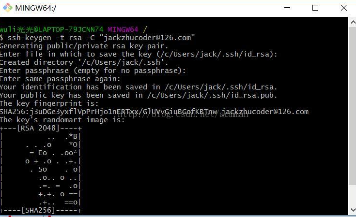

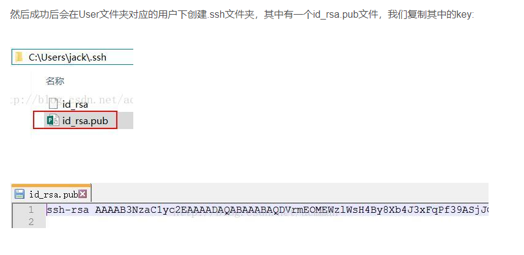

然后绑定SSH key，进入github

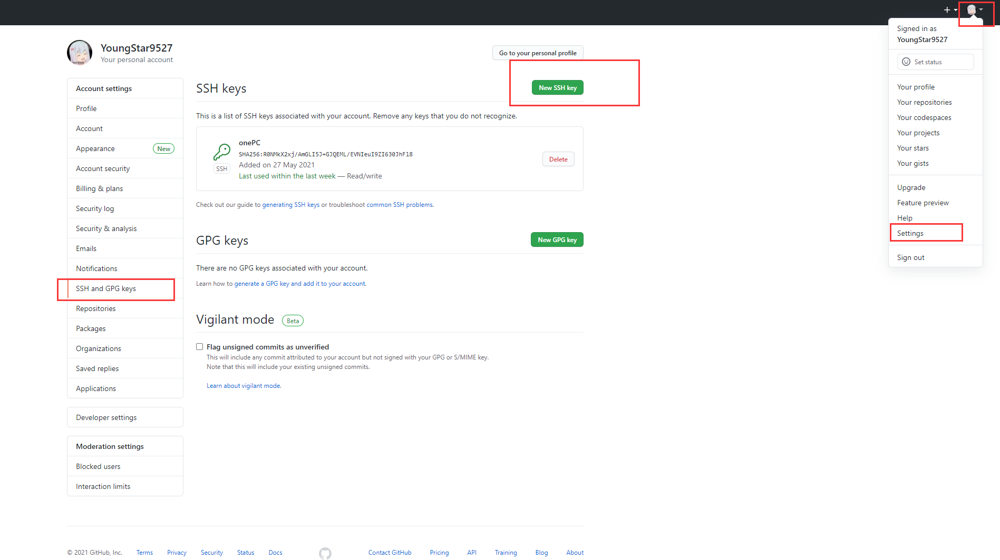

其中的title随便填，下面的粘贴在你电脑上生成的key。点击添加之后，则添加成功：

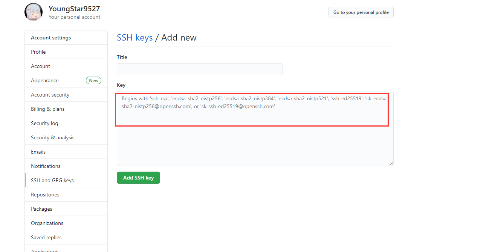


验证是否绑定本地成功，在git-bash中验证，输入指令：

```shell
ssh -T git@github.com
```

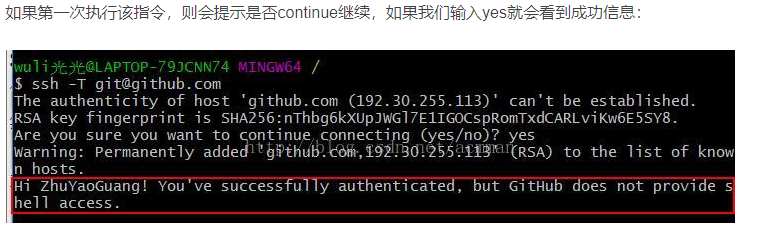

由于github每次执行commit操作时，都会记录username和email，所以需要设置

```shell
git config --global user.name "youngstar"
git config --global user.email "youngstar@123.com"
```

## 2.3 本地git目录绑定，上传github

### 2.3.1 建立远程仓库

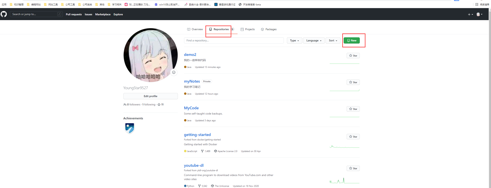

输入远程仓库名,及打勾README file文件，初始仓库需要一个默认文件，才能绑定

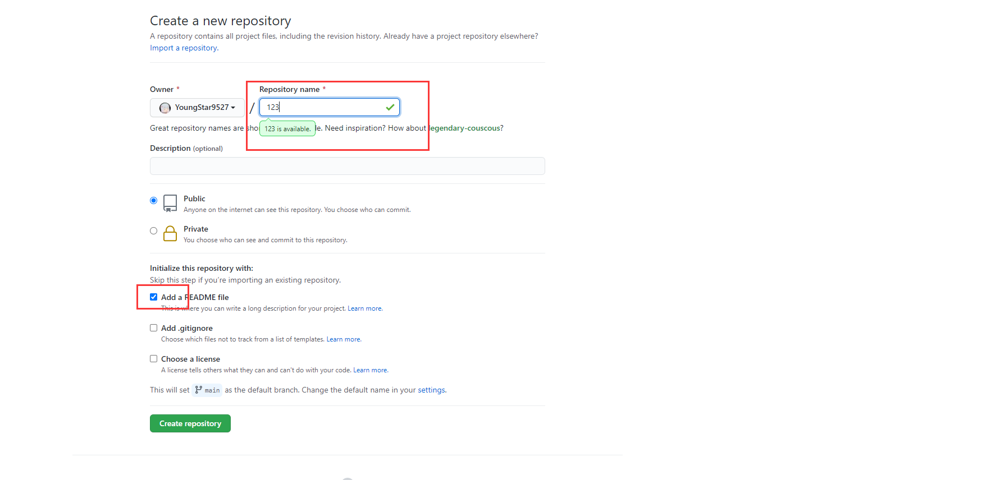

### 2.3.2 本地仓库绑定远程仓库

本地目录也新建一个空的README.MD

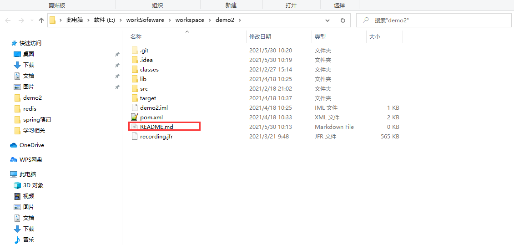

在本地需要上传/绑定github目录下输入git初始化命令

```shell
git init
```

然后将目录下文件提交到本地仓库

```shell
git add.
git commit -m "first commit"
```

复制远程仓库ssh

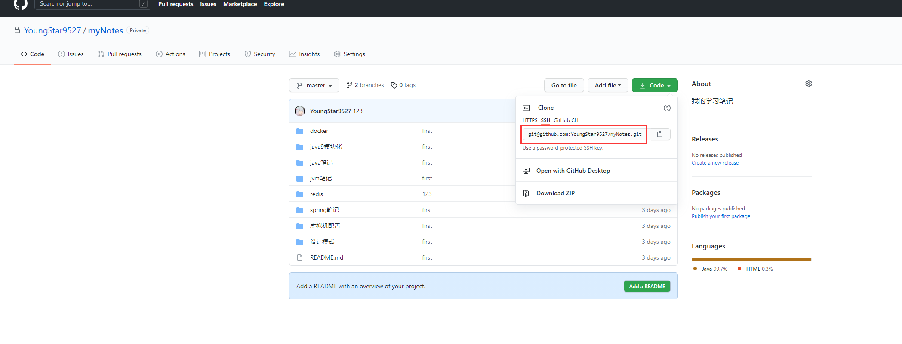

然后关联远程仓库，并推送到远程仓库

```shell
git remote add origin git@github.com:wangjiax9/practice.git 
#关联远程仓库，用ssh关联
git push -u origin master 
#把本地库的所有内容推送到远程库上
```

### 2.3.3 修改github默认展示分支

可以将master设为默认展示分支

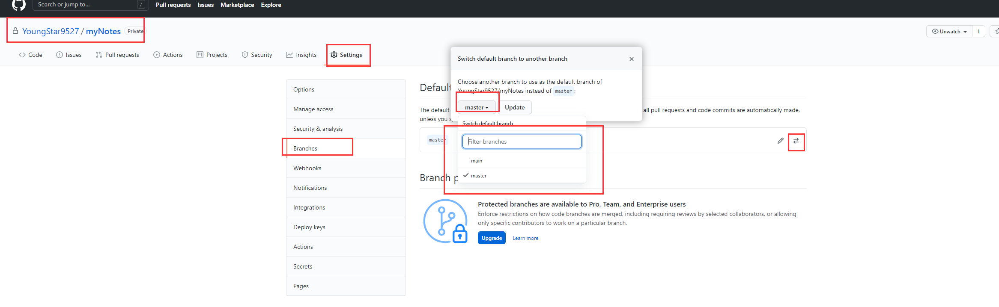

# 3 git配置与基本命令

## 3.1 git基本配置操作与命令

​	打开git-bash，进入一个模拟了linux环境的命令行的界面，然后通过这里就可以去操作git，同时也可以认为git-bash是一个windows上的linux命令行模拟器，因为linux上的大部分命令都可以执行，包括ssh

```shell
git --version
#检查一下git的版本号
```

在win10的用户目录下的.gitconfig文件为git的基本配置文件(类似maven的全局配置文件setting.xml)

```shell
C:\Users\18146\.gitconfig
#18146为用户目录名
```

​	一般都不会直接修改git的配置文件来进行配置，一般都是执行git config命令，来修改我们的各个不同的范围的配置，比如全局的配置，或者是项目特殊的配置

​	配置用户名和邮箱，安装好git之后第一个事情，就是配置自己的用户名和邮箱，后面每次你提交代码的时候，都会带上你的个人信息

```shell
git config --global user.name "zhss"
git config --global user.email "zhss@163.com"
git config --global
#就是设置当前用户范围内的配置，对机器上的其他用户是无效的
git config --system
#就是对当前机器上所有用户都生效
git config
#就是对当前所在的git项目本身生效
```

 **查看信息**

```shell
git config --list
#查看所有的配置项
git config user.name
#查看某个配置项
git add --help
#git帮助文档
```

**初始化git(在这个项目的根目录下面执行)**

```shell
git init
#执行了git init命令之后，意思就是说，要让git托管这个项目的代码，后续这个项目中的所有代码的变动，都可以作为一个版本提交到git中，git会管理这个项目的每个版本的代码，同时后续我们就可以基于git对这个项目进行各种各样的版本控制的功能  

#git init命令执行之后，做的第一件事情，此时就会创建一个.git隐藏目录，这里包含了git的所有的文件，就是每个版本的代码都会存储在.git目录中。之前我们不是说，如果要对HelloWorld.java文件进行版本控制的话，实际上是要保留这个文件的多个版本的代码的，如果自己手工做，那么就是保存多个代码文件。

#.git目录中，实际上就是存储了你的每个代码文件的每个版本，每个版本就是一个独立的文件。历史版本都被存储在了.git目录中。
```

**进行代码托管/版本控制/提交代码**

```shell
git add --all .
#将该目录下所有代码加入暂存区
git commit -m 'initial project version'
#将暂存区的代码提交到repository(仓库中)
```

 **gitignore配置(配置忽略文件)**

确保.gitignore文件和.git文件夹在同级目录

```shell
#         # 此为注释 – 将被 Git 忽略
*.a       # 忽略所有 .a 结尾的文件
!lib.a    # 但 lib.a 除外（排除）
/TODO     # 仅仅忽略项目根目录下的 TODO 文件，不包括 subdir/TODO
build/    # 忽略 build/ 目录下的所有文件
doc/*.txt # 会忽略 doc/notes.txt 但不包括 doc/server/arch.txt
```

在.gitignore中已经标明忽略的文件，当git push的时候还会出现在push的目录中，原因是这些文件因为在git中有缓存，这时候我们就应该先把本地缓存删除，然后再进行git的push。git清除本地缓存命令如下：

```shell
git rm -r --cached .
git add .
git commit -m 'update .gitignore'
```

引用：https://www.cnblogs.com/xuanjiange/p/13458618.html

**git add扩展**

```shell
git add --all
#git add . 就是将当前新增或者是修改过的文件，加入暂存区，但是加了--all之后，如果有文件被删除，也会将文件被删除的状态加入暂存区中
#一般工作中，都是用git add --all .
#但是也可以直接git add 某个文件，把指定的文件加入到暂存区中
```


## 3.2 git解决中文展示乱码

1.打开git bash后，

```text
对窗口右键->Options->Text->Locale改为zh_CN，Character set改为UTF-8
关闭git bash，再打开，可以显示中文了。
```

2.如果前一种方法不行

则在git bash中尝试执行下面内容

```text
git config --global core.quotepath false  
关闭git bash，再打开，可以显示中文了。
```

3.如果前面不行

```text
git config --global i18n.commitencoding utf-8    #如果是GBK 请换成gbk
git config --global i18n.logoutputencoding utf-8   #如果是GBK 请换成gbk
export LESSCHARSET=utf-8
关闭git bash，再打开，可以显示中文了。
```

引用：https://zhuanlan.zhihu.com/p/114362960

## 3.3 基于git log查看提交历史

在我们提交了很多次之后，可以查看提交历史，使用git log命令即可，可以看到每次commit的信息，包括了commit的SHA-1、作者、日期、提交说明。

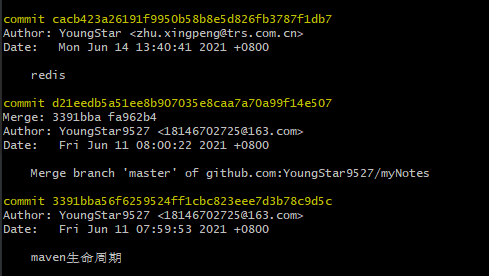

**HEAD -> master的含义**

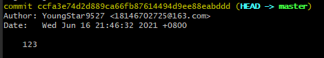

HEAD，指针，指向了我们当前所处的分支，因为当前我们默认就处于master分支上，所以HEAD指针就是指向master的

**git log常用参数**

```shell
git log --patch -2，
#--patch可以显示每次提交之间的diff，同时-n可以指定显示最近几个commit。这个是很有用的，可以看最近两次commit之间的代码差异，进行code review是比较方便的。
 
用git log --stat
#可以显示每次commit的统计信息，包括修改了几个文件，有多少行插入，多少行删除。
 
用git log --pretty=oneline
#可以每个commit显示一行，就是一个commit SHA-1和一个提交说明。用git log --pretty=format:"%h - %an, %ar : %s"，可以显示短hash、作者、多长时间以前、提交说明。
 
用git log --oneline --abbrev-commit --graph
#这是最有用的，可以看到整个commit树结构，包括如何合并的，就显示每个commit的SHA-1和提交说明，同时SHA-1显示短值。

#--oneline：显示一行，不要显示多行那么多东西，一行里，就显示commit的标识符，SHA-1 hash值，40位的；提交备注；显示分支和HEAD指向哪个commit

#--abbrev-commit：commit的标识符，每一次commit，都有一个唯一的标识符，就是一个SHA-1 hash值，40位，显示一个短值，默认显示前7位，就是说前7位就可以唯一定位这个commit了，不需要完整的40位

#--graph：显示图形化的commit历史，这个大家后面学习到分支那里就知道了，如果有分支的话，commit历史会形成一棵树的形状，这个时候用--graph可以看清楚这颗commit树长什么样子，很有的

```

**git提交历史深入剖析图**

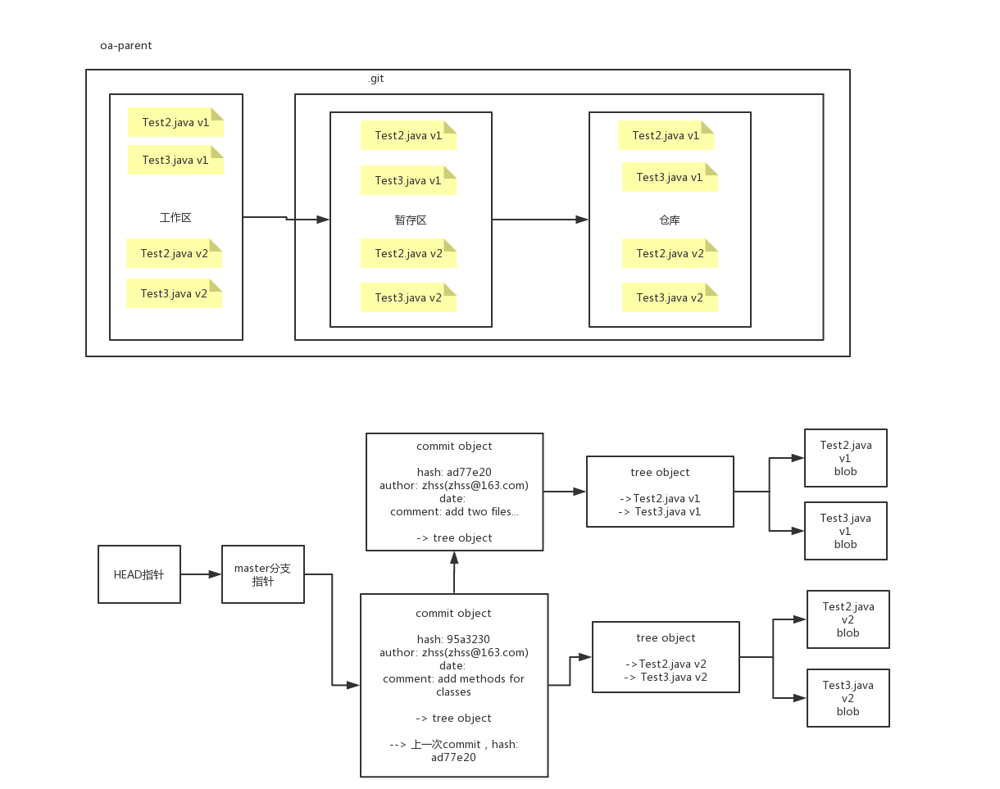


​	在工作区修改代码之后，执行git add命令，会将代码放入版本库中的暂存区；接着执行git commit命令之后，会将暂存区中的代码提交到版本库中的master分支上，而HEAD指针就指向master分支的最新一次提交。

​	所以现在我们就很清楚了，git add，其实就是可以多次修改代码，多次git add，然后将每次修改的代码，都放入暂存区中；而git commit，就是一次性将暂存区中的代码，全部提交到master分支上，master分支会出现一个最新的commit，也就是一个最新的代码版本；而HEAD作为一个指针，永远指向master分支的最新一次commit的代码版本。

# 4 git本地仓库结构与文件状态

## 4.1 git本地仓库结构

git项目有3个主要的部分组成：

工作区（working directory / working tree），暂存区（staging area），版本库（git directory / repository）

**working directory / working tree：工作区，**保存的是一个项目当前的一个版本对应的所有文件，这些文件是从git版本库中的压缩后的数据库中提取出来，然后放到我们的磁盘上去。

**staging area：暂存区**，就是一个文件，包含在git版本库中，主要是保存了下一次要提交到的那些文件信息。在git中，对暂存区有另外一个名称，叫做index，也就是索引。

**git directory / repository：git版本库**，其实就是git用于存储自己的元数据，以及文档数据库的地方，默认就是在项目的.git隐藏目录中

上面三个区域的协作关系大致如下：

（1）首先会在工作区修改某个版本的文件

（2）将某些修改后的文件放入git暂存区中，准备下一次提交到git版本库中去

（3）执行一个提交操作，将暂存区中的文件保作为一个快照保存到git版本库中去

如果一个文件，已经有一个版本被保存到了版本库，那么就是committed状态；如果这个文件被修改了，同时被加入了暂存区，那么就是staged状态；如果这个文件修改了，还没有加入暂存区，那么就是modified状态。

工作区，working directory

所谓的工作区，指的就是当前你的git管理的项目，在本地的那个目录，也就是你能直接看到，编辑的那个目录，这就是工作区。

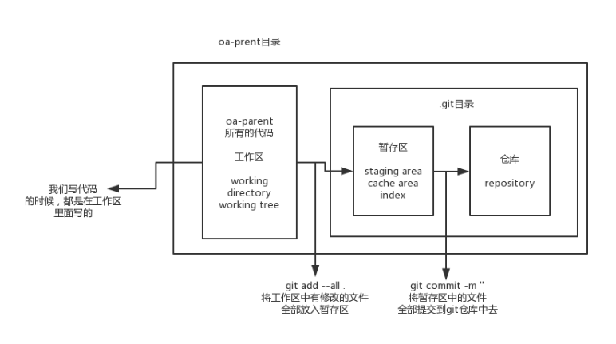

## 4.2 git相关机制

（1）**快照机制**：每次提交文件，都是保存一份这个文件当前这个状态的一个完整快照，同时对这次提交维护一个指针，指向这个文件快照(而CVS，SVN等，是通过一开始提交一个原始文件，然后后面每次对文件进行修改之后再次提交，都维护这次提交对应的一个差异)

（2）**本地化操作**：大多数的git版本控制操作，只要在本地执行即可，所有的版本文件都在本地，因此操作是非常快速的。比如说通过git查看提交历史，比较历史文件的差异，都可以在本地完成，不需要通过服务器做任何事情

（3）**完整性保证**：git在存储任何文件之前，都会对其执行一个校验和，然后用校验和指向那个文件。

​	这是git内核保证的，这样我们是不可以手工修改git版本库中的任何文件的，因为修改了文件之后，会导致计算出来的校验和与之前保存的校验和不匹配，文件会破损。

​	git用的是**SHA-1** hash算法来计算校验和，这是一个40位的字符串，基于文件的内容计算出来的，看起来大概是这样的：

​	24b9da6552252987aa493b52f8696cd6d3b00373

​	如果手动破坏.git中存储的文件的内容，git会不承认，因为内容变化之后，会导致内容计算出来的SHA-1 40位的hash值变化，跟之前存储的hash值不同，就认为文件破损

（4）**仅仅添加数据**：基本是向仓库(repository)添加数据，基本不会丢失。

## 4.2 git文件状态

**通过git status查看文件状态**

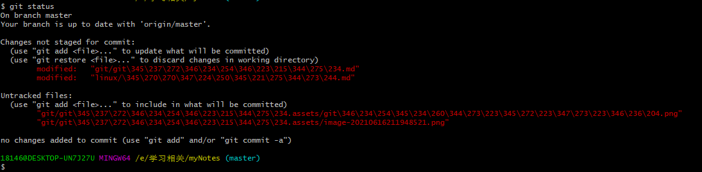

**PS:git默认中文展示会乱码(下图是配置展示中文设置后)**

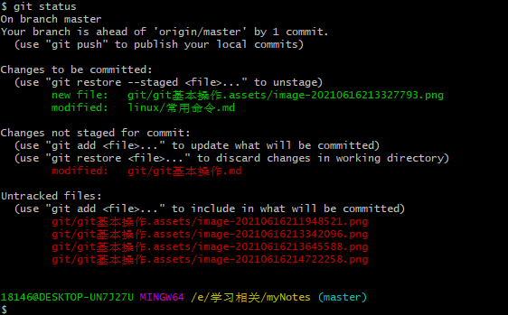

**PS:绿色就是已经add(暂存区/staged),红色就是没有add(工作区)**

**代码文件分成两种，一种是tracked，一种是untracked**。tracked文件就是已经提交到git版本库中的文件，后面可以处于modified或者staged状态；untracked文件，就是从来没有提交到git版本库的代码文件（也从来没有放入暂存区）。

**git管理的文件有三种状态：提交状态（committed），修改状态（modified），暂存状态（staged）。**

提交状态：我们的文件已经安全的保存在git的本地数据库中了。

修改状态：我们修改了文件，但是还没有提交到git的数据库中去。

暂存状态：将修改后的文件标记为即将通过下一次提交，保存到git数据库中去。

（1）新文件刚创建：untracked，此时仅仅停留在工作区中

（2）git add 新文件：new file，此时已经被追踪了，放入了暂存区中 => staged

（3）git commit 新文件：committed，已经被追踪了，放入了git仓库中 => committed

（4）修改那个文件：modified，changes not staged to be committed，没有加入暂存区，被修改的内容仅仅停留在工作区中 => modified

（5）git add 修改文件：modified，changes to be committed，修改的文件版本被已经加入暂存区 => staged

（6）git commit 修改文件：committed，修改后的新版本提交到了git仓库中 => committed

​	一般自己创建的版本库，刚开始文件都是untracked，然后git add和git commit命令执行之后，就被提交了第一个版本到git版本库，此时就全部都是tracked了。如果是从远程版本库克隆下来的，那么刚开始就是tracked。

​	接着对tracked的文件修改之后，就是modified；然后对modified文件再执行git add命令之后，就是staged，进入了暂存区；接着执行git commit命令之后，就将暂存区中的文件都提交到了版本库中，此时就是unmodified，and tracked。

**PS:在对文件修改没有add的情况对文件来说就是modified状态在回到工作区，add后才是modfied状态在暂存区。**

**PS:必须git add到暂存区里的修改，才会被git commit时提交到仓库里，否则就是停留在工作区中**


