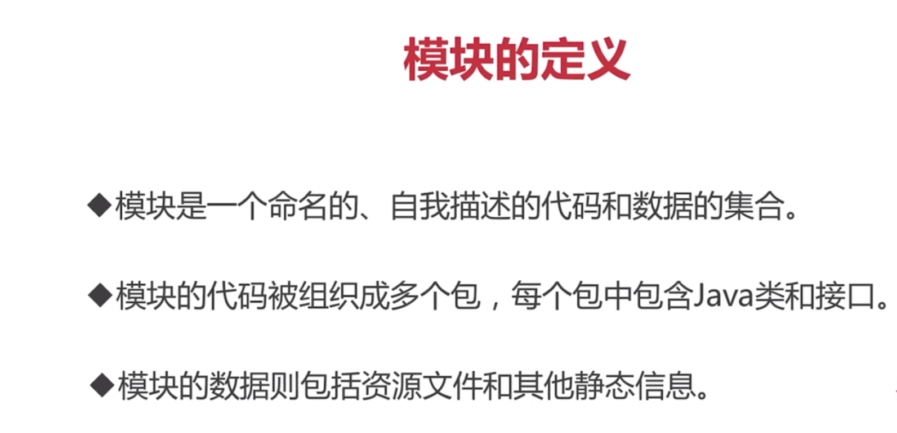
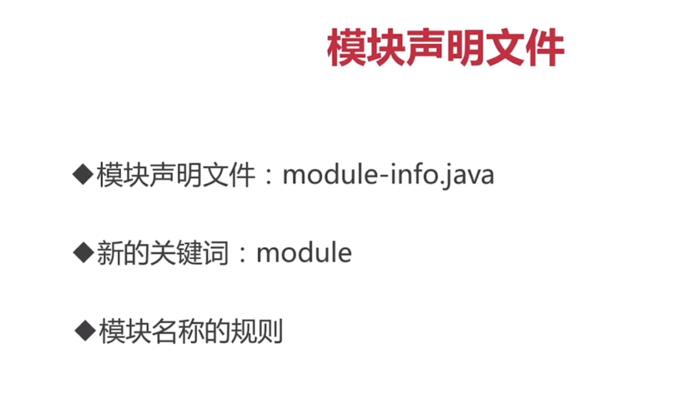
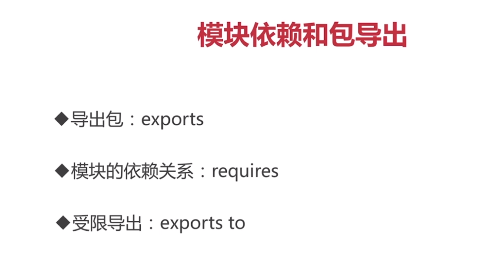

### 1 模块的定义

### 2 模块具体使用

module-info.java文件

模块名称必须是唯一的，一般使用包名的命名方式。xx.xx

module来声明

exports来指定导出的包 例:com.go.jvm

requires是引入其他模块。c.C就是对应的module-info文件名

transitive意为传递的意思，其他模块也能通过导入b.B来使用c.C模块。

#### 2.1提供者机制

 Java允许使用服务提供者和服务使用者分离的服务提供者机制。 JDK 9允许使用语句（uses statement）和提供语句（provides statement）实现其服务。使用语句可以指定服务接口的名字，当前模块就会发现它，使用 java.util.ServiceLoader类进行加载。代码请参考前面的例子，注意:provider提供的类必须在同一个模块下，当前不能引用其他模块的实现，比如说：前面的例子StudentServiceImpl只能存在student.service模块下，student.service模块provider其他的模块下的接口实现是不允许的。

provides..with （pr..接口 with 实现类） 对外提供对应实现

uses 使用对应接口/实现类

ServiceLoader 

通过load方法加载对应service的实现，返回对应实现类的流集合。

