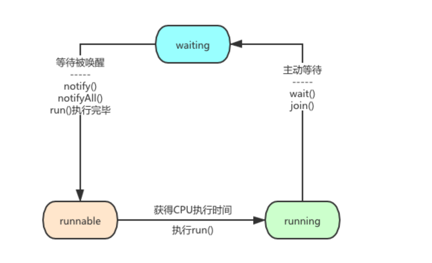

# 1 解决并发问题的常见方法

解决并发问题的常见方法/不会产生并发问题的情况


局部变量，不可变对象就是不会产生并发问题。

ThreadLocal、cas原子类就是解决并发问题的方式之一。

**并发问题的方法分为两大类:无锁和有锁。**

**无锁:局部变量、不可变对象、ThreadLocal、CAS原子类;**

**有锁：synchronized关键字、ReentrantLock可重入锁。**

**局部变量：**局部变量是在对应线程的工作内存中，多线程并不会互相影响。对于栈中的栈帧，方法中的局部变量是存在栈帧里的，栈内存是不共享的。

**不可变对象：**String就是不可变对象，比如 String s = "hello"，"hello"就是不可变的，并不是指向"hello"的s。"hello"+"world"形成

"helloworld"这里"helloworld"是新的字符串(不可变对象)，原来的两个字符串并没有改变.

**ThreadLocal：** 每个线程的ThreadLocal的值都是独立的副本，互相不干扰。

**CAS:**可以多个线程同时执行(**多个线程可以同时执行就是"无锁"，虽然cas是基于"乐观锁"**)，比较并置换思想(compare and swap)。是基于内存地址B、旧的预期值A、要修改的新值B，当内存地址和旧的预期值相等时才会将内存地址V改为新值B。若失败则进入while死循环挂起，直到操作成功。(对应的比较替换方法是基于c++的native方法实现的，可以保证原子性)

**synchronized/ReentrantLock:**都是基于悲观锁的，一个是通过语言层面实现的，一个是基于代码实现的。这里就放在一起分析。

```java

private ReentrantLock reentrantLock = new ReentrantLock();

private int i = 0;

private void addReen(){
    try{
        reentrantLock.lock();
    	i++;
    }finally{
        reetrantLock.unlock();
    }
}

private synchronized void addSynchronized(){
    	i++;
}

```

这里 i++的主要分为3个步骤

1 从主内存读取 i 的值

2 将 i 的值加1

3 将结果再写入主内存

这上面三个操作都可以通过加锁(synchronized/ReentrantLock)来保证原子性的，要不3个一起执行，要不都不执行。

加锁原理如图所示：


# 2 不可变类

## 2.1 如何快速设计一个不可变类

通过不可变类来避免线程安全问题

样例，车辆一个定位功能，实时更新x,y坐标

```java
//正常类
public class Location {

    private double x;

    private double y;

    public Location(double x, double y) {
        this.x = x;
        this.y = y;
    }
	
    //更新坐标
    public void setXY(double x, double y){
        this.x = x;
        this.y = y;
    }
}

//不可变类
public final class LocationFinal {

    private final double x;

    private final double y;

    public LocationFinal(double x, double y) {
        this.x = x;
        this.y = y;
    }

}
```

不可变类/正常类区别

```java
public class CarLocatTracker {

    private Map<String,Location> locationMap = new HashMap<>();

    private Map<String,LocationFinal> locationFinalMap = new HashMap<>();

    //正常类更新坐标
    private void updateCarLocation(String code,double x,double y){
        locationMap.get(code).setXY(x,y);
    }

    //不可变类更新坐标
    //不可变类直接替换整个类，线程安全
    private void updateCarLocationFinal(String code,LocationFinal locationFinal){
        locationFinalMap.put(code,locationFinal);
    }

}
```

**在多线程环境下，非不可变类更新坐标，如图所示：**


**如上图所示，线程2就获取到了一个错误的信息，x为更新后,y为没更新的值，这是一个车辆没有到达过得位置**


通过上面的例子，我们大概了解了使用可变的类会引发什么样问题，以及如何将一个类改造成**不可变类，来解决线程安全问题**。最后我们总结一下实现不可变类的一些思路:

1.使用final关键字修饰所有成员变量，避免其被修改，也可以保证多线程环境下被final关键字修饰的变量所引用的对象的初始化安全，即final修饰的字段在其他线程可见时，必定是初始化完成的。

⒉使用private修饰所有成员变量，可以防止子类及其他地方通过引用直接修改变量值。

3.禁止提供修改内部状态的公开接口(比如我们前面例子中的setXY方法)

4.禁止不可变类被外部继承，防止子类改变其定义的方法的行为。

5.如果类中存在数组或集合，在提供给外部访问之前需要做防御性复制

前面4点比较好理解，我们在前面改造Location为不可变类的过程中都有运用到，第5点则需要另外做一下说明

**PS:不可变类避免线程安全问题的主要思想就是在初始化后(构造方法初始化数据)整个类的数据都不可改变，多线程访问的话要不就是整个类替换。就不会有线程安全问题**

```java
//防御性复制
public class DefensiveReplicaDemo {

    private final List<Integer> data = new ArrayList<>();

    private final List<Integer> dataFinal = new ArrayList<>();

    public DefensiveReplicaDemo() {
        data.add(1);
        data.add(2);
        data.add(3);
        dataFinal.add(1);
        dataFinal.add(2);
        dataFinal.add(3);
    }

    public List<Integer> getData() {
        return data;
    }

    /**
     * 防御性复制，如果修改这个集合就会抛出异常
     * @return
     */
    public  List<Integer> getDataFinal() {
        return Collections.unmodifiableList(new ArrayList<>(dataFinal));
    }

    public static void main(String[] args) {
        DefensiveReplicaDemo defensiveReplicaDemo = new DefensiveReplicaDemo();
        List<Integer> data = defensiveReplicaDemo.getData();
        List<Integer> dataFinal = defensiveReplicaDemo.getDataFinal();
        //这里的data没有进行防御性复制，就算设置了final还是可以修改List的数据
        data.add(4);
        System.out.println(defensiveReplicaDemo.getData());
        //这个add方法会抛出异常
        //该list为只读，任何修改都会抛出异常
        dataFinal.add(4);
        System.out.println(defensiveReplicaDemo.getDataFinal());
    }
}
```

样例：短信网关系统基于不可变类解决线程安全问题

https://apppukyptrl1086.pc.xiaoe-tech.com/detail/i_60b316f0e4b0017651a0355e/1?from=p_60ab6413e4b07e4d7fd8458a&type=6

## 2.2 等效不可变对象

​	等效不可变对象在在源码中的应用,主要是围绕CopyOnWriteArrayList的原理来展开，**CopyOnWriteArrayList的源码中运用了不可变对象模式，使得集合在进行遍历操作的时候，不用加锁也能保证线程安全。**

```java
public class CopyOnWriteArrayList<E>
    implements List<E>, RandomAccess, Cloneable, java.io.Serializable {
    private static final long serialVersionUID = 8673264195747942595L;

    /** The lock protecting all mutators */
    final transient ReentrantLock lock = new ReentrantLock();

    /** The array, accessed only via getArray/setArray. */
    //主要就是维护了一个array数组
    private transient volatile Object[] array;

    /**
     * Gets the array.  Non-private so as to also be accessible
     * from CopyOnWriteArraySet class.
     */
    //获取数组
    final Object[] getArray() {
        return array;
    }

    /**
     * Sets the array.
     */
    //覆盖数组
    final void setArray(Object[] a) {
        array = a;
    }
.....................................    
}
```

接下来看看CopyOnWriteArrayList在进行数据遍历/获取数据 和新增一个元素的方法：

```java
public class CopyOnWriteArrayList<E>
    implements List<E>, RandomAccess, Cloneable, java.io.Serializable 
    //返回内部维护的数组
	final Object[] getArray() {
        return array;
    }    

	//根据下标获取数组数据
	public E get(int index) {
        return get(getArray(), index);
    }
    
	//根据数组迭代数据遍历
    public Iterator<E> iterator() {
        return new COWIterator<E>(getArray(), 0);
    }

    public boolean add(E e) {
        final ReentrantLock lock = this.lock;
        lock.lock();
        try {
            //获取旧数组
            Object[] elements = getArray();
            int len = elements.length;
            //根据旧数组的值，生成新数组
            Object[] newElements = Arrays.copyOf(elements, len + 1);
            newElements[len] = e;
            //新数组覆盖，引用变为新数组了
            setArray(newElements);
            return true;
        } finally {
            lock.unlock();
        }
    }

```

​	在array对象每次被创建之后，其内容就不再被改变。（数组的长度和每个元素都不变）。另外就算我们对**CopyOnWriteArrayList进行集合元素的增删，这里也不是直接改变原数组的元素，而是直接新建了一个新的数组，替换掉array对象。在这个时候，旧的那个数组还是没有改变过。**

**PS:remove删除元素也是改变引用，新数组替换旧数组**

​	但是这里会存在一些差异，因为实例变量**array本质上是一个数组，而数组的各个元素都是一个对象，每个对象内部的状态是可以替换的(就是数组中的对象熟悉可以替换/改变)**。因此**实例变量并非严格意义上的不可变对象，所以我们称之为等效不可变对象**。

多线程读写数据如图所示


​	假设线程1在遍历元素的时候，读到了元素1，但是还没有读到元素2的时候，线程2添加了元素3，这个时候线程1是无法读取到元素3的。这是因为线程1和线程2操作的数组不是同一个数组。 **这也是CopyOnWriteArrayList的一个特点：弱一致性。意思就是说线程1看到的是某一时刻的一份“快照数据”，无法保证能读取到最新的数据**

**使用场景：**

​	JDBC驱动程序列表这种数据，因为驱动程序变更的情况比较少，但是遍历这个驱动程序列表的情况比较多，所以是符合读多写少的特性，所以这个使用CopyOnWriteArrayList来维护比较合适。

```java
package java.sql;

public class DriverManager {
....................

    // List of registered JDBC drivers
    //registerDrivers就是用来保存不同的数据库驱动的,注册数据库驱动就保存再这里
    private final static CopyOnWriteArrayList<DriverInfo> registeredDrivers = new CopyOnWriteArrayList<>();
    private static volatile int loginTimeout = 0;
    private static volatile java.io.PrintWriter logWriter = null;
    private static volatile java.io.PrintStream logStream = null;
    // Used in println() to synchronize logWriter
    private final static  Object logSync = new Object();

    /* Prevent the DriverManager class from being instantiated. */
    private DriverManager(){}
    
}
```

# 3 Thread线程状态

线程状态流转图


下面是JDK源码：src/main/java/java/lang/Thread.java 中 线程状态State枚举 代码：

**PS:java线程状态只有6种状态，其中RUNNABLE状态对应RUNNING和READY两个状态(RUNNING和READY为OS的状态)**

```java
public enum State {  
    NEW,    RUNNABLE,    BLOCKED,    WAITING, 
    TIMED_WAITING,    TERMINATED;
}
```

**1、NEW（初始化状态）** 

实现Runnable接口和继承Thread可以得到一个线程类，new一个实例出来，线程就进入了初始化状态。

实现Runnable接口和继承Thread可以得到一个线程类，创建这个类的实例对象，就是NEW状态；

​	而NEW状态的线程是不会被操作系统调度，因此也不会被执行。所以**，当这个线程要执行时，就必须调用这个对象的start()方法，将NEW 状态转换到 RUNNABLE 状态**。


**2、RUNNABLE（就绪，运行中状态）** 

**READY 就绪**

1. 就绪状态只是说你自个儿运行，调度程序没有挑选到你，你就永远是就绪状态。
2. 调用线程的start()方法，此线程进入就绪状态。
3. 当前线程sleep()方法结束，其他线程join()结束，等待用户输入完毕，某个线程拿到对象锁，这些线程也将进入就绪状态。
4. 当前线程时间片用完了，调用当前线程的yield()方法，当前线程进入就绪状态。
5. 锁池里的线程拿到对象锁后，进入就绪状态。

**RUNNING 运行中状态**

​	线程调度程序从可运行池中选择一个线程作为当前线程时线程所处的状态。这也是线程进入运行状态的唯一一种方式。

**3、BLOCKED（阻塞状态）** 

​	**阻塞状态是线程阻塞在进入synchronized关键字修饰的方法或代码块(获取锁)之前时的状态。**

​	我们知道，被synchronized 关键字修饰的方法、代码块在同一时刻只允许一个线程执行，其他线程只能等待。

​	所以，这种情况下，等待的线程就会从 RUNNABLE 转换到 BLOCKED 状态。


**4、WAITING（等待状态）** 



​	调用sleep或是wait方法后线程处于WAITING状态，等待被唤醒。

有3种场景会触发线程从RUNNABLE向WAITING 转换:

​	**1 Thread.join方法**，例如有一个线程对象 thread A，当调用 A.join() 的时候，执行这条语句的线程会等待 thread A 执行完，而等待中的这个线程，其状态会从 RUNNABLE 转换到 WAITING。当线程 thread A 执行完，原来等待它的线程又会从 WAITING 状态转换到 RUNNABLE(**被调用线程join，调用线程就WAITING了**)。

​	**2  Object.wait() 方法**，该方法只能获取了synchronized 锁时才能使用，否则会抛出异常

​	3 **最后一种，调用 LockSupport.park() 方法。Java 并发包中的锁，都是基于LockSupport 对象实现的**。调用 LockSupport.park() 方法，当前线程会阻塞，线程的状态会从 RUNNABLE 转换到 WAITING。调用 LockSupport.unpark(Thread thread) 方法，可唤醒目标线程，目标线程的状态又会从 WAITING 状态转换到 RUNNABLE。

**5、TIMED_WAITING（等待超时状态）** 


​	**调用sleep或是wait方法后线程处于TIMED_WAITING状态，等待被唤醒或时间超时自动唤醒。**

​	TIMED_WAITING 和 WAITING 状态的区别，仅仅是触发条件多了超时参数(join,wait,parkNanos等方法可以设置超时参数)。

1. 调用带超时参数的 Thread.sleep(long millis) 方法；
2. 获得 synchronized 隐式锁的线程，调用带超时参数的 Object.wait(long timeout) 方法；
3. 调用带超时参数的 Thread.join(long millis) 方法；
4. 调用带超时参数的 LockSupport.parkNanos(Object blocker, long deadline) 方法；
5. 调用带超时参数的 LockSupport.parkUntil(long deadline) 方法。

**6、TERMINATED（终止状态）** 


​	1 当线程的run()方法完成时，或者主线程的main()方法完成时，我们就认为它终止了。这个线程对象也许是活的，但是，它已经不是一个单独执行的线程。线程一旦终止了，就不能复生。

​	2 在一个终止的线程上调用start()方法，会抛出java.lang.IllegalThreadStateException异常。

​	**3 线程执行完 run() 方法后，会自动转换到 TERMINATED 状态，当然如果执行 run() 方法的时候异常抛出，也会导致线程终止。**

​	4 如果需要强制中断 run() 方法的执行，则调用 interrupt() 方法。interrupt() 方法仅仅是通知线程，让线程有机会执行一些后续操作，同时也可以无视这个通知


引用：https://www.cnblogs.com/codeclock/p/13803898.html

引用：https://www.cnblogs.com/javastack/archive/2020/05/09/12858059.html

引用：https://www.cnblogs.com/huangzejun/p/7908898.html

**PS:这里仅仅是分析对应状态转换，状态说明，对应方法具体实现及相关扩展则不展开了**

# 4 百万交易系统

## 4.1 循环等待/死锁

**场景：**

​	在很多互联网公司的交易系统中，会出现这种场景，【账户A】转账给【账户B】，同时【账户B】也转账给【账户A】，两个账户都需要锁住余额，所以通常会申请两把锁。转账时，先锁住自己的账户，并获取对方的锁，保证同一时刻只能由一个线程去执行转账。

​	这时可能就会出现，对方给我转账，同时我也给对方转账，那么双方都持有自己的锁，且尝试去获取对方的锁，这就造成可能一直申请不到对方的锁，循环等待发生“死锁”的问题！

​	试想在互联网支付盛行的当下，如果系统中出现线程循环等待的情况，用户体验肯定是极差的。

**什么是死锁：**

​	“死锁” 是两个或两个以上的线程在执行过程中，互相持有对方所需要的资源，导致这些线程处于等待状态，无法继续执行。若无外力作用，它们都将无法推进下去，就进入了“永久”阻塞的状态。


线程01和线程02都在等待对方持有的锁，且会无限期的等待下去，这就是我们所说的“死锁”了！


产生死锁代码示例

```java
	//业务1
	public void run() {
        try {
            System.out.println("Lock2 running");
            while (true) {
                //线程a执行业务1
                //业务1持有obj2，等待获取obj1
                synchronized (DeadLock.obj2) {
                    System.out.println("Lock2 lock obj2");
                    Thread.sleep(3000);
                    synchronized (DeadLock.obj1) {
                        System.out.println("Lock2 lock obj1");
                    }
                }
            }
        } catch (Exception e) {
            e.printStackTrace();
        }
    }
    //业务2
     public void run() {
        try {
            System.out.println("Lock1 running");
            while (true) {
                //线程b执行业务2
                 //业务2持有obj1，等待获取obj2
                synchronized (DeadLock.obj1) {
                    System.out.println("Lock1 lock obj1");
                    Thread.sleep(3000);
                    synchronized (DeadLock.obj2) {
                        System.out.println("Lock1 lock obj2");
                    }
                }
            }
        } catch (Exception e) {
            e.printStackTrace();
        }
    }
```

**死锁的发生必须具备以下四个必要条件：**

​	**1 互斥，**共享资源 X 和 Y 只能被一个线程占用；

​	**2 占有且等待，**线程01 已经取得共享资源 X，在等待共享资源 Y 的时候，不释放共享资源 X；

​	**3 不可抢占，**其他线程不能强行抢占线程01 占有的资源；

​	**4 循环等待，**线程01 等待线程02 占有的资源，线程02 等待线程01 占有的资源，就是循环等待。

**如何避免死锁**

应用程序一旦发生死锁，并没有什么特别好的办法解决，通常情况下，我们只能重启系统**。因此，解决死锁的最好的办法就是避免死锁。**

**1、 破坏占用且等待条件**

```java

public class Account {

    private Allocator actr = DeadLock02.getInstance();
    private int balance;
    void transfer(Account target, int amt){
        //这个while是自循环，跳出while循环才会执行后续的try代码
        //利用Allocator.apply一次性申请所有资源(两个对象)，其中一个线程执行了actr.apply之后，下一个线程actr.apply就会在while循环中自循环，直到上一个线程执行完毕clean为止
        while(!actr.apply(this, target));
        //交易系统，交易逻辑
            try{
                synchronized(this){
                    System.out.println(this.toString()+" lock obj1");
                    synchronized(target){
                        System.out.println(this.toString()+" lock obj2");
                        if (this.balance > amt){
                            this.balance -= amt;
                            target.balance += amt;
                        }
                    }
                }
            } finally {
                //执行完后，再释放持有的资源
                actr.clean(this, target);
            }
    }

}
```

利用Allocator一次性获取资源，用代码限制

```java
public class Allocator {

    private List<Object> als = new ArrayList<Object>();

    // 一次性申请所有资源
    //同步方法限制资源申请，如果a线程申请到了资源，list存储了所有资源，则B线程必然返回false
    synchronized boolean apply(Object from, Object to){
        if(als.contains(from) || als.contains(to)){
            return false;
        } else {
            als.add(from);
            als.add(to);
        }
        return true;
    }
    
    //同步方法释放资源，清空list，下一次apply就返回true了
    synchronized void clean(Object from, Object to){
        als.remove(from);
        als.remove(to);
    }
}
```

测试

```java
public class DeadLock02 {


    private static class SingleTonHoler{
        private static Allocator INSTANCE = new Allocator();
    }

    public static Allocator getInstance(){
        return SingleTonHoler.INSTANCE;
    }

    public static void main(String[] args) {
        Account a = new Account();
        Account b = new Account();
        a.transfer(b,100);
        b.transfer(a,200);
    }
}
```

**2、 破坏不可抢占条件**

​	破坏不抢占条件，需要发生死锁的线程能够主动释放它占有的资源，但使用synchronized是做不到的。原因为synchronized申请不到资源时，线程直接进入了阻塞状态，而线程进入了阻塞状态也就没有办法释放它占有的资源了。

​	显式使用**Lock类中的定时tryLock功能来代替内置锁机制**，可以检测死锁和从死锁中恢复过来。使用内置锁的线程获取不到锁会被阻塞，而显式锁可以指定一个超时时限（Timeout），在等待超过该时间后tryLock就会返回一个失败信息，也会释放其拥有的资源

```java
ReentrantLock lock1 = new ReentrantLock();
lock1.tryLock(1, TimeUnit.MILLISECONDS)
```

**3、破坏循环等待条件**

​	破坏这个条件，只需要对系统中的资源进行统一编号，进程可在任何时刻提出资源申请，必须按照资源的编号顺序提出。这样做就能保证系统不出现死锁。这就是“资源有序分配法”。

```java
class Account {
    private int id;
    private int balance;
    void transfer(Account target, int amt){
        Account left = this;
        Account right = target;
        //调整顺序
        if (this.id > target.id) {
            left = target;
            right = this;
        }
    	//相互转账的情况，因为已经进行了排序，所以必然left都为同一个，left结束了，下一个线程才会执行
        synchronized(left){
            synchronized(right){
                if (this.balance > amt){
                    this.balance -= amt;
                    target.balance += amt;
                }
            }
        }
    }
}
```


## 4.2 Guarded Suspension(保护性暂挂模式/等待-通知)

