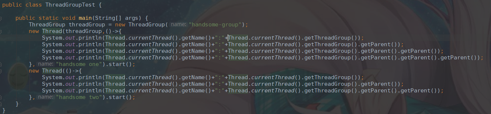
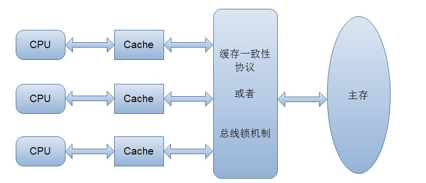

# 1 以注册中心为样例的demo

## 1.1 并发编程概述

**多线程并发编程**

​	一个jvm进程里，你除了人家默认给你开启的这个main线程，你还可以在main线程里开启别的线程，比如说上面，你可以通过Thread类开启别的线程，别的线程是跟main线程同时在运行的

​	没有先后顺序，多线程并发运行的时候，本质是CPU在执行各个线程的代码，一个CPU会有一个时间片算法，他一会儿执行main线程，一会儿执行Thread线程，看起来两个线程好像是在同时运行一样

​	只不过CPU执行每个线程的时间特别短，可能执行一次就几毫秒，几微妙，你是感觉不出来的，看起来好像是多个线程并发在运行一样

**什么是并发编程**

​	一句话：用多线程来编程，实现复杂的系统功能，让多个线程同时运行，干各种事情，最终完成一套复杂系统需要干的所有的事儿

​	1、控制多线程实现系统功能

​	2、Java内存模型以及volatile关键字

​	3、线程同步以及通信

​	4、锁优化

​	5、并发编程设计模式：基于多线程实现复杂系统架构

​	6、并发包以及线程池

​	7、案例、还是案例、大量的案例（脱胎于真实的复杂分布式系统）

## 1.2 注册中心实现概览


## 1.3 以工作线程模式开启微服务的注册和心跳线程

### 1.3.1 常见的几种线程启动方式

Thread 	Runnable 	Callable

```java
new Thread() {

public void run() {

}

}.start();

public class MyThread extends Thread {

public void run() {

}

}

new MyThread().start();

new Thread(new Runnable() {

public void run() {

}

}).start();

public class MyRunnable implements Runnable {

public void run() {

}

}

new Thread(new MyRunnable()).start();
```


### 1.3.2 相关工程概述

两个工程

（1）register-server：负责接收各个服务的请求

​	是可以独立部署和启动的，启动了以后，他会以一个web工程的方式来启动，启动之后就是监听各个服务发送过来的http请求，注册、心跳、下线

​	我们到时候就可以认为是有一个main方法直接运行就启动也可以，现在很流行的spring boot，你直接运行main，人家就给你启动一个web服务器，你在工程里，如果使用spring web mvc实现了一个controller接口，就可以接受请求了

（2）register-client：组件，依赖包，各个服务需要引入这个依赖，在服务启动的时候就可以去让register-client来运行，来跟register-server进行通信，比如说完成这个注册，或者是心跳的通知

​	他不是独立启动的，他其实是一个依赖包，你可以把这个东西打包发布到maven nexus私服里去，你的公司里各个服务，必须依赖这个register-client，然后启动服务的时候，一般会调用regsiter-client的API，创建一个组件，启动这个组件

​	由rgister-client组件去跟register-server进行交互

（3）spring cloud eureka

​	人家Spring Cloud的微服务注册中心，eureka，大概就是这个意思，人家也是分eureka-server，是独立部署和启动的，就是一个web工程；eureka-client，各个服务都需要依赖eureka-client，服务启动就创建一个eureka-client实例；eureka-client帮各个服务跟eureka-server进行通信，注册、心跳、下线

（4）工作线程

​	我们启动了一个jvm进程，main线程，RegisterClientWorker线程

​	main线程负责启动了RegisterClientWorker线程，其实干完这些事情以后，main线程就结束了，结束了以后但是jvm进程不会退出？为什么呢，有一个工作线程，就是RegisterClientWorker线程一直在运行

​	**所以jvm进程是不会退出的，会一直存在**

​	**只要有工作线程一直在运行，没有结束，那么jvm进程是不会退出的**

**核心demo代码：**

模拟注册及心跳逻辑

```java
public class RegisterClientWorker extends Thread 
..............................
		if(!finishedRegister) {
			// 应该是获取当前机器的信息
			// 包括当前机器的ip地址、hostname，以及你配置这个服务监听的端口号
			// 从配置文件里可以拿到
			RegisterRequest registerRequest = new RegisterRequest();
			registerRequest.setServiceName(SERVICE_NAME);
			registerRequest.setIp(IP); 
			registerRequest.setHostname(HOSTNAME);
			registerRequest.setPort(PORT);  
			registerRequest.setServiceInstanceId(serviceInstanceId);    
			
			RegisterResponse registerResponse = httpSender.register(registerRequest);
			
			System.out.println("服务注册的结果是：" + registerResponse.getStatus() + "......");   
			
			// 如果说注册成功的话
			if(RegisterResponse.SUCCESS.equals(registerResponse.getStatus())) {
				this.finishedRegister = true;
			} else {
				return;
			}
		}
		
		// 如果说注册成功了，就进入while true死循环
		if(finishedRegister) {
			HeartbeatRequest heartbeatRequest = new HeartbeatRequest();
			heartbeatRequest.setServiceInstanceId(serviceInstanceId);
			HeartbeatResponse heartbeatResponse = null;
			
			while(true) {
				try {
					heartbeatResponse = httpSender.heartbeat(heartbeatRequest);
					System.out.println("心跳的结果为：" + heartbeatResponse.getStatus() + "......");
					Thread.sleep(30 * 1000); 
				} catch (Exception e) {  
					e.printStackTrace();
				}
			}
		}
 	
```

## 1.4 微服务注册中心的服务注册功能实现

register-server 工程 服务注册相关核心逻辑

```java
	/**
	 * 核心的内存数据结构：注册表
	 * 
	 * Map：key是服务名称，value是这个服务的所有的服务实例
	 * Map<String, ServiceInstance>：key是服务实例id，value是服务实例的信息
	 * 
	 */
	private Map<String, Map<String, ServiceInstance>> registry = 
			new HashMap<String, Map<String, ServiceInstance>>();
	
	/**
	 * 服务注册
	 * @param serviceInstance 服务实例
	 */
	public void register(ServiceInstance serviceInstance) {
		Map<String, ServiceInstance> serviceInstanceMap = 
				registry.get(serviceInstance.getServiceName());
		
		if(serviceInstanceMap == null) {
			serviceInstanceMap = new HashMap<String, ServiceInstance>();
			registry.put(serviceInstance.getServiceName(), serviceInstanceMap);
		}
		
		serviceInstanceMap.put(serviceInstance.getServiceInstanceId(), 
				serviceInstance);
		
		System.out.println("服务实例【" + serviceInstance + "】，完成注册......");  
		System.out.println("注册表：" + registry); 
	}
```


## 1.5 微服务注册中心的心跳续约功能实现

register-server 工程 心跳续约相关核心逻辑

```java
		/**
		 * 最近一次心跳的时间
		 */
		private Long latestHeartbeatTime = System.currentTimeMillis();

		/**
		 * 续约，你只要发送一次心跳，就相当于把register-client和register-server之间维护的一个契约
		 * 进行了续约，我还存活着，我们俩的契约可以维持着
		 * @param latestHeartbeatTime
		 */
		public void renew() {
			this.latestHeartbeatTime = System.currentTimeMillis(); 
			System.out.println("服务实例【" + serviceInstanceId + "】，进行续约：" + latestHeartbeatTime);  
		}
		
		/**
		 * 判断当前服务实例的契约是否还存活
		 * @return
		 */
		public Boolean isAlive() {
			Long currentTime = System.currentTimeMillis();
			if(currentTime - latestHeartbeatTime > NOT_ALIVE_PERIOD) {
				System.out.println("服务实例【" + serviceInstanceId + "】，不再存活");
				return false;
			}
			System.out.println("服务实例【" + serviceInstanceId + "】，保持存活");
			return true;
		}
```


## 1.6 微服务存活状态监控线程的实现

register-server 工程 监控线程相关核心逻辑

```java
		private Registry registry = Registry.getInstance();
		
		@Override
		public void run() {
			Map<String, Map<String, ServiceInstance>> registryMap = null;
			
			while(true) {
				try {
					registryMap = registry.getRegistry();
					
					for(String serviceName : registryMap.keySet()) {
						Map<String, ServiceInstance> serviceInstanceMap = 
								registryMap.get(serviceName);
						
						for(ServiceInstance serviceInstance : serviceInstanceMap.values()) {
							// 说明服务实例距离上一次发送心跳已经超过90秒了
							// 认为这个服务就死了
							// 从注册表中摘除这个服务实例
							if(!serviceInstance.isAlive()) {
								registry.remove(serviceName, serviceInstance.getServiceInstanceId()); 
							}
						}
					}
					
					Thread.sleep(CHECK_ALIVE_INTERVAL);
				} catch (Exception e) {
					e.printStackTrace();
				}
			}
		}
```


## 1.7 以daemon模式运行微服务存活状态监控线程

register-server 工程 监控线程相关核心逻辑

​	假如说微服务注册中心负责接收请求的核心工作线程不知道为啥都停止了，那么说明这个微服务注册中心必须停止啊，结果你的那个监控微服务存活状态的线程一直在那儿运行着，卡着，会导致微服务注册中心没法退出的！因为jvm进程没法结束

所以说针对这种情况，一般会将后台运行的线程设置为daemon线程

```java
	/**
	 * 负责监控微服务存活状态的后台线程
	 */
	private Daemon daemon = new Daemon();
	
	/**
	 * 启动后台线程
	 */
	public void start() {
		daemon.setDaemon(true);
		daemon.start();
	}
```

**在Java中有两类线程：用户线程 (User Thread)、守护线程 (Daemon Thread)。**

​	所谓守护 线程，是指在程序运行的时候在后台提供一种通用服务的线程，比如垃圾回收线程就是一个很称职的守护者，并且这种线程并不属于程序中不可或缺的部分。因 此，当所有的非守护线程结束时，程序也就终止了，同时会杀死进程中的所有守护线程。反过来说，只要任何非守护线程还在运行，程序就不会终止。

​	**用户线程和守护线程两者几乎没有区别，唯一的不同之处就在于虚拟机的离开：如果用户线程已经全部退出运行了，只剩下守护线程存在了，虚拟机也就退出了。 因为没有了被守护者，守护线程也就没有工作可做了，也就没有继续运行程序的必要了。**

**将线程转换为守护线程可以通过调用Thread对象的setDaemon(true)方法来实现。在使用守护线程时需要注意一下几点：**

​	(1) thread.setDaemon(true)必须在thread.start()之前设置，否则会跑出一个IllegalThreadStateException异常。你不能把正在运行的常规线程设置为守护线程。 

​	(2) 在Daemon线程中产生的新线程也是Daemon的。

​	(3) 守护线程应该永远不去访问固有资源，如文件、数据库，因为它会在任何时候甚至在一个操作的中间发生中断。

引用：https://www.cnblogs.com/luochengor/archive/2011/08/11/2134818.html

# 2 Thread相关知识

## 2.1 ThreadGroup概念

**简介：**

​	ThreadGroup就是线程组，其实意思就是你可以把一堆线程加入一个线程组里

​	**java里，每个线程都有一个父线程的概念，就是在哪个线程里创建这个线程，那么他的父线程就是谁**

​	**然后每个线程都必然属于一个线程组，默认情况下，你要是创建一个线程没指定线程组，那么就会属于父线程的线程组了，main线程的线程组就是main ThreadGroup**

​	也可以手动创建一个线程组，将线程加入这个线程组中

**场景：**

​	举例来说，java都是通过main启动的，那么有一个主要的线程就是mian线程，在main线程里启动的线程，父线程就是main线程，就这么简单。

​	**为线程服务，用户通过使用线程组的概念批量管理线程，如批量停止或挂起等。**

**方法简介：**

```
enumerate()：复制线程组里的线程
activeCount()：获取线程组里活跃的线程
getName()、getParent()、list()，等等
interrupt()：打断所有的线程
destroy()：一次性destroy所有的线程
```

**代码实例：**



**输出结果：**


**总结：**

​	默认线程会加入父线程的ThreadGroup，或者你自己手动创建ThreadGroup，ThreadGroup也有父ThreadGroup，ThreadGroup可以包裹一大堆的线程，然后统一做一些操作，比如统一复制、停止、销毁

**PS:ThreadGrdoup很少用，其实如果你要自己封装一堆线程的管理组件，我觉得你完全可以自己写**

## 2.2 设置线程优先级

**概念：**

​	设置线程优先级，理论上可以让优先级高的线程先尽量多执行

​	**一般实践中很少弄这个东西，因为这是理论上的，可能你设置了优先级，人家cpu结果也还是没按照这个优先级来执行线程**

​	这个优先级一般是在1~10之间

​	**ThreadGroup也可以指定优先级，线程优先级不能大于ThreadGroup的优先级(这里ThreadGroup优先级是最大优先级，默认为10，也可以指定其他数字)**

​	一般就是用默认的优先级就ok了，默认他会用父线程的优先级，就是5

**对应方法及源码：**

```java
public
class Thread implements Runnable {
..................................
    /**
     * The minimum priority that a thread can have.
     */
    public final static int MIN_PRIORITY = 1;
..................................
    /**
     * The maximum priority that a thread can have.
     */
    public final static int MAX_PRIORITY = 10;
..................................
   public final void setPriority(int newPriority) {
        ThreadGroup g;
        checkAccess();
    	//优先级范围验证，不在1-10之间之间抛参数异常
        if (newPriority > MAX_PRIORITY || newPriority < MIN_PRIORITY) {
            throw new IllegalArgumentException();
        }
	    //线程组肯定有的，如果没有默认指定，就是父线程的线程组(父线程就是创建当前线程的线程)
        if((g = getThreadGroup()) != null) {
            if (newPriority > g.getMaxPriority()) {
                newPriority = g.getMaxPriority();
            }
            //设置优先级为当前传入优先级
            //这个是Thread的native方法，设置优先级
            setPriority0(priority = newPriority);
        }
    }
..................................
```

**代码示例：**

​	

结果表示..并没有什么用


## 2.3 Thread源码

### 2.3.1 初始化

```java
public
class Thread implements Runnable {
................
   //无参构造
   public Thread() {
    	//不指定线程名的话就自动生成，其中nextThreadNum为同步方法
        init(null, null, "Thread-" + nextThreadNum(), 0);
   }
   
    private void init(ThreadGroup g, Runnable target, String name,
                      long stackSize) {
        init(g, target, name, stackSize, null, true);
    }
    
    /**
     * Initializes a Thread.
     *
     * @param g the Thread group  线程组
     * @param target the object whose run() method gets called  Runnable实例对象
     * @param name the name of the new Thread  线程名
     * @param stackSize the desired stack size for the new thread, or
     *        zero to indicate that this parameter is to be ignored. 可以自定义指定线程栈长度
     * @param acc the AccessControlContext to inherit, or
     *            AccessController.getContext() if null 不知道干嘛的
     * @param inheritThreadLocals if {@code true}, inherit initial values for
     *            inheritable thread-locals from the constructing thread 不知道干嘛的，表面意思是继承ThreadLocal
     */
    private void init(ThreadGroup g, Runnable target, String name,
                      long stackSize, AccessControlContext acc,
                      boolean inheritThreadLocals) {
        //线程名不能为空，否则抛异常
        if (name == null) {
            throw new NullPointerException("name cannot be null");
        }
	
        this.name = name;
		//这里currentThread()指的就是创建改线程的线程，也就是父线程
        Thread parent = currentThread();
        SecurityManager security = System.getSecurityManager();
        //如果没有指定线程组，就为父线程的线程组
        if (g == null) {
            /* Determine if it's an applet or not */

            /* If there is a security manager, ask the security manager
               what to do. */
            if (security != null) {
                g = security.getThreadGroup();
            }

            /* If the security doesn't have a strong opinion of the matter
               use the parent thread group. */
            if (g == null) {
                g = parent.getThreadGroup();
            }
        }

        /* checkAccess regardless of whether or not threadgroup is
           explicitly passed in. */
        g.checkAccess();

        /*
         * Do we have the required permissions?
         */
        if (security != null) {
            if (isCCLOverridden(getClass())) {
                security.checkPermission(SUBCLASS_IMPLEMENTATION_PERMISSION);
            }
        }

        g.addUnstarted();

        this.group = g;
        //父线程为守护线程，则该线程也一样，反之亦然
        this.daemon = parent.isDaemon();
        //优先级和父线程一致
        this.priority = parent.getPriority();
        //类加载器与父线程一致
        if (security == null || isCCLOverridden(parent.getClass()))
            this.contextClassLoader = parent.getContextClassLoader();
        else
            this.contextClassLoader = parent.contextClassLoader;
        this.inheritedAccessControlContext =
                acc != null ? acc : AccessController.getContext();
        this.target = target;
        setPriority(priority);
        if (inheritThreadLocals && parent.inheritableThreadLocals != null)
            this.inheritableThreadLocals =
                ThreadLocal.createInheritedMap(parent.inheritableThreadLocals);
        /* Stash the specified stack size in case the VM cares */
        this.stackSize = stackSize;

        /* Set thread ID */
        //指定线程id，nextThreadID为同步方法，线程id为自增的
        tid = nextThreadID();
    }
....................
```

**总结：**

（1）创建你的线程，就是你的父线程

（2）如果你没有指定ThreadGroup，你的ThreadGroup就是父线程的ThreadGroup

（3）你的daemon状态默认是父线程的daemon状态

（4）你的优先级默认是父线程的优先级

（5）如果你没有指定线程的名称，那么默认就是Thread-0格式的名称

（6）你的线程id是全局递增的，从1开始

### 2.3.2 线程启动过程


```java
   
   public synchronized void start() {
        /**
         * This method is not invoked for the main method thread or "system"
         * group threads created/set up by the VM. Any new functionality added
         * to this method in the future may have to also be added to the VM.
         * threadStatus就是线程状态，NEW初始化状态就是0
         * 这里只有第一次调用start方法threadStatus才为0，threadStatus的值由本地方法native 底层jvm,c++去修改
         * 这里判断如果多次调用start直接抛出异常
         * A zero status value corresponds to state "NEW".
         */
        if (threadStatus != 0)
            throw new IllegalThreadStateException();

        /* Notify the group that this thread is about to be started
         * so that it can be added to the group's list of threads
         * and the group's unstarted count can be decremented. */
       //添加到线程组中
        group.add(this);
		
        boolean started = false;
        try {
            start0();
            started = true;
        } finally {
            try {
                //这里如果started还是false则进入if
                //说明start0的native本地方法抛出了异常
                if (!started) {
                    //通知线程组，线程启动失败
                    group.threadStartFailed(this);
                }
            } catch (Throwable ignore) {
                /* do nothing. If start0 threw a Throwable then
                  it will be passed up the call stack */
            }
        }
    }
```

**总结：**

（1）一旦启动了线程之后，就不能再重新启动了，多次调用start()方法，因为启动之后，threadStatus就是非0的状态了，此时就不能重新调用了

（2）你启动线程之后，这个线程就会加入之前处理好的那个线程组中

（3）启动一个线程实际上走的是native方法，start0()，会实际的启动一个线程

（4）一个线程启动之后就会执行run()方法

**PS:线程基本的状态转换参考 儒猿并发编程实战**

### 2.3.3 sleep

```java
    /**
     * Causes the currently executing thread to sleep (temporarily cease
     * execution) for the specified number of milliseconds, subject to
     * the precision and accuracy of system timers and schedulers. The thread
     * does not lose ownership of any monitors.
     * 可以指定线程睡眠多少毫秒
     * @param  millis
     *         the length of time to sleep in milliseconds
     *
     * @throws  IllegalArgumentException
     *          if the value of {@code millis} is negative
     *
     * @throws  InterruptedException
     *          if any thread has interrupted the current thread. The
     *          <i>interrupted status</i> of the current thread is
     *          cleared when this exception is thrown.
     */
    public static native void sleep(long millis) throws InterruptedException;

    /**
     * Causes the currently executing thread to sleep (temporarily cease
     * execution) for the specified number of milliseconds plus the specified
     * number of nanoseconds, subject to the precision and accuracy of system
     * timers and schedulers. The thread does not lose ownership of any
     * monitors.
     *
     * @param  millis
     *         the length of time to sleep in milliseconds
     *
     * @param  nanos 微秒，没什么用
     *         {@code 0-999999} additional nanoseconds to sleep
     *
     * @throws  IllegalArgumentException
     *          if the value of {@code millis} is negative, or the value of
     *          {@code nanos} is not in the range {@code 0-999999}
     *
     * @throws  InterruptedException
     *          if any thread has interrupted the current thread. The
     *          <i>interrupted status</i> of the current thread is
     *          cleared when this exception is thrown.
     */
    public static void sleep(long millis, int nanos)
    throws InterruptedException {
        if (millis < 0) {
            throw new IllegalArgumentException("timeout value is negative");
        }

        if (nanos < 0 || nanos > 999999) {
            throw new IllegalArgumentException(
                                "nanosecond timeout value out of range");
        }
		//如果大于500000，也就是四舍五入，大于1毫秒的一半时候，就加一
		//这里sleep最小单位是毫秒，微秒作用不大
        if (nanos >= 500000 || (nanos != 0 && millis == 0)) {
            millis++;
        }

        sleep(millis);
    }
```

JDK 1.5之后就引入了TimeUnit这个类，可以替代sleep

```


TimeUnit.HOURS.sleep(1)
TimeUnit.MINUTES.sleep(5)
TimeUnit.SECONDS.sleep(30)
TimeUnit.MILLISECONDS.sleep(500)
```

### 2.3.4 yield

```java
    /**
     * A hint to the scheduler that the current thread is willing to yield
     * its current use of a processor. The scheduler is free to ignore this
     * hint.
     *
     * <p> Yield is a heuristic attempt to improve relative progression
     * between threads that would otherwise over-utilise a CPU. Its use
     * should be combined with detailed profiling and benchmarking to
     * ensure that it actually has the desired effect.
     *
     * <p> It is rarely appropriate to use this method. It may be useful
     * for debugging or testing purposes, where it may help to reproduce
     * bugs due to race conditions. It may also be useful when designing
     * concurrency control constructs such as the ones in the
     * {@link java.util.concurrent.locks} package.
     */

    public static native void yield();
```

​	yield一半来说没什么用，极少会用到。

​	**概念：**

​	**yield 即 "谦让"，也是 Thread 类的方法。它让掉当前线程 CPU 的时间片，使正在运行中的线程重新变成就绪状态，并重新竞争 CPU 的调度权。它可能会获取到，也有可能被其他线程获取到。**

​	**总结：**

​	yield 方法可以很好的控制多线程，如执行某项复杂的任务时，如果担心占用资源过多，可以在完成某个重要的工作后使用 yield 方法让掉当前 CPU 的调度权，等下次获取到再继续执行，这样不但能完成自己的重要工作，也能给其他线程一些运行的机会，避免一个线程长时间占有 CPU 资源

### 2.3.5 join


```java
    /**
     * Waits for this thread to die.
     *
     * <p> An invocation of this method behaves in exactly the same
     * way as the invocation
     *
     * <blockquote>
     * {@linkplain #join(long) join}{@code (0)}
     * </blockquote>
     *
     * @throws  InterruptedException
     *          if any thread has interrupted the current thread. The
     *          <i>interrupted status</i> of the current thread is
     *          cleared when this exception is thrown.
     */
    public final void join() throws InterruptedException {
        join(0);
    }
    
    /**
     * Waits at most {@code millis} milliseconds for this thread to
     * die. A timeout of {@code 0} means to wait forever.
     *
     * <p> This implementation uses a loop of {@code this.wait} calls
     * conditioned on {@code this.isAlive}. As a thread terminates the
     * {@code this.notifyAll} method is invoked. It is recommended that
     * applications not use {@code wait}, {@code notify}, or
     * {@code notifyAll} on {@code Thread} instances.
     *
     * @param  millis
     *         the time to wait in milliseconds
     *
     * @throws  IllegalArgumentException
     *          if the value of {@code millis} is negative
     *
     * @throws  InterruptedException
     *          if any thread has interrupted the current thread. The
     *          <i>interrupted status</i> of the current thread is
     *          cleared when this exception is thrown.
     */
    public final synchronized void join(long millis)
    throws InterruptedException {
        long base = System.currentTimeMillis();
        long now = 0;

        if (millis < 0) {
            throw new IllegalArgumentException("timeout value is negative");
        }

        if (millis == 0) {
            while (isAlive()) {
                wait(0);
            }
        } else {
            while (isAlive()) {
                long delay = millis - now;
                if (delay <= 0) {
                    break;
                }
                wait(delay);
                now = System.currentTimeMillis() - base;
            }
        }
    }

    public final synchronized void join(long millis, int nanos)
    throws InterruptedException {

        if (millis < 0) {
            throw new IllegalArgumentException("timeout value is negative");
        }

        if (nanos < 0 || nanos > 999999) {
            throw new IllegalArgumentException(
                                "nanosecond timeout value out of range");
        }

        if (nanos >= 500000 || (nanos != 0 && millis == 0)) {
            millis++;
        }

        join(millis);
    }
    
    public final native void wait(long timeout) throws InterruptedException;

```

 **join() 的作用**

​	**让父线程等待子线程结束之后才能继续运行** 

**示例：**

```java
// 父线程
public class Parent {
    public static void main(String[] args) {
        // 创建child对象，此时child表示的线程处于NEW状态
        Child child = new Child();
        // child表示的线程转换为RUNNABLE状态
        child.start();
        // 等待child线程运行完再继续运行
        child.join();
    }
}
```

**调用链：**

​	Parent.main() -> child.join() -> child.join(0) -> child.wait(0)（此时 Parent线程会获得 child 实例作为锁，其他线程可以进入 child.join() ，但不可以进入 child.join(0)， 因为child.join(0)是同步方法）。

​	如果 child 线程是 Active，则调用 child.wait(0)（为了防止子线程 spurious wakeup, 需要将 wait(0) 放入 while(isAlive()) 循环中。

​	一旦 child 线程不为 Active （状态为 TERMINATED）, child.notifyAll() 会被调用-> child.wait(0)返回 -> child.join(0)返回 -> child.join()返回 -> Parent.main()继续执行, 子线程会调用this.notify()，child.wait(0)会返回到child.join(0) ，child.join(0)会返回到 child.join(), child.join() 会返回到 Parent 父线程，Parent 父线程就可以继续运行下去了。

**总结：**

(1) 三个方法都被final修饰，无法被子类重写。

(2) join(long), join(long, long) 是synchronized method，同步的对象是当前线程实例。

(2) 无参版本和两个参数版本最终都调用了一个参数的版本。

(3) join() 和 join(0) 是等价的，表示一直等下去；join(非0)表示等待一段时间。

从源码可以看到 join(0) 调用了Object.wait(0)，其中Object.wait(0) 会一直等待，直到被notify/中断才返回。

while(isAlive())是为了防止子线程伪唤醒(spurious wakeup)，只要子线程没有TERMINATED的，父线程就需要继续等下去。

(4) join() 和 sleep() 一样，可以被中断（被中断时，会抛出 InterrupptedException 异常）；不同的是，join() 内部调用了 wait()，会出让锁，而 sleep() 会一直保持锁。

引用：https://www.cnblogs.com/huangzejun/p/7908898.html

**实战：**

​	基于join实现服务注册线程的阻塞式运行

```java
	public void start() {
		try {
			// 一旦启动了这个组件之后，他就负责在服务上干两个事情
			// 第一个事情，就是开启一个线程向register-server去发送请求，注册这个服务
			// 第二个事情，就是在注册成功之后，就会开启另外一个线程去发送心跳
			
			// 我们来简化一下这个模型
			// 我们在register-client这块就开启一个线程
			// 这个线程刚启动的时候，第一个事情就是完成注册
			// 如果注册完成了之后，他就会进入一个while true死循环
			// 每隔30秒就发送一个请求去进行心跳
			RegisterWorker registerWorker = new RegisterWorker();
			registerWorker.start();
			registerWorker.join();
			
			HeartbeatWorker heartbeatWorker = new HeartbeatWorker();
			heartbeatWorker.start();
		} catch (Exception e) {
			e.printStackTrace();
		}
	}
```

### 2.3.6 interrupt

```java
    /**
     * Interrupts this thread.
     *
     * <p> Unless the current thread is interrupting itself, which is
     * always permitted, the {@link #checkAccess() checkAccess} method
     * of this thread is invoked, which may cause a {@link
     * SecurityException} to be thrown.
     *
     * <p> If this thread is blocked in an invocation of the {@link
     * Object#wait() wait()}, {@link Object#wait(long) wait(long)}, or {@link
     * Object#wait(long, int) wait(long, int)} methods of the {@link Object}
     * class, or of the {@link #join()}, {@link #join(long)}, {@link
     * #join(long, int)}, {@link #sleep(long)}, or {@link #sleep(long, int)},
     * methods of this class, then its interrupt status will be cleared and it
     * will receive an {@link InterruptedException}.
     *
     * <p> If this thread is blocked in an I/O operation upon an {@link
     * java.nio.channels.InterruptibleChannel InterruptibleChannel}
     * then the channel will be closed, the thread's interrupt
     * status will be set, and the thread will receive a {@link
     * java.nio.channels.ClosedByInterruptException}.
     *
     * <p> If this thread is blocked in a {@link java.nio.channels.Selector}
     * then the thread's interrupt status will be set and it will return
     * immediately from the selection operation, possibly with a non-zero
     * value, just as if the selector's {@link
     * java.nio.channels.Selector#wakeup wakeup} method were invoked.
     *
     * <p> If none of the previous conditions hold then this thread's interrupt
     * status will be set. </p>
     *
     * <p> Interrupting a thread that is not alive need not have any effect.
     *
     * @throws  SecurityException
     *          if the current thread cannot modify this thread
     *
     * @revised 6.0
     * @spec JSR-51
     */
    public void interrupt() {
        if (this != Thread.currentThread())
            checkAccess();

        synchronized (blockerLock) {
            Interruptible b = blocker;
            if (b != null) {
                interrupt0();           // Just to set the interrupt flag
                b.interrupt(this);
                return;
            }
        }
        interrupt0();
    }
```

**作用：**

​	其实Thread.interrupt()并不会中断线程的运行，它的作用仅仅是为线程设定一个状态而已，即标明线程是中断状态，这样线程的调度机制或我们的代码逻辑就可以通过判断这个状态做一些处理，比如sleep()方法会抛出异常，或是我们根据isInterrupted()方法判断线程是否处于中断状态，然后做相关的逻辑处理。

   处于阻塞的线程，即在执行Object对象的wait()、wait(long)、wait(long, int)，或者线程类的join()、join(long)、join(long, int)、sleep(long)、sleep(long,int)方法后线程的状态，当线程调用interrupt()方法后，这些方法将抛出InterruptedException异常，并清空线程的中断状态，即isInterrupted()返回false

**实战1：**

```java
	public static void main(String[] args) throws Exception {
		MyThread thread = new MyThread();
		thread.start();
		
		Thread.sleep(1000);  
		
		thread.setShouldRun(false);  
		thread.interrupt();
	}
	
	private static class MyThread extends Thread {
		
		private Boolean shouldRun = true;
		
		@Override
		public void run() {
			while(shouldRun) {  
				try {
					System.out.println("线程1在执行工作......");  
					Thread.sleep(30 * 1000);  
				} catch (Exception e) {
					e.printStackTrace();     
				}
			}
		}
		
		public void setShouldRun(Boolean shouldRun) {
			this.shouldRun = shouldRun;
		}
		
	}
```

**实战2：**

```java
	public static void main(String[] args) throws Exception {
		Thread thread = new Thread() {
			
			@Override
			public void run() {
				while(!isInterrupted()) {  
					System.out.println("线程1在执行工作......");  
				}
			}
			
		};
		thread.start();
		
		Thread.sleep(1000);  
		
		thread.interrupt();
	}
```

**实战3：**

基于interrupt实现微服务优雅关闭心跳线程

​	分布式系统里面，一般会有一些核心的工作线程，现在如果这个系统要关闭，一般会设计一个shutdown方法，在这个方法里面，会设置各个工作线程是否需要运行的标志位为false

```java
	/**
	 * 心跳线程
	 * @author zhonghuashishan
	 *
	 */
	private class HeartbeatWorker extends Thread {
		
		@Override
		public void run() {
			// 如果说注册成功了，就进入while true死循环
			HeartbeatRequest heartbeatRequest = new HeartbeatRequest();
			heartbeatRequest.setServiceName(SERVICE_NAME);  
			heartbeatRequest.setServiceInstanceId(serviceInstanceId);
			
			HeartbeatResponse heartbeatResponse = null;
			
			while(isRunning) { 
				try {
					heartbeatResponse = httpSender.heartbeat(heartbeatRequest);
					System.out.println("心跳的结果为：" + heartbeatResponse.getStatus() + "......");
					Thread.sleep(HEARTBEAT_INTERVAL);   
				} catch (Exception e) {  
					e.printStackTrace();
				}
			}
	 	}
		
	}
```

​	对各个工作线程都执行interrupt

​	因为各个工作线程可能都在不断的while循环运行，但是每次执行完一次之后，都会进入休眠的状态，sleep 30秒

​	如果系统要尽快停止，那么就应该用interrupt打断各个工作线程的休眠，让他们判断是否运行的标志位为false，就立刻退出

```java
public class RegisterClient 

	/**
	 * 停止RegisterClient组件
	 */
	public void shutdown() {
		this.isRunning = false;
		this.heartbeatWorker.interrupt(); 
	}
```

# 3 volatile相关知识

## 3.1 总线加锁机制和MESI缓存一致性协议的工作原理

**高速缓存：**

​	CPU不是直接与内存进行交互的，而是通过高速缓存，CPU与高速缓存交互，高速缓存再与内存进行交互。(这样做的好处是为了提高cpu的执行效率，如果因为cpu执行是非常快的，而内存存取速度相对较慢，直接与内存交互的话，效率会受到影响)

**多线程与高速缓存：**

​	当线程对变量进行操作的时候，比如i++,先由cpu对i进行操作，然后在放入高速缓存中，然后再刷入内存中，这样在单线程是没有问题的，在多线程环境下，就会产生不同线程的高速缓存中的值不一致的问题了(每个线程cpu，之间的高速缓存是相互独立的)。

**总线加锁与MESI缓存一致性：**

为了解决缓存不一致的问题，通常来说有两种解决办法

**1 在总线加LOCK#锁的方式**

​	早期的CPU就是在总线上加LOCK#锁的方式来解决缓存不一致的问题的，加锁的话就相当于串行化了，共享变量只能通过其他线程执行完毕后，才能读取变量所在的内存进行相应操作

​	会导致锁在锁住总线期间，其他CPU无法访问内存，导致效率低下

**2 通过MESI缓存一致性**

​	Intel的缓存一致性协议是比较通用的

​	MESI协议保证了每个缓存中使用的共享变量的副本是一致的

​	**核心思想是：CPU写数据时，发现操作的变量是共享变量，会发出信号通知其他CPU将该变量的缓存行置为无效状态，因此当其他CPU需要读取这个变量的时候，会发现自己的缓存是无效的，会重新从内存进行读取(cpu嗅探机制)**

​	底层是通过：:lock前缀指令 -> 内存屏障 来实现修改缓存，刷新主内存这套流程的




## 3.2 并发编程中的三大特性：可见性、原子性、有序性

**原子性：即为一个或多个操作，要不全部执行，要不全部不执行。**

**可见性：多个线程同时访问一个变量的时候，其中一个线程修改了该变量，其他线程立即就能看到修改的值。**

**有序性：**

**就是程序执行的顺序按照代码的先后顺序去执行**

因为cpu为了提高执行效率等原因，会对代码进行指令重排序

**禁止指令重排序/happens-before原则等都是有序性问题**

## 3.3 Java内存模型

详细参考：jvm笔记-高效并发

这里的java内存模型与cpu与内存的交互是对应的。


​	**read(从主内存读取),load(将主内存读取到的值写入工作内存),use(从工作内读取数据来计算),assign(将计算好的值重新赋值到工作内存中),store(将工作内存数据写入主存),wirte(将store过去的变量值赋值给主内存中的变量)**


**规定：**

​	在Java虚拟机规范中定义了一种Java内存模型(Java Memory Model,JMM)来屏蔽各个硬件平台和操作系统的内存访问差异，以实现让Java程序在各种平台下都能达到一致的内存访问效果。

​	那么Java内存模型规定了哪些东西呢，它定义了程序中变量的访问规则，往大一点说是定义了程序执行的次序。

​	为了获得较好的执行性能，Java内存模型并没有限制执行引擎使用处理器的寄存器或者高速缓存来提升指令执行速度，也没有限制编译器对指令进行重排序

​	也就是说，在Java内存模型中，也会存在缓存一致性问题和指令重排序的问题。

**Java语言中对应的 原子性、可见性、有序性**

**原子性：**

```java
x = 10;         //语句1
y = x;         //语句2
x++;           //语句3
x = x + 1;     //语句4
```

​		**只有语句1是原子性操作，其他三个语句都不是原子性操作。**

　　语句1是直接将数值10赋值给x，也就是说线程执行这个语句的会直接将数值10写入到工作内存中。

　　语句2实际上包含2个操作，它先要去读取x的值，再将x的值写入工作内存，虽然读取x的值以及 将x的值写入工作内存 这2个操作都是原子性操作，但是合起来就不是原子性操作了。

　　同样的，**x++和 x = x+1包括3个操作：读取x的值，进行加1操作，写入新的值。**

 　	所以上面4个语句只有语句1的操作具备原子性。

　　**也就是说，只有简单的读取、赋值（而且必须是将数字赋值给某个变量，变量之间的相互赋值不是原子操作）才是原子操作。**

​	**Java内存模型只保证了基本读取和赋值是原子性操作，如果要实现更大范围操作的原子性，可以通过synchronized和Lock来实现。由于synchronized和Lock能够保证任一时刻只有一个线程执行该代码块，那么自然就不存在原子性问题了，从而保证了原子性。**

**PS:32位平台下，对64位数据的读取和赋值是需要通过两个操作来完成的，不能保证其原子性。但是好像在最新的JDK中，JVM已经保证对64位数据的读取和赋值也是原子性操作了**

**可见性：**

​	Java提供了volatile关键字来保证可见性。

​	同样synchronized和Lock也能保证可见性，能保证同一时刻只有一个线程获取锁然后执行同步代码，并且在释放锁之前会对变量的修改刷新到主存当中，因此可以保证可见性。

​	普通的共享变量被修改之后，什么时候被写入主存是不确定的，其他线程去读取时，此时内存中可能还是原来的旧值，因此无法保证可见性。

**有序性：**

​	Java内存模型中，允许编译器和处理器对指令进行重排序，但是重排序的过程不会印象单线程程序的运行，可能会影响到多线程并发执行的正确性。

​	在Java中volatile、synchronized、Lock都能保证有序性,很显然,synchronized和Lock保证每个时刻是有一个线程执行同步代码，相当于是让线程顺序执行同步代码，自然就保证了有序性

​	Java内存模型具备一些先天的"有序性"，也就是happens-before原则，如果两个操作的执行次序无法从happens-before原则推导出来，那么就不能保证有序性，虚拟机可以随意的进行重排序（happens-before原则参考JVM笔记）

引用：https://blog.csdn.net/Jarvenman/article/details/103969667

## 3.4 深入剖析volatile关键字

**volatile关键字的两层语义**

​	**1 保证了不同线程对这个变量进行操作时的可见性，即一个线程修改了某个变量的值，这新值对其他线程来说是立即可见的**

​		(1) 使用volatile关键字会强制将修改的值立即写入主存

​		(2) 使用volatile关键字的话，当线程2进行修改时，会导致线程1的工作内存stop的缓存行无效(反应到硬件层的话，就是CPU的L1或者L2缓存中对应的缓存行无效，类似于MESI缓存一致性协议)

​		(3) 由于线程1的工作内存中缓存变量stop的缓存行无效，所以线程1再次读取变量stop的值时会去主内存读取

​	**2 禁止进行指令重排序**

**volatile与原子性**	

​	volatile不能保证原子性，前面提到过，比如i++这种自增操作本身属于非原子性操作

​	(包括读取变量的原始值、进行加1操作、写入工作内存。那么就是说自增操作的三个子操作可能会分割开执行)

​	**A线程先读取变量的原始值，这个时候B也读取到变量的原始值去进行+1操作(这个时候A还没有修改刷入工作内存，所以符合volatile的可见性)，这个时候A已经读取到并也开始进行+1操作了，这个时候再AB其实就是对同一个值操作，这样就有原子性问题了**

**PS:可以使用synchronized、juc中的Lock、Atomic相关方式解决原子性问题**

**volatile与有序性**	

​	volatile关键字能禁止指令重排序，所以volatile能在一定程度上保证有序性

​	**volatile关键字禁止指令重排序有两层意思：**

​		(1) 当程序执行到volatile变量的读操作或者写操作时，在其前面的操作的更改肯定全部已经进行，且结果已经对后面的操作可见；在其后面的操作肯定还没有进行；

​		(2)  在进行指令优化时，不能将在对volatile变量访问的语句放在其后面执行，也不能把volatile变量后面的语句放到其前面执行

```java
//x、y为非volatile变量
//flag为volatile变量
x = 2;        //语句1
y = 0;        //语句2
flag = true;  //语句3
x = 4;         //语句4
y = -1;       //语句5
//由于flag变量为volatile变量，那么在进行指令重排序的过程的时候，不会将语句3放到语句1、语句2前面，也不会讲语句3放到语句4、语句5后面。但是要注意语句1和语句2的顺序、语句4和语句5的顺序是不作任何保证的。
//并且volatile关键字能保证，执行到语句3时，语句1和语句2必定是执行完毕了的，且语句1和语句2的执行结果对语句3、语句4、语句5是可见的。
```

**volatile的原理和实现机制**

​	加入volatile关键字时所生成的汇编代码,加入volatile关键字时，会多出一个lock前缀指令

​	lock前缀指令实际上相当于一个内存屏障（也成内存栅栏），内存屏障会提供3个功能：

　　1）它确保指令重排序时不会把其后面的指令排到内存屏障之前的位置，也不会把前面的指令排到内存屏障的后面；即在执行到内存屏障这句指令时，在它前面的操作已经全部完成；

　　2）它会强制将对缓存的修改操作立即写入主存；

　　3）如果是写操作，它会导致其他CPU中对应的缓存行无效(MESI缓存一致性协议)。

**内存屏障扩展：**

​	对于volatile修改变量的读写操作，都会加入内存屏障

​	每个volatile写操作前面，加StoreStore屏障，禁止上面的普通写和他重排；每个volatile写操作后面，加StoreLoad屏障，禁止跟下面的volatile读/写重排

​	每个volatile读操作后面，加LoadLoad屏障，禁止下面的普通读和voaltile读重排；每个volatile读操作后面，加LoadStore屏障，禁止下面的普通写和volatile读重排

引用：https://www.cnblogs.com/dolphin0520/p/3920373.html

## 3.5 volatile实战相关

**基于volatile优化微服务的优雅关闭机制**

​	参考sc笔记eureka中服务下线相关代码，可以加入volatile

**基于volatile优化微服务存活状态检查机制**

​	参考sc笔记eureka中心跳机制相关代码，可以加入volatile

# 4 synchronized相关知识

## 4.1 常见使用方式

**原子性：**多个线程同时并发写一个变量，会出现一些问题，根子原因还是java内存模型，volatile是无法保证原子性的，他其实底层那套机制，MESI缓存一致性协议，强制刷主存，过期其他线程的工作内存的缓存

```java
//锁方法、锁代码块和锁对象
//可以对两种对象加锁，对象实例，Class对象
public class Synchronized {
    public synchronized void husband(){

    }
}

public class Synchronized {
    public void husband(){
        synchronized(Synchronized.class){

        }
    }
}

public class Synchronized {
    public void husband(){
        synchronized(new test()){

        }
    }
}
```

## 4.2 锁升级(锁膨胀)

升级方向：


**PS:这个升级过程是不可逆的**

**偏向锁：**

​	对象头是由Mark Word和klass pointer组成，**锁争夺也就是对象头指向Monitor对象的争夺，一单有线程持有了这个对象，标志位修改为1，就进入偏向模式**，同时会吧这个**线程的ID记录在对象的 Mark Word中**。

​	这个过程**采用了CAS乐观锁操作**的，每次**同一线程**进入，虚拟机就不进行任何同步的操作了，**对标志位+1**就好了，**不同线程过来，CAS会失败。意味着获取锁失败**。

​	偏向锁在1.6之后是默认开启的，1.5中是关闭的，需要手动开启参数

```
xx:-UseBiasedLocking=false。
```

**轻量级锁：**

​	还是跟对象头的Mark Work相关，**如果这个对象是无锁的，jvm会在当前线程的栈帧建立一个叫锁记录（Lock Record）的空间**，用来存储对象的Mark Word拷贝，然后把**锁记录**（Lock Record）中的owner**指向当前对象**。

​	JVM接下来会尝试把对象原本的**Mark Word更新至锁记录（Lock Record）的指针，成功就说明加锁成功，改变锁标志位，执行相关同步操作**

​	如果**失败了，就会判断当前对象的Mark Word是否指向了当前线程的栈帧，是则表示当前线程已经持有了这个对象的锁，否则说明被其他线程持有了**，继续锁升级，修改锁的状态，之后等待的线程也阻塞

**自旋锁：**

​	Linux系统的用户态和内核态的切换消耗资源，其实就是线程的等待唤起过程，通过自旋的方式可以尝试避免这种情况

​	自旋(循环)，防止线程被挂起，一旦可以获取资源，就直接尝试成功，知道超出阈值，自旋锁的默认大小是10次，-XX：PreBlockSpin可以修改

​	自旋失败，就可以升级为重量级的锁，等待唤起了

**流程（查看原文件即可看清）：**


## 4.3 内部原理

**Java对象的构成：**在JVM中对象在内存中分为三块区域，对象头，实例数据，对其填充

测试类：

```java
/**
 *@Description: Synchronize
 *@Author: 敖丙
 *@date: 2020-05-17
 **/
public class Synchronized {
    public synchronized void husband(){
        synchronized(new Volatile()){

        }
    }
}
```

反编译：

```
MacBook-Pro-3:juc aobing$ javap -p -v -c Synchronized.class
Classfile /Users/aobing/IdeaProjects/Thanos/laogong/target/classes/juc/Synchronized.class
  Last modified 2020-5-17; size 375 bytes
  MD5 checksum 4f5451a229e80c0a6045b29987383d1a
  Compiled from "Synchronized.java"
public class juc.Synchronized
  minor version: 0
  major version: 49
  flags: ACC_PUBLIC, ACC_SUPER
Constant pool:
   #1 = Methodref          #3.#14         // java/lang/Object."<init>":()V
   #2 = Class              #15            // juc/Synchronized
   #3 = Class              #16            // java/lang/Object
   #4 = Utf8               <init>
   #5 = Utf8               ()V
   #6 = Utf8               Code
   #7 = Utf8               LineNumberTable
   #8 = Utf8               LocalVariableTable
   #9 = Utf8               this
  #10 = Utf8               Ljuc/Synchronized;
  #11 = Utf8               husband
  #12 = Utf8               SourceFile
  #13 = Utf8               Synchronized.java
  #14 = NameAndType        #4:#5          // "<init>":()V
  #15 = Utf8               juc/Synchronized
  #16 = Utf8               java/lang/Object
{
  public juc.Synchronized();
    descriptor: ()V
    flags: ACC_PUBLIC
    Code:
      stack=1, locals=1, args_size=1
         0: aload_0
         1: invokespecial #1                  // Method java/lang/Object."<init>":()V
         4: return
      LineNumberTable:
        line 8: 0
      LocalVariableTable:
        Start  Length  Slot  Name   Signature
            0       5     0  this   Ljuc/Synchronized;

  public synchronized void husband();
    descriptor: ()V
    flags: ACC_PUBLIC, ACC_SYNCHRONIZED  // 这里
    Code:
      stack=2, locals=3, args_size=1
         0: ldc           #2                  // class juc/Synchronized
         2: dup
         3: astore_1
         4: monitorenter   // 这里
         5: aload_1
         6: monitorexit    // 这里
         7: goto          15
        10: astore_2
        11: aload_1
        12: monitorexit    // 这里
        13: aload_2
        14: athrow
        15: return
      Exception table:
         from    to  target type
             5     7    10   any
            10    13    10   any
      LineNumberTable:
        line 10: 0
        line 12: 5
        line 13: 15
      LocalVariableTable:
        Start  Length  Slot  Name   Signature
            0      16     0  this   Ljuc/Synchronized;
}
SourceFile: "Synchronized.java"
```

synchronized底层的源码就是引入了ObjectMonitor

**同步代码(代码标记位(这里)))：**

​	**1 在对象头会关联一个monitor对象**

​	**2 进入方法的时候，执行monitorenter，会获得当前对象的一个所有权，这个时候monitor进入数为1，当前线程就是这个monitor得owner**

​	**3 如果已经是这个monitor得owner了，再次进入就会吧进入数+1**

​	**4 同理，执行完monitorexit，对应进入数就-1，直到为0，才能被其他线程持有**

**同步方法(ACC_SYNCHRONIZED)**

​	1 同步方法的特殊标志位ACC_SYNCHRONIZED

​	2 执行到同步方法的时候，判断是否有标志位，然后ACC_SYNCHRONIZED会隐式的调用monitorenter和monitorexit。

所以归根究底，还是monitor对象的争夺。

**monitor**

​	monitor监视器源码是c++写的，在虚拟机的ObjectMonitor.hpp文件中

**PS:ObjectMonitor源码的时候，会发现Atomic::cmpxchg_ptr，Atomic::inc_ptr等内核函数，对应的线程就是park()和upark()。**

**这个操作涉及用户态和内核态的转换了，这种切换是很耗资源的，所以才会有自旋锁这样的操作了**

**用户态和内核态：**

​	我们所有的程序都正在用户空间运行，进入用户运行状态也就是**用户态**,很多操作可能涉及内核运行，比如I/O就会进入到内核运行状态(内核态)

​	在jdk1.6以前是重量级锁，重量的本质是在objectMonitor调用的过程中，以及Linux内核的复杂运行机制决定的，大量打系统资源消耗，所以效率才低


## 4.4 总结


引用：https://www.cnblogs.com/aobing/p/12906927.html

其他：

​	Lock与synchronized 的区别

​	https://www.cnblogs.com/nsw2018/p/5821738.html

## 4.5 相关实战案例

**1 微服务的定时注册表拉取机制实现，基于synchronized解决注册表的并发读写问题**

​	服务注册的时候会写注册表

​	服务存活监控线程会读注册表+写注册表

​	各个微服务还会拉取注册表（读注册表）

​	**多线程并发的写和读这个注册表，可能会导致一些数据的问题所产生，利用synchronized解决多线程并发读写问题**

​	关于多线程并发写一个数据的安全问题，内存注册表肯定是有多线程并发安全的问题的，先用synchronized来保护一下，对注册表的读写请求，都用synchronized关键字类保护

​	**ConcurrentHashMap**，线程安全的数据结构，可以用ConcurrentHashMap替换synchronized保护措施，分段加锁的机制，并发的支持更好

```java
//例：
	/**
	 * 获取服务实例
	 * @param serviceName 服务名称
	 * @param serviceInstanceId 服务实例id
	 * @return 服务实例
	 */
	public synchronized ServiceInstance getServiceInstance(String serviceName,
			String serviceInstanceId) {
		Map<String, ServiceInstance> serviceInstanceMap = registry.get(serviceName);
		return serviceInstanceMap.get(serviceInstanceId);
	}
	
	/**
	 * 获取整个注册表
	 * @return
	 */
	public synchronized Map<String, Map<String, ServiceInstance>> getRegistry() {
		return registry;
	}
	
	/**
	 * 从注册表删除一个服务实例
	 * @param serviceName
	 * @param serviceInstanceId
	 */
	public synchronized void remove(String serviceName, String serviceInstanceId) {
		System.out.println("服务实例【" + serviceInstanceId + "】，从注册表中进行摘除");
		Map<String, ServiceInstance> serviceInstanceMap = registry.get(serviceName);
		serviceInstanceMap.remove(serviceInstanceId);
	}
	
```

**2 微服务注册中心的自我保护机制，心跳计数器，服务下线机制，synchronized使用场景**

**自我保护机制概述：**

​	在一段时间内，多个服务(一定比例25%)都没有发送心跳过来，就不会摘除服务实例了，而是进入自我保护机制(不摘除任何服务实例)。

​	ServiceAliveMonitor线程每次尝试摘除服务实例的时候：都会检查一下上一分钟的心跳次数是否满足超过85%的服务实例的心跳都正常的条件，如果不满足，就进入自我保护机制，避免随意摘除大量的服务实例

```java
//例：

	/**
	 * 增加一次最近一分钟的心跳次数
	 */
	public synchronized void increment() {
		long currentTime = System.currentTimeMillis();
		
		if(currentTime - latestMinuteTimestamp > 60 * 1000) {
			latestMinuteHeartbeatRate = 0L;
			this.latestMinuteTimestamp = System.currentTimeMillis();
		}
		
		latestMinuteHeartbeatRate++;
	}
	
	/**
	 * 获取最近一分钟的心跳次数
	 */
	public synchronized long get() {
		return latestMinuteHeartbeatRate;
	}
```

**服务下线，及自我保护触发的阈值**	

​	一个服务实例，在注册/下线的时候，是不是就要去修改一下自我保护触发的阈值(正常的每分钟的心跳次数就会是2,阈值就减2)(springcloud eureka实现的这套机制很不完善)

```java
	/**
	 * 服务下线
	 */
	public void cancel(String serviceName, String serviceInstanceId) {
		// 从服务注册中摘除实例
		registry.remove(serviceName, serviceInstanceId); 
		
		// 更新自我保护机制的阈值
		synchronized(SelfProtectionPolicy.class) {
			SelfProtectionPolicy selfProtectionPolicy = SelfProtectionPolicy.getInstance();
			selfProtectionPolicy.setExpectedHeartbeatRate(
					selfProtectionPolicy.getExpectedHeartbeatRate() - 2);  
			selfProtectionPolicy.setExpectedHeartbeatThreshold(
					(long)(selfProtectionPolicy.getExpectedHeartbeatRate() * 0.85));  
		}
	}
	/**
	 * 是否需要开启自我保护机制
	 * @return
	 */
	public Boolean isEnable() {  
		HeartbeatMessuredRate heartbeatMessuredRate = HeartbeatMessuredRate.getInstance();
		long latestMinuteHeartbeatRate = heartbeatMessuredRate.get();
		
		if(latestMinuteHeartbeatRate < this.expectedHeartbeatThreshold) {
			System.out.println("【自我保护机制开启】最近一分钟心跳次数=" + latestMinuteHeartbeatRate + ", 期望心跳次数=" + this.expectedHeartbeatThreshold); 
			return true;
		}
		System.out.println("【自我保护机制未开启】最近一分钟心跳次数=" + latestMinuteHeartbeatRate + ", 期望心跳次数=" + this.expectedHeartbeatThreshold); 
		return false;
	}
```

# 5 wait与notify相关使用及原理

## 5.1 API概述

**wait()、notify/notifyAll() 方法是Object的本地final方法，无法被重写。**

**wait**


　　（1）wait()方法的作用是将当前运行的线程挂起（即让其进入阻塞状态），直到notify或notifyAll方法来唤醒线程.

　　（2）wait(long timeout)，该方法与wait()方法类似，唯一的区别就是在指定时间内，如果没有notify或notifAll方法的唤醒，也会自动唤醒。

​		（3）至于wait(long timeout,long nanos)，本意在于更精确的控制调度时间，不过从目前版本来看，该方法貌似没有完整的实现该功能，其源码(JDK1.8)如下：

```java
	//从源码来看，JDK8中对纳秒的处理，只做了四舍五入，所以还是按照毫秒来处理的，可能在未来的某个时间点会用到纳秒级别的精度。虽然JDK提供了这三个版本，其实最后都是调用wait(long timeout)方法来实现的，wait()方法与wait(0)等效，而wait(long timeout,int nanos)从上面的源码可以看到也是通过wait(long timeout)来完成的	
public final void wait(long timeout, int nanos) throws InterruptedException {
        if (timeout < 0) {
            throw new IllegalArgumentException("timeout value is negative");
        }

        if (nanos < 0 || nanos > 999999) {
            throw new IllegalArgumentException(
                                "nanosecond timeout value out of range");
        }

        if (nanos >= 500000 || (nanos != 0 && timeout == 0)) {
            timeout++;
        }

        wait(timeout);
    }
```

**notify/notifyAll**


​	在同一对象上去调用notify/notifyAll方法，就可以唤醒对应对象monitor上等待的线程了。notify和notifyAll的区别在于前者只能唤醒monitor上的一个线程，对其他线程没有影响，而notifyAll则唤醒所有的线程

## 5.2 使用方式

​	1、wait()使当前线程阻塞，前提是 **必须先获得锁**，一般配合synchronized 关键字使用，即，**一般在synchronized 同步代码块里使用 wait()、notify/notifyAll() 方法。**由于 wait()、notify/notifyAll() 在synchronized 代码块执行，说明当前线程一定是获取了锁的

​	当线程执行wait()方法时候，会释放当前的锁，然后让出CPU，进入等待状态。

​	只有当 notify/notifyAll() 被执行时候，才会唤醒一个或多个正处于等待状态的线程，然后继续往下执行，直到执行完synchronized 代码块的代码或是中途遇到wait() ，再次释放锁。

​	也就是说，notify/notifyAll() 的执行只是唤醒沉睡的线程，而不会立即释放锁，锁的释放要看代码块的具体执行情况。所以在编程中，尽量在使用了notify/notifyAll() 后立即退出临界区，以唤醒其他线程让其获得锁

​	**在调用wait(), notify()或notifyAll()的时候，必须先获得锁，且状态变量须由该锁保护，而固有锁对象与固有条件队列对象又是同一个对象。也就是说，要在某个对象上执行wait，notify，先必须锁定该对象，而对应的状态变量也是由该对象锁保护的**

​	2、wait() 需要被try catch包围，以便发生异常中断也可以使wait等待的线程唤醒。

​	3、notify 和wait 的顺序不能错，如果A线程先执行notify方法，B线程在执行wait方法，那么B线程是无法被唤醒的。

​	4、notify 和 notifyAll的区别

​	notify方法只唤醒一个等待（对象的）线程并使该线程开始执行。所以如果有多个线程等待一个对象，这个方法只会唤醒其中一个线程，选择哪个线程取决于操作系统对多线程管理的实现。notifyAll 会唤醒所有等待(对象的)线程，尽管哪一个线程将会第一个处理取决于操作系统的实现。如果当前情况下有多个线程需要被唤醒，推荐使用notifyAll 方法。比如在生产者-消费者里面的使用，每次都需要唤醒所有的消费者或是生产者，以判断程序是否可以继续往下执行。

**示例：**

```java
//1. 执行wait, notify时，不获得锁会如何？
public static void main(String[] args) throws InterruptedException {
        Object obj = new Object();
        obj.wait();
        obj.notifyAll();
}
//执行以上代码，会抛出java.lang.IllegalMonitorStateException的异常。

//执行wait, notify时，不获得该对象的锁会如何?
public static void main(String[] args) throws InterruptedException {
        Object obj = new Object();
        obj.wait();
        obj.notifyAll();
}
//执行代码，同样会抛出java.lang.IllegalMonitorStateException的异常。

```

**为什么在执行wait, notify时，必须获得该对象的锁？**

​	这是因为，如果没有锁，wait和notify有可能会产生竞态条件(Race Condition)。考虑以下生产者和消费者的情景：

​	1.1生产者检查条件（如缓存满了）-> 1.2生产者必须等待

​	2.1消费者消费了一个单位的缓存 -> 2.2重新设置了条件（如缓存没满） -> 2.3调用notifyAll()唤醒生产者

​	我们希望的顺序是： 1.1->1.2->2.1->2.2->2.3

​	但在多线程情况下，顺序有可能是 1.1->2.1->2.2->2.3->1.2。也就是说，在生产者还没wait之前，消费者就已经notifyAll了，这样的话，生产者会一直等下去。

​	所以，要解决这个问题，必须在wait和notifyAll的时候，获得该对象的锁，以保证同步。

**PS:主要是获取了锁才能保证在多线程环境下wait, notify的顺序问题，避免一直等待无法唤醒这种问题**

## 5.3 生产者与消费者

假设有一个公共的容量有限的池子，有两种人，一种是生产者，另一种是消费者。需要满足如下条件：

　　　　1、生产者产生资源往池子里添加，前提是池子没有满，如果池子满了，则生产者暂停生产，直到自己的生成能放下池子。

　　　　2、消费者消耗池子里的资源，前提是池子的资源不为空，否则消费者暂停消耗，进入等待直到池子里有资源数满足自己的需求。

```java
import java.util.LinkedList;

/**
 *  生产者和消费者的问题
 *  wait、notify/notifyAll() 实现
 */
public class Storage1 implements AbstractStorage {
    //仓库最大容量
    private final int MAX_SIZE = 100;
    //仓库存储的载体
    private LinkedList list = new LinkedList();

    //生产产品
    public void produce(int num){
        //同步
        synchronized (list){
            //仓库剩余的容量不足以存放即将要生产的数量，暂停生产
            while(list.size()+num > MAX_SIZE){
                System.out.println("【要生产的产品数量】:" + num + "\t【库存量】:"
                        + list.size() + "\t暂时不能执行生产任务!");

                try {
                    //条件不满足，生产阻塞
                    list.wait();
                } catch (InterruptedException e) {
                    e.printStackTrace();
                }
            }

            for(int i=0;i<num;i++){
                list.add(new Object());
            }

            System.out.println("【已经生产产品数】:" + num + "\t【现仓储量为】:" + list.size());

            list.notifyAll();
        }
    }

    //消费产品
    public void consume(int num){
        synchronized (list){

            //不满足消费条件
            while(num > list.size()){
                System.out.println("【要消费的产品数量】:" + num + "\t【库存量】:"
                        + list.size() + "\t暂时不能执行生产任务!");

                try {
                    list.wait();
                } catch (InterruptedException e) {
                    e.printStackTrace();
                }
            }

            //消费条件满足，开始消费
            for(int i=0;i<num;i++){
                list.remove();
            }

            System.out.println("【已经消费产品数】:" + num + "\t【现仓储量为】:" + list.size());

            list.notifyAll();
        }
    }
}
```

引用：https://www.cnblogs.com/moongeek/p/7631447.html

## 5.4 相关原理

```java
package com.paddx.test.concurrent;

public class WaitTest {

    public void testWait(){
        System.out.println("Start-----");
        try {
            wait(1000);
        } catch (InterruptedException e) {
            e.printStackTrace();
        }
        System.out.println("End-------");
    }

    public static void main(String[] args) {
        final WaitTest test = new WaitTest();
        new Thread(new Runnable() {
            @Override
            public void run() {
                test.testWait();
            }
        }).start();
    }
}
```

　　这段代码的意图很简单，就是程序执行以后，让其暂停一秒，然后再执行。运行上述代码，查看结果：


​	这段程序并没有按我们的预期输出相应结果，而是抛出了一个异常。大家可能会觉得奇怪为什么会抛出异常？而抛出的IllegalMonitorStateException异常又是什么？我们可以看一下JDK中对IllegalMonitorStateException的描述：

```
Thrown to indicate that a thread has attempted to wait on an object``'s monitor or to notify other threads waiting on an object'``s monitor without owning the specified monitor.
```

　　这句话的意思大概就是：线程试图等待对象的监视器或者试图通知其他正在等待对象监视器的线程，但本身没有对应的监视器的所有权。其实这个问题在《[Java并发编程：Synchronized及其实现原理》](http://www.cnblogs.com/paddix/p/5367116.html)一文中有提到过，**wait方法是一个本地方法，其底层是通过一个叫做监视器锁的对象来完成的**。所以**上面之所以会抛出异常，是因为在调用wait方式时没有获取到monitor对象的所有权**，**那如何获取monitor对象所有权？Java中只能通过Synchronized关键字来完成**，修改上述代码，增加Synchronized关键字：

**monitor对象锁：**

​	1 调用某个对象**的wait()方法，相当于让当前线程交出此对象的monitor，然后进入等待状态，等待后续再次获得此对象的锁**（**Thread类中的sleep方法使当前线程暂停执行一段时间，从而让其他线程有机会继续执行，但它并不释放对象锁**）；

　2 notify()方法能够唤醒一个正在等待该对象的monitor的线程，当有多个线程都在等待该对象的monitor的话，则只能唤醒其中一个线程，具体唤醒哪个线程则不得而知。

　3 同样地，**调用某个对象的notify()方法，当前线程也必须拥有这个对象的monitor，因此调用notify()方法必须在同步块或者同步方法中进行**（synchronized块或者synchronized方法）。

　4 nofityAll()方法能够唤醒所有正在等待该对象的monitor的线程，这一点与notify()方法是不同的。

　　这里要注意一点：**notify()和notifyAll()方法只是唤醒等待该对象的monitor的线程，并不决定哪个线程能够获取到monitor。**

　　举个简单的例子：假如有三个线程Thread1、Thread2和Thread3都在等待对象objectA的monitor，此时Thread4拥有对象objectA的monitor，当在Thread4中调用objectA.notify()方法之后，Thread1、Thread2和Thread3只有一个能被唤醒。注意，**被唤醒不等于立刻就获取了objectA的monitor**。假若在Thread4中调用objectA.notifyAll()方法，则Thread1、Thread2和Thread3三个线程都会**被唤醒，至于哪个线程接下来能够获取到objectA的monitor就具体依赖于操作系统的调度了。**

　上面尤其要注意一点，**一个线程被唤醒不代表立即获取了对象的monitor，只有等调用完notify()或者notifyAll()并退出synchronized块，释放对象锁后，其余线程才可获得锁执行。**

​	**5 一个线程拥有了一个对象的锁之后，他就可以再次获取锁，也就是平常说的可重入**

​	对于**锁的可重入性，JVM会维护一个计数器**，记录对象被加锁了多少次，**没有被锁的对象是0**，后续每重入一次，计数器加1（只有自己可以重入，别人是不可以，是互斥的）

​	**只有计数器为0时，其他的线程才能够进入**，所以，同一个线程加锁了多少次，也必然对应着释放多少次

引用：https://www.cnblogs.com/techyc/p/3272321.html

​			https://www.cnblogs.com/paddix/p/5381958.html

​			https://www.cnblogs.com/noteless/p/10394054.html

## 5.5 Condition概述

　Condition是在java 1.5中才出现的，它用来替代传统的Object的wait()、notify()实现线程间的协作，相比使用Object的wait()、notify()，使用Condition的await()、signal()这种方式实现线程间协作更加安全和高效。因此通常来说比较推荐使用Condition，在阻塞队列那一篇博文中就讲述到了，阻塞队列实际上是使用了Condition来模拟线程间协作。

- **Condition是个接口，基本的方法就是await()和signal()方法；**
- **Condition依赖于Lock接口，生成一个Condition的基本代码是lock.newCondition()** 
-  调用Condition的await()和signal()方法，都必须在lock保护之内，就是说必须在lock.lock()和lock.unlock之间才可以使用

　　**Conditon中的await()对应Object的wait()；**

　　**Condition中的signal()对应Object的notify()；**

　　**Condition中的signalAll()对应Object的notifyAll()。**

```java
public class Test {
    private int queueSize = 10;
    private PriorityQueue<Integer> queue = new PriorityQueue<Integer>(queueSize);
    private Lock lock = new ReentrantLock();
    private Condition notFull = lock.newCondition();
    private Condition notEmpty = lock.newCondition();
     
    public static void main(String[] args)  {
        Test test = new Test();
        Producer producer = test.new Producer();
        Consumer consumer = test.new Consumer();
          
        producer.start();
        consumer.start();
    }
      
    class Consumer extends Thread{
          
        @Override
        public void run() {
            consume();
        }
          
        private void consume() {
            while(true){
                lock.lock();
                try {
                    while(queue.size() == 0){
                        try {
                            System.out.println("队列空，等待数据");
                            notEmpty.await();
                        } catch (InterruptedException e) {
                            e.printStackTrace();
                        }
                    }
                    queue.poll();                //每次移走队首元素
                    notFull.signal();
                    System.out.println("从队列取走一个元素，队列剩余"+queue.size()+"个元素");
                } finally{
                    lock.unlock();
                }
            }
        }
    }
      
    class Producer extends Thread{
          
        @Override
        public void run() {
            produce();
        }
          
        private void produce() {
            while(true){
                lock.lock();
                try {
                    while(queue.size() == queueSize){
                        try {
                            System.out.println("队列满，等待有空余空间");
                            notFull.await();
                        } catch (InterruptedException e) {
                            e.printStackTrace();
                        }
                    }
                    queue.offer(1);        //每次插入一个元素
                    notEmpty.signal();
                    System.out.println("向队列取中插入一个元素，队列剩余空间："+(queueSize-queue.size()));
                } finally{
                    lock.unlock();
                }
            }
        }
    }
}
```

引用：https://www.cnblogs.com/dolphin0520/p/3920385.html

## 5.6 相关实战案例

**分布式存储系统案例背景引入**

​	Hadoop是目前大数据领域最主流的一套技术体系，包含了多种技术。

​	包括HDFS（分布式文件系统），YARN（分布式资源调度系统），MapReduce（分布式计算系统），等等

​	hadoop相关：https://mp.weixin.qq.com/s/4A0eJ4Do_zbbPgVpzvpRpw

**分布式存储系统的edits log机制介绍**

​	NameNode在写edits log：

​		必须保证每条edits log都有一个全局顺序递增的**transactionId**（简称为txid），这样才可以标识出来一条一条的edits log的先后顺序

​		那么如果要保证每条edits log的txid都是递增的，就必须得**加锁。**

​	**分段加锁机制 + 内存双缓冲机制**：

​		多个线程可以快速的获取锁，生成txid，然后快速的将edits log写入内存缓冲。

​		接着就快速的释放锁，让下一个线程继续获取锁后，生成id + 写edits log进入内存缓冲(如果针对同一块内存缓冲，同时有人写入，还同时有人读取后写磁盘，那也有问题，**因为不能并发读写一块共享内存数据！**)

​		所以HDFS在这里采取了**double-buffer双缓冲机制**来处理！将一块内存缓冲分成两个部分，一部分写入，一部分读取后写入磁盘和JournalNodes

​	edits log相关：https://mp.weixin.qq.com/s/dfYMUc-Lb7Db6ZMeuS5Z7A

**分布式存储系统NameNode代码框架实现**

​	做edits log，场景，你现在执行一个命令，hadoop fs -mkdir /usr/warehosue，创建一个目录，非常简单，两件：在内存里的文件目录树中加入对应的目录节点；在磁盘里写入一条edits log，记录本次元数据的修改

​	hdfs client去创建目录的话，会给hdfs NameNode发送一个rpc接口调用的请求，调用人家的mkdir()接口，在那个接口里就会完成上述的两件事情

​	两件事情，**第一件是在内存文件目录树中，加入进去对应的一个目录节点，第二件事情是在edits log写入磁盘文件**

​	FSNamesystem，其实是作为NameNode里元数据操作的核心入口，负责管理所有的元数据的操作，但是在里面的话呢，他可能会调用其他的组件完成相关的事情

​	FSDirectory，专门负责管理内存中的文件目录树

​	FSEditLog，专门负责管理写入edits log到磁盘文件里去

**分布式存储系统的创建目录功能实现**

​	内存里的文件目录树肯定是多线程并发写的资源，所以说必须得把他用synchronized给保护起来

```java
	/**
	 * 创建目录
	 * @param path 目录路径
	 */
	public void mkdir(String path) {
		// path = /usr/warehouse/hive
		// 你应该先判断一下，“/”根目录下有没有一个“usr”目录的存在
		// 如果说有的话，那么再判断一下，“/usr”目录下，有没有一个“/warehouse”目录的存在
		// 如果说没有，那么就得先创建一个“/warehosue”对应的目录，挂在“/usr”目录下
		// 接着再对“/hive”这个目录创建一个节点挂载上去
	
		synchronized(dirTree) {
			String[] pathes = path.split("/");
			INodeDirectory parent = null;
			
			for(String splitedPath : pathes) {
				if(splitedPath.trim().equals("")) {
					continue;
				}
				
				INodeDirectory dir = findDirectory(dirTree, splitedPath);
				if(dir != null) {
					parent = dir;
					continue;
				}
				
				INodeDirectory child = new INodeDirectory(splitedPath); 
				parent.addChild(child);  
			}
		}
	}
```

**edits log 核心机制实现**

1 edits log的全局txid机制以及双缓冲机制实现

2 基于synchronized实现edits log的分段加锁机制

3 基于wait与notify实现edits log批量刷磁盘

```java
 
 package com.zhss.dfs.namenode.server;

import java.util.LinkedList;

/**
 * 负责管理edits log日志的核心组件
 * @author zhonghuashishan
 *
 */
public class FSEditlog {

	/**
	 * 当前递增到的txid的序号
	 */
	private long txidSeq = 0L;
	/**
	 * 内存双缓冲区
	 */
	private DoubleBuffer editLogBuffer = new DoubleBuffer();
	/**
	 * 当前是否在将内存缓冲刷入磁盘中
	 */
	private volatile Boolean isSyncRunning = false;
	/**
	 * 当前是否有线程在等待刷新下一批edits log到磁盘里去
	 */
	private volatile Boolean isWaitSync = false;
	/**
	 * 在同步到磁盘中的最大的一个txid
	 */
	private volatile Long syncMaxTxid = 0L;
	/**
	 * 每个线程自己本地的txid副本
	 */
	private ThreadLocal<Long> localTxid = new ThreadLocal<Long>();
	
	/**
	 * 记录edits log日志
	 * @param log
	 */
	public void logEdit(String content) {
		// 这里必须得直接加锁
		synchronized(this) {
			// 获取全局唯一递增的txid，代表了edits log的序号
			txidSeq++;
			long txid = txidSeq;
			localTxid.set(txid); 
			
			// 构造一条edits log对象
			EditLog log = new EditLog(txid, content); 
			
			// 将edits log写入内存缓冲中，不是直接刷入磁盘文件
			editLogBuffer.write(log);  
		}
		
		logSync();
	}
	
	/**
	 * 将内存缓冲中的数据刷入磁盘文件中
	 * 在这里尝试允许某一个线程一次性将内存缓冲中的数据刷入磁盘文件中
	 * 相当于实现一个批量将内存缓冲数据刷磁盘的过程
	 */
	private void logSync() {
		// 再次尝试加锁
		synchronized(this) {
			// 如果说当前正好有人在刷内存缓冲到磁盘中去
			if(isSyncRunning) {
				// 那么此时这里应该有一些逻辑判断
				
				// 假如说某个线程已经把txid = 1,2,3,4,5的edits log都从syncBuffer刷入磁盘了
				// 或者说此时正在刷入磁盘中
				// 此时syncMaxTxid = 5，代表的是正在输入磁盘的最大txid
				// 那么这个时候来一个线程，他对应的txid = 3，此时他是可以直接返回了
				// 就代表说肯定是他对应的edits log已经被别的线程在刷入磁盘了
				// 这个时候txid = 3的线程就不需要等待了
				long txid = localTxid.get();
				if(txid <= syncMaxTxid) {
					return;
				}
				
				// 此时再来一个txid = 9的线程的话，那么他会发现说，已经有线程在等待刷下一批数据到磁盘了
				// 此时他会直接返回
				// 假如说此时来一个txid = 6的线程，那么的话，他是不好说的
				// 他就需要做一些等待，同时要释放掉锁
				if(isWaitSync) {
					return;
				}
				// 比如说此时可能是txid = 15的线程在这里等待
				isWaitSync = true;
				while(isSyncRunning) {
					try {
						wait(2000);
					} catch (Exception e) {
						e.printStackTrace();  
					}
				}
				isWaitSync = false;
			}
			
			// 交换两块缓冲区
			editLogBuffer.setReadyToSync();
			// 然后可以保存一下当前要同步到磁盘中去的最大的txid
			// 此时editLogBuffer中的syncBuffer这块区域，交换完以后这里可能有多条数据
			// 而且他里面的edits log的txid一定是从小到大的
			// 此时要同步的txid = 6,7,8,9,10,11,12
			// syncMaxTxid = 12
			syncMaxTxid = editLogBuffer.getSyncMaxTxid();
			// 设置当前正在同步到磁盘的标志位
			isSyncRunning = true;
		}
		
		// 开始同步内存缓冲的数据到磁盘文件里去
		// 这个过程其实是比较慢，基本上肯定是毫秒级了，弄不好就要几十毫秒
		editLogBuffer.flush();  
		
		synchronized(this) {
			// 同步完了磁盘之后，就会将标志位复位，再释放锁
			isSyncRunning = false;
			// 唤醒可能正在等待他同步完磁盘的线程
			notifyAll();
		}
	}
	
	/**
	 * 代表了一条edits log
	 * @author zhonghuashishan
	 *
	 */
	class EditLog {
	
		long txid;
		String content;
		
		public EditLog(long txid, String content) {
			this.txid = txid;
			this.content = content;
		}
		
	}
	
	/**
	 * 内存双缓冲
	 * @author zhonghuashishan
	 *
	 */
	class DoubleBuffer {
		
		/**
		 * 是专门用来承载线程写入edits log
		 */
		LinkedList<EditLog> currentBuffer = new LinkedList<EditLog>();
		/**
		 * 专门用来将数据同步到磁盘中去的一块缓冲
		 */
		LinkedList<EditLog> syncBuffer = new LinkedList<EditLog>();
		
		/**
		 * 将edits log写到内存缓冲里去
		 * @param log
		 */
		public void write(EditLog log) {
			currentBuffer.add(log);
		}
		
		/**
		 * 交换两块缓冲区，为了同步内存数据到磁盘做准备
		 */
		public void setReadyToSync() {
			LinkedList<EditLog> tmp = currentBuffer;
			currentBuffer = syncBuffer;
			syncBuffer = tmp;
		}
		
		/**
		 * 获取sync buffer缓冲区里的最大的一个txid
		 * @return
		 */
		public Long getSyncMaxTxid() {
			return syncBuffer.getLast().txid;
		}
		
		/**
		 * 将syncBuffer缓冲区中的数据刷入磁盘中
		 */
		public void flush() {
			for(EditLog log : syncBuffer) {
				System.out.println("将edit log写入磁盘文件中：" + log); 
				// 正常来说，就是用文件输出流将数据写入磁盘文件中
			}
			syncBuffer.clear();  
		}
		
	}
	
}


```


# 6 Atomic相关原子类使用及原理(CAS)

## 6.1 API概述

​	java.util.concurrent.atomic包。 Atomic包中的类按照操作的数据类型可以分成4组

> -   AtomicBoolean，AtomicInteger，AtomicLong
>
> ​     **线程安全的基本类型的原子性操作**
>
> -   AtomicIntegerArray，AtomicLongArray，AtomicReferenceArray
>
> ​     **线程安全的数组类型的原子性操作，它操作的不是整个数组，而是数组中的单个元素**
>
> -   AtomicLongFieldUpdater，AtomicIntegerFieldUpdater，AtomicReferenceFieldUpdater
>
> ​     **基于反射原理对象中的基本类型（长整型、整型和引用类型）进行线程安全的操作**
>
> -   AtomicReference ，AtomicMarkableReference，AtomicStampedReference


​	以Atomic包中AtomicIntegerAPI为例，其它类的源代码API原理上都比较类似。

**AtomicInteger常见方法**

```
public final int get() //获取当前的值
public final int getAndSet(int newValue)//获取当前的值，并设置新的值
public final int getAndIncrement()//获取当前的值，并自增
public final int getAndDecrement() //获取当前的值，并自减
public final int getAndAdd(int delta) //加上给定的值，并返回之前的值
public final int addAndGet(int delta) //加上给定的值，并返回最终结果
boolean compareAndSet(int expect, int update) //如果输入的数值等于预期值，则以原子方式将该值设置为输入值（update）
public final void lazySet(int newValue)//最终设置为newValue,使用 lazySet 设置之后可能导致其他线程在之后的一小段时间内还是可以读到旧的值。
```

常见方法的使用：

```java
@Test
public void AtomicIntegerT() {

    AtomicInteger c = new AtomicInteger();

    c.set(10);
    System.out.println("初始设置的值 ==>" + c.get());

    int andAdd = c.getAndAdd(10);
    System.out.println("为原先的值加上10,并返回原先的值,原先的值是 ==> " + andAdd + "加上之后的值是 ==> " + c.get());

    int finalVal = c.addAndGet(5);
    System.out.println("加上5, 之后的值是 ==> " + finalVal);

    int i = c.incrementAndGet();
    System.out.println("++1,之后的值为 ==> " + i);
    
    int result = c.updateAndGet(e -> e + 3);
    System.out.println("可以使用函数式更新 + 3 计算后的结果为 ==> "+ result);

    int res = c.accumulateAndGet(10, (x, y) -> x + y);
    System.out.println("使用指定函数计算后的结果为 ==>" + res);
}

初始设置的值 ==>10
为原先的值加上10,并返回原先的值,原先的值是 ==> 10 
加上之后的值是 ==> 20
加上5, 之后的值是 ==> 25
++1,之后的值为 ==> 26
可以使用函数式更新 + 3 计算后的结果为 ==> 29
使用指定函数计算后的结果为 ==>39
```

引用：

https://www.cnblogs.com/summerday152/p/13732975.html

案例：

https://www.cnblogs.com/qlee/archive/2011/09/13/2174434.html

https://www.cnblogs.com/dolphin0520/p/3932934.html

## 6.2 使用分析

**1:为什么会出现Atomic类**

　　在多线程或者并发环境中，常常会遇到这种情况 int i=0; i++ 这种写法是线程不安全的。为了达到线程安全的目的，通常会用synchronized来修饰对应的代码块。现在我们有了新的方法，就是使用J.U.C包下的atomic类。

**2:Atomic类的原理是什么呢**

　　一句话来说，a**tomic类是通过自旋CAS操作volatile变量实现的**。

　　**CAS是compare and swap的缩写，即比较后(比较内存中的旧值与预期值)交换(将旧值替换成预期值)**。它是sun.misc包下Unsafe类提供的功能，需要底层硬件指令集的支撑。

　　使用volatile变量是为了多个线程间变量的值能及时同步。

**3:为什么使用Atomic类**

　　按理来说，使用synchroized已经能满足功能需求了。为什么还会有这个类呢？那肯定是性能的问题了。

　　在JDK1.6之前，synchroized是重量级锁，即操作被锁的变量前就对对象加锁，不管此对象会不会产生资源竞争。这属于悲观锁的一种实现方式。

　　而CAS会比较内存中对象和当前对象的值是否相同，相同的话才会更新内存中的值，不同的话便会返回失败。这是乐观锁的一中实现方式。这种方式就避免了直接使用内核状态的重量级锁。

　　但是在JDK1.6以后，synchronized进行了优化，引入了偏向锁，轻量级锁，其中也采用了CAS这种思想，效率有了很大的提升。

**4:Atomic类的缺点**

　　**ABA问题：**

　　　　对于一个旧的变量值A,线程2将A的值改成B又改成可A,此时线程1通过CAS看到A并没有变化，但实际A已经发生了变化，这就是ABA问题。解决这个问题的方法很简单，记录一下变量的版本就可以了，在变量的值发生变化时对应的版本也做出相应的变化，然后CAS操作时比较一下版本就知道变量有没有发生变化。atomic包下AtomicStampedReference类实现了这种思路。Mysql中Innodb的多版本并发锁也是这个原理。

　　**自旋问题(循环问题)：**

　　　　atomic类会多次尝试CAS操作直至成功或失败，这个过程叫做自旋。通过自旋的过程我们可以看出自旋操作不会将线程挂起，从而避免了内核线程切换，但是自旋的过程也可以看做CPU死循环，会一直占用CPU资源。这种情形在单CPU的机器上是不能容忍的，因此自旋一般都会有个次数限制，即超过这个次数后线程就会放弃时间片，等待下次机会。因此自旋操作在资源竞争不激烈的情况下确实能提高效率，但是在资源竞争特别激烈的场景中，CAS操作会的失败率就会大大提高，这时使用中重量级锁的效率可能会更高。当前，也可以使用LongAdder类来替换，它则采用了分段锁的思想来解决并发竞争的问题。

 	**多变量原子问题：**

​	一般的AtomicInteger，只能保证一个变量的原子性，但是如果多个变量呢？你可以用AtomicReference，这个是封装自定义对象的，多个变量可以放一个自定义对象里，然后他会检查这个对象的引用是不是一个。

引用：https://www.cnblogs.com/wanghaoyang/p/11041303.html

## 6.3 AtomicInteger 源码

​	以Atomic包中AtomicInteger的源代码为例，其它类的源代码在原理上都比较类似。

​	**valueOffset偏移量**

​	类初始化的时候，来进行执行的，**valueOffset**，value这个字段在AtomicInteger这个类中的偏移量，在底层，这个类是有自己对应的结构的，无论是在磁盘的.class文件里，还是在JVM内存中

​	大概可以理解为**：value这个字段具体是在AtomicInteger这个类的哪个位置，offset，偏移量，这个是很底层的操作，是通过unsafe来实现的。刚刚在类初始化的时候，就会完成这个操作的，final的，一旦初始化完毕，就不会再变更了**

```java
public class AtomicInteger extends Number implements java.io.Serializable {
    private static final long serialVersionUID = 6214790243416807050L;

    // setup to use Unsafe.compareAndSwapInt for updates
    private static final Unsafe unsafe = Unsafe.getUnsafe();
    
    //valueOffset偏移量
    private static final long valueOffset;

    static {
        try {
            valueOffset = unsafe.objectFieldOffset
                (AtomicInteger.class.getDeclaredField("value"));
        } catch (Exception ex) { throw new Error(ex); }
    }

    private volatile int value;

    /**
     * Creates a new AtomicInteger with the given initial value.
     *
     * @param initialValue the initial value
     */
    public AtomicInteger(int initialValue) {
        value = initialValue;
    }

    /**
     * Creates a new AtomicInteger with initial value {@code 0}.
     */
    public AtomicInteger() {
    }
...............................
    /**
     * Atomically sets to the given value and returns the old value.
     *
     * @param newValue the new value
     * @return the previous value
     */
    public final int getAndSet(int newValue) {
        return unsafe.getAndSetInt(this, valueOffset, newValue);
    }

    /**
     * Atomically sets the value to the given updated value
     * if the current value {@code ==} the expected value.
     *
     * @param expect the expected value
     * @param update the new value
     * @return {@code true} if successful. False return indicates that
     * the actual value was not equal to the expected value.
     */
    public final boolean compareAndSet(int expect, int update) {
        return unsafe.compareAndSwapInt(this, valueOffset, expect, update);
    }

    /**
     * Atomically sets the value to the given updated value
     * if the current value {@code ==} the expected value.
     *
     * <p><a href="package-summary.html#weakCompareAndSet">May fail
     * spuriously and does not provide ordering guarantees</a>, so is
     * only rarely an appropriate alternative to {@code compareAndSet}.
     *
     * @param expect the expected value
     * @param update the new value
     * @return {@code true} if successful
     */
    public final boolean weakCompareAndSet(int expect, int update) {
        return unsafe.compareAndSwapInt(this, valueOffset, expect, update);
    }

    /**
     * Atomically increments by one the current value.
     *
     * @return the previous value
     */
    public final int getAndIncrement() {
        return unsafe.getAndAddInt(this, valueOffset, 1);
    }

    /**
     * Atomically decrements by one the current value.
     *
     * @return the previous value
     */
    public final int getAndDecrement() {
        return unsafe.getAndAddInt(this, valueOffset, -1);
    }

    /**
     * Atomically adds the given value to the current value.
     *
     * @param delta the value to add
     * @return the previous value
     */
    public final int getAndAdd(int delta) {
        return unsafe.getAndAddInt(this, valueOffset, delta);
    }

    /**
     * Atomically increments by one the current value.
     *
     * @return the updated value
     */
    public final int incrementAndGet() {
        return unsafe.getAndAddInt(this, valueOffset, 1) + 1;
    }

    /**
     * Atomically decrements by one the current value.
     *
     * @return the updated value
     */
    public final int decrementAndGet() {
        return unsafe.getAndAddInt(this, valueOffset, -1) - 1;
    }

    /**
     * Atomically adds the given value to the current value.
     *
     * @param delta the value to add
     * @return the updated value
     */
    public final int addAndGet(int delta) {
        return unsafe.getAndAddInt(this, valueOffset, delta) + delta;
    }

    /**
     * Atomically updates the current value with the results of
     * applying the given function, returning the previous value. The
     * function should be side-effect-free, since it may be re-applied
     * when attempted updates fail due to contention among threads.
     *
     * @param updateFunction a side-effect-free function
     * @return the previous value
     * @since 1.8
     */
    public final int getAndUpdate(IntUnaryOperator updateFunction) {
        int prev, next;
        do {
            prev = get();
            next = updateFunction.applyAsInt(prev);
        } while (!compareAndSet(prev, next));
        return prev;
    }

    /**
     * Atomically updates the current value with the results of
     * applying the given function, returning the updated value. The
     * function should be side-effect-free, since it may be re-applied
     * when attempted updates fail due to contention among threads.
     *
     * @param updateFunction a side-effect-free function
     * @return the updated value
     * @since 1.8
     */
    public final int updateAndGet(IntUnaryOperator updateFunction) {
        int prev, next;
        do {
            prev = get();
            next = updateFunction.applyAsInt(prev);
        } while (!compareAndSet(prev, next));
        return next;
    }

    /**
     * Atomically updates the current value with the results of
     * applying the given function to the current and given values,
     * returning the previous value. The function should be
     * side-effect-free, since it may be re-applied when attempted
     * updates fail due to contention among threads.  The function
     * is applied with the current value as its first argument,
     * and the given update as the second argument.
     *
     * @param x the update value
     * @param accumulatorFunction a side-effect-free function of two arguments
     * @return the previous value
     * @since 1.8
     */
    public final int getAndAccumulate(int x,
                                      IntBinaryOperator accumulatorFunction) {
        int prev, next;
        do {
            prev = get();
            next = accumulatorFunction.applyAsInt(prev, x);
        } while (!compareAndSet(prev, next));
        return prev;
    }

    /**
     * Atomically updates the current value with the results of
     * applying the given function to the current and given values,
     * returning the updated value. The function should be
     * side-effect-free, since it may be re-applied when attempted
     * updates fail due to contention among threads.  The function
     * is applied with the current value as its first argument,
     * and the given update as the second argument.
     *
     * @param x the update value
     * @param accumulatorFunction a side-effect-free function of two arguments
     * @return the updated value
     * @since 1.8
     */
    public final int accumulateAndGet(int x,
                                      IntBinaryOperator accumulatorFunction) {
        int prev, next;
        do {
            prev = get();
            next = accumulatorFunction.applyAsInt(prev, x);
        } while (!compareAndSet(prev, next));
        return next;
    }
...............................
}
```


## 6.4 相关原理

```java
public final class Unsafe {
..................
    public final int getAndSetInt(Object var1, long var2, int var4) {
        int var5;
        do {
            // 会用getIntVolatile方法
            // 从AtomicInteger对象实例，根据valueOffset偏移量，知道了value这个字段的位置
            // 去获取到当前的value的值
            var5 = this.getIntVolatile(var1, var2);
            //比较置换cas操作，失败则重新获取值，循环执行
        } while(!this.compareAndSwapInt(var1, var2, var5, var4));

        return var5;
    }
..................
}
```

   在单处理器系统(UniProcessor)中，能够在单条指令中完成的操作都可以认为是"原子操作"，因为中断只能发生于指令之间（因为线程的调度需要通过中断完成）。这也是某些CPU指令系统中引入了test_and_set、test_and_clear等指令用于临界资源互斥的原因。在对称多处理器(Symmetric Multi-Processor)结构中就不同了，由于系统中有多个处理器在独立地运行，即使能在单条指令中完成的操作也有可能受到干扰。

​     在x86 平台上，**CPU提供了在指令执行期间对总线加锁的手段。CPU芯片上有一条引线#HLOCK pin，如果汇编语言的程序中在一条指令前面加上前缀"LOCK"**，经过汇编以后的机器代码就使CPU在执行这条指令的时候把#HLOCK pin的电位拉低，持续到这条指令结束时放开，从而把**总线锁住，这样同一总线上别的CPU就暂时不能通过总线访问内存了，保证了这条指令在多处理器环境中的原子性**。 当然，**并不是所有的指令前面都可以加lock前缀**的，只有**ADD, ADC, AND, BTC, BTR, BTS, CMPXCHG,DEC, INC, NEG, NOT, OR, SBB, SUB, XOR, XADD, 和 XCHG指令前面可以加"LOCK"指令，实现原子操作**。

​      **Atomic的核心操作就是CAS**（**compare and set,利用CMPXCHG指令实现，它是一个原子指令**）,该指令有三个操作数，变量的内存值V（value的缩写），变量的当前预期值E（exception的缩写），变量想要更新的值U（update的缩写），**当内存值和当前预期值相同时，将变量的更新值覆盖内存值**，执行伪代码如下。

> ```java
> if(V == E){ 
>    V = U 
>    return true 
> }else{ 
>    return false 
> }
> ```

​    现在我们就用CAS操作来解决上述问题。B线程将内存中的变量i读取一个临时变量中（假设此时读取的值为0），然后再将i的值读取到core1的算数运算单元中，接下来进行加1操作**，比较临时变量中的值和i当前的值是否相同，如果相同用运算单元中的结果（即i+1）的值覆盖内存中i的值**（注意这一部分就是**CAS操作，它是个原子操作，不能被中断且其它线程中的CAS操作不能同时执行**），否则指令执行失败。如果指令失败，说明A线程已经将i的值加1。由此可知**如果两个线程一开始读取的i的值为都为0，那么必然只有一个线程的CAS操作能够成功，因为CAS操作不能并发执行**。对于**CAS操作执行失败的线程，只要循环执行CAS操作，那么一定能够成功。可以看到并没有线程阻塞，这和synchronize的原理有着本质的不同**。

引用：https://www.cnblogs.com/nullzx/p/4967931.html

## 6.5 ABA问题

**问题的产生：**

​	假设两个线程访问同一变量x。

1. 第一个线程获取到了**变量x**的值A，然后执行自己的逻辑。

2. 这段时间内，第二个线程也取到了**变量x的值A，然后将变量x的值改为B**，然后执行自己的逻辑，**最后**又把**变量x的值又变为A**【还原】。

3. 在这之后，第一个线程终于进行了变量x的操作，但此时**变量x的值还是A，以为x的值没有变化**，所以compareAndSet还是会成功执行。

   

1. 线程1和线程2并发访问ConcurrentStack。

2. 线程1执行出栈【预期结果是弹出B，A成为栈顶】，但在读取栈顶B之后，被线程2抢占。

3. 线程2记录栈顶B，依次弹出B和A，再依次将C，D，B入栈，且保证B就是原栈顶记录的B。

4. 之后轮到线程1，发现栈顶确实是期望的B，遂弹出B，但此时栈顶已经是D，就出现了错误。

   

**解决方案**

​	AtomicStampedReference **原子更新带有版本号的引用类型**。该类将整数值与引用关联起来，可用于解决原子的更新数据和数据的版本号，可以解决使用 CAS 进行原子更新时可能出现的 ABA 问题。

**PS:而AtomicMarkableReference 通过标志位，标志位只有true和false，每次更新标志位的话，在第三次的时候，又会变得跟第一次一样，并不能解决ABA问题。**

```java
@SneakyThrows
@Test
public void test2() {
    AtomicStampedReference<Integer> atomicStampedReference = new AtomicStampedReference(10,1);

    CountDownLatch countDownLatch = new CountDownLatch(2);

    new Thread(() -> {
        System.out.println(Thread.currentThread().getName() + " 第一次版本：" + atomicStampedReference.getStamp());
        atomicStampedReference.compareAndSet(10, 11, atomicStampedReference.getStamp(), atomicStampedReference.getStamp() + 1);
        System.out.println(Thread.currentThread().getName() + " 第二次版本：" + atomicStampedReference.getStamp());
        atomicStampedReference.compareAndSet(11, 10, atomicStampedReference.getStamp(), atomicStampedReference.getStamp() + 1);
        System.out.println(Thread.currentThread().getName() + " 第三次版本：" + atomicStampedReference.getStamp());
        countDownLatch.countDown();
    }).start();

    new Thread(() -> {
        System.out.println(Thread.currentThread().getName() + " 第一次版本：" + atomicStampedReference.getStamp());
        try {
            TimeUnit.SECONDS.sleep(2);
            boolean isSuccess = atomicStampedReference.compareAndSet(10,12, atomicStampedReference.getStamp(), atomicStampedReference.getStamp() + 1);
            System.out.println(Thread.currentThread().getName() + " 修改是否成功：" + isSuccess + " 当前版本：" + atomicStampedReference.getStamp() + " 当前值：" + atomicStampedReference.getReference());
            countDownLatch.countDown();
        } catch (InterruptedException e) {
            e.printStackTrace();
        }
    }).start();

    countDownLatch.await();
}
//输出
//输出
Thread-0 第一次版本：1
Thread-0 第二次版本：2
Thread-0 第三次版本：3
Thread-1 第一次版本：3
Thread-1 修改是否成功：true 当前版本：4 当前值：12

```

## 6.6 相关扩展

**LongAdder**

​	Java 8提供的一个对AtomicLong改进后的一个类，LongAdder

​	大量线程并发更新一个原子类的时候，天然的一个问题就是自旋，会导致并发性能还是有待提升，比synchronized当然好很多了

​	**分段迁移，某一个线程如果对一个Cell更新的时候，发现说出现了很难更新他的值，出现了多次自旋的一个问题，如果他CAS失败了，自动迁移段，他会去尝试更新别的Cell的值，这样的话就可以让一个线程不会盲目的等待一个cell的值**

 参考：https://www.cnblogs.com/huangjuncong/p/9152510.html

**AtomicIntegerArray**

​		 数组类的API，就是你可以对数组元素CAS原子性的递增

**AtomicIntegerFieldUpdater**

​	AtomicIntegerFieldUpdater与AtomicInteger其实效果是一致的，

​	1.从AtomicIntegerFieldUpdaterDemo代码中我们不难发现，通过AtomicIntegerFieldUpdater更新score我们获取最后的int值时相较于AtomicInteger来说不需要调用get()方法

​	2.对于AtomicIntegerFieldUpdaterDemo类的AtomicIntegerFieldUpdater是static final类型也就是说即使创建了100个对象AtomicIntegerField也只存在一个不会占用对象的内存，但是AtomicInteger会创建多个AtomicInteger对象，占用的内存比AtomicIntegerFieldUpdater大**（存疑？未验证）**

​	3 所以对于熟悉dubbo源码的人都知道**，dubbo有个实现轮询负载均衡策略的类AtomicPositiveInteger用的就是AtomicIntegerFieldUpdater。**

引用：https://blog.csdn.net/qq_23536449/article/details/103880340

## 6.7 相关实战案例

**基于AtomicLong优化服务注册中心的心跳计数器**

​	LongAdder，替代AtomicLong，我们完全可以对心跳计数器来使用LongAdder

​	基于**LongAdder的分段CAS机制优化心跳计数器的效率**

​	服务注册中心的最近更新服务实例队列实现

​	服务注册中心提供全量和增量拉取注册表的接口

​	客户端实现启动时拉取全量注册表

​	客户端实现定时拉取增量注册表到本地合并

​	增量合并注册表后进行校验与全量纠正

```java
/**
 * 心跳测量计数器
 * @author zhonghuashishan
 *
 */
@SuppressWarnings("unused")
public class HeartbeatCounter {

	/**
	 * 单例实例
	 */
	private static HeartbeatCounter instance = new HeartbeatCounter();
	
	/**
	 * 最近一分钟的心跳次数
	 */
//	private AtomicLong latestMinuteHeartbeatRate = new AtomicLong(0L); 
	private LongAdder latestMinuteHeartbeatRate = new LongAdder(); 
	/**
	 * 最近一分钟的时间戳
	 */
	private long latestMinuteTimestamp = System.currentTimeMillis();
	
	private HeartbeatCounter() {
		Daemon daemon = new Daemon();
		daemon.setDaemon(true);  
		daemon.start();
	}
	
	/**
	 * 获取单例实例
	 * @return
	 */
	public static HeartbeatCounter getInstance() {
		return instance;
	}
	
	/**
	 * 增加一次最近一分钟的心跳次数
	 */
	public /**synchronized*/ void increment() {
		// 这个synchronized上锁，性能其实是很差的
		// 因为可能会有很多的线程，不断的接受到心跳的请求，就会来增加心跳次数
		// 多线程卡在这里，一个一个排队
		// 依次上锁，累加1，再次释放锁，会有一个问题
		
		// 如果你的服务实例很多的话，1万个服务实例，每秒可能都有很多个请求过来更新心跳
		// 如果在这里加了synchronized的话，会影响并发的性能
		// 换成了AtomicLong原子类之后，不加锁，无锁化，CAS操作，保证原子性，还可以多线程并发
		
//		latestMinuteHeartbeatRate.incrementAndGet();  
		latestMinuteHeartbeatRate.increment();
	}
	
	/**
	 * 获取最近一分钟的心跳次数
	 */
	public /**synchronized*/ long get() {
//		return latestMinuteHeartbeatRate.get();
		return latestMinuteHeartbeatRate.longValue();
  	}
	
	private class Daemon extends Thread {
		
		@Override
		public void run() {
			while(true) {
				try {
					long currentTime = System.currentTimeMillis();
					if(currentTime - latestMinuteTimestamp > 60 * 1000) {
//						latestMinuteHeartbeatRate = new AtomicLong(0L); 
						latestMinuteHeartbeatRate = new LongAdder();   
						latestMinuteTimestamp = System.currentTimeMillis();
					}
					Thread.sleep(1000); 
				} catch (Exception e) {
					e.printStackTrace();
				}
			}
		}
		
	}
	
}
```


**基于AtomicReference优化客户端缓存注册表**

​	eureka-client端的缓存注册表，就是用AtomicReference来解决的多线程并发赋值的操作的原子性

​	AtomicReference优化了一下，多个地方多个线程同时对一个对象变量的引用进行赋值的时候，可能导致的并发冲突的问题，就用AtomicReference的CAS操作来解决了，而没有使用加锁的重量级的方式

```java
	/**
	 * 客户端缓存的所有的服务实例的信息
	 */
	private AtomicReference<Applications> applications = 
			new AtomicReference<Applications>(new Applications());
	/**
	 * 全量拉取注册表的后台线程
	 * @author zhonghuashishan
	 *
	 */
	private class FetchFullRegistryWorker extends Thread {
		
		@Override
		public void run() {
			// 拉取全量注册表
			Applications fetchedApplications = httpSender.fetchFullRegistry();
			while(true) {
				Applications expectedApplications = applications.get();
				if(applications.compareAndSet(expectedApplications, fetchedApplications)) {
					break;
				}
			}
		}
		
	}
```


**基于AtomicStampedReference解决注册表缓存ABA问题**

​	 新增版本号记录修改次数

```java
	/**
	 * 客户端缓存的所有的服务实例的信息
	 */
	private AtomicStampedReference<Applications> applications;
	
	/**
	 * 构造函数
	 * @param registerClient
	 * @param httpSender
	 */
	public CachedServiceRegistry(
			RegisterClient registerClient,
			HttpSender httpSender) {
		this.fetchDeltaRegistryWorker = new FetchDeltaRegistryWorker();
		this.registerClient = registerClient;
		this.httpSender = httpSender;
		this.applications = new AtomicStampedReference<Applications>(new Applications(), 0);  
	}
	
	/**
	 * 全量拉取注册表的后台线程
	 * @author zhonghuashishan
	 *
	 */
	private class FetchFullRegistryWorker extends Thread {
		
		@Override
		public void run() {
			// 拉取全量注册表
			Applications fetchedApplications = httpSender.fetchFullRegistry();
			while(true) {
				Applications expectedApplications = applications.getReference();
				int expectedStamp = applications.getStamp();
				if(applications.compareAndSet(expectedApplications, fetchedApplications, 
						expectedStamp, expectedStamp + 1)) {
					break;
				}
			}
		}
		
	}
```

**基于AtomicLong确保多线程拉取注册表版本不错乱**

```java
	/**
	 * 代表了当前的本地缓存的服务注册表的一个版本号
	 */
	private AtomicLong applicationsVersion = new AtomicLong(0L); 
	
	/**
	 * 拉取全量注册表到本地
	 */
	private void fetchFullRegistry() {
		Long expectedVersion = applicationsVersion.get(); // version = 0
		Applications fetchedApplications = httpSender.fetchFullRegistry();
		
		if(applicationsVersion.compareAndSet(expectedVersion, expectedVersion + 1)) { // version = 1
			while(true) {
				Applications expectedApplications = applications.getReference();
				int expectedStamp = applications.getStamp();
				if(applications.compareAndSet(expectedApplications, fetchedApplications, 
						expectedStamp, expectedStamp + 1)) {
					break;
				}
			}
		}
	}
```

# 7 ReentrantLock相关使用及原理（AQS）

## 7.1 ReentrantLock(可重入锁)

### 7.1.1 API及其使用

​	**概念：**jdk中独占锁的实现除了使用关键字synchronized外,还可以使用ReentrantLock。虽然在性能上ReentrantLock和synchronized没有什么区别，但ReentrantLock相比synchronized而言功能更加丰富，使用起来更为灵活，也更适合复杂的并发场景。

​	**可重入锁(可轮询)：**

```java
public class ReentrantLockTest {

    public static void main(String[] args) throws InterruptedException {

        ReentrantLock lock = new ReentrantLock();

        for (int i = 1; i <= 3; i++) {
            lock.lock();
        }

        for(int i=1;i<=3;i++){
            try {

            } finally {
                lock.unlock();
            }
        }
    }
}

```

​	上面的代码通过`lock()`方法先获取锁三次，然后通过`unlock()`方法释放锁3次，程序可以正常退出。从上面的例子可以看出,ReentrantLock是可以重入的锁,当一个线程获取锁时,还可以接着重复获取多次。在加上ReentrantLock的的独占性，我们可以得出以下ReentrantLock和synchronized的相同点。

- 1.**ReentrantLock和synchronized都是独占锁,只允许线程互斥的访问临界区**。但是实现上两者不同:synchronized加锁解锁的过程是隐式的,用户不用手动操作,优点是操作简单，但显得不够灵活。一般并发场景使用synchronized的就够了；ReentrantLock需要手动加锁和解锁,且解锁的操作尽量要放在finally代码块中,保证线程正确释放锁。ReentrantLock操作较为复杂，但是因为可以手动控制加锁和解锁过程,在复杂的并发场景中能派上用场。
- 2.**ReentrantLock和synchronized都是可重入的**。synchronized因为可重入因此可以放在被递归执行的方法上,且不用担心线程最后能否正确释放锁；而**ReentrantLock在重入时要却确保重复获取锁的次数必须和重复释放锁的次数一样，否则可能导致其他线程无法获得该锁**。

​	**公平/非公平锁**

```java
Lock lock=new ReentrantLock(true);//公平锁
Lock lock=new ReentrantLock(false);//非公平锁
Lock lock=new ReentrantLock();//非公平锁
```

​	**ReentrantLock可响应中断**

​	当使用synchronized实现锁时,阻塞在锁上的线程除非获得锁否则将一直等待下去，也就是说这种无限等待获取锁的行为无法被中断。而**ReentrantLock给我们提供了一个可以响应中断的获取锁的方法`lockInterruptibly()`**。该方法可以用来解决死锁问题。

​	**lock和lockInterruptibly，如果两个线程分别执行这两个方法，但此时中断这两个线程，前者不会抛出异常，而后者会抛出异常**

```java
public class ReentrantLockTest {
    static Lock lock1 = new ReentrantLock();
    static Lock lock2 = new ReentrantLock();
    public static void main(String[] args) throws InterruptedException {

        Thread thread = new Thread(new ThreadDemo(lock1, lock2));//该线程先获取锁1,再获取锁2
        Thread thread1 = new Thread(new ThreadDemo(lock2, lock1));//该线程先获取锁2,再获取锁1
        thread.start();
        thread1.start();
        thread.interrupt();//是第一个线程中断
    }

    static class ThreadDemo implements Runnable {
        Lock firstLock;
        Lock secondLock;
        public ThreadDemo(Lock firstLock, Lock secondLock) {
            this.firstLock = firstLock;
            this.secondLock = secondLock;
        }
        @Override
        public void run() {
            try {
                firstLock.lockInterruptibly();
                TimeUnit.MILLISECONDS.sleep(10);//更好的触发死锁
                secondLock.lockInterruptibly();
            } catch (InterruptedException e) {
                e.printStackTrace();
            } finally {
                firstLock.unlock();
                secondLock.unlock();
                System.out.println(Thread.currentThread().getName()+"正常结束!");
            }
        }
    }
}

```

结果


​	**获取锁时限时等待(可定时)**

​	**ReentrantLock还给我们提供了获取锁限时等待的方法`tryLock()`,可以选择传入时间参数,表示等待指定的时间,无参则表示立即返回锁申请的结果:true表示获取锁成功,false表示获取锁失败**。我们可以使用该方法配合失败重试机制来更好的解决死锁问题。

​	**ReentrantLock类的方法（其他API）:**

```java
// 创建一个 ReentrantLock ，默认是“非公平锁”。
ReentrantLock()
// 创建策略是fair的 ReentrantLock。fair为true表示是公平锁，fair为false表示是非公平锁。
ReentrantLock(boolean fair)

// 查询当前线程保持此锁的次数。
int getHoldCount()
// 返回目前拥有此锁的线程，如果此锁不被任何线程拥有，则返回 null。
protected Thread getOwner()
// 返回一个 collection，它包含可能正等待获取此锁的线程。
protected Collection<Thread> getQueuedThreads()
// 返回正等待获取此锁的线程估计数。
int getQueueLength()
// 返回一个 collection，它包含可能正在等待与此锁相关给定条件的那些线程。
protected Collection<Thread> getWaitingThreads(Condition condition)
// 返回等待与此锁相关的给定条件的线程估计数。
int getWaitQueueLength(Condition condition)
// 查询给定线程是否正在等待获取此锁。
boolean hasQueuedThread(Thread thread)
// 查询是否有些线程正在等待获取此锁。
boolean hasQueuedThreads()
// 查询是否有些线程正在等待与此锁有关的给定条件。
boolean hasWaiters(Condition condition)
// 如果是“公平锁”返回true，否则返回false。
boolean isFair()
// 查询当前线程是否保持此锁。
boolean isHeldByCurrentThread()
// 查询此锁是否由任意线程保持。
boolean isLocked()
// 获取锁。
void lock()
// 如果当前线程未被中断，则获取锁。
void lockInterruptibly()
// 返回用来与此 Lock 实例一起使用的 Condition 实例。
Condition newCondition()
// 仅在调用时锁未被另一个线程保持的情况下，才获取该锁。
boolean tryLock()
// 如果锁在给定等待时间内没有被另一个线程保持，且当前线程未被中断，则获取该锁。
boolean tryLock(long timeout, TimeUnit unit)
// 试图释放此锁。
void unlock()
```

**需注意的点：**

​	（1） **lock 必须在 finally 块中释放**。否则，如果受保护的代码将抛出异常，锁就有可能永远得不到释放！这一点区别看起来可能没什么，但是实际上，它极为重要。忘记在 finally 块中释放锁，可能会在程序中留下一个定时炸弹，当有一天炸弹爆炸时，您要花费很大力气才有找到源头在哪。而使用同步，JVM 将确保锁会获得自动释放。

（2） **当 JVM 用 synchronized 管理锁定请求和释放时，JVM 在生成线程转储时能够包括锁定信息。这些对调试非常有价值，因为它们能标识死锁或者其他异常行为的来源。 Lock 类只是普通的类，JVM 不知道具体哪个线程拥有 Lock 对象**。

引用：https://www.cnblogs.com/takumicx/p/9338983.html

https://www.cnblogs.com/-new/p/7256297.html

https://www.cnblogs.com/xiaoxi/p/7651360.html

### 7.1.2 原理及源码解析

**原理：**

​	ReentrantLock是Java中常用的锁，属于乐观锁类型，多线程并发情况下。能保证共享数据安全性，线程间有序性

​	ReentrantLock通过原子操作和阻塞实现锁原理，一般使用lock获取锁，unlock释放锁

​	**ReentrantLock主要用到unsafe的CAS和park两个功能实现锁（CAS + park ）**

**Unsafe**：

​	sun.misc.Unsafe是关键类，提供大量偏底层的API 包括CAS park(sun.misc.Unsafe)(大量本地方法/native，调用c++等本地api)

​	Java中可以通过unsafe.park()去阻塞（停止）一个线程，也可以通过unsafe.unpark()让一个阻塞线程恢复继续执行

​	unsafe.unpark() 取消阻塞(唤醒)线程

**流程**

​	**1 多个线程同时操作一个数N，使用原子（CAS）操作，原子操作能保证同一时间只能被一个线程修改**，而修改数N成功后，返回true，其他线程修改失败，返回false，
​	**2 这个原子操作可以定义线程是否拿到锁，返回true代表获取锁，返回false代表为没有拿到锁**。

​	**3 拿到锁的线程，自然是继续执行后续逻辑代码，而没有拿到锁的线程，则调用park，将线程（自己）阻塞**。

​	**4 线程阻塞需要其他线程唤醒，ReentrantLock中用到了链表用于存放等待或者阻塞的线程，每次线程阻塞，先将自己的线程信息放入链表尾部，再阻塞自己；之后需要拿到锁的线程，在调用unlock 释放锁时，从链表中获取阻塞线程，调用unpark 唤醒指定线程**

**源码解析：**

​	**AbstractQueuedSynchronizer**

​		**ReentrantLock实现的前提就是AbstractQueuedSynchronizer，简称AQS，是java.util.concurrent的核心**，CountDownLatch、FutureTask、Semaphore、ReentrantLock等都有一个内部类是这个抽象类的子类。

​	**AbstractQueuedSynchronizer.Node**

​		由于**AQS是基于FIFO(先进先出)队列的实现**，因此必然存在一个个节点，Node就是一个节点，Node里面有：

```java
public abstract class AbstractQueuedSynchronizer  extends AbstractOwnableSynchronizer  implements java.io.Serializable
    
static final class Node 
    	//表示Node处于共享模式
		static final Node SHARED = new Node();
        //表示Node处于独占模式
        static final Node EXCLUSIVE = null;
		//因为超时或者中断，Node被设置为取消状态，被取消的Node不应该去竞争锁，只能保持取消状态不变，不能转换为其他状态，处于这种状态的Node会被踢出队列，被GC回收
        static final int CANCELLED =  1;
        //表示这个Node的继任Node被阻塞了，到时需要通知它
        static final int SIGNAL    = -1;
        //表示这个Node在条件队列中，因为等待某个条件而被阻塞 
        static final int CONDITION = -2;
   		//使用在共享模式头Node有可能处于这种状态， 表示锁的下一次获取可以无条件传播
        static final int PROPAGATE = -3;
		//0，新Node会处于这种状态 
        volatile int waitStatus;
		//队列中某个Node的前驱Node 
        volatile Node prev;
		//队列中某个Node的后继Node 
        volatile Node next;
		//这个Node持有的线程，表示等待锁的线程
        volatile Thread thread;
 		//表示下一个等待condition的Node
        Node nextWaiter;

```

​	**AbstractQueuedSynchronizer的相关变量及方法**

```java
Thread exclusiveOwnerThread	//这个是AQS父类AbstractOwnableSynchronizer的属性，表示独占模式同步器的当前拥有者
Node	//上面已经介绍过了，FIFO队列的基本单位
Node head	//FIFO队列中的头Node
Node tail	//FIFO队列中的尾Node
int state	//同步状态，0表示未锁
int getState()	//获取同步状态
setState(int newState)	//设置同步状态
boolean compareAndSetState(int expect, int update) 	//利用CAS进行State的设置 
 long spinForTimeoutThreshold = 1000L	//线程自旋等待的时间 
Node enq(final Node node) 	//插入一个Node到FIFO队列中 
Node addWaiter(Node mode)	//为当前线程和指定模式创建并扩充一个等待队列
void setHead(Node node)	//设置队列的头Node
void unparkSuccessor(Node node)	//如果存在的话，唤起Node持有的线程
void doReleaseShared()	//共享模式下做释放锁的动作
void cancelAcquire(Node node)	//取消正在进行的Node获取锁的尝试
boolean shouldParkAfterFailedAcquire(Node pred, Node node)	//在尝试获取锁失败后是否应该禁用当前线程并等待
void selfInterrupt()	//中断当前线程本身
boolean parkAndCheckInterrupt()	//禁用当前线程进入等待状态并中断线程本身
boolean acquireQueued(final Node node, int arg)	//队列中的线程获取锁
tryAcquire(int arg)	//尝试获得锁（由AQS的子类实现它）
tryRelease(int arg)	//尝试释放锁（由AQS的子类实现它）
isHeldExclusively()	//是否独自持有锁
acquire(int arg)	//获取锁
release(int arg)	//释放锁
compareAndSetHead(Node update)	//利用CAS设置头Node
compareAndSetTail(Node expect, Node update)	//利用CAS设置尾Node
compareAndSetWaitStatus(Node node, int expect, int update)	//利用CAS设置某个Node中的等待状态
```

​	**ReentrantLock**

​		ReentrantLock中有一个抽象类Sync

​		ReentrantLock根据传入**构造方法的布尔型参数实例化出Sync的实现类FairSync和NonfairSync，分别表示公平的Sync和非公平的Sync**。

```java
public class ReentrantLock implements Lock, java.io.Serializable 
    private static final long serialVersionUID = 7373984872572414699L;
    
    private final Sync sync;

    abstract static class Sync extends AbstractQueuedSynchronizer {
        ......................
    }

    static final class NonfairSync extends Sync {
        private static final long serialVersionUID = 7316153563782823691L;
 
        final void lock() {
            if (compareAndSetState(0, 1))
                setExclusiveOwnerThread(Thread.currentThread());
            else
                acquire(1);
        }

        protected final boolean tryAcquire(int acquires) {
            return nonfairTryAcquire(acquires);
        }
    }


    static final class FairSync extends Sync {
        private static final long serialVersionUID = -3000897897090466540L;

        final void lock() {
            acquire(1);
        }

        protected final boolean tryAcquire(int acquires) {
            final Thread current = Thread.currentThread();
            int c = getState();
            if (c == 0) {
                if (!hasQueuedPredecessors() &&
                    compareAndSetState(0, acquires)) {
                    setExclusiveOwnerThread(current);
                    return true;
                }
            }
            else if (current == getExclusiveOwnerThread()) {
                int nextc = c + acquires;
                if (nextc < 0)
                    throw new Error("Maximum lock count exceeded");
                setState(nextc);
                return true;
            }
            return false;
        }
    }
  ......................

```

**锁的源码流程解析：**

​	由于ReentrantLock我们用的比较多的是非公平锁，**所以看下非公平锁是如何实现的**。

​	假设线程1调用了ReentrantLock的lock()方法，那么线程1将会独占锁

​	**线程1的调用链(获取到锁)**


​	第一个获取锁的线程就做了两件事情：

​	**1、设置AbstractQueuedSynchronizer的state为1**

​	**2、设置AbstractOwnableSynchronizer的thread为当前线程**

​	这两步做完之后就表示线程1独占了锁。然后线程2也要尝试获取同一个锁，在线程1没有释放锁的情况下必然是行不通的，所以线程2就要阻塞。那么，线程2如何被阻塞？

​	**线程2的方法调用链(未获取到锁)：**


​	**非公平锁调用链(线程2)**

```java
public class ReentrantLock implements Lock, java.io.Serializable
   static final class NonfairSync extends Sync
    
    final void lock() {
       		//首先线程2尝试利用CAS去判断state是不是0，是0就设置为1，当然这一步操作肯定是失败的，因为线程1已经将state设置成了1,所以下面这个if为false
            if (compareAndSetState(0, 1))
                setExclusiveOwnerThread(Thread.currentThread());
            else
                //因此线程2走acquire方法
                acquire(1);
      }     
```

下一步

```java
public abstract class AbstractQueuedSynchronizer extends AbstractOwnableSynchronizer implements java.io.Serializable 
...............
    public final void acquire(int arg) {
    //先走第一个判断条件尝试获取一次锁，如果获取的结果为false即失败，走第二个判断条件添加FIFO等待队列
        if (!tryAcquire(arg) &&
            acquireQueued(addWaiter(Node.EXCLUSIVE), arg))
            selfInterrupt();
    }
```

先看tryAcquire方法的调用链，下一步

```java
public class ReentrantLock implements Lock, java.io.Serializable
   static final class NonfairSync extends Sync
        protected final boolean tryAcquire(int acquires) {
            return nonfairTryAcquire(acquires);
        }
```

下一步

```java
public class ReentrantLock implements Lock, java.io.Serializable
    abstract static class Sync extends AbstractQueuedSynchronizer
        //tryAcquire方法最终调用到的是Sync的nonfairTryAcquire方法：
        final boolean nonfairTryAcquire(int acquires) {
            final Thread current = Thread.currentThread();
            int c = getState();
        	//由于state是volatile的，所以state对线程2具有可见性，线程2拿到最新的state，再次判断一下能否持有锁（可能线程1同步代码执行得比较快，这会儿已经释放了锁），不可以就返回false
            if (c == 0) {
                if (compareAndSetState(0, acquires)) {
                    setExclusiveOwnerThread(current);
                    return true;
                }
            }
        	//如果是当前线程获取到了锁
            else if (current == getExclusiveOwnerThread()) {
                //这段代码的作用是让某个线程可以多次调用同一个ReentrantLock，每调用一次给state+1，由于某个线程已经持有了锁，所以这里不会有竞争，因此不需要利用CAS设置state（相当于一个偏向锁）。
                int nextc = c + acquires;
                //nextc每次加1，当nextc<0的时候抛出error，那么同一个锁最多能重入Integer.MAX_VALUE次，也就是2147483647。(超过极限就会变负数)
                if (nextc < 0) // overflow
                    throw new Error("Maximum lock count exceeded");
                setState(nextc);
                return true;
            }
            return false;
        }
```


引用：https://www.cnblogs.com/Narule/p/14192802.html

https://www.cnblogs.com/xrq730/p/4979021.html

https://www.cnblogs.com/takumicx/p/9402021.html

https://www.cnblogs.com/chengxiao/p/7255941.html

https://www.cnblogs.com/leesf456/p/5383609.html

### 7.1.3 案例实战


## 7.2 Condition相关(等待/唤醒)

### 7.2.1 API及其使用


引用：https://www.cnblogs.com/hongdada/p/6150699.html

### 7.2.2 原理及源码解析


### 7.2.3 案例实战


## 7.3 ReentrantReadWriteLock(读写锁相关)

### 7.3.1 API及其使用


引用：https://www.cnblogs.com/xiaoxi/p/9140541.html

### 7.3.2 原理及源码解析


### 7.3.3 案例实战


