**使用线程池好处：**

- **降低资源消耗**：通过池化技术重复利用已创建的线程，降低线程创建和销毁造成的损耗。
- **提高响应速度**：任务到达时，无需等待线程创建即可立即执行。
- **提高线程的可管理性**：线程是稀缺资源，如果无限制创建，不仅会消耗系统资源，还会因为线程的不合理分布导致资源调度失衡，降低系统的稳定性。使用线程池可以进行统一的分配、调优和监控。
- **提供更多更强大的功能**：线程池具备可拓展性，允许开发人员向其中增加更多的功能。比如延时定时线程池ScheduledThreadPoolExecutor，就允许任务延期执行或定期执行。


**ThreadPoolExecutor参数：**

1. **corePoolSize**：the number of threads to keep in the pool, even if they are idle, unless {@code allowCoreThreadTimeOut} is set

   （核心线程数大小：不管它们创建以后是不是空闲的。线程池需要保持 corePoolSize 数量的线程，除非设置了 allowCoreThreadTimeOut。）

2. **maximumPoolSize**：the maximum number of threads to allow in the pool。

   （最大线程数：线程池中最多允许创建 maximumPoolSize 个线程。）

3. **keepAliveTime**：when the number of threads is greater than the core, this is the maximum time that excess idle threads will wait for new tasks before terminating。

   （存活时间：如果经过 keepAliveTime 时间后，超过核心线程数的线程还没有接受到新的任务，那就回收。）

4. **unit：**the time unit for the {@code keepAliveTime} argument

   （keepAliveTime 的时间单位。）

5. **workQueue**：the queue to use for holding tasks before they are executed.  This queue will hold only the {@code Runnable} tasks submitted by the {@code execute} method。

   （存放待执行任务的队列：当提交的任务数超过核心线程数大小后，再提交的任务就存放在这里。它仅仅用来存放被 execute 方法提交的 Runnable 任务。所以这里就不要翻译为工作队列了，好吗？不要自己给自己挖坑。）

6. **threadFactory**：the factory to use when the executor creates a new thread。

   （线程工程：用来创建线程工厂。比如这里面可以自定义线程名称，当进行虚拟机栈分析时，看着名字就知道这个线程是哪里来的，不会懵逼。）

7. **handler** ：the handler to use when execution is blocked because the thread bounds and queue capacities are reached。

   （拒绝策略：当队列里面放满了任务、最大线程数的线程都在工作时，这时继续提交的任务线程池就处理不了，应该执行怎么样的拒绝策略。）

**线程池运行状态：**

​	RUNNING:能接受新提交的任务，并且也能处理阻塞队列中的任务。

​	SHUTDOWN:关闭状态，不能接收新提交的任务，但是可以继续处理阻塞队列中已保存的任务。

​	STOP:不能接受新任务，也不处理队列中的任务，会中断整在处理任务的线程。

​	TIDYING:所有的任务都已终止了，workerCount(有效线程数)为0。

​	TERMINATED:在terminated()方法执行完后进入该状态。

**相关阻塞队列：**

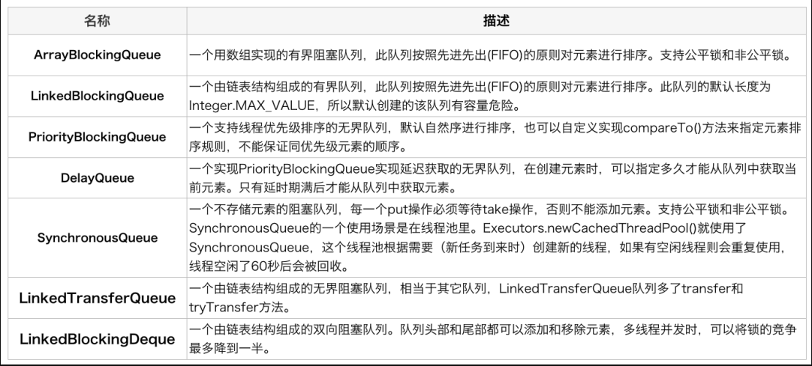

**线程执行流程：**

​	任务的调度都是由execute方法完成的，具体流程如下图所示

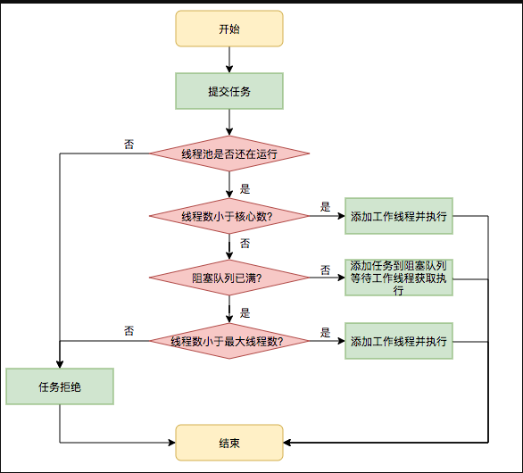

**生命周期转换图：**

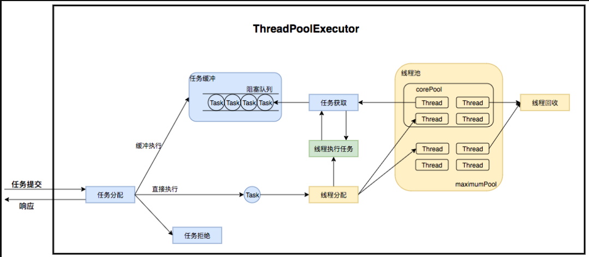

**任务申请：**

​	由上文的任务分配部分可知，任务的执行有两种可能：一种是任务直接由新创建的线程执行。另一种是线程从任务队列中获取任务然后执行，执行完任务的空闲线程会再次去从队列中申请任务再去执行。第一种情况仅出现在线程初始创建的时候，第二种是线程获取任务绝大多数的情况。

​	线程需要从任务缓存模块中不断地取任务执行，帮助线程从阻塞队列中获取任务，实现线程管理模块和任务管理模块之间的通信。这部分策略由getTask方法实现，其执行流程如下图所示：

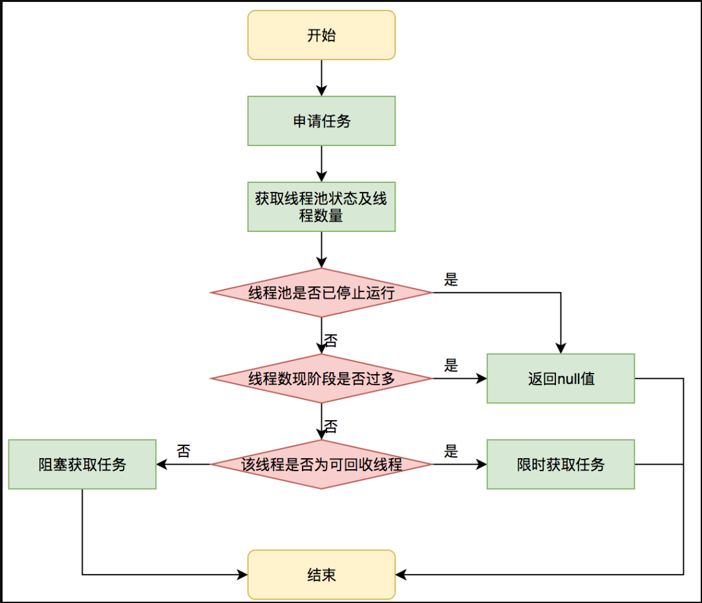

**拒绝策略:**

​	拒绝策略是一个接口，其设计如下：

```java
public interface RejectedExecutionHandler {
    void rejectedExecution(Runnable r, ThreadPoolExecutor executor);
}
```

用户可以通过实现这个接口去定制拒绝策略，也可以选择JDK提供的四种已有拒绝策略，其特点如下：

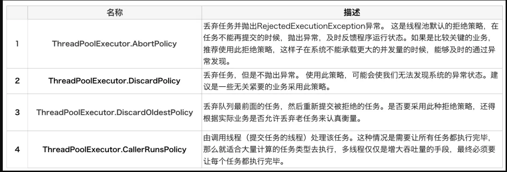

**Worker线程(工作线程)**

部分代码：

```java
private final class Worker extends AbstractQueuedSynchronizer implements Runnable{
    final Thread thread;//Worker持有的线程
    Runnable firstTask;//初始化的任务，可以为null
}
```

​	Worker这个工作线程，实现了Runnable接口，并持有一个线程thread，一个初始化的任务firstTask。thread是在调用构造方法时通过ThreadFactory来创建的线程，可以用来执行任务；firstTask用它来保存传入的第一个任务，这个任务可以有也可以为null。如果这个值是非空的，那么线程就会在启动初期立即执行这个任务，也就对应**核心线程创建**时的情况；如果这个值是null，那么就需要创建一个线程去执行任务列表（workQueue）中的任务，也就是**非核心线程的创建**。

**Worker执行任务的模型如下图所示：**

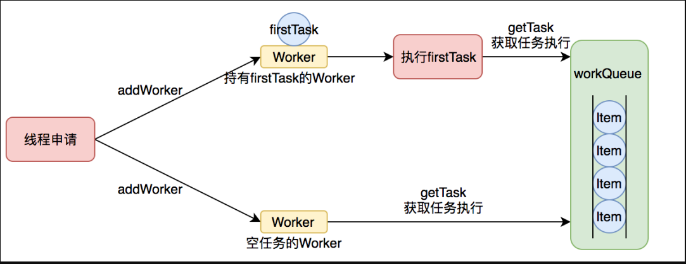

​	线程池需要管理线程的**生命周期**，需要在线程长时间不运行的时候进行回收。线程池使用一张Hash表去持有线程的引用，这样可以通过添加引用、移除引用这样的操作来控制线程的生命周期。这个时候重要的就是如何判断线程是否在运行。

​	Worker是通过继承AQS，使用AQS来实现独占锁这个功能。

1. lock方法一旦获取了独占锁，表示当前线程正在执行任务中。
2. 如果正在执行任务，则不应该中断线程。
3. 如果该线程现在不是独占锁的状态，也就是空闲的状态，说明它没有在处理任务，这时可以对该线程进行中断。
4. 线程池在执行shutdown方法或tryTerminate方法时会调用interruptIdleWorkers方法来中断空闲的线程，interruptIdleWorkers方法会使用tryLock方法来判断线程池中的线程是否是空闲状态；如果线程是空闲状态则可以安全回收。

在线程回收过程中就使用到了这种特性，回收过程如下图所示：

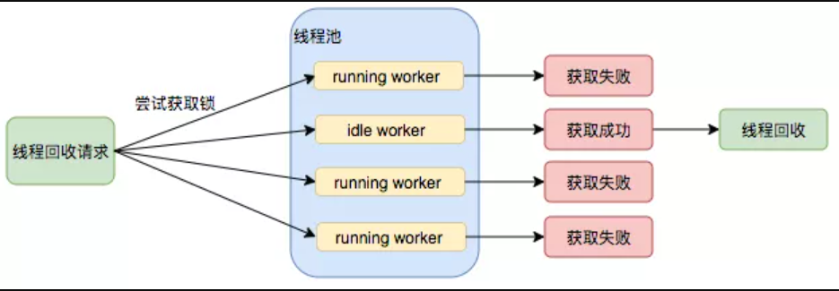

**Worker线程增加**

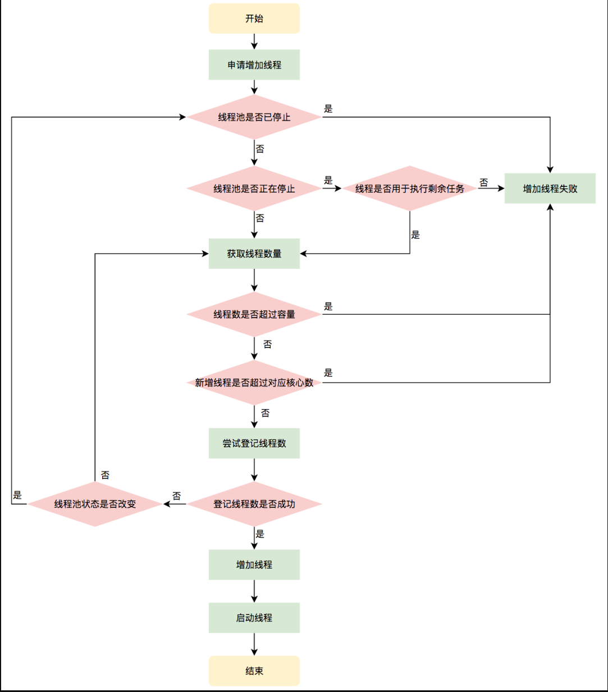

**Worker线程回收**

​	Worker被创建出来后，就会不断地进行轮询，然后获取任务去执行，**核心线程**可以无限等待获取任务，**非核心线程**要限时获取任务。当Worker无法获取到任务，也就是获取的任务为空时，循环会结束，Worker会主动消除自身在线程池内的引用（去除引用后，垃圾收集器会将其回收）。

**Worker线程执行任务**

在Worker类中的run方法调用了runWorker方法来执行任务，runWorker方法的执行过程如下：

1. while循环不断地通过getTask()方法获取任务。
2. getTask()方法从阻塞队列中取任务。
3. 如果线程池正在停止，那么要保证当前线程是中断状态，否则要保证当前线程不是中断状态。
4. 执行任务。
5. 如果getTask结果为null则跳出循环，执行processWorkerExit()方法，销毁线程。

执行流程如下图所示：

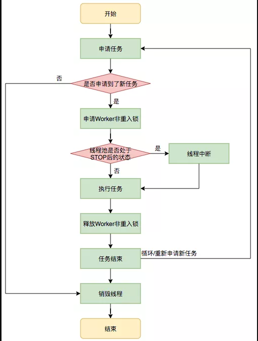

**线程池参数配置：**

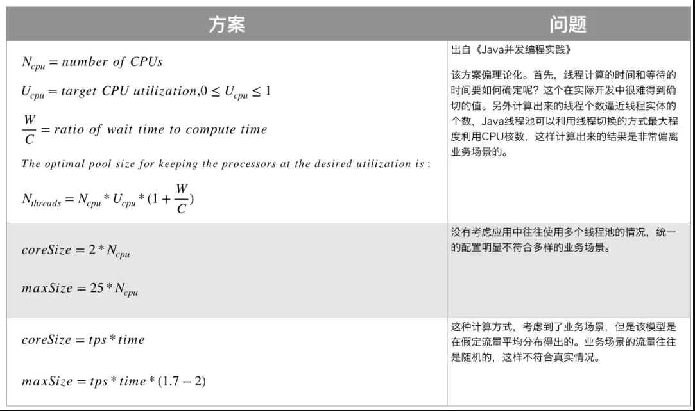

第一个 和实际业务场景有所偏离。

第二个 设置为 2*CPU 核心数，有点像是把任务都当做 IO 密集型去处理了。而且一个项目里面一般来说不止一个自定义线程池吧？比如有专门处理数据上送的线程池，有专门处理查询请求的线程池，这样去做一个简单的线程隔离。但是如果都用这样的参数配置的话，显然是不合理的。

第三个 理想状态。流量是不可能这么均衡的，就拿美团来说，下午3，4点的流量，能和 12 点左右午饭时的流量比吗？

基于上面的这些解决方案的痛点，美团给出了动态化配置的解决方案。

动态配置线程池参数

动态化线程池的核心设计包括以下三个方面：

1. **简化线程池配置**：线程池构造参数有8个，但是最核心的是3个：corePoolSize、maximumPoolSize，workQueue，它们最大程度地决定了线程池的任务分配和线程分配策略。考虑到在实际应用中我们获取并发性的场景主要是两种：（1）并行执行子任务，提高响应速度。这种情况下，应该使用同步队列，没有什么任务应该被缓存下来，而是应该立即执行。（2）并行执行大批次任务，提升吞吐量。这种情况下，应该使用有界队列，使用队列去缓冲大批量的任务，队列容量必须声明，防止任务无限制堆积。所以线程池只需要提供这三个关键参数的配置，并且提供两种队列的选择，就可以满足绝大多数的业务需求，Less is More。
2. **参数可动态修改**：为了解决参数不好配，修改参数成本高等问题。在Java线程池留有高扩展性的基础上，封装线程池，允许线程池监听同步外部的消息，根据消息进行修改配置。将线程池的配置放置在平台侧，允许开发同学简单的查看、修改线程池配置。
3. **增加线程池监控**：对某事物缺乏状态的观测，就对其改进无从下手。在线程池执行任务的生命周期添加监控能力，帮助开发同学了解线程池状态。
4. 对于队列的动态设置，需要实现自定义队列，默认的队列是不允许修改队列长度的。

参考文章：

https://mp.weixin.qq.com/s?__biz=MjM5NjQ5MTI5OA==&mid=2651751537&idx=1&sn=c50a434302cc06797828782970da190e&chksm=bd125d3c8a65d42aaf58999c89b6a4749f092441335f3c96067d2d361b9af69ad4ff1b73504c&scene=21#wechat_redirect


线程池是如何重复利用空闲的线程来执行任务的？

https://blog.csdn.net/anhenzhufeng/article/details/88870374

Thread及Runnable相关

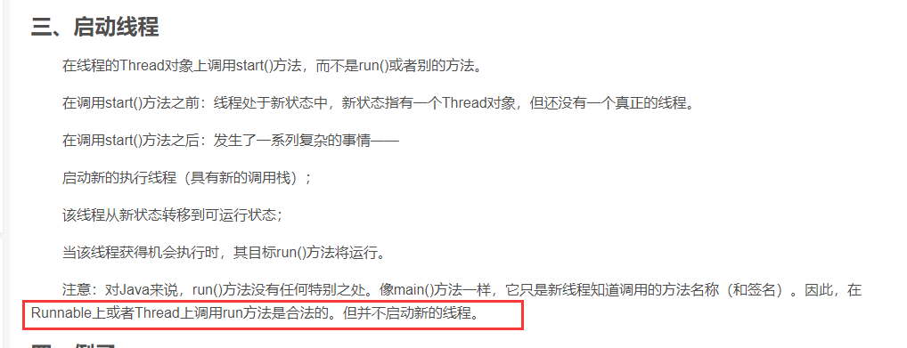

https://blog.csdn.net/yjsz2010/article/details/82729562

