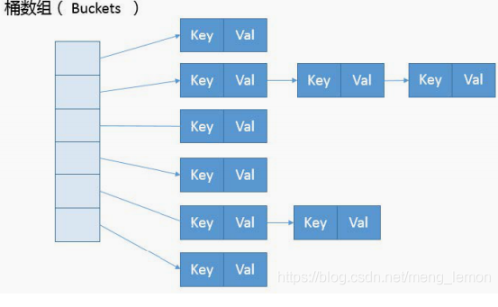

# 1 HashMap

## 1.1 hash值与取数组下标（1.8）

**根据hash取下标，核心算法在 (n - 1) & hash**

```java
    final Node<K,V> getNode(int hash, Object key) {
        Node<K,V>[] tab; Node<K,V> first, e; int n; K k;
        //(n - 1) & hash就是取Node<K,V>[] tab数组的下标
        //Node为链表，tab就是为数组链表的数据结构
        if ((tab = table) != null && (n = tab.length) > 0 &&
            (first = tab[(n - 1) & hash]) != null) {
            if (first.hash == hash && // always check first node
                ((k = first.key) == key || (key != null && key.equals(k))))
                return first;
            if ((e = first.next) != null) {
                if (first instanceof TreeNode)
                    return ((TreeNode<K,V>)first).getTreeNode(hash, key);
                do {
                    if (e.hash == hash &&
                        ((k = e.key) == key || (key != null && key.equals(k))))
                        return e;
                } while ((e = e.next) != null);
            }
        }
        return null;
    }
```

得出更为散列的hash值

```java
    static final int hash(Object key) {
        int h;
        return (key == null) ? 0 : (h = key.hashCode()) ^ (h >>> 16);
    }
```

结合hash值和 (n - 1) & hash 的取模算法，可以更为平均的将对应hash数据分布在tab数组的Node节点中




实战应用,参考HashMap的分配数组的方式，将对应值均匀的路由到队列中去

```java
	/**
	 * 获取路由到的内存队列
	 * @param productId 商品id
	 * @return 内存队列
	 */
	private ArrayBlockingQueue<Request> getRoutingQueue(Integer productId) {
		RequestQueue requestQueue = RequestQueue.getInstance();
		
		// 先获取productId的hash值
		String key = String.valueOf(productId);
		int h;
		int hash = (key == null) ? 0 : (h = key.hashCode()) ^ (h >>> 16);
		
		// 对hash值取模，将hash值路由到指定的内存队列中，比如内存队列大小8
		// 用内存队列的数量对hash值取模之后，结果一定是在0~7之间
		// 所以任何一个商品id都会被固定路由到同样的一个内存队列中去的
		int index = (requestQueue.queueSize() - 1) & hash;
		
		return requestQueue.getQueue(index);
	}
```

参考：

https://blog.csdn.net/j1231230/article/details/78072115

https://blog.csdn.net/j1231230/article/details/78072115

中华石杉-亿级流量

