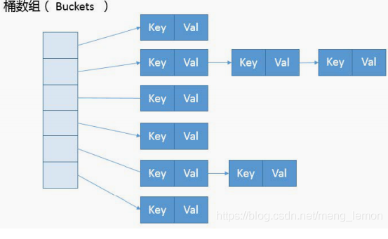

# 1 List

## 1.1 ArrayList

### 1.1.1 基本原理及优缺点

**基本原理：**

​	1 ArrayList，原理就是底层基于数组来实现

​	2 数组的长度是固定的，java里面数组都是定长数组，比如数组大小设置为100，此时你不停的往ArrayList里面塞入这个数据，此时元素数量超过了100以后，此时就会发生一个数组的扩容，就会搞一个更大的数组，把以前的数组拷贝到新的数组里面去

**缺点：**

​	1 这个数组扩容+元素拷贝的过程，相对来说会慢一些

​	2 数组来实现，数组你要是往数组的中间加一个元素，是不是要把数组中那个新增元素后面的元素全部往后面挪动一位，所以说，如果你是往ArrayList中间插入一个元素，性能比较差，会导致他后面的大量的元素挪动一个位置

**优点：**

​	1 基于数组实现，非常适合随机读，因为数组是连续的内存空间，知道开头位置的内存地址后，后续数组元素的内存地址都能通过下标直接获取到。

**适用场景：**

​	1 ArrayList，常用，如果你不会频繁的在里面插入一些元素，不会导致频繁的元素的位置移动、数组扩容，就是有一批数据，查询出来，灌入ArrayList中，后面不会频繁插入元素了，主要就是遍历这个集合，或者是通过索引随机读取某个元素

​	2 一个班级里面，有一堆学生，需要对这些学生按照插入的顺序来排序，ArrayList，而且后面这里面的数据不会频繁的变化的，无论插入元素，还是随机删除某个元素

### 1.1.2 常用方法及源码

不是使用这个默认的构造函数，给ArrayList构造的时候，建议给一个比较靠谱的初始化的数组的大小，比如说，100个数据，推测数组会有多少数据

**1 默认构造**

默认的构造函数，直接初始化一个ArrayList实例的话，会将内部的数组做成一个默认的空数组，{}，Object[]

```java
    //维护的核心数据结构-ArrayList中的数组
	transient Object[] elementData; // non-private to simplify nested class access    

	private static final Object[] DEFAULTCAPACITY_EMPTY_ELEMENTDATA = {};

	/**
     * Constructs an empty list with an initial capacity of ten.
     */
    public ArrayList() {
        this.elementData = DEFAULTCAPACITY_EMPTY_ELEMENTDATA;
    }
```

**2 add方法**

先通过ensureCapacityInternal进行是否需要数组扩容及初始化的操作，然后再给数组当前size的位置赋值，size加一

```java
    /**
     * Appends the specified element to the end of this list.
     *
     * @param 新增的值
     * @return <tt>true</tt> (as specified by {@link Collection#add})
     */
	public boolean add(E e) {
       //ensureCapacityInternal核心方法，数组扩容及相关初始化
        ensureCapacityInternal(size + 1);  // Increments modCount!!
       //size作为下标赋值，然后 size +1即可
        elementData[size++] = e;
        return true;
    }
```

先判断数组是否越界，再通过ensureCapacityInternal进行是否需要数组扩容及初始化的操作，在通过数组复制将index后面的元素往后挪一位，再给对应index下标赋传入的新值

```java
    /**
     * Inserts the specified element at the specified position in this
     * list. Shifts the element currently at that position (if any) and
     * any subsequent elements to the right (adds one to their indices).
     *
     * @param index index at which the specified element is to be inserted
     * @param element element to be inserted
     * @throws IndexOutOfBoundsException {@inheritDoc}
     */
    public void add(int index, E element) {
        //判断数组是否越界及index是否小于0
        rangeCheckForAdd(index);
		//ensureCapacityInternal核心方法，数组扩容及相关初始化
        ensureCapacityInternal(size + 1);  // Increments modCount!!
        //System.arraycopy方法说明：旧数组，旧数组开始复制的下标，新数组，新数组开始复制的下标，旧数组复制到新数组的长度
        //从当前数组的index下标开始复制，从当前数组的index+1开始，复制size-index(index后面的元素长度)的长度
        //该方法说白了就是利用数组复制，将数组对应index及后面的元素都+1，往后挪一位
        System.arraycopy(elementData, index, elementData, index + 1,
                         size - index);
        //index数据往后挪一位之后，就给当前index赋值传入的新值
        elementData[index] = element;
        //size长度加一
        size++;
    }
```

**3 set方法**

先判断下数组下标是否越界，然后就临时保存下对应下标的值，然后把set传入的值赋值到对应下标，然后再返回之前的值

```java
    /**
     * Replaces the element at the specified position in this list with
     * the specified element.
     *
     * @param index 修改的下标
     * @param element 修改的下标替换的值
     * @return the element previously at the specified position
     * @throws IndexOutOfBoundsException {@inheritDoc}
     */
    public E set(int index, E element) {
        //检查数组是否越界，越界则抛异常
        rangeCheck(index);
	   //根据当前传入下标获取值，保存到临时变量oldValue中
        E oldValue = elementData(index);
        //将传入的新值赋值给对应下标
        elementData[index] = element;
        //返回旧值-临时变量oldValue
        return oldValue;
    }
```

**4 get方法**

先检查数组下标是否越界，然后直接返回对应数组下标

```java
    /**
     * Returns the element at the specified position in this list.
     *
     * @param  获取对应的下标
     * @return the element at the specified position in this list
     * @throws IndexOutOfBoundsException {@inheritDoc}
     */
    public E get(int index) {
        //检查下数组下标是否越界，越界则抛异常
        rangeCheck(index);
	    //直接返回数组对应下标
        return elementData(index);
    }
```

**5 remove方法**

remove(index)：先检查数组下标是否越界，然后modCount操作次数加一，在通过数组复制往前移动一位，数组长度-1，返回旧值

```java
    /**
     * Removes the element at the specified position in this list.
     * Shifts any subsequent elements to the left (subtracts one from their
     * indices).
     *
     * @param index the index of the element to be removed
     * @return the element that was removed from the list
     * @throws IndexOutOfBoundsException {@inheritDoc}
     */
    public E remove(int index) {
        //检查下数组下标是否越界，越界则抛异常
        rangeCheck(index);
		//modCount这个是和迭代相关的数值，每次次add或者remove它的值都会加1(add是在数组扩容方法中)
        modCount++;
        //获取旧值
        E oldValue = elementData(index);
		//再判断下下标，如果正好index是最后一位就不用数组复制了
        int numMoved = size - index - 1;
        if (numMoved > 0)
            //通过数组复制，将index后面的数据往前移动一位，覆盖index的值
            System.arraycopy(elementData, index+1, elementData, index,
                             numMoved);
        //往前移一位之后，最后一位置为空，数组长度-1
        elementData[--size] = null; // clear to let GC do its work
		//返回旧值
        return oldValue;
    }

    /**
     * Removes the first occurrence of the specified element from this list,
     * if it is present.  If the list does not contain the element, it is
     * unchanged.  More formally, removes the element with the lowest index
     * <tt>i</tt> such that
     * <tt>(o==null&nbsp;?&nbsp;get(i)==null&nbsp;:&nbsp;o.equals(get(i)))</tt>
     * (if such an element exists).  Returns <tt>true</tt> if this list
     * contained the specified element (or equivalently, if this list
     * changed as a result of the call).
     *
     * @param o 对象
     * @return <tt>true</tt> if this list contained the specified element
     */
    public boolean remove(Object o) {
        if (o == null) {
            //对象等于空和不等于空是基本是一样的，区别在于判断逻辑
            for (int index = 0; index < size; index++)
                //找出等于空的下标
                if (elementData[index] == null) {
                    //根据下标去除
                    fastRemove(index);
                    return true;
                }
        } else {
            //从0-szie遍历数组，
            for (int index = 0; index < size; index++)
                //找出对象对应的下标
                if (o.equals(elementData[index])) {
                    //根据下标去除
                    //fastRemove和remove(index)逻辑是一样的，区别就是少了数组越界判断和返回旧值，其他是一样的去除逻辑
                    fastRemove(index);
                    return true;
                }
        }
        return false;
    }
```

**6 数组扩容以及元素拷贝核心方法**

```java
    //方法参数为 size+1(1为新增元素的长度，如果是addAll就是新增的数组size)
	ensureCapacityInternal(size + 1);  // Increments modCount!!

	//这里参数minCapacity最小容量，也就是说数组至少得是多少长度(数组长度+新增元素长度)
	private void ensureCapacityInternal(int minCapacity) {
        ensureExplicitCapacity(calculateCapacity(elementData, minCapacity));
    }

	//该方法是用于初始化长度的
    private static int calculateCapacity(Object[] elementData, int minCapacity) {
        //如果数组为初始化数组{}，空数组的话
        if (elementData == DEFAULTCAPACITY_EMPTY_ELEMENTDATA) {
            //就直接返回长度10，或者是传入minCapacity最小容量 两者比较，数值大的值
            return Math.max(DEFAULT_CAPACITY, minCapacity);
        }
        //不是空数组的话，就直接返回传入的minCapacity最小容量
        return minCapacity;
    }
    
    private void ensureExplicitCapacity(int minCapacity) {
        //操作数+1，modCount迭代相关
        modCount++;

        // overflow-conscious code
        //这里判断一下，minCapacity最小容量 大于数组当前长度才进行扩容
        if (minCapacity - elementData.length > 0)
            //数组扩容
            grow(minCapacity);
    }
    
    /**
     * Increases the capacity to ensure that it can hold at least the
     * number of elements specified by the minimum capacity argument.
     *
     * @param minCapacity the desired minimum capacity
     */
    private void grow(int minCapacity) {
        // overflow-conscious code
        //保存旧长度
        int oldCapacity = elementData.length;
        //生成新长度
        //新长度=旧长度+(旧长度/2)
        //>> 1位运算，就是往右移一位，相当于除以2
        int newCapacity = oldCapacity + (oldCapacity >> 1);
  		//新长度小于minCapacity最小容量，则 minCapacity最小容量为新长度
        if (newCapacity - minCapacity < 0)
            newCapacity = minCapacity;
        //这里是做一下数组最大长度的判断
        if (newCapacity - MAX_ARRAY_SIZE > 0)
            newCapacity = hugeCapacity(minCapacity);
        // minCapacity is usually close to size, so this is a win:
        //数组扩容到新长度
        elementData = Arrays.copyOf(elementData, newCapacity);
    }
    
    private static int hugeCapacity(int minCapacity) {
        if (minCapacity < 0) // overflow
            throw new OutOfMemoryError();
        return (minCapacity > MAX_ARRAY_SIZE) ?
            Integer.MAX_VALUE :
            MAX_ARRAY_SIZE;
    }
```


**总结：**

# 2 Vector和Stack


# 3 HashMap


# 4 LinkedHashMap与TreeMap


# 5 Set

# xx 扩展

## x.xhash值与取数组下标（1.8）

**根据hash取下标，核心算法在 (n - 1) & hash**

```java
    final Node<K,V> getNode(int hash, Object key) {
        Node<K,V>[] tab; Node<K,V> first, e; int n; K k;
        //(n - 1) & hash就是取Node<K,V>[] tab数组的下标
        //Node为链表，tab就是为数组链表的数据结构
        if ((tab = table) != null && (n = tab.length) > 0 &&
            (first = tab[(n - 1) & hash]) != null) {
            if (first.hash == hash && // always check first node
                ((k = first.key) == key || (key != null && key.equals(k))))
                return first;
            if ((e = first.next) != null) {
                if (first instanceof TreeNode)
                    return ((TreeNode<K,V>)first).getTreeNode(hash, key);
                do {
                    if (e.hash == hash &&
                        ((k = e.key) == key || (key != null && key.equals(k))))
                        return e;
                } while ((e = e.next) != null);
            }
        }
        return null;
    }
```

得出更为散列的hash值

```java
    static final int hash(Object key) {
        int h;
        return (key == null) ? 0 : (h = key.hashCode()) ^ (h >>> 16);
    }
```

结合hash值和 (n - 1) & hash 的取模算法，可以更为平均的将对应hash数据分布在tab数组的Node节点中




实战应用,参考HashMap的分配数组的方式，将对应值均匀的路由到队列中去

```java
	/**
	 * 获取路由到的内存队列
	 * @param productId 商品id
	 * @return 内存队列
	 */
	private ArrayBlockingQueue<Request> getRoutingQueue(Integer productId) {
		RequestQueue requestQueue = RequestQueue.getInstance();
		
		// 先获取productId的hash值
		String key = String.valueOf(productId);
		int h;
		int hash = (key == null) ? 0 : (h = key.hashCode()) ^ (h >>> 16);
		
		// 对hash值取模，将hash值路由到指定的内存队列中，比如内存队列大小8
		// 用内存队列的数量对hash值取模之后，结果一定是在0~7之间
		// 所以任何一个商品id都会被固定路由到同样的一个内存队列中去的
		int index = (requestQueue.queueSize() - 1) & hash;
		
		return requestQueue.getQueue(index);
	}
```

参考：

https://blog.csdn.net/j1231230/article/details/78072115

https://blog.csdn.net/j1231230/article/details/78072115

中华石杉-亿级流量

