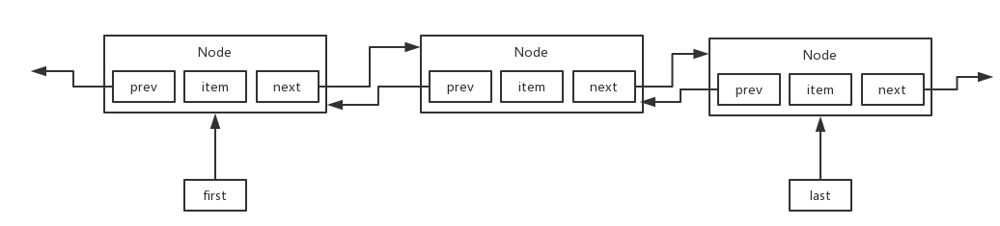
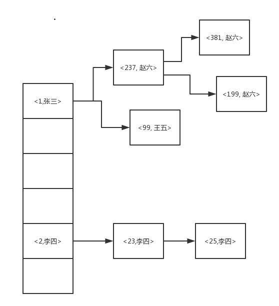

# 1 List

## 1.1 ArrayList

### 1.1.1 基本原理及优缺点

**基本原理：**

​	1 ArrayList，原理就是底层基于数组来实现

​	2 数组的长度是固定的，java里面数组都是定长数组，比如数组大小设置为100，此时你不停的往ArrayList里面塞入这个数据，此时元素数量超过了100以后，此时就会发生一个数组的扩容，就会搞一个更大的数组，把以前的数组拷贝到新的数组里面去

**缺点：**

​	1 这个数组扩容+元素拷贝的过程，相对来说会慢一些

​	2 数组来实现，数组你要是往数组的中间加一个元素，是不是要把数组中那个新增元素后面的元素全部往后面挪动一位，所以说，如果你是往ArrayList中间插入一个元素，性能比较差，会导致他后面的大量的元素挪动一个位置

**优点：**

​	1 基于数组实现，非常适合随机读，因为数组是连续的内存空间，知道开头位置的内存地址后，后续数组元素的内存地址都能通过下标直接获取到。

**适用场景：**

​	1 ArrayList，常用，如果你不会频繁的在里面插入一些元素，不会导致频繁的元素的位置移动、数组扩容，就是有一批数据，查询出来，灌入ArrayList中，后面不会频繁插入元素了，主要就是遍历这个集合，或者是通过索引随机读取某个元素

​	2 一个班级里面，有一堆学生，需要对这些学生按照插入的顺序来排序，ArrayList，而且后面这里面的数据不会频繁的变化的，无论插入元素，还是随机删除某个元素

### 1.1.2 常用方法及源码解析

不是使用这个默认的构造函数，给ArrayList构造的时候，建议给一个比较靠谱的初始化的数组的大小，比如说，100个数据，推测数组会有多少数据

**1 默认构造**

默认的构造函数，直接初始化一个ArrayList实例的话，会将内部的数组做成一个默认的空数组，{}，Object[]

```java
public class ArrayList<E> extends AbstractList<E>
        implements List<E>, RandomAccess, Cloneable, java.io.Serializable

	//维护的核心数据结构-ArrayList中的数组
	transient Object[] elementData; // non-private to simplify nested class access    

	private static final Object[] DEFAULTCAPACITY_EMPTY_ELEMENTDATA = {};

	/**
     * Constructs an empty list with an initial capacity of ten.
     */
    public ArrayList() {
        this.elementData = DEFAULTCAPACITY_EMPTY_ELEMENTDATA;
    }
```

**2 add方法**

先通过ensureCapacityInternal进行是否需要数组扩容及初始化的操作，然后再给数组当前size的位置赋值，size加一

```java
    /**
     * Appends the specified element to the end of this list.
     *
     * @param 新增的值
     * @return <tt>true</tt> (as specified by {@link Collection#add})
     */
	public boolean add(E e) {
       //ensureCapacityInternal核心方法，数组扩容及相关初始化
        ensureCapacityInternal(size + 1);  // Increments modCount!!
       //size作为下标赋值，然后 size +1即可
        elementData[size++] = e;
        return true;
    }
```

先判断数组是否越界，再通过ensureCapacityInternal进行是否需要数组扩容及初始化的操作，在通过数组复制将index后面的元素往后挪一位，再给对应index下标赋传入的新值

```java
    /**
     * Inserts the specified element at the specified position in this
     * list. Shifts the element currently at that position (if any) and
     * any subsequent elements to the right (adds one to their indices).
     *
     * @param index index at which the specified element is to be inserted
     * @param element element to be inserted
     * @throws IndexOutOfBoundsException {@inheritDoc}
     */
    public void add(int index, E element) {
        //判断数组是否越界及index是否小于0
        rangeCheckForAdd(index);
		//ensureCapacityInternal核心方法，数组扩容及相关初始化
        ensureCapacityInternal(size + 1);  // Increments modCount!!
        //System.arraycopy方法说明：旧数组，旧数组开始复制的下标，新数组，新数组开始复制的下标，旧数组复制到新数组的长度
        //从当前数组的index下标开始复制，从当前数组的index+1开始，复制size-index(index后面的元素长度)的长度
        //该方法说白了就是利用数组复制，将数组对应index及后面的元素都+1，往后挪一位
        System.arraycopy(elementData, index, elementData, index + 1,
                         size - index);
        //index数据往后挪一位之后，就给当前index赋值传入的新值
        elementData[index] = element;
        //size长度加一
        size++;
    }
```

**3 set方法**

先判断下数组下标是否越界，然后就临时保存下对应下标的值，然后把set传入的值赋值到对应下标，然后再返回之前的值

```java
    /**
     * Replaces the element at the specified position in this list with
     * the specified element.
     *
     * @param index 修改的下标
     * @param element 修改的下标替换的值
     * @return the element previously at the specified position
     * @throws IndexOutOfBoundsException {@inheritDoc}
     */
    public E set(int index, E element) {
        //检查数组是否越界，越界则抛异常
        rangeCheck(index);
	   //根据当前传入下标获取值，保存到临时变量oldValue中
        E oldValue = elementData(index);
        //将传入的新值赋值给对应下标
        elementData[index] = element;
        //返回旧值-临时变量oldValue
        return oldValue;
    }
```

**4 get方法**

先检查数组下标是否越界，然后直接返回对应数组下标

```java
    /**
     * Returns the element at the specified position in this list.
     *
     * @param  获取对应的下标
     * @return the element at the specified position in this list
     * @throws IndexOutOfBoundsException {@inheritDoc}
     */
    public E get(int index) {
        //检查下数组下标是否越界，越界则抛异常
        rangeCheck(index);
	    //直接返回数组对应下标
        return elementData(index);
    }
```

**5 remove方法**

remove(index)：先检查数组下标是否越界，然后modCount操作次数加一，在通过数组复制往前移动一位，数组长度-1，返回旧值

```java
    /**
     * Removes the element at the specified position in this list.
     * Shifts any subsequent elements to the left (subtracts one from their
     * indices).
     *
     * @param index the index of the element to be removed
     * @return the element that was removed from the list
     * @throws IndexOutOfBoundsException {@inheritDoc}
     */
    public E remove(int index) {
        //检查下数组下标是否越界，越界则抛异常
        rangeCheck(index);
		//modCount这个是和迭代相关的数值，每次次add或者remove它的值都会加1(add是在数组扩容方法中)
        modCount++;
        //获取旧值
        E oldValue = elementData(index);
		//再判断下下标，如果正好index是最后一位就不用数组复制了
        int numMoved = size - index - 1;
        if (numMoved > 0)
            //通过数组复制，将index后面的数据往前移动一位，覆盖index的值
            System.arraycopy(elementData, index+1, elementData, index,
                             numMoved);
        //往前移一位之后，最后一位置为空，数组长度-1
        elementData[--size] = null; // clear to let GC do its work
		//返回旧值
        return oldValue;
    }

    /**
     * Removes the first occurrence of the specified element from this list,
     * if it is present.  If the list does not contain the element, it is
     * unchanged.  More formally, removes the element with the lowest index
     * <tt>i</tt> such that
     * <tt>(o==null&nbsp;?&nbsp;get(i)==null&nbsp;:&nbsp;o.equals(get(i)))</tt>
     * (if such an element exists).  Returns <tt>true</tt> if this list
     * contained the specified element (or equivalently, if this list
     * changed as a result of the call).
     *
     * @param o 对象
     * @return <tt>true</tt> if this list contained the specified element
     */
    public boolean remove(Object o) {
        if (o == null) {
            //对象等于空和不等于空是基本是一样的，区别在于判断逻辑
            for (int index = 0; index < size; index++)
                //找出等于空的下标
                if (elementData[index] == null) {
                    //根据下标去除
                    fastRemove(index);
                    return true;
                }
        } else {
            //从0-szie遍历数组，
            for (int index = 0; index < size; index++)
                //找出对象对应的下标
                if (o.equals(elementData[index])) {
                    //根据下标去除
                    //fastRemove和remove(index)逻辑是一样的，区别就是少了数组越界判断和返回旧值，其他是一样的去除逻辑
                    fastRemove(index);
                    return true;
                }
        }
        return false;
    }
```

**6 数组扩容以及元素拷贝核心方法**

扩容原数组长度的50%，空间换取时间，多扩容一些位置，避免频繁扩容

```java
    //方法参数为 size+1(1为新增元素的长度，如果是addAll就是新增的数组size)
	ensureCapacityInternal(size + 1);  // Increments modCount!!

	//这里参数minCapacity最小容量，也就是说数组至少得是多少长度(数组长度+新增元素长度)
	private void ensureCapacityInternal(int minCapacity) {
        ensureExplicitCapacity(calculateCapacity(elementData, minCapacity));
    }

	//该方法是用于初始化长度的
    private static int calculateCapacity(Object[] elementData, int minCapacity) {
        //如果数组为初始化数组{}，空数组的话
        if (elementData == DEFAULTCAPACITY_EMPTY_ELEMENTDATA) {
            //就直接返回长度10，或者是传入minCapacity最小容量 两者比较，数值大的值
            return Math.max(DEFAULT_CAPACITY, minCapacity);
        }
        //不是空数组的话，就直接返回传入的minCapacity最小容量
        return minCapacity;
    }
    
    private void ensureExplicitCapacity(int minCapacity) {
        //操作数+1，modCount迭代相关
        modCount++;

        // overflow-conscious code
        //这里判断一下，minCapacity 大于数组当前长度才进行扩容
        if (minCapacity - elementData.length > 0)
            //数组扩容
            grow(minCapacity);
    }
    
    /**
     * 提高容量以满足 minCapacity
     * Increases the capacity to ensure that it can hold at least the
     * number of elements specified by the minimum capacity argument.
     *
     * @param minCapacity the desired minimum capacity
     */
    private void grow(int minCapacity) {
        // overflow-conscious code
        //保存旧长度
        int oldCapacity = elementData.length;
        //生成新长度
        //新长度=旧长度+(旧长度/2)
        //>> 1位运算，就是往右移一位，相当于除以2
        //扩容一半容量->空间换取时间，多扩容一些位置，避免频繁扩容
        int newCapacity = oldCapacity + (oldCapacity >> 1);
  		//新长度小于minCapacity最小容量，则 minCapacity最小容量为新长度
        if (newCapacity - minCapacity < 0)
            newCapacity = minCapacity;
        //这里是做一下数组最大长度的判断
        if (newCapacity - MAX_ARRAY_SIZE > 0)
            newCapacity = hugeCapacity(minCapacity);
        // minCapacity is usually close to size, so this is a win:
        //数组扩容到新长度
        elementData = Arrays.copyOf(elementData, newCapacity);
    }
    
	//如果长度超过了MAX_ARRAY_SIZE也就是Integer.MAX_VALUE-8，那么也可以扩容到Integer.MAX_VALUE
	//Integer.MAX_VALUE为数组的最大容量
	//MAX_ARRAY_SIZE=Integer.MAX_VALUE-8,因为数组再对象头会额外存储一些信息，所以预留一部分长度
	//如果实在没办法超过了这个长度，就扩容到最大长度，不同jvm可能后果不同
    private static int hugeCapacity(int minCapacity) {
        if (minCapacity < 0) // overflow
            throw new OutOfMemoryError();
        return (minCapacity > MAX_ARRAY_SIZE) ?
            Integer.MAX_VALUE :
            MAX_ARRAY_SIZE;
    }
```

数组扩容引用：https://blog.csdn.net/w605283073/article/details/109696771


**总结：**

remove()   add(index, element)

​	这个两个方法，都会导致数组的拷贝，大量元素的挪动，性能都不是太高，基于数组来做这种随机位置的插入和删除，其实性能真的不是太高

add()、add(index, element)

​	这两个方法，都可能会导致数组需要扩容，数组长度是固定的，默认初始大小是10个元素，如果不停的往数组里塞入数据，可能会导致瞬间数组不停的扩容，影响系统的性能

set()、get()

​	定位到随机的位置，替换那个元素，或者是获取那个元素，这个其实还是比较靠谱的，基于数组来实现随机位置的定位，性能是很高的

## 1.2 LinkedList

### 1.2.1 基本原理及数据结构

面试基本回答：ArrayList是数组实现的，LinkedList是链表实现的

面试优秀回答：

​	1 ArrayList的源码我看过，给你讲一下，数组，add、remove、get、set他的一些基于数组实现的原理是什么，数组扩容，元素移动的原理是什么，优缺点是什么

​	**2 LinkedList是基于双向链表实现的**，你可以现场画一下他的数据结构，同时的话呢，就是可以把他的一些常见操作的原理图，在现场来画一下，指针，双向链表的数据结构，node是怎么变化的

**LinkedList优缺点**

​	优点：基于双向链表实现的，所以顺序插入，随机插入，删除，都很快，顺序查询也没问题，而且由于是基于链表实现的，大批量数据插入不用考虑扩容问题影响性能

​	缺点：基于双向链表实现的，随机查询速度较慢，需要遍历链表到对应位置才能获取到

**使用场景**

（1）ArrayList：一般场景，都是用ArrayList来代表一个集合，只要别频繁的往里面插入和灌入大量的元素就可以了，遍历，或者随机查，都可以

（2）LinkedList：适合，频繁的在list中插入和删除某个元素，然后尤其是**LinkedList他其实是可以当做队列来用的**，这个东西的话呢，我们后面看源码的时候，可以来看一下，先进先出，在list尾部怼进去一个元素，从头部拿出来一个元素。如果要在内存里实现一个基本的队列的话，可以用LinkedList




### 1.2.2 常用方法及源码解析

**1 构造方法及基础属性**

```java
//同时实现List及Deque接口
public class LinkedList<E>
    extends AbstractSequentialList<E>
    implements List<E>, Deque<E>, Cloneable, java.io.Serializable

    //list链表长度
    transient int size = 0;

    /**
     * 头节点
     * Invariant: (first == null && last == null) ||
     *            (first.prev == null && first.item != null)
     */
    transient Node<E> first;

    /**
     * 尾结点
     * Invariant: (first == null && last == null) ||
     *            (last.next == null && last.item != null)
     */
    transient Node<E> last;
    
    //这里无参构造为空是因为链表node节点无须初始化，新增的node会实例化Node，并且更新其对应指针
    public LinkedList() {
    }
.............................
    private static class Node<E> {
        E item;
        Node<E> next;
        Node<E> prev;

        Node(Node<E> prev, E element, Node<E> next) {
            this.item = element;
            this.next = next;
            this.prev = prev;
        }
    }

```

Deque为双向队列的接口,这里是队列相关的常用方法

.png)

**2 add相关方法**

**List相关**

​	add()，默认就是在队列的尾部插入一个元素，在那个双向链表的尾部插入一个元素(Deque也有)

​	add(index, element)，是在队列的中间插入一个元素

**Deque相关**

​	addFirst()，在队列的头部插入一个元素

​	addLast()，跟add()方法是一样的，也是在尾部插入一个元素

​	offer() == add()，内部就是调用add()(还有offerFirst()，offerLast())

基础方法调用

```java
    //调用linkLast添加元素
	public boolean add(E e) {
        //链表尾部添加
        linkLast(e);
        return true;
    }
    
    public void add(int index, E element) {
        //先检查数组下标,不符合/越界则抛异常
        checkPositionIndex(index);
		//判断对应下标所处位置，调用linkLast或linkBefore方法
        //添加的下标等于数组长度，也就是最后一位后续添加，则链表尾部添加
        if (index == size)
            //链表尾部添加
            linkLast(element);
        else
            //找到链表对应Index节点，将元素添加到对应节点之前
            //这里node方法为get相关核心方法，参考下面get相关笔记
            linkBefore(element, node(index));
    }
    
	public void addFirst(E e) {
        //链表头部添加
        linkFirst(e);
    }

    public void addLast(E e) {
        //链表尾部添加
        linkLast(e);
    }
    
    public boolean offer(E e) {
         //链表尾部添加
        return add(e);
    }

    public boolean offerFirst(E e) {
        //链表头部添加
        addFirst(e);
        return true;
    }

    public boolean offerLast(E e) {
        //链表尾部添加
        addLast(e);
        return true;
    }
    
```

基础方法调用的相关核心方法

```java

    /**
     * 链表开头插入一个元素
     * 大概逻辑就是新建节点，指定新节点next指针为之前头结点
     * 再判断下是不是初始化，如果之前头结点为空，也就是说链表为空，则头尾节点都是新节点
     * 如果不是都为空，则更新之前头结点的prev为新节点,再更新size及modCount
     * @param e 新元素
     */
    private void linkFirst(E e) {
        //先将头结点指针赋值给临时变量
        //后续需要重新指定头结点指针，所以这里临时变量保存一下
        final Node<E> f = first;
        //实例化newNode节点，因为是头结点插入，所以prev=null,item=传入元素,next=fist(之前的头结点)
        final Node<E> newNode = new Node<>(null, e, f);
        //头节点指针变为传入的新节点newNode
        first = newNode;
        //判断之前的头结点是否为空
        if (f == null)
            //如果之前的头结点为空，尾节点则为新节点
            //这里由于头节点为空，所以newNode新节点prev和next都为空，所以指定为头尾节点都可以
            //因为上面代码已经将newNode指定为头结点了，所以这里也将newNode新节点指定为尾结点
            //因为头结点为空的情况只有初始化，链表没元素的时候才会有这种情况
            //这种时候指定新节点即为头结点也为尾部节点
            last = newNode;
        else
            //头结点不为空，则更新之前的头结点的prev指针
            f.prev = newNode;
        //更新长度及modCount
        size++;
        modCount++;
    }

    /**
     * 列表结尾插入一个元素
     * @param e 新元素
     */
    void linkLast(E e) {
        //之前的尾结点赋值给临时变量
        final Node<E> l = last;
         //实例化newNode节点，因为是头结点插入，所以prev=(之前的尾结点),item=传入元素,next=null
        final Node<E> newNode = new Node<>(l, e, null);
        //尾结点指向newNode新节点
        last = newNode;
        //判断之前的尾结点是否为空
        if (l == null)
            //为空则头结点也是新节点
            //这样头尾节点都是新节点了
            first = newNode;
        else
            //不为空则更新之前尾结点的next指针指向newNode新节点
            l.next = newNode;
        //更新长度及modCount
        size++;
        modCount++;
    }

    /**
     * 链表结尾之前插入一个元素
     * @param e 新元素
     * @param succ 插入到succ节点prev(之前)的位置
     */
    void linkBefore(E e, Node<E> succ) {
        //前提是succ不为空
        //先保存succ.prev到临时变量，后续会覆盖
        final Node<E> pred = succ.prev;
        //实例化newNode节点，因为是succ.prev之前插入，所以prev=(succ.prev),item=传入元素,next=succ
        //将succ.prev指定给newNode新节点，完成指针替换，newNode就在succ和succ.prev中间了
        final Node<E> newNode = new Node<>(pred, e, succ);
        //替换succ.prev为newNode新节点
        succ.prev = newNode;
        //判断succ.prev是否为空，说明succ为头结点
        //因为链表为空的情况不会调用此方法，succ.prev为空只有succ为头结点一种情况
        if (pred == null)
            //succ.prev为空则将first头结点指针指向newNode新节点
            first = newNode;
        else
            //不为空则更新succ.prev的节点的next指针，指向newNode新节点
            pred.next = newNode;
        //更新长度及modCount
        size++;
        modCount++;
    }

```


**3 get相关方法**

**List相关**

get(index) 

getFirst() == peek()：获取头部的元素，他其实就是直接返回first指针指向的那个Node他里面的数据，他们都是返回头部的元素。getFirst()如果是对空list调用，会抛异常；peek()对空list调用，会返回null

getLast()：获取尾部的元素

**Deque相关**

poll()，从队列头部出队

peek()，获取队列头部的元素，但是头部的元素不出队

element()==getFirst() ,就是调用了getFirst() 返回头部节点

基础方法

```java
    //根据下标获取元素
	public E get(int index) {
        //先检查数组下标,不符合/越界则抛异常
        checkElementIndex(index);
        //直接根据下标返回对应元素
        return node(index).item;
    }
    
	//获取头部元素
    public E getFirst() {
        //first指针指向的就是头部节点
        final Node<E> f = first;
        //如果头部指针为空，说明链表为空，抛出异常
        if (f == null)
            throw new NoSuchElementException();
        //返回头部元素
        return f.item;
    }

	//获取尾部元素
    public E getLast() {
        //last指针指向的就是尾部节点
        final Node<E> l = last;
        //如果尾部元素为空，说明链表为空，这里抛出异常
        if (l == null)
            throw new NoSuchElementException();
        //返回尾部元素
        return l.item;
    }
    
	//和getFirst一样都是获取头部元素
	//唯一区别就是这里链表为空则返回null,getFirst会抛出异常
    public E peek() {
        //first指针指向的就是头部节点
        final Node<E> f = first;
        //如果头部指针为空，说明链表为空，返回Null
        //不为空则返回头部元素
        return (f == null) ? null : f.item;
    }

	//这里element=getFirst 就是内部调用getFirst方法
    public E element() {
        //调用getFirst方法
        return getFirst();
    }

	//获取头部元素返回，并去除头部元素
    public E poll() {
        //first指针指向的就是头部节点
        final Node<E> f = first;
        //如果头部指针为空，说明链表为空，返回Null
        //不为空则返回头部元素,并去除头部元素
        //unlinkFirst为remove相关核心方法，参考remove相关核心方法笔记
        return (f == null) ? null : unlinkFirst(f);
    }
```

基础方法调用的相关核心方法

```java
    /**
     * 根据Index下标获取对应node节点
     * @param index 下标
     */
    Node<E> node(int index) {
        //size >> 1 位运算，右移一位，相当于size/2
       //如果index在列表前半部分
        if (index < (size >> 1)) {
            Node<E> x = first;
            //从开头fist节点开始往后遍历，直到对应Index位置返回
            //0开始
            for (int i = 0; i < index; i++)
                //每次遍历都重新将next就是下一个节点赋值给临时变量x,达到链表遍历的效果
                x = x.next;
            return x;
        } else {
            //后半部分
            Node<E> x = last;
            //从结尾开始往前遍历，直到对应Index位置返回
            //size-1开始
            for (int i = size - 1; i > index; i--)
                 //每次遍历都重新将prev就是上一个节点赋值给临时变量x,达到链表遍历的效果
                x = x.prev;
            return x;
        }
    }
```

**4 remove相关方法**

**List相关**

remove(int index) 去除对应下标节点，返回该元素

remove(Object o)   (Deque也有) 去除对应元素节点 ,返回布尔值

**Deque相关**

removeLast() 去除尾结点并返回对应元素

removeFirst() == poll() 去除头结点并返回对应元素

基础方法

```java
   //根据元素去除对应链表中的节点
	public boolean remove(Object o) {
        //如果传入元素为空
        //这里分传入为空和不为空的两种情况分开遍历是为了避免空指针异常
        //因为传入元素o和节点的item都可能为空，.item都可能会抛异常
        //所以这里区分两种情况分开遍历
        if (o == null) {
            //如果传入元素o为空
            //循环遍历节点,从first头结点开始
            for (Node<E> x = first; x != null; x = x.next) {
                //如果节点中元素等于null,也就是找到对应节点
                if (x.item == null) {
                    //则将对应节点传入unlink去除该节点
                    unlink(x);
                    //返回true
                    return true;
                }
            }
        } else {
            //如果传入o元素不为空
            //循环遍历节点,从first头结点开始
            for (Node<E> x = first; x != null; x = x.next) {
                //如果节点中元素等于传入参数o,也就是找到对应节点
                if (o.equals(x.item)) {
                    //则将对应节点传入unlink去除该节点
                    unlink(x);
                    //返回true
                    return true;
                }
            }
        }
        //没找到节点则返回false
        return false;
    }

	//根据下标去除对应链表中的节点
    public E remove(int index) {
        //先检查数组下标,不符合/越界则抛异常
        checkElementIndex(index);
        //node找到链表对应节点，然后unlink去除该节点
        return unlink(node(index));
    }

	//去除头部节点
    public E removeFirst() {
        //first指针指向的就是头部节点
        final Node<E> f = first;
        //如果头部指针为空，说明链表为空，抛出异常
        if (f == null)
            throw new NoSuchElementException();
        //去除并返回头部节点
        return unlinkFirst(f);
    }

	//去除尾部节点
    public E removeLast() {
        //last指针指向的就是尾部节点
        final Node<E> l = last;
        //如果尾部元素为空，说明链表为空，这里抛出异常
        if (l == null)
            throw new NoSuchElementException();
        //去除并返回尾部节点
        return unlinkLast(l);
    }
```

基础方法调用的相关核心方法

```java
    /**
     * 去除头结点并返回对应元素
     */
    private E unlinkFirst(Node<E> f) {
        //首先头结点不能为空
        //先保存一下传入节点f的item元素的，后面会置空，这里保存最后返回
        final E element = f.item;
        //保存一下传入节点的next，后面也会置空
        final Node<E> next = f.next;
        //置空传入节点的item(也就是去除引用)
        f.item = null;
        //置空传入节点的next
        //因为传入节点为头结点，所以prev本来就是空的,到这一步传入节点的3个成员变量引用都置为空了
        f.next = null;
        //头结点指针重新指向f.next，也就是传入节点的next
        first = next;
        //如果f.next，也就是传入节点的next为空的话，说明链表只有一个元素
        //传入节点不仅是头结点，也是尾结点
        if (next == null)
            //所以这里也把尾结点置为空
            last = null;
        else
            //f.next也就是传入节点的下一个节点的prev引用,对传入节点的引用也置为空
            next.prev = null;
        //到这一步传入节点的自身引用，以及其他节点对传入节点的引用都置为空了
        //GC自然会对该节点进行垃圾回收
        //更新长度及modCount
        size--;
        modCount++;
        //返回传入节点的item元素
        return element;
    }

    /**
     * 去除尾结点并返回对应元素
     */
    private E unlinkLast(Node<E> l) {
        // 首先尾部节点不能为空
        //保存一下尾部节点的item，最后返回
        final E element = l.item;
        //保存一下尾部节点的prev引用
        final Node<E> prev = l.prev;
        //传入节点的item元素置为空
        l.item = null;
        //因为传入节点为尾结点，所以next本来就是空的,到这一步传入节点的3个成员变量引用都置为空了
        l.prev = null;
        //尾结点指针重新指向l.prev，也就是传入节点的prev
        last = prev;
        //如果l.prev，也就是传入节点的prev为空的话，说明链表只有一个元素
        //传入节点不仅是尾结点，也是头结点
        if (prev == null)
            //所以这里也把头结点置为空
            first = null;
        else
            //prev.next也就是传入节点的上一个节点的next引用,对传入节点的引用也置为空
            prev.next = null;
        //到这一步传入节点的自身引用，以及其他节点对传入节点的引用都置为空了
        //GC自然会对该节点进行垃圾回收
        //更新长度及modCount
        size--;
        modCount++;
         //返回传入节点的item元素
        return element;
    }

    /**
     * 去除结点并返回对应元素
     */
    E unlink(Node<E> x) {
        //首先传入的节点不能为空
        //保存一下尾部节点的item，最后返回
        final E element = x.item;
        //先保存一下传入节点的next
        final Node<E> next = x.next;
        //先保存一下传入节点的prev        
        final Node<E> prev = x.prev;
        
		//如果x.prev为空说明传入节点为头结点
        if (prev == null) {
            //头结点的指针重新指向传入节点的next，跳过传入节点
            first = next;
        } else {
            //不为空的话，x.prev，也就是传入节点的上一个节点的next引用跳过传入节点
            //直接指向传入节点的next
            prev.next = next;
            //传入节点的prev置为空
            x.prev = null;
        }
        
		//如果x.next为空说明传入节点为尾结点
        if (next == null) {
            //尾结点的指针重新指向传入节点的prev，跳过传入节点
            last = prev;
        } else {
            //不为空的话，x.next，也就是传入节点的下一个节点的prev引用跳过传入节点
            //直接指向传入节点的prev
            next.prev = prev;
            //传入节点的next置为空
            x.next = null;
        }
	   //传入节点x的item置为空
        //到这一步传入节点的自身引用，以及其他节点对传入节点的引用都置为空了
        //GC自然会对该节点进行垃圾回收
        x.item = null;
        //更新长度及modCount
        size--;
        modCount++;
        return element;
    }
```


# 2 Vector和Stack

## 2.1 Vector

**Vector和ArrayList**

​	1 和ArrayList一样都是基于数组实现的

​	2 不同点在于Vector对于数组所有的访问方法都加上了synchronized同步锁

​	3 所以Vetor相对于ArrayList来说是线程安全的，不过效率相对较低

相关源码

```java
public class Vector<E>
    extends AbstractList<E>
    implements List<E>, RandomAccess, Cloneable, java.io.Serializable
{
    /**
     * 这里就是内部维护的数组
     */
    protected Object[] elementData;

    /**
     * 这里就是List长度，也就是size
     * 注意这里List长度和数组长度是两回事，当List长度接近数组长度的时候，数组就要进行扩容
     */
    protected int elementCount;

    /**
     * 该参数为每次扩容的大小
     * 默认为0
     * 可以通过有参构造指定该参数
     * 该参数大于0的情况，每次扩容大小就不是一倍了，而是扩容该参数的大小
     */
    protected int capacityIncrement;
    
    private static final long serialVersionUID = -2767605614048989439L;

    /**
     * @param initialCapacity 数组初始化大小
     * @param capacityIncrement 指定扩容大小，不指定的话，每次扩容一倍
     */
    public Vector(int initialCapacity, int capacityIncrement) {
        super();
        if (initialCapacity < 0)
            throw new IllegalArgumentException("Illegal Capacity: "+
                                               initialCapacity);
        this.elementData = new Object[initialCapacity];
        this.capacityIncrement = capacityIncrement;
    }

    /**
     * initialCapacity为数组初始化大小
     */
    public Vector(int initialCapacity) {
        //这里capacityIncrement默认为0
        this(initialCapacity, 0);
    }
    
    /**
     * 数组初始化大小默认为10
     * 这里是在构造就初始化了数组大小
     * 而ArrayList是在add方法添加之前判断的，如果没有初始化就给数组初始化10的大小
     * ArrayList构造的数组是空数组
     */
    public Vector() {
        this(10);
    }
    ...................
```

相关方法概览

​	所有对数组操作的方法都加上了synchronized同步锁

```java
    public synchronized E get(int index)
...............
    public synchronized boolean add(E e) 
...............
    public synchronized E remove(int index) 
...............
```

核心方法

```java
   	//数组扩容方法
	private void grow(int minCapacity) {
        // overflow-conscious code
        int oldCapacity = elementData.length;
        //与arrayList区别在这里，ArrayList是默认扩容旧数组的一半
        //这里是扩容旧数组的长度，也就是扩容一倍，或者扩容指定capacityIncrement的长度
        int newCapacity = oldCapacity + ((capacityIncrement > 0) ?
                                         capacityIncrement : oldCapacity);
        if (newCapacity - minCapacity < 0)
            newCapacity = minCapacity;
        if (newCapacity - MAX_ARRAY_SIZE > 0)
            newCapacity = hugeCapacity(minCapacity);
        elementData = Arrays.copyOf(elementData, newCapacity);
    }
```

## 2.2 Stack

**Stack概述**

​	Stack代表了一个栈这种数据结构，他是继承自Vector来实现的

​	Stack是一种基于数组来实现的栈数据结构

​	Stack是基于Vector实现的，说明Stack也是线程安全的

**队列与栈概述**

​	栈，先进后出，跟队列的先进先出是不一样

​	队列：一般是队尾巴进去开始排队，从队头开始出来，排队的过程，先进先出

​	栈：

​		1 进去的时候直接压入栈顶，出来的时候是从栈的最上面一个元素开始先出来，先进后出

​		2 都是对栈顶进行操作，push压入栈顶，pop栈顶弹出,peek获取栈顶元素	

Stack相关源码

```java
public
class Stack<E> extends Vector<E> {
    
    /**
     * 父类Vector已经对数组进行初始化了
     * 所以这里Stack构造不需要进行初始化
     */
    public Stack() {
    }

    /**
     * push方法为栈的 入栈/压入 方法
     * 这里调用的addElement，其实就是和Vector的add方法一模一样
     * 区别就是addElement方法没有返回值，add方法返回了布尔值
     */
    public E push(E item) {
        //调用add方法，栈元素加到栈顶
        //也就是添加到数组尾部
        addElement(item);
		//返回当前添加的元素
        return item;
    }

    /**
     * pop为栈的 出栈/弹出方法
     * 这里调用的removeElementAt方法，其实就是和Vector的remove方法一模一样
     * 区别就是Vector的remove方法会返回去除的元素，这里的removeElementAt返回值为空
     * PS:其实这里什么removeElementAt完全是多此一举，直接用remove方法去除并返回不就得了
     */
    public synchronized E pop() {
        E       obj;
        //获取数组长度
        int     len = size();
		//先调用peek获取需要 出栈/弹出 的元素
        obj = peek();
        //然后通过removeElementAt去除栈尾元素
        //也就是去除数组尾部的元素
        removeElementAt(len - 1);
		//弹出/出栈
        //也就是返回数组尾部的元素
        return obj;
    }

    /**
     * peek是获取栈元素，但是不弹出
     *
     * 这里调用的elementAt，其实就是和Vector的get方法一模一样
     * 没有区别，硬说有一点点不一样的话，就是检查数组越界的代码，抛出的异常信息多了 " >= " + elementCount 这种废话
     */
    public synchronized E peek() {
        //获取数组长度
        int     len = size();
		//长度为01，也就是数组为空，则抛出异常
        if (len == 0)
            throw new EmptyStackException();
        //返回数组最后一个元素
        return elementAt(len - 1);
    }
..........................................
}

```


# 3 HashMap

## 3.1 基本原理及数据结构

**HashMap基本概念：**

​	对应hash表(哈希)相关概念参考-算法图解笔记

​	HashMap基本数据结构是：数组+链表

​	在JDK1.8之后利用红黑树优化了hashmap，在链表达到一定程度时，会用红黑树替换链表

​	JDK 1.8以后，hashmap的数据结构是，数组 + 链表 + 红黑树

**HashMap红黑树相关概念：**

​	（1）红黑树是二叉查找树，左小右大，根据这个规则可以快速查找某个值

​	（2）但是普通的二叉查找树，是有可能出现瘸子的情况，只有一条腿，不平衡了，导致查询性能变成O(n)，线性查询了

​	（3）红黑树，红色和黑色两种节点，有一大堆的条件限制，尽可能保证树是平衡的，不会出现瘸腿的情况

​	（4）如果插入节点的时候破坏了红黑树的规则和平衡，会自动重新平衡，变色（红 <-> 黑），旋转，左旋转，右旋转

​	**PS:链表的查询效率是log(n),JDK 1.8以后，优化了一下，如果一个链表的长度超过了8，就会自动将链表转换为红黑树，查找的性能，是O(logn)，这个性能是比O(n)要高的**

**扩展：fail-fast**

​	简介：fail-fast 机制，即快速失败机制，是java集合(Collection)中的一种错误检测机制。当在迭代集合的过程中该集合在结构上发生改变的时候，就有可能会发生fail-fast，即抛出 ConcurrentModificationException异常。fail-fast机制并不保证在不同步的修改下一定会抛出异常，它只是尽最大努力去抛出，所以这种机制一般仅用于检测bug

引用：https://blog.csdn.net/zymx14/article/details/78394464




## 3.2 常用方法及源码解析

### 3.2.1 核心成员变量的作用分析

```java
public class HashMap<K,V> extends AbstractMap<K,V>
    implements Map<K,V>, Cloneable, Serializable {
............................
    //数组默认初始大小，16
    //一般建议初始化的时候自己指定hashmap的大小，避免频繁扩容
    static final int DEFAULT_INITIAL_CAPACITY = 1 << 4; // aka 16
    /**
     * 数组最大容量，
     * 必须是2次方
     */
    static final int MAXIMUM_CAPACITY = 1 << 30;

    /**
     * 默认负载因子 
     * 如果你在数组里的元素的个数达到了数组大小（16） * 负载因子（0.75f），默认是达到12个元素，就会进行数组的扩容
     */
    static final float DEFAULT_LOAD_FACTOR = 0.75f;

    /**
     *  链表转换为红黑树的默认阈值
     *  当链表>8的时候，就转换为红黑树
     */
    static final int TREEIFY_THRESHOLD = 8;
    
    /**
      * 红黑树转换为链表的默认阈值
      *  当为红黑树<6的时候，就转换为链表
      */
    static final int UNTREEIFY_THRESHOLD = 6;

    /**
     *  最小树形化容量阈值
     * 即hashmap的大小至少要>64才会允许将链表转换为红黑树
     * 否则，若桶内元素太多时，则直接扩容，而不是树形化
     * 为了避免进行扩容、树形化选择的冲突，这个值不能小于 4 * TREEIFY_THRESHOLD
     */
    static final int MIN_TREEIFY_CAPACITY = 64;
```

​	这是一个很关键的内部类，他其实是代表了一个key-value对，里面包含了key的hash值，key，value，还有就是可以有一个next的指针，指向下一个Node，也就是指向单向链表中的下一个节点

​	通过这个next指针，就可以形成一个链表

```java
   //hashmap中的链表内部类
	static class Node<K,V> implements Map.Entry<K,V> {
        final int hash;
        final K key;
        V value;
        Node<K,V> next;

        Node(int hash, K key, V value, Node<K,V> next) {
            this.hash = hash;
            this.key = key;
            this.value = value;
            this.next = next;
        }
..........................
    }
```

引用：https://blog.csdn.net/Junizxr/article/details/92692544

```java

    /**
     *  map里的核心数据结构的数组，数组的元素就可以看到是Node类型的，天然就可以挂成一个链表，单向链表，Node里面只有一个next指针
     */
    transient Node<K,V>[] table;

    /**
     * 所有值得一个set集合
     */
    transient Set<Map.Entry<K,V>> entrySet;

    /**
     *  这个size代表的是就是当前hashmap中有多少个key-value对，如果这个数量达到了指定大小 * 负载因子，那么就会进行数组的扩容
     */
    transient int size;

    /**
     * 迭代相关
     */
    transient int modCount;

    /**
     *  扩容相关阈值
     */
    int threshold;

    /**
     * 默认就是负载因子，默认的值是0.75f，你也可以自己指定，如果你指定的越大，一般就越是拖慢扩容的速度，一般不要修改
     */
    final float loadFactor;
```

### 3.2.2 取数组下标及对应优化后的hash算法

**取模运算(位运算)->(n - 1) & hash**

​	**1 (n - 1) & hash等价与hash%数组长度的取模运算(n为数组长度，hash是hash值)**

​	2 因为hashmap的数组长度都为2的次方，所以n-1转换为二进制必然全部都是1,16-1的二进制就为 01111

​	**3 然后n-1就作为hash值的低位掩码进行与运算**(&:两个位都是1才是1)

​	**4 hash值和n-1进行了与运算，相当于对hash值得低位进行了截取**(数组-1高位是0，所以与运算后结果高位都是0。数组-1低位都是1，所以就直接截取了hash值得低位，作为结果)

​	5 如果hashmap长度不是2的次方的话，则n-1就不会全部都为1，进行与运算的话，更容易发生hash碰撞了(也可以说，这里的运算就不能等价取模了)

​	6 根据这里的取模(位运算)，也得出，hashmap的数组长度必须为2的次方

**getNode方法，根据hash取下标 **

```java
    public V get(Object key) {
        Node<K,V> e;
        return (e = getNode(hash(key), key)) == null ? null : e.value;
    }
	
	final Node<K,V> getNode(int hash, Object key) {
        Node<K,V>[] tab; Node<K,V> first, e; int n; K k;
        //(n - 1) & hash就是取Node<K,V>[] tab数组的下标
        //Node为链表，tab就是为数组链表的数据结构
        if ((tab = table) != null && (n = tab.length) > 0 &&
            (first = tab[(n - 1) & hash]) != null) {
            if (first.hash == hash && // always check first node
                ((k = first.key) == key || (key != null && key.equals(k))))
                return first;
            if ((e = first.next) != null) {
                if (first instanceof TreeNode)
                    return ((TreeNode<K,V>)first).getTreeNode(hash, key);
                do {
                    if (e.hash == hash &&
                        ((k = e.key) == key || (key != null && key.equals(k))))
                        return e;
                } while ((e = e.next) != null);
            }
        }
        return null;
    }
```

**扰动函数:**

```java
	/**
	* 1 hash值为int类型范围为-2147483648到2147483648
	* 2 因为内存是有限的，不可能有-2147483648到2147483648位的数组，而且map默认长度是16，则需要通过hash值在16的数组内寻址，且尽量避免碰撞
	* 3 对于hash值得取模运算往往是取低位的最后几位，就算hash函数分布的再松散，只取最后几位的话，还是很容易发生碰撞的
	* 4 右位移16位，正好是32bit的一半，自己的高半区和低半区做异或，就是为了混合原始哈希码的高位和低位，以此来加大低位的随机性
	* 5 而且混合后的低位掺杂了高位的部分特征，这样高位的信息也被变相保留下来
	*/
	static final int hash(Object key) {
        int h;
        //将hash值右移16位，然后与哈希值做异或操作
        //得出的二进制结果，让后16位低位也有了高位的特征
        return (key == null) ? 0 : (h = key.hashCode()) ^ (h >>> 16);
    }
```

**优化后的哈希(寻址算法)-整套流程**

​	1 首先hashmap重写了hash方法，改方法也叫"扰动函数"，目的就是让int类型的hash值得低位有部分高位的特征

​	2 然后hash值和数组长度减一 进行与位运算，就是取hash值的低位值，也就是取模

​	3 得出对应数组下标位置

结合hash值和 (n - 1) & hash 的取模算法，可以更为平均的将对应hash数据分布在tab数组的Node节点中


**位掩码**

​	**位掩码（BitMask），是”位（Bit）“和”掩码（Mask）“的组合词。”位“指代着二进制数据当中的二进制位，而”掩码“指的是一串用于与目标数据进行按位操作的二进制数字。组合起来，就是”用一串二进制数字（掩码）去操作另一串二进制数字“的意思。**

**实战应用,参考HashMap的分配数组的方式，将对应值均匀的路由到队列中去**

```java
	/**
	 * 获取路由到的内存队列
	 * @param productId 商品id
	 * @return 内存队列
	 */
	private ArrayBlockingQueue<Request> getRoutingQueue(Integer productId) {
		RequestQueue requestQueue = RequestQueue.getInstance();
		
		// 先获取productId的hash值
		String key = String.valueOf(productId);
		int h;
		int hash = (key == null) ? 0 : (h = key.hashCode()) ^ (h >>> 16);
		
		// 对hash值取模，将hash值路由到指定的内存队列中，比如内存队列大小8
		// 用内存队列的数量对hash值取模之后，结果一定是在0~7之间
		// 所以任何一个商品id都会被固定路由到同样的一个内存队列中去的
		int index = (requestQueue.queueSize() - 1) & hash;
		
		return requestQueue.getQueue(index);
	}
```

参考：

https://blog.csdn.net/j1231230/article/details/78072115

https://www.zhihu.com/question/20733617

### 3.2.3 put方法源码分析

```java
.......................
    public V put(K key, V value) {
    	//实际上就是调用putVal方法
    	//第一个参数hash，由hashmap优化后的方法给出hash值
        return putVal(hash(key), key, value, false, true);
    }
...........................
    /**
     * Implements Map.put and related methods.
     *
     * @param hash hash for key 哈希值
     * @param key the key 键值
     * @param value the value to put value值
     * @param onlyIfAbsent if true, don't change existing value 如果该参数为true。则key值一样时，不覆盖现有值
     * @param evict if false, the table is in creation mode. 模板方法相关，空方法调用的，没重写的话，无实际意义
     * @return previous value, or null if none 返回空，或者被覆盖的旧值
     */
    final V putVal(int hash, K key, V value, boolean onlyIfAbsent,
                   boolean evict) {
    	//初始化数组，链表节点，数组长度，数组下标这几个临时变量
    	//便于后续使用
        Node<K,V>[] tab; Node<K,V> p; int n, i;
    	//如果数组为空，说明hashmap为空
        if ((tab = table) == null || (n = tab.length) == 0)
            //为空则进行一次初始化
            //将初始化之后的 数组、数组长度 都赋给对应临时变量
            n = (tab = resize()).length;
    	//如果对应寻址算法，路由到的数组下标没有值(为空)得话
        if ((p = tab[i = (n - 1) & hash]) == null)
            //则直接创建新的Node节点，赋值给数组的对应下标
            tab[i] = newNode(hash, key, value, null);
        else {
            //走到这个else,说明hash寻址算法路由到的数组位置不为空，已经存在对应Node了
            //这里建立新的链表节点，key值 两个临时变量
            Node<K,V> e; K k;
            //如果传入的key值和路由到的当前数组下标对应的链表第一个节点的key值相同
            //简单的说就是传入key和之前的key相同
            if (p.hash == hash &&
                ((k = p.key) == key || (key != null && key.equals(k))))
                //这里将当前链表赋值给对应e这个临时变量
                //e临时变量的作用就是用于传入的新value覆盖旧value
                //这里将e赋值，后续会覆盖e这个链表当前节点的value值
                e = p;
            //如果当前链表节点p为TreeNode类型(红黑树)
            else if (p instanceof TreeNode)
                //红黑树相关逻辑,将节点放入红黑树
                e = ((TreeNode<K,V>)p).putTreeVal(this, tab, hash, key, value);
            else {
                //走到这个else,说明hash寻址算法路由到的数组位置不为空，已经存在对应Node了
                //并且对应Node的第一个节点还和传入值的key不同
                //这里就需要继续遍历当前链表的后续节点了
                //这里是用for循环遍历链表的，这里没有终止条件，所以用break来中断循环
                //一般是用while来遍历链表，这里用for应该是可以方便的获取遍历次数，用于判断是否需要链表转红黑树
                for (int binCount = 0; ; ++binCount) {
                    //如果链表的next为空，说明已经遍历到链表的尾部了
                    if ((e = p.next) == null) {
                        //这里直接根据传入值创建新的节点
                        //并且放在对应链表的next
                        p.next = newNode(hash, key, value, null);
                        //这里如果遍历次数/链表长度>=8-1
                        if (binCount >= TREEIFY_THRESHOLD - 1) // -1 for 1st
                            //则将链表转为红黑树
                            treeifyBin(tab, hash);
                        break;
                    }
                    //如果链表的e节点和传入的key值相等
                    if (e.hash == hash &&
                        ((k = e.key) == key || (key != null && key.equals(k))))
                        //这里就直接break掉，走后续的覆盖逻辑
                        break;
                    //这里将临时变量p覆盖为e
                    //p就是链表遍历的当前节点，e就是p.next的下一个节点
                    //这里链表遍历用p,e两个节点
                    p = e;
                }
            }
            //e为空的话，说明对应链表没有key和传入的key相同，且已经创建新节点挂到对应链表的尾部了
            //e不为空的话，说明找到链表key和传入的key相同
            if (e != null) { // existing mapping for key
                //不为空，所以这里走传入值覆盖旧值的逻辑
                //这里旧值赋给临时变量oldValue，用于返回
                V oldValue = e.value;
                //如果允许覆盖或者对应节点的value值为空
                if (!onlyIfAbsent || oldValue == null)
                    //这里就将传入的新值覆盖旧值
                    e.value = value;
                //这里是空方法，模板方法模式
                afterNodeAccess(e);
                //返回旧值
                return oldValue;
            }
        }
    	//迭代相关计数
        ++modCount;
    	//hashmap长度size如果大于阈值
        if (++size > threshold)
            //这里则进行扩容
            resize();
    	//这里是空方法，模板方法模式
        afterNodeInsertion(evict)
        //返回空
        return null;
    }
.....................
```

### 3.2.4 通过引入红黑树来优化hash冲突

**PS:红黑树相关知识参考笔记中的->数据结构之树**

在JDK8，通过引用红黑树来优化链表，在链表长度大于8的时候，将链表转换为红黑树

**为什么这样干呢？**

​	1 因为链表的查找效率为O(n)，如果hash冲突比较多，链表很长的话，查找效率就很低了

​	2 红黑树为自平衡的二叉查找树，高度最多相差1倍，查找效率为O(log n)，数据量越大，效率越高

**为什么链表长度达到8？**

​	因为达到8个元素的时候，概率已经很低了。此时树化，性价比会很高。

​	**既不会因为链表太长(8)导致复杂度加大，也不会因为概率太高导致太多节点树化。**

**为什么数组长度达到64？**

​	应该至少为4 * TREEIFY_THRESHOLD = 32，以避免大小调整和树化阈值之间发生冲突。

**为什么默认的 加载系数/扩容因子/负载因子 (0.75)**

​	一般来说，默认的加载系数(0.75)提供了一个很好的选择时间和空间成本的权衡。较高的数值会降低空间开销，但增加查找成本(反映在大多数 `HashMap`类的操作，包括`get` and `put`)

​	**时间和空间成本的权衡 ==> 决定了扩容因子是0.75 ==> 决定了泊松分布的参数λ是0.5 ==> 计算出泊松分布结果为8时，概率为亿分之六 ==> 决定了树化节点为8.**

```java
//树结构
.........................
    static final class TreeNode<K,V> extends LinkedHashMap.Entry<K,V> {
        TreeNode<K,V> parent;  // red-black tree links
        TreeNode<K,V> left;
        TreeNode<K,V> right;
        TreeNode<K,V> prev;    // needed to unlink next upon deletion
        boolean red;
        TreeNode(int hash, K key, V val, Node<K,V> next) {
            super(hash, key, val, next);
        }
.........................
```


```java
    /**
     * Replaces all linked nodes in bin at index for given hash unless
     * table is too small, in which case resizes instead.
     * 将链表转为红黑树
     */
    final void treeifyBin(Node<K,V>[] tab, int hash) {
        //初始化 数组长度 对应Hash值所在下标 对应Node节点，的临时变量
        int n, index; Node<K,V> e;
        //数组为空，或者数组长度小于64，都进行扩容
        if (tab == null || (n = tab.length) < MIN_TREEIFY_CAPACITY)
            //进行扩容
            resize();
        //找到对应数组位置的节点不为空，并将对应节点赋值给临时变量e
        else if ((e = tab[index = (n - 1) & hash]) != null) {
            //初始化两个树节点的临时变量
            TreeNode<K,V> hd = null, tl = null;
            do {
                //根据链表节点e，初始化树节点p
                //TreeNode的其中一个父类(父的父....)就是链表的Node类
                TreeNode<K,V> p = replacementTreeNode(e, null);
                //第一次tl肯定是空
                if (tl == null)
                    //为空则将p也就是链表的第一个节点赋值给hd
                    hd = p;
                else {
                    //到这里已经是第二次了及以上了(也可以说是循环的第一次，这里是do while，先do 再循环)
                    //假设当前是第二次，这里的p就是链表的第二个节点，p.prev也就是上一个指向tl
                    //此时tl还是第一个，所以这里代码意思就是第二个的prev指向上一个
                    //以此类推，循环下去，形成链表的引用链
                    p.prev = tl;
                    //这里的next来自父类Node的变量
                    //这里也将tl.next，也就是上一个节点的下一个节点指向当前节点
                    //以此类推，循环下去，形成双向链表的引用链
                    tl.next = p;
                }
                //每次循环都将临时变量tl指向当前树节点p
                tl = p;
            //遍历e节点，也就是链表节点
            //每次都将e.next赋值给e,直到next为空，节点遍历完成为止
            } while ((e = e.next) != null);
            //上面一段代码的while循环完成后，将Node节点e，转换成TreeNode的双向链表引用
            //这里hd就是对应TreeNode的头结点
            //如果头结点不为空
            if ((tab[index] = hd) != null)
                //则将刚刚转换好的双向链表进行树化
                //真正树化的过程
                hd.treeify(tab);
        }
    }
```


```java
    static final class TreeNode<K,V> extends LinkedHashMap.Entry<K,V> 
    .........................
        /**
         * Forms tree of the nodes linked from this node.
         * 为hashmap内部类TreeNode中的方法，真正将链表转换为红黑树结构的方法
         */
        final void treeify(Node<K,V>[] tab) {
            TreeNode<K,V> root = null;
        	//遍历已经转换为双向链表结构的节点，将其转换为树结构
            for (TreeNode<K,V> x = this, next; x != null; x = next) {
                //每一次都重新指向next，也就是下一个节点
                next = (TreeNode<K,V>)x.next;
                //下面一段for循环代码，双向链表转换为红黑树的过程暂时略过
                x.left = x.right = null;
                if (root == null) {
                    x.parent = null;
                    x.red = false;
                    root = x;
                }
                else {
                    K k = x.key;
                    int h = x.hash;
                    Class<?> kc = null;
                    for (TreeNode<K,V> p = root;;) {
                        int dir, ph;
                        K pk = p.key;
                        if ((ph = p.hash) > h)
                            dir = -1;
                        else if (ph < h)
                            dir = 1;
                        else if ((kc == null &&
                                  (kc = comparableClassFor(k)) == null) ||
                                 (dir = compareComparables(kc, k, pk)) == 0)
                            dir = tieBreakOrder(k, pk);

                        TreeNode<K,V> xp = p;
                        if ((p = (dir <= 0) ? p.left : p.right) == null) {
                            x.parent = xp;
                            if (dir <= 0)
                                xp.left = x;
                            else
                                xp.right = x;
                            root = balanceInsertion(root, x);
                            break;
                        }
                    }
                }
            }
        	//将双向链表转换为红黑树后
        	//moveRootToFront则将红黑树的根节点root重新挂到对应数组下标的节点上(之前挂的是链表，现在改为把红黑树的root节点挂上去)
            moveRootToFront(tab, root);
        }
    .........................
```


引用：https://blog.csdn.net/weixin_43883685/article/details/109809049


```java
    static final class TreeNode<K,V> extends LinkedHashMap.Entry<K,V> 
    .........................
        /**
         * Tree version of putVal.
         */
        final TreeNode<K,V> putTreeVal(HashMap<K,V> map, Node<K,V>[] tab,
                                       int h, K k, V v) {
        //添加值到红黑树中，对应说明..略
            Class<?> kc = null;
            boolean searched = false;
            TreeNode<K,V> root = (parent != null) ? root() : this;
            for (TreeNode<K,V> p = root;;) {
                int dir, ph; K pk;
                if ((ph = p.hash) > h)
                    dir = -1;
                else if (ph < h)
                    dir = 1;
                else if ((pk = p.key) == k || (k != null && k.equals(pk)))
                    return p;
                else if ((kc == null &&
                          (kc = comparableClassFor(k)) == null) ||
                         (dir = compareComparables(kc, k, pk)) == 0) {
                    if (!searched) {
                        TreeNode<K,V> q, ch;
                        searched = true;
                        if (((ch = p.left) != null &&
                             (q = ch.find(h, k, kc)) != null) ||
                            ((ch = p.right) != null &&
                             (q = ch.find(h, k, kc)) != null))
                            return q;
                    }
                    dir = tieBreakOrder(k, pk);
                }

                TreeNode<K,V> xp = p;
                if ((p = (dir <= 0) ? p.left : p.right) == null) {
                    Node<K,V> xpn = xp.next;
                    TreeNode<K,V> x = map.newTreeNode(h, k, v, xpn);
                    if (dir <= 0)
                        xp.left = x;
                    else
                        xp.right = x;
                    xp.next = x;
                    x.parent = x.prev = xp;
                    if (xpn != null)
                        ((TreeNode<K,V>)xpn).prev = x;
                    moveRootToFront(tab, balanceInsertion(root, x));
                    return null;
                }
            }
        }
..................
```

### 3.2.5 数组扩容及高性能的rehash算法

**hashmap扩容的原理**

​	1 2倍扩容 + rehash，每个key-value对，都会基于key的hash值重新寻址找到新数组的新的位置 

​	2 本来所有的key的hash，对16取模是一个位置，比如说是index = 5；但是如果对32取模，可能就是index = 11,，位置可能变化	

​	3 以上原理大体上是JDK 1.7以前的原理，现在的话呢，**JDK 1.8以后，都是数组大小是2的n次方扩容(其实也是每次两倍，一样的)，用的是与操作符来实现hash寻址的算法，来进行扩容的时候，rehash**

**PS:关于 |= 运算符：|= 运算符和 += 这一类的运算符一样，拆解开就是 a = a | b；**

**生成hashmap数组长度原理**

```java
/**
 * Returns a power of two size for the given target capacity.
 * @param cap 传入自定义的hashmap长度
 * 该方法的作用就是找到大于或等于自定义map长度最近的2的n次方的长度，并返回
 */
static final int tableSizeFor(int cap) {
    int n = cap - 1;
    n |= n >>> 1;
    n |= n >>> 2;
    n |= n >>> 4;
    n |= n >>> 8;
    n |= n >>> 16;
    return (n < 0) ? 1 : (n >= MAXIMUM_CAPACITY) ? MAXIMUM_CAPACITY : n + 1;
}
```

位运算说明

样例：cap=6,n=6-1=5

0000000000000000000000000000101  n =5

0000000000000000000000000000010 n >>1(右移一位)

0000000000000000000000000000111  n |= n >>> 1(n与右移一位进行或运算的结果)

0000000000000000000000000000001 n >>2(右移两位)

0000000000000000000000000000111  n |= n >>> 2(n之前运算的结果与现在右移两位的结果)

0000000000000000000000000000000  n >>> 4(右移4位)

.........................以此类推

根据上面样例可以得出说明:

​	1 经过多次右移后最后右移的位数为31位

​	2 每次右移一定位数，将高位与低位进行或运算

​	3 最后肯定会生成从最高位(最高为1的位数)开始到后面都为1的结果

​	最高位(最高为1的位数)开始到后面都为1的结果也就是 1111(这里肯定都是1，具体几个1就看大小了)，再+1的话就是 10000正好为2的次方，也就是**大于输入参数且最近的2的整数次幂的数**

现在回来看看第一条语句：

```
int n = cap - 1;
```

　　让cap-1再赋值给n的目的是另找到的目标值大于或**等于**原值。例如二进制1000，十进制数值为8。如果不对它减1而直接操作，将得到答案10000，即16。显然不是结果。减1后二进制为111，再进行操作则会得到原来的数值1000，即8。

引用：https://www.cnblogs.com/loading4/p/6239441.html

**数组扩容原理**

```java
    /**
     * Initializes or doubles table size.  If null, allocates in
     * accord with initial capacity target held in field threshold.
     * Otherwise, because we are using power-of-two expansion, the
     * elements from each bin must either stay at same index, or move
     * with a power of two offset in the new table.
     * 数组扩容
     * @return the table
     */
    final Node<K,V>[] resize() {
        //初始化，临时变量oldTab引用旧数组
        Node<K,V>[] oldTab = table;
        //初始化，旧数组长度
        int oldCap = (oldTab == null) ? 0 : oldTab.length;
        //初始化，旧阈值，阈值作用就是达到阈值则进行resize操作
        int oldThr = threshold;
        //初始化，新长度 新阈值的临时变量
        int newCap, newThr = 0;
        //如果旧数组长度大于0
        if (oldCap > 0) {
            //如果旧数组长度oldCap >= 数组最大长度( 1<<30 = 1073741824)
            if (oldCap >= MAXIMUM_CAPACITY) {
                //阈值直接设置为Integer最大值
                threshold = Integer.MAX_VALUE;
                //返回旧数组长度
                //因为数组太大，做不了扩容，直接返回了
                return oldTab;
            }
            //先给新数组长度赋值，大小为旧数组的两倍
            //如果旧数组长度oldCap的两倍小于数组最大值，及大于16
            //这里新数组长度已经赋值了，在if里面。这里if条件判断的是是否更新新阈值
            else if ((newCap = oldCap << 1) < MAXIMUM_CAPACITY &&
                     oldCap >= DEFAULT_INITIAL_CAPACITY)
                //阈值也是旧阈值的两倍
                newThr = oldThr << 1; // double threshold
        }
        //如果旧阈值大于0
        else if (oldThr > 0) // initial capacity was placed in threshold
            //走到这里是数组长度<=0，所以将旧阈值赋值给新长度
            newCap = oldThr;
        else {               // zero initial threshold signifies using defaults
            //走到这里是旧阈值以及旧数组长度都<=0
            //数组长度设为默认长度16
            newCap = DEFAULT_INITIAL_CAPACITY;
            //阈值设为16*0.75
            newThr = (int)(DEFAULT_LOAD_FACTOR * DEFAULT_INITIAL_CAPACITY);
        }
        //这里新阈值等于0，要不是 0<数组长度<16,要不就是数组长度<=0且旧阈值oldThr>0,这两种情况，导致新阈值为初始化的值，没有被赋值
        if (newThr == 0) {
            //这里ft=新数组长度*负载因子(没设置就是0.75)
            float ft = (float)newCap * loadFactor;
            //这里判断下，如果小于数组最大长度，信誉值就为ft也就是（新数组长度*负载因子(没设置就是0.75)）
            //否则就是Integer的最大值
            newThr = (newCap < MAXIMUM_CAPACITY && ft < (float)MAXIMUM_CAPACITY ?
                      (int)ft : Integer.MAX_VALUE);
        }
        //这里将阈值threshold成员变量，设置为新阈值
        threshold = newThr;
        @SuppressWarnings({"rawtypes","unchecked"})
        //根据新的数组长度创建新数组
        Node<K,V>[] newTab = (Node<K,V>[])new Node[newCap];
        //table成员变量指向新数组
        table = newTab;
        //这里判断下，如果旧数组不为空
        if (oldTab != null) {
            //旧数组不为空，则将旧数组的数据迁移到新数组
            //遍历旧数组
            for (int j = 0; j < oldCap; ++j) {
                //初始化临时变量，链表Node节点e
                Node<K,V> e;
                //将当前节点赋值给变量e,如果数组当前节点不为空则进入if
                if ((e = oldTab[j]) != null) {
                    //先将旧数组对应引用置为空
                    oldTab[j] = null;
                    //如果e.next为空，说明链表只有一个节点
                    if (e.next == null)
                        //直接通过hash取模找到对应新数组的下标位置，并赋值
                        newTab[e.hash & (newCap - 1)] = e;
                    //如果对应节点为红黑树
                    else if (e instanceof TreeNode)
                        //红黑树相关逻辑暂时略过
                        ((TreeNode<K,V>)e).split(this, newTab, j, oldCap);
                    else { // preserve order
                        //走到这里说明对应节点的链表至少一个以上
                        //初始化低位链表节点临时变量
                        Node<K,V> loHead = null, loTail = null;
                        //初始化低位链表节点临时变量
                        Node<K,V> hiHead = null, hiTail = null;
                        //初始化临时变量next用于链表遍历
                        Node<K,V> next;
                        do {
                            //next指向e.next，下一个节点，配合while条件，来遍历链表
                            next = e.next;
                            //这里是最核心的代码，通过该判断条件，可以将链表分割为还在原有数组位置的低位链表
                            //oldCap(旧数组长度)+原数组位置下标 的高位链表
                            //原数组链表分割为 低位链表 及 高位链表两部分
                            if ((e.hash & oldCap) == 0) {
                                //如果低位链表尾结点为空,说明低位链表为空，第一次进这个if
                                if (loTail == null)
                                    //将当前链表节点赋值给低位链表的头结点
                                    loHead = e;
                                else
                                    //这里至少是第二次及以上进入低位链表的if
                                    //低位链表的尾结点的next指向当前节点e
                                    //低位链表的尾结点只是临时变量的称呼
                                    //实际上loHead及loTail都是指向同一个链表的内存地址
                                    //loTail一直在更新临时变量的指向，而loHead的指针是没有变的
                                    //所以loTail.next实际上就是低位链表的next执行了当前节点e,一直遍历给低位链表next赋值
                                    //这里loTail还是之前的节点，之前的节点指向当前节点e
                                    loTail.next = e;
                                //更新临时变量低位链表的尾结点的指针，指向当前节点e,循环遍历
                                //这里会导致每次loTail.next和loTail都指向同一个节点，让人感到迷惑
                                //实际上loTail.next是低位链表的引用，而loTail是临时变量
                                //临时变量是用来帮助遍历的，loTail.next才是重要的链表指针指向
                                //这里更新之前的节点位置更新为当前节点
                                //这里loTail每次都是最新节点，所以loTail叫做尾结点没毛病，结束循环后loTail指向的e必然是低位链表尾结点
                                loTail = e;
                            }
                            else {
                                //这里是高位链表
                                //同低位链表的遍历逻辑，将原链表的节点指针更新到高位链表
                                if (hiTail == null)
                                    hiHead = e;
                                else
                                    hiTail.next = e;
                                hiTail = e;
                            }
                         //当前节点e重新指向next，如果为空则跳出循环
                       	 //其实链表还是那个链表，内存地址没有改变
                         //该循环的作用就是通过改变原链表指针的互相引用，将原来的链表分为两部分，低位链表和高位链表
                        } while ((e = next) != null);
                        //如果低位链表不为空
                        if (loTail != null) {
                            //这里其实就是将低位链表和高位链表分开
                            //低位链表和高位链表本来就是一个链表的指针
                            //loTail.next不一定有值，有值得话，必然是高位链表的某一个节点
                            //所以将loTail.next引用置为空，低位链表和高位链表就断开了
                            //当然表象是低位链表的尾结点的next置为空
                            loTail.next = null;
                            //低位链表放在原数组下标位置
                            newTab[j] = loHead;
                        }
                        //如果高位链表不为空
                        if (hiTail != null) {
                            //这里也是同理
                            //将低位链表和高位链表分开
                            //表象是高位链表的尾结点的next置为空
                            hiTail.next = null;
                            //高位数组放在原数组下标+元素组长度的位置
                            newTab[j + oldCap] = hiHead;
                        }
                    }
                }
            }
        }
        //返回新数组
        return newTab;
    }
```

 **if ((e.hash & oldCap) == 0) 详解**

​	**1 该代码为数组扩容最精华最核心的代码，高性能rehash算法**

​	2 可以将链表分割为还在原有数组位置的低位链表，和 oldCap(旧数组长度)+原数组位置下标 的高位链表，两部分

​	3 因为oldCap(旧数组长度)，一定为2的次方，所以转换为二进制为01000(这里是举例，2的次方转换为二进制就只有一个1，其他位肯定都是0)

​	4 所以e.hash & oldCap，hash值与oldCap进行与运算，那么只有hash值与oldCap唯一是1的那一位都为1，结果才为1，否则就是0

​	旧数组			新数组		旧数组		新数组	

​	01000			10000		01000		10000		(数组长度)

​	00111			 01111		00111		 01111		(数组长度-1)

​	比对为0		比对为0	比对不为0	比对不为0

​	10100			10100		01101		01101		(hash值低位)

​	00100			00100		00101		01101   (数组长度-1和hash值低位进行与运算也就是取模的结果)

​	**通过以上比对，得出结论，当e.hash & oldCap，hash值与oldCap进行与运算的结果为0的时候，hash值对oldCap和oldCap*2(也就是新数组)的取模结果是一样的。**

​	**而hash值与oldCap进行与运算的结果不为0，为1的时候，hash值对oldCap*2(也就是新数组)的取模结果为 oldCap(旧数组长度)+原数组位置下标**

​	**PS:说白了，对应hash值在旧数组的为1的位置是0的时候，hash值需要和新数组扩容后-1高位多了个1对比的那个位置为0。导致新数组扩容与hash值对比的话，高位为1为0的结果都是0，所以寻址下标没有改变。若对比的那个位置为1的话，相当于新数组高位多了个1，对于二进制来说就是加上了原有数组的长度，其他没变。**

引用：https://blog.csdn.net/u010425839/article/details/106620440/

​	https://blog.csdn.net/u013494765/article/details/77837338?spm=1001.2101.3001.6650.1&utm_medium=distribute.pc_relevant.none-task-blog-2%7Edefault%7ECTRLIST%7Edefault-1.no_search_link&depth_1-utm_source=distribute.pc_relevant.none-task-blog-2%7Edefault%7ECTRLIST%7Edefault-1.no_search_link

​	**rehash算法的好处：**

​		1 只需要遍历一次链表就能拆分低位和高位两个链表，分别放在对应位置

​		2 如果是遍历链表重新进行hash寻址的话(取模)，还需要创建新链表节点，每次都再遍历，再挂在后面，效率相对较低，而且麻烦

### 3.2.6 get与remove源码分析

get方法

```java
  	
	public V get(Object key) {
        Node<K,V> e;
        //根据优化后的hash，寻找对应数组位置节点，找到value值并返回
        return (e = getNode(hash(key), key)) == null ? null : e.value;
    }
	
	//核心是getNode方法，通过优化后的hash值及key寻址对应节点
	final Node<K,V> getNode(int hash, Object key) {
        Node<K,V>[] tab; Node<K,V> first, e; int n; K k;
        //(n - 1) & hash就是取Node<K,V>[] tab数组的下标
        //Node为链表，tab就是为数组链表的数据结构
        //如果数组不为空，数组长度大于0，对应hash值所在的数组节点不为空
        if ((tab = table) != null && (n = tab.length) > 0 &&
            (first = tab[(n - 1) & hash]) != null) {
            //对应数组的链表第一个节点key就找到了，直接返回
            //这里的代码意思就是判断key是否为同一个Key
            if (first.hash == hash && // always check first node
                ((k = first.key) == key || (key != null && key.equals(k))))
                return first;
            //判断下链表的下一个节点不为空
            if ((e = first.next) != null) {
                //走到这里说明对应链表第一个不是，且链表有1个以上的值，需要继续往下找
                //如果为红黑树的话，则进入红黑树相关方法寻找对应节点
                if (first instanceof TreeNode)
                    return ((TreeNode<K,V>)first).getTreeNode(hash, key);
                do {
                    //不是红黑树，则进行链表遍历，直到找到对应链表节点的key
                    if (e.hash == hash &&
                        ((k = e.key) == key || (key != null && key.equals(k))))
                        return e;
                } while ((e = e.next) != null);
            }
        }
        //如果找不到，说明hashmap中没有这个key，直接返回null
        return null;
    }
```

remove方法

​	如果链表已经转换为红黑树结构的话，删除是较为复杂的，牵扯到变色旋转等一些情况的处理

```java
    /**
     * Removes the mapping for the specified key from this map if present.
     *
     * @param  key key whose mapping is to be removed from the map
     * @return the previous value associated with <tt>key</tt>, or
     *         <tt>null</tt> if there was no mapping for <tt>key</tt>.
     *         (A <tt>null</tt> return can also indicate that the map
     *         previously associated <tt>null</tt> with <tt>key</tt>.)
     */
    public V remove(Object key) {
        Node<K,V> e;
        //删除的话实际上是调用removeNode方法
        return (e = removeNode(hash(key), key, null, false, true)) == null ?
            null : e.value;
    }

    /**
     * Implements Map.remove and related methods.
     *
     * @param hash hash for key 优化后的hash值
     * @param key the key 对应删除的key
     * @param value the value to match if matchValue, else ignored
     * @param matchValue if true only remove if value is equal
     * @param movable if false do not move other nodes while removing
     * @return the node, or null if none
     */
    final Node<K,V> removeNode(int hash, Object key, Object value,
                               boolean matchValue, boolean movable) {
        //初始化 数组 链表节点p 数组长度 数组下标  这几个临时变量
        Node<K,V>[] tab; Node<K,V> p; int n, index;
        //这里判断下，数组及对应寻址的节点不为空
        //并且给 数组 数组长度 链表节点p 赋值
        if ((tab = table) != null && (n = tab.length) > 0 &&
            (p = tab[index = (n - 1) & hash]) != null) {
            //初始化链表节点Node Key value 几个临时变量
            Node<K,V> node = null, e; K k; V v;
            //如果要删除的key就是对应链表节点的第一个节点的时候
            if (p.hash == hash &&
                ((k = p.key) == key || (key != null && key.equals(k))))
                //将临时变量node指向链表节点p
                node = p;
            //如果链表节点p.next不为空
			//并且给链表节点e赋值p.next
            else if ((e = p.next) != null) {
                //走到这里说明要删除的元素不是对应链表节点的一个元素，且链表长度大于1
                //判断下如果是红黑树
                if (p instanceof TreeNode)
                    //这里走红黑树的逻辑，将临时变量node指向返回的红黑树节点
                    node = ((TreeNode<K,V>)p).getTreeNode(hash, key);
                else {
                    //这里走链表遍历的逻辑
                    do {
                        //如果当前e就是需要删除的节点
                        if (e.hash == hash &&
                            ((k = e.key) == key ||
                             (key != null && key.equals(k)))) {
                            //将临时变量node指向e节点,并跳出循环
                            node = e;
                            break;
                        }
                        //这里也更新节点p的指针
                        //如果找到e就是要删除的节点,p就为e/node在链表位置的的上一个节点
                        //如果没找到要删除的节点，p就是链表的最后一个节点
                        p = e;
                        //利用e来作为更新链表节点的临时变量，遍历链表e每次都更新指向next
                    } while ((e = e.next) != null);
                }
            }
            //这里判断下如果要删除的节点不为空，也就是说找到了要删除的节点
            if (node != null && (!matchValue || (v = node.value) == value ||
                                 (value != null && value.equals(v)))) {
                //如果该节点为红黑树，则走红黑树删除的逻辑
                //这里是hashmap源码中最复杂的逻辑，红黑树的删除
                if (node instanceof TreeNode)
                    ((TreeNode<K,V>)node).removeTreeNode(this, tab, movable);
                //如果node等于p说明要删除的节点就是链表的第一个节点
                else if (node == p)
                    //这里直接更新对应数组的指针，执行node.next
                    //跳过node要删除的节点，如果没有地方引用删除的节点的话，gc会去回收
                    tab[index] = node.next;
                else
                    //根据上文，如果在链表中找到到e就是要删除的节点,p就为e/node在链表位置的的上一个节点
                    //那么p.next直接就指向node.next，就跳过了要删除的节点node
                    //如果没有地方引用删除的节点的话，gc会去回收
                    p.next = node.next;
                //更新操作次数
                ++modCount;
                //map长度-1
                --size;
                //模板方法模式，空方法
                afterNodeRemoval(nod);
                //返回要删除的节点
                return node;
            }
        }
        //返回空说明，需要删除的key在map中没有
        return null;
    }
```


# 4 LinkedHashMap与TreeMap


# 5 Set

## 


