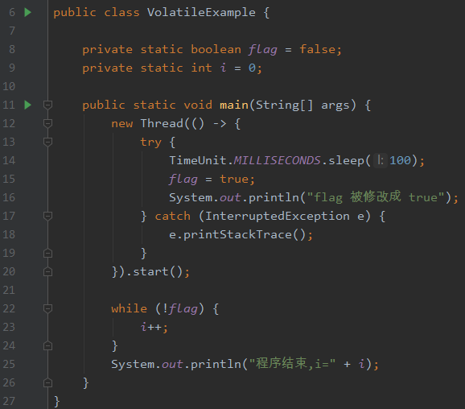
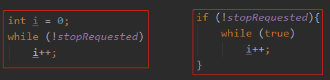

# 题目1

​	在while循环中加入带有synchronized关键词方法,将 i 改为Integer，给 i 添加volatile关键字，while中添加sleep方法等都能正常结束程序，输出结果。(当然最正统的解法是给flag加volatile)

对应原因：

1 这是可以接受的。这种优化称作提升（hoisting)，正是HopSpot Server VM的工作。结果是个活性失败(liveness failure):这个程序无法前进。修正这个问题的一种方式是同步访问stopRequested域。这个程序会如预期般在大约一秒钟之内终止(优化提升是提升是 JIT做的(比如循环表达式外提)，主要是HotSpot虚拟机会做这种优化)

​																				**循环表达式外提**

2 让两个线程之间对共享变量有 happens-before 关系，最常用的操作就是volatile 或 加锁

3 由于变量 flag 没有被 volatile 修饰，而且在子线程休眠的 100ms 中， while 循环的 flag 一直为 false，循环到一定次数后，触发了 jvm 的即时编译功能，进行循环表达式外提（Loop Expression Hoisting），导致形成死循环。而如果加了 volatile 去修饰 flag 变量，保证了 flag 的可见性，则不会进行提升。

### 角度1

同步方法可以防止在循环期间缓存 pizzaArrived（就是我们的stop）。

严格的说，为了保证变量的可见性，两个线程必须在同一个对象上进行同步。如果某个对象上只有一个线程同步操作，通过 JIT 技术，JVM 可以忽略它（逃逸分析、锁消除）。

但是，JVM 不够聪明，它无法证明其他线程在设置 pizzaArrived 之后不会调用 println，因此它只能假定其他线程可能会调用 println。（所以有同步操作）

因此，如果使用 System.out.println， JVM 将无法在循环期间缓存变量。

这就是为什么，当有 print 语句时，循环可以正常结束，尽管这不是一个正确的操作。

### 角度2

写线程释放同步锁，读线程随后获取相同的同步锁。

这是我们常规的认知。但是他紧接着说了个 In essence（本质上）。

从本质上来说，线程释放锁的操作，会强制性的将工作内存中涉及的，在释放锁之前的，所有写操作都刷新到主内存中去。

而获取锁的操作，则会强制新的重新加载可访问的值到该线程的工作内存中去。

### 角度3

前面我们已经知道了，即使一个变量没有加 volatile 关键字，JVM 会尽力保证内存的可见性。但是如果 CPU 一直处于繁忙状态，JVM 不能强制要求它去刷新内存，所以 CPU 有没办法去保证内存的可见性了。

而加了 System.out.println 之后，由于 synchronized  的存在，导致 CPU 并不是那么的繁忙（相对于之前的死循环而言）。这时候 CPU 就可能有时间去保证内存的可见性，于是 while 循环可以被终止。

### why大佬的结论

通过上面三个角度的分析，能得到两个结论

1. 输出语句的 synchronized 的影响。
2. 输出语句让 CPU 有时间去做内存刷新的事儿。比如在我的示例中，把输出语句换成new File()的操作也是可以正常结束的。

### Thread相关解释

1. **Thread.sleep 没有任何同步语义**（Thread.yield也是）。编译器不必在调用 Thread.sleep 之前将缓存在寄存器中的写刷新到共享内存，也不必在调用 Thread.sleep 之后重新加载缓存在寄存器中的值。
2. 编译器可以**自由（free）**读取 主内存中 这个字段。

原文地址：https://mp.weixin.qq.com/s/Ro02cT0_T5TdnSoifbv9wQ

