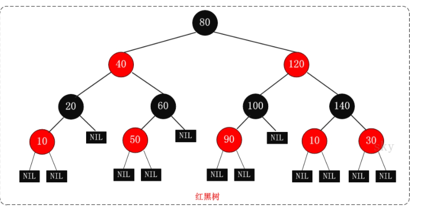
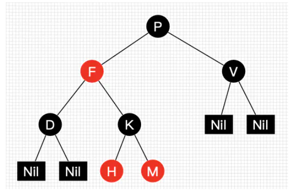

# 1 二叉树

引用：https://blog.csdn.net/qq_25343557/article/details/83750319

# 2 二叉搜索树/二叉查找树/BST树

简介：二叉查找树（Binary Search Tree）,（又：二叉搜索树，二叉排序树)

引用：https://blog.csdn.net/qq_25343557/article/details/84330095#t7

# 3 AVL树/平衡二叉树

引用：https://blog.csdn.net/qq_25343557/article/details/89110319

# 4 234树

引用：https://blog.csdn.net/asdfsadfasdfsa/article/details/86500552/

# 5 红黑树

**红黑树是一种含有红黑节点并能自平衡的二叉查找树。它必须满足下面特质**

​	性质1：每个节点要不是黑色，要么是红色

​	**性质2：根节点是黑色**

​	性质3：每个叶子节点(NIL)是黑色(这里java的处理是null)

​	**性质4：每个红色节点的两个子节点一定都是黑色(可以推出:不能有两个连续的红色节点)**

​	**性质5：任意一节点到每个叶子节点的路径都包含数量相同的黑节点(可以推出:如果一个节点存在黑子节点，那么该节点肯定有两个黑子节点)**

**红黑树示意图如下：**

**红黑树示意图2(H、M节点漏画了NIL叶子)：**

​	根据示意图2，由此可见红黑树并不是完美平衡二叉查找树，

​	**明显看出左侧H、M节点已经比右侧V节点高两个位置了。但是左子树和右子树的黑节点层数是相等的，也就是任意一个节点到每个叶子节点的路径都包含相同的黑节点(性质5)。所以红黑树这种平衡称为"黑色完美平衡"**

引用：https://www.jianshu.com/p/e136ec79235c

https://www.cnblogs.com/skywang12345/p/3245399.html#!comments