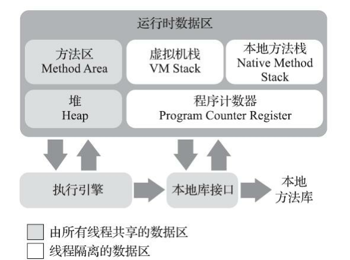
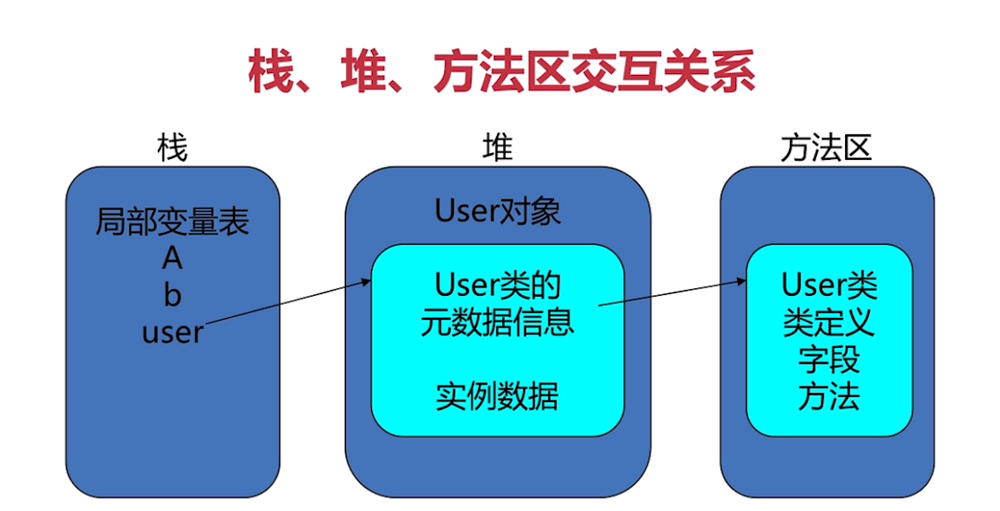
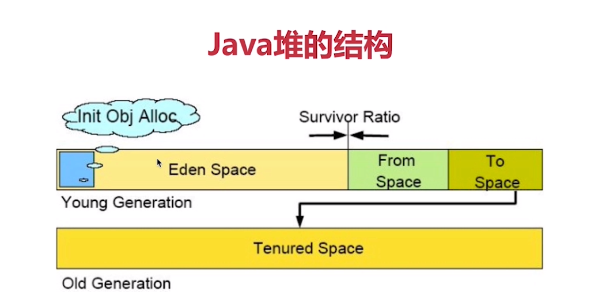
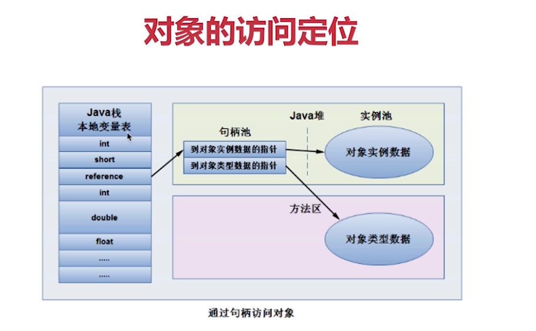
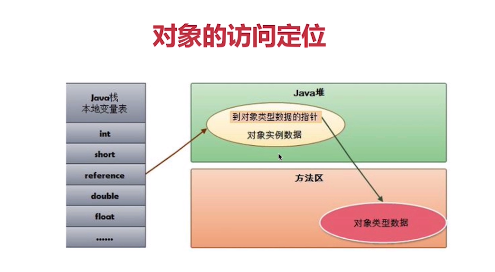

### 1 JVM的简化架构和运行时数据区

**运行时数据区：**

​	包括：程序计数器(PC寄存器)、Java虚拟机栈、本地方法栈、Java堆、方法区

​	其中程序计数器(PC寄存器)、Java虚拟机栈、本地方法栈是线程私有的，Java堆、方法区则是线程共享的

**程序计数器(PC寄存器)**

​	1 每个线程拥有一个程序计数器，是线程私有的，用来存储指向下一条指令的地址

​	2 在创建线程的时候，创建相应的程序计数器

​	3 执行本地方法时，程序计数器的值为Undefined

​	4 是一块较小的内存空间，是唯一一个在JVM规范中没有规定OutOfMemmoryError内存区域

**虚拟机栈(Java栈)**

​	1 栈是由一系列帧(Frame)组成(因此Java栈也叫帧栈),是线程私有的(栈帧(帧)是栈中的帧，帧栈(栈)是多个帧构成栈)

​	2 帧用来保存一个方法的局部变量、操作数栈(参数传递使用操作数栈)、常量池指针、动态链接、方法返回值等

​	3 每一次方法调用创建一个帧，并压栈，退出方法的时候，修改栈顶指针就可以把栈帧中的内容销毁

​	4 局部变量表存放了编译期可知的各种数据基本类型和引用类型，每个slot存放32位的数据，long,double占两个槽位

​	5 栈的优点：存取速度比堆快，仅次于程序计数器

​	6 栈的缺点：存在栈中的数据大小、生存期是在编译期决定的，缺乏灵活性

**本地方法栈**

​	在JVM中用来支持native方法执行的栈就是本地方法栈，作用和虚拟机栈非常类似，区别只是虚拟机栈为虚拟机使用Java方法服务，而本地方法栈是为虚拟机使用本地(Native)方法服务。

**Java堆**

​	1 用来存放应用系统创建的对象和数组，所有线程共享Java堆

​	2 GC主要就是管理堆空间，对分代GC来说，堆也是分代的(老年代，新生代等区域划分仅是一部分垃圾回收器的设计风格，并非某个Java虚拟机具体实现的固有内存布局，更不是虚拟机规范中对堆的细致划分，现在垃圾回收划分有了很大的改变（G1收集器出现为分界），再用上面的提法就有待商榷了)

​	3 堆的优点：运行期动态分配内存大小，自动进行垃圾回收。

​		堆的缺点：效率相对栈较慢

**方法区**

​	1 方法区是线程共享的，通常用来保存装载的类的结构信息（运行时的常量池、类型信息、常量、静态变量、等数据）

​	**运行时常量池**：是方法区的一部分，是Class文件中每个类或接口的常量池表，在运行期间的表示形式，通常包括，类的版本、字段、方法、接口等信息。通常在加载类和接口到JVM后就创建相应的运行时常量池

​	2 通常和元空间关联在一起，但具体的跟JVM实现和版本有关(Java8取消永久代(PermGen)，永久代和元空间存储位置不同，永久代物理是是堆的一部分，和新生代，老年代地址是连续的。而元空间属于本地内存；存储内容不同，元空间存储类的元信息，静态变量和常量池等并入堆中。相当于永久代的数据被分到了堆和元空间中)

​	3 JVM规范把方法区描述为堆的一个逻辑部分，但它有一个别称为Non-heap(非堆)，目的是与Java堆区分开来

**栈、堆、方法区、交互关系**

​	栈指向堆，堆的相关元数据信息指向方法区。

### 2 Java堆内存模型和分配

**Java堆内存概述**

Java堆用来存放应用系统创建的对象和数组，所有线程共享Java堆(创建对象和数组的手段就是通过new来创建。根基虚拟机标准，堆内存逻辑上是连续的，物理上不一定连续 。Java堆是可以固定大小，也可以是可扩展的，目前主流虚拟机都是可扩展的，可以通过-Xms来设定，Java堆没有内存完成实例分配，并且堆无法再扩展时，会抛出OutOfMemoryError异常)

Java堆是在运行期动态分配内存大小，自动进行垃圾回收

Java垃圾回收(GC)主要就是回收堆内存，对分代GC来说，堆也是分代的（老年代，新生代等区域划分仅是一部分垃圾回收器的设计风格，并非某个Java虚拟机具体实现的固有内存布局，更不是虚拟机规范中对堆的细致划分，在G1收集器到现在垃圾回收划分有了很大的改变，再用上面的提法就有待商榷了）

Eden Space（伊甸园区）

Survivor Space(From space、To space)(幸存者区/存活区) 

Survivor Ratio(设置存活区和伊甸园区的比例)

Old Gen（老年代)

新生代用来放新分配的对象，新生代中经过垃圾回收，没有回收掉的对象(多次回收还存活的对象)，被复制到老年代(复制相当于移动到老年代)

老年代存储对象比新生代存储对象年龄大很多

老年代存储一些大对象

堆=新生代+老年代

新生代=Eden+存活区(存活区分From space、To space)（新生代在使用的时候只能使用其中一块）

从前的持久代(永久代(perm gen))，用来放Class，Method等元信息的区域，从JDK8开始就去掉了。取而代之的是元空间(MetaSpace)，元空间并不在虚拟机里面，而是直接使用本地内存

**对象的内存布局**

 对象在内存中的存储布局(这里是以HotSpot虚拟机为例来说明)，分为对象头、实例数据、对齐填充

​	**对象头：**

​		1 Mark Word：存储对象自身的运行数据，如：HashCode，GC分代年龄，锁状态标志等

​		2 类型指针：对象指向它的类元数据的指针

​	**实例数据：**真正存放对象实例数据的地方

​	**对齐填充：**仅仅是占位符。因为HotSpot要求对象起始地址都是8字节的整数倍，所以如果不是整数倍就需要占位符来对齐。

对象的访问定位

在JVM规范中的reference类型是一个指向对象的引用，没有规定具体的实现。因此对象的访问方式取决于JVM的实现。

主流的实现方式

1 使用引用池(句柄池)

Java堆会换分一块内存作为引用池，reference存储引用地址，引用池中存放对象的实例数据和类元数据的地址，如下图所示(实例池对象实例数据地址变动时并不需要改变栈的指针，只需修改引用池对应的指针即可)

2 使用指针(**HotSpot采用**)

Java堆会存放访问元数据的地址，reference存储的就是访问对象的地址，如下图所示（由于使用指针访问比使用引用池少了一次指针访问的开销，所以相对速度会快一些）

### 3 Trace跟踪和Java堆/栈的参数配置

**Trace跟踪参数**

jdk9开始虚拟机日志输出统一用-Xlog 参数开头

jdk9与之前参数对比参考官方文档相关说明

https://docs.oracle.com/en/java/javase/13/docs/specs/man/java.html

或相关博客概述jdk8参数

https://blog.csdn.net/weixin_33860528/article/details/91430295?utm_medium=distribute.pc_relevant.none-task-blog-baidujs_title-0&spm=1001.2101.3001.4242

//括号为jdk8的参数

可以打印GC的简要信息：-Xlog:gc(-XX:+PrintGC)

打印GC详细信息：-Xlog:gc*(-XX:+PrintGCDetails)

指定GC log的位置，以文件输出：-Xlog:gc:filename(-Xloggc:filename.log)(filename指代文件名，通常用garbage-collection.log或gc.log命名,改命令仅生成文件，并不创建文件夹)

每一次GC后，都打印堆信息：-Xlog:gc+heap=debug(-XX:+PrintHeapAtGC)(debug为日志打印等级，也可以是trace等其他等级)

**GC日志格式**(jdk9之后)

GC日志格式和垃圾收集器相关，不同垃圾收集器产生的日志会有些许差别，以下格式主要说明目前JDK默认的G1垃圾收集器的日志格式

 GC发生的时间，也就是JVM从启动以来经过的秒数

日志级别信息，和日志类型标记

GC识别号(相当于序号/编号,不一定是连续的)

GC的类型和说明GC的原因

容量：GC前容量->GC后容量(该区域总容量)

GC持续时间，单位秒。有的收集器会有更详细的描述，比如：user表示应用程序消耗的时间，sys表示系统内核消耗的时间，real表示操作从开始到结束的时间

**Java堆的参数**

Xms：初始堆大小，默认物理内存的1/64(从jdk13开始要求Xms必须是1024的倍数)

Xmx：最大堆大小，默认是物理内存的1/4

配置建议Xms和Xmx相等，这样的好处是避免每次GC过后重新调整大小，减少系统的内存分配开销。

Xmn：新生代大小，默认整个队的3/8

PS:G1收集器前是CMS收集器

-XX:+HeapDumpOnOutOfMemoryError   OOM时导出堆到文件（默认当前java运行路径下）

-XX:+HeapDumpPath 导出OOM的路径

-XX:NewRatio：老年代与新生代的比值，如果xms=xmx，且设置了xmn的情况下，该参数不用设置

-XX:SurvivorRatio：Eden区和Survivor区的大小比值，设置为8，则两个Survivor与一个Eden去的比值为2:8,一个Survivor占整个新生的1/10

-XX:OnOutOfMemoryError：在OOM时，执行一个脚本（通常线上服务器使用，记录信息或者给予警告等）

-XX:+UseConcMarkSweepGC：开启CMS收集器

**内存分析工具MAT(Memory Analyzer Tool)**

下载地址:https://www.eclipse.org/mat/downloads.php

下载后直接解压使用即可

**hprof文件查看**

1 可以查看并分析-XX:+HeapDumpOnOutOfMemoryError 参数配置后，导出的hprof文件(类似java_pid11288.hprof文件名)

2 jdk自带的jvisualvm.exe查看(jdk9后需要另外下载使用)

**Java栈的参数**

-Xss：通常只有几百K，决定了函数调用的深度

**元空间的参数**(建议采用默认)

-XX:MetaspaceSize：初始空间大小

-XX:MaxMetaspaceSize：最大空间，默认是没有限制的

-XX:MinMetaspaceFreeRatio：在GC之后，最小的Metaspace剩余空间容量的百分比

-XX:MaxMetaspaceFreeRatio：在GC之后，最大的Metaspace剩余空间容量的百分比

### 4 JVM内存分配机制之栈上分配与TLAB的区别

https://cloud.tencent.com/developer/article/1751577

