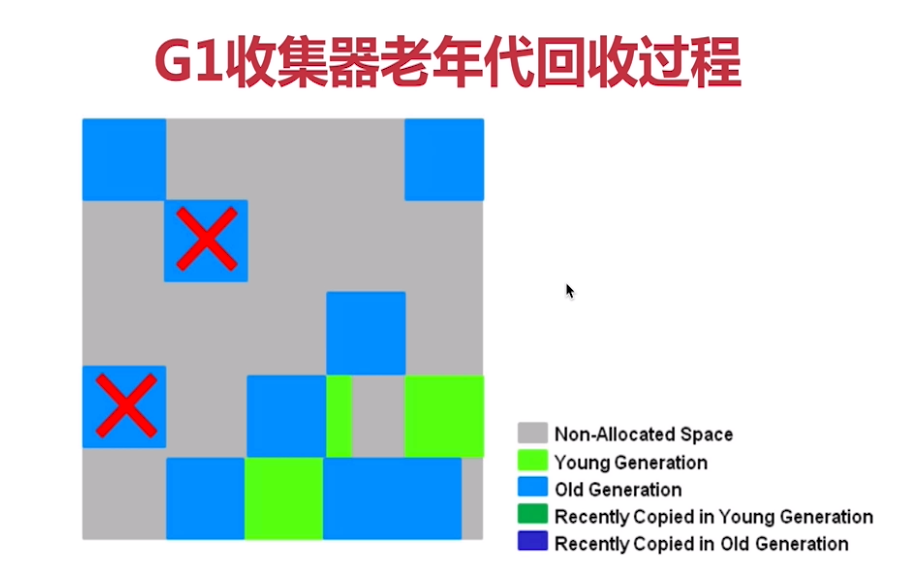

### 1  垃圾回收基础和根搜索算法

 什么是垃圾：简单说就是内存中已经不再被使用到的内存空间就是垃圾

 **引用计数算法：**

给对象添加一个引用计数器，有访问就加1，引用失效就减1

优点：实现简单、效率高

缺点：不能解决对象之间循环引用的问题

**可达性算法/根搜索算法：**

​	从根(GC Roots)节点向下搜索对象节点，搜索走过的路径成为引用链，当一个对象到根之间没有连通的话，则该对象不可用

​	可作为GC Roots的对象包括：虚拟机栈(栈帧局部变量)中引用的对象，方法区类静态属性引用的对象，方法区中常量引用的对象、被同步锁(synchronized)持有的对象、本地方法栈JNI引用的对象等

​	HotSpot使用了一组叫做OopMap的数据结构达到准确式GC的目的(一旦类加载动作完成的时候，HotSpot就会把对象内什么偏移量上是什么类型的数据计算出来,也会在特定的位置记录下栈里和寄存器里哪些位置是引用。这样收集器在扫描时就可以直接得知这些信息了，并不需要真正一个不漏地从方法区等GC Roots开始查找)

​	在OopMap的协助下，JVM可以很快的做完GC Roots枚举。但是JVM并没有为每条指令生成一个OopMap

​	记录OopMap的这些"特定位置被称为安全点，即当前线程执行到安全点后才允许暂停进行GC

​	如果在一段代码中，对象引用关系不会发生变化，这个区域中任何地方开始GC都是安全的，那么这个区域称为安全区域(Safe Region)，可以把安全区域看作被扩展拉伸了的安全点

### 	2  引用分类

​	强引用：类似于Object a = new A()这样的，不会被回收

​	软引用：还有用但并不必须的对象。用SoftReference来实现软引用，内存不够时会被回收

​	弱引用：非必须对象，比软引用还要弱，垃圾回收时会回收掉。用WeakReference来实现弱引用

​	虚引用：也称为幽灵引用或幻影引用，是最弱的引用。垃圾回收时会回收掉。用PhantomReference来实现虚引用

​	使用场景：系统中的一些缓存场景可以使用软引用、弱引用、虚引用来实现。

​	例子：假如有一个应用需要读取大量的本地图片，如果每次读取图片都从硬盘读取，则会严重影响性能，但是如果全部加载到内存当中，又有可能造成内存溢出，此时使用软引用可以解决这个问题。

　设计思路：用一个HashMap来保存图片的路径 和 相应图片对象关联的软引用之间的映射关系，在内存不足时，JVM会自动回收这些缓存图片对象所占用的空间，从而有效地避免了OOM的问题

### 3  跨代引用

跨代引用：也就是一个代中的对象引用另一个代中的对象

跨代引用假说：跨代引用相对于同代引用来说只是极少数

隐含推论：存在互相引用关系的两个对象，是应该倾向于同时生存或同时消亡的

**记忆集**

记忆集(Remembered Set)：一种记录从非收集区域执行收集区域的指针集合的抽象数据结构(新生代建立一个全局的数据结构(记忆集)，这个结构把老年代分为若干个小块，标识哪一块会存在跨代引用。当Minor Gc（新生代GC）时，只有包含了跨代引用小块的对象才会被加入GC Roots进行扫描)

记忆集-实现方式

字长精度：每个记录精确到一个机器字长，该字包含跨代指针

对象精度：每个记录精确到一个对象，该对象里有字段含有跨代指针

卡精度（常用方式）：

1 每个记录精确到一块内存区域，改区域内有对象含有跨代指针

2 卡精度”所指的是用一种称为“卡表”（Card Table）的方式去实现记忆集

3 卡表就是记忆集的一种具体实现，它定义了记忆集的记录精度、与堆内存的映射关系等（HashMap与Map的关系来类比理解）

4 卡表的每个元素都对应着其标识的内存区域中的一块特定大小的内存块，这个内存块称为卡页（Card Page）(一个卡页中有多个对象，一个卡页中有一个(或更多)对象存在跨代指针。那就将对应卡表的数组元素的值标识为1，称为这个元素变脏（Dirty），没有则标识为0。在垃圾回收时只要筛选变脏的元素，得出卡页的跨代指针，把他们放入GC Roots中一并扫描)

**写屏障**

写屏障可以看成是对JVM对"引用类型字段赋值"这个动作的AOP

通过写屏障来实现当对象状态改变后，维护卡表状态

**finalize方法**

1 如非必要，尽量避免使用finalize，它的对象销毁是不确定的。

2 finalize不应该用来管理socket, file handle, database connection等昂贵资源，因为finalize是在object被GC的时候才调用。如果内存足够，它可能永远都不会被调用

3 对于关闭JVM的时候必须要做的事情，应该用Runtime#addShutdownHook(Thread hook)来实现，放到finalize里面的code并不保证在这个时候会被调用

4 即使Override了finalize，事情也没有那么简单，首先，override了finalize的object并不是和其他情况下一样直接释放内存，也不是直接调用finalize，而是放到finalizing queue，由JVM上一个单独的thread来进行处理，同时你要当心在finalize里面不小心调用了code，把object自己重新reference到——这个时候它就复活了，可能事情做到一半，又从finalizing queue里面拿出来了，造成不稳定的状态——这种风险是不值得绝大多数情况下的应用场景的

5 对于需要管理生命周期的对象，应该用Spring的initialzing/destroyable bean等来进行管理

6 对于socket, file handle, database connection, thread等昂贵资源，更应该首先考虑复用（连接池，线程池）

7 综上所述，除非有足够正当的理由，足够多的测试，足够多的经验，否则不要用finalize，既不要call，也不要override.

8 可以在finalize里实现所谓的对象自救(不建议使用)

**判断是否是垃圾步骤**

1 根搜索算法判断不可用

2 看是否有必要执行finalize方法

3 两个步骤走完后对象仍然没有被使用，那就属于垃圾

**GC类型(相关名词)**

MinorGC/YoungGC：发生在新生代的收集动作

MajorGC/OldGC：发生在老年代的GC，目前只有CMS收集器会有单独收集老年代的行为

MixedGC：收集整个新生代以及部分老年代，目前只有G1收集器会有这种行为

FullGC：收集整个Java堆和方法区的GC

**Stop-The-World(STM)**

STW是Java中一种全局暂停的现象，多半由于GC引起。所谓全局停顿，就是所有Java代码停止运行，native代码可以执行，但不能和JVM交互

其危害是长时间服务停止，没有响应。对于HA(双机集群系统)系统，可能引起主备切换，严重危害生产环境

**垃圾收集类型**

串行收集：串行垃圾收集器，是指使用单线程进行垃圾回收，会暂停Java中所有线程(用户线程)。如：Serial

并行收集：多个GC线程并发工作，会暂停Java中所有线程(用户线程)。(其实就是优化了串行收集，将单线程改为多线程收集)如：Parallel

并发收集：用户线程和GC线程同时执行(不一定是并行，可能交替执行)，不需要停顿用户线程，如：CMS

**判断类无用的条件**

1 JVM中该类的所有实例都已经被回收

2 加载该类的ClassLoader已经被回收

3 没有任何地方引用该类的Class对象

### 4 垃圾回收算法

**标记清除法**

标记清除法(Mark-Sweep)算法分成标记和清除两个阶段，先标记处要回收的对象，然后统一回收这些对象

优点：简单

缺点：

​	1 效率不高，标记和清除的效率都不高

​	2 标记清除后会产生大量不连续的内存碎片，从而导致在分配大对象时触发GC

**复制算法**

复制算法(Copying)：把内存分成两块完全相同的区域，每次使用其中一块，当一块使用完了，就把这块还存活的对象拷贝到另一块，然后把这块清除掉（新生代中的存活区From 和 To就是使用了复制算法）

优点：实现简单，运行高效，不用考虑内存碎片问题

缺点：内存比较浪费

JVM实际实现中，是将内存分为一块较大的Eden区和两块较小的Survivor空间，每次使用Eden和一块Survivor，回收时，把存活的对象复制到另一块Survivor

HotSpot默认的Eden和Survivor比是8:1，也就是每次能用90%的新生代空间

如果Survivor空间不够，就要依赖老年代进行分配担保，把放不下的对象直接进入老年代

**分配担保**

​	分配担保：当新生代进行垃圾回收后，新生代的存活区放置不下，那么需要把这些对象放置到老年代去的策略，也就是老年代为新生代的GC做空间分配担保，步骤如下：

​	1 在发生MinorGC前，JVM会检查老年代的最大可用的连续空间，是否大于新生代所有对象的总空间，如果大于，可以确保MinorGC是安全的

​	2 如果小于，那么JVM会检查是否设置了允许担保失败（-XX：HandlePromotionFailure 设置是否允许担保失败），如果允许，则继续检查老年代最大可用的连续空间，是否大于历次晋升到老年代对象的平均大小

​	3 如果大于，则尝试进行一次MinorGC

​	4 如果不大于，则该做一次FullGC

​	5 假如某次Minor GC存活后的对象突增，远远高于历史平均值的话，依然会导致担保失败。如果出现了担保失败，那就只好老老实实地重新发起一次Full GC(虽然担保失败时绕的圈子是最大的，但通常情况下都还是会将-XX：HandlePromotionFailure开关打开，避免Full GC过于频繁)

**标记整理法**

​	标记整理算法（Mark-Compact）：由于复制算法在存活对象比较多的时候，效率较低，而且浪费空间，因此老年代一般不会选用复制算法，老年代多选用标记整理算法

​	标记过程跟标记清除一样，但后续不是直接清除可回收对象，而是让所有存活对象都向一端移动，然后直接清除边界以外的内存

### 5  串行收集器

Serial(串行)收集器( def new)/Serial Old(tenured)收集器，是一个单线程的收集器，在垃圾收集时，会Stop-the-World

优点：优点是简单，对于单cpu，由于没有多线程的交互开销，可能更高效，是默认的Client模式下的新生代收集器

使用-XX:+UseSerialGC来开启，会使用：Serial+Serial Old的收集器组合

新生代使用复制算法，老年代使用标记整理算法

### 6  并行收集器和Parallel Scavenge收集器

**并行收集器**

​	ParNew(并行)收集器：使用多线程进行垃圾回收，在垃圾收集时，会Stop-the-World

​	在并发能力好的CPU环境里，它停顿的时间要比串行收集器短。单对于单cpu或并发能力较弱的CPU，由于多线程的交互开销，可能比串行回收器更差

​	是Server模式下首选的新生代收集器，并且能和CMS收集器配合使用（使用CMS则新生代就是并行收集器）

​	-XX:ParallelGCThreads ：指定并行线程数，最好与CPU内核数量一致

​	新生代使用复制算法

**Parallel Scavenge/Parallel Old收集器**

​	Parallel Scavenge收集器：是一个应用于新生代的、使用复制算法的、并行的收集器（跟ParNew很类似，但更关注吞吐量，能最高效率利用CPU，适合运行后台应用）

​	Parallel Old收集器：Parallel Old是Parallel Scavenge收集器的老年代版本，支持多线程并发收集，基于标记-整理算法实现

​	-XX:+UseParallelGC / -XX:+UseParallelOldGC：因为目前该收集器没有更好的组合，开启其中一个另一个收集器都会自动组合开启。

​	-XX:MaxGCPauseMillis：设置GC的最大停顿时间(参数设置较小的话，会导致GC的触发频率提高)

​	新生代使用复制算法，老年代使用标记-整理算法

### 7  CMS收集器

CMS(Concurrent Mark and Sweep并发标记清除)收集器阶段分为

初始标记：只标记GC Roots能直接关联到的对象

并发标记：进行GC Roots Tracing(从根节点关联往下追踪，看哪些对象存活，哪些是垃圾)的过程

重新标记：修正并发标记期间，因程序运行导致标记发生变化的那一部分对象

并发清除：并发回收对象

在初始标记和重新标记两个阶段还是会发生Stop-the-World

使用标记清除算法，多线程并发收集的垃圾收集器

最后的重置线程，指的是清空跟收集相关的数据并重置，为下一次收集做准备

优点：低停顿、并发执行

缺点：

​	并发执行，对CPU资源压力大

​	无法处理 在处理过程中 产生的垃圾，可能导致FullGC

​	采用的标记清除算法会导致大量碎片，从而在分配大对象时可能触发FullGC

-XX:+UseConcMarkSweepGC：开启CMS收集器

一些相关的CMS收集器相关的参数配置可以查找对应文档(不同的JDK版本可能会有变化)

https://docs.oracle.com/en/java/javase/13/docs/specs/man/java.html

**CMF(concurrent mode failure)/并发模式失败/并发故障问题**

​	在并行清理的过程中老年代的空间不足以容纳新的对象(也就是老年代正在清理，从年轻带晋升了新的对象，或者直接分配大对象年轻代放不下导致直接在老年代生成，这时候老年代也放不下)，则会抛出concurrent mode failure

concurrent mode failure的影响：

​	会导致老年代的收集器从CMS退化为Serial Old,所有应用线程被暂停，停顿时间变长(STW)。

可能的原因及方案

​	1 CMS触发太晚：将-XX:CMSInitiatingOccupancyFraction=N调小；

​	2 空间碎片太多：开启空间碎片整理，并将空间碎片整理周期设置在合理范围；

​		-XX:+UseCMSCompactAtFullCollection （空间碎片整理）

​		-XX:CMSFullGCsBeforeCompaction=n

​	3 垃圾产生速度超过清理速度：晋升阈值、Eden区，Survivor设置的比例或大小不合理、确实存在大对象

引用：https://blog.csdn.net/muzhixi/article/details/105274542

### 8 G1收集器

G1(Garbage-First)收集器：是一款面向服务端应用的收集器，与其他收集器相比，具有如下特点

​	1 G1把内存划分成多个独立的区域(Region)

​	2 G1仍采用分代思想，保留了新生代和老年代，但它们不再是物理隔离的，而是一部分Region的集合，且不需要Region是连续的

上图：

​	灰色区域：freedom Region 空闲区域

​	红色区域(Humongous)：专门用来存储大对象。G1认为只要大小超过了一个Region容量一半的对象即可判定为大对象。可以使用多个Region。(G1的大多数行为都把Humongous Region作为老年代的一部分来进行看待)

​	3 G1能充分利用多CPU、多核环境硬件优势，尽量缩短STW

​	4 G1整体上采用标记整理算法，局部是通过复制算法，不会产生内存碎片

​	5 G1的停顿可预测，能明确指定在一个时间段内，消耗在垃圾收集上的时间不能超过多长时间(使用参数-XX：MaxGCPauseMillis指定时间，默认值是200毫秒)

​	6 G1跟踪各个Region里面垃圾堆的价值大小，在后台维护一个优先列表，每次根据允许的时间来回收价值最大(占用内存较大，或垃圾较多)的区域，从而保证在有限时间内的高效收集

​	PS:G1没有FullGC，有Mixed GC(混合收集(Mixed GC)：指目标是收集整个新生代以及部分老年代（价值较大的老年代）的垃圾收集。目前只有G1收集器会有这种行为)

**G1运行阶段**

​	跟CMS类似，也分为四个阶段

​	初始标记：只标记GC Roots能直接关联到的对象

​	并发标记：进行GC Roots Tracing(从根节点关联往下追踪，看哪些对象存活，哪些是垃圾)的过程

​	最终标记：修正并发标记期间，因程序运行导致标记发生变化的那一部分对象

​	筛选回收：根据时间来进行价值最大化的回收(时间范围内价值最大化，不一定要全部回收完)

**新生代回收过程**

回收前

新生代回收过程(一部分垃圾直接回收，另一部分移入存活区)

新生代回收后

**老年代回收过程**

并发标记、最终标记

筛选回收

筛选回收后

**使用和配置G1(常用)**

-XX:+UseG1GC ：开启G1，JDK9之后默认开启(JDK8默认收集器 Parallel Scavenge加Parallel Old组合)

-XX:MaxGCPauseMillis=time ：最大GC停顿时间，这是软目标，JVM将尽可能(但不保证)停顿小于这个时间

-XX:InitiatingHeapOccupancyPercent=percent ： 堆占用了多少的时候触发GC，默认45(百分比)

-XX:NewRatio=ratio ：默认为2

-XX:SurvivorRatio=ratio ：默认为8

-XX:MaxTenuringThreshold=threshold ：新生代到老年代的岁数，默认是15

-XX:ParallelGCThreads=threads ：**并行**GC的线程数，默认值会根据平台不同而不同

-XX:ConcGCThreads=threads ：**并发**GC使用的线程数

-XX:G1ReservePercent=percent ：设置作为空闲空间的预留内存百分比，以降低目标空间溢出的风险

-XX:G1HeapRegionSize=size ：设置的G1区域的大小。值是2的幂，范围是1MB到32MB。目标是根据最小的Java堆大小划分出约2048个区域。

**9 ZGC收集器、GC性能指标和JVM内存配置原则**

**ZGC收集器**

ZGC收集器：JDK11加入的具有实验性质的低延迟收集器

ZGC的设计目标是：支持TB级的内存容量，暂停时间低(<10ms)，对整个程序吞吐量的影响小于15%

ZGC主要特征：ZGC收集器是一款基于Region内存布局的，（暂时）不设分代的，使用了读屏障、染色指针和内存多重映射等技术来实现可并发的标记-整理算法的，以低延迟为首要目标的一款垃圾收集器

染色指针:染色指针是一种直接将少量额外的信息存储在指针上的技术，可是为什么指针本身也可以存储额外信息呢？在64位系统中，理论可以访问的内存高达16EB（2的64次幂）字节

读屏障：类似于AOP的功能，在堆上读取引用的时候触发读屏障。主要是用来检查引用的状态，在引用返回给应用程序之前执行一些特定的工作。

**GC性能指标**

吞吐量=应用代码执行的时间/运行总时间

GC负荷=GC时间/运行总时间

暂停时间：发送STW(Stop-the-World)的总时间

GC频率：就是GC在一个时间段发生的次数

反应速度：就是从对象成为垃圾到被回收的时间(反应速度并不一定是越快越好，反应速度快表示对内存的利用率高，但是也表示GC比较频繁。如G1收集器对老年代的回收策略(Mixed GC)，价值不高的Region块的垃圾可能很长时间都不会被回收)

**JVM内存配置基本策略**

​	1 新生代设置大点，如果太小会导致：

​		a YGC(YoungGc)次数更加频繁

​		b 可能导致YGC后的对象进入老年代，如果此时老年代满了，会触发FGC(FullGC)

​		PS:比例建议大概是3/8到一半之间

​	2 对于老年代内存配置：

​		（1）针对响应时间优先的应用

​			a 由于老年代通常采用并发收集器，因此其大小要综合考虑并发量和并发持续时间

​			b 如果设置小了，可能会导致内存碎片，搞回收频率会导致应用暂停

​			c 如果设置大了，会需要较长的回收时间

​		（2）针对吞吐量优先的应用

​				a 通常设置较大的新生代和较小的老年代，这样可以尽可能回收大部分短期对象，减少中期对象，而老年代尽量			存放长期存活的对象

​		3 依据对象的存活周期进行分类。

​			(1) 新生代存活时间比较短，新生代分配大一点。老年代存活时间比较长，老年代分配大一点(对象优先在新生代分配，长期存活的对象进入老年代)

​		4 根据不同代的特点，选取合适的收集算法及配置：

​			(1) 少量对象存活，适合复制算法。大量对象存活，适合标记清除或者标记整理。

​			(2) 根据应用的实际情况配置对应的收集器，选择合适的新生代/老年代的参数设置。

### 10  HopSpot各类收集器使用场景及对应关系

常见用法：

Serial(新生代)/Serial Old(老年代)

ParNew(新生代)/CMS(老年代)

​	CMS作为老年代的收集器，却无法与JDK 1.4.0中已经存在的新生代收集器ParallelScavenge配合工作，所以在JDK 5中使用CMS来收集老年代的时候，新生代只能选择ParNew或者Serial收集器中的一个。ParNew收集器是激活CMS后（使用-XX：+UseConcMarkSweepGC选项）的默认新生代收集器，也可以使用-XX：+/-UseParNewGC选项来强制指定或者禁用它

Parallel Scavenge(新生代)/Serial Old(老年代)

​	Parallel Scavenge收集器有一个参数-XX：+UseAdaptiveSizePolicy值得关注。这是一个开关参数，当这个参数被激活之后，就不需要人工指定新生代的大小（-Xmn）、Eden与Survivor区的比例（-XX：SurvivorRatio）、晋升老年代对象大小（-XX：PretenureSizeThreshold）等细节参数了，虚拟机会根据当前系统的运行情况收集性能监控信息，动态调整这些参数以提供最合适的停顿时间或者最大的吞吐量。这种调节方式称为垃圾收集的自适应的调节策略（GC Ergonomics）

​	Serial Old(使用标记-整理算法)一种是在JDK 5以及之前的版本中与Parallel Scavenge收集器搭配使用，另外一种就是作为CMS收集器发生失败时的后备预案，在并发收集发生Concurrent Mode Failure时使用

​	Parallel Scavenge收集器架构中本身有PS MarkSweep收集器来进行老年代收集，并非直接调用Serial Old收集器，但是这个PS MarkSweep收集器与Serial Old的实现几乎是一样的，所以在官方的许多资料中都是直接以Serial Old代替PS MarkSweep进行讲解

Parallel Scavenge(新生代)/Parallel Old(老年代)

​	Parallel Old是Parallel Scavenge收集器的老年代版本，支持多线程并发收集，基于标记-整理算法实现。这个收集器是直到JDK 6时才开始提供的

G1（新生代/老年代）

