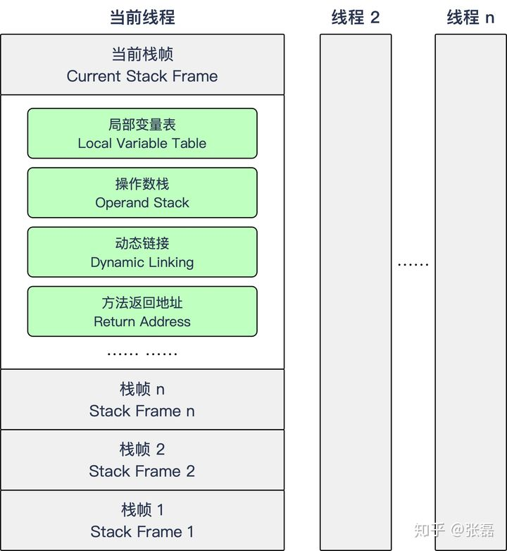

### 1 栈帧

#### 1.1 执行引擎

1 JVM的字节码执行引擎，功能基本就是输入字节码文件，然后对字节码进行解析并处理，最后输出执行的结果

2 在不同的虚拟机实现里，执行引擎在执行 Java 代码的时候可能会有解释执行（通过解释器执行）和编译执行（通过即时编译器(JIT)产生本地代码执行）两种方式，也可能两者都有，甚至还可能会包含几个不同级别的编译器执行引擎

3 如何执行方法中的字节码指令，JVM通过基于栈的字节码解释执行引擎来执行指令,JVM的指令集也是基于栈的

#### 1.2 栈帧概述

1 栈帧是用于支持JVM进行方法调用和方法执行的数据结构

2 栈帧随着方法调用而创建，随着方法结束而销毁

3 栈帧里面存储了方法的局部变量、操作数栈、动态连接、方法返回地址等信息

#### 1.3 局部变量表

局部变量表：用来存放方法参数和方法内部定义的局部变量的存储空间

1：以变量槽slot位单位，目前一个slot存放32位以内的数据类型

2：对于64位的数据占2个slot

3：对于实例方法，第0位slot存放的是this，然后从1到n，依次分配给参数列表

4：然后根据方法体内部定义的变量顺序和作用域来分配slot

5：slot是复用的，以节省栈帧的空间，这种设计可能会影响到系统的垃圾收集行为

#### 1.4 操作数栈

操作数栈：用来存放方法运行期间，各个指令操作的数据

1 操作数栈中元素的数据类型必须和字节码指令顺序严格匹配

2 虚拟机在实现栈帧的时候可能或做一些优化，让两个栈帧出现部分重叠区域，以存放公用的数据

#### 1.5 动态连接

动态连接：每个栈帧持有一个指向运行时常量池中该栈帧所属方法的引用，以支持方法调用过程的动态连接

1 静态解析：类加载的时候，符号引用就转化成直接引用

2 动态连接：运行期间转换为直接引用 

#### 1.6 方法返回地址/调用

方法返回地址：方法执行后返回的地址

方法调用：方法调用就是确定具体调用哪一个方法，并不涉及方法内部的执行过程

1 部分方法是直接在类加载的解析阶段，就确定了直接引用关系

2 对于实例方法，也称虚方法，因为多态，需要运行期间动态分派

### 2 解释器与编译器

**提前编译**

​	提前编译产品和对其的研究有着两条明显的分支，一条分支在程序运行之前把程序代码编译成机器码的静态翻译工作；另外一条分支是把原本即时编译器在运行时要做的编译工作提前做好并保存下来，下次运行到这些代码（譬如公共库代码在被同一台机器其他Java进程使用）时直接把它加载进来使用

**JIT即时编译器**

​	在Java HotSpot VM内部，实际上有两个单独的JIT编译器模式，分别称为C1(客户端)和C2(服务端)。C1用于需要快速启动和坚如磐石的优化的应用；GUI应用程序通常是此编译器的理想选择。另一方面，C2最初是用于长时间运行的（主要是服务器端）应用程序。在某些Java SE 7更高版本之前，分别使用`-client`和`-server`开关可以使用这两种模式。

**编译模式**	

​	无论采用的编译器是客户端编译器还是服务端编译器，解释器与编译器搭配使用的方式在虚拟机中被称为“混合模式”（Mixed Mode），用户也可以使用参数“-Xint”强制虚拟机运行于“解释模式”（Interpreted Mode）	

### 4 方法调用

#### 4.1概述

​	1 方法调用不等同于方法被执行，方法调用阶段是确定调用哪一个方法(未涉及方法内部的具体运行过程)。

​	2 class文件的编译过程中不包含传统程序语言的连接步骤，一切方法调用在class文件里面存储的都只是符号引用，而不是方法在实际运行时内存布局的入口地址(也就是直接引用)。

​	3 这个特性给Java带来了更强大的动态扩展能力，也使得Java方法调用过程变得相对复杂，某些调用需要在类加载期间，甚至到运行期间才能确定目标方法的直接引用。

#### 4.2解析调用

调用不同类型的方法，字节码指令集里设计了不同的指令。在Java虚拟机支持以下5条方法调用字节码指令，分别是

​	 invokestatic：用于调用静态方法。

​	 invokespecial：用于调用实例构造器<init>()方法、私有方法和父类中的方法。

​	 invokevirtual：用于调用所有的虚方法(final修饰的方法也是该指令调用，但是并非虚方法)。

​	 invokeinterface：用于调用接口方法，会在运行时再确定一个实现该接口的对象。

​	 invokedynamic：先在运行时动态解析出调用点限定符所引用的方法，然后再执行该方法。前面4条调用指令，分派逻辑都固化在Java虚拟机内部，而invokedynamic指令的分派逻辑是由用户设定的引导方法来决定的。(JDK 7之后(JSR-292规范),java.lang.invoke包)

​	1 只要能被invokestatic和invokespecial指令调用的方法，都可以在解析阶段中确定唯一的调用版本，Java语言里符合这个条件的方法共有静态方法、私有方法、实例构造器、父类方法4种，再加上被final修饰的方法（尽管它使用invokevirtual指令调用），这5种方法调用会在类加载的时候就可以把符号引用解析为该方法的直接引用。这些方法统称为“非虚方法”（Non-Virtual Method），与之相反，其他方法就被称为“虚方法”（Virtual Method）

​	2 Java中的非虚方法除了使用invokestatic、invokespecial调用的方法之外还有一种，就是被final修饰的实例方法

**动态类型语言支持：**

​	**java.lang.invoke包**(具体用例参考demo2-com.star.jvm.demo.invoke.MethodHandleTest)

​		1 JDK7新加入的，是JSR 292的一个重要组成部分，提供动态语言类型的支持

​		2 Reflection和MethodHandle机制本质上都是在模拟方法调用，但是Reflection是在模拟Java代码层次的方法调用，而MethodHandle是在模拟字节码层次的方法调用。

​		3 Reflection是方法在Java端的全面映像，包含了方法的签名、描述符以及方法属性表中各种属性的Java端表示方式，还包含执行权限等的运行期信息。而MethodHandle仅包含执行该方法的相关信息。用开发人员通俗的话来讲，Reflection是重量级，而MethodHandle是轻量级。

#### 4.3  静态分派和动态分派

#### 分派：虚拟机如何确定正确的目标方法调用，具体分为静态分派和动态分派来实现

1 静态分派：所有依赖静态类型来定位方法执行版本的分派方式，比如重载方法

2 动态分派：根据运行期的实际类型来定位方法执行版本的分派方式，比如重写方法

单分派和多分派：就是按照分派思考的维度，1个以上就是多分派。只有一个称为单分派

静态分派根据静态类型、方法参数两个宗量进行分派选择，所以Java静态分派属于多分派

动态分派，因为静态分派已经确定了方法及参数类型，所以动态分派仅需要根据实例类型一个宗量进行选择，所以Java静动分派属于单分派

### 5 编译优化

​	OpenJDK的官方Wiki上，HotSpot虚拟机设计团队列出了一个相对比较全面的、即时编译器中采用
的优化技术列表，其中最具有代表性的优化技术如下

​	1 最重要的优化技术之一：方法内联。
​	2 最前沿的优化技术之一：逃逸分析。
​	3 语言无关的经典优化技术之一：公共子表达式消除。
​	4 语言相关的经典优化技术之一：数组边界检查消除。

PS:其他相关的优化技术参考JDK官方WIKI或《深入理解Java虚拟机：JVM高级特性与最佳实践（第3版） 周志明》

**方法内联**

​	1 方法内联就是把被调用方法的代码提取到调用方法之中，节省方法调用的开销(方法调用会创建栈帧等开销)

​	2 对于invokestatic，invokespecial，之类的非虚方法可以直接进行方法内联的优化

​	3 对于虚方法的调用，Java虚拟机首先引入了一种名为类型继承关系分析（Class HierarchyAnalysis，CHA）的技术，这是整个应用程序范围内的类型分析技术，用于确定在目前已加载的类中，某个接口是否有多于一种的实现、某个类是否存在子类、某个子类是否覆盖了父类的某个虚方法等信息。

​	**CHA:**

​	1 CHA查询到只有一个版本就可以进行这个版本的内联(预测形优化)，这种内联被称为守护内联（Guarded Inlining）(由于Java程序是动态连接的，可能会有新的类型改变了CHA的结论，当假设条件不成立时的“退路”（Slow Path），发生了这种情况就会抛弃已编译的代码，退回解释状态执行，或者重新编译)

​	2 CHA查询有多个目标版本可以选择，即时编译器还会做最后一次努力，使用内联缓存（Inline Cache）的方式来缩减方法调用的开销(第一次调用会记录信息缓存，每次判断如果类型一致就使用缓存。类型不一致会退化成超多态内联缓存（Megamorphic Inline Cache），其开销相当于真正查找虚方法表来进行方法分派)

**逃逸分析**

​	1 当方法中的对象被作为参数传递到其他方法中，称为方法逃逸。

​	2 当方法中的对象赋值给其他线程的实例变量时，称为线程逃逸。

​	3 不逃逸、方法逃逸、线程逃逸，称为对象由低到高的不同逃逸程度。

​	**栈上分配(Stack Allocations)：**就是对象可以在栈上分配内存，对象随着栈帧出栈被销毁，节省了垃圾回收的成本。栈上分配可以支持不逃逸、方法逃逸，不能支持线程逃逸

​	**标量替换(Scalar Replacement)：**对于基本类型等无法再分解的数据称为标量，对于对象可以分解/拆散的数据称为聚合量(Aggregate)。假如逃逸分析能够证明一个对象不会被方法外部访问，并且这个对象可以被拆散，那么程序真正执行的时候将可能不去创建这个对象，而改为直接创建它的若干个被这个方法使用的成员变量来代替。

​	**同步消除(Synchronization Elimination)：**线程同步本身是一个相对耗时的过程，如果逃逸分析能够确定一个变量不会逃逸出线程，无法被其他线程访问，那么这个变量的读写肯定就不会有竞争，对这个变量实施的同步措施也就可以安全地消除掉

​	PS:JDK 7后服务端编译器默认开启

**公共子表达式消除**

​	计算公式中重复的表达式可以直接替代，不用重复计算。

​		比如 int d = (c * b) * 12 + a + (a + b * c)

​		替换为 int d = E * 12 + a + (a + E);

​		PS：编译器还可能进行另外一种优化 代数化简（Algebraic Simplification）-int d = E * 13 + a + a;

​	概念：

​		1 如果一个表达式E之前已经被计算过了，并且从先前的计算到现在E中所有变量的值都没有发生变化，那么E的这次出现就称为公共子表达式

​		2 如果这种优化仅限于程序基本块内，便可称为局部公共子表达式消除（Local Common Subexpression Elimination），如果这种优化的范围涵盖了多个基本块，那就称为全局公共子表达式消除（Global Common Subexpression Elimination）

**数组边界检查消除**

​	1 Java对于数组下标会进行检查，当不符合是抛出ArrayIndexOutOfBoundsException异常。每次都检查会有一些开销。

​	2 对于代码中编译器判断常量(arr[3])或者循环中的变量(arr[i])等情况，不会有数组下标超出范围，就无需判断边界了。

**隐式异常处理**	

​	

