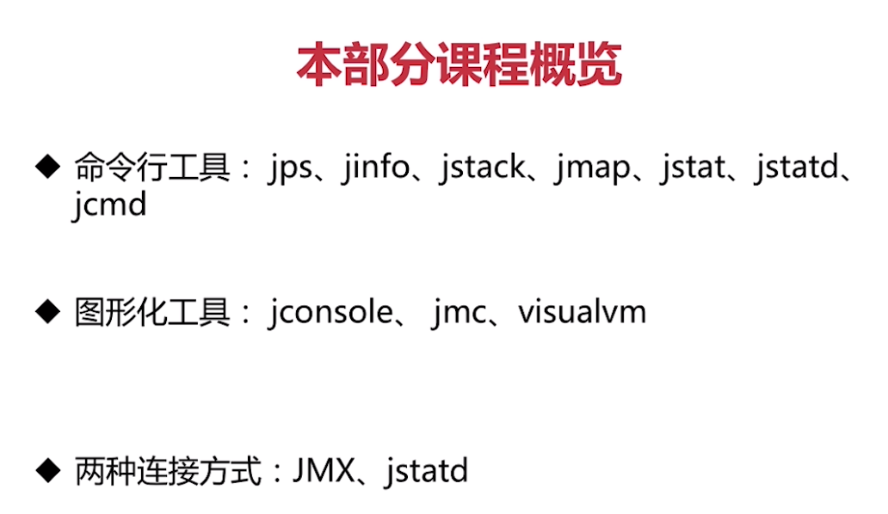
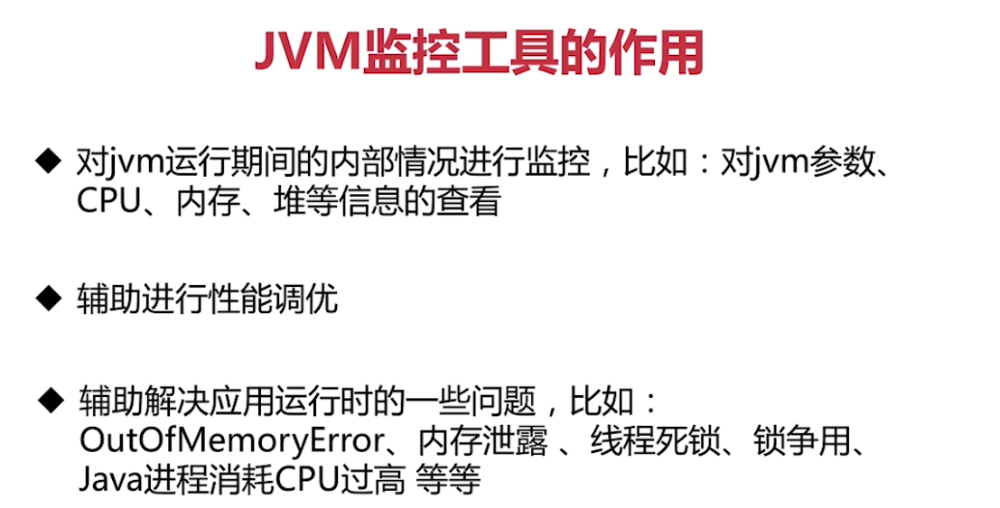
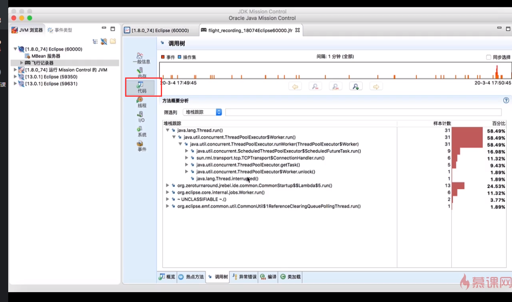
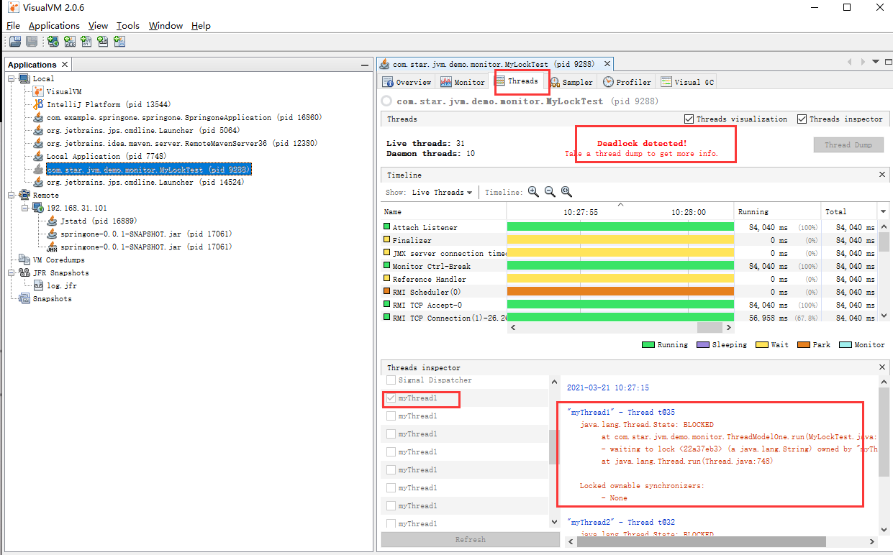

### 1 概述

### 2 命令行工具

**JPS(JVM Process Status Tool)：**

​	1 主要是用来输出JVM中运行的进程状态信息，语法格式如下：jps [options] [hostid]

​	2 hostid字符串的语法与URI的语法基本一致。[protocol:] [[//]hostname] [:port] [/servername]，若果不指定hostid，默认为当前主机或服务器

**jinfo:**

​	1 打印给定进程或核心文件或远程调试服务器的配置信息。语法格式：jinfo [option] pid #指定进程号(pid)的进程

​	2 jinfo [option] <executable<core>> #指定核心文件

​	3 jinfo [option] [server-id@] <remote-hostname-or-IP> #指定远程调试服务器

**jstack：**

​	1 jstack主要用来查看某个Java进程内的线程堆栈信息。语法格式如下jstack[option]pid

​	2 jmap [option] executable core

​	3 jmap [option] [server-id@] remote-hostname-or-ip

**jmap：**

​	1 jmap用来查看堆内存使用状况(可以dump内存文件)，语法格式如下：jmap [option] pid

​	2 jmap [option] executable core

​	3 jmap [option] [server-id@] remote-hostname-or-ip

**jstat：**

​	1 JVM统计监测工具，查看各个区内存和GC的情况

​	2 语法格式如下：jstat [ genera l Option | outputOptions vmid [interval[s|ms] [count]]]

**jstated：**

​	1 虚拟机的jstat守护进程，主要用于监控JVM的创建与终止，并停供一个接口，以允许远程监视工具附加到本地系统上运行的JVM

​	2 语法格式：jstatd [options]

**jcmd：**

​	JVM诊断命令工具，将推断命令请求发送到正在运行的Java虚拟机，比如可以用来导出堆，查看Java进程，导出线程信息，执行GC等

### 3 图形化工具

**jconsole**

一个用于监视Java虚拟机的符合JMX的图形工具。它可以监视本地和远程JVM，还可以监视和管理应用程序

**JMC**

​	jmc(JDK Mission Control)Java任务控制(JMC)客户端包括用于监视和管理Java应用程序的工具，而不会引入通常与这些类型的工具相关联的性能开销

​	JDK11及之后版本不在捆绑JMC，需要单独下载

​	JFR(飞行记录器)需要JDK的商业证书，需要解锁jdk的商业特性，例如:jcmd 1152 VM.unlock_commercial_features

​	可以直接使用命令行来启动JFR，例如:jcmd 41250 JFR.start delay=10s duration=1m filename=/Users/cc/Desktop/log.jfr

下载JMC地址：

https://www.oracle.com/java/technologies/javase-downloads.html

**飞行记录器(JFR)**（1.8）

​	

1 可以查看代码调用热点记录，及相关方法链

2 异常错误等

**VisualVM**

​	1 一个图形工具，它提供有关在Java虚拟机中运行的基于Java技术的应用程序的详细信息

​	2 Java VisualVM提供内存和CPU分析，堆转储分析，内存泄漏检测，访问MBean和垃圾回收

​	3 也可以查看jfr文件进行分析

​	下载地址: https://visualvm.github.io/download.html

​	可以通过threads对应详情查看是否死锁，和排查问题

