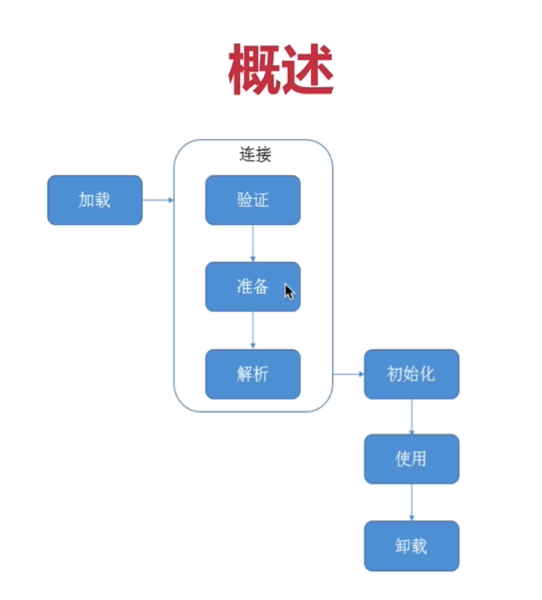
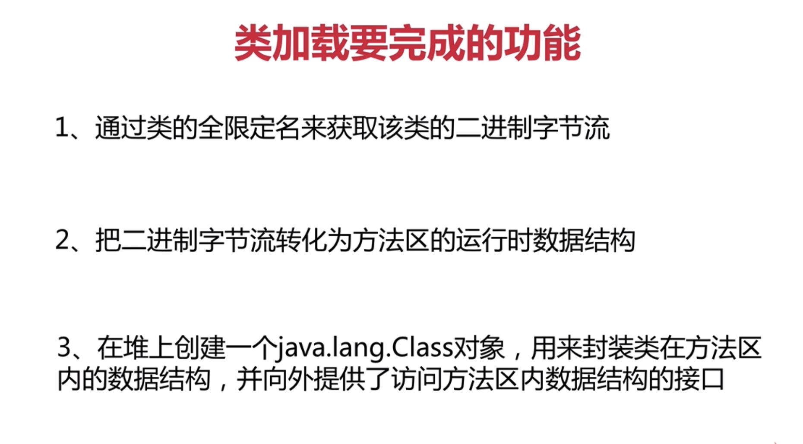
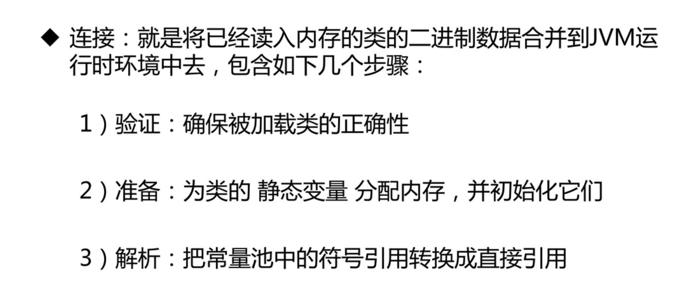
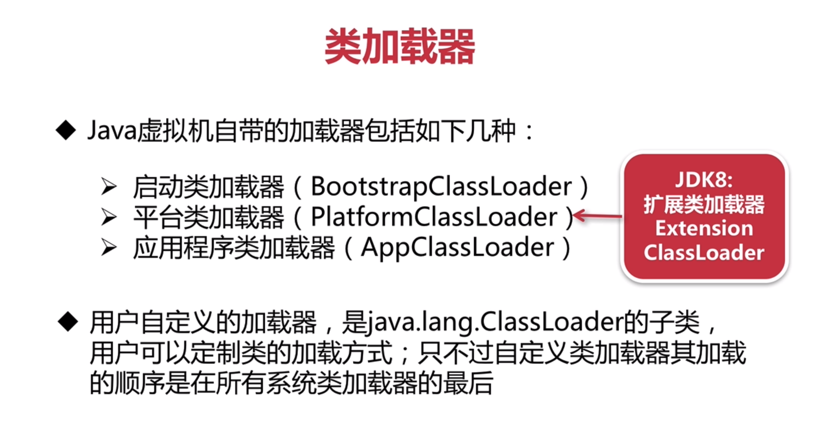
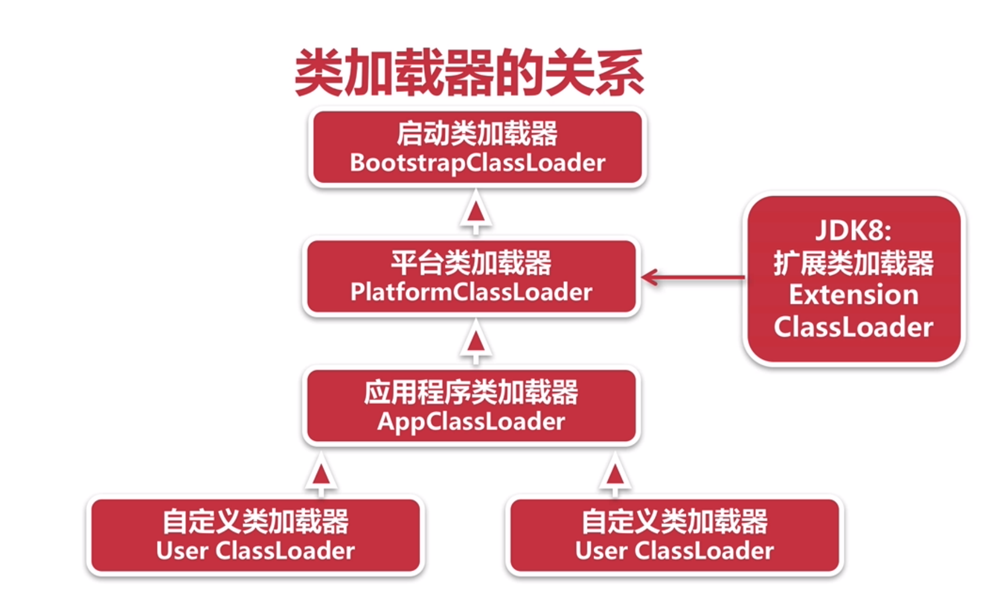
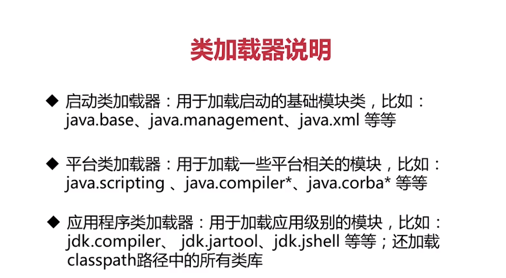
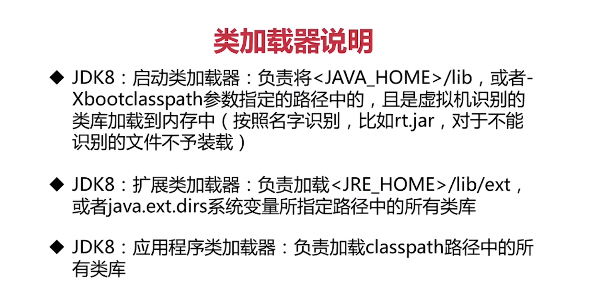
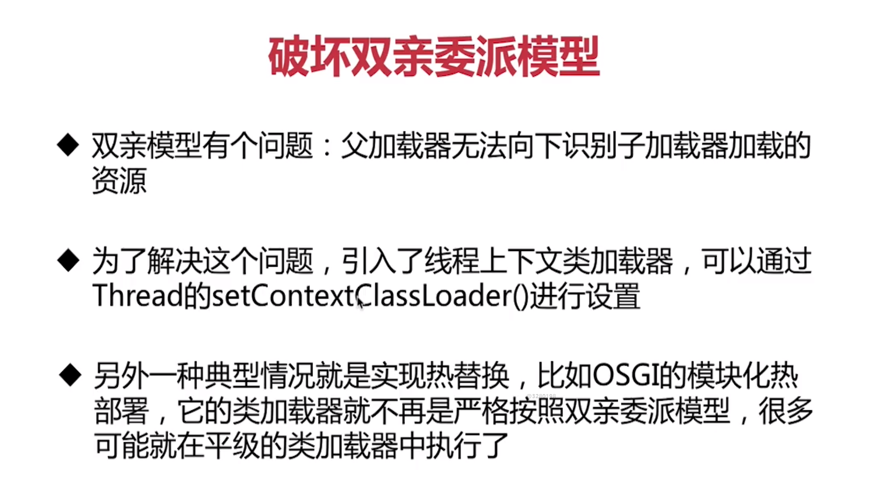
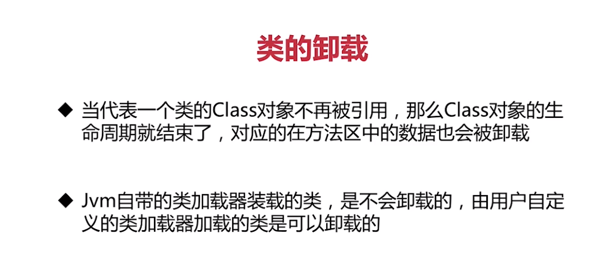

### 1 类加载和类加载器

类的生命周期

​			加载：查找并加载类文件的二进制数据(ps:全限定名代指包名+类名。反射就是通过获取class对象,访问类在方法区的相关信息)

​			类加载方式有本地文件系统、jar包、class动态加载、网络、专有数据库加载等方式。

​		连接：

​		初始化：为类的静态变量赋初始值。(ps:链接-准备阶段的初始化是静态变量的初始值，如 static int i = 5,基本类型的初始值为0，而初始化阶段赋值则是把5赋值到i)

jdk对应的后续版本都是分三层类加载器，并未改动。

jdk9将jdk8中的扩展类加载器(ExtClassClassLoader)剔除，替换为平台类加载器(PlatformClassLoader)。

原因：扩展类加载器(ExtClassClassLoader)在jre/lib/ext目录下加载jar包安全性不好。jdk9新引入了模块化功能，能更好的实现扩展功能。

Java 8的ClassLoader流程：

- bootstrap classloader加载rt.jar，jre/lib/endorsed
- ext classloader加载jre/lib/ext
- application classloader加载-cp指定的类

java9及之后的classloader流程：

- bootstrap classloader加载lib/modules
- ext classloader更名为platform classloader，加载lib/modules
- application classloader加载-cp，-mp指定的类

自定义加载器(User ClassLoader)最后加载。上图表明ClassLoader的加载顺序，并非java中的子父类关系。

### 2  类加载器使用

**jdk9以后**

**jdk8**

1 java程序不能直接引用启动类加载器，类的classLoader为null的话，说明该类的默认使用了启动类加载器。(编写自定义加载器时，需要将加载请求委派给引导(启动)类加载器的话，只需使用null代替(getClassLoader方法返回null)即可)
2 不是一定要等到首次使用时加载类，如果虚拟机预料到可能要使用，则就会加载(比如java相关的常用的基础的类，虚拟机会预先加载)。
3 如果没有找到class(class文件缺失)，则在首次使用时报错(LinkageError)。

### 3  双亲委派模型

​	**定义：**

​	双亲委派模型要求除了顶层启动类加载器外，其余类加载器都应有自己的父级加载器。双亲指：顶层启动类、父级加载器。(这里的父子关系通常使用(Composition)关系来复用父加载器的代码,并非继承关系).

​	**工作过程：**

​	jdk8:	

​	如果一个类加载器收到了类加载的请求，它首先不会自己去尝试加载这个类，而是吧这个请求委派给父加载器去完成，每一个层次的类加载器都是如此，因此所有的加载请求最终都应该传送到最顶层的启动类加载器中，只有当父加载器反馈自己无法完成这个加载请求(搜索范围没有找到所需的类)时，子加载器才好尝试自己去完成加载(加载器加载类就是在自己的classpath下找存不存在该类，存在就加载对应类)。

​	jdk9之后：

​	当平台及应用程序类加载器收到类加载请求，在委派给父加载器加载前，要先判断该类是否能归属到某一个系统模块（具名模块）中，如果可以找到这样的归属关系就优先委派给负责那个模块的加载器完成加载，无法在具名模块中找到则将会委托给父加载器，直到启动类加载器。

​	在类路径下找到的类将成为这些加载器的无名模块(不归属于某个具名模块找到的类)。

​	无名模块(Unnamed Module)：不分模块的 jar 包，放到 不分模块的路径（即这个项目类路径下）

​	无名模块指的就是不包含 module-info.java 的 jar 包，通常这些 jar 包都是 Java 9 之前构建的。无名模块可以读取到其他所有的模块，并且也会将自己包下的所有类都暴露给外界。

​	**意义：**

​	双亲委派模型对于保证Java程序的稳定运行很重要。比如java.lang.Object类，无论哪个类加载器要加载这个类，最终都委派给处于模型顶端的启动类加载器进行加载，因此Object类在程序的各种类加载器环境中都能保证是同一个类。如果没有使用双亲委派模型，由各加载类自行加载。用户自定义一个java.lang.Object类并放在程序的classpath中，系统就会出现多个不同的Object类，Java类型体系的最基础的行为就无法保证。

### 4 自定义ClassLoader

​	**使用：**

​	直接继承ClassLoader,推荐重写对应findClass方法。验证自定义classload是否生效需要把原本classpath中的class类删除，否则根据双亲委派模型，自定义Classloader父级的AppClassloader会找到对应类加载。具体实现参考：demo2--com.star.jvm.demo.classloader。

​	**作用：**

​	使用自定义ClassLoader做，类动态的改变，结合asm等。做校验，对数据加密,给类加密避免反编译等。

### 5 破坏双亲委派模型

​	参考java.sql.DriverManager的getConnection方法使用了getContextClassLoader获取类加载器。

### 6 类连接和初始化

#### 	6.1 连接

##### 		6.11 验证

​		1 文件格式验证：主要是验证字节流是否按照jvm规范(比如是否以0XCAFEBABE开头、常量池中的常量中是否有不被支持的常量类型等)。

​		2 元数据验证：对字节码描述的信息进行语义分析，保证其符合Java语言规范要求。(这个类是否有父类(除Object，其他所有类都应该有父类),这个类的父类是否继承了不被允许继承的类(被final修饰的类))(所谓的元数据是指用来描述数据的数据等)

​		3 字节码验证：通过对数据流和控制流进行分析，确保程序语义是合法和符合逻辑的。这里主要对方法体进行校验(验证操作数栈的数据类型和代码序列是否能配合(比如操作数栈中int类型的数据，使用是却按照long类型载入本地变量表这种情况)，保证方法体中类型转换是有效的(父类的对象父给子类，或者其他毫不相关的类型是危险不合法的)等)

​		4 符号引用验证：对类自身以外的信息，也就是常量池中的各种符号引用，进行匹配校验。通俗来说就是该类是否缺少或者被禁止访问它依赖的某些外部类、方法、字段等资源。(符号引用通过描述的全限定名是否能找到对应的类、符号中引用的类、字段、方法的可访问性/作用域(private,protected,public等)是否可被当前类访问等)

##### 	6.12 准备

​	为类的静态变量分配内存，并初始化（ps:链接-准备阶段的初始化是静态变量的初始值，如 static int i = 5,基本类型的初始值为0，而初始化阶段赋值则是把5赋值到i）

##### 	6.13解析

​		1 解析阶段是Java虚拟机将常量池内的符号引用替换为直接引用的过程。(符号引用是一组符号来描述引用的目标(个人理解：符号类似于的常量，引用就是这个常量根据各虚拟机的实际情况指向对应的地址)(直接引用就是可以直接定位到目标的指针))

​		2 如果有了直接引用那引用的目标必定已经在虚拟机的内存中存在。

​		3 主要针对：类、接口、字段、类方法、接口方法、方法类型、方法引用、访问修饰符等解析。

#### 	6.2 初始化

​		类的初始化就是为类的静态变量赋初始值，或者说是执行类构造器<clinit>方法的过程。

​			1 如果类还没有加载和连接，就先加载和连接

​			2 如果类存在父类，且父类没有初始话，就先初始化父类

​			3 如果类中存在初始化 语句、就依次执行这些初始化语句(静态代码块，静态变量)

​			4 如果是接口的话：

​				a、初始化一个类的时候，并不会先初始话它实现的接口

​				b、初始化一个接口时，并不会初始化它的父接口

​				c、只有当程序首次使用接口里面的变量或者是调用接口方法的时候，才会导致接口初始化

​			5 调用Classloader类的loadClass方法来装载一个类，并不会初始化这个类，不是对类的主动使用

### 7    类初始化时机

​	Java程序对类的使用方式分成：主动使用和被动使用，JVM必须在每个类或接口"首次主动使用"时才会初始化它们。被动使用类不会导致类的初始化，

主动使用的情况：

​		1 创建类实例

​		2 访问某个类或接口的静态变量

​		3 调用类的静态方法

​		4 反射某个类

​		5 初始化某个类的子类，父类会优先初始化

​		6 JVM启动的时候运行的主类

​		7 定义了default方法的接口(jdk8新特性)，当接口实现类初始化时

​	**延伸**

​	**default关键字**

​	default方法是在java8中引入的关键字，也可称为Virtual extension methods——虚拟扩展方法。是指，在接口内部包含了一些默认的方法实现（也就是接口中可以包含方法体，这打破了Java之前版本对接口的语法限制），从而使得接口在进行扩展的时候，不会破坏与接口相关的实现类代码。

​	Iterable接口有三个方法，分别是iterator()、forEach(Consumer<? super T> action)、spliterator()。其中第二个与第三个方法均使用了default关键字修饰。

被动使用的情况：

​	1 当通过子类访问父类的静态变量时不会导致子类的初始化。

​	2 通过数组定义来引用类，不会导致类的初始化。

​	3 访问常量不会导致类的初始化(加final的静态属性)(常量在编译阶段就加入到常量池中，访问常量从本质上说没有直接引用到定义常量的类)。

### 8  类的卸载

