### 1 jvm概述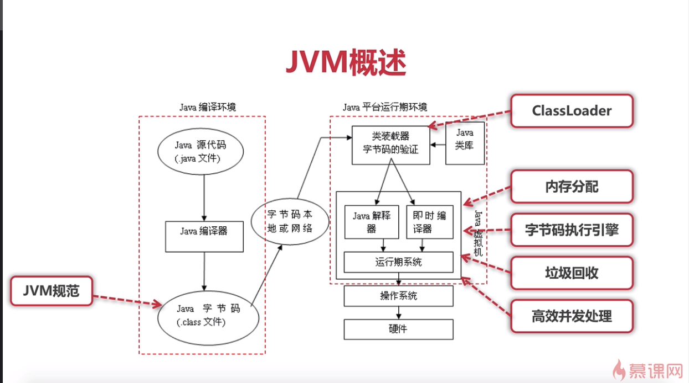

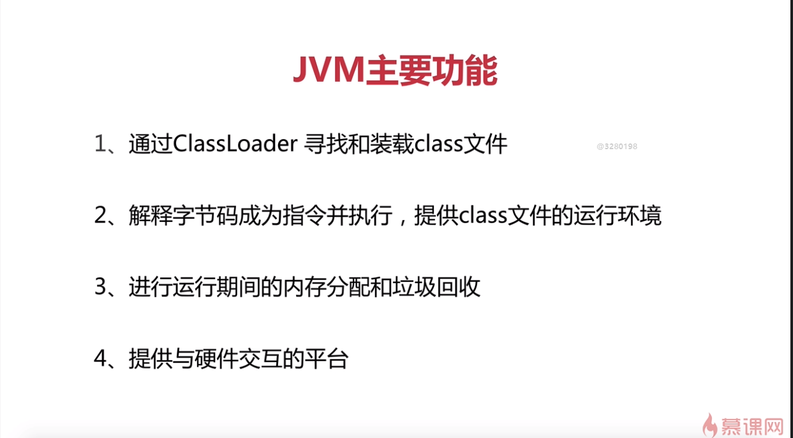

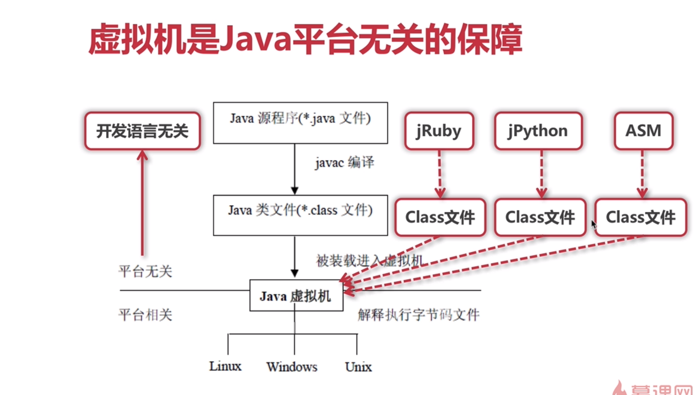

```
JVM规范
   字节码指令集
   Class文件的格式
   数据类型和值
   运行时的数据区
   栈帧
   特殊方法
   类库
   异常
   虚拟机的启动加载、链接、和初始化.......
```

### 2 JNI介绍

引用：https://www.xuebuyuan.com/3250247.html

Java 本机接口（Java Native Interface (JNI)）是一个本机编程接口，它是
Java 软件开发工具箱（Java SoftwareDevelopment Kit (SDK)）的一部分。
JNI允许 Java 代码使用以其它语言（譬如 C 和 C++）编写的代码和代码库。Invocation API（JNI 的一部分）可以用来将 Java 虚拟机（JVM）嵌入到本机应用程序中，从而允许程序员从本机代码内部调用 Java 代码。


### 3 ASM介绍

引用：https://www.cnblogs.com/sea520/p/10251941.html

ASM（直接编写class文件） 是一个 Java 字节码操控框架。它能被用来动态生成类或者增强既有类的功能。ASM 可以直接产生二进制 class 文件，也可以在类被加载入 Java 虚拟机之前动态改变类行为。Java class 被存储在严格格式定义的 .class 文件里，
这些类文件拥有足够的元数据来解析类中的所有元素：类名称、方法、属性以及 Java 字节码（指令）。ASM 从类文件中读入信息后，能够改变类行为，分析类信息，甚至能够根据用户要求生成新类。(运用于aop等方面)

### 4 栈帧、局部变量表、操作数栈

引用：https://www.iteye.com/blog/wangwengcn-1622195

#### 4.1栈帧

​	（stack frame）是用于支持虚拟机进行方法调用和方法执行的数据结构，它是虚拟机运行时数据区中的虚拟机栈的栈元素。栈帧存储了方法的局部变量表、操作数栈、动态连接和方法返回地址等信息。
​		每一个方法从调用开始到执行完成的过程，就对应着一个栈帧在虚拟机栈里面从入栈到出栈的过程。对于执行引擎来说，活动线程中，只有栈顶的栈帧是有效的，称为当前栈帧，这个栈帧所关联的方法称为当前方法。执行引擎所运行的所有字节码指令都只针对当前栈帧进行操作。

#### 4.2 局部变量表

​      局部变量表是一组变量值存储空间，用于存放方法参数和方法内部定义的局部变量

#### 4.3 操作数栈

​      Java虚拟机的解释执行引擎被称为"基于栈的执行引擎"，其中所指的栈就是指－操作数栈。
​      操作数栈也常被称为操作栈。
​      虚拟机把操作数栈作为它的工作区——大多数指令都要从这里弹出数据，执行运算，然后把结果压回操作数栈。比如，iadd指令就要从操作数栈中弹出两个整数，执行加法运算，其结果又压回到操作数栈中
局部变量表于操作数栈的交互

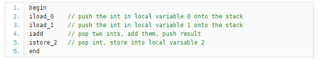

  	在这个字节码序列里，前两个指令iload_0和iload_1将存储在局部变量中索引为0和1的整数压入操作数栈中，其后iadd指令从操作数栈中弹出那两个整数相加，再将结果压入操作数栈。第四条指令istore_2则从操作数栈中弹出结果，并把它存储到局部变量区索引为2的位置。下图详细表述了这个过程中局部变量和操作数栈的状态变化，图中没有使用的局部变量区和操作数栈区域以空白表示。

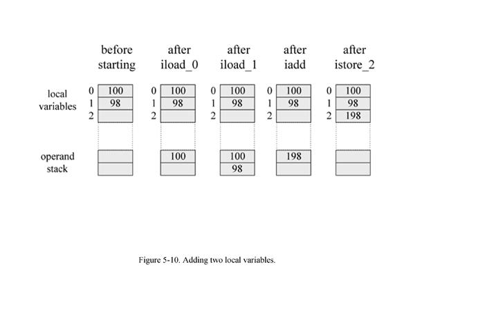


### 5 相关指令集

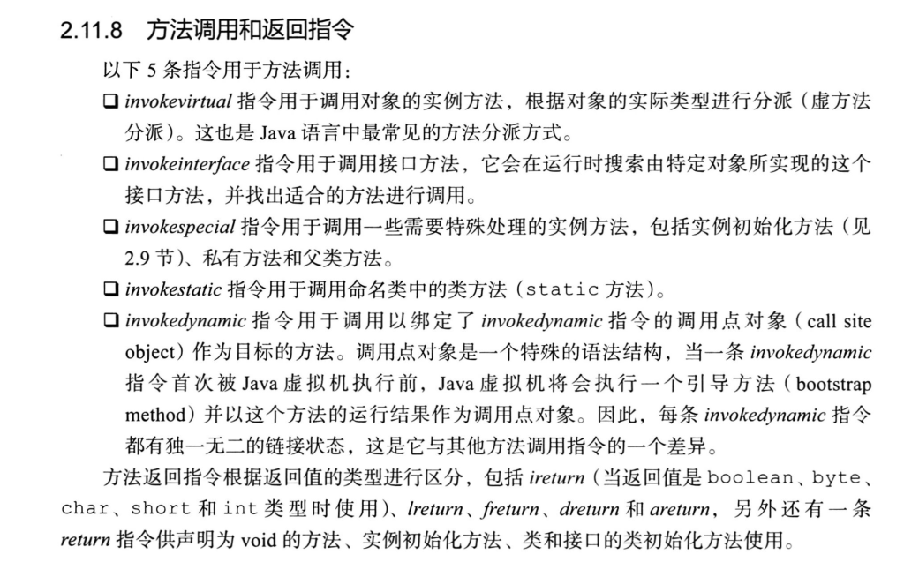

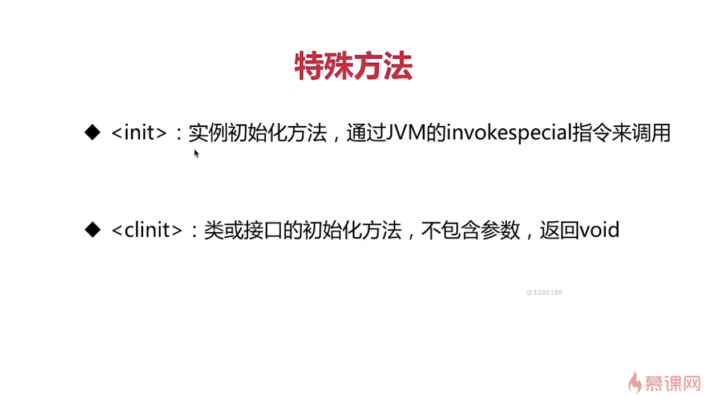

​		虚拟机实例化实际上是通过<init>方法来进的实例初始化，本质上来讲，构造方法是虚拟机创建实例后的一个回调方法。

​		<clinit>则与启动加载、链接、和初始化相关，可以理解为是static的，而不是实例化的。

### 6 类库

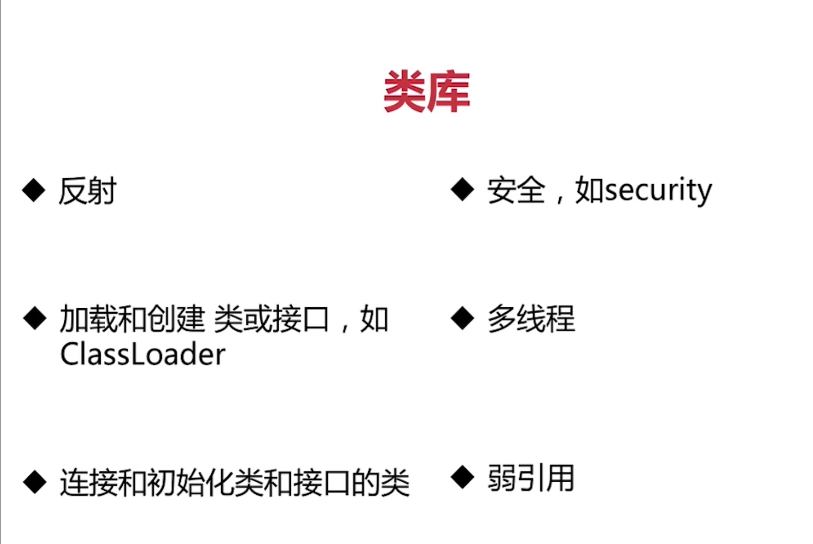

虚拟机规范-类库，需要实现的相关规范。

### 7 阅读class文件

编译class主要是将java代码翻译为对应虚拟机指令集，并且对代码做一些优化的处理。

class文件可以通过javap和十六进制阅读器来进行查看。

javap展示相关指令信息和十六进制阅读器展示的信息对应关系，需要通过指令编码对照阅读。（javap -verbose）

ps:（读懂class文件还需要多看几遍视频。。）

### 8 ASM开发

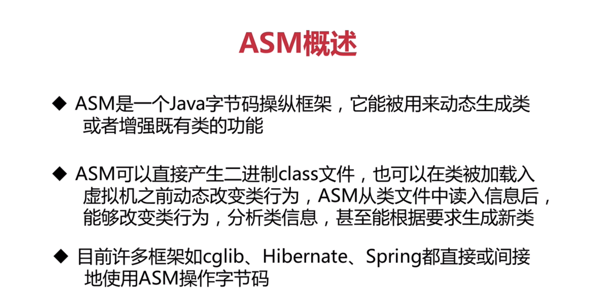

​							Spring直接使用了cglib，cglib内部封装了asm的功能。

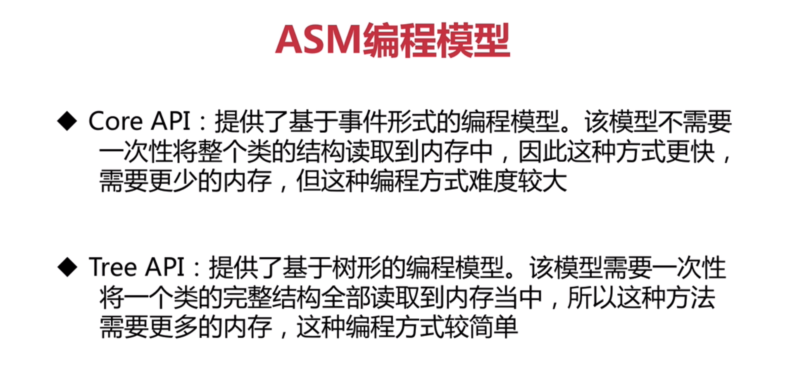

​						ASM编程模型类似于xml两种解析方式

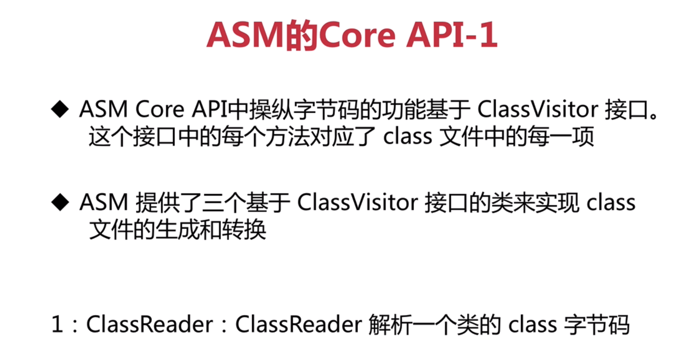

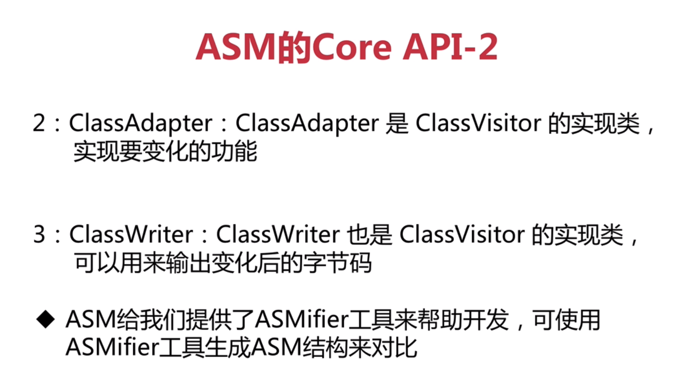

ASMifier工具使用需要（asm-7.3.1.jar）（asm-util-7.3.1.jar）对应的包，然后在目录下运行对应命令执行，输出相关代码解析class

运行asm代码工具
java -cp .\lib\* org.objectweb.asm.util.ASMifier .\Cc.class

具体asm代码参考demo2-asm包下相关示例代码