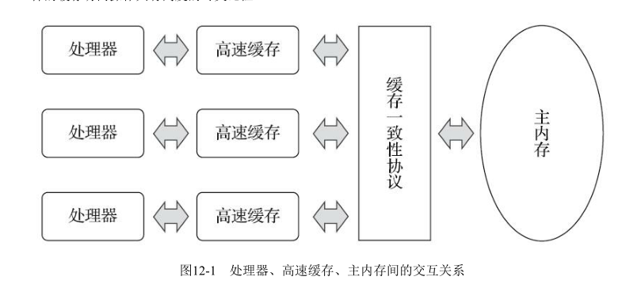
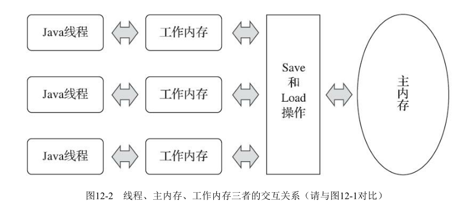
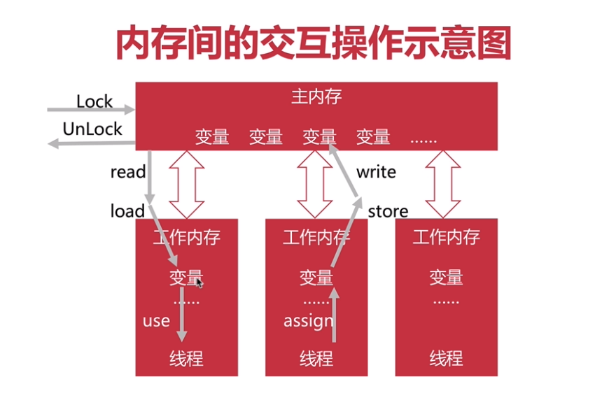
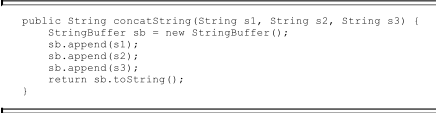
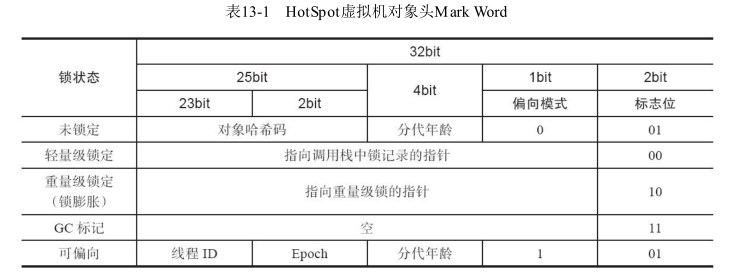
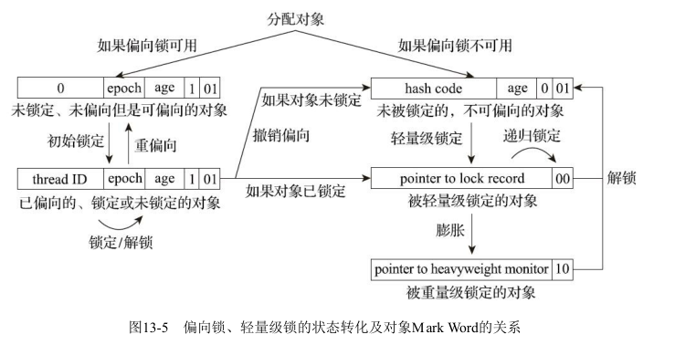

### 1 Java内存模型和内存间的交互操作

​	JCP(Java社区组织)定义了一种Java内存模型，以前是在JVM规范中，后来独立出来成为JSR-133(Java内存模型和线程修订规范)

​	**内存模型：**

​	1 在特定的操作协议下，对特定的内存或高速缓存进行读写访问的过程抽象

​	2 Java内存模型主要关注JVM中把变量值存储到内存和从内存中取出变量值这样的底层细节

​	3 所有变量(共享的)都存储在主内存中，每个线程都有自己的工作内存。工作内存中保存该线程使用到的变量的主内存副本拷贝(副本不会拷贝整个对象，这个对象的引用、对象中某个在线程访问到的字段是有可能被复制的)

​	4 线程对变量的所有操作(读、写)都应该在工作内存中完成

​	5 不同线程之间不能相互访问工作内存，交互数据要通过主内存

​	**下图示例：物理机cpu与内存之间的交互关系**

​	**Java内存交互**

**内存间的交互操作**

​	Java内存模型规定了一些操作来实现内存间的交互，JVM会保证它们是原子的

​	lock：锁定，把变量标识为线程独占，作用于主内存变量

​	unlock：解锁，把锁定的变量释放，别的线程才能使用，作用于主内存变量(lock和unlock是一起使用的，a线程lock了这个变量只能是a线程unlock，不能由b线程unlock)

​	read：读取，把变量值从主内存读取到工作内存

​	load：载入，把read读取到的值放入工作内存的变量副本中

​	use：使用，把工作内存中一个变量的值传递给执行引擎

​	assign：赋值，把从执行引擎接收到的值赋给工作内存里面的变量

​	store：存储，把工作内存中一个变量的值传到主内存中，以便随后的write操作使用

​	write：写入，把store进来的数据存放主内存的变量中

**2 内存间交互操作的规则**

​	1 不允许read和load、store和write操作之一单独出现，以上两个操作必须按顺序执行，但不保证连续执行，也就是说，read与load之间,store与write之间是可插入其他指令的

​	2 不允许一个线程丢弃它的assign操作，即变量在工作内存中改变了之后必须把该变化同步回主内存

​	3 不允许一个线程无原因的(没有发生过任何assign操作)把数据从线程的工作内存同步回主内存中

​	4 一个新的变量只能从主内存中"诞生"，不允许在工作内存中直接使用一个未被初始化的变量，也就是对一个变量实施use和store之前，必须先执行过了assign(对应store)操作和load(对应use)操作

​	5 一个变量在同一时刻只允许一条线程对其执行lock操作，但lock操作可以被同一条线程重复执行多次，多次执行lock后，只有执行相同次数的unlock操作，变量才会被解锁

​	6 如果对一个变量执行lock操作，将会清空工作内存中此变量的值，在执行引擎使用这个变量前，需要重新执行load或assign操作初始化变量的值

​	7 如果一个变量没有被lock锁定，则不允许对它执行unlock操作，也不能unlock一个被其他线程锁定的变量

​	8 对一个变量执行unlock操作之前，必须先把此变量同步回主内存(执行store和write操作)

### 3 volatile特性

**多线程中的可见性**

可见性：就是一个线程修改了变量，其他线程可以知道

保证可见性的常见方法：volatile、synchronized、final(一旦初始化完成，其他线程就可见)

**volatile**

​	volatile基本上是JVM提供的最轻量级的同步机制

​	用volatile修饰的变量：

​	1 对所有的线程可见，即对volatile变量所做的写操作能立即反映到其他线程中

​	2 但是在多线程的某些场景下仍然是线程不安全的

​	3 volatile修饰的变量，是禁止指令重排优化的

**适合使用volatile的场景：**

​	1 运算结果不依赖变量的当前值

​	2 或者能确保只有一个线程修改变量的值

### 4 指令重排原理和规则

​	指令重排：重排序优化是机器级的优化操作，提前执行是指这条语句对应的汇编代码被提前执行(Java虚拟机的即时编译器中也有指令重排序（Instruction Reorder）优化)，直接运行能立即执行的后续指令，避开获取下一条指令所需数据造成的等待

​	指令重排只可能发生在毫无关系的指令之间(如a=1;b=2;可以重排), 如果指令之间存在依赖关系, 则不会重排。(如 a=1;b=a;就不能重排)

**指令执行顺序规则/先发性原则（happens-before原则）：**

​	PS:这些先行发生关系无须任何同步器协助就已经存在，可以在编码中直接使用。如果两个操作之间的关系不在此列，并且无法从下列规则推导出来，则它们就没有顺序性保障，虚拟机可以对它们随意地进行重排序

​	程序次序规则（Program Order Rule）：在一个线程内，按照控制流顺序，书写在前面的操作先行发生于书写在后面的操作。注意，这里说的是控制流顺序而不是程序代码顺序，因为要考虑分支、循环等结构。

​	管程锁定规则（Monitor Lock Rule）：一个unlock操作先行发生于后面对同一个锁的lock操作。这里必须强调的是“同一个锁”，而“后面”是指时间上的先后。

​	volatile变量规则（Volatile Variable Rule）：对一个volatile变量的写操作先行发生于后面对这个变量的读操作，这里的“后面”同样是指时间上的先后。

​	线程启动规则（Thread Start Rule）：Thread对象的start()方法先行发生于此线程的每一个动作。

​	线程终止规则（Thread Termination Rule）：线程中的所有操作都先行发生于对此线程的终止检测，我们可以通过Thread::join()方法是否结束、Thread::isAlive()的返回值等手段检测线程是否已经终止执行。

​	线程中断规则（Thread Interruption Rule）：对线程interrupt()方法的调用先行发生于被中断线程的代码检测到中断事件的发生，可以通过Thread::interrupted()方法检测到是否有中断发生。

​	对象终结规则（Finalizer Rule）：一个对象的初始化完成（构造函数执行结束）先行发生于它的finalize()方法的开始。
传递性（Transitivity）：如果操作A先行发生于操作B，操作B先行发生于操作C，那就可以得出操作A先行发生于操作C的结论。

**有序性**

​	1 在本线程内，操作都是有序的

​	2 在线程外观察，操作都是无序的，因为存在指令重排序 或 工作内存与主内存同步延迟 现象

### 5 线程安全处理

**Java线程安全的处理方法**

 不可变是线程安全的(一般来说是final修饰的)

**互斥同步(阻塞同步)：**synchronized(可重入)、java.util.concurrent.ReentrantLock(可重入)。目前这两个方法性能已经差不多了，建议优先选用synchronized，ReentrantLock增加了如下特性：

​	a 等待可中断：当持有锁的线程长时间不释放锁，正在等待的线程可以选择放弃等待

​	b 公平锁/非公平锁:多个线程等待同一个锁时。公平锁需要严格按照申请锁的时间顺序来获得锁，非公平锁则不需要。

​	c 锁绑定多个条件：一个ReentrantLock对象可以绑定多个condition对象，而synchronized是针对一个条件的，如果要多个，就得有多个锁。

**非阻塞同步：**是一种基于冲突检查的乐观锁定策略，通常是先操作，如果没有冲突，操作就成功了， 有冲突再采取其他方式进行补偿处理(类似于事务的乐观锁处理方案)

​	a 必须要求操作和冲突检测这两个步骤具备原子性（硬件来实现原子性，硬件保证某些从语义上看起来需要多次操作的行为可以只通过一条处理器指令就能完成）

​	b Java使用CAS来实现乐观锁

​		(1) CAS指令需要有三个操作数，分别是内存位置（在Java中可以简单地理解为变量的内存地址，用V表示）、旧的预期值（用A表示）和准备设置的新值（用B表示）。CAS指令执行时，当且仅当V符合A时，处理器才会用B更新V的值，否则它就不执行更新。但是，不管是否更新了V的值，都会返回V的旧值，上述的处理过程是一个原子操作，执行期间不会被其他线程中断(Atomic相关类库使用CAS)

​		(2) 值曾经被改成B，后来又被改回为A，那CAS操作就会误认为它从来没有被改变过。这个漏洞称为CAS操作的“ABA问题”。J.U.C包为了解决这个问题，提供了一个带有标记的原子引用类AtomicStampedReference，它可以通过控制变量值的版本来保证CAS的正确性。(目前来说这个类处于相当鸡肋的位置，大部分情况下ABA问题不会影响程序并发的正确性，如果需要解决ABA问题，改用传统的互斥同步可能会比原子类更为高效)

**无同步方案：**

​	a 要保证线程安全，也并非一定要进行阻塞或非阻塞同步，同步与线程安全两者没有必然的联系。同步只是保障存在共享数据争用时正确性的手段

​	b 如果能让一个方法本来就不涉及共享数据，那它自然就不需要任何同步措施去保证其正确性，因此会有一些代码天生就是线程安全的

**ThreadLocal**

​	1 如果一个变量只要被某个线程独享，可以通过java.lang.ThreadLocal类来实现线程本地存储的功能

​	2 每一个线程的Thread对象中都有一个ThreadLocalMap对象

​	3 这个对象存储了一组以ThreadLocal.threadLocalHashCode为键，以本地线程变量为值的K-V值对，ThreadLocal对象就是当前线程的ThreadLocalMap的访问入口，每一个ThreadLocal对象都包含了一个独一无二的threadLocalHashCode值，使用这个值就可以在线程K-V值对中找回对应的本地线程变量

### 6 锁优化

**自旋锁**

​	1 如果线程可以很快获得锁，那么可以不在OS层(操作系统层面)挂起线程，而是让线程做几个忙循环，这就是自旋(JDK 1.4.2中就已经引入，只不过默认是关闭的，可以使用-XX:+UseSpinning参数来开启，在JDK 6中就已经改为默认开启了)

​	2 挂起线程和恢复线程的操作都需要转入内核态(CPU的一种工作状态)中完成，这些操作给Java虚拟机的并发性能带来了很大的压力,共享数据的锁定状态只会持续很短的一段时间，为了这段时间去挂起和恢复线程并不值得,所以引入自旋锁(自旋锁等待时间越短越好(自旋成功)，反之则是浪费性能)

​	3 自旋超过了限定的次数仍然没有成功获得锁(自旋失败)，就应当使用传统的方式去挂起线程(自旋次数的默认值是十次，可以使用参数-XX:PreBlockSpin来自行更改)

**自适应自旋锁**

​	1 自旋的时间不再固定，而是由前一次在同一个锁上的自旋时间及锁的拥有者的状态来决定的(JDK 6中对自旋锁的优化，引入了自适应的自旋)

​	2 如果在同一个锁对象上，自旋等待刚刚成功获得过锁，并且持有锁的线程正在运行中，那么虚拟机就会认为这次自旋也很有可能再次成功，进而允许自旋等待持续相对更长的时间，比如持续100次忙循环

​	3 另一方面，如果对于某个锁，自旋很少成功获得过锁，那在以后要获取这个锁时将有可能直接省略掉自旋过程，以避免浪费处理器资源

**锁销除**

​	1 在编译代码的时候，检测到根本不存在共享数据竞争，自然就无需同步加锁了(加了synchronized的代码，虚拟机会优化去除该锁)，通过-XX:EliminateLocks来开启

​	2 锁消除的主要判定依据来源于逃逸分析的数据支持(使用-XX:+DoEscapeAnalysis开启逃逸分析),所谓逃逸分析：

​		a 如果一个方法中定义的一个对象，可能被外部方法引用，称为方法逃逸

​		b 如果对象可能被其他外部线程访问，称为线程逃逸，比如赋值给类变量或者可以在其他线程访问的实例变量

**锁粗化**

​	通常我们都要求同步块要小，但一系列连续的操作导致对一个对象反复的加锁和解锁，这会导致不必要的性能损耗。这种情况建议把锁同步的范围加大到整个操作序列

​	连续的append()方法就属于这类情况。如果虚拟机探测到有这样一串零碎的操作都对同一个对象加锁，将会把加锁同步的范围扩展（粗化）到整个操作序列的外部

**轻量级锁**

​	1 轻量级锁是JDK 6时加入的新型锁机制，它名字中的“轻量级”是相对于使用操作系统互斥量来实现的传统锁而言的，因此传统的锁机制就被称为“重量级”锁。

​	2 设计的初衷是在没有多线程竞争的前提下，减少传统的重量级锁使用操作系统互斥量产生的性能消耗(实现原理类似于乐观锁的方式(CAS操作实现))	

​	3 如果轻量级锁失败，表示存在竞争，升级为重量级锁，导致性能下降

**HotSpot虚拟机对象头Mark Word**

**偏向锁**

​	1 如果说轻量级锁是在无竞争的情况下使用CAS操作去消除同步使用的互斥量，那偏向锁就是在无竞争的情况下把整个同步都消除掉，连CAS操作都不去做了，从而提高性能。所谓偏向，就是偏心，即锁会偏向于当前已经占用锁的线程

​	2 只要没有竞争，获得偏向锁的线程，在将来进入同步块，也不需要做同步

​	3 当有其他线程请求相同的锁时，偏向模式结束

​	4 如果程序中大多数锁总是被多个线程访问的时候，也就是竞争比较激烈，偏向锁反而会降低性能

​	5 启用参数-XX：+UseBiasedLocking，这是自JDK 6起HotSpot虚拟机的默认值

**偏向锁、轻量级锁的状态转化及对象Mark Word的关系如图13-5所示**

**JVM中获取锁的步骤**

会先尝试偏向锁，然后尝试轻量级锁

再然后尝试自旋锁

最后尝试普通锁，使用OS互斥量在操作系统层挂起

**同步代码的基本规则**

​	1 尽量减少锁持有的时间

​	2 尽量减少锁的粒度

**特殊规则**

​	针对long和double型变量的特殊规则：允许虚拟机将没有被volatile修饰的64位数据的读写操作划分为两次32位的操作来进行，即允许虚拟机实现自行选择是否要保证64位数据类型的load、store、read和write这四个操作的原子性，这就是所谓的“long和double的非原子性协定”（Non-Atomic Treatment of double and long Variables）

