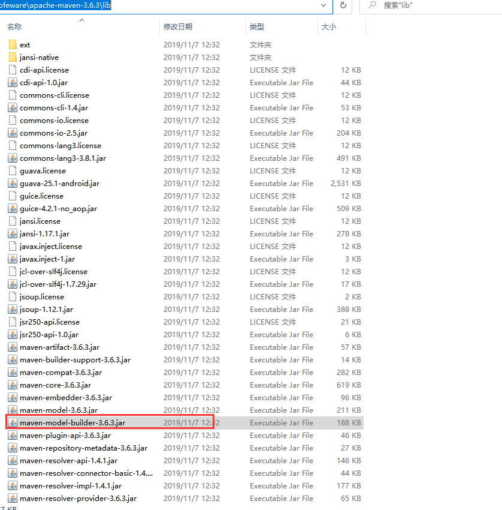
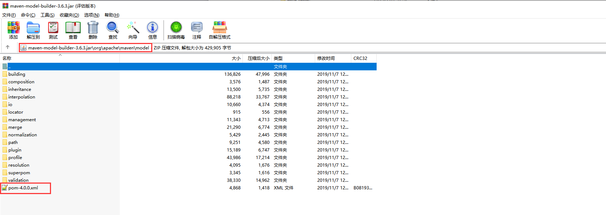
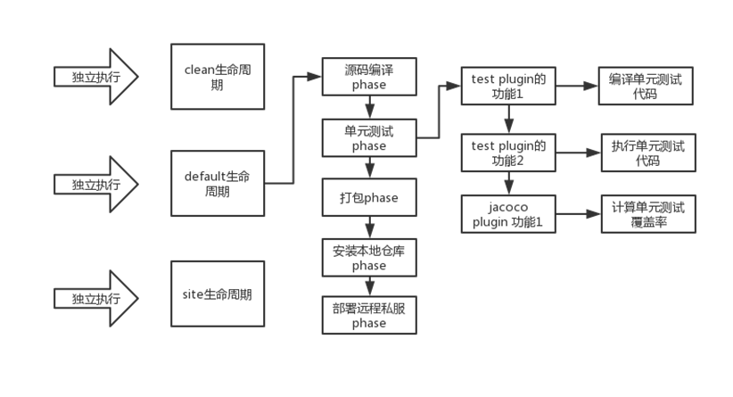

# 1 maven的前身

1、make：最原始的构建工具，不能跨平台

2、ant：曾经没有maven的时候，流行过一段时间，但是手工配置的语法繁琐，而且需要一次又一次的重复，另外依赖管理还要借助ivy来完成，工作量还是有点大。。。

3、maven：自动化。。。，目前是最有影响力的工程管理工具

4、gradle：google发布，不再基于xml来进行配置，而是基于DSL语言来进行构建管理，语法功能更加强大，android这块用的较多，同时国外一些开源项目，比如spring也开始用gradle来管理

# 2 maven基础

## 2.1 环境变量

首先普及一下，MAVEN_HOME是maven 1的写法、M2_HOME是maven 2的写法，但实际上这只是一种命名习惯，对实际作用没有任何影响。

  maven现在普遍的版本是3.5，3.6之后官网会推崇另外一种写法，不使用任何中间路径替代：

```shell
   export PATH=/opt/apache-maven-3.6.0/bin:$PATH
```


如果你的设置未生效，或者不对应，请按照上述进行设置（配置maven之前务必配置JAVA_HOME）

设置MAVEN_OPTS环境变量，就是设置maven的jvm参数，可以设置为-Xms128m -Xmx512m。

## 2.2 初始化

可选择运行mvn help:system

maven安装目录里的conf目录下的settings.xml配置文件拷贝到.m2目录里去，就ok了，作为以后maven全局唯一的配置文件

```shell
mvn help:system
#初始化，在用户目录下创建对应m2目录，并下载相关文件
```

## 2.3 pom介绍

```xml
<project>：pom.xml中的顶层元素

<modelVersion>：POM本身的版本号，一般很少变化

<groupId>：创建这个项目的公司或者组织，一般用公司网站后缀，比如com.company，或者cn.company，或者org.zhonghuashishan

<artifactId>：这个项目的唯一标识，一般生成的jar包名称，会是<artifactId>-<version>.<extension>这个格式，比如说myapp-1.0.jar

<packaging>：要用的打包类型，比如jar，war，等等。

<version>：这个项目的版本号

<name>：这个项目用于展示的名称，一般在生成文档的时候使用

<url>：这是这个项目的文档能下载的站点url，一般用于生成文档

<description>：用于项目的描述
```


## 2.4 相关命令

快速构建maven项目

```shell
mvn archetype:generate    -DgroupId=com.zhss.maven     -DartifactId=maven-first-app     -DarchetypeArtifactId=maven   -archetype         -quickstart  -DinteractiveMode=false
#快速构建maven项目 下面对应包名,id等需要指定，组合命令的情况，需要在cmd命令行中运行组合命令，如果是在powershell中需要在后续命令加双引号(双引号不是很稳定，最好还是用cmd执行)
#运行后续组合命令不能换行，换行相当于下一个命令了，就不是组合命令
mvn archetype:generate    "-DgroupId=com.zhss.maven     -DartifactId=maven-first-app     -DarchetypeArtifactId=maven   -archetype         -quickstart  -DinteractiveMode=false"
java -cp target/maven-first-app-1.0-SNAPSHOT.jar com.zhss.maven.App
#执行jar包

```

## 2.5 maven流程图


## 2.6 maven坐标

每个maven项目都有一个坐标

groupId + artifactId + version + packaging + classifier，五个维度的坐标，唯一定位一个依赖包

任何一个项目，都是用这五个维度唯一定位一个发布包

实际上后面两个维度较为少用，99%的场景下，唯一定位一个依赖的就是三个维度，groupId + artifactId + version

**groupId**：不是你的公司或者组织，但是以你的公司或者组织的官网的域名倒序来开头，然后加上项目名称

www.baidu.com，公司里任何一个项目的开头，就可以用com.baidu来打头

com.zhss + 项目名称，或者是系统名称，maven就叫com.zhss.maven

**artifactId**：项目中的某个模块，或者某个服务

com.zhss.oa，oa-organ，organ是缩写，organization

com.zhss.oa，oa-auth，auth是authorization

com.zhss.oa，oa-flow，flow就是流程的意思

 **version**：这个工程的版本号

**packaging**：这个工程的发布包打包方式，一般常用的就jar和war两种，java -cp执行一个jar包，war可以放到一个tomcat容器里去跑的web工程

**classifier**：很少用，定义某个工程的附属项目，比如hello-world工程的，hello-world-source工程，就是源码，可能是类似于hello-world-1.0-SNAPSHOT-source.jar这样的东西。

**坐标作用**：

​	**工程写好了，都有版本，groupId+artifactId+version就成了这一次这个工程目前这个状态的唯一的标识和定位，就可以提供给别人使用(jar包方式打包提供)**，

## 2.6 dependency 引入依赖

```xml
<dependency>
	<groupId></groupId>
    <!--包路径-->
	<artifactId></artifactId>
    <!--服务名-->
	<version></version>
    <!--版本-->
	<type></type>
    <!--极少使用。。。。-->
	<scope></scope>
    <!--使用范围-->
	<optional></optional>
    <!--是否传递依赖-->
</dependency>
```

三要素：groupId、artifactId、version 常用(声明了就会定位依赖，本地没有就网上下载到本地)

type、scope、optional不常用

### 2.6.1 scope依赖范围

**PS:三种范围，编译、测试、运行**

compile：默认，对编译、测试和运行的classpath都有效

test：仅仅对于运行测试代码的classpath有效，编译或者运行主代码的时候无效（juit依赖可以使用）

provided：编译和测试的时候有效，但是在运行的时候无效(servlet-api，容器已提供)

runtime：测试和运行classpath有效，但是编译代码时无效(mysql驱动类，正常代码不需要直接引用到驱动类内部api)

### 2.6.2 传递性依赖

​	**PS:传递性依赖就是一个依赖包中还依赖其他的包，maven会自动传递解析**

​	**maven的传递性依赖，就是说会自动递归解析所有的依赖**，然后负责将依赖下载下来，接着所有层级的依赖，都会成为我们的项目的依赖，不需要我们手工干预。所有需要的依赖全部下载下来，不管有多少层级。这个就是maven的传递性依赖机制，自动给我递归依赖链条下载所有依赖的这么一个特性。

传递性依赖对应范围

| 一级\二级 | compile  | test | provided | runtime  |
| --------- | -------- | ---- | -------- | -------- |
| compile   | compile  |      |          | runtime  |
| test      | test     |      |          | test     |
| provided  | provided |      | provided | provided |
| runtime   | runtime  |      |          | runtime  |

### 2.6.3 依赖调节

传递性依赖会出现依赖冲突，maven根据**两大就近原则**解决：

**（1）就近原则：**

比如A->B->C->X(1.0)，A->D->X(2.0)，A有两个传递性依赖X，不同的版本

此时就会依赖调解，就近原则，离A最近的选用，就是X的2.0版本

**(2) 优先声明原则：**

如果A->B->X(1.0)和A->D->X(2.0)，路径等长呢？

那么会选择第一声明原则，哪个依赖在pom.xml里先声明，就用哪个

### 2.6.4 optional可选依赖

```xml
<optional>true</optional>
<!--此时依赖传递失效，不会向上传递-->
```

## 2.7 解决依赖冲突问题

**问题：**

maven会自动依赖调解，说对已给项目不同的版本选择一个版本来使用

但是如果**maven选择了错误的版本呢**

A包引用了C1.0(路径短)，B包引用了C2.0(路径长)，根据依赖调节选用了C1.0版本，这个时候B包调用C2.0中的方法就可能会产生ClassNotFound等异常

**解决：**

首先使用 

```shell
mvn dependency:tree
#查找当前项目pom的所有依赖链条
```


再根据报错是哪个包，在信息中找到相关的包，然后对应包中排除低版本的包即可

```xml
  		<dependency>  
            <groupId>org.springframework</groupId>  
            <artifactId>spring-core</artifactId>  
            <version>5.2.15.RELEASE</version>
            <!--排除spring-jcl-->
            <exclusions>
                <exclusion>
                    <groupId>org.springframework</groupId>
                    <artifactId>spring-jcl</artifactId>
                </exclusion>
            </exclusions>
        </dependency>  
```

（1）maven工作中最常见的依赖冲突问题的现象？

不同版本的包冲突

（2）产生的原因是什么？

传递依赖和依赖调节导致项目使用了低版本的包

（3）解决的思路

找出低版本的包排除

（4）具体用什么命令和配置去解决

用mvn dependency:tree找出所有依赖关系，再用exclusion将低版本包排除

# 3 扩展

**maven-model-builder 查看maven基础配置**





**PS:maven/nexus索引就是pom对应相关定位信息，将相关定位信息索引就能更快加载包(相当于pom文件定位信息关联本地仓库/远程仓库的jar包位置，就是索引),本地有包，pom文件找不到就是索引失效了，idea可以通过reload project的方式(转圈)手动更新索引**

# 4 mvn命令的说明

```shell
mvn clean package：
#清理、编译、测试、打包

mvn clean install：
#清理、编译、测试、打包、安装到本地仓库，比如你自己负责了3个工程的开发，互相之间有依赖，那么如果你开发好其中一个工程，需要在另外一个工程中引用它，此时就需要将开发好的工程jar包安装到本地仓库，然后才可以在另外一个工程声明对它的依赖，此时会直接取用本地仓库中的jar包

mvn clean deploy：
#清理、编译、测试、打包、安装到本地仓库、部署到远程私服仓库，这个其实就是你负责的工程写好了部分代码，别人需要依赖你的jar包中提供的接口来写代码和测试。此时你需要将snapshot jar包发布到私服的maven-snapshots仓库中。供别人在本地声明对你的依赖和使用
```

# 5 maven生命周期




maven生命周期，就是去解释mvn各种命令背后的原理

maven的生命周期，就是对传统软件项目构建工作的抽象

清理、初始化、编译、测试、打包、集成测试、验证、部署、站点生成

​	**maven有三套完全独立的生命周期，clean，default、site**。**每套生命周期都可以独立运行，每个生命周期的运行都会包含多个phase**，**每个phase又是由各种插件的goal来完成的，一个插件的goal可以认为是一个功能**。

​	**PS:每个生命周期中的后面的阶段会依赖于前面的阶段，当执行某个阶段的时候，会先执行其前面的阶段。比如default生命周期中的package阶段，就会执行前面所有包括comlile的阶段(phase)**

**clean生命周期包含的phase如下：**

pre-clean
clean
post-clean

**default生命周期包含的phase如下：**

validate：校验这个项目的一些配置信息是否正确
initialize：初始化构建状态，比如设置一些属性，或者创建一些目录
generate-sources：自动生成一些源代码，然后包含在项目代码中一起编译
process-sources：处理源代码，比如做一些占位符的替换
generate-resources：生成资源文件，才是干的时我说的那些事情，主要是去处理各种xml、properties那种配置文件，去做一些配置文件里面占位符的替换
process-resources：将资源文件拷贝到目标目录中，方便后面打包
**compile：**编译项目的源代码
process-classes：处理编译后的代码文件，比如对java class进行字节码增强
generate-test-sources：自动化生成测试代码
process-test-sources：处理测试代码，比如过滤一些占位符
generate-test-resources：生成测试用的资源文件
process-test-resources：拷贝测试用的资源文件到目标目录中
test-compile：编译测试代码
process-test-classes：对编译后的测试代码进行处理，比如进行字节码增强
test：使用单元测试框架运行测试
prepare-package：在打包之前进行准备工作，比如处理package的版本号
**package：**将代码进行打包，比如jar包
pre-integration-test：在集成测试之前进行准备工作，比如建立好需要的环境
integration-test：将package部署到一个环境中以运行集成测试
post-integration-test：在集成测试之后执行一些操作，比如清理测试环境
verify：对package进行一些检查来确保质量过关
**install：**将package安装到本地仓库中，这样开发人员自己在本地就可以使用了
**deploy：**将package上传到远程仓库中，这样公司内其他开发人员也可以使用了

**site生命周期的phase：**

pre-site
site
post-site
site-deploy

引用：https://blog.csdn.net/xyz9353/article/details/104302978?utm_medium=distribute.pc_relevant.none-task-blog-baidujs_title-0&spm=1001.2101.3001.4242

## 5.1 生命周期阶段与插件的默认绑定(phase与goal的默认绑定)

默认的phase和plugin绑定

但是问题来了，那么我们直接运行mvn clean package的时候，每个phase都是由插件的goal来完成的，phase和plugin绑定关系是？

实际上，默认maven就绑定了一些plugin goal到phase上去，比如：

类似于resources:resources这种格式，说的就是resources这个plugin的resources goal（resources功能，负责处理资源文件）

**default生命周期的默认绑定：**

process-resources				resources:resources

compile							compiler:compile

process-test-resources			resources:testResources

test-compile					compiler:testCompile

test								surefire:test

package							jar:jar或者war:war

install							install:install

deploy							deploy:deploy

**site生命周期的默认绑定：**

site								site:site

site-deploy						site:deploy

**clean生命周期的默认绑定：**

clean							clean:clean

## 5.2 自定义声明周期绑定插件(phase自定义绑定goal)

**PS:生命周期不执行任何操作,都是抱插件大腿，如果对应阶段(phase)没有maven默认绑定的插件就不执行任何操作**

​	除了内置绑定（默认绑定）以外，用户还能够自己选择将某个插件目标绑定到生命周期的某个阶段上，这种自定义绑定方式能让Maven项目在构建过程中执行更多更富特色的任务。

​	一个常见的例子是创建项目的源码jar包。内置的插件绑定关系中没有涉及这一任务，因此需要用户自行配置。**maven-source-plugin可以帮助我们完成该任务，它的jar-no-fork目标能够将项目的主代码打包成jar文件，可以将其绑定到default生命周期的verify阶段上，在执行完集成测试后和安装构件之前创建源码jar包**。具体配置见下：

```xml
<build>
      <plugins>
          <plugin>
              <groupId>org.apache.maven.plugins</groupId>
              <artifactId>maven-source-plugin</artifactId>
              <version>2.1.1</version>
              <executions>
                  <execution>
                      <id>attach-sources</id>
                      <phase>verify</phase>
                      <goals>
                          <goal>jar-no-fork</goal>
                      </goals>
                  </execution>
              </executions>
          </plugin>
      </plugins>
  </build>

```

引用：https://blog.csdn.net/bobozai86/article/details/106179052

## 5.3 maven的命令行和生命周期

**1 执行对应phase(阶段)**

比如mvn clean package

clean是指的clean生命周期中的clean phase

package是指的default生命周期中的package phase

此时就会执行clean生命周期中，在clean phase之前的所有phase和clean phase，pre clean，clean

同时会执行default生命周期中，在package phase之前的所有phase和package phase

**2 直接执行插件(goal)**

mvn dependency:tree

mvn deploy:deploy-file

就是不执行任何一个生命周期的任何一个phase

直接执行指定的插件的一个goal

比如mvn dependency:tree，就是直接执行dependency这个插件的tree这个goal，这个意思就是会自动分析pom.xml里面的依赖声明，递归解析所有的依赖，然后打印出一颗依赖树

mvn deploy:depoy-file，就是直接执行deploy这个插件的deploy-file这个goal，这个意思就是说将指定目录的jar包，以指定的坐标，部署到指标的maven私服仓库里去，同时使用指定仓库id对应的server的账号和密码。
