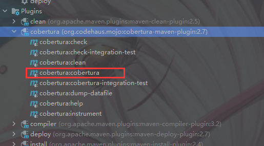
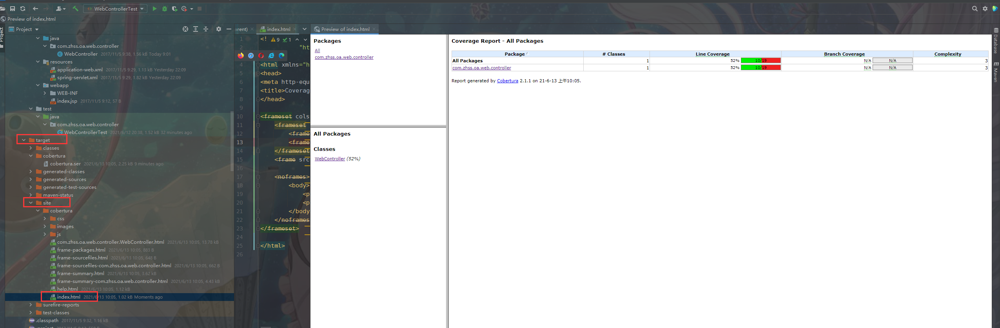
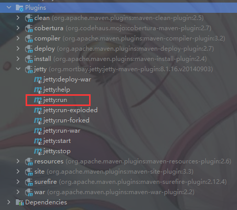
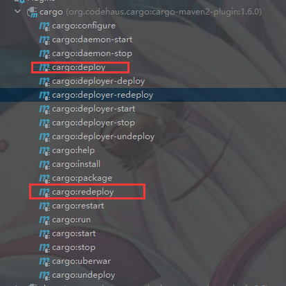
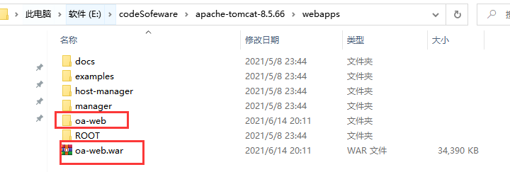
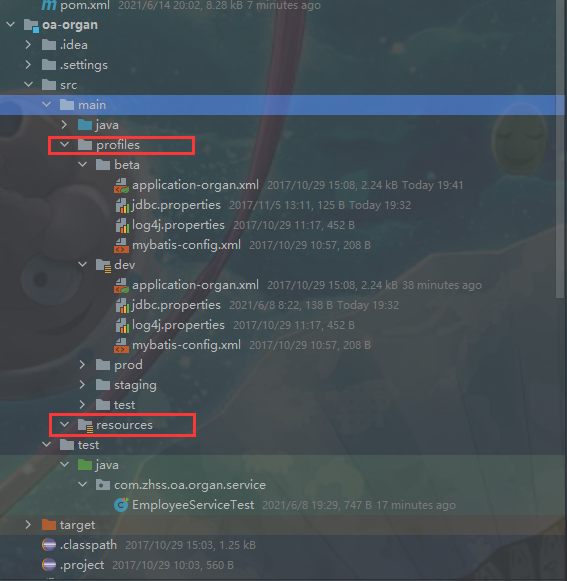
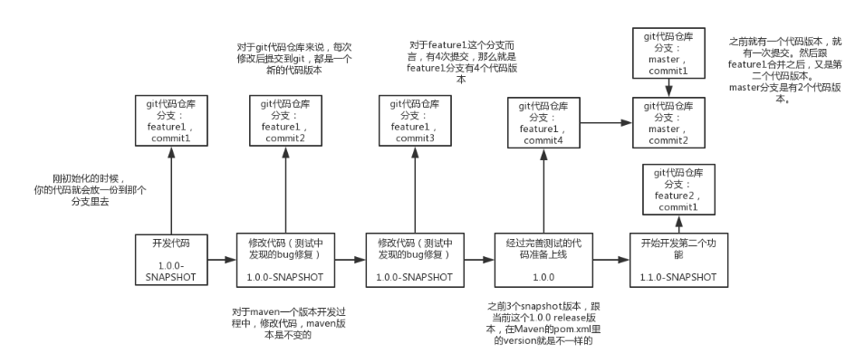
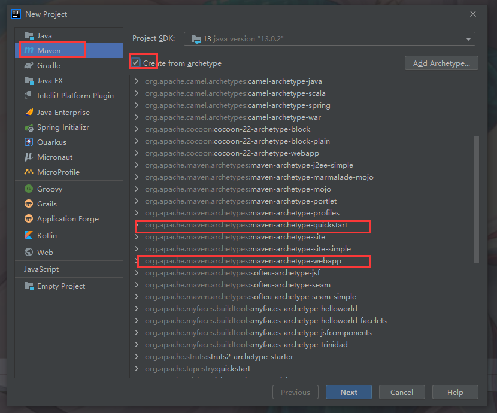
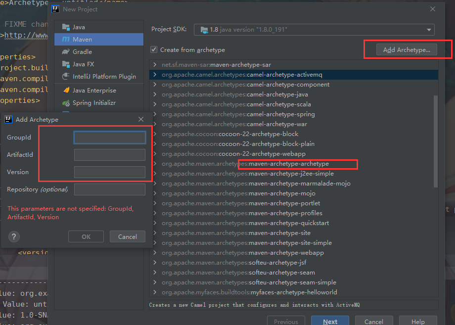
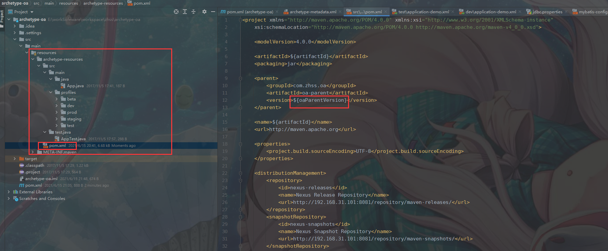

# 1 maven的前身

1、make：最原始的构建工具，不能跨平台

2、ant：曾经没有maven的时候，流行过一段时间，但是手工配置的语法繁琐，而且需要一次又一次的重复，另外依赖管理还要借助ivy来完成，工作量还是有点大。。。

3、maven：自动化。。。，目前是最有影响力的工程管理工具

4、gradle：google发布，不再基于xml来进行配置，而是基于DSL语言来进行构建管理，语法功能更加强大，android这块用的较多，同时国外一些开源项目，比如spring也开始用gradle来管理

# 2 maven基础

## 2.1 环境变量

首先普及一下，MAVEN_HOME是maven 1的写法、M2_HOME是maven 2的写法，但实际上这只是一种命名习惯，对实际作用没有任何影响。

  maven现在普遍的版本是3.5，3.6之后官网会推崇另外一种写法，不使用任何中间路径替代：

```shell
   export PATH=/opt/apache-maven-3.6.0/bin:$PATH
```


如果你的设置未生效，或者不对应，请按照上述进行设置（配置maven之前务必配置JAVA_HOME）

设置MAVEN_OPTS环境变量，就是设置maven的jvm参数，可以设置为-Xms128m -Xmx512m。

## 2.2 初始化

可选择运行mvn help:system

maven安装目录里的conf目录下的settings.xml配置文件拷贝到.m2目录里去，就ok了，作为以后maven全局唯一的配置文件

```shell
mvn help:system
#初始化，在用户目录下创建对应m2目录，并下载相关文件
```

## 2.3 pom介绍

```xml
<project>：pom.xml中的顶层元素

<modelVersion>：POM本身的版本号，一般很少变化

<groupId>：创建这个项目的公司或者组织，一般用公司网站后缀，比如com.company，或者cn.company，或者org.zhonghuashishan

<artifactId>：这个项目的唯一标识，一般生成的jar包名称，会是<artifactId>-<version>.<extension>这个格式，比如说myapp-1.0.jar

<packaging>：要用的打包类型，比如jar，war，等等。

<version>：这个项目的版本号

<name>：这个项目用于展示的名称，一般在生成文档的时候使用

<url>：这是这个项目的文档能下载的站点url，一般用于生成文档

<description>：用于项目的描述
```


## 2.4 相关命令

**PS:-D 参数表明properties属性(相当于xml的该属性，配置了就能通过$占位符来使用)  -P表示profiles配置文件**

快速构建maven项目

```shell
mvn archetype:generate    -DgroupId=com.zhss.maven     -DartifactId=maven-first-app    -DarchetypeArtifactId=maven-archetype-quickstart  -DinteractiveMode=false
#快速构建maven项目 下面对应包名,id等需要指定，组合命令的情况，需要在cmd命令行中运行组合命令，如果是在powershell中需要在后续命令加双引号(双引号不是很稳定，最好还是用cmd执行)
#运行后续组合命令不能换行，换行相当于下一个命令了，就不是组合命令
mvn archetype:generate    "-DgroupId=com.zhss.maven     -DartifactId=maven-first-app     -DarchetypeArtifactId=maven   -archetype         -quickstart  -DinteractiveMode=false"
java -cp target/maven-first-app-1.0-SNAPSHOT.jar com.zhss.maven.App
#执行jar包

```

## 2.5 maven流程图


## 2.6 maven坐标

每个maven项目都有一个坐标

groupId + artifactId + version + packaging + classifier，五个维度的坐标，唯一定位一个依赖包

任何一个项目，都是用这五个维度唯一定位一个发布包

实际上后面两个维度较为少用，99%的场景下，唯一定位一个依赖的就是三个维度，groupId + artifactId + version

**groupId**：不是你的公司或者组织，但是以你的公司或者组织的官网的域名倒序来开头，然后加上项目名称

www.baidu.com，公司里任何一个项目的开头，就可以用com.baidu来打头

com.zhss + 项目名称，或者是系统名称，maven就叫com.zhss.maven

**artifactId**：项目中的某个模块，或者某个服务

com.zhss.oa，oa-organ，organ是缩写，organization

com.zhss.oa，oa-auth，auth是authorization

com.zhss.oa，oa-flow，flow就是流程的意思

 **version**：这个工程的版本号

**packaging**：这个工程的发布包打包方式，一般常用的就jar和war两种，java -cp执行一个jar包，war可以放到一个tomcat容器里去跑的web工程

**classifier**：很少用，定义某个工程的附属项目，比如hello-world工程的，hello-world-source工程，就是源码，可能是类似于hello-world-1.0-SNAPSHOT-source.jar这样的东西。

**坐标作用**：

​	**工程写好了，都有版本，groupId+artifactId+version就成了这一次这个工程目前这个状态的唯一的标识和定位，就可以提供给别人使用(jar包方式打包提供)**，

## 2.6 dependency 引入依赖

```xml
<dependency>
	<groupId></groupId>
    <!--包路径-->
	<artifactId></artifactId>
    <!--服务名-->
	<version></version>
    <!--版本-->
	<type></type>
    <!--极少使用。。。。-->
	<scope></scope>
    <!--使用范围-->
	<optional></optional>
    <!--是否传递依赖-->
</dependency>
```

三要素：groupId、artifactId、version 常用(声明了就会定位依赖，本地没有就网上下载到本地)

type、scope、optional不常用

### 2.6.1 scope依赖范围

**PS:三种范围，编译、测试、运行**

compile：默认，对编译、测试和运行的classpath都有效

test：仅仅对于运行测试代码的classpath有效，编译或者运行主代码的时候无效（juit依赖可以使用）

provided：编译和测试的时候有效，但是在运行的时候无效(servlet-api，容器已提供)

runtime：测试和运行classpath有效，但是编译代码时无效(mysql驱动类，正常代码不需要直接引用到驱动类内部api)

### 2.6.2 传递性依赖

​	**PS:传递性依赖就是一个依赖包中还依赖其他的包，maven会自动传递解析**

​	**maven的传递性依赖，就是说会自动递归解析所有的依赖**，然后负责将依赖下载下来，接着所有层级的依赖，都会成为我们的项目的依赖，不需要我们手工干预。所有需要的依赖全部下载下来，不管有多少层级。这个就是maven的传递性依赖机制，自动给我递归依赖链条下载所有依赖的这么一个特性。

传递性依赖对应范围

| 一级\二级 | compile  | test | provided | runtime  |
| --------- | -------- | ---- | -------- | -------- |
| compile   | compile  |      |          | runtime  |
| test      | test     |      |          | test     |
| provided  | provided |      | provided | provided |
| runtime   | runtime  |      |          | runtime  |

### 2.6.3 依赖调节

传递性依赖会出现依赖冲突，maven根据**两大就近原则**解决：

**（1）就近原则：**

比如A->B->C->X(1.0)，A->D->X(2.0)，A有两个传递性依赖X，不同的版本

此时就会依赖调解，就近原则，离A最近的选用，就是X的2.0版本

**(2) 优先声明原则：**

如果A->B->X(1.0)和A->D->X(2.0)，路径等长呢？

那么会选择第一声明原则，哪个依赖在pom.xml里先声明，就用哪个

### 2.6.4 optional可选依赖

```xml
<optional>true</optional>
<!--此时依赖传递失效，不会向上传递-->
```

## 2.7 解决依赖冲突问题

**问题：**

maven会自动依赖调解，说对已给项目不同的版本选择一个版本来使用

但是如果**maven选择了错误的版本呢**

A包引用了C1.0(路径短)，B包引用了C2.0(路径长)，根据依赖调节选用了C1.0版本，这个时候B包调用C2.0中的方法就可能会产生ClassNotFound等异常

**解决：**

首先使用 

```shell
mvn dependency:tree
#查找当前项目pom的所有依赖链条
```


再根据报错是哪个包，在信息中找到相关的包，然后对应包中排除低版本的包即可

```xml
  		<dependency>  
            <groupId>org.springframework</groupId>  
            <artifactId>spring-core</artifactId>  
            <version>5.2.15.RELEASE</version>
            <!--排除spring-jcl-->
            <exclusions>
                <exclusion>
                    <groupId>org.springframework</groupId>
                    <artifactId>spring-jcl</artifactId>
                </exclusion>
            </exclusions>
        </dependency>  
```

（1）maven工作中最常见的依赖冲突问题的现象？

不同版本的包冲突

（2）产生的原因是什么？

传递依赖和依赖调节导致项目使用了低版本的包

（3）解决的思路

找出低版本的包排除

（4）具体用什么命令和配置去解决

用mvn dependency:tree找出所有依赖关系，再用exclusion将低版本包排除

# 3 maven项目对象模型

**maven-model-builder 查看maven项目对象模型**


超级POM，所有的项目都依赖于超级POM，超级POM是最基础的。超级POM定义了一组被所有项目共享的默认设置，位置是\apache-maven-3.0.5\lib 下的 maven-model-builder-3.0.5.jar 中的 org/apache/maven/model/pom-4.0.0.xml

**PS:maven/nexus索引就是pom对应相关定位信息，将相关定位信息索引就能更快加载包(相当于pom文件定位信息关联本地仓库/远程仓库的jar包位置，就是索引),本地有包，pom文件找不到就是索引失效了，idea可以通过reload project的方式(转圈)手动更新索引**

# 4 mvn命令的说明

```shell
mvn clean package：
#清理、编译、测试、打包

mvn clean install：
#清理、编译、测试、打包、安装到本地仓库，比如你自己负责了3个工程的开发，互相之间有依赖，那么如果你开发好其中一个工程，需要在另外一个工程中引用它，此时就需要将开发好的工程jar包安装到本地仓库，然后才可以在另外一个工程声明对它的依赖，此时会直接取用本地仓库中的jar包

mvn clean deploy：
#清理、编译、测试、打包、安装到本地仓库、部署到远程私服仓库，这个其实就是你负责的工程写好了部分代码，别人需要依赖你的jar包中提供的接口来写代码和测试。此时你需要将snapshot jar包发布到私服的maven-snapshots仓库中。供别人在本地声明对你的依赖和使用
```

# 5 maven生命周期


maven生命周期，就是去解释mvn各种命令背后的原理

maven的生命周期，就是对传统软件项目构建工作的抽象

清理、初始化、编译、测试、打包、集成测试、验证、部署、站点生成

​	**maven有三套完全独立的生命周期，clean，default、site**。**每套生命周期都可以独立运行，每个生命周期的运行都会包含多个phase**，**每个phase又是由各种插件的goal来完成的，一个插件的goal可以认为是一个功能(一个插件多个goal)**。

​	**PS:每个生命周期中的后面的阶段会依赖于前面的阶段，当执行某个阶段的时候，会先执行其前面的阶段。比如default生命周期中的package阶段，就会执行前面所有包括comlile的阶段(phase)**

**clean生命周期包含的phase如下：**

pre-clean

clean

post-clean

**default生命周期包含的phase如下：**

validate：校验这个项目的一些配置信息是否正确

initialize：初始化构建状态，比如设置一些属性，或者创建一些目录

generate-sources：自动生成一些源代码，然后包含在项目代码中一起编译

process-sources：处理源代码，比如做一些占位符的替换

generate-resources：生成资源文件，才是干的时我说的那些事情，主要是去处理各种xml、properties那种配置文件，去做一些配置文件里面占位符的替换

process-resources：将资源文件拷贝到目标目录中，方便后面打包

**compile：**编译项目的源代码

process-classes：处理编译后的代码文件，比如对java class进行字节码增强

generate-test-sources：自动化生成测试代码

process-test-sources：处理测试代码，比如过滤一些占位符

generate-test-resources：生成测试用的资源文件

process-test-resources：拷贝测试用的资源文件到目标目录中

test-compile：编译测试代码

process-test-classes：对编译后的测试代码进行处理，比如进行字节码增强

test：使用单元测试框架运行测试

prepare-package：在打包之前进行准备工作，比如处理package的版本号

**package：**将代码进行打包，比如jar包

pre-integration-test：在集成测试之前进行准备工作，比如建立好需要的环境

integration-test：将package部署到一个环境中以运行集成测试

post-integration-test：在集成测试之后执行一些操作，比如清理测试环境

verify：对package进行一些检查来确保质量过关

**install：**将package安装到本地仓库中，这样开发人员自己在本地就可以使用了

**deploy：**将package上传到远程仓库中，这样公司内其他开发人员也可以使用了

**site生命周期的phase(生成api 在浏览器中查看项目的站点)：**

pre-site
site
post-site
site-deploy

引用：https://blog.csdn.net/xyz9353/article/details/104302978?utm_medium=distribute.pc_relevant.none-task-blog-baidujs_title-0&spm=1001.2101.3001.4242

## 5.1 生命周期阶段与插件的默认绑定(phase与goal的默认绑定)

默认的phase和plugin绑定

但是问题来了，那么我们直接运行mvn clean package的时候，每个phase都是由插件的goal来完成的，phase和plugin绑定关系是？

实际上，默认maven就绑定了一些plugin goal到phase上去，比如：

类似于resources:resources这种格式，说的就是resources这个plugin的resources goal（resources功能，负责处理资源文件）

**default生命周期的默认绑定：**

process-resources				resources:resources

compile							compiler:compile

process-test-resources			resources:testResources

test-compile					compiler:testCompile

test								surefire:test

package							jar:jar或者war:war

install							install:install

deploy							deploy:deploy

**site生命周期的默认绑定：**

site								site:site

site-deploy						site:deploy

**clean生命周期的默认绑定：**

clean							clean:clean

## 5.2 自定义声明周期绑定插件(phase自定义绑定goal)

**PS:生命周期不执行任何操作,都是抱插件大腿，如果对应阶段(phase)没有maven默认绑定的插件就不执行任何操作**

​	除了内置绑定（默认绑定）以外，用户还能够自己选择将某个插件目标绑定到生命周期的某个阶段上，这种自定义绑定方式能让Maven项目在构建过程中执行更多更富特色的任务。

​	一个常见的例子是创建项目的源码jar包。内置的插件绑定关系中没有涉及这一任务，因此需要用户自行配置。**maven-source-plugin可以帮助我们完成该任务，它的jar-no-fork目标能够将项目的主代码打包成jar文件，可以将其绑定到default生命周期的verify阶段上，在执行完集成测试后和安装构件之前创建源码jar包**。具体配置见下：

```xml
<build>
      <plugins>
          <plugin>
              <groupId>org.apache.maven.plugins</groupId>
              <artifactId>maven-source-plugin</artifactId>
              <version>2.1.1</version>
              <executions>
                  <execution>
                      <id>attach-sources</id>
                      <phase>verify</phase>
                      <goals>
                          <goal>jar-no-fork</goal>
                      </goals>
                      <!--一个phase可以配置多个goal，每个goal都是一个具体的功能-->
                  </execution>
              </executions>
          </plugin>
      </plugins>
  </build>

```

引用：https://blog.csdn.net/bobozai86/article/details/106179052

## 5.3 maven的命令行和生命周期

**1 执行对应phase(阶段)**

比如mvn clean package

clean是指的clean生命周期中的clean phase

package是指的default生命周期中的package phase

此时就会执行clean生命周期中，在clean phase之前的所有phase和clean phase，pre clean，clean

同时会执行default生命周期中，在package phase之前的所有phase和package phase

**2 直接执行插件(goal)**

mvn dependency:tree

mvn deploy:deploy-file

就是不执行任何一个生命周期的任何一个phase

直接执行指定的插件的一个goal

比如mvn dependency:tree，就是直接执行dependency这个插件的tree这个goal，这个意思就是会自动分析pom.xml里面的依赖声明，递归解析所有的依赖，然后打印出一颗依赖树

mvn deploy:depoy-file，就是直接执行deploy这个插件的deploy-file这个goal，这个意思就是说将指定目录的jar包，以指定的坐标，部署到指标的maven私服仓库里去，同时使用指定仓库id对应的server的账号和密码。

# 6 maven插件

在maven官网搜索对应插件配置

http://maven.apache.org/plugins/index.html

## 6.1 配置插件

如果在命令行执行插件，可以用-Dkey=value来进行插件的设置

 比如mvn install -Dmaven.test.skip=true，就是surefire插件在测试的时候提供的参数，设置为true就会跳过测试

此外也可以在pom.xml中用来配置

```xml
<build>
<plugins>
	<plugin>
		<groupId>org.apache.maven.plugins</groupId>
		<artifactId>maven-compiler-plugin</artifactId>
		<version>2.1</version>
		<configuration>
			<source>1.5</source>
			<target>1.5</target>
		</configuration>
        <!--不同的插件configuration配置不一样，可以参考官网配置-->
	</plugin>
</plugins>
</build>
```

**PS:其实每个插件你只要定义它的坐标，默认情况下，它自己内部就带了要把哪些goal绑定到哪个phase上去,默认如果没有特殊的要求，用默认的参数就够了**

##  6.2 插件解析

先从本地仓库找插件，没有则从远程仓库找插件

插件的远程仓库也需要配置，maven默认配置了远程的插件仓库（超级仓库配置在maven-model-builder下对应pom文件的默认配置）

```xml
  <pluginRepositories>
    <pluginRepository>
      <id>central</id>
      <name>Central Repository</name>
      <url>https://repo.maven.apache.org/maven2</url>
      <layout>default</layout>
      <snapshots>
        <enabled>false</enabled>
      </snapshots>
      <releases>
        <updatePolicy>never</updatePolicy>
      </releases>
    </pluginRepository>
  </pluginRepositories>
```

也可以在在setting文件中改为nexus私仓库地址，统一走配置的私仓镜像地址，或者配置阿里云镜像地址

# 7 统一构建工程

​	一般来说会将模块统一放在父工程的目录下，这样就可以用下面形式，否则如果多个工程平级，则要用类似于../oa-organ的相对路径。

接着对oa-parent运行mvn clean install，此时就会对**oa-parent中所有的工程都进行统一的构建**

**在父工程下加入以下配置**

```xml
<groupId>com.zhss.oa</groupId>
<artifactId>oa-parent</artifactId>
<version>1.0.0-SNAPSHOT</version>
<packaging>pom</packaging>
<!--父工程packaging是pom,子工程是jar-->
<name>oa parent project</name>

<modules>
	<module>oa-organ</module>
	<module>oa-auth</module>
	<module>oa-flow</module>
</modules>
```

# 8 统一约束

## 8.1 版本号约束

​	一般都会**在properties元素里面，统一定义一个版本号，然后在这个类似spring的依赖里面，全部用${}占位符来引用一个版本号**，那么每次修改，升级spring版本，就直接修改properties元素中的一个地方就可以了，不会出错

```xml
<properties>
        <maven.compiler.source>8</maven.compiler.source>
        <maven.compiler.target>8</maven.compiler.target>
        <springframework.version>5.2.15.RELEASE</springframework.version>
    <!--定义变量-->
 </properties>
 <dependency>
     <groupId>org.springframework</groupId>
     <artifactId>spring-core</artifactId>
     <version>${springframework.version}</version>
     <!--统一使用变量的版本号-->
</dependency>
```


## 8.2 继承父项目版本

​	推荐使用dependencyManagement、pluginManagement的方式在父工程定义依赖

```xml
<!--父工程来声明要被子工程继承的依赖和插件-->
<dependencyManagement>
        <dependencies>
            <dependency>
                <groupId>org.springframework</groupId>
                <artifactId>spring-core</artifactId>
                <version>${springframework.version}</version>
            </dependency>
            <dependency>
                <groupId>org.springframework</groupId>
                <artifactId>spring-webmvc</artifactId>
                <version>${springframework.version}</version>
            </dependency>
        </dependencies>
</dependencyManagement>

<build>
        <pluginManagement>
            <plugins>
                <plugin>
                    <groupId>org.apache.maven.plugins</groupId>
                    <artifactId>maven-compiler-plugin</artifactId>
                    <version>3.2</version>
                    <configuration>
                        <source>1.8</source>
                        <target>1.8</target>
                        <encoding>UTF-8</encoding>
                    </configuration>
                </plugin>
            </plugins>
        </pluginManagement>
</build>
```


​	在子工程引入父工程的依赖，如果父工程是通过dependencies、plugins 直接定义依赖，那么子工程会全部继承父工程的所有依赖。

​	推荐使用dependencyManagement、pluginManagement的方式在父工程定义依赖，此时不会强制性继承所有的依赖和插件，子工程需要同时声明，自己要继承哪些依赖和插件，但是只要声明groupId和artifactId即可，不需要声明version版本号，因为version全部放在父工程中统一声明，强制约束所有子工程的相同依赖的版本要一样

```xml
<!--子工程引入父工程pom文件-->
<parent>
	<groupId>com.zhss.oa</groupId>
	<artifactId>oa-parent</artifactId>
	<version>1.0.0-SNAPSHOT</version>
</parent>
```

​	**PS:parent标签 子工程引入父工程pom文件，会继承parent工程的所有标签属性，除了pluginManagement、dependencyManagement等一些特殊标签是灵活继承，大部分标签会全部继承**

## 8.3 基于import、pom来规范约束依赖的版本号

在项目中先引入bom

```xml
<dependencyManagement>
       <dependencies>
           <dependency>
               <groupId>com.zhss.commons</groupId>
               <artifactId>commons-flow-bom</artifactId>
               <version>1.2.9</version> 
               <type>pom</type>
               <scope>import</scope>
			<!--scope import 相当于直接将commons-flow-bom中的dependencyManagement写在这里-->
           </dependency>
       </dependencies>
   	</dependencyManagement>
```

再引入包

```xml
<dependency>
       <groupId>com.zhss.commons</groupId>
       <artifactId>commons-flow</artifactId>
      <version>1.0.0-SNAPSHOT</version>
</dependency>
```

**流程思路**

（1）如果你是公司基础组件的开发人，你的组件依赖了很多重要的第三方的开源框架，然后你为了保证依赖你的组件的人，不会自行导入一些开源框架的过旧的版本，导致跟你的组件出现依赖冲突

（2）你需要为你的组件开发一个类型为pom的工程，后缀名为bom，这个工程，要声明一套dependencyManagement，里面声明好对你的组件的依赖的版本号，还有你的组件使用的重要的第三方开源框架的版本号

（3）然后依赖方在引用你的组件的时候，需要在自己的dependencyManagement中，加一个scope范围为import，类型为pom的这么依赖导入，此时就可以将你的bom包声明的那一套依赖的版本号导入他那里，作为版本的约束

（4）然后依赖方接着在dependencies里面可以声明对你的组件的依赖，此时版本号都不用写，因为已经被你约束了

（5）同时，假设依赖方要自己依赖一个过旧的开源框架的版本，会有提示报警，不让他自行定义过旧版本的框架

**PS:总结就是公司内部开发，一些比较重要的包，采用bom包装的方式，约束比较重要的第三方开源框架的版本号，避免依赖冲突**

# 9 自动化测试

## 9.1 surefire插件

​	maven的自动化运行单元测试的插件，surefire

​	maven中默认内置了surefire插件来运行单元测试，与最新流行的junit单元测试框架整合非常好。一般是在default生命周期的test阶段，会运行surefire插件的test goal，然后执行src/test/java下面的所有单元测试的

​	而surefire插件会根据一定的规则在sre/test/java下面找单元测试类，具体规则如下：

**/Test*.java

**/*Test.java

**/*TestCase.java

通常比较流行的是用*Test.java格式类命名单元测试的类

不常用命令：

```shell
mvn package -DskipTests
#跳过单元测试
mvn test -Dtest=**Test
#指定运行某个测试类
```

不常用配置

```xml
<!--自定义包含与排除测试类-->
<plugin>
  <groupId>org.apache.maven.plugins</groupId>
  <artifactId>maven-surefire-plugin</artifactId>
  <version>2.5</version>
  <configuration>
    <includes>
      <include>**/*Tests.java</include>
    </includes>
    <excludes>
      <exclude>**/*TempTest.java</exclude>
    </excludes>
  </configuration>
</plugin>
```


## 9.2 测试覆盖率报告

引入插件

```xml
<plugin>
    <groupId>org.codehaus.mojo</groupId>
    	<artifactId>cobertura-maven-plugin</artifactId>
    <version>2.7</version>
</plugin>
```

运行插件，生产测试覆盖率报告



或命令执行

```shell
 mvn cobertura:cobertura
```

查看测试覆盖率报告



**Line Coverage 行覆盖率**

一般单元测试覆盖率，要求的是，两种，方法覆盖率，行覆盖率

该插件目前只有行覆盖率，没有方法覆盖率

# 10 基于jetty的web工程

加入jetty插件

```xml
<plugin>
    <groupId>org.mortbay.jetty</groupId>
    <artifactId>jetty-maven-plugin</artifactId>
    <version>8.1.16.v20140903</version>
    <configuration>
        <scanIntervalSeconds>10</scanIntervalSeconds>
        <webAppConfig>
            <contextPath>/</contextPath>
            <!--contextPath 访问路径后缀！！！-->
        </webAppConfig>
    </configuration>
</plugin>
```

启动jetty



**PS:需注意jetty/tomcat等容器版本、servlet版本、spring版本需要相互对应，否则会出现servlet或者spring异常**

命令启动：

```shell
mvn jetty:run
#后续加 -Djetty.port=8081可以修改端口号
```

​	自定义添加的插件可以选择在**setting文件中添加pluginGroups配置**，将插件与自定义配置的groupId关联起来。

​	有的时候还是需要你去手动做一下配置的，不然在某些环境下可能直接运行类似jetty:run的命令可能会有问题。

​	maven默认自带绑定的插件不需要额外配置。

```xml
<pluginGroups>
	<pluginGroup>org.mortbay.jetty</pluginGroup>
</pluginGroups>
```

# 11 自动化部署及发布环境配置自动适配

## 11.1 cargo插件自动化热部署tomcat

pom添加配置

```xml
 <!-- 自动化部署远程Tomcat插件 -->
            <plugin>
                <groupId>org.codehaus.cargo</groupId>
                <artifactId>cargo-maven2-plugin</artifactId>
                <version>1.6.0</version>
                <!--cargo、tomcat、spring、servlet版本需要相互对应-->
                <configuration>
                    <container>
                        <containerId>tomcat8x</containerId>
                        <type>remote</type>
                    </container>
                    <configuration>
                        <type>runtime</type>
                        <properties>
                            <cargo.remote.username>admin</cargo.remote.username>
                            <cargo.remote.password>admin</cargo.remote.password>
                            <cargo.tomcat.manager.url>http://localhost:8080/manager</cargo.tomcat.manager.url>
                            <!--需要开启tomcat，配置tomcat的manager访问-->
                            <cargo.servlet.port>8080</cargo.servlet.port>
                        </properties>
                    </configuration>
                </configuration>
            </plugin>
```

执行自动化部署deploy为直接部署，需要删除之前部署的，如果不是第一次部署的话。redeploy是覆盖之前的(先删除后部署)。



命令部署

```shell
mvn cargo:deploy
```

​	**直接cargo:deploy，第一次部署，在http://localhost:8080/oa-web/，跟上接口，就可以去访问了(不用重启tomcat，直接生效)，非第一次部署使用cargo:redeploy即可(自动会先卸载，然后再重新部署)**

**注意事项**

​	1 在执行cargo命令的时候，切记，不要打开tomcat的任何配置问加你，因为也许会因为文件打开占用，导致一些不必要的bug	

​	2 如果在实验过程中，遇到一些奇怪的问题，可以考虑在tomcat的webapps下面，删除oa-web目录和oa-web.war，接着重新先关闭tomcat，再启动tomcat，然后再次把你的工程package打包，然后cargo:deploy部署



### 11.1.1 配置tomcat的manager访问

apache-tomcat-8.5.66\conf\tomcat-users.xml添加管理员账号，拥有所有角色权限

```xml
<role rolename="manager-script"/>
<role rolename="manager-jmx"/>
<role rolename="manager-status"/>
<role rolename="admin-gui"/>
<role rolename="admin-script"/>
<user username="admin" password="admin" roles="manager-gui,manager-script,manager-jmx,manager-status,admin-gui,admin-script"/>
<!--对应角色名是内置固定的，不是自定义名字-->
<!--该配置仅针对于tomcat8.0，其他版本可能有部分区别-->
```

在 apache-tomcat-8.5.66\webapps\manager\META-INF\context.xml中注释掉Valve

```xml
 <!-- <Valve className="org.apache.catalina.valves.RemoteAddrValve"
         allow="127\.\d+\.\d+\.\d+|::1|0:0:0:0:0:0:0:1" />-->
<!--因为tomcat8.0对manager访问做了限制，需要注释访问限制-->
```

引用：https://blog.csdn.net/fly_leopard/article/details/79654254


## 11.2 基于profile配置自动适配发布环境

## 11.2.1 利用占位符来配置properties文件

pom文件配置profiles

```xml
    <profiles>
        <profile>
            <id>dev</id>
            <activation>
                <activeByDefault>true</activeByDefault>
            </activation>
            <!--activation activeByDefault 设置默认profile的配置-->
            <properties>
                <database.jdbc.driverClass>com.mysql.jdbc.Driver</database.jdbc.driverClass>
                <database.jdbc.connectionURL>jdbc:mysql://192.168.31.101:3306/oa</database.jdbc.connectionURL>
                <database.jdbc.username>root</database.jdbc.username>
                <database.jdbc.password>Trsadmin123!@#</database.jdbc.password>
            </properties>
        </profile>
        <profile>
            <id>beta</id>
            <properties>
                <database.jdbc.driverClass>com.mysql.jdbc.Driver</database.jdbc.driverClass>
                <database.jdbc.connectionURL>jdbc:mysql://192.168.31.101:3306/oa_beta</database.jdbc.connectionURL>
                <database.jdbc.username>beta</database.jdbc.username>
                <database.jdbc.password>beta</database.jdbc.password>
            </properties>
        </profile>
    </profiles>
```

properties文件配置

```properties
jdbc.driverClassName=${database.jdbc.driverClass}
jdbc.url=${database.jdbc.connectionURL}
jdbc.username=${database.jdbc.username}
jdbc.password=${database.jdbc.password}
```

**激活profile，开启资源过滤**

```xml
	<build>
		<resources>
  			<resource>
  				<directory>src/main/java</directory>
  				<includes>
  					<include>**/*.xml</include>
  				</includes>
  				<filtering>true</filtering>
  			</resource>
  			<resource>
  				<directory>src/main/resources</directory>
  				<includes>
  					<include>**/*.xml</include>
  					<include>**/*.properties</include>
  				</includes>
                 <!--目录位置可自定义-->
  				<filtering>true</filtering>
  			</resource>
  		</resources>
	</build>
```

自适配配置文件命令

```shell
mvn clean package -Pdev
#加-P就是激活profile 加-Pdev就是激活了dev的profile
#profile有很多种激活的方式，但是常用的其实就是-P这一种激活方式即可，因为都是部署的时候用不同的-P来激活
```

### 11.2.2  不同地方配置profile

​	profile实际上是可以在不同的地方配置的

​	比如说在settings.xml里，我们也通过配置profile以及激活一些profile配置了maven私服仓库地址，在maven的超级pom里，也有一些profile激活

### 11.2.3 利用profile替换资源目录

​	1 将resource目录下的文件清空，新建立profiles文件夹，放入对应不同环境的配置文件



2 同上，激活profile，开启资源过滤

3 配置pom的profile对应

```xml
    <profiles>
        <!-- 每个profile对应了一个环境下的一套配置 -->
        <profile>
            <id>dev</id>
            <activation>
                <activeByDefault>true</activeByDefault>
            </activation>
            <!--activation activeByDefault 设置默认profile的配置-->
            <build>
                <resources>
                    <resource>
                        <directory>src/main/profiles/dev</directory>
                        <includes>
                            <include>**/*.xml</include>
                            <include>**/*.properties</include>
                        </includes>
                        <filtering>true</filtering>
                    </resource>
                </resources>
            </build>
        </profile>
        <profile>
            <id>prod</id>
            <build>
                <resources>
                    <resource>
                        <directory>src/main/profiles/prod</directory>
                        <includes>
                            <include>**/*.xml</include>
                            <include>**/*.properties</include>
                        </includes>
                         <!--目录位置可自定义-->
                        <filtering>true</filtering>
                    </resource>
                </resources>
            </build>
        </profile>
    </profiles>
```


4 同样使用自适配配置文件命令mvn clean package -Pdev即可将不同目录下的配置替换到resource目录中去，可利用**mvn clean process-resources -Pdev** (替换资源目录)，在target\classes查看效果是否成功

# 12 版本管理与版本控制

**版本管理：通常指的是maven中的version**

通常version有三位数，第三位一般为bug修复，第二位为新模块发布，第一位一般为大版本重构或重大功能变更

**版本控制：提交到git的代码，每次提交都是该分支的一个版本**

其实一般就是一个版本对应一个分支，各种开发+测试

搞定之后就会merge到主干

然后就会给这个时候的主干打一个tag作为主干在这个版本的代码，以后任何时候都可以使用主干的某个tag，也就是某个时刻的某个版本的代码




# 13 利用archetype为项目创建统一框架


​	artchetype其实就是个maven项目模板

​	**常用的maven archetype**

​	如果只是一个模块，或者不需要web容器的支持，那就是maven-archetype-quickstart即可

​	如果是一个web工程，那可以用maven-archetype-webapp



在 **2.4 相关命令** 中就是使用archetype来快速建立maven工程

## 13.1 建立一个自己的项目统一框架

**1 利用命令快速建立archetype的模板**

```shell
mvn archetype:generate -DarchetypeGroupId=org.apache.maven.archetypes -DarchetypeArtifactId=maven-archetype-archetype -DarchetypeVersion=1.4
```

​	也可以在idea添加archetype模板后，利用idea建立(idea默认archetype没有maven-archetype-archetype，需要添加)，添加后就会生成对应archetype模板。后续就无须再添加，直接使用之前添加模板的即可




**2 在archetype自己的pom中添加私服配置**

```xml
	<distributionManagement>
		<repository>
			<id>nexus-releases</id>
			<name>Nexus Release Repository</name>
			<url>http://192.168.31.101:8081/repository/maven-releases/</url>
		</repository>
		<snapshotRepository>
			<id>nexus-snapshots</id>
			<name>Nexus Snapshot Repository</name>
			<url>http://192.168.31.101:8081/repository/maven-snapshots/</url>
		</snapshotRepository>
	</distributionManagement>
```

**2 定义archetype的元数据**

接着要编写src/main/resources/META-INF/maven/archetype-metadata.xml

这个文件两个作用，

​		第一个作用是定义将这个archetype中的哪些java代码和测试代码以及资源文件，都包含到创建好的项目中去

​		第二个作用是定义创建项目的时候需要输入的参数是什么

package是创建项目的时候必须输入的，就是你的包基础路径。一般是需要将代码放到包路径下的，而资源文件不需要放到包路径下。

```xml
<?xml version="1.0" encoding="UTF-8"?>
<archetype-descriptor name="archetype-oa">
	<fileSets>
		<fileSet filtered="true" packaged="true">
            <!--filtered参数表示是否对文件启用占位符替换，packaged表示是否将文件放到包路径下-->
			<directory>src/main/java</directory>
			<includes>
				<include>**/*.java</include>
			</includes>
		</fileSet>
		
		<fileSet filtered="true" packaged="true">
			<directory>src/test/java</directory>
			<includes>
				<include>**/*.java</include>
			</includes>
		</fileSet>
		
		<fileSet filtered="true" packaged="false">
			<directory>src/main/resources</directory>
			<includes>
				<include>**/*.properties</include>
				<include>**/*.xml</include>
			</includes>
		</fileSet>
        <!--定义需要加载的各目录位置-->
	</fileSets>
	
	<requiredProperties>
		<requiredProperty key="oaParentVersion" />
		<requiredProperty key="shortName" /> 
	</requiredProperties>
    <!--定义创建工程必须输入的参数，通过占位符来动态填充-->
</archetype-descriptor>
```


**3 配置生成项目的pom及对应java、resource、test等文件**

​	1 在pom中通过${}占位符的方式灵活配置，在生成项目的时候自己输入对应占位符信息

​	2 在archetype-resource下的相关代码及配置就是生成新项目的代码与配置



**4 同时对于你写的一些基础的类，一般是可以用package占位符的，到时候创建出来就会替换package**

```java
package ${package}

public class Application {


}
```

**5 部署arthcetype到私服**

mvn clean deploy安装到本地仓库和私服，都可以使用了

**6 生成项目**

```shell
mvn archetype:generate -DarchetypeGroupId=com.zhss.archetypes -DarchetypeArtifactId=archetype-oa -DarchetypeVersion=1.0.0
#注意版本号等参数需要和私服中上传的包对应
```

## 13.2 扩展

也可以做到不需要输入archetype的坐标就可以使用，就是要将archetype加入一个archetype列表供用户选择，这个archetype列表就是在archetype-catalog.xml文件中。

maven默认会从几个地方去读取archetype-catalog.xml的内容：

（1）internal：maven-archetype-plugin内置了几十个archetype

（2）local：从~/.m2/archetype-catalog.xml读取，默认不存在，要自己创建

（3）remote：读取maven中央仓库的archetype-catalog.xml，大概有几百个archetype

（4）file：读取本机任何一个文件

（5）http：读取任何一个网络上的文件

默认maven会从local+remote去读取archetype列表供选择

可以用mvn archetype:crawl来自动化扫描本地仓库中的archetype，然后生成一份archetype-catalog.xml，放在~/.m2/目录下，但是一般不用这种方式。


