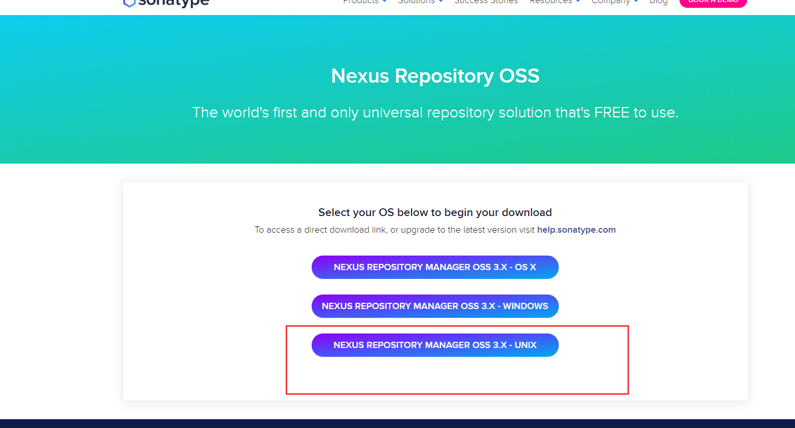
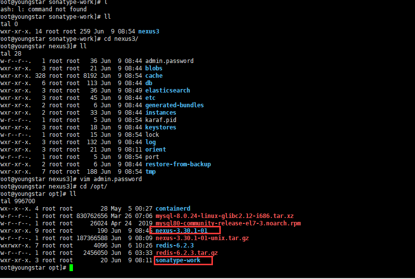
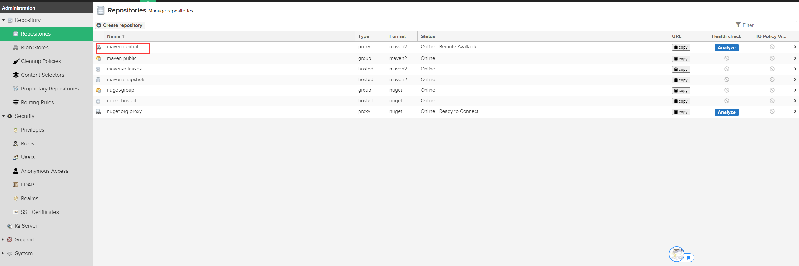
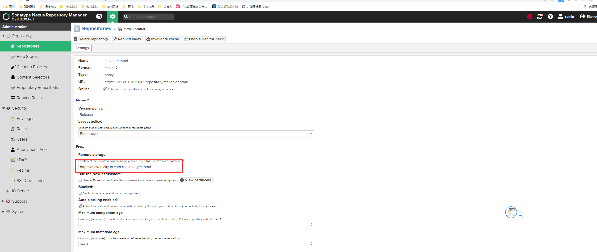
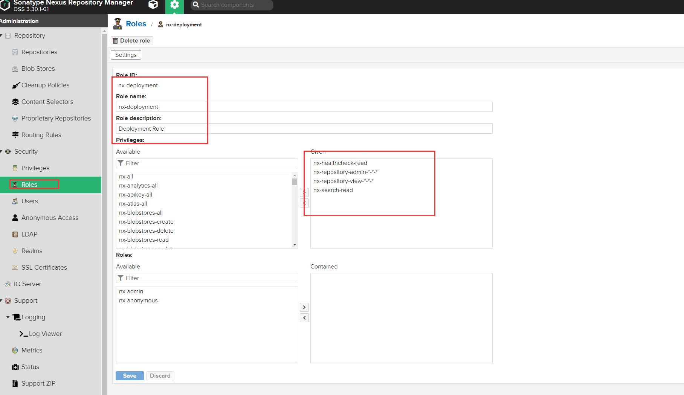
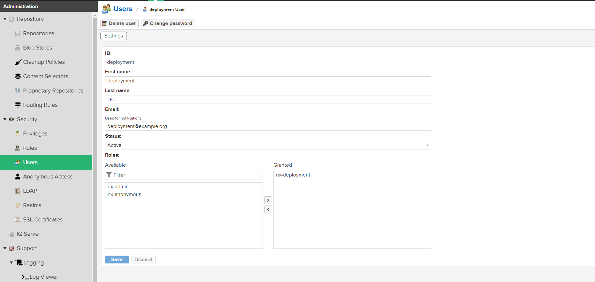
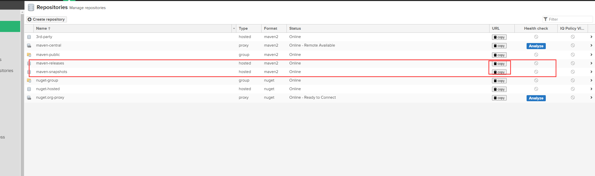
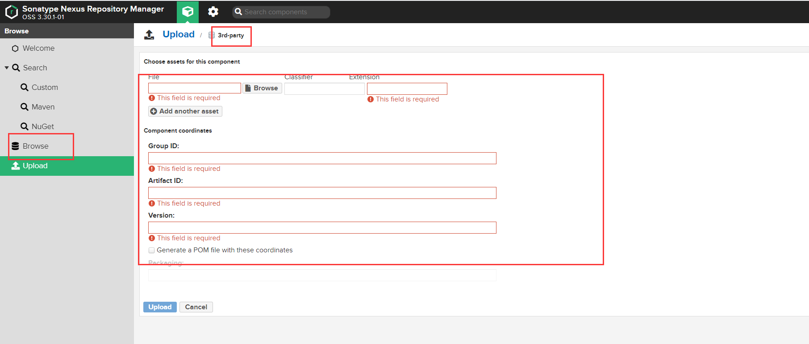
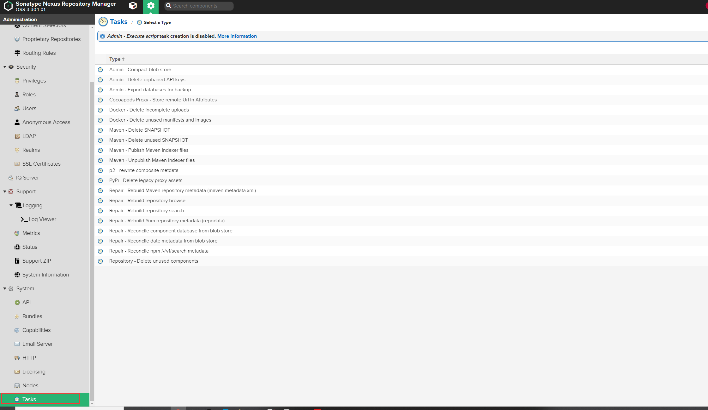

# 1 nexus安装

**首先需要安装jdk8，也必须是Jdk8，其他版本会给错误提示，无法启动**

版本/收费/免费：Nexus Repository Manager 仓库管理有2个版本，专业版和oss版，oss版是免费的，专业版是收费的，我们使用oss版。

官网下载

https://www.sonatype.com/thanks/repo-oss



解压文件，会生成对应两个目录

```shell
tar -zxcf nexus-3.30.1-01-unix.tar.gz
```



**因为nexus启动脚本默认禁止root用户启动，如果用root用户启动需要修改启动脚本**

```shell
vim nexus
#在对应bin目录下
run_as_root=false
#改为false
```

**开启端口8081，nexus默认端口是8081**

```shell
firewall-cmd --zone=public --add-port=8081/tcp --permanent 
# 开放端口
firewall-cmd --zone=public --remove-port=8081/tcp --permanent  
#关闭端口
firewall-cmd --reload  
# 配置立即生效
firewall-cmd --zone=public --list-ports
#查看端口
```

**新版本nexus密码默认不是amdin123，是在admin.password中的随机字符串，查找解压后的第二个目录即可**

```
find ./sonatype-work/ -name admin.password
```

**启动nexus**

```shell
./nexus start
#启动脚本在nexus-3.30.1-01的bin目录下
```

**登录**

http://192.168.31.101:8081/ 

首次登录提示修改密码，修改密码即可


maven-central代理仓库：从直接代理maven中央仓库，修改为代理阿里云仓库，

https://maven.aliyun.com/repository/central






# 2 本地maven配置nexus私仓库

在setting.xml加入下列配置

```xml
<!--使用nexus镜像-->
<mirror>
	<id>nexus</id>
	<mirrorOf>*</mirrorOf>
	<url>http://192.168.31.101:8081/repository/maven-public/</url>
</mirror>

<!--profile使用nexus依赖及插件仓库-->
<profile> 
      <id>jdk-1.8</id>  
      <activation>
		<activeByDefault>true</activeByDefault>
        <jdk>1.8</jdk>  
      </activation>  
        
      <properties>  
        <maven.compiler.source>1.8</maven.compiler.source>  
        <maven.compiler.target>1.8</maven.compiler.target>  
        <maven.compiler.compilerVersion>1.8</maven.compiler.compilerVersion>  
      </properties>   
    </profile> 

	<profile>
		<id>nexus</id>
      	<repositories>
        		<repository>
          			<id>nexus</id>
                    <!--可以改成central，覆盖maven超级仓库的id-->
          			<name>Nexus </name>
					<url>http://central</url>
          			<releases><enabled>true</enabled></releases>
          			<snapshots><enabled>true</enabled></snapshots>
        		</repository>
      	</repositories>
      	<pluginRepositories>
        		<pluginRepository>
          			<id>nexus</id>
                    <!--可以改成central，覆盖maven超级仓库的id-->
          			<name>Nexus Plugin Repository</name>
					<url>http://central</url>
          			<releases><enabled>true</enabled></releases>
          			<snapshots><enabled>true</enabled></snapshots>
        		</pluginRepository>
      	</pluginRepositories>
	</profile>
	
<!--激活对应的profile，在项目执行构建的时候，就会将profile中的仓库配置应用到每个项目中去-->
<activeProfiles>
	<activeProfile>nexus</activeProfile>
</activeProfiles>
```

​	用mirror镜像机制，来强制要求所有对远程仓库的请求，全部通过镜像走私服。所谓的镜像，就是如果某个仓库A代理了另外一个仓库B，里面的内容完全一样，那么仓库A就是仓库B的镜像。

​	可以认为是阿里云仓库就是中央仓库的一个镜像，nexus私服配置成所有远程仓库的镜像

​	**将所有repository的id修改为central，直接覆盖maven超级pom中的morning中央仓库(超级仓库的id就是central)，相当于此时唯一的远程中央仓库变成了我们自己配置的两个仓库,所有远程请求走自定义配置的私仓的仓库(超级仓库配置在maven-model-builder下对应pom文件，参考maven小知识-3 扩展)。**

​	**然后将url配置全部改为http://central，其实是没意义的一个url，因为此时在需要从远程仓库下载依赖或者插件的时候，会从两个自己配置的central仓库去走，然后看release或者snapshot是否支持，如果支持，那么就会找镜像配置，由于我们的镜像匹配所有请求，所以所有请求都会走镜像，而镜像配置的是私服地址，所以相当于所有的请求都会走私服了**

# 3 用户及权限

​	admin和匿名账号是不够的，我们需要创建一个专门用来部署的账号，deployment(普通开发账号)：

（1）涵盖所有匿名账号的权限，至少可以搜索仓库，下载依赖

（2）对仓库有所有的管理权限，就可以往仓库中去部署发布包 



在新建用户关联deloyment角色



# 4 开发模块发布到私服

​	nexus仓库对于普通的匿名用户是只读的，也就是说，只能下载依赖，不能部署发布包，因此如果要能够部署发布包，需要在settings.xml文件里通过<server>元素配置使用专用的部署用户，来通过认证，进行发布包的部署。

需要在settings中配置：

```xml
 <servers>
	<server>
		<id>nexus-releases</id>
		<username>deployment</username>
		<password>deployment123</password>
	</server>
	<server>
		<id>nexus-snapshots</id>
		<username>deployment</username>
		<password>deployment123</password>
	</server>
</servers>
```

然后在项目中的pom文件加入如下配置

```xml
<distributionManagement>
	<repository>
		<id>nexus-releases</id>
		<name>Nexus Release Repository</name>
		<url>http://192.168.31.101:8081/repository/maven-releases/</url>
	</repository>
	<snapshotRepository>
		<id>nexus-snapshots</id>
		<name>Nexus Snapshot Repository</name>
		<url>http://192.168.31.101:8081/repository/maven-snapshots/</url>
	</snapshotRepository>
</distributionManagement>
```

具体url路径从私服中复制



## 4.1 执行Maven deploy命令部署到私服

​	mvn clean deploy命令，可以让maven自动给我们编译源代码、运行单元测试、打成jar包、将jar包安装到本地仓库、将Jar包部署到配置的远程私服仓库里面去

```shell
mvn clean deploy
```

​	在私服上面，如果上传snapshot版本的jar包呢，在私服上存储的时候，会自动带上一个时间戳。这个主要是因为考虑到在开发过程中会频繁的部署snapshot包，所以会用时间戳来区分一下。但是这个对我们是透明的，如果我们其他人要用你的这个snapshot jar包，直接还是用你的坐标来声明依赖就可以了，他是不用去考虑这个时间戳的问题的，私服会替你管理好。

# 5 上传第三方jar包到私服

​	有些第三方厂商的jar包，比如特殊数据库厂商的jdbc驱动，或者某个厂商的支付相关的api jar包，是不提供公网下载的，只能从他们那里拿到一个jar包，此时就需要手动将其上传到3rd party仓库里面去。

​	先在setting.xml中配置3rd party仓库位置

```xml
<server>
	<id>nexus-3rd-party</id>
	<username>deployment</username>
	<password>deployment123</password>
</server>
```


​	 选择3rd party，选择Artifact Upload，上传即可

​	界面上传



命令上传

```shell
mvn deploy:deploy-file -DgroupId=com.csource -DartifactId=fastdfs-client-java -Dversion=1.24 -Dpackaging=jar -Dfile=F:\DevelopmentKit\fastdfs_client_v1.24.jar -Durl=http://localhost:8081/repository/3rd-party/ -DrepositoryId=nexus-3rd-party
#组合命令的情况，需要在cmd命令行中运行组合命令，如果是在powershell中需要在后续命令加双引号(双引号不是很稳定，最好还是用cmd执行)
```

# 6 nexus定时任务相关



​	可以创建清理(不常用、SNAPSHOT等)、刷新索引、压缩包(节省空间)等定时任务，可以根据cron或预设执行周期等来指定定时任务执行周期及时间。

​	正常来说删除不常用包、SNAPSHOT、刷新索引、压缩包(节省空间)这些可以根据情况每个礼拜、每个月等周期运行一次。 


