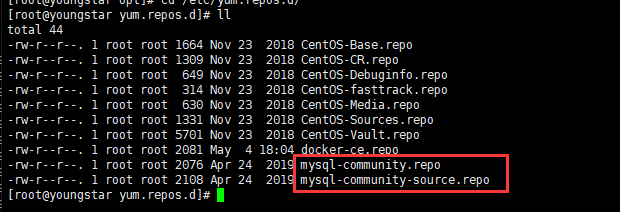

# 1 通过yum安装(8.0)

**可以先删除自带的mysql或者centos自带的mariadb,不删除也不影响安装**

centos的yum 源中默认是没有mysql的，所以我们需要先去官网下载mysql的repo源并安装。

在MySQL官网中下载YUM源rpm安装包：https://dev.mysql.com/downloads/repo/yum/ 

也可以通过wget下载

```shell
wget https://dev.mysql.com/get/mysql80-community-release-el7-3.noarch.rpm
```

按照yum repo文件

```shell
rpm -ivh mysql80-community-release-el7-3.noarch.rpm
#或
yum localinstall mysql80-community-release-el7-3.noarch.rpm
```

会在/etc/yum.repos.d/目录下生成两个repo文件mysql-community.repo mysql-community-source.repo



更新yum源

```shell
yum clean all
yum makecache
```

安装Mysql

```shell
yum install mysql-community-server
#或
yum install -y mysql-community-server
```

开启mysql服务

```shell
systemctl start mysqld.service
```

设置开机自启

```shell
systemctl enable mysqld.service
```

获取初始密码登录mysql

```shell
cat /var/log/mysqld.log | grep password
#mysql在安装后会创建一个root@locahost账户，并且把初始的密码放到了/var/log/mysqld.log文件中；
```

使用初始密码登录mysql

```shell
mysql -uroot -p
```

修改root密码

```sql
ALTER USER 'root'@'localhost' IDENTIFIED BY 'password';
#mysql8.0版本必须符合长度（默认是8位），且必须含有数字，小写或大写字母，特殊字符
#可以选择修改密码策略，才能设置简单密码
```

原程连接设置

```sql
use mysql;
#该指令需要修改密码后才能使用，初始密码登录会报错误警告
update user set host='%' where user='root';
#授权用户名的权限，赋予任何主机访问数据的权限
flush privileges;
#刷新配置
#远程连接需要开放防火墙3306端口
```

旧版navicat连接问题


```sql
 ALTER USER 'root'@'localhost' IDENTIFIED BY 'password' PASSWORD EXPIRE NEVER;   
 #修改加密规则
 #注意如果将root的localhost已经修改为了%，运行相关alter的sql需要将'root'@'localhost' 改成对应的'root'@'%'
  ALTER USER 'root'@'localhost' IDENTIFIED WITH mysql_native_password BY 'password'; 
  #还要更新用户密码
 flush privileges;
#刷新配置
```

命令行退出

```
quit;
```

参考文章：

https://www.cnblogs.com/skyblue123/p/13287028.html?utm_source=tuicool

https://blog.csdn.net/iiiiiilikangshuai/article/details/100905996

https://www.cnblogs.com/zhurong/p/9898675.html

https://blog.csdn.net/q258523454/article/details/84555847

# 2 mysql 5.7安装

https://www.cnblogs.com/porotin/p/9045391.html

