# 1 初探mysql

## 1.1 系统是如何跟MySQL打交道(mysql连接与驱动)

**MySql驱动：**

​	我们如果要和数据库建立连接，必须通过mysql驱动去连接数据库。

pom(面向Java语言的Mysql驱动)

**PS:对应主流编程语言，MySql都会提供对应语言的驱动（PHP,.NET等）。**

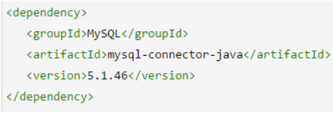

java通过mysql驱动和与mysql数据库建立网络连接,对应代码就可以通过mysql驱动访问数据库，执行对应sql语句了。

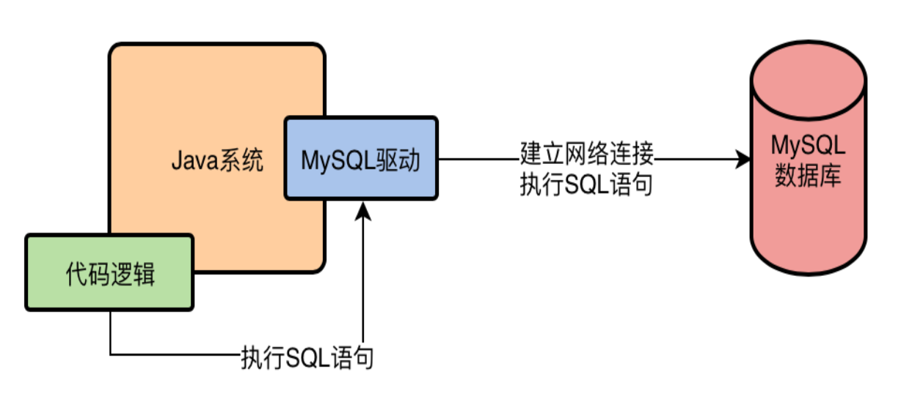

**数据库连接池：**

**问题：**

​	问：java系统只会和mysql建立一个连接吗？

​	答：不会，java开发web系统，部署在tomact中的话，必定是多个线程去处理用户请求的，多个线程去抢夺同一个数据库连接的话，效率是很低下的。

​	问：多线程访问mysql，频繁创建销毁数据库连接是否合理？

​	答：不合理，创建销毁数据库连接是非常耗费资源，且效率低下。

**方案：**

​	使用数据库连接池，一个连接池去维护多个数据库连接。多个线程去使用不同的数据库连接，sql语句执行完后，并不会将连接销毁。而是将连接放回连接池中，后续还可以继续使用。

**PS:常见的连接池有DBCP,C3P0,Druid,HikariCP等**

**PS:HiKariCP 号称业界跑得最快的数据库连接池，近几年发展的风生水起，更是被 Spring Boot 2.0 选中作为其默认数据库连接池**

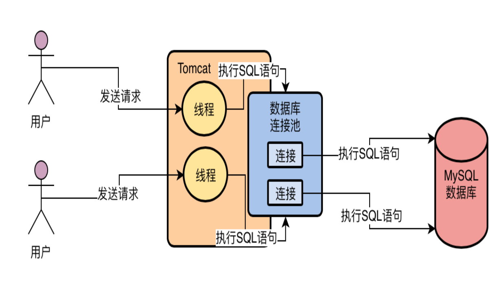

**MySql数据库连接池：**

​	系统要和mysql建立多个连接，对应Mysql也必然要通过连接池维护与系统之间的多个连接。

​	**实际上mysql就是通过连接池来维护与系统之间的多个连接。除此之外每次与Mysql建立连接的时候，还会根据传递的账号密码，进行**

**账号密码、库表权限等验证。**


## 1.2 执行一条SQL语句，MySQL的架构设计概述

从一条SQL的执行流程来看MySql的整体架构设计

**1 mysql线程处理连接的网络请求**，对应线程去监听请求和读取数据，从网络连接中读取和解析出来SQL语句。

**2 SQL接口负责处理接收到的SQL语句：**

​	Mysql内部提供了对应的组件，就是SQL接口(SQL Interface),SQL接口去执行对应增删改查等SQL语句，**因此Mysql工作线程接收到SQL语句之后会交给SQL接口去执行**

**3 查询解析器，让MySql能够"看懂"Sql语句：**

​	查询解析器(Parser)就是对SQL语句进行解析的，举个例子：

```sql
 select id,name,age from user where id = 1
```

解析器会对sql语句进行拆解，讲上面的语句拆成以下三个部分

​	(1) 从user表中获取数据

​	(2) 查询id值为1的数据

​	(3) 对应Id值为1的那1行（多行）数据提取其中id、name、age 三个字段

**PS:所谓SQL解析就是按照SQL的规则和语法对SQL语句进行解析，理解SQL要去干什么事情**

**4 查询优化器(optimizer)，选择最优的查询路径：**

根据对应SQL语句去选择**执行计划**，是否走索引，走哪个索引，等

**5 执行器，根据执行计划调用存储引擎的接口**

​	**执行器会根据优化器生成的执行计划按照一定顺序，不停的去调用存储引擎的对应接口去完成SQL语句的执行计划(大致就是不停的更新或者提取一些数据出来)**

​	举个例子：执行引擎可能先调用存储引擎的一个接口，去获取"user"表中的第一行数据，然后判断id是否是我们期望的值，如果不是再调用存储引擎的接口，去获取下一行的数据

**6 存储引擎接口，真正的执行SQL语句**

​	存储引擎在执行SQL语句的时候，会按照一定步骤去查询**内存缓存数据**，更新**磁盘数据**，查询磁盘数据等等，去执行诸如此类的一些操作。

​	**存储引擎是支持多种引擎的，常见的存储引擎有InnoDB,MyISAM,Memory等**

​	MySql默认是InnoDB存储引擎，可以选择具体使用哪种存储引擎

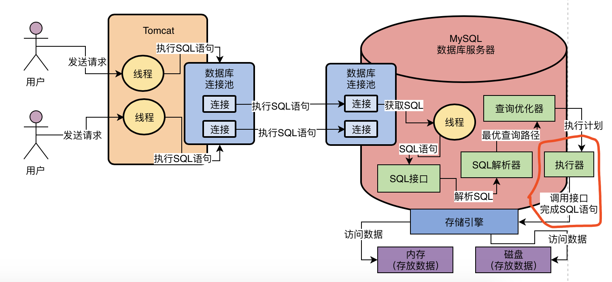

## 1.3 InnoDB存储引擎初探

### 1.3.1 用一次数据更新流程，初步了解InnoDB存储引擎的架构设计

首先假设有这样一条SQL语句

```sql
update user set name = 'xxx' where id = 10
```

**1 InnoDB的重要内存结构，缓冲池(Buffer Pool)**

​	**缓冲池,这里面会缓存很多数据，在查询的时候如果内存缓冲池中已经有数据的话，就不用去查磁盘了**

​	**流程概述：**引擎要执行更新语句的时候，比如对"id=10"这一行数据，其实会先看下缓冲池中是否有该数据，如果没有就会直接从**磁盘加载到缓冲池**中，而且接着还会对这行记录加独占锁（锁后续详细分析，加锁/释放锁等）

**2 undo日志文件，让更新的数据可以回滚**

​	**将更新前的值写入undo日志文件**

​	**流程概述：**假设"id=10"这行数据原来name是"zhangsan"，现在要将其更新为"xxx"，那么此时就将原来的值"zhangsan"和"id=10"这些信息，写入到undo日志文件中

**3 更新buffer pool的缓存数据**

​	更新内存缓冲池中(buffer pool)的数据

​	**流程概述：把内存里"id=10"这行数据的name字段修改为"xxx"**

**PS:此时这行数据称为"脏数据"，因为此时内存数据已经被修改了，磁盘上还是旧数据"zhangsan"(内存与磁盘不一致，脏数据)**

**4 Redo Log Buffer：避免系统宕机，导致数据丢失**

​	**把内存所做的修改写入到一个Redo Log Buffer中区，这也是内存里的一个缓冲区，是用来存放redo日志的**

​	**流程概述：**所谓redo日志，就是记录对数据进行了什么修改，比如对"id=10"这行记录修改了name字段的值为xxx，这就是一个日志

**PS:此时redo日志仅仅停留在内存中(本步骤)**

**PS:如果没有提交事务MySql宕机怎么办？其实是不影响的，内存数据丢失，磁盘数据还是原样。因为更新语句没有提交事务，代表没有执行成功。所以事务失败的话会收到一个数据库的异常，mysql重启后数据不会发生变化，还是老数据"zhangsan"**

**5 提交事务的时候将redo日志写入磁盘中**

​	提交一个事务的时候，会根据一定的策略吧redo日志从redo log buffer里刷入到磁盘文件里去。

​	**这个策略就是通过innodb_flush_log_at_trx_commit 来配置的**，它有几个选项 0、1、2

​		**(1)innodb_flush_log_at_trx_commit 为 0：提交事务的时候，不会吧redo log buffer里的数据刷入磁盘文件**。如果此时mysql宕机了，就算提交了事务，还是会丢失数据(内存中的数据和redo日志丢失)

​		**(2)innodb_flush_log_at_trx_commit 为 1：提交事务的时候，必须把redo log从内存刷入到磁盘文件中**，只要事务提交成功，redo log就必然在磁盘里了

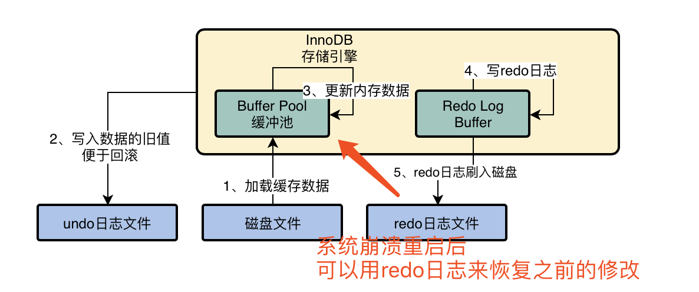

​	**(3)innodb_flush_log_at_trx_commit 为 2：提交事务的时候，把redo log日志写入磁盘文件对应的os cache缓存中**，可能1秒后(系统控制)才会吧os cache(内存缓冲)里的数据写入到磁盘文件中

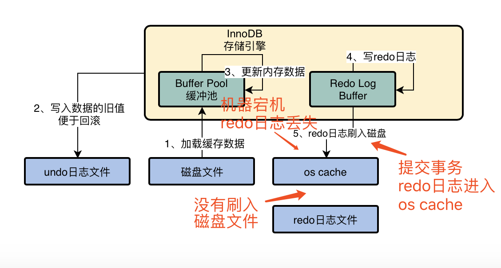

**PS:如果"xxx"已经持久化到redo日志文件中了，但是磁盘文件还是"zhangsan"，此时系统突然崩溃了，会丢失数据吗？答案是不会，因为mysql重启之后会根据redo日志去恢复之前做过的修改**

刷盘策略对比：

​	0 最快 1最慢，但是最保险 2 保险，速度。适中

​	一般建议是设置为1，数据库不允许数据丢失。

### 1.3.2 用一次数据更新流程，聊聊binlog是什么

**binlog不是InnDB存储引擎特有的日志文件，而是属于mysql server自己的日志文件**

**binlog与redo log的区别：**

​	redo log：是一种偏向物理性质的重做日志，比如对哪个"数据页"中的什么记录，做了个什么修改

​	**binlog：binlog叫做归档日志**，里面记录的是偏向逻辑性的日志，比如"对user表中的id=10这一行数据做了更新操作，更新之后的值是什么"

**提交事务的时候，同时会写入binlog：**

​	提交事务的时候，同时还会吧这次更新对应的binlog日志写入到磁盘文件中

​	执行器是非常核心的组件，负责跟存储引擎配合完成一个SQL语句在磁盘与内存层面的全部数据更新操作。

​	对应下图流程图中，1、2、3、4几个步骤是更新语句的操作。5、6、7步骤是从提交事务开始的，属于提交事务的阶段

**binlog日志的刷盘策略：**

​	通过sync_binlog参数控制刷盘策略，默认值为0,

```shell
#提交事务的时候写入os cache内存缓存
sync_binlog:0
#提交事务的时候直接写入磁盘文件中
sync_binlog:1
```

**基于binlog和redo log完成事务的提交：**

​	将binglog写入磁盘文件之后，此时会把本次**对应的binglog文件名称和这次更新的binlog日志在文件里的位置，都写入到redo log日志文件中，同时在redo log日志文件里写入一个commit标记**，在完成这个事情之后才算是最终完成了事务的提交

​	(1) commit标记的意义，其实就是用来保持redo log日志与binlog日志一致的。

​	(2)  如果在步骤5、6两个步骤的时候系统宕机了，因为redo log没有最终的commit标记，因此此时事务提交是失败的。

​	(3)  必须redo log写入最终的commit标记，才算事务提交成功。

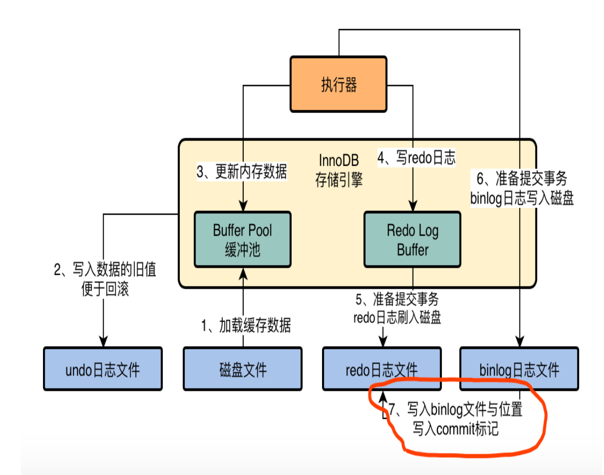

**后台IO线程随机将内存更新后的"脏数据"刷回磁盘:**

​	MySQL有一个后台的IO线程，会在某个时间点，随机的把检查buffer pool中修改后的"脏数据"刷回到磁盘的数据文件中

​	在IO线程吧"脏数据"刷回磁盘之前，就算系统宕机了也没关系。只要事务提交成功，redo log有commit标记了。重启之后会根据redo日志回复之前提交的事务到修改的内存中去，之后IO线程还是会将这个修改后的数据刷到磁盘的数据文件中的

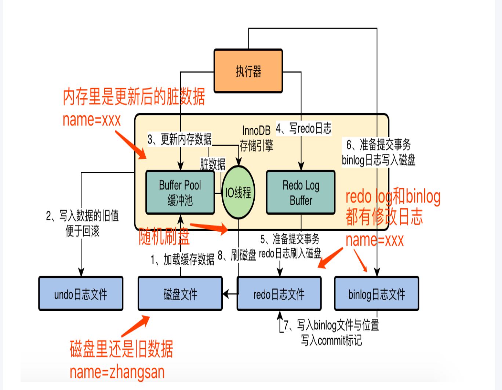

### 1.3.3 总结

​	通过一次更新数据的流程，可以看出InnoDB存储引擎的主要流程。

​		1 在执行更新的时候，每条SQL语句都会对应修改buffer pool里的缓存数据，写undo日志，写redo log buffer几个步骤。

​		2 在提交事务的时候会将redo log、binlog刷入磁盘，完成redo log中事务的commit标记。最后后台的IO线程会随机的把buffer pool里的"脏数据"刷入到磁盘里去

​	**InnDB存储引擎主要就是包含了一些buffer pool，redo log buffer等内存里的缓存数据，同时还包含了一些undo日志文件，redo日志文件等东西,同时mysql server自己还有binlog日志文件**

**扩展：**

​	**DB宕机重启后，怎么确定是否需要从redo log恢复数据**（即脏页数据在宕机前是否已经全部刷写回磁盘文件）？

​	知道需要从redo log 重放恢复数据时，**是全量重放还是指定位置之后重放**？ 

​	**1、DB宕机重启时，InnoDB会首先去查看数据页中LSN的数值，即数据页被刷新回磁盘的LSN**（LSN实际上就是Innodb使用的一个版本标记的计数）的大小，异于作者说的commit标记，然后去查看redo log 的LSN大小。如果数据也的LSN值大，就说明数据页领先于redo log刷新回磁盘，不需要进行恢复；反之，需要从redo log中恢复。

​	 2、redo log 是划归于一个重放日志组的，默认情况下，一个重放日志组有两个重放日志文件，写redo log时是循环写入，写满一个再写另外一个。但是在写满切换时会触发数据库的检查点checkpoint。checkpoint所做的事就是把脏页刷新回磁盘，当DB重启恢复时只需要恢复checkpoint之后的数据即可。所以日志文件大小不易过大，不然导致恢复时需要更长的时间，也不宜过小，不然导致频繁切换触发检测点，降低性能。

# 2 mysql规划及性能测试

## 2.1 真实生产环境下的数据库机器配置如何规划

**生产数据库一般用什么配置的机器：**

​	1 如果一个系统没有什么并发量，用户几十人的小系统，选什么mysql机器部署去部署数据库，影响不大

​	2 数据量小、并发量小、操作频率低、用户量小，这种类型的系统不需要考虑配置问题

​	3 主要关注是有一定并发量的系统，对数据库可能会产生上千、上万的并发。对于这种场景想应该选择什么样的机器去部署数据库，才能抗下系统压力

**普通的Java应用系统部署在机器上能抗多少并发：**
	1 Java系统的机器一般为2核4G和4核8G多一些。**数据库部署机器最低在8核16G以上，正常在16核32G**

​	2 按照生产经验来说**，Java系统部署在4核8G的机器上，每秒抗500左右的并发访问量是正常的**，这个一般是看请求访问速度，如果每个请求都在1s左右，那可能没秒只能处理100个请求了，只需要100ms的话，那每秒应该可以处理几百个请求**(主要看请求处理时间)**。

**高并发场景下，数据库应该用什么样的机器：**

​	1 通常推荐16核32G及以上的机器，最少8核16G的机器

​	2 一般来说Java系统压力大，负载高，其实主要的压力和负载都在Mysql数据库上

​	3 大量执行增删改查的SQL语句，Mysql对应内存和磁盘进行大量的IO操作，所以数据库往往是负载很高的，而java系统一般不会有对文件读写的IO操作

​	4 对**于16核32G的机器部署MySql，每秒抗两三千，甚至三四千请求也是可以的，如果并发达到上万，那么数据库的CPU、磁盘、IO、内存的负载都飙升到很高，数据库很可能会扛不住宕机**

​	5 **对于数据库最好为SSD固态硬盘，而不是机械硬盘**，因为大量的磁盘IO，读写文件，SSD固态硬盘效率更高，能抗住更多的并发请求量

**扩展：**

​	问：假设Java系统部署在一个4核8个的机器上，假设系统处理请求非常快，每个请求只需要0.01ms，那么这个系统可以实现每秒几千，几万的并发请求吗？

​	答：java系统4核8g，每次请求耗时0.01ms，那么应该是没有走数据库。还要加上**CPU线程切换的时间，当并发量高的时候还要算下内存消耗发生YGC和Full GC的STW时间也算进去，当并发很高，对CPU负载也很高，处理会变慢。磁盘IO还有网卡等因素也考虑进去。**

## 2.2 互联网公司的生产环境数据库是如何进行性能测试的

**申请机器之后，作为Java架构师就要心里有数**

​	选择数据库使用什么配置的机器，心里大致明白这个配置的数据库，可以抗多少并发请求

**把机器交给专业的DBA，让DBA部署Mysql**

​	DBA一般会根据经营，用相关的生产调优参数模板，还有就是Linux机器的一些OS内核参数进行一定的调整，比如最大文件句柄数之类的

**有了数据库之后，还需要先进行压测**

​	1 比如说基于工具模拟系统发送1000(或者更多的请求)个请求到数据库上，观察机器的CPU负载，磁盘IO负载，网络IO负载，内存负载，然后数据库每秒能否处理1000个请求，还是说只能处理500个请求，这个过程就是压测

​	2 数据库的压测和Java系统的压测是两回事，首先得知道数据库能抗多少压力，才能去看Java系统能抗多少压力

**QPS和TPS到底有什么区别**

​	**1 压测对应的专业术语QPS(Query Per Second)、TPS(Transaction Per Second)**

​	2 QPS每秒处理多少请求(一次请求就是一条SQL语句)

​	**3 TPS每秒处理多少事务**(一个事务可能包含多个SQL语句)

​	4 TPS衡量的是数据库每秒处理完的事务的数量，如果把TPS理解为数据库每秒处理请求的数量，其实是不太严谨的

**IO相关的压测性能指标**

​	**1 IOPS: 机器随机IO并发处理能力(每秒)**

​	比如讲内存中的"脏数据"，由后台IO线程在不确定的时间刷到磁盘中，这就是随机IO的过程。如果指标不高，那么内存数据刷到磁盘的效率就不高。

​	**2 吞吐量：机器磁盘每秒读写多少字节的数据量**

​	比如redo日志写入磁盘中，就是对磁盘文件进行顺序读写的，一般普通磁盘的顺序写入的吞吐量可以达到200MB左右，通常来说磁盘吞吐量是可以承载高并发请求的

​	**3 latency:指的是磁盘写入一条数据的延迟**

​	写入redo log磁盘文件到底是延迟1ms，还是100us。延迟越低数据库性能越高。
​	

**压测的时候需要关注的其他性能指标**

​	除了QPS、TPS、IOPS、吞吐量、latency这些指标之外还需要关注的指标

​	**1 CPU负载：**为很重要的性能指标，假设数据库压测每秒3000请求，其他性能指标正常，但是CPU负载很高，说明数据库不能再压测更高的QPS了，否则CPU是吃不消的

​	**2 网络负载：**在压测到一定QPS和TPS的时候，每秒机器网卡输入/输出多少MB数据，如果带宽接近打满，也不能继续压测了

​	**3 内存负载：**就是看压测到一定情况的时候，内存耗费了多少，如果内存耗费过高，也不能继续压测了

**PS:CPU、网络负载、内存负载等这些机器性能指标如果读接近最大限制，那么就不能继续压测了(任意指标接近限制都不行)**

**扩展：**

​	问：有一个交易系统，拆分了很多服务，一笔交易需要多个服务协作完成，也就是说一次交易需要调用多个服务才能完成。那么对于每个服务而言每秒请求数量是QPS还是TPS？对于交易系统而言，每秒处理交易笔数是QPS还是TPS呢？

​	答：对于单个服务来说，每秒处理请求数量是QPS。而对于整个交易系统来说一次交易请求需要调用多个服务，那么其每秒处理的的交易笔数则是TPS

## 2.3 如何对生产环境中的数据库进行360度无死角压测

**数据库压测工具：sysbench**

​	这个工具可以自动在数据库构造大量数据，模拟几千个线程并发访问数据库，模拟各种SQL语句、事务、甚至几十万TPS去压测数据库

**在linux上安装sysbench工具**

```shell
#获取rpm，设置对应repo仓库
curl -s https://packagecloud.io/install/repositories/akopytov/sysbench/script.rpm.sh | sudo bash
#yum安装
sudo yum -y install sysbench
#看到对应版本号就说明安装成功了
sysbench --version
```

**基于sysbench构造测试表和测试数据**

```shell
#该命令就能直接构建表及相关测试数据
sysbench --db-driver=mysql --time=300 --threads=10 --report-interval=1 --mysql-host=127.0.0.1 --mysql-port=3306 --mysql-user=test_user --mysql-password=test_user --mysql-db=test_db --tables=20 --table_size=1000000 oltp_read_write --db-ps-mode=disable prepare
```

命令相关参数说明

1. --db-driver=mysql：这个很简单，就是说他基于mysql的驱动去连接mysql数据库，你要是oracle，或者sqlserver，那自然就是其他的数据库的驱动了
2. --time=300：这个就是说连续访问300秒
3. --threads=10：这个就是说用10个线程模拟并发访问
4. --report-interval=1：这个就是说每隔1秒输出一下压测情况
5. --mysql-host=127.0.0.1 --mysql-port=3306 --mysql-user=test_user --mysql-password=test_user：这一大串，就是说连接到哪台机器的哪个端口上的MySQL库，他的用户名和密码是什么
6. --mysql-db=test_db --tables=20 --table_size=1000000：这一串的意思，就是说在test_db这个库里，构造20个测试表，每个测试表里构造100万条测试数据，测试表的名字会是类似于sbtest1，sbtest2这个样子的
7. oltp_read_write：这个就是说，执行oltp数据库的读写测试
8. --db-ps-mode=disable：这个就是禁止ps模式(ps就是PrepareStatement，预编译，就是禁止sql预编译模式)

扩展：OLTP数据库简介(mysql就是OLTP，就是关系型数据库)

https://www.jianshu.com/p/b1d7ca178691

**对数据库进行全方位测试**

```shell
#测试数据库的综合读写TPS，使用的是oltp_read_write模式（大家看命令中最后不是prepare，是run了，就是运行压测）：
sysbench --db-driver=mysql --time=300 --threads=10 --report-interval=1 --mysql-host=127.0.0.1 --mysql-port=3306 --mysql-user=test_user --mysql-password=test_user --mysql-db=test_db --tables=20 --table_size=1000000 oltp_read_write --db-ps-mode=disable run

#测试数据库的只读性能，使用的是oltp_read_only模式（大家看命令中的oltp_read_write已经变为oltp_read_only了）：
sysbench --db-driver=mysql --time=300 --threads=10 --report-interval=1 --mysql-host=127.0.0.1 --mysql-port=3306 --mysql-user=test_user --mysql-password=test_user --mysql-db=test_db --tables=20 --table_size=1000000 oltp_read_only --db-ps-mode=disable run

#测试数据库的删除性能，使用的是oltp_delete模式：
sysbench --db-driver=mysql --time=300 --threads=10 --report-interval=1 --mysql-host=127.0.0.1 --mysql-port=3306 --mysql-user=test_user --mysql-password=test_user --mysql-db=test_db --tables=20 --table_size=1000000 oltp_delete --db-ps-mode=disable run

#测试数据库的更新索引字段的性能，使用的是oltp_update_index模式：
sysbench --db-driver=mysql --time=300 --threads=10 --report-interval=1 --mysql-host=127.0.0.1 --mysql-port=3306 --mysql-user=test_user --mysql-password=test_user --mysql-db=test_db --tables=20 --table_size=1000000 oltp_update_index --db-ps-mode=disable run

#测试数据库的更新非索引字段的性能，使用的是oltp_update_non_index模式：
sysbench --db-driver=mysql --time=300 --threads=10 --report-interval=1 --mysql-host=127.0.0.1 --mysql-port=3306 --mysql-user=test_user --mysql-password=test_user --mysql-db=test_db --tables=20 --table_size=1000000 oltp_update_non_index --db-ps-mode=disable run

#测试数据库的插入性能，使用的是oltp_insert模式：
sysbench --db-driver=mysql --time=300 --threads=10 --report-interval=1 --mysql-host=127.0.0.1 --mysql-port=3306 --mysql-user=test_user --mysql-password=test_user --mysql-db=test_db --tables=20 --table_size=1000000 oltp_insert --db-ps-mode=disable run

#测试数据库的写入性能，使用的是oltp_write_only模式：
sysbench --db-driver=mysql --time=300 --threads=10 --report-interval=1 --mysql-host=127.0.0.1 --mysql-port=3306 --mysql-user=test_user --mysql-password=test_user --mysql-db=test_db --tables=20 --table_size=1000000 oltp_write_only --db-ps-mode=disable run

#使用上面的命令，sysbench工具会根据你的指令构造出各种各样的SQL语句去更新或者查询你的20张测试表里的数据，同时监测出你的数据库的压测性能指标，最后完成压测之后，可以执行下面的cleanup命令，清理数据。
sysbench --db-driver=mysql --time=300 --threads=10 --report-interval=1 --mysql-host=127.0.0.1 --mysql-port=3306 --mysql-user=test_user --mysql-password=test_user --mysql-db=test_db --tables=20 --table_size=1000000 oltp_read_write --db-ps-mode=disable cleanup
```

**压测结果分析**

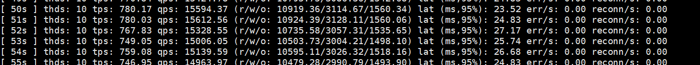

1. thds: 10，这个意思就是有10个线程在压测
2. tps: 380.99，这个意思就是每秒执行了380.99个事务
3. qps: 7610.20，这个意思就是每秒可以执行7610.20个请求
4. (r/w/o: 5132.99/1155.86/1321.35)，这个意思就是说，在每秒7610.20个请求中，有5132.99个请求是读请求，1155.86个请求是写请求，1321.35个请求是其他的请求，就是对QPS进行了拆解
5. lat (ms, 95%): 21.33，这个意思就是说，95%的请求的延迟都在21.33毫秒以下
6. err/s: 0.00 reconn/s: 0.00，这两个的意思就是说，每秒有0个请求是失败的，发生了0次网络重连

另外在完成压测之后，最后会显示一个总的压测报告：

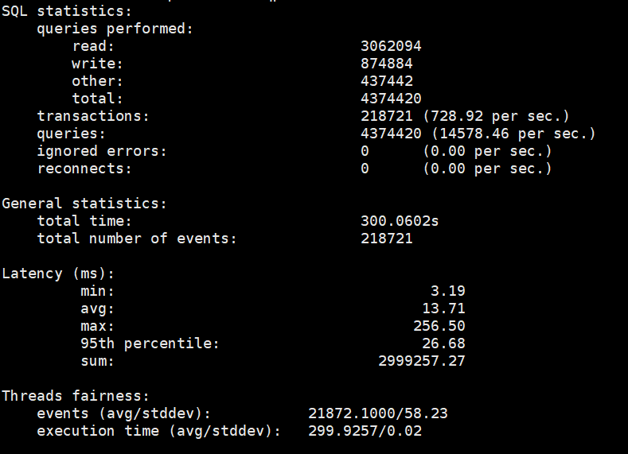

对应说明

```
SQL statistics:

queries performed:
	read: 1480084 // 这就是说在300s的压测期间执行了148万多次的读请求
	write: 298457 // 这是说在压测期间执行了29万多次的写请求
	other: 325436 // 这是说在压测期间执行了30万多次的其他请求
	total: 2103977 // 这是说一共执行了210万多次的请求
// 这是说一共执行了10万多个事务，每秒执行350多个事务
transactions: 105180( 350.6 per sec. )
// 这是说一共执行了210万多次的请求，每秒执行7000+请求
queries: 2103977 ( 7013.26 per sec. )
ignored errors: 0 (0.00 per sec.)
reconnects: 0 (0.00 per sec.)

// 下面就是说，一共执行了300s的压测，执行了10万+的事务
General staticstics:
	total time: 300.0052s
	total number of events: 105180


Latency (ms):
	min: 4.32 // 请求中延迟最小的是4.32ms
	avg: 13.42 // 所有请求平均延迟是13.42ms
	max: 45.56 // 延迟最大的请求是45.56ms
	95th percentile: 21.33 // 95%的请求延迟都在21.33ms以内
```

## 2.4 在数据库的压测过程中，如何360度无死角观察机器性能

**除了QPS和TPS之外，还需要观察机器的性能**

​	1 压测命令样例是使用了10个线程去压测数据库，如果机器性能很高也可以添加线程来测试数据库真实的最高负载能力

​	2 提高线程数量，让数据库承载更高的QPS过程需要配合机器的性能观察来做，不能盲目的增加线程去压测

**除了QPS和TPS之外，还需要观察机器的性能**

​	1 压测命令样例是使用了10个线程去压测数据库，如果机器性能很高也可以添加线程来测试数据库真实的最高负载能力

​	2 提高线程数量，让数据库承载更高的QPS过程需要配合机器的性能观察来做，不能盲目的增加线程去压测

​	3 如果不停的增加sysbench线程数量，数据库勉强抗到了5000QPS，这个时候CPU满负荷运行、内存使用率特别高，网络带宽快打满了，磁盘IO等待时间特别长，这个时候说明机器到极致了，再继续下去机器就要挂了，这个时候的5000QPS是没有代表性的。

​	4 在压测过程中，必须密切关注机器的CPU、内存、磁盘、网络的负载情况，在硬件负载情况比较正常的范围内增加线程去压测

**CPU负载情况**

​	top命令
​	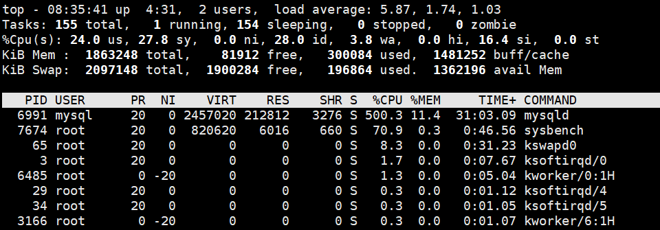

```
top - 15:52:00 up 42:35, 1 user, load average: 0.15, 0.05, 0.01
15:52:00指的是当前时间
up 42:35指的是机器已经运行了多长时间
1 user就是说当前机器有1个用户在使用
load average: 0.15, 0.05, 0.01这行信息，他说的是CPU在1分钟、5分钟、15分钟内的负载情况(cpu复制最关键信息)
load average实际上就是CPU在最近1分钟，5分钟，15分钟内的平均负载数值

```

**CPU负载说明**

​	假设我们是一个4核的CPU，此时如果你的CPU负载是0.15，这就说明，4核CPU中连一个核都没用满，4核CPU基本都很空闲，没啥人在用。

​	如果你的CPU负载是1，那说明4核CPU中有一个核已经被使用的比较繁忙了，另外3个核还是比较空闲一些。

要是CPU负载是1.5，说明有一个核被使用繁忙，另外一个核也在使用，但是没那么繁忙，还有2个核可能还是空闲的。

​	如果你的CPU负载是4，那说明4核CPU都被跑满了，如果你的CPU负载是6，那说明4核CPU被繁忙的使用还不够处理当前的任务，很多进程可能一直在等待CPU去执行自己的任务。

​	这个就是CPU负载的概念和含义。


​	但是如果你在压测的过程中，发现4核CPU的load average已经基本达到3.5，4了，那么说明几个CPU基本都跑满了，在满负荷运转，那么此时你就不要再继续提高线程的数量和增加数据库的QPS了，否则CPU负载太高是不合理的。

​	**PS:1就是一个1个核心负载满了，如果机器有多个核心，这里数字负载超过机器的核心数，就说明机器超负荷运转了，CPU还不够处理当前任务，多进程在等待CPU执行任务。**

**内存负载：**

TOP命令信息

```
KiB Mem :  1863248 total,    64704 free,   287728 used,  1510816 buff/cache
```

​	这里说的就是当前机器的内存使用情况，这个其实很简单，明显可以看出来就是总内存大概有2GB，已经使用了280m左右的内存，还有63m的内存是空闲的，然后有大概1.4GB左右的内存用作OS内核的缓冲区了。

​	**对于内存而言，同样是要在压测的过程中紧密的观察，一般来说，如果内存的使用率在80%以内，基本都还能接受**，在正常范围内，但是如果你的机器的内存使用率到了70%~80%了，就说明有点危险了，此时就不要继续增加压测的线程数量和QPS了，差不多就可以了。

**磁盘IO：**

dstat命令，磁盘IO相关的指标，包括存储的IO吞吐量、IOPS这些

```shell
#存储的IO吞吐量(数据大小)
dstat -d
#读IOPS和写IOPS分别是多少，也就是说随机磁盘读取每秒钟多少次，随机磁盘写入每秒钟执行多少次(次数)
dstat -r
```

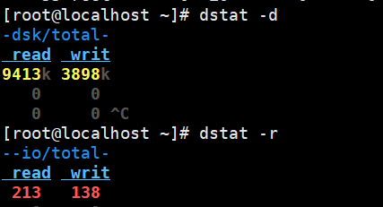

读写大小/读写次数

​	压测的时候密切观察机器的磁盘IO情况，如果磁盘IO吞吐量已经太高了，都达到极限的每秒上百MB了，或者随机磁盘读写每秒都到极限的两三百次了，此时就不要继续增加线程数量了，否则磁盘IO负载就太高了。

**网卡流量：**

```shell
#查询网络流量
dstat -n
```


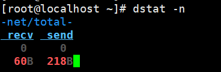

​	这个说的就是每秒钟网卡接收到流量有多少b/kb，每秒钟通过网卡发送出去的流量有多少b/kb/mb，通常来说，如果你的机器使用的是千兆网卡，那么每秒钟网卡的总流量也就在100MB左右，甚至更低一些。

​	所以我们在压测的时候也得观察好网卡的流量情况，如果网卡传输流量已经到了极限值了，那么此时你再怎么提高sysbench线程数量，数据库的QPS也上不去了，因为这台机器每秒钟无法通过网卡传输更多的数据了。

# 3 监控系统工具 - Prometheus和Grafana

## 3.1 如何为生产环境中的数据库部署监控系统

**Prometheus和Grafana简介**

​	Prometheus：是一个监控数据采集和存储系统，他可以利用监控数据采集组件（比如mysql_exporter）从你指定的MySQL数据库中采集他需要的监控数据，然后他自己有一个时序数据库，他会把采集到的监控数据放入自己的时序数据库中，其实本质就是存储在磁盘文件里

​	Grafana：就是一个可视化的监控数据展示系统，他可以把Prometheus采集到的大量的MySQL监控数据展示成各种精美的报表，让我们可以直观的看到MySQL的监控情况

​	**PS:不光是对数据库监控可以采用Prometheus+Grafana的组合，对你开发出来的各种Java系统、中间件系统，都可以使用这套组合去进行可视化的监控，无非就是让Prometheus去采集你的监控数据，然后用Grafana展示成报表而已**

## 3.2 安装和启动Prometheus

**1 首先需要下载3个压缩包**

http://cactifans.hi-www.com/prometheus/

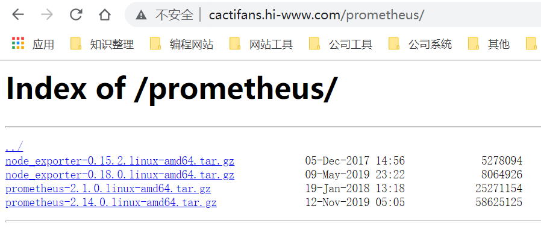

prometheus-2.1.0.linux-amd64.tar.gz   

node_exporter-0.15.2.linux-amd64.tar.gz  

第三个压缩包：mysqld_exporter-0.10.0.linux-amd64.tar.gz

https://github.com/prometheus/mysqld_exporter/releases/download/v0.10.0/mysqld_exporter-0.10.0.linux-amd64.tar.gz

**2 解压对应压缩包**

```shell
mkdir /data
mkdir /root
tar xvf prometheus-2.1.0.linux-amd64.tar -C /data
tar xf node_exporter-0.15.2.linux-amd64.tar -C /root
tar xf mysqld_exporter-0.10.0.linux-amd64.tar.gz -C /root
cd /data
mv prometheus-2.1.0.linux-amd64/ prometheus
cd /prometheus
```

**3 修改prometheus的配置文件**

```yaml
# my global config
global:
  scrape_interval:     15s # Set the scrape interval to every 15 seconds. Default is every 1 minute.
  evaluation_interval: 15s # Evaluate rules every 15 seconds. The default is every 1 minute.
  # scrape_timeout is set to the global default (10s).

# Alertmanager configuration
alerting:
  alertmanagers:
  - static_configs:
    - targets:
      # - alertmanager:9093

# Load rules once and periodically evaluate them according to the global 'evaluation_interval'.
rule_files:
  # - "first_rules.yml"
  # - "second_rules.yml"

# A scrape configuration containing exactly one endpoint to scrape:
# Here it's Prometheus itself.
scrape_configs:
  - job_name: 'Host'
    file_sd_configs:
    - files:
      - 'host.yml'
    metrics_path: /metrics
    relabel_configs:
    - source_labels: [__address__]
      regex: (.*)
      target_label: instance
      replacement: $1
    - source_labels: [__address__]
      regex: (.*)
      target_label: __address__
      replacement: $1:9100

  - job_name: 'MySQL'
    file_sd_configs:
    - files:
        - 'mysql.yml'
    metrics_path: /metrics
    relabel_configs:
    - source_labels: [__address__]
      regex: (.*)
      target_label: instance
      replacement: $1
    - source_labels: [__address__]
      regex: (.*)
      target_label: __address__
      replacement: $1:9104

  - job_name: 'prometheus'
    static_configs:
      - targets: ['localhost:9090']
```

**4 /data/prometheus目录中，去执行启动命令**

```shell
/data/prometheus/prometheus --storage.tsdb.retention=30d &
```

​	这里的30d是说你的监控数据保留30天的。启动之后，就可以在浏览器中访问9090端口号去查看prometheus的主页了

## 3.3 部署Grafana及相关监控

**1 下载grafana及启动**

```shell
https://s3-us-west-2.amazonaws.com/grafana-releases/release/grafana-4.6.3.linux-x64.tar.gz

tar xf grafana-4.6.3.linux-x64.tar.gz -C /data/prometheus
cd /data/prometheus
mv grafana-4.6.3 grafana

cd /data/prometheus/grafana
./bin/grafana-server &
```

接着就完成了grafana的启动，然后可以通过浏览器访问3000端口，默认的用户名和密码是admin/admin

**2 配置grafana数据源**

​	接着在Grafana左侧菜单栏里有一个Data Sources，点击里面的一个按钮是Add data source，就是添加一个数据源。

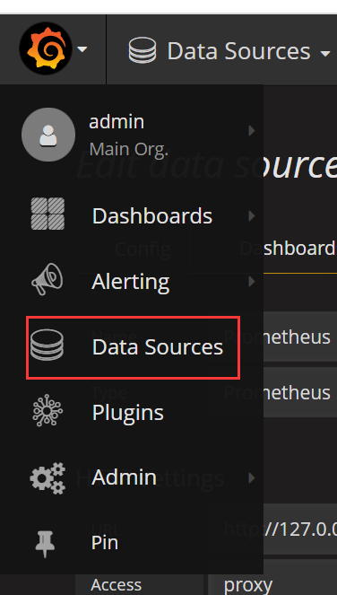

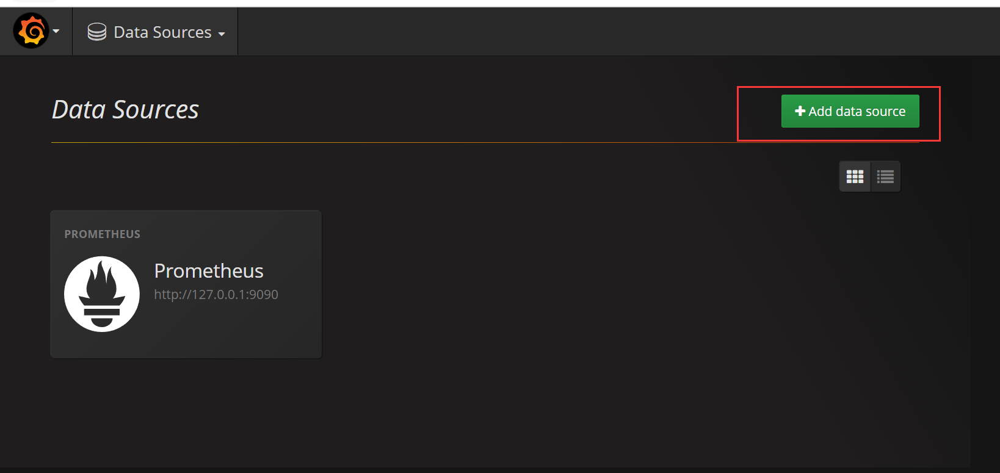	

​	然后在界面里输入你的数据源的名字是Prometheus，类型是Prometheus，HTTP URL地址是http://127.0.0.1:9090，其他的都用默认的配置就行了，接下来Grafana就会自动从Prometheus里获取监控数据和展示了。

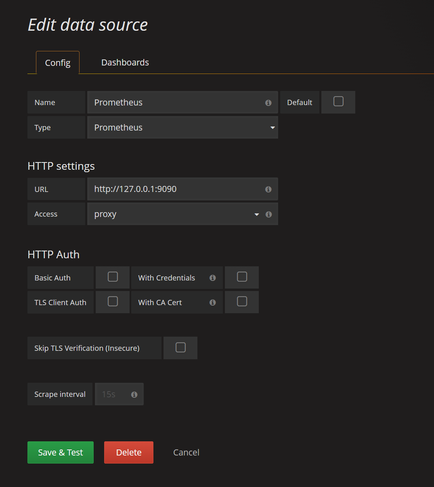

**3 安装Grafana的仪表盘组件**

```shell
#首先需要下载grafana-dashboards-1.6.1.tar.gz
wget https://github.com/percona/grafana-dashboards/archive/v1.6.1.tar.gz

#接着执行一系列的命令去安装grafana-dashboard组件
tar xvf grafana-dashboards-1.6.1.tar.gz
cd grafana-dashboards-1.6.1
updatedb
locate json |grep dashboards/

```

​	这个时候会看到一大堆的json文件，就是各种不同的仪表盘对应的json配置文件

​	你可以把这些json配置文件通过WinSCP之类的工具从linux机器上拖到你的windows电脑上来，因为需要通过浏览器上传他们

​	grafana4.4版本以上不用一个个json的导了,可以直接去它官网找到想要的监控界面的id,然后复制id它会自动加载

**4 上传相关json文件(添加不同维度的仪表盘)**

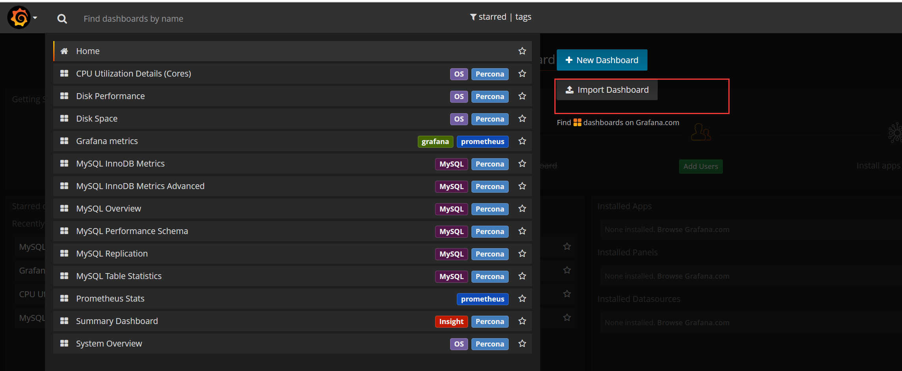

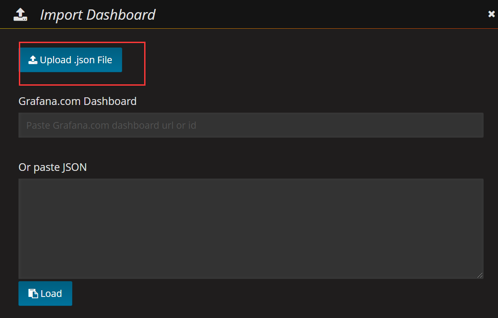

​	比如机器的CPU使用率的仪表盘，磁盘性能仪表盘，磁盘空间仪表盘，MySQL监控仪表盘，等等。

```shell
/root/grafana-dashboards-1.6.1/dashboards/CPU_Utilization_Details_Cores.json
/root/grafana-dashboards-1.6.1/dashboards/Disk_Performance.json
/root/grafana-dashboards-1.6.1/dashboards/Disk_Space.json
............
/root/grafana-dashboards-1.6.1/dashboards/MySQL_InnoDB_Metrics.json
/root/grafana-dashboards-1.6.1/dashboards/MySQL_InnoDB_Metrics_Advanced.json
............
/root/grafana-dashboards-1.6.1/dashboards/MySQL_Overview.json
/root/grafana-dashboards-1.6.1/dashboards/MySQL_Performance_Schema.json
............
/root/grafana-dashboards-1.6.1/dashboards/MySQL_Replication.json
/root/grafana-dashboards-1.6.1/dashboards/MySQL_Table_Statistics.json
............
/root/grafana-dashboards-1.6.1/dashboards/Summary_Dashboard.json
/root/grafana-dashboards-1.6.1/dashboards/System_Overview.json
#比如以上这些json文件
```

**5 添加mysql机器的监控**

​	首先我们如果想要让Prometheus去采集MySQL机器的监控数据（CPU、内存、磁盘、网络，等等），然后让Grafana可以展示出来，那么就必须先添加Prometheus对MySQL机器的监控

```shell
#在开头3个压缩包那里已经下载了，在这里解压及相关配置
tar xf node_exporter-0.15.2.linux-amd64.tar
mv node_exporter-0.15.2.linux-amd64 node_exporter
cd node_exporter
nohup ./node_exporter >/dev/null 2>&1 &
```

在MySQL所在的机器上启动了一个node_exporter了，他就会自动采集这台机器的CPU、磁盘、内存、网络的监控数据

再加入Prometheus对这台机器的监控

​	在/data/prometheus 对应prometheus.yml的同级目录添加 host.yml

```yaml
- labels:
    service: test
  targets:
  - 127.0.0.1

```

​	Prometheus就会跟MySQL机器上部署的node_exporter进行通信，源源不断的获取到这台机器的监控数据，写入自己的时序数据库中进行存储

解决yml格式问题：https://www.jianshu.com/p/715a614ef5e4

**6 添加MySql数据库的监控**

​	需要在MySQL所在机器上再启动一个mysqld_exporter的组件，他负责去采集MySQL数据库自己的一些监控数据

```shell
#在开头3个压缩包那里已经下载了，在这里解压及相关配置

tar xf mysqld_exporter-0.10.0.linux-amd64.tar.gz

mv mysqld_exporter-0.10.0.linux-amd64 mysqld_exporter
```

​	接着需要配置一些环境变量，去设置mysqld_exporter要监控的数据库的地址信息，看下面配置了账号、密码以及地址和端口号

```shell
#admin:password@(10.10.20.14:3306)
export DATA_SOURCE_NAME='root:root@(127.0.0.1:3306)/'
echo "export DATA_SOURCE_NAME='root:root@(127.0.0.1:3306)/'" >> /etc/profile
```

接着启动mysqld_exporter

```shell
nohup ./mysqld_exporter --collect.info_schema.innodb_tablespaces --collect.info_schema.innodb_metrics --collect.perf_schema.tableiowaits --collect.perf_schema.indexiowaits --collect.perf_schema.tablelocks --collect.engine_innodb_status --collect.perf_schema.file_events --collect.info_schema.processlist --collect.binlog_size --collect.info_schema.clientstats --collect.perf_schema.eventswaits >/dev/null 2>&1 &
```

引用解决输出问题：https://blog.csdn.net/jiangyu1013/article/details/81476184

还需要在Prometheus里配置一下他去跟mysqld_exporter通信获取数据以及存储，然后Grafana才能看到对应的报表

```yaml
#vi /data/prometheus/mysql.yml 对应目录添加mysql.yml
- labels:
    service: mysql_test
  targets:
  - 127.0.0.1
```

接着我们在Grafana中就可以看到MySQL的各种监控数据了

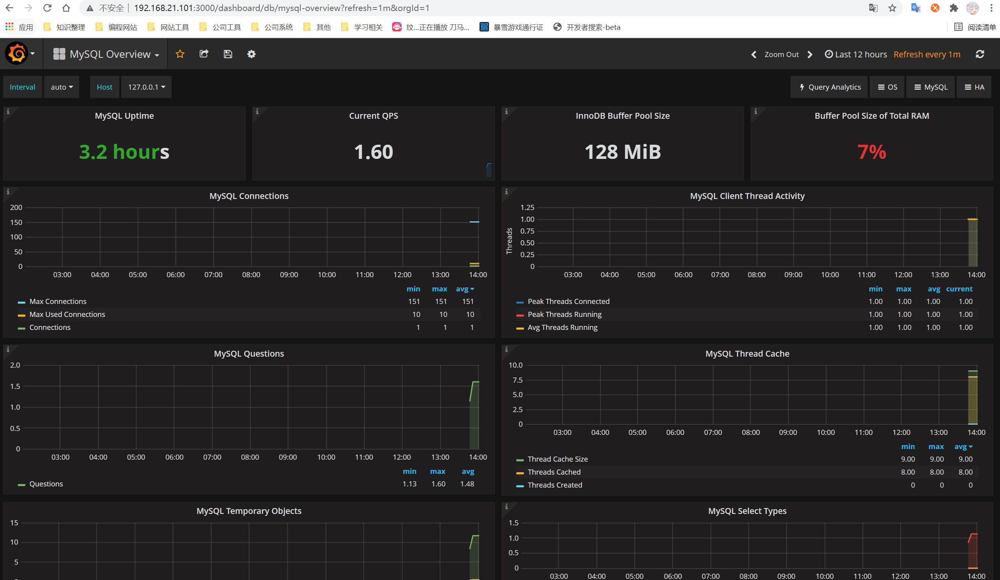

引用：https://blog.csdn.net/woqutechteam/article/details/81532092

# 4 buffer pool相关结构

## 4.1回顾一下Buffer Pool在数据库里的地位

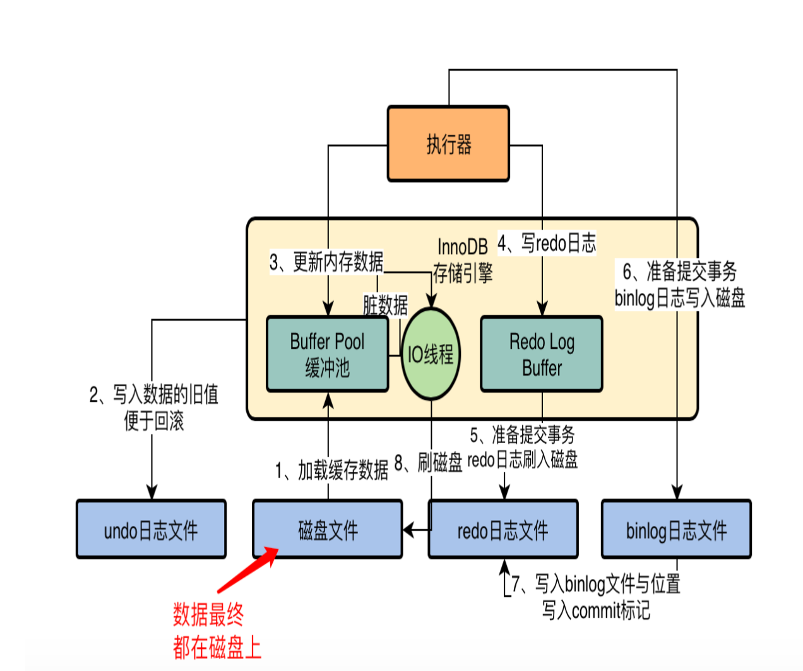

​	Buffer Pool就是数据库的一个内存组件，里面缓存了磁盘上的真实数据，然后我们的Java系统对数据库执行的增删改操作，其实就是对这个内存数据结构中的缓存数据执行的

## 4.2 Buffer Pool这个内存数据结构到底长个什么样子

**配置Buffer Pool的大小**

​	Buffer默认为128MB，有一点偏小了，在实际生产环境下可以对Buffer Pool进行调整

在对应my.cnf配置文件修改(文件位置一般在/etc目录下)

数据库如果是16核32G的机器，那么你就可以给Buffer Pool分配个2GB的内存

```
[server]

innodb_buffer_pool_size = 2147483648
```

**数据页：MySql中抽象出来的数据单位**

​	1 数据库核心数据模型是表+字段+行的概念

​	2 MySql对数据抽象出来一个数据页的额概念，把很多行数据放在了一个数据页里面

​	3 磁盘文件中会有很多数据页，每个一页数据放了很多行数据

​	4 更新一行数据，数据库会找到这行数据的数据页，然后磁盘文件把这行数据所在的数据页加载到Buffer pool中

​	5 也就是说，Buffer Pool中存放的是一个一个的数据页

**磁盘上的数据页和Buffer Pool的缓存页**

​	1 默认情况，磁盘存放的数据页大小是16kb

​	2 Buffer Pool存放的数据页，通常叫做缓存页

​	3 Buffer Pool默认请情况，一个缓存页的大小和磁盘数据页大小是对应起来的，都是16kb

**缓存页对应的描述信息是什么**

​	1 每一个缓存页，都有对应一个描述信息

​	2 描述信息包含以下以下东西：这个缓存页/数据页所属的表空间、数据页的编号、这个缓存页/数据页在Buffer Pool中的地址等其他信息

​	3 Buffer Pool中的描述数据大概站缓存页的5%左右的大小，也就是800个字节左右

​	4 buffer pool默认大小是128MB,实际上真正大小会超出一些，可能130MB多一些，因为里面还有每个缓存页的描述数据

​	5 在Buffer Pool中，每个缓存页的描述信息放在最前面的位置，然后各个缓存页放在后面

**所以此时我们看下面的图，Buffer Pool实际看起来大概长这个样子**

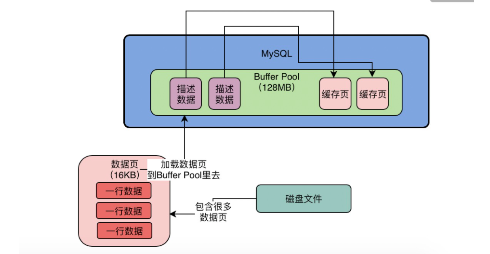

## 4.3 从磁盘读取数据页到Buffer Pool的时候，free链表有什么用

**数据库启动的时候，是如何初始化Buffer Pool的**

​	**1 数据库启动根据设置的Buffer Pool大小稍微加大一点，去找操作系统申请一块内存区域，作为Buffer Pool的内存区域**

​	2 内存区域申请完毕之后，数据库会按照默认缓存页16kb的大小以及对应800个字节左右的描述数据的大小，在Buffer Pool中一个一个 划分出缓存页及对应描述数据

​	3 初始化的时候缓存页中是空的，后续数据库运行执行对应增删改查操作的时候才会将数据对应的页从磁盘文件读出来，放入Buffer pool缓存页中

**free链表：怎么知道哪些缓存页是空闲的**

​	**1 Buffer Pool有一个free链表的概念，是一个双向链表的数据结构，每个节点就是一个空闲缓存页描述块的地址**

​	2 初始化的时候，可能所有缓存页都是空闲的，所有描述数据块都在free链表中

​	3 free链表每个节点都会双向链接自己的前后节点，组成双向链表。

​	**4 free链表其实是Buffer Pool描述数据块组成的，描述数据块中的free_pre和free_next两个指针，就可以将描述数据块组成free链表，**

​	5 对于free链表而言，只有一个基础节点不属于Buffer Pool的，是40字节大小的一个节点，里面存放了free链表的头尾节点地址，还有free链表里还有多少个节点(大小/长度)

**如何将磁盘上的页读到Buffer Pool的缓存页中**

​	**1 从free链表中获取描述数据块，根据描述数据块，获取到对应的空闲缓存页**，就可以将磁盘数据页读到对应缓存页中，再把一些相关的数据写入描述数据块里去，比如数据页所属的表空间之类的信息，最后把描述数据块从free链表里去除即可

​	2 链表头尾去除数据可以直接将对应free_pre或者free_next置为空即可，如果是链表中间去除的话，则需要将前后节点重新指向对应节点，重新连接，这个free链表去除节点的套路应该是头尾链表。

**数据页缓存：哈希表/怎么知道数据页有没有被缓存**

​	**1 数据块有一个哈希表的数据结构，会用表空间+数据页号，作为一个key然后缓存页地址作为value**

​	2 当要使用一个数据页时，通过"表空间+数据页"作为key去哈希表里查一下，如果没有则读取数据页，如果有则说明数据页已经被缓存了

​	3 每次读取一个数据页到缓存之后都会写入到这个哈希表，下次再使用的时候就可以直接读哈希表获取缓存即可

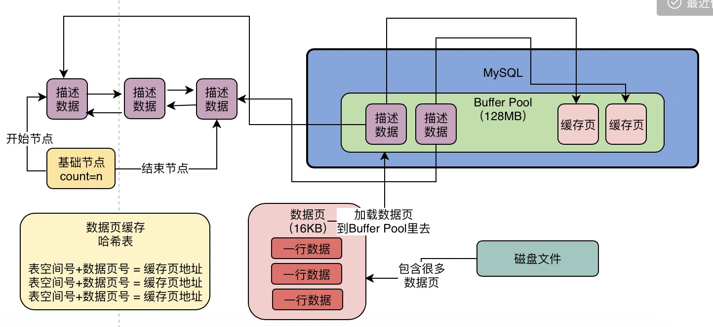

## 4.4 当我们更新Buffer Pool中的数据时，flush链表有什么用

**Buffer Pool中会不会有内存碎片**

​	1 Buffer Pool大小是自己定义的，当然有，Buffer划分完全部缓存页和描述数据块之后，还剩一点点内存，这一点内存放不下任何一个缓存页了，用不了了，这就是内存碎片

​	2 如果Buffer Pool里缓存页是东一块西一块，比如导致缓存页中有很多内存空隙，这会有大量内存碎片，实际上数据库在Buffer中换分缓存页的时候，会让所有缓存页和描述数据块都紧密的挨在一起，这样尽可能减少内存碎片的产生，内存浪费

**flush链表：哪些缓存页是脏页呢**

​	1 脏页数据都是要刷新回磁盘文件的，不可能所有缓存页都刷回磁盘，只需要被修改过的数据刷回磁盘即可

​	2 数据库引入了一个和free链表类似**的flush链表，本质也是通过缓存页的描述数据块中的两个指针，让被修改过的缓存页的描述数据块，组成一个双向链表**

​	3 flush链表也有个基础节点，会指向首尾节点，及链表长度

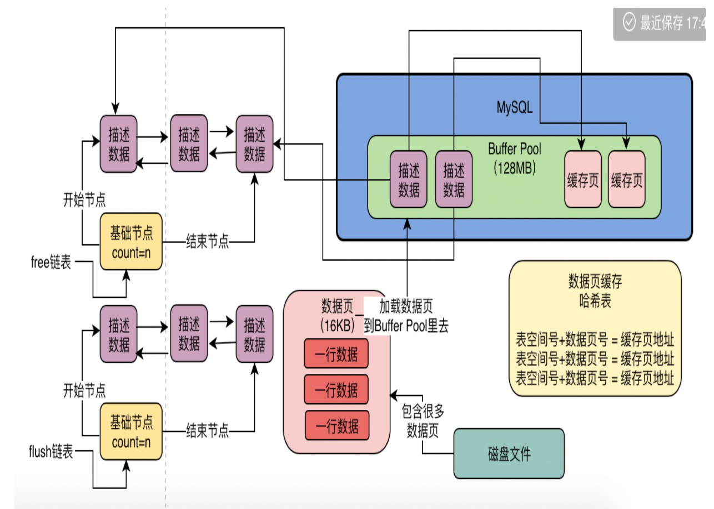

## 4.5 LRU链表

### 4.5.1 当Buffer Pool中的缓存页不够的时候，如何基于LRU算法淘汰部分缓存

**LRU链表：缓存页不够的情况，淘汰哪些数据(缓存页)**

​	1 把一个缓存页里的数据刷入磁盘，然后这个缓存页就可以清空了，就腾出一个空闲缓存页

​	2 缓存命中率：一般淘汰缓存命中率低的缓存页，也就是访问少的缓存页

​	**3 引入LRU链表来判断哪些数据是不常用的**

**LRU链表简单描述：**

​	**1 从磁盘加载一个数据页到缓存页的时候，就把这个缓存页的描述数据放到LRU链表头部去**

​	2 假设某个缓存页在LRU链表的尾部，后续只要查询活修改了这个缓存页的数据，就会把这个缓存页挪动到LRU链表的头部

​	3 如果找出缓存命中率低的缓存页，直接去找LRU链表尾部的缓存页即可，讲LRU链表尾部的缓存页刷入磁盘，并清空该缓存页，就腾出一个空闲缓存页了

**PS:和free链表、flush链表都是一个套路，在描述数据对应的指针节点组成的双向链表**

**SQL语句的表、行和表空间、数据页直接的关系**

​	**1 简单来说，一个是逻辑概念，一个是物理概念**

​	2 表、列和行都是逻辑概念

​	3 表空间、数据页，这些都是物理上的概念，在实际的物理蹭你上，表的数据放在一个表空间中，表空间是由一堆磁盘上的数据文件组成，这些数据文件存放了表里的数据，这些数据是由一个个数据页组织起来的，这些都是物理层面上的概念
​	

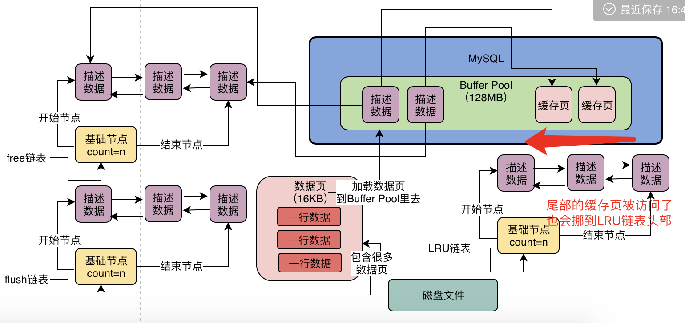

### 4.5.2 简单的LRU链表在Buffer Pool实际运行中，可能导致哪些问题

**预读机制和全表扫描**

​	**预读机制：从磁盘加载一个数据页的时候，可能会将数据页相邻的其他数据页加载到缓存中**

​	全表扫描：类似于SELECT * FROM USERS这种SQL语句，没有加任何条件，会将这个表所有的数据页，都从磁盘加载到Buffer Pool里去

**哪些情况会触发MySql的预读机制**

```shell
#他的默认值是56
#意思就是如果顺序的访问了一个区里的多个数据页，访问的数据页的数量超过了这个阈值，此时就会触发预读机制，把下一个相邻区中的所有数据页都加载到缓存里去
innodb_read_ahead_threshold
#默认OFF，关闭
#如果Buffer Pool里缓存了一个区里的13个连续的数据页，而且这些数据页都是比较频繁会被访问的，此时就会直接触发预读机制，把这个区里的其他的数据页都加载到缓存里去
innodb_random_read_ahead

```

​	所以默认情况下，主要是第一个规则可能会触发预读机制，一下子把很多相邻区里的数据页加载到缓存里去
​	
**预读机制和全表扫描导致的问题**

​	预读机制带进来相邻的缓存页，全表扫描进来的缓存页都会**将这些缓存页放入LRU链表的表头，这些缓存页可能后续都不怎么用到**，此时LRU链表的尾部缓存页可能是会经常访问的缓存页。当**淘汰缓存页腾出内存空间的时候，会将LRU链表尾部频繁访问的缓存页淘汰掉了，留下预读/全表扫描这些不经常使用的缓存页**

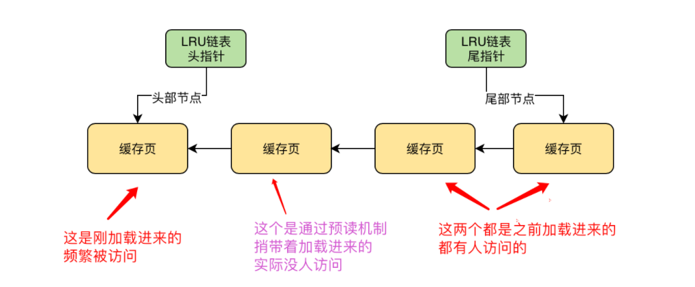

### 4.5.3 MySQL是如何基于冷热数据分离的方案，来优化LRU算法的

**MySql为什么设计一个预读机制**

​	1 为了优化性能：因为读了缓存页1还有可能读相邻的缓存页2，满足预读机制的设置的条件/顺序读好多页等。MySql会判断可能会接着顺序读后面的数据页，这个时候干脆将后续的缓存页先读取到Buffer Pool中

​	2 不过设想是这样，实际上预读机制出来的数据可能后续根本不会使用，还放在LRU链表前面，这个机制就是在捣乱了

**基于冷热分离的思想设计LRU链表**

​	**LRU链表会拆分成两个部分，一部分是热数据，一部分是冷数据，这个冷热数据的比例是由下方参数控制的**

```shell
#默认是37%，也就是说冷数据占比37%
innodb_old_blocks_pct
```

**LRU链表冷热分区加载数据逻辑**

​	**1 第一次加载到缓存的时候，缓存页会放在冷数据区域的链表头部**

​	2 冷数据缓存页什么时候加载到热数据区域

```shell
#默认1000ms
#冷数据过多少时间再访问才会加载到热数据，
innodb_old_blocks_time
```

​	**也就是说数据页加载到冷数据页后，在1s之后再访问这个缓存页，才会被挪动到热数据区域的链表头部**

​	3 延迟一秒(默认)的设计原理是:避免1s内里面访问的数据，之后不再访问了，也放到热数据头部了，这种情况


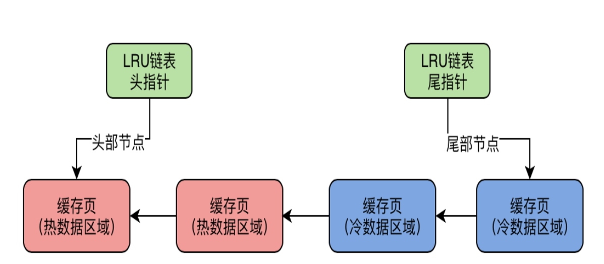

### 4.5.3 基于冷热数据分离方案优化后的LRU链表，是如何解决之前的问题的

**预读机制和全表扫描导致的问题解决**

​	预读机制和全表扫描的数据都会放到冷数据区域，不影响热数据区域中被频繁访问的数据。等到淘汰缓存页的时机的时候，直接将冷数据尾部的数据页清空即可。

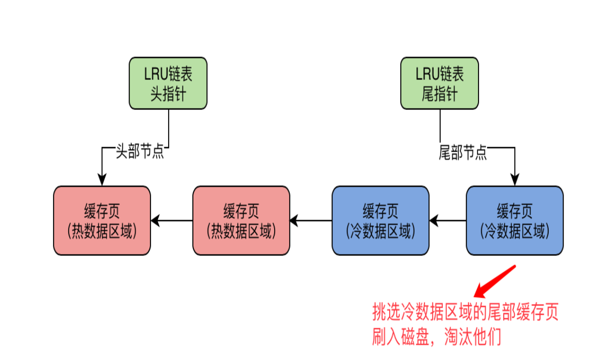

### 4.5.4 MySQL是如何将LRU链表的使用性能优化到极致的

**冷数据区域都放的是哪些数据**

​	只访问一次，或者在1s内连续访问的数据。全表扫描数据，预读相关数据。当然冷数据区域的数据，在1s后再次访问是会加载到热数据区域链表头部的

**LRU链表的热数据区域是如何进行优化的**

​	1 如果访问了一个缓存页马上就把它移动到热数据头部，在热数据区域的缓存页是经常被访问的，这样频繁的移动对性能不太好，也没这个必要
​	2 所以LRU链表的热数据区域的访问规则进行了优化，只有热数据区域后3/4部分缓存页被访问了才会移动到链表头部，前1/4被访问了不会改变位置

​	**PS:在LRU链表不断更新的过程中，热数据的尾部会自动变成冷数据的头部，冷数据的默认比例是37%**

### 4.5.5 对于LRU链表中尾部的缓存页，是如何淘汰他们刷入磁盘的

**定时把LRU尾部的部分缓存页刷入磁盘**

​	1 并不是缓存页满的时候才会将冷数据尾部几个缓存页刷入磁盘，而是**有一个后台线程，会运行一个定时任务，每隔一段时间就会把LRU链表的冷数据尾部的缓存页去除，如果冷数据尾部同时存在flush链表中则刷入磁盘，不存在则直接删除**

​	2 **后台线程还会在MySql不繁忙的时候，把flush链表中的缓存页都刷入磁盘，当然这些缓存页也会从flush链表和lru链表中移除，加入到free链表中**

**动态流程**

​	一边不停的CRUD加载数据到缓存页中，free缓存页不停的在减少，flush链表缓存页不停的在增加，lru链表的缓存页不停的在增加和移动
​	另一边，后台线程不停的把lru链表冷数据区域的缓存页以及flush链表的缓存页，刷入磁盘清空缓存页，然后flush链表和lru链表都在减少，free中的缓存页在增加
​	这就是一个动态运行的效果

**实在是没有了空闲缓存页怎么办**

​	所有free链表都被使用了，对应后台线程还没有去清空缓存页。这个时候如果要从磁盘加载数据页到一个空闲缓存页中，此时就会从**LRU链表冷数据区域的尾部找到一个缓存页，然后刷入磁盘和清空(刷入磁盘需要看是否存在于flush链表中)，再把这个数据页加载到腾出来的空闲缓存页中**

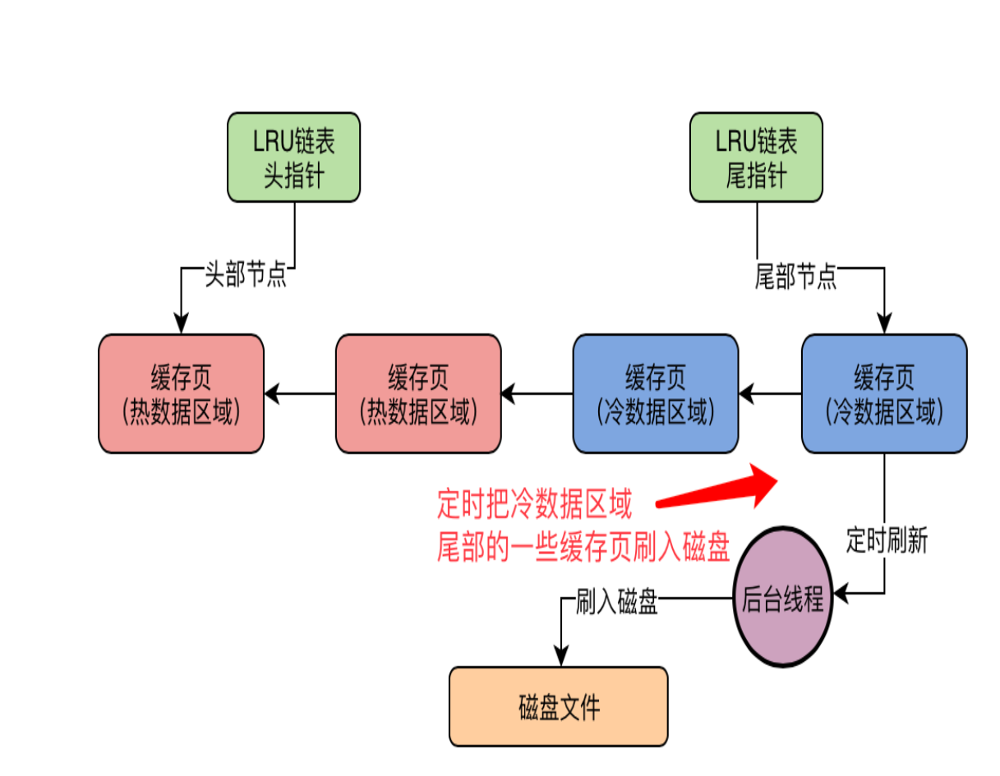

## 4.5 Buffer Pool的生产经验及内存分配

### 4.5.1 如何通过多个Buffer Pool来优化数据库的并发性能

**Buffer Pool在访问的时候需要加锁吗**

​	1 Buffer Pool本质上是一大块内存数据结构，由一大堆的缓存页和描述户数块组成，再加上各种链表（free、flush、lru）来辅助运行

​	2 Mysql同时接收到多个请求，多线程访问操作页，同时操作一个free、flush、lru链表

​	3 这个时候，**多线程并发访问一个Buffer Pool，必然是要加锁的，先让一个线程完成一系列的操作，比如说加载数据到缓存页，更新free链表,更新lru链表，然后再释放锁，接着下一个线程**

**多线程并发访问加锁，数据库的性能还好吗**

​	1 性能是还可以的，因为大部分情况每个线程都是查询或者更新缓存页里的数据，这个操作是发生在内存里的，基本都是微秒级的，包括对链表的更新，都是一些指针操作，性能也是极高的

​	2 但是毕竟是每个线程加锁排队操作，尤其是线程有从磁盘加载到缓存页的操作，这个时候发生了一次磁盘IO，这个时候的耗时就多一些了

**Mysql生产优化经验：多个Buffer Pool优化并发能力**

​	1 Mysql默认规则是，如果给Buffer分配的内存小于1GB，那么最多只有一个Buffer Pool优化并发能力

​	2 如果机器内存够大，给Buffer Pool分配较大的内存，比如8GB，这个时候是可以设置多个Buffer Pool的

MySQL服务器端的配置

```shell
[server]
#buffer_pool大小
innodb_buffer_pool_size = 8589934592
#buffer_pool个数
innodb_buffer_pool_instances = 4
#这个时候，MySQL在运行的时候就会有4个Buffer Pool了！每个Buffer Pool负责管理一部分的缓存页和描述数据块，有自己独立的free、flush、lru等链表
```

​	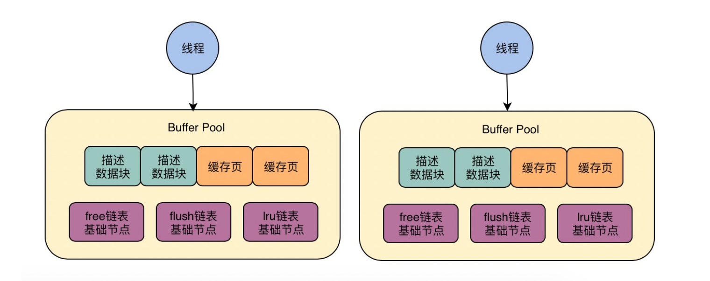

​	一旦你有了**多个buffer pool之后，你的多线程并发访问的性能就会得到成倍的提升，因为多个线程可以在不同的buffer pool中加锁和执行自己的操作，大家可以并发来执行了**

​	**所以这个在实际生产环境中，设置多个buffer pool来优化高并发访问性能，是mysql一个很重要的优化技巧**


​	**如何避免你执行crud的时候，频繁的发现缓存页都用完了，完了还得先把一个缓存页刷入磁盘腾出一个空闲缓存页，然后才能从磁盘读取一个自己需要的数据页到缓存页里来**

​	1 频繁这么搞，那么很多crud操作，每次都要执行两次磁盘IO，一次是缓存页刷入磁盘，一次是数据页从磁盘里读取出来，性能是很不高的

​	2 如果你的缓存页使用的很快，然后后台线程释放缓存页的速度很慢，那么必然导致你频繁发现缓存页被使用完了

​	3 缓存页被使用的速度你是没法控制的，因为那是由你的Java系统访问数据库的并发程度来决定的，你高并发访问数据库，缓存页必然使用的很快了

​	4 后台线程定时释放一批缓存页，这个过程也很难去优化，因为你要是释放的过于频繁了，那么后台线程执行磁盘IO过于频繁，也会影响数据库的性能

​	**5 关键点就在于，你的buffer pool有多大**

​	6 如果你的数据库要抗高并发的访问，那么你的机器必然要配置很大的内存空间，起码是32GB以上的，甚至64GB或者128GB。此时你就可以给你的buffer pool设置很大的内存空间，比如20GB，48GB，甚至80GB

​	7 高并发场景下，数据库的buffer pool缓存页频繁的被使用，但是你后台线程也在定时释放一些缓存页，那么综合下来，空闲的缓存页还是会以一定的速率逐步逐步的减少

​	8 因为你的buffer pool内存很大，所以空闲缓存页是很多很多的，即使你的空闲缓存页逐步的减少，也可能需要较长时间才会发现缓存页用完了

​	**9 一旦你的数据库高峰过去，此时缓存页被使用的速率下降了很多很多，然后后台线程会定是基于flush链表和lru链表不停的释放缓存页，那么你的空闲缓存页的数量又会在数据库低峰的时候慢慢的增加了**

​	**10 以线上的MySQL在生产环境中，buffer pool的大小、buffer pool的数量，这都是要用心设置和优化的，因为对MySQL的性能和并发能力，都会有较大的影响**

### 4.5.2 如何通过chunk来支持数据库运行期间的Buffer Pool动态调整

**chunk机制**

​	**1 Mysql设计了一个chunk机制，buffer pool是有很多chunk组成的**

​	2 每个buffer pool里的每个chunk里就是一系列的描述数据块和缓存页，**每个buffer pool里的多个chunk共享一套free、flush、lru这些链表**

```shell
#默认值就是128MB
#控制buffer pool中每一个chunk的大小
innodb_buffer_pool_chunk_size
```

**基于chunk机制是如何支持运行期间，动态调整buffer pool大小的**

​	1 如果没有chunk机制，8g内存申请到16g内存，需要向操作系统申请一块16GB的内存，然后把现在buffer pool中的各种数据都拷贝到16GB的新内存中去，这个过程效率是及其低下的

​	2 有了chunk机制，8GB动态扩展到16GB只需要申请一系列的128MB大小的chunk就可以了，只需要每个chunk是连续的128mb内存即可，不需要整个16gb都是连续的内存

**chunk及buffer pool对应图**

​	**buffer pool里已经有了多个chunk，每个chunk就是一系列的描述数据块和缓存页，这样的话，就是把buffer pool按照chunk为单位，拆分为了一系列的小数据块，但是每个buffer pool是共用一套free、flush、lru的链表的。**

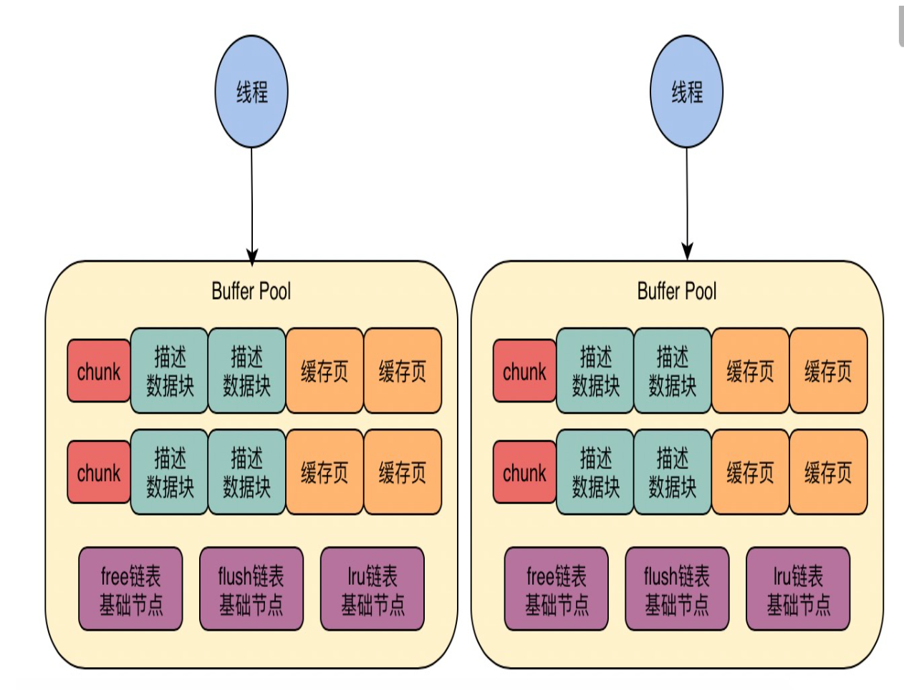

### 4.5.3 在生产环境中，如何基于机器配置来合理设置Buffer Pool

**生产环境应该给buffer pool设置多少内存**

​	1 比如32GB内存，设置20GB内存就比较合理，剩下的需要给OS和其他人用，这样比较合理

​	**2 以通常来说，我们建议一个比较合理的、健康的比例，是给buffer pool设置你的机器内存的50%~60%左右**

**buffer pool 总大小= (chunk大小*buffer pool数量)的倍数(这里的倍数是整数倍数才合理)**

​	比如默认的chunk大小是128MB，那么此时如果你的机器的内存是32GB，你打算给buffer pool总大小在20GB左右，那么你得算一下，此时你的buffer pool的数量应该是多少个呢

​	1 chunk大小 * buffer pool的数量 = 128MB  *  16 = 2048MB,10倍就是20GB，合理
​	2 chunk大小 * buffer pool的数量 = 128MB  *  32 = 4096MB,5倍就是20GB，合理

**这里的倍数就是对应每个buffer pool中chunk的数量**

​	上面设置的情况2，你的buffer pool大小就是20GB，然后buffer pool数量是32个，每个buffer pool的大小是640MB，然后每个buffer pool包含5个128MB的chunk

**流程总结：**

​	1 你的数据库在生产环境运行的时候，你必须根据机器的内存设置合理的buffer pool的大小，然后设置buffer pool的数量，这样的话，可以尽可能的保证你的数据库的高性能和高并发能力。

​	2 然后在线上运行的时候，buffer pool是有多个的，每个buffer pool里多个chunk但是共用一套链表数据结构，然后执行crud的时候，就会不停的加载磁盘上的数据页到缓存页里来，然后会查询和更新缓存页里的数据，同时维护一系列的链表结构。

​	3 然后后台线程定时根据lru链表和flush链表，去把一批缓存页刷入磁盘释放掉这些缓存页，同时更新free链表。

​	4 如果执行crud的时候发现缓存页都满了，没法加载自己需要的数据页进缓存，此时就会把lru链表冷数据区域的缓存页刷入磁盘，然后加载自己需要的数据页进来

**查看Buffer Pool相关信息：**

```shell
#在服务器登录root账户，mysql命令行输入
SHOW ENGINE INNODB STATUS
```

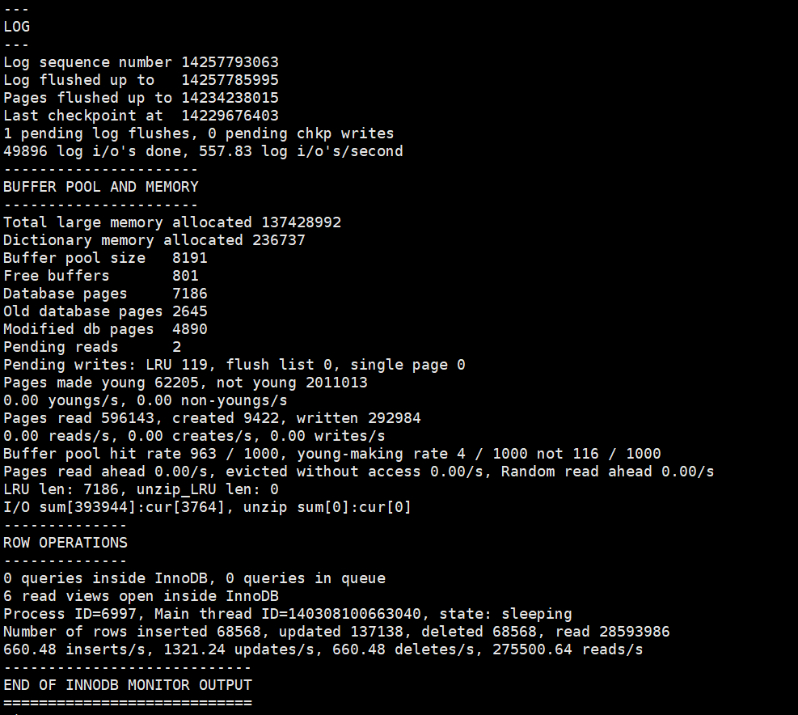

**解释一下这里的东西，主要讲解这里跟buffer pool相关的一些东西**

```
（1）Total memory allocated，这就是说buffer pool最终的总大小是多少

（2）Buffer pool size，这就是说buffer pool一共能容纳多少个缓存页

（3）Free buffers，这就是说free链表中一共有多少个空闲的缓存页是可用的

（4）Database pages和Old database pages，就是说lru链表中一共有多少个缓存页，以及冷数据区域里的缓存页数量

（5）Modified db pages，这就是flush链表中的缓存页数量

（6）Pending reads和Pending writes，等待从磁盘上加载进缓存页的数量，还有就是即将从lru链表中刷入磁盘的数量、即将从flush链表中刷入磁盘的数量

（7）Pages made young和not young，这就是说已经lru冷数据区域里访问之后转移到热数据区域的缓存页的数量，以及在lru冷数据区域里1s内被访问了没进入热数据区域的缓存页的数量

（8）youngs/s和not youngs/s，这就是说每秒从冷数据区域进入热数据区域的缓存页的数量，以及每秒在冷数据区域里被访问了但是不能进入热数据区域的缓存页的数量

（9）Pages read xxxx, created xxx, written xxx，xx reads/s, xx creates/s, 1xx writes/s，这里就是说已经读取、创建和写入了多少个缓存页，以及每秒钟读取、创建和写入的缓存页数量

（10）Buffer pool hit rate xxx / 1000，这就是说每1000次访问，有多少次是直接命中了buffer pool里的缓存的

（11）young-making rate xxx / 1000 not xx / 1000，每1000次访问，有多少次访问让缓存页从冷数据区域移动到了热数据区域，以及没移动的缓存页数量

（12）LRU len：这就是lru链表里的缓存页的数量

（13）I/O sum：最近50s读取磁盘页的总数

（14）I/O cur：现在正在读取磁盘页的数量
```

**重点关注的信息**

​	1 当前buffer  pool的使用情况：ree、lru、flush几个链表的数量的情况，然后就是lru链表的冷热数据转移的情况，然后你的缓存页的读写情况

​	**2 最关键的是两个东西：**

​			(1)  一个是你的buffer pool的**千次访问缓存命中率（Buffer pool hit rate xxx / 1000），这个命中率越高，说明你大量的操作都是直接基于缓存来执行的，性能越高**

​			(2) **第二个是你的磁盘IO的情况，这个磁盘IO越多，说明你数据库性能越差**

# 5 Mysql数据物理模型

## 5.1 我们写入数据库的一行数据，在磁盘上是怎么存储的

**Mysql数据物理模型**

​	概述：表空间、区、数据页、一个区的连续数据页、表空间以及数据页号

​	数据页概念：每一行数据都是放在数据页里的，是按照数据页为单位把磁盘上的数据加载到内存的缓存页里，也是按照页为单位，把缓存页的数据刷入磁盘上的数据页

​	物理与逻辑概念：表、行和字段是逻辑上的概念，而表空间、数据区和数据页其实已经落实在物理上的概念了。实际上表空间、数据页这些东西，都对应到了Mysql在磁盘上的一些物理文件了

**为什么不能直接更新磁盘上的数据**

​	问题：为什么Mysql要设计一套这么复杂的数据存取机制，要基于内存、日志、磁盘上的数据文件来完成数据的读写。为什么对insert、update请求，不直接更新磁盘文件里的数据呢？

​	原因：
​		1 **因为磁盘随机读写性能是最差的，所以直接更新磁盘文件，必然导致数据库无法抗下任何一点点稍微高并发的场景**。所以Mysql才设计如此复杂的一套机制，**通过内存里更新数据，然后写redo log以及事务提交，后台线程不定时刷新内存里的数据到磁盘文件里**

​		2 通过这种方式保证，**每个更新请求，尽量就是更新内存，然后顺序写日志文件，更新内存性能是极高的，顺序写磁盘日志文件的性能也是比较高的(顺序写磁盘文件性能要远高于随机读写磁盘文件)，**正式通过这套机制，才能让我们Mysql数据库在较高配置的机器上，每秒可以抗下几千的读写请求。

**Mysql为什么要引入数据页这个概念**

​	1 磁盘数据如果每次加载数据到内存中，都是一条一条的加载，下次再更新别的数据再从磁盘里加载另外一条数据到内存，这样效率很明显是不高的

​	2 所以innodb存储引擎在这里引入了一个数据页的概念，每页有16kb，然后每次加载磁盘的数据到内存里的时候，至少加载一页数据进去，甚至很多页数据

​	3 假设update xxx set xxx=xxx where id=1，这个时候会把id=1这条数据所在的一页数据都加载到内存里去，这一页数据可能还包含了id=3等其他数据，接着更新id=2等数据的时候，此时就不用再从磁盘中读取了

​	4 数据页的意义，就是磁盘和内存之间交换通过数据页来执行，包括内存里更新后的脏数据，刷回到磁盘里的时候，也是至少一个数据页刷回去

**一行数据再磁盘上是如何存储的**

​	行格式：我们可以对一个表指定它的行存储的格式是什么样的

```sql
	-- 	这里就是指定表为COMPACT格式
	CREATE TABLE table_name (columns) ROW_FORMAT=COMPACT
	ALTER TABLE table_name ROW_FORMAT=COMPACT
```

​	COMPACT格式概述(存储)：

​	变长字段的长度列表，null值列表，数据头，column01的值，column02的值，column0n的值......

​	**对每一行数据，其实存储的时候都会有一些头字段对这行数据进行一定的描述，然后再放上这一行数据每一列具体的值就是所谓的行格式。除了COMAPACT以外，还有其他几种行存储格式基本都大同小异**

​	**innodb存储引擎**在存储数据的时候，是通过数据页的方式来组织数据的

## 5.2 对于VARCHAR这种变长字段，在磁盘上到底是如何存储的

**一行数据的存储格式大概如下，除了每个字段的值，还有一些额外信息**

​		变长字段的长度列表，null值列表，数据头，column01的值，column02的值，column0n的值......

**变长字段在磁盘中是怎么存储的**

​	Mysql中有一些字段长度是变长的，不固定的，比如VARCHAR(10)之类的这种类型的字段，有可能是"hello"，"a"这些不同长度的字符串
​	**Mysql多个数据写入磁盘文件中，多行数据是挨在一起的**

列：

```
//几个字段的类型为VRACHAR(10)，CHAR(1)，CHAR(1)
//第一行 hello a a
//第二行 hi a a
hello a a hi a a
```

​	表里很多行数据，最终落定到磁盘里的时候，都是上面这样子的，一大坨数据放在一个磁盘文件里挨着存储的

**解决一行数据的读取问题**

​	问题：由于存在变长字段，对于表里第一个字段VARCHAR(10)类型，第一个字段长度是不知道的，在读取hello a a hi a a这里的数据的时候，在不知道每行数据的每个字段到底是多少长度的情况下，不知道哪些数据是要读取的一行

​	解决：

​		1 在**存储每一行数据的时候，都保存一下对应的变长字段的长度列表**，这样就解决了这一行数据的读取问题

​		2 对应保存的16进制信息，"hello"长度是5,16进制就是0X05，对应hello a a hi a a这两行数据就是如下所示的格式

```
		0x05 null值列表 数据头 hello a a 0x02 null值列表 数据头 hi a a
```

​		**3 多个变长字段的情况,存放在变长字段长度列表的时候，是逆序放的（逆序放，很关键）**

```
//VARCHAR(10) VARCHAR(5) VARCHAR(20) CHAR(1) CHAR(1)，一共5个字段，其中三个是变长字段
//此时假设一行数据是这样的：hello hi hao a a
//hello(0x05) hi(0x02) hao(0x03)
0x03 0x02 0x05 null值列表 头字段 hello hi hao a a

```

## 5.3 一行数据中的多个NULL字段值在磁盘上怎么存储

**为什么不在数据里直接存储"NULL"**

​	按照"NULL"这个字符串来存储是比较浪费磁盘空间的

**NULL值是以二进制bit位来存储的**

​	NULL值列表：

​		**所有允许值为NULL的字段，都会有一个二进制bit位的值，如果bit值是1就是NULL，bit值为0就不是NULL**

​		**实际放NULL值列表的时候，也是按照逆序存放的**

​		**另外就是NULL值列表存放的时候，不仅仅是4个bit位，至少是8个bit位的倍数，如果不足8个bit位就高位补0**

例：	

```
//比如这行数据为：jack NULL m NULL xx_school
//实际存放效果如下
//00000101就是Null值列表
0x09 0x04 00000101 头信息 column1=value1 column2=value2 ... columnN=valueN
```

**磁盘上的一行数据到底是如何读取出来的**

​	1 首先吧变长字段长度列表和NULL值列表读取出来，综合分析一下就知道有几个变长字段，那几个变长字段是NULL

​	2 此时就可以根据变长字段列表中解析出来补位NULL的变长字段的值长度，也知道哪几个字段是NULL的，此时就可以根据这些信息，从实际的列值存储区域里，把每个字段的值读取出来了

​	3 如果是变长字段的值，就按照值长度来读取。如果是NULL，就知道没有值存储。如果是定长字段，就按照定长长度来读取。这样就可以完美的把一行数据的值读取出来了

## 5.4 磁盘文件中， 40个bit位的数据头以及真实数据是如何存储的

**数据头：每一行数据存储的时候，还有40个bit位的数据头，这个数据头是用来描述这行数据的**

​	**第一位和二位：**为预留位，没有任何含义

​	**三位(delete_mask)：**标识这行数据是否被删除(mysql删除数据并不是立马删除，而是在这个Bit位搞1个bit标记,标记它被删了)

​	**四位(min_rec_mask)：**在B+数里每一层的非叶子节点里的最小值都有这个标记

​	**5-8位/4位(n_owned)：**记录了一个记录数

​	**9-21位/13位(heap_no)：**代表当前这行数据再记录堆的位置

​	**22-24/3位(record_type)：**这行的数据类型(0代表的是普通类型，1代表的是B+树非叶子节点，2代表的是最小值数据，3代表的是最大值数据)

​	**25-50/16位(next_record)：**这个是指向下一条数据的指针

## 5.5 我们每一行的实际数据在磁盘上是如何存储的

​	一行数据在磁盘文件里存储的时候，实际上首先会包含自己的变长字段的长度列表，然后是NULL值列表，接着是数据头，然后接着才是真实数据

​	存储真实数据的时候，并没什么特别的，无非就是按照我们那个字段里的数据值去存储就行了

**数据读取流程：**

​	例：

```
有//一行数据是“jack NULL m NULL xx_school”，那么他真实存储大致如下所示
0x09 0x04 00000101 0000000000000000000010000000000000011001 jack m xx_school

1 刚开始先是他的变长字段的长度，用十六进制来存储，然后是NULL值列表，指出了谁是NULL，接着是40个bit位的数据头，然后是真实的数据值，就放在后面。

2 在读取这个数据的时候，他会根据变长字段的长度，先读取出来jack这个值，因为他的长度是4，就读取4个长度的数据，jack就出来了；

3 然后发现第二个字段是NULL，就不用读取了；

4 第三个字段是定长字段，直接读取1个字符就可以了，就是m这个值；

5 第四个字段是NULL，不用读取了；

6 第五个字段是变长字段长度是9，读取出来xx_school就可以了
```

**真实数据是如何存储的：**

​	1 真正磁盘上存储的时候，这些字符串不是这么直接存储在磁盘上的

​	2 **字符串这些东西是根据数据库指定的字符集编码，进行编码之后再存储的，我们的字符串和其他类型的数值最终都会根据字符集编码，搞成一些数字和符号存储在磁盘上**

​	3 在实际存储一行数据的时候，会在**真实数据的部分，加入一些隐藏字段**

​		(1) DB_ROW_ID字段(首先有一个)，这个就是一个行的唯一表示，是数据库内部的标识，不是主键ID字段，如果没有指定主键和unique key唯一索引的时候，内部就会加一个ROW_ID作为主键

​		(2) DB_TRX_ID字段(接着)，这个是跟事务相关的，这是事务ID，表示这个数据是哪个事务更新的数据

​	  （3) DB_ROLL_PTR字段(最后是)，这是回滚指针，是用来进行事务回滚的

**基本就是最终在磁盘上一行数据如下示例：**

```
0x09 0x04 00000101 0000000000000000000010000000000000011001 00000000094C（DB_ROW_ID）00000000032D（DB_TRX_ID） EA000010078E（DB_ROL_PTR）  616161 636320 6262626262

```

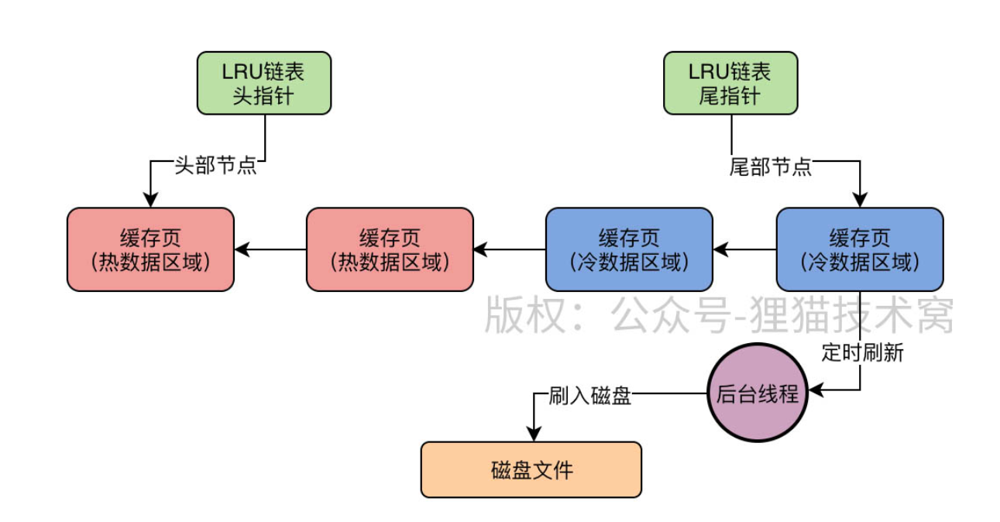

​	当你执行crud的时候，先会把磁盘上的数据加载到Buffer Pool里缓存，然后更新的时候也是更新Buffer Pool的缓存，同时维护一堆链表。然后定时或者不定时的，根据flush链表和lru链表，Buffer Pool里的更新过的脏数据就会刷新到磁盘上去。

​	那么在磁盘上的数据，每一行数据是不是就是类似上面示例的东西

​	所以现在我们就初步的把磁盘上的数据和内存里的数据给关联起来了，他每一行数据的真实存储结构我们就了解了

## 5.6 理解数据在磁盘上的物理存储之后，聊聊行溢出是什么东西

**行溢出：**

​	1 每一行数据都是放在一个数据页里面的，数据页默认大小是16kb，玩意行数据大小超过页的大小怎么办
​	2 比如一个表字段类型是VARCHAR(65532),最大65532个字符，也就是65532个字节，这就远大于16kb大小了

**解决方案：**

​	1 实际上会在那一页存储这行数据，然后哪个**字段中仅仅包含它的一部分数据，同时包含一个20个字节的指针，指向了其他的一些数据页，那些数据页用链表串联起来**，存放这个VARCHAR(65532)超大字段里的数据

​	2 包括其他类型的字段也是一样的，比如TEXT、BLOB这种类型的字段，都可能出现溢出，然后一行数据就会存储在多个数据里

**行溢出存储示意图：**

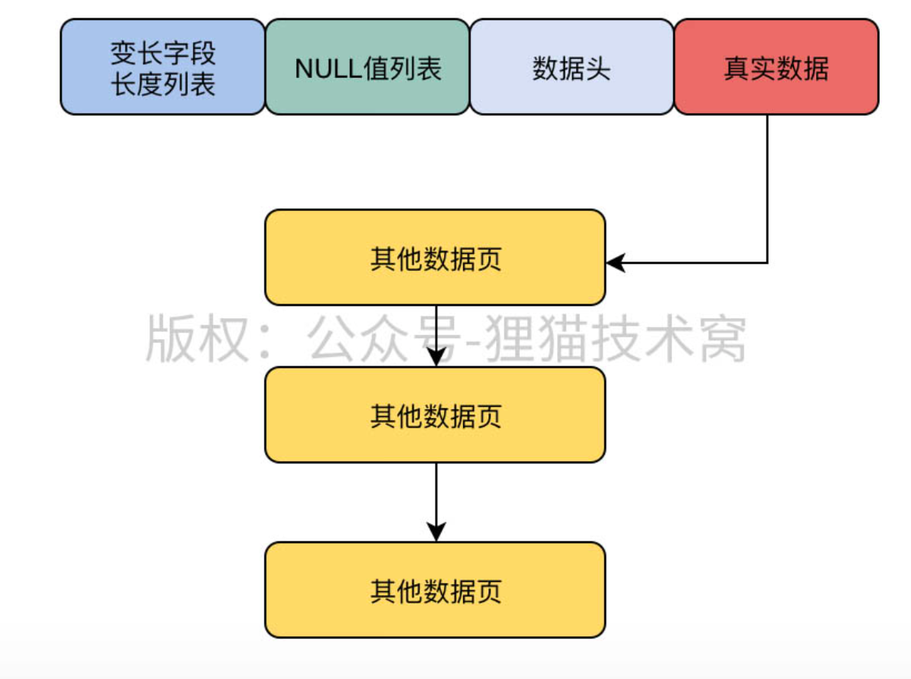

**PS:其实就是在一个数据页里，如果一个数据页放不下一行数据，就会有行溢出问题，存放到多个数据页里去**

**阶段总结:**

​	1 当我们在数据库里插入一行数据的时候，实际上是在内存里插入一个有复杂存储结构的一行数据，然后随着一些条件的发生，这行数据会被刷到磁盘文件里去。

​	2 在磁盘文件里存储的时候，这行数据也是按照复杂的存储结构去存放的。

​	3 而且每一行数据都是放在数据页里的，如果一行数据太大了，就会产生行溢出问题，导致一行数据溢出到多个数据页里去，那么这行数据在Buffer Pool可能就是存在于多个缓存页里的，刷入到磁盘的时候，也是用磁盘上的多个数据页来存放这行数据的。

## 5.7 用于存放磁盘上的多行数据的数据页到底长个什么样子

**数据页包含了哪些**

​	1 每个数据页，默认有16kb的大小，16kb不仅仅是存放大量的数据行

​	2 一个数据页拆分成了很多个部分，大体上来说包含了文件头、数据页头、最小记录数和最大记录、多个数据行、空闲空间、数据页目录、文件尾部

​		**文件头：占据了38个字节，
​		数据页头：占据了56个字节
​		最小记录数和最大记录：占据了26个字节
​		数据行区域：大小是不固定的
​		空闲区域：大小不固定
​		数据页目录：大小不固定
​		文件尾部：占据8个字节**

**数据页加载的过程**

​	1 假设插入一行数据，此时对应数据库(数据页)没有一行数据

​	2 此时会从磁盘上加载一个空的数据页到缓存页中

​	3 接着就会在Buffer Pool中的一个空的缓存页里插入一条数据(上一步加载的空缓存页)

​	4 对于数据页来说，此时缓存页插入一条数据，实际上就是在数据行那个区域里插入一行数据，然后空闲区域的空间会减少一些

​	5 接着可以不停的插入数据到这个缓存页里去，直到空闲区域都耗尽了，此时数据行区域内有很多数据，空闲区域没了	(空闲区域和数据行区域是一起的，数据慢了另一个区域就没了，反之亦然)

​	6 在更新缓存页的同时，其实在lru链表里的位置会不停的变动，而且会在flush链表里，所以最终这些数据一定会通过后台IO线程根据lru链表和flush链表，把这个脏的缓存页刷到磁盘上去


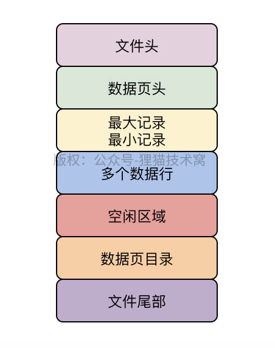

## 5.8 表空间以及划分多个数据页的数据区，又是什么概念

**表空间及其数据区**

​	**表空间：**

​		1 平时创建的那些表，其实都是有一个表空间的概念，磁盘上对会对应着"表名".ibd这样一个磁盘数据文件

​		**2 有的表空间，比如系统表表空间可能对应的是多个磁盘文件，自己创建的表对应的表空间可能就是对应了一个"表名.ibd"数据文件**

​		3 表空间的磁盘文件里面，有很多数据页，因为一个数据页不过16kb，不可能一个数据页就是一个文件

​		**4 表空间里包含的数据页实在是太多了，不便于管理，所以表空间引入了一个数据区的概念，也就是extent**

​	**数据区：**

​		**1 一个数据区对应着连续的64个数据页，每个数据页时16kb，所以一个数据区是1mb**

​		**2 256个数据区被划分为了一组数据区(一个和一组)**

​	**表空间/数据区中的描述/特殊信息：**

​		**对于表空间：第一组数据区的第一个数据区的前3个数据页，都是固定的，里面存放了一些描述性的数据**

​			FSP_HDR:这个数据页，存放了表空间和这一组数据区的一些属性

​			IBUF_BITMAP:数据页，里面存放的是这一组数据页的所有insert buffer的一些信息

​			INODE：这个数据页，存放了一些特殊信息

​		**对于表空间：每一组数据区，第一个数据区的头两个数据页，都是存放特殊信息的**

​			XDES:这个数据页就是存放这一组数据区的一些相关熟悉的
**总结：**

​	1 平时创建的表都是有对应表空间的

​	2 每个表空间就是对应了磁盘上的数据文件

​	3 表空间里有很多组数据区，一组数据区是256个数据区，每个数据区包含64个数据页是1mb

​	4 表空间的第一组数据区的第一个数据区的头三个数据页，都是存放特殊信息的，表空间的其他组数据区的第一个数据区的头两个数据页，也是存放特殊信息的


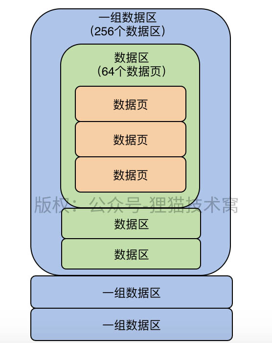

## 5.8 一文总结初步了解到的MySQL存储模型以及数据读写机制(流程实战概述)

**磁盘与表空间**

​	1 Mysql磁盘上，表空间对应磁盘文件，磁盘文件存放数据

​	2 表空间的磁盘文件，数据是如何组织的呢。这个是非常复杂的

​	3 数据库里有各种字段类型，还有索引这个概念，索引在磁盘中的数据也是相当复杂的

​	4 磁盘里存放数据，最基本的角度看，每个extent组包含256个extent，每个extent里包含64个数据页，每个数据页里包含一行一行数据

​	5 在实际存储的时候，在数据行、数据区、数据页这些都有很多特殊、附加的信息。这些特殊信息可以在磁盘文件中实现B+树索引，事务之类的复杂机制

**磁盘文件加载到缓存页流程**

​	1 假设此时要插入一条数据，那么是选择磁盘文件里的哪个数据页加载到缓存页里面去

​	2 首先根据往哪个表插入数据，找到对应的表空间

​	3 根据表空间，定位磁盘文件，然后从里面找出一个extent组,找到一个extent，再从里面找到一个数据页(这个数据页可能是空的，也可能有一些数据行了)

​	4 然后就可以把这个数据页里完整加载出来，放入Buffer Pool的缓存页里

**磁盘读取数据页的伪代码(大概逻辑)**

​	磁盘文件里放的数据都是紧挨在一起的，类似如下数据

```
0xdfs3439399abc0sfsdkslf9sdfpsfds0xdfs3439399abc0sfsdkslf9sdfpsfds

0xdfs3439399abc0sfsdkslf9sdfpsfds0xdfs3439399abc0sfsdkslf9sdfpsfds
```

伪代码获取数据示例

```
dataFile.setStartPosition(25347)

dataFile.setEndPosition(28890)

dataPage = dataFile.read()
```

​	1 读取数据页的时候可以通过随机读写的方式

​	**2 因为一个数据页的大小是固定的，所以一个数据页固定在一个磁盘文件里占据了某个开始位置到结束位置**

​	3 写回去也是一样的，选择好固定的一段位置的数据，直接把缓存页的数据写回去，就覆盖了原来的缓存页了

覆盖缓存页伪代码

```
dataFile.setStartPosition(25347)

dataFile.setEndPosition(28890)

dataFile.write(cachePage)
```

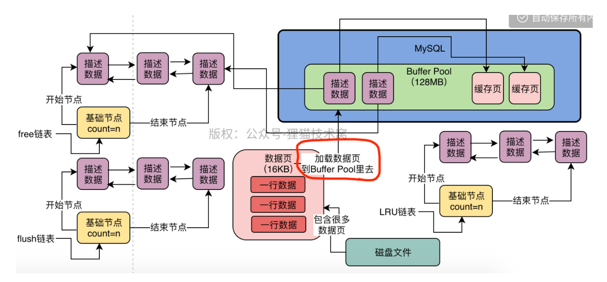

## 5.9 MySQL数据库的日志顺序读写以及数据文件随机读写的原理

**Mysql在实际工作的时候的两种读写机制**

​		一种是对redo log、binlog这种日志进行的磁盘顺序读写

​		一种就是对表空间的磁盘文件里的数据页的磁盘随机读写

**磁盘随机读写**

​	1 Mysql在执行增删改查操作的时候，肯定会从表空间的磁盘文件读取数据页出来，这个过程就是典型的磁盘随机读写

​	2 磁盘文件有很多个数据页，需要在一个随机的位置读取一个数据页到缓存，这就是磁盘随机读

​	3 因为读取的这个数据页可能在磁盘的任意一个位置，所以在读取磁盘文件的数据页只能是随机读这种方式

​	4 磁盘随机读的性能是比较差的，所以不可能每次更新数据都进行磁盘随机读，必须是读取一个数据页之后放到buffer pool缓存里，下次更新直接更新buffer pool中的缓存页

​	5 对于磁盘随机读来说，最主要的性能指标是IOPS和响应延迟

​	6 一般对于核心业务的数据库的生产环境机器规划，推荐用SSD硬盘，SSD固态硬盘随机读写能力和和响应并发延迟都比机械硬盘好很多，可以大幅度提示数据库和QPS的性能

**磁盘顺序写**

​	1 所谓顺序写，就是在一个磁盘日志文件里，一直在末尾追加日志

​	2 写redo日志的时候，其实是不停的在一个日志文件的末尾追加日志的，这就是磁盘顺序写

​	3 磁盘顺序写的性能是很高的，几乎可以跟内存随机读写的性能差不多，如果设置了os cache的刷入磁盘模式的话，那就是在redo log顺序写入磁盘之前，先进入os cache，就是操作系统管理的内存缓存里

​	3 对于这个写磁盘日志文件而言，最核心关注的是磁盘每秒读写多少数据流的吞吐量指标，就是说每秒可以写入磁盘100MB和每秒可以写入磁盘200MMB数据，对数据库的并发能力影响是很大的

**整体性能**

​	因为数据库每一次更新SQL语句，都比如涉及到多个磁盘随机读取数据页的操作，也会涉及到一条redo log日志文件顺序读写的操作，所以磁盘读写IOPS指标，以及吞吐量等一些关键指标，整体决定了数据库的并发能力和性能

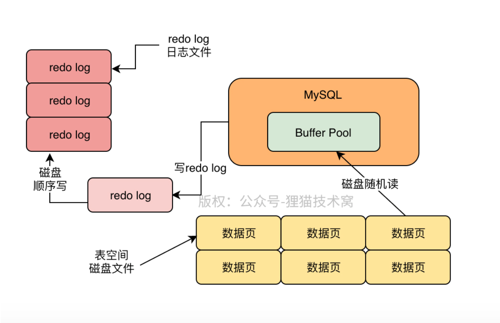

## 5.10 Linux操作系统的存储系统软件层原理剖析以及IO调度优化原理

**操作系统**

​	1 无论是Linux，还是windows，说白了自己本身就是软件系统，之所以需要操作系统，是因为我们无法直接去操作CPU、内存、磁盘这些硬件，需要通过操作系统来管理CPU、内存、磁盘和网卡

**Linux分层概述**

​	简单来说，**Linux的存储系统分为VFS层、文件系统层、Page Cache缓存层、通用Block层、IO调度层、Block设备驱动层、Block设备层**

**Mysql的读写与Linux对应存储系统交互流程**

​	1 当Mysql发起一次数据页的随机读写，或者是一次redo log日志文件的顺序读写的时候，实际上会把磁盘IO请求交给Liunx操作系统的VFS层
​	**VFS层：**
​		(1) 作用就是根据是对哪个目录中的文件执行磁盘IO操作，把请求交给具体的文件系统
​		(2) 比如在linux中，有目录/xx1/xx2里的文件其实是由NFS文件系统管理的，有的目录/xx3/xx4里的文件其实是由Ex3文件系统管理的，这个时候VFS层需要根据是对哪个目录发起的读写IO请求，吧请求转交给对应的文件系统

​	2 接着**文件系统**会现在Page Cache这个基于内存的缓存里找数据在不在里面

​	3 **Page Cache**如果有就基于内存缓存来执行读写，如果没有就继续往下一层走

​	4 此时这个请求会交给**通用Block层**，在这一层会把对文件的IO请求转换为Block IO请求

​	5 IO请求转换为Block IO请求之后，会把这个Block IO请求交给IO调度层，在这一层里默认是用CFQ公平调度算法
​	**IO调度层：**
​		(1)假设有两个不同的SQL语句，一个是更新磁盘的一条数据，一个是执行复杂的查询，可能需要IO读取磁盘上的大量数据。
​		(2) 如果此时基于公平调度算法，就会导致执行第二个SQL语句的读取大量数据的IO操作，耗时很久，然后第一个仅仅共享一条数据的SQL语句一直在等待，得不到执行的机会
​		(3) 所以在这里，其实一般建议Mysql的生产环境，需要调整为deadline IO调度算法
​		deadline IO调度算法：核心思想是，任何一个IO操作都不能一直的等待，在指定事件范围内，都必须让他去执行
​		(4) 所以基于deadline算法，第一个SQL更新一条数据的IO操作可能在等待一会之后，就得到了执行的机会，这也是一个生产环境的IO调度优化经验

​	6 最后IO完成调度之后，就会决定IO请求执行的先后顺序，此时可以执行的IO请求就会交给**Block设备驱动层**

​	7 最后经过驱动吧IO请求发送给真正的存储硬件，也就是**Block设备层**
​	然后硬件设备完成了IO读写操作之后(读或者写)，最后就把响应经过上面的层级反向依次返回，最终Mysql可以得到本次IO读写操作的结果


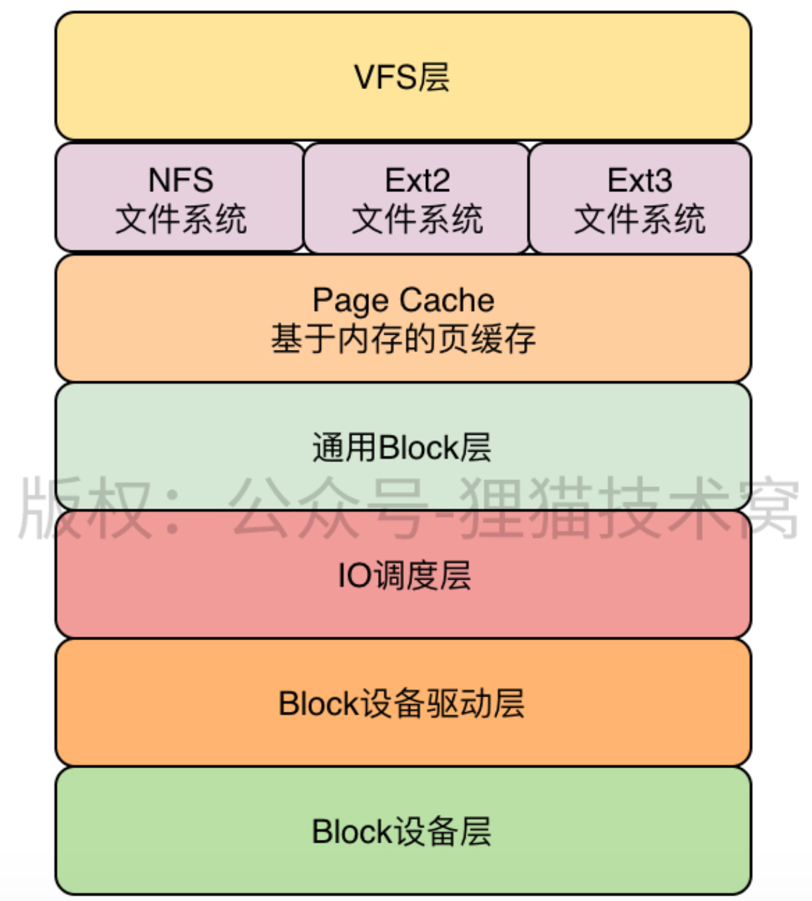

## 5.11 RAID相关样例

### 5.11 .1 数据库服务器使用的RAID存储架构初步介绍

**存储硬件相关->RAID存储架构：**

​	1 说白了，RAID就是一个磁盘冗余阵列

​	2 服务器在一块磁盘容量不够的情况下，可以再搞几块磁盘放在服务器里

​	3 多磁盘的管理，以及多磁盘的数据存放的问题

​	4 针对这个问题，存储层面在机器多块磁盘的情况，引入**RAID这个技术，大致可以认为是用来管理机器的多块磁盘的一种磁盘阵列技术**

**RAID存储架构：**

​	1 往磁盘读写数据的时候，会告诉你应该在哪块磁盘读写数据

​	2 RAID技术还有个很重要的作用，就是数据冗余机制
​	**数据冗余机制：**
​		(1) 就是写入了一批数据再RAID中的一块磁盘上，如果这块磁盘坏了，无法读取数据了
​		(2) 所以在RAID磁盘冗余阵列技术里，可以把写入的同样一份数据，在两块磁盘上写入，这样可以让两块磁盘上的数据一样，作为冗余备份
​		(3) 当一块磁盘坏掉的时候，可以从另一块磁盘读取冗余数据出来，这一切都是RAID技术自动管理的

​	**3 RAID技术实际上就是管理多块磁盘的一种磁盘阵列技术，有软件层面的，也有硬件层面的，比如有RAID卡这种硬件设备**

​	4 RAID还可以分为不同的技术方案，比如RAID 0、RAID 1、RAID 0+1、RAID2等等，一直到RAUD 10等很多不同的多磁盘管理技术方案

**Mysql与硬件**

​	Mysql在运行过程中，需要使用CPU、内存、磁盘、网卡这些硬件，但是不能直接使用，都是通过操作系统提供接口，然后linux负责操作底层的硬件

**下图表示Mysql、操作系统、底层硬件的关系**

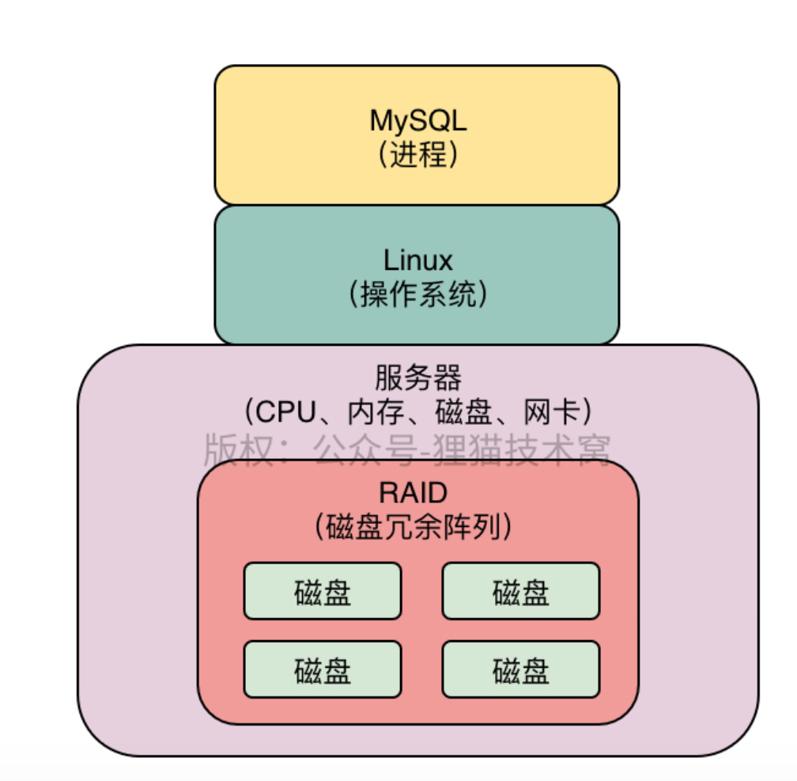

### 5.11.2 数据库服务器上的RAID存储架构的电池充放电原理

**RAID卡的缓存机制**

​	1 服务器使用多块磁盘组成的RAID阵列的时候，一般会有一个RAID卡，这个RAID卡是带有一个缓存的

​	2 这个缓存不是服务器主内存的模式，是一种类似于内存的SDRAM，可以大致认为基于内存存储的

​	**3 RAID的缓存模式设置为write back的话，所有写入磁盘阵列的数据，会先缓存在RAID卡的缓存里，然后再慢慢写入到磁盘阵列中**

​	4 这种写缓冲机制，可以大幅度提升数据库磁盘写的性能

**缓存机制的问题及方案**

​	1 问题：假设突然断电了，或者是服务器故障关闭了是不是这个RAID卡的缓存数据就丢失了,Mysql写入磁盘的数据就没了

​	2 方案：RAID卡一般都配置有自己独立的锂电池或者是电容，如果服务器突然断电，无法接通电源，RAID卡自己是基于锂电池来供电运行的，会赶紧吧缓存里的数据写入阵列中的磁盘上去

**锂电池的问题**

​	1 锂电池存在性能衰减问题，所以一般锂电池都会配置定时充放点，也就是每个30-90天(不同的厂商不一样)，就会自动对锂电池进行充放带你一次，这样可以延长锂电池的寿命和校准电池容量

​	2 这样做事避免锂电池新娘衰减，导致服务器断电后，没办法一次性把缓存写会磁盘，就没电了，就会导致数据丢失

​	**3 在锂电池放电过程中，RAID缓存级别会从write back变成write though，通过RAID写数据的时候就直接写磁盘了**

​	**4 写内存的性能大概是0.1ms这个级别，写磁盘的话性能会退化10倍，到毫秒级了**

​	**总结：所以生产环境数据库采用了RAID的公司，通常会开启缓存机制，但是RAID锂电池自动充放电，会导致数据库服务器的RAID存储性能出现几十倍的抖动，间接导致数据库每隔一段时间就会出现几十倍的抖动**

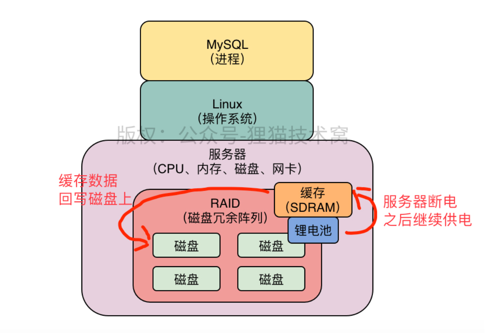

### 5.11.3 RAID锂电池充放电导致的MySQL数据库性能抖动的优化

**RAID生产使用经验**

​	**RAID 0: **

​		1 多块磁盘组成阵列，数据分散写入不同磁盘，因为是多块磁盘，容量打，磁盘读写并发能力也很强
​		2 缺点就是没有数据冗余备份，如果磁盘坏了就会丢失一部分数据

​	**RAID 1：**

​		1 这个模式就会磁盘冗余，两块磁盘互为镜像关系，一块磁盘坏了，另一块磁盘还有
​		2 两块磁盘还可以互相分担读请求的压力，因为两块磁盘数据是互相冗余，是一样的

​	**RAID 10：**

​		1 就是RAID 0 + RAID 1组合起来
​		2 比如生产环境的服务器部署，6块磁盘组成了一个RAID10的阵列
​		3 没两块磁盘组成一个RAID 1互为镜像的架构
​		4 一共有3组RAID 1
​		5 对于每一组RAID 1写入数据的时候，都是用RAID 0的思路
​		6 就是说不同组的磁盘数据是不一样的，但是同一组的两块磁盘数据是冗余一致的

**解决RAID锂电池充放电问题导致的存储性能抖动的解决方案，一般有三种解决方案：**

1. **给RAID卡把锂电池换成电容，电容是不用频繁充放电的，不会导致充放电的性能抖动**，还有就是电容可以支持透明充放电，就是自动检查电量，自动进行充电，不会说在充放电的时候让写IO直接走磁盘，**但是更换电容很麻烦，而且电容比较容易老化，这个其实一般不常用**

   

2. **手动充放电，这个比较常用，包括一些大家知道的顶尖互联网大厂的数据库服务器的RAID就是用了这个方案避免性能抖动，就是关闭RAID自动充放电**，然后写一个脚本，**脚本每隔一段时间自动在晚上凌晨的业务低峰时期，脚本手动触发充放电，这样可以避免业务高峰期的时候RAID自动充放电引起性能抖动**

   

3. **充放电的时候不要关闭write back，就是设置一下，锂电池充放电的时候不要把缓存级别从write back修改为write through，这个也是可以做到的，可以和第二个策略配合起来使用**

## 5.12 数据库连接样例

### 5.12.1 数据库无法连接故障的定位，Too many connections


​	异常信息：ERROR 1040(HY000): Too many connections

​	信息说明：这个时候就是说数据库的连接池里已经有太多的连接了，不能再跟你建立新的连接了

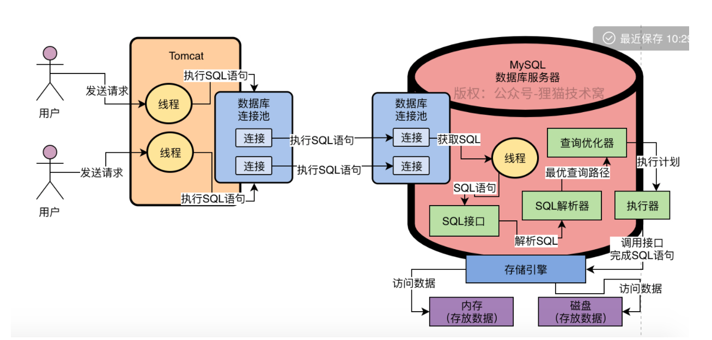

​	样例：数据库部署在64GB的大内存物理机上，机器配置各方面都很高，然后连接这台物理机的Java系统部署在2台机器上，Java系统设置的连接池的最大大小是200，也就是说每台机器上部署的Java系统，最多跟MySQL数据库建立200个连接，**一共最多建立400个连接**

​	如图

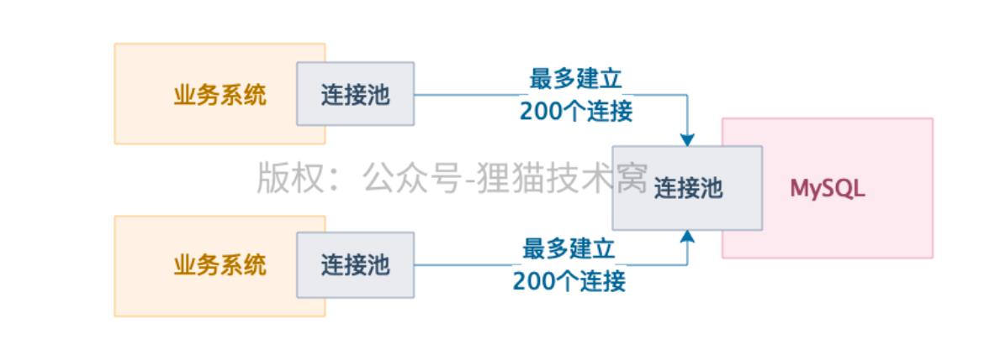

排查流程：

​	1 查了一下MySQL的配置文件，my.cnf，里面有一个关键的参数是max_connections，就是MySQL能建立的最大连接数，设置的是800

​	2 明明设置了MySQL最多可以建立800个连接，为什么居然两台机器要建立400个连接都不行呢

​	3 执行 show variables like 'max_connections'，此时你可以看到，当前MySQL仅仅只是建立了214个连接而已！

​	4 检查一下MySQL的启动日志，可以看到如下的字样：

```
Could not increase number of max_open_files to more than mysqld (request: 65535)

Changed limits: max_connections: 214 (requested 2000)

Changed limits: table_open_cache: 400 (requested 4096)
```

​	5 看看日志就很清楚了，MySQL发现自己无法设置max_connections为我们期望的800，只能强行限制为214了

​	6 简单来说，就是因为底层的linux操作系统把进程可以打开的文件句柄数限制为了1024了，导致MySQL最大连接数是214

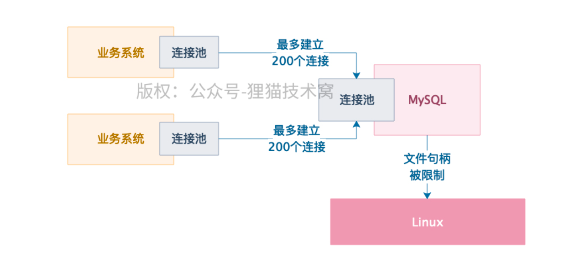

### 5.12.2 如何解决经典的Too many connections故障？背后原理是什么

**解决mysql连接数的问题：**

1 直接调整句柄数

```shell
ulimit -HSn 65535
#将linux的最大文件句柄限制改为65535
#默认1024
```

2 然后就可以用如下命令检查最大文件句柄数是否被修改了

```shell
cat /etc/security/limits.conf
#要确保变更落地到/etc/security/limits.conf文件里，永久性的设置进程的资源限制
cat /etc/rc.local
#所以执行ulimit -HSn 65535命令后，要用以上命令检查一下是否落地到配置文件里去了。
```

3 如果都修改好之后，可以在MySQL的my.cnf里确保max_connections参数也调整好了，然后可以重启服务器，然后重启MySQL，这样的话，linux的最大文件句柄就会生效了，MySQL的最大连接数也会生效了。然后此时你再尝试业务系统去连接数据库，就没问题了！

问题：为什么linux的最大文件句柄限制为1024的时候，MySQL的最大连接数是214呢？

原因：这个其实是MySQL源码内部写死的，他在源码中就是有一个计算公式，算下来就是如此罢了！

**ulimit命令:**

​	1 l**inux的话是默认会限制你每个进程对机器资源的使用的，包括可以打开的文件句柄的限制**，可以打开的子进程数的限制，网络缓存的限制，最大可以锁定的内存大小。

​	2 因为linux操作系统设计的初衷，就是要尽量**避免你某个进程一下子耗尽机器上的所有资源，所以他默认都是会做限制的。**

```shell
ulimit -a
#可以看到进程被限制使用的各种资源的量
```

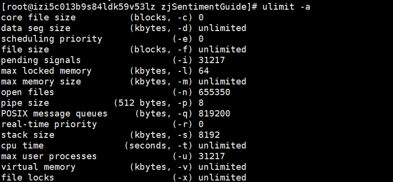

​	 core file size 代表的进程崩溃时候的转储文件的大小限制，

​	max locked memory就是最大锁定内存大小，

​	open files就是最大可以打开的文件句柄数量，

​	max user processes就是最多可以拥有的子进程数量。

**生产环境：**

​	1 生产环境部署了一个系统，比如数据库系统、消息中间件系统、存储系统、缓存系统之后，都需要调整一下linux的一些内核参数，这个文件句柄的数量是一定要调整的，通常都得设置为65535

​	2 比如MySQL运行的时候，其实就是linux上的一个进程，那么他其实是需要跟很多业务系统建立大量的连接的，结果你限制了他的最大文件句柄数量，那么他就不能建立太多连接了

​	3 Kafka之类的消息中间件，在生产环境部署的时候，如果你不优化一些linux内核参数，会导致Kafka可能无法创建足够的线程，此时也是无法运行的。

# 6 redo log原理

## 6.1 重新回顾redo日志对于事务提交后，数据绝对不会丢失的意义

​	**事务提交的时候把修改过的缓存页都刷入磁盘，跟事务提交的时候把做的修改的redo log都写入日志文件，两者都是写磁盘，差别在哪里？**

**缓存页刷入磁盘问题**

​	1 把修改过的缓存页都刷入磁盘，一个缓存页是16kbb，数据比较大，刷入磁盘相对耗时
​	2 仅修改了缓存页的几个字节的数据，将完整的缓存页刷入磁盘，效率较低
​	3 缓存页刷入磁盘是随机写磁盘，性能较差，因为一个缓存页对应的位置可能在磁盘文件的一个随机位置，比如偏移量45336这个地方

**redo log优点**

​	1 一行redo log是当前修改的语句，不用整个缓存页，大小可能仅占据几十个字节。一个redo log包含表空间号，数据页号，磁盘文件偏移量，更新值，写入磁盘速度很快
​	2 redo log写日志，是顺序写入磁盘文件，每次都追加到磁盘文件末尾，速度比随机写快很多
结论：提交事务的时候，用redo log的形式记录修改，性能会远远超过刷缓存页的方式，让数据库的并发能力更强

**PS:redo log本质是保证事务提交之后，修改的数据不会丢失**

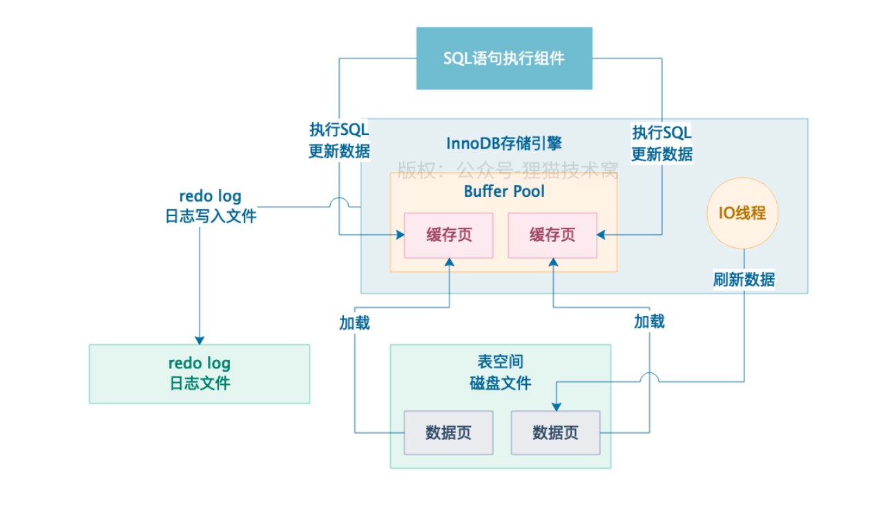

## 6.2 在Buffer Pool执行完增删改之后，写入日志文件的redo log长什么样

1 redo log本质上记录的就是对某个表空间的某个数据页的某个偏移量的地方修改了几个字节的值，具体修改的值是什么

2 里面需要记录的就是表空间号+数据页号+偏移量+修改几个字节的值+具体的值

修改了数据页不同字节的值，redo log就划分了不同了类型

​	MLOG_1BYTE、MLOG_1BYTE、分别为修改了1、2字节的值，以此类推还有修改了4个字节的值，8个字节的值
​	MLOG_WRITE_STRING:代表修改了一大串值，在对应数据页的某个偏移量的位置插入活修改了一大串的值

**redo log日志对应格式如下：**

​	**日志类型(类似MLOG_1BYTE之类的)、表空间ID、数据页号、数据页中的偏移量、修改数据长度、具体修改的数据**


**PS:一条redo log的语义就是修改了多少字节的数据，在哪个表空间，哪个数据页执行的，数据页哪个偏移量开始执行的，更新了哪些数据**

## 6.3 redo log是直接一条一条写入文件的吗？非也，揭秘redo log block

**redo log block:**

​	1 用来存放多个单行日志的

​	2 一个redo log block是512字节，这个redo log block的512字节分为3个部分，一个是12字节的header块头，一个是496字节的body块体，一个是4字节的trailer块尾

​	**3 12字节的header头又分为了4个部分**

​		(1) 包括4个字节的block no，就是块唯一编号
​		(2) 2个字节的data length，就是block里写入了多少字节数据
​		(3) 2个字节的first record group。这个是说每个事务都会有多个redo log，是一个redo log grooup，即一组redo log。那么在这个block里的第一组redo log的偏移量，就是这2个字节存储的
​		(4) 4个字节的checkpoint on

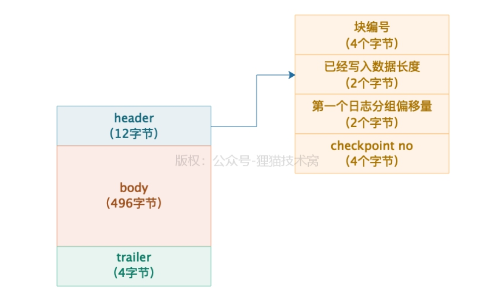

**redo log写入机制**

​	1 从第一行开始，从左往右写，可能会有很多行

​	2 在写第一个redo log了，先在内存把这个redo log弄到一个redo log block数据结构中

​	**3 等内存里的一个redo log block的512字节都满了，再一次性把这个redo log block写入磁盘文件**

​	4 写入磁盘文件的时候，redo log就多了一个block

​	**PS:在磁盘文件末尾追加不停的写自己数据就是磁盘顺序写，在磁盘某个随机位置找到一个redo log block去修改其中几个字节数据，就是磁盘随机写**

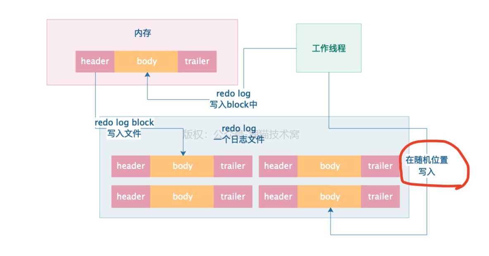

​	InnoDB的redo log是固定大小的，比如可以配置为一组4个文件，每个文件的大小是1GB，那么总共就可以记录4GB的操作。从头开始写，写到末尾就又回到开头循环写

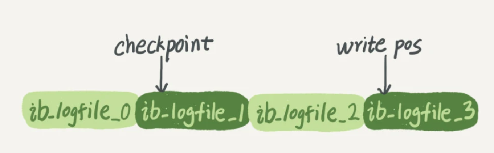

​	write pos是当前记录的位置，一边写一边后移，写到第3号文件末尾后就回到0号文件开头。checkpoint是当前要擦除的位置，也是往后推移并且循环的，擦除记录前要把记录更新到数据文件。

​	write pos和checkpoint之间的是还空着的部分，可以用来记录新的操作。如果write pos追上checkpoint，表示“粉板”满了，这时候不能再执行新的更新，得停下来先擦掉一些记录，把checkpoint推进一下。

​	**PS:有了redo log，InnoDB就可以保证即使数据库发生异常重启，之前提交的记录都不会丢失，这个能力称为crash-safe。**

## 6.4 redo log buffer中的缓冲日志，到底什么时候可以写入磁盘

**概述：**

​	**写入redo log buffer的时候，是写入里面提取划分好的一个一个的redo log block的，选择有空闲空间的redo log block去写入的，然后redo log block写满之后，会在某个时机刷入到磁盘里去**

redo log block刷入磁盘文件的时机
	1 如果写入redo log buffer的日志已经占据了redo log buffer总容量的一半，也就是超过8M的redo log在缓冲里了，此时就会把它们刷入磁盘文件里去

​	2 一个事务提交的时候，把redo log所在的redo log block刷入磁盘文件(看参数级别，可能是os cache或者其他)

​	3 后台线程定时刷新，有一个后台线程每隔一秒就会把redo log buffer里的redo log block刷到磁盘文件里去

​	4 mysql关闭的时候，redo log block都会刷入到磁盘里去

**场景：**

​	1 如果瞬间执行大量高并发的SQL语句，1秒内就产生了超过8M的redo log，此时占据了redo log buffer一半的空间，就会直接把redo log刷入到磁盘

​	2 时机1情况比较少，不太常见，第二种比较常见

​	3 最关键的是时机2，保证事务提交成功刷入到磁盘了。数据才不会丢

**redo log目录**

​	1 redo 都会写入一个目录中的文件里，这个目录可以通过show variables like 'datadir'来查看，可以通过innodb_log_group_home_dir参数来设置和这个目录

​	2 对应redo log是有多个的，写满了一个就会写下一个redo log,而且可以限制redo log文件的数量，通过innodb_log_file_size可以指定每个redo log文件的大小，默认是48M，通过innodb_log_files_in_group可以指定日志文件的数量，默认两个

​	3 默认情况，目录就两个日志文件，分别为ib_logfile0和ib_logfile1，每个48MB,最多就这两个日志文件，写满了第一个写第二个，第二个写满了再回过头来写第一个，覆盖第一个日志文件里原来的redo log

​	4 所以mysql默认情况下最多保留了最近的96M的redo log，redo log一般很小，一条通常几个字节到几十字节不等，96M足够存储上百万条redo log了


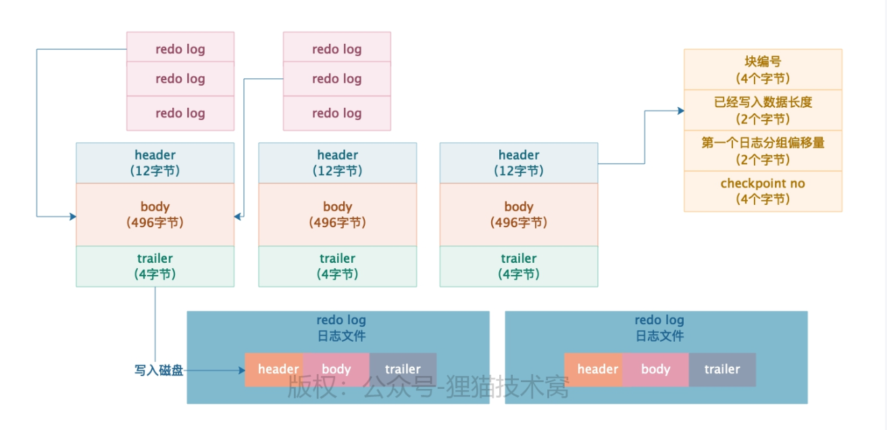

# 7 undo log日志

## 7.1 如果事务执行到一半要回滚怎么办？再探undo log回滚日志原理

**执行事务的时候，除了redo log的另外一种日志，undo log回滚日志:**

​	1 记录的东西比较简单，比如在缓存页执行了一个insert语句，此时在undo log日志里，对这个操作记录的回滚日志就为一个主键和对应的delete操作

​	2 执行的是delete语句，记录被删除数据，同理就回滚对应的操作的是insert操作语句

​	3 执行的是update语句，记录的修改之前的数据,回滚对应操作update语句

​	4 select语句不会对Buffer pool修改，没有undo log


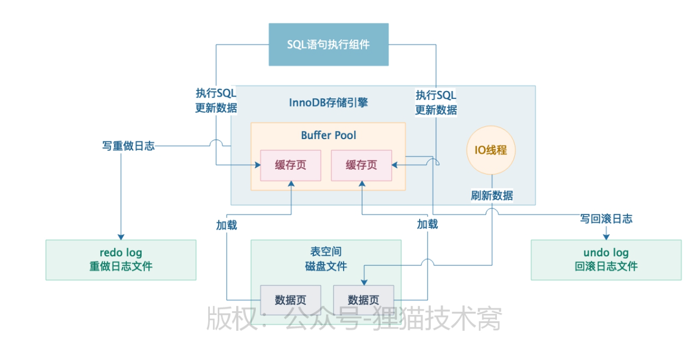


## 7.2 一起来看看INSRET语句的undo log回滚日志长什么样

**INSERT语句的undo log的类型是TRX_UNDO_INSERT_REC,这个undo log里包含了以下一些东西**

这条日志的开始位置
主键的各列长度和值
表id
undo log日志编号
undo log日志类型
这条日志的结束位置

**场景：**

​	1 在Bufffer pool的一个缓存页插入了一条数据，执行了Insert语句，写了一条上面的undo log,现在事务回滚，直接把Insert语句的undo log拿出来
​	2 通过undo log知道了主键，定位到表和主键对应的缓存页，从里面删除掉之前insert的数据就可以实现事务回滚的效果了

**PS:delete和update套路是一样的，这里就不展开了**


# 8 事务与锁

## 8.1 MySQL运行时多个事务同时执行是什么场景

**事务的基本概念：**

​	一个事务里面有多个SQL语句，要不一起成功都提交了，要不有一个SQL失败，那么事务就回滚了，所有SQL做的修改都撤销了

**事务执行原理回顾：**

​	从磁盘加载数据页到buffer pool的缓存页中，更新buffer pool缓存页，同时记录redo log和undo log

**并发场景的问题：**

​	1 多个事务并发执行的时候，可能会同时对缓存页里的一行护具进行更新，这个冲突怎么处理？是否要加锁？
​	2 可能有的事务在对一行数据做更新，有的事务在查询这行数据，这里的冲突怎么处理？


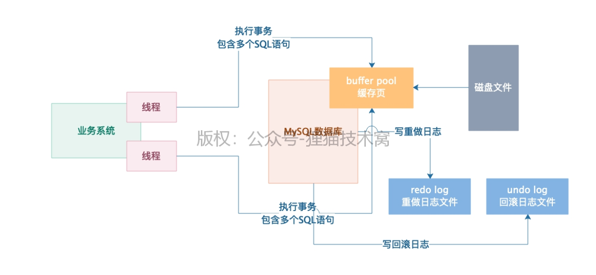

## 8.2 多个事务并发更新以及查询数据，为什么会有脏写和脏读的问题

多个事务对缓存页里的同一条数据同时进行更新或者查询，会产生哪些问题？

会涉及到 **脏写、脏读、不可重复读、幻读**，四种问题

**脏写：**

​	1 有两个事务，事务A和事务B同时在更新一条数据，事务A先更新为A值，事务B紧接着就把他更新为B值(此时事务A还没有结束)

​	2 而且此时事务A更新之后会记录一条undo log日志，事务A是先更新的，更新之前这行数据的值为NULL

​	3 此时事务B更新完了数据值为B，结果此时事务A回滚了，undo log记录的数据为NULL，数据就更新为NULL了

​	4 对于事务B的场景，明明更新了，结果值却没了，这就是脏写

​	**PS:脏写的本质就是事务B去修改了事务A修改过的值，但是此时事务A还没有提交，所以事务A随时会回滚，导致事务B修改的值也没了，这就是脏写的定义**

**脏读：**

​	1 事务A更新了一行数据的值为A值，此时事务B去查询了这行数据的值，查出来A值，事务B拿A值去进行业务处理

​	2 此时事务A突然回滚了事务，更新的A值变成了NULL，事务B再次查询该值时候，A值没了变成了NULL

​	**PS:本质就是事务B去查询了事务A修改过的数据，但是此时事务A还没有提交，所以事务A随时回滚导致事务B再次查询就读不到刚才事务A修改的数据了**
​	


## 8.3 一个事务多次查询一条数据读到的都是不同的值，这就是不可重复读

**不可重复读：**

​	1 事务A开启了，在这个事务A里会多次对一条数据进行查询

​	2 另外有两个事务，事务B、事务C，都是对这一条数据进行更新的

​	3 首先如果某个事务没有提交，其他事务是读不到的，这个是前提，避免了脏读的发生

​	4 事务A开启，第一次查询这条数据是A值

​	5 接着事务B更新这行数据为B值，马上就提交了，事务A第二次查询这条数据变成了B值

​	6 接着事务C更新这行数据为C值，马上就提交了，事务A第三次查询查到的值变成了C值

​	7 在事务A没有提交的情况，多次查询一条数据的值是不一样的，这就是不可重复读

**PS:不可重复读就是一个事务多次查询，因为其他事务修改了这条数据，导致每次查询数据不一致。**

**可重复读：**

​	如果多次查询，不管其他事务怎么修改，都是同样一个A值，那么这就是可重复读的

​	**PS:不可重复读不是什么大问题，这取决于业务上想要数据库是什么样子的，数据库是存在"不可重复读"的问题的**

## 8.4 听起来很恐怖的数据库幻读，到底是个什么奇葩问题

**幻读：**

​	1 事务A，发送一条SQL语句，根据条件查出一批数据，比如SELECT * FROM TABLE WHERE ID > 10,类似这种SQL

​	2 一开始查询出10条数据

​	3 这个时候，别的事务往表里插入了几条数据，而且事务还提交了，此时事务A再查询的时候就多出几行数据了，就就是幻读

​	**PS:幻读指的是一个事务用一样的SQL多次查询，每次查询都查到了一些之前没有看到过的数据，跟发生幻觉一样**

**扩展：**

​	这些问题的本质都是数据库的多事务并发问题，为了解决事务并发问题，数据库才设计了事务隔离机制，MVCC多版本隔离机制，锁机制等一整套机制来解决多事务并发问题

## 8.5 SQL标准中对事务的4个隔离级别，都是如何规定的呢

​	**SQL标准中规定了事务的4种隔离级别**，就是说多个事务并发运行的时候，互相是如何隔离的。**但是这并不是MYSQL的事务隔离级别，MySql在具体实现事务隔离级别的时候会有点差别**

这4种级别包括了 **read uncommitted(读未提交) read committed(读已提交/RC) repeatable read(可重复读/RR) serializable(串行化)**

**read uncommitted(读未提交)** 

​	不允许发生脏写，也就是不能再两个事务没提交的情况去更新同一行数据

​	在这种隔离级别下，可能发生脏读，不可重复读，幻读

​	一般来说不会设置这种级别，不会用

**read committed(读已提交/RC)** 

​	这种级别下，不会发生脏写和脏读,可能会发生不可重复读和幻读的问题

**repeatable read(可重复读/RR)** 

​	这种级别下，不会发生脏写、脏读和不可重复读的问题，事务一旦开始，就算其他事务修改了这天数据，多次查询一个值都是同一个值

**serializable(串行化)**

​	这种级别不允许多个事务并发执行，只能串行执行，先执行事务A、再B、再C，不可能有幻读问题，事务不会并发执行
一般不会用

**PS:最常用的就是RR和RC级别**

## 8.6 MySQL是如何支持4种事务隔离级别的？Spring事务注解是如何设置的

​	在MySQL的文档的隔离级别（[innodb transaction isolation](https://link.zhihu.com/?target=https%3A//dev.mysql.com/doc/refman/8.0/en/innodb-transaction-isolation-levels.html)）的介绍里，只有说read committed（RC）有幻像（phantom），serializable下不会有幻像，但 RC， RR下可以允许幻像。

**spring设置**

```
@Transactional注解
isolation参数的，里面是可以设置事务隔离级别的，具体的设置方式如下：

@Transactional(isolation=Isolation.DEFAULT)，然后默认的就是DEFAULT值，这个就是MySQL默认支持什么隔离级别就是什么隔离级别
那MySQL默认是RR级别，自然你开发的业务系统的事务也都是RR级别的了。

可以改成Isolation.READ_UNCOMMITTED、Isolation.READ_COMMITTED，Isolation.REPEATABLE_READ，Isolation.SERIALIZABLE几个级别，都是可以的。

其实默认的RR隔离机制挺好的，真的没必要去修改，除非你一定要在你的事务执行期间多次查询的时候，必须要查到别的已提交事务修改过的最新值，那么此时你的业务有这个要求，你就把Spring的事务注解里的隔离级别设置为Isolation.READ_COMMITTED级别，偶尔可能也是有这种需求的。
```

## 8.7  理解MVCC机制的前奏：undo log版本链是个什么东西

**undo log版本链**
	每条数据其实都有两个隐藏字段，一个是trx_id，一个是roll_pointer

**trx_id**
	就是最近1次更新这条数据的事务id
	
**roll_pointer**
	就是指向了更新这个事务之前生成的undo log

**版本链的形成：**

​	**每多个事务串联执行的时候，每修改一行数据都会更新隐藏字段trx_id和roll_pointer，同时之前多个数据快照对应的undo log会通过roll_pinter指针串联起来，形成一个重要的版本链**

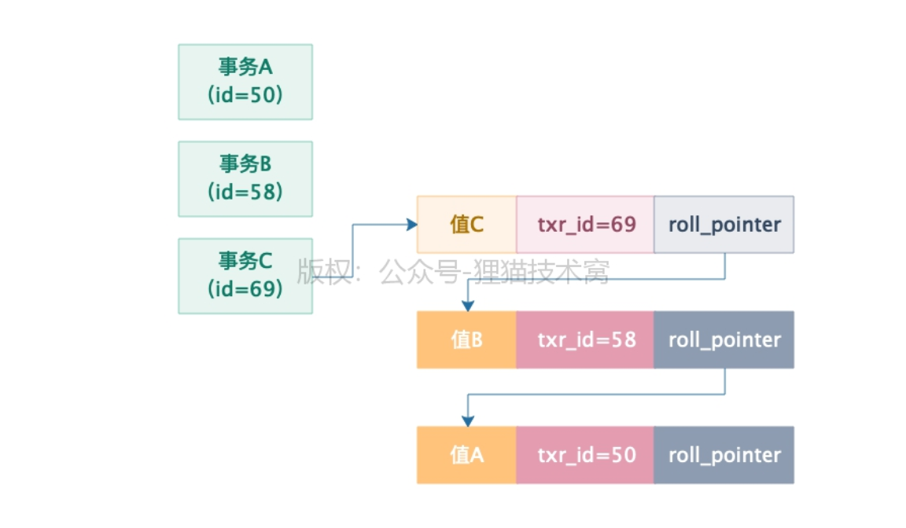

## 8.8 基于undo log多版本链条实现的ReadView机制，到底是什么

**ReadView核心信息：**

​	m_ids:表示此时有哪些事务在MySql里执行还没有提交的

​	min_trx_id:就是m_ids里最小的值

​	max_trx_id:mysql下一个要生成的事务id,就是最大事务id

​	creator_trx_id:就是当前事务id
​	

**ReadView核心流程**

​	**1 事务A当前事务在读取数据的时候的时候，会开启一个ReadView**

​	**2 事务A就会去比对当前这行数据的txr_id(事务id)**

​		**如果小于ReadView中的min_trx_id：**说明事务开启之前修改这行数据的事务就提交了，所以可以直接查这行数据

​		**如果大于ReadView中的min_trx_id，同时小于ReadView里的max_trx_id：**说明更新这条数据的事务，就是和当前事务A差不多时间开启的，会看下是否在m_ids列表中，这行数据是不能查询的
​			这时候应该顺着这条数据的roll_printer的undo log日志链表往下找，找到最近一条的undo log且trx_id小于min_trx_id的数据，就可以直接拿来用了

​		**如果等于ReadView中的max_trx_id：**说明这行数据就是事务A自己修改的，是可以查询的

​		**如果大于ReadView中的max_trx_id：**后面这个事务开启之后，有一个事务更新并提交了数据，这个数据也是不能查的，也会根据undo log版本链条去查，查出小于或等于的trx_id的数据来用

**总结：**

​	**通过undo log多版本链条，加上开启事务时候生产的一个ReadView,然后查询的时候根据ReadView进行判断的机制，就知道应该读取哪个版本的数据**

​	主要是保证，事务开启的时候别的事务更新的值是读不到的，可以实现多个事务并发执行时候的数据隔离

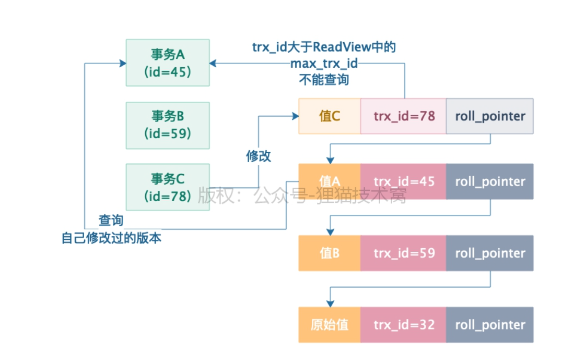

## 8.9 Read Committed隔离级别是如何基于ReadView机制实现的

RC隔离级别：读已提交

也是基于ReadView机制的，与RR级别最主要的实现区别在于，**每次发起查询，都会重新生成一个ReadView**

这样m_ids的值就会去除已经提交的事务，就能实现都已提交了

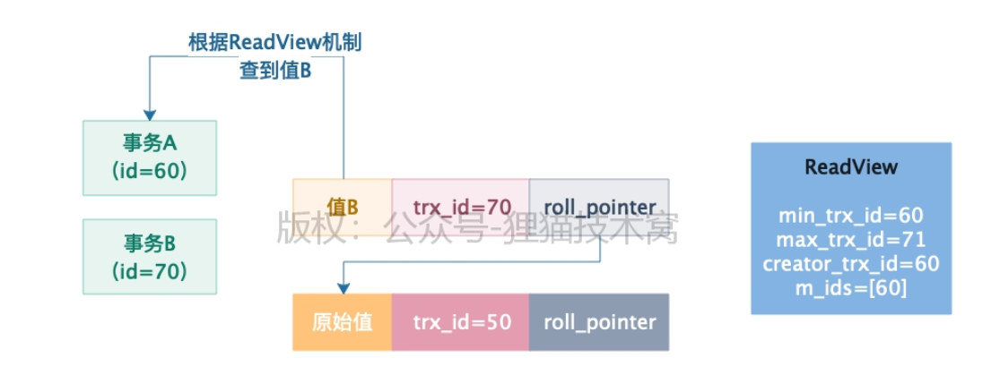

## 8.10 MySQL最牛的RR隔离级别，是如何基于ReadView机制实现的

​	**RR级别事务A开启的时候的ReadView的值是不会变的，不管其他事务如何修改数据，都不影响事务A的ReadView，这样就可以根据MVCC机制解决不可重复读问题，以及快照读查询的幻读问题**

**快照读与当前读：**

​	**快照读/普通读：**

​	1 就是没有加锁的普通查询，比如 select * from xxx where xxx

​	2 快照读的意思就是根据MVCC ReadView机制，读取对应的快照数据，不一定是最新数据

​	**当前读：**

​	1 select...lock in share mode (共享读锁/共享锁/S锁)
​		select.... for update(排他锁/独占锁/X锁)
​		update delete insert(这几个操作都是加 排他锁)

​	2 当前读，**读的是最新版本的数据，并对读取的数据加锁，避免出现安全问题**(比如update数据的时候，又delete而且提交了，不加锁肯定冲突，所以update肯定是当前读加锁)

引用：https://www.cnblogs.com/wwcom123/p/10727194.html

**RR级别的幻读问题：**

​	1 事务开启的时候就会开启快照读，这个时候只会读取当前事务开启的时候的快照读的数据，不会产生幻读

​	2 都是当前读，也就是都加锁了，也会通过行锁+间隙锁(GAP),也就是next-key-locks的方式去避免幻读

​	3 产生幻读的情况一般是在当前读(lock read)的情况，这种情况往往是一个快照读(non-locking read)后面跟着一个当前读(locking read)的查询，这个时候是可能产生幻读的。

**PS:间隙锁是在可重复读隔离级别下才会生效的。所以，你如果把隔离级别设置为读提交的话，就没有间隙锁了**

引用：https://www.zhihu.com/question/372905832

引用：mysql45讲-(20讲幻读是什么，幻读有什么问题)

扩展：insert into锁相关：https://blog.csdn.net/and1kaney/article/details/51214001

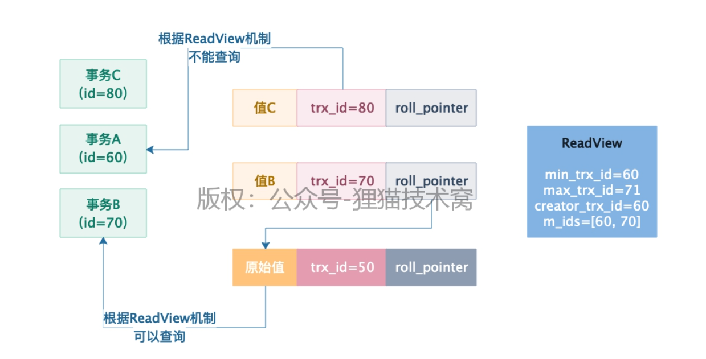

## 8.11 停一停脚步：梳理一下数据库的多事务并发运行的隔离机制

总结：

**多个事务并发运行的时候，同时读写一个数据，会产生：脏写、脏读、不可重复读、幻读这几个问题**

​	脏写：事务B修改了事务A未提交的数据，事务A回滚了的话，事务B的修改就像没发生过一样
​	脏读：事务B读取了事务A未提交的数据，事务A回滚了的话，事务B再次读取数据就不一样了
​	不可重复读：事务A多次读取同一条数据，因为其他事务也在修改而且也提交了这条数据，导致事务A多次读取的数据不一样
​	幻读：事务A根据条件查询一批数据时候，其他事务也在修改，添加了一个/多个符合条件的数据进去，事务A再次查询的时候就会发现多了一个/多个数据是之前没有的

**针对这些问题，所以有RU、RC、RR、串行化四个隔离级别**

​	RU(读未提交):该隔离级别脏写、脏读、不可重复读、幻读都会发生
​	RC(读已提交):该隔离级别可以避免脏写、脏读，但是会发生不可重复读、幻读
​	RR(可重复读)：该隔离级别可以避免脏写、脏读、不可重复读、在mysql的innodb引擎还可以避免大部分情况下的幻读
​	串行化：该隔离级别就是所以事务串行执行，自然就没有并发修改问题，脏写、脏读、不可重复读、幻读都不会发生

​	**Mysql是通过undo log多版本链条+ReadView来实现MVCC机制的，默认的RR级别就是基于这个机制实现的(RC也是只不过是开启ReadView的方式有差异)**

## 8.12 多个事务更新同一行数据时，是如何加锁避免脏写的

**锁机制:**

​	**依靠锁机制，让多个事务更新一行数据的时候串行化，避免同时更新一行数据，这样就可以避免脏写了**

​	如果数据没有加锁，事务就会创建一个锁，里面包含了trx_id和等待状态，把锁和这行数据关联在一起

​	更新一行数据必须把所在的数据页读取到缓存页才能更新，所以数据和关联的锁数据结构，都是在内存里

​	如果B事务更新该数据，会检查下是否有加锁，此时A事务还没有释放锁的话，B事务会生成锁数据结构，然后等待，等待状态设置为true

​	A事务更新完数据，把锁释放屌，回去找其他对这行数据加锁的事务，然后将等待状态改为false,这样事务B就能获取到锁了

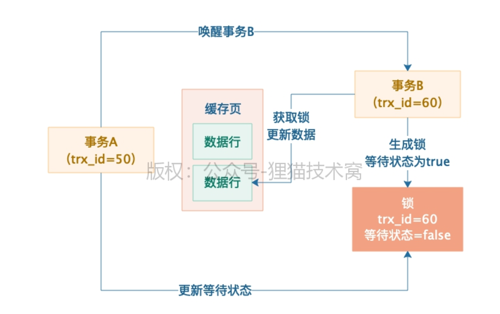

## 8.13 对MySQL锁机制再深入一步，共享锁和独占锁到底是什么

**排他锁/独占锁/X锁/写锁/Exclude：**

​	多个事务更新一行数据的时候，加的是写锁，必须一个事务执行完毕了，提交了，才能唤醒别的事务继续执行

​	而在事务更新数据的时候，其他事务读取数据是不用加锁的，走的是MVCC机制，也就是说一行数据的读和写两个操作是不会加锁互斥的

​	自动加锁。对于UPDATE、DELETE和INSERT语句，InnoDB会自动给涉及数据集加排他锁

```sql
select * from innodb_lock where id=4 for update;
# 就是加 for update 即可
```

**共享锁/S锁/读锁：**

​	共享锁之间不互斥，共享锁和独占锁互斥

```sql
select * from innodb_lock where id=4 lock in share mode;
# 加 lock in share mode即可
```

**总结：**

​	更新数据加独占锁，互斥，其他事务不能更新

​	查询默认不加锁，走mvcc快照读

​	查询的时候可以手动加共享锁或者独占锁

引用：https://www.cnblogs.com/itdragon/p/8194622.html

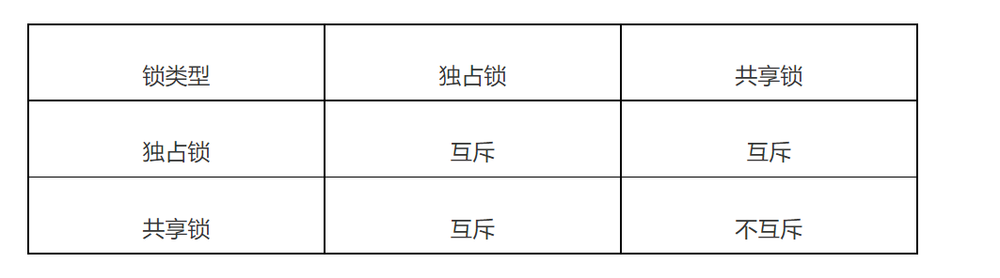

## 8.14 在数据库里，哪些操作会导致在表级别加锁呢

**全局锁：**

​	全局锁就是对整个数据库实例加锁
​	MySQL提供了一个加全局读锁的方法，命令是 Flush tables with read lock (FTWRL)
​	该命令会导致整个数据库处于只读状态，之后其他线程的以下语句会被阻塞：数据更新语句（数据的增删改）、数据定义语句（包括建表、修改表结构等）和更新类事务的提交语句。
​	使用场景：全库逻辑备份
​	
**表锁：**
**​	Mysql里面表级别的锁有两种：一种是表锁，一种是元数据锁(meta data lock,MDL)**

​	表锁的语法是 lock tables … read/write.可以用unlock tables主动释放锁

​	lock tables加的表锁除了会影响别的线程读写，还会限制本线程的操作，本线程也不能被写锁住的表，只能读

**MDL/元数据锁：**

​	MDL不需要显示使用，在访问一个表的时候会自动加上。

​	MDL的作用是保证读写的正确性，比如遍历一个表的数据，另一个线程把表删了一列，查出来的数据对不上，这样是有问题的。

​	mysql5.5 版本引入了MDL，对一个表做增删改操作的时候，加MDL读锁。对表结果做变更操作的时候，加MDL写锁(读锁直接不互斥，写锁之间互斥)

​	**场景：**如果表的增删改查比较频繁，给对应的表加字段就会加MDL写锁，和增删改的读锁互斥，如果对应事务执行时间比较长，然后互相等待阻塞，会导致大量请求超时，库线程爆满，最后可能导致数据库挂掉

​	**解决方案：**在alter table语句设置等待时间

```sql
#MariaDB已经合并了AliSQL的这个功能，所以这两个开源分支目前都支持DDL NOWAIT/WAIT n这个语法。

ALTER TABLE tbl_name NOWAIT add column ...
ALTER TABLE tbl_name WAIT N add column ... 
```

**行锁：**

​	Mysql行锁是在引擎层由各个引擎自己实现的。不是所有引擎都支持行锁，比如MylSAM引擎就不支持行锁，只能使用表锁，业务并发度很差(这也是MYlSAM被InnoDB替代的重要原因之一)

​	行锁一般也指的是InnoDB的行锁，行锁就是针对数据表中行记录的锁，事务A，B更新同一行，事务B必须等事务A执行完成才能进行更新

​	**两阶段锁：**事务A持有多个记录的行锁的话，都是在commit的时候才释放的。**行锁是需要的时候才加上，但是不是不需要了就立即释放，而是等到事务结束时才释放，这个就是两阶段锁协议**

​	**场景：**如果存在事务中的修改(加行锁)操作的话，将修改操作放到事务的最后执行，这样可以减少两阶段锁(行锁)的占用时间

**死锁和死锁检测：**

​	**问题：**

​		所有事务更新统一行数据的场景，每个新来被堵住的线程，都要判断会不会由于自己的加入导致死锁，每一个线程判断的复杂度都是O(n)，一起的话就是O(n)的2次方，1000个并发线程更新同一行，并发检查就是100万这个量级。虽然最终检查的结果是没有死锁，但是在这期间要消耗大量CPU资源。会看的CPU利用率很高，每秒却执行不了几个事务

​	**解决方案：**

​				1 能确保业务一定不会出现死锁，可以临时吧死锁检测关掉(一般不会这样做，风险太大)

​				2 控制并发度，比如控制同一行最多只有0个线程在更新。一般来说这个方案也不太行，比如有多个客户端，每个客户端控制并发了，汇聚到服务端，并发压力还是会很大。

​				3 修改mysql源码，对于相同行的更新，在进入引擎之前排队，避免内部大量死锁检测工作

​				4 在业务上控制，比如计算账户总和，分10个记录来分别来记录，冲突就会减少1/10，不过相关业务逻辑设计需要相关细节的特殊处理

引用：https://www.cnblogs.com/itdragon/p/8194622.html

引用：Mysql 45讲(06讲全局锁和表锁：给表加个字段怎么有这么多阻碍、07讲行锁功过：怎么减少行锁对性能的影响)

## 8.15 表锁和行锁互相之间的关系以及互斥规则是什么呢

​	LOCK TABLES xxx READ：这是加**表级共享锁/表读锁**

​	LOCK TABLES xxx WRITE：这是加**表级独占锁/表写锁**

​	增删改操作除了在行级加独占锁，还会在**表级加意向独占锁**

​	查询操作会自动在**表级加意向共享锁**

**PS:两种意向锁根本不会互斥，仅是和手动加的表级锁有互斥关系**

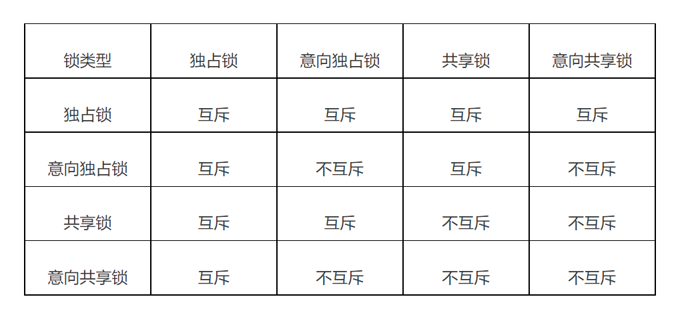

## 8.16 案例实战：线上数据库不确定性的性能抖动优化实践

​	**案例：**执行查询语句的时候，可能会碰到flush链表(脏页)正好在刷入磁盘这个时候需要等待大量脏页flush到磁盘，语句才能执行，几十毫秒的语句可能要好几秒才能执行完成

​	**flush链表(脏页)刷入磁盘的四种场景：**

​	第一种场景：**InnoDB的redo log写满了**。这个时候系统会停止所有更新操作，把checkpoint往前推进，redo log留出空间可以继续写。

​	第二种场景：**系统内存不足，需要新的内存**，当内存不够用的时候就会淘汰一些数据页，空出内存给别的数据页使用。**如果淘汰的是"脏页"，就要先将脏页写到磁盘。**

​	第三种场景：**mysql认为系统"空闲"的时候，会找机会刷"脏页"回磁盘**

​	第四种场景：mysql正常关闭的情况，这个时候会把内存的脏页都flush到磁盘上。

​	**优化方案：**

​	**innodb_io_capacity参数：**相当于告诉InnoDB当前机器的磁盘读写能力，建议设置为磁盘的IOPS。磁盘的IOPS可以通过fio这个工具来测试，下面的语句是可以测试磁盘随机读写的命令：

```shell
 fio -filename=$filename -direct=1 -iodepth 1 -thread -rw=randrw -ioengine=psync -bs=16k -size=500M -numjobs=10 -runtime=10 -group_reporting -name=mytest 

```

​	**innodb_io_capacity没有正确设置的场景：**有一个库Mysql写入很慢，TPS很低，但是数据库主机的IO压力并不大，导致这个问题的原因就是这个参数设置的问题，SSD磁盘才设置了300，导致刷脏页很慢，脏页累积，影响了查询和更新性能。

**PS:脏页比例需要多关注，不能让它经常接近75%**

​	**innodb_flush_neighbors：这个是设置脏页在刷盘的时候是否会将相邻的脏页一起刷入**，为0表示不找邻居，自己刷自己。如果是传统机械硬盘这个参数是有用的，可以减少很多随机IO，如果是SSD的话就可以设置为0，这个时候IOPS不是瓶颈，可以更宽执行必要的刷脏页操作，减少SQL语句的相应时间。(在mysql8.0中这个参数默认是0)

# 9 索引

## 9.1 深入研究索引之前，先来看看磁盘数据页的存储结构

​	**数据页是按顺序一页一页存的，然后两两相邻的数据页之间会采用双向链表的格式互相引用**，一个数据页在磁盘文件就是一段数据，可能是二进制或者别的特殊格式的数据，然后数据页里包含两个指针，一个指向上一个数据页的物理地址，一个指向下一个数据页的物理地址，大致可以认为类似下面这样的数据格式

```
DataPage: xx=xx, xx=xx, linked_list_pre_pointer=15367, linked_list_next_pointer=34126 || DataPage: xx=xx, xx=xx, linked_list_pre_pointer=23789, linked_list_next_pointer=46589 || DataPage: xx=xx, xx=xx, linked_list_pre_pointer=33198, linked_list_next_pointer=55681
```

​	**然后一个数据页内部会存储一行一行的数据，数据页每一行数据都会按照主键大小进行排序**，同时没一行数据都有指针指向下一行数据的位置组成单向链表

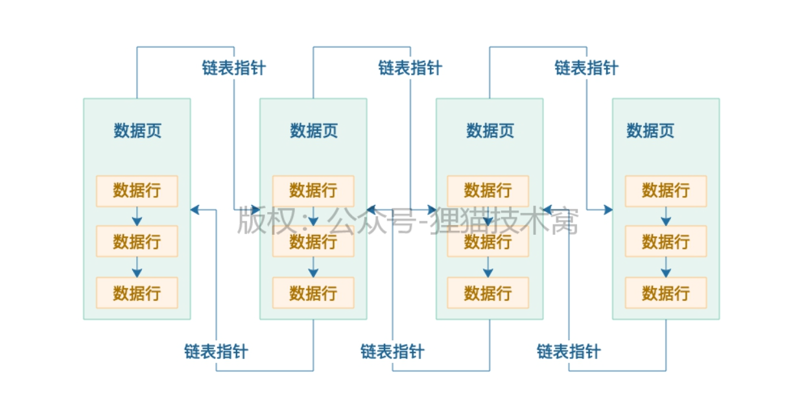

## 9.2 假设没有任何索引，数据库是如何根据查询语句搜索数据的

**数据页：**

​	每个数据页读会有一个页目录，里面根据数据行的主键存放了一个目录，数据行是被分散到不同槽位里去的，每个数据页的目录里，就是这个页每个主键跟所在槽位的映射关系

**主键查找：**

​	到数据页的页目录根据主键进行二分查找，通过二分查找在目录里迅速定位到主键对应的数据是哪个槽位，到对应槽位遍历每一行数据，就能快速找到主键对应的数据。

**全表扫描：**

​	使用非主键而且没有索引查找数据走的就是全表扫描，没有办法根据主键到页目录二分查找，只能进入数据页，根据单向链表依次遍历查找数据


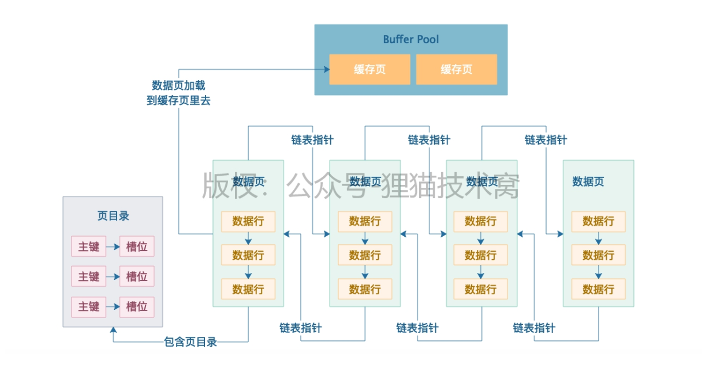

## 9.3  不断在表中插入数据时，物理存储是如何进行页分裂的

**页分裂：**

​	不停往表里插入数据，在同一个数据页插入数据。数据越来越多的情况下，就需要新增一个数据页

​	索引的运作核心是要求后一个数据页的主键的值都大于前面一个数据页的主键值

​	如果主键不是自增的话，可能出现后面的数据页的主键值大于前面的数据页的值

​	页分裂就是在**新增一个数据页时候，会将前一个数据页主键值比较大的挪动到新数据页，新插入主键值比较小的挪动到上一个数据页里去**

​	**页分裂的核心目标就是保证下一个数据页里的数据值都比上一个数据页里的主键值要大**


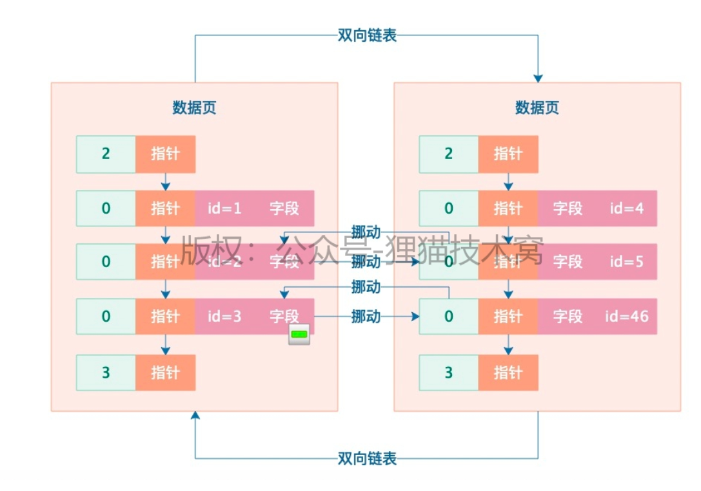

## 9.4 基于主键的索引是如何设计的，以及如何根据主键索引查询

**主键索引：**

​	针对主键的索引实际上就是主键目录

​	**主键目录就是吧每个数据页的页号，还有数据页里最小的主键值放在一起，组成一个索引的目录**

​	然后比对，对应前后数据页目录即能找到对应主键在哪个数据页目录中

​	这个主键目录就可以认为是主键索引


## 9.5 索引的页存储物理结构，是如何用B+树来实现的

**索引B+树：**

​	表里数据很多，几百，上千万，如果主键目录仅存储大量数据页和最小主键值，就需要采用对应策略了

​	对应索引的话，索引其实也是放在数据页里的，**索引放在数据页的话就称为索引页**，假如有很多数据页，对应也可能有很多索引页

​	索引页也会抽出一个索引层级，在**更高索引层级里，保存了每个索引页和索引页的最小主键值**

​	对应层级的**索引页太多的话，就会继续分裂，从而组成b+树的数据结构**


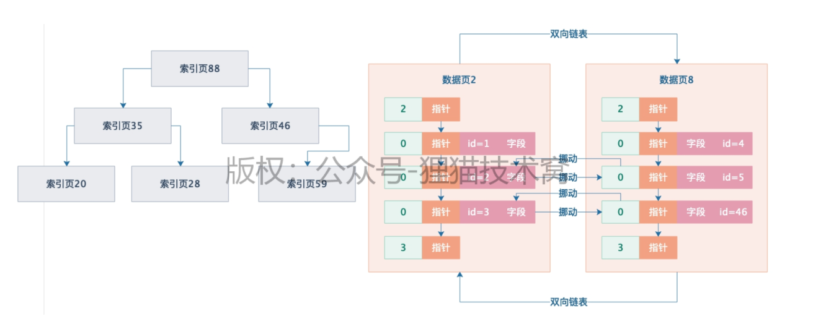

## 9.6 更新数据的时候，自动维护的聚簇索引到底是什么

**聚簇索引：**

​	最下层的索引页，有指针引用数据页

​	索引页自己内部对于一个层级内的索引页，互相之间是基于指针组成双向链表的

​	索引页和数据页综合来看，就是连接在一起的B+树，最底层就是数据页，数据页也就是B+树种的叶子节点

​	**在B+树索引数据结构里，叶子节点就是数据页自己本身，那么此时我们可以称这颗B+树索引为聚簇索引**

​	**Innodb通过主键聚集数据，如果没有定义主键，innodb会选择非空的唯一索引代替。如果没有这样的索引，innodb会隐式的定义一个主键来作为聚簇索引**

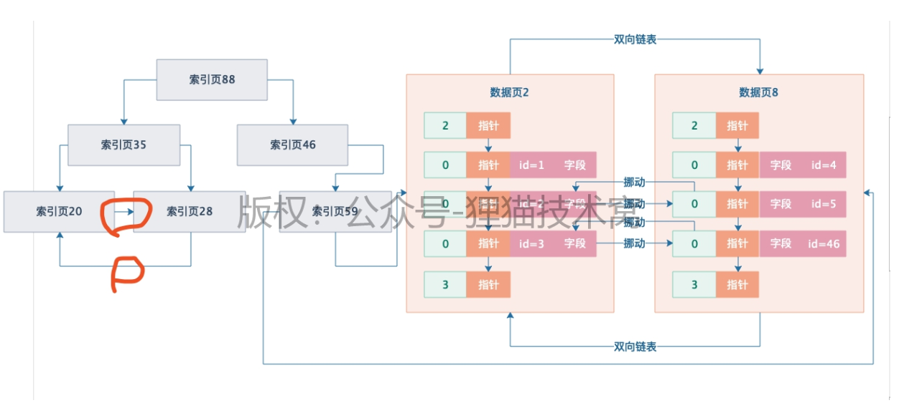

引用：https://www.cnblogs.com/jiawen010/p/11805241.html

## 9.7 针对主键之外的字段建立的二级索引，又是如何运作的

**二级索引/非聚簇索引：**

​	插入数据的时候，一方面会把完整数据插入到聚簇索引的叶子节点的数据页中，维护聚簇索引。同时也会为其他字段建立的索引建立B+树去维护

​	比如基于**name字段建立了索引，就会重新搞一个B+树，B+树的叶子节点也是数据页，但是这个数据页里仅仅放主键字段和name字段**

​	**对应B+树也是基于name的对应属性去排序的(估计是ascii码之类的东西)，和主键索引的逻辑是一样的，区别就是叶子节点存放的数据**

​	根据name建立的二级索引查找数据的话，由于叶子节点只存放了name和主键值，所以要查出其他数据的话，还需要回表，也就是根据主键值再去聚簇索引查，从而得到其他字段的值

​	**联合索引：**name,age两个字段的联合索引，其实和单独的name索引也是一样的，就是叶子节点存放了name,age还有主键值，最左原则，先根据name排序，再根据age排序


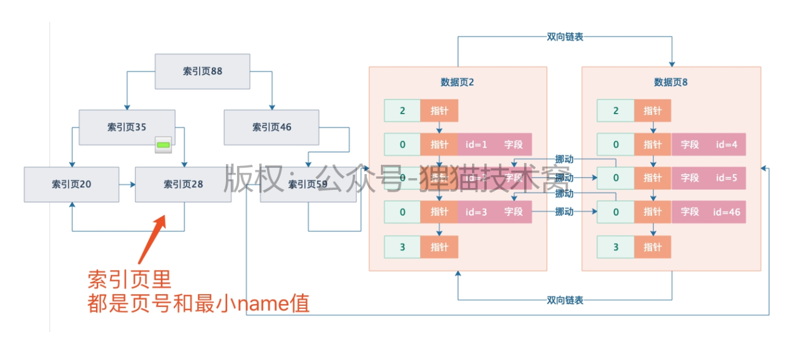

## 9.8 插入数据时到底是如何维护好不同索引的B+树的

**索引流程总结：**

​	1 一个新表最开始就是一个数据页，就是聚簇索引，这个时候还是空的

​	2 插入数据的话，直接在这个数据页插入就好了，没有必要弄什么索引页

​	3 这个初始的数据页就是根页，每个数据页内部默认都有一个基于主键的页目录，此时根据主键搜索是没问题的

​	4 数据变多了，数据页满了，就会新增两个数据页，将根页的数据根据主键值的大小开分配到这两个数据页，第二个数据页主键值都大于第一个

​	5 这个时候根页就升级为索引页，存放了两个数据页的页号和对应里面的最小的主键值

​	6 数据再多的话，索引页也满了，索引页也会分裂新增两个，然后上一个升级为这两个的上级索引页，以此类推

​	7 这个就是增删改的时候，整个聚簇索引维护的过程，二级索引也是类似的原理

​	**PS:比如name索引，二级索引的索引页除了存放name之外还要存放对应主键值，因为最小name一样的话，这个时候就需要根据主键判断一下**
​	

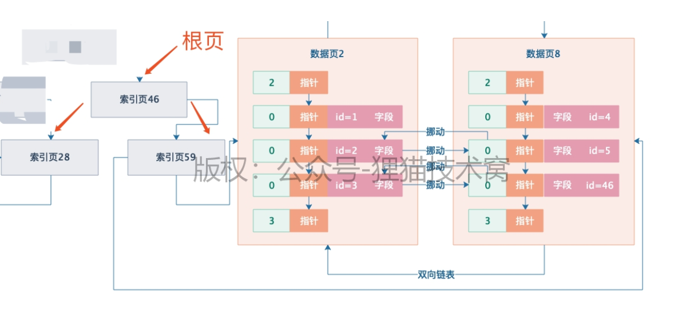

## 9.9  一个表里是不是索引搞的越多越好？那你就大错特错了

**索引的缺点：**

​	**主要是两个缺点，一个是空间上的，一个是时间上的**

​	空间上给很对字段创建很多索引，必然会有很多棵索引B+树，会**占用很多磁盘空间**

​	时间上，不停的插入入数据，各个索引的数据页就要不停的分裂，不停的增加新的索引页，这个过程是都是**耗费时间的**

​	**总计：一个表索引太多，会导致增删改的性能比较差，虽然查询速度能提高，但是增删改的性能会收到影响**


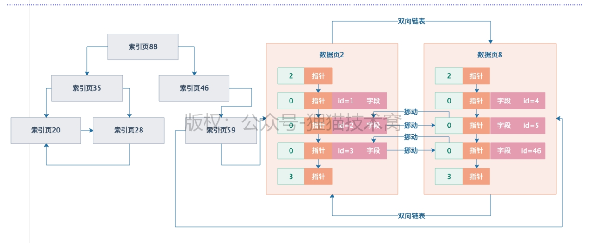

## 9.10 通过一步一图来深入理解联合索引查询原理以及全值匹配规则

**联合索引查询原理：**

​	1 假设 班级 姓名 科目 3个字段为联合索引

​	2 根据最左原则，索引的索引页内部按照班级、姓名、科目 这个顺序排序，前一个字段相同就按照后面一个字段排序(全部相同就根据主键排序)

​	3 如果是等值查询，根据全值匹配，然后二分查找最终就找到索引页对应的值，然后再根据主键回表得出数据


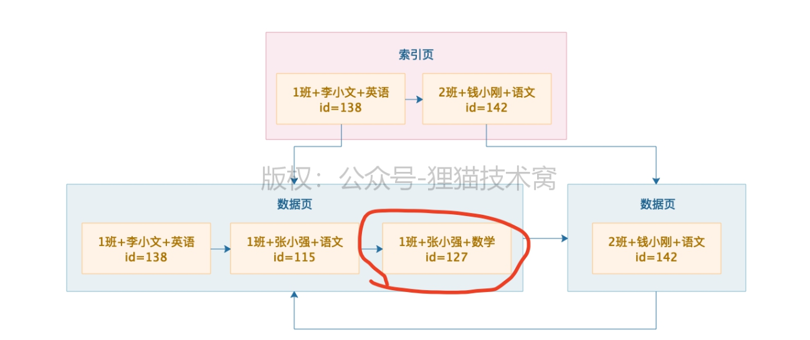

## 9.11 再来看看几个最常见和最基本的索引使用规则

**联合索引相关匹配规则**

**等值匹配规则：**where语句中的几个字段名称和联合索引完全一样，而且都是基于等号的等值匹配，这个百分比会用上该联合索引(语句的前后顺序无所谓)

**最左列匹配：**联合索引必须有最左列的字段去查询才会用到，非最左列的字段不用也没关系

**最左前缀匹配原则：**如果用like语法查，like 'xx%'根据xx打头的查询也是可以使用索引的，如果是'%xx%'或者'%xx'则用不了索引

**范围查找规则：**如果联合索引靠左的字段使用了范围查询，那么后续字段就没法再通过索引定位了，只有靠左的字段才能通过索引查询

**等值匹配+范围匹配规则：**最左的等值匹配，最左的后一个范围匹配，这两个都可以通过索引。如果再后一个就走不了索引了。

## 9.12 当我们在SQL里进行排序的时候，如何才能使用索引

**order by的工作原理**

​	**sort_buffer:Mysql会给每个线程分配一块内存用于排序**

​	**全字段排序：**

​		1 初始化sort_buffer，

​		2 根据条件查询数据找到第一个满足的(这个过程可以是索引，或者其他过程)，

​		3 放入全字段(selct...from中的需要的字段)，

​		4 重复前面两个步骤直到找不到满足条件的为止，

​		5 对sort_buffer中的数据按照order by的字段进行排序

​	**排序这个动作，可能在内存中完成，也可能使用外部排序(磁盘临时文件辅助排序)，取决与排序所需的内存和参数sort_buffer_size**

**Extra这个字段中的“Using filesort”表示的就是需要排序**

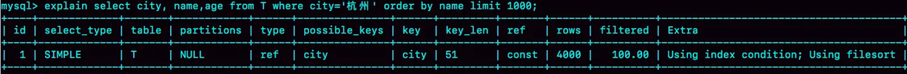

​	**rowid排序：**

​		全字段排序字段太多，或者长度太大，**单行很大，内存放不下，这个时候Mysql认为单行长度太大就会采用rowid排序**

​		max_length_for_sort_data，是MySQL中专门控制用于排序的行数据的长度的一个参数。它的意思是，如果单行的长度超过这个值，MySQL就认为单行太大，要换一个算法

​		**rowid排序只需要排序的列和主键id，放入sort_buffer，不需要全字段都放进去**

​		流程和全字段排序一致，不过最后返回数据的时候，需要再次回表根据排序完成后的结果根据主键获取数据返回

**结论：**

​	mysql如果担心内存太小就会使用rowid排序算法，可以在排序过程排序更多行

​	认为内存足够大就优先选择全字段排序，可以直接内存返回查询结果，不需要再回原表取数据

​	**MYSQL设计思想：如果内存够，就要多利用内存，尽量减少磁盘访问**

**直接根据索引排序/无需排序：**

​	**排序字段为索引的话直接根据索引顺序取值即可，这个过程不需要sort_buffer，不需要额外排序**

​	可以看到，Extra字段里面多了“Using index”没有“Using filesor”，表示的就是使用了覆盖索引，走索引，不用额外排序，性能上会快很多。

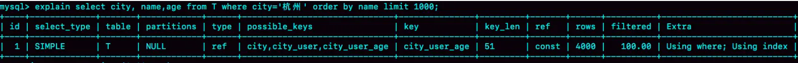

**引用：**mysql45讲-16讲“orderby”是怎么工作的

## 9.13 当我们在SQL里进行分组的时候，如何才能使用索引

**group by 执行流程**

​	1 创建内存临时表，放入返回字段
​	2 依次取出节点的值，临时表有就加一行
​	3 没有的话，然后根据聚合函数来计算，更新聚合函数的字段的值
​	4 遍历完成后，根据group by的对应字段排序

​	**PS:需要对结果进行排序，那你可以在SQL语句末尾增加order by null，这样可以跳过最后排序阶段，直接返回结果数据**

**group by 优化方法 --索引**

​	对应group by的字段如果是索引的话，就可以直接根据索引顺序扫描，依次根据聚合函数计算，不用临时表了

​	**PS:group by 需要临时表的原因是，取出的数据是无序的，所以需要根据临时表记录统计结果，如果扫描过程可以保证出现的数据是有序的，就不用临时表了(相同数据都在一起，自然不需要额外记录)**

**group by优化方法 --直接排序**

​	一个group by语句中需要放到临时表上的数据量特别大，却还是要按照“先放到内存临时表，插入一部分数据后，发现内存临时表不够用了再转成磁盘临时表”，看上去就有点儿傻

​	group by语句中加入SQL_BIG_RESULT这个提示（hint），就可以告诉优化器：这个语句涉及的数据量很大，请直接用磁盘临时表

```sql
	select SQL_BIG_RESULT id%100 as m, count(*) as c from t1 group by m;
```

**generated column机制**

在MySQL 5.7版本支持了generated column机制，用来实现列数据的关联更新。你可以用下面的方法创建一个列z，然后在z列上创建一个索引（如果是MySQL 5.6及之前的版本，你也可以创建普通列和索引，来解决这个问题）。

```sql
alter table t1 add column z int generated always as(id % 100), add index(z);
```

**引用：**mysql45讲-37讲什么时候会使用内部临时表

## 9.14 回表查询对性能的损害以及覆盖索引是什么

**覆盖索引：**

​	**覆盖索引不是一种索引，是一种基于索引查询的方式**

​	**含义就是不用回表去查询数据了，直接将索引内的数据直接返回即可(一般为联合索引的相关值也是返回需要的字段，直接返回即可)**

​	如果回表的次数太多的话，可能直接走全表扫描就不会走索引了

​	需要回表的话，也尽可能用limit where之类的语句限制回表的次数

## 9.15 设计索引的时候，我们一般要考虑哪些因素呢

**原则1：**

​	**针对SQL语句里的where条件、order by根据哪些字段排序，group by根据哪些字段分组聚合**

​	比如设计两到三个联合索引，覆盖where a=? and b=?，order by a,b，group by a这些部分

**原则2：**

​	**一般建立索引，尽量使用基数比较大的字段，就是值比较多的字段，才能发挥出B+树快速二分查找的优势(比如状态只有0,1这种字段及时基数很小的字段，不适合建索引，没有意义)**

​	字段的类型比较小的列来设计索引，比如tinyint之类的，磁盘空间占用小，搜索性能会更好

PS:联合索引靠左的字段可以是最常用的，也最好是基数较大的字段，才能发挥索引的优势

​	**前缀索引：**

​		如果有varchar(255)这种字段的所有，值太大，放在索引树太占用磁盘空间，可以设计KEY my_index(name(20),age,course)，就这样的一个形式，索引只提取前20个字符

​		**前缀索引只有在where条件生效，如果是order by,group by这种，前缀索引就用不了了**	

**原则3：**

​		**如果再查询语句添加了函数或者计算，索引就用不上了，比如where function(a) = xx**

​		**一般设计索引别太多，建议两三个联合索引就应该覆盖掉你这个表的全部查询了**

​		**主键一定是自增的，别用UUID之类的**，因为主键自增，那么起码你的聚簇索引不会频繁的分裂，主键值都是有序的，就会自然的新增一个页而已，但是如果你用的是UUID，那么也会导致聚簇索引频繁的页分裂

## 9.16 案例实战：陌生人社交APP的MySQL索引设计实战

**案例：**

​	陌生人社交核心就是用户信息，通过用户信息等一系列条件去筛选好友，核心表就是用户信息表，比如user_info

​	字段大概为：大致会包含你的地区（你在哪个省份、哪个城市，这个很关键，否则不在一个城市，可能线上聊的好，线下见面的机会都没有），性别，年龄，身高，体重，兴趣爱好，性格特点，还有照片，当然肯定还有最近一次在线时间、用户评分等)

​	假设你的SQL需要按照年龄进行范围筛选，同时需要按照用户的评分进行排序，类似下面的

```sql
select xx from user_info where age between 20 and 25 order by score
```

​	**问题：**age在最左侧，那你的where是可以用上索引来筛选的，但是排序是基于score字段，那就不可以用索引了。那假设你针对age和score分别设计了两个索引，但是在**你的SQL里假设基于age索引进行了筛选，是没法利用另外一个score索引进行排序的。**

​	**往往在类似这种SQL里，你的where筛选和order by排序实际上大部分情况下是没法都用到索引的**

**索引设计：**

​	where和order by出现索引设计冲突,往往都是让where条件去使用索引来快速筛选出来一部分指定的数据，接着再进行排序，最后针对排序后的数据拿出来一页数据

​	where条件去设计索引的话，首先应该在联合索引里包含省份、城市、性别，这三个字段(业务搜索里几乎必定包含的三个字段)

```sql
（province, city, sex）
-- 年龄是在业务上是范围匹配，所以放在最后才能包装前面的字段可以用上索引
（province, city, sex, hobby, character, age）
-- 如果有其他业务，比如7天内是否登录，可以额外设计一个业务字段，给状态码是否登录，不用走sql的时间判断，这样就可以全部走索引了
（province, city, sex, hobby, character, does_login_in_latest_7_days, age）
-- 如果有其他业务，就需要这两个基数第的字段筛选，也可以设计辅助索引
（sex, score）
```

**核心重点就是，尽量利用一两个复杂的多字段联合索引，抗下你80%以上的 查询，然后用一两个辅助索引抗下剩余20%的非典型查询，保证你99%以上的查询都能充分利用索引，就能保证你的查询速度和性能！**

# 10 执行计划

## 10.1 提纲挈领的告诉你，SQL语句的执行计划和性能优化有什么关系

​	基础的以及日常的SQL优化就是设计好索引，让一般不太复杂的普通查询都用上索引，但是针对复杂表结构和大数据量的上百行复杂SQL的优化，必须得建立在你先懂这个复杂SQL是怎么执行

​	你有那么多的数据表，每个表都有一个聚簇索引，聚簇索引的叶子就是那个表的真实数据，同时每个表还设计了一些二级索引，那么上百行的复杂SQL跑起来的时候到底是如何使用各个索引，如何读取数据的

​	这个SQL语句（不管是简单还是复杂），**在实际的MySQL底层，针对磁盘上的大量数据表、聚簇索引和二级索引，如何检索查询，如何筛选过滤，如何使用函数，如何进行排序，如何进行分组，到底怎么能把你想要的东西查出来，这个过程就是一个很重要的东西：执行计划！**

​	也就是说，每次你提交一个SQL给MySQL，他内核里的查询优化器，都会针对这个SQL语句的语义去生成一个执行计划，这个执行计划就代表了，他会怎么查各个表，用哪些索引，如何做排序和分组

​	看懂执行计划之后，还能根据他的实际情况去想各种办法改写你的SQL语句，改良你的索引设计，进而优化SQL语句的执行计划，最终让SQL语句的性能得到提升，这个就是所谓的SQL调优

## 10.2 以MySQL单表查询来举例，看看执行计划包含哪些内容

**const:查询条件为主键索引或者二级索引为唯一索引的查询语句**

```sql
select * from table where id=x
-- 或者
select * from table where name=x
```

**ref:查询条件为普通的二级索引，不是唯一索引的查询语句**

```sql
-- 然后索引可能是个KEY(name,age,xx)
select * from table where name=x and age=x and xx=xx，
```

**ref_or_null：针对一个二级索引同时比较了一个值还有限定了IS NULL/IS NOT NULL(mysql唯一索引是可以为null的，唯一索引IS NULL查询会走ref)**

```sql
select * from table where name=x or name IS NULL
```

**eq_ref:**在连接查询时，针对被驱动表如果基于主键进行等值匹配，那么他的查询方式就是eq_ref了

**range:范围查找索引(>=或<=)**

**index:index就是联合索引没有用到最左的字段，所以需要全量搜索联合索引，并且返回值也是联合索引里的不需要回表**

**index_merge:有一些特殊场景下针对单表查询可能会基于多个索引提取数据后进行合并**

## 10.3 再次重温写出各种SQL语句的时候，会用什么执行计划

**情况1：**

​	**查询中不同条件对应多个索引，会选择哪个？**

​	**一般来说，mysql负责生成执行计划的查询优化器，选择索引里扫描行数较少的那个条件**

​	然后选择行数较少的索引，根据索引找到对应数据，然后做回表找到完整数据，然后加载到内存中根据其他的条件过滤，最好得到结果

```sql
select * from table where x1=xx and x2>=xx
```

**情况2：**

​	**一般来说一个SQL语句只会用到一个二级索引，但是有一些特殊情况，可能对一个SQL语句用到多个二级索引。**

​	**如果x1和x2分别有一个索引，也可能执行计划会分别对x1和x2两个索引树取数据，然后根据两波数据根据主键取交集**

​	根据索引也取出大量数据(比如上万条)，大量数据回表筛选效率太低，就可能取交集减少回表次数

```sql
select * from table where x1=xx and x2=xx
```

**PS:intersection交集、union并集**

## 10.4 深入探索多表关联的SQL语句到底是如何执行的

**驱动表**

```sql
select * from t1,t2 where t1.x1=xxx and t1.x2=t2.x2 and t2.x3=xxx
```

​	先从一个表里查一波数据，这个表叫做“驱动表”，再根据这波数据去另外一个表里查一波数据进行关联，另外一个表叫做“被驱动表”

​	多表关联Join，本质其实就是先查一个驱动表，接着根据连接条件去被驱动表里循环查询

**straight_join**

​	两个表都有一个主键索引id和一个索引a，字段b上无索引。存储过程idata()往表t2里插入了1000行数据，在表t1里插入的是100行数据

```sql
select * from t1 straight_join t2 on (t1.a=t2.a);
```

​	直接使用join语句，MySQL优化器可能会选择表t1或t2作为驱动表，这样会影响我们分析SQL语句的执行过程。所以，为了便于分析执行过程中的性能问题，**straight_join让MySQL使用固定的连接方式执行查询，这样优化器只会按照我们指定的方式去join**。在这个语句里，t1 是驱动表，t2是被驱动表。

**Index Nested-Loop Join(NLJ)**

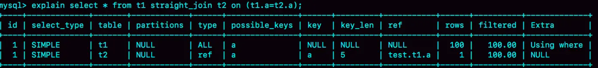
	

​	**这个过程是先遍历表t1，然后根据从表t1中取出的每行数据中的a值，去表t2中查找满足条件的记录**。在形式上，这个过程就跟我们写程序时的嵌套查询类似，并且可以用上被驱动表的索引，**所以我们称之为“Index Nested-Loop Join”，简称NLJ。**

**Simple Nested-Loop Join**

```sql
select * from t1 straight_join t2 on (t1.a=t2.b);
```

​	由于表t2的字段b上**没有索引**，因此再执行流程时**，每次到t2去匹配的时候，就要做一次全表扫描**。

​	**MySQL也没有使用这个Simple Nested-Loop Join算法，而是使用了另一个叫作“Block Nested-Loop Join”的算法，简称BNL。**

类似下图逻辑，根据t1表所有数据，去查t2满足条件的数据

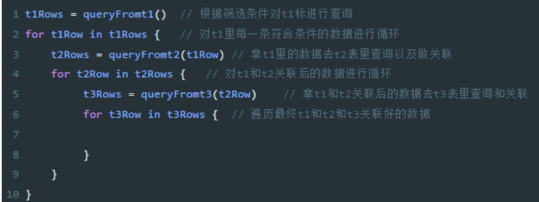

**Block Nested-Loop Join（BNL）**

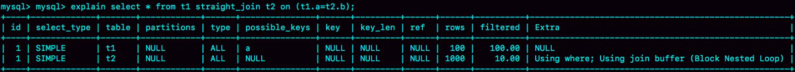

​	1 把表t1的数据读入线程**内存join_buffer中**，由于我们这个语句中写的是select *，因此是把整个表t1放入了内存

​	2 扫描表t2，把表**t2中的每一行取出来，跟join_buffer中的数据做对比，满足join条件的，作为结果集的一部分返回。**

​	可以看到，在这个过程中，对表t1和t2都做了一次全表扫描，因此总的扫描行数是1100。由于join_buffer是以无序数组的方式组织的，因此对表t2中的每一行，都要做100次判断，总共需要在内存中做的判断次数是：100*1000=10万次。

​	**PS:从时间复杂度上来说，BNL和SNL这两个算法是一样的。但是，Block Nested-Loop Join算法的这10万次判断是内存操作，速度上会快很多，性能也更好。**

**join_buffer扩展**

​	**join_buffer的大小是由参数join_buffer_size设定的，默认值是256k。如果放不下表t1的所有数据话，策略很简单，就是分段放。我把join_buffer_size改成1200，再执行**

**问题及解释：**

**1 能不能使用join语句**

​	如果可以使用Index Nested-Loop Join算法，也就是说可以用上被驱动表上的索引，其实是没问题的；

​	如果使用Block Nested-Loop Join算法，扫描行数就会过多。尤其是在大表上的join操作，这样可能要扫描被驱动表很多次，会占用大量的系统资源。所以这种join尽量不要用。

**2 如果要使用join，应该选择大表做驱动表还是选择小表做驱动表**

​	如果是Index Nested-Loop Join算法，应该选择小表做驱动表；

​	如果是Block Nested-Loop Join算法：

​	在join_buffer_size足够大的时候，是一样的；

​	在join_buffer_size不够大的时候（这种情况更常见)，应该选择小表做驱动表。

​	**所以，这个问题的结论就是，总是应该使用小表做驱动表。**

**PS:在决定哪个表做驱动表的时候，应该是两个表按照各自的条件过滤，过滤完成之后，计算参与join的各个字段的总数据量，数据量小的那个表，就是“小表”，应该作为驱动表。**

**结论1：**

​	使用join语句，性能比强行拆成多个单表执行SQL语句的性能要好；

​	如果使用join语句的话，需要让小表做驱动表。

​	结论的前提是“可以使用被驱动表的索引”。

**Multi-Range Read(MRR)**

​	这个优化的主要目的是尽量使用顺序读盘，**因为大多数的数据都是按照主键递增顺序插入得到的，所以我们可以认为，如果按照主键的递增顺序查询的话，对磁盘的读比较接近顺序读，能够提升读性能。**

执行流程

1. 根据索引a，定位到满足条件的记录，将id值放入read_rnd_buffer中;

2. 将read_rnd_buffer中的id进行递增排序；

3. 排序后的id数组，依次到主键id索引中查记录，并作为结果返回

   

```
--  评稳定地使用MRR优化的话，需要设置
set optimizer_switch="mrr_cost_based=off
-- （官方文档的说法，是现在的优化器策略，判断消耗的时候，会更倾向于不使用MRR，把mrr_cost_based设置为off，就是固定使用MRR了）
```

**PS:，read_rnd_buffer的大小是由read_rnd_buffer_size参数控制的。如果步骤1中，read_rnd_buffer放满了，就会先执行完步骤2和3，然后清空read_rnd_buffer。之后继续找索引a的下个记录，并继续循环。**

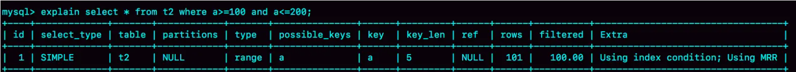

​	explain结果中，我们可以看到Extra字段多了Using MRR，表示的是用上了MRR优化。而且，由于我们在read_rnd_buffer中按照id做了排序，所以最后得到的结果集也是按照主键id递增顺序的

​	**MRR能够提升性能的核心**在于，这条查询语句在索引a上做的是一个范围查询（也就是说，这是一个多值查询），可以得到足够多的主键id。这样通过排序以后，再去主键索引查数据，才能体现出“顺序性”的优势。

**Batched Key Access(BKA)**

​	MySQL在5.6版本后开始引入的Batched Key Acess(BKA)算法了。这个**BKA算法，其实就是对NLJ算法的优化**。

​	NLJ算法执行的逻辑是：从驱动表t1，一行行地取出a的值，再到被驱动表t2去做join。也就是说，对于表t2来说，每次都是匹配一个值。这时，MRR的优势就用不上了

流程：

​	1 **从表t1里一次性地多拿些行出来，一起传给表t2**

​	2 表t1的数据取出来一部分，先放到一个临时内存。这个临时内存不是别人，就是join_buffer

​	3 道join_buffer 在BNL算法里的作用，是暂存驱动表的数据。但是在NLJ算法里并没有用。那么，我们刚好就可以复用join_buffer到BKA算法中

​	4 如果join buffer放不下P1~P100的所有数据，就会把这100行数据分成多段执行

```
-- 启用BKA
-- 前两个参数的作用是要启用MRR。这么做的原因是，BKA算法的优化要依赖于MRR
set optimizer_switch='mrr=on,mrr_cost_based=off,batched_key_access=on';
```

**BNL的问题**

1. 可能会多次扫描被驱动表，占用磁盘IO资源；
2. 判断join条件需要执行M*N次对比（M、N分别是两张表的行数），如果是大表就会占用非常多的CPU资源；
3. 可能会导致Buffer Pool的热数据被淘汰，影响内存命中率。

**BNL转BKA**

​	可以直接在被驱动表上建索引，这时就可以直接转成BKA算法了

​	**问题：表t2的字段b上创建索引会浪费资源，但是不创建索引的话这个语句的等值条件要判断10亿次，想想也是浪费。那么，有没有两全其美的办法呢？**

​	**方案：我们可以考虑使用临时表。使用临时表的大致思路是：**

1. 把表t2中满足条件的数据放在临时表tmp_t中；
2. 为了让join使用BKA算法，给临时表tmp_t的字段b加上索引；
3. 让表t1和tmp_t做join操作。

此时，对应的SQL语句的写法如下：

```sql
create temporary table temp_t(id int primary key, a int, b int, index(b))engine=innodb;
insert into temp_t select * from t2 where b>=1 and b<=2000;
select * from t1 join temp_t on (t1.b=temp_t.b);
-- join语句，扫描表t1，这里的扫描行数是1000；join比较过程中，做了1000次带索引的查询。相比于优化前的join语句需要做10亿次条件判断来说，这个优化效果还是很明显的。
```

​	总体来看，不论是在原表上加索引，还是用有索引的临时表，我们的思路都是让join语句能够用上被驱动表上的索引，来触发BKA算法，提升查询性能。

**扩展hash-join**

​	如果join_buffer里面维护的不是一个无序数组，而是一个哈希表的话，那么就不是10亿次判断，而是100万次hash查找。这样的话，整条语句的执行速度就快多了吧

​	MySQL的优化器和执行器：不支持哈希join

这个优化思路，我们可以自己实现在业务端。实现流程大致如下：

1. `select * from t1;`取得表t1的全部1000行数据，在业务端存入一个hash结构，比如C++里的set、PHP的dict这样的数据结构。
2. `select * from t2 where b>=1 and b<=2000;` 获取表t2中满足条件的2000行数据。
3. 把这2000行数据，一行一行地取到业务端，到hash结构的数据表中寻找匹配的数据。满足匹配的条件的这行数据，就作为结果集的一行。

理论上，这个过程会比临时表方案的执行速度还要快一些

**结论2：**

​	BKA优化是MySQL已经内置支持的，建议默认使用；

​	**BNL算法效率低，建议你都尽量转成BKA算法。优化的方向就是给被驱动表的关联字段加上索引；**

​	基于临时表的改进方案，对于能够提前过滤出小数据的join语句来说，效果还是很好的；

​	**MySQL目前的版本还不支持hash join，但你可以配合应用端自己模拟出来，理论上效果要好于临时表的方案。**

引用：mysql45讲-34讲到底可不可以使用join

引用：mysql45讲-35讲join语句怎么优化

## 10.5 MySQL是如何根据成本优化选择执行计划的

**成本计算大致方法：**

​	磁盘读数据到内存就是IO成本，一页的成本的约定为1.0

​	数据做一些运算，比如验证他是否符合搜索条件了，或者是搞一些排序分组之类的事，这些都是耗费CPU资源的，属于CPU成本，一般约定读取和检测一条数据是否符合条件的成本是0.2
​	

```
show table status like "表名"
--查看表相关统计数据
-- rows就是表里的记录数，data_length就是表的聚簇索引的字节数大小
```

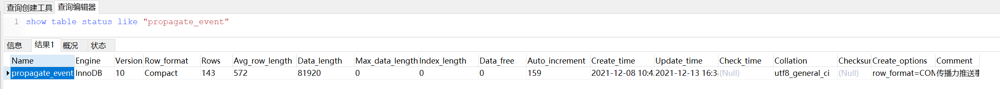

​	用data_length除以1024就是kb为单位的大小，然后再除以16kb（默认一页的大小），就是有多少页，此时知道数据页的数量和rows记录数，就可以计算全表扫描的成本了

​	**IO成本就是：数据页数量 * 1.0 + 微调值，CPU成本就是：行记录数 * 0.2 + 微调值，他们俩相加，就是一个总的成本值，比如你有数据页100个，记录数有2万条，此时总成本值大致就是100 + 4000 = 4100，在这个左右(这是全表扫描的成本)。**

**索引的成本计算方法**

​	1 二级索引读取的IO成本：name值在25~100，250~350两个区间，那么就是两个范围，否则name=xx就仅仅是一个范围区间。一个范围区间就粗暴的认为等同于一个数据页

​	**2 二级索引里读取符合条件的数据的成本：**

​		二级索引数据页到内存成本，这个IO成本都会预估的很小，可能就是1 * 1.0 = 1，或者是n * 1.0 = n，基本就是个位数这个级别

​		比如估算可能会查到100条数据，此时从二级索引里查询数据的CPU成本就是100 * 0.2 + 微调值，总之就是20左右而已

​		回表到聚簇索引里去查询完整数据，1条数据就得回表到聚簇索引查询一个数据页，也就是100 * 1.0 + 微调值，大致是100左右

​		拿到这100条数据的完整值了，此时就可以针对这100条数据去判断，里耗费的CPU成本就是100 * 0.2 + 微调值，就是20左右

上面的所有成本都加起来，就是1 + 20 + 100 + 20 = 141，这就是使用一个索引进行查询的成本的计算方法

​	全表扫描发现成本是4100左右，这次根据索引查找可能就141，一般就会针对全表扫描和各个索引的成本，都进行估算，然后比较一下，选择一个成本最低的执行计划。

**执行计划选择：**

​	主要就是对这个表的多种访问方式（全表查询 ，各个索引查询）来根据一定的公式计算出来每种访问方式的成本，接着选择一个成本最低的访问方式，那么就可以确定下来这个表怎么访问了

​	查询执行之前，就可以针对不同的访问方法精准计算他的成本，那是根本不现实的，只能大致估算一下

​	多表查询的执行计划选择思路，基本跟单表查询的执行计划选择思路是类似的

```sql
select * from t1 join t2 on t1.x1=t2.x1 where t1.x2=xxx and t1.x3=xxx and t2.x4=xxx and t2.x5=xxx
-- 选择一个针对t1表的最佳访问方式，用最低成本从t1表里查出符合条件的数据来，接着就根据这波数据得去t2表里查数据
-- ，针对t2表的全表扫描以及基于x4、x5、x1几个字段不同索引的访问的成本，挑选一个成本最低的方法，然后从t2表里把数据给查找出来，就可以，这就完成了多表关联
```

## 10.6  MySQL是如何基于各种规则去优化执行计划的

**优化器修改SQL:**

​	**情况1-常量替换：**

​		SQL里有很多括号，那么无关紧要的括号他会给你删除了，其次比如你有类似于i = 5 and j > i这样的SQL，就会改写为i = 5 and j > 5

​		(x = y and y = k and k = 3这样的SQL，都会给你优化成x = 3 and y = 3 and k = 3)

​		(么b = b and a = a这种,是没意义的，就直接给你删了)

​	**情况2-子查询优化(临时表)：**

```sql
select * from t1 where x1 in (select x2 from t2 where x3=xxx)
```

​		**执行子查询，也就是select x2 from t2 where x3=xxx这条SQL语句，把查出来的数据都写入一个临时表里，也可以叫做物化表**

​		临时表(一般是内存中，内存临时表不够放则放入磁盘)，临时表会有索引

​		**优化点：根据临时表的数据根据索引筛选出结果，再看结果值是否在t1表的x1索引树里，如果再就符合条件了**

​		(如果是t1和子查询都全表扫描，不优化，效率就很低了)

​	**情况3-semi join(半连接)：**

```sql
select * from t1 where x1 in (select x2 from t2 where x3=xxx)
-- 底层把他转化为一个半连接，有点类似于下面的样子
select t1.* from t1 semi join t2 on t1.x1=t2.x2 and t2.x3=xxx
```

​		**Mysql并没有提供semi join这种语法，这是MySQL内核里面使用的一种方式**

​		semi join的语义，是和IN语句+子查询的语义完全一样的

​		对于t1表而言，只要在t2表里有符合t1.x1=t2.x2和t2.x3=xxx两个条件的数据就可以了，就可以把t1表的数据筛选出来了

​		**semi join我们这里就是简单提一下概念就行了，但是他还有很多适用场景和不适用场景**

​	**经验：**

​		互联网公司里，我们比较崇尚的是尽量写简单的SQL，复杂的逻辑用Java系统来实现就可以了，SQL能单表查询就不要多表关联，能多表关联就尽量别写子查询，能写几十行SQL就别写几百行的SQL，多考虑用Java代码在内存里实现一些数据就的复杂计算逻辑，而不是都放SQL里做

​		一般的系统，只要你SQL语句尽量简单，然后建好必要的索引，每条SQL都可以走索引，数据库性能往往不是什么大问题

## 10.7 透彻研究通过explain命令得到的SQL执行计划

```sql
-- SQL前面加一个explain命令，就可以轻松拿到这个SQL语句的执行计划
explain select * from table

```

执行计划显示信息

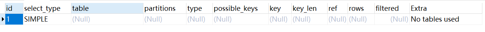

**id:选择标识符**

​	SQL里可能会有很多个SELECT，也可能会包含多条执行计划，每一条执行计划都会有一个唯一的id(也就是一个select对应一个id)

**select_type:表示查询的类型**

​	(1) SIMPLE(简单SELECT，不使用UNION或子查询等)

​	(2) PRIMARY(子查询中最外层查询，查询中若包含任何复杂的子部分，最外层的select被标记为PRIMARY)

​	(3) UNION(UNION中的第二个或后面的SELECT语句)

​	(4) DEPENDENT UNION(UNION中的第二个或后面的SELECT语句，取决于外面的查询)

​	(5) UNION RESULT(UNION的结果，union语句中第二个select开始后面所有select)

​	(6) SUBQUERY(子查询中的第一个SELECT，结果不依赖于外部查询)

​	(7) DEPENDENT SUBQUERY(子查询中的第一个SELECT，依赖于外部查询)

​	(8) DERIVED(派生表的SELECT, FROM子句的子查询)

​	(9) UNCACHEABLE SUBQUERY(一个子查询的结果不能被缓存，必须重新评估外链接的第一行)

**table:输出结果集的表**


**partitions:匹配的分区**


**type:表示表的连接类型**

​	对表访问方式，表示MySQL在表中找到所需行的方式，又称“访问类型”。

​	常用的类型有： **ALL、index、range、 ref、eq_ref、const、system、NULL（从左到右，性能从差到好）**

​	ALL：Full Table Scan， MySQL将遍历全表以找到匹配的行

​	index: Full Index Scan，index与ALL区别为index类型只遍历索引树

​	range:只检索给定范围的行，使用一个索引来选择行

​	ref: 表示上述表的连接匹配条件，即哪些列或常量被用于查找索引列上的值

​	eq_ref: 类似ref，区别就在使用的索引是唯一索引，对于每个索引键值，表中只有一条记录匹配，简单来说，就是多表连接中使用primary key或者 unique key作为关联条件

​	const、system: 当MySQL对查询某部分进行优化，并转换为一个常量时，使用这些类型访问。如将主键置于where列表中，MySQL就能将该查询转换为一个常量，system是const类型的特例，当查询的表只有一行的情况下，使用system

​	NULL: MySQL在优化过程中分解语句，执行时甚至不用访问表或索引，例如从一个索引列里选取最小值可以通过单独索引查找完成。

**possible_keys:表示查询时，可能使用的索引**

​	有两个索引，一个是KEY(x1, x2, x3)，一个是KEY(x1, x2, x4)，此时要是在where条件里要根据x1和x2两个字段进行查询，那么此时明显是上述两个索引都可以使用的，那么到底要使用哪个呢

​	通过成本优化方法，去估算使用两个索引进行查询的成本，看使用哪个索引的成本更低，那么就选择用那个索引，最终选择的索引，就是执行计划里的key这个字段的值了

**key:表示实际使用的索引**

​	**key列显示MySQL实际决定使用的键（索引），必然包含在possible_keys中**

​	如果没有选择索引，键是NULL。要想强制MySQL使用或忽视possible_keys列中的索引，在查询中使用FORCE INDEX、USE INDEX或者IGNORE INDEX。

**key_len:索引字段的长度**

​	当你在key里选择使用某个索引之后，那个索引里的最大值的长度是多少，这个就是给你一个参考，大概知道那个索引里的值最大能有多长

**ref:列与索引的比较**

​	查询方式是索引等值匹配的时候，比如const、ref、eq_ref、ref_or_null这些方式的时候，此时执行计划的ref字段告诉你的就是：你跟索引列等值匹配的是什么？是等值匹配一个常量值？还是等值匹配另外一个字段的值

**rows:扫描出的行数(估算的行数)**

​	就是说你使用指定的查询方式，会查出来多少条数据

**filtered:按表条件过滤的行百分比**

​	在查询方式查出来的这波数据里再用上其他的不在索引范围里的查询条件，又会过滤出来百分之几的数据

**Extra:执行情况的描述和说明**

​	**Using index：**如果没有回表操作，仅仅在二级索引里执行，那么extra是Using index

​	**Using index condition：**查询的列不全在索引中，先查索引返回结果，再用其他条件去筛选出结果

```sql
SELECT * FROM t1 WHERE x1 > 'xxx' AND x1 LIKE '%xxx'
-- 此时他会先在二级索引index_x1里查找，查找出来的结果还会额外的跟x1 LIKE '%xxx'条件做比对，如果满足条件的才会被筛选出来
```

​	**Using where:**一般是见于你直接针对一个表扫描，没用到索引，然后where里好几个条件，就会告诉你Using where，或者是你用了索引去查找，但是除了索引之外，还需要用其他的字段进行筛选，也会告诉你Using where

​	**Using join buffer (Block Nested Loop)**：Block Nested Loop是表关联都走了全表扫描，这里利用了join buffer内存关联技术提升了两个表全麦扫描嵌套关联的效率

​	**Using filesort：**当Query中包含 order by 操作，而且无法利用索引完成的排序操作称为“文件排序”

​	**Using temprory：**使用了临时表

​		用group by、union、distinct之类的语法的时候，万一你要是没法直接利用索引来进行分组聚合，那么他会直接基于临时表来完成，也会有大量的磁盘操作，性能其实也是极低的

​	**少见：**

​		Impossible where：这个值强调了where语句会导致没有符合条件的行（通过收集统计信息不可能存在结果）。

​		Select tables optimized away：这个值意味着仅通过使用索引，优化器可能仅从聚合函数结果中返回一行

​		No tables used：Query语句中使用from dual 或不含任何from子句

**SQL语句样例：**

​	**例1：**

```sql
explain select * from t1 join t2
-- 他的执行计划分为了两条，也就是会访问两个表
-- 第一个表就是t1，明显是先用ALL方式全表扫描他了，而且扫出了3457条数据
-- 第二个表的访问，也就是t2表，同样是全表扫描，因为他这种多表关联方式，基本上是笛卡尔积的效果，t1表的每条数据都会去t2表全表扫描所有4568条数据，跟t2表的每一条数据都会做一个关联
-- 两条执行计划的id都是1，是一样的.因为这两条执行计划对应的是一个SELECT语句，所以他们俩的id都是1
-- filtered是100%，这个也很简单了，你没有任何where过滤条件，所以直接筛选出来的数据就是表里数据的100%占比
-- Block Nested Loop 说明走了多表关联的全表扫描，没走索引
```


​	**例2：**

```sql
EXPLAIN SELECT * FROM t1 WHERE x1 IN (SELECT x1 FROM t2) OR x3 = 'xxxx';
-- SQL里有两个SELECT，主查询SELECT的执行计划的id就是1，子查询SELECT的执行计划的id就是2
-- select_type是PRIMARY，不是SIMPLE了，说明第一个执行计划的查询类型是主查询的意思
-- possible_keys里包含了index_x3,key实际是NULL，而且type是ALL.可能他通过成本分析发现，使用x3字段的索引扫描xxx这个值，几乎就跟全表扫描差不多，可能x3这个字段的值几乎都是xxx
-- 第二条执行计划，他的select_type是SUBQUERY，也就是子查询,type是index，说明使用了扫描index_x1这个x1字段的二级索引的方式，直接扫描x1字段的二级索引（虽然是全表，但是返回字段只有一个，而且是索引，所以直接返回索引树的值即可）
```

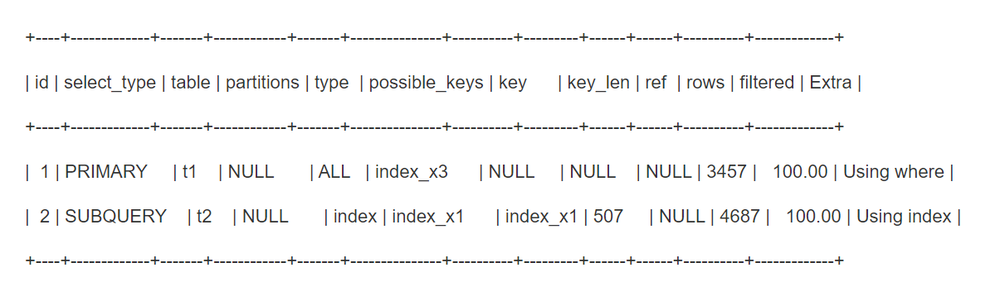

​	**例3：**

```sql
EXPLAIN SELECT * FROM t1  UNION SELECT * FROM t2
-- 第三条执行计划,有一个using temporary，也就是使用临时表的意思，他就是把结果集放到临时表里进行去重的，就这么个意思。当然，如果你用的是union all，那么就不会进行去重了,select_type就是union_result（合并结果）
```

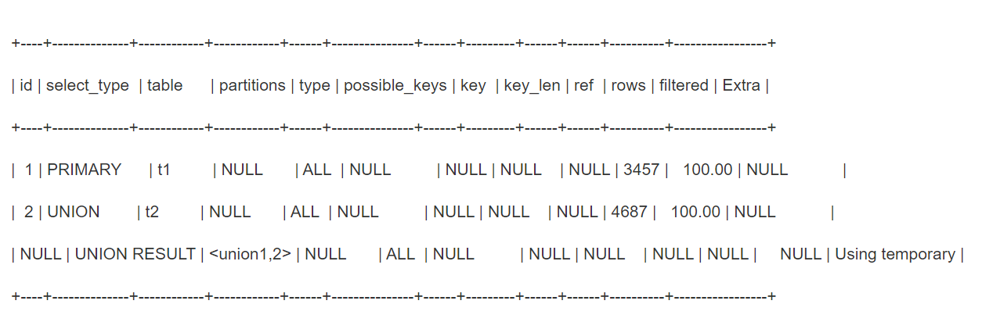

​	**例4：**

```sql
EXPLAIN SELECT * FROM t1 WHERE x1 IN (SELECT x1 FROM t2 WHERE x1 = 'xxx' UNION SELECT x1 FROM t1 WHERE x1 = 'xxx');
-- 第一个执行计划一看就是针对t1表查询的那个外层循环，select_type就是PRIMARY
-- 第二个执行计划是子查询里针对t2表的那个查询语句，他的select_type是DEPENDENT SUBQUERY，
-- 第三个执行计划是子查询里针对t1表的另外一个查询语句，select_type是DEPENDENT UNION，因为第三个执行计划是在执行union后的查询
-- 第四个执行计划的select_type是UNION RESULT，因为在执行子查询里两个结果集的合并以及去重
```

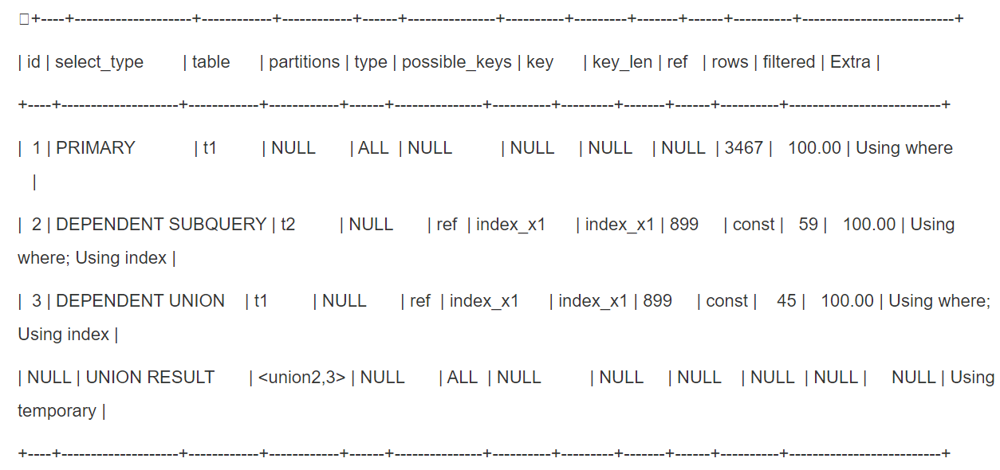

​	**例5：**

```sql
EXPLAIN SELECT * FROM (SELECT x1, count(*) as cnt FROM t1 GROUP BY x1) AS _t1 where cnt > 10;
-- 第二条执行计划,select_type是derived，意思就是说，针对子查询执行后的结果集会物化为一个内部临时表，然后外层查询是针对这个临时的物化表执行的
-- 执行分组聚合的时候，是使用的index_x1这个索引来进行的，type是index，意思就是直接扫描偶了index_x1这个索引树的所有叶子节点，把x1相同值的个数都统计出来就可以了
-- 外层查询是第一个执行计划，select_type是PRIMARY，针对的table是<derived2>，就是一个子查询结果集物化形成的临时表，他是直接针对这个物化临时表进行了全表扫描根据where条件进行筛选的
```

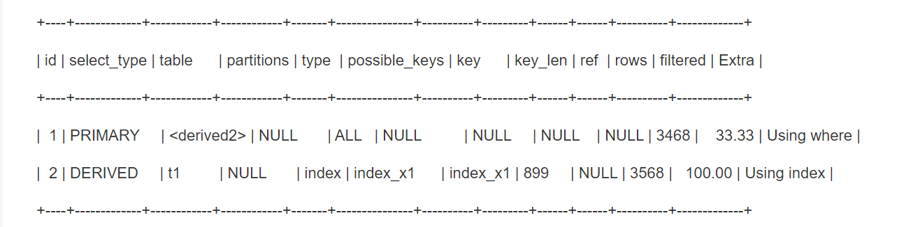

​	**例6：**

```sql
EXPLAIN SELECT * FROM t1 INNER JOIN t2 ON t1.id = t2.id
-- t1表是一个全表扫描，这个是必然的，因为关联的时候会先查询一个驱动表，这里就是t1，他没什么where筛选条件，自然只能是全表扫描查出来所有的数据了
-- t2表的查询type是eq_ref，而且使用了PRIMARY主键。这个意思就是说，针对t1表全表扫描获取到的每条数据，都会去t2表里基于主键进行等值匹配，此时会在t2表的聚簇索引里根据主键值进行快速查找，所以在连接查询时，针对被驱动表如果基于主键进行等值匹配，那么他的查询方式就是eq_ref了
-- 如果要是正常基于某个二级索引进行等值匹配的时候，type就会是ref，而如果基于二级索引查询的时候允许值为null，那么查询方式就会是ref_or_null
```

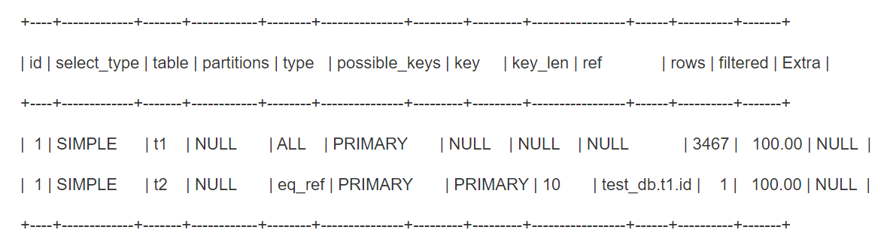

​	**例7：**

```sql
EXPLAIN SELECT * FROM t1 WHERE x1 = 'xxx'
-- 针对t1表的查询，type是ref方式的，也就是说基于普通的二级索引进行等值匹配，然后possible_keys只有一个，就是index_x1，针对x1字段建立的一个索引，而实际使用的索引也是index_x1，毕竟就他一个是可以用的
-- key_len是589，意思就是说index_x1这个索引里的x1字段最大值的长度也就是589个字节，其实这个不算是太大，不过基本可以肯定这个x1字段是存储字符串的，因为是一个不规律的长度
-- ref字段，它的意思是说，既然你是针对某个二级索引进行等值匹配的，这里的ref的值是const，意思就是说，是使用一个常量值跟index_x1索引里的值进行等值匹配的
```

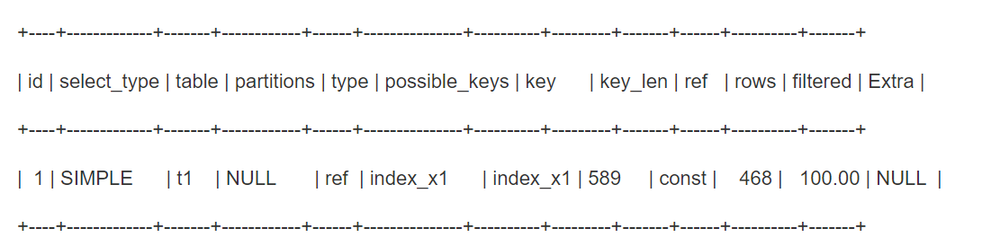

​	**例8：**

```sql
EXPLAIN SELECT * FROM t1 INNER JOIN t2 ON t1.id = t2.id;
-- t1表作为驱动表执行一个全表扫描，接着针对t1表里每条数据都会去t2表根据t2表的主键执行等值匹配，所以第二个执行计划的type是eq_ref，意思就是被驱动表基于主键进行等值匹配，而且使用的索引是PRIMARY就是使用了t2表的主键
-- ref，是test_db这个库下的t1表的id字段，这里跟t2表的主键进行 等值匹配的是t1表的主键id字段。
```

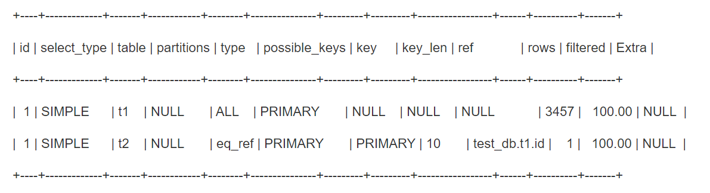

​	**例9：**

```sql
EXPLAIN SELECT * FROM t1 WHERE x1 > 'xxx' AND x2 = 'xxx'
-- t1表的查询方式是range，也就是基于索引进行范围查询，用的索引是index_x1，也就是x1字段的索引，然后基于x1>'xxx'这个条件通过index_x1索引查询出来的数据大概是1987条，接着会针对这1987条数据再基于where条件里的其他条件，也就是x2='xxx'进行过滤
-- filtered是13.00，意思是估算基于x2='xxx'条件过滤后的数据大概是13%，也就是说最终查出来的数据大概是1987 * 13% = 258条左右
```

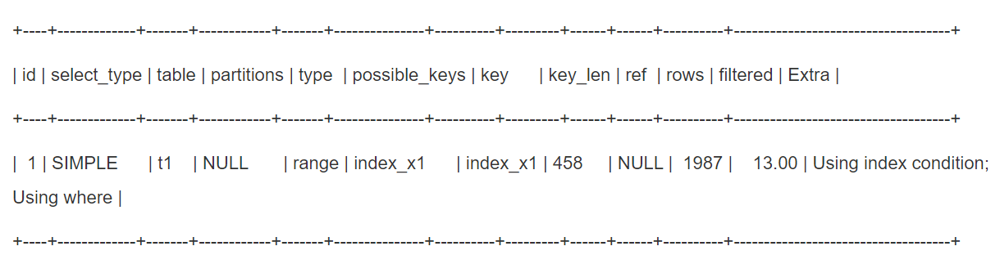

​	**例10：**

```sql
EXPLAIN SELECT * FROM t1 WHERE x1 = 'xxx' AND x2 = 'xxx'
-- 针对t1表去查询，先通过ref方式直接在index_x1索引里查找，是跟const代表的常量值去查找，然后查出来250条数据，接着再用Using where代表的方式，去使用AND x2 = 'xxx'条件进行筛选，筛选后的数据比例是18%，最终所以查出来的数据大概应该是45条
```

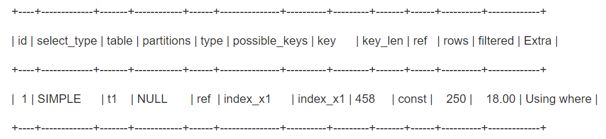

引用：https://www.cnblogs.com/tufujie/p/9413852.html

# 11 案例实战

## 11.1 千万级用户场景下的运营系统SQL调优

**背景：**

​	互联网公司的系统，这个互联网公司的用户量是比较大的，有百万级日活用户的一个量级
​	互联网公司里，有一个系统是专门通过各种条件筛选出大量的用户，接着对那些用户去推送一些消息的，有的时候可能是一些促销活动的消息，有的时候可能是让你办会员卡的消息，有的时候可能是告诉你有一个特价商品的消息
​	其实通过一些条件筛选出大量的用户，接着针对这些用户做一些推送，是互联网公司的运营系统里常见的一种功能
​	用户是日活百万级的，注册用户是千万级的，而且如果还没有进行分库分表的话，那么这个**数据库里的用户表可能就一张，单表里是上千万的用户数据**，大概是这么一个情况

**案例：**

```sql
SELECT id, name FROM users WHERE id IN (SELECT user_id FROM users_extent_info WHERE latest_login_time < xxxxx)
SELECT COUNT(id) FROM users WHERE id IN (SELECT user_id FROM users_extent_info WHERE latest_login_time < xxxxx)
-- users表用来存储用户的核心数据，比如id、name、昵称、手机号之类的信息
-- users_extent_info表会存储用户的一些拓展信息，比如说家庭住址、兴趣爱好、最近一次登录时间之类的，就是上面的
```

**问题：**

​	在**千万级数据量的大表场景下，上面的SQL直接轻松跑出来耗时几十秒的速度**
​	运行的时候，肯定会先跑一下COUNT聚合函数来查查这个结果集有多少数据，然后再分批查询。
​	结果就是这个COUNT聚合函数的SQL，在千万级大表的场景下，都要花几十秒才能跑出来

**PS:因为不同的MySQL版本的执行计划可能都不一样，平时我们开发可能感觉不出来，但是实际上每个不同的MySQL版本都可能会调整生成执行计划的方式，所以同样的SQL在不同的MySQL版本下跑 ，可能执行计划都不太一样**

**分析：**

```sql
EXPLAIN SELECT COUNT(id) FROM users WHERE id IN (SELECT user_id FROM users_extent_info WHERE latest_login_time < xxxxx)
```

​	下面的执行计划是当时我们为了调优，在测试环境的单表2万条数据场景下跑出来的执行计划，即使是5万条数据，当时这个SQL都跑了十多秒，所以足够复现当时的生产问题了，所以注意下执行计划里的数据量问题。

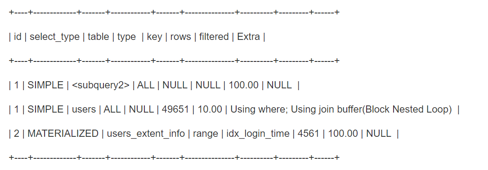

**执行计划分析：**

​	首先，针对子查询，是执行计划里的第三行实现的，他清晰的表明，针对users_extent_info，使用了idx_login_time这个索引，做了range类型的索引范围扫描，查出来了4561条数据，没有做其他的额外筛选，所以filtered是100%

​	接着他这里的MATERIALIZED，表明了这里把子查询的4561条数据代表的结果集进行了物化，物化成了一个临时表，这个临时表物化，一定是会把4561条数据临时落到磁盘文件里去的，这个过程其实就挺慢的

​	第二条执行计划表明，接着就是针对users表做了一个全表扫描，在全表扫描的时候扫出来了49651条数据，同时大家注意看Extra字段，显示了一个Using join buffer的信息，这个明确表示，此处居然在执行join操作

​	执行计划里的第一条，这里他是针对子查询产出的一个物化临时表，也就是<subquery2>，做了一个全表查询，把里面的数据都扫描了一遍，那么为什么要对这个临时表进行全表扫描呢

​	原因就是在让users表的每一条数据，都要去跟物化临时表里的数据进行join，所以针对users表里的每一条数据，只能是去全表扫描一遍物化临时表，找找物化临时表里哪条数据是跟他匹配的，才能筛选出来一条结果

​	第二条执行计划的全表扫描的结果表明是一共扫到了49651条数据，但是全表扫描的过程中，因为去跟物化临时表执行了一个join操作，而物化临时表里就4561条数据，所以最终第二条执行计划的filtered显示的是10%，也就是说，最终从users表里筛选出了也是4000多条数据

**分析得出的部分结论：**

​	对users表的全表扫描耗时不耗时？对users表的每一条数据跑到物化临时表里做全表扫描，耗时不耗时？所以这个过程必然是非常慢的，几乎就没怎么用到索引。

​	那么接着我们就很奇怪了，为什么会出现上述的一个全表扫描users表，然后跟物化临时表做join，join的时候还要全表扫描物化临时表的过程？

**深入分析：**

```sql
show warnings
-- 就是在执行完上述SQL的EXPLAIN命令，看到执行计划之后，可以执行一下show warnings命令。
-- 这个show warnings命令此时显示出来的内容如下：
-- /* select#1 */ select count(`d2.`users`.`user_id``) AS `COUNT(users.user_id)`from `d2`.`users` `users` semi join xxxxxx，下面省略一大段内容，因为可读性实在不高，关注的应该是这里的semi join这个关键字
```

 MySQL在这里，生成执行计划的时候，自动就把一个普通的IN子句，“优化”成了基于semi join来进行IN+子查询的操作

慢，也就慢在这里了，那既然知道了是semi join和物化临时表导致的问题

**优化方案：**

```sql
-- 执行
SET optimizer_switch='semijoin=off'
-- 也就是关闭掉半连接优化，
```

​	此时执行EXPLAIN命令看一下此时的执行计划，发现此时会恢复为一个正常的状态。

​	**就是有一个SUBQUERY的子查询，基于range方式去扫描索引搜索出4561条数据，接着有一个PRIMARY类型的主查询，直接是基于id这个PRIMARY主键聚簇索引去执行的搜索，然后再把这个SQL语句真实跑一下看看，发现性能一下子提升了几十倍，变成了100多毫秒！**

​	因此到此为止，这个**SQL的性能问题，真相大白，其实反而是他自动执行的semi join半连接优化，给咱们导致了问题，一旦禁止掉semi join自动优化，用正常的方式让他基于索引去执行**

​	当然，**在生产环境是不能随意更改这些设置的，多种办法尝试去修改SQL语句的写法，在不影响他语义的情况下，尽可能的去改变SQL语句的结构和格式，最终被我们尝试出了一个写法**，如下所示：

```sql
SELECT COUNT(id)
FROM users
WHERE ( id IN (SELECT user_id FROM users_extent_info WHERE latest_login_time < xxxxx) OR id IN (SELECT user_id FROM users_extent_info WHERE latest_login_time < -1))
```

​	在上述写法下，WHERE语句的OR后面的第二个条件，根本是不可能成立的，因为没有数据的latest_login_time是小于-1的，所以那是不会影响SQL语义的，但是我们发现改变了SQL的写法之后，执行计划也随之改变。

​	他并没有再进行semi join优化了，而是正常的用了子查询，主查询也是基于索引去执行的，这样我们在线上上线了这个SQL语句，性能从几十秒一下子就变成几百毫秒了。

​	**PS:这个SQL调优案例里的方法，其实最核心的，还是看懂SQL的执行计划，然后去分析到底他为什么会那么慢，接着你就是要想办法避免他全表扫描之类的操作，一定要让他去用索引，用索引是王道，是最重要的**

## 11.2 亿级数据量商品系统的SQL调优实战

**背景：**

​	线上的商品系统出现的一个慢查询告警开始讲起，某一天晚上，我们突然收到了线上数据库的频繁报警，数据库突然涌现出了大量的慢查询，而且因为**大量的慢查询，导致每一个数据库连接执行一个慢查询都要耗费很久**。

​	那这样的话，必然会**导致突然过来的很多查询需要让数据库开辟出来更多的连接，而且每个连接都打满，每个连接都要执行一个慢查询**，慢查询还跑的特别慢。

​	接着引发的问题，**就是数据库的连接全部打满，没法开辟新的连接了**，但是还持续的有新的查询发送过来，导致数据库没法处理新的查询

​	很多查询发到**数据库直接就阻塞然后超时了，这也直接导致线上的商品系统频繁的报警，出现了大量的数据库查询超时报错的异常**！
这种情况，基本意味着你的商品数据库以及商品系统濒临于崩溃了，大量慢查询耗尽了数据库的连接资源，而且一直阻塞在数据库里执行，数据库没法执行新的查询，商品数据库没法执行查询，用户没法使用商品系统，也就没法查询和筛选电商网站里的商品了！

​	当时正好是晚上晚高峰的时候！也就是一个电商网站比较繁忙的时候**，虽说商品数据是有多级缓存架构的，但是实际上在下单等过程中，还是会大量的请求商品系统的**，所以晚高峰的时候，商品系统本身TPS大致是在每秒几千的。

​	因此这个时候，发现数据库的监控里显示，每分钟的慢查询超过了10w+！！！也就是说商品系统大量的查询都变成了慢查询！！！

**案例：**

​	那么慢查询的都是一些什么语句呢？其实主要就是下面这条语句，大家可以看一下，我们做了一个简化：

```sql
select * from products where category='xx' and sub_category='xx' order by id desc limit xx,xx

-- 是一个很稀松平常的SQL语句，他就是用户在电商网站上根据商品的品类以及子类在进行筛选，当然真实的SQL语句里，可能还包含其他的一些字段的筛选，比如什么品牌以及销售属性之类的，我们这里是做了一个简化，然后按id倒序排序，最后是分页，就这么一个语句。
-- 这个语句执行的商品表里大致是1亿左右的数据量，这个量级已经稳定了很长时间了，主要也就是这么多商品，但是上面的那个语句居然一执行就是几十秒
```

**问题：**

​	可以认为如下的一个索引，KEY index_category(catetory,sub_category)肯定是存在的，所以基本可以确认上面的SQL绝对是可以用上索引的。

​	你一旦用上了品类的那个索引，那么按品类和子类去在索引里筛选，其实第一，筛选很快速，第二，筛出来的数据是不多的，按说这个语句应该执行的速度是很快的，即使表有亿级数据，但是执行时间也最多不应该超过1s

​	现在这个SQL语句跑了几十秒，那说明他肯定就没用我们建立的那个索引，所以才会这么慢，那么他到底是怎么执行的呢？我们来看一下他的执行计划：

```sql
	explain select * from products where category='xx' and sub_category='xx' order by id desc limit xx,xx
```

​	最核心的信息，他的**possible_keys里是有我们的index_category的，结果实际用的key不是这个索引，而是PRIMARY**！！**而且Extra里清晰写了Using where**

​	到此为止，这个SQL语句为什么性能这么差，就真相大白了，他其实**本质上就是在主键的聚簇索引上进行扫描，一边扫描，一边还用了where条件里的两个字段去进行筛选，所以这么扫描的话，那必然就是会耗费几十秒**了

**优化方案：**

​	使用force index语法，强制性的改变MySQL自动选择这个不合适的聚簇索引进行扫描的行为

```sql
select * from products force index(index_category) where category='xx' and sub_category='xx' order by id desc limit xx,xx
-- 使用上述语法过后，强制让SQL语句使用了你指定的索引，此时再次执行这个SQL语句，会发现他仅仅耗费100多毫秒而已！性能瞬间就提升上来了
```

​	如果MySQL使用了错误的执行计划，应该怎么办？

​	其实答案很简单，就是这个案例里的情况，方法就是force index语法就可以了

**深入探究：**

- **为什么在这个案例中MySQL默认会选择对主键的聚簇索引进行扫描，为什么没使用index_category这个二级索引进行扫描？**

  

  ​	这个表是一个**亿级数据量的大表，那么对于他来说，index_category这个二级索引也是比较大的**

  ​	此时对于MySQL来说，他有这么一个判断，他觉得**如果要是从index_category二级索引里来查找到符合where条件的一波数据，接着还得回表，回到聚簇索引里去**

  ​	他担心的是，你**根据where category='xx' and sub_category='xx'，从index_category二级索引里查出来的数据太多了，还得在临时磁盘里排序，可能性能会很差，因此MySQL就把这种方式判定为一种不太好的方式**

  ​	因此他才会**选择换一种方式，也就是说，直接扫描主键的聚簇索引，因为聚簇索引都是按照id值有序的，所以扫描的时候，直接按order by id desc这个倒序顺序扫描过去就可以了，然后因为他知道你是limit 0,10的，也就知道你仅仅只要拿到10条数据就行了**

  ​	在**按顺序扫描聚簇索引的时候，就会对每一条数据都采用Using where的方式，跟where category='xx' and sub_category='xx'条件进行比对，符合条件的就直接放入结果集里去，最多就是放10条数据进去就可以返回了**

  ​	时**MySQL认为，按顺序扫描聚簇索引，拿到10条符合where条件的数据，应该速度是很快的，很可能比使用index_category二级索引那个方案更快，因此此时他就采用了扫描聚簇索引的这种方式**

  

- **即使用了聚簇索引，为什么这个SQL以前没有问题，现在突然就有问题了？**

  ​	原因也很简单，其实就是因为**之前的时候，where category='xx' and sub_category='xx'这个条件通常都是有返回值的，就是说根据条件里的取值，扫描聚簇索引的时候，通常都是很快就能找到符合条件的值以及返回的**，所以之前其实性能也没什么问题

  ​	后来可能是商**品系统里的运营人员，在商品管理的时候加了几种商品分类和子类，但是这几种分类和子类的组合其实没有对应的商品**

  ​	也就是说，那一天晚上，很多用户使用这种分类和子类去筛选商品**，where category='新分类' and sub_category='新子类'这个条件实际上是查不到任何数据的**

  ​	所以说**，底层在扫描聚簇索引的时候，扫来扫去都扫不到符合where条件的结果，一下子就把聚簇索引全部扫了一遍，等于是上亿数据全表扫描了一遍，都没找到符合where category='新分类' and sub_category='新子类'这个条件的数据**。

  ​	**也正是因为如此，才导致这个SQL语句频繁的出现几十秒的慢查询，进而导致MySQL连接资源打满，商品系统崩溃**

  

  ## 11.3 数十亿数量级评论系统的SQL调优实战

  **背景：**

  ​	电商场景下非常普遍的商品评论系统的一个SQL优化，这个商品评论系统的数据量非常大，拥有多达十亿量级的评论数据，所以当时对这个评论数据库，我们是做了分库分表的，基本上分完库和表过后，单表的评论数据在百万级别

  ​	每一个商品的所有评论都是放在一个库的一张表里的，这样可以确保你作为用户在分页查询一个商品的评论时，一般都是直接从一个库的一张表里执行分页查询语句就可以了

  ​	电商网站里，有一些热门的商品，可能销量多达上百万，商品的评论可能多达几十万条。然后呢，有一些用户，可能就喜欢看商品评论，他就喜欢不停的对某个热门商品的评论不断的进行分页，一页一页翻，有时候还会用上分页跳转功能，就是直接输入自己要跳到第几页去。

  ​	所以这个时候，就会涉及到一个问题，**针对一个商品几十万评论的深分页问题**

  **案例：**

  ```sql
  SELECT * FROM comments WHERE product_id ='xx' and is_good_comment='1' ORDER BY id  desc LIMIT 100000,20
  -- 他的意思就是，比如用户选择了查看某个商品的评论，因此必须限定Product_id，同时还选了只看好评，所以is_good_commit也要限定一下
  ```

  ​	索引就是一个，那就是index_product_id，所以对上述SQL语句，正常情况下，肯定是会走这个索引的，也就是说，会通过index_product_id索引，根据product_id ='xx'这个条件从表里先删选出来这个表里指定商品的评论数据

  ​	第二步呢？当然是得按照 is_good_comment='1' 条件，筛选出这个商品评论数据里的所有好评了！但是问题来了，这个index_product_id的索引数据里，并没有is_good_commet字段的值，所以此时只能很尴尬的进行回表了

  ​	对这个商品的每一条评论，都要进行一次回表操作，回到聚簇索引里，根据id找到那条数据，取出来is_good_comment字段的值，接着对is_good_comment='1'条件做一个比对，筛选符合条件的数据

  ​	由于这里有个排序，么假设这个商品的评论有几十万条，岂不是要做几十万次回表操作。对于筛选完毕的所有符合WHERE product_id ='xx' and is_good_comment='1'条件的数据，假设有十多万条吧，接着就是按照id做一个倒序排序，此时还得基于临时磁盘文件进行倒序排序，又得耗时很久。

  ​	排序完毕了，就得基于limit 100000,20获取第5001页的20条数据，最后返回

  ​	简单的百万级单表查询，这条SQL语句基本要跑个1秒~2秒

  **优化方案：**

  ```sql
  -- 因此对于这个案例，我们通常会采取如下方式改造分页查询语句
  SELECT * from comments a,(SELECT id FROM comments WHERE product_id ='xx' and is_good_comment='1' ORDER BY id  desc LIMIT 100000,20) b WHERE a.id=b.id
  -- 这里因为子查询是直接返回id的，所以子查询没有用到索引，直接根据聚簇索引去筛选查询
  ```

  ​	上面那个SQL语句的执行计划就会彻底改变他的执行方式，他通常会先执行括号里的子查询，子查询反而会使用PRIMARY聚簇索引，按照聚簇索引的id值的倒序方向进行扫描，扫描过程中就把符合WHERE product_id ='xx' and is_good_comment='1'条件的数据给筛选出来。

  ​	比如这里就筛选出了十万多条的数据，并不需要把符合条件的数据都找到，因为limit后跟的是100000,20，理论上，只要有100000+20条符合条件的数据，而且是按照id有序的，此时就可以执行根据limit 100000,20提取到5001页的这20条数据了。

  ​	接着你会看到执行计划里会针对这个子查询的结果集，一个临时表，<derived2>进行全表扫描，拿到20条数据，接着对20条数据遍历，每一条数据都按照id去聚簇索引里查找一下完整数据，就可以了。

  ​	所以针对我们的这个场景，反而是优化成这种方式来执行分页，他会更加合适一些，他只有一个扫描聚簇索引筛选符合你分页所有数据的成本，你的分页深度越深，扫描数据越多，分页深度越浅，那扫描数据就越少，然后再做一页20条数据的20次回表查询就可以了。

  ​	当时我们做了这个分页优化之后，发现这个分页语句一下子执行时间降低到了几百毫秒了，此时就达到了我们优化的目的

  

  **PS:简而言之，针对不同的案例，要具体情况具体分析，他慢，慢的原因在哪儿，为什么慢，然后再用针对性的方式去优化他**

  

  ## 11.3 千万级数据删除导致的慢查询优化实践

  **背景：**

  ​	当时有人删除了千万级的数据，结果导致了频繁的慢查询，接下来给大家讲一下这个案例整个排查、定位以及解决的一个过程。

  ​	这个案例的开始，当时是从线上收到大量的慢查询告警开始的，当我们收到大量的慢查询告警之后，就去检查慢查询的SQL，结果发现不是什么特别的SQL，这些SQL语句主要都是针对一个表的，同时也比较简单，而且基本都是单行查询，看起来似乎不应该会慢查询。

  ​	所以这个时候我们是感觉极为奇怪的，因为SQL本身完全不应该有慢查询，按说那种SQL语句，基本上都是直接根据索引查找出来的，性能应该是极高的。

  **分析：**

  ​	说慢查询本身不一定是SQL导致的，如果你觉得SQL不应该慢查询，结果他那个时间段跑这个SQL就是慢，**此时你应该排查一下当时MySQL服务器的负载，尤其看看磁盘、网络以及CPU的负载，是否正常**

  ​	奇怪的是，当时我们看了下MySQL服务器的磁盘、网络以及CPU负载，一切正常，似乎也不是这个问题导致的

  ​	然后，就是用MySQL profilling工具去细致的分析SQL语句的执行过程和耗时。

  **分析(profiling工具)：**

​		打开这个profiling，使用**set profiling=1**这个命令，接着MySQL就会自动记录查询语句的profiling信息了

​		执行show profiles命令，就会给你列出各种查询语句的profiling信息，这里很关键的一点，就是他会记录下来每个查询语句的query id，所以你要针对你需要分析的query找到对他的query id，我们当时就是针对慢查询的那个SQL语句找到了query id

​		以针对单个查询语句，看一下他的profiling具体信息，使用**show profile cpu, block io for query xx**，这里的xx是数字，此时就可以看到具体的profile信息了

​		除了cpu以及block io以外，你还可以指定去看这个SQL语句执行时候的其他各项负载和耗时

**问题：**

​		重点发现了一个问题，他的Sending Data的耗时是最高的，几乎使用了1s的时间，占据了SQL执行耗时的99%

​		Sending Data是在干什么呢

​		MySQL的官方释义如下：为一个SELECT语句读取和处理数据行，同时发送数据给客户端的过程，简单来说就是为你的SELECT语句把数据读出来，同时发送给客户端

​		又用了一个命令：**show engine innodb status**，看一下innodb存储引擎的一些状态，此时发现了一个奇怪的指标，就是**history list length**这个指标，他的值特别高，达到了上万这个级别

**原因：**

​	大量事务执行的时候，就会构建这种undo多版本快照链条，此时history list length的值就会很高。然后在事务提交之后，会有一个多版本快照链条的自动purge清理机制，只要有清理，那么这个值就会降低。

​	一般来说，这个值是不应该过于高的，所以我们在这里注意到了第二个线索，history list length值过高！大量的undo多版本链条数据没被清理！推测很可能就是有的事务长时间运行，所以他的多版本快照不能被purge清理，进而导致了这个history list length的值过高

​	经过两个线索的推测，在大量简单SQL语句变成慢查询的时候，SQL是因为Sending Data环节异常耗时过高，同时此时出现了一些长事务长时间运行，大量的频繁更新数据，导致有大量的undo多版本快照链条，还无法purge清理

**深入分析：**

​	**问题：**但是这两个线索之间的关系是什么呢？是第二个线索推导出的事务长时间运行现象的发生，进而导致了第一个线索发现的Sending Data耗时过高的问题吗？可是二者之间的关系是什么呢？是不是还得找到更多的线索还行呢？

​	**原因：**当时经过排查，一直排查到117讲末尾的时候，发现有大量的更新语句在活跃，而且有那种长期活跃的超长事务一直在跑没有结束，结果一问系统负责人，发现他在后台跑了一个定时任务，定时清理数据，结果清理的时候一下子清理了上千万的数据。

**结论：**

​	开了一个事务，然后在一个事务里删除上千万数据，导致这个事务一直在运行

​	然后呢，这种**长事务的运行会导致一个问题，那就是你删除的时候仅仅只是对数据加了一个删除标记，事实上并没有彻底删除掉。此时你如果跟长事务同时运行的其他事务里在查询，他在查询的时候是可能会把那上千万被标记为删除的数据都扫描一遍的**。

​	因为**每次扫描到一批数据，都发现标记为删除了，接着就会再继续往下扫描，所以才导致一些查询语句会那么的慢**。

​	那么可能有人会问了，为什么你启动一个事务，在事务里查询，凭什么就要去扫描之前那个长事务标记为删除状态的上千万的垃圾数据呢？**按说那些数据都被删除了，跟你没关系了，你可以不用去扫描他们啊**！

​	**这个问题的关键点就在于，那个删除千万级数据的事务是个长事务**！

​	**也就是说，当你启动新事务查询的时候，那个删除千万级数据的长事务一直在运行，是活跃的** ，根据ReadView机制

​	当你启动一个**新事务查询的时候，会生成一个Read View，里面包含了当前活跃事务的最大id、最小id和事务id集合，然后他有一个判定规则**

​	总之就是，你的**新事务查询的时候，会根据ReadView去判断哪些数据是你可见的，以及你可见的数据版本是哪个版本**，因为一个数据有一个版本链条，有的时候你可能可见的仅仅是这个数据的一个历史版本而已。

​	所以正是因为这个**长事务一直在运行还在删除大量的数据，而且这些数据仅仅是标记为删除，实际还没删除，所以此时你新开事务的查询是会读到所有被标记为删除的数据的，就会出现千万级的数据扫描，才会造成慢查询**！

​	针对这个问题，其实大家要知道的一点是，**永远不要在业务高峰期去运行那种删除大量数据的语句，因为这可能导致一些正常的SQL都变慢查询**，因为那些SQL也许会不断扫描你标记为删除的大量数据，好不容易扫描到一批数据，结果发现是标记为删除的，于是继续扫描下去，导致了慢查询！

​	所以当时的**解决方案也很简单，直接kill那个正在删除千万级数据的长事务，所有SQL很快会恢复正常**，从此以后，对于大量数据清理全部放在凌晨去执行，那个时候就没什么人使用系统了，所以查询也很少

引用：https://www.cnblogs.com/ggjucheng/archive/2012/11/15/2772058.html

# XX其他

分库分表：https://www.cnblogs.com/dinglang/p/6084306.html

