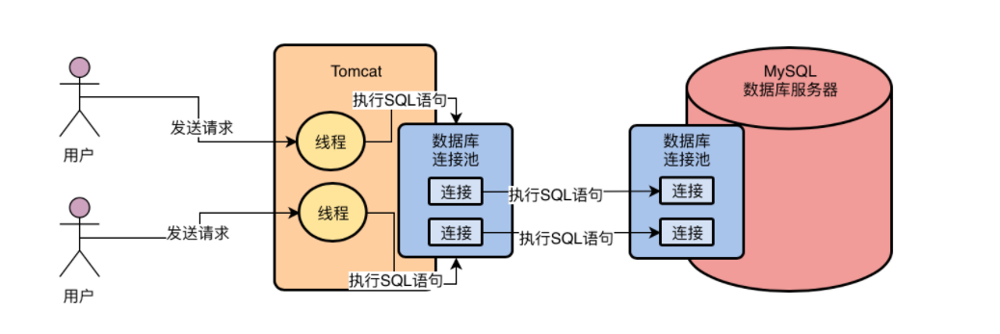

# 1 初探mysql

## 1.1 系统是如何跟MySQL打交道(mysql连接与驱动)

**MySql驱动：**

​	我们如果要和数据库建立连接，必须通过mysql驱动去连接数据库。

pom(面向Java语言的Mysql驱动)

**PS:对应主流编程语言，MySql都会提供对应语言的驱动（PHP,.NET等）。**


java通过mysql驱动和与mysql数据库建立网络连接,对应代码就可以通过mysql驱动访问数据库，执行对应sql语句了。


**数据库连接池：**

**问题：**

​	问：java系统只会和mysql建立一个连接吗？

​	答：不会，java开发web系统，部署在tomact中的话，必定是多个线程去处理用户请求的，多个线程去抢夺同一个数据库连接的话，效率是很低下的。

​	问：多线程访问mysql，频繁创建销毁数据库连接是否合理？

​	答：不合理，创建销毁数据库连接是非常耗费资源，且效率低下。

**方案：**

​	使用数据库连接池，一个连接池去维护多个数据库连接。多个线程去使用不同的数据库连接，sql语句执行完后，并不会将连接销毁。而是将连接放回连接池中，后续还可以继续使用。

**PS:常见的连接池有DBCP,C3P0,Druid,HikariCP等**

**PS:HiKariCP 号称业界跑得最快的数据库连接池，近几年发展的风生水起，更是被 Spring Boot 2.0 选中作为其默认数据库连接池**


**MySql数据库连接池：**

​	系统要和mysql建立多个连接，对应Mysql也必然要通过连接池维护与系统之间的多个连接。

​	**实际上mysql就是通过连接池来维护与系统之间的多个连接。除此之外每次与Mysql建立连接的时候，还会根据传递的账号密码，进行**

**账号密码、库表权限等验证。**



## 1.2 执行一条SQL语句，MySQL的架构设计概述

从一条SQL的执行流程来看MySql的整体架构设计

**1 mysql线程处理连接的网络请求**，对应线程去监听请求和读取数据，从网络连接中读取和解析出来SQL语句。

**2 SQL接口负责处理接收到的SQL语句：**

​	Mysql内部提供了对应的组件，就是SQL接口(SQL Interface),SQL接口去执行对应增删改查等SQL语句，**因此Mysql工作线程接收到SQL语句之后会交给SQL接口去执行**

**3 查询解析器，让MySql能够"看懂"Sql语句：**

​	查询解析器(Parser)就是对SQL语句进行解析的，举个例子：

```sql
 select id,name,age from user where id = 1
```

解析器会对sql语句进行拆解，讲上面的语句拆成以下三个部分

​	(1) 从user表中获取数据

​	(2) 查询id值为1的数据

​	(3) 对应Id值为1的那1行（多行）数据提取其中id、name、age 三个字段

**PS:所谓SQL解析就是按照SQL的规则和语法对SQL语句进行解析，理解SQL要去干什么事情**

**4 查询优化器(optimizer)，选择最优的查询路径：**

根据对应SQL语句去选择**执行计划**，是否走索引，走哪个索引，等

**5 执行器，根据执行计划调用存储引擎的接口**

​	**执行器会根据优化器生成的执行计划按照一定顺序，不停的去调用存储引擎的对应接口去完成SQL语句的执行计划(大致就是不停的更新或者提取一些数据出来)**

​	举个例子：执行引擎可能先调用存储引擎的一个接口，去获取"user"表中的第一行数据，然后判断id是否是我们期望的值，如果不是再调用存储引擎的接口，去获取下一行的数据

**6 存储引擎接口，真正的执行SQL语句**

​	存储引擎在执行SQL语句的时候，会按照一定步骤去查询**内存缓存数据**，更新**磁盘数据**，查询磁盘数据等等，去执行诸如此类的一些操作。

​	**存储引擎是支持多种引擎的，常见的存储引擎有InnoDB,MyISAM,Memory等**

​	MySql默认是InnoDB存储引擎，可以选择具体使用哪种存储引擎


## 1.3 InnoDB存储引擎初探

### 1.3.1 用一次数据更新流程，初步了解InnoDB存储引擎的架构设计

首先假设有这样一条SQL语句

```sql
update user set name = 'xxx' where id = 10
```

**1 InnoDB的重要内存结构，缓冲池(Buffer Pool)**

​	**缓冲池,这里面会缓存很多数据，在查询的时候如果内存缓冲池中已经有数据的话，就不用去查磁盘了**

​	**流程概述：**引擎要执行更新语句的时候，比如对"id=10"这一行数据，其实会先看下缓冲池中是否有该数据，如果没有就会直接从**磁盘加载到缓冲池**中，而且接着还会对这行记录加独占锁（锁后续详细分析，加锁/释放锁等）

**2 undo日志文件，让更新的数据可以回滚**

​	**将更新前的值写入undo日志文件**

​	**流程概述：**假设"id=10"这行数据原来name是"zhangsan"，现在要将其更新为"xxx"，那么此时就将原来的值"zhangsan"和"id=10"这些信息，写入到undo日志文件中

**3 更新buffer pool的缓存数据**

​	更新内存缓冲池中(buffer pool)的数据

​	**流程概述：把内存里"id=10"这行数据的name字段修改为"xxx"**

**PS:此时这行数据称为"脏数据"，因为此时内存数据已经被修改了，磁盘上还是旧数据"zhangsan"(内存与磁盘不一致，脏数据)**

**4 Redo Log Buffer：避免系统宕机，导致数据丢失**

​	**把内存所做的修改写入到一个Redo Log Buffer中区，这也是内存里的一个缓冲区，是用来存放redo日志的**

​	**流程概述：**所谓redo日志，就是记录对数据进行了什么修改，比如对"id=10"这行记录修改了name字段的值为xxx，这就是一个日志

**PS:此时redo日志仅仅停留在内存中(本步骤)**

**PS:如果没有提交事务MySql宕机怎么办？其实是不影响的，内存数据丢失，磁盘数据还是原样。因为更新语句没有提交事务，代表没有执行成功。所以事务失败的话会收到一个数据库的异常，mysql重启后数据不会发生变化，还是老数据"zhangsan"**

**5 提交事务的时候将redo日志写入磁盘中**

​	提交一个事务的时候，会根据一定的策略吧redo日志从redo log buffer里刷入到磁盘文件里去。

​	**这个策略就是通过innodb_flush_log_at_trx_commit 来配置的**，它有几个选项 0、1、2

​		**(1)innodb_flush_log_at_trx_commit 为 0：提交事务的时候，不会吧redo log buffer里的数据刷入磁盘文件**。如果此时mysql宕机了，就算提交了事务，还是会丢失数据(内存中的数据和redo日志丢失)

​		**(2)innodb_flush_log_at_trx_commit 为 1：提交事务的时候，必须把redo log从内存刷入到磁盘文件中**，只要事务提交成功，redo log就必然在磁盘里了


​	**(3)innodb_flush_log_at_trx_commit 为 2：提交事务的时候，把redo log日志写入磁盘文件对应的os cache缓存中**，可能1秒后(系统控制)才会吧os cache(内存缓冲)里的数据写入到磁盘文件中


**PS:如果"xxx"已经持久化到redo日志文件中了，但是磁盘文件还是"zhangsan"，此时系统突然崩溃了，会丢失数据吗？答案是不会，因为mysql重启之后会根据redo日志去恢复之前做过的修改**

刷盘策略对比：

​	0 最快 1最慢，但是最保险 2 保险，速度。适中

​	一般建议是设置为1，数据库不允许数据丢失。

### 1.3.2 用一次数据更新流程，聊聊binlog是什么

**binlog不是InnDB存储引擎特有的日志文件，而是属于mysql server自己的日志文件**

**binlog与redo log的区别：**

​	redo log：是一种偏向物理性质的重做日志，比如对哪个"数据页"中的什么记录，做了个什么修改

​	**binlog：binlog叫做归档日志**，里面记录的是偏向逻辑性的日志，比如"对user表中的id=10这一行数据做了更新操作，更新之后的值是什么"

**提交事务的时候，同时会写入binlog：**

​	提交事务的时候，同时还会吧这次更新对应的binlog日志写入到磁盘文件中

​	执行器是非常核心的组件，负责跟存储引擎配合完成一个SQL语句在磁盘与内存层面的全部数据更新操作。

​	对应下图流程图中，1、2、3、4几个步骤是更新语句的操作。5、6、7步骤是从提交事务开始的，属于提交事务的阶段

**binlog日志的刷盘策略：**

​	通过sync_binlog参数控制刷盘策略，默认值为0,

```shell
#提交事务的时候写入os cache内存缓存
sync_binlog:0
#提交事务的时候直接写入磁盘文件中
sync_binlog:1
```

**基于binlog和redo log完成事务的提交：**

​	将binglog写入磁盘文件之后，此时会把本次**对应的binglog文件名称和这次更新的binlog日志在文件里的位置，都写入到redo log日志文件中，同时在redo log日志文件里写入一个commit标记**，在完成这个事情之后才算是最终完成了事务的提交

​	(1) commit标记的意义，其实就是用来保持redo log日志与binlog日志一致的。

​	(2)  如果在步骤5、6两个步骤的时候系统宕机了，因为redo log没有最终的commit标记，因此此时事务提交是失败的。

​	(3)  必须redo log写入最终的commit标记，才算事务提交成功。


**后台IO线程随机将内存更新后的"脏数据"刷回磁盘:**

​	MySQL有一个后台的IO线程，会在某个时间点，随机的把检查buffer pool中修改后的"脏数据"刷回到磁盘的数据文件中

​	在IO线程吧"脏数据"刷回磁盘之前，就算系统宕机了也没关系。只要事务提交成功，redo log有commit标记了。重启之后会根据redo日志回复之前提交的事务到修改的内存中去，之后IO线程还是会将这个修改后的数据刷到磁盘的数据文件中的


### 1.3.3 总结

​	通过一次更新数据的流程，可以看出InnoDB存储引擎的主要流程。

​		1 在执行更新的时候，每条SQL语句都会对应修改buffer pool里的缓存数据，写undo日志，写redo log buffer几个步骤。

​		2 在提交事务的时候会将redo log、binlog刷入磁盘，完成redo log中事务的commit标记。最后后台的IO线程会随机的把buffer pool里的"脏数据"刷入到磁盘里去

​	**InnDB存储引擎主要就是包含了一些buffer pool，redo log buffer等内存里的缓存数据，同时还包含了一些undo日志文件，redo日志文件等东西,同时mysql server自己还有binlog日志文件**

**扩展：**

​	**DB宕机重启后，怎么确定是否需要从redo log恢复数据**（即脏页数据在宕机前是否已经全部刷写回磁盘文件）？

​	知道需要从redo log 重放恢复数据时，**是全量重放还是指定位置之后重放**？ 

​	**1、DB宕机重启时，InnoDB会首先去查看数据页中LSN的数值，即数据页被刷新回磁盘的LSN**（LSN实际上就是Innodb使用的一个版本标记的计数）的大小，异于作者说的commit标记，然后去查看redo log 的LSN大小。如果数据也的LSN值大，就说明数据页领先于redo log刷新回磁盘，不需要进行恢复；反之，需要从redo log中恢复。

​	 2、redo log 是划归于一个重放日志组的，默认情况下，一个重放日志组有两个重放日志文件，写redo log时是循环写入，写满一个再写另外一个。但是在写满切换时会触发数据库的检查点checkpoint。checkpoint所做的事就是把脏页刷新回磁盘，当DB重启恢复时只需要恢复checkpoint之后的数据即可。所以日志文件大小不易过大，不然导致恢复时需要更长的时间，也不宜过小，不然导致频繁切换触发检测点，降低性能。

# 2 mysql生产经验

## 2.1 真实生产环境下的数据库机器配置如何规划

**生产数据库一般用什么配置的机器：**

​	1 如果一个系统没有什么并发量，用户几十人的小系统，选什么mysql机器部署去部署数据库，影响不大

​	2 数据量小、并发量小、操作频率低、用户量小，这种类型的系统不需要考虑配置问题

​	3 主要关注是有一定并发量的系统，对数据库可能会产生上千、上万的并发。对于这种场景想应该选择什么样的机器去部署数据库，才能抗下系统压力

**普通的Java应用系统部署在机器上能抗多少并发：**
	1 Java系统的机器一般为2核4G和4核8G多一些。**数据库部署机器最低在8核16G以上，正常在16核32G**

​	2 按照生产经验来说**，Java系统部署在4核8G的机器上，每秒抗500左右的并发访问量是正常的**，这个一般是看请求访问速度，如果每个请求都在1s左右，那可能没秒只能处理100个请求了，只需要100ms的话，那每秒应该可以处理几百个请求**(主要看请求处理时间)**。

**高并发场景下，数据库应该用什么样的机器：**

​	1 通常推荐16核32G及以上的机器，最少8核16G的机器

​	2 一般来说Java系统压力大，负载高，其实主要的压力和负载都在Mysql数据库上

​	3 大量执行增删改查的SQL语句，Mysql对应内存和磁盘进行大量的IO操作，所以数据库往往是负载很高的，而java系统一般不会有对文件读写的IO操作

​	4 对**于16核32G的机器部署MySql，每秒抗两三千，甚至三四千请求也是可以的，如果并发达到上万，那么数据库的CPU、磁盘、IO、内存的负载都飙升到很高，数据库很可能会扛不住宕机**

​	5 **对于数据库最好为SSD固态硬盘，而不是机械硬盘**，因为大量的磁盘IO，读写文件，SSD固态硬盘效率更高，能抗住更多的并发请求量

**扩展：**

​	问：假设Java系统部署在一个4核8个的机器上，假设系统处理请求非常快，每个请求只需要0.01ms，那么这个系统可以实现每秒几千，几万的并发请求吗？

​	答：java系统4核8g，每次请求耗时0.01ms，那么应该是没有走数据库。还要加上**CPU线程切换的时间，当并发量高的时候还要算下内存消耗发生YGC和Full GC的STW时间也算进去，当并发很高，对CPU负载也很高，处理会变慢。磁盘IO还有网卡等因素也考虑进去。**

## 2.2 互联网公司的生产环境数据库是如何进行性能测试的

**申请机器之后，作为Java架构师就要心里有数**

​	选择数据库使用什么配置的机器，心里大致明白这个配置的数据库，可以抗多少并发请求

**把机器交给专业的DBA，让DBA部署Mysql**

​	DBA一般会根据经营，用相关的生产调优参数模板，还有就是Linux机器的一些OS内核参数进行一定的调整，比如最大文件句柄数之类的

**有了数据库之后，还需要先进行压测**

​	1 比如说基于工具模拟系统发送1000(或者更多的请求)个请求到数据库上，观察机器的CPU负载，磁盘IO负载，网络IO负载，内存负载，然后数据库每秒能否处理1000个请求，还是说只能处理500个请求，这个过程就是压测

​	2 数据库的压测和Java系统的压测是两回事，首先得知道数据库能抗多少压力，才能去看Java系统能抗多少压力

**QPS和TPS到底有什么区别**

​	**1 压测对应的专业术语QPS(Query Per Second)、TPS(Transaction Per Second)**

​	2 QPS每秒处理多少请求(一次请求就是一条SQL语句)

​	**3 TPS每秒处理多少事务**(一个事务可能包含多个SQL语句)

​	4 TPS衡量的是数据库每秒处理完的事务的数量，如果把TPS理解为数据库每秒处理请求的数量，其实是不太严谨的

**IO相关的压测性能指标**

​	**1 IOPS: 机器随机IO并发处理能力(每秒)**

​	比如讲内存中的"脏数据"，由后台IO线程在不确定的时间刷到磁盘中，这就是随机IO的过程。如果指标不高，那么内存数据刷到磁盘的效率就不高。

​	**2 吞吐量：机器磁盘每秒读写多少字节的数据量**

​	比如redo日志写入磁盘中，就是对磁盘文件进行顺序读写的，一般普通磁盘的顺序写入的吞吐量可以达到200MB左右，通常来说磁盘吞吐量是可以承载高并发请求的

​	**3 latency:指的是磁盘写入一条数据的延迟**

​	写入redo log磁盘文件到底是延迟1ms，还是100us。延迟越低数据库性能越高。
​	

**压测的时候需要关注的其他性能指标**

​	除了QPS、TPS、IOPS、吞吐量、latency这些指标之外还需要关注的指标

​	**1 CPU负载：**为很重要的性能指标，假设数据库压测每秒3000请求，其他性能指标正常，但是CPU负载很高，说明数据库不能再压测更高的QPS了，否则CPU是吃不消的

​	**2 网络负载：**在压测到一定QPS和TPS的时候，每秒机器网卡输入/输出多少MB数据，如果带宽接近打满，也不能继续压测了

​	**3 内存负载：**就是看压测到一定情况的时候，内存耗费了多少，如果内存耗费过高，也不能继续压测了

**PS:CPU、网络负载、内存负载等这些机器性能指标如果读接近最大限制，那么就不能继续压测了(任意指标接近限制都不行)**

**扩展：**

​	问：有一个交易系统，拆分了很多服务，一笔交易需要多个服务协作完成，也就是说一次交易需要调用多个服务才能完成。那么对于每个服务而言每秒请求数量是QPS还是TPS？对于交易系统而言，每秒处理交易笔数是QPS还是TPS呢？

​	答：对于单个服务来说，每秒处理请求数量是QPS。而对于整个交易系统来说一次交易请求需要调用多个服务，那么其每秒处理的的交易笔数则是TPS

## 2.3 如何对生产环境中的数据库进行360度无死角压测

**数据库压测工具：sysbench**

​	这个工具可以自动在数据库构造大量数据，模拟几千个线程并发访问数据库，模拟各种SQL语句、事务、甚至几十万TPS去压测数据库

**在linux上安装sysbench工具**

```shell
#获取rpm，设置对应repo仓库
curl -s https://packagecloud.io/install/repositories/akopytov/sysbench/script.rpm.sh | sudo bash
#yum安装
sudo yum -y install sysbench
#看到对应版本号就说明安装成功了
sysbench --version
```

**基于sysbench构造测试表和测试数据**

```shell
#该命令就能直接构建表及相关测试数据
sysbench --db-driver=mysql --time=300 --threads=10 --report-interval=1 --mysql-host=127.0.0.1 --mysql-port=3306 --mysql-user=test_user --mysql-password=test_user --mysql-db=test_db --tables=20 --table_size=1000000 oltp_read_write --db-ps-mode=disable prepare
```

命令相关参数说明

1. --db-driver=mysql：这个很简单，就是说他基于mysql的驱动去连接mysql数据库，你要是oracle，或者sqlserver，那自然就是其他的数据库的驱动了
2. --time=300：这个就是说连续访问300秒
3. --threads=10：这个就是说用10个线程模拟并发访问
4. --report-interval=1：这个就是说每隔1秒输出一下压测情况
5. --mysql-host=127.0.0.1 --mysql-port=3306 --mysql-user=test_user --mysql-password=test_user：这一大串，就是说连接到哪台机器的哪个端口上的MySQL库，他的用户名和密码是什么
6. --mysql-db=test_db --tables=20 --table_size=1000000：这一串的意思，就是说在test_db这个库里，构造20个测试表，每个测试表里构造100万条测试数据，测试表的名字会是类似于sbtest1，sbtest2这个样子的
7. oltp_read_write：这个就是说，执行oltp数据库的读写测试
8. --db-ps-mode=disable：这个就是禁止ps模式(ps就是PrepareStatement，预编译，就是禁止sql预编译模式)

扩展：OLTP数据库简介(mysql就是OLTP，就是关系型数据库)

https://www.jianshu.com/p/b1d7ca178691

**对数据库进行全方位测试**

```shell
#测试数据库的综合读写TPS，使用的是oltp_read_write模式（大家看命令中最后不是prepare，是run了，就是运行压测）：
sysbench --db-driver=mysql --time=300 --threads=10 --report-interval=1 --mysql-host=127.0.0.1 --mysql-port=3306 --mysql-user=test_user --mysql-password=test_user --mysql-db=test_db --tables=20 --table_size=1000000 oltp_read_write --db-ps-mode=disable run

#测试数据库的只读性能，使用的是oltp_read_only模式（大家看命令中的oltp_read_write已经变为oltp_read_only了）：
sysbench --db-driver=mysql --time=300 --threads=10 --report-interval=1 --mysql-host=127.0.0.1 --mysql-port=3306 --mysql-user=test_user --mysql-password=test_user --mysql-db=test_db --tables=20 --table_size=1000000 oltp_read_only --db-ps-mode=disable run

#测试数据库的删除性能，使用的是oltp_delete模式：
sysbench --db-driver=mysql --time=300 --threads=10 --report-interval=1 --mysql-host=127.0.0.1 --mysql-port=3306 --mysql-user=test_user --mysql-password=test_user --mysql-db=test_db --tables=20 --table_size=1000000 oltp_delete --db-ps-mode=disable run

#测试数据库的更新索引字段的性能，使用的是oltp_update_index模式：
sysbench --db-driver=mysql --time=300 --threads=10 --report-interval=1 --mysql-host=127.0.0.1 --mysql-port=3306 --mysql-user=test_user --mysql-password=test_user --mysql-db=test_db --tables=20 --table_size=1000000 oltp_update_index --db-ps-mode=disable run

#测试数据库的更新非索引字段的性能，使用的是oltp_update_non_index模式：
sysbench --db-driver=mysql --time=300 --threads=10 --report-interval=1 --mysql-host=127.0.0.1 --mysql-port=3306 --mysql-user=test_user --mysql-password=test_user --mysql-db=test_db --tables=20 --table_size=1000000 oltp_update_non_index --db-ps-mode=disable run

#测试数据库的插入性能，使用的是oltp_insert模式：
sysbench --db-driver=mysql --time=300 --threads=10 --report-interval=1 --mysql-host=127.0.0.1 --mysql-port=3306 --mysql-user=test_user --mysql-password=test_user --mysql-db=test_db --tables=20 --table_size=1000000 oltp_insert --db-ps-mode=disable run

#测试数据库的写入性能，使用的是oltp_write_only模式：
sysbench --db-driver=mysql --time=300 --threads=10 --report-interval=1 --mysql-host=127.0.0.1 --mysql-port=3306 --mysql-user=test_user --mysql-password=test_user --mysql-db=test_db --tables=20 --table_size=1000000 oltp_write_only --db-ps-mode=disable run

#使用上面的命令，sysbench工具会根据你的指令构造出各种各样的SQL语句去更新或者查询你的20张测试表里的数据，同时监测出你的数据库的压测性能指标，最后完成压测之后，可以执行下面的cleanup命令，清理数据。
sysbench --db-driver=mysql --time=300 --threads=10 --report-interval=1 --mysql-host=127.0.0.1 --mysql-port=3306 --mysql-user=test_user --mysql-password=test_user --mysql-db=test_db --tables=20 --table_size=1000000 oltp_read_write --db-ps-mode=disable cleanup
```

**压测结果分析**


1. thds: 10，这个意思就是有10个线程在压测
2. tps: 380.99，这个意思就是每秒执行了380.99个事务
3. qps: 7610.20，这个意思就是每秒可以执行7610.20个请求
4. (r/w/o: 5132.99/1155.86/1321.35)，这个意思就是说，在每秒7610.20个请求中，有5132.99个请求是读请求，1155.86个请求是写请求，1321.35个请求是其他的请求，就是对QPS进行了拆解
5. lat (ms, 95%): 21.33，这个意思就是说，95%的请求的延迟都在21.33毫秒以下
6. err/s: 0.00 reconn/s: 0.00，这两个的意思就是说，每秒有0个请求是失败的，发生了0次网络重连

另外在完成压测之后，最后会显示一个总的压测报告：


对应说明

```
SQL statistics:

queries performed:
	read: 1480084 // 这就是说在300s的压测期间执行了148万多次的读请求
	write: 298457 // 这是说在压测期间执行了29万多次的写请求
	other: 325436 // 这是说在压测期间执行了30万多次的其他请求
	total: 2103977 // 这是说一共执行了210万多次的请求
// 这是说一共执行了10万多个事务，每秒执行350多个事务
transactions: 105180( 350.6 per sec. )
// 这是说一共执行了210万多次的请求，每秒执行7000+请求
queries: 2103977 ( 7013.26 per sec. )
ignored errors: 0 (0.00 per sec.)
reconnects: 0 (0.00 per sec.)

// 下面就是说，一共执行了300s的压测，执行了10万+的事务
General staticstics:
	total time: 300.0052s
	total number of events: 105180


Latency (ms):
	min: 4.32 // 请求中延迟最小的是4.32ms
	avg: 13.42 // 所有请求平均延迟是13.42ms
	max: 45.56 // 延迟最大的请求是45.56ms
	95th percentile: 21.33 // 95%的请求延迟都在21.33ms以内
```

## 2.4 在数据库的压测过程中，如何360度无死角观察机器性能

**除了QPS和TPS之外，还需要观察机器的性能**

​	1 压测命令样例是使用了10个线程去压测数据库，如果机器性能很高也可以添加线程来测试数据库真实的最高负载能力

​	2 提高线程数量，让数据库承载更高的QPS过程需要配合机器的性能观察来做，不能盲目的增加线程去压测

**除了QPS和TPS之外，还需要观察机器的性能**

​	1 压测命令样例是使用了10个线程去压测数据库，如果机器性能很高也可以添加线程来测试数据库真实的最高负载能力

​	2 提高线程数量，让数据库承载更高的QPS过程需要配合机器的性能观察来做，不能盲目的增加线程去压测

​	3 如果不停的增加sysbench线程数量，数据库勉强抗到了5000QPS，这个时候CPU满负荷运行、内存使用率特别高，网络带宽快打满了，磁盘IO等待时间特别长，这个时候说明机器到极致了，再继续下去机器就要挂了，这个时候的5000QPS是没有代表性的。

​	4 在压测过程中，必须密切关注机器的CPU、内存、磁盘、网络的负载情况，在硬件负载情况比较正常的范围内增加线程去压测

**CPU负载情况**

​	top命令
​	

```
top - 15:52:00 up 42:35, 1 user, load average: 0.15, 0.05, 0.01
15:52:00指的是当前时间
up 42:35指的是机器已经运行了多长时间
1 user就是说当前机器有1个用户在使用
load average: 0.15, 0.05, 0.01这行信息，他说的是CPU在1分钟、5分钟、15分钟内的负载情况(cpu复制最关键信息)
load average实际上就是CPU在最近1分钟，5分钟，15分钟内的平均负载数值

```

**CPU负载说明**

​	假设我们是一个4核的CPU，此时如果你的CPU负载是0.15，这就说明，4核CPU中连一个核都没用满，4核CPU基本都很空闲，没啥人在用。

​	如果你的CPU负载是1，那说明4核CPU中有一个核已经被使用的比较繁忙了，另外3个核还是比较空闲一些。

要是CPU负载是1.5，说明有一个核被使用繁忙，另外一个核也在使用，但是没那么繁忙，还有2个核可能还是空闲的。

​	如果你的CPU负载是4，那说明4核CPU都被跑满了，如果你的CPU负载是6，那说明4核CPU被繁忙的使用还不够处理当前的任务，很多进程可能一直在等待CPU去执行自己的任务。

​	这个就是CPU负载的概念和含义。


​	但是如果你在压测的过程中，发现4核CPU的load average已经基本达到3.5，4了，那么说明几个CPU基本都跑满了，在满负荷运转，那么此时你就不要再继续提高线程的数量和增加数据库的QPS了，否则CPU负载太高是不合理的。

​	**PS:1就是一个1个核心负载满了，如果机器有多个核心，这里数字负载超过机器的核心数，就说明机器超负荷运转了，CPU还不够处理当前任务，多进程在等待CPU执行任务。**

**内存负载：**

TOP命令信息

```
KiB Mem :  1863248 total,    64704 free,   287728 used,  1510816 buff/cache
```

​	这里说的就是当前机器的内存使用情况，这个其实很简单，明显可以看出来就是总内存大概有2GB，已经使用了280m左右的内存，还有63m的内存是空闲的，然后有大概1.4GB左右的内存用作OS内核的缓冲区了。

​	**对于内存而言，同样是要在压测的过程中紧密的观察，一般来说，如果内存的使用率在80%以内，基本都还能接受**，在正常范围内，但是如果你的机器的内存使用率到了70%~80%了，就说明有点危险了，此时就不要继续增加压测的线程数量和QPS了，差不多就可以了。

**磁盘IO：**

dstat命令，磁盘IO相关的指标，包括存储的IO吞吐量、IOPS这些

```shell
#存储的IO吞吐量(数据大小)
dstat -d
#读IOPS和写IOPS分别是多少，也就是说随机磁盘读取每秒钟多少次，随机磁盘写入每秒钟执行多少次(次数)
dstat -r
```


读写大小/读写次数

​	压测的时候密切观察机器的磁盘IO情况，如果磁盘IO吞吐量已经太高了，都达到极限的每秒上百MB了，或者随机磁盘读写每秒都到极限的两三百次了，此时就不要继续增加线程数量了，否则磁盘IO负载就太高了。

**网卡流量：**

```shell
#查询网络流量
dstat -n
```


​	这个说的就是每秒钟网卡接收到流量有多少b/kb，每秒钟通过网卡发送出去的流量有多少b/kb/mb，通常来说，如果你的机器使用的是千兆网卡，那么每秒钟网卡的总流量也就在100MB左右，甚至更低一些。

​	所以我们在压测的时候也得观察好网卡的流量情况，如果网卡传输流量已经到了极限值了，那么此时你再怎么提高sysbench线程数量，数据库的QPS也上不去了，因为这台机器每秒钟无法通过网卡传输更多的数据了。
