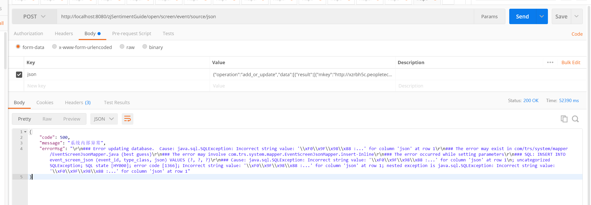
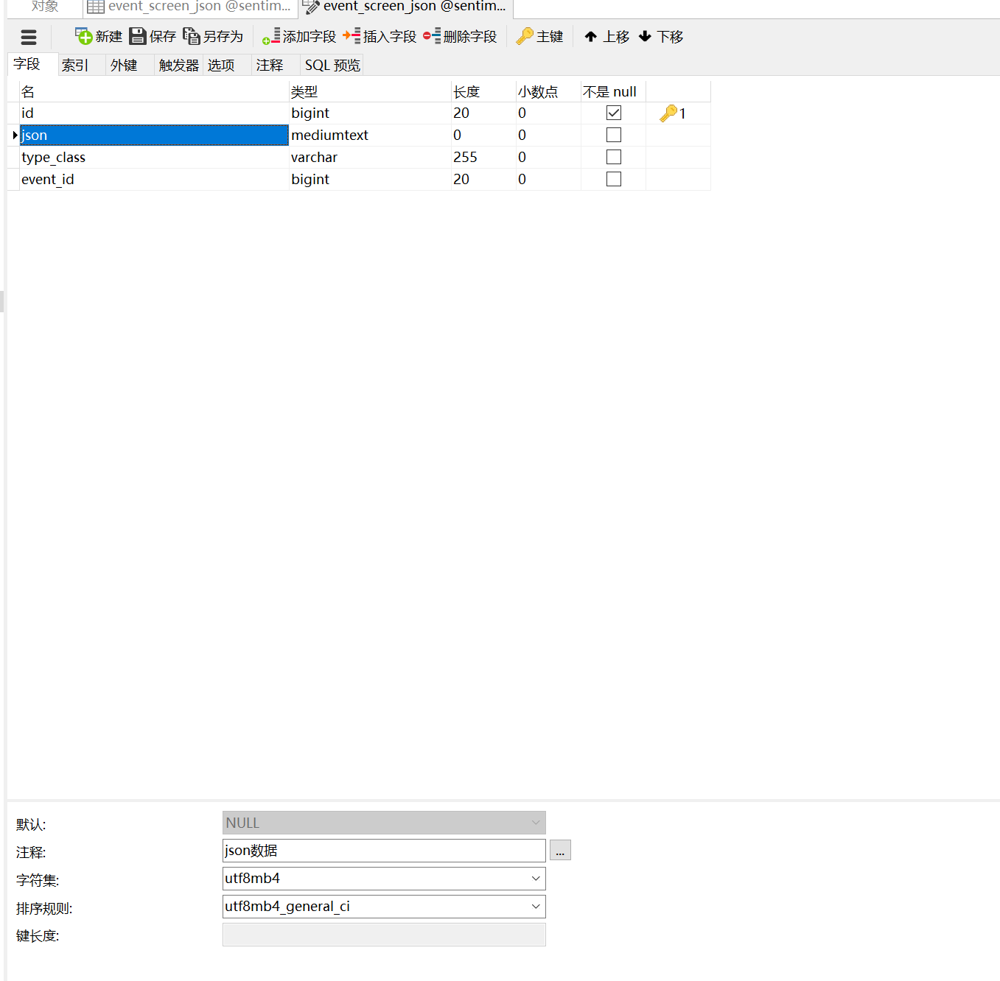

# 1 入库文字特殊格式异常



解决方案，设置对应编码



```json
{
    "code": 500,
    "message": "系统内部异常",
    "errorMsg": "\r\n### Error updating database.  Cause: java.sql.SQLException: Incorrect string value: '\\xF0\\x9F\\x98\\x88 :...' for column 'json' at row 1\r\n### The error may exist in com/trs/system/mapper/EventScreenJsonMapper.java (best guess)\r\n### The error may involve com.trs.system.mapper.EventScreenJsonMapper.insert-Inline\r\n### The error occurred while setting parameters\r\n### SQL: INSERT INTO event_screen_json (event_id, type_class, json) VALUES (?, ?, ?)\r\n### Cause: java.sql.SQLException: Incorrect string value: '\\xF0\\x9F\\x98\\x88 :...' for column 'json' at row 1\n; uncategorized SQLException; SQL state [HY000]; error code [1366]; Incorrect string value: '\\xF0\\x9F\\x98\\x88 :...' for column 'json' at row 1; nested exception is java.sql.SQLException: Incorrect string value: '\\xF0\\x9F\\x98\\x88 :...' for column 'json' at row 1"
}
```

