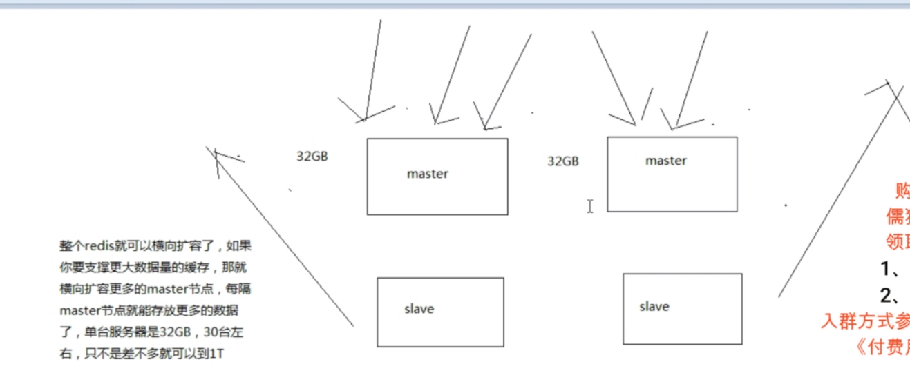

# 1 Redis Cluster场景

## 1.1、单机redis在海量数据面前的瓶颈


​	**PS:单机master的数据和slave节点的数据是一样的，master的数据上限决定了数据量，数据量不可能超过master的数据内存上限**

## 1.2、怎么才能够突破单机瓶颈，让redis支撑海量数据?



​	**PS:利用多master多节点，多主从的集群方式横向扩容。多个master+slave节点来横向扩容，达到服务海量数据的效果。**

## 1.3、redis的集群架构

​	redis cluster

​	支撑N个redis master node，每个master node都可以挂载多个slave node 的架构，对于每个master来说，写就写到master，然后读就从mater对应的slave去读

​	高可用，因为每个master都有salve节点，那么如果mater挂掉，redis cluster这套机制，就会自动将某个slave切换成masterredis cluster（多master＋高可用)

​	我们只要基于redis cluster去搭建redis集群即可，不需要手工去搭建replication复制+主从架构+哨兵集群+高可用

## 1.4、redis cluster  vs replication + sentinal

​	如果你的数据量很少，主要是承载高并发高性能的场景，比如你的缓存一般就几个6，单机足够了

​	replication，一个mater，多个slave，要几个slave跟你的要求的读吞吐量有关系，然后自己搭建一个sentinal集群，去保证redis主从架构的高可用性，就可以了

​	redis cluster，主要是针对海量数据+高并发+高可用的场景，海量数据，如果你的数据量很大，那么建议就用redis cluster

## 1.5 redis cluster介绍

​	1 自动将数据进行分片，每个master上放一部分数据

​	2 提供内置的高可用支持，部分master不可用时，还是可以继续工作的

​	3 **在redis cluster架构下，每个redis要放开两个端口号，比如一个是6379，另外一个就是加10000的端口号，比如16379**

​	4 16379端口号是用来进行节点间通信的，也就是cluster bus的东西，集群总线。cluster bus的通信，用来进行故障检测，配置更新，故障转移授权

​	5 cluster bus用了另外一种二进制的协议，主要用于节点间进行高效的数据转换，占用更少的网络带宽和处理时间

# 2 数据分布算法

hash算法->一致性hash算法(memcached)->redis cluster,hash slot算法

用不同的算法，就决定了在多个master节点的时候，数据如何分布到这些节点上去，解决这个问题

## 2.1 hash算法和弊端


​	**PS:hash算法是对hash值进行取模存储到对应的集群节点的，取模的数量是机器数(节点数)。如果某一个机器宕机，取模数量发生变化，会导致所有数据的取模位置发生改变，导致几乎所有数据取模错位，出现大量取不到数据的情况。**

## 2.2 一致性hash算法(自动缓存迁移)+虚拟节点（自动负载均衡）

## 2.1 一致性hash算法基本概念


​	**PS:节点是分布在圆环上对应的点，3个节点就对应3个点。对应key落在圆环上会顺时针找到最近的节点。如果某个节点宕机了，这个宕机的节点找不到了，会顺着圆环找下一个节点。所以节点宕机最多影响这个节点的数据找不到。不会影响其他节点的数据正常提供服务。**

​	**缓存热点问题：**

​	可能某个hash区间的值特别多，导致大量数据涌入同一个节点，造成master的热点问题，出现性能瓶颈。

## 2.2 虚拟节点


​	**PS:虚拟节点就是用来解决缓存热点问题的，在每个区间内都布置了对应的虚拟节点(粗圈)，这样就算某个区间内有大量的数据也会通过虚拟节点分布对应的其他节点中，避免大量数据涌入统一个节点内。**

## 2.3 redis cluster的hash slot算法

​	redis cluster有固定的16384个hash slot，对每个key计算CRC16值，然后对16384取模，可以获取key对应的hash slot

​	redis cluster中每个master都会持有部分slot，比如有3个master，那么可能每个master持有5000多个hash slot

​	hash slot 让 node的增加和移除很简单，增加一个mster，就将其他mster的hash slot移动部分过去，减少一个master，就将它的hash slot移动到其他master上去

​	移动hash slot的成本是非常低的

​	客户端的api，可以对指定的数据，让他们走同一个hash slot，通过hash tag来实现(在key中加)

**hash tag**

```java
//{blog}就是hashTag,在添加对应{}大括号就是tag,分配slot会根据大括号内的值计算hash
List<String> mget = jedisCluster.mget("{blog}:author1", "{blog}:content1", "{blog}:title1");
```


**PS:其中一个节点宕机后，redis会将宕机节点已经分布的hash slot重新分配到其他正常服务的节点中。这样就算某个节点宕机，短时间内也可以恢复。**

# 3 redis clust的搭建

## 3.1 启动6个实例及实例配置

**集群实例的基本配置**

```shell
cluster-enabled yes
#开启集群
cluster-config-file /etc/redis-cluster/node-7001.conf
#指定文件路径(只需指定即可，该文件由redis自动维护生成)
#该文件中供cluster模式下redis的集群状态信息，包括集群中其他机器的信息等
cluster-node-timeout 15000
#节点存活的超时时长，超过该时长，认为节点宕机，master宕机的话就会触发主备切换，slave宕机就不会提供服务
####上面是集群的设置，下面是实例的基本配置。具体文件路径、端口名、文件名可根据实际情况自定义配置
port 7001
#端口号,不同实例配置不同的端口号
daemonize yes
#后台启动
pidfile /var/run/redis_7001.pid
#指定pid
dir /var/redis/7001
#指定持久化文件路径
logfile /var/log/redis/7001.log
#指定日志路径
bind 192.168.31.187
#允许ip访问
appendonly yes
#开启aof

```

​	至少要有3个master节点启动，每个master加一个slave节点，先选择6个节点，启动6个实例

​	上面配置的配置文件，需要在不同的机器上放6个，比如:7001.confg、7002.confg、7003confg、7004.confg、7005.confg、7006.confg

**生产环境：**

​	可选择在/etc/init.d上放对应的启动脚本，脚本内容参考本地虚拟机服务器对应目录脚本文件

## 3.2 安装Ruby

```shell
yum install -y ruby
yum install -y rubygems
gem install redis
```

**安装问题：**

执行，gem install redis命令报


CentOS7 yum库中ruby的版本支持到 2.0.0,可gem 安装redis需要最低是2.2.2。所以yum install -y ruby会导致该问题。

**解决方式：**

### 3.2.1 安装RVM

安装一些常用工具（可选）

```shell
yum -y install zlib zlib-devel pcre pcre-devel gcc gcc-c++ openssl openssl-devel libevent libevent-devel perl unzip net-tools wget curl
```

开始安装

```shell
curl -L get.rvm.io | bash -s stable
```

执行报错:


设置host:

```shell
vi /etc/hosts
#在文件中添加下面地址
199.232.4.133 raw.githubusercontent.com
```

再次执行

```shell
curl -L get.rvm.io | bash -s stable
```

还是报错：


按照提示执行命令：

```shell
curl -sSL https://rvm.io/mpapis.asc | gpg2 --import - 
 
curl -sSL https://rvm.io/pkuczynski.asc | gpg2 --import -
```

再次执行脚本，安装成功：

```shell
curl -L get.rvm.io | bash -s stable
```

执行命令查看

```shell
find / -name rvm -print
```

出现8条数据，说明安装成功


使文件生效

```shell
source /usr/local/rvm/scripts/rvm
```

### 3.2.2 配置ruby及gem相关

```shell
rvm list known
#查看rvm库中已知的ruby版本
rvm install 2.3.3
#按照一个ruby版本
rvm use 2.3.3
#使用一个ruby版本
rvm use 2.3.3 --default
#设置默认版本
rvm remove 2.0.0
#卸载一个已知版本
ruby --version
#查看当前ruby版本
gem install redis
#安装redis gem
```

如图，出现对应信息说明安装 redis ruby gem 成功


参考资料：

https://blog.csdn.net/fengye_yulu/article/details/77628094

https://www.freesion.com/article/9982615185/

## 3.2 redis clust配置

启动6个实例，安装好redis ruby之后使用该命令来启动集群总线

```shell
redis-cli --cluster create 192.168.31.101:7001 192.168.31.101:7002 192.168.31.102:7003 192.168.31.102:7004 192.168.31.103:7005 192.168.31.103:7006 --cluster-replicas 1
```

提示改信息时，输入yes


ok说明集群总线启动成功，上图相关信息的M为master节点，s为对应的slave节点

```shell
redis-cli --cluster check 192.168.31.101:7001
#检查集群总线状态
```

**注意：** 集群总线的使用不仅是要开发redis对应端口，还需要开发总线端口。总线端口为redis端口加10000，如6379对应的总线端口为16379.

端口不通，或者nodes.conf文件不正确/不唯一。会导致Waiting for the cluster to join的情况


参考资料：

https://www.pianshen.com/article/4185403605/

**PS:redis cluster搭建一套，就有高可用(master宕机，slave自动切换)，多master(master横向扩容，支持更大数据量)**

# 4 redis分布式、高可用、扩展

## 4.1 知识扩展


## 4.2 不同master的读写操作

## 4.2.1 相关操作

在redis cluster中，需要在slave中读取数据需要带上readonly指令,get mykey1


在redis cluster中，不同的key是存入不同的master中的，set/get等操作key值时，redis会提示到对应的master去操作

通过redis-cli -c指令redis则会自动进行重定向操作

```shell
redis-cli -h 192.168.31.103 -p 7006
#redis-cli -h <ip> -p <port>
readonly
#允许slave节点读取数据
redis-cli -h 192.168.31.103 -p 7006 -c
#加上-c则会自动进行重定向
```

## 4.2.2 思路及扩展


**PS:下图实验，经过验证是可以实现的。通过redis-cli --cluster check 命令可以查看自动切换状态，是否成功恢复等信息**


**PS:redis clusert配置好之后，相关的信息都在node.conf的对应文件中，如果配置错误，或者误操作导致node.conf文件生成错误信息，需要删除node.conf文件，然后重新使用redis-cli --cluster create的命令来生成node.conf相关信息**

**PS:redis-cli --cluster create....初始化命令只需要执行一次即可，就算重启了相关的信息也被记录在node.conf文件中，无需再次执行redis-cli --cluster create....初始化命令，除非node.conf生成错误，或者其他异常情况，需要删除node.conf文件，才需要重新执行初始化命令**

# 4 redis cluster横向扩容，删除节点等操作

## 4.1 相关指令

```shell
redis-cli --cluster add-node 192.168.31.103:7007 192.168.31.101:7001
#redis-cli --cluster add-node <新增的节点> <任意在集群中的节点>
#添加节点
redis-cli --cluster check 192.168.31.101:7001
#检查节点 添加后检查下是否成功
redis-cli --cluster reshard 192.168.31.101:7001
#redis-cli --cluster reshard <任意在集群中的节点>
#重新移动节点的slot
#How many slots do you want to move (from 1 to 16384)? 4096(移动数量)
#What is the receiving node ID? (移动到那个节点的id)
#Source node #1: (提供原节点的node id 1/可以输入多个node,回车开始下一个,done结束)
#Do you want to proceed with the proposed reshard plan (yes/no)? yes(是否开始移动,yes开始移动)
redis-cli --cluster add-node 192.168.31.103:7008 192.168.31.101:7001 --cluster-slave --cluster-master-id  0ce024bc896806d45767c599278c64eeb4707dcb
#redis-cli --cluster add-node <新增的从节点> <任意在集群中的节点> --cluster-slave --cluster-master-id <对应主节点id>
#指定主节点
redis-cli --cluster add-node 192.168.31.101:7002 192.168.31.101:7001 --cluster-slave
#redis-cli --cluster add-node <新增的从节点> <任意在集群中的节点> --cluster-slave
#不指定主节点则优先分配没有从节点的主节点
redis-cli --cluster del-node 192.168.31.101:7001 be4666507e38a9845a2556feec6de5289f608dfd
#redis-cli --cluster del-node <任意在集群中的节点> <删除的节点id>

```

## 4.2 加入新master步骤

​	1  启动一个新的master实例    

​	 2 将实例节点添加到集群中

​     3 reshard重新计算slot，将之前的slot加入到该master实例中，不然没有slot，新加入的master相当于无用

​	**PS:reshard命令最好计算相关slot的平均数量，比如16384有4个节点平均数量就为4096,最好能均匀分布slot**

​	**PS:挂载新的节点，需要保证该节点无数据，dump,appendonly等持久化文件无数据,node.conf文件无信息,否则可能会出现下图异常**


## 4.3 加入新的slave步骤

​	1 启动新的实例

​	2 将实例节点通过添加slave命令 并指定master(也可以不指定)，添加到集群中去

## 4.4 删除node

​	1 如果是master则需要通过reshard先清空master的slot，再执行删除命令

​	2 如果是slave则直接删除

## 4.4 相关扩展

​	1 将master的slot通过reshard清空后，该master的slave节点会自动挂载在其他的master上

## 4.5 slave自动迁移


​	1 比如现在有10个master，每个有1个slave，然后新增了3个slave作为冗余，有的master就有2个slave了，有的master出现了salve冗余

​	2 如果某个master的slave挂了，那么redis cluster会自动迁移一个冗余的slave给那个master

​	3 只要多加一些冗余的slave就可以了

​	4 为了避免的场景，就是说，如果你每个master只有一个slave，万一说一个slave死了，然后很快，master也死了，那可用性还是降低了

​	5 但是如果你给整个集群挂载了一些冗余slave，那么某个master的slave死了，冗余的slave会被自动迁移过去，作为master的新slave，此时即使那个master也死了还是有一个slave会切换成master的

​	6 之前有一个master是有冗余slave的，直接让其他master其中的一个slave死掉，然后看有冗余slave会不会自动挂载到那个master

​	**PS:总结就是可以选择挂载部分冗余slave，这样某些master的slave挂了，该master没有slave了，其他的master的冗余slave就会自动迁移到该master上，使其又有对应slave了，这系统的可用性就提高了很多**

# 5 redis cluster的核心原理分析

## 5.1 节点间的内部通信机制

### 5.1.1 基础通信原理

**1 rediss cluster节点间采取gossip协议进行通信**

​	跟集中式不同，不是将集群元数据(节点信息，故障等等)集中存储在某个节点上，而是互相之间不断通信，保持整个集群所有节点的数据是完整的

​	维护集群的元数据分：集中式，gossip

**集中式：**

​	优点，元数据的更新和读取，时效性非常好，一旦元数据出现了变更，立即就更新到集中式的存储中，其他节点读取的时候立即就可以感知到

​	缺点，所有的元数据的更新压力全部集中在一个地方，可能导致元数据的存储有压力

**gossip(流言算法/疫情传播算法)**

​	优点，元数据的更新比较分散，不是集中在一个地方，更新请求会陆陆续续打到所有节点上去更新，有一定的延时，降低了压力

​	缺点，元数据更新有延时，可能导致集群的一些操作会有一些滞后

比如做rehard之后，马上去做另一个操作，会发现出现configuration error(未达成一致等)异常信息出现

**2 10000端口**

​	每个节点都有一个专门用于节点间通信的端口，就是自己提供服务的端口后+10000，比如7001那么用于节点间通信的就是17001端口，每个节点每隔一段时间都会往另外几个节点发送ping信息，同时其他几个节点接收到ping之后返回pong

**3 交换的信息**

​	故障信息，节点的增加和移除，hash slot信息，等等

### 5.1.2 gossip协议

gossip协议包含多种消息，包括ping,pong,meet,fail,等等

​	meet:某个节点发送meet给新加入的节点，让新节点加入集群中，然后新节点就会开始于其他节点进行通信

​	//add-node命令其实就是内部发送了一个gossip meet消息，给新加入的节点，通知那个节点去加入集群

​	ping:每个节点都会频繁给其他节点发送ping，其中包含自己的状态还有自己维护的集群元数据，互相通过ping交换元数据

​	//每个节点每秒都会频繁发送ping给其他的集群，ping，频繁的互相之间交换数据，互相进行元数据的更新

​	pong:返回ping和meet，包含自己的状态和其他信息，也可以用于信息广播和更新

​	fail:某个节点判断另一个节点fail之后，就发送fail给其他节点，通知其他节点，指定的节点宕机了

### 5.1.3 ping消息深入

​	1 ping很频繁，而且要携带一些元数据，所以可能会加重网络负担

​	2 每个节点每秒会执行10次ping，每次会选择5个最久没有通信的其他节点

​	3 当然如果发现某个节点通信延时达到了cluster_node_timeout/ 2，那么立即发送ping，避免数据交换延时过长

​	//比如说，两个节点之间都10分钟没有交换数据了，那么整个集群处于严重的元数据不一致的情况，就会有问题

​	4 所以cluster_node_timeout可以调节，如果调节比较大，那么会降低发送的频率

​	5 每次ping，一个是带上自己节点的信息，还有就是带上1/10其他节点的信息，发送出去，进行数据交换

​	6 至少包含3个其他节点的信息，最多包含总节点-2个其他节点的信息

## 5.2 面向集群的jedis内部实现原理

​	开发，jedis，redis的java client客户端，redis cluster，jedis cluster apijedis cluster api与redis cluster集群交互的一些基本原理

### 5.2.1 基于重定向的客户端

​	redis-cli  -c，自动重定向

(1)请求重定向

​	客户端可能会挑选任意一个redis实例去发送命令，每个redis实例接收到命令，都会计算key对应的hash slot

​	如果在本地就在本地处理，否则返回moved给客户端，让客户端进行重定向

​	cluster keyslot mykey，可以查看一个key对应的hash slot是什么

​	用redis-cli的时候，可以加入-c参数，支持自动的请求重定向，redis-cli接收到moved之后，会自动重定向到对应的节点执行命令

(2) 计算hash slot

​	计算hash slot的算法，就是根据key计算cRC16值，然后对16384取模，拿到对应的hash slot

​	用hash tag可以手动指定key对应的slot，同一个hash tag下的key，都会在一个hash slot中，比如 set key1:{100} 和 set key2:{100}

(3)  hash slot查找

​	节点间通过gossip协议进行数据交换，就知道每个hash slot在哪个节点上

### 5.2.2 smart jedis

(1) 什么是smart jedis

​	1 基于重定向的客户端，很消耗网络TO，因为大部分情况下，可能都会出现一次请求重定向，才能找到正确的节点

​	2 所以大部分的客户端，比如java redis客户端，就是jedis，都是smart的

​	3 本地维护一份hashslot -> node的映射表，缓存，大部分情况下，直接走本地缓存就可以找到hashslot -> node，不需要通过节点进行moved重定向

(2) JedisCluster的工作原理

​	1 在JedisCluster初始化的时候，就会随机选择一个node，初始化hashslot -> node映射表，同时为每个节点创建一个JedisPool连接池

​	2 每次基于Jediscluster执行操作，首先Jediscluster都会在本地计算key的hashslot，然后在本地映射表找到对应的节点

​	3 如果那个node正好还是持有那个hashslot，那么就ok;如果说进行了reshard这样的操作，可能hashslot已经不在那个node上了，就会返回moved

​	4 如果Jediscluter API发现对应的节点返回moved，那么利用该节点的元数据，更新本地的hashslot -o node映射表缓存

​	5 重复上面几个步骤，直到找到对应的节点，如果重试超过5次，那么就报错，JedisClusterWaxRedirectionException

​	6 jedis老版本，可能会出现在集群某个节点故障还没完成自动切换恢复时，频繁更新hash slot，频繁ping节点检查活跃，导致大量网络ro开销

​	7 jedis最新版本，对于这些过度的hash slot更新和ping，都进行了优化，避免了类似问题

(3) hashslot迁移和ask重定向

​	1 如果hash slot正在迁移，那么会返回ask重定向给jedis

​	2 jedis接收到ask重定向之后，会重新定位到目标节点去执行，但是因为ask发生在hash slot迁移过程中，所以JedisCluster APt收到ask是不会更新hashslot本地缓存

​	3 已经可以确定说，hashslot已经迁移完了，moved是会更新本地hashslot->node映射表缓存的

## 5.3 高可用与主备切换原理

​	redis cluster的高可用的原理，几乎跟哨兵是类似的

### 5.3.1 判断节点宕机

​	1 如果一个节点认为另外一个节点宕机，那么就是pfail，主观宕机

​	2 如果多个节点都认为另外一个节点宕机了，那么就是fail，客观宕机，跟哨兵的原理几乎一样，sdown，odown

​	3 在cluster-node-timeout内，某个节点一直没有返回pong，那么就被认为pfail

​	4 如果个节点认为某个节点pfalI了，那么会在gossip ping消息中，ping给其他节点，如果超过半数的节点都认为pfail了，那么就会变成fail

### 5.3.2 从节点过滤

​	1 对宕机的master node，从其所有的slave node中，选择一个切换成master node

​	2 检查每个slave node与master node断开连接的时间，如果超过了cluster-node-timeout * cluster-slave-validity-factor，那么就没有资格切换成master

​	3 这个也是跟哨兵是一样的，从节点超时过滤的步骤

### 5.3.3 从节点选举

​	1 哨兵:对所有从节点进行排序，slave priority，offset,run id

​	2 每个从节点，都根据自己对mster复制数据的offset，来设置一个选举时间, offset越大《复制数据越多）的从节点，选举时间越靠前，优先进行选举

​	3 所有的master node开始slave选举投票，给要进行选举的slave进行投票，如果大部分master node (N/2 + 1）)都投票给了某个从节点，那么选举通过;

​	4 从节点执行主备切换，从节点切换为主节点

### 5.3.4 与哨兵比较

​	整个流程跟哨兵相比，非常类似，所以说，redis cluster功能强大，直接集成了replication和sentinal的功能

# 6 redis cluster使用注意点

​	hash_tag可以将多个key强制分配到一个节点上，它的操作时间=1次网络时间+n次命令时间。

​	具体方法为：选定某一个tag，比如test，然后将它用大括号{}括起来，粘贴到key里面。比如key1和key2，这两个key有可能分配到不同的node。但是，如果是{test}key1和{test}key2，redis集群在判断时，就会取出大括号里面的字符串作为hashtag来计算节点。因此，{test}key1和{test}key2会被分配到一个节点中

使用大括号（槽(slot)按照大括号中的key进行分配）

**redis3.2.5高版本支持大括号内分配slot(未验证低版本是否可行)**

```java
Long msetnx = jedisCluster.mset(
                "{blogauthor}11", "xjx",
                "{blogauthor}22", "大数据库",
                "{blogauthor}33", "略略略略略",
                "{blogauthor}44", "123");
```

不加大括号

```Java
Long msetnx = jedisCluster.mset(
                "{blogauthor}11", "xjx",
                "{blogauthor}22", "大数据库",
                "{blogauthor}33", "略略略略略",
                "{blogauthor}44", "123");
```

​	不加则会抛出异常No way to dispatch this command to Redis Cluster because keys have different slots.意思就是批量操作key，在不同的槽(slot)，无法进行一次性操作


引用：

​	https://blog.csdn.net/qq_30431719/article/details/81121688

​	https://blog.csdn.net/weixin_34334744/article/details/92088324
