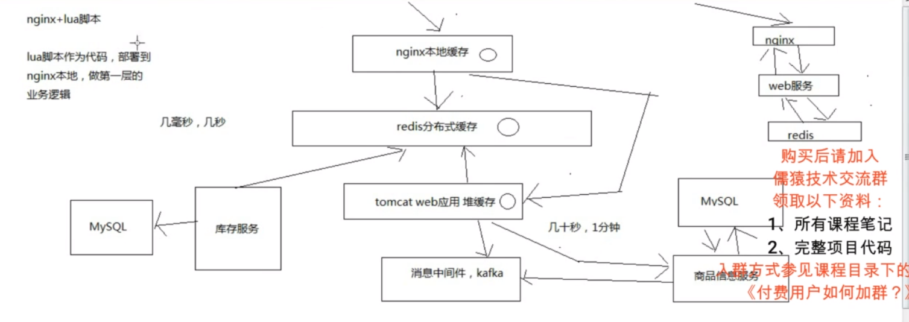
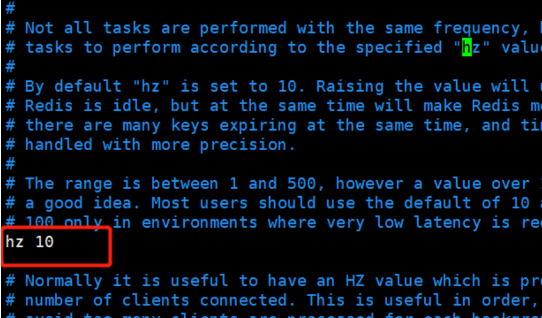
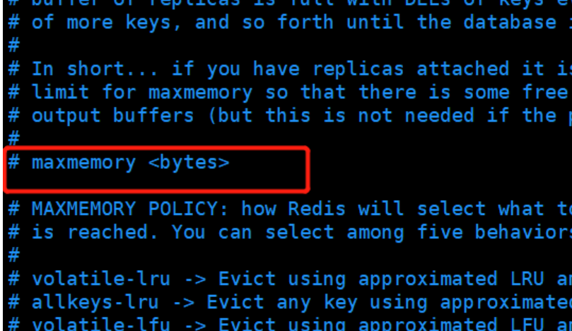
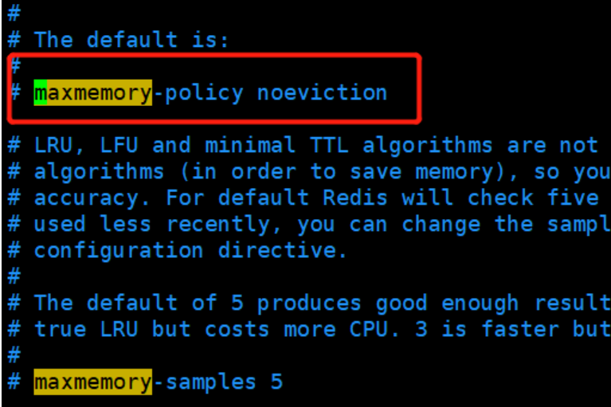

# 1 常见问题的优化

## 1.1、fork耗时导致高并发请求延时

​	RDB和AOF的时候，其实会有生成RDB快照，AOF rewrite，耗费磁盘Io的过程，主进程fork子进程

​	fork的时候，子进程是需要拷贝父进程的空间内存页表的，也是会耗费一定的时间的

​	一般来说，如果父进程内存有1个G的数据，那么fork可能会耗费在2ms左右，如果是10G~30G，那么就会耗费20 *10，甚至20 * 30，也就是几百毫秒的时间

​	info stats中的latest_fork_usec，可以看到最近一次form的时长

​	redis单机QPS一般在几万，fork可能一下子就会拖慢几万条操作的请求时长，从几毫秒变成1秒

**优化思路**

​	fork耗时跟redis主进程的内存有关系，一般控制redis的内存在10GB以内，slave -> master，全量复制

## 1.2、AOF的阻塞问题

​	redis将数据写入AOF缓冲区，单独开一个现场做fsync操作，每秒一次

​	但是redis主线程会检查两次fsync的时间，如果距离上次fsync时间超过了2秒，那么写请求就会阻塞everysec，最多丢失2秒的数据

​	一旦fsync超过2秒的延时，整个redis就被拖慢

**优化思路**

​	优化硬盘写入速度，建议采用ssD，不要用普通的机械硬盘，SD，大幅度提升磁盘读写的速度

## 1.3、主从复制延迟问题

​	主从复制可能会超时严重，这个时候需要良好的监控和报警机制

​	在info replication中，可以看到master和slave复制的offset，做一个差值就可以看到对应的延迟量如果延迟过多，那么就进行报警

## 1.4、主从复制风暴问题

​	如果一下子让多个slave从master去执行全量复制，一份大的rdb同时发送到多个slave，会导致网络带宽被严重占用如果一个master真的要挂载多个slave，那尽量用**树状结构(slave下再挂slave)**，不要用**星型结构(所有slave都挂载master上)**

## 1.5、vm.overcommit _memory

0:检查有没有足够内存,没有的话申请内存失败

1:允许使用内存直到用完为止

2:内存地址空间不能超过swap + 50%

如果是0的话，可能导致类似fork等操作执行失败，申请不到足够的内存空间

```shell
cat /proc/sys/vm/overcommit_memory
echo "vm.overcommit_memory-1" >> letc/sysctl.conf
sysctl vm.overcommit _memory=1 T
```

## 1.6、swapiness

cat /proc/version，查看linux内核版本

如果linux内核版本<3.5，那么swapiness设置为0，这样系统宁愿swap也不会oom killer（杀掉进程)

如果linux内核版本>=3.5，那么swapiness设置为1，这样系统宁愿swap也不会oom killer

保证redis不会被杀掉

```shell
echo 0 > /proc/sys/vm/swappiness
echo vm.swapiness=0  /etc/sysctl.conf
```

## 1.7、最大打开文件句柄

```shell
ulimit -n 10032 10032
#不同liunx版本打开句柄命令有一点的区别
```

## 1.8、tcp backlog

```shell
cat /proc/sys/net/core/somaxconn
echo 511 > /proc/sys/net/core/somaxconn
```

# 2 redis解决的问题

​	redis;持久化、复制(主从架构)、哨兵《高可用，主备切换)、redis cluster(海量数据+横向扩容+高可用/主备切换)

​	持久化。高可用的一部分，在发生redis集群灾难的情况下（比如说部分master+slave全部死掉了)，如何快速进行数据恢复，快速实现服务可用，才能实现整个系统的高可用

​	复制:主从架构，master -) slave复制，读写分离的架构，写master，读slave，横向扩容slave支撑更高的读吞吐，读高并发，10万，20万，30万，上百万，QPS，横向扩容

​	哨兵:高可用，主从架构，在master故障的时候，快速将slave切换成master，实现快速的灾难恢复，实现高可用性

​	**redis cluster**:多master读写，数据分布式的存储，横向扩容，水平扩容，快速支撑高达的数据量+更高的读写0PS，自动进行master -〉 slave的主备切换,高可用。

​	让底层的缓存系统，redis，实现能够任意水平扩容，支撑海量数据(1T+，几十T，10G * 600 redis =
6T)，支撑很高的读写QPS (redis单机在几万QPS， 10台，几十万QPS)，高可用性（给我们每个redis实例都做好A0F+和RDB的备份策略+容灾策略，slave -master主备切换 1T+海量数据、10万+读写QPs、99.99%高可用性

# 3 多级缓存

## 3.1 三级缓存

​	**采用三级缓存:nginx本地缓存+redis分布式缓存+tomcat堆缓存的多级缓存架构**

​	**nginx本地缓存**，抗的是热数据的高并发访问，一般来说，商品的购买总是有热点的，比如每天购买iphone、nike、海尔等知名品牌的东西的人，总是比较多的

​	这些热数据，利用nginx本地缓存，由于经常被访问，所以可以被锁定在nginx的本地缓存内

​	大量的热数据的访问，就是经常会访问的那些数据，就会被保留在nginx本地缓存内，那么对这些热数据的大量访问，就直接走nginx就可以

​	那么大量的访问，直接就可以走到nginx就行了，不需要走后续的各种网络开销了

​	**redis分布式大规模缓存**，抗的是很高的离散访问，支撑海量的数据，高并发的访问，高可用的服务

​	redis缓存最大量的数据，最完整的数据和缓存，1T+数据;支撑高并发的访问，oPs最高到几十万;可用性，非常好，提供非常稳定的服务

​	nginx本地内存有限，也就能cache住部分热数据，除了各种iphone、nike等热数据，其他相对不那么热的数据，可能流量会经常走到redis那里

​	利用redis cluster的多master写入，横向扩容，1T+以上海量数据支持，几十万的读写OPS，99.99%高可用性，那么就可以抗住大量的离散访问请求

​	**tomcat jvm堆内存缓存**，主要是抗redis大规模灾难的，如果redis出现了大规模的宕机，导致ngimx大量流量直接涌入数据生产服务，那么最后的tomcat堆内存缓存至少可以缓冲一下，不至于mysql直接裸奔

​	同时tomcat jvm堆内存缓存，也可以抗住redis没有cache住的最后那少量的部分缓存



**综合使用:**

​	nginx+lua脚本做页面动态生成的工作，每次请求过来，优先从nginx本地缓存中提取各种数据，结合页面模板，生成需要的页面

​	如果nginx本地缓存过期了，那么就从nginx到redis中去拉取数据，更新到nginx本地

​	如果redis中也被LRU算法清理掉了，那么就从nginx走http接口到后端的服务中拉取数据，数据生产服务中，现在本地tomcat里的jym堆缓存中找，ehcache,如果有被LRU清理掉了，那么久重新发送

​	请求到源头的服务中去拉取数据，然后再次更新tomcat堆内存缓存+redis缓存，并返回数据给nginx，nginx缓存到本地

## 3.2 相关样例

​	**时效性要求非常高的数据:**库存
​	一般来说，显示的库存，都是时效性要求会相对高一些，因为随着商品的不断的交易，库存会不断的变化，当然，我们就希望当库存变化的时候，尽可能更快将库存显示到页面上去，而不是说等了很长时间，库存才反应到页面上去

​	**时效性要求不高的数据:**商品的基本信息（名称、颜色、版本、规格参数，等等)

​	时效性要求不高的数据，就还好，比如说你现在改变了商品的名称，稍微晚个几分钟反应到商品页面上，也还能接受

# 4 Cache Aside Pattern缓存

## 4.1 基本模式

最经典的缓存+数据库读写的模式，cache aside pattern1、Cache Aside Pattern

​	(1) 读的时候，先读缓存，缓存没有的话，那么就读数据库，然后取出数据后放入缓存，同时返回响应

​	(2）更新的时候，先删除缓存，然后再更新数据库

## 4.2、为什么是删除缓存，而不是更新缓存呢?

​	原因很简单，很多时候，复杂点的缓存的场景，因为缓存有的时候，不简单是数据库中直接取出来的值

​	商品详情页的系统，修改摩存，只是修改了某个表的某些字段，但是要真正把这个影响的最终的库存计算出来，可能还需要从其他表查询一些数据，然后进行一些复杂的运算，才能最终计算出现在最新的库存是多少，然后才能将库存更新到缓存中去

​	比如可能更新了某个表的一个字段，然后其对应的缓存，是需要查询另外两个表的数据，并进行运算，才能计算出缓存最新的值的

​	更新缓存的代价是很高的

​	是不是说，每次修改数据库的时候，都一定要将其对应的缓存去跟新一份﹖也许有的场景是这样的，但是对于比较复杂的缓存数据计算的场景，就不是这样了

​	如果你频繁修改一个缓存涉及的多个表，那么这个缓存会被频繁的更新，频繁的更新缓存

​	但是问题在于，这个缓存到底会不会被频繁访问到? ??

​	举个例子，一个缓存涉及的表的字段，在1分钟内就修改了20次。或者是100次，那么缓存跟新20次，1次;但是这个缓存在1分钟内就被读取了1次，有大量的冷数据

​	28法则，黄金法则，20%的数据，占用了80%的访问量

​	实际上，如果你只是删除缓存的话，那么1分钟内，这个缓存不过就重新计算一次而已，开销大幅度降低

​	每次数据过来，就只是删除缓存。然后修改数据库，如果这个缓存，在1分钟内只是被访问了1次，那么只有那1次，缓存是要被重新计算的，用缓存才去算缓存

​	其实删除缓存，而不是更新缓存，就是一个lazy计算的思想，不要每次都重新做复杂的计算，不管它会不会用到，而是让它到需要被使用的时候再重新计算

​	mybatis，hibernate，懒加载，思想

# 5 Redis的过期策略及淘汰机制

## 5.1 过期时间

Redis提供了四个命令来设置过期时间（生存时间）

　　①、EXPIRE <key> <ttl> ：表示将键 key 的生存时间设置为 ttl 秒。

　　②、PEXPIRE <key> <ttl> ：表示将键 key 的生存时间设置为 ttl 毫秒。

　　③、EXPIREAT <key> <timestamp> ：表示将键 key 的生存时间设置为 timestamp 所指定的秒数时间戳。

　　④、PEXPIREAT <key> <timestamp> ：表示将键 key 的生存时间设置为 timestamp 所指定的毫秒数时间戳。

　　PS：在Redis内部实现中，前面三个设置过期时间的命令最后都会转换成最后一个PEXPIREAT 命令来完成。

　　另外补充两个知识点：

　　**一、移除键的过期时间**

　　PERSIST <key> ：表示将key的过期时间移除。

　　**二、返回键的剩余生存时间**

　　TTL <key> ：以秒的单位返回键 key 的剩余生存时间。

　　PTTL <key> ：以毫秒的单位返回键 key 的剩余生存时间。

**Redis过期时间的判定**

​	在Redis内部，每当我们设置一个键的过期时间时，Redis就会将该键带上过期时间存放到一个**过期字典**中。当我们查询一个键时，Redis便首先检查该键是否存在过期字典中，如果存在，那就获取其过期时间。然后将过期时间和当前系统时间进行比对，比系统时间大，那就没有过期；反之判定该键过期。

## 5.2 过期策略

　通常删除某个key，我们有如下三种方式进行处理。

#### ①、定时删除

　　在设置某个key 的过期时间同时，我们创建一个定时器，让定时器在该过期时间到来时，立即执行对其进行删除的操作。

　　优点：定时删除对内存是最友好的，能够保存内存的key一旦过期就能立即从内存中删除。

　　缺点：对CPU最不友好，在过期键比较多的时候，删除过期键会占用一部分 CPU 时间，对服务器的响应时间和吞吐量造成影响。

#### ②、惰性删除

　　设置该key 过期时间后，我们不去管它，当需要该key时，我们在检查其是否过期，如果过期，我们就删掉它，反之返回该key。

　　优点：对 CPU友好，我们只会在使用该键时才会进行过期检查，对于很多用不到的key不用浪费时间进行过期检查。

　　缺点：对内存不友好，如果一个键已经过期，但是一直没有使用，那么该键就会一直存在内存中，如果数据库中有很多这种使用不到的过期键，这些键便永远不会被删除，内存永远不会释放。从而造成内存泄漏。

#### ③、定期删除

　　每隔一段时间，我们就对一些key进行检查，删除里面过期的key。

　　优点：可以通过限制删除操作执行的时长和频率来减少删除操作对 CPU 的影响。另外定期删除，也能有效释放过期键占用的内存。

　　缺点：难以确定删除操作执行的时长和频率。

　　　　　如果执行的太频繁，定期删除策略变得和定时删除策略一样，对CPU不友好。

　　　　　如果执行的太少，那又和惰性删除一样了，过期键占用的内存不会及时得到释放。

　　　　　另外最重要的是，在获取某个键时，如果某个键的过期时间已经到了，但是还没执行定期删除，那么就会返回这个键的值，这是业务不能忍受的错误。

**Redis的过期删除策略就是：惰性删除和定期删除两种策略配合使用:**

​		**惰性删除**：Redis的惰性删除策略由 db.c/expireIfNeeded 函数实现，所有键读写命令执行之前都会调用 expireIfNeeded 函数对其进行检查，如果过期，则删除该键，然后执行键不存在的操作；未过期则不作操作，继续执行原有的命令。

　　**定期删除**：由redis.c/activeExpireCycle 函数实现，函数以一定的频率运行，每次运行时，都从一定数量的数据库中取出一定数量的随机键进行检查，并删除其中的过期键。

　　注意：并不是一次运行就检查所有的库，所有的键，而是随机检查一定数量的键。

　　定期删除函数的运行频率，在Redis2.6版本中，规定每秒运行10次，大概100ms运行一次。在Redis2.8版本后，可以通过修改配置文件redis.conf 的 **hz** 选项来调整这个次数。



​	看上面对这个参数的解释，建议不要将这个值设置超过 100，否则会对CPU造成比较大的压力。

## 5.3 内存淘汰策略/机制

​	我们看到，通过过期删除策略，对于某些永远使用不到的键，并且多次定期删除也没选定到并删除，那么这些键同样会一直驻留在内存中，又或者在Redis中存入了大量的键，这些操作可能会导**致Redis内存不够用，这时候就需要Redis的内存淘汰策略了**。

#### ①、设置Redis最大内存

　　在配置文件redis.conf 中，可以通过参数 maxmemory <bytes> 来设定最大内存：



　　不设定该参数默认是无限制的，但是通常会设定其为物理内存的四分之三。

#### ②、设置内存淘汰方式

　　当现有内存大于 maxmemory 时，便会触发redis主动淘汰内存方式，通过设置 maxmemory-policy ，有如下几种淘汰方式：

　　1）volatile-lru  利用LRU算法移除设置过过期时间的key (LRU:最近使用 Least Recently Used ) 。

　　2）**allkeys-lru**  利用LRU算法移除任何key （和上一个相比，删除的key包括设置过期时间和不设置过期时间的）。**通常使用该方式**。

　　3）volatile-random 移除设置过过期时间的随机key 。

　　4）allkeys-random 无差别的随机移除。

　　5）volatile-ttl  移除即将过期的key(minor TTL) 

　　6）noeviction 不移除任何key，只是返回一个写错误 ，**默认选项，一般不会选用。**

　　在redis.conf 配置文件中，可以设置淘汰方式：



## 5.4 对RDB及AOF的影响

**过期key对RDB没有任何影响**

- 从内存数据库持久化数据到RDB文件
  - **持久化key之前，会检查是否过期，过期的key不进入RDB文件**
- 从RDB文件恢复数据到内存数据库
  - **数据载入数据库之前，会对key先进行过期检查，如果过期，不导入数据库（主库情况）**

**过期key对AOF没有任何影响**

- 从内存数据库持久化数据到AOF文件：
  - **当key过期后，还没有被删除，此时进行执行持久化操作（该key是不会进入aof文件的，因为没有发生修改命令）**
  - **当key过期后，在发生删除操作时，程序会向aof文件追加一条del命令（在将来的以aof文件恢复数据的时候该过期的键就会被删掉）**
- AOF重写
  - **重写时，会先判断key是否过期，已过期的key不会重写到aof文件** 

## 5.5 总结

　　①、如何设置Redis键的过期时间？

​	通过EXPIRE 相关命令设置

　　②、设置完一个键的过期时间后，到了这个时间，这个键还能获取到么？假如获取不到那这个键还占据着内存吗？

​	一般是结合惰性策略和定期策略，到时间就算没有被定期策略清除的话，这个时候去获取的话惰性策略也会去清除，获取不到的。

​	获取不到的建会在惰性策略获取的时候去清除。

　　③、如何设置Redis的内存大小？当内存满了之后，Redis有哪些内存淘汰策略？我们又该如何选择？

​	可以在配置文件中设置，不设置的话通常为物理内存的四分之三。

​	有6种淘汰策略，常用利用LRU算法移除任何key （删除的key包括设置过期时间和不设置过期时间的），其他还有随机删除，仅删除已过期的LRU，不删除仅返回写错误等淘汰策略。

引用：https://www.cnblogs.com/ysocean/p/12422635.html#_label4_0

引用：https://www.cnblogs.com/xuliangxing/p/7151812.html