# 1 高并发场景下的缓存+数据库双写不一致问题分析与解决方案

**PS:以下问题及解决方案都是基于Cacae Aside Pattern模式**

## 1.1 初级的缓存不一致问题及解决方案

​	**问题：**先修改数据库，再删除缓存，如果删除缓存失败了，那么会导致数据库中是新数据，缓存中是旧数据，数据出现不一致

​	**解决思路：**先删除缓存，再修改数据库，如果删除缓存成功了，修改数据库失败了，那么数据库是旧数据，缓存中是空的，那么数据不会不一致，因为都读的时候缓存没有，则数据库中的旧数据更新到缓存中

## 1.2 比较复杂的数据不一致问题分析

### 1.2.1 并发场景下的缓存不一致问题

**问题：**

​	数据发生了变更，先删除缓存，然后去修改数据库，此时还没修改

​	这个时候一个读请求过滤，发现缓存空了，去查询数据库，查到了修改前的旧数据，放到了缓存中

​	数据变更的程序完成了数据库的修改，此时又出现数据库和缓存中数据不一样了

**解决方案：**

​	更新数据的时候，根据数据的唯一标识，将操作路由之后，发送到一个JVM内部的队列中

​	读取数据的时候，如果发现数据不在缓存中，那么将重新读取数据+更新缓存的操作，根据唯一标识路由之后，也发送同一个JVM内部的队列中

​	一个队列对应一个工作线程

​	每个工作线程串行拿到对应的操作，然后一条一条的执行

​	这样的话，一个数据变更的操作，先执行，删除缓存，然后再去更新数据库，但是还没完成更新

​	此时如果一个读请求过来，读到了空的缓存，那么可以先将缓存更新的请求发送到队列中，此时会在队列中积压，然后同步等待缓存更新完成

**优化点：**

​	一个队列中多个读请求(更新缓存)串在一起是没意义的，可以做过滤。如果发现队列中已经有一个读请求(更新缓存)了，那么就不放这个操作进去了，直接等待前面的更新操作请求完成即可,后续等待的读请求就直接能读取缓存中的数据了。

​	设置一个等待的时间范围，在时间范围内轮询发现可以取到值了就直接返回。超过请求时长可以返回旧值(查数据库)/抛出异常(看业务需要)。

**图示：**

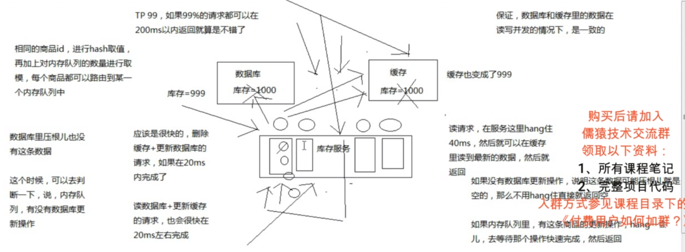

### 1.2.2 高并发场景，该方案应该注意的问题

**1 风险点-读请求长时间阻塞/写操作较多：**

​	可能数据更新很频繁。导致队列积压了大量更新操作，然后读请求大量超时，导致大量请求直接走数据库/异常，真实场景一定需要通过模拟真实的测试，看看更新数据的频率是否能支持。

**优化点：**

​	如果更新操作比较频繁，一个队列积压多个商品库存的更新操作。可以选择部署多个服务，每个服务分摊一些数据的更新操作。

**服务的预估：**

​	单机器：20个内存队列，每个队列可能积压5个写操作(100写QPS)，假如一个写操作20ms完成，20*5=100，读操作等待100ms，还是可以接受的

​	如果写QPS扩大10倍，那么久扩容机器，扩容10倍机器，10台机器，每个机器20个队列

**2 风险点-读请求并发量过高**

​	这里还必须做好压力测试，确保恰巧碰上上述情况的时候。还有一个风险，就是突然间大量读请求会在几十毫秒的延时,在服务上等待，看服务能不能抗的住，需要多少机器才能抗住大的极项情况的峰值

**优化点：**

​	做好读和写比例的优化测试，按照1:99的比例，每秒5万的读QPS,可能只有500次更新操作。每个更新操作可能影响1:1,1:2,1:3的读操作500*3也就是影响1000+的读操作，按照分队列的方案每个读请求等待200ms左右返回都是ok的

**3 风险点-热点商品的路由问题，导致请求的倾斜**

​	万一某个商品的读写请求特别高，全部打到相同的机器的相同的队列里面去了，可能造成某台机器的压力过大

​	就是说，因为只有在商品数据更新的时候才会清空缓存，然后才会导致读写并发，所以更新频率不是太高的话，这个问题的影响并不是特别大但是的确可能某些机器的负载会高一些

**优化点：**

​	评估实际业务，根据热点商品调整资源倾斜，热点商品多分配队列/机器，及服务器性能等操作

## 1.3 多服务实例部署的请求路由

​	可能这个服务部署了多个实例，那么必须保证说，执行数据更新操作，以及执行缓存更新操作的请求，都通过nginx服务器路由到相同的服务实例上

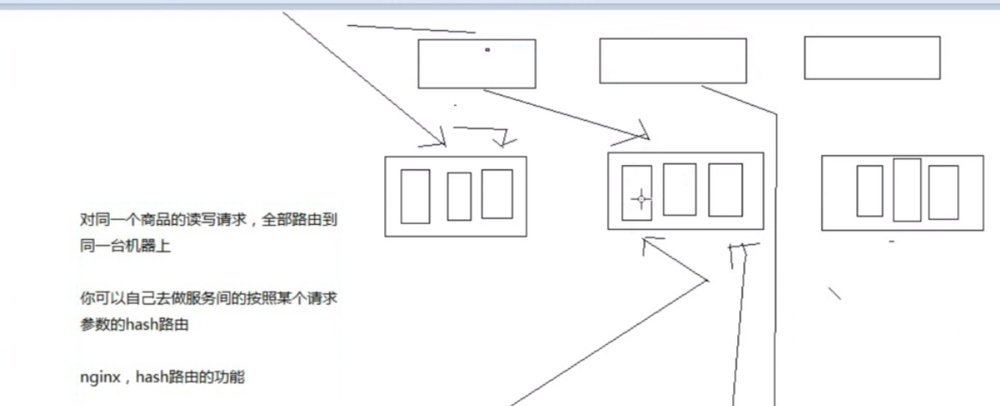

## **1.4 EhCache**

​	EhCache 是一个纯Java的进程内缓存框架，具有快速、精干等特点，是Hibernate中默认CacheProvider。Ehcache是一种广泛使用的开源Java分布式缓存。主要面向通用缓存,Java EE和轻量级容器。它具有内存和磁盘存储，缓存加载器,缓存扩展,缓存异常处理程序,一个gzip缓存servlet过滤器,支持REST和SOAP api等特点。

　　Spring 提供了对缓存功能的抽象：即允许绑定不同的缓存解决方案（如Ehcache），但本身不直接提供缓存功能的实现。它支持注解方式使用缓存，非常方便。

引用：https://www.cnblogs.com/myseries/p/11370109.html

# 2 缓存雪崩、缓存穿透、缓存击穿

## 2.1 缓存雪崩

### 2.1.1 缓存雪崩出现的情况及原因

​	**1、redis集群彻底雪崩**

​	2、缓存服务大量对redis的请求hang住，占用资源

​	3、缓存服务大量的请求打到源头服务去查询mysql，直接打死mysql

​	4、源头服务因为mysql被打死也崩溃，对源服务的请求也hang住，占用资源

​	5、缓存服务大量的资源全部耗费在访问redis和源服务无果，最后自己被拖死，无法提供服务

​	6、nginx无法访问缓存服务，redis和源服务，只能基于本地缓存提供服务，但是缓存过期后，没有数据提供

​	7、网站崩溃

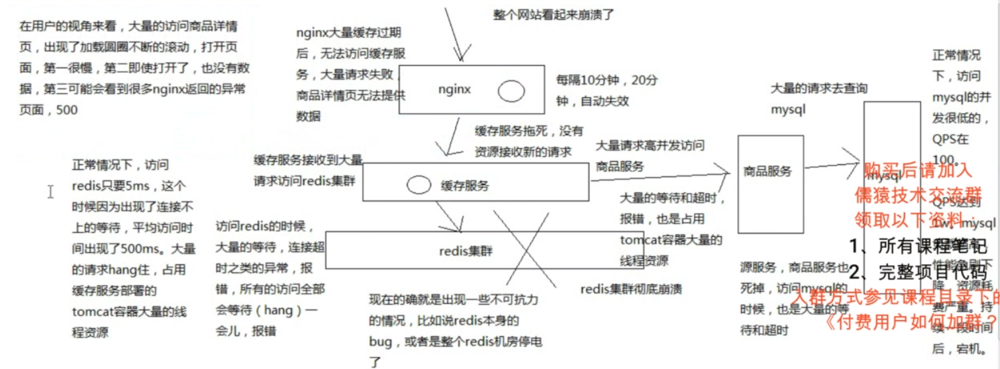

​	redis集群在什么情况会彻底崩溃，redis集群自身的bug/redis集群机房断电 都可能导致redis集群彻底崩溃

**真实案例：**

​	行业里真实的缓存雪崩的经验和教训

​	某电商，之前就是出现过，整个缓存的集群彻底崩溃了，因为主要是集群本身的bug，导致自己把自己给弄死了，虽然当时也是部署了双机房的，但是还是死了

​	电商大量的，几乎所有的应用都是基于那个缓存集群去开发的

​	导致各种服务的线程资源全部被耗尽，然后用在了访问那个缓存集群时的等待、超时和报错上了

​	然后导致各种服务就没有资源对外提供服务

​	然后各种降级措施也没做好，直接就是整体系统的全盘崩溃

​	导致网站就没法对外出售商品，导致了很大数额的经济的损失

**扩展：**

​	需要对技术有高要求的话需要多学，多思考一些各种场景下的缓存架构，用来解决各种各样的问题

​	自己做系统架构设计的时候，需要考虑各种高并发场景下可能出现的问题，数据不一致，热点缓存，重建并发冲突，缓存雪崩，缓存穿透，缓存击穿，架构设计考虑的到位，稳定性就有保障，真正发生故障的时候能减少损失

### 2.1.2 缓存雪崩的解决方案

​	相对来说，考虑比较完善的一套方案，分为事前，事中，事后三个层次去思考怎么应对缓存雪崩的场景

**事前：**

​	发生缓存雪崩之前，事情之前，怎么去避免redis彻底挂掉

​	redis本身的高可用性，复制，主从架构，操作主节点，读写，数据同步到从节点，一旦主节点挂掉，从节点跟上

​	双机房部署，一套redis cluster，部分机器在一个机房，另一部分机器在另外一个机房

​	还有一种部署方式，两套redis cluster，两套redis cluster之间做一个数据的同步，redis集群是可以搭建成树状的结构的一旦说单个机房出了故障，至少说另外一个机房还能有些redis实例提供服务

**事中：**

redis cluster已经彻底崩溃了，已经开始大量的访问无法访问到redis了

(1) ehcache本地缓存
	所做的多级缓存架构的作用上了，ehcache的缓存，应对零散的redis中数据被清除掉的现象，另外一个主要是预防redis彻底崩溃

​	多台机器上部署的缓存服务实例的内存中，还有一套ehcache的缓存

​	ehcache的缓存还能支撑一阵

(2) 对redis访问的资源隔离

(3）对源服务访问的限流以及资源隔离（hystrix熔断/隔离）


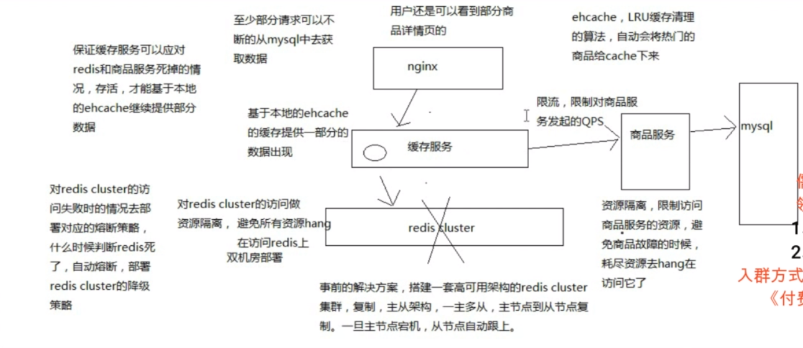

**事后：**

(1) redis数据可以恢复，做了备份，redis数据备份和恢复，redis重新启动起来

(2) redis数据彻底丢失了，或者数据过旧，快速缓存预热(热点请求的数据先入缓存)，redis重新启动起来

redis对外提供服务

​	缓存服务里，熔断策略，自动可以恢复，half-open，发现redis可以访问了，自动恢复了，自动就继续去访问redis了

​	基于hystrix的高可用服务这块技术，缓存服务去设计成高可用的架构

​	缓存架构应对高并发下的缓存雪崩的解决方案，基于hystrix去做缓存服务的保护

**基于sentinel的降级机制**

​	资源隔离，避免说redis访问频繁失败，或者频繁超时的时候，耗尽大量的tomcat容器的资源去hang在redis的访问上

​	限定只有一部分线程资源可以用来访问redis

​	如果redis集群彻底崩溃了，这个时候，可能command对redis的访问大量的报错和timeout超时，熔断（短路)

​	**降级机制，fallback**

​	**fail silent模式**，fallback里面直接返回一个空值，比如一个null，最简单了

​	在外面调用redis的代码(CacheService类)，是感知不到redis的访问异常的，只要你把timeout、熔断、熔断恢复、降级，都做好了

​	可能会出现的情况是，当redis集群崩溃的时候，CacheService获取到的是大量的null空值

​	根据这个null空值，我们还可以去做多级缓存的降级访问，nginx本地缓存，redis分布式集群缓存，ehcache本地缓存，CacheController(代码访问redis为Null，就去ehcache本地缓存去找)

### 2.1.2 其他解释

**描述**：大量的热点 key 设置了相同的过期时间，**导在缓存在同一时刻全部失效，造成瞬时数据库请求量大、压力骤增，引起雪崩，甚至导致数据库被打挂**。

**缓存雪崩**其实有点像“升级版的缓存击穿”，缓存击穿是一个热点 key，缓存雪崩是一组热点 key。

解决方案：

1、**过期时间打散**。既然是大量缓存集中失效，那最容易想到就是让他们不集中生效。可以给缓存的过期时间时加上一个随机值时间，使得每个 key 的过期时间分布开来，不会集中在同一时刻失效。

2、**热点数据不过期**。该方式和缓存击穿一样，也是要着重考虑刷新的时间间隔和数据异常如何处理的情况。

3、**加互斥锁**。该方式和缓存击穿一样，按 key 维度加锁，对于同一个 key，只允许一个线程去计算，其他线程原地阻塞等待第一个线程的计算结果，然后直接走缓存即可。

**PS:缓存雪崩的原因/解释有很多种，最关键的是redis服务全部出现问题，导致数据库及相关服务挂了，就可以被称作缓存雪崩。**

## 2.2 缓存穿透

**现象：**

​	读请求从，多级缓存，nginx,缓存服务(ehcache)，redis集群，到mysql都查不到数据返回空，读请求一直为空，在高并发的情况下，压力都来到了mysql

​	**现象通用描述：**访问一个缓存和数据库都不存在的Key,此时会直接打到数据库上，没法写缓存，所以下一次通用会打到数据库上，此时缓存起不到任何作用，每次请求都会走到数据，流量大时数据库可能会被打挂，此时缓存就好像被"穿透"了一样，起不到任何作用

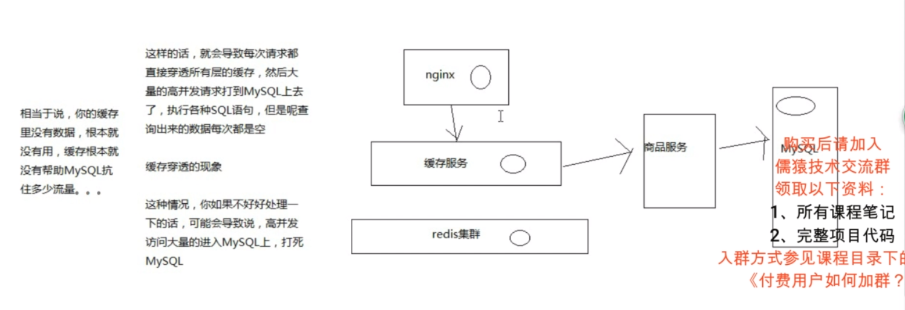

**解决方案：**

​	**1 接口校验：**正常业务流程一般不会出现大量访问不存在的key的情况，所以这种场景最大的可能性是遭受到了非法攻击。可以在最外层先做一层校验。用户鉴权、数据合法性校验等。列如对商品查询的id校验等

​	**2 缓存空值：**当访问缓存和DB都没有查询到值时，可以将空值写入缓存，设置较短的过期时间，该时间根据具体业务制定

​	**3 布隆过滤器：**使用布隆过滤器存储所有可能访问的key,不存在的key直接过滤，存在的key则进一步查询缓存和数据库

## 2.3 缓存击穿

**描述：**

​	某一个热点key，在缓存过期的一瞬间，同时有大量的请求打进来，由于此时缓存过期了，所以请求最终都会走到数据库，造成瞬时数据库请求量大，压力骤增，甚至可能打垮数据库

**解决方案：**

​	1 **加互斥锁**，在并发的多个请求中，只有第一个请求线程能拿到锁并执行数据库查询操作，其他的线程拿不到锁就阻塞等着，等到第一个线程将数据写入缓存后，直接走缓存

​	 **互斥锁的选择**：

​		redis分布式锁，可以保证只有一个请求会走到数据库，这是一种思路

```java
/**
redis分布式锁伪代码
*/

public Object getData(String key) throws InterruptedException {
    Object value = redis.get(key);
    // 缓存值过期
    if (value == null) {
        // lockRedis：专门用于加锁的redis；
        // "empty"：加锁的值随便设置都可以
        if (lockRedis.set(key, "empty", "PX", lockExpire, "NX")) {
            try {
                // 查询数据库，并写到缓存，让其他线程可以直接走缓存
                value = getDataFromDb(key);
                redis.set(key, value, "PX", expire);
            } catch (Exception e) {
                // 异常处理
            } finally {
                // 释放锁
                lockRedis.delete(key);
            }
        } else {
            // sleep50ms后，进行重试
            Thread.sleep(50);
            return getData(key);
        }
    }
    return value;
}
```

​		其实大多数情况没必要保证只有一个请求走到数据库，只要保证走数据库的请求能大大降低即可，所以另一个思路是JVM锁

​		JVM锁保证了单台服务器上只有一个请求走到数据库，能保证降低服务器压力，性能也比分布式锁要好

​	**2 热点数据不过期，直接将缓存设置为不过期，然后由定时任务去异步加载数据更新缓存。**

​	这种适用于较少的业务场景，例如流量特别大的场景，使用时需要考虑业务能接受数据不一致的情况，还有异常情况的处理，避免缓存刷新导致脏数据等问题的产生

# 3 布隆过滤器及相关知识

## 3.1 使用场景

　比如有如下几个需求：

​		1、原本有10亿个号码，现在又来了10万个号码，要快速准确判断这10万个号码是否在10亿个号码库中？

　　2、接触过爬虫的，应该有这么一个需求，需要爬虫的网站千千万万，对于一个新的网站url，我们如何判断这个url我们是否已经爬过了

　　3、同理还有垃圾邮箱的过滤。

　　那么对于类似这种，大数据量集合，如何准确快速的判断某个数据是否在大数据量集合中，并且不占用内存，**布隆过滤器**应运而生了。

## 3.2 简介

**什么是布隆过滤器**

　　布隆过滤器：一种数据结构，是由一串很长的**二进制向量(bit向量)**组成，可以将其看成一个**二进制数组(bit数组)**。既然是二进制，那么里面存放的不是0，就是1，但是初始默认值都是0。

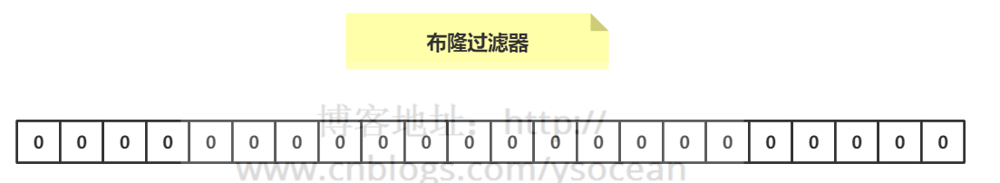

**如何向布隆过滤器中添加一个数据**

　　如下图所示：当要向布隆过滤器中添加一个元素key时，我们通过多个hash函数，算出一个值，然后将这个值所在的方格置为1。

　　比如，下图hash1(key)=1，那么在第2个格子将0变为1（数组是从0开始计数的），hash2(key)=7，那么将第8个格子置位1，依次类推

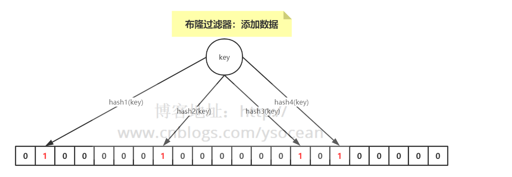


**如何判断其是否存在于这个布隆过滤器中**

　　很简单，我们只需要将这个新的数据通过上面自定义的几个哈希函数，分别算出各个值，然后看其对应的地方是否都是1，如果存在一个不是1的情况，那么我们可以说，该新数据一定不存在于这个布隆过滤器中。

　　反过来说，如果通过哈希函数算出来的值，对应的地方都是1，那么我们能够肯定的得出：这个数据一定存在于这个布隆过滤器中吗？

　　答案是否定的，因为多个不同的数据通过hash函数算出来的结果是会有重复的，所以会存在某个位置是别的数据通过hash函数置为的1。

　　我们可以得到一个结论：**布隆过滤器可以判断某个数据一定不存在，但是无法判断一定存在**。

**优缺点**

​	优点：优点很明显，二进制组成的数组，占用内存极少，并且插入和查询速度都足够快。

​	缺点：随着数据的增加，误判率会增加；还有无法判断数据一定存在；另外还有一个**重要缺点，无法删除数据。**

## 3.3 redis实现布隆过滤器

### 3.3.1 实现原理

#### bitmaps

　　我们知道计算机是以二进制位作为底层存储的基础单位，一个字节等于8位。

　　比如“big”字符串是由三个字符组成的，这三个字符对应的ASCII码分为是98、105、103，对应的二进制存储如下

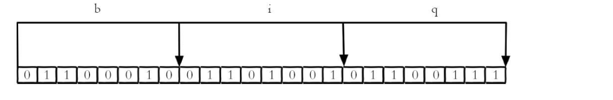

在Redis中，Bitmaps 提供了一套命令用来操作类似上面字符串中的每一个位。

```shell
setbit key offset value
```

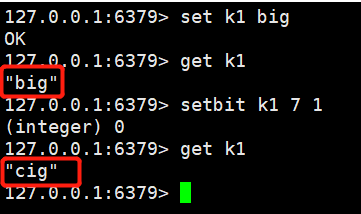

​	我们知道"b"的二进制表示为0110 0010，我们将第7位（从0开始）设置为1，那0110 0011 表示的就是字符“c”，所以最后的字符 “big”变成了“cig”

**获取值**

```shell
gitbit key offset
```

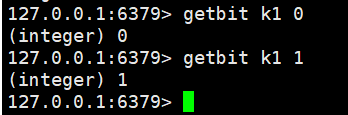

**获取位图指定范围值为1的个数**

```shell
bitcount key [start end]
#如果不指定，那就是获取全部值为1的个数。
#注意：start和end指定的是字节的个数，而不是位数组下标
```

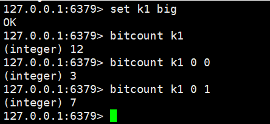

### 3.3.2 基于Redisson实现

​	Redis 实现布隆过滤器的底层就是通过 bitmap 这种数据结构，至于如何实现，这里就不重复造轮子了，介绍业界比较好用的一个客户端工具——Redisson。

　Redisson 是用于在 Java 程序中操作 Redis 的库，利用Redisson 我们可以在程序中轻松地使用 Redis。

　下面就通过 Redisson 来构造布隆过滤器。

```java
package com.ys.rediscluster.bloomfilter.redisson;

import org.redisson.Redisson;
import org.redisson.api.RBloomFilter;
import org.redisson.api.RedissonClient;
import org.redisson.config.Config;

public class RedissonBloomFilter {

    public static void main(String[] args) {
        Config config = new Config();
        config.useSingleServer().setAddress("redis://192.168.14.104:6379");
        config.useSingleServer().setPassword("123");
        //构造Redisson
        RedissonClient redisson = Redisson.create(config);

        RBloomFilter<String> bloomFilter = redisson.getBloomFilter("phoneList");
        //初始化布隆过滤器：预计元素为100000000L,误差率为3%
        //设置期望误差率的大小和预计元素大小，影响布隆过滤器的数据结构的长度
        //期望误差率不能大于1(100%)
        bloomFilter.tryInit(100000000L,0.03);
        //将号码10086插入到布隆过滤器中
        bloomFilter.add("10086");

        //判断下面号码是否在布隆过滤器中
        System.out.println(bloomFilter.contains("123456"));//false
        System.out.println(bloomFilter.contains("10086"));//true
    }
}
```

​	这是单节点的Redis实现方式，如果数据量比较大，期望的误差率又很低，那单节点所提供的内存是无法满足的，这时候可以使用分布式布隆过滤器，同样也可以用 Redisson 来实现

## 3.4 guava实现布隆过滤器

​	不用Redis如何来实现布隆过滤器。

　guava 工具包，这是谷歌公司提供的，里面提供了布隆过滤器的实现

```java
package com.ys.rediscluster.bloomfilter;

import com.google.common.base.Charsets;
import com.google.common.hash.BloomFilter;
import com.google.common.hash.Funnel;
import com.google.common.hash.Funnels;

public class GuavaBloomFilter {
    public static void main(String[] args) {
        //可以不设置期望误差率，默认0.03
        BloomFilter<String> bloomFilter = BloomFilter.create(Funnels.stringFunnel(Charsets.UTF_8),100000,0.01);
		
        bloomFilter.put("10086");

        System.out.println(bloomFilter.mightContain("123456"));
        System.out.println(bloomFilter.mightContain("10086"));
    }
}
```

引用资料：

https://www.cnblogs.com/ysocean/p/12594982.html

