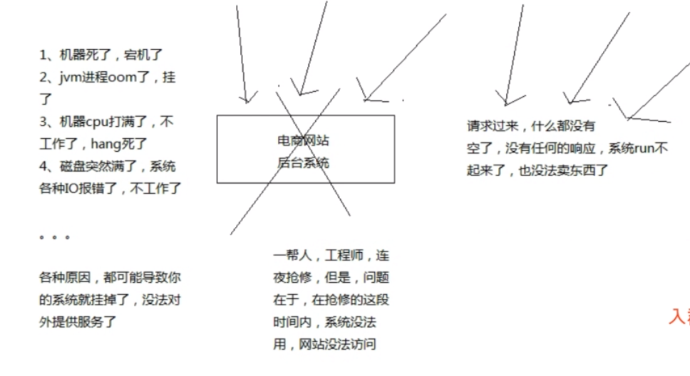
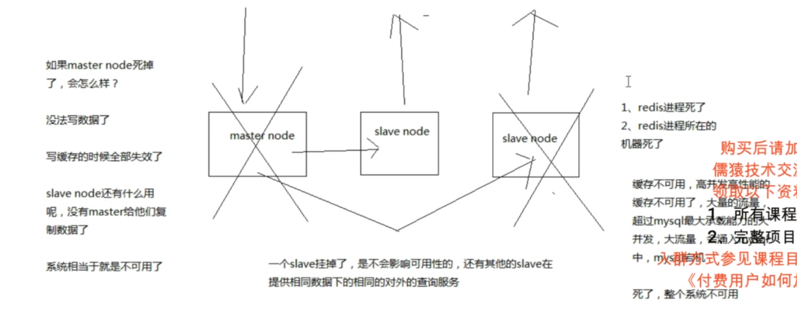
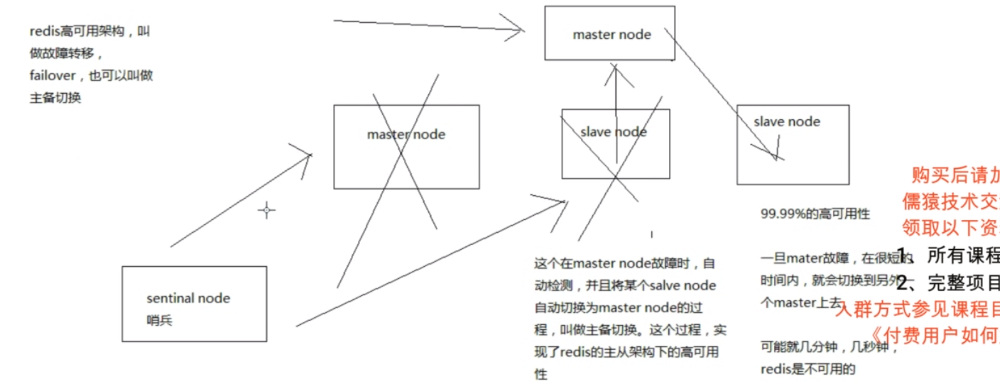
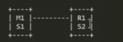
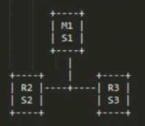
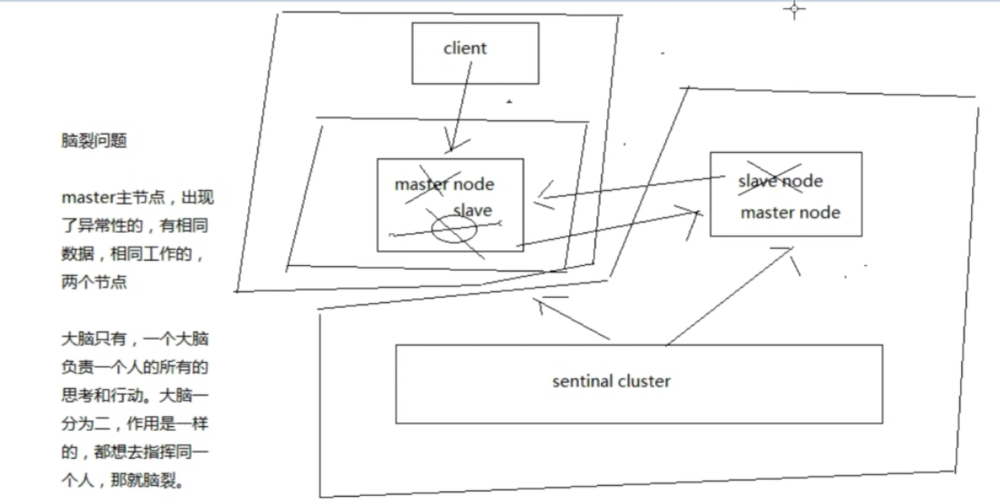
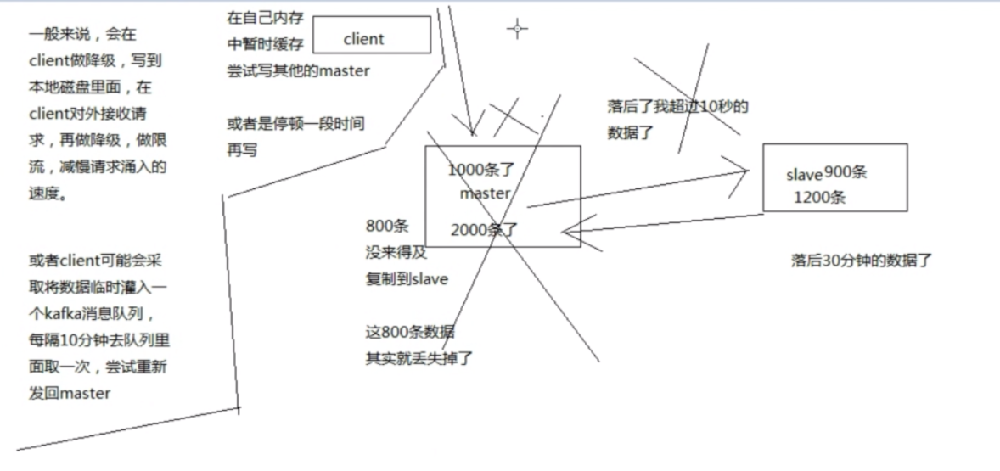
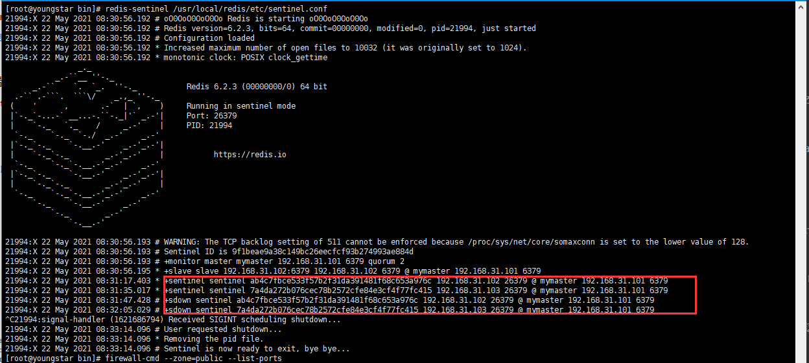
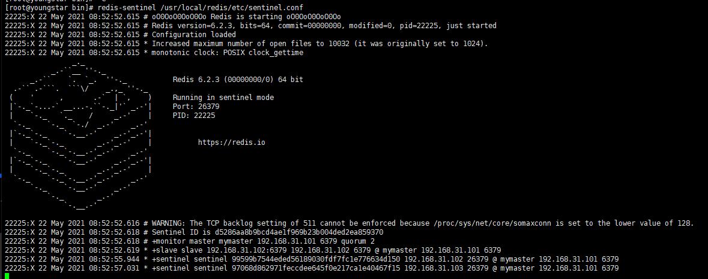

# 1 高可用、redis高可用、如何做到redis高可用

**不可用的情况**



**PS:系统挂啦，很长时间都没办法恢复，用户没办法访问系统，就代表不可用**

**高可用的理解：**

如果系统可以保证全年，99.99%的时间内，都处于可用的状态，那么久可以称之为高可用性(99%/99.9%也可以)

**redis的不可用**



**PS:redis主节点挂啦，没有主节点，没法写数据，就代表不可用**

**redis高可用**



**PS:redis的故障转移(failover)，也可以叫做主备切换，可以通过sential node(哨兵来实现)，实现了failover的redis可以称之为高可用**


# 2 redis哨兵架构相关基础知识

## 2.1 哨兵的介绍

sentinal(哨兵)

哨兵是redis集群架构中非常重要的一个组件，主要功能如下

(1) 集群监控，负责监控redis master和slave进程是否正常工作

(2）消息通知，如果某个redis实例有故障，那么哨兵负责发送消息作为报警通知给管理员

(3) 故障转移，如果master node挂掉了，会自动转移到slave node上

(4) 配置中心，如果故障转移发生了，通知client客户端新的master地址

哨兵本身也是分布式的，作为一个哨兵集群去运行，互相协同工作

(1）故障转移时，判断一个master node是宕机了，需要大部分的哨兵都同意才行，涉及到了分布式选举的问题

(2）即使部分哨兵节点挂掉了，哨兵集群还是能正常工作的，因为如果一个作为高可用机制重要组成部分的故障转移系统本身是单点的，那就很坑爹了目前采用的是sentinal 2版本，sentinal 2相对于sentinal 1来说，重写了很多代码，主要是让故障转移的机制和算法变得更加健壮和简单

## 2.2、哨兵的核心知识

(1) 哨兵至少需要3个实例，来保证自己的健壮性

(2）哨兵 +redis主从的部署架构，是不会保证数据零丢失的，只能保证redis集群的高可用性

(3）对于哨兵+ redis主从这种复杂的部署架构，尽显在测试环境和生产环境，都进行充足的测试和演练

## 2.3、为什么redis哨兵集群只有2个节点无法正常工作?

哨兵集群必须部署2个以上节点

### 2.3.1 哨兵相关名词含义

**quorum(法定人数)**:确认odown的最少的哨兵数量

**majority(多数)**：授权进行主从切换的最少的哨兵数量,一般majority为哨兵节点的一半及以上，

比如2的majority=2，3的majority=2，4的majority=2，5的majority=3 等

### 2.3.2**哨兵故障情况及流程**



如果哨兵集群仅仅部署了个2个哨兵实例，则quorum=1，最少哨兵数量为1

当:Configuration:quorum= 1的情况

master宕机，s1和s1只要有一个哨兵认为master宕机就可以进行切换，同时s1和s2会选举出一个哨兵来进行故障转移，同时这个时候还需要进行majority(多数同意)，如果2个哨兵在运行着就可以多数通过选举出master节点

如果整个m1和s1运行的机器宕机了，那么哨兵只有1个了，此时没有majority(多数同意)来运行执行故障转移，虽然还有一个哨兵及slave节点，但是故障转移不会执行

### 2.3.4 经典3节点的哨兵集群



Configuration:quorum= 2

如果M1所在的机器宕机了，那么3个哨兵还剩下2个，s2和s3可以一致认为master宕机,然后选举出一个来执行故障转移，同时3个哨兵的majority是2，所以还剩下2个哨兵运行着，就可以允许执行故障转移

## 2.4 异步复制、集群脑裂，导致的数据丢失问题

### 2.4.1 两种数据丢失的情况

**1 异步复制导致的数据丢失**

​	因为master -> slave的复制是异步的，所以可能有部分数据还没复制到slaave,master就宕机了，此时这些部分数据就丢失了

**2 脑裂导致的数据丢失**

​	**在CAP理论中**，C代表一致性，A代表可用性（在一定时间内，用户的请求都会得到应答），P代表分区容错

​	**脑裂:**集群因为网络故障等原因，造成了网络分区，部分网络不能互通。master和slave由于分区不能连接

​	在脑裂的情况，哨兵可能会认为master宕机了，然后开启选举，将其他的slave切换成了master，这样就会造成两个master，也就是所谓的脑裂。如果client没有切换到新的master,还在继续向旧的master写数据，当旧的master再次恢复的时候，会被作为一个slave挂到新的master上去。然后清空自己的数据，从新的master获取数据。这个时候client在脑裂期间写的数据就丢失了。



### 2.4.2 解决异步复制和脑裂导致的数据丢失


```shell
 min-replicas-to-write 3
 # 至少3个slave节点无法复制(同步)
 min-replicas-max-lag 10
 # 至少每个slave节点有10秒以上的时间无法复制(同步)

#以上参数配合就是，要求至少3个副本，延迟<= 10秒使用
#一旦不满足该条件，master(主节点)就会拒绝写入数据的请求
```

​	配置以上两个参数后可以减少异步复制和脑裂导致的数据丢失

1 减少异步复制的数据丢失

​	有了min-replicas-max-lag这个配置，就可以确保说一旦slave复制数据和ack延时太长，就认为可能master宕机损失的数据太多了，那么就拒绝写请求，这样就可以吧master宕机时由于部分数据未同步到slave，导致数据的丢失降低到可控范围内。



2 减少脑裂的数据丢失

​	如果一个master出现了脑裂，跟其他slave丢了连接，那么上面两个配置可以确保说，如果不能继续给指定数量的slave发送数据，而且slave超过十秒没有给自己ask消息，那么就会拒绝客户端的写请求。

​	这样脑裂后旧逇master就不会接受client的新数据，也就避免了数据丢失

​	因此在脑裂场景下最多丢失10秒(**可配置**)的数据

## 2.5 redis哨兵多个核心底层原理深入解析

### 2.5.1 sdown和odown转换机制

sdown和odown两种失败状态

sdown是主观宕机，就一个哨兵如果自己觉得一个master宕机了，那么就是主观宕机

odown是客观宕机，如果quorum数量的哨兵都觉得一个master宕机了，那么就是客观宕机

sdown达成的条件很简单，如果一个哨兵ping一个master，超过了is-master-down-after-milliseconds指定的毫秒数之后，就主观认为master宕机

sdown到odown转换的条件很简单，如果一个哨兵在指定时间内，收到了quorum指定数量的其他哨兵也认为那个master是sdown了，那么就认为是odown了，客观认为master宕机

### 2.5.2 哨兵集群的自动发现机制

​	哨兵互相之间的发现，是通过redis的pub/sub系统实现的，每个哨兵都会往 _ sentinel _ :hello这个channel里发送一个消息，这时候所有其他哨兵都可以销费到这个消息，并感知到其他的哨兵的存在

​	每隔两秒钟，每个哨兵都会往自己监控的某个master+slaves对应的 _ sentinel _ :hello channel里发送一个消息，内容是自己的host、ip和runid还有对这个master的监控配置

​	每个哨兵也会去监听自己监控的每个master+slaves对应的_ sentinel _:hello chanmel，然后去感知到同样在监听这个 master+slaves的其他哨兵的存在每个哨兵还会跟其他哨兵交换对master的监拉配置，互相进行监控配置的同步

​	**PS:哨兵监听的端口未开发时，初始化时能发现其他哨兵，但是过了超时时间后，哨兵之间会出现sdown**



### 2.5.3 slave配置的自动纠正

​	哨兵会负责自动纠正slave的一些配置，比如slave如果要成为潜在的master候选人，哨兵会确保slave在复制现有master的数据;如果slave连接到了一个错误的master上，比如故障转移之后，那么哨兵会确保它们连接到正确的master上

### 2.5.4 slave->master选举算法

​	如果一个master被认为odown了，而且majority哨兵都允许了主备切换，那么某个哨兵就会执行主备切换操作，此时首先要选举一个slave来

会考虑slave的一些信息

​	(1)跟master断开连接的时长

​	(2) slave优先级

​	(3)复制offset

​	(4) run id

​	如果一个slave跟master断开连接已经超过了down-after-milliseconds的10倍，外加master宕机的时长，那么slave就被认为不适合选举为master(down-after-milliseconds * 10) + milliseconds_since_master_is_in_SDOMN_state
接下来会对slave进行排序

​	(1)按照slave优先级进行排序，slave priority越低，优先级就越高

​	(2）如果slave priority相同，那么看replica offset，哪个slave复制了越多的数据，offset越靠后，优先级就越高

​	(3）如果上面两个条件都相同，那么选择一个run id比较小的那个slave

### 2.5.5、quorum和majority

​	每次一个哨兵要做主备切换，首先需要quorum数量的哨兵认为odown，然后选举出一个哨兵来做切换，这个哨兵还得得到majority哨兵的授权才能正式执行切换

​	如果quorum < majority，比如5个哨兵，majority就是3，quorum设置为2，那么就3个哨兵授权就可以执行切换

​	但是如果quorum >= majority，那么必须quorum数量的哨兵都授权，比如5个哨兵，quorum是5，那么必须5个哨兵都同意授权，才能执行切按

### 2.5.6、configuration epoch

​	哨兵会对一套 redis master+slave进行监控，有相应的监控配置

​	执行切换的那个哨兵，会从要切换到的新master那里得到一个configuration epoch，这就是一个version号，每次切换的version号都必须是唯一的

​	如果第一个选举出的哨兵切换失败了，那么其他哨兵，会等待failover-timeout时间，然后接替继续执行切换，此时会重新获取一个新的configuration epoch,作为新的version号

### 2.5.7、configuraiton传播

​	哨兵完成切换之后，会在自己本地更新生成最新的master配置，然后同步给其他的哨兵，就是通过之前说的pub/sub消息机制

​	这里之前的version号就很重要了，因为各种消息都是通过一个channe1去发布和监听的，所以一个哨兵完成一次新的切换之后,新的master配置是跟着新的version号的

​	其他的哨兵都是根据版本号的大小来更新自己的master配置的

# 3 哨兵的安装部署及容灾演练

## 3.1 哨兵的配置文件

redis安装目录下的sentinel.conf配置文件

​	每一个哨兵都可以去监控多个master-slaves的主从架构，可以给每个主从集群分配一个逻辑的名称(mymaster就是逻辑名称，可以自定义)

```shell
bind 127.0.0.1
#配置对应ip发现
sentinel monitor mymaster 127.0.0.1 6379 2
#监控对应master <group-name/指定名称> <ip地址> <端口号> <quorum>
dir /usr/local/redis/26379
#设置哨兵文件目录
sentinel down-after-milliseconds mymaster 30000
#超过多少毫秒和redis实例断开连接，哨兵就可以认为这个实例挂了
sentinel failover-timeout mymaster 180000
#执行故障转移的超时时长，超时就说明切换失败了，就会有其他的哨兵接替来执行主备切换
sentinel parallel-syncs mymaster 1
#执行master切换的时候，同时执行多少个slave被切换到新的master,
#同时执行的slave越小(数字越小)，花费的时间越多,因为同时执行的slave少，需要执行的次数就变多了
sentinel auth-pass mymaster redis-pass
#sentinel auth-pass  <group-name/指定名称> 密码
#如果master配置了密码，哨兵没有加该配置的话，会连接不上master，出现sdown
```

​	上面相关的配置 都是针对某个监控的master配置的，给监控的master指定一个名称(mymaster)，可以配置多个master做数据拆分

**PS:哨兵需要将redis再make install等操作编译，安装一遍才能启动redis-sentinel命令**

​	**生产环境部署**

```shell
daemonize yes
#哨兵后台启动
logfile /usr/local/redis/sentinal/26379
#哨兵日志位置
```


```shell
sentinel monitor master-group-name hostname port quorum
#这是最小的哨兵配置，如果发生了master-slave故障转移，或者新的哨兵远程加入哨兵集群，那么哨兵会自动更新自己的配置文件
```

**quorum的解释如下:**
	(1）至少多少个哨兵要一致同意，master进程挂掉了，或者slave进程挂掉了，或者要启动一个故障转移操作

​	(2) quorum是用来识别故障的，真正执行故障转移的时候，还是要在哨兵集群执行选举，选举一个哨兵进程出来执行故障转移操作

​	(3) 假设有5个哨兵，quorum设置了2，那么如果…*哨兵中的2个都认为master挂掉了﹔2个哨兵中的一个就会做一个选举，选举一个哨兵出来，执行故障转移;如果5个哨兵中有3个哨兵都是运行的，那么故障转移就会被允许执行

## 3.2 启动哨兵及相关信息

```shell
redis-sentinel /usr/local/redis/etc/sentinel.conf
#redis-sentinel 哨兵文件
redis-server  /usr/local/redis/etc/sentinel.conf --sentinel
#redis-sentinel 哨兵文件 --sentinel
```

​	前台启动哨兵时，日志会显示出来，每个哨兵都能去监控到对应的redis master,并能够自动发现对应的slave

​	

​	**哨兵启动后，会自动在sentinel.conf配置文件末尾中生成对应信息，如果哨兵配置错误或其他异常情况，导致对应信息生成错误。先停止哨兵，然后手动删除下列信息，再启动哨兵即可**

```shell
sentinel myid cdbaa9b213ae775049f71f16e6476757d90c80ad
sentinel config-epoch mymaster 0
sentinel leader-epoch mymaster 0
sentinel current-epoch 0
sentinel known-replica mymaster 192.168.31.102 6379
sentinel known-sentinel mymaster 192.168.31.101 26379 40ef4e23c2018de19d7b0886ba71a57cabd2bc39
sentinel known-sentinel mymaster 192.168.31.103 26379 7a4da272b076cec78b2572cfe84e3cf4f77fc415

```

## 3.3 检查哨兵状态

```shell
redis-cli -h 127.0.0.1 -p 26379
#连接对应服务器上的哨兵客户端
sentinel master myaster
#sentinel <master/主> <监控组>
#在客户端输入 查看主节点哨兵信息
sentinel slaves mymaster
#sentinel <slaves/从集合> <监控组>
#在客户端输入 查看从节点哨兵信息
sentinel sentinels mymaster
#sentinel sentinels <监控组>
#查看除自己外的其他哨兵信息
sentinel get-master-addr-by-name mymaster
#查看mymaster的 master信息
```

## 3.4 哨兵的管理

### 3.4.1、哨兵节点的增加和删除

增加sentinal，会自动发现

删除sentinal的步骤

(1) 停止sentinal进程

(2) SENTINEL RESET *，在所有sentinal上执行，清理所有的master状态

(3) SENTINEL MASTER mastername，在所有sentinal上执行，查看所有sentinal对数量是否达成了一致

### 3.4.2、slave的永久下线

让master摘除某个已经下线的slave: SENTINEL RESET mastername

### 3.4.3、slave切换为Haster的优先级

slave->master选举优先级: slave-priority，值越小优先级越高

### 3.4.4、基于哨兵集群架构下的安全认证

每个slave都有可能切换成master，所以每个实例都要配置两个指令

master上启用安全认证，requirepass

master连接口令，masterauth

sentinal，sentinel auth-pass <master-group-name> <pass>

## 3.5 容灾演练

​	通过哨兵看一下当前的master:SENTINEL get-master-addr-by-name mymaster

​	把master节点kill-9掉，pid文件也删除掉

​	查看sentinal的日志，是否出现+sdown字样，识别出了master的宕机问题﹔然后出现+odown字样，就是指定的quorum哨兵数量，都认为master宕机了

(1) 三个哨兵进程都认为master是sdown了

(2) 超过quorum指定的哨兵进程都认为sdown之后，就变为odown

(3) 哨兵1是被选举为要执行后续的主备切换的那个哨兵

(4) 哨兵1去新的master (slave)获取了一个新的config version

(5) 尝试执行failover

(6）投票选举出一个slave区切换成master，每隔哨兵都会执行一次投票

(7) 让salve，slaveof noone，不让它去做任何节点的slave了; 把slave提拔成master;旧的master认为不再是master了

(8）哨兵就自动认为之前的187:6379变成了slave了，19:6379变成了master了

(9) 哨兵去探查了一下187:6379这个salve的状态，认为它sdown了

所有哨兵选举出了一个，来执行主备切换操作

如果哨兵的majority都存活着，那么就会执行主备切换操作

再通过哨兵看一下 master: SENTINEL get-master-addr-by-name

 mymaster尝试连接一下新的master

故障恢复，再将旧的master重新启动，查看是否被哨兵自动切换成slave节点

(1)手动杀掉master

(2)哨兵能否执行主备切换，将slave切换为master

(3)哨兵完成主各切换后，新的master能否使用

(4)故障恢复，将旧的master重新启动

(5)哨兵能否自动将旧的master变为slave，挂接到新的master上面去，而且也是可以使用的


