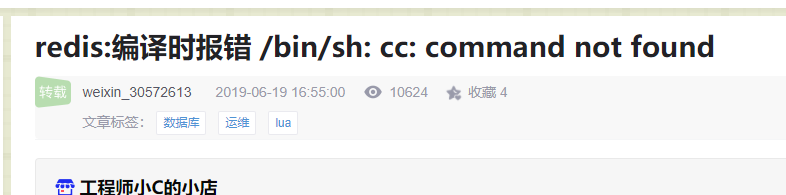
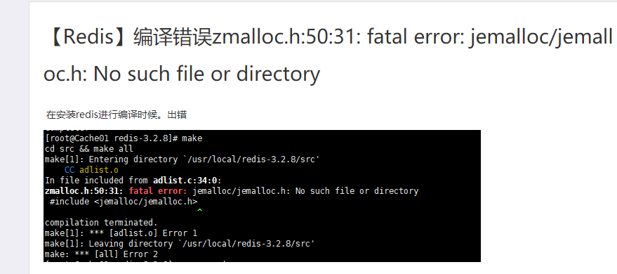
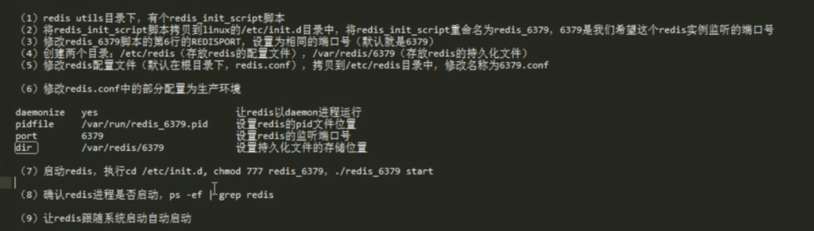

# 1 下载并编译

参考官网步骤：

```shell
#可选择对应版本下载
$ wget https://download.redis.io/releases/redis-6.2.3.tar.gz
#解压
$ tar xzf redis-6.2.3.tar.gz
$ cd redis-6.2.3
#编译
$ make
```

对应Linux不同环境 make可能会报错

**错误1** 提示gcc和cc命令令未找到



解决方法:
安装对应命令

```shell
yum -y install gcc gcc-c++ libstdc++-devel
```

**错误2**



解决方法：指定编译分配器

```shell
make MALLOC=libc
```

指定安装路径并进行安装：

```shell
#在redis-6.2.3/src目录下运行该命令
make install PREFIX=/usr/local/redis
#不指定也可以 会默认在/usr/local目录下安装bin目录
```

参考资料：

https://redis.io/download

https://blog.csdn.net/weixin_30572613/article/details/94879855

https://www.cnblogs.com/richerdyoung/p/8066373.html

# 2 目录及启动方式

完成第一步就能正常使用redis

下列步骤目录，配置等，只是一种通用的规范，不如此操作也可以正常使用

redis一般是安装在/usr/local目录下

```shell
mkdir /usr/local/redis
mkdir /usr/local/redis/etc
```

redis.conf文件在对应etc下

```shell
mv redis.conf /usr/local/redis/etc
```

配置redis为后台启动：

```shell
vi /usr/local/redis/etc/redis.conf //将daemonize no 改成daemonize yes
```

将redis加入开机启动

```shell
#该步骤需要前置步骤完成生成对应目录等操作才能起到作用
vi /etc/rc.local //在里面添加内容：/usr/local/redis/bin/redis-server /usr/local/redis/etc/redis.conf (意思就是开机调用这段开启redis的命令)
```

开启redis

```shell
/usr/local/redis/bin/redis-server /usr/local/redis/etc/redis.conf 
```

redis-cli指令可以在任意目录下直接使用

```shell
　　#将redis-cli,redis-server拷贝到bin下，让redis-cli指令可以在任意目录下直接使用
　　cp /usr/local/redis/bin/redis-server /usr/local/bin/

　　cp /usr/local/redis/bin/redis-cli /usr/local/bin/
```

redis远程连接

```shell
vi /usr/local/redis/etc/redis.conf 
#将bind 127.0.0.1 改成bind 0.0.0.0 或本机ip地址
#protected-mode yes 改成protected-mode no
```

**bind相关:**

1 bind的作用是指定ip地址的计算机才能访问这个redis服务器。

2 bind默认的 127.0.0.1，是个回环地址，只有本机能够访问到（Local Loopback）。

3 指定0.0.0.0是任何服务器都能够访问到。

4 指定本机地址是，其他服务器通过访问本机的ip就能访问到redis服务器。

参考资料：

https://blog.csdn.net/cw_hello1/article/details/83444013

https://www.cnblogs.com/happywish/p/10944253.html

https://www.cnblogs.com/kelelipeng/p/13088319.html

# 3 开机启动(/etc/rc.local)

在Centos7下，rc.local文件，开机默认是不执行的

```shell
[root@data-1-1 ~]# ll /etc/rc.local
lrwxrwxrwx. 1 root root 13 Apr  8 17:11 /etc/rc.local -> rc.d/rc.local
```

实际文件不具备执行权限,设置开机启动

```shell
[root@data-1-1 ~]# ll /etc/rc.d/rc.local
-rw-r--r--. 1 root root 524 Jun 20 09:12 /etc/rc.d/rc.local
[root@data-1-1 ~]# chmod +x /etc/rc.d/rc.local
#通过设置可执行权限后即可开机启动执行该文件
```


# 4 redis参考配置及相关服务

## 4.1 参考配置



init.d 文件可以使用 service <script> <order>来启动/关闭 redis

redis安装目录下的redis_init_script脚本中相关的目录，为推荐的redis相关配置方式

## 4.2 参考自启动方式

在/etc/init.d/中的redis脚本加上下列注释

```shell
# chkconfig:  2345 90 10
# description:   Redis is a persistent key-value database
```

再通过该命令使用开机启动即可

```shell
chkconfig redis_6379 on
```

相关说明

```shell
# chkconfig:   2345 15 95

# description:  PHP-FPM (FastCGI Process Manager) is an alternative PHP FastCGI implementation \

# with some additional features useful for sites of any size, especially busier sites. 

其中2345是默认启动级别，级别有0-6共7个级别。

15是启动优先级，95是停止优先级，优先级范围是0－100，数字越大，优先级越低。
```


## 4.3 主机名相关配置-扩展

```shell
vi /etc/hostname
#修改文件中的主机名
vi /etc/hosts 
#添加主机名 ip映射 例:127.0.0.1 youngstar
```

参考资料：

https://www.cnblogs.com/JiaoTou/p/10619751.html

https://blog.csdn.net/u012060033/article/details/82869201