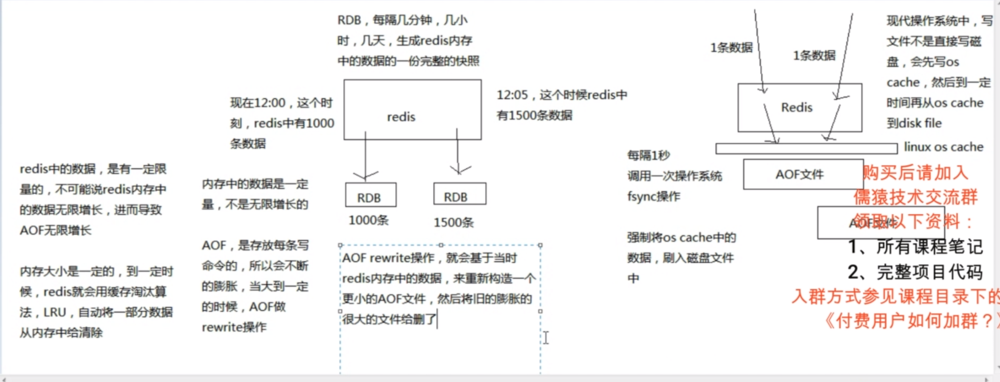
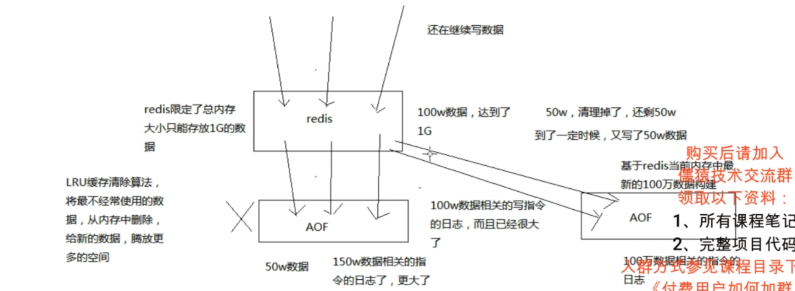

**持久化机制:**

​	**RDB：**对redis中的数据执行周期性的持久化(每次持久化生成新文件)

​	**AOF:** AOF可以设置 同步/异步操作对写入命令作为日志，以append-only的模式写入日志文件中，在redis重启的时候，可以通过回放AOF日志中的写入指令重新构建整个数据集

​	PS:如果redis仅仅作为境内存的缓存使用，可以禁止RDB和AOF所有的持久化机制

​	PS:如果同时使用RDB和AOF两种持久化机制，那么在redis重启的时候，会使用AOF来重新构建数据，因为AOF中的数据更加完整

RDB/AOF机制



AOF rewrite原理分析



**数据恢复：**

​	假如内存和磁盘的文件都丢失，可以将备份的持久化文件，放到指定目录，重新启动redis，redis会自动根据持久化文件中的数据去恢复内存中的数据，继续对外提供服务

**RDB/AOF-优缺点：**

​	**RDB:**

​		优点：

​				1 对redis的读写影响小，redis会单独fork一个子进程去进行周期性备份。对于AOF每次进行os cache的操作，写入性能相对高。

​				2 适合做冷备份，由redis去控制周期性生成新的数据快照备份文件，可以通过某种云服务等方式上传文件进行冷备份。

​				3 数据恢复较快，原因同AOF缺点1.

​		缺点：

​				1 会造成数据丢失，还未进行下一次备份前，redis挂掉了 在这期间的redis新的内存数据就丢失了。

​				2 如果数据文件比较大，redis每次fork子线程进行数据备份的时候，可能会造成服务暂停几毫秒，甚至几秒的情况。

​	**AOF:**

​		优点：

​				1 数据基本不会丢失，可以配置每次都fsync写入aof文件，或者每隔1秒进行fsync操作。最多丢失1s的数据。

​				2 AOF日志文件以append-only模式写入，没有任何磁盘寻址开销。而且文件不容易破损，即使文件尾部破损，redis也停供了工具进行修复。

​				3 AOF日志文件较大的时候，出现后台重写操作也不会影响客户端的读写。因为在rewrite log的时候(后台另外的线程)，会对文件进行压缩，建立一个最小的新日志文件。老的日志文件还是照常写入，当心的merge后的日志文件ready的时候，再交替新老日志文件即可。

​				4 可以对错误操作进行恢复，假如某开发人员误操作进行了flushall命令给数据删了。因为aof是对写入命令进行日志，所以可以编辑aof文件，将flushall命令从文件最后删除。再重启redis就可以恢复数据了。

​		缺点：

​				1 写入性能（QPS）相对RDB差一点，因为aof对每个写入命令会进行os cache操作，os cache操作对于直接写入磁盘算是极快的，但是还是会有一定的影响。配置了每次都fsync写入aof文件的话写入性能会更差。

​				2 数据恢复没有RDB快，因为aof文件是记录写入命令，而RDB文件是直接的内存快照。RDB恢复数据只需要将文件数据直接放入内存即可，而aof则需要重新执行aof对应命令的流程。

​				3 相对于RDB较为脆弱，RDB备份是直接备份内存数据快照，相对简单直接。而AOF是对写入命令进行备份，而且存在rewrite等机制，相对复杂。(在历史版本的情况,aof出现过备份恢复的数据和原始数据不一样的情况)

​				4 对于同一份文件AOF日志文件通常比RDB数据快照文件更大

​				PS:AOF在进行rewrite的时候不是基于的aof文件进行新文件的生成(merge)，而是基于现有内存的数据重新生成写入命令。这样相对于复杂的新旧文件对比生成，健壮性好很多。

​				PS:建议综合使用RDB和AOF进行持久化。AOF来保证数据不丢失，作为数据恢复的第一选择。用RDB来做不同程度的冷备，在AOF文件都丢失或损坏不可用的时候，还可以通过RDB来进行快速的数据恢复。


**RDB持久化配置及数据恢复相关**

在redis.conf文件 将save相关的配置注释放开

```shell
 #save 3600 1
 #save 300 100
 #save 60 10000
#将以上注释放开即可启用RDB持久化
# <秒><个数> 每隔x秒 检查如果有超过x个key进行了变更，则进行一次RDB的快照文件保存，就是当前redis内存中完整的数据快照
#快照也可以手动调用save 或者bgsave命令，同步或一部执行rdb快照生成
#save可以设置多个，就是多个snapshotting检查点，每到一个检查点，就回去check一下，是否有指定的key数量发生了变更，如果有就生成一个新的dump.rdb快照文件
```

1 生成的dump.rdb默认是启动redis服务命令的目录，也可以在redis.conf中指定对应目录

2 通过redis-cli shutdown是一种安全退出redis的命令，该命令退出redis会进行生成新的完整redis快照文件覆盖旧文件

3 通过kill -9或者其他情况强行将redis进程关闭(杀死)，在RDB未进行下一次持久化前，该段时间的数据会丢失

**RDB持久化机制的工作流程**

1 redis根据配置自己尝试去生成rdb快照文件

2 fork一个子进程出来

3 子进程尝试将数据dump到临时的rdb快照文件中

4 完成rdb快照文件生成后，就会替换之前旧的快照文件

**AOF持久化配置及相关操作**

在redis.conf文件 将appendonly no改成yes 即可开启aof(aof默认是关闭的)

```shell
appendonly no
#将no改成yes即可开启
```

**AOF基本配置**

aof模式配置 appendfsync 有三种

```shell
# appendfsync always
appendfsync everysec
# appendfsync no

```

1 appendfsync always:代表aof每次将指令os cache(每写一条指令)都会进行fsync操作将指令持久化到appendonly.aof文件中(效率较低，不建议使用)

2 appendfsync everysec:代表aof每间隔一秒，将os cache数据fsync持久化到appendonly.aof文件中(基本不影响读写效率，生产环境常用)

3 appendfsync no：代表aof仅将指令加入到os cache中，具体fsync持久化操作则由系统os cache来控制(也就是代表不可控的，不清楚什么时候会进行持久化操作)

**aof rewrite相关配置**

```shell
auto-aof-rewrite-percentage 100
#和上一次对比的百分比
auto-aof-rewrite-min-size 64mb
#进行rewrite操作的最小大小限制

```

参数说明：当aof文件和上一次rewrite操作时的文件对比(上次64mb,这次129mb,增长了65m)，增长比例超过100%大小时，就可能去触发一次rewite操作，此时再检查文件增长是否大于64m，如果都满足条件则进行一次rewrite操作

在redis 2.4以前rewrite还需要手动编写脚本去触发

**rewite操作流程：**

1 redis fork一个子进程，根据redis当前内存数据构建日志，生成新的aof文件并写入

2 同时新的redis写入命令，新的日志也继续写入到旧的aof文件

3 当子进程写完新的aof文件后，将这段时间生成的新日志也写到新的aof文件中

4 新aof文件完成写入后，用新的日志文件替换旧文件，并删除旧的aof文件

**aof破损文件的修复：**

如果redis在append数据到AOF文件时，机器宕机了，可能会导致AOF文件破损

用redis-check-aof --fix命令来修复破损的AOF文件

**AOF和RDB同时工作：**

1 如果RDB在执行snapshotting操作，那么redis不会执行AOF rewrite，如果redis在执行AOF rewrite,那么久不会执行RDBsnapshotting(也就是说AOF和RDB不会同时进行写入文件操作)

2 如果RDB在执行snapshotting，此时用户执行BGREWRITEAOF命令，那么等RDB快照文件生成后，才会去执行AOF write

3 同时有RDB snpshot文件和AOF日志文件，那么redis重启的时候，会优先使用AOF进行数据恢复，因为其中的日志更完整

PS:数据恢复完全是依赖于底层磁盘的持久化的，RDB和AOF上都没有数据，数据就没了

**企业级RDB备份恢复**

RDB非常适合做冷备，每次生成之后，就不会再有修改了(每次都是生成新文件覆盖旧文件)

数据备份方案

1 写crontab定时调度脚本去做数据备份

2 每小时都copy一份rdb备份，到一个目录中去，仅仅保留最近48小时的备份

3 每次都保留一份当日的rdb备份，到一个目录中去，仅仅保留最近1个月的备份

4 每次copy备份的时候，都把太旧的备份给删了

5 每天晚上将当前服务器所有的数据备份，发送一份到远程云服务器上去

**每小时copy一次备份，删除48小时前的数据 具体操作**

1 脚本内容

参考版本1

```shell
#!/bin/sh

cur_date=`date +Y%q%d%k`
rm -rf lusr/local/redis/snapshotting/$cur_datemkdir/usr/local/redis/snapshotting/$cur_date
scp /var/redis/6379/dump.rdb /usr/local/redis/snapshotting/$cur_date
#将redis_rdb_copy_hourly.sh 作为该脚本名
```

参考版本2

```shell
#!/bin/sh

cur_date=`date +%Y%m%d%k"
rm -rf /usr/local/redis/snapshotting/$cur_date
mkdir -p /usr/local/redis/snapshotting/$cur_date
cp /var/redis/6379/dump.rdb /usr /loca1/redis/snapshotting/$cur_date

del_date=`date -d -48hour +%Y%m%d%k`
rm -rf /usr /loca1/redis/snapshotting/$del_date
#将redis_rdb_copy_hourly.sh 作为该脚本名

```

2 crontab定时调度配置

```shell
crontab -e
#运行crontab -e 命令，然后在出现的编辑器里添加下面脚本
0 * * * * sh /usr/local/redis/copy/redis_rdb_copy_hourly.sh
#可以多个调度一起写(换行写另一个即可)

```


 **每天copy一次备份 具体操作**

1 脚本内容(脚本目录相关仅供参考，具体要根据实际情况去编写脚本)

参考版本1

```shell
#!/bin/sh

cur_date=`date +3Y%m%d`
rm -rf /usr/local/redis/snapshotting/$cur_date
mkdir /usr/local/redis/snapshotting/$cur_date
cp /var/redis/6379/dump.rdb /usr/local/redis/snapshotting/$cur_date

del_date=`date -d -1month +3Y%md`
rm -rf /usr/local/redis/snapshotting/$del_date
#redis_rdb_copy_daily.sh 作为该脚本名
```

参考版本2

```shell
cur_date=`date +%Y%m%d`
rm -rf /usr/local/redis/snapshotting/$cur_date
mkdir -p /usr/local/redis/snapshotting/$cur_date
cp /var/redis/6379/dump.rdb /usr/loca1/redis/snapshotting/$cur_date

del_date=`date -d -1month +%Y%m%d`
rm -rf /usr/local/redis/snapshotting/$del_date

```


2 crontab定时调度配置

```shell
crontab -e
0 0 * * *  sh /usr/local/redis/copy/redis_rdb_copy_daily.sh
#可以多个调度一起写(换行写另一个即可)

```

**常见的数据恢复方案**

​	1 如果是redis进程挂掉，那么重启redis进程即可，直接基于AOF日志文件恢复数据

​	2 如果是redis进程所在的机器挂掉，那么重启机器后，尝试重启redis进程，尝试直接基于AOF日志文件进行数据恢复(如果AOF文件数据破损，可以使用命令修复)

​	3 如果redis当前最新的AOF和RDB文件出现了丢失/损坏，那么可以尝试基于该机器上当前某个最新的RDB数据副本进行数据恢复

​	具体操作流程(RDB和AOF都已开启的情况):

​	停止redis,关闭redis，拷贝rdb备份,修改redis.conf将aof关闭，启动redis，在命令行热开启aof,关闭redis，修改redis.conf开启aof，开启redis

​	通过以上操作即可基于RDB数据副本将数据恢复了

​	4 如果当前机器上的所有RDB文件全部损坏，那么从远程的云服务上拉去最新的RDB快照回来恢复数据(全部损坏的情况一般都是人为的误操作)

​	5 如果是发现有重大的数据错误，比如某个小时上线的程序一下子将数据全部污染了，数据全错了，那么可以选择某个更早的时间点，对数据进行恢复

**数据备份方案意义**

​	举个例子，12点上线了代码，发现代码有bug，导致代码生成的所有的缓存数据，写入redis，全部错了找到一份11点的rdb的冷备，然后按照上面的步骤，去恢复到11点的数据，不就可以了吗


