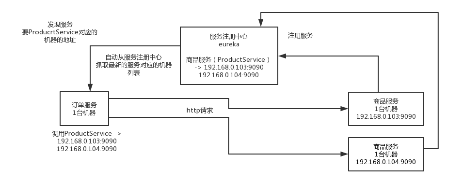
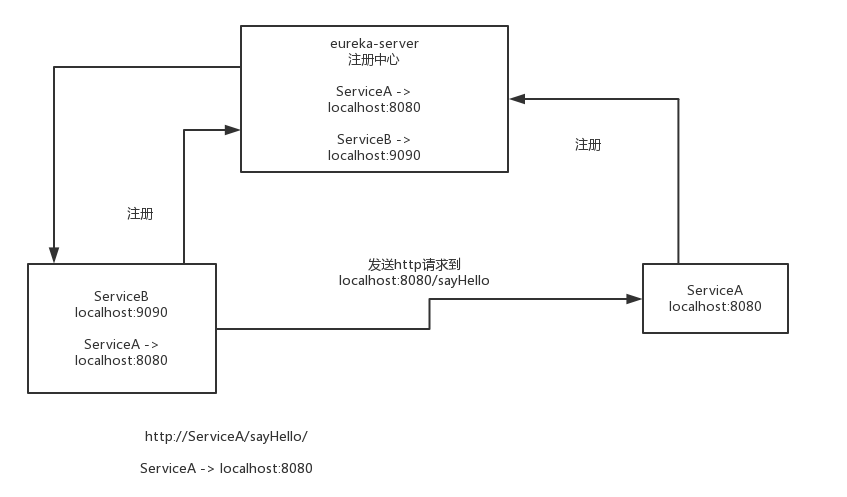
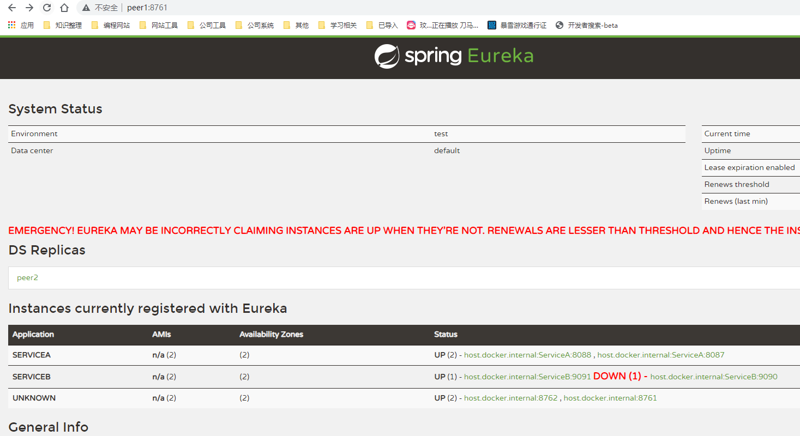
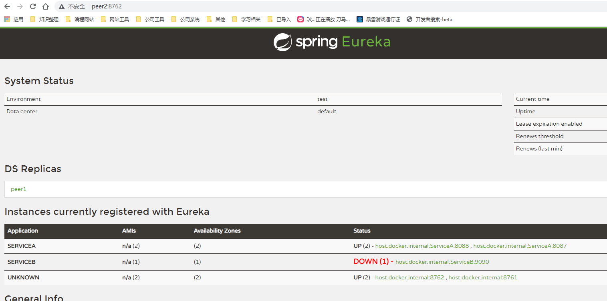
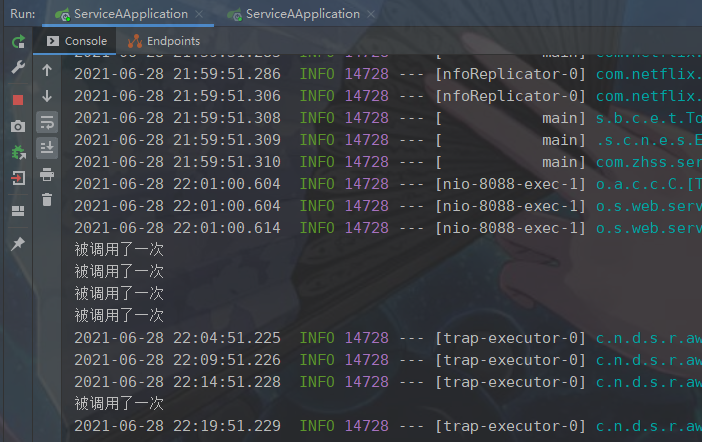
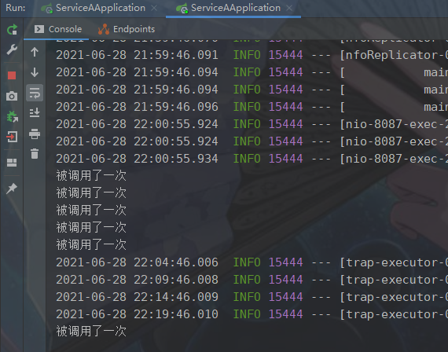
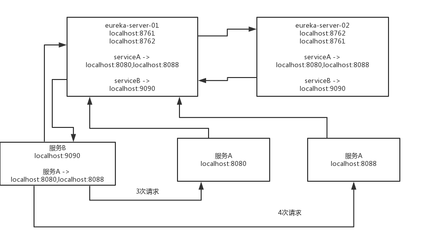
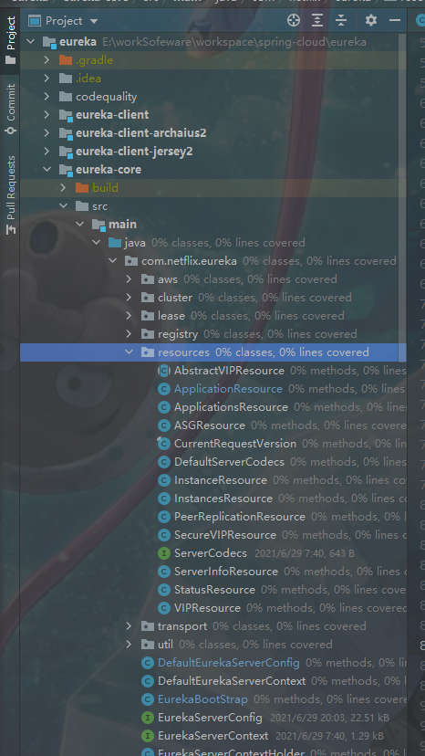

# 1 配置一个快速上手样例

## 1.1 配置eureka服务

pom spring cloud，Edgware.SR3

```xml
<parent>
    <groupId>org.springframework.boot</groupId>
    <artifactId>spring-boot-starter-parent</artifactId>
<version>1.5.13.RELEASE</version>
</parent>
<dependencyManagement>
    <dependencies>
        <dependency>
            <groupId>org.springframework.cloud</groupId>
            <artifactId>spring-cloud-dependencies</artifactId>
            <version>Edgware.SR3</version>
            <type>pom</type>
            <scope>import</scope>
        </dependency>
</dependencies>
</dependencyManagement>
<dependencies>
    <dependency>
        <groupId>org.springframework.cloud</groupId>
        <artifactId>spring-cloud-starter-config</artifactId>
    </dependency>
    <dependency>
        <groupId>org.springframework.cloud</groupId>
        <artifactId>spring-cloud-starter-eureka</artifactId>
    </dependency>
    <dependency>
        <groupId>org.springframework.cloud</groupId>
        <artifactId>spring-cloud-starter-eureka-server</artifactId>
    </dependency>
</dependencies>
```

主入口

```java
@SpringBootApplicationn
@EnableEurekaServer
public class Server {

	public static void main(String[] args) {
	SpringApplication.run(EurekaServer.class, args);
	}	
}
```

yml文件

```yaml
server:
  port: 8761
eureka:
  client:
    registerWithEureka: false
    fetchRegistry: false
#上面那俩配置，就是说不要把自己注册到Eureka，因为他自己就是Eureka的服务，让别人来注册的；还有就是不要到Eureka服务抓取注册信息，因为他不需要，他自己就是Eureka服务
```

直接运行，就可以启动一个Eureka服务，对外开放的是8761端口

打开浏览器，输入http://localhost:8761/，就可以看到Eureka的控制台

## 1.2 配置service服务

pom 

​	去掉 dependency 的 <artifactId>spring-cloud-starter-eureka-server</artifactId>

主入口

​	EnableEurekaServer改为EnableEurekaClient

​	EnableEurekaClient就是说这是个Eureka客户端应用，需要向Eureka服务端注册自己为一个服务，启动这个就好

yml文件

```yaml
server:
  port: 8080
spring:
  application:
    name: ServiceA
eureka:
  instance:
    hostname: localhost
  client:
    serviceUrl:
      defaultZone: http://localhost:8761/eureka
      #上面的，配置了自己的服务名称，主机地址，还有eureka服务的地址
```

eureka基本原理图：



eureka样例基本原理图：



## 1.3 eureka和service服务改成集群

只需要改yml文件即可

eureka:yml

```yaml
server:
  port: 8762
eureka:
  instance:
    hostname: peer2
  client:
    serviceUrl:
      defaultZone: http://peer1:8761/eureka/
      #在本地测试，需改host映射，然后改端口号及,hostname对应映射多次启动即可
      #hosts文件映射样例：127.0.0.1 peer1
```

​	这个就是自己对外开放8762端口，但是自己向8761端口的eureka注册中心来注册自己

​	说白了，就是启动两个eureka服务，互相注册，组成一个集群

service:yml

```yaml
server:
  port: 8088
spring:
  application:
    name: ServiceA
eureka:
  instance:
    hostname: localhost
  client:
    serviceUrl:
      defaultZone: http://peer1:8761/eureka,http://peer2:8762/eureka
      #defaultZone 这个也是说让服务调用者感知到eureka集群，可以从eureka集群获取注册信息
      #多次启动需要改端口号
```

集群启动成功后样例图：






## 1.4 负载均衡测试

ServiceB 接口

```java
@RestController
@Configuration
public class ServiceBController {

	/**
	 * RestTemplate，本来就是访问单个http接口的，但是现在加了@LoadBalanced以后，就可以通过Ribbon的支持，
	 * 实现负载均衡了，假如ServiceA部署了几台机器，那么可以自动负载均衡，轮询调用每一个实例
	 * @return
	 */
	@Bean
	@LoadBalanced
	public RestTemplate getRestTemplate() {
		return new RestTemplate();
	}

	/**
	 * 服务B，就会去调用服务A的sayHello接口
	 * @param name
	 * @return
	 */
	@RequestMapping(value = "/greeting/{name}", method = RequestMethod.GET)
	public String greeting(@PathVariable("name") String name) {
		RestTemplate restTemplate = getRestTemplate();
		return restTemplate.getForObject("http://ServiceA/sayHello/" + name, String.class);
	}
	
}
```

一共访问了服务B的接口11次，会负载均衡到服务A的两个实例上去，一个实例是5次调用，一个实例是6次调用






集群环境eureka调用图：



## 1.5 eureka服务健康的自检机制

​	**1默认情况下:**

​	你的所有的服务，比如服务A和服务B，都会自动给eureka注册中心同步心跳，续约，每隔一段时间发送心跳，如果说某个服务实例挂了，那么注册中心一段时间内没有感知到那个服务的心跳，就会把那个服务给他下线

​	**2 如果你要自己来实现一个服务的健康检查的机制:**

​	自己来检查服务是否宕机，比如说，如果底层依赖的MQ、数据库挂了，你就宣布自己挂了，通知注册中心

在服务中加入以下依赖：

```xml
<dependency>
	<groupId>org.springframework.boot</groupId>
		<artifactId>spring-boot-starter-actuator</artifactId>
	<version>1.5.13.RELEASE</version>
</dependency>
```

​	http://localhost:8080/health(服务地址前缀/health)，可以看到服务的健康状态

**3 可以自己实现一个健康检查器**

 	正常情况下就这样就可以了，但是有一个问题，就是可能这个服务依赖的其他基础设施，比如redis、mysql、mq，都挂掉了，或者底层的基础服务挂掉了，此时这个服务已经不可用了，那么这个服务就可以认定自己是不可用了

​	所以可以自己实现一个健康检查器，就是自己检查自己依赖的基础设施，或者是基础服务，是否挂掉了，来决定自己是否还是健康的

```java
@Component
public class ServiceAHealthIndicator implements HealthIndicator {

@Override
public Health health() {
	// 这里可以通过返回UP或者DOWN来指示服务的状态
	return new Health.Builder(Status.UP).build();
}

@Component
public class ServiceAHealthCheckHandler implements HealthCheckHandler {

@Autowired
private ServiceAHealthIndicator indicator;
    /**
     * eureka client里面会有一个定时器，不断调用那个HealthCheckHandler的getStatus()方法，然后检查当前这个服	   * 务实例的状态，
     * 如果状态变化了，就会通知eureka注册中心。如果服务实例挂掉了，那么eureka注册中心就会感知到，然后下线这个服      * 务实例。
     * @param currentStatus
     * @return
     */	
public InstanceStatus getStatus(InstanceStatus currentStatus) {
	Status status = indicator.health().getStatus();
	// 根据这个status，可以决定这里返回什么
	return InstanceStatus.UP;
}

}	
```

自己实现的情况较少，一般有个Health接口判断服务是否挂掉了就可以了。

## 1.6 心跳检测

```properties
eureka.instance.leaseRenewallIntervalInSeconds
#服务续约，eureka客户端，默认会每隔30秒发送一次心跳的eureka注册中心，这个参数可以修改这个心跳间隔时间
eureka.instance.leaseExpirationDurationInSeconds
#到期时间，如果在90秒内没收到一个eureka客户端的心跳，那么就摘除这个服务实例，别人就访问不到这个服务实例了，通过这个参数可以修改这个90秒的值

########
#但是一般这俩参数建议不要修改。
#另外这个心跳检测的机制其实叫做renew机制，看参数配置就知道了，也可以叫做服务续约
#如果一个服务被关闭了，那么会走cancel机制，就是类似是服务下线吧
```

​	如果90秒内没收到一个client的服务续约，也就是心跳吧，但是他这里叫做服务续约，那么就会走eviction，将服务实例从注册表里给摘除掉

## 1.7 注册表抓取

```properties

eureka.client.registryFetchIntervalSeconds
#默认情况下，客户端每隔30秒去服务器抓取最新的注册表，然后缓存在本地，通过该参数可以修改。

```

## 1.8 自定义元数据(少用)

```yaml
eureka:
	instance:
		hostname: localhosto
		metadata-map:
			company-name: zhss
```

可以通过上面的metadata-map定义服务的元数据，反正就是你自己需要的一些东西，不过一般挺少使用的

## 1.9 保护模式

如果在eureka控制台看到下面的东西：

#### <font color="red">**EMERGENCY! EUREKA MAY BE INCORRECTLY CLAIMING INSTANCES ARE UP WHEN THEY'RE NOT. RENEWALS ARE LESSER THAN THRESHOLD AND HENCE THE INSTANCES ARE NOT BEING EXPIRED JUST TO BE SAFE.**</font>

​	这就是eureka进入了自我保护模式，如果客户端的心跳失败了超过一定的比例，或者说在一定时间内（15分钟）接收到的服务续约低于85%，那么就会认为是自己网络故障了，导致人家client无法发送心跳。这个时候eureka注册中心会先给保护起来，不会立即把失效的服务实例摘除，在测试的时候一般都会关闭这个自我保护模式：

```
eureka.server.enable-self-preservation: false
#关闭保护模式
```

​	在生产环境里面，他怕自己因为自己有网络问题，导致别人没法给自己发心跳，就不想胡乱把别人给摘除，他就进入保护模式，不再摘除任何实例，等到自己网络环境恢复。

## 1.10 扩展

eureka server的启动，相当于是注册中心的启动

eureka client的启动，相当于是服务的启动

**eureka运行的核心的流程，eureka client往eureka server注册的过程**，

​	1 服务注册；服务发现，eureka client从eureka server获取注册表的过程；

​	2 服务心跳，eureka client定时往eureka server发送续约通知（心跳）；

​	3 服务实例摘除；通信，限流，自我保护，server集群

eureka server怎么启动的？

​	**eureka server是依赖eureka client的**，为啥呢？eureka server也是一个eureka client，因为后面我们讲到eureka server集群模式的时候，eureka server也要扮演eureka client的角色，往其他的eureka server上去注册。

​	**eureka core**，扮演了核心的注册中心的角色，接收别人的服务注册请求，提供服务发现的功能，保持心跳（续约请求），摘除故障服务实例。**eureka server依赖eureka core的，基于eureka core的功能对外暴露接口**，提供注册中心的功能

# 2 Eureka Server启动源码

## 2.1 Eureka Server的web工程结构分析以及web.xml解读

### 2.1.1 gradle主要引用

**jersey框架(国内基本没人用):**

​	1 eureka server依赖jersey框架，你可以认为jersey框架类比于spring web mvc框架，支持mvc模式，支持restful http请求

​	2 eureka client和eureka server之间进行通信，都是基于jersey框架实现http restful接口请求和调用的

​	3 eureka-client-jersey2，eureka-core-jersey2,这两个工程是eureka为了方便自己，对jersey框架的一个封装，提供更多的功能，方便自己使用

**mockito：**

​	1 mock测试框架，mock就是用的mockito框架

​	2 在eureka框架里面，他每个工程都是有src/test/java的，里面都写了针对自己本工程的单元测试

**jetty：**	

​	1 方便你测试的，测试的时候，是会基于jetty直接将eureka server作为一个web应用给跑起来

​	2 jersey对外暴露了一些restful接口，然后测试类里，就可以基于jersey的客户端，发送http请求，调用eureka server暴露的restful接口，测试比如说：服务注册、心跳、服务实例摘除，等等功能。

```groovy
apply plugin: 'war'

dependencies {
    compile project(':eureka-client')
    compile project(':eureka-core')
    runtime 'xerces:xercesImpl:2.4.0'
    compile "com.sun.jersey:jersey-server:$jerseyVersion"
    compile "com.sun.jersey:jersey-servlet:$jerseyVersion"
    compile 'org.slf4j:slf4j-log4j12:1.6.1'
    runtime 'org.codehaus.jettison:jettison:1.2' 
    providedCompile "javax.servlet:servlet-api:$servletVersion"

    testCompile project(':eureka-test-utils')
    testCompile "org.mockito:mockito-core:${mockitoVersion}"
    testCompile "org.eclipse.jetty:jetty-server:$jetty_version"
    testCompile "org.eclipse.jetty:jetty-webapp:$jetty_version"
}

task copyLibs(type: Copy) {
    into 'testlibs/WEB-INF/libs'
    from configurations.runtime	
}

//将eureka-resources下面的那些jsp、js、css给搞到这个war包里面去，然后就可以跑起来，提供一个index页面
war {
    from (project(':eureka-resources').file('build/resources/main'))
}

// Integration test loads eureka war, so it must be ready prior to running tests
test.dependsOn war

```


### 2.1.2 web.xml解读

web应用最最核心的就是web.xml。

​	最最重要的就是listener，listener是在web应用启动的时候就会执行的，负责对这个web应用进行初始化的事儿，我们如果自己写个web应用，也经常会写一个listener，在里面搞一堆初始化的代码，比如说，启动一些后台线程，加载个配置文件。

```xml
  <listener>
    <listener-class>com.netflix.eureka.EurekaBootStrap</listener-class>
  </listener>
<!--在eureka-core里，就是负责eureka-server的初始化的-->
```

有连着4个Filter，任何一个请求都会经过这些filter，这些filter会对每个请求都进行处理，这个4个filter都在eureka-core里面

```xml
  <filter>
    <filter-name>statusFilter</filter-name>
    <filter-class>com.netflix.eureka.StatusFilter</filter-class>
  </filter>
<!--StatusFilter：负责状态相关的处理逻辑-->
  <filter>
    <filter-name>requestAuthFilter</filter-name>
    <filter-class>com.netflix.eureka.ServerRequestAuthFilter</filter-class>
  </filter>
  <!--ServerRequestAuthFilter：一看就是，对请求进行授权认证的处理的-->
  <filter>
    <filter-name>rateLimitingFilter</filter-name>
    <filter-class>com.netflix.eureka.RateLimitingFilter</filter-class>
  </filter>
  <!--RateLimitingFilter：负责限流相关的逻辑的（很有可能成为eureka-server里面的一个技术亮点，看看人家eureka-server作为一个注册中心，是怎么做限流的，先留意算法是什么，留到后面去看）-->
  <filter>
    <filter-name>gzipEncodingEnforcingFilter</filter-name>
    <filter-class>com.netflix.eureka.GzipEncodingEnforcingFilter</filter-class>
  </filter>
  <!--GzipEncodingEnforcingFilter：gzip，压缩相关的；encoding，编码相关的-->
```

jersey框架的一个ServletContainer的一个filter

​	1 类似于每个mvc框架，比如说struts2和spring web mvc，都会搞一个自己的核心filter，或者是核心servlet，配置在web.xml里

​	2 相当于就是将web请求的处理入口交给框架了，框架会根据你的配置，自动帮你干很多事儿，最后调用你的一些处理逻辑。

​	3 jersey也是一样的，这里的这个ServletContainer就是一个核心filter，接收所有的请求，作为请求的入口，处理之后来调用你写的代码逻辑。

```xml
  <filter>
    <filter-name>jersey</filter-name>
    <filter-class>com.sun.jersey.spi.container.servlet.ServletContainer</filter-class>
    <init-param>
      <param-name>com.sun.jersey.config.property.WebPageContentRegex</param-name>
      <param-value>/(flex|images|js|css|jsp)/.*</param-value>
    </init-param>
    <init-param>
      <param-name>com.sun.jersey.config.property.packages</param-name>
      <param-value>com.sun.jersey;com.netflix</param-value>
    </init-param>

    <!-- GZIP content encoding/decoding -->
    <init-param>
      <param-name>com.sun.jersey.spi.container.ContainerRequestFilters</param-name>
      <param-value>com.sun.jersey.api.container.filter.GZIPContentEncodingFilter</param-value>
    </init-param>
    <init-param>
      <param-name>com.sun.jersey.spi.container.ContainerResponseFilters</param-name>
      <param-value>com.sun.jersey.api.container.filter.GZIPContentEncodingFilter</param-value>
    </init-param>
  </filter>
```

filter-mapping

```xml
  <filter-mapping>
    <filter-name>statusFilter</filter-name>
    <url-pattern>/*</url-pattern>
  </filter-mapping>

  <filter-mapping>
    <filter-name>requestAuthFilter</filter-name>
    <url-pattern>/*</url-pattern>
  </filter-mapping>
<!--StatusFilter和RequestAuthFilter，一看就是通用的处理逻辑，是对所有的请求都开放的-->
  <!-- Uncomment this to enable rate limiter filter.
  <filter-mapping>
    <filter-name>rateLimitingFilter</filter-name>
    <url-pattern>/v2/apps</url-pattern>
    <url-pattern>/v2/apps/*</url-pattern>
  </filter-mapping>
  -->
<!--RateLimitingFilter，默认是不开启的，如果你要打开eureka-server内置的限流功能，你需要自己把RateLimitingFilter的<filter-mapping>的注释打开，让这个filter生效-->

  <filter-mapping>
    <filter-name>gzipEncodingEnforcingFilter</filter-name>
    <url-pattern>/v2/apps</url-pattern>
    <url-pattern>/v2/apps/*</url-pattern>
  </filter-mapping>
<!-/v2/apps相关的请求，会走这里，仅仅对部分特殊的请求生效-->

  <filter-mapping>
    <filter-name>jersey</filter-name>
    <url-pattern>/*</url-pattern>
  </filter-mapping>
  <!--jersey核心filter，是拦截所有的请求的-->

```

welcome-file-list，是配置了status.jsp是欢迎页面，首页，eureka-server的控制台页面，展示注册服务的信息

```xml
  <welcome-file-list>
    <welcome-file>jsp/status.jsp</welcome-file>
  </welcome-file-list>
```

### 2.1.3 总结

​	如果要启动eureka-server，就打成war包，找一个web容器，比如说tomcat，就可以启动了 ==> 测试类里，是基于jetty代码层面来启动jetty web容器和eureka-server，方便测试发送http restful接口的调用请求

​	1 eureka-server -> build.gradle中的依赖和构建的配置

​	2 eureka-server -> web应用 -> war包 -> tomcat就可以启动

​	3 web.xml -> listener -> 4个filter -> jersy filter -> filter mapping -> welcome file

##  2.2 Eureka Server启动之环境EurekaBootStrap监听器

​	web容器（tomcat还是jetty）启动的时候，把eureka-server作为一个web应用给带起来的时候，eureka-server的初始化的逻辑，监听器，EurekaBootStrap。（eureka-core里面）

**EurekaBootStrap部分核心代码：**

```java
public class EurekaBootStrap implements ServletContextListener {

    /**
     * Initializes Eureka, including syncing up with other Eureka peers and publishing the registry.
     * 监听器的执行初始化的方法，是contextInitialized()方法，这个方法就是整个eureka-server启动初始化的一个入
     * 口。
     */
 	@Override
    public void contextInitialized(ServletContextEvent event) {
        try {
            //2.2.1 initEurekaEnvironment(初始化eureka环境)
            initEurekaEnvironment();
            //2.2.2 配置文件加载
            initEurekaServerContext();

            ServletContext sc = event.getServletContext();
            sc.setAttribute(EurekaServerContext.class.getName(), serverContext);
        } catch (Throwable e) {
            logger.error("Cannot bootstrap eureka server :", e);
            throw new RuntimeException("Cannot bootstrap eureka server :", e);
        }
    }

}
```


### 2.2.1 initEurekaEnvironment(初始化eureka环境 )

#### 2.2.1.1 流程

**EurekaBootStrap部分核心代码：**

```java
package com.netflix.eureka;
public class EurekaBootStrap implements ServletContextListener {
    
    /** 
     * Users can override to initialize the environment themselves.
     * 初始化eureka-server的环境
     * ConfigurationManager.getConfigInstance()方法，
     * 这个方法，其实就是初始化ConfigurationManager的实例，也就是一个配置管理器的初始化的这么一个过程
     */
    protected void initEurekaEnvironment() throws Exception {
        logger.info("Setting the eureka configuration..");
        
        //初始化数据中心的配置
        String dataCenter = ConfigurationManager.getConfigInstance().getString(EUREKA_DATACENTER);
        if (dataCenter == null) {
            logger.info("Eureka data center value eureka.datacenter is not set, defaulting to default");
            //初始化数据中心的配置，如果没有配置的话，就是默认(DEFAULT)
            ConfigurationManager.getConfigInstance().setProperty(ARCHAIUS_DEPLOYMENT_DATACENTER, DEFAULT);
        } else {
            //初始化数据中心的配置,有的话就将配置设置一下
            ConfigurationManager.getConfigInstance().setProperty(ARCHAIUS_DEPLOYMENT_DATACENTER, dataCenter);
        }
        String environment = ConfigurationManager.getConfigInstance().getString(EUREKA_ENVIRONMENT);
        if (environment == null) {
            //初始化eurueka运行的环境，如果你没有配置的话，默认就给你设置为test环境
            ConfigurationManager.getConfigInstance().setProperty(ARCHAIUS_DEPLOYMENT_ENVIRONMENT, TEST);
            logger.info("Eureka environment value eureka.environment is not set, defaulting to test");
        }
    }
}
```

   ConfigurationManager是什么呢？看字面意思都猜的出来，配置管理器， 管理eureka自己的所有的配置，读取配置文件里的配置到内存里，供后续的eureka-server运行来使用。

**ConfigurationManager 部分核心代码（ConfigurationManager本身不是属于eureka的源码，是属于netflix config项目的源码）：**

```java
package com.netflix.config;


public class ConfigurationManager {    
    
    static volatile AbstractConfiguration instance = null;
    
    /**
    * double check + volatile 实现线程安全的单例模式
    */
	public static AbstractConfiguration getConfigInstance() {
        if (instance == null) {
            synchronized (ConfigurationManager.class) {
                if (instance == null) {
                    //调用重载有参方法
                    instance = getConfigInstance(Boolean.getBoolean(DynamicPropertyFactory.DISABLE_DEFAULT_CONFIG));
                }
            }
        }
        return instance;
    }
    
    /**
    * getConfigInstance()重载
    */
    private static AbstractConfiguration getConfigInstance(boolean defaultConfigDisabled) {
        if (instance == null && !defaultConfigDisabled) {
            //createDefaultConfigInstance 获取AbstractConfiguration实例 
            instance = createDefaultConfigInstance();
            registerConfigBean();
        }
        return instance;        
    }
    
    /**
    * ConcurrentCompositeConfiguration为AbstractConfiguration的实例，是AbstractConfiguration抽象类的实现
    */
    private static AbstractConfiguration createDefaultConfigInstance() {
        //无参构造调用了clear()方法进行一些配置的初始化
        ConcurrentCompositeConfiguration config = new ConcurrentCompositeConfiguration();  
        try {
            DynamicURLConfiguration defaultURLConfig = new DynamicURLConfiguration();
            config.addConfiguration(defaultURLConfig, URL_CONFIG_NAME);
        } catch (Throwable e) {
            logger.warn("Failed to create default dynamic configuration", e);
        }
        if (!Boolean.getBoolean(DISABLE_DEFAULT_SYS_CONFIG)) {
            SystemConfiguration sysConfig = new SystemConfiguration();
            config.addConfiguration(sysConfig, SYS_CONFIG_NAME);
        }
        if (!Boolean.getBoolean(DISABLE_DEFAULT_ENV_CONFIG)) {
            EnvironmentConfiguration envConfig = new EnvironmentConfiguration();
            config.addConfiguration(envConfig, ENV_CONFIG_NAME);
        }
        ConcurrentCompositeConfiguration appOverrideConfig = new ConcurrentCompositeConfiguration();
        config.addConfiguration(appOverrideConfig, APPLICATION_PROPERTIES);
        config.setContainerConfigurationIndex(config.getIndexOfConfiguration(appOverrideConfig));
        return config;
    }
}
```

​	**ConcurrentCompositeConfiguration实例，这个东西，其实就是代表了所谓的配置，包括了eureka需要的所有的配置。在初始化这个实例的时候，调用了坑爹的clear()方法，fireEvent()发布了一个事件（EVENT_CLEAR），fireEvent()这个方法其实是父类的方法，牵扯比较复杂的另外一个项目**

​	**ConcurrentCompositeConfiguration部分核心代码：**

```java
public class ConcurrentCompositeConfiguration extends ConcurrentMapConfiguration 
        implements AggregatedConfiguration, ConfigurationListener, Cloneable {
    
    /**
    * 有参构造调用clear()初始化配置
    */
    public ConcurrentCompositeConfiguration()
    {
        clear();
    }
    
    /**
    * 不属于eureka源码，无须追踪太多
    */
    @Override
    public final void clear()
    {	
        //父类的方法，加入事件到对应监听中(观察者模式)
        fireEvent(EVENT_CLEAR, null, null, true);
        configList.clear();
        namedConfigurations.clear();
        // recreate the in memory configuration
        containerConfiguration = new ConcurrentMapConfiguration();
        containerConfiguration.setThrowExceptionOnMissing(isThrowExceptionOnMissing());
        containerConfiguration.setListDelimiter(getListDelimiter());
        containerConfiguration.setDelimiterParsingDisabled(isDelimiterParsingDisabled());
        containerConfiguration.addConfigurationListener(eventPropagater);
        configList.add(containerConfiguration);
        
        overrideProperties = new ConcurrentMapConfiguration();
        overrideProperties.setThrowExceptionOnMissing(isThrowExceptionOnMissing());
        overrideProperties.setListDelimiter(getListDelimiter());
        overrideProperties.setDelimiterParsingDisabled(isDelimiterParsingDisabled());
        overrideProperties.addConfigurationListener(eventPropagater);
        //父类的方法，加入事件到对应监听中(观察者模式)
        fireEvent(EVENT_CLEAR, null, null, false);
        containerConfigurationChanged = false;
        invalidate();
    }

}
```

#### 2.2.1.2 总结

（1）创建一个ConcurrentCompositeConfiguration实例，这个东西，其实就是代表了所谓的配置，包括了eureka需要的所有的配置。在初始化这个实例的时候，调用了clear()方法来初始化配置，fireEvent()发布了一个事件（EVENT_CLEAR）（fireEvent()这个方法其实是父类的方法，牵扯比较复杂的另外一个项目（ConfigurationManager本身不是属于eureka的源码，是属于netflix config项目的源码）

（2）就是往上面的那个ConcurrentCompositeConfiguration实例加入了一堆别的config，然后搞完了以后，就直接返回了这个实例，就是作为所谓的那个配置的单例

（3）初始化数据中心的配置，如果没有配置的话，就是DEFAULT（默认配置），有配置则加入ConfigurationManager

（4）初始化eurueka运行的环境，如果你没有配置的话，默认就给你设置为test环境

（5）initEurekaEnvironment的初始化环境的逻辑，就结束了

### 2.2.2 initEurekaServerContext(配置文件加载)

```java
public class EurekaBootStrap implements ServletContextListener {
	/**
     * init hook for server context. Override for custom logic.
     */
    protected void initEurekaServerContext() throws Exception {
        //第一步，加载eureka-server.properties文件中的配置
        //在springCloud集成中就是对应yml的一些eureka配置
        EurekaServerConfig eurekaServerConfig = new DefaultEurekaServerConfig();

        // For backward compatibility
        JsonXStream.getInstance().registerConverter(new V1AwareInstanceInfoConverter(), XStream.PRIORITY_VERY_HIGH);
        XmlXStream.getInstance().registerConverter(new V1AwareInstanceInfoConverter(), XStream.PRIORITY_VERY_HIGH);

        logger.info("Initializing the eureka client...");
        logger.info(eurekaServerConfig.getJsonCodecName());
        ServerCodecs serverCodecs = new DefaultServerCodecs(eurekaServerConfig);

       
        //第二步，初始化ApplicationInfoManage
        ApplicationInfoManager applicationInfoManager = null;
        
	    //第二步，初始化eureka-server内部的一个eureka-client(用来跟其他的eureka-server节点进行注册和通信的)
        if (eurekaClient == null) {
            EurekaInstanceConfig instanceConfig = isCloud(ConfigurationManager.getDeploymentContext())
                    ? new CloudInstanceConfig()
                    : new MyDataCenterInstanceConfig();
            
            applicationInfoManager = new ApplicationInfoManager(
                    instanceConfig, new EurekaConfigBasedInstanceInfoProvider(instanceConfig).get());
            
            EurekaClientConfig eurekaClientConfig = new DefaultEurekaClientConfig();
            eurekaClient = new DiscoveryClient(applicationInfoManager, eurekaClientConfig);
        } else {
            applicationInfoManager = eurekaClient.getApplicationInfoManager();
        }

        //第三步，处理注册相关的事情
        PeerAwareInstanceRegistry registry;
        if (isAws(applicationInfoManager.getInfo())) {
            registry = new AwsInstanceRegistry(
                    eurekaServerConfig,
                    eurekaClient.getEurekaClientConfig(),
                    serverCodecs,
                    eurekaClient
            );
            awsBinder = new AwsBinderDelegate(eurekaServerConfig, eurekaClient.getEurekaClientConfig(), registry, applicationInfoManager);
            awsBinder.start();
        } else {
            registry = new PeerAwareInstanceRegistryImpl(
                    eurekaServerConfig,
                    eurekaClient.getEurekaClientConfig(),
                    serverCodecs,
                    eurekaClient
            );
        }

        //第四步，处理peer节点相关的事情
        PeerEurekaNodes peerEurekaNodes = getPeerEurekaNodes(
                registry,
                eurekaServerConfig,
                eurekaClient.getEurekaClientConfig(),
                serverCodecs,
                applicationInfoManager
        );

        //第五步，完成eureka上下文(context)的构建
        serverContext = new DefaultEurekaServerContext(
                eurekaServerConfig,
                serverCodecs,
                registry,
                peerEurekaNodes,
                applicationInfoManager
        );

        EurekaServerContextHolder.initialize(serverContext);

        serverContext.initialize();
        logger.info("Initialized server context");

        // Copy registry from neighboring eureka node
        //第六步，处理一点善后的事情，从相邻的eureka节点拷贝注册信息
        int registryCount = registry.syncUp();
        registry.openForTraffic(applicationInfoManager, registryCount);

        // Register all monitoring statistics.
        //第七步，处理一点善后的事情，处理所有的监控统计项
        EurekaMonitors.registerAllStats();
    }
}
```

#### 2.2.2.1 加载eureka-server.properties文件中的配置

##### 2.2.2.1.1 流程

EurekaServerConfig，这是个接口，这里面有一堆getXXX()的方法，包含了eureka server需要使用的所有的配置，都可以通过这个接口来获取

```java
@Singleton
public class DefaultEurekaServerConfig implements EurekaServerConfig {
    
    private static final DynamicStringProperty EUREKA_PROPS_FILE = DynamicPropertyFactory
            .getInstance().getStringProperty("eureka.server.props",
                    "eureka-server");
    
    /**
    * 可以认为DynamicPropertyFactory是从ConfigurationManager那儿来的，因为ConfigurationManager中都包含了加载出来的配置了，所以DynamicPropertyFactory里，也可以获取到所有的配置项
    */
    private static final DynamicPropertyFactory configInstance = com.netflix.config.DynamicPropertyFactory
            .getInstance();
    
    /**
    * 在DefaultEurekaServerConfig的各种获取配置项的方法中，配置项的名字是在各个方法中硬编码的
    * getEIPBindRebindRetries是n个get方法中的其中之一，写法都一样，都是硬编码获取值，没有则给个默认值
    */
    @Override
    public int getEIPBindRebindRetries() {
        //configInstance从一个DynamicPropertyFactory里面去获取的
        return configInstance.getIntProperty(
                namespace + "eipBindRebindRetries", 3).get();

    }
    
    public DefaultEurekaServerConfig() {
        init();
    }
    
    /**
    * DefaultEurekaServerConfig.init()方法中，会将eureka-server.properties文件中的配置加载出来，都放到ConfdigurationManager中去
    */
    private void init() {
        String env = ConfigurationManager.getConfigInstance().getString(
                EUREKA_ENVIRONMENT, TEST);
        ConfigurationManager.getConfigInstance().setProperty(
                ARCHAIUS_DEPLOYMENT_ENVIRONMENT, env);
        //eurekaPropsFile，对应的就是eureka-server(配置文件名)
        String eurekaPropsFile = EUREKA_PROPS_FILE.get();
        try {
            // ConfigurationManager
            // .loadPropertiesFromResources(eurekaPropsFile);
            //将加载出来的Properties中的配置项都放到ConfigurationManager中去，由这个ConfigurationManager来管理
            ConfigurationManager
                    .loadCascadedPropertiesFromResources(eurekaPropsFile);
        } catch (IOException e) {
            logger.warn(
                    "Cannot find the properties specified : {}. This may be okay if there are other environment "
                            + "specific properties or the configuration is installed with a different mechanism.",
                    eurekaPropsFile);
        }
    }
}
```

​	ConfigurationManager，是个单例，负责管理所有的配置的，ConfigurationManager是属于netfilx config开源项目的，不是属于eureka项目的源码，所以我们大概看一下就可以了，不要去深究了。eureka-server跟.properties给拼接起来了，拼接成一个eureka-server.properties，代表了eureka server的配置文件的名称。

​	比如说eureka-server那个工程里，就有一个src/main/resources/eureka-server.properties文件，只不过里面是空的，全部都用了默认的配置

```java
public class ConfigurationManager {
    
    /**
    * 将eureka-sesrver.properties中的配置，加载到了Properties对象中去；然后会加载eureka-server-环境.properties中的配置，加载到另外一个Properties中，覆盖之前那个老的Properties中的属性。
    */
    public static void loadCascadedPropertiesFromResources(String configName) throws IOException {
        //将eureka-sesrver.properties中的配置，加载到了Properties对象中去
        Properties props = loadCascadedProperties(configName);
        //将加载出来的Properties中的配置项都放到ConfigurationManager中去，由这个ConfigurationManager来管理
        if (instance instanceof AggregatedConfiguration) {
            ConcurrentMapConfiguration config = new ConcurrentMapConfiguration();
            config.loadProperties(props);
            //addConfiguration方式
            ((AggregatedConfiguration) instance).addConfiguration(config, configName);
        } else {
            //loadProperties方式
            ConfigurationUtils.loadProperties(props, instance);
        }
    }
}
```

##### 2.2.2.1.2 总结

（1）创建了一个DefaultEurekaServerConfig对象

（2）创建DefaultEurekaServerConfig对象的时候，在里面会有一个init方法

（3）先是将eureka-server.properties中的配置加载到了一个Properties对象中，然后将Properties对象中的配置放到ConfigurationManager中去，此时ConfigurationManager中去就有了所有的配置了

（4）然后DefaultEurekaServerConfig提供的获取配置项的各个方法，都是通过硬编码的配置项名称，从DynamicPropertyFactory中获取配置项的值，DynamicPropertyFactory是从ConfigurationManager那儿来的，所以也包含了所有配置项的值

（5）在获取配置项的时候，如果没有配置，那么就会有默认的值，全部属性都是有默认值的

#### 2.2.2.2 eureka-client服务实例构造

##### 2.2.2.2.1 初始化ApplicationInfoManage相关

###### 2.2.2.2.1.1 流程

```java
public class EurekaBootStrap implements ServletContextListener {
    
    //initEurekaServerContext第二步
    protected void initEurekaServerContext() throws Exception
    
		//第二步，初始化ApplicationInfoManage
        ApplicationInfoManager applicationInfoManager = null;

        //第二步，初始化eureka-server内部的一个eureka-client(用来跟其他的eureka-server节点进行注册和通信的)
        if (eurekaClient == null) {
            //EurekaInstanceConfig，其实就是将eureka-client.properties文件中的配置加载到ConfigurationManager中去
            EurekaInstanceConfig instanceConfig = isCloud(ConfigurationManager.getDeploymentContext())
                    ? new CloudInstanceConfig()
                    : new MyDataCenterInstanceConfig();
            
            //new EurekaConfigBasedInstanceInfoProvider(instanceConfig).get() 返回InstanceInfo实例
            applicationInfoManager = new ApplicationInfoManager(
                    instanceConfig, new EurekaConfigBasedInstanceInfoProvider(instanceConfig).get());
            //也是去读eureka-client.properties里的一些配置，只不过他关注的是跟之前的那个EurekaInstanceConfig是不一样的，代表了服务实例的一些配置项，这里的是关联的这个EurekaClient的一些配置项
            EurekaClientConfig eurekaClientConfig = new DefaultEurekaClientConfig();
            //基于ApplicationInfoManager（包含了服务实例的信息、配置，作为服务实例管理的一个组件），eureka client相关的配置，一起构建了一个EurekaClient，但是构建的时候，用的是EurekaClient的子类，DiscoveryClient。
            eurekaClient = new DiscoveryClient(applicationInfoManager, eurekaClientConfig);
        } else {
            applicationInfoManager = eurekaClient.getApplicationInfoManager();
        }
    
}
```

​	EurekaInstanceConfig，其实跟之前的是类似的，其实就是将eureka-client.properties文件中的配置加载到ConfigurationManager中去，然后基于EurekaInstanceConfig对外暴露的接口来获取这个eureka-client.properties文件中的一些配置项的读取，而且人家提供了所有配置项的默认值

​	可以大致认为EurekaInstanceConfig是服务实例相关的一些配置。eureka server同时也是一个eureka client，因为他可能要向其他的eureka server去进行注册，组成一个eureka server的集群。eureka server把自己也当做是一个eureka client，也就是一个服务实例，所以他这里肯定也是有所谓的Application、Instance等概念的。

```java
@ImplementedBy(CloudInstanceConfig.class)
public interface EurekaInstanceConfig {
    /**
     * Get the unique Id (within the scope of the appName) of this instance to be registered with eureka.
     *
     * @return the (appname scoped) unique id for this instance
     */
    String getInstanceId();

    /**
     * Get the name of the application to be registered with eureka.
     *
     * @return string denoting the name.
     */
    String getAppname();
}
```

​	eureka server自己本身代表的一个服务实例，把自己作为一个服务注册到别的eureka server上去，精华，就在于构造器模式的使用。InstanceInfo.Builder，拿到静态内部类的对象，InstanceInfo.Builder.newBuilder()，这个里面就构造了一个InstanceInfo。然后就是基于这个builder去set各种需要的属性和配置，别的对象，搞完了之后，就完成最终的一个复杂的InstanceInfo服务实例对象的这么一个构造。

```java
@Singleton
public class EurekaConfigBasedInstanceInfoProvider implements Provider<InstanceInfo> {
    private static final Logger LOG = LoggerFactory.getLogger(EurekaConfigBasedInstanceInfoProvider.class);

    private final EurekaInstanceConfig config;

    private InstanceInfo instanceInfo;

    @Inject(optional = true)
    private VipAddressResolver vipAddressResolver = null;

    @Inject
    public EurekaConfigBasedInstanceInfoProvider(EurekaInstanceConfig config) {
        this.config = config;
    }

    /**
    * InstanceInfo，你可以认为就是当前这个服务实例的实例本身的信息，直接用了构造器模式，用InstanceInfo.Builder来构造一个复杂的代表一个服务实例的* * 		* InstanceInfo对象。核心的思路是，从之前的那个EurekaInstanceConfig中，读取各种各样的服务实例相关的配置信息，再构造了几个其他的对象，最终完成了	* InstanceInfo的构建
    */
    @Override
    public synchronized InstanceInfo get() {
        if (instanceInfo == null) {
            // Build the lease information to be passed to the server based on config
            LeaseInfo.Builder leaseInfoBuilder = LeaseInfo.Builder.newBuilder()
                    .setRenewalIntervalInSecs(config.getLeaseRenewalIntervalInSeconds())
                    .setDurationInSecs(config.getLeaseExpirationDurationInSeconds());

            if (vipAddressResolver == null) {
                vipAddressResolver = new Archaius1VipAddressResolver();
            }

            // Builder the instance information to be registered with eureka server
            //构造器模式/建造者模式(Builder),获取静态内部类
            InstanceInfo.Builder builder = InstanceInfo.Builder.newBuilder(vipAddressResolver);

            // set the appropriate id for the InstanceInfo, falling back to datacenter Id if applicable, else hostname
            String instanceId = config.getInstanceId();
            DataCenterInfo dataCenterInfo = config.getDataCenterInfo();
            if (instanceId == null || instanceId.isEmpty()) {
                if (dataCenterInfo instanceof UniqueIdentifier) {
                    instanceId = ((UniqueIdentifier) dataCenterInfo).getId();
                } else {
                    instanceId = config.getHostName(false);
                }
            }

            String defaultAddress;
            if (config instanceof RefreshableInstanceConfig) {
                // Refresh AWS data center info, and return up to date address
                defaultAddress = ((RefreshableInstanceConfig) config).resolveDefaultAddress(false);
            } else {
                defaultAddress = config.getHostName(false);
            }

            // fail safe
            if (defaultAddress == null || defaultAddress.isEmpty()) {
                defaultAddress = config.getIpAddress();
            }

            //构造器模式/建造者模式(builder)
            //通过静态内部类对应方法设置参数
            builder.setNamespace(config.getNamespace())
                    .setInstanceId(instanceId)
                    .setAppName(config.getAppname())
                    .setAppGroupName(config.getAppGroupName())
                    .setDataCenterInfo(config.getDataCenterInfo())
                    .setIPAddr(config.getIpAddress())
                    .setHostName(defaultAddress)
                    .setPort(config.getNonSecurePort())
                    .enablePort(PortType.UNSECURE, config.isNonSecurePortEnabled())
                    .setSecurePort(config.getSecurePort())
                    .enablePort(PortType.SECURE, config.getSecurePortEnabled())
                    .setVIPAddress(config.getVirtualHostName())
                    .setSecureVIPAddress(config.getSecureVirtualHostName())
                    .setHomePageUrl(config.getHomePageUrlPath(), config.getHomePageUrl())
                    .setStatusPageUrl(config.getStatusPageUrlPath(), config.getStatusPageUrl())
                    .setASGName(config.getASGName())
                    .setHealthCheckUrls(config.getHealthCheckUrlPath(),
                            config.getHealthCheckUrl(), config.getSecureHealthCheckUrl());


            // Start off with the STARTING state to avoid traffic
            if (!config.isInstanceEnabledOnit()) {
                //设置state状态(STARTING)，表示当前服务实例正在启动中
                InstanceStatus initialStatus = InstanceStatus.STARTING;
                LOG.info("Setting initial instance status as: " + initialStatus);
                builder.setStatus(initialStatus);
            } else {
                LOG.info("Setting initial instance status as: {}. This may be too early for the instance to advertise "
                         + "itself as available. You would instead want to control this via a healthcheck handler.",
                         InstanceStatus.UP);
            }

            // Add any user-specific metadata information
            //自定义元数据相关
            for (Map.Entry<String, String> mapEntry : config.getMetadataMap().entrySet()) {
                String key = mapEntry.getKey();
                String value = mapEntry.getValue();
                builder.add(key, value);
            }
			//通过静态内部类获取 构造/建造 完成的实例
            instanceInfo = builder.build();
            //leaseInfoBuilder租约相关信息，也是构造器模式创建的实例
            instanceInfo.setLeaseInfo(leaseInfoBuilder.build());
        }
        return instanceInfo;
    }

}

```

​	直接基于EurekaInstanceConfig和InstnaceInfo，构造了一个ApplicationInfoManager，后面会基于这个ApplicationInfoManager对服务实例进行一些管理。

```java
@Singleton
public class ApplicationInfoManager {

    private InstanceInfo instanceInfo;
    private EurekaInstanceConfig config;
    
    public ApplicationInfoManager(EurekaInstanceConfig config, InstanceInfo instanceInfo) {
        this(config, instanceInfo, null);
    }
    
    @Inject
    public ApplicationInfoManager(EurekaInstanceConfig config, InstanceInfo instanceInfo, OptionalArgs optionalArgs) {
        this.config = config;
        this.instanceInfo = instanceInfo;
        this.listeners = new ConcurrentHashMap<String, StatusChangeListener>();
        if (optionalArgs != null) {
            this.instanceStatusMapper = optionalArgs.getInstanceStatusMapper();
        } else {
            this.instanceStatusMapper = NO_OP_MAPPER;
        }

        // Hack to allow for getInstance() to use the DI'd ApplicationInfoManager
        instance = this;
    }
}
```


**构造器/建造者模式(Builder):**

https://blog.csdn.net/zxd1435513775/article/details/83016670?utm_medium=distribute.pc_relevant.none-task-blog-2%7Edefault%7EBlogCommendFromMachineLearnPai2%7Edefault-1.control&depth_1-utm_source=distribute.pc_relevant.none-task-blog-2%7Edefault%7EBlogCommendFromMachineLearnPai2%7Edefault-1.control

​	EurekaClientConfig，这个东西也是个接口，也是对外暴露了一大堆的配置项，看名字就知道了啊，这里包含的是EurekaClient相关的一些配置项。也是去读eureka-client.properties里的一些配置，只不过他关注的是跟之前的那个EurekaInstanceConfig是不一样的，代表了服务实例的一些配置项，这里的是关联的这个EurekaClient的一些配置项。

```java
/**
* 接口，定义了一大堆配置的get方法
*/
@ImplementedBy(DefaultEurekaClientConfig.class)
public interface EurekaClientConfig {

    /**
     * Indicates how often(in seconds) to fetch the registry information from
     * the eureka server.
     *
     * @return the fetch interval in seconds.
     */
    int getRegistryFetchIntervalSeconds();
}

/**
* 接口实现类，就是获取eureka-client配置项
*/
@Singleton
@ProvidedBy(DefaultEurekaClientConfigProvider.class)
public class DefaultEurekaClientConfig implements EurekaClientConfig {
        public DefaultEurekaClientConfig() {
        this(CommonConstants.DEFAULT_CONFIG_NAMESPACE);
    }

    public DefaultEurekaClientConfig(String namespace) {
        this.namespace = namespace.endsWith(".")
                ? namespace
                : namespace + ".";

        this.configInstance = Archaius1Utils.initConfig(CommonConstants.CONFIG_FILE_NAME);
        this.transportConfig = new DefaultEurekaTransportConfig(namespace, configInstance);
    }
}

/**
 * eureka-client常量
 */
public final class CommonConstants {
    public static final String CONFIG_FILE_NAME = "eureka-client";
    public static final String DEFAULT_CONFIG_NAMESPACE = "eureka";

}
```

###### 2.2.2.2.1.2 总结

（1）加载eureka-client.properties文件的配置，对外提供EurekaInstanceConfig接口的逻辑，基于接口的配置项读取的思路

（2）基于构造器模式完成的InstanceInfo（服务实例）的构造的一个过程，精华，闪光点

（3）EurekaInstanceConfig（代表了一些配置），搞了InstanceInfo（服务实例），基于这俩玩意儿，搞了一个ApplicationInfoManager，作为服务实例的一个管理器


##### 2.2.2.2.2 通过DiscoveryClient构造eureka-client

###### 2.2.2.2.2.1 流程

​	基于ApplicationInfoManager（包含了服务实例的信息、配置，作为服务实例管理的一个组件），eureka client相关的配置，一起构建了一个EurekaClient，但是构建的时候，用的是EurekaClient的子类，DiscoveryClient。

```java
/**
* EurekaClient的子类，DiscoveryClient
*/
@Singleton
public class DiscoveryClient implements EurekaClient {
    
	public DiscoveryClient(ApplicationInfoManager applicationInfoManager, EurekaClientConfig config) {
        this(applicationInfoManager, config, null);
    }
    
    /**
     * @deprecated use the version that take {@link com.netflix.discovery.AbstractDiscoveryClientOptionalArgs} instead
     */
    @Deprecated
    public DiscoveryClient(ApplicationInfoManager applicationInfoManager, final EurekaClientConfig config, DiscoveryClientOptionalArgs args) {
        this(applicationInfoManager, config, (AbstractDiscoveryClientOptionalArgs) args);
    }
    
    public DiscoveryClient(ApplicationInfoManager applicationInfoManager, final EurekaClientConfig config, AbstractDiscoveryClientOptionalArgs args) {
        this(applicationInfoManager, config, args, new Provider<BackupRegistry>() {
            //Provider 实现的一个备用注册表的东西
            private volatile BackupRegistry backupRegistryInstance;
            @Override
            public synchronized BackupRegistry get() {
                if (backupRegistryInstance == null) {
                    String backupRegistryClassName = config.getBackupRegistryImpl();
                    if (null != backupRegistryClassName) {
                        try {
                            backupRegistryInstance = (BackupRegistry) Class.forName(backupRegistryClassName).newInstance();
                            logger.info("Enabled backup registry of type " + backupRegistryInstance.getClass());
                        } catch (InstantiationException e) {
                            logger.error("Error instantiating BackupRegistry.", e);
                        } catch (IllegalAccessException e) {
                            logger.error("Error instantiating BackupRegistry.", e);
                        } catch (ClassNotFoundException e) {
                            logger.error("Error instantiating BackupRegistry.", e);
                        }
                    }

                    if (backupRegistryInstance == null) {
                        logger.warn("Using default backup registry implementation which does not do anything.");
                        backupRegistryInstance = new NotImplementedRegistryImpl();
                    }
                }

                return backupRegistryInstance;
            }
        });
    }
    
    @Inject
    DiscoveryClient(ApplicationInfoManager applicationInfoManager, EurekaClientConfig config, AbstractDiscoveryClientOptionalArgs args,
                    Provider<BackupRegistry> backupRegistryProvider) {
        //args默认为空
        if (args != null) {
            this.healthCheckHandlerProvider = args.healthCheckHandlerProvider;
            this.healthCheckCallbackProvider = args.healthCheckCallbackProvider;
            this.eventListeners.addAll(args.getEventListeners());
            this.preRegistrationHandler = args.preRegistrationHandler;
        } else {
            //健康检测相关参数设置为空
            this.healthCheckCallbackProvider = null;
            this.healthCheckHandlerProvider = null;
            this.preRegistrationHandler = null;
        }
        
        //读取EurekaClientConfig,包括TransportConfig
        //保存ApplicationInfoManager、InstanceInfo
        this.applicationInfoManager = applicationInfoManager;
        InstanceInfo myInfo = applicationInfoManager.getInfo();

        clientConfig = config;
        staticClientConfig = clientConfig;
        transportConfig = config.getTransportConfig();
        instanceInfo = myInfo;
        if (myInfo != null) {
            //AppName，代表了一个服务名称，但是一个服务可能部署多台机器，每台机器上部署的就是一个服务实例，如：ServiceA/001
            appPathIdentifier = instanceInfo.getAppName() + "/" + instanceInfo.getId();
        } else {
            logger.warn("Setting instanceInfo to a passed in null value");
        }

        this.backupRegistryProvider = backupRegistryProvider;

        this.urlRandomizer = new EndpointUtils.InstanceInfoBasedUrlRandomizer(instanceInfo);
        localRegionApps.set(new Applications());
		//Atomic开头的一些原子操作类的初始化
        fetchRegistryGeneration = new AtomicLong(0);

        remoteRegionsToFetch = new AtomicReference<String>(clientConfig.fetchRegistryForRemoteRegions());
        remoteRegionsRef = new AtomicReference<>(remoteRegionsToFetch.get() == null ? null : remoteRegionsToFetch.get().split(","));

        //是否要注册
        if (config.shouldFetchRegistry()) {
            this.registryStalenessMonitor = new ThresholdLevelsMetric(this, METRIC_REGISTRY_PREFIX + "lastUpdateSec_", new long[]{15L, 30L, 60L, 120L, 240L, 480L});
        } else {
            this.registryStalenessMonitor = ThresholdLevelsMetric.NO_OP_METRIC;
        }

        //是否要抓取注册表
        if (config.shouldRegisterWithEureka()) {
            this.heartbeatStalenessMonitor = new ThresholdLevelsMetric(this, METRIC_REGISTRATION_PREFIX + "lastHeartbeatSec_", new long[]{15L, 30L, 60L, 120L, 240L, 480L});
        } else {
            this.heartbeatStalenessMonitor = ThresholdLevelsMetric.NO_OP_METRIC;
        }

        logger.info("Initializing Eureka in region {}", clientConfig.getRegion());
        
		//不用则释放资源
        if (!config.shouldRegisterWithEureka() && !config.shouldFetchRegistry()) {
            logger.info("Client configured to neither register nor query for data.");
            scheduler = null;
            heartbeatExecutor = null;
            cacheRefreshExecutor = null;
            eurekaTransport = null;
            instanceRegionChecker = new InstanceRegionChecker(new PropertyBasedAzToRegionMapper(config), clientConfig.getRegion());

            // This is a bit of hack to allow for existing code using DiscoveryManager.getInstance()
            // to work with DI'd DiscoveryClient
            DiscoveryManager.getInstance().setDiscoveryClient(this);
            DiscoveryManager.getInstance().setEurekaClientConfig(config);

            initTimestampMs = System.currentTimeMillis();
            logger.info("Discovery Client initialized at timestamp {} with initial instances count: {}",
                    initTimestampMs, this.getApplications().size());

            return;  // no need to setup up an network tasks and we are done
        }

        try {
            // default size of 2 - 1 each for heartbeat and cacheRefresh
            //支持调度的线程池
            scheduler = Executors.newScheduledThreadPool(2,
                    new ThreadFactoryBuilder()
                            .setNameFormat("DiscoveryClient-%d")
                            .setDaemon(true)
                            .build());

            //支持心跳的线程池
            heartbeatExecutor = new ThreadPoolExecutor(
                    1, clientConfig.getHeartbeatExecutorThreadPoolSize(), 0, TimeUnit.SECONDS,
                    new SynchronousQueue<Runnable>(),
                    new ThreadFactoryBuilder()
                            .setNameFormat("DiscoveryClient-HeartbeatExecutor-%d")
                            .setDaemon(true)
                            .build()
            );  // use direct handoff

            //支持缓存刷新的线程池
            cacheRefreshExecutor = new ThreadPoolExecutor(
                    1, clientConfig.getCacheRefreshExecutorThreadPoolSize(), 0, TimeUnit.SECONDS,
                    new SynchronousQueue<Runnable>(),
                    new ThreadFactoryBuilder()
                            .setNameFormat("DiscoveryClient-CacheRefreshExecutor-%d")
                            .setDaemon(true)
                            .build()
            );  // use direct handoff

            //EurekaTransport，支持底层eureka client跟eureka server进行网络通信的组件
            eurekaTransport = new EurekaTransport();
            //对网络通信组件进行了一些初始化的操作
            scheduleServerEndpointTask(eurekaTransport, args);

            AzToRegionMapper azToRegionMapper;
            if (clientConfig.shouldUseDnsForFetchingServiceUrls()) {
                azToRegionMapper = new DNSBasedAzToRegionMapper(clientConfig);
            } else {
                azToRegionMapper = new PropertyBasedAzToRegionMapper(clientConfig);
            }
            if (null != remoteRegionsToFetch.get()) {
                azToRegionMapper.setRegionsToFetch(remoteRegionsToFetch.get().split(","));
            }
            instanceRegionChecker = new InstanceRegionChecker(azToRegionMapper, clientConfig.getRegion());
        } catch (Throwable e) {
            throw new RuntimeException("Failed to initialize DiscoveryClient!", e);
        }

        //如果要去抓取注册表的话，在这里就抓取注册表了(fetchRegistry)
        if (clientConfig.shouldFetchRegistry() && !fetchRegistry(false)) {
            //如果fetchRegistry失败了，则fetchRegistryFromBackup从备份中去抓取
            fetchRegistryFromBackup();
        }

        // call and execute the pre registration handler before all background tasks (inc registration) is started
        if (this.preRegistrationHandler != null) {
            this.preRegistrationHandler.beforeRegistration();
        }
        
        //初始化调度任务
        initScheduledTasks();

        try {
            Monitors.registerObject(this);
        } catch (Throwable e) {
            logger.warn("Cannot register timers", e);
        }

        // This is a bit of hack to allow for existing code using DiscoveryManager.getInstance()
        // to work with DI'd DiscoveryClient
        DiscoveryManager.getInstance().setDiscoveryClient(this);
        DiscoveryManager.getInstance().setEurekaClientConfig(config);

        initTimestampMs = System.currentTimeMillis();
        logger.info("Discovery Client initialized at timestamp {} with initial instances count: {}",
                initTimestampMs, this.getApplications().size());
    }
}

    /**
     * Initializes all scheduled tasks.
     * 初始化调度任务
     */
    private void initScheduledTasks() {
        //如果要抓取注册表的话
        if (clientConfig.shouldFetchRegistry()) {
            // registry cache refresh timer
            int registryFetchIntervalSeconds = clientConfig.getRegistryFetchIntervalSeconds();
            int expBackOffBound = clientConfig.getCacheRefreshExecutorExponentialBackOffBound();
            //注册一个定时任务，按照配置的抓取间隔，每隔一定时间(默认是30s)，去执行一个CacheRefreshThread，放入调度线程中
            scheduler.schedule(
                    new TimedSupervisorTask(
                            "cacheRefresh",
                            scheduler,
                            cacheRefreshExecutor,
                            registryFetchIntervalSeconds,
                            TimeUnit.SECONDS,
                            expBackOffBound,
                            new CacheRefreshThread()
                    ),
                    registryFetchIntervalSeconds, TimeUnit.SECONDS);
        }

        //如果要向eureka server进行主注册的话
        if (clientConfig.shouldRegisterWithEureka()) {
            int renewalIntervalInSecs = instanceInfo.getLeaseInfo().getRenewalIntervalInSecs();
            int expBackOffBound = clientConfig.getHeartbeatExecutorExponentialBackOffBound();
            logger.info("Starting heartbeat executor: " + "renew interval is: " + renewalIntervalInSecs);

            // Heartbeat timer
            //弄一个定时任务，每隔一定时间发送心跳，执行一个HeartbeatThread，创建了服务实例副本传播器，将自己作为一个定时任务进行调度。
            scheduler.schedule(
                    new TimedSupervisorTask(
                            "heartbeat",
                            scheduler,
                            heartbeatExecutor,
                            renewalIntervalInSecs,
                            TimeUnit.SECONDS,
                            expBackOffBound,
                            new HeartbeatThread()
                    ),
                    renewalIntervalInSecs, TimeUnit.SECONDS);

            // InstanceInfo replicator
            //将自己的服务实例进行复制
            instanceInfoReplicator = new InstanceInfoReplicator(
                    this,
                    instanceInfo,
                    clientConfig.getInstanceInfoReplicationIntervalSeconds(),
                    2); // burstSize

            //创建了服务实例状态变更的监听器
            statusChangeListener = new ApplicationInfoManager.StatusChangeListener() {
                @Override
                public String getId() {
                    return "statusChangeListener";
                }

                @Override
                public void notify(StatusChangeEvent statusChangeEvent) {
                    if (InstanceStatus.DOWN == statusChangeEvent.getStatus() ||
                            InstanceStatus.DOWN == statusChangeEvent.getPreviousStatus()) {
                        // log at warn level if DOWN was involved
                        logger.warn("Saw local status change event {}", statusChangeEvent);
                    } else {
                        logger.info("Saw local status change event {}", statusChangeEvent);
                    }
                    instanceInfoReplicator.onDemandUpdate();
                }
            };

            //如果配置了监听就会注册监听器
            if (clientConfig.shouldOnDemandUpdateStatusChange()) {
                //如果服务实例发生状态变更，会通知监听器
                applicationInfoManager.registerStatusChangeListener(statusChangeListener);
            }

            instanceInfoReplicator.start(clientConfig.getInitialInstanceInfoReplicationIntervalSeconds());
        } else {
            logger.info("Not registering with Eureka server per configuration");
        }
    }
```

**PS:如果是单个eureka server的话，需要将这个fetchRegistry给手动设置为false。如果是集群的话默认即可(默认true)**

###### 2.2.2.2.2.2 总结

（1）读取EurekaClientConfig，包括TransportConfig

（2）保存EurekaInstanceConfig和InstanceInfo

（3）处理了是否要注册以及抓取注册表，如果不要的话，释放一些资源

（4）支持调度的线程池

（5）支持心跳的线程池

（6）支持缓存刷新的线程池

（7）EurekaTransport，支持底层的eureka client跟eureka server进行网络通信的组件，对网络通信组件进行了一些初始化的操作

（8）如果要抓取注册表的话，在这里就会去抓取注册表了，但是如果说你配置了不抓取，那么这里就不抓取了

（9）初始化调度任务：如果要抓取注册表的话，就会注册一个定时任务，按照你设定的那个抓取的间隔，每隔一定时间（默认是30s），去执行一个CacheRefreshThread，给放那个调度线程池里去了；如果要向eureka server进行注册的话，会搞一个定时任务，每隔一定时间发送心跳，执行一个HeartbeatThread；创建了服务实例副本传播器，将自己作为一个定时任务进行调度；创建了服务实例的状态变更的监听器，如果你配置了监听，那么就会注册监听器

#### 2.2.2.3 initEurekaServerContext 后续上下文等步骤

构造了一个东西：PeerAwareInstanceRegistry

```java
public class EurekaBootStrap implements ServletContextListener {
    
    //initEurekaServerContext第三步
    protected void initEurekaServerContext() throws Exception
    
    //第三步，处理注册相关的事情
        PeerAwareInstanceRegistry registry;
    	//是否在aws云服务上
        if (isAws(applicationInfoManager.getInfo())) {
            registry = new AwsInstanceRegistry(
                    eurekaServerConfig,
                    eurekaClient.getEurekaClientConfig(),
                    serverCodecs,
                    eurekaClient
            );
            awsBinder = new AwsBinderDelegate(eurekaServerConfig, eurekaClient.getEurekaClientConfig(), registry, applicationInfoManager);
            awsBinder.start();
        } else {
            //正常肯定不是aws云服务，所以到else
            registry = new PeerAwareInstanceRegistryImpl(
                    eurekaServerConfig,
                    eurekaClient.getEurekaClientConfig(),
                    serverCodecs,
                    eurekaClient);
        }


            
```

​	PeerAware，可以识别eureka server集群的：peer，多个同样的东西组成的一个集群，peers集群，peer就是集群中的一个实例

​	InstanceRegistry：实例注册，服务实例注册，注册表，这个里面放了所有的注册到这个eureka server上来的服务实例，就是一个服务实例的注册表

​	PeerAwareInstanceRegistry：可以感知eureka server集群的服务实例注册表，eureka client（作为服务实例）过来注册的注册表，而且这个注册表是可以感知到eureka server集群的。假如有一个eureka server集群的话，这里包含了其他的eureka server中的服务实例注册表的信息的。

```java
/*
 *     1 这个eureka启动的时候，会尝试从其他的eureka server上过去抓取注册表的信息，如果抓取失败了，
 *     那么就不会让其他的服务实例来自己这里进行服务发现，获取自己的注册表的信息
 
 *     2 如果说当前eureka server获取心跳的比例低于一定的比例的话，在一定时间内。eureka server就会自动认为自己出了网络故障，
 *     不会将未发送心跳的服务实例摘除，而是让自己进入一个自我保护机制，就是自己不再摘除任何的服务实例(比如20个实例，就有10个未发送心跳)
 */
@Singleton
public class PeerAwareInstanceRegistryImpl extends AbstractInstanceRegistry implements PeerAwareInstanceRegistry {
	@Inject
    public PeerAwareInstanceRegistryImpl(
            EurekaServerConfig serverConfig,
            EurekaClientConfig clientConfig,
            ServerCodecs serverCodecs,
            EurekaClient eurekaClient
    ) {
        //调用父类的构造
        super(serverConfig, clientConfig, serverCodecs);
        this.eurekaClient = eurekaClient;
        this.numberOfReplicationsLastMin = new MeasuredRate(1000 * 60 * 1);
        // We first check if the instance is STARTING or DOWN, then we check explicit overrides,
        // then we check the status of a potentially existing lease.
        this.instanceStatusOverrideRule = new FirstMatchWinsCompositeRule(new DownOrStartingRule(),
                new OverrideExistsRule(overriddenInstanceStatusMap), new LeaseExistsRule());
    }
}

```


PeerEurekaNodes

​	PeerEurekaNodes，代表了eureka server集群，peers大概来说多个相同的实例组成的一个集群，peer就是peers集群中的一个实例，PeerEurekaNodes，大概来说，是代表的是eureka server集群

```java
public class EurekaBootStrap implements ServletContextListener 
    
    //initEurekaServerContext
    protected void initEurekaServerContext() throws Exception
            //第四步，处理peer节点相关的事情
        PeerEurekaNodes peerEurekaNodes = getPeerEurekaNodes(
                registry,
                eurekaServerConfig,
                eurekaClient.getEurekaClientConfig(),
                serverCodecs,
                applicationInfoManager
        );


```

​	将上面构造好的所有的东西，都一起来构造一个EurekaServerContext，代表了当前这个eureka server的一个服务器上下文，包含了服务器需要的所有的东西。将这个东西放在了一个holder中，以后谁如果要使用这个EurekaServerContext，直接从这个holder中获取就可以了。

​	这个也是一个比较常见的用法，就是将初始化好的一些东西，放在一个holder中，然后后面的话呢，整个系统运行期间，谁都可以来获取，在任何地方任何时间，谁都可以获取这个上下文，从里面获取自己需要的一些组件。

```java
//initEurekaServerContext
public class EurekaBootStrap implements ServletContextListener 
    
protected void initEurekaServerContext() throws Exception

    //第五步，完成eureka上下文(context)的构建
    serverContext = new DefaultEurekaServerContext(
            eurekaServerConfig,
            serverCodecs,
            registry,
            peerEurekaNodes,
            applicationInfoManager
    );
	//放在了一个holder中，以后谁如果要使用这个EurekaServerContext，直接从这个holder中获取就可以了
    EurekaServerContextHolder.initialize(serverContext);
```

EurekaServerContext.initialize()

```java
//initEurekaServerContext
public class EurekaBootStrap implements ServletContextListener 

protected void initEurekaServerContext() throws Exception


        serverContext.initialize();
        logger.info("Initialized server context");

```

peerEurekaNodes.start();

​	这里呢，就是将eureka server集群给启动起来，这里干的事情，我们猜测一下，就是更新一下eureka server集群的信息，让当前的eureka server感知到所有的其他的eureka server。然后搞一个定时调度任务，就一个后台线程，每隔一定的时间，更新eureka server集群的信息。

registry.init(peerEurekaNodes);

​	基于eureka server集群的信息，来初始化注册表，是将eureka server集群中所有的eureka server的注册表的信息，都抓取过来，放到自己本地的注册表里去，多事跟eureka server集群之间的注册表信息互换有关联的

```java
@Singleton
public class DefaultEurekaServerContext implements EurekaServerContext {
   
   @PostConstruct
    @Override
    public void initialize() throws Exception {
        logger.info("Initializing ...");
        peerEurekaNodes.start();
        registry.init(peerEurekaNodes);
        logger.info("Initialized");
    }
```

registry.syncUp();

从相邻的一个eureka server节点拷贝注册表的信息，如果拷贝失败，就找下一个

EurekaMonitors.registerAllStats();

跟eureka自身的监控机制相关联的

```java
public class EurekaBootStrap implements ServletContextListener 
    
    //initEurekaServerContext
    protected void initEurekaServerContext() throws Exception
    
        // Copy registry from neighboring eureka node
        //第六步，处理一点善后的事情，从相邻的eureka节点拷贝注册信息
        int registryCount = registry.syncUp();
        registry.openForTraffic(applicationInfoManager, registryCount);

        // Register all monitoring statistics.
        //第七步，处理一点善后的事情，处理所有的监控统计项
        EurekaMonitors.registerAllStats();

```

**PS:读源码，千万不要有强迫症， 很多时候，刚开始看源码的时候，要允许自己对很多细节都不太清楚，但是能大体把握住大的流程就ok了**

## 2.3 eureka server启动流程图

https://www.processon.com/view/link/60e043021e0853598890517e

# 3 Eureka client启动

## 3.1 流程

​	eureka-examples，有一个类，ExampleEurekaClient，就是一个自带的例子，如果是一个eureka服务，一定会有一个eureka client，服务实例启动的时候，一定会启动eureka client，eureka client去向eureka server去服务注册

ExampleEurekaClient，相当于是一个你自己写的普通的服务

```java
public class ExampleEurekaClient {

    private static ApplicationInfoManager applicationInfoManager;
    private static EurekaClient eurekaClient;

    private static synchronized ApplicationInfoManager initializeApplicationInfoManager(EurekaInstanceConfig instanceConfig) {
        if (applicationInfoManager == null) {
            InstanceInfo instanceInfo = new EurekaConfigBasedInstanceInfoProvider(instanceConfig).get();
            applicationInfoManager = new ApplicationInfoManager(instanceConfig, instanceInfo);
        }

        return applicationInfoManager;
    }

    private static synchronized EurekaClient initializeEurekaClient(ApplicationInfoManager applicationInfoManager, EurekaClientConfig clientConfig) {
        if (eurekaClient == null) {
            eurekaClient = new DiscoveryClient(applicationInfoManager, clientConfig);
        }

        return eurekaClient;
    }


    public void sendRequestToServiceUsingEureka(EurekaClient eurekaClient) {
        // initialize the client
        // this is the vip address for the example service to talk to as defined in conf/sample-eureka-service.properties
        String vipAddress = "sampleservice.mydomain.net";

        InstanceInfo nextServerInfo = null;
        try {
            nextServerInfo = eurekaClient.getNextServerFromEureka(vipAddress, false);
        } catch (Exception e) {
            System.err.println("Cannot get an instance of example service to talk to from eureka");
            System.exit(-1);
        }

        System.out.println("Found an instance of example service to talk to from eureka: "
                + nextServerInfo.getVIPAddress() + ":" + nextServerInfo.getPort());

        System.out.println("healthCheckUrl: " + nextServerInfo.getHealthCheckUrl());
        System.out.println("override: " + nextServerInfo.getOverriddenStatus());

        Socket s = new Socket();
        int serverPort = nextServerInfo.getPort();
        try {
            s.connect(new InetSocketAddress(nextServerInfo.getHostName(), serverPort));
        } catch (IOException e) {
            System.err.println("Could not connect to the server :"
                    + nextServerInfo.getHostName() + " at port " + serverPort);
        } catch (Exception e) {
            System.err.println("Could not connect to the server :"
                    + nextServerInfo.getHostName() + " at port " + serverPort + "due to Exception " + e);
        }
        try {
            String request = "FOO " + new Date();
            System.out.println("Connected to server. Sending a sample request: " + request);

            PrintStream out = new PrintStream(s.getOutputStream());
            out.println(request);

            System.out.println("Waiting for server response..");
            BufferedReader rd = new BufferedReader(new InputStreamReader(s.getInputStream()));
            String str = rd.readLine();
            if (str != null) {
                System.out.println("Received response from server: " + str);
                System.out.println("Exiting the client. Demo over..");
            }
            rd.close();
        } catch (IOException e) {
            e.printStackTrace();
        }
    }

    /**
     * This will be read by server internal discovery client. We need to salience it.
     */
    private static void injectEurekaConfiguration() throws UnknownHostException {
        String myHostName = InetAddress.getLocalHost().getHostName();
        String myServiceUrl = "http://" + myHostName + ":8080/v2/";

        System.setProperty("eureka.region", "default");
        System.setProperty("eureka.name", "eureka");
        System.setProperty("eureka.vipAddress", "eureka.mydomain.net");
        System.setProperty("eureka.port", "8080");
        System.setProperty("eureka.preferSameZone", "false");
        System.setProperty("eureka.shouldUseDns", "false");
        //默认是false，这里改成true
        System.setProperty("eureka.shouldFetchRegistry", "true");
        System.setProperty("eureka.serviceUrl.defaultZone", myServiceUrl);
        System.setProperty("eureka.serviceUrl.default.defaultZone", myServiceUrl);
        System.setProperty("eureka.awsAccessId", "fake_aws_access_id");
        System.setProperty("eureka.awsSecretKey", "fake_aws_secret_key");
        System.setProperty("eureka.numberRegistrySyncRetries", "0");
    }

    public static void main(String[] args) throws UnknownHostException {
        //新增启动前配置
        //读取eureka-client.properties配置文件，形成一个服务实例的配置，基于接口对外提供服务实例的配置项的读取
        injectEurekaConfiguration();

        ExampleEurekaClient sampleClient = new ExampleEurekaClient();

        // create the client
        //基于服务实例的配置，构造了一个服务实例（InstanceInfo）
        //基于服务实例的配置和服务实例，构造了一个服务实例管理器（ApplicationInfoManager）
        ApplicationInfoManager applicationInfoManager = initializeApplicationInfoManager(new MyDataCenterInstanceConfig());
        //new DefaultEurekaClientConfig() 读取eureka-client.properites配置文件，形成一个eureka client的配置，接口接口对外提供eureka client的配置项的读取
        //initializeEurekaClient  基于eureka client配置，和服务实例管理器，来构造了一个EurekaClient（DiscoveryClient），保存了一些配置，处理服务的注册和注册表的抓取，启动了几个线程池，启动了网络通信组件，启动了一些调度任务，注册了监控项
        EurekaClient client = initializeEurekaClient(applicationInfoManager, new DefaultEurekaClientConfig());

        // use the client
        sampleClient.sendRequestToServiceUsingEureka(client);


        // shutdown the client
        eurekaClient.shutdown();
    }

}
```

## 3.2 总结

（1）读取eureka-client.properties配置文件，形成一个服务实例的配置，基于接口对外提供服务实例的配置项的读取

（2）基于服务实例的配置，构造了一个服务实例（InstanceInfo）

（3）基于服务实例的配置和服务实例，构造了一个服务实例管理器（ApplicationInfoManager）

（4）读取eureka-client.properites配置文件，形成一个eureka client的配置，接口接口对外提供eureka client的配置项的读取

（5）基于eureka client配置，和服务实例管理器，来构造了一个EurekaClient（DiscoveryClient），保存了一些配置，处理服务的注册和注册表的抓取，启动了几个线程池，启动了网络通信组件，启动了一些调度任务，注册了监控项

**PS:ExampleEurekaClient所有调用的源码，都在2 Eureka Server启动源码有详细过程**

## 3.3 流程图

https://www.processon.com/view/link/60e05398f346fb04d2d7c48c

# 4 从眼花缭乱的代码中找到Eureka client如何进行注册的

## 4.1 流程

**PS:本笔记上下文 方法中，上下括号不完整的代码都是该方法的部分代码**

```java

@Singleton
public class DiscoveryClient implements EurekaClient {
@Inject
    DiscoveryClient(ApplicationInfoManager applicationInfoManager, EurekaClientConfig config, AbstractDiscoveryClientOptionalArgs args,
                    Provider<BackupRegistry> backupRegistryProvider)
        //石杉建议(我个人 等 指代中华石杉)
        //我个人期望看到的代码时，在这个eureka client初始化的过程中
        //就在这里，先将自己注册到注册中心去，或者是先在这里抓取注册表，都可以
        if (clientConfig.shouldFetchRegistry() && !fetchRegistry(false)) {
            fetchRegistryFromBackup();
        }

        //起码说，这个代码应该在这里发起一个服务的注册

        // call and execute the pre registration handler before all background tasks (inc registration) is started
        if (this.preRegistrationHandler != null) {
            this.preRegistrationHandler.beforeRegistration();
        }
    	//注册代码在这里面
        initScheduledTasks();            
                    
 
    //////////////////////////////////////////////////////////////////////////
    //初始化调度任务
    private void initScheduledTasks()
         // InstanceInfo replicator
        	//就在这个InstanceInfoReplicator组件里面，服务实例信息复制组件，就是这么一个复制组件，来负责服务的注册
            instanceInfoReplicator = new InstanceInfoReplicator(
                    this,
                    instanceInfo,
                    clientConfig.getInstanceInfoReplicationIntervalSeconds(),
                    2); // burstSize
    ........
        //服务注册在这里面
        //clientConfig.getInitialInstanceInfoReplicationIntervalSeconds()默认40秒,也就是说start中的调度线程
        //会在40s后进行服务注册请求
        instanceInfoReplicator.start(clientConfig.getInitialInstanceInfoReplicationIntervalSeconds());

        
}
```

服务注册的地方，就在这个InstanceInfoReplicator组件里面，服务实例信息复制组件，就是这么一个复制组件，来负责服务的注册。

**PS:。我（石杉）觉得这么设计很不好。明明是一个注册的概念，结果他搞了一个复制的概念，replicate绝对不是用在这种地方的。**

**用在比如说，你有一个数据，你现在要复制几个副本，放到其他的机器上去，一般对这种行为，我们称之为replicate。把服务实例的信息replicate到一个eureka server上去，是非常不合适的。**

```java
class InstanceInfoReplicator implements Runnable {

   public void start(int initialDelayMs) {
        if (started.compareAndSet(false, true)) {
            //还将isDirty设置为了ture
            //instanceInfo的isDirtyWithTime设置为当前时间戳
            instanceInfo.setIsDirty();  // for initial register
            //将this加入调度，自然就调用run方法
            Future next = scheduler.schedule(this, initialDelayMs, TimeUnit.SECONDS);
            scheduledPeriodicRef.set(next);
        }
    }
    
    /*
    *先是找EurekaClient.refreshInstanceInfo()这个方法，里面其实是调用ApplicationInfoManager的一些方法刷新了一下服务实例的配置，看看配置有没有改变，如果改变了，就刷新一下；用健康检查器，检查了一下状态，将状态设置到了ApplicationInfoManager中去，更新服务实例的状态
    **/
    public void run() {
        try {
            //刷新了一下服务实例的信息
            discoveryClient.refreshInstanceInfo();

            Long dirtyTimestamp = instanceInfo.isDirtyWithTime();
            //instanceInfo.isDirtyWithTime()在之前已经设置了值为当前时间戳
            //所以一定会进入if里面，进行服务注册
            if (dirtyTimestamp != null) {
                //调用DiscoveryClient的register进行服务注册
                discoveryClient.register();
                instanceInfo.unsetIsDirty(dirtyTimestamp);
            }
        } catch (Throwable t) {
            logger.warn("There was a problem with the instance info replicator", t);
        } finally {
            Future next = scheduler.schedule(this, replicationIntervalSeconds, TimeUnit.SECONDS);
            scheduledPeriodicRef.set(next);
        }
    }

```

​	服务注册的时候，是基于EurekaClient的reigster()方法去注册的，调用的是底层的TransportClient的RegistrationClient，执行了register()方法，将InstanceInfo服务实例的信息，通过http请求，调用eureka server对外暴露的一个restful接口，将InstanceInfo给发送了过去。这里找的是EurekaTransport，在构造的时候，调用了scheduleServerEndpointTask()方法，这个方法里就初始化了专门用于注册的RegistrationClient

```java
@Singleton
public class DiscoveryClient implements EurekaClient {

     /**
     * Register with the eureka service by making the appropriate REST call.
     */
    boolean register() throws Throwable {
        logger.info(PREFIX + appPathIdentifier + ": registering service...");
        EurekaHttpResponse<Void> httpResponse;
        try {
            //这里就是EurekaTransportt，在构造的时候，调用了scheduleServerEndpointTask()方法，
            //这个方法里就初始化了专门用于注册的RegistrationClient
            httpResponse = eurekaTransport.registrationClient.register(instanceInfo);
        } catch (Exception e) {
            logger.warn("{} - registration failed {}", PREFIX + appPathIdentifier, e.getMessage(), e);
            throw e;
        }
        if (logger.isInfoEnabled()) {
            logger.info("{} - registration status: {}", PREFIX + appPathIdentifier, httpResponse.getStatusCode());
        }
        return httpResponse.getStatusCode() == 204;
    }
    
    /////////////////////////////////////////////////
     @Inject
    DiscoveryClient(ApplicationInfoManager applicationInfoManager, EurekaClientConfig config, AbstractDiscoveryClientOptionalArgs args,
                    Provider<BackupRegistry> backupRegistryProvider)
        .........
        eurekaTransport = new EurekaTransport();
            scheduleServerEndpointTask(eurekaTransport, args);
    
    private void scheduleServerEndpointTask(EurekaTransport eurekaTransport,
                                            AbstractDiscoveryClientOptionalArgs args) 
      ........
      
                newRegistrationClientFactory = EurekaHttpClients.registrationClientFactory(
                        eurekaTransport.bootstrapResolver,
                        eurekaTransport.transportClientFactory,
                        transportConfig
                );
         ........
     public final class EurekaHttpClients 
         public static EurekaHttpClientFactory queryClientFactory
         .......
     return canonicalClientFactory(EurekaClientNames.QUERY, transportConfig, queryResolver, transportClientFactory);
.............
    static EurekaHttpClientFactory canonicalClientFactory
    ....................
    //SessionedEurekaHttpClient这个就是这里就是EurekaTransport构造registrationClient中对应的client
    //但是里面也没有对应的注册方法，对应的注册方法在父类，父类register又是调用一个execute，又是其他地方，绕出去了
    return new SessionedEurekaHttpClient........
}
```

​	eureka大量的基于jersey框架，在eureka server上提供restful接口，在eureka client如果要发送请求到eureka server的话，一定是基于jersey框架，去发送的http restful接口调用的请求

​	真正执行注册请求的，就是eureka-client-jersey2工程里的AbstractJersey2EurekaHttpClient，请求http://localhost:8080/v2/apps/ServiceA，将服务实例的信息发送过去

```java
/**
 * @author Tomasz Bak
 */
public abstract class AbstractJersey2EurekaHttpClient implements EurekaHttpClient {
    @Override
    public EurekaHttpResponse<Void> register(InstanceInfo info) {
        String urlPath = "apps/" + info.getAppName();
        Response response = null;
        try {
            //发送请求，如: http://localhost:8080/v2/apps/ServiceA
            //serviceUrl http://localhost:8080/v2 自己配的 defaultZone
            //urlPath ServiceA 自己配的
            Builder resourceBuilder = jerseyClient.target(serviceUrl).path(urlPath).request();
            addExtraProperties(resourceBuilder);
            addExtraHeaders(resourceBuilder);
            //发送的是post的请求，把InstancInfo对象(服务实例对象)打成了json发送过去
            //包含了自己的主机、ip、端口号
            //人家eureka server 就知道这个ServiveA这个服务，有一个服务实例，比如是在192.168.31.109、host-01、8761
            response = resourceBuilder
                    .accept(MediaType.APPLICATION_JSON)
                    .acceptEncoding("gzip")
                    .post(Entity.json(info));
            return anEurekaHttpResponse(response.getStatus()).headers(headersOf(response)).build();
        } finally {
            if (logger.isDebugEnabled()) {
                logger.debug("Jersey2 HTTP POST {}/{} with instance {}; statusCode={}", serviceUrl, urlPath, info.getId(),
                        response == null ? "N/A" : response.getStatus());
            }
            if (response != null) {
                response.close();
            }
        }
    }
}
```

## 4.2 总结

eureka client的核心机制：

（1）eureka client的服务注册，是在 DiscoveryClient构造的initScheduledTasks(初始化调度任务) InstanceInfoReplicator(服务实例进行复制)的调度任务中的

（2）实际发送服务注册请求的是AbstractJersey2EurekaHttpClient，调用了一个restful接口

# 5 eureka server是如何完成服务注册的

​	在这个eureka core的resources包下面，有一堆的resources，这些resource相当于是spring web mvc的controller，用来接收这个http请求的。resources相当于是jersey里面的controller吧。

​	所有的请求都会发送到eureka server的web应用，最后都会走jersey的servlet，jersey的servlet会根据请求的路径，将请求转发给eureka core里面的resource（相当于是转发给某个controller）。



​	**ApplicationsResource，里面是接收这个请求的**。http://localhost:8080/v2/apps/ServiceA，这么一个地址。ServiceA可以认为是一个app name，也可以是app id，标志了一个服务，就是服务名称。用ApplicationResource来处理，看看对这个url发起的是什么请求，GET？POST？PUT？DELETE？post请求，带着InstanceInfo实例打成的一个json过来的。

​	**ApplicationResource的addInstance()方法，是接收post请求的**，看方法名就知道是服务实例的注册的。接收的是一个InstanceInfo，代表了一个服务实例。服务可能会部署在多台机器上，每台机器上部署的就是一个服务实例。

```java
@Produces({"application/xml", "application/json"})
public class ApplicationResource {
    
     private final PeerAwareInstanceRegistry registry;
    
    @POST
    @Consumes({"application/json", "application/xml"})
    public Response addInstance(InstanceInfo info,
                                @HeaderParam(PeerEurekaNode.HEADER_REPLICATION) String isReplication) {
        logger.debug("Registering instance {} (replication={})", info.getId(), isReplication);
        // validate that the instanceinfo contains all the necessary required fields
        //check相关的代码逻辑，防御式编程，保持代码的健壮性
        //但是一般建议，将这种重要接口的请求参数的校验逻辑，都放在单独方法中，解耦
        if (isBlank(info.getId())) {
            return Response.status(400).entity("Missing instanceId").build();
        } else if (isBlank(info.getHostName())) {
            return Response.status(400).entity("Missing hostname").build();
        } else if (isBlank(info.getIPAddr())) {
            return Response.status(400).entity("Missing ip address").build();
        } else if (isBlank(info.getAppName())) {
            return Response.status(400).entity("Missing appName").build();
        } else if (!appName.equals(info.getAppName())) {
            return Response.status(400).entity("Mismatched appName, expecting " + appName + " but was " + info.getAppName()).build();
        } else if (info.getDataCenterInfo() == null) {
            return Response.status(400).entity("Missing dataCenterInfo").build();
        } else if (info.getDataCenterInfo().getName() == null) {
            return Response.status(400).entity("Missing dataCenterInfo Name").build();
        }

        // handle cases where clients may be registering with bad DataCenterInfo with missing data
        DataCenterInfo dataCenterInfo = info.getDataCenterInfo();
        if (dataCenterInfo instanceof UniqueIdentifier) {
            String dataCenterInfoId = ((UniqueIdentifier) dataCenterInfo).getId();
            if (isBlank(dataCenterInfoId)) {
                boolean experimental = "true".equalsIgnoreCase(serverConfig.getExperimental("registration.validation.dataCenterInfoId"));
                //石杉建议
                //DataCenter dataCenter = DataCenterFactory.get();->根据eureka.server.env=default还是aws来返回
                //实现类可能是DefaultDataCenter,也可能是AWSDataCenter
                //直接就是运行一个接口的方法，面向接口编程:dataCenter.refreshData();
                if (experimental) {
                    String entity = "DataCenterInfo of type " + dataCenterInfo.getClass() + " must contain a valid id";
                    return Response.status(400).entity(entity).build();
                } else if (dataCenterInfo instanceof AmazonInfo) {
                    AmazonInfo amazonInfo = (AmazonInfo) dataCenterInfo;
                    String effectiveId = amazonInfo.get(AmazonInfo.MetaDataKey.instanceId);
                    if (effectiveId == null) {
                        amazonInfo.getMetadata().put(AmazonInfo.MetaDataKey.instanceId.getName(), info.getId());
                    }
                } else {
                    logger.warn("Registering DataCenterInfo of type {} without an appropriate id", dataCenterInfo.getClass());
                }
            }
        }
		//PeerAwareInstanceRegistry中进行注册逻辑
        registry.register(info, "true".equals(isReplication));
        return Response.status(204).build();  // 204 to be backwards compatible
    }
}
```

**所谓的InstanceInfo，服务实例，里面最主要的就是包含2块数据：**

（1）主机名、ip地址、端口号、url地址

（2）lease（租约）的信息：保持心跳的间隔时间，最近心跳的时间，服务注册的时间，服务启动的时间

```java
//PeerAwareInstanceRegistry：注册表，包含所有的服务实例注册的信息
@Singleton
public class PeerAwareInstanceRegistryImpl extends AbstractInstanceRegistry implements PeerAwareInstanceRegistry {
    /*
    * PeerAwareInstanceRegistry.register()方法，将服务实例往注册表去进行注册，实际上会调用父类AbstractInstanceRegistry的register()方法中去了
    */
    @Override
    public void register(final InstanceInfo info, final boolean isReplication) {
        int leaseDuration = Lease.DEFAULT_DURATION_IN_SECS;
        if (info.getLeaseInfo() != null && info.getLeaseInfo().getDurationInSecs() > 0) {
            leaseDuration = info.getLeaseInfo().getDurationInSecs();
        }
        //注册逻辑由父类注册方法负责
        super.register(info, leaseDuration, isReplication);
        replicateToPeers(Action.Register, info.getAppName(), info.getId(), info, null, isReplication);
    }
}

public abstract class AbstractInstanceRegistry implements InstanceRegistry {
    	//ConcurrentHashMap这个就是所谓的注册表，核心的数据结构
    	//类似这种内存注册表的一种实现形式，就是最简单的就是用ConcurentHashMap保证多线程并发安全就可以了，然后将每个服务的每个服务实例的信息，都保存在这个map里面
        private final ConcurrentHashMap<String, Map<String, Lease<InstanceInfo>>> registry
            = new ConcurrentHashMap<String, Map<String, Lease<InstanceInfo>>>();
    	//读写锁的一个应用，ReentranctReadWriteLock，注册的时候，上的是读锁。多个服务实例，可以同时来注册。灵活的运用读写锁，可以控制多线程的并发，有些操作是可以并发执行的，有些操作是互斥的。
        private final ReentrantReadWriteLock readWriteLock = new ReentrantReadWriteLock();
    	private final Lock read = readWriteLock.readLock();
    	private final Lock write = readWriteLock.writeLock();
    
        public void register(InstanceInfo registrant, int leaseDuration, boolean isReplication) {
        try {
            read.lock();
            //appName，APPLICATION0，服务名称，ServiceA，或者是别的什么名称
            Map<String, Lease<InstanceInfo>> gMap = registry.get(registrant.getAppName());
            REGISTER.increment(isReplication);
            //如果说是某个服务第一次来注册，很明显，通过AppName是获取不到Map的，是个空
            //此时就会创建一个新的Map，给放到大的registry map中去
            //其实这个registry map，就是一个注册表,里面包含了每个服务实例的注册信息
            if (gMap == null) {
                final ConcurrentHashMap<String, Lease<InstanceInfo>> gNewMap = new ConcurrentHashMap<String, Lease<InstanceInfo>>();
                gMap = registry.putIfAbsent(registrant.getAppName(), gNewMap);
                if (gMap == null) {
                    gMap = gNewMap;
                }
            }
            //通过InstanceId,从gMap中获取服务实例对应的租约
            //假设这个服务实例，第一次来注册，那么这里获取到的lease一定是Null
            //因为这个服务实例之前没有来注册过
            //instanceId，例：i-0000001，服务实例id，一个服务名称会对应多个服务实例，每个服务实例的服务名称当然是一样的咯，但是服务实例id是不一样的
            Lease<InstanceInfo> existingLease = gMap.get(registrant.getId());
            // Retain the last dirty timestamp without overwriting it, if there is already a lease
            if (existingLease != null && (existingLease.getHolder() != null)) {
                Long existingLastDirtyTimestamp = existingLease.getHolder().getLastDirtyTimestamp();
                Long registrationLastDirtyTimestamp = registrant.getLastDirtyTimestamp();
                logger.debug("Existing lease found (existing={}, provided={}", existingLastDirtyTimestamp, registrationLastDirtyTimestamp);

                // this is a > instead of a >= because if the timestamps are equal, we still take the remote transmitted
                // InstanceInfo instead of the server local copy.
                if (existingLastDirtyTimestamp > registrationLastDirtyTimestamp) {
                    logger.warn("There is an existing lease and the existing lease's dirty timestamp {} is greater" +
                            " than the one that is being registered {}", existingLastDirtyTimestamp, registrationLastDirtyTimestamp);
                    logger.warn("Using the existing instanceInfo instead of the new instanceInfo as the registrant");
                    registrant = existingLease.getHolder();
                }
            } else {
                // The lease does not exist and hence it is a new registration
                synchronized (lock) {
                    if (this.expectedNumberOfRenewsPerMin > 0) {
                        // Since the client wants to cancel it, reduce the threshold
                        // (1
                        // for 30 seconds, 2 for a minute)
                        this.expectedNumberOfRenewsPerMin = this.expectedNumberOfRenewsPerMin + 2;
                        this.numberOfRenewsPerMinThreshold =
                                (int) (this.expectedNumberOfRenewsPerMin * serverConfig.getRenewalPercentThreshold());
                    }
                }
                logger.debug("No previous lease information found; it is new registration");
            }
            //在这里，会将这个InstanceInfo封装为一个lease对象
            Lease<InstanceInfo> lease = new Lease<InstanceInfo>(registrant, leaseDuration);
            if (existingLease != null) {
                lease.setServiceUpTimestamp(existingLease.getServiceUpTimestamp());
            }
            //直接将封装了服务实例信息的Lease对象，放到了gMap中去,key就是服务实例的id
            gMap.put(registrant.getId(), lease);
            //最近注册的队列，保存注册服务的队列
            synchronized (recentRegisteredQueue) {
                recentRegisteredQueue.add(new Pair<Long, String>(
                        System.currentTimeMillis(),
                        registrant.getAppName() + "(" + registrant.getId() + ")"));
            }
            //服务实例的状态
            // This is where the initial state transfer of overridden status happens
            if (!InstanceStatus.UNKNOWN.equals(registrant.getOverriddenStatus())) {
                logger.debug("Found overridden status {} for instance {}. Checking to see if needs to be add to the "
                                + "overrides", registrant.getOverriddenStatus(), registrant.getId());
                if (!overriddenInstanceStatusMap.containsKey(registrant.getId())) {
                    logger.info("Not found overridden id {} and hence adding it", registrant.getId());
                    overriddenInstanceStatusMap.put(registrant.getId(), registrant.getOverriddenStatus());
                }
            }
            InstanceStatus overriddenStatusFromMap = overriddenInstanceStatusMap.get(registrant.getId());
            if (overriddenStatusFromMap != null) {
                logger.info("Storing overridden status {} from map", overriddenStatusFromMap);
                registrant.setOverriddenStatus(overriddenStatusFromMap);
            }

            // Set the status based on the overridden status rules
            InstanceStatus overriddenInstanceStatus = getOverriddenInstanceStatus(registrant, existingLease, isReplication);
            registrant.setStatusWithoutDirty(overriddenInstanceStatus);

            // If the lease is registered with UP status, set lease service up timestamp
            if (InstanceStatus.UP.equals(registrant.getStatus())) {
                lease.serviceUp();
            }
            registrant.setActionType(ActionType.ADDED);
            recentlyChangedQueue.add(new RecentlyChangedItem(lease));
            registrant.setLastUpdatedTimestamp();
            invalidateCache(registrant.getAppName(), registrant.getVIPAddress(), registrant.getSecureVipAddress());
            logger.info("Registered instance {}/{} with status {} (replication={})",
                    registrant.getAppName(), registrant.getId(), registrant.getStatus(), isReplication);
        } finally {
            read.unlock();
        }
    }
}
```

​	一个类似这种内存注册表的一种实现形式，就是最简单的就是用ConcurentHashMap保证多线程并发安全就可以了，然后将每个服务的每个服务实例的信息，都保存在这个map里面

```json
ConcurrentHashMap<String, Map<String, Lease<InstanceInfo>>>
Lease(组约)
这个就是所谓的注册表，核心的数据结构
Lease泛型InstanceInfo，其中holder属性就是泛型成员变量，保存了InstanceInfo，其他属性为一些租约信息
{
“ServiceA”: {
“001”: Lease<InstanceInfo>,
“002”: Lease<InstanceInfo>,
“003”: Lease<InstanceInfo>
},
“ServiceB”: {
“001”: Lease<InstanceInfo>
}
}
```


