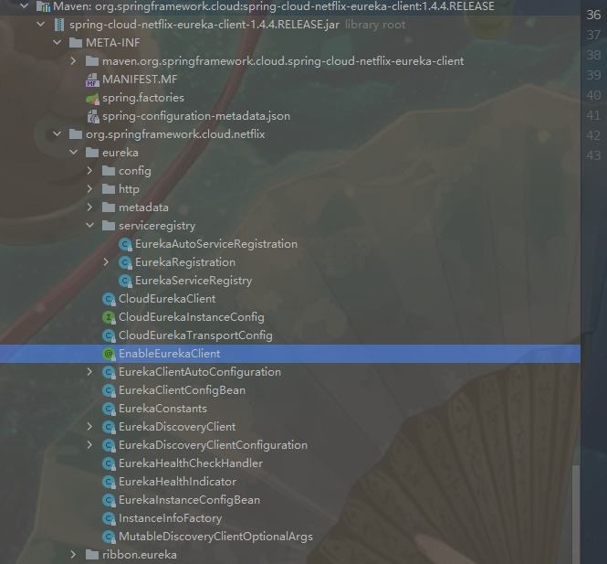

# 1 配置一个快速上手样例

## 1.1 配置eureka服务

pom spring cloud，Edgware.SR3

```xml
<parent>
    <groupId>org.springframework.boot</groupId>
    <artifactId>spring-boot-starter-parent</artifactId>
<version>1.5.13.RELEASE</version>
</parent>
<dependencyManagement>
    <dependencies>
        <dependency>
            <groupId>org.springframework.cloud</groupId>
            <artifactId>spring-cloud-dependencies</artifactId>
            <version>Edgware.SR3</version>
            <type>pom</type>
            <scope>import</scope>
        </dependency>
</dependencies>
</dependencyManagement>
<dependencies>
    <dependency>
        <groupId>org.springframework.cloud</groupId>
        <artifactId>spring-cloud-starter-config</artifactId>
    </dependency>
    <dependency>
        <groupId>org.springframework.cloud</groupId>
        <artifactId>spring-cloud-starter-eureka</artifactId>
    </dependency>
    <dependency>
        <groupId>org.springframework.cloud</groupId>
        <artifactId>spring-cloud-starter-eureka-server</artifactId>
    </dependency>
</dependencies>
```

主入口

```java
@SpringBootApplicationn
@EnableEurekaServer
public class Server {

	public static void main(String[] args) {
	SpringApplication.run(EurekaServer.class, args);
	}	
}
```

yml文件

```yaml
server:
  port: 8761
eureka:
  client:
    registerWithEureka: false
    fetchRegistry: false
#上面那俩配置，就是说不要把自己注册到Eureka，因为他自己就是Eureka的服务，让别人来注册的；还有就是不要到Eureka服务抓取注册信息，因为他不需要，他自己就是Eureka服务
```

直接运行，就可以启动一个Eureka服务，对外开放的是8761端口

打开浏览器，输入http://localhost:8761/，就可以看到Eureka的控制台

## 1.2 配置service服务

pom 

​	去掉 dependency 的 <artifactId>spring-cloud-starter-eureka-server</artifactId>

主入口

​	EnableEurekaServer改为EnableEurekaClient

​	EnableEurekaClient就是说这是个Eureka客户端应用，需要向Eureka服务端注册自己为一个服务，启动这个就好

yml文件

```yaml
server:
  port: 8080
spring:
  application:
    name: ServiceA
eureka:
  instance:
    hostname: localhost
  client:
    serviceUrl:
      defaultZone: http://localhost:8761/eureka
      #上面的，配置了自己的服务名称，主机地址，还有eureka服务的地址
```

eureka基本原理图：


eureka样例基本原理图：


## 1.3 eureka和service服务改成集群

只需要改yml文件即可

eureka:yml

```yaml
server:
  port: 8762
eureka:
  instance:
    hostname: peer2
  client:
    serviceUrl:
      defaultZone: http://peer1:8761/eureka/
      #在本地测试，需改host映射，然后改端口号及,hostname对应映射多次启动即可
      #hosts文件映射样例：127.0.0.1 peer1
```

​	这个就是自己对外开放8762端口，但是自己向8761端口的eureka注册中心来注册自己

​	说白了，就是启动两个eureka服务，互相注册，组成一个集群

service:yml

```yaml
server:
  port: 8088
spring:
  application:
    name: ServiceA
eureka:
  instance:
    hostname: localhost
  client:
    serviceUrl:
      defaultZone: http://peer1:8761/eureka,http://peer2:8762/eureka
      #defaultZone 这个也是说让服务调用者感知到eureka集群，可以从eureka集群获取注册信息
      #多次启动需要改端口号
```

集群启动成功后样例图：


## 1.4 负载均衡测试

ServiceB 接口

```java
@RestController
@Configuration
public class ServiceBController {

	/**
	 * RestTemplate，本来就是访问单个http接口的，但是现在加了@LoadBalanced以后，就可以通过Ribbon的支持，
	 * 实现负载均衡了，假如ServiceA部署了几台机器，那么可以自动负载均衡，轮询调用每一个实例
	 * @return
	 */
	@Bean
	@LoadBalanced
	public RestTemplate getRestTemplate() {
		return new RestTemplate();
	}

	/**
	 * 服务B，就会去调用服务A的sayHello接口
	 * @param name
	 * @return
	 */
	@RequestMapping(value = "/greeting/{name}", method = RequestMethod.GET)
	public String greeting(@PathVariable("name") String name) {
		RestTemplate restTemplate = getRestTemplate();
		return restTemplate.getForObject("http://ServiceA/sayHello/" + name, String.class);
	}
	
}
```

一共访问了服务B的接口11次，会负载均衡到服务A的两个实例上去，一个实例是5次调用，一个实例是6次调用


集群环境eureka调用图：


## 1.5 eureka服务健康的自检机制

​	**1默认情况下:**

​	你的所有的服务，比如服务A和服务B，都会自动给eureka注册中心同步心跳，续约，每隔一段时间发送心跳，如果说某个服务实例挂了，那么注册中心一段时间内没有感知到那个服务的心跳，就会把那个服务给他下线

​	**2 如果你要自己来实现一个服务的健康检查的机制:**

​	自己来检查服务是否宕机，比如说，如果底层依赖的MQ、数据库挂了，你就宣布自己挂了，通知注册中心

在服务中加入以下依赖：

```xml
<dependency>
	<groupId>org.springframework.boot</groupId>
		<artifactId>spring-boot-starter-actuator</artifactId>
	<version>1.5.13.RELEASE</version>
</dependency>
```

​	http://localhost:8080/health(服务地址前缀/health)，可以看到服务的健康状态

**3 可以自己实现一个健康检查器**

 	正常情况下就这样就可以了，但是有一个问题，就是可能这个服务依赖的其他基础设施，比如redis、mysql、mq，都挂掉了，或者底层的基础服务挂掉了，此时这个服务已经不可用了，那么这个服务就可以认定自己是不可用了

​	所以可以自己实现一个健康检查器，就是自己检查自己依赖的基础设施，或者是基础服务，是否挂掉了，来决定自己是否还是健康的

```java
@Component
public class ServiceAHealthIndicator implements HealthIndicator {

@Override
public Health health() {
	// 这里可以通过返回UP或者DOWN来指示服务的状态
	return new Health.Builder(Status.UP).build();
}

@Component
public class ServiceAHealthCheckHandler implements HealthCheckHandler {

@Autowired
private ServiceAHealthIndicator indicator;
    /**
     * eureka client里面会有一个定时器，不断调用那个HealthCheckHandler的getStatus()方法，然后检查当前这个服	   * 务实例的状态，
     * 如果状态变化了，就会通知eureka注册中心。如果服务实例挂掉了，那么eureka注册中心就会感知到，然后下线这个服      * 务实例。
     * @param currentStatus
     * @return
     */	
public InstanceStatus getStatus(InstanceStatus currentStatus) {
	Status status = indicator.health().getStatus();
	// 根据这个status，可以决定这里返回什么
	return InstanceStatus.UP;
}

}	
```

自己实现的情况较少，一般有个Health接口判断服务是否挂掉了就可以了。

## 1.6 心跳检测

```properties
eureka.instance.leaseRenewallIntervalInSeconds
#服务续约，eureka客户端，默认会每隔30秒发送一次心跳的eureka注册中心，这个参数可以修改这个心跳间隔时间
eureka.instance.leaseExpirationDurationInSeconds
#到期时间，如果在90秒内没收到一个eureka客户端的心跳，那么就摘除这个服务实例，别人就访问不到这个服务实例了，通过这个参数可以修改这个90秒的值

########
#但是一般这俩参数建议不要修改。
#另外这个心跳检测的机制其实叫做renew机制，看参数配置就知道了，也可以叫做服务续约
#如果一个服务被关闭了，那么会走cancel机制，就是类似是服务下线吧
```

​	如果90秒内没收到一个client的服务续约，也就是心跳吧，但是他这里叫做服务续约，那么就会走eviction，将服务实例从注册表里给摘除掉

## 1.7 注册表抓取

```properties

eureka.client.registryFetchIntervalSeconds
#默认情况下，客户端每隔30秒去服务器抓取最新的注册表，然后缓存在本地，通过该参数可以修改。

```

## 1.8 自定义元数据(少用)

```yaml
eureka:
	instance:
		hostname: localhosto
		metadata-map:
			company-name: zhss
```

可以通过上面的metadata-map定义服务的元数据，反正就是你自己需要的一些东西，不过一般挺少使用的

## 1.9 保护模式

如果在eureka控制台看到下面的东西：

#### <font color="red">**EMERGENCY! EUREKA MAY BE INCORRECTLY CLAIMING INSTANCES ARE UP WHEN THEY'RE NOT. RENEWALS ARE LESSER THAN THRESHOLD AND HENCE THE INSTANCES ARE NOT BEING EXPIRED JUST TO BE SAFE.**</font>

​	这就是eureka进入了自我保护模式，如果客户端的心跳失败了超过一定的比例，

**或者说在一定时间内（15分钟）接收到的服务续约低于85%，那么就会认为是自己网络故障了，(错啦，不是15分钟)**

导致人家client无法发送心跳。这个时候eureka注册中心会先给保护起来，不会立即把失效的服务实例摘除，在测试的时候一般都会关闭这个自我保护模式：

**PS:期望心跳数*0.85 < 上一分钟心跳数，就会进入保护模式。15分钟是更新期望心跳数的定时任务，所以会认为是15分钟才会进入保护模式。实际上自动摘除停止实例的任务60s执行一次，且心跳数较少就会导致直接进入保护模式，不会将服务实例摘除下线了。**

```
eureka.server.enable-self-preservation: false
#关闭保护模式
```

​	在生产环境里面，他怕自己因为自己有网络问题，导致别人没法给自己发心跳，就不想胡乱把别人给摘除，他就进入保护模式，不再摘除任何实例，等到自己网络环境恢复。

## 1.10 扩展

eureka server的启动，相当于是注册中心的启动

eureka client的启动，相当于是服务的启动

**eureka运行的核心的流程，eureka client往eureka server注册的过程**，

​	1 服务注册；服务发现，eureka client从eureka server获取注册表的过程；

​	2 服务心跳，eureka client定时往eureka server发送续约通知（心跳）；

​	3 服务实例摘除；通信，限流，自我保护，server集群

eureka server怎么启动的？

​	**eureka server是依赖eureka client的**，为啥呢？eureka server也是一个eureka client，因为后面我们讲到eureka server集群模式的时候，eureka server也要扮演eureka client的角色，往其他的eureka server上去注册。

​	**eureka core**，扮演了核心的注册中心的角色，接收别人的服务注册请求，提供服务发现的功能，保持心跳（续约请求），摘除故障服务实例。**eureka server依赖eureka core的，基于eureka core的功能对外暴露接口**，提供注册中心的功能

### 1.11 常用配置项

https://www.cnblogs.com/zyon/p/11023750.html

# 2 Eureka Server启动源码

## 2.1 Eureka Server的web工程结构分析以及web.xml解读

### 2.1.1 gradle主要引用

**jersey框架(国内基本没人用):**

​	1 eureka server依赖jersey框架，你可以认为jersey框架类比于spring web mvc框架，支持mvc模式，支持restful http请求

​	2 eureka client和eureka server之间进行通信，都是基于jersey框架实现http restful接口请求和调用的

​	3 eureka-client-jersey2，eureka-core-jersey2,这两个工程是eureka为了方便自己，对jersey框架的一个封装，提供更多的功能，方便自己使用

**mockito：**

​	1 mock测试框架，mock就是用的mockito框架

​	2 在eureka框架里面，他每个工程都是有src/test/java的，里面都写了针对自己本工程的单元测试

**jetty：**	

​	1 方便你测试的，测试的时候，是会基于jetty直接将eureka server作为一个web应用给跑起来

​	2 jersey对外暴露了一些restful接口，然后测试类里，就可以基于jersey的客户端，发送http请求，调用eureka server暴露的restful接口，测试比如说：服务注册、心跳、服务实例摘除，等等功能。

```groovy
apply plugin: 'war'

dependencies {
    compile project(':eureka-client')
    compile project(':eureka-core')
    runtime 'xerces:xercesImpl:2.4.0'
    compile "com.sun.jersey:jersey-server:$jerseyVersion"
    compile "com.sun.jersey:jersey-servlet:$jerseyVersion"
    compile 'org.slf4j:slf4j-log4j12:1.6.1'
    runtime 'org.codehaus.jettison:jettison:1.2' 
    providedCompile "javax.servlet:servlet-api:$servletVersion"

    testCompile project(':eureka-test-utils')
    testCompile "org.mockito:mockito-core:${mockitoVersion}"
    testCompile "org.eclipse.jetty:jetty-server:$jetty_version"
    testCompile "org.eclipse.jetty:jetty-webapp:$jetty_version"
}

task copyLibs(type: Copy) {
    into 'testlibs/WEB-INF/libs'
    from configurations.runtime	
}

//将eureka-resources下面的那些jsp、js、css给搞到这个war包里面去，然后就可以跑起来，提供一个index页面
war {
    from (project(':eureka-resources').file('build/resources/main'))
}

// Integration test loads eureka war, so it must be ready prior to running tests
test.dependsOn war

```

**PS:对应下载的eureka版本为netflix项目的1.7.x的1.7.2的tag版本**

### 2.1.2 web.xml解读

web应用最最核心的就是web.xml。

​	最最重要的就是listener，listener是在web应用启动的时候就会执行的，负责对这个web应用进行初始化的事儿，我们如果自己写个web应用，也经常会写一个listener，在里面搞一堆初始化的代码，比如说，启动一些后台线程，加载个配置文件。

```xml
  <listener>
    <listener-class>com.netflix.eureka.EurekaBootStrap</listener-class>
  </listener>
<!--在eureka-core里，就是负责eureka-server的初始化的-->
```

有连着4个Filter，任何一个请求都会经过这些filter，这些filter会对每个请求都进行处理，这个4个filter都在eureka-core里面

```xml
  <filter>
    <filter-name>statusFilter</filter-name>
    <filter-class>com.netflix.eureka.StatusFilter</filter-class>
  </filter>
<!--StatusFilter：负责状态相关的处理逻辑-->
  <filter>
    <filter-name>requestAuthFilter</filter-name>
    <filter-class>com.netflix.eureka.ServerRequestAuthFilter</filter-class>
  </filter>
  <!--ServerRequestAuthFilter：一看就是，对请求进行授权认证的处理的-->
  <filter>
    <filter-name>rateLimitingFilter</filter-name>
    <filter-class>com.netflix.eureka.RateLimitingFilter</filter-class>
  </filter>
  <!--RateLimitingFilter：负责限流相关的逻辑的（很有可能成为eureka-server里面的一个技术亮点，看看人家eureka-server作为一个注册中心，是怎么做限流的，先留意算法是什么，留到后面去看）-->
  <filter>
    <filter-name>gzipEncodingEnforcingFilter</filter-name>
    <filter-class>com.netflix.eureka.GzipEncodingEnforcingFilter</filter-class>
  </filter>
  <!--GzipEncodingEnforcingFilter：gzip，压缩相关的；encoding，编码相关的-->
```

jersey框架的一个ServletContainer的一个filter

​	1 类似于每个mvc框架，比如说struts2和spring web mvc，都会搞一个自己的核心filter，或者是核心servlet，配置在web.xml里

​	2 相当于就是将web请求的处理入口交给框架了，框架会根据你的配置，自动帮你干很多事儿，最后调用你的一些处理逻辑。

​	3 jersey也是一样的，这里的这个ServletContainer就是一个核心filter，接收所有的请求，作为请求的入口，处理之后来调用你写的代码逻辑。

```xml
  <filter>
    <filter-name>jersey</filter-name>
    <filter-class>com.sun.jersey.spi.container.servlet.ServletContainer</filter-class>
    <init-param>
      <param-name>com.sun.jersey.config.property.WebPageContentRegex</param-name>
      <param-value>/(flex|images|js|css|jsp)/.*</param-value>
    </init-param>
    <init-param>
      <param-name>com.sun.jersey.config.property.packages</param-name>
      <param-value>com.sun.jersey;com.netflix</param-value>
    </init-param>

    <!-- GZIP content encoding/decoding -->
    <init-param>
      <param-name>com.sun.jersey.spi.container.ContainerRequestFilters</param-name>
      <param-value>com.sun.jersey.api.container.filter.GZIPContentEncodingFilter</param-value>
    </init-param>
    <init-param>
      <param-name>com.sun.jersey.spi.container.ContainerResponseFilters</param-name>
      <param-value>com.sun.jersey.api.container.filter.GZIPContentEncodingFilter</param-value>
    </init-param>
  </filter>
```

filter-mapping

```xml
  <filter-mapping>
    <filter-name>statusFilter</filter-name>
    <url-pattern>/*</url-pattern>
  </filter-mapping>

  <filter-mapping>
    <filter-name>requestAuthFilter</filter-name>
    <url-pattern>/*</url-pattern>
  </filter-mapping>
<!--StatusFilter和RequestAuthFilter，一看就是通用的处理逻辑，是对所有的请求都开放的-->
  <!-- Uncomment this to enable rate limiter filter.
  <filter-mapping>
    <filter-name>rateLimitingFilter</filter-name>
    <url-pattern>/v2/apps</url-pattern>
    <url-pattern>/v2/apps/*</url-pattern>
  </filter-mapping>
  -->
<!--RateLimitingFilter，默认是不开启的，如果你要打开eureka-server内置的限流功能，你需要自己把RateLimitingFilter的<filter-mapping>的注释打开，让这个filter生效-->

  <filter-mapping>
    <filter-name>gzipEncodingEnforcingFilter</filter-name>
    <url-pattern>/v2/apps</url-pattern>
    <url-pattern>/v2/apps/*</url-pattern>
  </filter-mapping>
<!-/v2/apps相关的请求，会走这里，仅仅对部分特殊的请求生效-->

  <filter-mapping>
    <filter-name>jersey</filter-name>
    <url-pattern>/*</url-pattern>
  </filter-mapping>
  <!--jersey核心filter，是拦截所有的请求的-->

```

welcome-file-list，是配置了status.jsp是欢迎页面，首页，eureka-server的控制台页面，展示注册服务的信息

```xml
  <welcome-file-list>
    <welcome-file>jsp/status.jsp</welcome-file>
  </welcome-file-list>
```

### 2.1.3 总结

​	如果要启动eureka-server，就打成war包，找一个web容器，比如说tomcat，就可以启动了 ==> 测试类里，是基于jetty代码层面来启动jetty web容器和eureka-server，方便测试发送http restful接口的调用请求

​	1 eureka-server -> build.gradle中的依赖和构建的配置

​	2 eureka-server -> web应用 -> war包 -> tomcat就可以启动

​	3 web.xml -> listener -> 4个filter -> jersy filter -> filter mapping -> welcome file

##  2.2 Eureka Server启动之环境EurekaBootStrap监听器

​	web容器（tomcat还是jetty）启动的时候，把eureka-server作为一个web应用给带起来的时候，eureka-server的初始化的逻辑，监听器，EurekaBootStrap。（eureka-core里面）

**EurekaBootStrap部分核心代码：**

```java
public class EurekaBootStrap implements ServletContextListener {

    /**
     * Initializes Eureka, including syncing up with other Eureka peers and publishing the registry.
     * 监听器的执行初始化的方法，是contextInitialized()方法，这个方法就是整个eureka-server启动初始化的一个入
     * 口。
     */
 	@Override
    public void contextInitialized(ServletContextEvent event) {
        try {
            //2.2.1 initEurekaEnvironment(初始化eureka环境)
            initEurekaEnvironment();
            //2.2.2 配置文件加载
            initEurekaServerContext();

            ServletContext sc = event.getServletContext();
            sc.setAttribute(EurekaServerContext.class.getName(), serverContext);
        } catch (Throwable e) {
            logger.error("Cannot bootstrap eureka server :", e);
            throw new RuntimeException("Cannot bootstrap eureka server :", e);
        }
    }

}
```


### 2.2.1 initEurekaEnvironment(初始化eureka环境 )

#### 2.2.1.1 流程

**EurekaBootStrap部分核心代码：**

```java
package com.netflix.eureka;
public class EurekaBootStrap implements ServletContextListener {
    
    /** 
     * Users can override to initialize the environment themselves.
     * 初始化eureka-server的环境
     * ConfigurationManager.getConfigInstance()方法，
     * 这个方法，其实就是初始化ConfigurationManager的实例，也就是一个配置管理器的初始化的这么一个过程
     */
    protected void initEurekaEnvironment() throws Exception {
        logger.info("Setting the eureka configuration..");
        
        //初始化数据中心的配置
        String dataCenter = ConfigurationManager.getConfigInstance().getString(EUREKA_DATACENTER);
        if (dataCenter == null) {
            logger.info("Eureka data center value eureka.datacenter is not set, defaulting to default");
            //初始化数据中心的配置，如果没有配置的话，就是默认(DEFAULT)
            ConfigurationManager.getConfigInstance().setProperty(ARCHAIUS_DEPLOYMENT_DATACENTER, DEFAULT);
        } else {
            //初始化数据中心的配置,有的话就将配置设置一下
            ConfigurationManager.getConfigInstance().setProperty(ARCHAIUS_DEPLOYMENT_DATACENTER, dataCenter);
        }
        String environment = ConfigurationManager.getConfigInstance().getString(EUREKA_ENVIRONMENT);
        if (environment == null) {
            //初始化eurueka运行的环境，如果你没有配置的话，默认就给你设置为test环境
            ConfigurationManager.getConfigInstance().setProperty(ARCHAIUS_DEPLOYMENT_ENVIRONMENT, TEST);
            logger.info("Eureka environment value eureka.environment is not set, defaulting to test");
        }
    }
}
```

   ConfigurationManager是什么呢？看字面意思都猜的出来，配置管理器， 管理eureka自己的所有的配置，读取配置文件里的配置到内存里，供后续的eureka-server运行来使用。

**ConfigurationManager 部分核心代码（ConfigurationManager本身不是属于eureka的源码，是属于netflix config项目的源码）：**

```java
package com.netflix.config;


public class ConfigurationManager {    
    
    static volatile AbstractConfiguration instance = null;
    
    /**
    * double check + volatile 实现线程安全的单例模式
    */
	public static AbstractConfiguration getConfigInstance() {
        if (instance == null) {
            synchronized (ConfigurationManager.class) {
                if (instance == null) {
                    //调用重载有参方法
                    instance = getConfigInstance(Boolean.getBoolean(DynamicPropertyFactory.DISABLE_DEFAULT_CONFIG));
                }
            }
        }
        return instance;
    }
    
    /**
    * getConfigInstance()重载
    */
    private static AbstractConfiguration getConfigInstance(boolean defaultConfigDisabled) {
        if (instance == null && !defaultConfigDisabled) {
            //createDefaultConfigInstance 获取AbstractConfiguration实例 
            instance = createDefaultConfigInstance();
            registerConfigBean();
        }
        return instance;        
    }
    
    /**
    * ConcurrentCompositeConfiguration为AbstractConfiguration的实例，是AbstractConfiguration抽象类的实现
    */
    private static AbstractConfiguration createDefaultConfigInstance() {
        //无参构造调用了clear()方法进行一些配置的初始化
        ConcurrentCompositeConfiguration config = new ConcurrentCompositeConfiguration();  
        try {
            DynamicURLConfiguration defaultURLConfig = new DynamicURLConfiguration();
            config.addConfiguration(defaultURLConfig, URL_CONFIG_NAME);
        } catch (Throwable e) {
            logger.warn("Failed to create default dynamic configuration", e);
        }
        if (!Boolean.getBoolean(DISABLE_DEFAULT_SYS_CONFIG)) {
            SystemConfiguration sysConfig = new SystemConfiguration();
            config.addConfiguration(sysConfig, SYS_CONFIG_NAME);
        }
        if (!Boolean.getBoolean(DISABLE_DEFAULT_ENV_CONFIG)) {
            EnvironmentConfiguration envConfig = new EnvironmentConfiguration();
            config.addConfiguration(envConfig, ENV_CONFIG_NAME);
        }
        ConcurrentCompositeConfiguration appOverrideConfig = new ConcurrentCompositeConfiguration();
        config.addConfiguration(appOverrideConfig, APPLICATION_PROPERTIES);
        config.setContainerConfigurationIndex(config.getIndexOfConfiguration(appOverrideConfig));
        return config;
    }
}
```

​	**ConcurrentCompositeConfiguration实例，这个东西，其实就是代表了所谓的配置，包括了eureka需要的所有的配置。在初始化这个实例的时候，调用了坑爹的clear()方法，fireEvent()发布了一个事件（EVENT_CLEAR），fireEvent()这个方法其实是父类的方法，牵扯比较复杂的另外一个项目**

​	**ConcurrentCompositeConfiguration部分核心代码：**

```java
public class ConcurrentCompositeConfiguration extends ConcurrentMapConfiguration 
        implements AggregatedConfiguration, ConfigurationListener, Cloneable {
    
    /**
    * 有参构造调用clear()初始化配置
    */
    public ConcurrentCompositeConfiguration()
    {
        clear();
    }
    
    /**
    * 不属于eureka源码，无须追踪太多
    */
    @Override
    public final void clear()
    {	
        //父类的方法，加入事件到对应监听中(观察者模式)
        fireEvent(EVENT_CLEAR, null, null, true);
        configList.clear();
        namedConfigurations.clear();
        // recreate the in memory configuration
        containerConfiguration = new ConcurrentMapConfiguration();
        containerConfiguration.setThrowExceptionOnMissing(isThrowExceptionOnMissing());
        containerConfiguration.setListDelimiter(getListDelimiter());
        containerConfiguration.setDelimiterParsingDisabled(isDelimiterParsingDisabled());
        containerConfiguration.addConfigurationListener(eventPropagater);
        configList.add(containerConfiguration);
        
        overrideProperties = new ConcurrentMapConfiguration();
        overrideProperties.setThrowExceptionOnMissing(isThrowExceptionOnMissing());
        overrideProperties.setListDelimiter(getListDelimiter());
        overrideProperties.setDelimiterParsingDisabled(isDelimiterParsingDisabled());
        overrideProperties.addConfigurationListener(eventPropagater);
        //父类的方法，加入事件到对应监听中(观察者模式)
        fireEvent(EVENT_CLEAR, null, null, false);
        containerConfigurationChanged = false;
        invalidate();
    }

}
```

#### 2.2.1.2 总结

（1）创建一个ConcurrentCompositeConfiguration实例，这个东西，其实就是代表了所谓的配置，包括了eureka需要的所有的配置。在初始化这个实例的时候，调用了clear()方法来初始化配置，fireEvent()发布了一个事件（EVENT_CLEAR）（fireEvent()这个方法其实是父类的方法，牵扯比较复杂的另外一个项目（ConfigurationManager本身不是属于eureka的源码，是属于netflix config项目的源码）

（2）就是往上面的那个ConcurrentCompositeConfiguration实例加入了一堆别的config，然后搞完了以后，就直接返回了这个实例，就是作为所谓的那个配置的单例

（3）初始化数据中心的配置，如果没有配置的话，就是DEFAULT（默认配置），有配置则加入ConfigurationManager

（4）初始化eurueka运行的环境，如果你没有配置的话，默认就给你设置为test环境

（5）initEurekaEnvironment的初始化环境的逻辑，就结束了

### 2.2.2 initEurekaServerContext(配置文件加载)

```java
public class EurekaBootStrap implements ServletContextListener {
	/**
     * init hook for server context. Override for custom logic.
     */
    protected void initEurekaServerContext() throws Exception {
        //第一步，加载eureka-server.properties文件中的配置
        //在springCloud集成中就是对应yml的一些eureka配置
        EurekaServerConfig eurekaServerConfig = new DefaultEurekaServerConfig();

        // For backward compatibility
        JsonXStream.getInstance().registerConverter(new V1AwareInstanceInfoConverter(), XStream.PRIORITY_VERY_HIGH);
        XmlXStream.getInstance().registerConverter(new V1AwareInstanceInfoConverter(), XStream.PRIORITY_VERY_HIGH);

        logger.info("Initializing the eureka client...");
        logger.info(eurekaServerConfig.getJsonCodecName());
        ServerCodecs serverCodecs = new DefaultServerCodecs(eurekaServerConfig);

       
        //第二步，初始化ApplicationInfoManage
        ApplicationInfoManager applicationInfoManager = null;
        
	    //第二步，初始化eureka-server内部的一个eureka-client(用来跟其他的eureka-server节点进行注册和通信的)
        if (eurekaClient == null) {
            EurekaInstanceConfig instanceConfig = isCloud(ConfigurationManager.getDeploymentContext())
                    ? new CloudInstanceConfig()
                    : new MyDataCenterInstanceConfig();
            
            applicationInfoManager = new ApplicationInfoManager(
                    instanceConfig, new EurekaConfigBasedInstanceInfoProvider(instanceConfig).get());
            
            EurekaClientConfig eurekaClientConfig = new DefaultEurekaClientConfig();
            eurekaClient = new DiscoveryClient(applicationInfoManager, eurekaClientConfig);
        } else {
            applicationInfoManager = eurekaClient.getApplicationInfoManager();
        }

        //第三步，处理注册相关的事情
        PeerAwareInstanceRegistry registry;
        if (isAws(applicationInfoManager.getInfo())) {
            registry = new AwsInstanceRegistry(
                    eurekaServerConfig,
                    eurekaClient.getEurekaClientConfig(),
                    serverCodecs,
                    eurekaClient
            );
            awsBinder = new AwsBinderDelegate(eurekaServerConfig, eurekaClient.getEurekaClientConfig(), registry, applicationInfoManager);
            awsBinder.start();
        } else {
            registry = new PeerAwareInstanceRegistryImpl(
                    eurekaServerConfig,
                    eurekaClient.getEurekaClientConfig(),
                    serverCodecs,
                    eurekaClient
            );
        }

        //第四步，处理peer节点相关的事情
        PeerEurekaNodes peerEurekaNodes = getPeerEurekaNodes(
                registry,
                eurekaServerConfig,
                eurekaClient.getEurekaClientConfig(),
                serverCodecs,
                applicationInfoManager
        );

        //第五步，完成eureka上下文(context)的构建
        serverContext = new DefaultEurekaServerContext(
                eurekaServerConfig,
                serverCodecs,
                registry,
                peerEurekaNodes,
                applicationInfoManager
        );

        EurekaServerContextHolder.initialize(serverContext);

        serverContext.initialize();
        logger.info("Initialized server context");

        // Copy registry from neighboring eureka node
        //第六步，处理一点善后的事情，从相邻的eureka节点拷贝注册信息
        int registryCount = registry.syncUp();
        registry.openForTraffic(applicationInfoManager, registryCount);

        // Register all monitoring statistics.
        //第七步，处理一点善后的事情，处理所有的监控统计项
        EurekaMonitors.registerAllStats();
    }
}
```

#### 2.2.2.1 加载eureka-server.properties文件中的配置

##### 2.2.2.1.1 流程

EurekaServerConfig，这是个接口，这里面有一堆getXXX()的方法，包含了eureka server需要使用的所有的配置，都可以通过这个接口来获取

```java
@Singleton
public class DefaultEurekaServerConfig implements EurekaServerConfig {
    
    private static final DynamicStringProperty EUREKA_PROPS_FILE = DynamicPropertyFactory
            .getInstance().getStringProperty("eureka.server.props",
                    "eureka-server");
    
    /**
    * 可以认为DynamicPropertyFactory是从ConfigurationManager那儿来的，因为ConfigurationManager中都包含了加载出来的配置了，所以DynamicPropertyFactory里，也可以获取到所有的配置项
    */
    private static final DynamicPropertyFactory configInstance = com.netflix.config.DynamicPropertyFactory
            .getInstance();
    
    /**
    * 在DefaultEurekaServerConfig的各种获取配置项的方法中，配置项的名字是在各个方法中硬编码的
    * getEIPBindRebindRetries是n个get方法中的其中之一，写法都一样，都是硬编码获取值，没有则给个默认值
    */
    @Override
    public int getEIPBindRebindRetries() {
        //configInstance从一个DynamicPropertyFactory里面去获取的
        return configInstance.getIntProperty(
                namespace + "eipBindRebindRetries", 3).get();

    }
    
    public DefaultEurekaServerConfig() {
        init();
    }
    
    /**
    * DefaultEurekaServerConfig.init()方法中，会将eureka-server.properties文件中的配置加载出来，都放到ConfdigurationManager中去
    */
    private void init() {
        String env = ConfigurationManager.getConfigInstance().getString(
                EUREKA_ENVIRONMENT, TEST);
        ConfigurationManager.getConfigInstance().setProperty(
                ARCHAIUS_DEPLOYMENT_ENVIRONMENT, env);
        //eurekaPropsFile，对应的就是eureka-server(配置文件名)
        String eurekaPropsFile = EUREKA_PROPS_FILE.get();
        try {
            // ConfigurationManager
            // .loadPropertiesFromResources(eurekaPropsFile);
            //将加载出来的Properties中的配置项都放到ConfigurationManager中去，由这个ConfigurationManager来管理
            ConfigurationManager
                    .loadCascadedPropertiesFromResources(eurekaPropsFile);
        } catch (IOException e) {
            logger.warn(
                    "Cannot find the properties specified : {}. This may be okay if there are other environment "
                            + "specific properties or the configuration is installed with a different mechanism.",
                    eurekaPropsFile);
        }
    }
}
```

​	ConfigurationManager，是个单例，负责管理所有的配置的，ConfigurationManager是属于netfilx config开源项目的，不是属于eureka项目的源码，所以我们大概看一下就可以了，不要去深究了。eureka-server跟.properties给拼接起来了，拼接成一个eureka-server.properties，代表了eureka server的配置文件的名称。

​	比如说eureka-server那个工程里，就有一个src/main/resources/eureka-server.properties文件，只不过里面是空的，全部都用了默认的配置

```java
public class ConfigurationManager {
    
    /**
    * 将eureka-sesrver.properties中的配置，加载到了Properties对象中去；然后会加载eureka-server-环境.properties中的配置，加载到另外一个Properties中，覆盖之前那个老的Properties中的属性。
    */
    public static void loadCascadedPropertiesFromResources(String configName) throws IOException {
        //将eureka-sesrver.properties中的配置，加载到了Properties对象中去
        Properties props = loadCascadedProperties(configName);
        //将加载出来的Properties中的配置项都放到ConfigurationManager中去，由这个ConfigurationManager来管理
        if (instance instanceof AggregatedConfiguration) {
            ConcurrentMapConfiguration config = new ConcurrentMapConfiguration();
            config.loadProperties(props);
            //addConfiguration方式
            ((AggregatedConfiguration) instance).addConfiguration(config, configName);
        } else {
            //loadProperties方式
            ConfigurationUtils.loadProperties(props, instance);
        }
    }
}
```

##### 2.2.2.1.2 总结

（1）创建了一个DefaultEurekaServerConfig对象

（2）创建DefaultEurekaServerConfig对象的时候，在里面会有一个init方法

（3）先是将eureka-server.properties中的配置加载到了一个Properties对象中，然后将Properties对象中的配置放到ConfigurationManager中去，此时ConfigurationManager中去就有了所有的配置了

（4）然后DefaultEurekaServerConfig提供的获取配置项的各个方法，都是通过硬编码的配置项名称，从DynamicPropertyFactory中获取配置项的值，DynamicPropertyFactory是从ConfigurationManager那儿来的，所以也包含了所有配置项的值

（5）在获取配置项的时候，如果没有配置，那么就会有默认的值，全部属性都是有默认值的

#### 2.2.2.2 eureka-client服务实例构造

##### 2.2.2.2.1 初始化ApplicationInfoManage相关

###### 2.2.2.2.1.1 流程

```java
public class EurekaBootStrap implements ServletContextListener {
    
    //initEurekaServerContext第二步
    protected void initEurekaServerContext() throws Exception
    
		//第二步，初始化ApplicationInfoManage
        ApplicationInfoManager applicationInfoManager = null;

        //第二步，初始化eureka-server内部的一个eureka-client(用来跟其他的eureka-server节点进行注册和通信的)
        if (eurekaClient == null) {
            //EurekaInstanceConfig，其实就是将eureka-client.properties文件中的配置加载到ConfigurationManager中去
            EurekaInstanceConfig instanceConfig = isCloud(ConfigurationManager.getDeploymentContext())
                    ? new CloudInstanceConfig()
                    : new MyDataCenterInstanceConfig();
            
            //new EurekaConfigBasedInstanceInfoProvider(instanceConfig).get() 返回InstanceInfo实例
            applicationInfoManager = new ApplicationInfoManager(
                    instanceConfig, new EurekaConfigBasedInstanceInfoProvider(instanceConfig).get());
            //也是去读eureka-client.properties里的一些配置，只不过他关注的是跟之前的那个EurekaInstanceConfig是不一样的，代表了服务实例的一些配置项，这里的是关联的这个EurekaClient的一些配置项
            EurekaClientConfig eurekaClientConfig = new DefaultEurekaClientConfig();
            //基于ApplicationInfoManager（包含了服务实例的信息、配置，作为服务实例管理的一个组件），eureka client相关的配置，一起构建了一个EurekaClient，但是构建的时候，用的是EurekaClient的子类，DiscoveryClient。
            eurekaClient = new DiscoveryClient(applicationInfoManager, eurekaClientConfig);
        } else {
            applicationInfoManager = eurekaClient.getApplicationInfoManager();
        }
    
}
```

​	EurekaInstanceConfig，其实跟之前的是类似的，其实就是将eureka-client.properties文件中的配置加载到ConfigurationManager中去，然后基于EurekaInstanceConfig对外暴露的接口来获取这个eureka-client.properties文件中的一些配置项的读取，而且人家提供了所有配置项的默认值

​	可以大致认为EurekaInstanceConfig是服务实例相关的一些配置。eureka server同时也是一个eureka client，因为他可能要向其他的eureka server去进行注册，组成一个eureka server的集群。eureka server把自己也当做是一个eureka client，也就是一个服务实例，所以他这里肯定也是有所谓的Application、Instance等概念的。

```java
@ImplementedBy(CloudInstanceConfig.class)
public interface EurekaInstanceConfig {
    /**
     * Get the unique Id (within the scope of the appName) of this instance to be registered with eureka.
     *
     * @return the (appname scoped) unique id for this instance
     */
    String getInstanceId();

    /**
     * Get the name of the application to be registered with eureka.
     *
     * @return string denoting the name.
     */
    String getAppname();
}
```

​	eureka server自己本身代表的一个服务实例，把自己作为一个服务注册到别的eureka server上去，精华，就在于构造器模式的使用。InstanceInfo.Builder，拿到静态内部类的对象，InstanceInfo.Builder.newBuilder()，这个里面就构造了一个InstanceInfo。然后就是基于这个builder去set各种需要的属性和配置，别的对象，搞完了之后，就完成最终的一个复杂的InstanceInfo服务实例对象的这么一个构造。

```java
@Singleton
public class EurekaConfigBasedInstanceInfoProvider implements Provider<InstanceInfo> {
    private static final Logger LOG = LoggerFactory.getLogger(EurekaConfigBasedInstanceInfoProvider.class);

    private final EurekaInstanceConfig config;

    private InstanceInfo instanceInfo;

    @Inject(optional = true)
    private VipAddressResolver vipAddressResolver = null;

    @Inject
    public EurekaConfigBasedInstanceInfoProvider(EurekaInstanceConfig config) {
        this.config = config;
    }

    /**
    * InstanceInfo，你可以认为就是当前这个服务实例的实例本身的信息，直接用了构造器模式，用InstanceInfo.Builder来构造一个复杂的代表一个服务实例的* * 		* InstanceInfo对象。核心的思路是，从之前的那个EurekaInstanceConfig中，读取各种各样的服务实例相关的配置信息，再构造了几个其他的对象，最终完成了	* InstanceInfo的构建
    */
    @Override
    public synchronized InstanceInfo get() {
        if (instanceInfo == null) {
            // Build the lease information to be passed to the server based on config
            LeaseInfo.Builder leaseInfoBuilder = LeaseInfo.Builder.newBuilder()
                    .setRenewalIntervalInSecs(config.getLeaseRenewalIntervalInSeconds())
                    .setDurationInSecs(config.getLeaseExpirationDurationInSeconds());

            if (vipAddressResolver == null) {
                vipAddressResolver = new Archaius1VipAddressResolver();
            }

            // Builder the instance information to be registered with eureka server
            //构造器模式/建造者模式(Builder),获取静态内部类
            InstanceInfo.Builder builder = InstanceInfo.Builder.newBuilder(vipAddressResolver);

            // set the appropriate id for the InstanceInfo, falling back to datacenter Id if applicable, else hostname
            String instanceId = config.getInstanceId();
            DataCenterInfo dataCenterInfo = config.getDataCenterInfo();
            if (instanceId == null || instanceId.isEmpty()) {
                if (dataCenterInfo instanceof UniqueIdentifier) {
                    instanceId = ((UniqueIdentifier) dataCenterInfo).getId();
                } else {
                    instanceId = config.getHostName(false);
                }
            }

            String defaultAddress;
            if (config instanceof RefreshableInstanceConfig) {
                // Refresh AWS data center info, and return up to date address
                defaultAddress = ((RefreshableInstanceConfig) config).resolveDefaultAddress(false);
            } else {
                defaultAddress = config.getHostName(false);
            }

            // fail safe
            if (defaultAddress == null || defaultAddress.isEmpty()) {
                defaultAddress = config.getIpAddress();
            }

            //构造器模式/建造者模式(builder)
            //通过静态内部类对应方法设置参数
            builder.setNamespace(config.getNamespace())
                    .setInstanceId(instanceId)
                    .setAppName(config.getAppname())
                    .setAppGroupName(config.getAppGroupName())
                    .setDataCenterInfo(config.getDataCenterInfo())
                    .setIPAddr(config.getIpAddress())
                    .setHostName(defaultAddress)
                    .setPort(config.getNonSecurePort())
                    .enablePort(PortType.UNSECURE, config.isNonSecurePortEnabled())
                    .setSecurePort(config.getSecurePort())
                    .enablePort(PortType.SECURE, config.getSecurePortEnabled())
                    .setVIPAddress(config.getVirtualHostName())
                    .setSecureVIPAddress(config.getSecureVirtualHostName())
                    .setHomePageUrl(config.getHomePageUrlPath(), config.getHomePageUrl())
                    .setStatusPageUrl(config.getStatusPageUrlPath(), config.getStatusPageUrl())
                    .setASGName(config.getASGName())
                    .setHealthCheckUrls(config.getHealthCheckUrlPath(),
                            config.getHealthCheckUrl(), config.getSecureHealthCheckUrl());


            // Start off with the STARTING state to avoid traffic
            if (!config.isInstanceEnabledOnit()) {
                //设置state状态(STARTING)，表示当前服务实例正在启动中
                InstanceStatus initialStatus = InstanceStatus.STARTING;
                LOG.info("Setting initial instance status as: " + initialStatus);
                builder.setStatus(initialStatus);
            } else {
                LOG.info("Setting initial instance status as: {}. This may be too early for the instance to advertise "
                         + "itself as available. You would instead want to control this via a healthcheck handler.",
                         InstanceStatus.UP);
            }

            // Add any user-specific metadata information
            //自定义元数据相关
            for (Map.Entry<String, String> mapEntry : config.getMetadataMap().entrySet()) {
                String key = mapEntry.getKey();
                String value = mapEntry.getValue();
                builder.add(key, value);
            }
			//通过静态内部类获取 构造/建造 完成的实例
            instanceInfo = builder.build();
            //leaseInfoBuilder租约相关信息，也是构造器模式创建的实例
            instanceInfo.setLeaseInfo(leaseInfoBuilder.build());
        }
        return instanceInfo;
    }

}

```

​	直接基于EurekaInstanceConfig和InstnaceInfo，构造了一个ApplicationInfoManager，后面会基于这个ApplicationInfoManager对服务实例进行一些管理。

```java
@Singleton
public class ApplicationInfoManager {

    private InstanceInfo instanceInfo;
    private EurekaInstanceConfig config;
    
    public ApplicationInfoManager(EurekaInstanceConfig config, InstanceInfo instanceInfo) {
        this(config, instanceInfo, null);
    }
    
    @Inject
    public ApplicationInfoManager(EurekaInstanceConfig config, InstanceInfo instanceInfo, OptionalArgs optionalArgs) {
        this.config = config;
        this.instanceInfo = instanceInfo;
        this.listeners = new ConcurrentHashMap<String, StatusChangeListener>();
        if (optionalArgs != null) {
            this.instanceStatusMapper = optionalArgs.getInstanceStatusMapper();
        } else {
            this.instanceStatusMapper = NO_OP_MAPPER;
        }

        // Hack to allow for getInstance() to use the DI'd ApplicationInfoManager
        instance = this;
    }
}
```


**构造器/建造者模式(Builder):**

https://blog.csdn.net/zxd1435513775/article/details/83016670?utm_medium=distribute.pc_relevant.none-task-blog-2%7Edefault%7EBlogCommendFromMachineLearnPai2%7Edefault-1.control&depth_1-utm_source=distribute.pc_relevant.none-task-blog-2%7Edefault%7EBlogCommendFromMachineLearnPai2%7Edefault-1.control

​	EurekaClientConfig，这个东西也是个接口，也是对外暴露了一大堆的配置项，看名字就知道了啊，这里包含的是EurekaClient相关的一些配置项。也是去读eureka-client.properties里的一些配置，只不过他关注的是跟之前的那个EurekaInstanceConfig是不一样的，代表了服务实例的一些配置项，这里的是关联的这个EurekaClient的一些配置项。

```java
/**
* 接口，定义了一大堆配置的get方法
*/
@ImplementedBy(DefaultEurekaClientConfig.class)
public interface EurekaClientConfig {

    /**
     * Indicates how often(in seconds) to fetch the registry information from
     * the eureka server.
     *
     * @return the fetch interval in seconds.
     */
    int getRegistryFetchIntervalSeconds();
}

/**
* 接口实现类，就是获取eureka-client配置项
*/
@Singleton
@ProvidedBy(DefaultEurekaClientConfigProvider.class)
public class DefaultEurekaClientConfig implements EurekaClientConfig {
        public DefaultEurekaClientConfig() {
        this(CommonConstants.DEFAULT_CONFIG_NAMESPACE);
    }

    public DefaultEurekaClientConfig(String namespace) {
        this.namespace = namespace.endsWith(".")
                ? namespace
                : namespace + ".";

        this.configInstance = Archaius1Utils.initConfig(CommonConstants.CONFIG_FILE_NAME);
        this.transportConfig = new DefaultEurekaTransportConfig(namespace, configInstance);
    }
}

/**
 * eureka-client常量
 */
public final class CommonConstants {
    public static final String CONFIG_FILE_NAME = "eureka-client";
    public static final String DEFAULT_CONFIG_NAMESPACE = "eureka";

}
```

###### 2.2.2.2.1.2 总结

（1）加载eureka-client.properties文件的配置，对外提供EurekaInstanceConfig接口的逻辑，基于接口的配置项读取的思路

（2）基于构造器模式完成的InstanceInfo（服务实例）的构造的一个过程，精华，闪光点

（3）EurekaInstanceConfig（代表了一些配置），搞了InstanceInfo（服务实例），基于这俩玩意儿，搞了一个ApplicationInfoManager，作为服务实例的一个管理器


##### 2.2.2.2.2 通过DiscoveryClient构造eureka-client

###### 2.2.2.2.2.1 流程

​	基于ApplicationInfoManager（包含了服务实例的信息、配置，作为服务实例管理的一个组件），eureka client相关的配置，一起构建了一个EurekaClient，但是构建的时候，用的是EurekaClient的子类，DiscoveryClient。

```java
/**
* EurekaClient的子类，DiscoveryClient
*/
@Singleton
public class DiscoveryClient implements EurekaClient {
    
	public DiscoveryClient(ApplicationInfoManager applicationInfoManager, EurekaClientConfig config) {
        this(applicationInfoManager, config, null);
    }
    
    /**
     * @deprecated use the version that take {@link com.netflix.discovery.AbstractDiscoveryClientOptionalArgs} instead
     */
    @Deprecated
    public DiscoveryClient(ApplicationInfoManager applicationInfoManager, final EurekaClientConfig config, DiscoveryClientOptionalArgs args) {
        this(applicationInfoManager, config, (AbstractDiscoveryClientOptionalArgs) args);
    }
    
    public DiscoveryClient(ApplicationInfoManager applicationInfoManager, final EurekaClientConfig config, AbstractDiscoveryClientOptionalArgs args) {
        this(applicationInfoManager, config, args, new Provider<BackupRegistry>() {
            //Provider 实现的一个备用注册表的东西
            private volatile BackupRegistry backupRegistryInstance;
            @Override
            public synchronized BackupRegistry get() {
                if (backupRegistryInstance == null) {
                    String backupRegistryClassName = config.getBackupRegistryImpl();
                    if (null != backupRegistryClassName) {
                        try {
                            backupRegistryInstance = (BackupRegistry) Class.forName(backupRegistryClassName).newInstance();
                            logger.info("Enabled backup registry of type " + backupRegistryInstance.getClass());
                        } catch (InstantiationException e) {
                            logger.error("Error instantiating BackupRegistry.", e);
                        } catch (IllegalAccessException e) {
                            logger.error("Error instantiating BackupRegistry.", e);
                        } catch (ClassNotFoundException e) {
                            logger.error("Error instantiating BackupRegistry.", e);
                        }
                    }

                    if (backupRegistryInstance == null) {
                        logger.warn("Using default backup registry implementation which does not do anything.");
                        backupRegistryInstance = new NotImplementedRegistryImpl();
                    }
                }

                return backupRegistryInstance;
            }
        });
    }
    
    @Inject
    DiscoveryClient(ApplicationInfoManager applicationInfoManager, EurekaClientConfig config, AbstractDiscoveryClientOptionalArgs args,
                    Provider<BackupRegistry> backupRegistryProvider) {
        //args默认为空
        if (args != null) {
            this.healthCheckHandlerProvider = args.healthCheckHandlerProvider;
            this.healthCheckCallbackProvider = args.healthCheckCallbackProvider;
            this.eventListeners.addAll(args.getEventListeners());
            this.preRegistrationHandler = args.preRegistrationHandler;
        } else {
            //健康检测相关参数设置为空
            this.healthCheckCallbackProvider = null;
            this.healthCheckHandlerProvider = null;
            this.preRegistrationHandler = null;
        }
        
        //读取EurekaClientConfig,包括TransportConfig
        //保存ApplicationInfoManager、InstanceInfo
        this.applicationInfoManager = applicationInfoManager;
        InstanceInfo myInfo = applicationInfoManager.getInfo();

        clientConfig = config;
        staticClientConfig = clientConfig;
        transportConfig = config.getTransportConfig();
        instanceInfo = myInfo;
        if (myInfo != null) {
            //AppName，代表了一个服务名称，但是一个服务可能部署多台机器，每台机器上部署的就是一个服务实例，如：ServiceA/001
            appPathIdentifier = instanceInfo.getAppName() + "/" + instanceInfo.getId();
        } else {
            logger.warn("Setting instanceInfo to a passed in null value");
        }

        this.backupRegistryProvider = backupRegistryProvider;

        this.urlRandomizer = new EndpointUtils.InstanceInfoBasedUrlRandomizer(instanceInfo);
        localRegionApps.set(new Applications());
		//Atomic开头的一些原子操作类的初始化
        fetchRegistryGeneration = new AtomicLong(0);

        remoteRegionsToFetch = new AtomicReference<String>(clientConfig.fetchRegistryForRemoteRegions());
        remoteRegionsRef = new AtomicReference<>(remoteRegionsToFetch.get() == null ? null : remoteRegionsToFetch.get().split(","));

        if (config.shouldFetchRegistry()) {
            this.registryStalenessMonitor = new ThresholdLevelsMetric(this, METRIC_REGISTRY_PREFIX + "lastUpdateSec_", new long[]{15L, 30L, 60L, 120L, 240L, 480L});
        } else {
            this.registryStalenessMonitor = ThresholdLevelsMetric.NO_OP_METRIC;
        }

        if (config.shouldRegisterWithEureka()) {
            this.heartbeatStalenessMonitor = new ThresholdLevelsMetric(this, METRIC_REGISTRATION_PREFIX + "lastHeartbeatSec_", new long[]{15L, 30L, 60L, 120L, 240L, 480L});
        } else {
            this.heartbeatStalenessMonitor = ThresholdLevelsMetric.NO_OP_METRIC;
        }

        logger.info("Initializing Eureka in region {}", clientConfig.getRegion());
        
		//不用则释放资源
        if (!config.shouldRegisterWithEureka() && !config.shouldFetchRegistry()) {
            logger.info("Client configured to neither register nor query for data.");
            scheduler = null;
            heartbeatExecutor = null;
            cacheRefreshExecutor = null;
            eurekaTransport = null;
            instanceRegionChecker = new InstanceRegionChecker(new PropertyBasedAzToRegionMapper(config), clientConfig.getRegion());

            // This is a bit of hack to allow for existing code using DiscoveryManager.getInstance()
            // to work with DI'd DiscoveryClient
            DiscoveryManager.getInstance().setDiscoveryClient(this);
            DiscoveryManager.getInstance().setEurekaClientConfig(config);

            initTimestampMs = System.currentTimeMillis();
            logger.info("Discovery Client initialized at timestamp {} with initial instances count: {}",
                    initTimestampMs, this.getApplications().size());

            return;  // no need to setup up an network tasks and we are done
        }

        try {
            // default size of 2 - 1 each for heartbeat and cacheRefresh
            //支持调度的线程池
            scheduler = Executors.newScheduledThreadPool(2,
                    new ThreadFactoryBuilder()
                            .setNameFormat("DiscoveryClient-%d")
                            .setDaemon(true)
                            .build());

            //支持心跳的线程池
            heartbeatExecutor = new ThreadPoolExecutor(
                    1, clientConfig.getHeartbeatExecutorThreadPoolSize(), 0, TimeUnit.SECONDS,
                    new SynchronousQueue<Runnable>(),
                    new ThreadFactoryBuilder()
                            .setNameFormat("DiscoveryClient-HeartbeatExecutor-%d")
                            .setDaemon(true)
                            .build()
            );  // use direct handoff

            //支持缓存刷新的线程池
            cacheRefreshExecutor = new ThreadPoolExecutor(
                    1, clientConfig.getCacheRefreshExecutorThreadPoolSize(), 0, TimeUnit.SECONDS,
                    new SynchronousQueue<Runnable>(),
                    new ThreadFactoryBuilder()
                            .setNameFormat("DiscoveryClient-CacheRefreshExecutor-%d")
                            .setDaemon(true)
                            .build()
            );  // use direct handoff

            //EurekaTransport，支持底层eureka client跟eureka server进行网络通信的组件
            eurekaTransport = new EurekaTransport();
            //对网络通信组件进行了一些初始化的操作
            scheduleServerEndpointTask(eurekaTransport, args);

            AzToRegionMapper azToRegionMapper;
            if (clientConfig.shouldUseDnsForFetchingServiceUrls()) {
                azToRegionMapper = new DNSBasedAzToRegionMapper(clientConfig);
            } else {
                azToRegionMapper = new PropertyBasedAzToRegionMapper(clientConfig);
            }
            if (null != remoteRegionsToFetch.get()) {
                azToRegionMapper.setRegionsToFetch(remoteRegionsToFetch.get().split(","));
            }
            instanceRegionChecker = new InstanceRegionChecker(azToRegionMapper, clientConfig.getRegion());
        } catch (Throwable e) {
            throw new RuntimeException("Failed to initialize DiscoveryClient!", e);
        }

        //如果要去抓取注册表的话，在这里就抓取注册表了(fetchRegistry)
        if (clientConfig.shouldFetchRegistry() && !fetchRegistry(false)) {
            //如果fetchRegistry失败了，则fetchRegistryFromBackup从备份中去抓取
            fetchRegistryFromBackup();
        }

        // call and execute the pre registration handler before all background tasks (inc registration) is started
        if (this.preRegistrationHandler != null) {
            this.preRegistrationHandler.beforeRegistration();
        }
        
        //初始化调度任务
        initScheduledTasks();

        try {
            Monitors.registerObject(this);
        } catch (Throwable e) {
            logger.warn("Cannot register timers", e);
        }

        // This is a bit of hack to allow for existing code using DiscoveryManager.getInstance()
        // to work with DI'd DiscoveryClient
        DiscoveryManager.getInstance().setDiscoveryClient(this);
        DiscoveryManager.getInstance().setEurekaClientConfig(config);

        initTimestampMs = System.currentTimeMillis();
        logger.info("Discovery Client initialized at timestamp {} with initial instances count: {}",
                initTimestampMs, this.getApplications().size());
    }
}

    /**
     * Initializes all scheduled tasks.
     * 初始化调度任务
     */
    private void initScheduledTasks() {
        //如果要抓取注册表的话
        if (clientConfig.shouldFetchRegistry()) {
            // registry cache refresh timer
            int registryFetchIntervalSeconds = clientConfig.getRegistryFetchIntervalSeconds();
            int expBackOffBound = clientConfig.getCacheRefreshExecutorExponentialBackOffBound();
            //注册一个定时任务，按照配置的抓取间隔，每隔一定时间(默认是30s)，去执行一个CacheRefreshThread，放入调度线程中
            scheduler.schedule(
                    new TimedSupervisorTask(
                            "cacheRefresh",
                            scheduler,
                            cacheRefreshExecutor,
                            registryFetchIntervalSeconds,
                            TimeUnit.SECONDS,
                            expBackOffBound,
                            new CacheRefreshThread()
                    ),
                    registryFetchIntervalSeconds, TimeUnit.SECONDS);
        }

        //如果要向eureka server进行注册的话
        if (clientConfig.shouldRegisterWithEureka()) {
            int renewalIntervalInSecs = instanceInfo.getLeaseInfo().getRenewalIntervalInSecs();
            int expBackOffBound = clientConfig.getHeartbeatExecutorExponentialBackOffBound();
            logger.info("Starting heartbeat executor: " + "renew interval is: " + renewalIntervalInSecs);

            // Heartbeat timer
            //弄一个定时任务，每隔一定时间发送心跳，执行一个HeartbeatThread，创建了服务实例副本传播器，将自己作为一个定时任务进行调度。
            scheduler.schedule(
                    new TimedSupervisorTask(
                            "heartbeat",
                            scheduler,
                            heartbeatExecutor,
                            renewalIntervalInSecs,
                            TimeUnit.SECONDS,
                            expBackOffBound,
                            new HeartbeatThread()
                    ),
                    renewalIntervalInSecs, TimeUnit.SECONDS);

            // InstanceInfo replicator
            //将自己的服务实例进行复制
            instanceInfoReplicator = new InstanceInfoReplicator(
                    this,
                    instanceInfo,
                    clientConfig.getInstanceInfoReplicationIntervalSeconds(),
                    2); // burstSize

            //创建了服务实例状态变更的监听器
            statusChangeListener = new ApplicationInfoManager.StatusChangeListener() {
                @Override
                public String getId() {
                    return "statusChangeListener";
                }

                @Override
                public void notify(StatusChangeEvent statusChangeEvent) {
                    if (InstanceStatus.DOWN == statusChangeEvent.getStatus() ||
                            InstanceStatus.DOWN == statusChangeEvent.getPreviousStatus()) {
                        // log at warn level if DOWN was involved
                        logger.warn("Saw local status change event {}", statusChangeEvent);
                    } else {
                        logger.info("Saw local status change event {}", statusChangeEvent);
                    }
                    instanceInfoReplicator.onDemandUpdate();
                }
            };

            //如果配置了监听就会注册监听器
            if (clientConfig.shouldOnDemandUpdateStatusChange()) {
                //如果服务实例发生状态变更，会通知监听器
                applicationInfoManager.registerStatusChangeListener(statusChangeListener);
            }

            instanceInfoReplicator.start(clientConfig.getInitialInstanceInfoReplicationIntervalSeconds());
        } else {
            logger.info("Not registering with Eureka server per configuration");
        }
    }
```

**PS:如果是单个eureka server的话，需要将这个fetchRegistry给手动设置为false。如果是集群的话默认即可(默认true)**

###### 2.2.2.2.2.2 总结

（1）读取EurekaClientConfig，包括TransportConfig

（2）保存EurekaInstanceConfig和InstanceInfo

（3）处理了是否要注册以及抓取注册表，如果不要的话，释放一些资源

（4）支持调度的线程池

（5）支持心跳的线程池

（6）支持缓存刷新的线程池

（7）EurekaTransport，支持底层的eureka client跟eureka server进行网络通信的组件，对网络通信组件进行了一些初始化的操作

（8）如果要抓取注册表的话，在这里就会去抓取注册表了，但是如果说你配置了不抓取，那么这里就不抓取了

（9）初始化调度任务：如果要抓取注册表的话，就会注册一个定时任务，按照你设定的那个抓取的间隔，每隔一定时间（默认是30s），去执行一个CacheRefreshThread，给放那个调度线程池里去了；如果要向eureka server进行注册的话，会搞一个定时任务，每隔一定时间发送心跳，执行一个HeartbeatThread；创建了服务实例副本传播器，将自己作为一个定时任务进行调度；创建了服务实例的状态变更的监听器，如果你配置了监听，那么就会注册监听器

#### 2.2.2.3 initEurekaServerContext 后续上下文等步骤

构造了一个东西：PeerAwareInstanceRegistry

```java
public class EurekaBootStrap implements ServletContextListener {
    
    //initEurekaServerContext第三步
    protected void initEurekaServerContext() throws Exception
    
    //第三步，处理注册相关的事情
        PeerAwareInstanceRegistry registry;
    	//是否在aws云服务上
        if (isAws(applicationInfoManager.getInfo())) {
            registry = new AwsInstanceRegistry(
                    eurekaServerConfig,
                    eurekaClient.getEurekaClientConfig(),
                    serverCodecs,
                    eurekaClient
            );
            awsBinder = new AwsBinderDelegate(eurekaServerConfig, eurekaClient.getEurekaClientConfig(), registry, applicationInfoManager);
            awsBinder.start();
        } else {
            //正常肯定不是aws云服务，所以到else
            registry = new PeerAwareInstanceRegistryImpl(
                    eurekaServerConfig,
                    eurekaClient.getEurekaClientConfig(),
                    serverCodecs,
                    eurekaClient);
        }


            
```

​	PeerAware，可以识别eureka server集群的：peer，多个同样的东西组成的一个集群，peers集群，peer就是集群中的一个实例

​	InstanceRegistry：实例注册，服务实例注册，注册表，这个里面放了所有的注册到这个eureka server上来的服务实例，就是一个服务实例的注册表

​	PeerAwareInstanceRegistry：可以感知eureka server集群的服务实例注册表，eureka client（作为服务实例）过来注册的注册表，而且这个注册表是可以感知到eureka server集群的。假如有一个eureka server集群的话，这里包含了其他的eureka server中的服务实例注册表的信息的。

```java
/*
 *     1 这个eureka启动的时候，会尝试从其他的eureka server上过去抓取注册表的信息，如果抓取失败了，
 *     那么就不会让其他的服务实例来自己这里进行服务发现，获取自己的注册表的信息
 
 *     2 如果说当前eureka server获取心跳的比例低于一定的比例的话，在一定时间内。eureka server就会自动认为自己出了网络故障，
 *     不会将未发送心跳的服务实例摘除，而是让自己进入一个自我保护机制，就是自己不再摘除任何的服务实例(比如20个实例，就有10个未发送心跳)
 */
@Singleton
public class PeerAwareInstanceRegistryImpl extends AbstractInstanceRegistry implements PeerAwareInstanceRegistry {
	@Inject
    public PeerAwareInstanceRegistryImpl(
            EurekaServerConfig serverConfig,
            EurekaClientConfig clientConfig,
            ServerCodecs serverCodecs,
            EurekaClient eurekaClient
    ) {
        //调用父类的构造
        super(serverConfig, clientConfig, serverCodecs);
        this.eurekaClient = eurekaClient;
        this.numberOfReplicationsLastMin = new MeasuredRate(1000 * 60 * 1);
        // We first check if the instance is STARTING or DOWN, then we check explicit overrides,
        // then we check the status of a potentially existing lease.
        this.instanceStatusOverrideRule = new FirstMatchWinsCompositeRule(new DownOrStartingRule(),
                new OverrideExistsRule(overriddenInstanceStatusMap), new LeaseExistsRule());
    }
}

```


PeerEurekaNodes

​	PeerEurekaNodes，代表了eureka server集群，peers大概来说多个相同的实例组成的一个集群，peer就是peers集群中的一个实例，PeerEurekaNodes，大概来说，是代表的是eureka server集群

```java
public class EurekaBootStrap implements ServletContextListener 
    
    //initEurekaServerContext
    protected void initEurekaServerContext() throws Exception
            //第四步，处理peer节点相关的事情
        PeerEurekaNodes peerEurekaNodes = getPeerEurekaNodes(
                registry,
                eurekaServerConfig,
                eurekaClient.getEurekaClientConfig(),
                serverCodecs,
                applicationInfoManager
        );


```

​	将上面构造好的所有的东西，都一起来构造一个EurekaServerContext，代表了当前这个eureka server的一个服务器上下文，包含了服务器需要的所有的东西。将这个东西放在了一个holder中，以后谁如果要使用这个EurekaServerContext，直接从这个holder中获取就可以了。

​	这个也是一个比较常见的用法，就是将初始化好的一些东西，放在一个holder中，然后后面的话呢，整个系统运行期间，谁都可以来获取，在任何地方任何时间，谁都可以获取这个上下文，从里面获取自己需要的一些组件。

```java
//initEurekaServerContext
public class EurekaBootStrap implements ServletContextListener 
    
protected void initEurekaServerContext() throws Exception

    //第五步，完成eureka上下文(context)的构建
    serverContext = new DefaultEurekaServerContext(
            eurekaServerConfig,
            serverCodecs,
            registry,
            peerEurekaNodes,
            applicationInfoManager
    );
	//放在了一个holder中，以后谁如果要使用这个EurekaServerContext，直接从这个holder中获取就可以了
    EurekaServerContextHolder.initialize(serverContext);
```

EurekaServerContext.initialize()

```java
//initEurekaServerContext
public class EurekaBootStrap implements ServletContextListener 

protected void initEurekaServerContext() throws Exception


        serverContext.initialize();
        logger.info("Initialized server context");

```

peerEurekaNodes.start();

​	这里呢，就是将eureka server集群给启动起来，这里干的事情，我们猜测一下，就是更新一下eureka server集群的信息，让当前的eureka server感知到所有的其他的eureka server。然后搞一个定时调度任务，就一个后台线程，每隔一定的时间，更新eureka server集群的信息。

registry.init(peerEurekaNodes);

​	基于eureka server集群的信息，来初始化注册表，是将eureka server集群中所有的eureka server的注册表的信息，都抓取过来，放到自己本地的注册表里去，多事跟eureka server集群之间的注册表信息互换有关联的

```java
@Singleton
public class DefaultEurekaServerContext implements EurekaServerContext {
   
   @PostConstruct
    @Override
    public void initialize() throws Exception {
        logger.info("Initializing ...");
        peerEurekaNodes.start();
        registry.init(peerEurekaNodes);
        logger.info("Initialized");
    }
```

registry.syncUp();

从相邻的一个eureka server节点拷贝注册表的信息，如果拷贝失败，就找下一个

EurekaMonitors.registerAllStats();

跟eureka自身的监控机制相关联的

```java
public class EurekaBootStrap implements ServletContextListener 
    
    //initEurekaServerContext
    protected void initEurekaServerContext() throws Exception
    
        // Copy registry from neighboring eureka node
        //第六步，处理一点善后的事情，从相邻的eureka节点拷贝注册信息
        int registryCount = registry.syncUp();
        registry.openForTraffic(applicationInfoManager, registryCount);

        // Register all monitoring statistics.
        //第七步，处理一点善后的事情，处理所有的监控统计项
        EurekaMonitors.registerAllStats();

```

**PS:读源码，千万不要有强迫症， 很多时候，刚开始看源码的时候，要允许自己对很多细节都不太清楚，但是能大体把握住大的流程就ok了**

## 2.3 eureka server启动流程图

https://www.processon.com/view/link/60e043021e0853598890517e

# 3 Eureka client启动

## 3.1 流程

​	eureka-examples，有一个类，ExampleEurekaClient，就是一个自带的例子，如果是一个eureka服务，一定会有一个eureka client，服务实例启动的时候，一定会启动eureka client，eureka client去向eureka server去服务注册

ExampleEurekaClient，相当于是一个你自己写的普通的服务

```java
public class ExampleEurekaClient {

    private static ApplicationInfoManager applicationInfoManager;
    private static EurekaClient eurekaClient;

    private static synchronized ApplicationInfoManager initializeApplicationInfoManager(EurekaInstanceConfig instanceConfig) {
        if (applicationInfoManager == null) {
            InstanceInfo instanceInfo = new EurekaConfigBasedInstanceInfoProvider(instanceConfig).get();
            applicationInfoManager = new ApplicationInfoManager(instanceConfig, instanceInfo);
        }

        return applicationInfoManager;
    }

    private static synchronized EurekaClient initializeEurekaClient(ApplicationInfoManager applicationInfoManager, EurekaClientConfig clientConfig) {
        if (eurekaClient == null) {
            eurekaClient = new DiscoveryClient(applicationInfoManager, clientConfig);
        }

        return eurekaClient;
    }


    public void sendRequestToServiceUsingEureka(EurekaClient eurekaClient) {
        // initialize the client
        // this is the vip address for the example service to talk to as defined in conf/sample-eureka-service.properties
        String vipAddress = "sampleservice.mydomain.net";

        InstanceInfo nextServerInfo = null;
        try {
            nextServerInfo = eurekaClient.getNextServerFromEureka(vipAddress, false);
        } catch (Exception e) {
            System.err.println("Cannot get an instance of example service to talk to from eureka");
            System.exit(-1);
        }

        System.out.println("Found an instance of example service to talk to from eureka: "
                + nextServerInfo.getVIPAddress() + ":" + nextServerInfo.getPort());

        System.out.println("healthCheckUrl: " + nextServerInfo.getHealthCheckUrl());
        System.out.println("override: " + nextServerInfo.getOverriddenStatus());

        Socket s = new Socket();
        int serverPort = nextServerInfo.getPort();
        try {
            s.connect(new InetSocketAddress(nextServerInfo.getHostName(), serverPort));
        } catch (IOException e) {
            System.err.println("Could not connect to the server :"
                    + nextServerInfo.getHostName() + " at port " + serverPort);
        } catch (Exception e) {
            System.err.println("Could not connect to the server :"
                    + nextServerInfo.getHostName() + " at port " + serverPort + "due to Exception " + e);
        }
        try {
            String request = "FOO " + new Date();
            System.out.println("Connected to server. Sending a sample request: " + request);

            PrintStream out = new PrintStream(s.getOutputStream());
            out.println(request);

            System.out.println("Waiting for server response..");
            BufferedReader rd = new BufferedReader(new InputStreamReader(s.getInputStream()));
            String str = rd.readLine();
            if (str != null) {
                System.out.println("Received response from server: " + str);
                System.out.println("Exiting the client. Demo over..");
            }
            rd.close();
        } catch (IOException e) {
            e.printStackTrace();
        }
    }

    /**
     * This will be read by server internal discovery client. We need to salience it.
     */
    private static void injectEurekaConfiguration() throws UnknownHostException {
        String myHostName = InetAddress.getLocalHost().getHostName();
        String myServiceUrl = "http://" + myHostName + ":8080/v2/";

        System.setProperty("eureka.region", "default");
        System.setProperty("eureka.name", "eureka");
        System.setProperty("eureka.vipAddress", "eureka.mydomain.net");
        System.setProperty("eureka.port", "8080");
        System.setProperty("eureka.preferSameZone", "false");
        System.setProperty("eureka.shouldUseDns", "false");
        //默认是false，这里改成true
        System.setProperty("eureka.shouldFetchRegistry", "true");
        System.setProperty("eureka.serviceUrl.defaultZone", myServiceUrl);
        System.setProperty("eureka.serviceUrl.default.defaultZone", myServiceUrl);
        System.setProperty("eureka.awsAccessId", "fake_aws_access_id");
        System.setProperty("eureka.awsSecretKey", "fake_aws_secret_key");
        System.setProperty("eureka.numberRegistrySyncRetries", "0");
    }

    public static void main(String[] args) throws UnknownHostException {
        //新增启动前配置
        //读取eureka-client.properties配置文件，形成一个服务实例的配置，基于接口对外提供服务实例的配置项的读取
        injectEurekaConfiguration();

        ExampleEurekaClient sampleClient = new ExampleEurekaClient();

        // create the client
        //基于服务实例的配置，构造了一个服务实例（InstanceInfo）
        //基于服务实例的配置和服务实例，构造了一个服务实例管理器（ApplicationInfoManager）
        ApplicationInfoManager applicationInfoManager = initializeApplicationInfoManager(new MyDataCenterInstanceConfig());
        //new DefaultEurekaClientConfig() 读取eureka-client.properites配置文件，形成一个eureka client的配置，接口接口对外提供eureka client的配置项的读取
        //initializeEurekaClient  基于eureka client配置，和服务实例管理器，来构造了一个EurekaClient（DiscoveryClient），保存了一些配置，处理服务的注册和注册表的抓取，启动了几个线程池，启动了网络通信组件，启动了一些调度任务，注册了监控项
        EurekaClient client = initializeEurekaClient(applicationInfoManager, new DefaultEurekaClientConfig());

        // use the client
        sampleClient.sendRequestToServiceUsingEureka(client);


        // shutdown the client
        eurekaClient.shutdown();
    }

}
```

## 3.2 总结

（1）读取eureka-client.properties配置文件，形成一个服务实例的配置，基于接口对外提供服务实例的配置项的读取

（2）基于服务实例的配置，构造了一个服务实例（InstanceInfo）

（3）基于服务实例的配置和服务实例，构造了一个服务实例管理器（ApplicationInfoManager）

（4）读取eureka-client.properites配置文件，形成一个eureka client的配置，接口接口对外提供eureka client的配置项的读取

（5）基于eureka client配置，和服务实例管理器，来构造了一个EurekaClient（DiscoveryClient），保存了一些配置，处理服务的注册和注册表的抓取，启动了几个线程池，启动了网络通信组件，启动了一些调度任务，注册了监控项

**PS:ExampleEurekaClient所有调用的源码，都在2 Eureka Server启动源码有详细过程**

## 3.3 流程图

https://www.processon.com/view/link/60e05398f346fb04d2d7c48c

# 4 从眼花缭乱的代码中找到Eureka client如何进行注册的

## 4.1 流程

**PS:本笔记上下文 方法中，上下括号不完整的代码都是该方法的部分代码**

```java

@Singleton
public class DiscoveryClient implements EurekaClient {
@Inject
    DiscoveryClient(ApplicationInfoManager applicationInfoManager, EurekaClientConfig config, AbstractDiscoveryClientOptionalArgs args,
                    Provider<BackupRegistry> backupRegistryProvider)
        //石杉建议(我个人 等 指代中华石杉)
        //我个人期望看到的代码时，在这个eureka client初始化的过程中
        //就在这里，先将自己注册到注册中心去，或者是先在这里抓取注册表，都可以
        if (clientConfig.shouldFetchRegistry() && !fetchRegistry(false)) {
            fetchRegistryFromBackup();
        }

        //起码说，这个代码应该在这里发起一个服务的注册

        // call and execute the pre registration handler before all background tasks (inc registration) is started
        if (this.preRegistrationHandler != null) {
            this.preRegistrationHandler.beforeRegistration();
        }
    	//注册代码在这里面
        initScheduledTasks();            
                    
 
    //////////////////////////////////////////////////////////////////////////
    //初始化调度任务
    private void initScheduledTasks()
         // InstanceInfo replicator
        	//就在这个InstanceInfoReplicator组件里面，服务实例信息复制组件，就是这么一个复制组件，来负责服务的注册
            instanceInfoReplicator = new InstanceInfoReplicator(
                    this,
                    instanceInfo,
                    clientConfig.getInstanceInfoReplicationIntervalSeconds(),
                    2); // burstSize
    ........
        //服务注册在这里面
        //clientConfig.getInitialInstanceInfoReplicationIntervalSeconds()默认40秒,也就是说start中的调度线程
        //会在40s后进行服务注册请求
        instanceInfoReplicator.start(clientConfig.getInitialInstanceInfoReplicationIntervalSeconds());

        
}
```

服务注册的地方，就在这个InstanceInfoReplicator组件里面，服务实例信息复制组件，就是这么一个复制组件，来负责服务的注册。

**PS:。我（石杉）觉得这么设计很不好。明明是一个注册的概念，结果他搞了一个复制的概念，replicate绝对不是用在这种地方的。**

**用在比如说，你有一个数据，你现在要复制几个副本，放到其他的机器上去，一般对这种行为，我们称之为replicate。把服务实例的信息replicate到一个eureka server上去，是非常不合适的。**

```java
class InstanceInfoReplicator implements Runnable {

   public void start(int initialDelayMs) {
        if (started.compareAndSet(false, true)) {
            //还将isDirty设置为了ture
            //instanceInfo的isDirtyWithTime设置为当前时间戳
            instanceInfo.setIsDirty();  // for initial register
            //将this加入调度，自然就调用run方法
            Future next = scheduler.schedule(this, initialDelayMs, TimeUnit.SECONDS);
            scheduledPeriodicRef.set(next);
        }
    }
    
    /*
    *先是找EurekaClient.refreshInstanceInfo()这个方法，里面其实是调用ApplicationInfoManager的一些方法刷新了一下服务实例的配置，看看配置有没有改变，如果改变了，就刷新一下；用健康检查器，检查了一下状态，将状态设置到了ApplicationInfoManager中去，更新服务实例的状态
    **/
    public void run() {
        try {
            //刷新了一下服务实例的信息
            discoveryClient.refreshInstanceInfo();

            Long dirtyTimestamp = instanceInfo.isDirtyWithTime();
            //instanceInfo.isDirtyWithTime()在之前已经设置了值为当前时间戳
            //所以一定会进入if里面，进行服务注册
            if (dirtyTimestamp != null) {
                //调用DiscoveryClient的register进行服务注册
                discoveryClient.register();
                instanceInfo.unsetIsDirty(dirtyTimestamp);
            }
        } catch (Throwable t) {
            logger.warn("There was a problem with the instance info replicator", t);
        } finally {
            Future next = scheduler.schedule(this, replicationIntervalSeconds, TimeUnit.SECONDS);
            scheduledPeriodicRef.set(next);
        }
    }

```

​	服务注册的时候，是基于EurekaClient的reigster()方法去注册的，调用的是底层的TransportClient的RegistrationClient，执行了register()方法，将InstanceInfo服务实例的信息，通过http请求，调用eureka server对外暴露的一个restful接口，将InstanceInfo给发送了过去。这里找的是EurekaTransport，在构造的时候，调用了scheduleServerEndpointTask()方法，这个方法里就初始化了专门用于注册的RegistrationClient

```java
@Singleton
public class DiscoveryClient implements EurekaClient {

     /**
     * Register with the eureka service by making the appropriate REST call.
     */
    boolean register() throws Throwable {
        logger.info(PREFIX + appPathIdentifier + ": registering service...");
        EurekaHttpResponse<Void> httpResponse;
        try {
            //这里就是EurekaTransportt，在构造的时候，调用了scheduleServerEndpointTask()方法，
            //这个方法里就初始化了专门用于注册的RegistrationClient
            httpResponse = eurekaTransport.registrationClient.register(instanceInfo);
        } catch (Exception e) {
            logger.warn("{} - registration failed {}", PREFIX + appPathIdentifier, e.getMessage(), e);
            throw e;
        }
        if (logger.isInfoEnabled()) {
            logger.info("{} - registration status: {}", PREFIX + appPathIdentifier, httpResponse.getStatusCode());
        }
        return httpResponse.getStatusCode() == 204;
    }
    
    /////////////////////////////////////////////////
     @Inject
    DiscoveryClient(ApplicationInfoManager applicationInfoManager, EurekaClientConfig config, AbstractDiscoveryClientOptionalArgs args,
                    Provider<BackupRegistry> backupRegistryProvider)
        .........
        eurekaTransport = new EurekaTransport();
            scheduleServerEndpointTask(eurekaTransport, args);
    
    private void scheduleServerEndpointTask(EurekaTransport eurekaTransport,
                                            AbstractDiscoveryClientOptionalArgs args) 
      ........
      
                newRegistrationClientFactory = EurekaHttpClients.registrationClientFactory(
                        eurekaTransport.bootstrapResolver,
                        eurekaTransport.transportClientFactory,
                        transportConfig
                );
         ........
     public final class EurekaHttpClients 
         public static EurekaHttpClientFactory queryClientFactory
         .......
     return canonicalClientFactory(EurekaClientNames.QUERY, transportConfig, queryResolver, transportClientFactory);
.............
    static EurekaHttpClientFactory canonicalClientFactory
    ....................
    //SessionedEurekaHttpClient这个就是这里就是EurekaTransport构造registrationClient中对应的client
    //但是里面也没有对应的注册方法，对应的注册方法在父类，父类register又是调用一个execute，又是其他地方，绕出去了
    return new SessionedEurekaHttpClient........
}
```

​	eureka大量的基于jersey框架，在eureka server上提供restful接口，在eureka client如果要发送请求到eureka server的话，一定是基于jersey框架，去发送的http restful接口调用的请求

​	真正执行注册请求的，就是eureka-client-jersey2工程里的AbstractJersey2EurekaHttpClient，请求http://localhost:8080/v2/apps/ServiceA，将服务实例的信息发送过去

```java
/**
 * @author Tomasz Bak
 */
public abstract class AbstractJersey2EurekaHttpClient implements EurekaHttpClient {
    @Override
    public EurekaHttpResponse<Void> register(InstanceInfo info) {
        String urlPath = "apps/" + info.getAppName();
        Response response = null;
        try {
            //发送请求，如: http://localhost:8080/v2/apps/ServiceA
            //serviceUrl http://localhost:8080/v2 自己配的 defaultZone
            //urlPath ServiceA 自己配的
            Builder resourceBuilder = jerseyClient.target(serviceUrl).path(urlPath).request();
            addExtraProperties(resourceBuilder);
            addExtraHeaders(resourceBuilder);
            //发送的是post的请求，把InstancInfo对象(服务实例对象)打成了json发送过去
            //包含了自己的主机、ip、端口号
            //人家eureka server 就知道这个ServiveA这个服务，有一个服务实例，比如是在192.168.31.109、host-01、8761
            response = resourceBuilder
                    .accept(MediaType.APPLICATION_JSON)
                    .acceptEncoding("gzip")
                    .post(Entity.json(info));
            return anEurekaHttpResponse(response.getStatus()).headers(headersOf(response)).build();
        } finally {
            if (logger.isDebugEnabled()) {
                logger.debug("Jersey2 HTTP POST {}/{} with instance {}; statusCode={}", serviceUrl, urlPath, info.getId(),
                        response == null ? "N/A" : response.getStatus());
            }
            if (response != null) {
                response.close();
            }
        }
    }
}
```

**PS:在AbstractJersey2EurekaHttpClient 中Builder resourceBuilder,resourceBuilder最后拼接的一个方法get/post来查看是对应什么类型的请求**

## 4.2 总结

eureka client的核心机制：

（1）eureka client的服务注册，是在 DiscoveryClient构造的initScheduledTasks(初始化调度任务) InstanceInfoReplicator(服务实例进行复制)的调度任务中的

（2）实际发送服务注册请求的是AbstractJersey2EurekaHttpClient，调用了一个restful接口

# 5 eureka server是如何完成服务注册的

## 5.1 流程

​	在这个eureka core的resources包下面，有一堆的resources，这些resource相当于是spring web mvc的controller，用来接收这个http请求的。resources相当于是jersey里面的controller吧。

​	所有的请求都会发送到eureka server的web应用，最后都会走jersey的servlet，jersey的servlet会根据请求的路径，将请求转发给eureka core里面的resource（相当于是转发给某个controller）。


​	**ApplicationsResource，里面是接收这个请求的**。http://localhost:8080/v2/apps/ServiceA，这么一个地址。ServiceA可以认为是一个app name，也可以是app id，标志了一个服务，就是服务名称。用ApplicationResource来处理，看看对这个url发起的是什么请求，GET？POST？PUT？DELETE？post请求，带着InstanceInfo实例打成的一个json过来的。

​	**ApplicationResource的addInstance()方法，是接收post请求的**，看方法名就知道是服务实例的注册的。接收的是一个InstanceInfo，代表了一个服务实例。服务可能会部署在多台机器上，每台机器上部署的就是一个服务实例。

```java
@Produces({"application/xml", "application/json"})
public class ApplicationResource {
    
     private final PeerAwareInstanceRegistry registry;
    
    @POST
    @Consumes({"application/json", "application/xml"})
    public Response addInstance(InstanceInfo info,
                                @HeaderParam(PeerEurekaNode.HEADER_REPLICATION) String isReplication) {
        logger.debug("Registering instance {} (replication={})", info.getId(), isReplication);
        // validate that the instanceinfo contains all the necessary required fields
        //check相关的代码逻辑，防御式编程，保持代码的健壮性
        //但是一般建议，将这种重要接口的请求参数的校验逻辑，都放在单独方法中，解耦
        if (isBlank(info.getId())) {
            return Response.status(400).entity("Missing instanceId").build();
        } else if (isBlank(info.getHostName())) {
            return Response.status(400).entity("Missing hostname").build();
        } else if (isBlank(info.getIPAddr())) {
            return Response.status(400).entity("Missing ip address").build();
        } else if (isBlank(info.getAppName())) {
            return Response.status(400).entity("Missing appName").build();
        } else if (!appName.equals(info.getAppName())) {
            return Response.status(400).entity("Mismatched appName, expecting " + appName + " but was " + info.getAppName()).build();
        } else if (info.getDataCenterInfo() == null) {
            return Response.status(400).entity("Missing dataCenterInfo").build();
        } else if (info.getDataCenterInfo().getName() == null) {
            return Response.status(400).entity("Missing dataCenterInfo Name").build();
        }

        // handle cases where clients may be registering with bad DataCenterInfo with missing data
        DataCenterInfo dataCenterInfo = info.getDataCenterInfo();
        if (dataCenterInfo instanceof UniqueIdentifier) {
            String dataCenterInfoId = ((UniqueIdentifier) dataCenterInfo).getId();
            if (isBlank(dataCenterInfoId)) {
                boolean experimental = "true".equalsIgnoreCase(serverConfig.getExperimental("registration.validation.dataCenterInfoId"));
                //石杉建议
                //DataCenter dataCenter = DataCenterFactory.get();->根据eureka.server.env=default还是aws来返回
                //实现类可能是DefaultDataCenter,也可能是AWSDataCenter
                //直接就是运行一个接口的方法，面向接口编程:dataCenter.refreshData();
                if (experimental) {
                    String entity = "DataCenterInfo of type " + dataCenterInfo.getClass() + " must contain a valid id";
                    return Response.status(400).entity(entity).build();
                } else if (dataCenterInfo instanceof AmazonInfo) {
                    AmazonInfo amazonInfo = (AmazonInfo) dataCenterInfo;
                    String effectiveId = amazonInfo.get(AmazonInfo.MetaDataKey.instanceId);
                    if (effectiveId == null) {
                        amazonInfo.getMetadata().put(AmazonInfo.MetaDataKey.instanceId.getName(), info.getId());
                    }
                } else {
                    logger.warn("Registering DataCenterInfo of type {} without an appropriate id", dataCenterInfo.getClass());
                }
            }
        }
		//PeerAwareInstanceRegistry中进行注册逻辑
        registry.register(info, "true".equals(isReplication));
        return Response.status(204).build();  // 204 to be backwards compatible
    }
}
```

**所谓的InstanceInfo，服务实例，里面最主要的就是包含2块数据：**

（1）主机名、ip地址、端口号、url地址

（2）lease（租约）的信息：保持心跳的间隔时间，最近心跳的时间，服务注册的时间，服务启动的时间

```java
//PeerAwareInstanceRegistry：注册表，包含所有的服务实例注册的信息
@Singleton
public class PeerAwareInstanceRegistryImpl extends AbstractInstanceRegistry implements PeerAwareInstanceRegistry {
    /*
    * PeerAwareInstanceRegistry.register()方法，将服务实例往注册表去进行注册，实际上会调用父类AbstractInstanceRegistry的register()方法中去了
    */
    @Override
    public void register(final InstanceInfo info, final boolean isReplication) {
        int leaseDuration = Lease.DEFAULT_DURATION_IN_SECS;
        if (info.getLeaseInfo() != null && info.getLeaseInfo().getDurationInSecs() > 0) {
            leaseDuration = info.getLeaseInfo().getDurationInSecs();
        }
        //注册逻辑由父类注册方法负责
        super.register(info, leaseDuration, isReplication);
        replicateToPeers(Action.Register, info.getAppName(), info.getId(), info, null, isReplication);
    }
}

public abstract class AbstractInstanceRegistry implements InstanceRegistry {
    	//ConcurrentHashMap这个就是所谓的注册表，核心的数据结构
    	//类似这种内存注册表的一种实现形式，就是最简单的就是用ConcurentHashMap保证多线程并发安全就可以了，然后将每个服务的每个服务实例的信息，都保存在这个map里面
        private final ConcurrentHashMap<String, Map<String, Lease<InstanceInfo>>> registry
            = new ConcurrentHashMap<String, Map<String, Lease<InstanceInfo>>>();
    	//读写锁的一个应用，ReentranctReadWriteLock，注册的时候，上的是读锁。多个服务实例，可以同时来注册。灵活的运用读写锁，可以控制多线程的并发，有些操作是可以并发执行的，有些操作是互斥的。
        private final ReentrantReadWriteLock readWriteLock = new ReentrantReadWriteLock();
    	private final Lock read = readWriteLock.readLock();
    	private final Lock write = readWriteLock.writeLock();
    
        public void register(InstanceInfo registrant, int leaseDuration, boolean isReplication) {
        try {
            read.lock();
            //appName，APPLICATION0，服务名称，ServiceA，或者是别的什么名称
            Map<String, Lease<InstanceInfo>> gMap = registry.get(registrant.getAppName());
            REGISTER.increment(isReplication);
            //如果说是某个服务第一次来注册，很明显，通过AppName是获取不到Map的，是个空
            //此时就会创建一个新的Map，给放到大的registry map中去
            //其实这个registry map，就是一个注册表,里面包含了每个服务实例的注册信息
            if (gMap == null) {
                final ConcurrentHashMap<String, Lease<InstanceInfo>> gNewMap = new ConcurrentHashMap<String, Lease<InstanceInfo>>();
                gMap = registry.putIfAbsent(registrant.getAppName(), gNewMap);
                if (gMap == null) {
                    gMap = gNewMap;
                }
            }
            //通过InstanceId,从gMap中获取服务实例对应的租约
            //假设这个服务实例，第一次来注册，那么这里获取到的lease一定是Null
            //因为这个服务实例之前没有来注册过
            //instanceId，例：i-0000001，服务实例id，一个服务名称会对应多个服务实例，每个服务实例的服务名称当然是一样的咯，但是服务实例id是不一样的
            Lease<InstanceInfo> existingLease = gMap.get(registrant.getId());
            // Retain the last dirty timestamp without overwriting it, if there is already a lease
            if (existingLease != null && (existingLease.getHolder() != null)) {
                Long existingLastDirtyTimestamp = existingLease.getHolder().getLastDirtyTimestamp();
                Long registrationLastDirtyTimestamp = registrant.getLastDirtyTimestamp();
                logger.debug("Existing lease found (existing={}, provided={}", existingLastDirtyTimestamp, registrationLastDirtyTimestamp);

                // this is a > instead of a >= because if the timestamps are equal, we still take the remote transmitted
                // InstanceInfo instead of the server local copy.
                if (existingLastDirtyTimestamp > registrationLastDirtyTimestamp) {
                    logger.warn("There is an existing lease and the existing lease's dirty timestamp {} is greater" +
                            " than the one that is being registered {}", existingLastDirtyTimestamp, registrationLastDirtyTimestamp);
                    logger.warn("Using the existing instanceInfo instead of the new instanceInfo as the registrant");
                    registrant = existingLease.getHolder();
                }
            } else {
                // The lease does not exist and hence it is a new registration
                synchronized (lock) {
                    if (this.expectedNumberOfRenewsPerMin > 0) {
                        // Since the client wants to cancel it, reduce the threshold
                        // (1
                        // for 30 seconds, 2 for a minute)
                        this.expectedNumberOfRenewsPerMin = this.expectedNumberOfRenewsPerMin + 2;
                        this.numberOfRenewsPerMinThreshold =
                                (int) (this.expectedNumberOfRenewsPerMin * serverConfig.getRenewalPercentThreshold());
                    }
                }
                logger.debug("No previous lease information found; it is new registration");
            }
            //在这里，会将这个InstanceInfo封装为一个lease对象
            Lease<InstanceInfo> lease = new Lease<InstanceInfo>(registrant, leaseDuration);
            if (existingLease != null) {
                lease.setServiceUpTimestamp(existingLease.getServiceUpTimestamp());
            }
            //直接将封装了服务实例信息的Lease对象，放到了gMap中去,key就是服务实例的id
            gMap.put(registrant.getId(), lease);
            //最近注册的队列，保存注册服务的队列
            synchronized (recentRegisteredQueue) {
                recentRegisteredQueue.add(new Pair<Long, String>(
                        System.currentTimeMillis(),
                        registrant.getAppName() + "(" + registrant.getId() + ")"));
            }
            //服务实例的状态
            // This is where the initial state transfer of overridden status happens
            if (!InstanceStatus.UNKNOWN.equals(registrant.getOverriddenStatus())) {
                logger.debug("Found overridden status {} for instance {}. Checking to see if needs to be add to the "
                                + "overrides", registrant.getOverriddenStatus(), registrant.getId());
                if (!overriddenInstanceStatusMap.containsKey(registrant.getId())) {
                    logger.info("Not found overridden id {} and hence adding it", registrant.getId());
                    overriddenInstanceStatusMap.put(registrant.getId(), registrant.getOverriddenStatus());
                }
            }
            InstanceStatus overriddenStatusFromMap = overriddenInstanceStatusMap.get(registrant.getId());
            if (overriddenStatusFromMap != null) {
                logger.info("Storing overridden status {} from map", overriddenStatusFromMap);
                registrant.setOverriddenStatus(overriddenStatusFromMap);
            }

            // Set the status based on the overridden status rules
            InstanceStatus overriddenInstanceStatus = getOverriddenInstanceStatus(registrant, existingLease, isReplication);
            registrant.setStatusWithoutDirty(overriddenInstanceStatus);

            // If the lease is registered with UP status, set lease service up timestamp
            if (InstanceStatus.UP.equals(registrant.getStatus())) {
                lease.serviceUp();
            }
            registrant.setActionType(ActionType.ADDED);
            recentlyChangedQueue.add(new RecentlyChangedItem(lease));
            registrant.setLastUpdatedTimestamp();
            invalidateCache(registrant.getAppName(), registrant.getVIPAddress(), registrant.getSecureVipAddress());
            logger.info("Registered instance {}/{} with status {} (replication={})",
                    registrant.getAppName(), registrant.getId(), registrant.getStatus(), isReplication);
        } finally {
            read.unlock();
        }
    }
}
```

​	一个类似这种内存注册表的一种实现形式，就是最简单的就是用ConcurentHashMap保证多线程并发安全就可以了，然后将每个服务的每个服务实例的信息，都保存在这个map里面

```json
ConcurrentHashMap<String, Map<String, Lease<InstanceInfo>>>
Lease(组约)
这个就是所谓的注册表，核心的数据结构
Lease泛型InstanceInfo，其中holder属性就是泛型成员变量，保存了InstanceInfo，其他属性为一些租约信息
{
“ServiceA”: {
“001”: Lease<InstanceInfo>,
“002”: Lease<InstanceInfo>,
“003”: Lease<InstanceInfo>
},
“ServiceB”: {
“001”: Lease<InstanceInfo>
}
}
```

## 5.2 流程图

一旦完成了服务注册之后，咱们平时访问的eureka控制台，其实就是个jsp，status.jsp

在jsp代码中，拿到了EurekaServerContext，所以之前为什么要将这个东东放到一个Holder里面去，就是随时都要从这个里面去获取一些数据

然后会从EurekaServerContext，获取到注册表，PeerAwareInstanceRegistry，注册表，从里面获取所有的服务信息，从底层的map数据结构中，获取所有的服务注册的信息，遍历，封装到一个叫Application的东西里去，一个Application就代表了一个服务，里面包含很多个服务实例。

然后就是将每个服务实例的信息，处理一下，形成一个服务的完整的这么一份信息，比如说有几个服务实例，每个服务实例的url地址是什么。

 

流程图：

https://www.processon.com/view/link/60e15e231efad40c1bf4a51c

# 6 eureka注册表

## 6.1 eureka client第一次启动时全量抓取注册表

​	全量抓取注册表，eureka client第一次启动的时候，必须从eureka server端一次性抓取全量的注册表的信息过来，在本地进行缓存，后面的话呢，每隔30秒从eureka server抓取增量的注册表信息，跟本地缓存进行合并

```java
@Singleton
public class DiscoveryClient implements EurekaClient {
 
        @Inject
    DiscoveryClient(ApplicationInfoManager applicationInfoManager, EurekaClientConfig config, AbstractDiscoveryClientOptionalArgs args,
                    Provider<BackupRegistry> backupRegistryProvider) 
        ......................
        //如果要去抓取注册表的话，在这里就抓取注册表了(fetchRegistry)
        //如果你配置了应该要抓取注册表的信息，那么就会在启动的时候来一次全量的注册表的抓取
        if (clientConfig.shouldFetchRegistry() && !fetchRegistry(false)) {
            fetchRegistryFromBackup();
        }
    ...................
        
    private boolean fetchRegistry(boolean forceFullRegistryFetch) {
        Stopwatch tracer = FETCH_REGISTRY_TIMER.start();

        try {
            // If the delta is disabled or if it is the first time, get all
            //）先获取本地的Applications缓存
            Applications applications = getApplications();

            if (clientConfig.shouldDisableDelta()
                    || (!Strings.isNullOrEmpty(clientConfig.getRegistryRefreshSingleVipAddress()))
                    || forceFullRegistryFetch
                    || (applications == null)
                    || (applications.getRegisteredApplications().size() == 0)
                    || (applications.getVersion() == -1)) //Client application does not have latest library supporting delta
            {
                logger.info("Disable delta property : {}", clientConfig.shouldDisableDelta());
                logger.info("Single vip registry refresh property : {}", clientConfig.getRegistryRefreshSingleVipAddress());
                logger.info("Force full registry fetch : {}", forceFullRegistryFetch);
                logger.info("Application is null : {}", (applications == null));
                logger.info("Registered Applications size is zero : {}",
                        (applications.getRegisteredApplications().size() == 0));
                logger.info("Application version is -1: {}", (applications.getVersion() == -1));
                //第一次就是全量抓取注册表
                getAndStoreFullRegistry();
            } else {
                getAndUpdateDelta(applications);
            }
            applications.setAppsHashCode(applications.getReconcileHashCode());
            logTotalInstances();
        } catch (Throwable e) {
            logger.error(PREFIX + appPathIdentifier + " - was unable to refresh its cache! status = " + e.getMessage(), e);
            return false;
        } finally {
            if (tracer != null) {
                tracer.stop();
            }
        }

        // Notify about cache refresh before updating the instance remote status
        onCacheRefreshed();

        // Update remote status based on refreshed data held in the cache
        updateInstanceRemoteStatus();

        // registry was fetched successfully, so return true
        return true;
    }
    
  /*
  *
  * 全量抓取注册表
  */
  private void getAndStoreFullRegistry() throws Throwable {
        long currentUpdateGeneration = fetchRegistryGeneration.get();

        logger.info("Getting all instance registry info from the eureka server");

        Applications apps = null;
      //调用jersey client，发送http请求（http://localhost:8080/v2/apps），GET请求，调用eureka server的getApplications restful接口，获取全量注册表，缓存在自己的本地
      //eurekaTransport.queryClient.getApplications 为 AbstractJersey2EurekaHttpClient 中对应的方法
        EurekaHttpResponse<Applications> httpResponse = clientConfig.getRegistryRefreshSingleVipAddress() == null
                ? eurekaTransport.queryClient.getApplications(remoteRegionsRef.get())
                : eurekaTransport.queryClient.getVip(clientConfig.getRegistryRefreshSingleVipAddress(), remoteRegionsRef.get());
        if (httpResponse.getStatusCode() == Status.OK.getStatusCode()) {
            apps = httpResponse.getEntity();
        }
        logger.info("The response status is {}", httpResponse.getStatusCode());

        if (apps == null) {
            logger.error("The application is null for some reason. Not storing this information");
        } else if (fetchRegistryGeneration.compareAndSet(currentUpdateGeneration, currentUpdateGeneration + 1)) {
            localRegionApps.set(this.filterAndShuffle(apps));
            logger.debug("Got full registry with apps hashcode {}", apps.getAppsHashCode());
        } else {
            logger.warn("Not updating applications as another thread is updating it already");
        }
    }
        
}
```

**总结：**

（1）EurekaClient初始化的时候，就会自动全量抓取注册表

（2）先获取本地的Applications缓存，Applications是什么东西？就是所有的服务，Applicaiton是一个服务，Applications是所有的服务，Application中包含了他自己的所有的InstanceInfo，就是一个服务包含了自己的所有的服务实例

（3）调用jersey client，发送http请求（http://localhost:8080/v2/apps），GET请求，调用eureka server的getApplications restful接口，获取全量注册表，缓存在自己的本地

 

## 6.2 eureka server的注册表多级缓存机制源码剖析(只读缓存+读写缓存)

​	eureka client初始化的时候，就会自动发送个请求到eureka server拉一次清抓取全量的注册表，eureka client发送的请求是：http://localhost:8080/v2/apps/，get请求 

​	ApplicationsResource的getContainers()方法，获取全量注册表的方法

```java
@Path("/{version}/apps")
@Produces({"application/xml", "application/json"})
public class ApplicationsResource {
    
    //ResponseCache接口的ResponseCacheImpl实现类
    private final ResponseCache responseCache;
    
    @GET
    public Response getContainers(@PathParam("version") String version,
                                  @HeaderParam(HEADER_ACCEPT) String acceptHeader,
                                  @HeaderParam(HEADER_ACCEPT_ENCODING) String acceptEncoding,
                                  @HeaderParam(EurekaAccept.HTTP_X_EUREKA_ACCEPT) String eurekaAccept,
                                  @Context UriInfo uriInfo,
                                  @Nullable @QueryParam("regions") String regionsStr) {

        boolean isRemoteRegionRequested = null != regionsStr && !regionsStr.isEmpty();
        String[] regions = null;
        if (!isRemoteRegionRequested) {
            EurekaMonitors.GET_ALL.increment();
        } else {
            regions = regionsStr.toLowerCase().split(",");
            Arrays.sort(regions); // So we don't have different caches for same regions queried in different order.
            EurekaMonitors.GET_ALL_WITH_REMOTE_REGIONS.increment();
        }

        // Check if the server allows the access to the registry. The server can
        // restrict access if it is not
        // ready to serve traffic depending on various reasons.
        if (!registry.shouldAllowAccess(isRemoteRegionRequested)) {
            return Response.status(Status.FORBIDDEN).build();
        }
        CurrentRequestVersion.set(Version.toEnum(version));
        KeyType keyType = Key.KeyType.JSON;
        String returnMediaType = MediaType.APPLICATION_JSON;
        if (acceptHeader == null || !acceptHeader.contains(HEADER_JSON_VALUE)) {
            keyType = Key.KeyType.XML;
            returnMediaType = MediaType.APPLICATION_XML;
        }

        Key cacheKey = new Key(Key.EntityType.Application,
                //ALL_APPS为全量抓取的key               
                ResponseCacheImpl.ALL_APPS,
                keyType, CurrentRequestVersion.get(), EurekaAccept.fromString(eurekaAccept), regions
        );

        Response response;
        if (acceptEncoding != null && acceptEncoding.contains(HEADER_GZIP_VALUE)) {
            response = Response.ok(responseCache.getGZIP(cacheKey))
                    .header(HEADER_CONTENT_ENCODING, HEADER_GZIP_VALUE)
                    .header(HEADER_CONTENT_TYPE, returnMediaType)
                    .build();
        } else {
            //eureka server端，支持你来读取注册表的时候，搞了一套短小精干的多级缓存机制
            //responseCache.get(cacheKey)
            //最后呢，就是将从多级缓存机制中读取出来的全量的Applications作为响应来返回
            response = Response.ok(responseCache.get(cacheKey))
                    .build();
        }
        return response;
    }
}
```

​	eureka server端，支持你来读取注册表的时候，搞了一套短小精干的多级缓存机制

​	也就是说，你eureka client发送请求过来读取全量注册表的时候，其实会从多级缓存里去读取注册表的数据，所以这里的cacheKey，就是全量注册表的缓存key

​	RespnseCache，就是eureka server端的缓存机制

​	多级缓存机制，用了两个map，来做了两级缓存，只读缓存map，读写缓存map，先从只读缓存里去读，如果没有的话，会从读写缓存里去读，如果还是没有呢？如果这个读写缓存，没有缓存的话，会从eureka server的注册表中去读取

​	从注册表中获取所有的Applications，ServerCodecs，json序列化的组件，将Applications对象序列化为了一个json字符串，将注册表中读取出来的Applications，放入读写缓存，接着放入只读缓存中去

​	最后呢，就是将从多级缓存机制中读取出来的全量的Applications作为响应来返回

```java
public class ResponseCacheImpl implements ResponseCache {

    //只读缓存map
   private final ConcurrentMap<Key, Value> readOnlyCacheMap = new ConcurrentHashMap<Key, Value>();

    //读写缓存map
    private final LoadingCache<Key, Value> readWriteCacheMap;
    
    public String get(final Key key) {
        return get(key, shouldUseReadOnlyResponseCache);
    }

    /*
    * get获取缓存中的数据
    */
    @VisibleForTesting
    String get(final Key key, boolean useReadOnlyCache) {
        Value payload = getValue(key, useReadOnlyCache);
        if (payload == null || payload.getPayload().equals(EMPTY_PAYLOAD)) {
            return null;
        } else {
            return payload.getPayload();
        }
    }
    
    /*
    * getValue获取读写缓存数据
    */
    @VisibleForTesting
    Value getValue(final Key key, boolean useReadOnlyCache) {
        Value payload = null;
        try {
            if (useReadOnlyCache) {
                //先从只读缓存里去读
                final Value currentPayload = readOnlyCacheMap.get(key);
                if (currentPayload != null) {
                    payload = currentPayload;
                } else {
                    //如果没有的话，会从读写缓存里去读
                    //如果还是没有呢 参考 ResponseCacheImpl 中 readWriteCacheMap的实现
                    //将注册表中读取出来的Applications，放入读写缓存，接着放入只读缓存中去
                    payload = readWriteCacheMap.get(key);
                    //再存入读缓存
                    readOnlyCacheMap.put(key, payload);
                }
            } else {
                payload = readWriteCacheMap.get(key);
            }
        } catch (Throwable t) {
            logger.error("Cannot get value for key :" + key, t);
        }
        return payload;
    }
    
   ResponseCacheImpl(EurekaServerConfig serverConfig, ServerCodecs serverCodecs, AbstractInstanceRegistry registry) 
        ..............
       //如果这个读写缓存，没有缓存的话，会从eureka server的注册表中去读取
       //将注册表中读取出来的Applications，放入读写缓存
        this.readWriteCacheMap =
                CacheBuilder.newBuilder().initialCapacity(1000)
                        .expireAfterWrite(serverConfig.getResponseCacheAutoExpirationInSeconds(), TimeUnit.SECONDS)
                        .removalListener(new RemovalListener<Key, Value>() {
                            @Override
                            public void onRemoval(RemovalNotification<Key, Value> notification) {
                                Key removedKey = notification.getKey();
                                if (removedKey.hasRegions()) {
                                    Key cloneWithNoRegions = removedKey.cloneWithoutRegions();
                                    regionSpecificKeys.remove(cloneWithNoRegions, removedKey);
                                }
                            }
                        })
                        .build(new CacheLoader<Key, Value>() {
                            @Override
                            public Value load(Key key) throws Exception {
                                if (key.hasRegions()) {
                                    Key cloneWithNoRegions = key.cloneWithoutRegions();
                                    regionSpecificKeys.put(cloneWithNoRegions, key);
                                }
                                //从注册表中获取所有的Applications
                                Value value = generatePayload(key);
                                return value;
                            }
                        });
......................................
       private Value generatePayload(Key key)
    ......................................
    		switch (key.getEntityType()) {
                    //从注册表中获取所有的Applications
     			case Application:
                    boolean isRemoteRegionRequested = key.hasRegions();

                    if (ALL_APPS.equals(key.getName())) {
                        if (isRemoteRegionRequested) {
                            tracer = serializeAllAppsWithRemoteRegionTimer.start();
                            //ServerCodecs，json序列化的组件，将Applications对象序列化为了一个json字符串
                            payload = getPayLoad(key, registry.getApplicationsFromMultipleRegions(key.getRegions()));
                        } else {
                            tracer = serializeAllAppsTimer.start();
                            payload = getPayLoad(key, registry.getApplications());
                        }
                    }
    ......................................
     //ServerCodecs，json序列化的组件，将Applications对象序列化为了一个json字符串
    private String getPayLoad(Key key, Applications apps) {
        EncoderWrapper encoderWrapper = serverCodecs.getEncoder(key.getType(), key.getEurekaAccept());
        String result;
        try {
            result = encoderWrapper.encode(apps);
        } catch (Exception e) {
            logger.error("Failed to encode the payload for all apps", e);
            return "";
        }
        if(logger.isDebugEnabled()) {
            logger.debug("New application cache entry {} with apps hashcode {}", key.toStringCompact(), apps.getAppsHashCode());
        }
        return result;
    }
}
```

流程图：https://www.processon.com/view/link/60e3045d1e08535988941b8f

## 6.3 eureka server的注册表多级缓存过期机制：主动过期+定时过期+被动过期

（1）主动过期

readWriteCacheMap，读写缓存

有新的服务实例发生注册、下线、故障的时候，就会去刷新readWriteCacheMap

比如说现在有一个服务A，ServiceA，有一个新的服务实例，Instance010来注册了，注册完了之后，其实必须是得刷新这个缓存的，然后就会调用ResponseCache.invalidate()，将之前缓存好的ALL_APPS这个key对应的缓存，给他过期掉

将readWriteCacheMap中的ALL_APPS缓存key，对应的缓存给过期掉


```java
//eureke server 接受服务注册，新增实例的接口
@Produces({"application/xml", "application/json"})
public class ApplicationResource {
    
	private final PeerAwareInstanceRegistry registry;
    
    @POST
    @Consumes({"application/json", "application/xml"})
    public Response addInstance(InstanceInfo info,
                                @HeaderParam(PeerEurekaNode.HEADER_REPLICATION) String isReplication) 
        .........................
        //服务注册
        registry.register(info, "true".equals(isReplication));
        ......................
}
```

服务注册,过期缓存

```java
@Singleton
public class PeerAwareInstanceRegistryImpl extends AbstractInstanceRegistry implements PeerAwareInstanceRegistry {
    @Override
    public void register(final InstanceInfo info, final boolean isReplication)
        ...................
        //调用父类注册方法
        super.register(info, leaseDuration, isReplication);
 ...............
}

//父类
public abstract class AbstractInstanceRegistry implements InstanceRegistry {
    
     protected volatile ResponseCache responseCache;
    
    //父类对应注册方法
     public void register(InstanceInfo registrant, int leaseDuration, boolean isReplication)
       ........................
         //注册完了之后，其实必须是得刷新这个缓存的
       invalidateCache(registrant.getAppName(), registrant.getVIPAddress(), registrant.getSecureVipAddress());
..............................
    
   private void invalidateCache(String appName, @Nullable String vipAddress, @Nullable String secureVipAddress) {
        // invalidate cache
    	//然后就会调用ResponseCache.invalidate()，将之前缓存好的ALL_APPS这个key对应的缓存，给他过期掉
        responseCache.invalidate(appName, vipAddress, secureVipAddress);
    }
}
//缓存操作类
public class ResponseCacheImpl implements ResponseCache {
   @Override
    public void invalidate(String appName, @Nullable String vipAddress, @Nullable String secureVipAddress) {
        for (Key.KeyType type : Key.KeyType.values()) {
            for (Version v : Version.values()) {
                //将readWriteCacheMap中的ALL_APPS缓存key，对应的缓存给过期掉
                invalidate(
                        new Key(Key.EntityType.Application, appName, type, v, EurekaAccept.full),
                        new Key(Key.EntityType.Application, appName, type, v, EurekaAccept.compact),
                        new Key(Key.EntityType.Application, ALL_APPS, type, v, EurekaAccept.full),
                        new Key(Key.EntityType.Application, ALL_APPS, type, v, EurekaAccept.compact),
                        new Key(Key.EntityType.Application, ALL_APPS_DELTA, type, v, EurekaAccept.full),
                        new Key(Key.EntityType.Application, ALL_APPS_DELTA, type, v, EurekaAccept.compact)
                );
                if (null != vipAddress) {
                    invalidate(new Key(Key.EntityType.VIP, vipAddress, type, v, EurekaAccept.full));
                }
                if (null != secureVipAddress) {
                    invalidate(new Key(Key.EntityType.SVIP, secureVipAddress, type, v, EurekaAccept.full));
                }
            }
        }
    }
}
```

（2）定时过期

​	readWriteCacheMap在构建的时候，指定了一个自动过期的时间，默认值就是180秒，所以你往readWriteCacheMap中放入一个数据过后，自动会等180秒过后，就将这个数据给他过期了

（3）被动过期

​	readOnlyCacheMap怎么过期呢？

​	默认是每隔30秒，执行一个定时调度的线程任务，TimerTask，有一个逻辑，会每隔30秒，对readOnlyCacheMap和readWriteCacheMap中的数据进行一个比对，如果两块数据是不一致的，那么就将readWriteCacheMap中的数据放到readOnlyCacheMap中来。

​	比如说readWriteCacheMap中，ALL_APPS这个key对应的缓存没了，那么最多30秒过后，就会同步到readOnelyCacheMap中去

```java
 public class ResponseCacheImpl implements ResponseCache {
	 ResponseCacheImpl(EurekaServerConfig serverConfig, ServerCodecs serverCodecs, AbstractInstanceRegistry registry) 
         .....................
 		this.readWriteCacheMap =
                CacheBuilder.newBuilder().initialCapacity(1000)
         			//readWriteCacheMap在构建的时候，指定了一个自动过期的时间，默认值就是180秒，所以你往readWriteCacheMap中放入一个数据过后，自动会等180秒过后，就将这个数据给他过期了
         //serverConfig.getResponseCacheAutoExpirationInSeconds()默认180
                        .expireAfterWrite(serverConfig.getResponseCacheAutoExpirationInSeconds(), TimeUnit.SECONDS)
                        .removalListener(new RemovalListener<Key, Value>() {
                            @Override
                            public void onRemoval(RemovalNotification<Key, Value> notification) {
                                Key removedKey = notification.getKey();
                                if (removedKey.hasRegions()) {
                                    Key cloneWithNoRegions = removedKey.cloneWithoutRegions();
                                    regionSpecificKeys.remove(cloneWithNoRegions, removedKey);
                                }
                            }
                        })
                        .build(new CacheLoader<Key, Value>() {
                            @Override
                            public Value load(Key key) throws Exception {
                                if (key.hasRegions()) {
                                    Key cloneWithNoRegions = key.cloneWithoutRegions();
                                    regionSpecificKeys.put(cloneWithNoRegions, key);
                                }
                                Value value = generatePayload(key);
                                return value;
                            }
                        });
     if (shouldUseReadOnlyResponseCache) {
         //readOnelyCacheMap被动过期调度
         //默认是每隔30秒，执行一个定时调度的线程任务
            timer.schedule(getCacheUpdateTask(),
                    new Date(((System.currentTimeMillis() / responseCacheUpdateIntervalMs) * responseCacheUpdateIntervalMs)
                            + responseCacheUpdateIntervalMs),
                    responseCacheUpdateIntervalMs);
        }
     .................................
         
   //readOnelyCacheMap被动方法       
  //比如说readWriteCacheMap中，ALL_APPS这个key对应的缓存没了，那么最多30秒过后，就会同步到readOnelyCacheMap中去
  private TimerTask getCacheUpdateTask() {
        return new TimerTask() {
            @Override
            public void run() {
                logger.debug("Updating the client cache from response cache");
                for (Key key : readOnlyCacheMap.keySet()) {
                    if (logger.isDebugEnabled()) {
                        Object[] args = {key.getEntityType(), key.getName(), key.getVersion(), key.getType()};
                        logger.debug("Updating the client cache from response cache for key : {} {} {} {}", args);
                    }
                    try {
                        CurrentRequestVersion.set(key.getVersion());
                        //对readOnlyCacheMap和readWriteCacheMap中的数据进行一个比对
                        Value cacheValue = readWriteCacheMap.get(key);
                        Value currentCacheValue = readOnlyCacheMap.get(key);
                        //如果两块数据是不一致的，那么就将readWriteCacheMap中的数据放到readOnlyCacheMap中来
                        if (cacheValue != currentCacheValue) {
                            readOnlyCacheMap.put(key, cacheValue);
                        }
                    } catch (Throwable th) {
                        logger.error("Error while updating the client cache from response cache", th);
                    }
                }
            }
        };
    }
 }
```

流程图：https://www.processon.com/view/link/60e3045d1e08535988941b8f

## 6.4 eureka client每隔30秒增量抓取注册表的源码剖析（一致性hash比对机制）

### 6.4.1 流程

​	eureka client启动的时候，会去抓取一次全量的注册表，整个这套机制，我们都已经在源码看的比较清晰了，启动的时候，同时会启动一个定时调度的线程，每隔30秒，会发送一次请求到eureka server，抓取增量的注册表

​	什么叫做增量的注册表呢？就是说跟上一次抓取的注册表相比，有变化的部分，给抓取过来就可以了，不需要每次都抓取全量的注册表

 

```java
@Singleton
public class DiscoveryClient implements EurekaClient {

    @Inject
    DiscoveryClient(ApplicationInfoManager applicationInfoManager, EurekaClientConfig config, AbstractDiscoveryClientOptionalArgs args,
                    Provider<BackupRegistry> backupRegistryProvider) 
        ......................
        //启动的时候，同时会启动定时调度的线程
        initScheduledTasks();
        ...............
   private void initScheduledTasks()
       if (clientConfig.shouldFetchRegistry()) {
            // registry cache refresh timer
           //getRegistryFetchIntervalSeconds默认30s
            int registryFetchIntervalSeconds = clientConfig.getRegistryFetchIntervalSeconds();
            int expBackOffBound = clientConfig.getCacheRefreshExecutorExponentialBackOffBound();
           //启动的时候，同时会启动一个定时调度的线程，每隔30秒，会发送一次请求到eureka server，抓取增量的注册表
            scheduler.schedule(
                    new TimedSupervisorTask(
                            "cacheRefresh",
                            scheduler,
                            cacheRefreshExecutor,
                            registryFetchIntervalSeconds,
                            TimeUnit.SECONDS,
                            expBackOffBound,
                            new CacheRefreshThread()
                    ),
                    registryFetchIntervalSeconds, TimeUnit.SECONDS);
        }
            .........................
      //为DiscoveryClient的内部类      
      class CacheRefreshThread implements Runnable {
        public void run() {
            //刷新注册表
            refreshRegistry();
        }
    }
    
    //刷新注册表
    @VisibleForTesting
    void refreshRegistry()
        ...........................
         boolean remoteRegionsModified = false;
        ...........................
        boolean success = fetchRegistry(remoteRegionsModified);
        ...........................
    
    //抓取注册表
    private boolean fetchRegistry(boolean forceFullRegistryFetch)
    .........................
            //这里的if中的条件都是false,非第一次的情况
            //因为本地已经有了缓存的Applications
            if (clientConfig.shouldDisableDelta()
                    || (!Strings.isNullOrEmpty(clientConfig.getRegistryRefreshSingleVipAddress()))
                    || forceFullRegistryFetch //这里是false
                    || (applications == null)
                    || (applications.getRegisteredApplications().size() == 0)
                    || (applications.getVersion() == -1)) //Client application does not have latest library supporting delta
            {
               ............................................
            } else {
                //因为本地已经有了缓存的Applications，所以再次抓取注册表的时候，走的是增量抓取的策略
                getAndUpdateDelta(applications);
            }
    .......................
    private void getAndUpdateDelta(Applications applications) throws Throwable
        ...........................
        //这块会走EurekaHttpClient的getDelta()方法和接口，http://localhost:8080/v2/apps/delta，get请求
        //类似这种eureka client请求，都是在AbstractJersey2EurekaHttpClient中找对应的方法
        EurekaHttpResponse<Applications> httpResponse = eurekaTransport.queryClient.getDelta(remoteRegionsRef.get());
     	if (httpResponse.getStatusCode() == Status.OK.getStatusCode()) {
            delta = httpResponse.getEntity();
        }
        if (delta == null) {
            logger.warn("The server does not allow the delta revision to be applied because it is not safe. "
                    + "Hence got the full registry.");
		   //如果是null的话就会拿去全量的注册表
            getAndStoreFullRegistry();
        }} else if (fetchRegistryGeneration.compareAndSet(currentUpdateGeneration, currentUpdateGeneration + 1)) {
    		//拿到了增量注册表
            logger.debug("Got delta update with apps hashcode {}", delta.getAppsHashCode());
            String reconcileHashCode = "";
    		//尝试加锁，获取到锁才进行更新增量注册表
            if (fetchRegistryUpdateLock.tryLock()) {
                try {
                    //更新增量注册表
                    //抓取到的delta的注册表，就会跟本地的注册表进行合并，完成服务实例的增删改
                    updateDelta(delta);
                    //对更新完合并完以后的注册表，会计算一个hash值；delta，带了一个eureka server端的全量注册表的hash值
                    //delta.getAppsHashCode()就是eureka server端返回的hash值
                    reconcileHashCode = getReconcileHashCode(applications);
                } finally {
                    //解锁
                    fetchRegistryUpdateLock.unlock();
                }
            } else {
                logger.warn("Cannot acquire update lock, aborting getAndUpdateDelta");
            }
            // There is a diff in number of instances for some reason
    		//此时会将eureka client端的合并完(增量的和本地的合并)的注册表的hash值，跟eureka server端的全量注册表的hash值进行一个比对
    		//delta.getAppsHashCode()就是eureka server端返回的hash值,reconcileHashCode为本地生成的
            if (!reconcileHashCode.equals(delta.getAppsHashCode()) || clientConfig.shouldLogDeltaDiff()) {
                //如果说不一样的话，说明本地注册表跟server端不一样了，此时就会重新从eureka server拉取全量的注册表到本地来更新到缓存里去
                reconcileAndLogDifference(delta, reconcileHashCode);  // this makes a remoteCall
            }
        }
  ...........................
      
   //抓取到的delta的注册表，就会跟本地的注册表进行合并，完成服务实例的增删改         
    private void updateDelta(Applications delta) {
        int deltaCount = 0;
        for (Application app : delta.getRegisteredApplications()) {
            for (InstanceInfo instance : app.getInstances()) {
                //获取本地注册表
                Applications applications = getApplications();
                String instanceRegion = instanceRegionChecker.getInstanceRegion(instance);
                if (!instanceRegionChecker.isLocalRegion(instanceRegion)) {
                    Applications remoteApps = remoteRegionVsApps.get(instanceRegion);
                    if (null == remoteApps) {
                        remoteApps = new Applications();
                        remoteRegionVsApps.put(instanceRegion, remoteApps);
                    }
                    applications = remoteApps;
                }

                ++deltaCount;
                //增
                if (ActionType.ADDED.equals(instance.getActionType())) {
                    Application existingApp = applications.getRegisteredApplications(instance.getAppName());
                    if (existingApp == null) {
                        applications.addApplication(app);
                    }
                    logger.debug("Added instance {} to the existing apps in region {}", instance.getId(), instanceRegion);
                    applications.getRegisteredApplications(instance.getAppName()).addInstance(instance);
                //改    
                } else if (ActionType.MODIFIED.equals(instance.getActionType())) {
                    Application existingApp = applications.getRegisteredApplications(instance.getAppName());
                    if (existingApp == null) {
                        applications.addApplication(app);
                    }
                    logger.debug("Modified instance {} to the existing apps ", instance.getId());

                    applications.getRegisteredApplications(instance.getAppName()).addInstance(instance);
				//删
                } else if (ActionType.DELETED.equals(instance.getActionType())) {
                    Application existingApp = applications.getRegisteredApplications(instance.getAppName());
                    if (existingApp == null) {
                        applications.addApplication(app);
                    }
                    logger.debug("Deleted instance {} to the existing apps ", instance.getId());
                    applications.getRegisteredApplications(instance.getAppName()).removeInstance(instance);
                }
            }
        }
        logger.debug("The total number of instances fetched by the delta processor : {}", deltaCount);

        getApplications().setVersion(delta.getVersion());
        getApplications().shuffleInstances(clientConfig.shouldFilterOnlyUpInstances());
		//会跟本地的注册表进行合并
        for (Applications applications : remoteRegionVsApps.values()) {
            applications.setVersion(delta.getVersion());
            applications.shuffleInstances(clientConfig.shouldFilterOnlyUpInstances());
        }
    }      
}
```

**PS:eureka client相关config默认配置见 DefaultEurekaClientConfig类**

**PS:AbstractJersey2EurekaHttpClient对应的apps相关方法都是在ApplicationsResource中的，对应eureka相关接口也都是在eureka-core的com.netflix.eureka.resources目录中(包括ApplicationsResource)**


```java
public abstract class AbstractJersey2EurekaHttpClient implements EurekaHttpClient {
	@Override
    public EurekaHttpResponse<Applications> getDelta(String... regions) {
        return getApplicationsInternal("apps/delta", regions);
    }
 }

@Path("/{version}/apps")
@Produces({"application/xml", "application/json"})
public class ApplicationsResource {
	@Path("delta")
    @GET
    public Response getContainerDifferential(
            @PathParam("version") String version,
            @HeaderParam(HEADER_ACCEPT) String acceptHeader,
            @HeaderParam(HEADER_ACCEPT_ENCODING) String acceptEncoding,
            @HeaderParam(EurekaAccept.HTTP_X_EUREKA_ACCEPT) String eurekaAccept,
            @Context UriInfo uriInfo, @Nullable @QueryParam("regions") String regionsStr) 
        .....................
        Key cacheKey = new Key(Key.EntityType.Application,
               //ALL_APPS_DELTA为增量抓取的key                
                ResponseCacheImpl.ALL_APPS_DELTA,
                keyType, CurrentRequestVersion.get(), EurekaAccept.fromString(eurekaAccept), regions
        );
        .....................
        //和全量抓取调用方法是一样的，获取多级缓存中注册表的数据
        //区别就是ALL_APPS为全量抓取的key，ALL_APPS_DELTA为增量抓取的key，key不同
         return Response.ok(responseCache.get(cacheKey))
                    .build();
}


            
```

​	在eureka server端，会走多级缓存的机制，缓存的Key，ALL_APPS_DELTA，唯一的区别在哪儿呢？就是在那个readWriteCacheMap的从注册表获取数据那里是不一样的，registry.getApplicationDeltasFromMultipleRegions()获取增量的注册表，就是从上一次拉取注册表之后，有变化的注册表

```java
public class ResponseCacheImpl implements ResponseCache {
	ResponseCacheImpl(EurekaServerConfig serverConfig, ServerCodecs serverCodecs, AbstractInstanceRegistry registry) 
	......................
     //就是在那个readWriteCacheMap的从注册表获取数据那里是不一样的
	 this.readWriteCacheMap =
                CacheBuilder.newBuilder().initialCapacity(1000)
                        .expireAfterWrite(serverConfig.getResponseCacheAutoExpirationInSeconds(), TimeUnit.SECONDS)
                        .removalListener(new RemovalListener<Key, Value>() {
                            @Override
                            public void onRemoval(RemovalNotification<Key, Value> notification) {
                                Key removedKey = notification.getKey();
                                if (removedKey.hasRegions()) {
                                    Key cloneWithNoRegions = removedKey.cloneWithoutRegions();
                                    regionSpecificKeys.remove(cloneWithNoRegions, removedKey);
                                }
                            }
                        })
                        .build(new CacheLoader<Key, Value>() {
                            @Override
                            public Value load(Key key) throws Exception {
                                if (key.hasRegions()) {
                                    Key cloneWithNoRegions = key.cloneWithoutRegions();
                                    regionSpecificKeys.put(cloneWithNoRegions, key);
                                }
                                //generatePayload获取数据的区别
                                Value value = generatePayload(key);
                                return value;
                            }
                        });
	......................
	 //generatePayload获取数据的区别
	private Value generatePayload(Key key) 
	...........................
        if (ALL_APPS.equals(key.getName())) {
            if (isRemoteRegionRequested) {
                tracer = serializeAllAppsWithRemoteRegionTimer.start();
                payload = getPayLoad(key, registry.getApplicationsFromMultipleRegions(key.getRegions()));
            } else {
                tracer = serializeAllAppsTimer.start();
                payload = getPayLoad(key, registry.getApplications());
            }
        } else if (ALL_APPS_DELTA.equals(key.getName())) {
            if (isRemoteRegionRequested) {
                tracer = serializeDeltaAppsWithRemoteRegionTimer.start();
                versionDeltaWithRegions.incrementAndGet();
                versionDeltaWithRegionsLegacy.incrementAndGet();
                payload = getPayLoad(key,
                                     registry.getApplicationDeltasFromMultipleRegions(key.getRegions()));
            } else {
                tracer = serializeDeltaAppsTimer.start();
                versionDelta.incrementAndGet();
                versionDeltaLegacy.incrementAndGet();
                //registry.getApplicationDeltasFromMultipleRegions()获取增量的注册表，就是从上一次拉取注册表之后，有变化的注册表
                payload = getPayLoad(key, registry.getApplicationDeltas());
            }
        }
	..........................
}
```

eureka client每次30秒，去抓取注册表的时候，就会返回最近3分钟内发生过变化的服务实例

```java
public abstract class AbstractInstanceRegistry implements InstanceRegistry {
	//recentlyChangedQueue，代表的含义是，最近有变化的服务实例，比如说，新注册、下线的，或者是别的什么什么
    private ConcurrentLinkedQueue<RecentlyChangedItem> recentlyChangedQueue = new ConcurrentLinkedQueue<RecentlyChangedItem>();
    
    //在Registry构造的时候，有一个定时调度的任务，默认是30秒一次
    protected AbstractInstanceRegistry(EurekaServerConfig serverConfig, EurekaClientConfig clientConfig, ServerCodecs serverCodecs) {
        this.serverConfig = serverConfig;
        this.clientConfig = clientConfig;
        this.serverCodecs = serverCodecs;
        this.recentCanceledQueue = new CircularQueue<Pair<Long, String>>(1000);
        this.recentRegisteredQueue = new CircularQueue<Pair<Long, String>>(1000);

        this.renewsLastMin = new MeasuredRate(1000 * 60 * 1);

        //在Registry构造的时候，有一个定时调度的任务，默认是30秒一次
        //getDeltaRetentionTask
        this.deltaRetentionTimer.schedule(getDeltaRetentionTask(),
                serverConfig.getDeltaRetentionTimerIntervalInMs(),
                serverConfig.getDeltaRetentionTimerIntervalInMs());
    }
    
    // //registry.getApplicationDeltasFromMultipleRegions()获取增量的注册表，就是从上一次拉取注册表之后，有变化的注册表
	public Applications getApplicationDeltasFromMultipleRegions(String[] remoteRegions)    
    ..................................
         write.lock();
    		//recentlyChangedQueue，代表的含义是，最近有变化的服务实例，比如说，新注册、下线的，或者是别的什么什么
    		//最近3分钟内有变化的服务实例的注册表，增量注册表
            Iterator<RecentlyChangedItem> iter = this.recentlyChangedQueue.iterator();
            logger.debug("The number of elements in the delta queue is :" + this.recentlyChangedQueue.size());
            while (iter.hasNext()) {
                Lease<InstanceInfo> lease = iter.next().getLeaseInfo();
                InstanceInfo instanceInfo = lease.getHolder();
                Object[] args = {instanceInfo.getId(),
                        instanceInfo.getStatus().name(),
                        instanceInfo.getActionType().name()};
                logger.debug("The instance id %s is found with status %s and actiontype %s", args);
                Application app = applicationInstancesMap.get(instanceInfo.getAppName());
                if (app == null) {
                    app = new Application(instanceInfo.getAppName());
                    applicationInstancesMap.put(instanceInfo.getAppName(), app);
                    apps.addApplication(app);
                }
                app.addInstance(decorateInstanceInfo(lease));
            }
    ...................................
        
   //在Registry构造的时候，有一个定时调度的任务，默认是30秒一次     
   private TimerTask getDeltaRetentionTask() {
        return new TimerTask() {

            @Override
            public void run() {
                Iterator<RecentlyChangedItem> it = recentlyChangedQueue.iterator();
                while (it.hasNext()) {
                    //看一下，服务实例的变更记录，是否在队列里停留了超过180s（3分钟），如果超过了3分钟，就会从队列里将这个服务实例变更记录给移除掉。也就是说，这个queue，就保留最近3分钟的服务实例变更记录。delta，增量
                    if (it.next().getLastUpdateTime() <
                            System.currentTimeMillis() - serverConfig.getRetentionTimeInMSInDeltaQueue()) {
                        it.remove();
                    } else {
                        break;
                    }
                }
            }

        };
    }    
        
}
```

**PS:eureka server相关config配置见DefaultEurekaServerConfig类**

### 6.4.2 总结

（1）定时任务，每隔30秒来一次

（2）因为本地已经有了缓存的Applications，所以再次抓取注册表的时候，走的是增量抓取的策略

（3）这块会走EurekaHttpClient的getDelta()方法和接口，http://localhost:8080/v2/apps/delta，get请求

​	**PS:说实话，我(石杉)在这里都看的出来，写eureka client和eureka server的哥儿们，估计就不是一个人，这家伙，编码的风格，不太像，包括对方法的命名，eureka core的ApplicationsResource的getContainerDiffretional(eureka server要厉害)**

（4）在eureka server端，会走多级缓存的机制，缓存的Key，ALL_APPS_DELTA，唯一的区别在哪儿呢？就是在那个readWriteCacheMap的从注册表获取数据那里是不一样的，registry.getApplicationDeltasFromMultipleRegions()获取增量的注册表，就是从上一次拉取注册表之后，有变化的注册表

（5）recentlyChangedQueue，代表的含义是，最近有变化的服务实例，比如说，新注册、下线的，或者是别的什么什么，在Registry构造的时候，有一个定时调度的任务，默认是30秒一次，看一下，服务实例的变更记录，是否在队列里停留了超过180s（3分钟），如果超过了3分钟，就会从队列里将这个服务实例变更记录给移除掉。也就是说，这个queue，就保留最近3分钟的服务实例变更记录。delta，增量。

（6）eureka client每次30秒，去抓取注册表的时候，就会返回最近3分钟内发生过变化的服务实例

（7）抓取到的delta的注册表，就会跟本地的注册表进行合并，完成服务实例的增删改

（8）**对更新完合并完以后的注册表，会计算一个hash值；delta，带了一个eureka server端的全量注册表的hash值；此时会将eureka client端的合并完的注册表的hash值，跟eureka server端的全量注册表的hash值进行一个比对；如果说不一样的话，说明本地注册表跟server端不一样了，此时就会重新从eureka server拉取全量的注册表到本地来更新到缓存里去**

**eureka server这块，学到两个闪光点：**

（1）增量数据的设计思路：如果你要保存一份增量的最新变更数据，可以基于LinkedQuueue，将最新变更的数据放入这个queue中，然后后台来一个定时任务，每隔一定时间，将在队列中存放超过一定时间的数据拿掉，保持这个队列中就是最近几分钟内的变更的增量数据

（2）数据同步的hash值比对机制：如果你要在两个地方，一个分布式系统里，进行数据的同步，可以采用Hash值的思想，从一个地方的数据计算一个hash值，到另外一个地方，计算一个hash值，保证两个hash值是一样的，确保这个数据传输过程中，没有出什么问题

###  6.4.3 流程图

流程图https://www.processon.com/view/link/60e468be0791294d9b4e9256

# 7 服务实例相关机制

## 7.1 服务实例与注册中心之间的心跳机制（服务续约）

### 7.1.1 流程

​	eureka server启动，eureka client启动，服务注册，注册中心控制台，服务发现

​	心跳，eureka client每隔一定的时间，会给eureka server发送心跳，保持心跳，让eureka server知道自己还活着

​	lease renewal，续约，心跳

```java
@Singleton
public class DiscoveryClient implements EurekaClient {
    @Inject
    DiscoveryClient(ApplicationInfoManager applicationInfoManager, EurekaClientConfig config, AbstractDiscoveryClientOptionalArgs args,
                    Provider<BackupRegistry> backupRegistryProvider)
    .................................
    initScheduledTasks();
    .................................
    private void initScheduledTasks()
    .................................
        scheduler.schedule(
        	new TimedSupervisorTask(
            "heartbeat",
            scheduler,
            heartbeatExecutor,
            renewalIntervalInSecs,
            TimeUnit.SECONDS,
            expBackOffBound,
            new HeartbeatThread()
        ),
        //在这里可以看到，默认是每隔30秒去发送一次心跳，每隔30秒执行一次HeartbeatTHread线程的逻辑，发送心跳(renewalIntervalInSecs对应配置默认30s)
        renewalIntervalInSecs, TimeUnit.SECONDS);        
    .................................
    //HeartbeatThread为DiscoveryClient的内部类    
    private class HeartbeatThread implements Runnable {

        public void run() {
            if (renew()) {
                lastSuccessfulHeartbeatTimestamp = System.currentTimeMillis();
            }
        }
    }
    
    boolean renew()
.................
        //这边的话就是去发送这个心跳，走的是EurekaHttpClient的sendHeartbeat()方法，http://localhost:8080/v2/apps/ServiceA/i-000000-1，走的是put请求
		httpResponse = eurekaTransport.registrationClient.sendHeartBeat(instanceInfo.getAppName(), instanceInfo.getId(), instanceInfo, null);
    .................
        
}

//对应EurekaHttpClient的sendHeartbeat()
public abstract class AbstractJersey2EurekaHttpClient implements EurekaHttpClient {
        @Override
    public EurekaHttpResponse<InstanceInfo> sendHeartBeat(String appName, String id, InstanceInfo info, InstanceStatus overriddenStatus)
........................
        //走的是put请求
        response = requestBuilder.put(Entity.entity("{}", MediaType.APPLICATION_JSON_TYPE)); 
    ........................

}
```

通过注册表的renew()方法，进去完成服务续约，实际进入AbstractInstanceRegistry的renew()方法

```java
@Produces({"application/xml", "application/json"})
public class InstanceResource {
        @PUT
    public Response renewLease(
            @HeaderParam(PeerEurekaNode.HEADER_REPLICATION) String isReplication,
            @QueryParam("overriddenstatus") String overriddenStatus,
            @QueryParam("status") String status,
            @QueryParam("lastDirtyTimestamp") String lastDirtyTimestamp) 
....................
        boolean isSuccess = registry.renew(app.getName(), id, isFromReplicaNode);
....................
}

```

​	从注册表的map中，根据服务名和实例id，获取一个Lease<InstanceInfo>，对服务续约的代码进行了调整，让代码可读性更好，更加的优雅。实际的服务续约的逻辑，其实就是在Lease对象中，更新一下lastUpdateTimestamp这个时间戳，每次续约，就更新一下这个时间戳就ok了。

```java
@Singleton
public class PeerAwareInstanceRegistryImpl extends AbstractInstanceRegistry implements PeerAwareInstanceRegistry {
    public boolean renew(final String appName, final String id, final boolean isReplication) {
        if (super.renew(appName, id, isReplication)) {
            replicateToPeers(Action.Heartbeat, appName, id, null, null, isReplication);
            return true;
        }
        return false;
    }
}


public abstract class AbstractInstanceRegistry implements InstanceRegistry {
    
    //源代码写的水平较差，renew及checkInstanceStatus为改造后的优雅代码，大概改造就是减少else及抽取状态判断逻辑为单独一个方法
    public boolean renew(String appName, String id, boolean isReplication) {
        RENEW.increment(isReplication);
        Map<String, Lease<InstanceInfo>> gMap = registry.get(appName);
        Lease<InstanceInfo> leaseToRenew = null;
        //从注册表的map中，根据服务名和实例id，获取一个Lease<InstanceInfo>
        if (gMap != null) {
            leaseToRenew = gMap.get(id);
        }
        if (leaseToRenew == null) {
            RENEW_NOT_FOUND.increment(isReplication);
            logger.warn("DS: Registry: lease doesn't exist, registering resource: {} - {}", appName, id);
            return false;
        }
        InstanceInfo instanceInfo = leaseToRenew.getHolder();
        if (instanceInfo == null) {
            logger.warn("...................", appName, id);
            return true;
        }
        if(!checkInstanceStatus(instanceInfo,leaseToRenew,isReplication)){
            return false;
        }
        renewsLastMin.increment();
        //其实就是在Lease对象中，更新一下lastUpdateTimestamp这个时间戳，每次续约，就更新一下这个时间戳就ok了
        leaseToRenew.renew();
        return true;
    }
    private boolean checkInstanceStatus(InstanceInfo instanceInfo,Lease<InstanceInfo> leaseToRenew, boolean isReplication){
        
        // touchASGCache(instanceInfo.getASGName());
        InstanceStatus overriddenInstanceStatus = this.getOverriddenInstanceStatus(
                instanceInfo, leaseToRenew, isReplication);
        if (overriddenInstanceStatus == InstanceStatus.UNKNOWN) {
            logger.info("Instance status UNKNOWN possibly due to deleted override for instance {}"
                    + "; re-register required", instanceInfo.getId());
            RENEW_NOT_FOUND.increment(isReplication);
            return false;
        }
        if (!instanceInfo.getStatus().equals(overriddenInstanceStatus)) {
            Object[] args = {
                    instanceInfo.getStatus().name(),
                    instanceInfo.getOverriddenStatus().name(),
                    instanceInfo.getId()
            };
            logger.info(
                    "The instance status {} is different from overridden instance status {} for instance {}. "
                            + "Hence setting the status to overridden status", args);
            instanceInfo.setStatusWithoutDirty(overriddenInstanceStatus);
        }
        return true;
    }
}

public class Lease<T> {
    
    private volatile long lastUpdateTimestamp;
    
    //服务续约(心跳)90s,
    public void renew() {
        //duration默认90s
        lastUpdateTimestamp = System.currentTimeMillis() + duration;
    }
}
```

### 7.1.2 总结

（1）DiscoveryClient初始化的时候，会去调度一堆定时任务，其中有一个就是HeartbeatThread，心跳线程

（2）在这里可以看到，默认是每隔30秒去发送一次心跳，每隔30秒执行一次HeartbeatTHread线程的逻辑，发送心跳

（3）这边的话就是去发送这个心跳，走的是EurekaHttpClient的sendHeartbeat()方法，http://localhost:8080/v2/apps/ServiceA/i-000000-1，走的是put请求

（4）负责接服务实例的心跳相关的这些操作的，是ApplicationsResource，服务相关的controller。jersey的mvc框架，国内很少有用jersey，spring web mvc大家都看得懂。找到ApplicationResource，再次找到InstanceResource，通过PUT请求，可以找到renewLease方法。

（5）通过注册表的renew()方法，进去完成服务续约，实际进入AbstractInstanceRegistry的renew()方法

（6）从注册表的map中，根据服务名和实例id，获取一个Lease<InstanceInfo>，对服务续约的代码进行了调整，让代码可读性更好，更加的优雅。实际的服务续约的逻辑，其实就是在Lease对象中，更新一下lastUpdateTimestamp这个时间戳，每次续约，就更新一下这个时间戳就ok了。

**PS:分布式系统里面，心跳机制，是很重要的，可以让一个中枢控制的服务，监控所有其他的工作服务是否还活着，这个所以是一个心跳机制，就是每次更新心跳，就更新最近的一次时间戳就可以了**

## 7.2 停止服务实例时的服务下线以及实例摘除机制源码剖析

### 7.2.1 流程

​	本来现在就是一个注册中心，还有很多个服务，在线上跑着，各个服务都会时不时来一个心跳，一切都很好，但是现在的话是这样子的。如果某个服务现在要停机，或者是重启，首先就会关闭，此时会发生什么样的事情呢？

​	eureka client关闭的话，服务停止，需要你自己去调用EurekaClient的shutdown()，将服务实例停止，所以说呢，我们重点就是从EurekaClient的shutdown()方法开始入手来看。

​	比如说你如果eureka client也是跟着一个web容器来启动的，ContextListener，里面有一个contextDestroyed()，在这个方法里，你就调用eureka client的shutdown()方法就可以了。

```java
@Singleton
public class DiscoveryClient implements EurekaClient {

    //DiscoveryClient中的shutdown()方法，需要你自己调用这个方法
    @PreDestroy
    @Override
    public synchronized void shutdown() {
        if (isShutdown.compareAndSet(false, true)) {
            logger.info("Shutting down DiscoveryClient ...");

            //去除监听
            if (statusChangeListener != null && applicationInfoManager != null) {
                applicationInfoManager.unregisterStatusChangeListener(statusChangeListener.getId());
            }

            //就是将线程池都给shutdown掉了，释放资源，停止运行的线程
            cancelScheduledTasks();

            // If APPINFO was registered
            if (applicationInfoManager != null && clientConfig.shouldRegisterWithEureka()) {
                //将服务实例的状态设置为 DOWN
                applicationInfoManager.setInstanceStatus(InstanceStatus.DOWN);
                //调用unregister()方法取消注册
                unregister();
            }

            //关闭网络通信组件
            if (eurekaTransport != null) {
                eurekaTransport.shutdown();
            }

            //将监听器都给关了
            heartbeatStalenessMonitor.shutdown();
            registryStalenessMonitor.shutdown();

            logger.info("Completed shut down of DiscoveryClient");
        }
    }
    
    //iscoveryClient中的unregister()方法中，取消注册，调用EurekaHttpClient的cancel()方法，http://localhost:8080/v2/apps/ServiceA/i-00000-1，delete请求
    void unregister() 
..............................
                EurekaHttpResponse<Void> httpResponse = eurekaTransport.registrationClient.cancel(instanceInfo.getAppName(), instanceInfo.getId());
..............................
    
}

public abstract class AbstractJersey2EurekaHttpClient implements EurekaHttpClient {
    public EurekaHttpResponse<Void> cancel(String appName, String id)
        //delete请求
        response = resourceBuilder.delete();
}
```

会在eureka core中的InstanceResource中调用注册表的cancelLease()方法

```java
@Produces({"application/xml", "application/json"})
public class InstanceResource {
    @DELETE
    public Response cancelLease(
            @HeaderParam(PeerEurekaNode.HEADER_REPLICATION) String isReplication)
    boolean isSuccess = registry.cancel(app.getName(), id,
                "true".equals(isReplication));        
..............................      
}
```

调用父类的canel()方法，interlCancel()方法

```java
@Singleton
public class PeerAwareInstanceRegistryImpl extends AbstractInstanceRegistry implements PeerAwareInstanceRegistry {
    @Override
    public boolean cancel(final String appName, final String id,
                          final boolean isReplication) {
        //调用父类的canel()方法，interlCancel()方法
        if (super.cancel(appName, id, isReplication)) {
            replicateToPeers(Action.Cancel, appName, id, null, null, isReplication);
            synchronized (lock) {
                if (this.expectedNumberOfRenewsPerMin > 0) {
                    // Since the client wants to cancel it, reduce the threshold (1 for 30 seconds, 2 for a minute)
                    this.expectedNumberOfRenewsPerMin = this.expectedNumberOfRenewsPerMin - 2;
                    this.numberOfRenewsPerMinThreshold =
                            (int) (this.expectedNumberOfRenewsPerMin * serverConfig.getRenewalPercentThreshold());
                }
            }
            return true;
        }
        return false;
    }
}

public abstract class AbstractInstanceRegistry implements InstanceRegistry {
    
    @Override
    public boolean cancel(String appName, String id, boolean isReplication) {
        return internalCancel(appName, id, isReplication);
    }
    
    
    protected boolean internalCancel(String appName, String id, boolean isReplication) {
        try {
            read.lock();
            CANCEL.increment(isReplication);
            //从自己内存的map数据结构的注册表中将这个服务实例移除
            Map<String, Lease<InstanceInfo>> gMap = registry.get(appName);
            Lease<InstanceInfo> leaseToCancel = null;
            if (gMap != null) {
                leaseToCancel = gMap.remove(id);
            }
            //将服务实例加入最近下线的一个queue中(用于统计或调试)
            synchronized (recentCanceledQueue) {
                recentCanceledQueue.add(new Pair<Long, String>(System.currentTimeMillis(), appName + "(" + id + ")"));
            }
            InstanceStatus instanceStatus = overriddenInstanceStatusMap.remove(id);
            if (instanceStatus != null) {
                logger.debug("Removed instance id {} from the overridden map which has value {}", id, instanceStatus.name());
            }
            if (leaseToCancel == null) {
                CANCEL_NOT_FOUND.increment(isReplication);
                logger.warn("DS: Registry: cancel failed because Lease is not registered for: {}/{}", appName, id);
                return false;
            } else {
                //调用Lease的cancel()方法
                leaseToCancel.cancel();
                InstanceInfo instanceInfo = leaseToCancel.getHolder();
                String vip = null;
                String svip = null;
                if (instanceInfo != null) {
                    //将服务实例信息扔到最近改变的队列中去了
                    instanceInfo.setActionType(ActionType.DELETED);
            		//将服务实例放入最近变化的队列中去，让所有的eureka client下一次拉取增量注册表的时候，可以拉取到这个服务实例下线的这么一个变化
                    recentlyChangedQueue.add(new RecentlyChangedItem(leaseToCancel));
                    //设置了服务的lastUpdateTimestamp，最近一次变更的时间戳
                    instanceInfo.setLastUpdatedTimestamp();
                    vip = instanceInfo.getVIPAddress();
                    svip = instanceInfo.getSecureVipAddress();
                    //服务的注册、下线、故障摘除，都会代表这个服务实例变化了，都会将自己放入最近改变的队列中去
                    //这个最近改变的队列，只会保留最近3分钟的服务实例
                    //所以说eureka client拉取增量注册表的时候，其实就是拉取最近3分钟有变化的服务实例的注册表
                }
                //过期注册表缓存
                //服务实例变更过了，必须将之前的缓存都清理掉，从readWriteCacheMap中清理掉
                invalidateCache(appName, vip, svip);
                logger.info("Cancelled instance {}/{} (replication={})", appName, id, isReplication);
                return true;
            }
        } finally {
            read.unlock();
        }
    }
}
```

### 7.2.2 总结

（1）DiscoveryClient中的shutdown()方法，需要你自己调用这个方法

（2）DiscoveryClient中的unregister()方法中，取消注册，调用EurekaHttpClient的cancel()方法，http://localhost:8080/v2/apps/ServiceA/i-00000-1，delete请求

（3）会在eureka core中的InstanceResource中，调用注册表的cancelLease()方法，调用父类的canel()方法，interlCancel()方法

（4）将服务实例从eureka server的map结构的注册表中移除掉

（5）最最核心的是调用了Lease的cancel()方法，里面保存了一个evictionTimestamp，就是服务实例被清理掉，服务实例下线的时间戳

（6）将服务实例放入最近变化的队列(**recentlyChangedQueue**)中去，让所有的eureka client下一次拉取增量注册表的时候，可以拉取到这个服务实例下线的这么一个变化

（7）服务实例变更过了，必须将之前的缓存都清理掉，从readWriteCacheMap中清理掉

（8）然后我(石杉)之前给大家讲过，定时过期的一个过程，就是有一个定时的任务，每隔30秒，将readWriteCacheMap和readOnlyCacheMap进行一个同步

（9）下次所有的eureka client来拉取增量注册表的时候，都会发现readOnlyCacheMap里没有，会找readWriteCacheMap也会发现没有，然后就会从注册表里抓取增量注册表，此时就会将上面那个recentlyChangedQueue中的记录返回

**服务实例下线机制**

（1）在注册中心，将服务实例从注册表中移除，下线的服务放入recentlyChangedQueue中去

（2）每个服务都会定时拉取增量注册表，此时可以从recentlyChangedQueue中感知到下线的服务实例，然后就可以在自己本地缓存中删除那个下线的服务实例

### 7.2.3 流程图

https://www.processon.com/view/link/60e5c1b1e0b34d548fc11fb7

## 7.3 服务实例的自动故障感知以及服务实例自动摘除机制源码剖析(自动下线)

### 7.3.1 流程

​	如果eureka client要停机，你呢要在代码里自己调用DiscoveryClient的shutdown()方法，就会发送请求到eureka server去下线一个服务实例。很多时候，可能不是说你把某个服务给停机了，而是说服务自己宕机了，就不会调用shutdown()方法，也不会去发送请求下线服务实例。

​	**eureka自己，有一个所谓到自动故障感知机制，以及服务实例摘除的机制**

​	**eureka靠的是心跳，来感知，可能某个服务已经挂掉了，就不会再发送心跳了，如果在一段时间内没有接收到某个服务的心跳，那么就将这个服务实例给摘除，认为这个服务实例已经宕机了**

```java
public class EurekaBootStrap implements ServletContextListener {

    protected void initEurekaServerContext() throws Exception 
        ...................
        PeerAwareInstanceRegistry registry;
        .......................
		//自动检查服务实例是否故障宕机的入口
        registry.openForTraffic(applicationInfoManager, registryCount);
        .......................
}
```

​	你要自己找到这个入口，你该在哪里找呢？你思考一下，如果要启动一个定时检查服务实例有没有宕机的后台线程任务，**eureka server启动初始化的**时候，会去启动那么一个后台线程。

​	**EurekaBootStrap里面找**，检查服务实例有没有宕机的这个东西，最可能跟谁是相关的呢？肯定是注册表啊。。。。服务实例信息都在注册表里，registry。所以就在registry相关的地方来寻找一下

​	PeerAwareInstanceRegistry.openForTraffic()方法里，最后隐藏了一行调用，postInit()。每隔60s会运行一次定时调度的后台线程任务，EvictionTask。

```java
@Singleton
public class PeerAwareInstanceRegistryImpl extends AbstractInstanceRegistry implements PeerAwareInstanceRegistry {

    @Override
    public void openForTraffic(ApplicationInfoManager applicationInfoManager, int count)
        ...................
        //服务自动下线逻辑在父类postInit()方法中
        super.postInit();
}
public abstract class AbstractInstanceRegistry implements InstanceRegistry {
    
    protected void postInit()
		.......................
        //每隔60s(默认)会运行一次定时调度的后台线程任务，EvictionTask
        evictionTaskRef.set(new EvictionTask());
        evictionTimer.schedule(evictionTaskRef.get(),
                serverConfig.getEvictionIntervalTimerInMs(),
                serverConfig.getEvictionIntervalTimerInMs());
    
    //为AbstractInstanceRegistry的内部类
      class EvictionTask extends TimerTask {
          @Override
        public void run() 
		.......................
          //获取补偿时间
          long compensationTimeMs = getCompensationTimeMs();
          logger.info("Running the evict task with compensationTime {}ms", compensationTimeMs);
          //自动服务下线的核心方法
          evict(compensationTimeMs);
		.......................
            
		//获取补偿时间
        long getCompensationTimeMs() {
            //先获取当前时间
            long currNanos = getCurrentTimeNano();
            //上一次这个EvictionTask被执行的时间，第一次获取是0，将当前时间设置到AtomicLong(lastExecutionNanosRef)中去
            //然后第二次获取就是上一次的执行时间，上一次调用这个方法的当前时间了
            long lastNanos = lastExecutionNanosRef.getAndSet(currNanos);
            if (lastNanos == 0l) {
                return 0l;
            }
            //当前时间-上一次的时间
            long elapsedMs = TimeUnit.NANOSECONDS.toMillis(currNanos - lastNanos);
            //用elapsedMs(两次调用的时间间隔)减去60秒（对应配置默认60秒），如果小于0就是0,大于0就直接返回
            //大于0返回的值就是 两次调用的时间间隔 和 默认配置 的差值(比预期的时间晚了x秒)
            long compensationTime = elapsedMs - serverConfig.getEvictionIntervalTimerInMs();
            return compensationTime <= 0l ? 0l : compensationTime;
        }
          
      }
}
```

自动服务下线的核心方法

```java
public abstract class AbstractInstanceRegistry implements InstanceRegistry {
    
    //自动服务下线的核心方法
    //additionalLeaseMs补偿时间
    public void evict(long additionalLeaseMs) {
        logger.debug("Running the evict task");

        //是否允许主动删除掉故障的服务实例 ->跟自我保护的机制相关
        if (!isLeaseExpirationEnabled()) {
            logger.debug("DS: lease expiration is currently disabled.");
            return;
        }

        // We collect first all expired items, to evict them in random order. For large eviction sets,
        // if we do not that, we might wipe out whole apps before self preservation kicks in. By randomizing it,
        // the impact should be evenly distributed across all applications.
        List<Lease<InstanceInfo>> expiredLeases = new ArrayList<>();

        for (Entry<String, Map<String, Lease<InstanceInfo>>> groupEntry : registry.entrySet()) {
            Map<String, Lease<InstanceInfo>> leaseMap = groupEntry.getValue();
            if (leaseMap != null) {
                for (Entry<String, Lease<InstanceInfo>> leaseEntry : leaseMap.entrySet()) {
                    Lease<InstanceInfo> lease = leaseEntry.getValue();
                    //对每个服务实例的租约判断一下，如果一个服务实例上一次的心跳时间到现在位置
                    //超过了90*2=180s(两个duration)，才会认为这个服务实例过期了,故障了
                    //lease.isExpired 判断服务是否下线的核心方法
                    if (lease.isExpired(additionalLeaseMs) && lease.getHolder() != null) {
                        expiredLeases.add(lease);
                    }
                }
            }
        }

        // To compensate for GC pauses or drifting local time, we need to use current registry size as a base for
        // triggering self-preservation. Without that we would wipe out full registry.
        //不能一次性摘除过多的服务实例
        //假设 现在一共是20个服务实例，现在有6个服务实例不可用了，一次性可以摘除的服务实例没有这么多的，有个比例
        //假设 registrySize=20
        //假设 20*0.85=17（比例）
        int registrySize = (int) getLocalRegistrySize();
        //假设 evictionLimit = 20-17=3
        //假设 最多只能摘除3个服务实例

        //下一次就是17个了，17*0.85 ~14,17-14=3，下一次就能把3个服务给摘除了
        //剩下14个服务实例就对了，因为是有6个服务实例挂了
        int registrySizeThreshold = (int) (registrySize * serverConfig.getRenewalPercentThreshold());
        int evictionLimit = registrySize - registrySizeThreshold;

        int toEvict = Math.min(expiredLeases.size(), evictionLimit);
        if (toEvict > 0) {
            logger.info("Evicting {} items (expired={}, evictionLimit={})", toEvict, expiredLeases.size(), evictionLimit);

            Random random = new Random(System.currentTimeMillis());
            //假设 你要摘除的服务实例一共有6个，但是最多只能摘除3个服务实例
            //下面的代码，会在6个服务实例中，随机选择3个服务实例，来摘除掉
            for (int i = 0; i < toEvict; i++) {
                // Pick a random item (Knuth shuffle algorithm)
                int next = i + random.nextInt(expiredLeases.size() - i);
                Collections.swap(expiredLeases, i, next);
                //随机挑选出来的一个
                Lease<InstanceInfo> lease = expiredLeases.get(i);

                String appName = lease.getHolder().getAppName();
                String id = lease.getHolder().getId();
                EXPIRED.increment();
                logger.warn("DS: Registry: expired lease for {}/{}", appName, id);
                //对这个随机挑选出来的服务实例，就调用internalCancel方法 摘除
                internalCancel(appName, id, false);
            }
        }
    }
}
```

 判断服务是否下线的核心方法

**PS:需要等待两个duration(默认90s)，都没有心跳，才会认为这个服务实例挂掉了，才会下线**

```java
public class Lease<T> {

    //在renew()服务续约/心跳方法中对，lastUpdateTimestamp已经是 当前时间+duration了，在这边判断的时候再+duration一次这个时间
    //相当于是加了2次duration，是个bug,会导致如果服务没有发送心跳宕机了，会导致服务下线比预期的时间多一个duration(默认90s)，才会自动下线
    //这个bug eureka并不打算修复
    public boolean isExpired(long additionalLeaseMs) {
        //当前时间是否大于, 上一次心跳的时间+duration(默认90s)+additionalLeaseMs(compensationTime补偿时间(两次间隔-配置))
        //additionalLeaseMs(compensationTime补偿时间(两次间隔-配置))正常来说是0
        return (evictionTimestamp > 0 || System.currentTimeMillis() > (lastUpdateTimestamp + duration + additionalLeaseMs));
        //需要等待两个duration(默认90s)，都没有心跳，才会认为这个服务实例挂掉了，才会下线
        //才会认为你这个服务实例宕机了，下线了
        //如果你没有看过源码，你可能就会犯错了，去面试，有人问你，多长时间没有心跳，就会认为服务实例挂了，90s
        //源码层面是有Bug的,90*2=180s，才会服务实例下线

        //其他服务感知到还有
        //失效多级缓存,30s才能同步，服务30s才会重新抓取增量注册表
        //一个服务实例挂掉以后，可能要过几分钟，四五分钟，才能让其他服务感知到
    }
    
}
```


### 7.3.2 总结

（1）获取一个补偿时间，是为了避免说EvictionTask两次调度的时间超过了设置的60s，***\*补偿时间的机制\****，大家可以学习一下这个东西的使用

19:55:00 3分钟 19:58:00 -> 过期

EvictionTask本身调度的就慢了，比上一次该调度的时间晚了92s

19:55:00过后，3分钟内没有心跳，在他延迟的这92s之内，也没心跳，19:59:32，都没心跳发送过，才能认为是失效

（2）遍历注册表中所有的服务实例，然后调用Lease的isExpired()方法，来判断当前这个服务实例的租约是否过期了，是否失效了，服务实例故障了，如果是故障的服务实例，加入一个列表。如果上次的心跳到现在间隔了90s * 2 = 180s，3分钟，才会认为是故障了。闪光点，突出你的牛的地方，***\*eureka bug\****。

（3）不会一次性将所有故障的服务实例都摘除，每次最多讲注册表中15%的服务实例给摘除掉，所以一次没摘除所有的故障实例，下次EvictionTask再次执行的时候，会再次摘除，**分批摘取机制**

（4）在摘除的时候，是从故障实例中随机挑选本次可以摘除的数量的服务实例，来摘除，**随机摘取机制**

（5）摘除服务实例的时候，其实就是调用下线的方法，internelCancel()方法，注册表、recentChangeQueue、invalidate缓存

### 7.3.2 流程图

https://www.processon.com/view/link/60e6f6e7e401fd314350eeb5


## 7.4 eureka server网络故障时的的自我保护机制源码剖析

### 7.4.1 流程

​	ureka server启动、eureka client启动、服务注册、注册表拉取、心跳（服务续约）、服务下线、服务故障 --> eureka自我保护机制

​	假如说，20个服务实例，结果在1分钟之内，只有8个服务实例保持了心跳 --> eureka server是应该将剩余的12个没有心跳的服务实例都摘除吗？

​	这个时候很可能说的是，eureka server自己网络故障了，那些服务没问题的。只不过eureka server自己的机器所在的网络故障了，导致那些服务的心跳发送不过来。就导致eureka server本地一直没有更新心跳。

​	自己进入一个自我保护的机制，从此之后就不会再摘除任何服务实例了

​	**注册表的evict()方法，EvictionTask，定时调度的任务，60s来一次，会判断一下服务实例是否故障了，如果故障了，一直没有心跳，就会将服务实例给摘除(自动摘除实例的核心方法)。**

```java
public abstract class AbstractInstanceRegistry implements InstanceRegistry {

    public void evict(long additionalLeaseMs) 
    	logger.debug("Running the evict task");
        //是否允许主动删除掉故障的服务实例 ->跟自我保护的机制相关
        if (!isLeaseExpirationEnabled()) {
            logger.debug("DS: lease expiration is currently disabled.");
            return;
        }
    ......................................
}

//evict()方法内部，先会判断上一分钟的心跳次数，是否小于我期望的一分钟的心跳次数，如果小于，那么压根儿就不让清理任何服务实例
@Singleton
public class PeerAwareInstanceRegistryImpl extends AbstractInstanceRegistry implements PeerAwareInstanceRegistry {
        @Override
    public boolean isLeaseExpirationEnabled() {
        //默认是true,如果你改为false，关闭自我保护机制的话，对这个方法永远会返回true
        //也就是说随时都可以清理故障的服务实例
        if (!isSelfPreservationModeEnabled()) {
            // The self preservation mode is disabled, hence allowing the instances to expire.
            return true;
        }
        //numberOfRenewsPerMinThreshold -->期望一分钟要有多少次心跳发送过来，比如期望所有服务实例一分钟发送100次心跳
        //getNumOfRenewsInLastMin() -->上一分钟所有服务实例一共发送过来多少次心跳
        //如果上一分钟发送的服务心跳大于期望心跳数则返回true
        //如果上一分钟发送的服务心跳小于期望心跳数则返回false
        return numberOfRenewsPerMinThreshold > 0 && getNumOfRenewsInLastMin() > numberOfRenewsPerMinThreshold;
    }
}
```

**numberOfRenewsPerMinThreshold:期望的一分钟的心跳次数是怎么算出来的?**

**expectedNumberOfRenewsPerMin：服务实例乘以2的数量**

​	**分别在eureka server初始化，服务注册，服务下线，以及注册表初始化创建的定时任务，这4个地方会去更新期望心跳数。但是服务故障自动下线的时候没有对期望心跳次数更新的操作**

1 eureka server启动的时候，就会初始化一次这个值

```java
public class EurekaBootStrap implements ServletContextListener {

    protected void initEurekaServerContext() throws Exception 
 .........................
         //自动检查服务实例是否故障宕机的入口
        registry.openForTraffic(applicationInfoManager, registryCount);
......................
}

@Singleton
public class PeerAwareInstanceRegistryImpl extends AbstractInstanceRegistry implements PeerAwareInstanceRegistry {
        @Override
    public void openForTraffic(ApplicationInfoManager applicationInfoManager, int count) 
        // Renewals happen every 30 seconds and for a minute it should be a factor of 2.
        //如果有20个服务实例，乘以2，期望一分钟40个心跳
        this.expectedNumberOfRenewsPerMin = count * 2;
        //count * 2 * 0.85
        //serverConfig.getRenewalPercentThreshold()默认0.85
        this.numberOfRenewsPerMinThreshold =
                (int) (this.expectedNumberOfRenewsPerMin * serverConfig.getRenewalPercentThreshold());
    	...................................
}
```

2 服务注册，服务下线去更新期望的一分钟的心跳次数（numberOfRenewsPerMinThreshold）

```java
public abstract class AbstractInstanceRegistry implements InstanceRegistry {
    
    //注册一个服务实例就将期望心跳数加2
    public void register(InstanceInfo registrant, int leaseDuration, boolean isReplication) 
    ...........................
    	synchronized (lock) {
                    if (this.expectedNumberOfRenewsPerMin > 0) {
                        // Since the client wants to cancel it, reduce the threshold
                        // (1
                        // for 30 seconds, 2 for a minute)
                        this.expectedNumberOfRenewsPerMin = this.expectedNumberOfRenewsPerMin + 2;
                        this.numberOfRenewsPerMinThreshold =
                                (int) (this.expectedNumberOfRenewsPerMin * serverConfig.getRenewalPercentThreshold());
                    }
                }
    ...........................
        
}

@Singleton
public class PeerAwareInstanceRegistryImpl extends AbstractInstanceRegistry implements PeerAwareInstanceRegistry {
    
    //正常服务下线就将服务实例减2
    @Override
    public boolean cancel(final String appName, final String id,
                          final boolean isReplication) {
        if (super.cancel(appName, id, isReplication)) {
            replicateToPeers(Action.Cancel, appName, id, null, null, isReplication);
            synchronized (lock) {
                if (this.expectedNumberOfRenewsPerMin > 0) {
                    // Since the client wants to cancel it, reduce the threshold (1 for 30 seconds, 2 for a minute)
                    this.expectedNumberOfRenewsPerMin = this.expectedNumberOfRenewsPerMin - 2;
                    this.numberOfRenewsPerMinThreshold =
                            (int) (this.expectedNumberOfRenewsPerMin * serverConfig.getRenewalPercentThreshold());
                }
            }
            return true;
        }
        return false;
    }
}

```

3 注册表初始化时创建15分钟执行一次的更新期望数值的定时任务

```java
@Singleton
public class PeerAwareInstanceRegistryImpl extends AbstractInstanceRegistry implements PeerAwareInstanceRegistry {
    @Override
    public void init(PeerEurekaNodes peerEurekaNodes) throws Exception 
        .............................
        scheduleRenewalThresholdUpdateTask();
        .............................
    
   //serverConfig.getRenewalThresholdUpdateIntervalMs()该配置时间默认是15分钟
    private void scheduleRenewalThresholdUpdateTask() {
        timer.schedule(new TimerTask() {
                           @Override
                           public void run() {
                               updateRenewalThreshold();
                           }
                       }, serverConfig.getRenewalThresholdUpdateIntervalMs(),
                serverConfig.getRenewalThresholdUpdateIntervalMs());
    }
    
    //拉取其他地方的服务实例数量去更新期望心跳数
    private void updateRenewalThreshold() {
        try {
            //将自己作为eureka client，从其他的eureka server拉取注册表
            //合并到自己本地区
            //将从别的eureka server拉取到的服务实例数量作为count
            Applications apps = eurekaClient.getApplications();
            int count = 0;
            for (Application app : apps.getRegisteredApplications()) {
                for (InstanceInfo instance : app.getInstances()) {
                    if (this.isRegisterable(instance)) {
                        ++count;
                    }
                }
            }
            synchronized (lock) {
                // Update threshold only if the threshold is greater than the
                // current expected threshold of if the self preservation is disabled.
                //需要满足其他eureka server拉取到的服务实例数量 * 2 大于 当前期望心跳数*0.85才去更新
                if ((count * 2) > (serverConfig.getRenewalPercentThreshold() * numberOfRenewsPerMinThreshold)
                        || (!this.isSelfPreservationModeEnabled())) {
                    this.expectedNumberOfRenewsPerMin = count * 2;
                    this.numberOfRenewsPerMinThreshold = (int) ((count * 2) * serverConfig.getRenewalPercentThreshold());
                }
            }
            logger.info("Current renewal threshold is : {}", numberOfRenewsPerMinThreshold);
        } catch (Throwable e) {
            logger.error("Cannot update renewal threshold", e);
        }
    }
}
```

**实际的上一分钟的心跳次数是怎么算出来的?**

​	每次一个心跳过来，一定会更新这个MeasturedRate。来计算每一分钟的心跳的实际的次数。

​	**MeasuredRate，技术亮点：如何计算每一分钟内的一个内存中的计数的呢？计算每一分钟内的心跳的次数？**

```java
public abstract class AbstractInstanceRegistry implements InstanceRegistry {
    
    private final MeasuredRate renewsLastMin;
    
    public boolean renew(String appName, String id, boolean isReplication) 
    .............................
        //每次心跳的时候，都会把这个东西加1
        //记录每一分钟实际的心跳次数
        renewsLastMin.increment();
    .............................
}

public class MeasuredRate {
    public synchronized void start() {
        if (!isActive) {
            timer.schedule(new TimerTask() {

                @Override
                public void run() {
                    try {
                        // Zero out the current bucket.
                        //每分钟这块调度一次
                        //将当前的这个次数(比如88次)，设置到lastBucket中去
                        //然后将currentBucket设置为0

                        //currentBucket是用来更新当前这一分钟的心跳次数的
                        //lastBucket是保留了上一分钟的心跳次数
                        //timer调度任务，一分钟调度一次,就将上一分钟的心跳次数设置到lastBucket中去
                        //将currentBucket的次数清零，重新开始计算当前分钟的心跳次数

                        lastBucket.set(currentBucket.getAndSet(0));
                    } catch (Throwable e) {
                        logger.error("Cannot reset the Measured Rate", e);
                    }
                }
            }, sampleInterval, sampleInterval);

            isActive = true;
        }
    }
    
    public void increment() {
        //心跳加1
        currentBucket.incrementAndGet();
    }
}
```

**扩展：**

eureka server控制台显示红色字体就是通过该方法判断，如果 实际心跳数<预期心跳数就会进入自我保护机制

```java
@Singleton
public class PeerAwareInstanceRegistryImpl extends AbstractInstanceRegistry implements PeerAwareInstanceRegistry {
    @Override
    public int isBelowRenewThresold() {
        //numberOfRenewsPerMinThreshold就是实例数量 * 2 * 0.85
        if ((getNumOfRenewsInLastMin() <= numberOfRenewsPerMinThreshold)
                &&
                ((this.startupTime > 0) && (System.currentTimeMillis() > this.startupTime + (serverConfig.getWaitTimeInMsWhenSyncEmpty())))) {
            //返回1就会在页面上显示红色字体，说明进入了自我保护机制
            return 1;
        } else {
            return 0;
        }
    }
}
```


### 7.4.2 总结

​	**自我保护机制的触发:如果上一分钟实际的心跳次数，比我们期望的一分钟的心跳次数要小，触发自我保护机制，不允许摘除任何服务实例，此时认为自己的eureka server出现网络故障，大量的服务实例无法发送心跳过来**

​	1 注册表的evict()方法，EvictionTask，定时调度的任务，**60s来一次，会判断一下服务实例是否故障了，如果故障了，一直没有心跳，就会将服务实例给摘除(自动摘除实例的核心方法)。**

​	2 evict()方法内部，先会判断上一分钟的心跳次数，**是否小于我期望的一分钟的心跳次数，如果小于，那么压根儿就不让清理任何服务实例**

​	3 **numberOfRenewsPerMinThreshold:期望的一分钟的心跳次数是怎么算出来的?**分别在eureka server初始化，服务注册，服务下线，以及注册表初始化创建的定时任务，这4个地方会去更新期望心跳数。

​	4 **实际的上一分钟的心跳次数是怎么算出来的?**
每次一个心跳过来，一定会更新这个MeasturedRate。来计算每一分钟的心跳的实际的次数。

**PS:但是服务故障自动下线的时候没有对期望心跳次数更新的操作，故障的时候，摘除一个服务实例，居然没找到更新期望心跳次数的代码。bug，如果说有很多的服务实例都是故障下线的，摘除了。结果每分钟期望的心跳次数并没有减少，但是实际的服务实例变少了一些，就会导致实际的心跳次数变少，如果说出现较多的服务实例故障被自动摘除的话，很可能会快速导致eureka server进自我保护机制。**

 

实际的心跳次数比期望的心跳次数要小，就不会再摘除任何服务实例了


### 7.4.3 流程图

https://www.processon.com/view/link/60e91766f346fb6bcd2515ea

# 8 集群相关机制

## 8.1 eureka server集群机制源码剖析：注册表同步以及高可用

### 8.1.1 流程

（1）eureka core的BootStrap里面，有一块代码，是PeerEurekaNodes的代码，其实是在处理eureka server集群信息的初始化，会执行PeerEurekaNodes.start()方法

解析配置文件中的其他eureka server的url地址，基于url地址构造一个一个的PeerEurekaNode，一个PeerEurekaNode就代表了一个eureka server。启动一个后台的线程，默认是每隔10分钟，会运行一个任务，就是基于配置文件中的url来刷新eureka server列表。

```java
public class EurekaBootStrap implements ServletContextListener {
    protected void initEurekaServerContext() throws Exception 
.......................
        //eureka core的BootStrap里面，有一块代码，是PeerEurekaNodes的代码
        serverContext.initialize();
.......................
}

@Singleton
public class DefaultEurekaServerContext implements EurekaServerContext {
    @PostConstruct
    @Override
    public void initialize() throws Exception {
        logger.info("Initializing ...");
        //其实是在处理eureka server集群信息的初始化，会执行PeerEurekaNodes.start()方法
        peerEurekaNodes.start();
        registry.init(peerEurekaNodes);
       
}
    
//启动一个后台的线程，默认是每隔10分钟，会运行一个任务，就是基于配置文件中的url来刷新eureka server列表。    
public class PeerEurekaNodes {
   public void start() 
..............................
        try {
            updatePeerEurekaNodes(resolvePeerUrls());
            //启动一个后台的线程
            Runnable peersUpdateTask = new Runnable() {
                @Override
                public void run() {
                    try {
                        //就是基于配置文件中的url来刷新eureka server列表
                        //resolvePeerUrls() 获取配置文件url集合
                        updatePeerEurekaNodes(resolvePeerUrls());
                    } catch (Throwable e) {
                        logger.error("Cannot update the replica Nodes", e);
                    }

                }
            };
            //默认是每隔10分钟，会运行一个任务
            //serverConfig.getPeerEurekaNodesUpdateIntervalMs()默认10分钟
            taskExecutor.scheduleWithFixedDelay(
                    peersUpdateTask,
                    serverConfig.getPeerEurekaNodesUpdateIntervalMs(),
                    serverConfig.getPeerEurekaNodesUpdateIntervalMs(),
                    TimeUnit.MILLISECONDS
            );
        } catch (Exception e) {
            throw new IllegalStateException(e);
        }
................................
    
}
```

**就是基于配置文件中的url来刷新eureka server列表。**   

**List<PeerEurekaNode> peerEurekaNodes** 

```java
  public class PeerEurekaNodes {  
      
    private volatile List<PeerEurekaNode> peerEurekaNodes = Collections.emptyList();
      
    protected void updatePeerEurekaNodes(List<String> newPeerUrls) 
........................
        // 将配置文件 List<String> newPeerUrls，url server列表转换为PeerEurekaNode集合
        this.peerEurekaNodes = newNodeList;
        this.peerEurekaNodeUrls = new HashSet<>(newPeerUrls);

}
```

（2）registry.syncUp()

​	就是说，当前这个eureka server会从任何一个其他的eureka server拉取注册表过来放在自己本地，作为初始的注册表。将自己作为一个eureka client，找任意一个eureka server来拉取注册表，将拉取到的注册表放到自己本地去。

```java
public class EurekaBootStrap implements ServletContextListener {
    protected void initEurekaServerContext() throws Exception 
.......................
        //eureka core的BootStrap里面，有一块代码，是PeerEurekaNodes的代码
        serverContext.initialize();
        logger.info("Initialized server context");
        // Copy registry from neighboring eureka node
        //第六步，处理一点善后的事情，从相邻的eureka节点拷贝注册信息
        int registryCount = registry.syncUp();
        //自动检查服务实例是否故障宕机的入口
        registry.openForTraffic(applicationInfoManager, registryCount);
.......................
}
```

​	eurekaClient.getApplications();

​	eureka server自己本身本来就是个eureka client，在初始化的时候，就会去找任意的一个eureka server拉取注册表到自己本地来，把这个注册表放到自己身上来，作为自己这个eureka server的注册表

```java
@Singleton
public class PeerAwareInstanceRegistryImpl extends AbstractInstanceRegistry implements PeerAwareInstanceRegistry {
    @Override
    public int syncUp() {
        // Copy entire entry from neighboring DS node
        int count = 0;
		
        //serverConfig.getRegistrySyncRetries()默认重试5次
        for (int i = 0; ((i < serverConfig.getRegistrySyncRetries()) && (count == 0)); i++) {
            if (i > 0) {
                try {
                    //serverConfig.getRegistrySyncRetryWaitMs()默认30秒
                    //如果第一次没有在自己本地的eureka client中获取注册表
                    //说明自己本地的eureka client还没有从任何其他的eureka server上获取注册表
                    //所以此时重试等待30秒
                    Thread.sleep(serverConfig.getRegistrySyncRetryWaitMs());
                } catch (InterruptedException e) {
                    logger.warn("Interrupted during registry transfer..");
                    break;
                }
            }
            //以eureka client的方式拉取注册表(eureka server本身也是eureka client)
            //eurekaClient.getApplications()就是获取本地的注册表信息
            //因为eureka server自己本身就是eureka client，eureka client在初始化的时候就会拉取注册表到本地来
            //所以这里 eurekaClient.getApplications()就是获取本地的注册表信息，作为eureka server的注册表
            Applications apps = eurekaClient.getApplications();
            for (Application app : apps.getRegisteredApplications()) {
                for (InstanceInfo instance : app.getInstances()) {
                    try {
                        if (isRegisterable(instance)) {
                            register(instance, instance.getLeaseInfo().getDurationInSecs(), true);
                            count++;
                        }
                    } catch (Throwable t) {
                        logger.error("During DS init copy", t);
                    }
                }
            }
        }
        return count;
    }
}
```

（3）注册、下线、故障、心跳

​	**如何从一台eureka server同步到另外一台eureka server上去的?以注册流程为示例**

​	ApplicationResource的addInstance()方法，负责注册，现在自己本地完成一个注册

```java
@Produces({"application/xml", "application/json"})
public class ApplicationResource {
    @POST
    @Consumes({"application/json", "application/xml"})
    public Response addInstance(InstanceInfo info,
                                @HeaderParam(PeerEurekaNode.HEADER_REPLICATION) String isReplication) 
........................
        registry.register(info, "true".equals(isReplication));
}
```

​	接着会replicateToPeers()方法，这个方法就会将这次注册请求，同步到其他所有的eureka server上去 

```java

//如果是某台eureka client来找eureka server进行注册，isReplication是false
@Singleton
public class PeerAwareInstanceRegistryImpl extends AbstractInstanceRegistry implements PeerAwareInstanceRegistry {
    @Override
    public void register(final InstanceInfo info, final boolean isReplication) {
        int leaseDuration = Lease.DEFAULT_DURATION_IN_SECS;
        if (info.getLeaseInfo() != null && info.getLeaseInfo().getDurationInSecs() > 0) {
            leaseDuration = info.getLeaseInfo().getDurationInSecs();
        }
        super.register(info, leaseDuration, isReplication);
        //接着会replicateToPeers()方法，这个方法就会将这次注册请求，同步到其他所有的eureka server上去 
        replicateToPeers(Action.Register, info.getAppName(), info.getId(), info, null, isReplication);
    }
    
    private void replicateToPeers(Action action, String appName, String id,
                                  InstanceInfo info /* optional */,
                                  InstanceStatus newStatus /* optional */, boolean isReplication) {
        Stopwatch tracer = action.getTimer().start();
        //如果是某台eureka client来找eureka server进行注册，isReplication是false
        try {
            if (isReplication) {
                numberOfReplicationsLastMin.increment();
            }
            // If it is a replication already, do not replicate again as this will create a poison replication
            //isReplication是false才会进行下一步,将注册请求同步到所有配置的eureka server上去
            if (peerEurekaNodes == Collections.EMPTY_LIST || isReplication) {
                return;
            }
		   //此时会给其他所有的你配置的eureka server都同步这个注册请求
           //peerEurekaNodes.getPeerEurekaNodes() 就是初始化定时任务，将配置的server url，转换为PeerEurekaNode，对应的server节点
            for (final PeerEurekaNode node : peerEurekaNodes.getPeerEurekaNodes()) {
                // If the url represents this host, do not replicate to yourself.
                if (peerEurekaNodes.isThisMyUrl(node.getServiceUrl())) {
                    continue;
                }
                 //此时一定会基于jersey，调用其他所有的eureka server的restful接口，去执行这个服务实例的注册的请求
                replicateInstanceActionsToPeers(action, appName, id, info, newStatus, node);
            }
        } finally {
            tracer.stop();
        }
    }
}
```

此时一定会基于jersey，调用其他所有的eureka server的restful接口，去执行这个服务实例的注册的请求

```java
public class PeerAwareInstanceRegistryImpl extends AbstractInstanceRegistry implements PeerAwareInstanceRegistry {
    
    //下线、心跳、注册、状态等都会调用eureka server的restful接口去同步
   private void replicateInstanceActionsToPeers(Action action, String appName,
                                                 String id, InstanceInfo info, InstanceStatus newStatus,
                                                 PeerEurekaNode node) {
        try {
            InstanceInfo infoFromRegistry = null;
            CurrentRequestVersion.set(Version.V2);
            switch (action) {
                case Cancel:
                    node.cancel(appName, id);
                    break;
                case Heartbeat:
                    InstanceStatus overriddenStatus = overriddenInstanceStatusMap.get(id);
                    infoFromRegistry = getInstanceByAppAndId(appName, id, false);
                    node.heartbeat(appName, id, infoFromRegistry, overriddenStatus, false);
                    break;
                case Register:
                    //注册举例
                    node.register(info);
                    break;
                case StatusUpdate:
                    infoFromRegistry = getInstanceByAppAndId(appName, id, false);
                    node.statusUpdate(appName, id, newStatus, infoFromRegistry);
                    break;
                case DeleteStatusOverride:
                    infoFromRegistry = getInstanceByAppAndId(appName, id, false);
                    node.deleteStatusOverride(appName, id, infoFromRegistry);
                    break;
            }
        } catch (Throwable t) {
            logger.error("Cannot replicate information to {} for action {}", node.getServiceUrl(), action.name(), t);
        }
    }
}
```

以注册举例：

```java
public class PeerEurekaNode {
    
  private final HttpReplicationClient replicationClient;
    
  public void register(final InstanceInfo info) throws Exception {
        long expiryTime = System.currentTimeMillis() + getLeaseRenewalOf(info);
        batchingDispatcher.process(
                taskId("register", info),
                new InstanceReplicationTask(targetHost, Action.Register, info, null, true) {
                    public EurekaHttpResponse<Void> execute() {
                        return replicationClient.register(info);
                    }
                },
                expiryTime
        );
    }
}
```

eureka-core-jersey2的工程，ReplicationHttpClient

```java
public class Jersey2ReplicationClient extends AbstractJersey2EurekaHttpClient implements HttpReplicationClient {
    @Override
    protected void addExtraHeaders(Builder webResource) {
        //将isReplication设置为true
        webResource.header(PeerEurekaNode.HEADER_REPLICATION, "true");
    }
}

//此时实际调用的是父类的注册方法
public abstract class AbstractJersey2EurekaHttpClient implements EurekaHttpClient {
    @Override
    public EurekaHttpResponse<Void> register(InstanceInfo info) {
..........................
    //发送注册请求之前，调用子类ReplicationHttpClient的addExtraHeaders方法，设置参数
    //将isReplication设置为true
    //这个东西可以确保说什么呢，其他eureka server接到这个同步的请求，仅仅在自己本地执行，不会再次向其他的eureka server去进行注册
    //避免同步无限循环注册，陷入死循环
    //也就是说只有在eureka client第一次进行注册的时候会发送对应eureka server进行同步，对应eureka server同步的时候就不会再发送请求同步了
     addExtraHeaders(resourceBuilder);
        response = resourceBuilder
                    .accept(MediaType.APPLICATION_JSON)
                    .acceptEncoding("gzip")
                    .post(Entity.json(info));
            return anEurekaHttpResponse(response.getStatus()).headers(headersOf(response)).build();
..........................
    }
}
```

### 8.1.2 流程图

https://www.processon.com/view/link/60e95aa4e401fd047de901df


## 8.2 eureka server集群之间注册表同步使用的3层队列任务批处理机制

### 8.2.1 流程

以同步注册为例：

PeerEurekaNode 的register方法

```java
public class PeerEurekaNode {
    
    private final TaskDispatcher<String, ReplicationTask> batchingDispatcher;
    
    public void register(final InstanceInfo info) throws Exception {
        long expiryTime = System.currentTimeMillis() + getLeaseRenewalOf(info);
        batchingDispatcher.process(
                taskId("register", info),
                new InstanceReplicationTask(targetHost, Action.Register, info, null, true) {
                    public EurekaHttpResponse<Void> execute() {
                        return replicationClient.register(info);
                    }
                },
                expiryTime
        );
    }
}
```

batchingDispatcher的poss方法

```java
public class TaskDispatchers {
    public static <ID, T> TaskDispatcher<ID, T> createBatchingTaskDispatcher(String id,
                                                                             int maxBufferSize,
                                                                             int workloadSize,
                                                                             int workerCount,
                                                                             long maxBatchingDelay,
                                                                             long congestionRetryDelayMs,
                                                                             long networkFailureRetryMs,
                                                                             TaskProcessor<T> taskProcessor) {
        final AcceptorExecutor<ID, T> acceptorExecutor = new AcceptorExecutor<>(
                id, maxBufferSize, workloadSize, maxBatchingDelay, congestionRetryDelayMs, networkFailureRetryMs
        );
        final TaskExecutors<ID, T> taskExecutor = TaskExecutors.batchExecutors(id, workerCount, taskProcessor, acceptorExecutor);
        return new TaskDispatcher<ID, T>() {
            @Override
            public void process(ID id, T task, long expiryTime) {
                //添加到第一层队列，该队列作用为写入
                acceptorExecutor.process(id, task, expiryTime);
            }

            @Override
            public void shutdown() {
                acceptorExecutor.shutdown();
                taskExecutor.shutdown();
            }
        };
    }
}

class AcceptorExecutor<ID, T> {
    
    //有参构造
        AcceptorExecutor(String id,
                     int maxBufferSize,
                     int maxBatchingSize,
                     long maxBatchingDelay,
                     long congestionRetryDelayMs,
                     long networkFailureRetryMs) 
............................
        //启动AcceptorRunner后台线程
        this.acceptorThread = new Thread(threadGroup, new AcceptorRunner(), "TaskAcceptor-" + id);
        this.acceptorThread.setDaemon(true);
        this.acceptorThread.start();
.............................
    
   void process(ID id, T task, long expiryTime) {
       //添加到第一层队列，该队列作用为写入
        acceptorQueue.add(new TaskHolder<ID, T>(id, task, expiryTime));
        acceptedTasks++;
    }
    
class AcceptorRunner implements Runnable {

        @Override
        public void run() {
            long scheduleTime = 0;
            while (!isShutdown.get()) {
                try {
                    //循环将acceptorQueue(一层队列)数据放入,第二层队列processingOrder
                    drainInputQueues();

                    int totalItems = processingOrder.size();

                    long now = System.currentTimeMillis();
                    if (scheduleTime < now) {
                        scheduleTime = now + trafficShaper.transmissionDelay();
                    }
                    if (scheduleTime <= now) {
                        //拆分batch，放入第三个队列
                        assignBatchWork();
                        assignSingleItemWork();
                    }

                    // If no worker is requesting data or there is a delay injected by the traffic shaper,
                    // sleep for some time to avoid tight loop.
                    if (totalItems == processingOrder.size()) {
                        Thread.sleep(10);
                    }
                } catch (InterruptedException ex) {
                    // Ignore
                } catch (Throwable e) {
                    // Safe-guard, so we never exit this loop in an uncontrolled way.
                    logger.warn("Discovery AcceptorThread error", e);
                }
            }
        }
        
         //第二个队列，是用来根据时间和大小，来拆分队列
    	private void drainInputQueues() throws InterruptedException {
            do {
                drainReprocessQueue();
                //循环放入第二层队列
                drainAcceptorQueue();

                if (!isShutdown.get()) {
                    // If all queues are empty, block for a while on the acceptor queue
                    if (reprocessQueue.isEmpty() && acceptorQueue.isEmpty() && pendingTasks.isEmpty()) {
                        TaskHolder<ID, T> taskHolder = acceptorQueue.poll(10, TimeUnit.MILLISECONDS);
                        if (taskHolder != null) {
                            appendTaskHolder(taskHolder);
                        }
                    }
                }
            } while (!reprocessQueue.isEmpty() || !acceptorQueue.isEmpty() || pendingTasks.isEmpty());
  		}
    
        //循环放入第二层队列
        private void drainAcceptorQueue() {
            while (!acceptorQueue.isEmpty()) {
                //循环放入第二层队列
                appendTaskHolder(acceptorQueue.poll());
            }
        }
        
        //循环放入第二层队列
        private void appendTaskHolder(TaskHolder<ID, T> taskHolder) {
            if (isFull()) {
                pendingTasks.remove(processingOrder.poll());
                queueOverflows++;
            }
            TaskHolder<ID, T> previousTask = pendingTasks.put(taskHolder.getId(), taskHolder);
            if (previousTask == null) {
                //第二层队列
                processingOrder.add(taskHolder.getId());
            } else {
                overriddenTasks++;
            }
        }
    
    //第三层队列，拆分batch
        void assignBatchWork() {
            //根据时间范围判断，如果超出对应时间范围则返回true,拆分batch
            //默认每隔500毫秒,拆分batch
            if (hasEnoughTasksForNextBatch()) {
                if (batchWorkRequests.tryAcquire(1)) {
                    long now = System.currentTimeMillis();
                    //batch最大是250
                    //maxBatchingSize为250
                    int len = Math.min(maxBatchingSize, processingOrder.size());
                    List<TaskHolder<ID, T>> holders = new ArrayList<>(len);
                    while (holders.size() < len && !processingOrder.isEmpty()) {
                        //取出第二层队列数据
                        ID id = processingOrder.poll();
                        TaskHolder<ID, T> holder = pendingTasks.remove(id);
                        if (holder.getExpiryTime() > now) {
                            holders.add(holder);
                        } else {
                            expiredTasks++;
                        }
                    }
                    if (holders.isEmpty()) {
                        batchWorkRequests.release();
                    } else {
                        batchSizeMetric.record(holders.size(), TimeUnit.MILLISECONDS);
                        //添加对应数据到第三层batchWork队列
                        batchWorkQueue.add(holders);
                    }
                }
            }
        }
    
    //根据时间范围判断，如果超出对应时间范围则返回true
        private boolean hasEnoughTasksForNextBatch() {
            if (processingOrder.isEmpty()) {
                return false;
            }
            if (pendingTasks.size() >= maxBufferSize) {
                return true;
            }
            TaskHolder<ID, T> nextHolder = pendingTasks.get(processingOrder.peek());
            long delay = System.currentTimeMillis() - nextHolder.getSubmitTimestamp();
            //如果在一定时间内超过maxBatchingDelay
            //maxBatchingDelay默认参数为500毫秒
            return delay >= maxBatchingDelay;
        }
    
}


}
```

ReplicationTaskProcessor后台线程从workQueue拿出batch

```java
class ReplicationTaskProcessor implements TaskProcessor<ReplicationTask> {
    public ProcessingResult process(List<ReplicationTask> tasks)
....................
        	//将batch一次性发送给对应server
            EurekaHttpResponse<ReplicationListResponse> response = replicationClient.submitBatchUpdates(list);
.......................
    
}
```

将batch一次性发送给对应server

```java
public class Jersey2ReplicationClient extends AbstractJersey2EurekaHttpClient implements HttpReplicationClient {
    @Override
    public EurekaHttpResponse<ReplicationListResponse> submitBatchUpdates(ReplicationList replicationList) 
..........................
        	//PeerEurekaNode.BATCH_URL_PATH值为peerreplication/batch/
            //相当于请求了 http://localhost:8080/v2/peerapplication/batch 接口
            response = jerseyClient.target(serviceUrl)
                    .path(PeerEurekaNode.BATCH_URL_PATH)
                    .request(MediaType.APPLICATION_JSON_TYPE)
                    .post(Entity.json(replicationList));
............................................
}
```

对应server接收，并将batch的批量请求进行分发

```java
@Path("/{version}/peerreplication")
@Produces({"application/xml", "application/json"})
public class PeerReplicationResource {
    @Path("batch")
    @POST
    public Response batchReplication(ReplicationList replicationList) {
        try {
            ReplicationListResponse batchResponse = new ReplicationListResponse();
            for (ReplicationInstance instanceInfo : replicationList.getReplicationList()) {
                try {
                    //dispatch分发请求
                    batchResponse.addResponse(dispatch(instanceInfo));
                } catch (Exception e) {
                    batchResponse.addResponse(new ReplicationInstanceResponse(Status.INTERNAL_SERVER_ERROR.getStatusCode(), null));
                    logger.error(instanceInfo.getAction() + " request processing failed for batch item "
                            + instanceInfo.getAppName() + '/' + instanceInfo.getId(), e);
                }
            }
            return Response.ok(batchResponse).build();
        } catch (Throwable e) {
            logger.error("Cannot execute batch Request", e);
            return Response.status(Status.INTERNAL_SERVER_ERROR).build();
        }
    }
    
//dispatch分发请求,注册、心跳、下线等操作的分发   
private ReplicationInstanceResponse dispatch(ReplicationInstance instanceInfo) {
        ApplicationResource applicationResource = createApplicationResource(instanceInfo);
        InstanceResource resource = createInstanceResource(instanceInfo, applicationResource);

        String lastDirtyTimestamp = toString(instanceInfo.getLastDirtyTimestamp());
        String overriddenStatus = toString(instanceInfo.getOverriddenStatus());
        String instanceStatus = toString(instanceInfo.getStatus());

        Builder singleResponseBuilder = new Builder();
        switch (instanceInfo.getAction()) {
            case Register:
                //注册还是调用正常的ApplicationResource中的注册方法
                //其他操作亦然
                singleResponseBuilder = handleRegister(instanceInfo, applicationResource);
                break;
            case Heartbeat:
                singleResponseBuilder = handleHeartbeat(serverConfig, resource, lastDirtyTimestamp, overriddenStatus, instanceStatus);
                break;
            case Cancel:
                singleResponseBuilder = handleCancel(resource);
                break;
            case StatusUpdate:
                singleResponseBuilder = handleStatusUpdate(instanceInfo, resource);
                break;
            case DeleteStatusOverride:
                singleResponseBuilder = handleDeleteStatusOverride(instanceInfo, resource);
                break;
        }
        return singleResponseBuilder.build();
    }
}
```

### 8.2.2 总结

**1、集群同步的机制：闪光点，client可以找任何一个server发送请求，然后这个server会将请求同步到其他所有的server上去，但是其他的server仅仅会在自己本地执行，不会再次同步了**

**2、数据同步的异步批处理机制：闪光点，三个队列，第一个队列，就是纯写入；第二个队列，是用来根据时间和大小，来拆分队列；第三个队列，用来放批处理任务 ==》 异步批处理机制**

### 8.2.3 流程图

https://www.processon.com/view/link/60e9828b5653bb26106e9b1b

# 9 一图梳理eureka 整体架构 

（1）eureka server启动：注册中心

（2）eureka client启动：服务实例

（3）服务注册：map数据结构

（4）eureka server集群：注册表的同步，多级队列的任务批处理机制

（5）全量拉取注册表：多级缓存机制

（6）增量拉取注册表：一致性hash比对机制

（7）心跳机制：服务续约，renew

（8）服务下线：cancel

（9）服务故障：expiration，eviction

（10）自我保护：自动识别eureka server出现网络故障了

（11）控制台：jsp页面

**流程图：**

https://www.processon.com/view/link/60ea9b951e08530964174078

# 10 spring cloud eureka 源码剖析

## 10.1 spring cloud eureka server源码

### 10.1.1 前言

​	spring cloud eureka，其实不是一个什么所谓很复杂的项目，他其实就是一个将netflix eureka整合到spring技术体系中的这么一个包装类的技术，spring-cloud-netflix-eureka项目，仅仅是对netflix eureka的一个封装。

### 10.1.2 流程

入口，@EnableEurekaServer注解，这个注解实际上来说就在spring boot跑起来一个内嵌的tomcat容器之后，就将eureka server在tomcat内部给启动起来了

```java
@SpringBootApplication
@EnableEurekaServer
public class EurekaServer {

	public static void main(String[] args) {
		SpringApplication.run(EurekaServer.class, args);
	}
	
}
```

核心为 @EnableEurekaServer注解，通过spring boot auto configuation的方式自动启动eureka server

```java
@Target(ElementType.TYPE)
@Retention(RetentionPolicy.RUNTIME)
@Documented
@Import(EurekaServerMarkerConfiguration.class)
public @interface EnableEurekaServer {

}
```

spring cloud eureka 相关类


**核心启动配置类 EurekaServerAutoConfiguration**

​	EurekaServerAutoConfiguration，依托spring boot的auto configuration机制，直接我们就是使用一个注解@EnableEurekaServer，触发了EurekaServerAutoConfiguration的执行，直接一站式将我们需要的eureka server给初始化和启动。

​	spring cloud通过EurekaServerAutoConfiguration及相关的类，替代了原有eureka server的监听核心启动类BootStrap，来完成eureka server的启动。

```java
@Configuration
@Import(EurekaServerInitializerConfiguration.class)
@ConditionalOnBean(EurekaServerMarkerConfiguration.Marker.class)
@EnableConfigurationProperties({ EurekaDashboardProperties.class,
		InstanceRegistryProperties.class })
@PropertySource("classpath:/eureka/server.properties")
public class EurekaServerAutoConfiguration extends WebMvcConfigurerAdapter {
	/**
	 * List of packages containing Jersey resources required by the Eureka server
	 */
	private static String[] EUREKA_PACKAGES = new String[] { "com.netflix.discovery",
			"com.netflix.eureka" };

    //
	@Autowired
	private ApplicationInfoManager applicationInfoManager;

    //EurekaServerConfigBean，实现了EurekaServerConfig接口，相当于是什么，将spring boot风格的配置，application.yml风格的配置，全部用这个东西来表示配置相关的持有类以及加载
	@Autowired
	private EurekaServerConfig eurekaServerConfig;

	@Autowired
	private EurekaClientConfig eurekaClientConfig;

	@Autowired
	private EurekaClient eurekaClient;

    //InstanceRegistry，是对注册表，进行了薄薄的一层封装，在注册、下线的时候，会先通过这个类执行一下简单的逻辑，然后将请求转发给eureka自己的注册表类，PeerAwareInstanceRegistryImpl类
	@Autowired
	private InstanceRegistryProperties instanceRegistryProperties;
.........................................
}

```

spring boot人家启动了自己本身的web应用，使用内嵌的tomcat容器，完成BootSrrap监听器一模一样的逻辑

EurekaServerInitializerConfiguration,并且在start方法中初始化了EurekaServerBootstrap核心启动类

```java
@Configuration
public class EurekaServerInitializerConfiguration
		implements ServletContextAware, SmartLifecycle, Ordered {

	private static final Log log = LogFactory.getLog(EurekaServerInitializerConfiguration.class);

	@Autowired
	private EurekaServerConfig eurekaServerConfig;

	private ServletContext servletContext;

	@Autowired
	private ApplicationContext applicationContext;

    //EurekaServerBootstrap为spring cloud 核心启动eureka server类
	@Autowired
	private EurekaServerBootstrap eurekaServerBootstrap;

	private boolean running;

	private int order = 1;

	@Override
	public void setServletContext(ServletContext servletContext) {
		this.servletContext = servletContext;
	}

    //这个类本身是有生命周期的，在spring boot启动之后，就会来执行这个东西的start()方法。启动一个后台线程，完成了剩余的eureka server初始化的这么一个过程
	@Override
	public void start() {
		new Thread(new Runnable() {
			@Override
			public void run() {
				try {
					//TODO: is this class even needed now?
					eurekaServerBootstrap.contextInitialized(EurekaServerInitializerConfiguration.this.servletContext);
					log.info("Started Eureka Server");

					publish(new EurekaRegistryAvailableEvent(getEurekaServerConfig()));
					EurekaServerInitializerConfiguration.this.running = true;
					publish(new EurekaServerStartedEvent(getEurekaServerConfig()));
				}
				catch (Exception ex) {
					// Help!
					log.error("Could not initialize Eureka servlet context", ex);
				}
			}
		}).start();
	}
..............................................

}
```

EurekaServerBootstrap,spring cloud eureka server 核心启动类

```java
public class EurekaServerBootstrap {

	private static final Log log = LogFactory.getLog(EurekaServerBootstrap.class);

	private static final String TEST = "test";

	private static final String ARCHAIUS_DEPLOYMENT_ENVIRONMENT = "archaius.deployment.environment";

	private static final String EUREKA_ENVIRONMENT = "eureka.environment";

	private static final String DEFAULT = "default";

	private static final String ARCHAIUS_DEPLOYMENT_DATACENTER = "archaius.deployment.datacenter";

	private static final String EUREKA_DATACENTER = "eureka.datacenter";

	protected EurekaServerConfig eurekaServerConfig;

	protected ApplicationInfoManager applicationInfoManager;

	protected EurekaClientConfig eurekaClientConfig;

	protected PeerAwareInstanceRegistry registry;

	protected volatile EurekaServerContext serverContext;
	protected volatile AwsBinder awsBinder;

	public EurekaServerBootstrap(ApplicationInfoManager applicationInfoManager,
			EurekaClientConfig eurekaClientConfig, EurekaServerConfig eurekaServerConfig,
			PeerAwareInstanceRegistry registry, EurekaServerContext serverContext) {
		this.applicationInfoManager = applicationInfoManager;
		this.eurekaClientConfig = eurekaClientConfig;
		this.eurekaServerConfig = eurekaServerConfig;
		this.registry = registry;
		this.serverContext = serverContext;
	}

..........................................

}

```

### 10.1.3 总结

1 EurekaServerAutoConfiguration、EurekaServerInitializerConfiguration、EurekaServerBootstrap，三个类，在spring boot启动之后，完成了原来BootStrap初始化和启动eureka server的几乎一模一样的所有的代码逻辑。

2 唯一的区别，就是比如说读取配置，变成从application.yml中去读取，然后有几个类稍微变成了自己的实现类，继承了eureka的父类。稍微做了一点点薄薄的封装。

3 spring boot的main方法启动，内嵌tomcat容器启动，自身作为一个web应用启动，然后带着@EnableEurekaServer注解走。EurekaServerAutoConfiguration、EurekaServerInitializerConfiguration、EurekaServerBootstrap执行，完成了原来的BootStrap一模一样的代码。完成eureka server的所有组件的初始化，已经eukrea server的启动。

4 eureka server等待http请求调用了，人家自己有自己的jersey mvc框架，对外可以接收这个请求。

## 10.2 spring cloud eureka client源码

### 10.2.1 前言

​	看完了spring cloud eureka server的注解式启动的这个过程，spring cloud eureka client是如何通过一个注解就启动一个服务实例的呢？肯定是那个注解触发了一个sping boot auto configuration，。肯定是spring boot启动了一个main方法，启动了内嵌的tomcat容器，然后同时会执行相关的auto configuration的类。

​	在那些auto configuration的类中，就会完成eureka client的初始化和构造。而且这些eureka client初始化的代码，几乎都是跟netflix eureka中的代码是一样的。

### 10.2.2 流程

启动入口，添加EnableEurekaClient注解

```java
@SpringBootApplication
@EnableEurekaClient
public class ServiceBApplication {

	public static void main(String[] args) {
		SpringApplication.run(ServiceBApplication.class, args);
	}

}
```

EnableEurekaClient

```java
@Target(ElementType.TYPE)
@Retention(RetentionPolicy.RUNTIME)
@Documented
@Inherited
public @interface EnableEurekaClient {

}
```

spring cloud eureka client相关类



**核心启动配置类 EurekaClientAutoConfiguration**

​	这个里面EurekaClientAutoConfiguration，完成了DiscoveryClient的构造和初始化，eureka client初始化和启动的流程，全部在DiscoveryClient中的。EurekaDiscoveryClient，自己对eureka原生的DiscoveryClient进行了一层封装和包装，实现了eureka的DiscoveryClient接口，依赖了一个原生的EurekaClient。提供了一些额外的方法的实现。

```java
@Configuration
@EnableConfigurationProperties
@ConditionalOnClass(EurekaClientConfig.class)
@Import(DiscoveryClientOptionalArgsConfiguration.class)
@ConditionalOnBean(EurekaDiscoveryClientConfiguration.Marker.class)
@ConditionalOnProperty(value = "eureka.client.enabled", matchIfMissing = true)
@AutoConfigureBefore({ NoopDiscoveryClientAutoConfiguration.class,
		CommonsClientAutoConfiguration.class, ServiceRegistryAutoConfiguration.class })
@AutoConfigureAfter(name = {"org.springframework.cloud.autoconfigure.RefreshAutoConfiguration",
		"org.springframework.cloud.netflix.eureka.EurekaDiscoveryClientConfiguration",
		"org.springframework.cloud.client.serviceregistry.AutoServiceRegistrationAutoConfiguration"})
public class EurekaClientAutoConfiguration {

	@Autowired(required = false)
	private HealthCheckHandler healthCheckHandler;
    
    //EurekaClientConfigBean一看就是，从application.yml中，将你的格式的配置项读取出来，通过这个bean来对外提供所有的eureka client相关的配置项的读取。实现的就是EurekaClientConfig接口。EurekaInstanceConfigBean，同理，加载application.yml中的服务实例相关的配置项。
    @Bean
	@ConditionalOnMissingBean(value = EurekaClientConfig.class, search = SearchStrategy.CURRENT)
	public EurekaClientConfigBean eurekaClientConfigBean(ConfigurableEnvironment env) {
		EurekaClientConfigBean client = new EurekaClientConfigBean();
		if ("bootstrap".equals(new RelaxedPropertyResolver(env).getProperty("spring.config.name"))) {
			// We don't register during bootstrap by default, but there will be another
			// chance later.
			client.setRegisterWithEureka(false);
		}
		
................................................	
    //根据Netflix EurekaClient，spring cloud封装一层EurekaDiscoveryClient
	@Bean
	public DiscoveryClient discoveryClient(EurekaInstanceConfig config, EurekaClient client) {
		return new EurekaDiscoveryClient(config, client);
	}
    ................................................

    @Bean
	@ConditionalOnBean(AutoServiceRegistrationProperties.class)
	@ConditionalOnProperty(value = "spring.cloud.service-registry.auto-registration.enabled", matchIfMissing = true)
	public EurekaAutoServiceRegistration eurekaAutoServiceRegistration(ApplicationContext context, EurekaServiceRegistry registry, EurekaRegistration registration) {
		return new EurekaAutoServiceRegistration(context, registry, registration);
	}
................................................
}

```

EurekaAutoServiceRegistration

​	这里就是将原来的InstanceInfoReplicator组件里面的服务注册的逻辑，进行了一定的封装，服务注册相关的重要的逻辑，不能封装在那么不清不楚的InstanceInfoReplicator中。在这里提供了服务注册的这么一些方法。

```java
public class EurekaAutoServiceRegistration implements AutoServiceRegistration, SmartLifecycle, Ordered {

	private static final Log log = LogFactory.getLog(EurekaAutoServiceRegistration.class);

	private AtomicBoolean running = new AtomicBoolean(false);

	private int order = 0;

	private AtomicInteger port = new AtomicInteger(0);

	private ApplicationContext context;

	private EurekaServiceRegistry serviceRegistry;

	private EurekaRegistration registration;

	public EurekaAutoServiceRegistration(ApplicationContext context, EurekaServiceRegistry serviceRegistry, EurekaRegistration registration) {
		this.context = context;
		this.serviceRegistry = serviceRegistry;
		this.registration = registration;
	}

    //在原生的eureka client的注册里，其实eureka client启动之后，要延迟几十秒，才会去完成注册。EurekaAutoServiceRegistration，里面包含了一个start()方法，在这个spring boot启动之后，直接就会执行start()方法，一启动，不要按照原来的40秒才去注册，一启动，直接就去执行一个注册。
	@Override
	public void start() {
		// only set the port if the nonSecurePort or securePort is 0 and this.port != 0
		if (this.port.get() != 0) {
			if (this.registration.getNonSecurePort() == 0) {
				this.registration.setNonSecurePort(this.port.get());
			}

			if (this.registration.getSecurePort() == 0 && this.registration.isSecure()) {
				this.registration.setSecurePort(this.port.get());
			}
		}

		// only initialize if nonSecurePort is greater than 0 and it isn't already running
		// because of containerPortInitializer below
		if (!this.running.get() && this.registration.getNonSecurePort() > 0) {

			this.serviceRegistry.register(this.registration);

			this.context.publishEvent(
					new InstanceRegisteredEvent<>(this, this.registration.getInstanceConfig()));
			this.running.set(true);
		}
	}
.............................................................................

}

```

**EurekaServiceRegistry**

​	**实际上，在spring boot一启动的时候，就会去执行EurekaServiceRegistry.register()方法**，一启动，不要按照原来的40秒才去注册，直接就去执行一个注册spring cloud也是无奈之举，因为这个eureka client对注册这块的代码， 写的确实是太差了。

​	ApplicationInfoManager.setInstanceStatus()调用的时候，会通知自己所有的注册的监听器，状态发生改变。DiscoveryClient.initScheduledTasks()方法的时候，会给ApplicationInfoManager注册一个监听器，在DiscoveryClient初始化的时候就会调用，注册这个监听器。

​	搞了一个匿名内部类  通知InstanceInfoReplicator.onDemandUpdate()方法

这里直接会调用DiscoveryClient.register()方法，完成一个服务的注册

```java
public class EurekaServiceRegistry implements ServiceRegistry<EurekaRegistration> {
	@Override
	public void register(EurekaRegistration reg) {
		maybeInitializeClient(reg);

		if (log.isInfoEnabled()) {
			log.info("Registering application " + reg.getInstanceConfig().getAppname()
					+ " with eureka with status "
					+ reg.getInstanceConfig().getInitialStatus());
		}
		//ApplicationInfoManager.setInstanceStatus()调用的时候，会通知自己所有的注册的监听器，状态发生改变。DiscoveryClient.initScheduledTasks()方法的时候，会给ApplicationInfoManager注册一个监听器，在DiscoveryClient初始化的时候就会调用，注册这个监听器。
		reg.getApplicationInfoManager()
				.setInstanceStatus(reg.getInstanceConfig().getInitialStatus());

		if (reg.getHealthCheckHandler() != null) {
			reg.getEurekaClient().registerHealthCheck(reg.getHealthCheckHandler());
		}
	}
}
```

### 10.2.3 总结

​	1 核心启动配置类EurekaClientAutoConfiguration，完成了DiscoveryClient的构造和初始化，eureka client初始化和启动的流程，全部在DiscoveryClient中的。EurekaDiscoveryClient，自己对eureka原生的DiscoveryClient进行了一层封装和包装，实现了eureka的DiscoveryClient接口，依赖了一个原生的EurekaClient。提供了一些额外的方法的实现。

​	2 EurekaClientConfigBean是，从application.yml中，将你的格式的配置项读取出来，通过这个bean来对外提供所有的eureka client相关的配置项的读取。实现的就是EurekaClientConfig接口。EurekaInstanceConfigBean，同理，加载application.yml中的服务实例相关的配置项。

​	3 在原生的eureka client的注册里，其实eureka client启动之后，要延迟几十秒，才会去完成注册。EurekaAutoServiceRegistration，里面包含了一个start()方法，在这个spring boot启动之后，直接就会执行start()方法，我，一启动，不要按照原来的40秒才去注册，我一启动，直接就去执行一个注册。

## 10.3 spring eureka server启动日志分析

使用单节点方式启动eureka server

```yaml
server:
  port: 8761
eureka:
  client:
    registerWithEureka: false
    fetchRegistry: false
```

启动


1 这几行日志，就说明了什么呢？系统启动，是先spring boot启动，启动自己内嵌的tomcat容器，将自己作为一个web应用在tomcat容器中来启动


2 **servletContainer** 从这一行就可以看出来什么呢？就是在spring cloud eureka server中，绝对是将jersey的核心过滤器，ServletContainer注册到了tomcat中去作为一个过滤器，拦截的是/eureka/*这个模式的请求，跟eureka server发出的这个请求，都会走jersey的过滤器，然后这些请求，会被交给后端的XXXResource来处理，XXXResource其实就是jersey框架的controller

**PS:dispatcherServlet ，spring web mvc的核心servlet，拦截所有其他的这个请求组**


3 这种东西spring boot的监控提供的endpoint访问节点，可以让你比如请求/health，来看看应用的健康状况


4 启动相关初始化类

**InstanceInfoFactory**:将服务实例的信息设置为STARTING，正在启动中

**DiscoveryClient:**eureka server自己本身也是一个eureka client，所以这里很明显在构造自己的eureka client，构造DiscoveryClient(Client configured to neither register nor query for data.是因为你设置了不要注册也不要抓取注册表，所以这里的意思就是不注册，也不抓取注册表)

**DefaultEurekaServerContext:** Initializing ...，，很明显，在构造自己的EurekaServerContext

**PeerEurekaNodes:**初始化自己的PeerEurekaNodes，就是代表了eureka server集群

**DefaultEurekaServerContext:** Initialized，EurekaSeverContext，很明显是初始化好了

**EurekaServiceRegistry:** Registering application unknown with eureka with status UP，spring cloud自己扩展了一个EurekaServiceRegistry的类，这个类的意思，就是不要按照原来的延迟40秒去注册，就是spreing boot 一旦启动，就立即进行一次注册

**EurekaServerBootstrap :**Initialized server context,这快是说是ServetContext初始化完成

**PeerAwareInstanceRegistryImpl:** Changing status to UP ,这个的意思是说，从相邻的eureka server节点拉取了一个服务实例，就1个 (就是自己)  

**EurekaServerInitializerConfiguration:** Started Eureka Server，完成eureka server的启动

**PS:spring cloud整合eureka server，就是将原来人家BootStrap监听器里的初始化代码，放到spring boot auto configuration中去执行，在spring boot启动之后，然后来执行eureka server的初始化的代码**


5 evict task，EvictionTask，就是清理任务，每隔60s，每隔1分钟，后台线程会检查一次所有的服务注册表中的服务，如果在90 * 2 = 180s内，没有心跳过来，那么就认为这个服务实例挂了，就把这个服务实例给摘除


