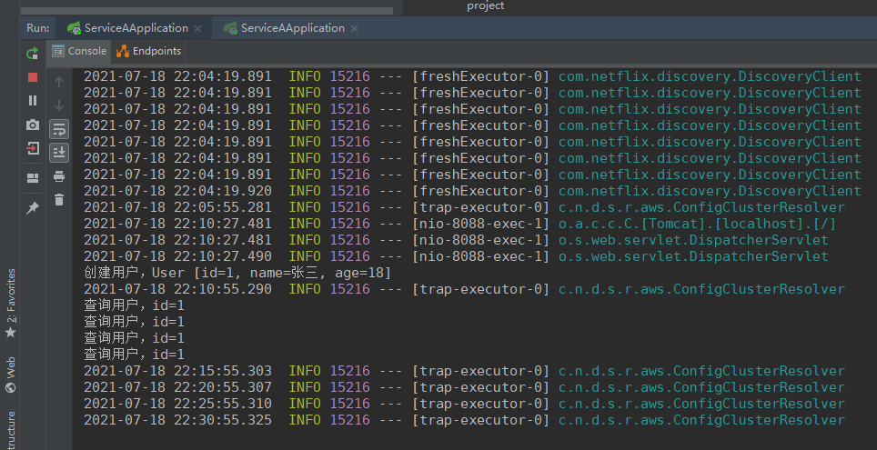

# 1 feign快速开始及样例

## 1.1 基于feign进行crud代码样例

1 首先基于单节点的eureka server,具体样例见eureka笔记

2 改造eureka ribbon结合的serverA serverB项目

首先给serverA加入crud代码样例

```
@RestController
public class ServiceAController implements ServiceAInterface {

	public String sayHello(@PathVariable("id") Long id, 
			@RequestParam("name") String name, 
			@RequestParam("age") Integer age) {     
		System.out.println("打招呼，id=" + id + ", name=" + name + ", age=" + age);   
		return "{'msg': 'hello, " + name + "'}";  
	}
	
	public String createUser(@RequestBody User user) {
		System.out.println("创建用户，" + user);  
		return "{'msg': 'success'}";
	}

	public String updateUser(@PathVariable("id") Long id, @RequestBody User user) {
		System.out.println("更新用户，" + user);  
		return "{'msg': 'success'}";
	}

	public String deleteUser(@PathVariable("id") Long id) {
		System.out.println("删除用户，id=" + id);
		return "{'msg': 'success'}"; 
	}

	public User getById(@PathVariable("id") Long id) {
		System.out.println("查询用户，id=" + id);
		return new User(1L, "张三", 20);
	}

}
```

再基于serverA的curd接口提供一个单独的service-a-api服务，加入私服/本地仓库


serverA相关依赖

```xml
	<dependencies>
		<dependency>
			<groupId>org.springframework.cloud</groupId>
		    <artifactId>spring-cloud-starter-config</artifactId>
		</dependency>
		<dependency>
		    <groupId>org.springframework.cloud</groupId>
		    <artifactId>spring-cloud-starter-eureka</artifactId>
		</dependency>
		<dependency>
			<groupId>com.zhss.demo</groupId>
			<artifactId>service-a-api</artifactId>
			<version>0.0.1-SNAPSHOT</version>
		</dependency>
	</dependencies>
```

server建立对应ServerClient接口继承service-a-api提供的api接口

```java
// 这个FeignClient里面的名字，就是你要调用的那个服务的名字
// 什么叫做声明式的方式，就是不用写代码，直接接口 +注解就搞定了，直接就可以访问别的服务
// 你用了feign之后，说实话，我提前给你剧透一下，spring cloud直接将feign和ribbon整合在一起了
// feign + ribbon + eureka都是整合在一起的
// feign发起请求的时候，都是会交给ribbon的LoadBalancer去进行负载均衡的
// 我们会感觉到，跟之前研究的ribbon整合eureka的负载均衡的原理还不是太一样，我们后面通过源码来看看
// feign + ribbon + eureka是如何整合在一起的

// 疑问来了，我希望的是说，ServiceB要调用ServiceA
// 我希望的是说，我连这个下面的一堆接口都不用自己定义，ServiceA直接提供给我这一票东东
// 这里其实是有重复性的劳动在里面的，其实每个接口的一堆定义和注解，都是由ServiceA搞定就可以了
// 不需要ServiceB重复的定义一遍

// 我只是说，我要访问ServiceA，但是人家ServiceA里面定义了哪些接口，哪些参数，都不用你管了
// 这里不用ServiceB把接口的定义重新写一遍了，直接用人家jar包里提供的就ok了
@FeignClient("ServiceA")
public interface ServiceAClient extends ServiceAInterface {
//下面的注释是不依赖 service-a-api包编写的额外代码
//没有service-a-api提供对应接口的话,serverB还需要针对serverA接口编写对应代码，比较麻烦
//通过service-a-api以jar包引入的方式，直接使用serverA的接口，是比较优雅的，正常企业级应用基本都是这样操作的

//	@RequestMapping(value = "/user/sayHello/{id}", method = RequestMethod.GET)
//	String sayHello(@PathVariable("id") Long id,
//			@RequestParam("name") String name,
//			@RequestParam("age") Integer age);
//
//	@RequestMapping(value = "/user/", method = RequestMethod.POST)
//	String createUser(@RequestBody User user);
//
//	@RequestMapping(value = "/user/{id}", method = RequestMethod.PUT)
//	String updateUser(@PathVariable("id") Long id, @RequestBody User user);
//
//	@RequestMapping(value = "/user/{id}", method = RequestMethod.DELETE)
//	String deleteUser(@PathVariable("id") Long id);
//
//	@RequestMapping(value = "/user/{id}", method = RequestMethod.GET)
//	User getById(@PathVariable("id") Long id);

}
```

以feign的方式在serverB对应controller调用serverA接口

```java
@RestController
@RequestMapping("/ServiceB/user")  
public class ServiceBController {

	/**
	 * 
	 * 这个东西，直接就是人家jar包里提供的接口和实现类都有了，不需要我们去关注他
	 * 我们就直接使用即可，直接引用一个IService，加上一个@autowired，就可以使用人家的服务了
	 * 
	 * 或者说，我们就在本地定义一个很薄很薄的接口，IServiceA -> 直接基于jar包里提供的一些东西简单配置一些注解就可以
	 * 
	 */
//	@Autowired
//	private IServiceA serviceA;
	
	@Autowired
	private ServiceAClient serviceA;
	
	@RequestMapping(value = "/sayHello/{id}", method = RequestMethod.GET)
	public String greeting(@PathVariable("id") Long id, 
			@RequestParam("name") String name, 
			@RequestParam("age") Integer age) {
//		return serviceA.sayHello(name);
		return serviceA.sayHello(id, name, age);
	}
	
	@RequestMapping(value = "/", method = RequestMethod.POST)
	public String createUser(@RequestBody User user) {
		return serviceA.createUser(user);
	}

	@RequestMapping(value = "/{id}", method = RequestMethod.PUT)
	public String updateUser(@PathVariable("id") Long id, @RequestBody User user) {
		return serviceA.updateUser(id, user); 
	}

	@RequestMapping(value = "/{id}", method = RequestMethod.DELETE)
	public String deleteUser(@PathVariable("id") Long id) {
		return serviceA.deleteUser(id);
	}

	@RequestMapping(value = "/{id}", method = RequestMethod.GET)
	public User getById(@PathVariable("id") Long id) {
		return serviceA.getById(id);
	}
	
}
```

serverB相关依赖

```xml
	<dependencies>
		<dependency>
			<groupId>org.springframework.cloud</groupId>
		    <artifactId>spring-cloud-starter-config</artifactId>
		</dependency>
		<dependency>
		    <groupId>org.springframework.cloud</groupId>
		    <artifactId>spring-cloud-starter-eureka</artifactId>
		</dependency>
		<dependency>
		    <groupId>org.springframework.cloud</groupId>
		    <artifactId>spring-cloud-starter-ribbon</artifactId>
		</dependency>
		<dependency>
			<groupId>org.springframework.cloud</groupId>
			<artifactId>spring-cloud-starter-feign</artifactId>
		</dependency>
		<dependency>
			<groupId>com.zhss.demo</groupId>
			<artifactId>service-a-api</artifactId>
			<version>0.0.1-SNAPSHOT</version>
		</dependency>
	</dependencies>
```

**总结：**微服务架构的话，谁提供什么接口，定义一个单独的xx-service-api的工程，部署到私服，人家依赖你的jar包，基于你提供的接口来开发，就可以了，直接调用你的服务的接口

feign默认就是集成了ribbon实现了负载均衡的

feign负载均衡调用：




**通过serverB多次调用serverA接口发现，不同请求的调用不是按照ribbon默认的轮询方式负载均衡的，同一接口调用才是安装ribbon默认轮询方式负载均衡的**

## 1.2 feign核心组件概述及spring cloud使用feign自定义bean

### 1.2.1  feign核心组件概述

feign就跟ribbon一样，内部都包含了很多的核心组件

ribbon，三剑客，ILoadBalancer、IRule、IPing，这几个东东是最重要的，ServerList，也属于他的核心组件，也是有Builder的

feign，也是一样的，也有很多核心的组件：

（1）**编码器和解码器：Encoder和Decoder**，如果调用接口的时候，传递的参数是个对象，feign需要将这个对象进行encode，编码，搞成json序列化，就是把一个对象转成json的格式，Encoder干的事儿；Decoder，解码器，就是说你收到了一个json以后，如何来处理这个东西呢？如何将一个json转换成本地的一个对象

（2）**Logger**：**打印日志的**，feign是负责接口调用，发送http请求，所以feign是可以打印这个接口调用请求的日志的

（3）**Contract**：比如一般来说feign的@FeignClient注解和spring web mvc支持的@PathVariable、@RequestMapping、@RequestParam等注解结合起来使用了。feign本来是没法支持spring web mvc的注解的，但是有一个**Contract组件之后，契约组件**，这个组件负责解释别人家的注解，让feign可以跟别人家的注解结合起来使用

（4）**Feign.Builder：FeignClient的一个实例构造器**，各种设计模式的使用，构造器，演示过，就是复杂对象的构造，非常适合，用了构造器模式之后，代码是很优雅的。

（5）**FeignClient：就是我们使用feign最最核心的入口**，就是要构造一个FeignClient，里面包含了一系列的组件，比如说Encoder、Decoder、Logger、Contract，等等吧

### 1.2.2  sprin cloud对feign的默认组件

Decoder：ResponseEntityDecoder

Encoder：SpringEncoder

Logger：Slf4jLogger

Contract（这个是用来翻译第三方注解的，比如说对feign使用spring mvc的注解）：SpringMvcContract

Feign实例构造器：HystrixFeign.Builder => Hystrix其实也是跟Feign整合在一起使用的，spring cloud几个核心的组件，eureka、ribbon、feign、hystrix、zuul，其实eureka是独立部署server的，但是feign + hystrix + ribbon + eureka client整合在一起使用的。我之前已经给大家说过ribbon和eureka是如何整合的

Feign客户端：LoadBalancerFeignClient => 负载均衡，通过LoadBalancerFeignClient，底层是跟ribbon整合起来使用的

### 1.2.3 自定义bean

自定义拦截器组件

```java
public class MyRequestInterceptor implements RequestInterceptor {

    @Override
    public void apply(RequestTemplate requestTemplate) {
        //在这里实现feign请求的拦截即可
        //在这里可以设置对请求的一些额外的信息
        //可以设置请求头，token,cookie等信息
        System.out.println("拦截请求测试111111111111111111111");
    }
}
```

自定义feign的配置

```java
//这里已经通过FeignClient注解去引用了，所以不用而外再去加@Configuration注解，去标明配置类
//正常来说@Bean注解实例化bean，需要和@Configuration配合
public class MyConfiguration {

	@Bean
	public RequestInterceptor requestInterceptor() {
	return new MyRequestInterceptor();
	}

}
```

引入feign自定义组件的配置

```java
@FeignClient(name = “ServiceA”, configuration = MyConfiguration.class)
public interface ServiceAClient {

}


```

feign的拦截器的使用，就是说我们可以实现对feign的请求进行拦截的拦截器，实现一个接口即可，RequestInterceptor，然后所有的请求发送之前都会被我们给拦截，你看这里不就是拦截器模式，interceptor模式

以自定义feign拦截器为样例，其他feign的组件也可以以此方式来自定义

## 1.3 spring cloud环境下feign相关配置参数

### 1.3.1 前言

​	在做这个微服务架构的系统的时候，不用上来就胡乱配置太多的东西，很多时候，默认配置就ok，不要说你觉得自己很牛，胡乱调整配置，很可能就调错了。除了极其少数的关键的几个配置，要配置以外；然后在测试的环节，看看有没有什么问题，如果有可以调整配置；在压力测试的环节，可以看看有没有什么问题，如果有可以调整配置；如果在线上发生了生产环境的问题，那么可以调整配置

### 1.3.2 相关配置

```yaml
feign:
  client:
    config:
    #单独给对应服务配置
      ServiceA:
        connectTimeout: 5000
        readTimeout: 5000
        loggerLevel: full
        #是否启用异常时返回404
        decode404: false

feign:
  client:
    config:
    #给所有服务默认配置
      default:
        connectTimeout: 5000
        readTimeout: 5000
        loggerLevel: full
```

启用feign的压缩

```properties
feign.compression.request.enabled: true
feign.compression.request.mime-types: text/xml,application/xml,application/json
feign.compression.request.min-request-size: 2048
feign.compression.response.enabled: true
```

日志相关

1 正常生产环境不需要开启feign日志打印，请求多的话，占用太多空间了，无用日志

2 在开发/测试环境可以开启日志打印

3 生产环境如果需要日志的话，关于log的打印，最好是用统一的日志组件,可以将log打印到日志中心里去，基于ELK、Kafka那套技术栈来做的日志中心

在测试环境添加日志打印

1 首先添加对应配置类

```java
//logger level：　NONE，无记录（DEFAULT）。BASIC，只记录请求方法和URL以及响应状态代码和执行时间。HEADERS，记录基本信息以及请求和响应标头。FULL，记录请求和响应的头文件，正文和元数据。

@Configuration
public class MyConfiguration {
    @Bean
    Logger.Level feignLoggerLevel() {
        return Logger.Level.FULL;
    }
}
```

2 然后配置对应接口日志打印

```yaml
server:
  port: 9090
spring:
  application:
    name: ServiceB
eureka:
  instance:
    hostname: localhost
  client:
    serviceUrl:
      defaultZone: http://localhost:8761/eureka
      
#这里就是配置了ServiceAClient打印所有日志
logging.level.com.zhss.service.ServiceAClient: DEBUG
```

发送请求就能打印请求所有的日志信息


# 2 feign流程图

​	你就定义了一个ServiceAClient的接口，凭啥说，你就@Autowried注入一个ServiceAClient接口的实例，就可以去调用接口的方法，然后直接http请求就发出去了？ 一定是feign在运行的时候，针对我们打了@FeignClient的注解的接口，在运行的时候动态生成了一个动态代理

​	接口是没有实现的，是不能调用的

​	feign一定是整合了ribbon的，因为必须基于ribbon来进行负载均衡，因为每个服务都是部署多台机器的，必须有负载均衡的机制，所以feign肯定不会自己去干负载均衡的事情，ribbon都干的很好了

​	feign + ribbon + eureka，ServiceA服务名称 => server list，必须结合eureka来，从eureka获取到对应的服务的server list


# 3 feign源码

## 3.1 从@EnableFeignClients入手来找一找扫描@FeignClient的入口在哪儿

### 3.1.1 前言

​	就得进入一下feign的源码的剖析，尤其是要剖析spring cloud环境下的feign的源码和工作机制，那么我们考虑一下，研究spring cloud环境下的feign的源码，入口在哪儿啊 ？能够让我们研究的入口就俩：

​	第一个入口：Application启动类的**@EnableFeignClients**注解

​	第二个入口：我们自定义的接口的，比如说ServiceAClient接口，上面打的这个**@FeignClient**注解

​	1 这块，先不看注解的源码，大胆的假设：我觉得我们用@FeignClient标注了自定义的接口，作用就是给feign的一个核心机制来扫描的，**feign核心机制一定会去扫描所有打了@FeignClient注解的接口**

​	2 feign核心机制，扫描到那些打了**@FeignClient注解的接口之后，就会针对这些接口，生成自己的feign动态代理**，以及解析和处理接口上打的那些spring web mvc的注解，比如@RequestMapping，@PathVarialbe，@RequestParam，**基于spring web mvc的注解，来生成接口对应的http请求**

一个问题来了，谁来扫描@FeignClient注解的接口呢？？？

​	3 大胆的猜想一下**：Application启动类的@EnableFeignClients注解**，这个注解一定会作为一个全局的东东，一旦你**加了这个注解之后，就会触发对应的Feign的核心机制**，那个被触发的feign核心机制，就会去扫描所有包下面的@FeignClient注解的接口

我们来看看这俩注解的源码

### 3.1.2 对应源码

​	通过@FeignClient的注解，都可以看得出来，人家都说的很明确了，你用这个**注解标注一个接口，就是让feign对这个接口创建一个对应的动态代理出来**，这个**动态代理就是所谓的REST client，发送rest请求的客户端**

```java

/**
 * Annotation for interfaces declaring that a REST client with that interface should be
 * created (e.g. for autowiring into another component). If ribbon is available it will be
 * used to load balance the backend requests, and the load balancer can be configured
 * using a <code>@RibbonClient</code> with the same name (i.e. value) as the feign client.
 *
 * @author Spencer Gibb
 * @author Venil Noronha
 */
//@FeignClient注解的解释:
//你用这个@FeignClient注解标注了一个接口，这个接口会被创建为一个REST client（发送restful请求的客户端），然后可以将这个REST client注入其他的组件（比如说ServiceBController）
@Target(ElementType.TYPE)
@Retention(RetentionPolicy.RUNTIME)
@Documented
public @interface FeignClient {

	/**
	 * The name of the service with optional protocol prefix. Synonym for {@link #name()
	 * name}. A name must be specified for all clients, whether or not a url is provided.
	 * Can be specified as property key, eg: ${propertyKey}.
	 */
    //value和name表达的意思是一样的,都是指代的你要调用的那个服务名称
	@AliasFor("name")
	String value() default "";

	/**
	 * The service id with optional protocol prefix. Synonym for {@link #value() value}.
	 *
	 * @deprecated use {@link #name() name} instead
	 */
	@Deprecated
	String serviceId() default "";

	/**
	 * The service id with optional protocol prefix. Synonym for {@link #value() value}.
	 */
	@AliasFor("value")
	String name() default "";
	
	/**
	 * Sets the <code>@Qualifier</code> value for the feign client.
	 */
	String qualifier() default "";

	/**
	 * An absolute URL or resolvable hostname (the protocol is optional).
	 */
    //url，一看就是说，如果你不用ribbon的话，那么就没法做负载均衡了，你可以就用url地址指定你要请求的地址
	String url() default "";

	/**
	 * Whether 404s should be decoded instead of throwing FeignExceptions
	 */
    //decode404的意思，就是说用404替代抛出FeignException异常，替代为404异常
	boolean decode404() default false;

	/**
	 * A custom <code>@Configuration</code> for the feign client. Can contain override
	 * <code>@Bean</code> definition for the pieces that make up the client, for instance
	 * {@link feign.codec.Decoder}, {@link feign.codec.Encoder}, {@link feign.Contract}.
	 *
	 * @see FeignClientsConfiguration for the defaults
	 */
    //configurtation指定一个配置类，可以在里面自定义自己的Encoder、Decoder、Contract。。。
	Class<?>[] configuration() default {};

	/**
	 * Fallback class for the specified Feign client interface. The fallback class must
	 * implement the interface annotated by this annotation and be a valid spring bean.
	 */
	Class<?> fallback() default void.class;

	/**
	 * Define a fallback factory for the specified Feign client interface. The fallback
	 * factory must produce instances of fallback classes that implement the interface
	 * annotated by {@link FeignClient}. The fallback factory must be a valid spring
	 * bean.
	 *
	 * @see feign.hystrix.FallbackFactory for details.
	 */
	Class<?> fallbackFactory() default void.class;

	/**
	 * Path prefix to be used by all method-level mappings. Can be used with or without
	 * <code>@RibbonClient</code>.
	 */
	String path() default "";

	/**
	 * Whether to mark the feign proxy as a primary bean. Defaults to true.
	 */
	boolean primary() default true;

}

```

@EnableFeignClients，极为关键，扫描那些标注了@FeignClient注解的接口，这里有一些参数，就是指定你要扫描哪些包下面的@FeignClient注解的接口

1 有一个极为重要的东西：@Import(FeignClientsRegistrar.class)

2 这个@Import其实就是负责扫描@FeignClient注解的极为关键的一个入口，导入了一个FeignClientRegistrar类

```java
@Retention(RetentionPolicy.RUNTIME)
@Target(ElementType.TYPE)
@Documented
@Import(FeignClientsRegistrar.class)
public @interface EnableFeignClients {

	String[] value() default {};


	String[] basePackages() default {};


	Class<?>[] basePackageClasses() default {};

	Class<?>[] defaultConfiguration() default {};


	Class<?>[] clients() default {};
}
```

3 我们猜测一下，FeignClientRegistrar是什么东西？负责FeignClient注册的一个组件

4 我们猜想的就是：这个FeignClientRegistrar组件，负责扫描所有包下面的@FeignClient注解的接口，然后触发后面所有的处理流程

5 FeignClientRegistrar实现了一堆接口，XXXAware，不用问，一定是实现了这个接口，持有了对应的引用，然后让spring给他注入一堆东西，XXX

```java
class FeignClientsRegistrar implements ImportBeanDefinitionRegistrar,
		ResourceLoaderAware, BeanClassLoaderAware, EnvironmentAware {
	private ResourceLoader resourceLoader;

	private ClassLoader classLoader;

	private Environment environment;

	public FeignClientsRegistrar() {
	}

	@Override
	public void setResourceLoader(ResourceLoader resourceLoader) {
		this.resourceLoader = resourceLoader;
	}

	@Override
	public void setBeanClassLoader(ClassLoader classLoader) {
		this.classLoader = classLoader;
	}

//这个方法就是最最核心的，扫描各个包下面的@FeignClient注解，然后生成@FeignClient的动态代理，注册这些@FeignClient
	@Override
	public void registerBeanDefinitions(AnnotationMetadata metadata,
			BeanDefinitionRegistry registry) {
		registerDefaultConfiguration(metadata, registry);
		registerFeignClients(metadata, registry);
	}
.......................
}
```

​	1 **registerBeanDefinitions是feign的核心的入口方法**，这个方法是什么时候会调用呢？分析一下**I他的实现接口，mportBeanDefinitionRegistrar**，这个接口，发现说是spring-context项目里带的

​	2 肯定是在spring boot启动的时候，**spring容器初始化的时候，一定会在某个时间点，会对实现这个接口的类的registerBeanDefinitions()方法会来调用**，让你来实例化一些bean，注册到spring容器里去

​	3 所以我们的**spring boot启动的时候，FeignClientRegistrar.registerBeanDefinitions()方法，将会作为扫描@FeignClient注解的入口**，也就是我们研究spring cloud环境下的feign的源码的一个关键的入口

## 3.2 feign入口源码初探

（1）Application启动类的全限定类名：default.com.zhss.service.ServiceBApplication

（2）解析了一下@EnableFeignClients注解的attrs属性值，defaultConfiguration

（3）基于上面两块东西，在一个叫做BeanDefinicitonRegistry（spring-beans项目）的东西里

```java
class FeignClientsRegistrar implements ImportBeanDefinitionRegistrar,
		ResourceLoaderAware, BeanClassLoaderAware, EnvironmentAware {
	private ResourceLoader resourceLoader;


//这个方法就是最最核心的，扫描各个包下面的@FeignClient注解，然后生成@FeignClient的动态代理，注册这些@FeignClient
	@Override
	public void registerBeanDefinitions(AnnotationMetadata metadata,
			BeanDefinitionRegistry registry) {
        //获取EnableFeignClients注解相关信息，并根据信息构造FeignClientSpecification类
		registerDefaultConfiguration(metadata, registry);
        //这个方法的话，在这个方法里会对所有的包进行扫描，专门扫描包含了@FeignClient注解的接口
		registerFeignClients(metadata, registry);
	}
    
    //AnnotationMetadata元数据就是类信息及相关属性值信息
	private void registerDefaultConfiguration(AnnotationMetadata metadata,
			BeanDefinitionRegistry registry) {
        //获取EnableFeignClients注解对应属性值
		Map<String, Object> defaultAttrs = metadata
				.getAnnotationAttributes(EnableFeignClients.class.getName(), true);

		if (defaultAttrs != null && defaultAttrs.containsKey("defaultConfiguration")) {
			String name;
			if (metadata.hasEnclosingClass()) {
				name = "default." + metadata.getEnclosingClassName();
			}
			else {
                //获取Aplication启动类的全限定名：default.com.zhss.service.ServiceBApplication
				name = "default." + metadata.getClassName();
			}
            //将全限定名及默认配置作为构造FeignClientSpecification的bean的入参
			registerClientConfiguration(registry, name,
					defaultAttrs.get("defaultConfiguration"));
		}
	}
	//将全限定名及默认配置作为构造FeignClientSpecification的bean的入参
	private void registerClientConfiguration(BeanDefinitionRegistry registry, Object name,
			Object configuration) {
        //BeanDefinitionRetistry（bean实例的注册器）
		BeanDefinitionBuilder builder = BeanDefinitionBuilder
				.genericBeanDefinition(FeignClientSpecification.class);
        //全限定名
		builder.addConstructorArgValue(name);
        //注解对应defaultConfiguration配置，没配置就是空的
		builder.addConstructorArgValue(configuration);
        //将全限定名及默认配置作为构造FeignClientSpecification的bean的入参
		registry.registerBeanDefinition(
				name + "." + FeignClientSpecification.class.getSimpleName(),
				builder.getBeanDefinition());
        //BeanDefinitionBuilder及BeanDefinitionRegistry registry相关属于spring-beans工程相关，目前不深究
	}
.......................
}


```

## 3.3 终于找到了feign核心机制的入口：来看看如何扫描包下面的@FeignClient注解

（1）registerFeignClients()方法，这个方法的话，在这个方法里会对所有的包进行扫描，专门扫描包含了@FeignClient注解的接口

（2）registerFeignClient()方法，最终应该是基于这个方法完成了扫描出来的@FeignClient相关接口的注册

```java
class FeignClientsRegistrar implements ImportBeanDefinitionRegistrar,
		ResourceLoaderAware, BeanClassLoaderAware, EnvironmentAware {
	private ResourceLoader resourceLoader;


//这个方法就是最最核心的，扫描各个包下面的@FeignClient注解，然后生成@FeignClient的动态代理，注册这些@FeignClient
	@Override
	public void registerBeanDefinitions(AnnotationMetadata metadata,
			BeanDefinitionRegistry registry) {
        //获取EnableFeignClients注解相关信息，并根据信息构造FeignClientSpecification类
		registerDefaultConfiguration(metadata, registry);
        //这个方法的话，在这个方法里会对所有的包进行扫描，专门扫描包含了@FeignClient注解的接口
		registerFeignClients(metadata, registry);
	}
	
	//这个方法的话，在这个方法里会对所有的包进行扫描，专门扫描包含了@FeignClient注解的接口
	public void registerFeignClients(AnnotationMetadata metadata,
			BeanDefinitionRegistry registry) {
         //在classpath中扫描候选的组件的provider类
		//这个类就是复杂在指定的路径中，扫描你指定的条件的相关的bean，类，接口
        //getScanner很关键，通过匿名内部类的方式构造对象实例，然后重载了ClassPathScanningCandidateComponentProvider类中的ClassPathScanningCandidateComponentProvider方法
		ClassPathScanningCandidateComponentProvider scanner = getScanner();
		scanner.setResourceLoader(this.resourceLoader);

		Set<String> basePackages;

		Map<String, Object> attrs = metadata
				.getAnnotationAttributes(EnableFeignClients.class.getName());
        //这行代码非常关键
        //就是一个根据注解的类型进行过滤的过滤器，传入进去的是@FeignClient注解的类型
        //一看就是什么呢？用于过滤出来@FeignClient注解类型的过滤器
		AnnotationTypeFilter annotationTypeFilter = new AnnotationTypeFilter(
				FeignClient.class);
		final Class<?>[] clients = attrs == null ? null
				: (Class<?>[]) attrs.get("clients");
        //clients，在正常情况下，都是空的，为啥？因为我们一般不会在@EnableFeignClients注解中来配置clients属性，所以可以默认一般都是空的
        //所以会进这个if判断
		if (clients == null || clients.length == 0) {
            //就会给组件扫描器添加一个注解过滤器，@FeignClient注解的注解过滤器，就会加入组件扫描器中
			scanner.addIncludeFilter(annotationTypeFilter);
            //这行代码也很关键
            //先是去获取了@EnableFeignClients里面的属性，因为这个属性里是可以配置basePackages，就是可以自己指定要扫描的包路径的
            //如果你的@EnableFefignClients中没有配置要扫描的包路径，那么默认就是你的Application启动类所在的包，
            //此时就会发现我们要扫描的包路径，就是com.zhss.service包
			basePackages = getBasePackages(metadata);
		}
		else {
			final Set<String> clientClasses = new HashSet<>();
			basePackages = new HashSet<>();
			for (Class<?> clazz : clients) {
				basePackages.add(ClassUtils.getPackageName(clazz));
				clientClasses.add(clazz.getCanonicalName());
			}
			AbstractClassTestingTypeFilter filter = new AbstractClassTestingTypeFilter() {
				@Override
				protected boolean match(ClassMetadata metadata) {
					String cleaned = metadata.getClassName().replaceAll("\\$", ".");
					return clientClasses.contains(cleaned);
				}
			};
			scanner.addIncludeFilter(
					new AllTypeFilter(Arrays.asList(filter, annotationTypeFilter)));
		}

		for (String basePackage : basePackages) {
            //这行代码也很关键
            //使用了组件扫描器（搭载了@FeignClient注解过滤器），在com.zhss.service包中扫描，包含了@FeignClient注解的接口，扫描出来了一堆BeanDefinition
			Set<BeanDefinition> candidateComponents = scanner
					.findCandidateComponents(basePackage);
            //所谓的candicateComponent就是我们的标注了@FeignClient的接口，ServiceAClient接口
            //过滤出来的都是搭载了@FeignClient的接口
			for (BeanDefinition candidateComponent : candidateComponents) {
                //这个if判断就是说，你这个候选bean，必须是加了注解的bean（接口）
				if (candidateComponent instanceof AnnotatedBeanDefinition) {
					// verify annotated class is an interface
					AnnotatedBeanDefinition beanDefinition = (AnnotatedBeanDefinition) candidateComponent;
					AnnotationMetadata annotationMetadata = beanDefinition.getMetadata();
                    //@FeignClient注解必须标注在接口
                    //这个Assert意思就是搭载了这个注解的类，必须是个接口
					Assert.isTrue(annotationMetadata.isInterface(),
							"@FeignClient can only be specified on an interface");
					
                    //获取FeignClient注解的所有属性值
					Map<String, Object> attributes = annotationMetadata
							.getAnnotationAttributes(
									FeignClient.class.getCanonicalName());
					//这里是获取服务名称
					String name = getClientName(attributes);
                    //这块，就是说，拿到@FeignClient注解里，我们加入的属性，比如说我们，就加入了一个value，一个是configuration属性，最主要的就是获取我们的@FeignClient指定的要访问的那个服务的名称
                    //在BeanDefinitionRegistry中注册一下
					registerClientConfiguration(registry, name,
							attributes.get("configuration"));
					//最终是基于这个方法完成了扫描出来的@FeignClient相关接口的注册
					registerFeignClient(registry, annotationMetadata, attributes);
				}
			}
		}
	}
	//getScanner很关键，通过匿名内部类的方式构造对象实例，然后重写（覆盖）了ClassPathScanningCandidateComponentProvider类中的ClassPathScanningCandidateComponentProvider方法
	protected ClassPathScanningCandidateComponentProvider getScanner() {
		return new ClassPathScanningCandidateComponentProvider(false, this.environment) {

            //重写（覆盖）
			@Override
			protected boolean isCandidateComponent(
					AnnotatedBeanDefinition beanDefinition) {
				if (beanDefinition.getMetadata().isIndependent()) {
					// TODO until SPR-11711 will be resolved
					if (beanDefinition.getMetadata().isInterface()
							&& beanDefinition.getMetadata()
									.getInterfaceNames().length == 1
							&& Annotation.class.getName().equals(beanDefinition
									.getMetadata().getInterfaceNames()[0])) {
						try {
							Class<?> target = ClassUtils.forName(
									beanDefinition.getMetadata().getClassName(),
									FeignClientsRegistrar.this.classLoader);
							return !target.isAnnotation();
						}
						catch (Exception ex) {
							this.logger.error(
									"Could not load target class: "
											+ beanDefinition.getMetadata().getClassName(),
									ex);

						}
					}
					return true;
				}
				return false;

			}
		};
	}
            
.......................
}
```

扩展： 匿名内部类
一个没有名字的类，是内部类的简化写法
**本质：其实是继承该类或者实现接口的子类匿名对象**

​	组件扫描器，scanner，我们之前给设置了一个@FeignClient注解的过滤器，这样的话呢，scanner会将com.zhss.service包下面的@FeignClient标注的接口扫描出来，然后交给isCandidateComponent()方法来处理，过滤出来符合条件的集合

```java
public class ClassPathScanningCandidateComponentProvider implements EnvironmentCapable, ResourceLoaderAware {
    
	public Set<BeanDefinition> findCandidateComponents(String basePackage) {
		Set<BeanDefinition> candidates = new LinkedHashSet<BeanDefinition>();
		try {
			String packageSearchPath = ResourcePatternResolver.CLASSPATH_ALL_URL_PREFIX +
					resolveBasePackage(basePackage) + '/' + this.resourcePattern;
			Resource[] resources = this.resourcePatternResolver.getResources(packageSearchPath);
			boolean traceEnabled = logger.isTraceEnabled();
			boolean debugEnabled = logger.isDebugEnabled();
			for (Resource resource : resources) {
				if (traceEnabled) {
					logger.trace("Scanning " + resource);
				}
				if (resource.isReadable()) {
					try {
						MetadataReader metadataReader = this.metadataReaderFactory.getMetadataReader(resource);
                          //极为关键，就是这个isCandidateComponent方法来判断对应类是否符合类过滤器(搭载了@FeignClient注解过滤器)
                          //符合搭载了@FeignClient的类就返回true
						if (isCandidateComponent(metadataReader)) {
							ScannedGenericBeanDefinition sbd = new ScannedGenericBeanDefinition(metadataReader);
							sbd.setResource(resource);
							sbd.setSource(resource);
                              //注意，注意 这个也很关键，isCandidateComponent方法在这个类是重载的，根据传递类型不同
                              //和上面那个同名方法是重载的啷个方法
                              //然后这个方法又在之前被匿名内部类重写了，所以这里真正调用的是匿名内部类重写的方法
                              //重写的方法主要逻辑就是判断一下类型之类的，正常情况都会返回true,主要是上面一个isCandidateComponent去过滤类
							if (isCandidateComponent(sbd)) {
								if (debugEnabled) {
									logger.debug("Identified candidate component class: " + resource);
								}
                                  //将符合过滤条件的类添加到返回的set集合
								candidates.add(sbd);
							}
							else {
								if (debugEnabled) {
									logger.debug("Ignored because not a concrete top-level class: " + resource);
								}
							}
						}
						else {
							if (traceEnabled) {
								logger.trace("Ignored because not matching any filter: " + resource);
							}
						}
					}
					catch (Throwable ex) {
						throw new BeanDefinitionStoreException(
								"Failed to read candidate component class: " + resource, ex);
					}
				}
				else {
					if (traceEnabled) {
						logger.trace("Ignored because not readable: " + resource);
					}
				}
			}
		}
		catch (IOException ex) {
			throw new BeanDefinitionStoreException("I/O failure during classpath scanning", ex);
		}
		return candidates;
	}
    
    
	//极为关键，就是这个isCandidateComponent方法来判断对应类是否符合类过滤器(搭载了@FeignClient注解过滤器)
    //符合搭载了@FeignClient的类就返回true
	protected boolean isCandidateComponent(MetadataReader metadataReader) throws IOException {
		for (TypeFilter tf : this.excludeFilters) {
			if (tf.match(metadataReader, this.metadataReaderFactory)) {
				return false;
			}
		}
		for (TypeFilter tf : this.includeFilters) {
            //主要是这个判断，判断传进来的类是否符合类过滤器
            //这里是搭载了@FeignClient接口类就返回true
			if (tf.match(metadataReader, this.metadataReaderFactory)) {
                 //符合搭载了@FeignClient的类就返回true
				return isConditionMatch(metadataReader);
			}
		}
		return false;
	}
}
```

流程图：

https://www.processon.com/view/link/60f6ef57f346fb761bba348d


