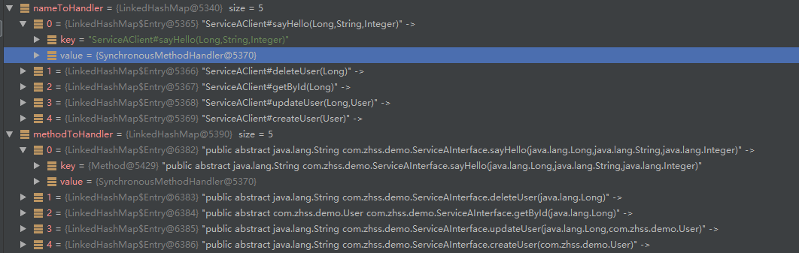
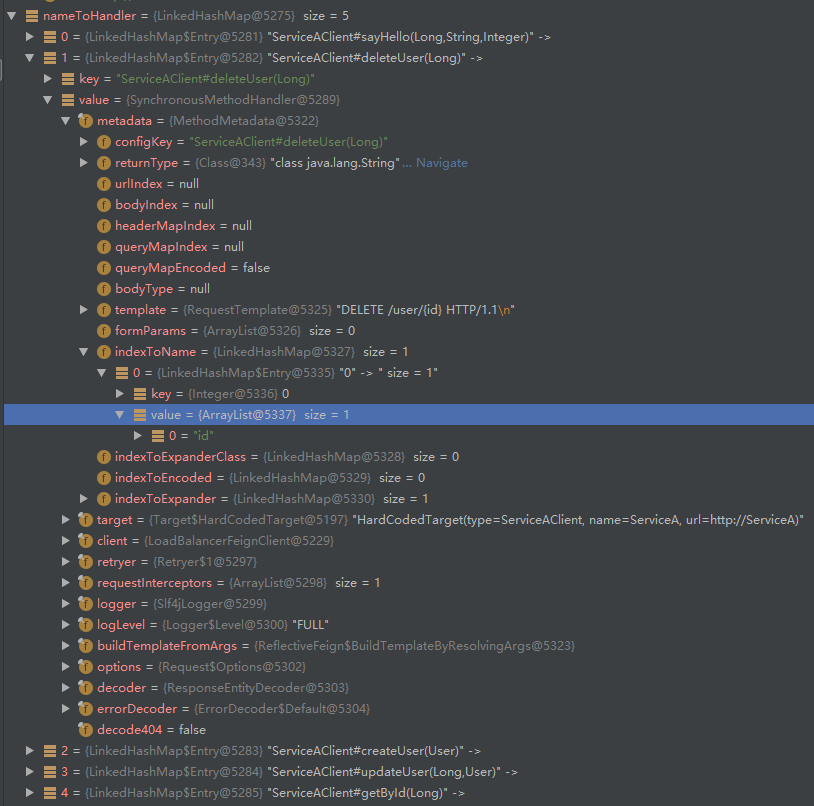

# 1 feign快速开始及样例

## 1.1 基于feign进行crud代码样例

1 首先基于单节点的eureka server,具体样例见eureka笔记

2 改造eureka ribbon结合的serverA serverB项目

首先给serverA加入crud代码样例

```java
@RestController
public class ServiceAController implements ServiceAInterface {

	public String sayHello(@PathVariable("id") Long id, 
			@RequestParam("name") String name, 
			@RequestParam("age") Integer age) {     
		System.out.println("打招呼，id=" + id + ", name=" + name + ", age=" + age);   
		return "{'msg': 'hello, " + name + "'}";  
	}
	
	public String createUser(@RequestBody User user) {
		System.out.println("创建用户，" + user);  
		return "{'msg': 'success'}";
	}

	public String updateUser(@PathVariable("id") Long id, @RequestBody User user) {
		System.out.println("更新用户，" + user);  
		return "{'msg': 'success'}";
	}

	public String deleteUser(@PathVariable("id") Long id) {
		System.out.println("删除用户，id=" + id);
		return "{'msg': 'success'}"; 
	}

	public User getById(@PathVariable("id") Long id) {
		System.out.println("查询用户，id=" + id);
		return new User(1L, "张三", 20);
	}

}
```

再基于serverA的curd接口提供一个单独的service-a-api服务，加入私服/本地仓库


serverA相关依赖

```xml
	<dependencies>
		<dependency>
			<groupId>org.springframework.cloud</groupId>
		    <artifactId>spring-cloud-starter-config</artifactId>
		</dependency>
		<dependency>
		    <groupId>org.springframework.cloud</groupId>
		    <artifactId>spring-cloud-starter-eureka</artifactId>
		</dependency>
		<dependency>
			<groupId>com.zhss.demo</groupId>
			<artifactId>service-a-api</artifactId>
			<version>0.0.1-SNAPSHOT</version>
		</dependency>
	</dependencies>
```

server建立对应ServerClient接口继承service-a-api提供的api接口

```java
// 这个FeignClient里面的名字，就是你要调用的那个服务的名字
// 什么叫做声明式的方式，就是不用写代码，直接接口 +注解就搞定了，直接就可以访问别的服务
// 你用了feign之后，说实话，我提前给你剧透一下，spring cloud直接将feign和ribbon整合在一起了
// feign + ribbon + eureka都是整合在一起的
// feign发起请求的时候，都是会交给ribbon的LoadBalancer去进行负载均衡的
// 我们会感觉到，跟之前研究的ribbon整合eureka的负载均衡的原理还不是太一样，我们后面通过源码来看看
// feign + ribbon + eureka是如何整合在一起的

// 疑问来了，我希望的是说，ServiceB要调用ServiceA
// 我希望的是说，我连这个下面的一堆接口都不用自己定义，ServiceA直接提供给我这一票东东
// 这里其实是有重复性的劳动在里面的，其实每个接口的一堆定义和注解，都是由ServiceA搞定就可以了
// 不需要ServiceB重复的定义一遍

// 我只是说，我要访问ServiceA，但是人家ServiceA里面定义了哪些接口，哪些参数，都不用你管了
// 这里不用ServiceB把接口的定义重新写一遍了，直接用人家jar包里提供的就ok了
@FeignClient("ServiceA")
public interface ServiceAClient extends ServiceAInterface {
//下面的注释是不依赖 service-a-api包编写的额外代码
//没有service-a-api提供对应接口的话,serverB还需要针对serverA接口编写对应代码，比较麻烦
//通过service-a-api以jar包引入的方式，直接使用serverA的接口，是比较优雅的，正常企业级应用基本都是这样操作的

//	@RequestMapping(value = "/user/sayHello/{id}", method = RequestMethod.GET)
//	String sayHello(@PathVariable("id") Long id,
//			@RequestParam("name") String name,
//			@RequestParam("age") Integer age);
//
//	@RequestMapping(value = "/user/", method = RequestMethod.POST)
//	String createUser(@RequestBody User user);
//
//	@RequestMapping(value = "/user/{id}", method = RequestMethod.PUT)
//	String updateUser(@PathVariable("id") Long id, @RequestBody User user);
//
//	@RequestMapping(value = "/user/{id}", method = RequestMethod.DELETE)
//	String deleteUser(@PathVariable("id") Long id);
//
//	@RequestMapping(value = "/user/{id}", method = RequestMethod.GET)
//	User getById(@PathVariable("id") Long id);

}
```

以feign的方式在serverB对应controller调用serverA接口

```java
@RestController
@RequestMapping("/ServiceB/user")  
public class ServiceBController {

	/**
	 * 
	 * 这个东西，直接就是人家jar包里提供的接口和实现类都有了，不需要我们去关注他
	 * 我们就直接使用即可，直接引用一个IService，加上一个@autowired，就可以使用人家的服务了
	 * 
	 * 或者说，我们就在本地定义一个很薄很薄的接口，IServiceA -> 直接基于jar包里提供的一些东西简单配置一些注解就可以
	 * 
	 */
//	@Autowired
//	private IServiceA serviceA;
	
	@Autowired
	private ServiceAClient serviceA;
	
	@RequestMapping(value = "/sayHello/{id}", method = RequestMethod.GET)
	public String greeting(@PathVariable("id") Long id, 
			@RequestParam("name") String name, 
			@RequestParam("age") Integer age) {
//		return serviceA.sayHello(name);
		return serviceA.sayHello(id, name, age);
	}
	
	@RequestMapping(value = "/", method = RequestMethod.POST)
	public String createUser(@RequestBody User user) {
		return serviceA.createUser(user);
	}

	@RequestMapping(value = "/{id}", method = RequestMethod.PUT)
	public String updateUser(@PathVariable("id") Long id, @RequestBody User user) {
		return serviceA.updateUser(id, user); 
	}

	@RequestMapping(value = "/{id}", method = RequestMethod.DELETE)
	public String deleteUser(@PathVariable("id") Long id) {
		return serviceA.deleteUser(id);
	}

	@RequestMapping(value = "/{id}", method = RequestMethod.GET)
	public User getById(@PathVariable("id") Long id) {
		return serviceA.getById(id);
	}
	
}
```

serverB相关依赖

```xml
	<dependencies>
		<dependency>
			<groupId>org.springframework.cloud</groupId>
		    <artifactId>spring-cloud-starter-config</artifactId>
		</dependency>
		<dependency>
		    <groupId>org.springframework.cloud</groupId>
		    <artifactId>spring-cloud-starter-eureka</artifactId>
		</dependency>
		<dependency>
		    <groupId>org.springframework.cloud</groupId>
		    <artifactId>spring-cloud-starter-ribbon</artifactId>
		</dependency>
		<dependency>
			<groupId>org.springframework.cloud</groupId>
			<artifactId>spring-cloud-starter-feign</artifactId>
		</dependency>
		<dependency>
			<groupId>com.zhss.demo</groupId>
			<artifactId>service-a-api</artifactId>
			<version>0.0.1-SNAPSHOT</version>
		</dependency>
	</dependencies>
```

**总结：**微服务架构的话，谁提供什么接口，定义一个单独的xx-service-api的工程，部署到私服，人家依赖你的jar包，基于你提供的接口来开发，就可以了，直接调用你的服务的接口

feign默认就是集成了ribbon实现了负载均衡的

feign负载均衡调用：


**通过serverB多次调用serverA接口发现，不同请求的调用不是按照ribbon默认的轮询方式负载均衡的，同一接口调用才是安装ribbon默认轮询方式负载均衡的**

## 1.2 feign核心组件概述及spring cloud使用feign自定义bean

### 1.2.1  feign核心组件概述

feign就跟ribbon一样，内部都包含了很多的核心组件

ribbon，三剑客，ILoadBalancer、IRule、IPing，这几个东东是最重要的，ServerList，也属于他的核心组件，也是有Builder的

feign，也是一样的，也有很多核心的组件：

（1）**编码器和解码器：Encoder和Decoder**，如果调用接口的时候，传递的参数是个对象，feign需要将这个对象进行encode，编码，搞成json序列化，就是把一个对象转成json的格式，Encoder干的事儿；Decoder，解码器，就是说你收到了一个json以后，如何来处理这个东西呢？如何将一个json转换成本地的一个对象

（2）**Logger**：**打印日志的**，feign是负责接口调用，发送http请求，所以feign是可以打印这个接口调用请求的日志的

（3）**Contract**：比如一般来说feign的@FeignClient注解和spring web mvc支持的@PathVariable、@RequestMapping、@RequestParam等注解结合起来使用了。feign本来是没法支持spring web mvc的注解的，但是有一个**Contract组件之后，契约组件**，这个组件负责解释别人家的注解，让feign可以跟别人家的注解结合起来使用

（4）**Feign.Builder：FeignClient的一个实例构造器**，各种设计模式的使用，构造器，演示过，就是复杂对象的构造，非常适合，用了构造器模式之后，代码是很优雅的。

（5）**FeignClient：就是我们使用feign最最核心的入口**，就是要构造一个FeignClient，里面包含了一系列的组件，比如说Encoder、Decoder、Logger、Contract，等等吧

### 1.2.2  sprin cloud对feign的默认组件

Decoder：ResponseEntityDecoder

Encoder：SpringEncoder

Logger：Slf4jLogger

Contract（这个是用来翻译第三方注解的，比如说对feign使用spring mvc的注解）：SpringMvcContract

Feign实例构造器：HystrixFeign.Builder => Hystrix其实也是跟Feign整合在一起使用的，spring cloud几个核心的组件，eureka、ribbon、feign、hystrix、zuul，其实eureka是独立部署server的，但是feign + hystrix + ribbon + eureka client整合在一起使用的。我之前已经给大家说过ribbon和eureka是如何整合的

Feign客户端：LoadBalancerFeignClient => 负载均衡，通过LoadBalancerFeignClient，底层是跟ribbon整合起来使用的

### 1.2.3 自定义bean

自定义拦截器组件

```java
public class MyRequestInterceptor implements RequestInterceptor {

    @Override
    public void apply(RequestTemplate requestTemplate) {
        //在这里实现feign请求的拦截即可
        //在这里可以设置对请求的一些额外的信息
        //可以设置请求头，token,cookie等信息
        System.out.println("拦截请求测试111111111111111111111");
    }
}
```

自定义feign的配置

```java
//这里已经通过FeignClient注解去引用了，所以不用而外再去加@Configuration注解，去标明配置类
//正常来说@Bean注解实例化bean，需要和@Configuration配合
public class MyConfiguration {

	@Bean
	public RequestInterceptor requestInterceptor() {
	return new MyRequestInterceptor();
	}

}
```

引入feign自定义组件的配置

```java
@FeignClient(name = “ServiceA”, configuration = MyConfiguration.class)
public interface ServiceAClient {

}


```

feign的拦截器的使用，就是说我们可以实现对feign的请求进行拦截的拦截器，实现一个接口即可，RequestInterceptor，然后所有的请求发送之前都会被我们给拦截，你看这里不就是拦截器模式，interceptor模式

以自定义feign拦截器为样例，其他feign的组件也可以以此方式来自定义

## 1.3 spring cloud环境下feign相关配置参数

### 1.3.1 前言

​	在做这个微服务架构的系统的时候，不用上来就胡乱配置太多的东西，很多时候，默认配置就ok，不要说你觉得自己很牛，胡乱调整配置，很可能就调错了。除了极其少数的关键的几个配置，要配置以外；然后在测试的环节，看看有没有什么问题，如果有可以调整配置；在压力测试的环节，可以看看有没有什么问题，如果有可以调整配置；如果在线上发生了生产环境的问题，那么可以调整配置

### 1.3.2 相关配置

```yaml
feign:
  client:
    config:
    #单独给对应服务配置
      ServiceA:
        connectTimeout: 5000
        readTimeout: 5000
        loggerLevel: full
        #是否启用异常时返回404
        decode404: false

feign:
  client:
    config:
    #给所有服务默认配置
      default:
        connectTimeout: 5000
        readTimeout: 5000
        loggerLevel: full
```

启用feign的压缩

```properties
feign.compression.request.enabled: true
feign.compression.request.mime-types: text/xml,application/xml,application/json
feign.compression.request.min-request-size: 2048
feign.compression.response.enabled: true
```

日志相关

1 正常生产环境不需要开启feign日志打印，请求多的话，占用太多空间了，无用日志

2 在开发/测试环境可以开启日志打印

3 生产环境如果需要日志的话，关于log的打印，最好是用统一的日志组件,可以将log打印到日志中心里去，基于ELK、Kafka那套技术栈来做的日志中心

在测试环境添加日志打印

1 首先添加对应配置类

```java
//logger level：　NONE，无记录（DEFAULT）。BASIC，只记录请求方法和URL以及响应状态代码和执行时间。HEADERS，记录基本信息以及请求和响应标头。FULL，记录请求和响应的头文件，正文和元数据。

@Configuration
public class MyConfiguration {
    @Bean
    Logger.Level feignLoggerLevel() {
        return Logger.Level.FULL;
    }
}
```

2 然后配置对应接口日志打印

```yaml
server:
  port: 9090
spring:
  application:
    name: ServiceB
eureka:
  instance:
    hostname: localhost
  client:
    serviceUrl:
      defaultZone: http://localhost:8761/eureka
      
#这里就是配置了ServiceAClient打印所有日志
logging.level.com.zhss.service.ServiceAClient: DEBUG
```

发送请求就能打印请求所有的日志信息


# 2 feign流程图

​	你就定义了一个ServiceAClient的接口，凭啥说，你就@Autowried注入一个ServiceAClient接口的实例，就可以去调用接口的方法，然后直接http请求就发出去了？ 一定是feign在运行的时候，针对我们打了@FeignClient的注解的接口，在运行的时候动态生成了一个动态代理

​	接口是没有实现的，是不能调用的

​	feign一定是整合了ribbon的，因为必须基于ribbon来进行负载均衡，因为每个服务都是部署多台机器的，必须有负载均衡的机制，所以feign肯定不会自己去干负载均衡的事情，ribbon都干的很好了

​	feign + ribbon + eureka，ServiceA服务名称 => server list，必须结合eureka来，从eureka获取到对应的服务的server list


流程图：https://www.processon.com/view/link/6129ee535653bb2d6d139ad1

思维导图：https://www.processon.com/view/link/612a2f6e079129550eebd430

# 3 spring cloud - feign入口源码探索

## 3.1 从@EnableFeignClients入手来找一找扫描@FeignClient的入口在哪儿

### 3.1.1 前言

​	就得进入一下feign的源码的剖析，尤其是要剖析spring cloud环境下的feign的源码和工作机制，那么我们考虑一下，研究spring cloud环境下的feign的源码，入口在哪儿啊 ？能够让我们研究的入口就俩：

​	第一个入口：Application启动类的**@EnableFeignClients**注解

​	第二个入口：我们自定义的接口的，比如说ServiceAClient接口，上面打的这个**@FeignClient**注解

​	1 这块，先不看注解的源码，大胆的假设：我觉得我们用@FeignClient标注了自定义的接口，作用就是给feign的一个核心机制来扫描的，**feign核心机制一定会去扫描所有打了@FeignClient注解的接口**

​	2 feign核心机制，扫描到那些打了**@FeignClient注解的接口之后，就会针对这些接口，生成自己的feign动态代理**，以及解析和处理接口上打的那些spring web mvc的注解，比如@RequestMapping，@PathVarialbe，@RequestParam，**基于spring web mvc的注解，来生成接口对应的http请求**

一个问题来了，谁来扫描@FeignClient注解的接口呢？？？

​	3 大胆的猜想一下**：Application启动类的@EnableFeignClients注解**，这个注解一定会作为一个全局的东东，一旦你**加了这个注解之后，就会触发对应的Feign的核心机制**，那个被触发的feign核心机制，就会去扫描所有包下面的@FeignClient注解的接口

我们来看看这俩注解的源码

### 3.1.2 对应源码

​	通过@FeignClient的注解，都可以看得出来，人家都说的很明确了，你用这个**注解标注一个接口，就是让feign对这个接口创建一个对应的动态代理出来**，这个**动态代理就是所谓的REST client，发送rest请求的客户端**

```java

/**
 * Annotation for interfaces declaring that a REST client with that interface should be
 * created (e.g. for autowiring into another component). If ribbon is available it will be
 * used to load balance the backend requests, and the load balancer can be configured
 * using a <code>@RibbonClient</code> with the same name (i.e. value) as the feign client.
 *
 * @author Spencer Gibb
 * @author Venil Noronha
 */
//@FeignClient注解的解释:
//你用这个@FeignClient注解标注了一个接口，这个接口会被创建为一个REST client（发送restful请求的客户端），然后可以将这个REST client注入其他的组件（比如说ServiceBController）
@Target(ElementType.TYPE)
@Retention(RetentionPolicy.RUNTIME)
@Documented
public @interface FeignClient {

	/**
	 * The name of the service with optional protocol prefix. Synonym for {@link #name()
	 * name}. A name must be specified for all clients, whether or not a url is provided.
	 * Can be specified as property key, eg: ${propertyKey}.
	 */
    //value和name表达的意思是一样的,都是指代的你要调用的那个服务名称
	@AliasFor("name")
	String value() default "";

	/**
	 * The service id with optional protocol prefix. Synonym for {@link #value() value}.
	 *
	 * @deprecated use {@link #name() name} instead
	 */
	@Deprecated
	String serviceId() default "";

	/**
	 * The service id with optional protocol prefix. Synonym for {@link #value() value}.
	 */
	@AliasFor("value")
	String name() default "";
	
	/**
	 * Sets the <code>@Qualifier</code> value for the feign client.
	 */
	String qualifier() default "";

	/**
	 * An absolute URL or resolvable hostname (the protocol is optional).
	 */
    //url，一看就是说，如果你不用ribbon的话，那么就没法做负载均衡了，你可以就用url地址指定你要请求的地址
	String url() default "";

	/**
	 * Whether 404s should be decoded instead of throwing FeignExceptions
	 */
    //decode404的意思，就是说用404替代抛出FeignException异常，替代为404异常
	boolean decode404() default false;

	/**
	 * A custom <code>@Configuration</code> for the feign client. Can contain override
	 * <code>@Bean</code> definition for the pieces that make up the client, for instance
	 * {@link feign.codec.Decoder}, {@link feign.codec.Encoder}, {@link feign.Contract}.
	 *
	 * @see FeignClientsConfiguration for the defaults
	 */
    //configurtation指定一个配置类，可以在里面自定义自己的Encoder、Decoder、Contract。。。
	Class<?>[] configuration() default {};

	/**
	 * Fallback class for the specified Feign client interface. The fallback class must
	 * implement the interface annotated by this annotation and be a valid spring bean.
	 */
	Class<?> fallback() default void.class;

	/**
	 * Define a fallback factory for the specified Feign client interface. The fallback
	 * factory must produce instances of fallback classes that implement the interface
	 * annotated by {@link FeignClient}. The fallback factory must be a valid spring
	 * bean.
	 *
	 * @see feign.hystrix.FallbackFactory for details.
	 */
	Class<?> fallbackFactory() default void.class;

	/**
	 * Path prefix to be used by all method-level mappings. Can be used with or without
	 * <code>@RibbonClient</code>.
	 */
	String path() default "";

	/**
	 * Whether to mark the feign proxy as a primary bean. Defaults to true.
	 */
	boolean primary() default true;

}

```

@EnableFeignClients，极为关键，扫描那些标注了@FeignClient注解的接口，这里有一些参数，就是指定你要扫描哪些包下面的@FeignClient注解的接口

1 有一个极为重要的东西：@Import(FeignClientsRegistrar.class)

2 这个@Import其实就是负责扫描@FeignClient注解的极为关键的一个入口，导入了一个FeignClientRegistrar类

```java
@Retention(RetentionPolicy.RUNTIME)
@Target(ElementType.TYPE)
@Documented
@Import(FeignClientsRegistrar.class)
public @interface EnableFeignClients {

	String[] value() default {};


	String[] basePackages() default {};


	Class<?>[] basePackageClasses() default {};

	Class<?>[] defaultConfiguration() default {};


	Class<?>[] clients() default {};
}
```

3 我们猜测一下，FeignClientRegistrar是什么东西？负责FeignClient注册的一个组件

4 我们猜想的就是：这个FeignClientRegistrar组件，负责扫描所有包下面的@FeignClient注解的接口，然后触发后面所有的处理流程

5 FeignClientRegistrar实现了一堆接口，XXXAware，不用问，一定是实现了这个接口，持有了对应的引用，然后让spring给他注入一堆东西，XXX

```java
class FeignClientsRegistrar implements ImportBeanDefinitionRegistrar,
		ResourceLoaderAware, BeanClassLoaderAware, EnvironmentAware {
	private ResourceLoader resourceLoader;

	private ClassLoader classLoader;

	private Environment environment;

	public FeignClientsRegistrar() {
	}

	@Override
	public void setResourceLoader(ResourceLoader resourceLoader) {
		this.resourceLoader = resourceLoader;
	}

	@Override
	public void setBeanClassLoader(ClassLoader classLoader) {
		this.classLoader = classLoader;
	}

//这个方法就是最最核心的，扫描各个包下面的@FeignClient注解，然后生成@FeignClient的动态代理，注册这些@FeignClient
	@Override
	public void registerBeanDefinitions(AnnotationMetadata metadata,
			BeanDefinitionRegistry registry) {
		registerDefaultConfiguration(metadata, registry);
		registerFeignClients(metadata, registry);
	}
.......................
}
```

​	1 **registerBeanDefinitions是feign的核心的入口方法**，这个方法是什么时候会调用呢？分析一下**I他的实现接口，mportBeanDefinitionRegistrar**，这个接口，发现说是spring-context项目里带的

​	2 肯定是在spring boot启动的时候，**spring容器初始化的时候，一定会在某个时间点，会对实现这个接口的类的registerBeanDefinitions()方法会来调用**，让你来实例化一些bean，注册到spring容器里去

​	3 所以我们的**spring boot启动的时候，FeignClientRegistrar.registerBeanDefinitions()方法，将会作为扫描@FeignClient注解的入口**，也就是我们研究spring cloud环境下的feign的源码的一个关键的入口

## 3.2 feign入口源码初探

（1）Application启动类的全限定类名：default.com.zhss.service.ServiceBApplication

（2）解析了一下@EnableFeignClients注解的attrs属性值，defaultConfiguration

（3）基于上面两块东西，在一个叫做BeanDefinicitonRegistry（spring-beans项目）的东西里

```java
class FeignClientsRegistrar implements ImportBeanDefinitionRegistrar,
		ResourceLoaderAware, BeanClassLoaderAware, EnvironmentAware {
	private ResourceLoader resourceLoader;


//这个方法就是最最核心的，扫描各个包下面的@FeignClient注解，然后生成@FeignClient的动态代理，注册这些@FeignClient
	@Override
	public void registerBeanDefinitions(AnnotationMetadata metadata,
			BeanDefinitionRegistry registry) {
        //获取EnableFeignClients注解相关信息，并根据信息构造FeignClientSpecification类
		registerDefaultConfiguration(metadata, registry);
        //这个方法的话，在这个方法里会对所有的包进行扫描，专门扫描包含了@FeignClient注解的接口
		registerFeignClients(metadata, registry);
	}
    
    //AnnotationMetadata元数据就是类信息及相关属性值信息
	private void registerDefaultConfiguration(AnnotationMetadata metadata,
			BeanDefinitionRegistry registry) {
        //获取EnableFeignClients注解对应属性值
		Map<String, Object> defaultAttrs = metadata
				.getAnnotationAttributes(EnableFeignClients.class.getName(), true);

		if (defaultAttrs != null && defaultAttrs.containsKey("defaultConfiguration")) {
			String name;
			if (metadata.hasEnclosingClass()) {
				name = "default." + metadata.getEnclosingClassName();
			}
			else {
                //获取Aplication启动类的全限定名：default.com.zhss.service.ServiceBApplication
				name = "default." + metadata.getClassName();
			}
            //将全限定名及默认配置作为构造FeignClientSpecification的bean的入参
			registerClientConfiguration(registry, name,
					defaultAttrs.get("defaultConfiguration"));
		}
	}
	//将全限定名及默认配置作为构造FeignClientSpecification的bean的入参
	private void registerClientConfiguration(BeanDefinitionRegistry registry, Object name,
			Object configuration) {
        //BeanDefinitionRetistry（bean实例的注册器）
		BeanDefinitionBuilder builder = BeanDefinitionBuilder
				.genericBeanDefinition(FeignClientSpecification.class);
        //全限定名
		builder.addConstructorArgValue(name);
        //注解对应defaultConfiguration配置，没配置就是空的
		builder.addConstructorArgValue(configuration);
        //将全限定名及默认配置作为构造FeignClientSpecification的bean的入参
		registry.registerBeanDefinition(
				name + "." + FeignClientSpecification.class.getSimpleName(),
				builder.getBeanDefinition());
        //BeanDefinitionBuilder及BeanDefinitionRegistry registry相关属于spring-beans工程相关，目前不深究
	}
.......................
}


```

## 3.3 feign核心机制的入口，如何扫描包下面的@FeignClient注解

（1）registerFeignClients()方法，这个方法的话，在这个方法里会对所有的包进行扫描，专门扫描包含了@FeignClient注解的接口

（2）registerFeignClient()方法，最终应该是基于这个方法完成了扫描出来的@FeignClient相关接口的注册

```java
class FeignClientsRegistrar implements ImportBeanDefinitionRegistrar,
		ResourceLoaderAware, BeanClassLoaderAware, EnvironmentAware {
	private ResourceLoader resourceLoader;


//这个方法就是最最核心的，扫描各个包下面的@FeignClient注解，然后生成@FeignClient的动态代理，注册这些@FeignClient
	@Override
	public void registerBeanDefinitions(AnnotationMetadata metadata,
			BeanDefinitionRegistry registry) {
        //获取EnableFeignClients注解相关信息，并根据信息构造FeignClientSpecification类
		registerDefaultConfiguration(metadata, registry);
        //这个方法的话，在这个方法里会对所有的包进行扫描，专门扫描包含了@FeignClient注解的接口
		registerFeignClients(metadata, registry);
	}
	
	//这个方法的话，在这个方法里会对所有的包进行扫描，专门扫描包含了@FeignClient注解的接口
	public void registerFeignClients(AnnotationMetadata metadata,
			BeanDefinitionRegistry registry) {
         //在classpath中扫描候选的组件的provider类
		//这个类就是复杂在指定的路径中，扫描你指定的条件的相关的bean，类，接口
        //getScanner很关键，通过匿名内部类的方式构造对象实例，然后重载了ClassPathScanningCandidateComponentProvider类中的ClassPathScanningCandidateComponentProvider方法
		ClassPathScanningCandidateComponentProvider scanner = getScanner();
		scanner.setResourceLoader(this.resourceLoader);

		Set<String> basePackages;

		Map<String, Object> attrs = metadata
				.getAnnotationAttributes(EnableFeignClients.class.getName());
        //这行代码非常关键
        //就是一个根据注解的类型进行过滤的过滤器，传入进去的是@FeignClient注解的类型
        //一看就是什么呢？用于过滤出来@FeignClient注解类型的过滤器
		AnnotationTypeFilter annotationTypeFilter = new AnnotationTypeFilter(
				FeignClient.class);
		final Class<?>[] clients = attrs == null ? null
				: (Class<?>[]) attrs.get("clients");
        //clients，在正常情况下，都是空的，为啥？因为我们一般不会在@EnableFeignClients注解中来配置clients属性，所以可以默认一般都是空的
        //所以会进这个if判断
		if (clients == null || clients.length == 0) {
            //就会给组件扫描器添加一个注解过滤器，@FeignClient注解的注解过滤器，就会加入组件扫描器中
			scanner.addIncludeFilter(annotationTypeFilter);
            //这行代码也很关键
            //先是去获取了@EnableFeignClients里面的属性，因为这个属性里是可以配置basePackages，就是可以自己指定要扫描的包路径的
            //如果你的@EnableFefignClients中没有配置要扫描的包路径，那么默认就是你的Application启动类所在的包，
            //此时就会发现我们要扫描的包路径，就是com.zhss.service包
			basePackages = getBasePackages(metadata);
		}
		else {
			final Set<String> clientClasses = new HashSet<>();
			basePackages = new HashSet<>();
			for (Class<?> clazz : clients) {
				basePackages.add(ClassUtils.getPackageName(clazz));
				clientClasses.add(clazz.getCanonicalName());
			}
			AbstractClassTestingTypeFilter filter = new AbstractClassTestingTypeFilter() {
				@Override
				protected boolean match(ClassMetadata metadata) {
					String cleaned = metadata.getClassName().replaceAll("\\$", ".");
					return clientClasses.contains(cleaned);
				}
			};
			scanner.addIncludeFilter(
					new AllTypeFilter(Arrays.asList(filter, annotationTypeFilter)));
		}

		for (String basePackage : basePackages) {
            //这行代码也很关键
            //使用了组件扫描器（搭载了@FeignClient注解过滤器），在com.zhss.service包中扫描，包含了@FeignClient注解的接口，扫描出来了一堆BeanDefinition
			Set<BeanDefinition> candidateComponents = scanner
					.findCandidateComponents(basePackage);
            //所谓的candicateComponent就是我们的标注了@FeignClient的接口，ServiceAClient接口
            //过滤出来的都是搭载了@FeignClient的接口
			for (BeanDefinition candidateComponent : candidateComponents) {
                //这个if判断就是说，你这个候选bean，必须是加了注解的bean（接口）
				if (candidateComponent instanceof AnnotatedBeanDefinition) {
					// verify annotated class is an interface
					AnnotatedBeanDefinition beanDefinition = (AnnotatedBeanDefinition) candidateComponent;
                    //获取元数据信息
					AnnotationMetadata annotationMetadata = beanDefinition.getMetadata();
                    //@FeignClient注解必须标注在接口
                    //这个Assert意思就是搭载了这个注解的类，必须是个接口
					Assert.isTrue(annotationMetadata.isInterface(),
							"@FeignClient can only be specified on an interface");
					
                    //获取FeignClient注解的所有属性值
					Map<String, Object> attributes = annotationMetadata
							.getAnnotationAttributes(
									FeignClient.class.getCanonicalName());
					//这里是获取服务名称
					String name = getClientName(attributes);
                    //这块，就是说，拿到@FeignClient注解里，我们加入的属性，比如说我们，就加入了一个value，一个是configuration属性，最主要的就是获取我们的@FeignClient指定的要访问的那个服务的名称
                    //在BeanDefinitionRegistry中注册一下
					registerClientConfiguration(registry, name,
							attributes.get("configuration"));
					//最终是基于这个方法完成了扫描出来的@FeignClient相关接口的注册
                    //根据元数据信息及配置信息去注册到spring容器中
					registerFeignClient(registry, annotationMetadata, attributes);
				}
			}
		}
	}
	//getScanner很关键，通过匿名内部类的方式构造对象实例，然后重写（覆盖）了ClassPathScanningCandidateComponentProvider类中的ClassPathScanningCandidateComponentProvider方法
	protected ClassPathScanningCandidateComponentProvider getScanner() {
		return new ClassPathScanningCandidateComponentProvider(false, this.environment) {

            //重写（覆盖）
			@Override
			protected boolean isCandidateComponent(
					AnnotatedBeanDefinition beanDefinition) {
				if (beanDefinition.getMetadata().isIndependent()) {
					// TODO until SPR-11711 will be resolved
					if (beanDefinition.getMetadata().isInterface()
							&& beanDefinition.getMetadata()
									.getInterfaceNames().length == 1
							&& Annotation.class.getName().equals(beanDefinition
									.getMetadata().getInterfaceNames()[0])) {
						try {
							Class<?> target = ClassUtils.forName(
									beanDefinition.getMetadata().getClassName(),
									FeignClientsRegistrar.this.classLoader);
							return !target.isAnnotation();
						}
						catch (Exception ex) {
							this.logger.error(
									"Could not load target class: "
											+ beanDefinition.getMetadata().getClassName(),
									ex);

						}
					}
					return true;
				}
				return false;

			}
		};
	}
            
.......................
}
```

扩展： 匿名内部类
一个没有名字的类，是内部类的简化写法
**本质：其实是继承该类或者实现接口的子类匿名对象**

​	组件扫描器，scanner，我们之前给设置了一个@FeignClient注解的过滤器，这样的话呢，scanner会将com.zhss.service包下面的@FeignClient标注的接口扫描出来，然后交给isCandidateComponent()方法来处理，过滤出来符合条件的集合

```java
public class ClassPathScanningCandidateComponentProvider implements EnvironmentCapable, ResourceLoaderAware {
    
	public Set<BeanDefinition> findCandidateComponents(String basePackage) {
		Set<BeanDefinition> candidates = new LinkedHashSet<BeanDefinition>();
		try {
			String packageSearchPath = ResourcePatternResolver.CLASSPATH_ALL_URL_PREFIX +
					resolveBasePackage(basePackage) + '/' + this.resourcePattern;
			Resource[] resources = this.resourcePatternResolver.getResources(packageSearchPath);
			boolean traceEnabled = logger.isTraceEnabled();
			boolean debugEnabled = logger.isDebugEnabled();
			for (Resource resource : resources) {
				if (traceEnabled) {
					logger.trace("Scanning " + resource);
				}
				if (resource.isReadable()) {
					try {
						MetadataReader metadataReader = this.metadataReaderFactory.getMetadataReader(resource);
                          //极为关键，就是这个isCandidateComponent方法来判断对应类是否符合类过滤器(搭载了@FeignClient注解过滤器)
                          //符合搭载了@FeignClient的类就返回true
						if (isCandidateComponent(metadataReader)) {
							ScannedGenericBeanDefinition sbd = new ScannedGenericBeanDefinition(metadataReader);
							sbd.setResource(resource);
							sbd.setSource(resource);
                              //注意，注意 这个也很关键，isCandidateComponent方法在这个类是重载的，根据传递类型不同
                              //和上面那个同名方法是重载的啷个方法
                              //然后这个方法又在之前被匿名内部类重写了，所以这里真正调用的是匿名内部类重写的方法
                              //重写的方法主要逻辑就是判断一下类型之类的，正常情况都会返回true,主要是上面一个isCandidateComponent去过滤类
							if (isCandidateComponent(sbd)) {
								if (debugEnabled) {
									logger.debug("Identified candidate component class: " + resource);
								}
                                  //将符合过滤条件的类添加到返回的set集合
								candidates.add(sbd);
							}
							else {
								if (debugEnabled) {
									logger.debug("Ignored because not a concrete top-level class: " + resource);
								}
							}
						}
						else {
							if (traceEnabled) {
								logger.trace("Ignored because not matching any filter: " + resource);
							}
						}
					}
					catch (Throwable ex) {
						throw new BeanDefinitionStoreException(
								"Failed to read candidate component class: " + resource, ex);
					}
				}
				else {
					if (traceEnabled) {
						logger.trace("Ignored because not readable: " + resource);
					}
				}
			}
		}
		catch (IOException ex) {
			throw new BeanDefinitionStoreException("I/O failure during classpath scanning", ex);
		}
		return candidates;
	}
    
    
	//极为关键，就是这个isCandidateComponent方法来判断对应类是否符合类过滤器(搭载了@FeignClient注解过滤器)
    //符合搭载了@FeignClient的类就返回true
	protected boolean isCandidateComponent(MetadataReader metadataReader) throws IOException {
		for (TypeFilter tf : this.excludeFilters) {
			if (tf.match(metadataReader, this.metadataReaderFactory)) {
				return false;
			}
		}
		for (TypeFilter tf : this.includeFilters) {
            //主要是这个判断，判断传进来的类是否符合类过滤器
            //这里是搭载了@FeignClient接口类就返回true
			if (tf.match(metadataReader, this.metadataReaderFactory)) {
                 //符合搭载了@FeignClient的类就返回true
				return isConditionMatch(metadataReader);
			}
		}
		return false;
	}
}
```

流程图：

https://www.processon.com/view/link/60f6ef57f346fb761bba348d

## 3.4 来看看将@FeignClient接口构造为bean的过程以及是如何注册到容器里的


```java
class FeignClientsRegistrar implements ImportBeanDefinitionRegistrar,
		ResourceLoaderAware, BeanClassLoaderAware, EnvironmentAware {
     
     //annotationMetadata被注解的类的元数据信息
     //attributes @FeignClient注解相关属性值
	private void registerFeignClient(BeanDefinitionRegistry registry,
			AnnotationMetadata annotationMetadata, Map<String, Object> attributes) {
        //
		String className = annotationMetadata.getClassName();
        //其实就是用了构造器模式，这个构造器模式呢，就会将@FeignClient注解的属性以及ServiceAClient相关的东西，都放到这个BeanDefinition中去
        //这行代码，非常关键：FeignClientFactoryBean，极为关键的一个组件，就是用来创建核心的FeignClient组件的一个工厂bean
		BeanDefinitionBuilder definition = BeanDefinitionBuilder
				.genericBeanDefinition(FeignClientFactoryBean.class);
        //验证相关
		validate(attributes);
        
        //构造器模式-将@FeignClient注解的属性以及ServiceAClient相关的东西，都放到这个BeanDefinition中去
		definition.addPropertyValue("url", getUrl(attributes));
		definition.addPropertyValue("path", getPath(attributes));
        //name/value值(样例name是：ServiceA)
		String name = getName(attributes);
		definition.addPropertyValue("name", name);
		definition.addPropertyValue("type", className);
		definition.addPropertyValue("decode404", attributes.get("decode404"));
		definition.addPropertyValue("fallback", attributes.get("fallback"));
		definition.addPropertyValue("fallbackFactory", attributes.get("fallbackFactory"));
		definition.setAutowireMode(AbstractBeanDefinition.AUTOWIRE_BY_TYPE);

        //样例生成的alias=ServiceAFeignClient
		String alias = name + "FeignClient";
        //就是通过构造器模式完成了@FeignClient标注的ServiceAClient接口对应的BeanDefinition的构造的过程，成功构造出来了一个BeanDefinition，里面包含了@FeignClient注解和ServicewAClient接口相关的所有信息
		AbstractBeanDefinition beanDefinition = definition.getBeanDefinition();

		boolean primary = (Boolean)attributes.get("primary"); // has a default, won't be null

		beanDefinition.setPrimary(primary);
		//获取别名
        //正常也不会取别名
		String qualifier = getQualifier(attributes);
		if (StringUtils.hasText(qualifier)) {
			alias = qualifier;
		}
		
        //基于接口类名（ServiceAClient接口的类名），alias（ServiceAFeignClient），刚刚构造好的BeanDefinition，构造了一个BeanDefinitionHolder
		BeanDefinitionHolder holder = new BeanDefinitionHolder(beanDefinition, className,
				new String[] { alias });
        //就基于BeanDefinitionRegistry和BeanDefinitionHolder，完成了BeanDefinition的注册，注册的逻辑就不要看了，走的是spring-beans项目的源码了
		BeanDefinitionReaderUtils.registerBeanDefinition(holder, registry);
	}
}
```

1 spring boot系统启动的时候，刚启动，就跑到这段代码里来了，这段代码，其实是在扫描包路径下的@FeignClient标注的接口都有哪些？？

2 然后将@FeignClient注解的属性和我们自定义的ServiceAClient接口的信息封装为了BeanDefinition，注册到了一个所谓的BeanDefinitionRegistry的地方

3 大胆的推测一下，**其实就是在系统刚启动的时候，这里就是单纯的完成包的扫描，以及信息的解析，将这些东西存储到spring框架中去，留待后面来使用**

4 下一步，其实就是应该去**基于扫描出来的@FeignClient注解和ServiceAClident接口的信息，然后去创建实现ServiceAClient接口的动态代理**

5 **feign核心的动态代理，将动态代理作为一个bean，注入给ServiceBControler，然后ServiceBController后面调用的都是这个feign动态代理**

**创建动态代理Bean的核心代码:**

```java
		BeanDefinitionBuilder definition = BeanDefinitionBuilder
				.genericBeanDefinition(FeignClientFactoryBean.class);
```

1 FeignClientFactoryBean，**这个作为一个工厂，在后面spring容器初始化的某个阶段，根据之前扫描出来的信息完成ServiceAClient的feign动态代理的构造**

2 FeignClientFactoryBean中，保存了@FeignClient注解的所有属性的值,要根据这些属性的值，来完成feign动态代理的构造

3 在FeignClientFactoryBean中，有构造FeignClient的代码，前面仅仅是扫描@FeignClient和接口信息，后面其实会在FeignClientFactoryBean中，在spring容器初始化的某个过程中，调用这个工厂bean的某个方法，创建和获取到ServiceAClient对应的feign动态代理，放到spring容器中去

4 后面ServiceBController就是直接注入刚才创建好的那个动态代理

 **流程图：**

https://www.processon.com/view/link/60f6ef57f346fb761bba348d

# 4 feign相关核心组件

## 4.1 spring cloud 中的FeignClientFactoryBean有哪些东西和操作

1 扫描包下面的@FeignClient的注解，以及搞完了，扫描到内存里来了，形成了BeanDefinition

2 下面一步，其实就是在spring容器初始化的时候，一定是会根据扫描出来的@FeignClient的信息，去构造一个原生的feign的FeignClient出来，然后基于这个FeignClient来构造一个ServiceAClient接口的动态代理

3 也就是说ServiceAClient接口调用的时候，一定是会走这个动态代理的

4 FeignClientFactoryBean里面去，我们其实在这里找到了相关的一些构造FeignClient的过程

5 FeignClientFactoryBean包含了@FeignClient注解中的所有的属性的值，所以肯定是根据你定义的@FeignClient注解的属性，来进行FeignClient的生成

```java
class FeignClientFactoryBean implements FactoryBean<Object>, InitializingBean,
		ApplicationContextAware {

	private Class<?> type;

	private String name;

	private String url;

	private String path;

	private boolean decode404;

	private ApplicationContext applicationContext;

	private Class<?> fallback = void.class;

	private Class<?> fallbackFactory = void.class;
    //看起来直接就是再构造Feign.Builder，FeignBuilder构造好了以后，就可以基于这个Feign.Builder来构造对应的FeignClient来使用了。getObject()这个方法里，会去调用feign()方法   
	protected Feign.Builder feign(FeignContext context)    
...................  
//看着就是像是对Feign.Builder进行配置     
	protected void configureFeign(FeignContext context, Feign.Builder builder)
...................
//入口方法就是getObject()方法   
	@Override
	public Object getObject() throws Exception   
...................
}
```

**总结：**

1 入口方法就是getObject()方法，

2 如果你有比较丰富的经验的话，Targeter一类的东西，一遍就代表的是动态代理

3 很可能说这个getObject()方法，就是在spring容器初始化的时候，被作为入口来调用，然后在这个里面，创建了一个ServiceAClient的动态代理，然后返回给spring容器，注册到Spring容器里去 

4 @FeignCilent标注的ServiceAClient接口，就有动态代理实现的bean了

5 这个动态代理bean就可以注入的ServiceBController里面去了

## 4.2 Feign.Builder的构造过程：spring cloud环境下默认组件以及配置参数

### 4.2.1 FeignClientFactoryBean-Feign.Builder构造过程

```java
class FeignClientFactoryBean implements FactoryBean<Object>, InitializingBean,
		ApplicationContextAware {

	private Class<?> type;

	private String name;

	private String url;

	private String path;

	private boolean decode404;

	private ApplicationContext applicationContext;

	private Class<?> fallback = void.class;

	private Class<?> fallbackFactory = void.class;
    //看起来直接就是再构造Feign.Builder，FeignBuilder构造好了以后，就可以基于这个Feign.Builder来构造对应的FeignClient来使用了。getObject()这个方法里，会去调用feign()方法   
	protected Feign.Builder feign(FeignContext context) {
        //使用了get()方法，获取FeignLoggerFactory
		FeignLoggerFactory loggerFactory = get(context, FeignLoggerFactory.class);
        //通过FeignLoggerFactory创建了一个Logger，这个Logger其实就是feign关联的一个记录日志的组件
		Logger logger = loggerFactory.create(this.type);

		//这行代码极为关键，一看这个代码，就知道，是从FeignContext中获取Feign.Builder对应的一个bean
		Feign.Builder builder = get(context, Feign.Builder.class)
            //给Builder设置了logger，Slf4jLogger，设置给了Feign.Builder
				.logger(logger)
            //直接从FeignContext中，获取了预定义好的Encoder、Decoder、Contract，设置给了Feign.Builder
				.encoder(get(context, Encoder.class))
				.decoder(get(context, Decoder.class))
				.contract(get(context, Contract.class));
		//一看就是使用我们配置的参数，来设置Feign.Builder
		configureFeign(context, builder);

		return builder;
	}
            
	protected <T> T get(FeignContext context, Class<T> type) {
        //this.name就是获取@FeignClient注解中的value/name值
        //就会是根据ServiceA服务名称，先获取对应的spring容器，然后从那个spring容器中，获取自己独立的一个FeignLoggerFactory
		T instance = context.getInstance(this.name, type);
		if (instance == null) {
			throw new IllegalStateException("No bean found of type " + type + " for "
					+ this.name);
		}
		return instance;
	}
...................  
//一看就是使用我们在application.yml中配置的参数，来设置Feign.Builder
	protected void configureFeign(FeignContext context, Feign.Builder builder) {
    //FeignClientPropeties一看就是在读取application.yml中的feign.client打头的一些参数，包括了connectionTimeout、readTimeout之类的参数，
    //都是在初始化的时候，去读取application.yml中的参数
		FeignClientProperties properties = applicationContext.getBean(FeignClientProperties.class);
		if (properties != null) {
			if (properties.isDefaultToProperties()) {
				//然后就是读取我们自定义的MyConfiguration中配置的一些bean，比如说Logger.Level，日志等级，我们设置为了FULL，就在这里给读出来了
				configureUsingConfiguration(context, builder);
                //如果没有配置feign.client打头的一些参数,properties.getConfig()相关就是空
                //applicaton.yml中，也可以配置上面的那些东西，如果配置了，会覆盖MyConfiguration中的配置，优先级更高
                //第一行是说，采用的是application.yml中针对所有feign client配置的参数
				configureUsingProperties(properties.getConfig().get(properties.getDefaultConfig()), builder);
                //第二行，是说，针对的是当前的这个服务进行的feign client的配置，当前服务的配置优先级最高
                //就是yml文件中ServerA和default的区别
				configureUsingProperties(properties.getConfig().get(this.name), builder);
			} else {
				configureUsingProperties(properties.getConfig().get(properties.getDefaultConfig()), builder);
				configureUsingProperties(properties.getConfig().get(this.name), builder);
				configureUsingConfiguration(context, builder);
			}
		} else {
			configureUsingConfiguration(context, builder);
		}
	}
   //读取我们自定义的MyConfiguration中配置的一些bean       
	protected void configureUsingConfiguration(FeignContext context, Feign.Builder builder) {
        //获取自定义的MyConfiguration中配置的一些bean中的日志等级
		Logger.Level level = getOptional(context, Logger.Level.class);
		if (level != null) {
			builder.logLevel(level);
		}
        //默认情况下是从不重试，请求是没有重试的
		Retryer retryer = getOptional(context, Retryer.class);
		if (retryer != null) {
			builder.retryer(retryer);
		}
		ErrorDecoder errorDecoder = getOptional(context, ErrorDecoder.class);
        //默认ErrorDecoder为空
		if (errorDecoder != null) {
			builder.errorDecoder(errorDecoder);
		}
		Request.Options options = getOptional(context, Request.Options.class);
        //Request.Options，请求相关的参数，connectTimeout = 10s，readTimeout = 60s，直接用默认的
		if (options != null) {
			builder.options(options);
		}
		Map<String, RequestInterceptor> requestInterceptors = context.getInstances(
				this.name, RequestInterceptor.class);
        //请求拦截器，都是可以自定义
		if (requestInterceptors != null) {
			builder.requestInterceptors(requestInterceptors.values());
		}
		//默认decode404=false
		if (decode404) {
			builder.decode404();
		}
	}            
            
...................
//入口方法就是getObject()方法   
	@Override
	public Object getObject() throws Exception {
   		 //FeignContext是什么呢？我们如果要调用一个服务的话，ServiceA，那么那个服务（ServiceA）就会关联一个独立的spring容器，FeignContext（代表了一个独立的容器），关联着自己独立的一些组件，比如说独立的Logger组件，独立的Decoder组件，独立的Encoder组件，都是某个服务自己独立的
    	//和ribbon中通过SpringclientFactory获取对应服务中的组件，套路是一样的
		FeignContext context = applicationContext.getBean(FeignContext.class);
		Feign.Builder builder = feign(context);

		if (!StringUtils.hasText(this.url)) {
			String url;
			if (!this.name.startsWith("http")) {
				url = "http://" + this.name;
			}
			else {
				url = this.name;
			}
			url += cleanPath();
			return loadBalance(builder, context, new HardCodedTarget<>(this.type,
					this.name, url));
		}
		if (StringUtils.hasText(this.url) && !this.url.startsWith("http")) {
			this.url = "http://" + this.url;
		}
		String url = this.url + cleanPath();
		Client client = getOptional(context, Client.class);
		if (client != null) {
			if (client instanceof LoadBalancerFeignClient) {
				// not lod balancing because we have a url,
				// but ribbon is on the classpath, so unwrap
				client = ((LoadBalancerFeignClient)client).getDelegate();
			}
			builder.client(client);
		}
		Targeter targeter = get(context, Targeter.class);
		return targeter.target(this, builder, context, new HardCodedTarget<>(
				this.type, this.name, url));
	}
...................
}
```

FeignClientPropeties一看就是在读取application.yml中的feign.client打头的一些参数

```java
@ConfigurationProperties("feign.client")
public class FeignClientProperties {
}
```


###	4.2.2 FeignClientFactoryBean-获取spring中相关bean实例化(默认)代码

​	spring cloud整合feign相关的胶水代码，在Ribbon中找过了，就在spring-cloud-netflix-core项目里

​	在FeignAutoConfiguration中，就定义好了一个FeignContext

```java
@Configuration
@ConditionalOnClass(Feign.class)
@EnableConfigurationProperties({FeignClientProperties.class, FeignHttpClientProperties.class})
public class FeignAutoConfiguration {
	@Autowired(required = false)
	private List<FeignClientSpecification> configurations = new ArrayList<>();

........................

	@Bean
	public FeignContext feignContext() {
		FeignContext context = new FeignContext();
		context.setConfigurations(this.configurations);
		return context;
	}
}
```

这个FeignContext内部是负责来对每个服务都维护一个对应的spring容器的，这里维护一个map，就是一个服务对应一个spring容器

```java
public class FeignContext extends NamedContextFactory<FeignClientSpecification> {

	public FeignContext() {
		super(FeignClientsConfiguration.class, "feign", "feign.client.name");
	}

}

public abstract class NamedContextFactory<C extends NamedContextFactory.Specification>
		implements DisposableBean, ApplicationContextAware {
	private Map<String, AnnotationConfigApplicationContext> contexts = new ConcurrentHashMap<>();
    
	public void setConfigurations(List<C> configurations) {
		for (C client : configurations) {
			this.configurations.put(client.getName(), client);
		}
	}
}
```

1 那么默认用的是哪个FeignLoggerFactory呢？直接就在spring-cloud-netflix-core里面找到了DefaultFeignLoggerFactory

**2 找到了两个Feign.Builder的一个实现,一个是Hystrix相关的，另外一个是Retryer相关的。**

​	**（1）一个是跟Hystrix熔断降级相关的一个Feign.Builder，另外一个是跟Retryer（请求超时、失败重试）相关的一个Feign.Builder，这个是默认使用的**

​	**（2） feign.hystrix.enabled为true情况下的FeignBuilder，是走的是HystrixFeign.Builder，因为生产环境情况下，feign就是跟hystrix整合在一起使用的**

3 预定义好的Encoder、Decoder、Contract，设置给了Feign.Builder。

​	(1) 这个几个组件的默认是谁？在FeignClientsConfiguraiton中去找找：SpringEncoder、ResponseEntityDecoder、SpringMvcContract

4 Retryer 默认Retryer.NEVER_RETRY，不重试

```java
@Configuration
public class FeignClientsConfiguration {
    
	@Bean
	@ConditionalOnMissingBean
	public Decoder feignDecoder() {
		return new ResponseEntityDecoder(new SpringDecoder(this.messageConverters));
	}

	@Bean
	@ConditionalOnMissingBean
	public Encoder feignEncoder() {
		return new SpringEncoder(this.messageConverters);
	}

	@Bean
	@ConditionalOnMissingBean
	public Contract feignContract(ConversionService feignConversionService) {
		return new SpringMvcContract(this.parameterProcessors, feignConversionService);
	}
.......................
	@Configuration
	@ConditionalOnClass({ HystrixCommand.class, HystrixFeign.class })
	protected static class HystrixFeignConfiguration {
		@Bean
		@Scope("prototype")
		@ConditionalOnMissingBean
		@ConditionalOnProperty(name = "feign.hystrix.enabled", matchIfMissing = false)
		public Feign.Builder feignHystrixBuilder() {
			return HystrixFeign.builder();
		}
	}
    
	@Bean
	@ConditionalOnMissingBean
	public Retryer feignRetryer() {
		return Retryer.NEVER_RETRY;
	}

	@Bean
	@Scope("prototype")
	@ConditionalOnMissingBean
	public Feign.Builder feignBuilder(Retryer retryer) {
		return Feign.builder().retryer(retryer);
	}
	@Bean
	@ConditionalOnMissingBean(FeignLoggerFactory.class)
	public FeignLoggerFactory feignLoggerFactory() {
		return new DefaultFeignLoggerFactory(logger);
	}
}
```

默认创建的是一个Slf4jLogger

```java
public class DefaultFeignLoggerFactory implements FeignLoggerFactory {

	private Logger logger;

	public DefaultFeignLoggerFactory(Logger logger) {
		this.logger = logger;
	}

	@Override
	public Logger create(Class<?> type) {
		return this.logger != null ? this.logger : new Slf4jLogger(type);
	}

}
```

### 4.2.3 流程图及最终构造结果

Feign.Builder构造结果


流程图：

https://www.processon.com/view/link/60f986f3e401fd208cbb4892

## 4.3 如何构建url path及Feign默认实例

### 4.3.1  如何构建url path及Feign默认实例流程

```java
class FeignClientFactoryBean implements FactoryBean<Object>, InitializingBean,
		ApplicationContextAware {
		
	@Override
	public Object getObject() throws Exception {
   		 //FeignContext是什么呢？我们如果要调用一个服务的话，ServiceA，那么那个服务（ServiceA）就会关联一个独立的spring容器，FeignContext（代表了一个独立的容器），关联着自己独立的一些组件，比如说独立的Logger组件，独立的Decoder组件，独立的Encoder组件，都是某个服务自己独立的
    	//和ribbon中通过SpringclientFactory获取对应服务中的组件，套路是一样的
		FeignContext context = applicationContext.getBean(FeignContext.class);
		Feign.Builder builder = feign(context);
		
        //这里没指定url的话，就会进入，利用ribbon对服务名进行负载均衡访问
		if (!StringUtils.hasText(this.url)) {
			String url;
            //拼接url,url = http://ServiceA;
			if (!this.name.startsWith("http")) {
				url = "http://" + this.name;
			}
			else {
				url = this.name;
			}
            //这里是拼接@FeignClient中的path参数
            //如果有path，则 url = http://ServiceA/user(假设：path=user)
			url += cleanPath();
            //用了ribbon的支持负载均衡的这么一个东西，就是一个基于ribbon进行负载均衡的动态代理
            //先是构造了一个HardCodedTarget，硬编码的Target，里面包含了接口类型（com.zhss.service.ServiceAClient）、服务名称（ServiceA）、url地址（http://ServiceA），跟Feign.Builder、FeignContext，一起，传入了loadBalance()方法里去
			return loadBalance(builder, context, new HardCodedTarget<>(this.type,
					this.name, url));
		}
		if (StringUtils.hasText(this.url) && !this.url.startsWith("http")) {
			this.url = "http://" + this.url;
		}
		String url = this.url + cleanPath();
		Client client = getOptional(context, Client.class);
		if (client != null) {
			if (client instanceof LoadBalancerFeignClient) {
				// not lod balancing because we have a url,
				// but ribbon is on the classpath, so unwrap
				client = ((LoadBalancerFeignClient)client).getDelegate();
			}
			builder.client(client);
		}
		Targeter targeter = get(context, Targeter.class);
        
		return targeter.target(this, builder, context, new HardCodedTarget<>(
				this.type, this.name, url));
	}

	//用了ribbon的支持负载均衡的这么一个东西，可能就是一个基于ribbon进行负载均衡的动态代理
	protected <T> T loadBalance(Feign.Builder builder, FeignContext context,
			HardCodedTarget<T> target) {
        //默认的就是这里返回的LoadBalancerFeignClient
		Client client = getOptional(context, Client.class);
		if (client != null) {
			builder.client(client);
			Targeter targeter = get(context, Targeter.class);
            
			return targeter.target(this, builder, context, target);
		}

		throw new IllegalStateException(
				"No Feign Client for loadBalancing defined. Did you forget to include spring-cloud-starter-netflix-ribbon?");
	}
}
```

​	先是构造了一个HardCodedTarget，硬编码的Target，里面包含了接口类型（com.zhss.service.ServiceAClient）、服务名称（ServiceA）、url地址（http://ServiceA），跟Feign.Builder、FeignContext，一起，传入了loadBalance()方法里去

```java
package org.springframework.cloud.netflix.feign;

interface Targeter {
   <T> T target(FeignClientFactoryBean factory, Feign.Builder feign, FeignContext context,
             Target.HardCodedTarget<T> target);
}
```

​	HardCodedTarget，硬编码的Target，里面包含了接口类型（com.zhss.service.ServiceAClient）、服务名称（ServiceA）、url地址（http://ServiceA）

```java
package feign;

public interface Target<T> {
    
  /* The type of the interface this target applies to. ex. {@code Route53}. */
  Class<T> type();

  /* configuration key associated with this target. For example, {@code route53}. */
  String name();

  /* base HTTP URL of the target. For example, {@code https://api/v2}. */
  String url();

  public Request apply(RequestTemplate input);

  public static class HardCodedTarget<T> implements Target<T> {

    private final Class<T> type;
    private final String name;
    private final String url;

    public HardCodedTarget(Class<T> type, String url) {
      this(type, url, url);
    }

    public HardCodedTarget(Class<T> type, String name, String url) {
      this.type = checkNotNull(type, "type");
      this.name = checkNotNull(emptyToNull(name), "name");
      this.url = checkNotNull(emptyToNull(url), "url");
    }
...........................
}
.............................
}
```


### 4.3.2  如何构建url path及FeignClient默认实例相关bean的实例化(默认)代码

在spring-cloud-netflix-core项目中的org.springframework.cloud.netflix.feign.ribbon包中

```java
@ConditionalOnClass({ ILoadBalancer.class, Feign.class })
@Configuration
@AutoConfigureBefore(FeignAutoConfiguration.class)
@EnableConfigurationProperties({ FeignHttpClientProperties.class })
//Order is important here, last should be the default, first should be optional
// see https://github.com/spring-cloud/spring-cloud-netflix/issues/2086#issuecomment-316281653
@Import({ HttpClientFeignLoadBalancedConfiguration.class,
		OkHttpFeignLoadBalancedConfiguration.class,
		DefaultFeignLoadBalancedConfiguration.class })
public class FeignRibbonClientAutoConfiguration {
.....................
    //Request.Options用的是默认的配置
	@Bean
	@ConditionalOnMissingBean
	public Request.Options feignRequestOptions() {
		return LoadBalancerFeignClient.DEFAULT_OPTIONS;
	}
.....................
}
```

找到了三个东西：

DefaultFeignLoadBalancedConfiguration.class

HttpClientFeignLoadBalancedConfiguration.class

OkHttpFeignLoadBalancedConfiguration.class

那么如果出现这种情况，想都不用想，直接默认肯定是Default的，肯定是用默认的

1 HttpClientFeignLoadBalancedConfiguration.class，**要求的是feign.httpclient.enabled属性设置为true**

2 OkHttpFeignLoadBalancedConfiguration.class，**要求的是feign.okhttp.enabled属性设置为true**

3 DefaultFeignLoadBalancedConfiguration.class，**默认的是这里返回的Feign.Client**

```java
@Configuration
class DefaultFeignLoadBalancedConfiguration {
	@Bean
	@ConditionalOnMissingBean
	public Client feignClient(CachingSpringLoadBalancerFactory cachingFactory,
							  SpringClientFactory clientFactory) {
		return new LoadBalancerFeignClient(new Client.Default(null, null),
				cachingFactory, clientFactory);
	}
}
```

**默认的就是这里返回的LoadBalancerFeignClient**

## 4.4 核心中的核心：针对一个接口创建feign动态代理的实现细节


```java
class FeignClientFactoryBean implements FactoryBean<Object>, InitializingBean,
		ApplicationContextAware {
		
	@Override
	public Object getObject() throws Exception {
   		 //FeignContext是什么呢？我们如果要调用一个服务的话，ServiceA，那么那个服务（ServiceA）就会关联一个独立的spring容器，FeignContext（代表了一个独立的容器），关联着自己独立的一些组件，比如说独立的Logger组件，独立的Decoder组件，独立的Encoder组件，都是某个服务自己独立的
    	//和ribbon中通过SpringclientFactory获取对应服务中的组件，套路是一样的
		FeignContext context = applicationContext.getBean(FeignContext.class);
		Feign.Builder builder = feign(context);
		
        //这里没指定url的话，就会进入，利用ribbon对服务名进行负载均衡访问
		if (!StringUtils.hasText(this.url)) {
			String url;
            //拼接url,url = http://ServiceA;
			if (!this.name.startsWith("http")) {
				url = "http://" + this.name;
			}
			else {
				url = this.name;
			}
            //这里是拼接@FeignClient中的path参数
            //如果有path，则 url = http://ServiceA/user(假设：path=user)
			url += cleanPath();
            //用了ribbon的支持负载均衡的这么一个东西，可能就是一个基于ribbon进行负载均衡的动态代理
			return loadBalance(builder, context, new HardCodedTarget<>(this.type,
					this.name, url));
		}
		if (StringUtils.hasText(this.url) && !this.url.startsWith("http")) {
			this.url = "http://" + this.url;
		}
		String url = this.url + cleanPath();
		Client client = getOptional(context, Client.class);
		if (client != null) {
			if (client instanceof LoadBalancerFeignClient) {
				// not lod balancing because we have a url,
				// but ribbon is on the classpath, so unwrap
				client = ((LoadBalancerFeignClient)client).getDelegate();
			}
			builder.client(client);
		}
		Targeter targeter = get(context, Targeter.class);
		return targeter.target(this, builder, context, new HardCodedTarget<>(
				this.type, this.name, url));
	}

	//用了ribbon的支持负载均衡的这么一个东西，可能就是一个基于ribbon进行负载均衡的动态代理
    //先是构造了一个HardCodedTarget，硬编码的Target，里面包含了接口类型（com.zhss.service.ServiceAClient）、服务名称（ServiceA）、url地址（http://ServiceA），跟Feign.Builder、FeignContext，一起，传入了loadBalance()方法里去
	protected <T> T loadBalance(Feign.Builder builder, FeignContext context,
			HardCodedTarget<T> target) {
        //默认的就是这里返回的LoadBalancerFeignClient
		Client client = getOptional(context, Client.class);
		if (client != null) {
			builder.client(client);
			Targeter targeter = get(context, Targeter.class);
            //基于Feign.Builder和HardCodedTarget，来最终基于feign的动态代理的机制，针对一个接口创建出来动态代理
			return targeter.target(this, builder, context, target);
		}

		throw new IllegalStateException(
				"No Feign Client for loadBalancing defined. Did you forget to include spring-cloud-starter-netflix-ribbon?");
	}
}
```

如何来基于Feign.Builder和HardCodedTarget，来最终基于feign的动态代理的机制，针对一个接口创建出来动态代理呢？

在spring-cloud-netflix-core中的org.springframework.cloud.netflix.feign包中的FeignAutoConfiguration找到了对应Target

```java
package org.springframework.cloud.netflix.feign;

@Configuration
@ConditionalOnClass(Feign.class)
@EnableConfigurationProperties({FeignClientProperties.class, FeignHttpClientProperties.class})
public class FeignAutoConfiguration {
    
    //判断classpath路径下是否有feign.hystrix.HystrixFeign，有则为HystrixTargeter
	@Configuration
	@ConditionalOnClass(name = "feign.hystrix.HystrixFeign")
	protected static class HystrixFeignTargeterConfiguration {
		@Bean
		@ConditionalOnMissingBean
		public Targeter feignTargeter() {
			return new HystrixTargeter();
		}
	}

    //判断classpath路径下是否有feign.hystrix.HystrixFeign，DefaultTargeter
	@Configuration
	@ConditionalOnMissingClass("feign.hystrix.HystrixFeign")
	protected static class DefaultFeignTargeterConfiguration {
		@Bean
		@ConditionalOnMissingBean
		public Targeter feignTargeter() {
			return new DefaultTargeter();
		}
	}
}
```

在对应jar包依赖找到了


所以对应的Targeter为HystrixTargeter

```java
class HystrixTargeter implements Targeter {

	@Override
	public <T> T target(FeignClientFactoryBean factory, Feign.Builder feign, FeignContext context,
						Target.HardCodedTarget<T> target) {
         //这里如果是和hystrix整合使用的，就不会进入if判断
		//目前未和hystrix整合所以，Feign.Builder为默认的Feign.Builder不是HystrixFeign.Builder
        //进入if判断，直接调用feign.target(target)
		if (!(feign instanceof feign.hystrix.HystrixFeign.Builder)) {
			return feign.target(target);
		}
		feign.hystrix.HystrixFeign.Builder builder = (feign.hystrix.HystrixFeign.Builder) feign;
		SetterFactory setterFactory = getOptional(factory.getName(), context,
			SetterFactory.class);
		if (setterFactory != null) {
			builder.setterFactory(setterFactory);
		}
		Class<?> fallback = factory.getFallback();
		if (fallback != void.class) {
			return targetWithFallback(factory.getName(), context, target, builder, fallback);
		}
		Class<?> fallbackFactory = factory.getFallbackFactory();
		if (fallbackFactory != void.class) {
			return targetWithFallbackFactory(factory.getName(), context, target, builder, fallbackFactory);
		}

		return feign.target(target);
	}

}
```


```java
public abstract class Feign {
.................
public static class Builder {
.................
    public <T> T target(Target<T> target) {
    	return build().newInstance(target);
	}
.................
    public Feign build() {
      SynchronousMethodHandler.Factory synchronousMethodHandlerFactory =
          new SynchronousMethodHandler.Factory(client, retryer, requestInterceptors, logger,
                                               logLevel, decode404);
      ParseHandlersByName handlersByName =
          new ParseHandlersByName(contract, options, encoder, decoder,
                                  errorDecoder, synchronousMethodHandlerFactory);
    //核心是构建ReflectiveFeign，然后调用ReflectiveFeign的newInstance方法
      return new ReflectiveFeign(handlersByName, invocationHandlerFactory);
    }
}
.................
}    
```

核心是构建ReflectiveFeign，然后调用ReflectiveFeign的newInstance方法

```java
public class ReflectiveFeign extends Feign {

  private final ParseHandlersByName targetToHandlersByName;
  private final InvocationHandlerFactory factory;

  
  ReflectiveFeign(ParseHandlersByName targetToHandlersByName, InvocationHandlerFactory factory) {
    this.targetToHandlersByName = targetToHandlersByName;
    this.factory = factory;
  }
  
  @Override
  public <T> T newInstance(Target<T> target) {
	//这行代码，极为关键，其实是基于我们配置的Contract、Encoder等一堆组件，加上Target对象（知道是ServiceAClient接口），去进行接口的所有的spring mvc的注解的解析
    //以及接口中各个方法的一些解析，获取了这个接口中有哪些方法
    Map<String, MethodHandler> nameToHandler = targetToHandlersByName.apply(target);
    //nameToHandler和methodToHandler的value存放是一样的数据，区别是key一个为string,一个为Method类型的方法key值
    Map<Method, MethodHandler> methodToHandler = new LinkedHashMap<Method, MethodHandler>();
    List<DefaultMethodHandler> defaultMethodHandlers = new LinkedList<DefaultMethodHandler>();

    for (Method method : target.type().getMethods()) {
      if (method.getDeclaringClass() == Object.class) {
        continue;
      } else if(Util.isDefault(method)) {
        DefaultMethodHandler handler = new DefaultMethodHandler(method);
        defaultMethodHandlers.add(handler);
        methodToHandler.put(method, handler);
      } else {
       //将ServiceAClient接口中的每个方法，加上对应的nameToHandler中存放的对应的SynchronousMethodHandler（异步化的方法代理处理组件），放到一个map中去，methodToHandler
         //说白了就是将nameToHandler转换为methodToHandler，除了key值类型不同，value是一样的
          //target.type()，这个就是ServiceAClient接口
        methodToHandler.put(method, nameToHandler.get(Feign.configKey(target.type(), method)));
      }
    }
    //创建jdk动态代理的核心代理方法
    InvocationHandler handler = factory.create(target, methodToHandler);
    //这块就是核心的，基于JDK的动态代理，创建出来了一个动态代理 
    //对应传入三个参数分别为
    //target.type().getClassLoader() 类加载器
    //new Class<?>[]{target.type()} 这个就是ServiceAClient接口，意思就是说，基于JDK动态代理的机制，创建一个实现了ServiceAClient接口的动态代理
    //handler，InvocationHandler的意思，就是说，对上面创建的那个proxy动态代理，所有对接口方法的调用，都会走这个InvocationHandler的拦截方法，由这个InvocationHandler中的一个方法来提供所有方法的一个实现的逻辑
    T proxy = (T) Proxy.newProxyInstance(target.type().getClassLoader(), new Class<?>[]{target.type()}, handler);

    for(DefaultMethodHandler defaultMethodHandler : defaultMethodHandlers) {
      defaultMethodHandler.bindTo(proxy);
    }
    return proxy;
  }
 
  //内部类继承了InvocationHandler接口，完成jdk动态代理的核心逻辑
  static class FeignInvocationHandler implements InvocationHandler {

    private final Target target;
    private final Map<Method, MethodHandler> dispatch;

    FeignInvocationHandler(Target target, Map<Method, MethodHandler> dispatch) {
      this.target = checkNotNull(target, "target");
      this.dispatch = checkNotNull(dispatch, "dispatch for %s", target);
    }

    //invoke拦截方法
    @Override
    public Object invoke(Object proxy, Method method, Object[] args) throws Throwable {
      if ("equals".equals(method.getName())) {
        try {
          Object
              otherHandler =
              args.length > 0 && args[0] != null ? Proxy.getInvocationHandler(args[0]) : null;
          return equals(otherHandler);
        } catch (IllegalArgumentException e) {
          return false;
        }
      } else if ("hashCode".equals(method.getName())) {
        return hashCode();
      } else if ("toString".equals(method.getName())) {
        return toString();
      }
      //调用SynchronousMethodHandler的invoke方法
      return dispatch.get(method).invoke(args);
    }
}
```

  Map<String, MethodHandler> nameToHandler方法中构建的数据


这里就是遍历ServiceAClient接口中的每个方法，包括sayHello()等方法，通过反射来获取方法


**nameToHandler：**就是接口中的每个方法的名称，对应一个处理这个方法的SynchronousMethodHandler

**methodToHandler：**就是接口中的每个方法对应的Method对象，对应一个处理这个方法的SynchronousMethodHandler

**PS:这里的Method是反射包(java.lang.reflect)中相关类，用于结合动态代理使用。对应SynchronousMethodHandler为feign定义的MethodHandler接口实现类，在动态代理的invoke方法中根据对应的key(Method)去调用。**




这行代码，是基于一个factory工厂，创建了一个InvocationHandler，如果学习过JDK的动态代理的话，就会知道，InvocationHandler就是JDK中的动态代理

```java
public interface InvocationHandlerFactory {

  InvocationHandler create(Target target, Map<Method, MethodHandler> dispatch);

  /**
   * Like {@link InvocationHandler#invoke(Object, java.lang.reflect.Method, Object[])}, except for a
   * single method.
   */
  interface MethodHandler {

    Object invoke(Object[] argv) throws Throwable;
  }

  static final class Default implements InvocationHandlerFactory {

    //默认是调用了这里ReflectiveFeign.FeignInvocationHandler方法实现了jdk动态代理的核心InvocationHandler接口的实例
    @Override
    public InvocationHandler create(Target target, Map<Method, MethodHandler> dispatch) {
      return new ReflectiveFeign.FeignInvocationHandler(target, dispatch);
    }
  }
}
```

流程图：

https://www.processon.com/view/link/60fd1fd3f346fb1b4f5fdd3f

## 4.5 结合feign动态代理的生成原理来画图剧透一下feign请求处理机制

​	除非你在@FeignClient里配置一个url属性，指定你要访问的服务的url地址，才会走我们没看的一段源码逻辑，否则的话，直接是走loadBalance()方法来生成动态代理

```java
class FeignClientFactoryBean implements FactoryBean<Object>, InitializingBean,
		ApplicationContextAware {
       
            
...................
//入口方法就是getObject()方法   
	@Override
	public Object getObject() throws Exception {
   		 //FeignContext是什么呢？我们如果要调用一个服务的话，ServiceA，那么那个服务（ServiceA）就会关联一个独立的spring容器，FeignContext（代表了一个独立的容器），关联着自己独立的一些组件，比如说独立的Logger组件，独立的Decoder组件，独立的Encoder组件，都是某个服务自己独立的
    	//和ribbon中通过SpringclientFactory获取对应服务中的组件，套路是一样的
		FeignContext context = applicationContext.getBean(FeignContext.class);
		Feign.Builder builder = feign(context);

		if (!StringUtils.hasText(this.url)) {
			String url;
			if (!this.name.startsWith("http")) {
				url = "http://" + this.name;
			}
			else {
				url = this.name;
			}
			url += cleanPath();
            //直接走这里loadBalance
			return loadBalance(builder, context, new HardCodedTarget<>(this.type,
					this.name, url));
		}
    	//除非在@FeignClient里配置一个url属性，指定你要访问的服务的url地址，才会走这里的一段源码逻辑
		if (StringUtils.hasText(this.url) && !this.url.startsWith("http")) {
			this.url = "http://" + this.url;
		}
		String url = this.url + cleanPath();
		Client client = getOptional(context, Client.class);
		if (client != null) {
			if (client instanceof LoadBalancerFeignClient) {
				// not lod balancing because we have a url,
				// but ribbon is on the classpath, so unwrap
				client = ((LoadBalancerFeignClient)client).getDelegate();
			}
			builder.client(client);
		}
		Targeter targeter = get(context, Targeter.class);
		return targeter.target(this, builder, context, new HardCodedTarget<>(
				this.type, this.name, url));
	}
...................
}
```

target.type()，这个就是ServiceAClient接口

```java
public class ReflectiveFeign extends Feign {


  @Override
  public <T> T newInstance(Target<T> target) {
	//这行代码，极为关键，其实是基于我们配置的Contract、Encoder等一堆组件，加上Target对象（知道是ServiceAClient接口），去进行接口的所有的spring mvc的注解的解析
    //以及接口中各个方法的一些解析，获取了这个接口中有哪些方法
    Map<String, MethodHandler> nameToHandler = targetToHandlersByName.apply(target);
    //nameToHandler和methodToHandler的value存放是一样的数据，区别是key一个为string,一个为Method类型的方法key值
    Map<Method, MethodHandler> methodToHandler = new LinkedHashMap<Method, MethodHandler>();
    List<DefaultMethodHandler> defaultMethodHandlers = new LinkedList<DefaultMethodHandler>();

    for (Method method : target.type().getMethods()) {
........................
    	//target.type()，这个就是ServiceAClient接口
        methodToHandler.put(method, nameToHandler.get(Feign.configKey(target.type(), method)));
........................
    }
...................................
  }
 

}
```

**PS:JDK动态代理，你可以认为他动态生成了一个类，没有名字的，匿名类，这个类是实现了ServiceAClient接口，基于这个匿名的类创建了一个对象，T proxy，他就是所谓的动态代理，对这个T proxy对象所有接口方法的调用，都会交给InvocationHandler来处理**

流程图：

https://www.processon.com/view/link/60fd7402637689719d25c638

## 4.6 回过头看看看细节：MethodHandler的创建以及Contract解析springmvc注解

​	在这里，创建RefrectiveFeign的时候，就创建了一个SynchronousMethodHandler.Factory，穿进去了发送请求相关的LoadBalancerFeignClient、Retryer（负责请求重试）、请求拦截器、日志打印的东西，等等

```java
 public abstract class Feign {
 public static class Builder {
    public Feign build() {
      //通过这个源码，你就可以看到，对每个方法都创建了一个对应的SynchronousMethodHandler，同步方法处理器，这个SynchronousMethodHandler里面包含了后面发送请求需要的所有的组件，LoadBalancerFeignClient、Retryer（负责请求重试）、请求拦截器、日志打印的东西，等等
      SynchronousMethodHandler.Factory synchronousMethodHandlerFactory =
          new SynchronousMethodHandler.Factory(client, retryer, requestInterceptors, logger,
                                               logLevel, decode404);
      //这里的handlersByName就包含了所有的组件
      ParseHandlersByName handlersByName =
          new ParseHandlersByName(contract, options, encoder, decoder,
                                  errorDecoder, synchronousMethodHandlerFactory);
      return new ReflectiveFeign(handlersByName, invocationHandlerFactory);
    }
}
}
```


```java
public class ReflectiveFeign extends Feign {
  private final ParseHandlersByName targetToHandlersByName;
  private final InvocationHandlerFactory factory;

//这里的targetToHandlersByName就包含了所有的组件
  ReflectiveFeign(ParseHandlersByName targetToHandlersByName, InvocationHandlerFactory factory) {
    this.targetToHandlersByName = targetToHandlersByName;
    this.factory = factory;
  }

  //HardCodedTarget(type=ServiceAClient, name=ServiceA, url=http://ServiceA)
  @Override
  public <T> T newInstance(Target<T> target) {
	//targetToHandlersByName，包含了Decoder、Encoder、Contract等feign的核心组件
    //List<MethodMetadata>,ServiceAClient接口里的每个方法，都会被SpringMvcContract组件来解析，最后对每个方法都生成一个MethodMetadata，代表了这个方法的一些元数据
    Map<String, MethodHandler> nameToHandler = targetToHandlersByName.apply(target);
    Map<Method, MethodHandler> methodToHandler = new LinkedHashMap<Method, MethodHandler>();
    List<DefaultMethodHandler> defaultMethodHandlers = new LinkedList<DefaultMethodHandler>();
	//key.type()：可以获取到的就是ServiceAClient接口
    for (Method method : target.type().getMethods()) {
      if (method.getDeclaringClass() == Object.class) {
        continue;
      } else if(Util.isDefault(method)) {
        DefaultMethodHandler handler = new DefaultMethodHandler(method);
        defaultMethodHandlers.add(handler);
        methodToHandler.put(method, handler);
      } else {
        methodToHandler.put(method, nameToHandler.get(Feign.configKey(target.type(), method)));
      }
    }
    InvocationHandler handler = factory.create(target, methodToHandler);
    T proxy = (T) Proxy.newProxyInstance(target.type().getClassLoader(), new Class<?>[]{target.type()}, handler);

    for(DefaultMethodHandler defaultMethodHandler : defaultMethodHandlers) {
      defaultMethodHandler.bindTo(proxy);
    }
    return proxy;
  }
  
}
```

​	SpringMvcContract，他是负责解析我们在接口上打的各种spring mvc的注解的，@RequestMappinng、@PathVariable、RequestParam，默认情况下，feign是不理解spring mvc的这些注解的，feign是不知道如何处理的

所以全都靠feign的Contract组件，来解析接口上的spring mvc的注解

```java
 public class ReflectiveFeign extends Feign {
 static final class ParseHandlersByName {

    private final Contract contract;
    private final Options options;
    private final Encoder encoder;
    private final Decoder decoder;
    private final ErrorDecoder errorDecoder;
    private final SynchronousMethodHandler.Factory factory;

    ParseHandlersByName(Contract contract, Options options, Encoder encoder, Decoder decoder,
                        ErrorDecoder errorDecoder, SynchronousMethodHandler.Factory factory) {
      this.contract = contract;
      this.options = options;
      this.factory = factory;
      this.errorDecoder = errorDecoder;
      this.encoder = checkNotNull(encoder, "encoder");
      this.decoder = checkNotNull(decoder, "decoder");
    }

    public Map<String, MethodHandler> apply(Target key) {
      //SpringMvcContract，他是负责解析我们在接口上打的各种spring mvc的注解的
      //SpringMvcContract为Contract接口的一个实现
      List<MethodMetadata> metadata = contract.parseAndValidatateMetadata(key.type());
      Map<String, MethodHandler> result = new LinkedHashMap<String, MethodHandler>();
      for (MethodMetadata md : metadata) {
        BuildTemplateByResolvingArgs buildTemplate;
        if (!md.formParams().isEmpty() && md.template().bodyTemplate() == null) {
          buildTemplate = new BuildFormEncodedTemplateFromArgs(md, encoder);
        } else if (md.bodyIndex() != null) {
          buildTemplate = new BuildEncodedTemplateFromArgs(md, encoder);
        } else {
          buildTemplate = new BuildTemplateByResolvingArgs(md);
        }
        result.put(md.configKey(),
                   factory.create(key, md, buildTemplate, options, decoder, errorDecoder));
      }
      return result;
    }
  }
 }

//通过这个源码，你就可以看到，对每个方法都创建了一个对应的SynchronousMethodHandler，同步方法处理器，这个SynchronousMethodHandler里面包含了后面发送请求需要的所有的组件，LoadBalancerFeignClient、Retryer（负责请求重试）、请求拦截器、日志打印的东西，等等
final class SynchronousMethodHandler implements MethodHandler {
.........................
  static class Factory {
    private final Client client;
    private final Retryer retryer;
    private final List<RequestInterceptor> requestInterceptors;
    private final Logger logger;
    private final Logger.Level logLevel;
    private final boolean decode404;

    Factory(Client client, Retryer retryer, List<RequestInterceptor> requestInterceptors,
            Logger logger, Logger.Level logLevel, boolean decode404) {
      this.client = checkNotNull(client, "client");
      this.retryer = checkNotNull(retryer, "retryer");
      this.requestInterceptors = checkNotNull(requestInterceptors, "requestInterceptors");
      this.logger = checkNotNull(logger, "logger");
      this.logLevel = checkNotNull(logLevel, "logLevel");
      this.decode404 = decode404;
    }

    public MethodHandler create(Target<?> target, MethodMetadata md,
                                RequestTemplate.Factory buildTemplateFromArgs,
                                Options options, Decoder decoder, ErrorDecoder errorDecoder) {
      return new SynchronousMethodHandler(target, client, retryer, requestInterceptors, logger,
                                          logLevel, md, buildTemplateFromArgs, options, decoder,
                                          errorDecoder, decode404);
    }
  }
}
```

MethodMetadata里面放了什么呢？

以这个deleteUser()这个接口来举例，其实获取到了方法的相关的方方面面的所有的东西

（1）方法的定义（configKey）：ServiceAClient#deleteUser(Long)

（2）方法的返回类型(returnType)：class java.lang.String

（3）发送HTTP请求的模板(template)：DELETE /user/{id} HTTP/1.1

@RequestMapping(value = "/{id}", method = RequestMethod.DELETE)

String deleteUser(@PathVariable("id") Long id);

我们定义的接口长的是这个样子的

DELETE /user/{id} HTTP/1.1

发送HTTP请求的模板，这个模板，不就是靠的是SpringMvcContract组件解析spring mvc的注解，才能解析出来这个HTTP请求的模板



SpringMvcContract组件的工作原理

```
      List<MethodMetadata> metadata = contract.parseAndValidatateMetadata(key.type());
```

（1）解析@RequestMapping注解，看看里面的method属性是谁？一看发现要发送的请求方法是DELETE，所以在HTTP template里就加了一个DELETE

（2）找到了ServiceAInterface上定义的@RequestMapping注解，解析里面的value值，就可以拿到/user，此时HTTP template变成：DELETE /user

（3）再次解析deleteUser()方法上的@RequestMapping注解，找到里面的value，获取到/{id}，拼接到HTTP template里去：DELETE /user/{id}

（4）直接硬编码拼死一个HTTP协议，http 1.1，HTTP template：DELETE /user/{id} HTTP/1.1

（5）indexToName：我们猜想这个是说，解析的是@PathVariable注解，就可以知道什么呢？第一个占位符（index是0）要替换成方法入参里的id这个参数的值。。。，0 -> id

（6）假如后面来调用这个deleteUser()方法，传递进来的id = 1.那么此时就会拿出之前解析好的HTTP template：DELETE /user/{id} HTTP/1.1。然后用传递进来的id = 1替换掉第一个占位符的值，DELETE /user/1 HTTP/1.1 

**流程图：**

https://www.processon.com/view/link/60ff3fc00e3e7423a32b35c3

# 5 feign动态代理是怎么接收和处理请求的

## 5.1 前言

​	1 T proxy是一个匿名类的对象，这个类是动态生成的，是没有名字的，这个类是实现了ServiceAClient接口的，然后我们访问ServiceBController，都是在调用T proxy，对T proxy的调用都会交给InvocationHandler

​	2 所以如果我们要研究动态代理是如何处理请求的，那么就在之前看到的那个InvocationHandler里面打一个断点，然后对ServiceBController发送请求。我们找到ReflectiveFeign.FeignInvocationHandler，invoke()方法

​	3 如果我们对动态代理发起请求，都会交给FeignInvocationHandler的invoke()方法来处理，我们在invoke()方法里打一个断点，就ok，就可以接收到我们发起的所有的请求

## 5.2 初步发送一个请求来源码调试一下feign动态代理是怎么接收和处理请求的

参数说明

args：你传递进来的参数

proxy:当前动态代理对象

method:方法对象


dispatch，methodToHandler，map，里面包含的就是每个方法名称 => MethodHandler

找到方法对应的MethodHandler，将args参数交给他来处理请求

```java
public class ReflectiveFeign extends Feign {

  static class FeignInvocationHandler implements InvocationHandler {
    @Override
    public Object invoke(Object proxy, Method method, Object[] args) throws Throwable {
      if ("equals".equals(method.getName())) {
        try {
          Object
              otherHandler =
              args.length > 0 && args[0] != null ? Proxy.getInvocationHandler(args[0]) : null;
          return equals(otherHandler);
        } catch (IllegalArgumentException e) {
          return false;
        }
      } else if ("hashCode".equals(method.getName())) {
        return hashCode();
      } else if ("toString".equals(method.getName())) {
        return toString();
      }
      //这里的method.getName()为方法名，所以直接进入这里
      return dispatch.get(method).invoke(args);
    }
  }
}
```


```java
final class SynchronousMethodHandler implements MethodHandler {

  @Override
  public Object invoke(Object[] argv) throws Throwable {
    //这里template生成 
    //GET /user/sayHello/1?name=%E5%BC%A0%E4%B8%89&age=18 HTTP/1.1
    RequestTemplate template = buildTemplateFromArgs.create(argv);
    //这里的Retryer是默认不重试
    Retryer retryer = this.retryer.clone();
    while (true) {
      try {
        //核心方法，下一讲继续说明
        return executeAndDecode(template);
      } catch (RetryableException e) {
        retryer.continueOrPropagate(e);
        if (logLevel != Logger.Level.NONE) {
          logger.logRetry(metadata.configKey(), logLevel);
        }
        continue;
      }
    }
  }
  
}
```


```
RequestTemplate template = buildTemplateFromArgs.create(argv);
```

通过参数

args：id=1，name=张三，age=20

生成

GET /user/sayHello/1?name=%E5%BC%A0%E4%B8%89&age=20 HTTP/1.1

之前的时候，我们用SpringMvcContract解析spring mvc的注解，最终拿到的是一个什么东西？

DELETE /user/{id} HTTP/1.1

**所以这里根据@RequestParam等相关注解将参数替换，将传进来的参数替换之前的占位符和拼接参数，生成一个要访问的接口**

GET /user/sayHello/1?name=张三&age=20 HTTP/1.1

## 5.3 feign处理请求的核心：LoadBalancerFeignClient的工作流程

```java
final class SynchronousMethodHandler implements MethodHandler {

  //核心方法
  Object executeAndDecode(RequestTemplate template) throws Throwable {
    //其实就是基于RequestTemplate，创建了一个Request出来
    //主要就是多个个http前缀
    Request request = targetRequest(template);

    //打印一些日志
    if (logLevel != Logger.Level.NONE) {
      logger.logRequest(metadata.configKey(), logLevel, request);
    }

    Response response;
    long start = System.nanoTime();
    try {
      //交给LoadBalancerFeignClient，根据request和时间参数去执行
      //连接超时时间是10s，读超时时间是60s
      //我们其实是基于LoadBalancerFeignClient完成了请求的处理和发送，在这个里面，就是肯定是将http请求发送到了对方的ServiceA的某个server上去，同时获取了response响应，下面的代码都是在处理response了
      response = client.execute(request, options);
      // ensure the request is set. TODO: remove in Feign 10
      response.toBuilder().request(request).build();
    } catch (IOException e) {
      if (logLevel != Logger.Level.NONE) {
        logger.logIOException(metadata.configKey(), logLevel, e, elapsedTime(start));
      }
      throw errorExecuting(request, e);
    }
    //下面是一些处理response的细节代码
...................................................
  }
.....................
//其实就是基于RequestTemplate，创建了一个Request出来，这个Request是基于之前的那个HardCodedTarget（包含了目标请求服务信息的一个Target），处理了RequestTemplate，生成了一个Request
  Request targetRequest(RequestTemplate template) {
//遍历请求拦截器，将每个请求拦截求都应用到RequestTemplate请求模板上面去，也就是让每个请求拦截器对请求进行处理
    for (RequestInterceptor interceptor : requestInterceptors) {
      interceptor.apply(template);
    }
    //这里就是拼接一个http前缀
    return target.apply(new RequestTemplate(template));
  }
}
```

拦截器


1 基于RequestTemplate，创建了一个Request出来的对比

2 client实例，options参数(连接超时时间是10s，读超时时间是60s)


基于LoadBalancerFeignClient完成了请求的处理和发送，在这个里面，就是肯定是将http请求发送到了对方的ServiceA的某个server上去

```java
public class LoadBalancerFeignClient implements Client {
........................
	@Override
	public Response execute(Request request, Request.Options options) throws IOException {
		try {
             //获取请求url地址
			URI asUri = URI.create(request.url());
            //从请求url地址中，取出来了要访问的服务的名称，ServiceA
			String clientName = asUri.getHost();
            //然后将请求url中的服务名称给干掉了
			URI uriWithoutHost = cleanUrl(request.url(), clientName);
            //接下来基于去除了服务名称的uri地址，创建了一个适合ribbon请求
			FeignLoadBalancer.RibbonRequest ribbonRequest = new FeignLoadBalancer.RibbonRequest(
					this.delegate, request, uriWithoutHost);
			//然后又搞了一个IClientConfig，这个东西一看就是ribbon相关的一些配置
			IClientConfig requestConfig = getClientConfig(options, clientName);
            //下一讲的核心方法
			return lbClient(clientName).executeWithLoadBalancer(ribbonRequest,
					requestConfig).toResponse();
		}
		catch (ClientException e) {
			IOException io = findIOException(e);
			if (io != null) {
				throw io;
			}
			throw new RuntimeException(e);
		}
	}
........................
	private FeignLoadBalancer lbClient(String clientName) {
		return this.lbClientFactory.create(clientName);
	}
........................
}
```

execute方法 断点对应实例内容


lbClient方法断点


​	然后初步查看这个源码，我们其实就发现了一个问题，就是在这个源码中，我们其实是创建了一个FeignLoadBalancer，然后最最重要的一点，是在FeignLoadBalancer里封装了ribbon的ILoadBalancer 

```java
public class CachingSpringLoadBalancerFactory {
    
    private volatile Map<String, FeignLoadBalancer> cache = new ConcurrentReferenceHashMap<>();
..........................
	public FeignLoadBalancer create(String clientName) {
    	//接着就是根据服务名称，去获取对应的FeignLoadBalancer
		if (this.cache.containsKey(clientName)) {
			return this.cache.get(clientName);
		}
    	//ribbon相关配置
		IClientConfig config = this.factory.getClientConfig(clientName);
         //ribbon的ILoadBalancer 
		ILoadBalancer lb = this.factory.getLoadBalancer(clientName);
       
		ServerIntrospector serverIntrospector = this.factory.getInstance(clientName, ServerIntrospector.class);
		FeignLoadBalancer client = enableRetry ? new RetryableFeignLoadBalancer(lb, config, serverIntrospector,
			loadBalancedRetryPolicyFactory, loadBalancedBackOffPolicyFactory, loadBalancedRetryListenerFactory) : new FeignLoadBalancer(lb, config, serverIntrospector);
		this.cache.put(clientName, client);
		return client;
	}
}
```

**流程图：**

https://www.processon.com/view/link/60ff4a75e401fd7e997e72a7

## 5.4  feign处理请求的核心：feign又是如何与ribbon以及eureka整合起来的呢

承接上一讲

```java
public class CachingSpringLoadBalancerFactory {
    
    private volatile Map<String, FeignLoadBalancer> cache = new ConcurrentReferenceHashMap<>();
..........................
	public FeignLoadBalancer create(String clientName) {
    	//接着就是根据服务名称，去获取对应的FeignLoadBalancer
		if (this.cache.containsKey(clientName)) {
			return this.cache.get(clientName);
		}
    	//ribbon相关配置
		IClientConfig config = this.factory.getClientConfig(clientName);
         //这里获取的ILoadBalancer是ZoneAwareLoadBalancer
		ILoadBalancer lb = this.factory.getLoadBalancer(clientName);
       
		ServerIntrospector serverIntrospector = this.factory.getInstance(clientName, ServerIntrospector.class);
    	//enableRetry为false所以这里构造的是普通的FeignLoadBalancer
		FeignLoadBalancer client = enableRetry ? new RetryableFeignLoadBalancer(lb, config, serverIntrospector,
			loadBalancedRetryPolicyFactory, loadBalancedBackOffPolicyFactory, loadBalancedRetryListenerFactory) : new FeignLoadBalancer(lb, config, serverIntrospector);
		this.cache.put(clientName, client);
		return client;
	}
}
```

获取这个ZoneAwareLoadBalancer，ZoneAwareLoadBalancer内部是持有的跟eureka进行整合的DomainExtractingServerList(具体实例化见ribbon笔记)


FeignLoadBalancer实例化

```java
public class FeignLoadBalancer extends
		AbstractLoadBalancerAwareClient<FeignLoadBalancer.RibbonRequest, FeignLoadBalancer.RibbonResponse> {

	protected int connectTimeout;
	protected int readTimeout;
	protected IClientConfig clientConfig;
	protected ServerIntrospector serverIntrospector;
	//调用该构造去实例化FeignLoadBalancer
	public FeignLoadBalancer(ILoadBalancer lb, IClientConfig clientConfig,
							 ServerIntrospector serverIntrospector) {
		super(lb, clientConfig);
		this.setRetryHandler(RetryHandler.DEFAULT);
		this.clientConfig = clientConfig;
		this.connectTimeout = clientConfig.get(CommonClientConfigKey.ConnectTimeout);
		this.readTimeout = clientConfig.get(CommonClientConfigKey.ReadTimeout);
		this.serverIntrospector = serverIntrospector;
	}
................................
}
```

**总结：**

​	1 所以说，在spring boot启动，要去获取一个ribbon的ILoadBalancer的时候，会去获取到那个服务对应的一个独立的spring容器，从这个容器里面去获取对应的独立的ZoneAwareLoadBalancer

​	2 人家自己里面就有DomainExtractingServerList，DomainExtractingServerList这个东西自己会去eureka的注册表里去抓取服务对应的注册表，server list

​	3 FeignLoadBalancer里面就封装了这个ZoneAwareLoadBalancer

## 5.5 feign处理请求的核心：FeignLoadBalancer是如何负载均衡选择server的

​	lbClient(clientName)，其实就是去看看FeignLoadBalancer里面是什么？里面包含了一个ribbon的ZoneAwareLoadBalancer，负载均衡算法、跟eureka如何整合，都清楚了

```java
public class LoadBalancerFeignClient implements Client {
........................
	@Override
	public Response execute(Request request, Request.Options options) throws IOException 
	........................
			return lbClient(clientName).executeWithLoadBalancer(ribbonRequest,
					requestConfig).toResponse();
........................
}
```

现在来探究executeWithLoadBalancer方法

```java
public abstract class AbstractLoadBalancerAwareClient<S extends ClientRequest, T extends IResponse> extends LoadBalancerContext 			implements IClient<S, T>, IClientConfigAware {
...................................
    public T executeWithLoadBalancer(final S request, final IClientConfig requestConfig) throws ClientException {
    	//核心类LoadBalancerCommand，通过ribbon负载均衡选择server
        LoadBalancerCommand<T> command = buildLoadBalancerCommand(request, requestConfig);

        try {
            //这里最终调用submit方法，并且构建实现ServerOperation的匿名内部类
            return command.submit(
                new ServerOperation<T>() {
                    
                    //回调函数
                    @Override
                    public Observable<T> call(Server server) {
                        //根据已有的servr获取uri
                        URI finalUri = reconstructURIWithServer(server, request.getUri());
                        S requestForServer = (S) request.replaceUri(finalUri);
                        try {
                            //最终发送物理请求
                            return Observable.just(AbstractLoadBalancerAwareClient.this.execute(requestForServer, requestConfig));
                        } 
                        catch (Exception e) {
                            return Observable.error(e);
                        }
                    }
                })
                .toBlocking()
                .single();
            //调用了一个toBlocking().single()方法，看着就是阻塞式同步执行，然后获取一个响应结果的这么一个意思
        } catch (Exception e) {
            Throwable t = e.getCause();
            if (t instanceof ClientException) {
                throw (ClientException) t;
            } else {
                throw new ClientException(e);
            }
        }
        
    }
...................................
}
```

逻辑：

1 是ServerOperation封装了一下，对负载均衡选择出来的这个server，然后直接基于这个server替换掉请求URL中的ServiceA，

2 然后直接拼接出来最终的请求URL地址，然后基于底层的http组件发送请求

3 由LoadBalancerCommand来执行这段逻辑，LoadBalancerCommand肯定是在某个地方先使用ribbon的ZoneAwareLoadBalancer负载均衡选择出来了一个server

4 然后将这个server，交给SeerverOpretion中的call()方法去处理

探究一下LoadBalancerCommand

```java
public class LoadBalancerCommand<T> {
    
    private final LoadBalancerContext loadBalancerContext;
...........................
    
    //核心方法
    //selectServer其实就是通过ribbon的LoadBalancer负载均衡选出server的
    private Observable<Server> selectServer() {
        return Observable.create(new OnSubscribe<Server>() {
            @Override
            public void call(Subscriber<? super Server> next) {
                try {
                    //这里LoadBalancerContext保存了ribbon的ILoadBalancer等组件
                    //通过ILoadBalancer来负载均衡获取server
                    Server server = loadBalancerContext.getServerFromLoadBalancer(loadBalancerURI, loadBalancerKey);   
                    next.onNext(server);
                    next.onCompleted();
                } catch (Exception e) {
                    next.onError(e);
                }
            }
        });
    }
.................................
    public Observable<T> submit(final ServerOperation<T> operation) {
        final ExecutionInfoContext context = new ExecutionInfoContext();
        
        if (listenerInvoker != null) {
            try {
                listenerInvoker.onExecutionStart();
            } catch (AbortExecutionException e) {
                return Observable.error(e);
            }
        }

        final int maxRetrysSame = retryHandler.getMaxRetriesOnSameServer();
        final int maxRetrysNext = retryHandler.getMaxRetriesOnNextServer();

        // Use the load balancer
    	//这里调用了selectServer来选出一个server,如果server为空则调用（正常来说都是空，需要selectServer()来选择）
    	//submit中调用了selectServer()方法负载均衡选择server为核心代码，其他的目前不需要关注
    	//抓大放小
        Observable<T> o = 
                (server == null ? selectServer() : Observable.just(server))
                .concatMap(new Func1<Server, Observable<T>>() {
                    //这里面是利用RXJava这么一个编程框架实现观察者模式的细节代码，目前不需要关注
                    @Override
                    // Called for each server being selected
                    public Observable<T> call(Server server) {
                        context.setServer(server);
                        final ServerStats stats = loadBalancerContext.getServerStats(server);
                        
                        // Called for each attempt and retry
                        Observable<T> o = Observable
                                .just(server)
                                .concatMap(new Func1<Server, Observable<T>>() {
                                    @Override
                                    public Observable<T> call(final Server server) {
                                        context.incAttemptCount();
                                        loadBalancerContext.noteOpenConnection(stats);
                                        
                                        if (listenerInvoker != null) {
                                            try {
                                                listenerInvoker.onStartWithServer(context.toExecutionInfo());
                                            } catch (AbortExecutionException e) {
                                                return Observable.error(e);
                                            }
                                        }
                                        
                                        final Stopwatch tracer = loadBalancerContext.getExecuteTracer().start();
                                        
                                        return operation.call(server).doOnEach(new Observer<T>() {
                                            private T entity;
                                            @Override
                                            public void onCompleted() {
                                                recordStats(tracer, stats, entity, null);
                                                // TODO: What to do if onNext or onError are never called?
                                            }

                                            @Override
                                            public void onError(Throwable e) {
                                                recordStats(tracer, stats, null, e);
                                                logger.debug("Got error {} when executed on server {}", e, server);
                                                if (listenerInvoker != null) {
                                                    listenerInvoker.onExceptionWithServer(e, context.toExecutionInfo());
                                                }
                                            }

                                            @Override
                                            public void onNext(T entity) {
                                                this.entity = entity;
                                                if (listenerInvoker != null) {
                                                    listenerInvoker.onExecutionSuccess(entity, context.toExecutionInfo());
                                                }
                                            }                            
                                            
                                            private void recordStats(Stopwatch tracer, ServerStats stats, Object entity, Throwable exception) {
                                                tracer.stop();
                                                loadBalancerContext.noteRequestCompletion(stats, entity, exception, tracer.getDuration(TimeUnit.MILLISECONDS), retryHandler);
                                            }
                                        });
                                    }
                                });
                        
                        if (maxRetrysSame > 0) 
                            o = o.retry(retryPolicy(maxRetrysSame, true));
                        return o;
                    }
                });
        //这下面是利用RXJava这么一个编程框架实现观察者模式的细节代码，目前不需要关注    
        if (maxRetrysNext > 0 && server == null) 
            o = o.retry(retryPolicy(maxRetrysNext, false));
        
        return o.onErrorResumeNext(new Func1<Throwable, Observable<T>>() {
            @Override
            public Observable<T> call(Throwable e) {
                if (context.getAttemptCount() > 0) {
                    if (maxRetrysNext > 0 && context.getServerAttemptCount() == (maxRetrysNext + 1)) {
                        e = new ClientException(ClientException.ErrorType.NUMBEROF_RETRIES_NEXTSERVER_EXCEEDED,
                                "Number of retries on next server exceeded max " + maxRetrysNext
                                + " retries, while making a call for: " + context.getServer(), e);
                    }
                    else if (maxRetrysSame > 0 && context.getAttemptCount() == (maxRetrysSame + 1)) {
                        e = new ClientException(ClientException.ErrorType.NUMBEROF_RETRIES_EXEEDED,
                                "Number of retries exceeded max " + maxRetrysSame
                                + " retries, while making a call for: " + context.getServer(), e);
                    }
                }
                if (listenerInvoker != null) {
                    listenerInvoker.onExecutionFailed(e, context.toFinalExecutionInfo());
                }
                return Observable.error(e);
            }
        });
    }
}
```

LoadBalancerContext获取server

```java
public class LoadBalancerContext implements IClientConfigAware {
......................
    public Server getServerFromLoadBalancer(@Nullable URI original, @Nullable Object loadBalancerKey) throws ClientException 
        String host = null;
        int port = -1;
        if (original != null) {
            host = original.getHost();
        }
        if (original != null) {
            Pair<String, Integer> schemeAndPort = deriveSchemeAndPortFromPartialUri(original);        
            port = schemeAndPort.second();
        }

        // Various Supported Cases
        // The loadbalancer to use and the instances it has is based on how it was registered
        // In each of these cases, the client might come in using Full Url or Partial URL
        ILoadBalancer lb = getLoadBalancer();
        if (host == null) {
            // Partial URI or no URI Case
            // well we have to just get the right instances from lb - or we fall back
            if (lb != null){
                //核心代码在这里，这里就是调用了ILoadBalancer的chooseServer来选出一个server
                Server svc = lb.chooseServer(loadBalancerKey);
                if (svc == null){
                    throw new ClientException(ClientException.ErrorType.GENERAL,
                            "Load balancer does not have available server for client: "
                                    + clientName);
                }
                host = svc.getHost();
                if (host == null){
                    throw new ClientException(ClientException.ErrorType.GENERAL,
                            "Invalid Server for :" + svc);
                }
                logger.debug("{} using LB returned Server: {} for request {}", new Object[]{clientName, svc, original});
                return svc;
            } 
            //下面是各种判空，条件判断等细节代码
            ..............................................
    }
........................

}
```

**总结：**

1 LoadBalancerCommand，去执行了上面的那段selectServer()方法，在这个方法中，就是基于我们之前搞出来的那个ribbon的ZoneAwareLoadBalancer的chooseServer()方法，通过负载均衡机制选择了一个server出来

2 其实我们在LoadBalancerCommand的源码中，就可以看到，在submit()方法中，就会去调用selectServer()方法，通过ribbon负载均衡选择一个server出来

3 选择了一个server出来以后，才可以去调用ServerOperation.call()方法，由call()方法根据server发送http请求

**流程图：**

https://www.processon.com/view/link/60ff4a75e401fd7e997e72a7

## 5.6 feign处理请求的核心：最终生成的请求如何发送

LoadBalancerCommand的selectServer()方法中选择出来了一个server，然后将这个server给放到了ServerOperation.call()方法中去

```java
public abstract class AbstractLoadBalancerAwareClient<S extends ClientRequest, T extends IResponse> extends LoadBalancerContext 			implements IClient<S, T>, IClientConfigAware {
...................................
    public T executeWithLoadBalancer(final S request, final IClientConfig requestConfig) throws ClientException {
    	//核心类LoadBalancerCommand，通过ribbon负载均衡选择server
        LoadBalancerCommand<T> command = buildLoadBalancerCommand(request, requestConfig);

        try {
            //这里最终调用submit方法，并且构建实现ServerOperation的匿名内部类
            return command.submit(
                new ServerOperation<T>() {
                    
                    //回调函数
                    @Override
                    public Observable<T> call(Server server) {
                        //根据已有的servr获取uri
                        URI finalUri = reconstructURIWithServer(server, request.getUri());
                        S requestForServer = (S) request.replaceUri(finalUri);
                        try {
                            //最终发送物理请求
                            return Observable.just(AbstractLoadBalancerAwareClient.this.execute(requestForServer, requestConfig));
                        } 
                        catch (Exception e) {
                            return Observable.error(e);
                        }
                    }
                })
                .toBlocking()
                .single();
            //调用了一个toBlocking().single()方法，看着就是阻塞式同步执行，然后获取一个响应结果的这么一个意思
        } catch (Exception e) {
            Throwable t = e.getCause();
            if (t instanceof ClientException) {
                throw (ClientException) t;
            } else {
                throw new ClientException(e);
            }
        }
        
    }
...................................
}
```

call方法断点参数


1 在这个方法中，第一件事情，就是根据之前处理好的请求URL

http:///user/sayHello/1?name=%E5%BC%A0%E4%B8%89&age=18

2 加上我们选择出来的那个server的地址：localhost:8080，拼接在一起就ok了

http://localhost:8088/user/sayHello/1?name=%E5%BC%A0%E4%B8%89&age=18，最终的请求URL地址

3 接着就是调用FeignLoadBalancer的execute()方法，向上面的请求URL地址发送一个http请求

4 这里有一个很关键的点,其实就是发送请求的超时时间，这个是极为关键的一个参数

```java
public class FeignLoadBalancer extends
		AbstractLoadBalancerAwareClient<FeignLoadBalancer.RibbonRequest, FeignLoadBalancer.RibbonResponse> {
............................
	@Override
	public RibbonResponse execute(RibbonRequest request, IClientConfig configOverride)
			throws IOException {
		Request.Options options;
    	//configOverride配置实例默认不为空，所以进入这个if
		if (configOverride != null) {
            //connectTimeout连接时间
            //readTimeout读取时间
			options = new Request.Options(
					configOverride.get(CommonClientConfigKey.ConnectTimeout,
							this.connectTimeout),
					(configOverride.get(CommonClientConfigKey.ReadTimeout,
							this.readTimeout)));
		}
		else {
			options = new Request.Options(this.connectTimeout, this.readTimeout);
		}
    	//这块就是在发送物理的http请求,将相应结果封装为RibbonResponse就ok了
		Response response = request.client().execute(request.toRequest(), options);
		return new RibbonResponse(request.getUri(), response);
	}
............................
}
```

FeignLoadBalancer.execute方法断点参数


结果最终的在发起实际的http请求的时候，这个超时的时间，默认发现原来都是1000毫秒，也就是1秒钟

## 5.7 feign处理请求的核心：如何处理服务返回的响应结果


```java
final class SynchronousMethodHandler implements MethodHandler {
...............................
  Object executeAndDecode(RequestTemplate template) throws Throwable {
    Request request = targetRequest(template);

    if (logLevel != Logger.Level.NONE) {
      logger.logRequest(metadata.configKey(), logLevel, request);
    }

    Response response;
    long start = System.nanoTime();
    try {
      //获取服务返回的响应结果response
      response = client.execute(request, options);
      // ensure the request is set. TODO: remove in Feign 10
      response.toBuilder().request(request).build();
    } catch (IOException e) {
      if (logLevel != Logger.Level.NONE) {
        logger.logIOException(metadata.configKey(), logLevel, e, elapsedTime(start));
      }
      throw errorExecuting(request, e);
    }
    long elapsedTime = TimeUnit.NANOSECONDS.toMillis(System.nanoTime() - start);

    boolean shouldClose = true;
    try {
       //配置了对应日志等级就打印日志
       //样例配置了full等级，所以这里会进入if打印日志
      if (logLevel != Logger.Level.NONE) {
        response =
            logger.logAndRebufferResponse(metadata.configKey(), logLevel, response, elapsedTime);
        // ensure the request is set. TODO: remove in Feign 10
        response.toBuilder().request(request).build();
      }
      if (Response.class == metadata.returnType()) {
        if (response.body() == null) {
          return response;
        }
        if (response.body().length() == null ||
                response.body().length() > MAX_RESPONSE_BUFFER_SIZE) {
          shouldClose = false;
          return response;
        }
        // Ensure the response body is disconnected
        byte[] bodyData = Util.toByteArray(response.body().asInputStream());
        return response.toBuilder().body(bodyData).build();
      }
      //返回正常结果的时候会进入这个if
      if (response.status() >= 200 && response.status() < 300) {
        if (void.class == metadata.returnType()) {
          return null;
        } else {
          //最终会走这个decode方法
          //核心方法，通过feign的Decode解码组件，将response中的json字符串反序列化为对象
          return decode(response);
        }
      } else if (decode404 && response.status() == 404 && void.class != metadata.returnType()) {
        return decode(response);
      } else {
        throw errorDecoder.decode(metadata.configKey(), response);
      }
    } catch (IOException e) {
      if (logLevel != Logger.Level.NONE) {
        logger.logIOException(metadata.configKey(), logLevel, e, elapsedTime);
      }
      throw errorReading(request, response, e);
    } finally {
      if (shouldClose) {
        ensureClosed(response.body());
      }
    }
  }
...............................
  Object decode(Response response) throws Throwable {
    try {
      return decoder.decode(response, metadata.returnType());
    } catch (FeignException e) {
      throw e;
    } catch (RuntimeException e) {
      throw new DecodeException(e.getMessage(), e);
    }
  }
....................................
}
```

decode方法断点参数


1人家服务返回的是一个json，此时这个json串肯定是在哪儿呢？Response的body属性里

2 decode方法，就是会用到我们之前所说的那个Decoder组件，来对返回的json串给他反序列化为我们指定的一个类型，默认的是ResponseEntityDecoder，用他来反序列化json串为一个user

```
 return decoder.decode(response, metadata.returnType());
```

1 response里，包含了人家返回的一个json串：{'msg': 'hello, 张三'}

2 metadata.returnType()：class com.zhss.demo.User

3 把这两个东西交给ResponseEntityDecoder，他就会将json给转化为User对象

## 5.8 最终feign处理请求流程图

流程图：

https://www.processon.com/view/link/60ff4a75e401fd7e997e72a7

# 6 feign整合ribbon的连接超时以及失败重试的配置参数以及源码分析

## 6.1 前言

**超时**

微服务架构的系统中，起码你得配置一个超时的时间，timeout，一个服务调用另外一个服务，你起码得有个超时的时间。总不能说服务B调用服务A，楞是等了5分钟还没返回？？？起码得设置一个时间，服务B调用服务A，最多等待1s，还没返回的话，直接就判定这次请求失败了。

**重试**

服务B，调用服务A，服务A部署了3台机器

现在服务B通过负载均衡的算法，调用到了服务A的机器1，结果呢，因为服务A的机器1宕机了，请求超时了，服务B这个时候咋办？？？你可以让服务B再次尝试一下请求服务A的机器1，如果还是不行的话，那么可以让服务B去尝试服务A的机器2，如果还是不行，可以去尝试服务A的机器3

超时、重试、隔离、限流、熔断、降级

## 6.2 配置参数

spring cloud的feign和ribbon整合的这一块儿，如果要配置超时和重试，大概是下面这样子

```yaml

ribbon:
  ConnectTimeout: 1000 #连接超时时间
  ReadTimeout: 1000 #读取连接超时时间
  OkToRetryOnAllOperations: true #就是无论是请求的时候有什么异常，超时、报错，都会触发重试
  MaxAutoRetries: 1   #每台机器最大重试次数
  MaxAutoRetriesNextServer: 3 #最多重试几台机器
```

**PS:最大重试次数为1，最多重试3台机器，如果所有机器/接口都超时，这边最多请求6次才会报错(请求一次、重试一次，所以是3*2=6)**

## 6.3 源码分析


```java
public abstract class AbstractLoadBalancerAwareClient<S extends ClientRequest, T extends IResponse> extends LoadBalancerContext implements IClient<S, T>, IClientConfigAware {

    public T executeWithLoadBalancer(final S request, final IClientConfig requestConfig) throws ClientException {
    	//核心类LoadBalancerCommand，通过ribbon负载均衡选择server
        //buildLoadBalancerCommand方法读取了重试相关的配置
        LoadBalancerCommand<T> command = buildLoadBalancerCommand(request, requestConfig);

        try {
            //这里最终调用submit方法，并且构建实现ServerOperation的匿名内部类
            return command.submit(
                new ServerOperation<T>() {
                    
                    //回调函数
                    //每次重试最后都会到这个call方法，重新发送物理请求
                    @Override
                    public Observable<T> call(Server server) {
                        //根据已有的servr获取uri
                        URI finalUri = reconstructURIWithServer(server, request.getUri());
                        S requestForServer = (S) request.replaceUri(finalUri);
                        try {
                            //最终发送物理请求
                            //this.execute为FeignLoadBalancer.execute()，发送实际的http请求的时候，就会传入你设置的超时的参数
                            return Observable.just(AbstractLoadBalancerAwareClient.this.execute(requestForServer, requestConfig));
                        } 
                        catch (Exception e) {
                            return Observable.error(e);
                        }
                    }
                })
                .toBlocking()
                .single();
            //调用了一个toBlocking().single()方法，看着就是阻塞式同步执行，然后获取一个响应结果的这么一个意思
        } catch (Exception e) {
            Throwable t = e.getCause();
            if (t instanceof ClientException) {
                throw (ClientException) t;
            } else {
                throw new ClientException(e);
            }
        }
        
    }
    
    public abstract RequestSpecificRetryHandler getRequestSpecificRetryHandler(S request, IClientConfig requestConfig);
    
    protected LoadBalancerCommand<T> buildLoadBalancerCommand(final S request, final IClientConfig config) {
        //FeignLoadBalancer.getRequestSpecificRetryHandler()方法中，就会读取你配置的几个参数：OkToRetryOnAllOperations、MaxAutoRetries、MaxAutoRetriesNextServer(重试相关的参数)
		RequestSpecificRetryHandler handler = getRequestSpecificRetryHandler(request, config);
		LoadBalancerCommand.Builder<T> builder = LoadBalancerCommand.<T>builder()
				.withLoadBalancerContext(this)
				.withRetryHandler(handler)
				.withLoadBalancerURI(request.getUri());
		customizeLoadBalancerCommandBuilder(request, config, builder);
		return builder.build();
	}
}

public class FeignLoadBalancer extends
		AbstractLoadBalancerAwareClient<FeignLoadBalancer.RibbonRequest, FeignLoadBalancer.RibbonResponse> {
....................
    //FeignLoadBalancer.execute()，发送实际的http请求的时候，就会传入你设置的超时的参数
	@Override
	public RibbonResponse execute(RibbonRequest request, IClientConfig configOverride)
			throws IOException {
		Request.Options options;
    	//configOverride配置实例默认不为空，所以进入这个if
		if (configOverride != null) {
            //connectTimeout连接时间
            //readTimeout读取时间
			options = new Request.Options(
					configOverride.get(CommonClientConfigKey.ConnectTimeout,
							this.connectTimeout),
					(configOverride.get(CommonClientConfigKey.ReadTimeout,
							this.readTimeout)));
		}
		else {
			options = new Request.Options(this.connectTimeout, this.readTimeout);
		}
    	//这块就是在发送物理的http请求,将相应结果封装为RibbonResponse就ok了
		Response response = request.client().execute(request.toRequest(), options);
		return new RibbonResponse(request.getUri(), response);
	}
    
	@Override
	public RequestSpecificRetryHandler getRequestSpecificRetryHandler(
			RibbonRequest request, IClientConfig requestConfig) {
    	//这里OkToRetryOnAllOperations参数在配置中为true
    	//所以进入这个if
		if (this.clientConfig.get(CommonClientConfigKey.OkToRetryOnAllOperations,
				false)) {
            //构建RequestSpecificRetryHandler，在RequestSpecificRetryHandler构造中
            //读取了配置的几个参数：OkToRetryOnAllOperations、MaxAutoRetries、MaxAutoRetriesNextServer(重试相关的参数)
			return new RequestSpecificRetryHandler(true, true, this.getRetryHandler(),
					requestConfig);
		}
		if (!request.toRequest().method().equals("GET")) {
			return new RequestSpecificRetryHandler(true, false, this.getRetryHandler(),
					requestConfig);
		}
		else {
			return new RequestSpecificRetryHandler(true, true, this.getRetryHandler(),
					requestConfig);
		}
	}
....................
}
```

RequestSpecificRetryHandler构造读取重试相关参数断点，retrySameServer为1次，retryNextServer为三次


LoadBalancerCommand重试机制的核心类

```java
public class LoadBalancerCommand<T> {

............................
    public Observable<T> submit(final ServerOperation<T> operation) {
        final ExecutionInfoContext context = new ExecutionInfoContext();
        
        if (listenerInvoker != null) {
            try {
                listenerInvoker.onExecutionStart();
            } catch (AbortExecutionException e) {
                return Observable.error(e);
            }
        }

        final int maxRetrysSame = retryHandler.getMaxRetriesOnSameServer();
        final int maxRetrysNext = retryHandler.getMaxRetriesOnNextServer();


    	//这里调用了selectServer来选出一个server,如果server为空则调用（正常来说都是空，需要selectServer()来选择）
    	//submit中调用了selectServer()方法负载均衡选择server为核心代码，其他的目前不需要关注
        Observable<T> o = 
                (server == null ? selectServer() : Observable.just(server))
                .concatMap(new Func1<Server, Observable<T>>() {
                    
                    @Override
                    //如果重试当前机器失败，然后就会判断是否需要重试其他机器，需要的话
                    //就进入这个call来重试其他机器 
                    public Observable<T> call(Server server) {
                        context.setServer(server);
                        final ServerStats stats = loadBalancerContext.getServerStats(server);
                        
                        // Called for each attempt and retry
                        Observable<T> o = Observable
                                .just(server)
                                .concatMap(new Func1<Server, Observable<T>>() {
                                    
                                    //这里的call方法主要是用于回调传进来的operation的call方法
                                    //就是之前那个匿名类的call方法，发起最终请求的
                                   //判断完成是否需要重试后，就是进入的是该方法 
                                    //就是重试当前机器就是进入这个call方法
                                    @Override
                                    public Observable<T> call(final Server server) {
                                        context.incAttemptCount();
                                        loadBalancerContext.noteOpenConnection(stats);
                                        
                                        if (listenerInvoker != null) {
                                            try {
                                                listenerInvoker.onStartWithServer(context.toExecutionInfo());
                                            } catch (AbortExecutionException e) {
                                                return Observable.error(e);
                                            }
                                        }
                                        
                                        final Stopwatch tracer = loadBalancerContext.getExecuteTracer().start();
                                        //这里的 operation.call(server)就是调用之前那个，匿名内部类方法，传进来的operation
                                        return operation.call(server).doOnEach(new Observer<T>() {
                                            private T entity;
                                            @Override
                                            public void onCompleted() {
                                                recordStats(tracer, stats, entity, null);
                                                // TODO: What to do if onNext or onError are never called?
                                            }

                                            @Override
                                            public void onError(Throwable e) {
                                                recordStats(tracer, stats, null, e);
                                                logger.debug("Got error {} when executed on server {}", e, server);
                                                if (listenerInvoker != null) {
                                                    listenerInvoker.onExceptionWithServer(e, context.toExecutionInfo());
                                                }
                                            }

                                            @Override
                                            public void onNext(T entity) {
                                                this.entity = entity;
                                                if (listenerInvoker != null) {
                                                    listenerInvoker.onExecutionSuccess(entity, context.toExecutionInfo());
                                                }
                                            }                            
                                            
                                            private void recordStats(Stopwatch tracer, ServerStats stats, Object entity, Throwable exception) {
                                                tracer.stop();
                                                loadBalancerContext.noteRequestCompletion(stats, entity, exception, tracer.getDuration(TimeUnit.MILLISECONDS), retryHandler);
                                            }
                                        });
                                    }
                                });
                        
                        if (maxRetrysSame > 0) 
                             //retryPolicy(maxRetrysSame, true)，重试相关的核心方法
                            //maxRetrysSame当前机器的重试次数,true当前机器
                            o = o.retry(retryPolicy(maxRetrysSame, true));
                        return o;
                    }
                });
        
    	//这里if，在请求的时候，只会调用一次，如果是重试调用上面Observable中的call方法
        if (maxRetrysNext > 0 && server == null) 
            //retryPolic重试相关的核心方法
            o = o.retry(retryPolicy(maxRetrysNext, false));
    
    //返回
   	return o.onErrorResumeNext(new Func1<Throwable, Observable<T>>() {
        //这里的call是在重试失败才会调用，所有重试都失败/超时，才会进入返回错误信息
            @Override
            public Observable<T> call(Throwable e) {
                if (context.getAttemptCount() > 0) {
                    if (maxRetrysNext > 0 && context.getServerAttemptCount() == (maxRetrysNext + 1)) {
                        e = new ClientException(ClientException.ErrorType.NUMBEROF_RETRIES_NEXTSERVER_EXCEEDED,
                                "Number of retries on next server exceeded max " + maxRetrysNext
                                + " retries, while making a call for: " + context.getServer(), e);
                    }
                    else if (maxRetrysSame > 0 && context.getAttemptCount() == (maxRetrysSame + 1)) {
                        e = new ClientException(ClientException.ErrorType.NUMBEROF_RETRIES_EXEEDED,
                                "Number of retries exceeded max " + maxRetrysSame
                                + " retries, while making a call for: " + context.getServer(), e);
                    }
                }
                if (listenerInvoker != null) {
                    listenerInvoker.onExecutionFailed(e, context.toFinalExecutionInfo());
                }
                return Observable.error(e);
            }
        });
    }
    
................
    //判断是否需要重试的核心方法
    //如果是当前机器重试次数大于当前机器最大重试次数，返回false，就会再次进入该方法进行其他机器重试次数判断
    private Func2<Integer, Throwable, Boolean> retryPolicy(final int maxRetrys, final boolean same) {
        return new Func2<Integer, Throwable, Boolean>() {
            
            //如果进入重试，首先就进入该方法，判断是否需要重试 
            @Override
            public Boolean call(Integer tryCount, Throwable e) {
                if (e instanceof AbortExecutionException) {
                    return false;
                }
			
                //tryCount为重试次数
                //tryCount当前机器或其他机器的重试次数
                //maxRetrys为最大重试次数
                //maxRetrys当前或其他机器的最大重试次数
                if (tryCount > maxRetrys) {
                    return false;
                }
                
                if (e.getCause() != null && e instanceof RuntimeException) {
                    e = e.getCause();
                }
        
                //isRetriableException判断当前出现的这个问题，是否需要重试，
                //此时只要你设置了okToRetryOnAllErrors这个参数是true，全部会认为是要进行重试的
                return retryHandler.isRetriableException(e, same);
            }
        };
    }
}
```

**本次总结调试，启动了8087,8088,8089三台机器**

**其中8087,8088两台机器接口设置了等待2000ms，所以肯定会超时,8089是正常接口不会超时**

**总结：**

直接请求进来

（1）FeignLoadBalancer.getRequestSpecificRetryHandler()：就是在读取我们配置的重试的参数，okToRetryOnAllErrors和okToRetryOnConnectErrors设置为true生效了，retrySameServer设置为1，retryNextServer设置为3

（2）LoadBalancerCommand.submit()：maxRetrysSame和maxRetrysNext都是我们之前设置的1和3

（3）FeignLoadBalancer.execute()方法中，发起请求的超时时间，都是1000毫秒，就是我们设置的

（4）第一次负载均衡就是请求8087端口，很明显出问题了，就是说，请求超时了，1秒钟没有返回结果直接就超时了

（5）超时之后，就会跳入那个LoadBalancerCommand.retryPolicy()的一个方法中，判断是否要进行重试，重试次数是否大于设置的retrySameServer，第一次重试肯定是1=1，不是1>1，RequestSpecificRetryHandler.isRetriableException()，判断当前出现的这个问题，是否需要重试，此时只要你设置了okToRetryOnAllErrors这个参数是true，全部会认为是要进行重试的

（6）发现直接LoadBalancerCommand自动给你进行重试了，自动执行ServerOperation.call()方法，重试的还是8080这台机器，发现再次超时，又开始判断是否要进行重试，但是此时tryCount是2，trySameServer是1，也就是说我们设置的是最多同一台机器重试1次，但是此时已经到第二次重试了，此时会判断不要再重试这台机器了

（7）直接代码会进到LoadBalancerCommand的判断是否要重试其他机器的代码里，此时会判断是否要重试其他机器，肯定是可以重试其他机器的

（8）此时又进入了ServerOption.call()方法，为是8088这台机器，此时肯定还是超时，又会去判断是否要重试，retryPolicy()方法中。

**PS:当重试到其他机器的时候，这个时候的其他机器就是当前机器了，就会请求一次，重试一次(最大重试次数为1)。**

（9）然后第三次重试其他机器的时候，就会去重试8089机器了，此时就ok了

对应服务请求次数日志记录：

8087


8088


8089


## 6.4 feign异常后重试机制

```yaml
spring:
  cloud:
loadbalancer:
  retry:
    enabled: true
```

**很多人都会告诉你，必须得启用上面那坨东西，才可以启用feign的重试机制，其实不是，其实这玩意是spring RestTemplate相关的重试机制，和feign重试没关系**

配置相关参数，使其抛出异常

主要就是去除重试相关的参数，保留超时参数，超时就会抛出异常

```yaml
server:
  port: 9090
spring:
  application:
    name: ServiceB

eureka:
  instance:
    hostname: localhost
  client:
    serviceUrl:
      defaultZone: http://localhost:8761/eureka

ribbon:
  ConnectTimeout: 1000
  ReadTimeout: 1000
#  OkToRetryOnAllOperations: true
#  MaxAutoRetries: 1
#  MaxAutoRetriesNextServer: 3

logging.level.com.zhss.service.impl.ServiceAClient: DEBUG


```

**PS:就算这里去掉了重试参数，其实默认也会去重试一次(LoadBalancerCommand相关重试)，也就是超时的接口，会请求一次(超时)，重试一次，会请求两次（如果是多台机器，这里重试会负载均衡/轮询调用）**

```java
final class SynchronousMethodHandler implements MethodHandler {

  @Override
  public Object invoke(Object[] argv) throws Throwable {
    //这里template生成 
    //GET /user/sayHello/1?name=%E5%BC%A0%E4%B8%89&age=18 HTTP/1.1
    RequestTemplate template = buildTemplateFromArgs.create(argv);
    //这里的Retryer是默认不重试
    Retryer retryer = this.retryer.clone();
    //这里是while true，如果不是抛出异常，或者return结果，会一直循环
    while (true) {
      try {
        return executeAndDecode(template);
      } catch (RetryableException e) {
        //抛出异常后会进入Retryer重试机制，feign的Retryer是默认不重试
        retryer.continueOrPropagate(e);
        if (logLevel != Logger.Level.NONE) {
          logger.logRetry(metadata.configKey(), logLevel);
        }
        continue;
      }
    }
  }
  
}
```

修改feign的Retryer，在配置类添加

```java
	
    @Bean
    public Retryer feignRetryer() {
        //默认重试5次
        return new Retryer.Default();
    }
```

Retryer.Default

```java
public interface Retryer extends Cloneable {
.........................
  public static class Default implements Retryer {

    private final int maxAttempts;
    private final long period;
    private final long maxPeriod;
    int attempt;
    long sleptForMillis;

	//设置默认参数
    public Default() {
      //重试等待100ms,最大重试等待时间(1000ms),最大重试次数
      this(100, SECONDS.toMillis(1), 5);
    }

    public Default(long period, long maxPeriod, int maxAttempts) {
      this.period = period;
      this.maxPeriod = maxPeriod;
      this.maxAttempts = maxAttempts;
      this.attempt = 1;
    }

    // visible for testing;
    protected long currentTimeMillis() {
      return System.currentTimeMillis();
    }

    //判断是否需要重试的核心方法
    public void continueOrPropagate(RetryableException e) {
      //重试次数大于最大次数，直接抛出异常结束重试(结束while循环)
      if (attempt++ >= maxAttempts) {
        throw e;
      }
	//没达到最大重试次数，则进行一些重试等待时间的调整
      long interval;
      if (e.retryAfter() != null) {
        interval = e.retryAfter().getTime() - currentTimeMillis();
        if (interval > maxPeriod) {
          interval = maxPeriod;
        }
        if (interval < 0) {
          return;
        }
      } else {
        interval = nextMaxInterval();
      }
      try {
        //重试等待
        Thread.sleep(interval);
      } catch (InterruptedException ignored) {
        Thread.currentThread().interrupt();
      }
       //每次重试等待时间都会更长
      sleptForMillis += interval;
    }
}
.........................
}
```

**总结**

1 启用你自定义的一个Retryer，feign的Retryer才可以，默认情况下是没有重试，NO_RETRY，直接是报错

2 人家Retryer.DEFAULT，默认是自动重试5次，每次重试的时候，会停留一段时间，这里是150ms，就会重试一次

3 每次重试，都会依次访问ServiceA的每台机器，每台机器都会发现是超时了，再次休眠225ms，再次重试，每次重试的时间都是不一样的，都会不断的增加

4 依次循环往复，来这么个5次，休眠时间变成了337ms

**PS:这里Retryer.DEFAULT，默认是自动重试5次，实际上会请求10次，这里是外层5次，外层去调用内层LoadBalancerCommand发起请求，也会去重试一次(请求一次，重试一次)**

**外层的这个Retryer到底有没有必要？**

**我们生产环境里面，外层的Retryer一般不用(默认不重试即可)，我们其实就是针对某个服务实例发起的请求的时候，配置超时+报错，自己配置重试的策略**


