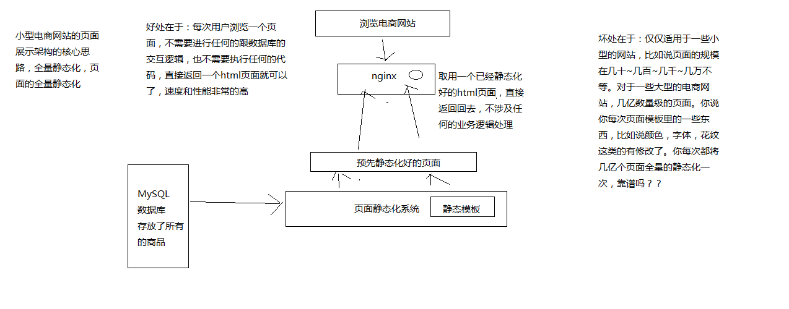
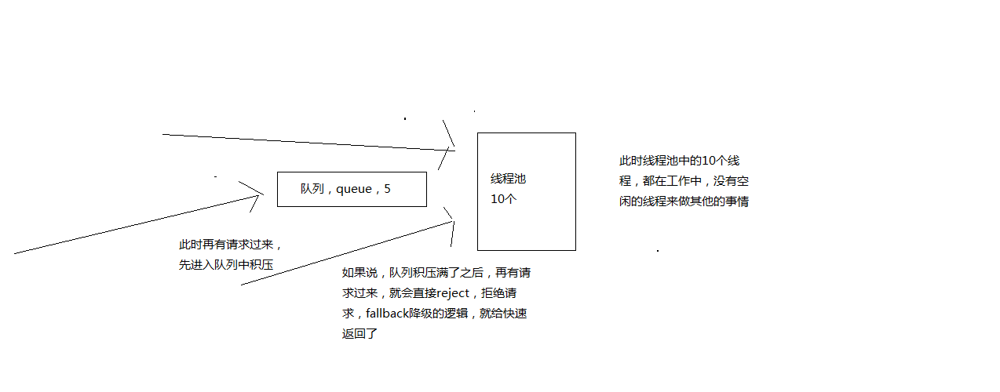

# 1 前言

## 1.1 hystrix是用来干嘛的

### 1.1.1 核心功能

隔离、限流、熔断、降级、运维监控

核心功能为 隔离、熔断、降级

核心功能如图所示：


### 1.1.2 Hystrix是什么？

在分布式系统中，每个服务都可能会调用很多其他服务，被调用的那些服务就是依赖服务，有的时候某些依赖服务出现故障也是很正常的。

Hystrix可以让我们在分布式系统中对服务间的调用进行控制，加入一些调用延迟或者依赖故障的容错机制。

Hystrix通过将依赖服务进行资源隔离，进而组织某个依赖服务出现故障的时候，这种故障在整个系统所有的依赖服务调用中进行蔓延，同时Hystrix还提供故障时的fallback降级机制

总而言之，Hystrix通过这些方法帮助我们提升分布式系统的可用性和稳定性

### 1.1.3 hystrix 设计原则是什么？ 

（1）对依赖服务调用时出现的调用延迟和调用失败进行控制和容错保护
（2）在复杂的分布式系统中，阻止某一个依赖服务的故障在整个系统中蔓延，服务A->服务B->服务C，服务C故障了，服务B也故障了，服务A故障了，整套分布式系统全部故障，整体宕机
（3）提供fail-fast（快速失败）和快速恢复的支持
（4）提供fallback优雅降级的支持
（5）支持近实时的监控、报警以及运维操作

调用延迟+失败，提供容错
阻止故障蔓延
快速失败+快速恢复
降级
监控+报警+运维

完全描述了hystrix的功能，提供整个分布式系统的高可用的架构

### 1.1.4 Hystrix要解决的问题是什么？

解决复杂的分布式系统架构中，高可用的问题，避免服务被拖垮。


### 1.1.5 扩展

小型电商网站的静态化方案



大型电商网站的详情页系统的架构


## 1.2 功能概述

### 1.2.1 基本功能

**资源隔离、限流、熔断、降级、运维监控**

**资源隔离：**让你的系统里，某一块东西，在故障的情况下，不会耗尽系统所有的资源，比如线程资源

我实际的项目中的一个case，有一块东西，是要用多线程做一些事情，小伙伴做项目的时候，没有太留神，资源隔离，那块代码，在遇到一些故障的情况下，每个线程在跑的时候，因为那个bug，直接就死循环了，导致那块东西启动了大量的线程，每个线程都死循环

最终导致我的系统资源耗尽，崩溃，不工作，不可用，废掉了

资源隔离，那一块代码，最多最多就是用掉10个线程，不能再多了，就废掉了，限定好的一些资源

**限流：**高并发的流量涌入进来，比如说突然间一秒钟100万QPS，废掉了，10万QPS进入系统，其他90万QPS被拒绝了

**熔断：**系统后端的一些依赖，出了一些故障，比如说mysql挂掉了，每次请求都是报错的，熔断了，后续的请求过来直接不接收了，拒绝访问，10分钟之后再尝试去看看mysql恢复没有

**降级：**mysql挂了，系统发现了，自动降级，从内存里存的少量数据中，去提取一些数据出来

**运维监控：**监控+报警+优化，各种异常的情况，有问题就及时报警，优化一些系统的配置和参数，或者代码

### 1.2.2 再看Hystrix的更加细节的设计原则是什么？

（1）阻止任何一个依赖服务耗尽所有的资源，比如tomcat中的所有线程资源
（2）避免请求排队和积压，采用限流和fail fast来控制故障
（3）提供fallback降级机制来应对故障
（4）使用资源隔离技术，比如bulkhead（舱壁隔离技术），swimlane（泳道技术），circuit breaker（短路技术），来限制任何一个依赖服务的故障的影响
（5）通过近实时的统计/监控/报警功能，来提高故障发现的速度
（6）通过近实时的属性和配置热修改功能，来提高故障处理和恢复的速度
（7）保护依赖服务调用的所有故障情况，而不仅仅只是网络故障情况

调用这个依赖服务的时候，client调用包有bug，阻塞，等等，依赖服务的各种各样的调用的故障，都可以处理

### 1.2.3 Hystrix是如何实现它的目标的？

（1）通过HystrixCommand或者HystrixObservableCommand来封装对外部依赖的访问请求，这个访问请求一般会运行在独立的线程中，资源隔离
（2）对于超出我们设定阈值的服务调用，直接进行超时，不允许其耗费过长时间阻塞住。这个超时时间默认是99.5%的访问时间，但是一般我们可以自己设置一下
（3）为每一个依赖服务维护一个独立的线程池，或者是semaphore，当线程池已满时，直接拒绝对这个服务的调用
（4）对依赖服务的调用的成功次数，失败次数，拒绝次数，超时次数，进行统计
（5）如果对一个依赖服务的调用失败次数超过了一定的阈值，自动进行熔断，在一定时间内对该服务的调用直接降级，一段时间后再自动尝试恢复
（6）当一个服务调用出现失败，被拒绝，超时，短路等异常情况时，自动调用fallback降级机制
（7）对属性和配置的修改提供近实时的支持

# 2 hystrix使用及原理

## 2.1 基于hystrix的线程池隔离技术进行商品服务接口的资源隔离

### 2.1.1 前言

​	**hystrix进行资源隔离，其实是提供了一个抽象，叫做command，就是说，你如果要把对某一个依赖服务的所有调用请求，全部隔离在同一份资源池内**

​	对这个依赖服务的所有调用请求，全部走这个资源池内的资源，不会去用其他的资源了，这个就叫做资源隔离

​	hystrix最最基本的资源隔离的技术，线程池隔离技术

​	对某一个依赖服务，商品服务，所有的调用请求，全部隔离到一个线程池内，对商品服务的每次调用请求都封装在一个command里面

​	每个command（每次服务调用请求）都是使用线程池内的一个线程去执行的

​	所以哪怕是对这个依赖服务，商品服务，现在同时发起的调用量已经到了1000了，但是线程池内就10个线程，最多就只会用这10个线程去执行


### 2.1.2 示例

**最基本的利用HystrixCommand进行资源隔离样例**

Command

```java
public class CommandHelloWorld extends HystrixCommand<ProductInfo> {

    private Long productId;

    public CommandHelloWorld(Long productId) {
        super(HystrixCommandGroupKey.Factory.asKey("ExampleGroup"));
        this.productId = productId;
    }

    @Override
    protected ProductInfo run() {
        // 拿到一个商品id
        // 调用商品服务的接口，获取商品id对应的商品的最新数据
        // 用HttpClient去调用商品服务的http接口
        String url = "http://127.0.0.1:8082/getProductInfo?productId=" + productId;
        String response = HttpClientUtils.sendGetRequest(url);
        System.out.println(response);
        return JSONObject.parseObject(response, ProductInfo.class);
    }

    public void setProductId(Long productId) {
        this.productId = productId;
    }
}
```

调用

```java
	/**
	 * 示例情况：nginx开始各级缓存都失效了。nginx发送很多请求直接到缓存服务拉取最原始的数据
	 * @param productId
	 * @return
	 */
	@RequestMapping("/getProductInfo")
	@ResponseBody
	public String getProductInfo(Long productId) throws ExecutionException, InterruptedException {
		// 拿到一个商品id
		// 调用商品服务的接口，获取商品id对应的商品的最新数据
		// 用HttpClient去调用商品服务的http接口	
		//1 不进行资源隔离
//		String url = "http://127.0.0.1:8082/getProductInfo?productId=" + productId;
//		String response = HttpClientUtils.sendGetRequest(url);
//		System.out.println(response);
		// 2 常用资源隔离的调用方式
//		HystrixCommand<ProductInfo> hystrixCommand = new CommandHelloWorld(productId);
//		ProductInfo execute = hystrixCommand.execute();
//		System.out.println(execute);
		// 3 异步资源隔离的调用方式
		Future<ProductInfo> queue = new CommandHelloWorld(productId).queue();
		System.out.println(queue.get());
		Thread.sleep(1000);
		System.out.println(queue.get());
		return "success";
	}
```

请求多次接口，多个结果资源隔离示例

ObservableCommand

```java
public class ObservableCommandHelloWorld extends HystrixObservableCommand<ProductInfo> {


    private Long[] productIds;

    public ObservableCommandHelloWorld(Long[] productIds) {
        super(HystrixCommandGroupKey.Factory.asKey("ExampleGroup"));
        this.productIds = productIds;
    }

    /**
     * 多次调用接口的command
     * @return
     */
    @Override
    protected Observable<ProductInfo> construct() {
        return Observable.create(new Observable.OnSubscribe<ProductInfo>() {

            @Override
            public void call(Subscriber<? super ProductInfo> observer) {
                try {
                    //if (!observer.isUnsubscribed()) {
                    for (Long productId : productIds) {
                        String url = "http://127.0.0.1:8082/getProductInfo?productId=" + productId;
                        String response = HttpClientUtils.sendGetRequest(url);
                        ProductInfo productInfo = JSONObject.parseObject(response, ProductInfo.class);
                        observer.onNext(productInfo);

                    }
                        //observer.onNext("Hi " + name + "!");
                        observer.onCompleted();
                    //}
                } catch (Exception e) {
                    observer.onError(e);
                }
            }
        } ).subscribeOn(Schedulers.io());
    }
}
```

调用

```java
	/**
	 * 请求多次接口
	 * @param productIds
	 * @return
	 */
	@RequestMapping("/getProductInfoAll")
	@ResponseBody
	public String getProductInfoAll(String productIds) throws ExecutionException, InterruptedException {
		Long[] collect = Arrays.asList(productIds.split(",")).stream().map(a -> Long.parseLong(a)).toArray(Long[]::new);
		//1 常用资源隔离调用方式
//		HystrixObservableCommand<ProductInfo> getProductInfoCommand = new ObservableCommandHelloWorld(collect);
//		Observable<ProductInfo> observe = getProductInfoCommand.observe();
//		observe.subscribe(new Observer<ProductInfo>() {
//			@Override
//			public void onCompleted() {
//				System.out.println("获取完了所有数据");
//			}
//
//			@Override
//			public void onError(Throwable e) {
//				e.printStackTrace();
//			}
//
//			//每条返回数据的回调方法
//			@Override
//			public void onNext(ProductInfo productInfo) {
//				System.out.println(productInfo);
//			}
//		});

		//2 该使用方式只能一次onNext回调，多次则报错
//		ProductInfo productInfo = new ObservableCommandHelloWorld(collect).toObservable().toBlocking().toFuture().get();
//		System.out.println(productInfo);
		//3 异步不常用资源隔离调用方式
		Future<ProductInfo> productInfoFuture = new ObservableCommandHelloWorld(collect).toObservable().toBlocking().toFuture();
		System.out.println(productInfoFuture.get());
		Thread.sleep(1000);
		System.out.println(productInfoFuture.get());
		//toObservable延迟执行 observe立即执行
		//延迟执行时指调用下一个subscribe方法时才执行
		return "success";
	}
```

**总结：**

HystrixCommand：是用来获取一条数据的
HystrixObservableCommand：是设计用来获取多个结果的

**command的四种调用方式**

**同步：**

1 new CommandHelloWorld("World").execute()，

2 new ObservableCommandHelloWorld("World").toBlocking().toFuture().get()

如果你认为observable command只会返回一条数据，那么可以调用上面的模式，去同步执行，返回一条数据

**异步：**

3 new CommandHelloWorld("World").queue()

4 new ObservableCommandHelloWorld("World").toBlocking().toFuture()

对command调用queue()，仅仅将command放入线程池的一个等待队列，就立即返回，拿到一个Future对象，后面可以做一些其他的事情，然后过一段时间对future调用get()方法获取数据

**立即调用/延迟调用**

 observe()：hot，已经执行过了
 toObservable(): cold，还没执行过（延迟执行时指调用下一个subscribe方法时才执行）

**好处：**

不让超出这个量的请求去执行了，保护说，不要因为某一个依赖服务的故障，导致耗尽了缓存服务中的所有的线程资源去执行

## 2.2 线程池与信号量

### 2.2.1 线程池与信号量

**hystrix，资源隔离，两种技术，线程池的资源隔离，信号量的资源隔离**

**线程池：**适合绝大多数的场景，99%的，线程池，对依赖服务的网络请求的调用和访问，timeout这种问题

**信号量（semaphore）：**适合，你的访问不是对外部依赖的访问，而是对内部的一些比较复杂的业务逻辑的访问，但是像这种访问，系统内部的代码，其实不涉及任何的网络请求，那么只要做信号量的普通限流就可以了，因为不需要去捕获timeout类似的问题，算法+数据结构的效率不是太高，并发量突然太高，因为这里稍微耗时一些，导致很多线程卡在这里的话，不太好，所以进行一个基本的资源隔离和访问，避免内部复杂的低效率的代码，导致大量的线程被hang住

**信号量跟线程池，两种资源隔离的技术，区别到底在哪儿呢？**

**区别：**

**1 线程池是基于web容器的线程另外开启线程来控制web容器线程执行的**

**2 信号量是基于web容器的线程，不开启额外线程，就是对web容器的线程进行一些限制**

### 2.2.2 信号量的使用场景

在代码中加入从本地内存获取地理位置数据的逻辑

业务背景里面， 比较适合信号量的是什么场景呢？

比如说，我们一般来说，**缓存服务，可能会将部分量特别少，访问又特别频繁的一些数据，放在自己的纯内存中**

一般我们在获取到商品数据之后，都要去获取商品是属于哪个地理位置，省，市，卖家的，可能在自己的纯内存中，比如就一个Map去获取

**对于这种直接访问本地内存的逻辑，比较适合用信号量做一下简单的隔离**

**优点在于，不用自己管理线程池拉，不用care timeout超时了，信号量做隔离的话，性能会相对来说高一些**

### 2.2.3 代码实例

​	**代码用法和线程池的基本使用无区别，区别在核心基于构造者模式的调用链中，添加ExecutionIsolationStrategy.SEMAPHORE相关的信号量配置**

```java
super(Setter.withGroupKey(HystrixCommandGroupKey.Factory.asKey("ExampleGroup"))
        .andCommandPropertiesDefaults(HystrixCommandProperties.Setter()
               .withExecutionIsolationStrategy(ExecutionIsolationStrategy.SEMAPHORE)));
```

### 2.2.4 核心原理图

**线程池与信号量的区别及原理**


**PS:超过线程池和信号量配置的最大请求数，都会通过相关拒绝策略去拒绝(reject)并降级请求。**

## 2.3 command相关配置介绍

### 2.3.1 前言

资源隔离，两种策略，线程池隔离，信号量隔离

对资源隔离这一块东西，做稍微更加深入一些的讲解，告诉你，除了可以选择隔离策略以外，对你选择的隔离策略，可以做一定的细粒度的一些控制

**PS:HystrixCommand及HystrixObservableCommand类都是没有无参构造的抽象类**

**1 子类必须实现抽象方法，run方法或construct方法**

**2 因为父类只有有参构造，所以必须在子类的构造中显示的调用父类的有参构造**

**PS:2.3小结的配置代码都不是完整代码，仅为该配置的相关代码，都是基于父类有参构造利用构造器/建造者模式构建HystrixCommandGroupKey或HystrixCommand.Setter等相关代码**

**例：**

```java
    public CommandSemaphore(Long productId) {
        super(Setter.withGroupKey(HystrixCommandGroupKey.Factory.asKey("ExampleGroup"))
                .andCommandPropertiesDefaults(HystrixCommandProperties.Setter()
                .withExecutionIsolationStrategy(HystrixCommandProperties.ExecutionIsolationStrategy.SEMAPHORE)));
        this.productId = productId;
    }
```


### 2.3.2 线程池与信号量的配置及使用场景

**配置:execution.isolation.strategy**

对应代码

```java
// to use thread isolation 线程池
HystrixCommandProperties.Setter()
   .withExecutionIsolationStrategy(ExecutionIsolationStrategy.THREAD)
// to use semaphore isolation 信号量
HystrixCommandProperties.Setter()
   .withExecutionIsolationStrategy(ExecutionIsolationStrategy.SEMAPHORE)
```

**指定了HystrixCommand.run()的资源隔离策略，THREAD或者SEMAPHORE，一种是基于线程池，一种是信号量**

**线程池机制：**每个command运行在一个线程中，限流是通过线程池的大小来控制的

**信号量机制：**command是运行在调用线程中，但是通过信号量的容量来进行限流

**如何在线程池和信号量之间做选择？**

1 **默认的策略就是线程池**

2 线程池其实最大的好处就是对于网络访问请求，如果有超时的话，可以避免调用线程阻塞住

3 而使用信号量的场景，通常是针对超大并发量的场景下，每个服务实例每秒都几百的QPS，那么此时你用线程池的话，线程一般不会太多，可能撑不住那么高的并发，如果要撑住，可能要耗费大量的线程资源，那么就是用信号量，来进行限流保护

4 一般用信号量常见于那种基于纯内存的一些业务逻辑服务，而不涉及到任何网络访问请求

**PS:netflix有多数的command运行在的线程池中，只有少数command是不运行在线程池中的，就是从纯内存中获取一些元数据，或者是对多个command包装起来的facacde command，是用信号量限流的**

### 2.3.3 command名称和command组

线程池隔离，依赖服务->接口->线程池

**每个command，都可以设置一个自己的名称，同时可以设置一个自己的组**

```java
private static final Setter cachedSetter = 
//设置组
    Setter.withGroupKey(HystrixCommandGroupKey.Factory.asKey("ExampleGroup"))
    //设置command名称
        .andCommandKey(HystrixCommandKey.Factory.asKey("HelloWorld"));    
```

**command group，是一个非常重要的概念，默认情况下，因为就是通过command group来定义一个线程池的**，而且还会通过command group来聚合一些监控和报警信息

**同一个command group中的请求，都会进入同一个线程池中**

### 2.3.4 command线程池

#### 2.3.4.1 线程池与command

**threadpool key(线程池key)代表了一个HystrixThreadPool**，用来进行统一监控，统计，缓存

**默认的threadpool key就是command group(comnand组)名称**

每个command都会跟它的对应线程池key的线程池绑定在一起

如果不想直接用command group，也可以手动设置thread pool name

```java
public CommandHelloWorld(String name) {
    super(Setter.withGroupKey(HystrixCommandGroupKey.Factory.asKey("ExampleGroup"))
            .andCommandKey(HystrixCommandKey.Factory.asKey("HelloWorld"))
            .andThreadPoolKey(HystrixThreadPoolKey.Factory.asKey("HelloWorldPool")));
    this.name = name;
}
```

#### 2.3.4.2 对应服务如何合理的使用线程池

##### 2.3.4.2.1 一般情况

command threadpool -> command group -> command key

**command key，代表了一类command，一般来说，代表了底层的依赖服务的一个接口**

**command group，代表了某一个底层的依赖服务，合理，一个依赖服务可能会暴露出来多个接口，每个接口就是一个command key**

command group，在逻辑上去组织起来一堆command key的调用，统计信息，成功次数，timeout超时次数，失败次数，可以看到某一个服务整体的一些访问情况

command group，一般来说，推荐是根据一个服务去划分出一个线程池，command key默认都是属于同一个线程池的

**场景：**

比如说你以一个服务为粒度，估算出来这个服务每秒的所有接口加起来的整体QPS在100左右(能够承载)

你调用那个服务的当前服务，部署了10个服务实例，每个服务实例上，其实用这个command group对应这个服务，给一个线程池，量大概在10个左右，就可以了，你对整个服务的整体的访问QPS大概在每秒100左右

**(当前服务10*每个服务线程池10线程限制=100被调用服务的承载QPS)**

##### 2.3.4.2.2 其他情况

服务->线程池 、服务->某个功能模块->线程池、服务->某个功能模块->某个接口->线程池

**服务->线程池**

一般来说，command group是用来在逻辑上组合一堆command的

**服务->某个功能模块->线程池**

举个例子，对于一个服务中的某个功能模块来说，希望将这个功能模块内的所有command放在一个group中，那么在监控和报警的时候可以放一起看

**服务->某个功能模块->某个接口->线程池**

command group，对应了一个服务，但是这个服务暴露出来的几个接口，访问量很不一样，差异非常之大

你可能就希望在这个服务command group内部，包含的对应多个接口的command key，做一些细粒度的资源隔离

对同一个服务的不同接口，都使用不同的线程池

每个command key有自己的线程池，

每个接口有自己的线程池，去做资源隔离和限流

##### 2.3.4.2.3 command key与command group的关系

**逻辑上来说，多个command key属于一个command group，在做统计的时候，会放在一起统计**

但是对于thread pool资源隔离来说，可能是希望能够拆分的更加一致一些，比如在一个功能模块内，对不同的请求可以使用不同的thread pool

command group一般来说，可以是对应一个服务，多个command key对应这个服务的多个接口，多个接口的调用共享同一个线程池

如果说你的command key，要用自己的线程池，可以定义自己的threadpool key，就ok了

**PS:正常来说就是一个服务对应一个group(线程池)，也可以根据服务中的功能模块划分线程池，甚至根据接口划分线程池，都可以根据需求去灵活定制**

### 2.3.5 coreSize(线程池大小)

**设置线程池的大小，默认是10**

```java
HystrixThreadPoolProperties.Setter()
   .withCoreSize(int value)
```

一般来说，用这个默认的10个线程大小就够了

### 2.3.6 queueSizeRejectionThreshold队列大小

**就是设置队列的大小**

**控制queue满后reject的threshold(入口)**，因为maxQueueSize不允许热修改，因此**提供这个参数可以热修改，控制队列的最大大小**

**HystrixCommand在提交到线程池之前，其实会先进入一个队列中，这个队列满了之后，才会reject**

**默认值是5**

```java
HystrixThreadPoolProperties.Setter()
   .withQueueSizeRejectionThreshold(int value)
```

### 2.3.7允许访问的最大并发量

**execution.isolation.semaphore.maxConcurrentRequests**

**设置使用SEMAPHORE隔离策略的时候，允许访问的最大并发量，超过这个最大并发量，请求直接被reject**

这个并发量的设置，跟线程池大小的设置，应该是类似的，但是基于信号量的话，性能会好很多，而且hystrix框架本身的开销会小很多

**默认值是10，建议设置的小一些**，否则因为信号量是基于调用线程去执行command的，而且不能从timeout中抽离，因此一旦设置的太大，而且有延时发生，可能瞬间导致tomcat本身的线程资源本占满

```java
HystrixCommandProperties.Setter()
   .withExecutionIsolationSemaphoreMaxConcurrentRequests(int value)
```

### 2.3.8 线程池+queue的工作原理

先进入线程池，线程池满了再进入队列



## 2.4 深入分析hystrix执行时的8大流程步骤以及内部原理

### 2.4.1 前言

画图分析整个8大步骤的流程，然后再对每个步骤进行细致的讲解


### 2.4.2 八大流程步骤

#### 2.4.2.1 构建一个HystrixCommand或者HystrixObservableCommand

一个HystrixCommand或一个HystrixObservableCommand对象，代表了对某个依赖服务发起的一次请求或者调用

构造的时候，可以在构造函数中传入任何需要的参数

**HystrixCommand主要用于仅仅会返回一个结果的调用**
**HystrixObservableCommand主要用于可能会返回多条结果的调用**

```java
HystrixCommand command = new HystrixCommand(arg1, arg2);
HystrixObservableCommand command = new HystrixObservableCommand(arg1, arg2);
```

#### 2.4.2.2 调用command的执行方法

执行Command就可以发起一次对依赖服务的调用

**要执行Command，需要在4个方法中选择其中的一个：execute()，queue()，observe()，toObservable()**

其中**execute()和queue()仅仅对HystrixCommand适用**

**execute()：调用后直接block住，属于同步调用**，直到依赖服务返回单条结果，或者抛出异常
**queue()：返回一个Future，属于异步调用**，后面可以通过Future获取单条结果
**observe()：订阅一个Observable对象**，Observable代表的是依赖服务返回的结果，获取到一个那个代表结果的Observable对象的拷贝对象
**toObservable()：返回一个Observable对象**，如果我们订阅这个对象，就会执行command并且获取返回结果

**PS:observe()为直接订阅调用，toObservable为延迟调用是返回Observable对象，直到调用对应方法订阅这个对象才会去执行。**

```java
K             value   = command.execute();
Future<K>     fValue  = command.queue();
Observable<K> ohValue = command.observe();         
Observable<K> ocValue = command.toObservable();    
```

**execute()实际上会调用queue().get().queue()，接着会调用toObservable().toBlocking().toFuture()**

**也就是说，无论是哪种执行command的方式，最终都是依赖toObservable()去执行的**

#### 2.4.2.3 检查是否开启缓存

从这一步开始，进入我们的底层的运行原理啦，了解hysrix的一些更加高级的功能和特性

如果这个**command开启了请求缓存，request cache，而且这个调用的结果在缓存中存在，那么直接从缓存中返回结果**

#### 2.4.2.4 检查是否开启了短路器

检查这个command对应的依赖服务是否开启了短路器

**如果短路器被打开了，那么hystrix就不会执行这个command，而是直接去执行fallback降级机制**

#### 2.4.2.5 检查线程池/队列/semaphore是否已经满了

如果command对应的线程池/队列/semaphore**已经满了，那么也不会执行command，而是直接去调用fallback降级机制**

**PS:线程池满了会加入到队列中并不会直接拒绝，对应队列也会有相应的长度，队列满了才会拒绝**

??信号量有没有队列的说法

#### 2.4.2.6 执行command

**调用HystrixObservableCommand.construct()或HystrixCommand.run()来实际执行这个command**

HystrixCommand.run()是返回一个单条结果，或者抛出一个异常
HystrixObservableCommand.construct()是返回一个Observable对象，可以获取多条结果

如果**HystrixCommand.run()或HystrixObservableCommand.construct()的执行，超过了timeout时长的话，那么command所在的线程就会抛出一个TimeoutException**

如果**timeout了，也会去执行fallback降级机制**，而且就不会管run()或construct()返回的值了

这里要注意的一点是，我们是不可能/**不会终止掉一个调用严重延迟的依赖服务的线程的，只能说给你抛出来一个TimeoutException**，但是还是可能会因为严重延迟的调用线程占满整个线程池的

即使这个时候新来的流量都被限流了。。。

如果没有timeout的话，那么就会拿到一些调用依赖服务获取到的结果，然后hystrix会做一些logging记录和metric统计??

#### 2.4.2.7 短路健康检查

**Hystrix会将每一个依赖服务的调用成功，失败，拒绝，超时，等事件，都会发送给circuit breaker断路器**

短路器就会对调用**成功/失败/拒绝/超时等事件的次数进行统计**

短路器会根据这些**统计次数来决定，是否要进行短路，如果打开了短路器，那么在一段时间内就会直接短路**，然后如果在之后第一次**检查发现调用成功了，就关闭断路器**

**PS:类似于eureka的自我保护机制**

#### 2.4.2.8 调用fallback降级机制

**在以下几种情况中，hystrix会调用fallback降级机制：run()或construct()抛出一个异常，短路器打开，线程池/队列/semaphore满了，command执行超时了**

**一般在降级机制中，都建议给出一些默认的返回值，比如静态的一些代码逻辑，或者从内存中的缓存中提取一些数据，尽量在这里不要再进行网络请求了**

即使在降级中，一定要进行网络调用，也应该将那个调用放在一个HystrixCommand中，进行隔离

**在HystrixCommand中，上线getFallback()方法，可以提供降级机制**

在**HystirxObservableCommand中，实现一个resumeWithFallback()方法，返回一个Observable对象，可以提供降级结果**

**如果fallback返回了结果，那么hystrix就会返回这个结果**

对于HystrixCommand，会返回一个Observable对象，其中会发返回对应的结果
对于HystrixObservableCommand，会返回一个原始的Observable对象

**如果没有实现fallback，或者是fallback抛出了异常，Hystrix会返回一个Observable，但是不会返回任何数据**

不同的command执行方式，其fallback为空或者异常时的返回结果不同

对于execute()，直接抛出异常
对于queue()，返回一个Future，调用get()时抛出异常
对于observe()，返回一个Observable对象，但是调用subscribe()方法订阅它时，理解抛出调用者的onError方法
对于toObservable()，返回一个Observable对象，但是调用subscribe()方法订阅它时，理解抛出调用者的onError方法

### 2.4.3 不同的执行方式

execute()，获取一个Future.get()，然后拿到单个结果
queue()，返回一个Future
observer()，立即订阅Observable，然后启动8大执行步骤，返回一个拷贝的Observable，订阅时立即回调给你结果
toObservable()，返回一个原始的Observable，必须手动订阅才会去执行8大步骤

## 2.5 request cache请求缓存

### 2.5.1 请求上下文

首先，有一个概念，叫做reqeust context，请求上下文，一般来说，在一个web应用中，hystrix

我们会在一个filter里面，对每一个请求都施加一个请求上下文，就是说，tomcat容器内，每一次请求，就是一次请求上下文

然后在这次**请求上下文中，我们会去执行N多代码，调用N多依赖服务，有的依赖服务可能还会调用好几次**

在一次请求上下文中，如果有多个command，参数都是一样的，调用的接口也是一样的，其实结果可以认为也是一样的

那么这个时候，**我们就可以让第一次command执行，返回的结果，被缓存在内存中，然后这个请求上下文中，后续的其他对这个依赖的调用全部从内存中取用缓存结果就可以了**

**不用在一次请求上下文中反复多次的执行一样的command，提升整个请求的性能**

### 2.5.2 request cache使用示例

HystrixCommand和HystrixObservableCommand都可以指定一个缓存key，然后hystrix会自动进行缓存，接着在同一个request context内，再次访问的时候，就会直接取用缓存

用请求缓存，可以避免重复执行网络请求

**多次调用一个command，那么只会执行一次，后面都是直接取缓存**

对于请求缓存（request caching），请求合并（request collapsing），请求日志（request log），等等技术，都必须自己管理HystrixReuqestContext的声明周期

在一个请求执行之前，都必须先初始化一个request context

```java
HystrixRequestContext context = HystrixRequestContext.initializeContext();
```

然后在请求结束之后，需要关闭request context

```java
context.shutdown();
```

**PS:结合Hystrix的请求上下文，才能使用request cache缓存**

command的request cache使用示例

```java
public class CommandUsingRequestCache extends HystrixCommand<Boolean> {

    private final int value;

    public static final  HystrixCommandKey KEY = HystrixCommandKey.Factory.asKey("ExampleCommand");

    public CommandUsingRequestCache(int value) {
        super(Setter.withGroupKey(HystrixCommandGroupKey.Factory.asKey("ExampleGroup"))
                .andCommandKey(KEY));
        this.value = value;
    }
    @Override
    protected Boolean run() {
        //偶数返回true
        return value == 0 || value % 2 == 0;
    }
    /**
     * 声明使用缓存
     * @return
     */
    @Override
    protected String getCacheKey() {
        return String.valueOf(value);
    }
    /**
     * 清除 request cache
     * @param id
     */
    public static void flushCache(int id) {
        HystrixRequestCache.getInstance(KEY,
                HystrixConcurrencyStrategyDefault.getInstance()).clear(String.valueOf(id));
    }
}

```

调用示例

```java
	@RequestMapping("/getProductInfoCache")
	@ResponseBody
	public String getProductInfoCache(String productIds){
		HystrixRequestContext context = HystrixRequestContext.initializeContext();
		try {
			int i = 0;
			for (String s : productIds.split(",")) {
				CommandUsingRequestCache command2a = new CommandUsingRequestCache(Integer.parseInt(s));
				//execute返回结果，偶数返回true
				Boolean execute = command2a.execute();
				System.out.println("execute"+s + execute);
				//cache是否用了缓存，用了缓存返回true
				System.out.println("cache"+s + command2a.isResponseFromCache());
				System.out.println("");
				//测试缓存清除，为偶数时则清除缓存，缓存就不生效
				//测试仅清除一次缓存
				if(execute&&i<1){
					i++;
					CommandUsingRequestCache.flushCache(Integer.parseInt(s));
				}
			}
		}catch (Exception e){
			e.printStackTrace();
		}finally {
			context.shutdown();
		}
		return "success";
	}
```

请求及参数

```
http://localhost:8081/getProductInfoCache?productIds=1,1,1,2,2,3
```

调用日志


**PS:两个红框分别对应两次request context(上下文)，两次请求**

总结：

1 如调用日志所示，第一次调用相同参数的接口时未使用缓存，第二次则使用了缓存

2 第一次请求时存入了缓存，第二次就可以直接使用缓存(同一接口，相同参数)

3 清除缓存后则下一次调用就没有缓存了

4 清除缓存只清除当前缓存，下一次还调用，不清除缓存的话，还是会有缓存的

5 request cache缓存都是在一个request context(上下文)中才能使用的，下一个request context(上下文)就和上一次的缓存没有关系了

原理图：


## 2.6 fallback降级机制

### 2.6.1 几种会导致降级的情况

1 hystrix调用各种接口，或者访问外部依赖，mysql，redis，zookeeper，kafka，等等，如果出现了任何异常的情况

比如说报错了，访问mysql报错，redis报错，zookeeper报错，kafka报错，error**(就是抛出异常了)**

2 对每个外部依赖，无论是服务接口，中间件，资源隔离，对外部依赖只能用一定量的资源去访问，线程池/信号量，如果资源池已满，reject**(就是请求数超出线程池/信号量长度限制了)**

3 访问外部依赖的时候，访问时间过长，可能就会导致超时，报一个TimeoutException异常，timeout**(就是访问超时了)**

上述三种情况，都是我们说的异常情况，对外部依赖的东西访问的时候出现了异常，发送异常事件到短路器中去进行统计

4 **如果短路器发现异常事件的占比达到了一定的比例，直接开启短路**，circuit breaker

上述四种情况，都会去调用fallback降级机制

**PS:总结就是,run()抛出异常，超时，线程池或信号量满了，或短路了，都会调用fallback机制**

### 2.6.2 降级机制的示例

command降级示例

```java
public class CommandHelloFailure extends HystrixCommand<String> {

    private final String name;

    public CommandHelloFailure(String name) {
        super(HystrixCommandGroupKey.Factory.asKey("ExampleGroup"));
        this.name = name;
    }

    /**
     * run直接抛出异常，就会触发降级，返回fallback内容
     * @return
     */
    @Override
    protected String run() {
        throw new RuntimeException("this command always fails");
    }

    /**
     * 重写getFallback，定义fallback返回值
     * @return
     */
    @Override
    protected String getFallback() {
        return "Hello Failure " + name + "!";
    }

}
```

HystrixObservableCommand，是实现resumeWithFallback方法，这里就不示例了

### 2.6.3 降级相关设置

```
fallback.isolation.semaphore.maxConcurrentRequests
```

这个参数设置了HystrixCommand.getFallback()最大允许的并发请求数量，默认值是10，也是通过semaphore信号量的机制去限流

如果超出了这个最大值，那么直接被reject(拒绝)

**PS:这个参数就是限制同时触发降级方法的请求数量(限流)，避免降级方法也被大量请求访问，导致(堵住/hang住/卡死)**

```java
HystrixCommandProperties.Setter()
   .withFallbackIsolationSemaphoreMaxConcurrentRequests(int value)
```

### 2.6.4 fallback常用方式及场景

两种最经典的降级机制：纯内存数据，默认值

**内存数据：**

1 fallback，降级机制，你之前都是必须去调用外部的依赖接口，或者从mysql中去查询数据的，但是为了避免说可能外部依赖会有故障

2 比如，你可以**在内存中维护一个ehcache，作为一个纯内存的基于LRU自动清理的缓存，数据也可以放入缓存内**

**3 如果说外部依赖有异常，fallback这里，直接尝试从ehcache中获取数据**

**PS:EhCache 是一个纯Java的进程内缓存框架**

**默认值：**

比如说，本来你是从mysql，redis，或者其他任何地方去获取数据的，获取调用其他服务的接口的，结果人家故障了，人家挂了，fallback，可以返回一个默认值

**场景：**

给大家举个例子，比如说我们现在有个商品数据，brandId，品牌，一般来说，假设，正常的逻辑，拿到了一个商品数据以后，用brandId再调用一次请求，到其他的服务去获取品牌的最新名称

**假如说，那个品牌服务挂掉了，那么我们可以尝试本地内存中，会保留一份时间比较过期的一份品牌数据**，有些品牌没有，有些品牌的名称过期了，Nike++，Nike

**调用品牌服务失败了，fallback降级就从本地内存中获取一份过期的数据，先凑合着用着**

## 2.7 hystrix短路器原理

### 2.7.1 短路器工作原理

1、**如果经过短路器的流量超过了一定的阈值**，HystrixCommandProperties.circuitBreakerRequestVolumeThreshold()

举个例子，可能看起来是这样子的，**要求在10s内(时间窗口)，经过短路器的流量必须达到20个(默认20)；在10s内，经过短路器的流量才10个，那么根本不会去判断要不要短路**

2、**如果断路器统计到的异常调用的占比超过了一定的阈值**，HystrixCommandProperties.circuitBreakerErrorThresholdPercentage()

如果达到了上面的要求，比如说在10s内，经过短路器的流量（你，只要执行一个command，这个请求就一定会经过短路器），达到了30个；同时其中异常的访问数量，占到了一定的比例，比**如说60%(默认超过50%)的请求都是异常（报错，timeout，reject）**，**会开启短路**

3、然后**短路器从close状态转换到open状态**

4、**短路器打开的时候，所有经过该断路器的请求全部被短路，不调用后端服务，直接走fallback降级**

5、**经过了一段时间之后(默认5秒)，HystrixCommandProperties.circuitBreakerSleepWindowInMilliseconds()，会half-open(半开状态)，让一条请求经过短路器，看能不能正常调用。如果调用成功了，那么就自动恢复，转到close状态**

短路器，会自动恢复的，half-open，半开状态

### 2.7.2 circuit breaker短路器配置

**（1）circuitBreaker.enabled(是否开启短路器，默认true)**

控制短路器是否允许工作，包括跟踪依赖服务调用的健康状况，以及对异常情况过多时是否允许触发短路，默认是true

```java
HystrixCommandProperties.Setter()
   .withCircuitBreakerEnabled(boolean value)
```

**（2）circuitBreaker.requestVolumeThreshold(短路器触发请求阈值)**

设置一个rolling window，滑动窗口中，最少要有多少个请求时，才触发开启短路

举例来说，如果设置为20（默认值），那么在一个10秒的滑动窗口内，如果只有19个请求，即使这19个请求都是异常的，也是不会触发开启短路器的

```java
HystrixCommandProperties.Setter()
   .withCircuitBreakerRequestVolumeThreshold(int value)
```

**（3）circuitBreaker.sleepWindowInMilliseconds(短路至半开状态等待时长)**

设置在短路之后，需要在多长时间内直接reject请求，然后在这段时间之后，再重新导holf-open状态，尝试允许请求通过以及自动恢复，默认值是5000毫秒

```java
HystrixCommandProperties.Setter()
   .withCircuitBreakerSleepWindowInMilliseconds(int value)
```

**（4）circuitBreaker.errorThresholdPercentage(开启短路的异常请求百分比)**

设置异常请求量的百分比，当异常请求达到这个百分比时，就触发打开短路器，默认是50，也就是50%

```java
HystrixCommandProperties.Setter()
   .withCircuitBreakerErrorThresholdPercentage(int value)
```

**（5）circuitBreaker.forceOpen(强制打开短路器)**

如果设置为true的话，直接强迫打开短路器，相当于是手动短路了，手动降级，默认false

```java
HystrixCommandProperties.Setter()
   .withCircuitBreakerForceOpen(boolean value)
```

**（6）circuitBreaker.forceClosed(强制停止/关闭短路器)**

如果设置为ture的话，直接强迫关闭短路器，相当于是手动停止短路了，手动升级，默认false

```java
HystrixCommandProperties.Setter()
   .withCircuitBreakerForceClosed(boolean value)
```

### 2.7.3 触发短路器示例

测试command

```java
public class CommandCircuitBreaker extends HystrixCommand<ProductInfo> {

    private Long productId;

    public CommandCircuitBreaker(Long productId) {
        super(HystrixCommandGroupKey.Factory.asKey("ExampleGroup"));
        this.productId = productId;
    }

    @Override
    protected ProductInfo run() throws Exception {
        //当参数为-1时则抛出异常，测试短路
        if(productId==-1){
            throw new Exception();
        }
        String url = "http://127.0.0.1:8082/getProductInfo?productId=" + productId;
        String response = HttpClientUtils.sendGetRequest(url);
        System.out.println(response);
        return JSONObject.parseObject(response, ProductInfo.class);
    }

    /**
     * 服务降级返回默认值
     * @return
     */
    @Override
    protected ProductInfo getFallback() {
        ProductInfo productInfo = new ProductInfo();
        productInfo.setId(productId);
        productInfo.setName("默认");
        return productInfo;
    }
}
```

调用

```java
   public static void main(String[] args) throws InterruptedException {
        //前10次正常请求
        for(int i = 0;i < 10;i++){
            HystrixCommand<ProductInfo> command = new CommandCircuitBreaker(1L);
            ProductInfo execute = command.execute();
            System.out.println("第"+i+"次请求，结果为:"+execute);
        }
        System.out.println("第一次正常请求测试结束");
        //10-25次会抛出异常，降级
        for(int i = 10;i < 25;i++){
            HystrixCommand<ProductInfo> command = new CommandCircuitBreaker(-1L);
            ProductInfo execute = command.execute();
            System.out.println("第"+i+"次请求，结果为:"+execute);
        }
        System.out.println("第二次异常请求测试结束");
        //这里等待5秒的原因是，统计单位有个时间窗口，需要在时间窗口后，才会说hystrix去看下最近的这个时间窗口
        //比如说最近的0秒内有多少条数据，其中异常的数据有没有到一定的比例，如果到了一定的比例，那么才会去短路
        //等待5秒，后续请求会进入进入短路器，直接短路，不会再调用run方法了，直接降级fallback
        Thread.sleep(5000);
        //25-35次的正常请求也会被短路，降级fallback
        for(int i = 25;i < 35;i++){
            HystrixCommand<ProductInfo> command = new CommandCircuitBreaker(1L);
            ProductInfo execute = command.execute();
            System.out.println("第"+i+"次请求，结果为:"+execute);
        }
        System.out.println("第三次正常请求测试结束，会短路");
        //这里等待5秒是，在进入短路状态后，默认经过5秒后，才会进入半开状态，尝试恢复
        //再等待5秒，短路器会进入半开状态，尝试恢复
        Thread.sleep(5000);
        //已经进入半开状态，第35次尝试请求，成功后则关闭短路器，恢复正常执行
        for(int i = 35;i < 45;i++){
            HystrixCommand<ProductInfo> command = new CommandCircuitBreaker(1L);
            ProductInfo execute = command.execute();
            System.out.println("第"+i+"次请求，结果为:"+execute);
        }
        System.out.println("第四次正常请求测试结束，恢复短路状态");
    }
```

测试结果：


10-25次会抛出异常，降级

实际结果，到第24次时候就开启了短路器机制，没有再调用方法抛出异常了

25-35次的正常请求也会被短路，降级fallback

已经进入半开状态，第35次尝试请求，成功后则关闭短路器，恢复正常执行


