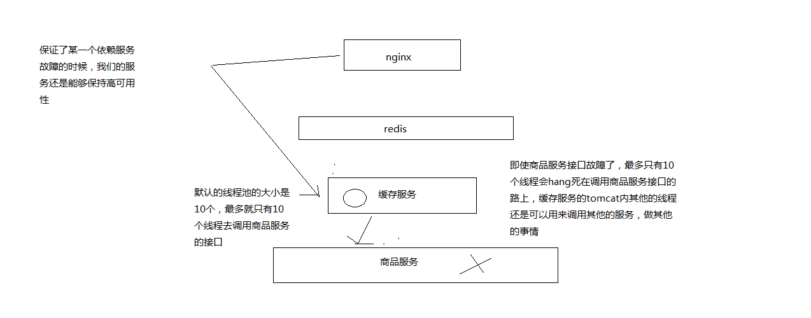
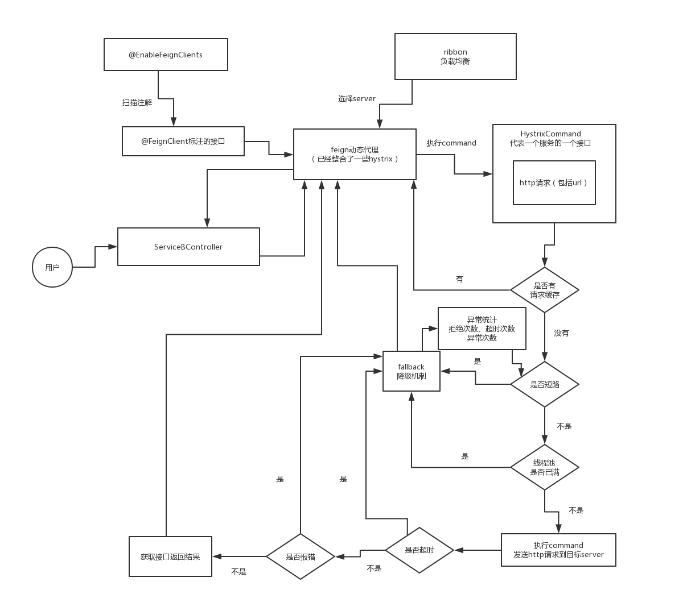

# 1 前言

## 1.1 hystrix是用来干嘛的

### 1.1.1 核心功能

隔离、限流、熔断、降级、运维监控

核心功能为 隔离、熔断、降级

核心功能如图所示：


### 1.1.2 Hystrix是什么？

在分布式系统中，每个服务都可能会调用很多其他服务，被调用的那些服务就是依赖服务，有的时候某些依赖服务出现故障也是很正常的。

Hystrix可以让我们在分布式系统中对服务间的调用进行控制，加入一些调用延迟或者依赖故障的容错机制。

Hystrix通过将依赖服务进行资源隔离，进而组织某个依赖服务出现故障的时候，这种故障在整个系统所有的依赖服务调用中进行蔓延，同时Hystrix还提供故障时的fallback降级机制

总而言之，Hystrix通过这些方法帮助我们提升分布式系统的可用性和稳定性

### 1.1.3 hystrix 设计原则是什么？ 

（1）对依赖服务调用时出现的调用延迟和调用失败进行控制和容错保护
（2）在复杂的分布式系统中，阻止某一个依赖服务的故障在整个系统中蔓延，服务A->服务B->服务C，服务C故障了，服务B也故障了，服务A故障了，整套分布式系统全部故障，整体宕机
（3）提供fail-fast（快速失败）和快速恢复的支持
（4）提供fallback优雅降级的支持
（5）支持近实时的监控、报警以及运维操作

调用延迟+失败，提供容错
阻止故障蔓延
快速失败+快速恢复
降级
监控+报警+运维

完全描述了hystrix的功能，提供整个分布式系统的高可用的架构

### 1.1.4 Hystrix要解决的问题是什么？

解决复杂的分布式系统架构中，高可用的问题，避免服务被拖垮。


### 1.1.5 扩展

小型电商网站的静态化方案


大型电商网站的详情页系统的架构


## 1.2 功能概述

### 1.2.1 基本功能

**资源隔离、限流、熔断、降级、运维监控**

**资源隔离：**让你的系统里，某一块东西，在故障的情况下，不会耗尽系统所有的资源，比如线程资源

我实际的项目中的一个case，有一块东西，是要用多线程做一些事情，小伙伴做项目的时候，没有太留神，资源隔离，那块代码，在遇到一些故障的情况下，每个线程在跑的时候，因为那个bug，直接就死循环了，导致那块东西启动了大量的线程，每个线程都死循环

最终导致我的系统资源耗尽，崩溃，不工作，不可用，废掉了

资源隔离，那一块代码，最多最多就是用掉10个线程，不能再多了，就废掉了，限定好的一些资源

**限流：**高并发的流量涌入进来，比如说突然间一秒钟100万QPS，废掉了，10万QPS进入系统，其他90万QPS被拒绝了

**熔断：**系统后端的一些依赖，出了一些故障，比如说mysql挂掉了，每次请求都是报错的，熔断了，后续的请求过来直接不接收了，拒绝访问，10分钟之后再尝试去看看mysql恢复没有

**降级：**mysql挂了，系统发现了，自动降级，从内存里存的少量数据中，去提取一些数据出来

**运维监控：**监控+报警+优化，各种异常的情况，有问题就及时报警，优化一些系统的配置和参数，或者代码

### 1.2.2 再看Hystrix的更加细节的设计原则是什么？

（1）阻止任何一个依赖服务耗尽所有的资源，比如tomcat中的所有线程资源
（2）避免请求排队和积压，采用限流和fail fast来控制故障
（3）提供fallback降级机制来应对故障
（4）使用资源隔离技术，比如bulkhead（舱壁隔离技术），swimlane（泳道技术），circuit breaker（短路技术），来限制任何一个依赖服务的故障的影响
（5）通过近实时的统计/监控/报警功能，来提高故障发现的速度
（6）通过近实时的属性和配置热修改功能，来提高故障处理和恢复的速度
（7）保护依赖服务调用的所有故障情况，而不仅仅只是网络故障情况

调用这个依赖服务的时候，client调用包有bug，阻塞，等等，依赖服务的各种各样的调用的故障，都可以处理

### 1.2.3 Hystrix是如何实现它的目标的？

（1）通过HystrixCommand或者HystrixObservableCommand来封装对外部依赖的访问请求，这个访问请求一般会运行在独立的线程中，资源隔离
（2）对于超出我们设定阈值的服务调用，直接进行超时，不允许其耗费过长时间阻塞住。这个超时时间默认是99.5%的访问时间，但是一般我们可以自己设置一下
（3）为每一个依赖服务维护一个独立的线程池，或者是semaphore，当线程池已满时，直接拒绝对这个服务的调用
（4）对依赖服务的调用的成功次数，失败次数，拒绝次数，超时次数，进行统计
（5）如果对一个依赖服务的调用失败次数超过了一定的阈值，自动进行熔断，在一定时间内对该服务的调用直接降级，一段时间后再自动尝试恢复
（6）当一个服务调用出现失败，被拒绝，超时，短路等异常情况时，自动调用fallback降级机制
（7）对属性和配置的修改提供近实时的支持

# 2 hystrix使用及原理

## 2.1 基于hystrix的线程池隔离技术进行商品服务接口的资源隔离

### 2.1.1 前言

​	**hystrix进行资源隔离，其实是提供了一个抽象，叫做command，就是说，你如果要把对某一个依赖服务的所有调用请求，全部隔离在同一份资源池内**

​	对这个依赖服务的所有调用请求，全部走这个资源池内的资源，不会去用其他的资源了，这个就叫做资源隔离

​	hystrix最最基本的资源隔离的技术，线程池隔离技术

​	对某一个依赖服务，商品服务，所有的调用请求，全部隔离到一个线程池内，对商品服务的每次调用请求都封装在一个command里面

​	每个command（每次服务调用请求）都是使用线程池内的一个线程去执行的

​	所以哪怕是对这个依赖服务，商品服务，现在同时发起的调用量已经到了1000了，但是线程池内就10个线程，最多就只会用这10个线程去执行



### 2.1.2 示例

**最基本的利用HystrixCommand进行资源隔离样例**

Command

```java
public class CommandHelloWorld extends HystrixCommand<ProductInfo> {

    private Long productId;

    public CommandHelloWorld(Long productId) {
        super(HystrixCommandGroupKey.Factory.asKey("ExampleGroup"));
        this.productId = productId;
    }

    @Override
    protected ProductInfo run() {
        // 拿到一个商品id
        // 调用商品服务的接口，获取商品id对应的商品的最新数据
        // 用HttpClient去调用商品服务的http接口
        String url = "http://127.0.0.1:8082/getProductInfo?productId=" + productId;
        String response = HttpClientUtils.sendGetRequest(url);
        System.out.println(response);
        return JSONObject.parseObject(response, ProductInfo.class);
    }

    public void setProductId(Long productId) {
        this.productId = productId;
    }
}
```

调用

```java
	/**
	 * 示例情况：nginx开始各级缓存都失效了。nginx发送很多请求直接到缓存服务拉取最原始的数据
	 * @param productId
	 * @return
	 */
	@RequestMapping("/getProductInfo")
	@ResponseBody
	public String getProductInfo(Long productId) throws ExecutionException, InterruptedException {
		// 拿到一个商品id
		// 调用商品服务的接口，获取商品id对应的商品的最新数据
		// 用HttpClient去调用商品服务的http接口	
		//1 不进行资源隔离
//		String url = "http://127.0.0.1:8082/getProductInfo?productId=" + productId;
//		String response = HttpClientUtils.sendGetRequest(url);
//		System.out.println(response);
		// 2 常用资源隔离的调用方式
//		HystrixCommand<ProductInfo> hystrixCommand = new CommandHelloWorld(productId);
//		ProductInfo execute = hystrixCommand.execute();
//		System.out.println(execute);
		// 3 异步资源隔离的调用方式
		Future<ProductInfo> queue = new CommandHelloWorld(productId).queue();
		System.out.println(queue.get());
		Thread.sleep(1000);
		System.out.println(queue.get());
		return "success";
	}
```

请求多次接口，多个结果资源隔离示例

ObservableCommand

```java
public class ObservableCommandHelloWorld extends HystrixObservableCommand<ProductInfo> {


    private Long[] productIds;

    public ObservableCommandHelloWorld(Long[] productIds) {
        super(HystrixCommandGroupKey.Factory.asKey("ExampleGroup"));
        this.productIds = productIds;
    }

    /**
     * 多次调用接口的command
     * @return
     */
    @Override
    protected Observable<ProductInfo> construct() {
        return Observable.create(new Observable.OnSubscribe<ProductInfo>() {

            @Override
            public void call(Subscriber<? super ProductInfo> observer) {
                try {
                    //if (!observer.isUnsubscribed()) {
                    for (Long productId : productIds) {
                        String url = "http://127.0.0.1:8082/getProductInfo?productId=" + productId;
                        String response = HttpClientUtils.sendGetRequest(url);
                        ProductInfo productInfo = JSONObject.parseObject(response, ProductInfo.class);
                        observer.onNext(productInfo);

                    }
                        //observer.onNext("Hi " + name + "!");
                        observer.onCompleted();
                    //}
                } catch (Exception e) {
                    observer.onError(e);
                }
            }
        } ).subscribeOn(Schedulers.io());
    }
}
```

调用

```java
	/**
	 * 请求多次接口
	 * @param productIds
	 * @return
	 */
	@RequestMapping("/getProductInfoAll")
	@ResponseBody
	public String getProductInfoAll(String productIds) throws ExecutionException, InterruptedException {
		Long[] collect = Arrays.asList(productIds.split(",")).stream().map(a -> Long.parseLong(a)).toArray(Long[]::new);
		//1 常用资源隔离调用方式
//		HystrixObservableCommand<ProductInfo> getProductInfoCommand = new ObservableCommandHelloWorld(collect);
//		Observable<ProductInfo> observe = getProductInfoCommand.observe();
//		observe.subscribe(new Observer<ProductInfo>() {
//			@Override
//			public void onCompleted() {
//				System.out.println("获取完了所有数据");
//			}
//
//			@Override
//			public void onError(Throwable e) {
//				e.printStackTrace();
//			}
//
//			//每条返回数据的回调方法
//			@Override
//			public void onNext(ProductInfo productInfo) {
//				System.out.println(productInfo);
//			}
//		});

		//2 该使用方式只能一次onNext回调，多次则报错
//		ProductInfo productInfo = new ObservableCommandHelloWorld(collect).toObservable().toBlocking().toFuture().get();
//		System.out.println(productInfo);
		//3 异步不常用资源隔离调用方式
		Future<ProductInfo> productInfoFuture = new ObservableCommandHelloWorld(collect).toObservable().toBlocking().toFuture();
		System.out.println(productInfoFuture.get());
		Thread.sleep(1000);
		System.out.println(productInfoFuture.get());
		//toObservable延迟执行 observe立即执行
		//延迟执行时指调用下一个subscribe方法时才执行
		return "success";
	}
```

**总结：**

HystrixCommand：是用来获取一条数据的
HystrixObservableCommand：是设计用来获取多个结果的

**command的四种调用方式**

**同步：**

1 new CommandHelloWorld("World").execute()，

2 new ObservableCommandHelloWorld("World").toBlocking().toFuture().get()

如果你认为observable command只会返回一条数据，那么可以调用上面的模式，去同步执行，返回一条数据

**异步：**

3 new CommandHelloWorld("World").queue()

4 new ObservableCommandHelloWorld("World").toBlocking().toFuture()

对command调用queue()，仅仅将command放入线程池的一个等待队列，就立即返回，拿到一个Future对象，后面可以做一些其他的事情，然后过一段时间对future调用get()方法获取数据

**立即调用/延迟调用**

 observe()：hot，已经执行过了
 toObservable(): cold，还没执行过（延迟执行时指调用下一个subscribe方法时才执行）

**好处：**

不让超出这个量的请求去执行了，保护说，不要因为某一个依赖服务的故障，导致耗尽了缓存服务中的所有的线程资源去执行

## 2.2 线程池与信号量

### 2.2.1 线程池与信号量

**hystrix，资源隔离，两种技术，线程池的资源隔离，信号量的资源隔离**

**线程池：**适合绝大多数的场景，99%的，线程池，对依赖服务的网络请求的调用和访问，timeout这种问题

**信号量（semaphore）：**适合，你的访问不是对外部依赖的访问，而是对内部的一些比较复杂的业务逻辑的访问，但是像这种访问，系统内部的代码，其实不涉及任何的网络请求，那么只要做信号量的普通限流就可以了，因为不需要去捕获timeout类似的问题，算法+数据结构的效率不是太高，并发量突然太高，因为这里稍微耗时一些，导致很多线程卡在这里的话，不太好，所以进行一个基本的资源隔离和访问，避免内部复杂的低效率的代码，导致大量的线程被hang住

**信号量跟线程池，两种资源隔离的技术，区别到底在哪儿呢？**

**区别：**

**1 线程池是基于web容器的线程另外开启线程来控制web容器线程执行的**

**2 信号量是基于web容器的线程，不开启额外线程，就是对web容器的线程进行一些限制**

### 2.2.2 信号量的使用场景

在代码中加入从本地内存获取地理位置数据的逻辑

业务背景里面， 比较适合信号量的是什么场景呢？

比如说，我们一般来说，**缓存服务，可能会将部分量特别少，访问又特别频繁的一些数据，放在自己的纯内存中**

一般我们在获取到商品数据之后，都要去获取商品是属于哪个地理位置，省，市，卖家的，可能在自己的纯内存中，比如就一个Map去获取

**对于这种直接访问本地内存的逻辑，比较适合用信号量做一下简单的隔离**

**优点在于，不用自己管理线程池拉，不用care timeout超时了，信号量做隔离的话，性能会相对来说高一些**

### 2.2.3 代码实例

​	**代码用法和线程池的基本使用无区别，区别在核心基于构造者模式的调用链中，添加ExecutionIsolationStrategy.SEMAPHORE相关的信号量配置**

```java
super(Setter.withGroupKey(HystrixCommandGroupKey.Factory.asKey("ExampleGroup"))
        .andCommandPropertiesDefaults(HystrixCommandProperties.Setter()
               .withExecutionIsolationStrategy(ExecutionIsolationStrategy.SEMAPHORE)));
```

### 2.2.4 核心原理图

**线程池与信号量的区别及原理**


**PS:超过线程池和信号量配置的最大请求数，都会通过相关拒绝策略去拒绝(reject)并降级请求。**

## 2.3 command相关配置介绍

### 2.3.1 前言

资源隔离，两种策略，线程池隔离，信号量隔离

对资源隔离这一块东西，做稍微更加深入一些的讲解，告诉你，除了可以选择隔离策略以外，对你选择的隔离策略，可以做一定的细粒度的一些控制

**PS:HystrixCommand及HystrixObservableCommand类都是没有无参构造的抽象类**

**1 子类必须实现抽象方法，run方法或construct方法**

**2 因为父类只有有参构造，所以必须在子类的构造中显示的调用父类的有参构造**

**PS:2.3小结的配置代码都不是完整代码，仅为该配置的相关代码，都是基于父类有参构造利用构造器/建造者模式构建HystrixCommandGroupKey或HystrixCommand.Setter等相关代码**

**例：**

```java
    public CommandSemaphore(Long productId) {
        super(Setter.withGroupKey(HystrixCommandGroupKey.Factory.asKey("ExampleGroup"))
                .andCommandPropertiesDefaults(HystrixCommandProperties.Setter()
                .withExecutionIsolationStrategy(HystrixCommandProperties.ExecutionIsolationStrategy.SEMAPHORE)));
        this.productId = productId;
    }
```


### 2.3.2 线程池与信号量的配置及使用场景

**配置:execution.isolation.strategy**

对应代码

```java
// to use thread isolation 线程池
HystrixCommandProperties.Setter()
   .withExecutionIsolationStrategy(ExecutionIsolationStrategy.THREAD)
// to use semaphore isolation 信号量
HystrixCommandProperties.Setter()
   .withExecutionIsolationStrategy(ExecutionIsolationStrategy.SEMAPHORE)
```

**指定了HystrixCommand.run()的资源隔离策略，THREAD或者SEMAPHORE，一种是基于线程池，一种是信号量**

**线程池机制：**每个command运行在一个线程中，限流是通过线程池的大小来控制的

**信号量机制：**command是运行在调用线程中，但是通过信号量的容量来进行限流

**如何在线程池和信号量之间做选择？**

1 **默认的策略就是线程池**

2 线程池其实最大的好处就是对于网络访问请求，如果有超时的话，可以避免调用线程阻塞住

3 而使用信号量的场景，通常是针对超大并发量的场景下，每个服务实例每秒都几百的QPS，那么此时你用线程池的话，线程一般不会太多，可能撑不住那么高的并发，如果要撑住，可能要耗费大量的线程资源，那么就是用信号量，来进行限流保护

4 一般用信号量常见于那种基于纯内存的一些业务逻辑服务，而不涉及到任何网络访问请求

**PS:netflix有多数的command运行在的线程池中，只有少数command是不运行在线程池中的，就是从纯内存中获取一些元数据，或者是对多个command包装起来的facacde command，是用信号量限流的**

### 2.3.3 command名称和command组

线程池隔离，依赖服务->接口->线程池

**每个command，都可以设置一个自己的名称，同时可以设置一个自己的组**

```java
private static final Setter cachedSetter = 
//设置组
    Setter.withGroupKey(HystrixCommandGroupKey.Factory.asKey("ExampleGroup"))
    //设置command名称
        .andCommandKey(HystrixCommandKey.Factory.asKey("HelloWorld"));    
```

**command group，是一个非常重要的概念，默认情况下，因为就是通过command group来定义一个线程池的**，而且还会通过command group来聚合一些监控和报警信息

**同一个command group中的请求，都会进入同一个线程池中**

### 2.3.4 command线程池

#### 2.3.4.1 线程池与command

**threadpool key(线程池key)代表了一个HystrixThreadPool**，用来进行统一监控，统计，缓存

**默认的threadpool key就是command group(comnand组)名称**

每个command都会跟它的对应线程池key的线程池绑定在一起

如果不想直接用command group，也可以手动设置thread pool name

```java
public CommandHelloWorld(String name) {
    super(Setter.withGroupKey(HystrixCommandGroupKey.Factory.asKey("ExampleGroup"))
            .andCommandKey(HystrixCommandKey.Factory.asKey("HelloWorld"))
            .andThreadPoolKey(HystrixThreadPoolKey.Factory.asKey("HelloWorldPool")));
    this.name = name;
}
```

#### 2.3.4.2 对应服务如何合理的使用线程池

##### 2.3.4.2.1 一般情况

command threadpool -> command group -> command key

**command key，代表了一类command，一般来说，代表了底层的依赖服务的一个接口**

**command group，代表了某一个底层的依赖服务，合理，一个依赖服务可能会暴露出来多个接口，每个接口就是一个command key**

command group，在逻辑上去组织起来一堆command key的调用，统计信息，成功次数，timeout超时次数，失败次数，可以看到某一个服务整体的一些访问情况

command group，一般来说，推荐是根据一个服务去划分出一个线程池，command key默认都是属于同一个线程池的

**场景：**

比如说你以一个服务为粒度，估算出来这个服务每秒的所有接口加起来的整体QPS在100左右(能够承载)

你调用那个服务的当前服务，部署了10个服务实例，每个服务实例上，其实用这个command group对应这个服务，给一个线程池，量大概在10个左右，就可以了，你对整个服务的整体的访问QPS大概在每秒100左右

**(当前服务10*每个服务线程池10线程限制=100被调用服务的承载QPS)**

##### 2.3.4.2.2 其他情况

服务->线程池 、服务->某个功能模块->线程池、服务->某个功能模块->某个接口->线程池

**服务->线程池**

一般来说，command group是用来在逻辑上组合一堆command的

**服务->某个功能模块->线程池**

举个例子，对于一个服务中的某个功能模块来说，希望将这个功能模块内的所有command放在一个group中，那么在监控和报警的时候可以放一起看

**服务->某个功能模块->某个接口->线程池**

command group，对应了一个服务，但是这个服务暴露出来的几个接口，访问量很不一样，差异非常之大

你可能就希望在这个服务command group内部，包含的对应多个接口的command key，做一些细粒度的资源隔离

对同一个服务的不同接口，都使用不同的线程池

每个command key有自己的线程池，

每个接口有自己的线程池，去做资源隔离和限流

##### 2.3.4.2.3 command key与command group的关系

**逻辑上来说，多个command key属于一个command group，在做统计的时候，会放在一起统计**

但是对于thread pool资源隔离来说，可能是希望能够拆分的更加一致一些，比如在一个功能模块内，对不同的请求可以使用不同的thread pool

command group一般来说，可以是对应一个服务，多个command key对应这个服务的多个接口，多个接口的调用共享同一个线程池

如果说你的command key，要用自己的线程池，可以定义自己的threadpool key，就ok了

**PS:正常来说就是一个服务对应一个group(线程池)，也可以根据服务中的功能模块划分线程池，甚至根据接口划分线程池，都可以根据需求去灵活定制**

### 2.3.5 coreSize(线程池大小)

**设置线程池的大小，默认是10**

```java
HystrixThreadPoolProperties.Setter()
   .withCoreSize(int value)
```

一般来说，用这个默认的10个线程大小就够了

### 2.3.6 queueSizeRejectionThreshold队列大小

**就是设置队列的大小**

**控制queue满后reject的threshold(入口)**，因为maxQueueSize不允许热修改，因此**提供这个参数可以热修改，控制队列的最大大小**

**HystrixCommand在提交到线程池之前，其实会先进入一个队列中，这个队列满了之后，才会reject**

**默认值是5**

```java
HystrixThreadPoolProperties.Setter()
   .withQueueSizeRejectionThreshold(int value)
```

### 2.3.7允许访问的最大并发量

**execution.isolation.semaphore.maxConcurrentRequests**

**设置使用SEMAPHORE隔离策略的时候，允许访问的最大并发量，超过这个最大并发量，请求直接被reject**

这个并发量的设置，跟线程池大小的设置，应该是类似的，但是基于信号量的话，性能会好很多，而且hystrix框架本身的开销会小很多

**默认值是10，建议设置的小一些**，否则因为信号量是基于调用线程去执行command的，而且不能从timeout中抽离，因此一旦设置的太大，而且有延时发生，可能瞬间导致tomcat本身的线程资源本占满

```java
HystrixCommandProperties.Setter()
   .withExecutionIsolationSemaphoreMaxConcurrentRequests(int value)
```

### 2.3.8 线程池+queue的工作原理

先进入线程池，线程池满了再进入队列


## 2.4 深入分析hystrix执行时的8大流程步骤以及内部原理

### 2.4.1 前言

画图分析整个8大步骤的流程，然后再对每个步骤进行细致的讲解


### 2.4.2 八大流程步骤

#### 2.4.2.1 构建一个HystrixCommand或者HystrixObservableCommand

一个HystrixCommand或一个HystrixObservableCommand对象，代表了对某个依赖服务发起的一次请求或者调用

构造的时候，可以在构造函数中传入任何需要的参数

**HystrixCommand主要用于仅仅会返回一个结果的调用**
**HystrixObservableCommand主要用于可能会返回多条结果的调用**

```java
HystrixCommand command = new HystrixCommand(arg1, arg2);
HystrixObservableCommand command = new HystrixObservableCommand(arg1, arg2);
```

#### 2.4.2.2 调用command的执行方法

执行Command就可以发起一次对依赖服务的调用

**要执行Command，需要在4个方法中选择其中的一个：execute()，queue()，observe()，toObservable()**

其中**execute()和queue()仅仅对HystrixCommand适用**

**execute()：调用后直接block住，属于同步调用**，直到依赖服务返回单条结果，或者抛出异常
**queue()：返回一个Future，属于异步调用**，后面可以通过Future获取单条结果
**observe()：订阅一个Observable对象**，Observable代表的是依赖服务返回的结果，获取到一个那个代表结果的Observable对象的拷贝对象
**toObservable()：返回一个Observable对象**，如果我们订阅这个对象，就会执行command并且获取返回结果

**PS:observe()为直接订阅调用，toObservable为延迟调用是返回Observable对象，直到调用对应方法订阅这个对象才会去执行。**

```java
K             value   = command.execute();
Future<K>     fValue  = command.queue();
Observable<K> ohValue = command.observe();         
Observable<K> ocValue = command.toObservable();    
```

**execute()实际上会调用queue().get().queue()，接着会调用toObservable().toBlocking().toFuture()**

**也就是说，无论是哪种执行command的方式，最终都是依赖toObservable()去执行的**

#### 2.4.2.3 检查是否开启缓存

从这一步开始，进入我们的底层的运行原理啦，了解hysrix的一些更加高级的功能和特性

如果这个**command开启了请求缓存，request cache，而且这个调用的结果在缓存中存在，那么直接从缓存中返回结果**

#### 2.4.2.4 检查是否开启了短路器

检查这个command对应的依赖服务是否开启了短路器

**如果短路器被打开了，那么hystrix就不会执行这个command，而是直接去执行fallback降级机制**

#### 2.4.2.5 检查线程池/队列/semaphore是否已经满了

如果command对应的线程池/队列/semaphore**已经满了，那么也不会执行command，而是直接去调用fallback降级机制**

**PS:线程池满了会加入到队列中并不会直接拒绝，对应队列也会有相应的长度，队列满了才会拒绝**

??信号量有没有队列的说法

#### 2.4.2.6 执行command

**调用HystrixObservableCommand.construct()或HystrixCommand.run()来实际执行这个command**

HystrixCommand.run()是返回一个单条结果，或者抛出一个异常
HystrixObservableCommand.construct()是返回一个Observable对象，可以获取多条结果

如果**HystrixCommand.run()或HystrixObservableCommand.construct()的执行，超过了timeout时长的话，那么command所在的线程就会抛出一个TimeoutException**

如果**timeout了，也会去执行fallback降级机制**，而且就不会管run()或construct()返回的值了

这里要注意的一点是，我们是不可能/**不会终止掉一个调用严重延迟的依赖服务的线程的，只能说给你抛出来一个TimeoutException**，但是还是可能会因为严重延迟的调用线程占满整个线程池的

即使这个时候新来的流量都被限流了。。。

如果没有timeout的话，那么就会拿到一些调用依赖服务获取到的结果，然后hystrix会做一些logging记录和metric统计??

#### 2.4.2.7 短路健康检查

**Hystrix会将每一个依赖服务的调用成功，失败，拒绝，超时，等事件，都会发送给circuit breaker断路器**

短路器就会对调用**成功/失败/拒绝/超时等事件的次数进行统计**

短路器会根据这些**统计次数来决定，是否要进行短路，如果打开了短路器，那么在一段时间内就会直接短路**，然后如果在之后第一次**检查发现调用成功了，就关闭断路器**

**PS:类似于eureka的自我保护机制**

#### 2.4.2.8 调用fallback降级机制

**在以下几种情况中，hystrix会调用fallback降级机制：run()或construct()抛出一个异常，短路器打开，线程池/队列/semaphore满了，command执行超时了**

**一般在降级机制中，都建议给出一些默认的返回值，比如静态的一些代码逻辑，或者从内存中的缓存中提取一些数据，尽量在这里不要再进行网络请求了**

即使在降级中，一定要进行网络调用，也应该将那个调用放在一个HystrixCommand中，进行隔离

**在HystrixCommand中，上线getFallback()方法，可以提供降级机制**

在**HystirxObservableCommand中，实现一个resumeWithFallback()方法，返回一个Observable对象，可以提供降级结果**

**如果fallback返回了结果，那么hystrix就会返回这个结果**

对于HystrixCommand，会返回一个Observable对象，其中会发返回对应的结果
对于HystrixObservableCommand，会返回一个原始的Observable对象

**如果没有实现fallback，或者是fallback抛出了异常，Hystrix会返回一个Observable，但是不会返回任何数据**

不同的command执行方式，其fallback为空或者异常时的返回结果不同

对于execute()，直接抛出异常
对于queue()，返回一个Future，调用get()时抛出异常
对于observe()，返回一个Observable对象，但是调用subscribe()方法订阅它时，理解抛出调用者的onError方法
对于toObservable()，返回一个Observable对象，但是调用subscribe()方法订阅它时，理解抛出调用者的onError方法

### 2.4.3 不同的执行方式

execute()，获取一个Future.get()，然后拿到单个结果
queue()，返回一个Future
observer()，立即订阅Observable，然后启动8大执行步骤，返回一个拷贝的Observable，订阅时立即回调给你结果
toObservable()，返回一个原始的Observable，必须手动订阅才会去执行8大步骤

## 2.5 request cache请求缓存

### 2.5.1 请求上下文

首先，有一个概念，叫做reqeust context，请求上下文，一般来说，在一个web应用中，hystrix

我们会在一个filter里面，对每一个请求都施加一个请求上下文，就是说，tomcat容器内，每一次请求，就是一次请求上下文

然后在这次**请求上下文中，我们会去执行N多代码，调用N多依赖服务，有的依赖服务可能还会调用好几次**

在一次请求上下文中，如果有多个command，参数都是一样的，调用的接口也是一样的，其实结果可以认为也是一样的

那么这个时候，**我们就可以让第一次command执行，返回的结果，被缓存在内存中，然后这个请求上下文中，后续的其他对这个依赖的调用全部从内存中取用缓存结果就可以了**

**不用在一次请求上下文中反复多次的执行一样的command，提升整个请求的性能**

### 2.5.2 request cache使用示例

HystrixCommand和HystrixObservableCommand都可以指定一个缓存key，然后hystrix会自动进行缓存，接着在同一个request context内，再次访问的时候，就会直接取用缓存

用请求缓存，可以避免重复执行网络请求

**多次调用一个command，那么只会执行一次，后面都是直接取缓存**

对于请求缓存（request caching），请求合并（request collapsing），请求日志（request log），等等技术，都必须自己管理HystrixReuqestContext的声明周期

在一个请求执行之前，都必须先初始化一个request context

```java
HystrixRequestContext context = HystrixRequestContext.initializeContext();
```

然后在请求结束之后，需要关闭request context

```java
context.shutdown();
```

**PS:结合Hystrix的请求上下文，才能使用request cache缓存,一般来说，在java web来的应用中，都是通过filter过滤器来实现的**

```java
//实现filter
public class HystrixRequestContextServletFilter implements Filter {

    public void doFilter(ServletRequest request, ServletResponse response, FilterChain chain) 
     throws IOException, ServletException {
        HystrixRequestContext context = HystrixRequestContext.initializeContext();
        try {
            chain.doFilter(request, response);
        } finally {
            context.shutdown();
        }
    }
}

//bean注册到spring容器中
@Bean
public FilterRegistrationBean indexFilterRegistration() {
    FilterRegistrationBean registration = new FilterRegistrationBean(new IndexFilter());
    registration.addUrlPatterns("/");
    return registration;
}
```

command的request cache使用示例

```java
public class CommandUsingRequestCache extends HystrixCommand<Boolean> {

    private final int value;

    public static final  HystrixCommandKey KEY = HystrixCommandKey.Factory.asKey("ExampleCommand");

    public CommandUsingRequestCache(int value) {
        super(Setter.withGroupKey(HystrixCommandGroupKey.Factory.asKey("ExampleGroup"))
                .andCommandKey(KEY));
        this.value = value;
    }
    @Override
    protected Boolean run() {
        //偶数返回true
        return value == 0 || value % 2 == 0;
    }
    /**
     * 声明使用缓存
     * @return
     */
    @Override
    protected String getCacheKey() {
        return String.valueOf(value);
    }
    /**
     * 清除 request cache
     * @param id
     */
    public static void flushCache(int id) {
        HystrixRequestCache.getInstance(KEY,
                HystrixConcurrencyStrategyDefault.getInstance()).clear(String.valueOf(id));
    }
}

```

调用示例

```java
	@RequestMapping("/getProductInfoCache")
	@ResponseBody
	public String getProductInfoCache(String productIds){
		//这里通过filter已经开启了hystrix上下文，所以不用额外再开启一次
		//HystrixRequestContext context = HystrixRequestContext.initializeContext();
//		try {
			int i = 0;
			for (String s : productIds.split(",")) {
				CommandUsingRequestCache command2a = new CommandUsingRequestCache(Integer.parseInt(s));
				//execute返回结果，偶数返回true
				Boolean execute = command2a.execute();
				System.out.println("execute"+s + execute);
				//cache是否用了缓存，用了缓存返回true
				System.out.println("cache"+s + command2a.isResponseFromCache());
				System.out.println("");
				//测试缓存清除，为偶数时则清除缓存，缓存就不生效
				//测试仅清除一次缓存
				if(execute&&i<1){
					i++;
					CommandUsingRequestCache.flushCache(Integer.parseInt(s));
				}
			}
//		}catch (Exception e){
//			e.printStackTrace();
//		}finally {
//			context.shutdown();
//		}
		return "success";
	}
```

请求及参数

```
http://localhost:8081/getProductInfoCache?productIds=1,1,1,2,2,3
```

调用日志


**PS:两个红框分别对应两次request context(上下文)，两次请求**

总结：

1 如调用日志所示，第一次调用相同参数的接口时未使用缓存，第二次则使用了缓存

2 第一次请求时存入了缓存，第二次就可以直接使用缓存(同一接口，相同参数)

3 清除缓存后则下一次调用就没有缓存了

4 清除缓存只清除当前缓存，下一次还调用，不清除缓存的话，还是会有缓存的

5 request cache缓存都是在一个request context(上下文)中才能使用的，下一个request context(上下文)就和上一次的缓存没有关系了

原理图：


## 2.6 fallback降级机制

### 2.6.1 几种会导致降级的情况

1 hystrix调用各种接口，或者访问外部依赖，mysql，redis，zookeeper，kafka，等等，如果出现了任何异常的情况

比如说报错了，访问mysql报错，redis报错，zookeeper报错，kafka报错，error**(就是抛出异常了)**

2 对每个外部依赖，无论是服务接口，中间件，资源隔离，对外部依赖只能用一定量的资源去访问，线程池/信号量，如果资源池已满，reject**(就是请求数超出线程池/信号量长度限制了)**

3 访问外部依赖的时候，访问时间过长，可能就会导致超时，报一个TimeoutException异常，timeout**(就是访问超时了)**

上述三种情况，都是我们说的异常情况，对外部依赖的东西访问的时候出现了异常，发送异常事件到短路器中去进行统计

4 **如果短路器发现异常事件的占比达到了一定的比例，直接开启短路**，circuit breaker

上述四种情况，都会去调用fallback降级机制

**PS:总结就是,run()抛出异常，超时，线程池或信号量满了，或短路了，都会调用fallback机制**

### 2.6.2 降级机制的示例

command降级示例

```java
public class CommandHelloFailure extends HystrixCommand<String> {

    private final String name;

    public CommandHelloFailure(String name) {
        super(HystrixCommandGroupKey.Factory.asKey("ExampleGroup"));
        this.name = name;
    }

    /**
     * run直接抛出异常，就会触发降级，返回fallback内容
     * @return
     */
    @Override
    protected String run() {
        throw new RuntimeException("this command always fails");
    }

    /**
     * 重写getFallback，定义fallback返回值
     * @return
     */
    @Override
    protected String getFallback() {
        return "Hello Failure " + name + "!";
    }

}
```

HystrixObservableCommand，是实现resumeWithFallback方法，这里就不示例了

### 2.6.3 降级相关设置

```
fallback.isolation.semaphore.maxConcurrentRequests
```

这个参数设置了HystrixCommand.getFallback()最大允许的并发请求数量，默认值是10，也是通过semaphore信号量的机制去限流

如果超出了这个最大值，那么直接被reject(拒绝)

**PS:降级的调用是使用信号量去做限流的，默认是10。这个参数就是限制同时触发降级方法的请求数量(限流)，避免降级方法也被大量请求访问，导致(堵住/hang住/卡死)**

```java
HystrixCommandProperties.Setter()
   .withFallbackIsolationSemaphoreMaxConcurrentRequests(int value)
```

### 2.6.4 fallback常用方式及场景

两种最经典的降级机制：纯内存数据，默认值

**内存数据：**

1 fallback，降级机制，你之前都是必须去调用外部的依赖接口，或者从mysql中去查询数据的，但是为了避免说可能外部依赖会有故障

2 比如，你可以**在内存中维护一个ehcache，作为一个纯内存的基于LRU自动清理的缓存，数据也可以放入缓存内**

**3 如果说外部依赖有异常，fallback这里，直接尝试从ehcache中获取数据**

**PS:EhCache 是一个纯Java的进程内缓存框架**

**默认值：**

比如说，本来你是从mysql，redis，或者其他任何地方去获取数据的，获取调用其他服务的接口的，结果人家故障了，人家挂了，fallback，可以返回一个默认值

**场景：**

给大家举个例子，比如说我们现在有个商品数据，brandId，品牌，一般来说，假设，正常的逻辑，拿到了一个商品数据以后，用brandId再调用一次请求，到其他的服务去获取品牌的最新名称

**假如说，那个品牌服务挂掉了，那么我们可以尝试本地内存中，会保留一份时间比较过期的一份品牌数据**，有些品牌没有，有些品牌的名称过期了，Nike++，Nike

**调用品牌服务失败了，fallback降级就从本地内存中获取一份过期的数据，先凑合着用着**

## 2.7 hystrix短路器原理

### 2.7.1 短路器工作原理

1、**如果经过短路器的流量超过了一定的阈值**，HystrixCommandProperties.circuitBreakerRequestVolumeThreshold()

举个例子，可能看起来是这样子的，**要求在10s内(时间窗口)，经过短路器的流量必须达到20个(默认20)；在10s内，经过短路器的流量才10个，那么根本不会去判断要不要短路**

2、**如果断路器统计到的异常调用的占比超过了一定的阈值**，HystrixCommandProperties.circuitBreakerErrorThresholdPercentage()

如果达到了上面的要求，比如说在10s内，经过短路器的流量（你，只要执行一个command，这个请求就一定会经过短路器），达到了30个；同时其中异常的访问数量，占到了一定的比例，比**如说60%(默认超过50%)的请求都是异常（报错，timeout，reject）**，**会开启短路**

3、然后**短路器从close状态转换到open状态**

4、**短路器打开的时候，所有经过该断路器的请求全部被短路，不调用后端服务，直接走fallback降级**

5、**经过了一段时间之后(默认5秒)，HystrixCommandProperties.circuitBreakerSleepWindowInMilliseconds()，会half-open(半开状态)，让一条请求经过短路器，看能不能正常调用。如果调用成功了，那么就自动恢复，转到close状态**

短路器，会自动恢复的，half-open，半开状态

### 2.7.2 circuit breaker短路器配置

**（1）circuitBreaker.enabled(是否开启短路器，默认true)**

控制短路器是否允许工作，包括跟踪依赖服务调用的健康状况，以及对异常情况过多时是否允许触发短路，默认是true

```java
HystrixCommandProperties.Setter()
   .withCircuitBreakerEnabled(boolean value)
```

**（2）circuitBreaker.requestVolumeThreshold(短路器触发请求阈值)**

设置一个rolling window，滑动窗口中，最少要有多少个请求时，才触发开启短路

举例来说，如果设置为20（默认值），那么在一个10秒的滑动窗口内，如果只有19个请求，即使这19个请求都是异常的，也是不会触发开启短路器的

```java
HystrixCommandProperties.Setter()
   .withCircuitBreakerRequestVolumeThreshold(int value)
```

**（3）circuitBreaker.sleepWindowInMilliseconds(短路至半开状态等待时长)**

设置在短路之后，需要在多长时间内直接reject请求，然后在这段时间之后，再重新导holf-open状态，尝试允许请求通过以及自动恢复，默认值是5000毫秒

```java
HystrixCommandProperties.Setter()
   .withCircuitBreakerSleepWindowInMilliseconds(int value)
```

**（4）circuitBreaker.errorThresholdPercentage(开启短路的异常请求百分比)**

设置异常请求量的百分比，当异常请求达到这个百分比时，就触发打开短路器，默认是50，也就是50%

```java
HystrixCommandProperties.Setter()
   .withCircuitBreakerErrorThresholdPercentage(int value)
```

**（5）circuitBreaker.forceOpen(强制打开短路器)**

如果设置为true的话，直接强迫打开短路器，相当于是手动短路了，手动降级，默认false

```java
HystrixCommandProperties.Setter()
   .withCircuitBreakerForceOpen(boolean value)
```

**（6）circuitBreaker.forceClosed(强制停止/关闭短路器)**

如果设置为ture的话，直接强迫关闭短路器，相当于是手动停止短路了，手动升级，默认false

```java
HystrixCommandProperties.Setter()
   .withCircuitBreakerForceClosed(boolean value)
```

### 2.7.3 触发短路器示例

测试command

```java
public class CommandCircuitBreaker extends HystrixCommand<ProductInfo> {

    private Long productId;

    public CommandCircuitBreaker(Long productId) {
        super(HystrixCommandGroupKey.Factory.asKey("ExampleGroup"));
        this.productId = productId;
    }

    @Override
    protected ProductInfo run() throws Exception {
        //当参数为-1时则抛出异常，测试短路
        if(productId==-1){
            throw new Exception();
        }
        String url = "http://127.0.0.1:8082/getProductInfo?productId=" + productId;
        String response = HttpClientUtils.sendGetRequest(url);
        System.out.println(response);
        return JSONObject.parseObject(response, ProductInfo.class);
    }

    /**
     * 服务降级返回默认值
     * @return
     */
    @Override
    protected ProductInfo getFallback() {
        ProductInfo productInfo = new ProductInfo();
        productInfo.setId(productId);
        productInfo.setName("默认");
        return productInfo;
    }
}
```

调用

```java
   public static void main(String[] args) throws InterruptedException {
        //前10次正常请求
        for(int i = 0;i < 10;i++){
            HystrixCommand<ProductInfo> command = new CommandCircuitBreaker(1L);
            ProductInfo execute = command.execute();
            System.out.println("第"+i+"次请求，结果为:"+execute);
        }
        System.out.println("第一次正常请求测试结束");
        //10-25次会抛出异常，降级
        for(int i = 10;i < 25;i++){
            HystrixCommand<ProductInfo> command = new CommandCircuitBreaker(-1L);
            ProductInfo execute = command.execute();
            System.out.println("第"+i+"次请求，结果为:"+execute);
        }
        System.out.println("第二次异常请求测试结束");
        //这里等待5秒的原因是，统计单位有个时间窗口，需要在时间窗口后，才会说hystrix去看下最近的这个时间窗口
        //比如说最近的0秒内有多少条数据，其中异常的数据有没有到一定的比例，如果到了一定的比例，那么才会去短路
        //等待5秒，后续请求会进入进入短路器，直接短路，不会再调用run方法了，直接降级fallback
        Thread.sleep(5000);
        //25-35次的正常请求也会被短路，降级fallback
        for(int i = 25;i < 35;i++){
            HystrixCommand<ProductInfo> command = new CommandCircuitBreaker(1L);
            ProductInfo execute = command.execute();
            System.out.println("第"+i+"次请求，结果为:"+execute);
        }
        System.out.println("第三次正常请求测试结束，会短路");
        //这里等待5秒是，在进入短路状态后，默认经过5秒后，才会进入半开状态，尝试恢复
        //再等待5秒，短路器会进入半开状态，尝试恢复
        Thread.sleep(5000);
        //已经进入半开状态，第35次尝试请求，成功后则关闭短路器，恢复正常执行
        for(int i = 35;i < 45;i++){
            HystrixCommand<ProductInfo> command = new CommandCircuitBreaker(1L);
            ProductInfo execute = command.execute();
            System.out.println("第"+i+"次请求，结果为:"+execute);
        }
        System.out.println("第四次正常请求测试结束，恢复短路状态");
    }
```

测试结果：


10-25次会抛出异常，降级

实际结果，到第24次时候就开启了短路器机制，没有再调用方法抛出异常了

25-35次的正常请求也会被短路，降级fallback

已经进入半开状态，第35次尝试请求，成功后则关闭短路器，恢复正常执行


## 2.8 hystrix线程隔离及限流

### 2.8.1 线程池隔离技术的设计原则

**Hystrix采取了bulkhead舱壁隔离技术，来将外部依赖进行资源隔离，进而避免任何外部依赖的故障导致本服务崩溃**

**线程池隔离，学术名称：bulkhead，舱壁隔离**

外部依赖的调用在单独的线程中执行，这样就能跟调用线程隔离开来，避免外部依赖调用timeout耗时过长，导致调用线程被卡死

Hystrix对每个外部依赖用一个单独的线程池，这样的话，如果对那个外部依赖调用延迟很严重，最多就是耗尽那个依赖自己的线程池而已，不会影响其他的依赖调用

Hystrix选择用线程池机制来进行资源隔离，要面对的场景如下：

（1）每个服务都会调用几十个后端依赖服务，那些后端依赖服务通常是由很多不同的团队开发的
（2）每个后端依赖服务都会提供它自己的client调用库，比如说用thrift的话，就会提供对应的thrift依赖
（3）client调用库随时会变更
（4）client调用库随时可能会增加新的网络请求的逻辑
（5）client调用库可能会包含诸如自动重试，数据解析，内存中缓存等逻辑
（6）client调用库一般都对调用者来说是个黑盒，包括实现细节，网络访问，默认配置，等等
（7）在真实的生产环境中，经常会出现调用者，突然间惊讶的发现，client调用库发生了某些变化
（8）即使client调用库没有改变，依赖服务本身可能有会发生逻辑上的变化
（9）有些依赖的client调用库可能还会拉取其他的依赖库，而且可能那些依赖库配置的不正确
（10）大多数网络请求都是同步调用的
（11）调用失败和延迟，也有可能会发生在client调用库本身的代码中，不一定就是发生在网络请求中

**简单来说，就是你必须默认client调用库就很不靠谱，而且随时可能各种变化，所以就要用强制隔离的方式来确保任何服务的故障不能影响当前服务**

### 2.8.2 线程池优缺点

线程池机制的优点如下：

（1）任何一个依赖服务都可以被隔离在自己的线程池内，即使自己的线程池资源填满了，也不会影响任何其他的服务调用
（2）服务可以随时引入一个新的依赖服务，因为即使这个新的依赖服务有问题，也不会影响其他任何服务的调用
（3）当一个故障的依赖服务重新变好的时候，可以通过清理掉线程池，瞬间恢复该服务的调用，而如果是tomcat线程池被占满，再恢复就很麻烦
（4）如果一个client调用库配置有问题，线程池的健康状况随时会报告，比如成功/失败/拒绝/超时的次数统计，然后可以近实时热修改依赖服务的调用配置，而不用停机
（5）如果一个服务本身发生了修改，需要重新调整配置，此时线程池的健康状况也可以随时发现，比如成功/失败/拒绝/超时的次数统计，然后可以近实时热修改依赖服务的调用配置，而不用停机
（6）基于线程池的异步本质，可以在同步的调用之上，构建一层异步调用层

**简单来说，最大的好处，就是资源隔离，确保说，任何一个依赖服务故障，不会拖垮当前的这个服务**

线程池机制的缺点：

**（1）线程池机制最大的缺点就是增加了cpu的开销**

除了tomcat本身的调用线程之外，还有hystrix自己管理的线程池

（2）每个command的执行都依托一个独立的线程，会进行排队，调度，还有上下文切换
（3）**Hystrix官方自己做了一个多线程异步带来的额外开销**，通过对比多线程异步调用+同步调用得出，Netflix API每天通过hystrix执行10亿次调用，每个服务实例有40个以上的线程池，每个线程池有10个左右的线程
（4）**最后发现说，用hystrix的额外开销，就是给请求带来了3ms左右的延时，最多延时在10ms以内，相比于可用性和稳定性的提升，这是可以接受的**

### 2.8.3 限流

#### 2.8.3.1 限流的意义

把一个分布式系统中的某一个服务，打造成一个高可用的服务

资源隔离，优雅降级，熔断

判断，线程池或者信号量的容量是否已满，reject，限流

限流，限制对后端的服务的访问量，比如说你对mysql，redis，zookeeper，各种后端的中间件的资源，访问，其实为了避免过大的流浪打死后端的服务，线程池，信号量，限流

限制服务对后端的资源的访问

#### 2.8.3.2 semaphore(信号量)限流的特点

我们可以用hystrix semaphore技术来实现对某个依赖服务的并发访问量的限制，而不是通过线程池/队列的大小来限制流量

sempahore技术可以用来限流和削峰，但是不能用来对调研延迟的服务进行timeout和隔离

execution.isolation.strategy，设置为SEMAPHORE，那么hystrix就会用semaphore机制来替代线程池机制，来对依赖服务的访问进行限流

如果通过semaphore调用的时候，底层的网络调用延迟很严重，那么是无法timeout的，只能一直block住

一旦请求数量超过了semephore限定的数量之后，就会立即开启限流

### 2.8.4 限流实验 

command示例

```java
public class CommandReject extends HystrixCommand<ProductInfo> {

    private Long productId;

    public CommandReject(Long productId) {
        super(Setter.withGroupKey(HystrixCommandGroupKey.Factory.asKey("ExampleGroup"))
                .andCommandKey(HystrixCommandKey.Factory.asKey("ExampleCommand"))
                .andThreadPoolKey(HystrixThreadPoolKey.Factory.asKey("ExampleThreadPool"))
                .andThreadPoolPropertiesDefaults(HystrixThreadPoolProperties.Setter()
                        //设置线程池大小
                        .withCoreSize(10)
                        //设置队列大小，如果不设置，默认不开启队列
                        .withMaxQueueSize(12)
                        //withQueueSizeRejectionThreshold这个参数未起到作用，未解之谜??
                        //如果有用的话
                        //这个参数主要是因为队列长度不能修改，设置该参数来动态限制队列大小
                        //小于队列长度则队列长度相当于该参数，如果大于队列长度则该参数不生效，还是队列长度
                        .withQueueSizeRejectionThreshold(8)
                    )
                .andCommandPropertiesDefaults(HystrixCommandProperties.Setter()
                        .withCircuitBreakerRequestVolumeThreshold(30)
                        .withCircuitBreakerErrorThresholdPercentage(40)
                        .withCircuitBreakerSleepWindowInMilliseconds(3000)
                        //timeout也设置大一些，否则如果请求放等待队列中时间太长了，直接就会timeout，等不到去线程池里执行了
                        .withExecutionTimeoutInMilliseconds(20000)
                    //fallback，semaphore限流，30个，避免太多的请求同时调用fallback被拒绝访问
                    .withFallbackIsolationSemaphoreMaxConcurrentRequests(30)));
        this.productId = productId;
    }

    @Override
    protected ProductInfo run() throws Exception {
        //当参数为-1时则等待，超时
        if(productId==-1){
            //等待两秒
            Thread.sleep(2000);
        }
        String url = "http://127.0.0.1:8082/getProductInfo?productId=" + productId;
        String response = HttpClientUtils.sendGetRequest(url);
        System.out.println(response);
        return JSONObject.parseObject(response, ProductInfo.class);
    }

    /**
     * 服务降级返回默认值
     * @return
     */
    @Override
    protected ProductInfo getFallback() {
        ProductInfo productInfo = new ProductInfo();
        productInfo.setId(productId);
        productInfo.setName("默认");
        return productInfo;
    }
}
```

对应接口

```java
	@RequestMapping("/getProductInfoReject")
	@ResponseBody
	public ProductInfo getProductInfoReject(Long productId){
		HystrixCommand<ProductInfo> hystrixCommand = new CommandReject(productId);
		ProductInfo execute = hystrixCommand.execute();
		return execute;
	}
```

调用示例

```java
public class RejectTest {

    public static void main(String[] args) {
        for(long i = 0; i < 30; i++){
            new Thread(new ThreadTest(i)).start();
        }
    }

    private static class ThreadTest implements Runnable{

        private Long productId;

        public ThreadTest(Long productId) {
            this.productId = productId;
        }

        @Override
        public void run() {
            String url = "http://127.0.0.1:8081/getProductInfoReject?productId=" + -1;
            String response = HttpClientUtils.sendGetRequest(url);
            System.out.println("第"+productId+"次执行，"+"结果为:"+response);
        }
    }
}
```

调用结果：

多线程同时访问30次，22次正常返回结果，8次请求被降级

对应线程池10+队列12=22次，剩下8次请求被降级了

**但是withQueueSizeRejectionThreshold这个参数未起到作用，未解之谜??**

### 2.8.5 隔离/限流场景

**简单来说，就是你必须默认client调用库就很不靠谱，而且随时可能各种变化，所以就要用强制隔离的方式来确保任何服务的故障不能影响当前服务**

在一些大公司里，做一些复杂的项目的话，广告计费系统，特别复杂，可能涉及多个团队，总共三四十个人，五六十个人，一起去开发一个系统，每个团队负责一块儿

每个团队里的每个人，负责一个服务，或者几个服务，比较常见的大公司的复杂分布式系统项目的分工合作的一个流程，**其他团队的服务是不靠谱的，需要避免其他服务的问题影响到自己的服务**

## 2.9 timeout超时机制

### 2.9.1 需要超时机制的场景

一般来说，在调用依赖服务的接口的时候，比较常见的一个问题，就是超时

**超时是在一个复杂的分布式系统中，导致不稳定，或者系统抖动，或者出现说大量超时，线程资源hang死，吞吐量大幅度下降，甚至服务崩溃**

超时最大的一个问题

你去调用各种各样的依赖服务，特别是在大公司，你甚至都不认识开发一个服务的人，你都不知道那个人的水平怎么样，不了解

比尔盖茨说过一句话，在互联网的另外一头，你都不知道甚至坐着一条狗

分布式系统，大公司，多个团队，大型协作，服务是谁的，不了解，很可能说那个哥儿们，实习生都有可能

**在一个复杂的系统里，可能你的依赖接口的性能很不稳定，有时候2ms，200ms，2s**

**如果你不对各种依赖接口的调用，做超时的控制，来给你的服务提供安全保护措施，那么很可能你的服务就被各种垃圾的依赖服务的性能给拖死了**

大量的接口调用很慢，大量线程就卡死了，资源隔离，线程池的线程卡死了，超时的控制

### 2.9.2 超时的参数配置

（1）execution.isolation.thread.timeoutInMilliseconds

手动设置timeout时长，一个command运行超出这个时间，就被认为是timeout，然后将hystrix command标识为timeout，同时执行fallback降级逻辑

默认是1000，也就是1000毫秒

```java
HystrixCommandProperties.Setter()
   .withExecutionTimeoutInMilliseconds(int value)
```

（2）execution.timeout.enabled

控制是否要打开timeout机制，默认是true

```java
HystrixCommandProperties.Setter()
   .withExecutionTimeoutEnabled(boolean value)
```

让一个command执行timeout，然后看是否会调用fallback降级

### 2.9.2 超时示例

超时command

```java
public class CommandTimeOut extends HystrixCommand<ProductInfo> {

    private Long productId;

    public CommandTimeOut(Long productId) {
        //超时时间默认是1秒这里就不设置了
        super(HystrixCommandGroupKey.Factory.asKey("ExampleGroup"));
        this.productId = productId;
    }

    @Override
    protected ProductInfo run() throws InterruptedException {
        if(productId==-1){
            //等待1秒
            Thread.sleep(1000);
        }
        String url = "http://127.0.0.1:8082/getProductInfo?productId=" + productId;
        String response = HttpClientUtils.sendGetRequest(url);
        System.out.println(response);
        return JSONObject.parseObject(response, ProductInfo.class);
    }

    /**
     * 服务降级返回默认值
     * @return
     */
    @Override
    protected ProductInfo getFallback() {
        ProductInfo productInfo = new ProductInfo();
        productInfo.setId(productId);
        productInfo.setName("默认");
        return productInfo;
    }

}
```

调用

```java
	@RequestMapping("/getProductInfoTimeOut")
	@ResponseBody
	public ProductInfo getProductInfoTimeOut(Long productId){
		HystrixCommand<ProductInfo> hystrixCommand = new CommandTimeOut(productId);
		ProductInfo execute = hystrixCommand.execute();
		return execute;
	}
```

## 2.10 hystrix核心知识总结

### 2.10.1 hystrix的核心知识

1、hystrix内部工作原理：8大执行步骤和流程
2、资源隔离：你如果有很多个依赖服务，高可用性，先做资源隔离，任何一个依赖服务的故障不会导致你的服务的资源耗尽，不会崩溃
3、请求缓存：对于一个request context内的多个相同command，使用request cache，提升性能
4、熔断：基于短路器，采集各种异常事件，报错，超时，reject，短路，熔断，一定时间范围内就不允许访问了，直接降级，自动恢复的机制
5、降级：报错，超时，reject，熔断，降级，服务提供容错的机制
6、限流：在你的服务里面，通过线程池，或者信号量，限制对某个后端的服务或资源的访问量，避免从你的服务这里过去太多的流量，打死某个资源
7、超时：避免某个依赖服务性能过差，导致大量的线程hang住去调用那个服务，会导致你的服务本身性能也比较差

已经可以快速利用hystrix给自己开发的服务增加各种高可用的保障措施了，避免你的系统因为各种各样的异常情况导致崩溃，不可用

### 2.10.2 hystrix的高阶知识

1、request collapser，请求合并技术
2、fail-fast和fail-slient，高阶容错模式
3、static fallback和stubbed fallback，高阶降级模式
4、嵌套command实现的发送网络请求的降级模式
5、基于facade command的多级降级模式
6、request cache的手动清理
7、生产环境中的线程池大小以及timeout配置优化经验
8、线程池的自动化动态扩容与缩容技术
9、hystrix的metric高阶配置
10、基于hystrix dashboard的可视化分布式系统监控
11、生产环境中的hystrix工程运维经验

# 3 hystrix的高阶知识

## 3.1 request collapser请求合并

### 3.1.1 请求合并的意义

hystrix，高级的技术，request collapser，请求合并技术，collapser折叠

优化过一个批量查询的接口了，request cache来做优化，可能有相同的商品就可以直接取用缓存了

多个商品，需要发送多次网络请求，调用多次接口，才能拿到结果

**可以使用HystrixCollapser将多个HystrixCommand合并到一起，多个command放在一个command里面去执行，发送一次网络请求，就拉取到多条数据**

**用请求合并技术，将多个请求合并起来，可以减少高并发访问下需要使用的线程数量以及网络连接数量，这都是hystrix自动进行的**

其实对于高并发的访问来说，是可以提升性能的

### 3.1.2 请求合并的适用场景

请求合并技术的开销有多大

**使用请求合并技术的开销就是导致延迟大幅度增加，因为需要一定的时间将多个请求合并起来**

发送过来10个请求，每个请求本来大概是2ms可以返回，要把10个请求合并在一个command内，统一一起执行，先后等待一下，5ms

所以说，要考量一下，使用请求合并技术是否合适，如果一个请求本来耗费的时间就比较长，那么进行请求合并，增加一些延迟影响并不大

**请求合并技术，不是针对那种访问延时特别低的请求的，比如说你的访问延时本身就比较高，20ms，10个请求合并在一起，25ms，这种情况下就还好**

**好处在哪里**，大幅度削减你的线程池的资源耗费，线程池，10个线程，一秒钟可以执行10个请求，合并在一起，1个线程执行10个请求，10个线程就可以执行100个请求

**增加你的吞吐量**

减少你对后端服务访问时的网络资源的开销，10个请求，10个command，10次网络请求的开销，1次网络请求的开销了


每个请求就2ms，batch，8~10ms，延迟增加了4~5倍

每个请求本来就30ms~50ms，batch，35ms~55ms，延迟增加不太明显

### 3.1.3 请求合并的配置

请求合并有很多种级别

（1）global context，tomcat所有调用线程，对一个依赖服务的任何一个command调用都可以被合并在一起，hystrix就传递一个HystrixRequestContext

**（2）user request context，tomcat内某一个调用线程，将某一个tomcat线程对某个依赖服务的多个command调用合并在一起(常用)**

（3）object modeling，基于对象的请求合并，如果有几百个对象，遍历后依次调用每个对象的某个方法，可能导致发起几百次网络请求，基于hystrix可以自动将对多个对象模型的调用合并到一起**(基本不用)**

**（1）maxRequestsInBatch**

控制一个Batch中最多允许多少个request被合并，然后才会触发一个batch的执行

**默认值是无限大，就是不依靠这个数量来触发执行，而是依靠时间**

```java
HystrixCollapserProperties.Setter()
   .withMaxRequestsInBatch(int value)
```

**（2）timerDelayInMilliseconds**

**控制一个batch创建之后，多长时间以后就自动触发batch的执行，默认是10毫秒**

```java
HystrixCollapserProperties.Setter()
   .withTimerDelayInMilliseconds(int value)

super(Setter.withCollapserKey(HystrixCollapserKey.Factory.asKey("GetProductInfosCollapser"))
				.andCollapserPropertiesDefaults(HystrixCollapserProperties.Setter()
						   .withMaxRequestsInBatch(100)
						   .withTimerDelayInMilliseconds(20))); 
```


### 3.1.4 请求合并示例

将多个command请求合并到一个command中执行

请求合并时，可以设置一个batch size，以及elapsed time（控制什么时候触发合并后的command执行）

有两种合并模式，一种是request scope，另一种是global scope，默认是rquest scope，在collapser构造的时候指定scope模式

request scope的batch收集是建立在一个request context内的，而global scope的batch收集是横跨多个request context的

所以对于global context来说，必须确保能在一个command内处理多个requeset context的请求

在netflix，是只用request scope请求合并的，因为默认是用唯一一个request context包含所有的command，所以要做合并，肯定就是request scope

一般请求合并技术，对于那种访问同一个资源的command，但是参数不同，是很有效的


批量查询，HystrixObservableCommand，HystrixCommand+request cache，都是每个商品发起一次网络请求

一个批量的商品过来以后，我们还是多个command的方式去执行，request collapser+request cache，相同的商品还是就查询一次，不同的商品合并到一起通过一个网络请求得到结果

command示例

```java
public class GetProductInfosCollapser extends HystrixCollapser<List<ProductInfo>, ProductInfo, Long> {

	private Long productId;
	
	public GetProductInfosCollapser(Long productId) {
		this.productId = productId;
	}
	
	@Override
	public Long getRequestArgument() {
		return productId;
	}

	/**
	 * 该方法主要就是指定对应command
	 * 指定合并批量请求/命令后的具体实现command
	 * @param requests
	 * @return
	 */
	@Override
	protected HystrixCommand<List<ProductInfo>> createCommand(
			Collection<CollapsedRequest<ProductInfo, Long>> requests) {
		//中间一段代码仅为输出个参数
		StringBuilder paramsBuilder = new StringBuilder(""); 
		for(CollapsedRequest<ProductInfo, Long> request : requests) {
			paramsBuilder.append(request.getArgument()).append(","); 
		}
		String params = paramsBuilder.toString();
		//这里处理字符串是为了去除最后的,号
		params = params.substring(0, params.length() - 1);
		
		System.out.println("createCommand方法执行，params=" + params);
		//重点是这里，指定command，并将requests传入对应command
		return new BatchCommand(requests);
	}

	/**
	 * 批量命令/请求 结果返回后的处理: 将批量结果和对应request命令合并
	 * @param batchResponse
	 * @param requests
	 */
	@Override
	protected void mapResponseToRequests(
			List<ProductInfo> batchResponse,
			Collection<CollapsedRequest<ProductInfo, Long>> requests) {
		int count = 0;
		for(CollapsedRequest<ProductInfo, Long> request : requests) {
			request.setResponse(batchResponse.get(count++));  
		}
	}
	
	@Override
	protected String getCacheKey() {
		return "product_info_" + productId;
	}
	
	private static final class BatchCommand extends HystrixCommand<List<ProductInfo>> {

		public final Collection<CollapsedRequest<ProductInfo, Long>> requests;
		
		public BatchCommand(Collection<CollapsedRequest<ProductInfo, Long>> requests) {
			super(Setter.withGroupKey(HystrixCommandGroupKey.Factory.asKey("ProductInfoService"))
	                .andCommandKey(HystrixCommandKey.Factory.asKey("GetProductInfosCollapserBatchCommand")));
			this.requests = requests;
		}

		/**
		 * 批量/合并情况后，传进来的批量参数
		 * 然后处理批量参数，一次请求即可完成
		 * @return
		 * @throws Exception
		 */
		@Override
		protected List<ProductInfo> run() throws Exception {
			// 将一个批次内的商品id给拼接在了一起
			StringBuilder paramsBuilder = new StringBuilder(""); 
			for(CollapsedRequest<ProductInfo, Long> request : requests) {
				paramsBuilder.append(request.getArgument()).append(","); 
			}
			String params = paramsBuilder.toString();
			//这里处理字符串是为了去除最后的,号
			params = params.substring(0, params.length() - 1);
			// 在这里，我们可以做到什么呢，将多个商品id合并在一个batch内，直接发送一次网络请求，获取到所有的结果
			String url = "http://localhost:8082/getProductInfos?productIds=" + params;
			String response = HttpClientUtils.sendGetRequest(url);
			
			List<ProductInfo> productInfos = JSONArray.parseArray(response, ProductInfo.class);
			for(ProductInfo productInfo : productInfos) {
				System.out.println("BatchCommand内部，productInfo=" + productInfo); 
			}
			
			return productInfos;
		}
		
	}

}
```

调用

```java
	@RequestMapping("/getProductInfoCollapser")
	@ResponseBody
	public String getProductInfoCollapser(String productIds) {

		List<Future<ProductInfo>> futures = new ArrayList<Future<ProductInfo>>();
		//将参数分割，多个command加入
		for(String productId : productIds.split(",")) {
			GetProductInfosCollapser getProductInfosCollapser =
					new GetProductInfosCollapser(Long.valueOf(productId));
			futures.add(getProductInfosCollapser.queue());
		}

		try {
			//输出所有的结果
			for(Future<ProductInfo> future : futures) {
				System.out.println("CacheController的结果：" + future.get());
			}
		} catch (Exception e) {
			e.printStackTrace();
		}

		return "success";
	}
```

## 3.2 hystirx的fail-fast与fail-silient两种最基础的容错模式

### 3.2.1 概念

fail-fast，就是不给fallback降级逻辑，HystrixCommand.run()，直接报错，直接会把这个报错抛出来，给你的tomcat调用线程

fail-silent，给一个fallback降级逻辑，如果HystrixCommand.run()，报错了，会走fallback降级，直接返回一个空值，HystrixCommand，就给一个null

HystrixObservableCommand，Observable.empty()

很少会用fail-fast模式，比较常用的可能还是fail-silent，特别常用，既然都到了fallback里面，肯定要做点降级的事情

### 3.2.2 示例

fail-fast 不重写fallback，直接抛出异常

```java
public class FailureModeCommand extends HystrixCommand<Boolean> {

	private boolean failure;
	
	public FailureModeCommand(boolean failure) {
		super(HystrixCommandGroupKey.Factory.asKey("FailureModeGroup"));
		this.failure = failure;
	}
	
	@Override
	protected Boolean run() throws Exception {
		if(failure) {
			throw new Exception();
		}
		return true;
	}
	
	
}
```

fail-silent，fallback返回空

```java
public class FailureModeCommand extends HystrixCommand<Boolean> {

	private boolean failure;
	
	public FailureModeCommand(boolean failure) {
		super(HystrixCommandGroupKey.Factory.asKey("FailureModeGroup"));
		this.failure = failure;
	}
	
	@Override
	protected Boolean run() throws Exception {
		if(failure) {
			throw new Exception();
		}
		return true;
	}
	
	@Override
	protected Boolean getFallback() {
		return null;
	}
	
}
```

## 3.3 stubbed fallback降级机制

### 3.3.1 概念

**stubbed fallback，残缺的降级**

**用请求中的部分数据拼装成结果，然后再填充一些默认值，返回**

比如说你发起了一个请求，然后请求中可能本身就附带了一些信息，如果主请求失败了，走到降级逻辑

在降级逻辑里面，可以将这个请求中的数据，以及部分本地缓存有的数据拼装在一起，再给数据填充一些简单的默认值

然后尽可能将自己有的数据返回到请求方

stubbed，残缺了，比如说应该查询到一个商品信息，里面包含20个字段

请求参数搂出来一两个字段，从本地的少量缓存中比如说，可以搂出来那么两三个字段，最终的话返回的字段可能就五六个，其他的字段都是填充的默认值

**场景**

在自己的项目里去用的话，你就必须结合你自己的业务场景，去思考，stubbed fallback，从请求参数里尽可能提取一些数据，请求参数多给一些

你要考虑到可以将哪些量比较少的数据保存在内存中，提取部分数据

默认的值怎么设置，看起来能稍微靠谱一些

### 3.3.2 示例

command stubbed fallback示例

```java
public class GetProductInfoCommand extends HystrixCommand<ProductInfo> {

	public static final HystrixCommandKey KEY = HystrixCommandKey.Factory.asKey("GetProductInfoCommand");
	
	private Long productId;
	
	public GetProductInfoCommand(Long productId) {
		super(HystrixCommandGroupKey.Factory.asKey("ProductInfoServiceGroup"));
		this.productId = productId;
	}
	
	@Override
	protected ProductInfo run() throws Exception {
		if(productId.equals(-1L)) {
			throw new Exception();
		}
		String url = "http://127.0.0.1:8082/getProductInfo?productId=" + productId;
		String response = HttpClientUtils.sendGetRequest(url);
		return JSONObject.parseObject(response, ProductInfo.class);  
	}

	@Override
	protected ProductInfo getFallback() {
		ProductInfo productInfo = new ProductInfo();
		// 从请求参数中获取到的唯一条数据
		productInfo.setId(productId); 
		// 从本地缓存中获取一些数据
		productInfo.setBrandId(BrandCache.getBrandId(productId));
		productInfo.setBrandName(BrandCache.getBrandName(productInfo.getBrandId()));  
		productInfo.setCityId(LocationCache.getCityId(productId)); 
		productInfo.setCityName(LocationCache.getCityName(productInfo.getCityId()));  
		// 手动填充一些默认的数据
		productInfo.setColor("默认颜色");  
		productInfo.setModifiedTime(new SimpleDateFormat("yyyy-MM-dd HH:mm:ss").format(new Date()));
		productInfo.setName("默认商品");  
		productInfo.setPictureList("default.jpg");  
		productInfo.setPrice(0.0);  
		productInfo.setService("默认售后服务");  
		productInfo.setShopId(-1L);  
		productInfo.setSize("默认大小");  
		productInfo.setSpecification("默认规格");   
		return productInfo;
	}
	
}
```

## 3.4 多级降级机制

### 3.4.1 概念

**多级降级**

**先降一级，尝试用一个备用方案去执行，如果备用方案失败了，再用最后下一个备用方案去执行**

**command嵌套command**

尝试从备用服务器接口去拉取结果

### 3.4.2 场景

**(1) 场景1**


给大家科普一下，常见的多级降级的做法，有一个操作，要访问MySQL数据库

mysql数据库访问报错，降级，去redis中获取数据

如果说redis又挂了，然后就去从本地ehcache缓存中获取数据

hystrix command fallback语义，很容易就可以实现多级降级的策略

**(2) 场景2**


商品服务接口，多级降级的策略

command，fallback，又套了一个command，第二个command其实是第一级降级策略

第二个command的fallback是第二级降级策略


第一级降级策略，可以是

storm，我们之前做storm这块，第一级降级，一般是搞一个storm的备用机房，部署了一套一模一样的拓扑，如果主机房中的storm拓扑挂掉了，备用机房的storm拓扑定顶上

如果备用机房的storm拓扑也挂了

第二级降级，可能就降级成用mysql/hbase/redis/es，手工封装的一套，按分钟粒度去统计数据的系统

第三级降级，离线批处理去做，hdfs+spark，每个小时执行一次数据统计，去降级

**(3) 场景3**

特别复杂，重要的系统，肯定是要搞好几套备用方案的，一个方案死了，立即上第二个方案，而且要尽量做到是自动化的


商品接口拉取

主流程，访问的商品服务，是从主机房去访问的，服务，如果主机房的服务出现了故障，机房断电，机房的网络负载过高，机器硬件出了故障

第一级降级策略，去访问备用机房的服务

第二级降级策略，用stubbed fallback降级策略，比较常用的，返回一些残缺的数据回去

### 3.4.3 示例

command示例

```java
public class GetProductInfoCommand extends HystrixCommand<ProductInfo> {

	public static final HystrixCommandKey KEY = HystrixCommandKey.Factory.asKey("GetProductInfoCommand");
	
	private Long productId;
	
	public GetProductInfoCommand(Long productId) {
		super(HystrixCommandGroupKey.Factory.asKey("ProductInfoService"));
		this.productId = productId;
	}
	
	@Override
	protected ProductInfo run() throws Exception {
		if(productId.equals(-1L)) {
			throw new Exception();
		}
		if(productId.equals(-2L)) {
			throw new Exception();
		}
		String url = "http://127.0.0.1:8082/getProductInfo?productId=" + productId;
		String response = HttpClientUtils.sendGetRequest(url);
		return JSONObject.parseObject(response, ProductInfo.class);  
	}
	
	@Override
	protected ProductInfo getFallback() {
		return new FirstLevelFallbackCommand(productId).execute();
	}
	
	private static class FirstLevelFallbackCommand extends HystrixCommand<ProductInfo> {
        
		private Long productId;

		public FirstLevelFallbackCommand(Long productId) {
			// 第一级的降级策略，因为这个command是运行在fallback中的
			// 所以至关重要的一点是，在做多级降级的时候，要将降级command的线程池单独做一个出来
			// 如果主流程的command都失败了，可能线程池都已经被占满了
			// 降级command必须用自己的独立的线程池
			super(Setter.withGroupKey(HystrixCommandGroupKey.Factory.asKey("ProductInfoService"))
						.andCommandKey(HystrixCommandKey.Factory.asKey("FirstLevelFallbackCommand"))
						.andThreadPoolKey(HystrixThreadPoolKey.Factory.asKey("FirstLevelFallbackPool"))
			);  
			this.productId = productId;
		}
		
		@Override
		protected ProductInfo run() throws Exception {
			// 这里，因为是第一级降级的策略，所以说呢，其实是要从备用机房的机器去调用接口
			// 但是，我们这里没有所谓的备用机房，所以说还是调用同一个服务来模拟
			if(productId.equals(-2L)) {
				throw new Exception();
			}
			String url = "http://127.0.0.1:8082/getProductInfo?productId=" + productId;
			String response = HttpClientUtils.sendGetRequest(url);
			return JSONObject.parseObject(response, ProductInfo.class);  
		}
		
		@Override
		protected ProductInfo getFallback() {
			// 第二级降级策略，第一级降级策略，都失败了
			ProductInfo productInfo = new ProductInfo();
			// 从请求参数中获取到的唯一条数据
			productInfo.setId(productId); 
			// 从本地缓存中获取一些数据
			productInfo.setBrandId(BrandCache.getBrandId(productId));
			productInfo.setBrandName(BrandCache.getBrandName(productInfo.getBrandId()));  
			productInfo.setCityId(LocationCache.getCityId(productId)); 
			productInfo.setCityName(LocationCache.getCityName(productInfo.getCityId()));  
			// 手动填充一些默认的数据
			productInfo.setColor("默认颜色");  
			productInfo.setModifiedTime(new SimpleDateFormat("yyyy-MM-dd HH:mm:ss").format(new Date()));
			productInfo.setName("默认商品");  
			productInfo.setPictureList("default.jpg");  
			productInfo.setPrice(0.0);  
			productInfo.setService("默认售后服务");  
			productInfo.setShopId(-1L);  
			productInfo.setSize("默认大小");  
			productInfo.setSpecification("默认规格");   
			return productInfo;
		}
		
	}
}
```

调用示例

```java
	public static void main(String[] args) throws Exception {
		GetProductInfoCommand getProductInfoCommand1 = new GetProductInfoCommand(-1L);
		System.out.println(getProductInfoCommand1.execute());  
		GetProductInfoCommand getProductInfoCommand2 = new GetProductInfoCommand(-2L);
		System.out.println(getProductInfoCommand2.execute());  
	}
```

## 3.5 facade command手动降级机制

### 3.5.1 概念

**手动降级**

**你写一个command，在这个command它的主流程中，根据一个标识位，判断要执行哪个流程**

**可以执行主流程**，command，**也可以执行一个备用降级的command**

一般来说，都是去执行一个主流程的command，如果说你现在知道有问题了，希望能够**手动降级的话，动态给服务发送个请求**

**在请求中修改标识位，自动就让command以后都直接过来执行备用command**

3个command，套在最外面的command，是用semaphore信号量做限流和资源隔离的，因为这个command不用去care timeout的问题，嵌套调用的command会自己去管理timeout超时的

### 3.5.2 场景


商品服务接口的手动降级的方案

主流程还是去走GetProductInfoCommand，手动降级的方案，比如说是从某一个数据源，自己去简单的获取一些数据，尝试封装一下返回

手动降级的策略，就比较low了，调用别人的接口去获取数据的，业务逻辑的封装

主流程有问题，那么可能你就需要立即自己写一些逻辑发布上去，从mysql数据库的表中获取一些数据去返回，手动调整一下降级标识，做一下手动降级

### 3.5.3 示例

command示例

```java
public class GetProductInfoFacadeCommand extends HystrixCommand<ProductInfo> {
	
	private Long productId;
	
	public GetProductInfoFacadeCommand(Long productId) {
		super(Setter.withGroupKey(HystrixCommandGroupKey.Factory.asKey("ProductInfoService"))
				.andCommandKey(HystrixCommandKey.Factory.asKey("GetProductInfoFacadeCommand"))
		        .andCommandPropertiesDefaults(HystrixCommandProperties.Setter()
		        		.withExecutionIsolationStrategy(ExecutionIsolationStrategy.SEMAPHORE)
		        		.withExecutionIsolationSemaphoreMaxConcurrentRequests(15)));
		this.productId = productId;
	}
	
	@Override
	protected ProductInfo run() throws Exception {
        //根据状态灵活判断是否采取降级策略
		if(!IsDegrade.isDegrade()) {
			return new GetProductInfoCommand(productId).execute();
		} else {
			return new GetProductInfoFromMySQLCommand(productId).execute();
		}
	}
	
	@Override
	protected ProductInfo getFallback() {
		return new ProductInfo();
	}
}

//可以手动修改状态
public class IsDegrade {
	
	private static boolean degrade = false;

	public static boolean isDegrade() {
		return degrade;
	}

	public static void setDegrade(boolean degrade) {
		IsDegrade.degrade = degrade;
	}
	
}
```

## 3.6 生产环境中的线程池大小以及timeout超时时长优化经验总结

### 3.6.1 经验总结

生产环境里面，一个是线程池的大小怎么设置，timeout时长怎么

不合理的话，问题还是很大的


在生产环境中部署一个短路器，一开始需要将一些关键配置设置的大一些，比如timeout超时时长，线程池大小，或信号量容量

然后逐渐优化这些配置，直到在一个生产系统中运作良好

（1）一开始先不要设置timeout超时时长，默认就是1000ms，也就是1s
（2）一开始也不要设置线程池大小，默认就是10
（3）直接部署hystrix到生产环境，如果运行的很良好，那么就让它这样运行好了
（4）让hystrix应用，24小时运行在生产环境中
（5）依赖标准的监控和报警机制来捕获到系统的异常运行情况
（6）在24小时之后，看一下调用延迟的占比，以及流量，来计算出让短路器生效的最小的配置数字
（7）直接对hystrix配置进行热修改，然后继续在hystrix dashboard上监控
（8）看看修改配置后的系统表现有没有改善

### 3.6.2 各种场景及经验

下面是根据系统表现优化和调整线程池大小，队列大小，信号量容量，以及timeout超时时间的经验

假设对一个依赖服务的高峰调用QPS是每秒30次

一开始如果默认的线程池大小是10

我们想的是，理想情况下**，每秒的高峰访问次数 * 99%的访问延时 + buffer = 30 * 0.2 + 4 = 10线程，10个线程每秒处理30次访问应该足够了**，每个线程处理3次访问

**PS: 30(每秒30次请求) * 0.2(默认超时200ms,200/1000=0.2) + 4(buffer缓冲，就是多加几个) =10(建议采用的线程池数量)**

此时，我们合理的timeout设置应该为300ms，也就是99.5%的访问延时，计算方法是，因为判断每次访问延时最多在250ms（TP99如果是200ms的话），再加一次重试时间50ms，就是300ms，感觉也应该足够了

因为如果timeout设置的太多了，比如400ms，比如如果实际上，在高峰期，还有网络情况较差的时候，可能每次调用要耗费350ms，也就是达到了最长的访问时长

那么每个线程处理2个请求，就会执行700ms，然后处理第三个请求的时候，就超过1秒钟了，此时会导致线程池全部被占满，都在处理请求

这个时候下一秒的30个请求再进来了，那么就会导致线程池已满，拒绝请求的情况，就会调用fallback降级机制

因此对于短路器来说，timeout超时一般应该设置成TP99.5，比如设置成300ms，那么可以确保说，10个线程，每个线程处理3个访问，每个访问最多就允许执行300ms，过时就timeout了

这样才能保证说每个线程都在1s内执行完，才不会导致线程池被占满，然后后续的请求过来大量的reject

**对于线程池大小来说，一般应该控制在10个左右，20个以内，最少5个，不要太多，也不要太少**


大家可能会想，**每秒的高峰访问次数是30次，如果是300次，甚至是3000次，30000次呢**？？？

30000 * 0.2 = 6000 + buffer = 6100，一个服务器内一个线程池给6000个线程把

**如果你一个依赖服务占据的线程数量太多的话，会导致其他的依赖服务对应的线程池里没有资源可以用了，这时候就扩大物理机/虚拟机的数量**

**6000 / 20 = 300台虚拟机也是ok的**

虚拟机，4个cpu core，4G内存，虚拟机，300台

物理机，十几个cpu core，几十个G的内存，5~8个虚拟机，300个虚拟机 = 50台物理机

**你要真的说是，你的公司服务的用户量，或者数据量，或者请求量，真要是到了每秒几万的QPS，**

3万QPS，60 * 3 = 180万访问量，1800，1亿8千，1亿，10个小时，10亿的访问量，app，系统

**几十台服务器去支撑，我觉得很正常**

QPS每秒在几千都算多的了

## 3.7 线程池自动扩容与缩容的动态资源分配

### 3.7.1 场景

**(1) 场景1**

可能会出现一种情况，比如说我们的某个依赖，在高峰期，需要耗费100个线程，但是在那个时间段，刚好其他的依赖的线程池其实就维持一两个就可以了

但是，如果我们都是设置死的，每个服务就给10个线程，那就很坑，可能就导致有的服务在高峰期需要更多的资源，但是没资源了，导致很多的reject

但是其他的服务，每秒钟就易一两个请求，结果也占用了10个线程，占着茅坑不拉屎

**做成弹性的线程资源调度的模式**

**刚开始的时候，每个依赖服务都是给1个线程，3个线程，但是我们允许说，如果你的某个线程池突然需要大量的线程，最多可以到100个线程**

**如果你使用了100个线程，高峰期过去了，自动将空闲的线程给释放掉**

**(2) 场景2**

生产环境中，这块怎么玩儿的

**也是根据你的服务的实际的运行的情况切看的，比如说你发现某个服务，平时3个并发QPS就够了，高峰期可能要到30个**

**那么你就可以给设置弹性的资源调度**


因为你可能一个服务会有多个线程池，你要计算好，每个线程池的最大的大小加起来不能过大，30个依赖，30个线程池，每个线程池最大给到30,900个线程，很坑的


**还有一种模式，就是说让多个依赖服务共享一个线程池，我们不推荐，多个依赖服务就做不到资源隔离，互相之间会影响的**

### 3.7.2 配置

（1）coreSize

设置线程池的大小，默认是10

```java
HystrixThreadPoolProperties.Setter()
   .withCoreSize(int value)
```

（2）maximumSize

设置线程池的最大大小，只有在设置allowMaximumSizeToDivergeFromCoreSize的时候才能生效

默认是10

```java
HystrixThreadPoolProperties.Setter()
   .withMaximumSize(int value)
```

（5）keepAliveTimeMinutes

设置保持存活的时间，单位是分钟，默认是1

如果设置allowMaximumSizeToDivergeFromCoreSize为true，那么coreSize就不等于maxSize，此时线程池大小是可以动态调整的，可以获取新的线程，也可以释放一些线程

如果coreSize < maxSize，那么这个参数就设置了一个线程多长时间空闲之后，就会被释放掉

```java
HystrixThreadPoolProperties.Setter()
   .withKeepAliveTimeMinutes(int value)
```

（6）allowMaximumSizeToDivergeFromCoreSize

允许线程池大小自动动态调整，设置为true之后，maxSize就生效了，此时如果一开始是coreSize个线程，随着并发量上来，那么就会自动获取新的线程，但是如果线程在keepAliveTimeMinutes内空闲，就会被自动释放掉

默认是false

```java
HystrixThreadPoolProperties.Setter()
   .withAllowMaximumSizeToDivergeFromCoreSize(boolean value)
```

### 3.7.3 示例

```java
	public GetProductInfoCommand(Long productId) {
		super(Setter.withGroupKey(HystrixCommandGroupKey.Factory.asKey("ProductInfoService"))
				.andCommandKey(KEY)
				.andThreadPoolKey(HystrixThreadPoolKey.Factory.asKey("GetProductInfoPool"))
				.andThreadPoolPropertiesDefaults(HystrixThreadPoolProperties.Setter()
                          //线程默认3                       
						.withCoreSize(3)
                           //最大可扩展到30                      
						.withMaximumSize(30) 
                           //允许动态扩展线程                      
						.withAllowMaximumSizeToDivergeFromCoreSize(true)
                           //如果>3的线程一分钟后为空闲状态则回收
                           //单位分钟，默认1
                           //空闲线程存活时间                      
						.withKeepAliveTimeMinutes(1) 
						.withMaxQueueSize(12)
						.withQueueSizeRejectionThreshold(15)) 
				.andCommandPropertiesDefaults(HystrixCommandProperties.Setter()
						.withCircuitBreakerRequestVolumeThreshold(30)
						.withCircuitBreakerErrorThresholdPercentage(40)
						.withCircuitBreakerSleepWindowInMilliseconds(3000)
						.withExecutionTimeoutInMilliseconds(500)
						.withFallbackIsolationSemaphoreMaxConcurrentRequests(30))
				);  
//		super(HystrixCommandGroupKey.Factory.asKey("ProductInfoService"));
		this.productId = productId;
	}
```

## 3.8 线程监控与统计

### 3.8.1 hystrix的metric统计相关的各种高阶配置

#### 3.8.1.1 为什么需要监控与报警/场景

HystrixCommand执行的时候，会生成一些执行耗时等方面的统计信息。这些信息对于系统的运维来说，是很有帮助的，因为我们通过这些统计信息可以看到整个系统是怎么运行的。hystrix对每个command key都会提供一份metric，而且是秒级统计粒度的。

这些统计信息，无论是单独看，还是聚合起来看，都是很有用的。如果将一个请求中的多个command的统计信息拿出来单独查看，包括耗时的统计，对debug系统是很有帮助的。聚合起来的metric对于系统层面的行为来说，是很有帮助的，很适合做报警或者报表。hystrix dashboard就很适合。

#### 3.8.1.1.2 hystrix的事件类型

对于hystrix command来说，只会返回一个值，execute只有一个event type，fallback也只有一个event type，那么返回一个SUCCESS就代表着命令执行的结束

对于hystrix observable command来说，多个值可能被返回，所以emit event代表一个value被返回，success代表成功，failure代表异常

（1）execute event type

EMIT					observable command返回一个value
SUCCESS 				完成执行，并且没有报错
FAILURE					执行时抛出了一个异常，会触发fallback
TIMEOUT					开始执行了，但是在指定时间内没有完成执行，会触发fallback
BAD_REQUEST				执行的时候抛出了一个HystrixBadRequestException
SHORT_CIRCUITED			短路器打开了，触发fallback
THREAD_POOL_REJECTED	线程成的容量满了，被reject，触发fallback
SEMAPHORE_REJECTED		信号量的容量满了，被reject，触发fallback

（2）fallback event type

FALLBACK_EMIT			observable command，fallback value被返回了
FALLBACK_SUCCESS		fallback逻辑执行没有报错
FALLBACK_FAILURE		fallback逻辑抛出了异常，会报错
FALLBACK_REJECTION		fallback的信号量容量满了，fallback不执行，报错
FALLBACK_MISSING		fallback没有实现，会报错

（3）其他的event type

EXCEPTION_THROWN		command生命自周期是否抛出了异常
RESPONSE_FROM_CACHE		command是否在cache中查找到了结果
COLLAPSED				command是否是一个合并batch中的一个

（4）thread pool event type

EXECUTED				线程池有空间，允许command去执行了
REJECTED 				线程池没有空间，不允许command执行，reject掉了

（5）collapser event type

BATCH_EXECUTED			collapser合并了一个batch，并且执行了其中的command
ADDED_TO_BATCH			command加入了一个collapser batch
RESPONSE_FROM_CACHE		没有加入batch，而是直接取了request cache中的数据

#### 3.8.1.1.3 metric storage

**metric被生成之后，就会按照一段时间来存储，存储了一段时间的数据才会推送到其他系统中，比如hystrix dashboard**

另外一种方式，就是每次生成metric就实时推送metric流到其他地方，但是这样的话，会给系统带来很大的压力

hystrix的方式是将metric写入一个内存中的数据结构中，在一段时间之后就可以查询到

**hystrix 1.5x之后，采取的是为每个command key都生成一个start event和completion event流，而且可以订阅这个流。每个thread pool key也是一样的，包括每个collapser key也是一样的。**

每个command的event是发送给一个线程安全的RxJava中的rx.Subject，因为是线程安全的，所以不需要进行线程同步

因此每个command级别的，threadpool级别的，每个collapser级别的，event都会发送到对应的RxJava的rx.Subject对象中。这些rx.Subject对象接着就会被暴露出Observable接口，可以被订阅。

#### 3.8.1.1.4 metric统计相关的配置

**PS:这些统计配置项正常来说默认的就行，只需要了解一下，不需要做太多配置**

（1）metrics.rollingStats.timeInMilliseconds

设置统计的rolling window，单位是毫秒，hystrix只会维持这段时间内的metric供短路器统计使用

这个属性是不允许热修改的，默认值是10000，就是10秒钟

HystrixCommandProperties.Setter()
   .withMetricsRollingStatisticalWindowInMilliseconds(int value)

（2）metrics.rollingStats.numBuckets

该属性设置每个滑动窗口被拆分成多少个bucket，而且滑动窗口对这个参数必须可以整除，同样不允许热修改

默认值是10，也就是说，每秒钟是一个bucket

随着时间的滚动，比如又过了一秒钟，那么最久的一秒钟的bucket就会被丢弃，然后新的一秒的bucket会被创建

HystrixCommandProperties.Setter()
   .withMetricsRollingStatisticalWindowBuckets(int value)

（3）metrics.rollingPercentile.enabled

控制是否追踪请求耗时，以及通过百分比方式来统计，默认是true

HystrixCommandProperties.Setter()
   .withMetricsRollingPercentileEnabled(boolean value)

（4）metrics.rollingPercentile.timeInMilliseconds

设置rolling window被持久化保存的时间，这样才能计算一些请求耗时的百分比，默认是60000，60s，不允许热修改

相当于是一个大的rolling window，专门用于计算请求执行耗时的百分比

HystrixCommandProperties.Setter()
   .withMetricsRollingPercentileWindowInMilliseconds(int value)

（5）metrics.rollingPercentile.numBuckets

设置rolling percentile window被拆分成的bucket数量，上面那个参数除以这个参数必须能够整除，不允许热修改

默认值是6，也就是每10s被拆分成一个bucket

HystrixCommandProperties.Setter()
   .withMetricsRollingPercentileWindowBuckets(int value)

（6）metrics.rollingPercentile.bucketSize

设置每个bucket的请求执行次数被保存的最大数量，如果再一个bucket内，执行次数超过了这个值，那么就会重新覆盖从bucket的开始再写

举例来说，如果bucket size设置为100，而且每个bucket代表一个10秒钟的窗口，但是在这个bucket内发生了500次请求执行，那么这个bucket内仅仅会保留100次执行

如果调大这个参数，就会提升需要耗费的内存，来存储相关的统计值，不允许热修改

默认值是100

HystrixCommandProperties.Setter()
   .withMetricsRollingPercentileBucketSize(int value)

（7）metrics.healthSnapshot.intervalInMilliseconds

控制成功和失败的百分比计算，与影响短路器之间的等待时间，默认值是500毫秒

HystrixCommandProperties.Setter()
   .withMetricsHealthSnapshotIntervalInMilliseconds(int value)

### 3.8.2 hystrix dashboard可视化分布式系统监控环境部署

### 3.8.2.3 运行及部署监控

**1、对应需要metrics stream监控项目加入**

<dependency>
    <groupId>com.netflix.hystrix</groupId>
    <artifactId>hystrix-metrics-event-stream</artifactId>
    <version>1.4.10</version>
</dependency>

@Bean
public ServletRegistrationBean indexServletRegistration() {
    ServletRegistrationBean registration = new ServletRegistrationBean(new HystrixMetricsStreamServlet());
    registration.addUrlMappings("/hystrix.stream");
    return registration;
}

**2、下载hystrix-dashboard的war包**

自行百度

**3、下载turbin**

自行百度

在/WEB-INF/classes下放置配置文件

config.properties

turbine.ConfigPropertyBasedDiscovery.default.instances=localhost
turbine.instanceUrlSuffix=:8081/hystrix.stream

**PS:这里加入的配置是本地单机，集群可以添加多台机器配置,localhost后面,号分割添加机器即可**

**turbin是用来监控一个集群的，可以将一个集群的所有机器都配置在这里**

**4、启动我们的服务**

**5、启动tomcat中的hystrix dashboard和turbin**

localhost:8080/hystrix-dashboard

http://localhost:8081/hystrix.stream，监控单个机器
http://localhost:8080/turbine/turbine.stream，监控整个集群


**6、hystrix dashboard用法概述**

hystrix的dashboard可以支持实时监控metric

netflix开始用这个dashboard的时候，大幅度优化了工程运维的操作，帮助节约了恢复系统的时间。大多数生产系统的故障持续时间变得很短，而且影响幅度小了很多，主要是因为hystrix dashborad提供了可视化的监控。

截图说明，dashboard上的指标都是什么？

圆圈的颜色和大小代表了健康状况以及流量，折线代表了最近2分钟的请求流量

集群中的机器数量，请求延时的中位数以及平均值

**最近10秒内的异常请求比例，请求QPS，每台机器的QPS，以及整个集群的QPS**

断路器的状态

**最近一分钟的请求延时百分比，TP90，TP99，TP99.5**

**几个有颜色的数字，代表了最近10秒钟的统计，以1秒钟为粒度**

成功的请求数量，绿颜色的数字; 短路的请求数量，蓝色的数字; timeout超时的请求数量，黄色的数字; 线程池reject的请求数量，紫色的数字; 请求失败，抛出异常的请求数量，红色的数字

## 3.9 生产环境中的hystrix分布式系统的工程运维经验

**如果发现了严重的依赖调用延时，先不用急着去修改配置，如果一个command被限流了，可能本来就应该限流**

在netflix早期的时候，经常会有人在发现短路器因为访问延时发生的时候，去热修改一些皮遏制，比如线程池大小，队列大小，超时时长，等等，给更多的资源，但是这其实是不对的

**如果我们之前对系统进行了良好的配置，然后现在在高峰期，系统在进行线程池reject，超时，短路，那么此时我们应该集中精力去看底层根本的原因，而不是调整配置**

为什么在高峰期，一个10个线程的线程池，搞不定这些流量呢？？？代码写的太烂了，异步，更好的算法

千万不要急于给你的依赖调用过多的资源，比如线程池大小，队列大小，超时时长，信号量容量，等等，因为这可能导致我们自己对自己的系统进行DDOS攻击

疯狂的大量的访问你的机器，最后给打垮

举例来说，想象一下，我们现在有100台服务器组成的集群，每台机器有10个线程大小的线程池去访问一个服务，那么我们对那个服务就有1000个线程资源去访问了

在正常情况下，可能只会用到其中200~300个线程去访问那个后端服务

但是如果再高峰期出现了访问延时，可能导致1000个线程全部被调用去访问那个后端服务，如果我们调整到每台服务器20个线程呢？

如果因为你的代码等问题导致访问延时，即使有20个线程可能还是会导致线程池资源被占满，此时就有2000个线程去访问后端服务，可能对后端服务就是一场灾难

这就是断路器的作用了，如果我们把后端服务打死了，或者产生了大量的压力，有大量的timeout和reject，那么就自动短路，一段时间后，等流量洪峰过去了，再重启访问

**简单来说，让系统自己去限流，短路，超时，以及reject，直到系统重新变得正常了**

**就是不要随便乱改资源配置，不要随便乱增加线程池大小，等待队列大小，异常情况是正常的**

# 4 spring cloud环境中使用hystrix的demo

## 4.1 hystrix在spring cloud相关使用及配置

### 4.1.2 配置

我们其实在spring cloud的环境中，肯定是结合feign来使用hystrix的，我们肯定不会直接自己手动去创建一个HystrixCommand

pom

```xml
<dependency>
    <groupId>org.springframework.cloud</groupId>
    <artifactId>spring-cloud-starter-hystrix</artifactId>
</dependency>
```

application.yml

```yaml
#feign开启hystrix
feign:
  hystrix:
    enabled: true
 
#hystrix的一些基本配置 
hystrix:
  command:
    default:
      execution:
        isolation:
          thread:
            timeoutInMilliseconds: 1000
      circuitBreaker:
        requestVolumeThreshold: 4
```

Application启动类

@EnableCircuitBreaker

```java
@SpringBootApplication
@EnableEurekaClient
@EnableFeignClients
@EnableCircuitBreaker
public class ServiceBApplication {

	public static void main(String[] args) {
		SpringApplication.run(ServiceBApplication.class, args);
	}

}
```

对应feign的接口中加入降级机制

```java
@FeignClient(name = "ServiceA", fallbackFactory = ServiceAClient.ServiceAClientFallbackFactory.class,configuration = MyConfiguration.class)
public interface ServiceAClient extends ServiceAInterface {

//	@RequestMapping(value = "/user/sayHello/{id}", method = RequestMethod.GET)
//	String sayHello(@PathVariable("id") Long id,
//			@RequestParam("name") String name,
//			@RequestParam("age") Integer age);
//
//	@RequestMapping(value = "/user/", method = RequestMethod.POST)
//	String createUser(@RequestBody User user);
//
//	@RequestMapping(value = "/user/{id}", method = RequestMethod.PUT)
//	String updateUser(@PathVariable("id") Long id, @RequestBody User user);
//
//	@RequestMapping(value = "/user/{id}", method = RequestMethod.DELETE)
//	String deleteUser(@PathVariable("id") Long id);
//
//	@RequestMapping(value = "/user/{id}", method = RequestMethod.GET)
//	User getById(@PathVariable("id") Long id);

	//对应ServiceAInterface中就是这些注释的接口
    @Component
    static class ServiceAClientFallbackFactory implements FallbackFactory<ServiceAClient> {


        @Override
        public ServiceAClient create(Throwable cause) {
            //每次降级的时候，就会从这个factory工厂类中获取一个降级类
            //它会传递过来一个异常
            //这里就会知道，到底是发生了什么问题导致了这次的降级
            //比如说在这里就可以区别对待，超时、熔断、线程池满、接口异常、各种问题在这里都可以看到
            //然后可以选择不同的降级策略
            return new ServiceAClient() {
                @Override
                public String sayHello(Long aLong, String s, Integer integer) {
                    System.out.println("服务降级了");
                    return null;
                }

                @Override
                public String createUser(User user) {
                    System.out.println("服务降级了");
                    return null;
                }

                @Override
                public String updateUser(Long aLong, User user) {
                    System.out.println("服务降级了");
                    return null;
                }

                @Override
                public String deleteUser(Long aLong) {
                    System.out.println("服务降级了");
                    return null;
                }

                @Override
                public User getById(Long aLong) {
                    System.out.println("服务降级了");
                    return null;
                }
            };
        }
    }
}
```

### 4.1.2 总结

**默认情况下，hystrix的group name就是ServiceA这种服务名称，也就是说你要调用一个服务的话，那么针对每个服务就是一个线程池**

**然后针对每个接口方法，对应都会有一个自动生成的Command，CommandKey是接口名称#接口方法名称**

**整合了feign和hystrix**

hystrix，隔离、熔断、降级

超时 -> 降级

隔离 -> **你每次调用一个接口，其实都是走的那个接口的一个自己的线程池，是根据什么的来的呢？@FeignClient里的value默认就是hystrix的groupName，就控制一个服务接口就会生成一个线程池，对那个服务里所有接口的调用，全部都是走这个服务自己的线程池的**

**通过线程池就完成了隔离**

### 4.1.2 demo实例测试 

测试必定会超时的接口


访问接口超时降级

## 4.2 hystrix相关监控配置

首先在需要被监控的项目加入对应依赖(ServiceB)

```xml
<dependency>
    <groupId>org.springframework.boot</groupId>
    <artifactId>spring-boot-starter-actuator</artifactId>
    <version>1.5.13.RELEASE</version>
</dependency>
```

### 4.2.1 配置hystrix-dashboard监控项目

我们希望能够有一个界面，可以看到你的hystrix相关的监控统计，比如请求数量、异常数量、每秒的请求数量

pom

```xml
  	<dependencyManagement>
	    <dependencies>
	        <dependency>
	            <groupId>org.springframework.cloud</groupId>
	            <artifactId>spring-cloud-dependencies</artifactId>
	            <version>Edgware.SR3</version>
	            <type>pom</type>
	            <scope>import</scope>
	        </dependency>
		</dependencies>
	</dependencyManagement>

  	<dependencies>
		<dependency>
			<groupId>org.springframework.cloud</groupId>
			<artifactId>spring-cloud-starter-hystrix-dashboard</artifactId>
		</dependency>
		<dependency>
			<groupId>org.springframework.cloud</groupId>
			<artifactId>spring-cloud-starter-hystrix</artifactId>
		</dependency>
		<dependency>
			<groupId>org.springframework.boot</groupId>
			<artifactId>spring-boot-starter-actuator</artifactId>
			<version>1.5.13.RELEASE</version>
		</dependency>
  	</dependencies>
```

yml

```yaml
server:
  port: 8082
```

application启动类

```java
@SpringBootApplication
@EnableHystrixDashboard
public class Application {

	public static void main(String[] args) {
		SpringApplication.run(Application.class, args); 
	}
	
}
```

配置好以上3个步骤后，访问：

http://localhost:8082/hystrix 默认地址即可

然后可以选择 添加ServiceB的监控：http://localhost:9090/hystrix.stream


访问几次ServiceB的接口就能看到对应监控信息了


### 4.2.2 配置基于turbin来监控服务集群

pom

```xml
  	<dependencyManagement>
	    <dependencies>
	        <dependency>
	            <groupId>org.springframework.cloud</groupId>
	            <artifactId>spring-cloud-dependencies</artifactId>
	            <version>Edgware.SR3</version>
	            <type>pom</type>
	            <scope>import</scope>
	        </dependency>
		</dependencies>
	</dependencyManagement>

	<dependencies>
		<dependency>
			<groupId>org.springframework.boot</groupId>
			<artifactId>spring-boot-starter-actuator</artifactId>
			<version>1.5.13.RELEASE</version>
		</dependency>
		<dependency>
			<groupId>org.springframework.cloud</groupId>
			<artifactId>spring-cloud-starter-turbine</artifactId>
		</dependency>
	</dependencies>
```

yml

```yaml
spring:
  application:
    name: hystrix-turbine

server:
  port: 2002

management:
  port: 2003

eureka:
  instance:
    hostname: localhost
  client:
    serviceUrl:
      defaultZone: http://localhost:8761/eureka
      
turbine:
  appConfig: ServiceB
  clusterNameExpression: "'default'"
```

application启动类

```java
@SpringBootApplication
@EnableEurekaClient
@EnableTurbine
public class Application {
	
	public static void main(String[] args) {
		SpringApplication.run(Application.class, args);  
	}
	
}
```

​	如果你的服务B搞了一个集群的话，服务B部署多台机器的话，就会组成一个集群，直接用hystrix dashboard只能监控一台机器，如果一次性要监控一个集群的话，引入一个单独的聚合一个服务的集群中各个机器的统计信息的turbine服务

​	打开hystrix监控的面板：输入这个turbine的地址

```
http://localhost:2002/turbine.stream
```

就是这个turbine服务，肯定是从eureka中加载注册表，然后的话呢，就可以根据我们配置的要监控的服务，对服务的各个机器的hystrix统计进行一个聚合


访问几次ServertB就能看到对应信息了


### 4.2.3 对应监控信息仪表盘的说明

解释一下这个仪表盘的意思：

有个圆圈，那个是代表了服务的流量，如果圆圈越大，就代表了流量越大

圆圈下面有一条线，**是最近2分钟内的流量变化情况**

bad request，你要发送请求的时候，你发送的请求本身都是坏的，都是有问题的，就比如说你发送的请求的请求方法（PUT），人家接口接收的是GET

有两排数字，左边一排，从上到下依次是：成功的请求数量、熔断的请求数量。右边一排，从上到小，依次是：超时请求数量、线程池拒绝的请求数量、异常的请求数量

**然后有一个百分比数字，那个是最近10秒钟的失败的请求所占的百分比**

Host：这个是服务实例的每秒的请求数量，也就是所谓的QPS了

Cluster：这个是服务的（包含所有服务实例的）的每秒的请求数量，看的是服务整体的QPS

Circuit：这个是断路器的状态，打开或者关闭

Hosts：这个是说一个服务有多少个服务实例

Median（请求延时的中位数，请求的中位数延时是100ms）、Mean（请求延时的平均数，150ms）、90th（TP90，90%的请求都是50ms）、99th（TP99，99%的请求，190ms）、99.5th（TP99.5，99.5%的请求，300ms）

Threadpool：这个是记录线程池内部的一些情况，服务B调用服务A的专用的线程池的一些配置和情况，这里就可以让我们去看到服务与服务之间的调用的很多关键的统计信息

请求次数（流量大小）、QPS、请求时延、对其他服务的调用QPS

## 4.3 feign与hystrix整合的时候各种参数配置

```yaml
hystrix:
  command:
  #这种形式是对应方法的配置,default就是全局配置,ServiceA就是该服务配置
    ServiceAClient#sayHello(Long,String,Integer):
      execution:
        isolation:
          thread:
            timeoutInMilliseconds: 100
        circuitBreaker:
          requestVolumeThreshold: 4

```

之前netflix hystrix的原生的相关的参数

```yaml
hystrix:
  command:
    default:
      execution:
        isolation:
          strategy: THREAD
          thread:
            timeoutInMilliseconds: 1000
            interruptOnTimeout: true
        semaphore:
          maxConcurrentRequests: 10
        timeout: 
          enabled: true
      circuitBreaker:
        enabled: true
        requestVolumeThreshold: 20
        sleepWindowInMilliseconds: 5000
        errorThresholdPercentage: 50

```

​	一般来说，hystrix的默认配置可以不用去修改，上生产环境，能不改就不改，最好是在线上跑一端时间之后，根据线上系统具体的负载去修改相关的配置

相关参数及说明

```properties
hystrix.threadpool.default.coreSize
#：线程池大小，默认10
hystrix.threadpool.default.maximumSize
#：线程池最大大小，默认10
hystrix.threadpool.default.allowMaximumSizeToDivergeFromCoreSize
#：是否允许动态调整线程数量，默认false，只有设置为true了，上面的maximumSize才有效
hystrix.threadpool.default.keepAliveTimeMinutes
#：默认是1，超出coreSize的线程，空闲1分钟后释放掉

hystrix.threadpool.default.maxQueueSize
#默认－1，不能动态修改
hystrix.threadpool.default.queueSizeRejectionThreshold
#可以动态修改，默认是5，先进入请求队列，然后再由线程池执行

执行相关的属性：

hystrix.command.default.execution.isolation.strategy
#：隔离策略，默认Thread，可以选择Semaphore信号量

hystrix.command.default.execution.isolation.thread.timeoutInMilliseconds
#：超时时间，默认1000ms
hystrix.command.default.execution.timeout.enabled
#：是否启用超时，默认ture
hystrix.command.default.execution.isolation.thread.interruptOnTimeout
#：超时的时候是否中断执行，默认true 

hystrix.command.default.execution.isolation.semaphore.maxConcurrentRequests
#：信号量隔离策略下，允许的最大并发请求数量，默认10

降级相关的属性

hystrix.command.default.fallback.enabled
#默认true

熔断相关的属性

hystrix.command.default.circuitBreaker.enabled
#：是否启用熔断器默认true
hystrix.command.default.circuitBreaker.requestVolumeThreshold
#：10秒钟内，请求数量达到多少才能去尝试触发熔断，默认20
hystrix.command.default.circuitBreaker.errorThresholdPercentage
#：10秒钟内，请求数量达到20，同时异常比例达到50%，就会触发熔断，默认50
hystrix.command.default.circuitBreaker.sleepWindowInMilliseconds
#：触发熔断之后，5s内直接拒绝请求，走降级逻辑，5s后尝试half-open放过少量流量试着恢复，默认5000
hystrix.command.default.circuitBreaker.forceOpen
#：强制打开熔断器
hystrix.command.default.circuitBreaker.forceClosed
#：强制关闭熔断器

metric相关的属性

hystrix.threadpool.default.metrics.rollingStats.timeInMillisecond
#：线程池统计指标的时间，默认10000，就是10s
hystrix.threadpool.default.metrics.rollingStats.numBuckets
#：将rolling window划分为n个buckets，默认10
hystrix.command.default.metrics.rollingStats.timeInMilliseconds
#：command的统计时间，熔断器是否打开会根据1个rolling window的统计来计算。若rolling window被设为10000毫秒，则rolling window会被分成n个buckets，每个bucket包含success，failure，timeout，rejection的次数的统计信息。默认10000
hystrix.command.default.metrics.rollingStats.numBuckets
#设置一个rolling window被划分的数量，若numBuckets＝10，rolling window＝10000，那么一个bucket的时间即1秒。必须符合rolling window % numberBuckets == 0。默认10
hystrix.command.default.metrics.rollingPercentile.enabled
#执行时是否enable指标的计算和跟踪，默认true
hystrix.command.default.metrics.rollingPercentile.timeInMilliseconds
#设置rolling percentile window的时间，默认60000
hystrix.command.default.metrics.rollingPercentile.numBuckets
#设置rolling percentile window的numberBuckets。逻辑同上。默认6
hystrix.command.default.metrics.rollingPercentile.bucketSize
#如果bucket size＝100，window＝10s，若这10s里有500次执行，只有最后100次执行会被统计到bucket里去。增加该值会增加内存开销以及排序的开销。默认100
hystrix.command.default.metrics.healthSnapshot.intervalInMilliseconds 
#记录health 快照（用来统计成功和错误率）的间隔，默认500ms


高阶特性相关的参数

hystrix.command.default.requestCache.enabled
#默true

hystrix.command.default.requestLog.enabled 
#记录日志到HystrixRequestLog，默认true

hystrix.collapser.default.maxRequestsInBatch 
#单次批处理的最大请求数，达到该数量触发批处理，默认Integer.MAX_VALUE
hystrix.collapser.default.timerDelayInMilliseconds
#触发批处理的延迟，也可以为创建批处理的时间＋该值，默认10
hystrix.collapser.default.requestCache.enabled
#是否对HystrixCollapser.execute() and HystrixCollapser.queue()的cache，默认true


```


# 5 spring cloud环境下的feign与hystrix整合时源码

## 5.1 spring cloud环境下的feign与hystrix整合的核心原理图

### 5.1.1 一句话总结目前为止的spring cloud netflix框架的核心原理

eureka + ribbon + feign

**eureka + ribbon：**ribbon的ILoadBalancer里的ServerList会自动每隔30秒从eureka client里去获取本地的最新的注册表，根据注册表里的服务的server list，来进行负载均衡

**ribbon + feign：**feign在发起一个请求之前，一定会使用ribbon的ILoadBalancer去进行负载均衡，从一堆server list中获取一个server，然后再针对哪个server发起请求

**feign + hystrix：**feign发起请求的时候，会基于hystrix来进行各个服务的隔离、超时、异常、限流、降级、熔断

**hystrix + turbine + dashboard：**来看到一个最最基础的微服务架构的仪表盘，请求次数、请求延时 

**feign的核心原理是什么？？**

@EnableFeignClients注解 -> 扫描 -> @FeignClient注解 -> 针对接口生成动态代理 -> 基于Contract解析spring mvc的注解 -> 请求都是基于feign动态代理 -> 使用ribbon进行负载均衡 -> 根据之前解析出来的spring mvc注解里的信息生成已给请求url -> 针对负载均衡选择出来的server发出一个http请求

**hystrix跟feign整合以后**

短路，熔断，circuit breaker

大胆的猜测一下，feign和hystirx整合，feign动态代理里面一定是有一些hystrix相关的代码，然后请求走feign动态代理的时候，就会基于hystrix command发送请求，实现服务间调用的隔离、限流、超时、异常、降级、熔断、统计。

hystirx的服务间调用的统计 -> dashboard进行可视化的监控

### 5.1.2 feign与hystrix整合的核心原理图




## 5.2 启用hystrix之后feign的动态代理创建的过程

​	**我们来找一个生成feign动态代理的关键地方(HystrixTargeter)**，打入断点，启动服务B，来观察，**如果你启用hystrix之后，生成动态代理的时候有什么区别**

**PS:对应feign流程图：**https://www.processon.com/view/link/60fd1fd3f346fb1b4f5fdd3f

```java
class HystrixTargeter implements Targeter {

	@Override
	public <T> T target(FeignClientFactoryBean factory, Feign.Builder feign, FeignContext context,
						Target.HardCodedTarget<T> target) {
        //如果没有启用hystrix
        //如果没有启用hystirx的话，那么默认的Builder是原生的Feign.Builder
        //则会进入这个if
		if (!(feign instanceof feign.hystrix.HystrixFeign.Builder)) {
			return feign.target(target);
		}
        //启用了hystrix则会继续往下走
        //启用了hystrix的feign.hystrix.HystrixFeign，Builder就是HystrixFeign.Builder了
		feign.hystrix.HystrixFeign.Builder builder = (feign.hystrix.HystrixFeign.Builder) feign;
		SetterFactory setterFactory = getOptional(factory.getName(), context,
			SetterFactory.class);
		if (setterFactory != null) {
			builder.setterFactory(setterFactory);
		}
        //fallback，我们之前其实没有设置，所以在这里的fallback就是一个空
		Class<?> fallback = factory.getFallback();
		if (fallback != void.class) {
			return targetWithFallback(factory.getName(), context, target, builder, fallback);
		}
        //我们设置的那个FallbackFactory，负责在每次超时、拒绝（线程池满）、异常的时候，create()方法返回一个降级机制的对象
		Class<?> fallbackFactory = factory.getFallbackFactory();
        //因为设置的是FallbackFactory，所以进入这个if
		if (fallbackFactory != void.class) {
            //进入这个if
			return targetWithFallbackFactory(factory.getName(), context, target, builder, fallbackFactory);
		}

		return feign.target(target);
	}
    
    
	private <T> T targetWithFallbackFactory(String feignClientName, FeignContext context,
											Target.HardCodedTarget<T> target,
											HystrixFeign.Builder builder,
											Class<?> fallbackFactoryClass) {
        //从服务（ServiceA）的独立的spring容器中取出来一个独立的FallbackFactory，调用每个服务的时候，他对应的FallbackFactory都是存在于那个服务关联的独立的spring容器中的
		FallbackFactory<? extends T> fallbackFactory = (FallbackFactory<? extends T>)
			getFromContext("fallbackFactory", feignClientName, context, fallbackFactoryClass, FallbackFactory.class);
		/* We take a sample fallback from the fallback factory to check if it returns a fallback
		that is compatible with the annotated feign interface. */
        //就是用你的FallbackFactory去创建一个Fallback对象出来
		Object exampleFallback = fallbackFactory.create(new RuntimeException());
        //用来检查你自己定义的那个Fallback工厂是否ok，你的Fallback工厂是否返回了一个Fallback对象
        //不能为空的
		Assert.notNull(exampleFallback,
			String.format(
			"Incompatible fallbackFactory instance for feign client %s. Factory may not produce null!",
				feignClientName));
        //你定义的Fallback对象必须是实现了ServiceAClient接口的，检查你的Fallback对象的类型
		if (!target.type().isAssignableFrom(exampleFallback.getClass())) {
			throw new IllegalStateException(
				String.format(
					"Incompatible fallbackFactory instance for feign client %s. Factory produces instances of '%s', but should produce instances of '%s'",
					feignClientName, exampleFallback.getClass(), target.type()));
		}
        //生成动态代理，Builder的target()方法，传入进去fallbackFactory
		return builder.target(target, fallbackFactory);
	}

}
```

对应HystrixTargeter.target最后return的断点


```java
public final class HystrixFeign {
................
  public static final class Builder extends Feign.Builder {
...............
	//首先进入这里
    public <T> T target(Target<T> target, FallbackFactory<? extends T> fallbackFactory) {
    //主要逻辑都在build，包括newInstance中create方法创建的InvocationHandler
    //也是在build中的匿名内部类返回的HystrixInvocationHandler对象实例
      return build(fallbackFactory).newInstance(target);
    }
...............
    Feign build(final FallbackFactory<?> nullableFallbackFactory) {
      super.invocationHandlerFactory(new InvocationHandlerFactory() {
        @Override public InvocationHandler create(Target target,
            Map<Method, MethodHandler> dispatch) {
            //最终实际用来去处理这个请求的，其实是InvocationHandler，他是JDK动态代理的核心，基于JDK动态代理机制，生成一个动态代理的对象之后，对这个对象所有的方法调用，都会走关联的那个InvocationHandler
          return new HystrixInvocationHandler(target, dispatch, setterFactory, nullableFallbackFactory);
        }
      });
    //也很关键，Contract，解析第三方注解的组件，设置为了HystrixDelegatingContract，顾名思义，就是说，设置了这个组件之后，后面就可以解析你在各个接口上打的这个@HystirxCommand以及其他的一些注解，hystrix相关的一些注解
      super.contract(new HystrixDelegatingContract(contract));
    //接着就调用了super.build()，HystrixFeign.Builder的父类，就是Feign.Builder，后面的构造动态代理的逻辑，几乎都是一样了
      return super.build();
    }
...............
  }
...............
}

public class ReflectiveFeign extends Feign {
    
  @Override
  public <T> T newInstance(Target<T> target) {
    Map<String, MethodHandler> nameToHandler = targetToHandlersByName.apply(target);
    Map<Method, MethodHandler> methodToHandler = new LinkedHashMap<Method, MethodHandler>();
    List<DefaultMethodHandler> defaultMethodHandlers = new LinkedList<DefaultMethodHandler>();

    for (Method method : target.type().getMethods()) {
      if (method.getDeclaringClass() == Object.class) {
        continue;
      } else if(Util.isDefault(method)) {
        DefaultMethodHandler handler = new DefaultMethodHandler(method);
        defaultMethodHandlers.add(handler);
        methodToHandler.put(method, handler);
      } else {
        methodToHandler.put(method, nameToHandler.get(Feign.configKey(target.type(), method)));
      }
    }
    //核心在这里，创建InvocationHandler动态代理的拦截器发生了变化
    //和hystrix结合后InvocationHandler的实例为，之前build方法中匿名内部类返回的HystrixInvocationHandler实例对象
    InvocationHandler handler = factory.create(target, methodToHandler);
    
    T proxy = (T) Proxy.newProxyInstance(target.type().getClassLoader(), new Class<?>[]{target.type()}, handler);

    for(DefaultMethodHandler defaultMethodHandler : defaultMethodHandlers) {
      defaultMethodHandler.bindTo(proxy);
    }
    return proxy;
  }  
    
}
```

**HystrixInvocationHandler中相关参数说明**

target：你要调用的服务

dispatch：map，接口的每个方法的Method对象 -> SynchronousMethodHandler

setterFactory：空

nullableFallbackFactory：我们给的那个降级对象的工程，fallback工程

HystrixInvocationHandler -> 包含了上面的4样东西


**总结：**

1 这里就是说核心的一点，就是先生成dispatch map，名字也叫做methodToHandler

2 基于这个dispatch创建出来了一个HystrixInvocationHandler，feign-hystrix-9.5.0.jar里面，有这个类，是feign和hystirx整合专用的

3 就会将动态代理，注入给ServiceBController

 **流程图：**

https://www.processon.com/view/link/61175a9ae0b34d0b1a574a87

## 5.3 HystrixInvocationHandler的请求入口

### 5.3.1 服务接口Setter的构造逻辑

```java
final class HystrixInvocationHandler implements InvocationHandler {

  private final Target<?> target;
  private final Map<Method, MethodHandler> dispatch;
  private final FallbackFactory<?> fallbackFactory; // Nullable
  private final Map<Method, Method> fallbackMethodMap;
  private final Map<Method, Setter> setterMethodMap;

  HystrixInvocationHandler(Target<?> target, Map<Method, MethodHandler> dispatch,
                           SetterFactory setterFactory, FallbackFactory<?> fallbackFactory) {
    this.target = checkNotNull(target, "target");
    this.dispatch = checkNotNull(dispatch, "dispatch");
    this.fallbackFactory = fallbackFactory;
    this.fallbackMethodMap = toFallbackMethod(dispatch);
    this.setterMethodMap = toSetters(setterFactory, target, dispatch.keySet());
  }
  
  //构建setterMethodMap
  static Map<Method, Setter> toSetters(SetterFactory setterFactory, Target<?> target,
                                       Set<Method> methods) {
    Map<Method, Setter> result = new LinkedHashMap<Method, Setter>();
    for (Method method : methods) {
      method.setAccessible(true);
      //通过setterFactory.create构建Setter对象
      result.put(method, setterFactory.create(target, method));
    }
    return result;
  }
    
//InvocationHandler.invoke()方法是动态代理中最最核心的，相当于是T proxy注入ServiceBController，调用T proxy的时候，所有方法的调用，全部会走InvocationHandler.invoke()方法
  @Override
  public Object invoke(final Object proxy, final Method method, final Object[] args)
      throws Throwable {
    // early exit if the invoked method is from java.lang.Object
    // code is the same as ReflectiveFeign.FeignInvocationHandler
    if ("equals".equals(method.getName())) {
      try {
        Object otherHandler =
            args.length > 0 && args[0] != null ? Proxy.getInvocationHandler(args[0]) : null;
        return equals(otherHandler);
      } catch (IllegalArgumentException e) {
        return false;
      }
    } else if ("hashCode".equals(method.getName())) {
      return hashCode();
    } else if ("toString".equals(method.getName())) {
      return toString();
    }
	//构造了一个HystrixCommand
    //传进去了setterMethodMap.get(method)，5.3.1本小节主要分析setterMethodMap
    //setterMethodMap.get(method) -> 获取到那个接口方法 -> Setter(groupKey, commandKey) -> 构造了一个HystrixCommand
    HystrixCommand<Object> hystrixCommand = new HystrixCommand<Object>(setterMethodMap.get(method)) {
................................................
    };
.........................
    return hystrixCommand.execute();
  }

}

```

​	feign整合hystrix的时候，一个@FeignClient标注一个服务，这个服务的名称就会作为这个服务的每个接口的groupKey，一个服务对应一个groupKey，对应一个线程池，在这个服务中所有接口的调用，都走这个服务对应的线程池

```java
public interface SetterFactory {

  /**
   * Returns a hystrix setter appropriate for the given target and method
   */
  HystrixCommand.Setter create(Target<?> target, Method method);

  /**
   * Default behavior is to derive the group key from {@link Target#name()} and the command key from
   * {@link Feign#configKey(Class, Method)}.
   */
  final class Default implements SetterFactory {

    //hystrix原生构建command的核心类，HystrixCommand.Setter
    @Override
    public HystrixCommand.Setter create(Target<?> target, Method method) {
      String groupKey = target.name();
      //Feign.configKey()，静态方法，工具方法的意思，根据服务对应的Interface的类名 + Interface中的方法名，拼接成这个接口对应的commanKey -> ServiceAClient#sayHello(String,Integer,Long) -> commandKey
      String commandKey = Feign.configKey(target.type(), method);
     //构建command的最为关键的两个值
     //groupKey->服务名ServiceA
     //commandKey->服务-方法 ServiceAClient#getById(Long)
      return HystrixCommand.Setter
          .withGroupKey(HystrixCommandGroupKey.Factory.asKey(groupKey))
          .andCommandKey(HystrixCommandKey.Factory.asKey(commandKey));
    }
  }
}
```

**总结：**

如果你要是去用**hystrix command构造的时候，务必传入进去两个东西**

**第一个东西，就是至关重要的groupKey，一般来说就是一个服务对应一个groupKey，服务名称就是一个groupKey，groupKey就对应着一个线程池**

**第二个东西，就是commandKey，一个commandKey对应服务的一个接口**

也就是说，一个服务对应一个groupKey，一个服务对应多个HystrixCommand，每个HystrixCommand对应一个commandKey，每个commandKey代表一个接口，但是多个接口属于同一个服务，也就是对应同一个groupKey

**一个groupKey对应一个线程池**，一个服务对应一个线程池，比如就10个线程

那么这个服务可能会有比如28个接口，就对应着28个HystrixCommand，28个commandKey，getById、createUser，但是这个服务的28个接口的28个HystrixCommand请求执行，全部都是基于一个服务的线程池，也就是只有10个线程来处理这个服务的所有28个接口的调用。。。。

**在HystrixInvocationHandler构造**的时候，就会去根据**dispatch包含了所有的接口的方法，对每个接口方法，都会生成一个Setter，这个Setter里面就包含了这个服务接口对应的groupKey和commandKey**

所以我们来简单的看一下这个Setter map的生成的过程，就可以从源码级别了解到feign整合hystrix的时候，**对每个接口的调用，groupKey和commandKey分别是什么**

**如断点所示：**


**流程图：**https://www.processon.com/view/link/61179941f346fb06e5cb5aa7

### 5.3.2 执行请求的HystrixCommand的构建过程以及组成结构


```java
final class HystrixInvocationHandler implements InvocationHandler {

  private final Target<?> target;
  private final Map<Method, MethodHandler> dispatch;
  private final FallbackFactory<?> fallbackFactory; // Nullable
  private final Map<Method, Method> fallbackMethodMap;
  private final Map<Method, Setter> setterMethodMap;

//InvocationHandler.invoke()方法是动态代理中最最核心的，相当于是T proxy注入ServiceBController，调用T proxy的时候，所有方法的调用，全部会走InvocationHandler.invoke()方法
  @Override
  public Object invoke(final Object proxy, final Method method, final Object[] args)
      throws Throwable {
    // early exit if the invoked method is from java.lang.Object
    // code is the same as ReflectiveFeign.FeignInvocationHandler
    if ("equals".equals(method.getName())) {
      try {
        Object otherHandler =
            args.length > 0 && args[0] != null ? Proxy.getInvocationHandler(args[0]) : null;
        return equals(otherHandler);
      } catch (IllegalArgumentException e) {
        return false;
      }
    } else if ("hashCode".equals(method.getName())) {
      return hashCode();
    } else if ("toString".equals(method.getName())) {
      return toString();
    }
	//构造了一个HystrixCommand
    //传进去了setterMethodMap.get(method)，5.3.1本小节主要分析setterMethodMap
    //setterMethodMap.get(method) -> 获取到那个接口方法 -> Setter(groupKey, commandKey) -> 构造了一个HystrixCommand
    HystrixCommand<Object> hystrixCommand = new HystrixCommand<Object>(setterMethodMap.get(method)) {
      @Override
      protected Object run() throws Exception {
        try {
         //对于我们来说，每个command的执行业务逻辑，就是根据ribbon进行负载均衡，选择一个server，生成针对那个server的http请求，发起一个http请求
         //这个dispatch中的SynchronousMethodHandler实际上就是feign请求的那套逻辑
          return HystrixInvocationHandler.this.dispatch.get(method).invoke(args);
        } catch (Exception e) {
          throw e;
        } catch (Throwable t) {
          throw (Error) t;
        }
      }

     //在你的hystrix command执行发生问题的时候，会调用这个command的fallback逻辑，降级机制：熔断（断路器打开了，直接就会fallback）、拒绝（线程池满了，信号量满了）、超时（核心逻辑执行超时）、异常（如果核心逻辑执行报错，比如说远程接口报错，往外面抛异常）
	//上述的情况下，会直接执行getFallback()方法，去获取一个Fallback object，降级对象，然后会调用这个fallback对象中的降级方法，来实现降级逻辑
      @Override
      protected Object getFallback() {
        //这个fallbackFactory实际上就是自己实现的fallback逻辑，无论是fallback/fallbackFactory方式自定义实现了fallback逻辑
        //自定义了则fallbackFactory不为空，没有自定义实现，则fallbackFactory为空
        if (fallbackFactory == null) {
          //如果fallbackFactory是null的话，直接会报错，就说你没有fallback降级逻辑，结果你的command还执行失败了，此时就会直接给你报错
          return super.getFallback();
        }
        try {
          //fallbackFactory去创建一个fallback对象出来
          //getExecutionException是什么东西？获取command执行的异常，熔断、拒绝、超时、报错，都会给你，你自己来决定，根据各种不同的异常，如何实现降级
          //fallbackFactory.create调用的就是demo中的fallbackFactory的create方法
          //Object fallback：我们自己定义的实现ServiceAClient接口的匿名类的对象，里面包含了降级的逻辑
          Object fallback = fallbackFactory.create(getExecutionException());
          //fallbackMethodMap一看就是包含了接口的各种方法，根据你要调用的这个方法，获取一个方法对应的Method对象，然后对fallback object调用那个Method方法，传入args参数(就是找到当前降级的方法对应的自定义fallback方法，传递对应参数并调用)
          Object result = fallbackMethodMap.get(method).invoke(fallback, args);
          //后面一连串的if判断是判断返回值类型，如果返回值类型为HystrixCommand、Observable等类型，则交给对应的HystrixCommand、Observable去执行逻辑
          if (isReturnsHystrixCommand(method)) {
            return ((HystrixCommand) result).execute();
          } else if (isReturnsObservable(method)) {
            // Create a cold Observable
            return ((Observable) result).toBlocking().first();
          } else if (isReturnsSingle(method)) {
            // Create a cold Observable as a Single
            return ((Single) result).toObservable().toBlocking().first();
          } else if (isReturnsCompletable(method)) {
            ((Completable) result).await();
            return null;
          } else {
            return result;
          }
        } catch (IllegalAccessException e) {
          // shouldn't happen as method is public due to being an interface
          throw new AssertionError(e);
        } catch (InvocationTargetException e) {
          // Exceptions on fallback are tossed by Hystrix
          throw new AssertionError(e.getCause());
        }
      }
    };
	//这里一连串的if判断是判断返回值类型，如果返回值类型为HystrixCommand、Observable等类型，则交给对应的HystrixCommand、Observable去执行逻辑
    //sayHello()方法的返回类型是HystrixCommand的话，那么在这里，针对这个方法的调用，构造好了HystrixCommand之后，就不会去执行这个command，而是将这个command作为你的sayHello()方法的返回值，返回给你让你来决定，如何使用这个command
    if (isReturnsHystrixCommand(method)) {
      return hystrixCommand;
    } else if (isReturnsObservable(method)) {
      // Create a cold Observable
      return hystrixCommand.toObservable();
    } else if (isReturnsSingle(method)) {
      // Create a cold Observable as a Single
      return hystrixCommand.toObservable().toSingle();
    } else if (isReturnsCompletable(method)) {
      return hystrixCommand.toObservable().toCompletable();
    }
    //如果不是上面if相关的类型的话，直接执行execute
    //下一节 5.3.3 
    return hystrixCommand.execute();
  }

}

```

**总结：**

run()，getFallback()

run()：就是使用SynchronousMethodHandler来处理请求，逻辑跟之前是一模一样了

getFallback()：就是如果command执行有任何的问题的话，就会直接获取一个fallback object，然后执行fallback object的降级逻辑

### 5.3.3 HystrixCommand的执行入口进行源码探秘

​	**从这个queue()方法开始，我们就要研究netflix hystrix的源码了**

​	**queue()方法，是用来异步执行command业务逻辑的，他会将command扔到线程池里去执行，但是这个方法是不会等待这个线程执行完毕command的，他会拿到一个Future对象，通过Future对象去获取command执行完毕的响应结果**

```java
public abstract class HystrixCommand<R> extends AbstractCommand<R> implements HystrixExecutable<R>, HystrixInvokableInfo<R>, HystrixObservable<R> {

    public R execute() {
        try {
            //Future的get方法返回结果，会阻塞，直到任务结束返回结果为止
            //尝试去通过future获取对应的thread对command执行后返回的结果，这里会卡住
            return queue().get();
        } catch (Exception e) {
            throw Exceptions.sneakyThrow(decomposeException(e));
        }
    }


    public Future<R> queue() {

        //toObservable()：Observable对象
        //此时这个command已经被扔到了线程池里去执行了，获取了一个线程池里执行线程对应的一个Future对象
        //下一讲 6 这行代码，才是重中之重，这行代码底层实现了hystirx几乎所有的核心逻辑，请求缓存、熔断、队列+线程池、超时检测、异常、等核心逻辑
        final Future<R> delegate = toObservable().toBlocking().toFuture();
    	
        //这里你获取到的这个Future对象，是不具备，因为一些异常的原因，中断这个线程执行的能力的，比如超时、异常，你没办法在异常情况下，终止future对应的线程的执行，所以说要对这里返回的delegate future进行包装
        final Future<R> f = new Future<R>() {
		
            @Override
            public boolean cancel(boolean mayInterruptIfRunning) {
                //如果线程已经被取消了，则返回false
                if (delegate.isCancelled()) {
                    return false;
                }
				
                if (HystrixCommand.this.getProperties().executionIsolationThreadInterruptOnFutureCancel().get()) {

                    interruptOnFutureCancel.compareAndSet(false, mayInterruptIfRunning);
        		}
			  //调用第一个Future delegate的线程取消方法
                final boolean res = delegate.cancel(interruptOnFutureCancel.get());

                if (!isExecutionComplete() && interruptOnFutureCancel.get()) {
                    final Thread t = executionThread.get();
                    if (t != null && !t.equals(Thread.currentThread())) {
                        //终止当前线程
                        t.interrupt();
                    }
                }

                return res;
			}

            @Override
            public boolean isCancelled() {
                return delegate.isCancelled();
			}

            @Override
            public boolean isDone() {
                return delegate.isDone();
			}

            @Override
            public R get() throws InterruptedException, ExecutionException {
                return delegate.get();
            }

            @Override
            public R get(long timeout, TimeUnit unit) throws InterruptedException, ExecutionException, TimeoutException {
                return delegate.get(timeout, unit);
            }
        	
        };
		//f.isDone()，就是通过future判断对应的那个线程，是否完成了command的执行
        //isDone方法不会阻塞，所以正常来说不会进入这个if
        if (f.isDone()) {
            try {
                //Future.get()
                f.get();
                return f;
            } catch (Exception e) {
                Throwable t = decomposeException(e);
                if (t instanceof HystrixBadRequestException) {
                    return f;
                } else if (t instanceof HystrixRuntimeException) {
                    HystrixRuntimeException hre = (HystrixRuntimeException) t;
                    switch (hre.getFailureType()) {
					case COMMAND_EXCEPTION:
					case TIMEOUT:
						return f;
					default:
						throw hre;
					}
                } else {
                    throw Exceptions.sneakyThrow(t);
                }
            }
        }
		//直接返回Future
        return f;
    }    

}
```

**Future接口说明**

 　在Future接口中声明了5个方法，下面依次解释每个方法的作用：

- cancel方法用来取消任务，如果取消任务成功则返回true，如果取消任务失败则返回false。参数mayInterruptIfRunning表示是否允许取消正在执行却没有执行完毕的任务，如果设置true，则表示可以取消正在执行过程中的任务。如果任务已经完成，则无论mayInterruptIfRunning为true还是false，此方法肯定返回false，即如果取消已经完成的任务会返回false；如果任务正在执行，若mayInterruptIfRunning设置为true，则返回true，若mayInterruptIfRunning设置为false，则返回false；如果任务还没有执行，则无论mayInterruptIfRunning为true还是false，肯定返回true。

  

- isCancelled方法表示任务是否被取消成功，如果在任务正常完成前被取消成功，则返回 true。

  

- isDone方法表示任务是否已经完成，若任务完成，则返回true；

  

- get()方法用来获取执行结果，这个方法会产生阻塞，会一直等到任务执行完毕才返回；

  

- get(long timeout, TimeUnit unit)用来获取执行结果，如果在指定时间内，还没获取到结果，就直接返回null。

**总结：**

1 所以说这个新创建的future对象，其实包装了上面的原生的delegate future对象，这里的cancel()方法，就是说，可以支持将delegate future对象对应的thread线程interrupt中止掉，封装了一些isCanceled()、isDone()、get()等future相关的代码

2 他搞两个future，最主要的是用第二个future，去包装第一个future，第一个future，原生的情况下，是不支持cancel()方法中止自己对应的那个在执行的线程的，所以搞第二个future包装一下，可以支持cancel()中止线程(说白了就是再包装一层future,支持中断当前调用线程的相关操作)

3 hystrix command对应着一个服务接口，属于一个服务，服务就是对应@FeignClient里的服务名称，ServiceA，一个服务是一个groupKey，对应一个线程池，一定是要基于服务的线程池来进行执行的

4 queue()了以后，就会通过线程池去执行command，然后在queue()方法中，会等待线程执行结束，如果线程执行结束了，就会返回future；即使执行失败了，也会根据情况，返回future，要不就是抛异常

5 在execute()方法中，一定会拿到future，然后直接调用future.get()方法，尝试去获取futrue对应的thread执行command的一个结果

6 execute()方法和queue()方法，主要的执行逻辑和流程

**流程图：**

https://www.processon.com/view/link/6118c9286376893a9f002f50

# 6  toObservable()内的复杂代码

## 6.1 toObservable初探

hystrix的源码，真正核心的机制和逻辑都在：toObservable().toBlocking().toFuture()

第6节,就是来研究这个toObservable()的方法

toObservable()，其实是HystrixCommand的父类，AbstractCommand的方法。hystrix几乎所有的核心逻辑，请求缓存、线程池、超时检测、异常检测、熔断触发，都几乎在这个方法里作为入口

```java
/* package */abstract class AbstractCommand<R> implements HystrixInvokableInfo<R>, HystrixObservable<R> {
........................
    
    /**
     * Used for asynchronous execution of command with a callback by subscribing to the {@link Observable}.
     1 这句话的意思，就是在这里，会将comand使用异步的方式来执行，怎么异步呢？肯定是扔到一个线程池里异步去跑。扔comand到线程池异步去执行之后，在这里你肯定是可以拿到一个Observable对象，拿到这个对象之后，你如果要看这个command执行的一些状态和结果，你需要去订阅这个Observable对象
     2 你呢，类似于要提供一个回调接口，订阅Observable对象
如果你command执行成功了、执行中断了、执行失败了，都会回过头来回调你提供的那些回调接口
     * <p>
     * This lazily starts execution of the command once the {@link Observable} is subscribed to.
	1 这句话的意思是说，如果你获取了一个Observable对象之后，此时command其实还没立即开始执行的，这个时候仅仅就是将command封装在Observable对象里面，什么都没干，返回给你一个Observable对象
	2 如果你订阅了那个Observable对象，提供了回调接口，才会触发Observable内部关联的comand会去执行，根据command执行的结果会去回调你提供的接口
     * <p>
     * An eager {@link Observable} can be obtained from {@link #observe()}.
     1 这句话的意思，如果你希望一旦获取到Observable对象，就立即让他去执行内部的command，那么不要调用toObservable()方法，你可以去调用observe()方法
     * <p>
     * See https://github.com/ReactiveX/RxJava/wiki for more information.
     * 
     * @return {@code Observable<R>} that executes and calls back with the result of command execution or a fallback if the command fails for any reason.
     * @throws HystrixRuntimeException
     *             if a fallback does not exist
     *             <p>
     *             <ul>
     *             <li>via {@code Observer#onError} if a failure occurs</li>
     *             <li>or immediately if the command can not be queued (such as short-circuited, thread-pool/semaphore rejected)</li>
     *             </ul>
     * @throws HystrixBadRequestException
     *             via {@code Observer#onError} if invalid arguments or state were used representing a user failure, not a system failure
     * @throws IllegalStateException
     *             if invoked more than once
     */
    public Observable<R> toObservable() {
    	//_cmd就是当前command对象
    	//其实就是之前在HystrixInvocationHandler里面创建出来的那个HystrixCommand（run()、getFallback()），就是那个匿名内部类的实例对象
        final AbstractCommand<R> _cmd = this;

        //doOnCompleted handler already did all of the SUCCESS work(doOnCompleted handler)
        //doOnError handler already did all of the FAILURE/TIMEOUT/REJECTION/BAD_REQUEST work(异常执行就是doOnError handler)
    	//FAILURE（异常、报错）、TIMEOUT（超时）、REJECTION（线程池满，被拒绝）、BAT_REQUEST（错误的请求）
    	//doOnCompleted doOnError和rxjava框架相关，无须过多关注
        final Action0 terminateCommandCleanup = new Action0() {
		//应该是在HystrixCommand.run()尝试执行过后，执行完了以后来执行这个东西的(回调call)，分两个情况，要不是HystrixCommand.run()执行成功了，要不是执行失败了
            @Override
            public void call() {
                if (_cmd.commandState.compareAndSet(CommandState.OBSERVABLE_CHAIN_CREATED, CommandState.TERMINAL)) {
                    //如果command的状态是OBSERVABLE_CHAIN_CREATED，就将状态设置为TERMINAL，同时执行handleCommandEnd(false)，如果是这种情况，说明之前user code，用户的代码，从来没有运行过，HystrixCommand.run()
                    handleCommandEnd(false); //user code never ran
                } else if (_cmd.commandState.compareAndSet(CommandState.USER_CODE_EXECUTED, CommandState.TERMINAL)) {
                    //如果command的状态是EXECUTED，就将状态设置为TERMINAL，同时执行handleCommandEnd(true)，这种情况，就是说user code已经运行过了，HystrixCommand.run()方法已经执行过了
                    handleCommandEnd(true); //user code did run
                }
            }
        };

        //mark the command as CANCELLED and store the latency (in addition to standard cleanup)
    //我们发现说，他在这里创建了一大堆很明显是用来被回调的接口的匿名内部类的对象
        final Action0 unsubscribeCommandCleanup = new Action0() {
            @Override
            public void call() {
                if (_cmd.commandState.compareAndSet(CommandState.OBSERVABLE_CHAIN_CREATED, CommandState.UNSUBSCRIBED)) {
                    if (!_cmd.executionResult.containsTerminalEvent()) {
                        _cmd.eventNotifier.markEvent(HystrixEventType.CANCELLED, _cmd.commandKey);
                        try {
                            executionHook.onUnsubscribe(_cmd);
                        } catch (Throwable hookEx) {
                            logger.warn("Error calling HystrixCommandExecutionHook.onUnsubscribe", hookEx);
                        }
                        _cmd.executionResultAtTimeOfCancellation = _cmd.executionResult
                                .addEvent((int) (System.currentTimeMillis() - _cmd.commandStartTimestamp), HystrixEventType.CANCELLED);
                    }
                    handleCommandEnd(false); //user code never ran
                } else if (_cmd.commandState.compareAndSet(CommandState.USER_CODE_EXECUTED, CommandState.UNSUBSCRIBED)) {
                    if (!_cmd.executionResult.containsTerminalEvent()) {
                        _cmd.eventNotifier.markEvent(HystrixEventType.CANCELLED, _cmd.commandKey);
                        try {
                            executionHook.onUnsubscribe(_cmd);
                        } catch (Throwable hookEx) {
                            logger.warn("Error calling HystrixCommandExecutionHook.onUnsubscribe", hookEx);
                        }
                        _cmd.executionResultAtTimeOfCancellation = _cmd.executionResult
                                .addEvent((int) (System.currentTimeMillis() - _cmd.commandStartTimestamp), HystrixEventType.CANCELLED);
                    }
                    handleCommandEnd(true); //user code did run
                }
            }
        };

        final Func0<Observable<R>> applyHystrixSemantics = new Func0<Observable<R>>() {
            @Override
            public Observable<R> call() {
                if (commandState.get().equals(CommandState.UNSUBSCRIBED)) {
                    return Observable.never();
                }
                return applyHystrixSemantics(_cmd);
            }
        };

        final Func1<R, R> wrapWithAllOnNextHooks = new Func1<R, R>() {
            @Override
            public R call(R r) {
                R afterFirstApplication = r;

                try {
                    afterFirstApplication = executionHook.onComplete(_cmd, r);
                } catch (Throwable hookEx) {
                    logger.warn("Error calling HystrixCommandExecutionHook.onComplete", hookEx);
                }

                try {
                    return executionHook.onEmit(_cmd, afterFirstApplication);
                } catch (Throwable hookEx) {
                    logger.warn("Error calling HystrixCommandExecutionHook.onEmit", hookEx);
                    return afterFirstApplication;
                }
            }
        };

        final Action0 fireOnCompletedHook = new Action0() {
            @Override
            public void call() {
                try {
                    executionHook.onSuccess(_cmd);
                } catch (Throwable hookEx) {
                    logger.warn("Error calling HystrixCommandExecutionHook.onSuccess", hookEx);
                }
            }
        };

    //上面那一大坨，明显就是说创建了一个Observable对象，上面5个东西，之前创建好的，一些回调的接口，然后明显基于这5个回调的接口，然后创建了新的逻辑，Fun0，call()方法的实现逻辑，就是基于这5个回调接口来的
        return Observable.defer(new Func0<Observable<R>>() {
            @Override
            public Observable<R> call() {
                 /* this is a stateful object so can only be used once */
                if (!commandState.compareAndSet(CommandState.NOT_STARTED, CommandState.OBSERVABLE_CHAIN_CREATED)) {
                    IllegalStateException ex = new IllegalStateException("This instance can only be executed once. Please instantiate a new instance.");
                    //TODO make a new error type for this
                    throw new HystrixRuntimeException(FailureType.BAD_REQUEST_EXCEPTION, _cmd.getClass(), getLogMessagePrefix() + " command executed multiple times - this is not permitted.", ex, null);
                }

                commandStartTimestamp = System.currentTimeMillis();

                if (properties.requestLogEnabled().get()) {
                    // log this command execution regardless of what happened
                    if (currentRequestLog != null) {
                        currentRequestLog.addExecutedCommand(_cmd);
                    }
                }

                final boolean requestCacheEnabled = isRequestCachingEnabled();
                final String cacheKey = getCacheKey();

                /* try from cache first */
                if (requestCacheEnabled) {
                    HystrixCommandResponseFromCache<R> fromCache = (HystrixCommandResponseFromCache<R>) requestCache.get(cacheKey);
                    if (fromCache != null) {
                        isResponseFromCache = true;
                        return handleRequestCacheHitAndEmitValues(fromCache, _cmd);
                    }
                }

                Observable<R> hystrixObservable =
                        Observable.defer(applyHystrixSemantics)
                                .map(wrapWithAllOnNextHooks);

                Observable<R> afterCache;

                // put in cache
                if (requestCacheEnabled && cacheKey != null) {
                    // wrap it for caching
                    HystrixCachedObservable<R> toCache = HystrixCachedObservable.from(hystrixObservable, _cmd);
                    HystrixCommandResponseFromCache<R> fromCache = (HystrixCommandResponseFromCache<R>) requestCache.putIfAbsent(cacheKey, toCache);
                    if (fromCache != null) {
                        // another thread beat us so we'll use the cached value instead
                        toCache.unsubscribe();
                        isResponseFromCache = true;
                        return handleRequestCacheHitAndEmitValues(fromCache, _cmd);
                    } else {
                        // we just created an ObservableCommand so we cast and return it
                        afterCache = toCache.toObservable();
                    }
                } else {
                    afterCache = hystrixObservable;
                }
			//基于上面相关的回调对象，最后就直接返回一个Observable对象了
                return afterCache
                        .doOnTerminate(terminateCommandCleanup)     // perform cleanup once (either on normal terminal state (this line), or unsubscribe (next line))
                        .doOnUnsubscribe(unsubscribeCommandCleanup) // perform cleanup once
                        .doOnCompleted(fireOnCompletedHook);
            }
        });
    }
    

......................
}
```

**总结1**

1 **我们发现说，他在这里创建了一大堆很明显是用来被回调的接口的匿名内部类的对象**

Action0 terminateCommandCleanup 

Action0 unsubscribeCommandCleanup

Func0<Observable<R>> applyHystrixSemantics

Func1<R, R> wrapWithAllOnNextHooks

Action0 fireOnCompletedHook

 **2 然后基于这些回调对象返回了一个Observable**

**总结2**

1 **toObservable()：并没有真正的去执行我们的command，他其实就是基于command封装出来了一个Observable对象，然后直接返回这个Observable对象，command还没执行呢，除非你后面比如说去订阅Observable，才能出发他里面去执行command**

2 我们可以揣测，其实真正出发Observable里面的command的执行，肯定是这个toBlocking()方法里面去触发的，如果我们去看toBlocking()方法的源码，你觉得靠谱吗？我觉得不太靠谱，因为rxjava项目的源码

3 我给大家说一个思路，类似于rxjava这种项目的源码，你不看也没关系，**因为toBlocking()一旦调用之后，一定会触发Observable内部的一些执行的流程和逻辑，这些流程和逻辑，一定会依次的去调用之前的那5个东西提供的回调方法，call()方法**

4 我们不如不要跟进去看这个toBlocking()方法的源码，直接就全速前进，让源码在我们直接打的那5个东西的call()方法的断点里如果能进断点，我们来观察，那5个东西，在Observable执行的过程中，是怎么玩儿的

5 toBlocking()方法一旦调用，一定会触发hystrix相关的所有核心逻辑的执行

6 我们就去看一下，**toBlocking()方法的源码我们不去看，rxjava的源码**，我们直接点击全部前进，看看之前在那5个东东的call()方法里面打的断点，按照什么样的先后顺序会进去，如何执行，hystrix所有的核心逻辑，都集中在那5个东东的call()方法里了

7 一旦全速前进之后，就会发现，果然开始进入到相关的call()方法里去了

8 t**oBlocking()方法，首先触发的就是Func0的call()方法（return Observable.defer(new Func0<Observable<R>>() { 最后返回的Func0的call方法）**

## 6.2  Observable回调时的源码逻辑在干些什么

**toObservable()方法的逻辑，这里面搞了5个东西，搞了一个Observable对象出来**

这一步，绝对是没有去执行command的

**Observable.toBlocking()方法的逻辑，其实就会开始去执行Observable里面的逻辑，按照顺序去执行之前搞的5个东西**

**Func0.call()，这个是Observable执行command的源码逻辑的入口(第一个回调的方法)**

```java
/* package */abstract class AbstractCommand<R> implements HystrixInvokableInfo<R>, HystrixObservable<R> {
........................

    public Observable<R> toObservable() 
..................................

        final Func0<Observable<R>> applyHystrixSemantics = new Func0<Observable<R>>() {
            @Override
            public Observable<R> call() {
                //-----------------第二个回调的方法
                if (commandState.get().equals(CommandState.UNSUBSCRIBED)) {
                    return Observable.never();
                }
                return applyHystrixSemantics(_cmd);
            }
        };
..................................

    //上面那一大坨，明显就是说创建了一个Observable对象，上面5个东西，之前创建好的，一些回调的接口，然后明显基于这5个回调的接口，然后创建了新的逻辑，Fun0，call()方法的实现逻辑，就是基于这5个回调接口来的
        return Observable.defer(new Func0<Observable<R>>() {
            //看到这里就明白了，Func0.call()，说白了，就是执行command的入口，Observable.toBlocking()方法触发的
            @Override
            public Observable<R> call() {
                //---------断点第一个回调的方法
                 /* this is a stateful object so can only be used once */
                //刚开始做一个command状态的判断，如果说command的状态不是NOT_STARTED，他就认为说你已经执行过一次command了
                //他就不会让你重复执行一个command
                //如果是command的状态是NOT_STARTED的话，那么就会将command的状态设置为OBSERVABLE_CHAIN_CREATED
                //compareAndSet方法不符合则直接返回false,符合时返回ture,且改变对应commandState值
                //正常流程，现在刚开始，command的state是NOT_STARTED，这么一个状态，所以不进入if抛异常

                if (!commandState.compareAndSet(CommandState.NOT_STARTED, CommandState.OBSERVABLE_CHAIN_CREATED)) {
                    IllegalStateException ex = new IllegalStateException("This instance can only be executed once. Please instantiate a new instance.");
                    //TODO make a new error type for this
                    throw new HystrixRuntimeException(FailureType.BAD_REQUEST_EXCEPTION, _cmd.getClass(), getLogMessagePrefix() + " command executed multiple times - this is not permitted.", ex, null);
                }

                commandStartTimestamp = System.currentTimeMillis();
			   //feign也有请求日志，hystrix也搞请求日志，其实像这种日志，你不要也行，如果是正常的日志，对你的用处并不是很大。
                //一般来说还是建议搞一个统一日志中心，全部自己在系统里自己打印日志，ELK去做的。
                if (properties.requestLogEnabled().get()) {
                    // log this command execution regardless of what happened
                    //默认情况，request log enabled是打开的(进入这个if)
                    //但是负责请求日志的对象，是null，所以这里什么都不会干(所以下面这个if不会进入)
                    if (currentRequestLog != null) {
                        currentRequestLog.addExecutedCommand(_cmd);
                    }
                }

                final boolean requestCacheEnabled = isRequestCachingEnabled();
                final String cacheKey = getCacheKey();

                /* try from cache first */
                //默认情况下，request cache是不启用的
                if (requestCacheEnabled) {
                    HystrixCommandResponseFromCache<R> fromCache = (HystrixCommandResponseFromCache<R>) requestCache.get(cacheKey);
                    if (fromCache != null) {
                        isResponseFromCache = true;
                        return handleRequestCacheHitAndEmitValues(fromCache, _cmd);
                    }
                }
			//基于applyHystrixSemantics和wrapWithAllOnNextHooks创建了一个hystrixObservable的东西
                Observable<R> hystrixObservable =
                    //-----------------断点第二个回调的方法
                        Observable.defer(applyHystrixSemantics)
                                .map(wrapWithAllOnNextHooks);

                Observable<R> afterCache;

                // put in cache
                //默认情况下，request cache是不启用的
                //cacheKey也没有设置，所以这里肯定不会进
                if (requestCacheEnabled && cacheKey != null) {
                    // wrap it for caching
                    HystrixCachedObservable<R> toCache = HystrixCachedObservable.from(hystrixObservable, _cmd);
                    HystrixCommandResponseFromCache<R> fromCache = (HystrixCommandResponseFromCache<R>) requestCache.putIfAbsent(cacheKey, toCache);
                    if (fromCache != null) {
                        // another thread beat us so we'll use the cached value instead
                        toCache.unsubscribe();
                        isResponseFromCache = true;
                        return handleRequestCacheHitAndEmitValues(fromCache, _cmd);
                    } else {
                        // we just created an ObservableCommand so we cast and return it
                        afterCache = toCache.toObservable();
                    }
                } else {
                    //进入这个else
                    //hystrixObservable赋值给最后返回的afterCache(Observable对象)
                    //hystrixObservable，将之前搞的5个东西里，另外3个东西，也通过一些方法连续调用，设置给了这个Observable，到此为止的话呢，我们是不是就发现说，Observable，就是基于之前的5个东西来构造
                    afterCache = hystrixObservable;
                }
				//基于上面相关的回调对象，最后就直接返回一个Observable对象了
                return afterCache
                        .doOnTerminate(terminateCommandCleanup)     // perform cleanup once (either on normal terminal state (this line), or unsubscribe (next line))
                        .doOnUnsubscribe(unsubscribeCommandCleanup) // perform cleanup once
                        .doOnCompleted(fireOnCompletedHook);
            }
        });
    
    //-----------------断点第二个回调的方法
    private Observable<R> applyHystrixSemantics(final AbstractCommand<R> _cmd) {
        // mark that we're starting execution on the ExecutionHook
        // if this hook throws an exception, then a fast-fail occurs with no fallback.  No state is left inconsistent
        //这行代码，其实里面什么都没干，代码都是空的
        executionHook.onStart(_cmd);

        /* determine if we're allowed to execute */
        //circuitBreaker 短路器，熔断器
        //明显就是在找熔断器判断，尝试去执行，是否被熔断，如果熔断了就不让你执行command了，就执行走fallback降级逻辑了
		//但是正常情况下，明显是让你执行的，熔断也明显是没有打开的
        if (circuitBreaker.attemptExecution()) {
            //短路器未打开的情况下，会进入if继续执行
             //没有设置信号量的话，返回个TryableSemaphoreNoOp.DEFAULT，里面方法什么都没干,没有逻辑
            final TryableSemaphore executionSemaphore = getExecutionSemaphore();
            final AtomicBoolean semaphoreHasBeenReleased = new AtomicBoolean(false);
            
            final Action0 singleSemaphoreRelease = new Action0() {
                @Override
                public void call() {
                    if (semaphoreHasBeenReleased.compareAndSet(false, true)) {
                        executionSemaphore.release();
                    }
                }
            };
			//这个东西里的call()回调方法里，看起来是会在发生异常的时候，将这个异常发生的情况给发布一个event，事件通知
            final Action1<Throwable> markExceptionThrown = new Action1<Throwable>() {
                @Override
                public void call(Throwable t) {
                    eventNotifier.markEvent(HystrixEventType.EXCEPTION_THROWN, commandKey);
                }
            };
			//TryableSemaphoreNoOp.DEFAULT，里面方法什么都没干,没有逻辑,对应tryAcquire方法写死返回true
            if (executionSemaphore.tryAcquire()) {
                try {
                    /* used to track userThreadExecutionTime */
                    executionResult = executionResult.setInvocationStartTime(System.currentTimeMillis());
                    //executeCommandAndObserve这个方法，光是看名字，就差不离了，
                    //executeCommand，执行command.run()，andObserve，同时观察这个命令的执行结果
                    return executeCommandAndObserve(_cmd)
                            .doOnError(markExceptionThrown)
                            .doOnTerminate(singleSemaphoreRelease)
                            .doOnUnsubscribe(singleSemaphoreRelease);
                } catch (RuntimeException e) {
                    return Observable.error(e);
                }
            } else {
                return handleSemaphoreRejectionViaFallback();
            }
        } else {
            return handleShortCircuitViaFallback();
        }
    }
..............
    //executeCommand，执行command.run()，andObserve，同时观察这个命令的执行结果
    private Observable<R> executeCommandAndObserve(final AbstractCommand<R> _cmd) {
        final HystrixRequestContext currentRequestContext = HystrixRequestContext.getContextForCurrentThread();
		//下面又是一些回调方法
        final Action1<R> markEmits = new Action1<R>() {
            @Override
            public void call(R r) {
                if (shouldOutputOnNextEvents()) {
                    executionResult = executionResult.addEvent(HystrixEventType.EMIT);
                    eventNotifier.markEvent(HystrixEventType.EMIT, commandKey);
                }
                if (commandIsScalar()) {
                    long latency = System.currentTimeMillis() - executionResult.getStartTimestamp();
                    eventNotifier.markEvent(HystrixEventType.SUCCESS, commandKey);
                    executionResult = executionResult.addEvent((int) latency, HystrixEventType.SUCCESS);
                    eventNotifier.markCommandExecution(getCommandKey(), properties.executionIsolationStrategy().get(), (int) latency, executionResult.getOrderedList());
                    circuitBreaker.markSuccess();
                }
            }
        };

        final Action0 markOnCompleted = new Action0() {
            @Override
            public void call() {
                if (!commandIsScalar()) {
                    long latency = System.currentTimeMillis() - executionResult.getStartTimestamp();
                    eventNotifier.markEvent(HystrixEventType.SUCCESS, commandKey);
                    executionResult = executionResult.addEvent((int) latency, HystrixEventType.SUCCESS);
                    eventNotifier.markCommandExecution(getCommandKey(), properties.executionIsolationStrategy().get(), (int) latency, executionResult.getOrderedList());
                    circuitBreaker.markSuccess();
                }
            }
        };

        final Func1<Throwable, Observable<R>> handleFallback = new Func1<Throwable, Observable<R>>() {
            @Override
            public Observable<R> call(Throwable t) {
                circuitBreaker.markNonSuccess();
                Exception e = getExceptionFromThrowable(t);
                executionResult = executionResult.setExecutionException(e);
                if (e instanceof RejectedExecutionException) {
                    return handleThreadPoolRejectionViaFallback(e);
                } else if (t instanceof HystrixTimeoutException) {
                    return handleTimeoutViaFallback();
                } else if (t instanceof HystrixBadRequestException) {
                    return handleBadRequestByEmittingError(e);
                } else {
                    /*
                     * Treat HystrixBadRequestException from ExecutionHook like a plain HystrixBadRequestException.
                     */
                    if (e instanceof HystrixBadRequestException) {
                        eventNotifier.markEvent(HystrixEventType.BAD_REQUEST, commandKey);
                        return Observable.error(e);
                    }

                    return handleFailureViaFallback(e);
                }
            }
        };
	
        final Action1<Notification<? super R>> setRequestContext = new Action1<Notification<? super R>>() {
            @Override
            public void call(Notification<? super R> rNotification) {
                setRequestContextIfNeeded(currentRequestContext);
            }
        };

        Observable<R> execution;
    	//超时相关配置是否否开启
        if (properties.executionTimeoutEnabled().get()) {
            //默认开启超时配置，所以这里会进if
            //executeCommandWithSpecifiedIsolation()，看名字，就是去基于线程池的隔离，来执行command，HystrixObservableTimeoutOperator（看起来像是负责监控command执行是否超时的这么一个东西）
            //executeCommandWithSpecifiedIsolation方法是根据隔离策略是否为THREAD返回对应的execution(Observable)（默认是隔离策略为THREAD）
            //6.3
            execution = executeCommandWithSpecifiedIsolation(_cmd)
                    .lift(new HystrixObservableTimeoutOperator<R>(_cmd));
        } else {
            execution = executeCommandWithSpecifiedIsolation(_cmd);
        }
		//execution的Observable对象，此时源码全速前进，由人家rxjava自己本身的机制，就会确保说，按照一定的顺序来执行Observable对象的一些回调的函数（4个东西）
        return execution.doOnNext(markEmits)
                .doOnCompleted(markOnCompleted)
                .onErrorResumeNext(handleFallback)
                .doOnEach(setRequestContext);
    }

......................
    //没有设置信号量的话，返回个TryableSemaphoreNoOp.DEFAULT，里面方法什么都没干,没有逻辑
    protected TryableSemaphore getExecutionSemaphore() {
    //如果说，我们设置的隔离策略，是基于semaphore（信号量），才会走下面的代码逻辑
        if (properties.executionIsolationStrategy().get() == ExecutionIsolationStrategy.SEMAPHORE) {
            if (executionSemaphoreOverride == null) {
                TryableSemaphore _s = executionSemaphorePerCircuit.get(commandKey.name());
                if (_s == null) {
                    // we didn't find one cache so setup
                    executionSemaphorePerCircuit.putIfAbsent(commandKey.name(), new TryableSemaphoreActual(properties.executionIsolationSemaphoreMaxConcurrentRequests()));
                    // assign whatever got set (this or another thread)
                    return executionSemaphorePerCircuit.get(commandKey.name());
                } else {
                    return _s;
                }
            } else {
                return executionSemaphoreOverride;
            }
        } else {
            // return NoOp implementation since we're not using SEMAPHORE isolation
            //我们默认一般都是基于线程池来进行隔离的，不是基于semaphore，所以在这里拿到的这个所谓的TryableSemaphore，其实是一个什么都不干的东西
            return TryableSemaphoreNoOp.DEFAULT;
        }
    }
}
```

**PS:applyHystrixSemantics()：基本涵盖了核心的hystirx的一套逻辑**

## 6.3 来深入看看具体怎么执行请求的


```java
/* package */abstract class AbstractCommand<R> implements HystrixInvokableInfo<R>, HystrixObservable<R> {
...............................
    
   //executeCommandWithSpecifiedIsolation方法是根据隔离策略是否为THREAD返回对应的execution(Observable)（默认是隔离策略为THREAD）
    private Observable<R> executeCommandWithSpecifiedIsolation(final AbstractCommand<R> _cmd) {
    	//默认是隔离策略为THREAD所以进入了这个if
        if (properties.executionIsolationStrategy().get() == ExecutionIsolationStrategy.THREAD) {
            // mark that we are executing in a thread (even if we end up being rejected we still were a THREAD execution and not SEMAPHORE)
            return Observable.defer(new Func0<Observable<R>>() {
                @Override
                public Observable<R> call() {
                    executionResult = executionResult.setExecutionOccurred();
                    //如果说，要执行command了，结果command的state不是OBSERVABLE_CHAIN_CREATED，那么就会说在一个错误的state之下在执行command，报错
				  //正常情况下，会将command state改成USER_CODE_EXECUTED
                    if (!commandState.compareAndSet(CommandState.OBSERVABLE_CHAIN_CREATED, CommandState.USER_CODE_EXECUTED)) {
                        return Observable.error(new IllegalStateException("execution attempted while in state : " + commandState.get().name()));
                    }
				  //threadpoolKey默认是跟groupKey是一样的，一个服务对应一个线程池
                    metrics.markCommandStart(commandKey, threadPoolKey, ExecutionIsolationStrategy.THREAD);
				  //正常来说这里的isCommandTimedOut状态为NOT_EXECUTED
                    //如果是debug状态，且超时时间默认情况下(1秒)，这里大概率会超时TIMED_OUT状态抛出异常
                    //这里相当于就是没有调用对应run方法逻辑前的超时判断
                    if (isCommandTimedOut.get() == TimedOutStatus.TIMED_OUT) {
                        // the command timed out in the wrapping thread so we will return immediately
                        // and not increment any of the counters below or other such logic
                        return Observable.error(new RuntimeException("timed out before executing run()"));
                    }
                    if (threadState.compareAndSet(ThreadState.NOT_USING_THREAD, ThreadState.STARTED)) {
                        //we have not been unsubscribed, so should proceed
                        HystrixCounters.incrementGlobalConcurrentThreads();
                        threadPool.markThreadExecution();
                        // store the command that is being run
                        //说将要执行的commandKey压入一个栈中
                        endCurrentThreadExecutingCommand = Hystrix.startCurrentThreadExecutingCommand(getCommandKey());
                        executionResult = executionResult.setExecutedInThread();
                        /**
                         * If any of these hooks throw an exception, then it appears as if the actual execution threw an error
                         */
                        try {
                            //executionHook相关start等3个方法 什么都没干
                            executionHook.onThreadStart(_cmd);
                            executionHook.onRunStart(_cmd);
                            executionHook.onExecutionStart(_cmd);
                            return getUserExecutionObservable(_cmd);
                        } catch (Throwable ex) {
                            return Observable.error(ex);
                        }
                    } else {
                        //command has already been unsubscribed, so return immediately
                        return Observable.error(new RuntimeException("unsubscribed before executing run()"));
                    }
                }
            }).doOnTerminate(new Action0() {
                @Override
                public void call() {
                    if (threadState.compareAndSet(ThreadState.STARTED, ThreadState.TERMINAL)) {
                        handleThreadEnd(_cmd);
                    }
                    if (threadState.compareAndSet(ThreadState.NOT_USING_THREAD, ThreadState.TERMINAL)) {
                        //if it was never started and received terminal, then no need to clean up (I don't think this is possible)
                    }
                    //if it was unsubscribed, then other cleanup handled it
                }
            }).doOnUnsubscribe(new Action0() {
                @Override
                public void call() {
                    if (threadState.compareAndSet(ThreadState.STARTED, ThreadState.UNSUBSCRIBED)) {
                        handleThreadEnd(_cmd);
                    }
                    if (threadState.compareAndSet(ThreadState.NOT_USING_THREAD, ThreadState.UNSUBSCRIBED)) {
                        //if it was never started and was cancelled, then no need to clean up
                    }
                    //if it was terminal, then other cleanup handled it
                }
            }).subscribeOn(threadPool.getScheduler(new Func0<Boolean>() {
                @Override
                public Boolean call() {
                    return properties.executionIsolationThreadInterruptOnTimeout().get() && _cmd.isCommandTimedOut.get() == TimedOutStatus.TIMED_OUT;
                }
            }));
        } else {
            return Observable.defer(new Func0<Observable<R>>() {
                @Override
                public Observable<R> call() {
                    executionResult = executionResult.setExecutionOccurred();
                    if (!commandState.compareAndSet(CommandState.OBSERVABLE_CHAIN_CREATED, CommandState.USER_CODE_EXECUTED)) {
                        return Observable.error(new IllegalStateException("execution attempted while in state : " + commandState.get().name()));
                    }

                    metrics.markCommandStart(commandKey, threadPoolKey, ExecutionIsolationStrategy.SEMAPHORE);
                    // semaphore isolated
                    // store the command that is being run
                    endCurrentThreadExecutingCommand = Hystrix.startCurrentThreadExecutingCommand(getCommandKey());
                    try {
                        executionHook.onRunStart(_cmd);
                        executionHook.onExecutionStart(_cmd);
                        return getUserExecutionObservable(_cmd);  //the getUserExecutionObservable method already wraps sync exceptions, so this shouldn't throw
                    } catch (Throwable ex) {
                        //If the above hooks throw, then use that as the result of the run method
                        return Observable.error(ex);
                    }
                }
            });
        }
    }
...............................
    //在这里会有实际执行command的这么一个逻辑
    private Observable<R> getUserExecutionObservable(final AbstractCommand<R> _cmd) {
        Observable<R> userObservable;

        try {
            //这里面终于找到了调用run方法的逻辑
            userObservable = getExecutionObservable();
        } catch (Throwable ex) {
            // the run() method is a user provided implementation so can throw instead of using Observable.onError
            // so we catch it here and turn it into Observable.error
            userObservable = Observable.error(ex);
        }

        return userObservable
                .lift(new ExecutionHookApplication(_cmd))
                .lift(new DeprecatedOnRunHookApplication(_cmd));
    }
}
```

在这里会有实际执行command的这么一个逻辑

```java
public abstract class HystrixCommand<R> extends AbstractCommand<R> implements HystrixExecutable<R>, HystrixInvokableInfo<R>, HystrixObservable<R> {
.........................

	//这里面终于找到了调用run方法的逻辑
    //对应父类次方法为抽象方法
    @Override
    final protected Observable<R> getExecutionObservable() {
        return Observable.defer(new Func0<Observable<R>>() {
            //这里封装了一个Observable，里面的Func0.call()，就执行了我们自己写的那个run()方法
            //还记得一点儿，如果你要让一个Observable去执行的话，必须对这个Observable进行订阅，在这里的话呢，其实他内部先会搞一个Subscriber出来，订阅器出来，然后用这个Subscriber去订阅userObservable，然后才能出发userObservable的执行
            //(会进入之前加入的Subscriber几个call方法，订阅后才会进入这个call去执行)
            @Override
            public Observable<R> call() {
                try {
                    //5.3.2 中的Invoke中的匿名内部类的run方法
                    return Observable.just(run());
                } catch (Throwable ex) {
                    return Observable.error(ex);
                }
            }
        }).doOnSubscribe(new Action0() {
            @Override
            public void call() {
                // Save thread on which we get subscribed so that we can interrupt it later if needed
                executionThread.set(Thread.currentThread());
            }
        });
    }
.................
}
```


```java
public class Hystrix {
    //说将要执行的commandKey压入一个栈中
   /* package */static Action0 startCurrentThreadExecutingCommand(HystrixCommandKey key) {
        final ConcurrentStack<HystrixCommandKey> list = currentCommand.get();
        try {
            list.push(key);
        } catch (Exception e) {
            logger.warn("Unable to record command starting", e);
        }
        return new Action0() {

            @Override
            public void call() {
                endCurrentThreadExecutingCommand(list);
            }

        };
    }
}
```

**总结：**

1 执行HystrixInvocationHandler里面的那个HystrixCommand.run() => SynchronousMethodHandler

2 feign + ribbon + eureka的逻辑

PS 但是这里有一个很大的问题，还没看到如何在线程池里执行呢

下一讲专门来找这个userObservable是如何在线程池里进行执行的。。。

## 6.4 相关状态简介


```java

/* package */abstract class AbstractCommand<R> implements HystrixInvokableInfo<R>, HystrixObservable<R> {
    private static final Logger logger = LoggerFactory.getLogger(AbstractCommand.class);
    protected final HystrixCircuitBreaker circuitBreaker;
    protected final HystrixThreadPool threadPool;
    protected final HystrixThreadPoolKey threadPoolKey;
    protected final HystrixCommandProperties properties;

    //超时相关状态
    protected enum TimedOutStatus {
        //还没开始(未执行run之前)，完成、超时(执行run前也会判断)
        NOT_EXECUTED, COMPLETED, TIMED_OUT
    }

    //command相关状态
    protected enum CommandState {
        //未开始、创建、调用了、退订(未经同意调用？)、结束
        NOT_STARTED, OBSERVABLE_CHAIN_CREATED, USER_CODE_EXECUTED, UNSUBSCRIBED, TERMINAL
    }

    //线程相关状态
    protected enum ThreadState {
        //未调用、开始了、退订(未经同意调用？非正常流程的状态吗？)、TERMINAL结束
        NOT_USING_THREAD, STARTED, UNSUBSCRIBED, TERMINAL
    }
.................................
}
```

**6小结还欠账一个流程图**

