# 1 快速上手样例及基础知识

## 1.1 前言

**eureka:服务注册和发现**

1 分布式系统的环境里，特别拆分为了很多个服务，服务之间是互相调用的，可能一个请求过来，要多个服务互相调用，完成一个工作

2 就是说，服务A调用服务B，必须是得知道服务B部署在了哪些机器上，每台机器上接收请求的是哪个端口号

3 服务注册: 每个服务注册过去，eureka里就包含了每个服务部署在哪些机器上,每台机器上有哪个端口可以接受请求

4 服务发现呢: 你要调用一个服务，你就从eureka那边去拉取服务注册表，看看你要调用的那个服务部署在哪些机器上,监听的是哪个端口号

**Ribbon: 调用时的负载均衡**

1 spring cloud里面另外一个组件，ribbon也是netflix公司搞出来的

2 ribbon -> load balancer，负载均衡

3 ribbon会尽量确保说将所有的请求，均匀的分配到请求服务A的各台机器上去

**微服务!=分布式**

1 分布式不一定是微服务，可能是复杂系统的相互依赖，在不同的机器上，所以是分布式

2 微服务肯定是分布式，不同的微服务在分布式在不同的机器上，一个请求过来依赖于不同的微服务协作处理这个请求

## 1.2 基于netflix ribbon组件来一个原生的负载均衡调用demo

直接基于netflix的原生的ribbon API来做一把负载均衡的调用

```java
public class Application {

	public static void main(String[] args) throws Exception {
		// 基于ribbon的api来开发一个可以负载均衡调用一个服务的代码

		// 首先使用代码的方式对ribbon进行一下配置，配置一下ribbon要调用的那个服务的server list
		ConfigurationManager.getConfigInstance().setProperty(
				"greeting-service.ribbon.listOfServers", "localhost:8080,localhost:8088");

		// 获取指定服务的RestClient，用于请求某个服务的client
		RestClient restClient = (RestClient) ClientFactory.getNamedClient("greeting-service");

		// 你要请求哪个接口，构造一个对应的HttpRequest
		HttpRequest request = HttpRequest.newBuilder()
				.uri("/greeting/sayHello/leo")
				.build();

		// 模拟请求一个接口10次
		for(int i = 0; i < 10; i++) {
			HttpResponse response = restClient.executeWithLoadBalancer(request);
			String result = response.getEntity(String.class);
			System.out.println(result);
		}
	}

}
```

运行结果

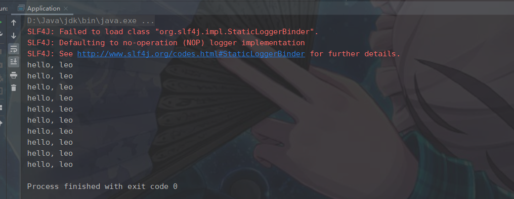

web服务

```java
@RestController
@RequestMapping("/greeting")
public class GreetingController {
	
	@GetMapping("/sayHello/{name}") 
	public String sayHello(@PathVariable("name") String name) {
		System.out.println("接收到了一次请求调用");   
		return "hello, " + name;
	}
	
}
```

web服务被调用结果：

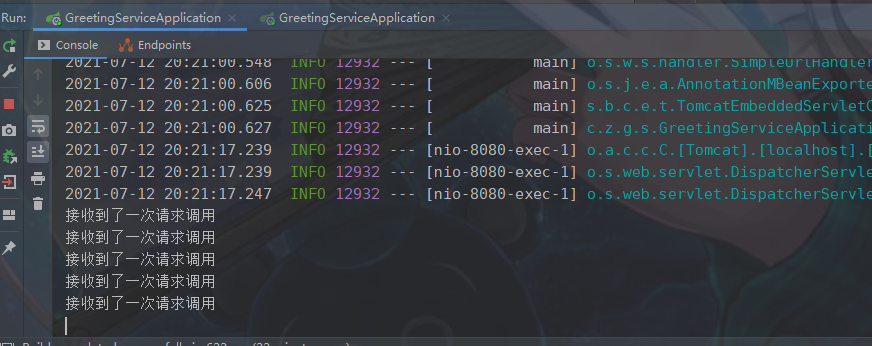

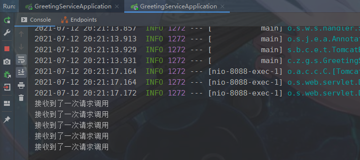

​	实验结果是什么呢？ribbon很棒，就是帮我们完成一个服务部署多个实例的时候，负载均衡的活儿，没问题，可以干到。10次请求，均匀分布在了两个服务实例上，每个服务实例承载了5次请求。

分布式系统的负载均衡调用图  :

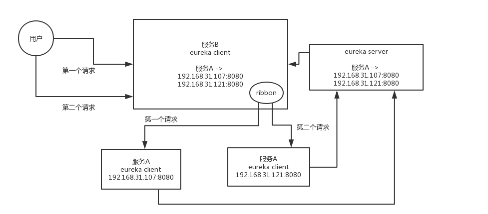

## 1.3 netflix ribbon的负载均衡器的原生接口以及内置的规则(rule)

### 1.3.1 样例及自定义负载均衡规则

​	默认使用round robin轮询策略，直接从服务器列表里轮询

RestClient内部，底层，就是基于默认的BaseLoadBalancer来选择一个server

```java
    public static void ruleTest(){
        BaseLoadBalancer balancer = new BaseLoadBalancer();
        balancer.setRule(new MyRule(balancer));

        List<Server> servers = new ArrayList<Server>();
        servers.add(new Server("localhost", 8080));
        servers.add(new Server("lolcalhost", 8088));
        balancer.addServers(servers);

        for(int i = 0; i < 10; i++) {
            Server server = balancer.chooseServer(null);
            System.out.println(server);
        }
    }	
```

ILoadBalancer负载均衡器，底层是基于IRule，负载均衡算法，规则，来从一堆服务器list中选择一个server出来

​	负载均衡器是基于一个IRule接口指定的负载均衡规则，来从服务器列表里获取每次要请求的服务器的，所以可以自定义负载均衡规则

**自定义负载均衡规则**

```java
//**自定义负载均衡规则**
public class MyRule implements IRule {

    ILoadBalancer balancer;

    public MyRule() {

    }

    public MyRule(ILoadBalancer balancer) {
        this.balancer = balancer;
    }

    //重写choose方法，实现负载均衡算法
    public Server choose(Object key) {
        List<Server> servers = balancer.getAllServers();
        //样例，总是选择第一个
        return servers.get(0);
    }

    @Override
    public void setLoadBalancer(ILoadBalancer iLoadBalancer) {
        this.balancer = iLoadBalancer;
    }

    @Override
    public ILoadBalancer getLoadBalancer() {
        return balancer;
    }

}
```

调用结果(总是选择第一个)：

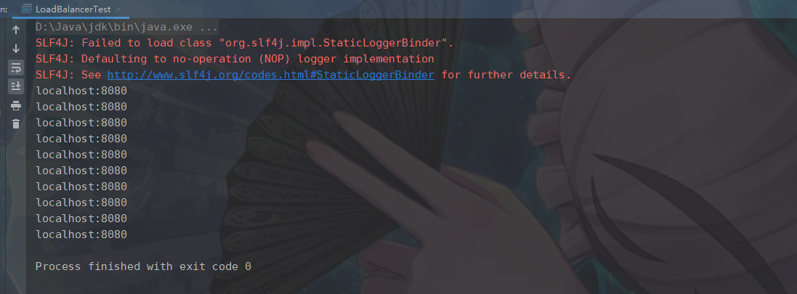

**总结：**

1 较少需要自己定制负载均衡算法的，除非是类似hash分发的那种场景，可以自己写个自定义的Rule，比如说，每次都根据某个请求参数，分发到某台机器上去。不过在分布式系统中，尽量减少这种需要hash分发的情况。

2 说这个，主要是，负载均衡的一些底层API罢了，主要是ILoadBalancer和IRule

3 但是如果在后面要把这里做的比较复杂的话，很有可能会站在一些内置的Rule的基础之上，吸收他们的源码，自己定制一个复杂的高阶的涵盖很多功能的负载均衡器

**PS:ribbon主打的就是负载均衡，网络通信，别的一些东西，都是次要，只要是看ribbon提供的各种负载均衡的算法的实现，另外一个是看ribbon + eureka + spring cloud如何整合使用的，看看ribbon源码里面去找比较重要的一些配置的参数**

### 1.3.2  ribbon内置负载均衡规则

**RoundRobinRule**：系统内置的默认负载均衡规范，直接round robin轮询，从一堆server list中，不断的轮询选择出来一个server，每个server平摊到的这个请求，基本上是平均的

**AvailabilityFilteringRule**：这个rule就是会考察服务器的可用性

​	如果3次连接失败，就会等待30秒后再次访问；如果不断失败，那么等待时间会不断边长

​	如果某个服务器的并发请求太高了，那么会绕过去，不再访问

**WeightedResponseTimeRule**：带着权重的，每个服务器可以有权重，权重越高优先访问，如果某个服务器响应时间比较长，那么权重就会降低，减少访问

**ZoneAvoidanceRule**：根据区域和服气来进行负载均衡，说白了，就是机房的意思

**BestAvailableRule**：忽略那些连接失败的服务器，然后尽量找并发比较低的服务器来请求

**RandomRule**：随机找一个服务器

**RetryRule**：可以重试，就是通过round robin找到的服务器请求失败，可以重新找一个服务器


## 1.4 ribbon原生API中用于定时ping服务器判断其是否存活的接口（ping）

负载均衡器里，就是ILoadBalancer里，有IRule负责负载均衡的规则，选择一个服务器；还有一个IPing负责定时ping每个服务器，判断其是否存活

```java
    public static void pingTest() throws InterruptedException {
        BaseLoadBalancer balancer = new BaseLoadBalancer();
        List<Server> servers = new ArrayList<Server>();
        servers.add(new Server("localhost", 8080));
        servers.add(new Server("localhost", 8088));
        balancer.addServers(servers);
        // http://localhost:8080/

        balancer.setPing(new MyPing());
        // 这里就会每隔1秒去请求那两个地址
        balancer.setPingInterval(1);
        Thread.sleep(5000);

        for(int i = 0; i < 10; i++) {
            Server server = balancer.chooseServer(null);
            System.out.println(server);
        }
    }
```

不过说实话，这块一般最好稍微做的那啥一点，用个类似/health的接口来表明自己的健康状况，可以自定义一个Ping组件

**自定义一个Ping组件**

```java
//**自定义一个Ping组件**
public class MyPing implements IPing {

    @Override
    public boolean isAlive(Server server) {
        System.out.println("ping:"+server.getHost()+":"+server.getHostPort());
        return true;
    }
}
```

调用结果(两个服务各每隔1秒ping一次)：

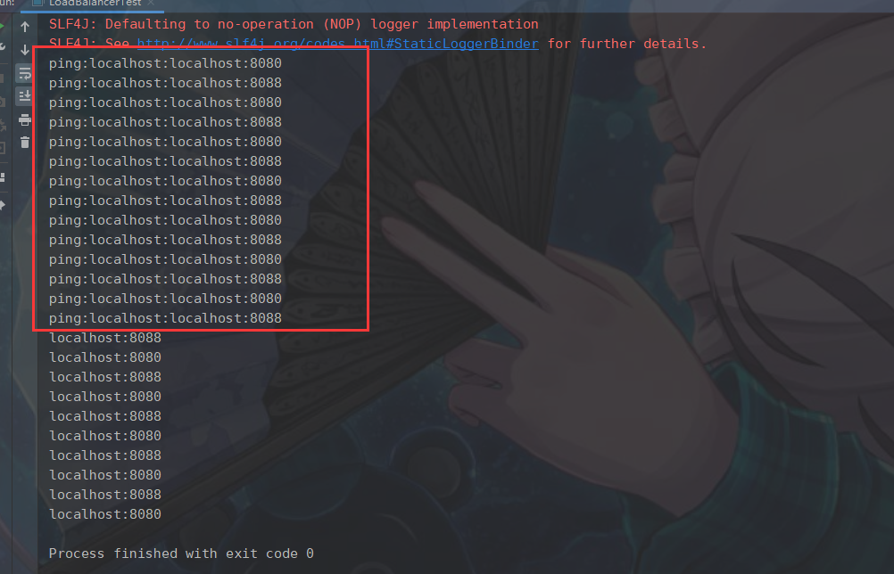


## 1.5 spring cloud环境中的Ribbon使用

​	说白了，就是用一个RestTemplate来访问别的服务，RestTemplate本身很简单，就是一个http请求的组件，本身没什么负载均衡的功能，他就是指定一个url，就访问这个url就得了。但是这里用@LoadBalanced注解之后，默认底层就会用ribbon实现负载均衡了。

​	很简单的道理，这里肯定是RestTemplate底层会去基于ribbon来对一个服务的service list进行负载均衡式的访问。那service list是从哪儿拿到的？ribbon和eureka整合起来使用了，在这个ribbon里，肯定server list是从eureka client里拿到的，对吧，人家本地不是缓存了完整的注册表么？

 然后呢，请求一个服务的时候，就找那个服务对应的server list，round robin轮询一下

**eureka client服务调用的样例代码：**

```java
@LoadBalanced
@Bean
public RestTemplate getRestTemplate() {
	return new RestTemplate();
}
```

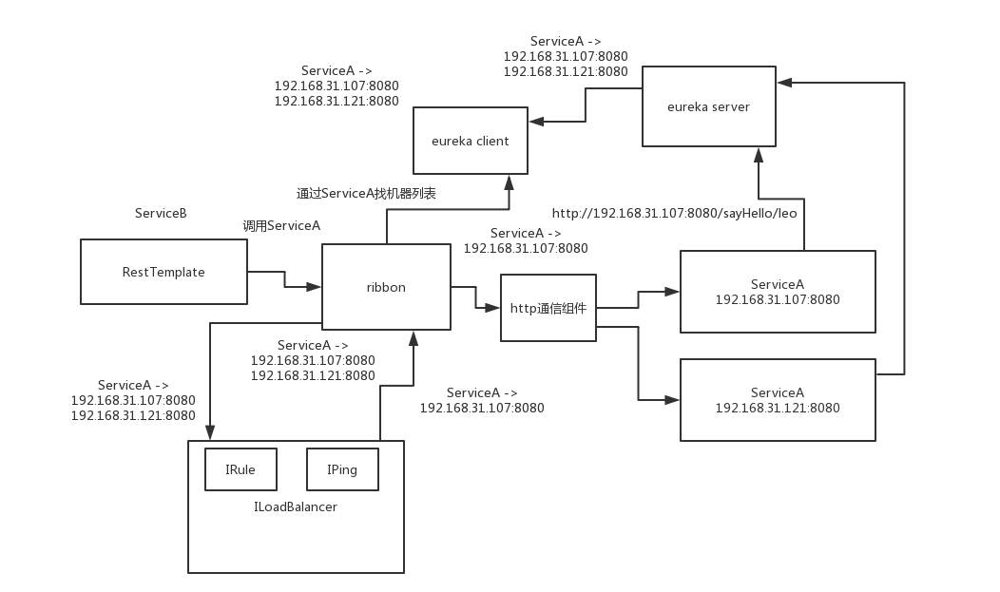

如果要对ribbon装配自己的负载均衡规则和ping规则，就可以这样来搞：

 配置自定义的Rule及Ping,然后通过配置类加载

```java
public class MyConfiguration {
    @Bean
    public IRule getRule() {
        return new MyRule();
    }
 
    @Bean
    public IPing getPing() {
        return new MyPing();
    }
}
 
@RibbonClient(name = “ServiceB”, configuration = MyConfiguration.class)
public class ServiceBConfiguration {
 
}
```


## 1.6 ribbon流程图

​	RestTemplate，请求：http://localhost:8080/sayHello，如果给：http://ServiceA/sayHello，RestTemplate绝对100%报错，因为你里面搞了一个ServiceA，他是一个服务名称，不是ip地址和主机名，也没有端口号，根本没法请求这个东西

​	ILoadBalancer里面包含IRule和IPing，IRule负责从一堆server list中根据负载均衡的算法，选择出来某个server，关键是，server list从哪儿来？

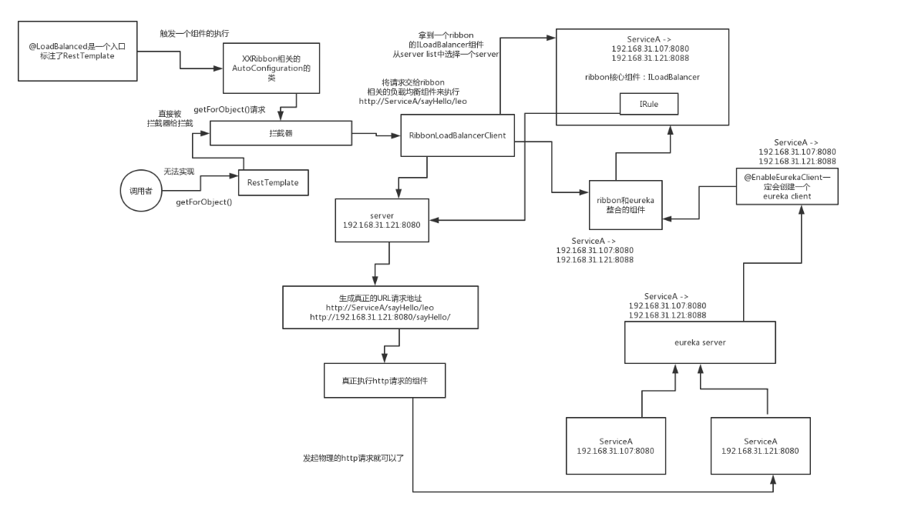

## 1.7 ribbon核心组件

**ribbon比较重要的几个API，RestClient(spring cloud为LoadBalancerClient)、ILoadBalancer、IRule、IPing**

# 2 ribbon入口源码解读

## 2.1 通过LoadBalanced注解作为突破口来找找线索

这个注解的意思，其实说什么呢？将一个RestTemplate标志为底层采用LoadBalancerClient来执行实际的http请求，支持负载均衡

```java
	//LoadBalanced属于org.springframework.cloud.client.loadbalancer包下
	//属于spring-clound-commons这个项目
	@Bean
	@LoadBalanced
	public RestTemplate getRestTemplate() {
		return new RestTemplate();
	}
```

LoadBalanced注解

```java
@Target({ ElementType.FIELD, ElementType.PARAMETER, ElementType.METHOD })
@Retention(RetentionPolicy.RUNTIME)
@Documented
@Inherited
@Qualifier
public @interface LoadBalanced {
}

```

对应类，及包中相关类

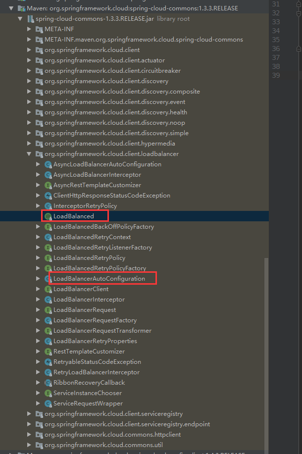

一般来说，如果是spring cloud或者是spring boot相关的项目，一定会有一个XXAutoConfiguraiton的一个东西

有 AsyncLoadBalancerAutoConfiguration 及**LoadBalancerAutoConfiguration** 相关类后缀为AutoConfiguation

 AsyncLoadBalancerAutoConfiguration 一看就是为支持异步负载均衡请求相关类，目前没有涉及到异步请求，所以只需关注LoadBalancerAutoConfiguration即可

**LoadBalancerAutoConfiguration类：**Ribbon配置加载核心类

```java
@Configuration
@ConditionalOnClass(RestTemplate.class)
@ConditionalOnBean(LoadBalancerClient.class)
@EnableConfigurationProperties(LoadBalancerRetryProperties.class)
public class LoadBalancerAutoConfiguration {

	@LoadBalanced
	@Autowired(required = false)
	private List<RestTemplate> restTemplates = Collections.emptyList();

    //SmartInitializingSingleton一看就是初始化相关的东西，就是在系统启动的时候，一定会在某个时机来执行的
	@Bean
	public SmartInitializingSingleton loadBalancedRestTemplateInitializer(
			final List<RestTemplateCustomizer> customizers) {
		return new SmartInitializingSingleton() {
            
            //afterSingletonsInstantiated()这个方法，一看就是在spring singleton bean实例化完了之后来执行的
			@Override
			public void afterSingletonsInstantiated() {
                //RestTemplate list是从哪儿来的呢？是LoadBalanced对应注解方法中实例化返回的RestTemplate
                ///RestTemplate list加载涉及到spring及spring boot相关源码知识，这里就不做展开了
				for (RestTemplate restTemplate : LoadBalancerAutoConfiguration.this.restTemplates) {
					for (RestTemplateCustomizer customizer : customizers) {
                        //Cutomizer（专门用来定制化RestTemplate的组件）,用每个Customizer来定制每个RestTemplate
						customizer.customize(restTemplate);
					}
				}
			}
		};
	}

	@Autowired(required = false)
	private List<LoadBalancerRequestTransformer> transformers = Collections.emptyList();

	@Bean
	@ConditionalOnMissingBean
	public LoadBalancerRequestFactory loadBalancerRequestFactory(
			LoadBalancerClient loadBalancerClient) {
        //初始化，实例化 LoadBalancerRequestFactory
		return new LoadBalancerRequestFactory(loadBalancerClient, transformers);
	}

	@Configuration
	@ConditionalOnMissingClass("org.springframework.retry.support.RetryTemplate")
	static class LoadBalancerInterceptorConfig {
		@Bean
		public LoadBalancerInterceptor ribbonInterceptor(
				LoadBalancerClient loadBalancerClient,
				LoadBalancerRequestFactory requestFactory) {
            //设置的那个拦截器，很明显就是LoadBalancerInterceptor
            //初始化，实例化 LoadBalancerInterceptor
			return new LoadBalancerInterceptor(loadBalancerClient, requestFactory);
		}

		@Bean
		@ConditionalOnMissingBean
		public RestTemplateCustomizer restTemplateCustomizer(
				final LoadBalancerInterceptor loadBalancerInterceptor) {/
            //RestTemplateCustomizer，一看就是专门对RestTemplate进行定制化的一个组件
			return new RestTemplateCustomizer() {
				@Override
				public void customize(RestTemplate restTemplate) {
					List<ClientHttpRequestInterceptor> list = new ArrayList<>(
							restTemplate.getInterceptors());
                    //list里放了一个ClientHttpRequestInterceptor，interceptor，拦截器，给RestTemplate设置了一个拦截器
					list.add(loadBalancerInterceptor);
					restTemplate.setInterceptors(list);
				}
			};
		}
	}

........................................


}

```

**总结：**

（1）@LoadBalanced注解入手，线索直接断掉

（2）给大家一个经验技巧，从这个注解所在的项目和包下面入手，来找找相关的东西，有什么线索

（3）spring boot和spring cloud相关的类，你别想多了，直接找XXXAutoConfiguraiton的类，就知道是怎么回事

（4）找到了这个LoadBalancerAutoConfiguration，在这个类里面就有了重大的突破

（5）里面有一个List<RestTemplate>，推测就是我们创建的那个RestTemplate会放到这里来

（6）用这个RestTemplateCustomizer对每个RestTemplate进行了定制化，给每个RestTemplate设置了interceptor

（7）具体是哪个interceptor呢？LoadBalancerInterceptor，拦截器

流程图：

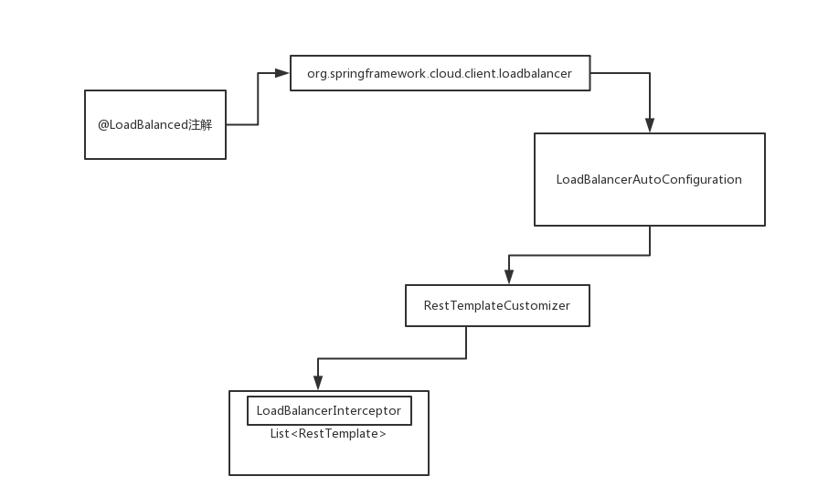

## 2.2 spring cloud通过拦截器机制改变了RestTemplate的行为

拦截器是干嘛用的? 就是如果你对一个东西发起一个请求，那么会被拦截器给拦截掉，由拦截器先来处理一下

​	如果我们对RestTemplate执行某个操作，比如说restTemplate.getForObject()操作，相当于是希望发起一个http请求，请求一个服务的接口，**此时不会由RestTemplate自己原生的功能来实现**

**而是会由拦截器来实现这个请求http服务的一个功能**

```java
public class LoadBalancerInterceptor implements ClientHttpRequestInterceptor {

	private LoadBalancerClient loadBalancer;
	private LoadBalancerRequestFactory requestFactory;

	public LoadBalancerInterceptor(LoadBalancerClient loadBalancer, LoadBalancerRequestFactory requestFactory) {
		this.loadBalancer = loadBalancer;
		this.requestFactory = requestFactory;
	}

	public LoadBalancerInterceptor(LoadBalancerClient loadBalancer) {
		// for backwards compatibility
		this(loadBalancer, new LoadBalancerRequestFactory(loadBalancer));
	}

    //在执行下面那行intercept的时候，其实是将这个请求给封装了一下，将http://ServiceA/sayHello/封装到了HttpRequest里面去
    //intercept(拦截)
    //然后将HttpRequest加上其他的一些组件和数据，比如说byte[] body
    //如果你发送请求的时候，带上了一个json串，一定是放请求体里面的，请求体里面的json串就会作为byte[] body传进来
    //ClientHttpRequestExecution（是负责底层的http通信的组件）
	@Override
	public ClientHttpResponse intercept(final HttpRequest request, final byte[] body,
			final ClientHttpRequestExecution execution) throws IOException {
        //获取到的就是：http://ServiceA/sayHello/leo对应URI
		final URI originalUri = request.getURI();
        //获取到的就是：ServiceA
        //serviceName，服务名称，就是获取到的那个ServiceA
		String serviceName = originalUri.getHost();
        //如果你的获取到的服务名称是null，那么就打印异常日志，告诉你，你的请求的url地址里面没有包含合格的hostname主机名
		Assert.state(serviceName != null, "Request URI does not contain a valid hostname: " + originalUri);
        //最终执行了LoadBalancerClient的execute方法 PS:2.3
		return this.loadBalancer.execute(serviceName, requestFactory.createRequest(request, body, execution));
	}
}
```

**方法调用与拦截器**

```java
restTemplate.getForObject("http://ServiceA/sayHello/leo", String.class);

//相当于是底层调用了拦截器里的intercept()方法，实际的这个请求的逻辑，不再由RestTemplate原来原生的默认的逻辑来实现，而是由intercept()拦截方法来实现了
```

**总结：**

1 梳理清楚了一个东西：LoadBalancerInterceptor，拦截掉RestTemplate所有的执行的请求，

2 这个内部就干一件事儿，就是从你的url地址里获取hostname作为服务名称，就是你要请求的服务的名称，

3 就是找LoadBalancerClient去执行	对应的负载均衡的请求，将解析出来的服务名称穿进去，

4 还有就是基于RequestFactory创建出来的一个request

流程图：

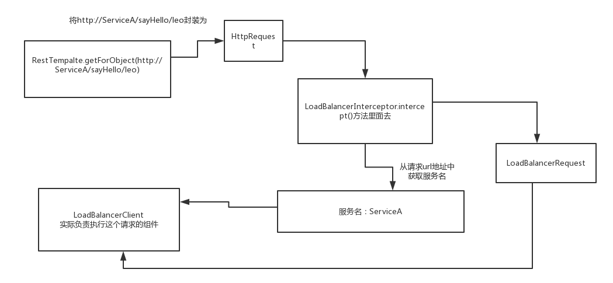

**流程图整合（2.1-2.2 LoadBlanceled注解是如何改变RestTemplate行为的）：**

https://www.processon.com/view/link/60f2996df346fb3f34141685

## 2.3 LoadBalancerClient是从哪来的(具体实例化代码及相关实现)

对应代码都在 spring-cloud-netflix-core这个包里面

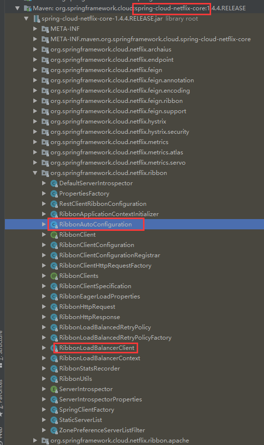

LoadBalancerClient是一个接口，所以需要一个实现类来实例化相关操作，RibbonLoadBalancerClient就是实现类

而在RibbonAutoConfiguation就是将RibbonLoadBalancerClient实例化Bean

```java
//AutoConfigureAfter注解(after)明确说明了，这个RibbonAutoConfiguraion，是在EurekaClientAutoConfiguration之后来执行的，也就是说eureka必须先初始化完，才会轮到ribbon来初始化
//AutoConfigureBefore(before),这个RibbonAutoConfiguration，必须在之前看的那个LoadBalancerAutoConfiguration之前来执行，LoadBalancerAutoConfiguration触发的一些列的代码，是依赖于LoadBalancerClient的
@Configuration
@ConditionalOnClass({ IClient.class, RestTemplate.class, AsyncRestTemplate.class, Ribbon.class})
@RibbonClients
@AutoConfigureAfter(name = "org.springframework.cloud.netflix.eureka.EurekaClientAutoConfiguration")
@AutoConfigureBefore({LoadBalancerAutoConfiguration.class, AsyncLoadBalancerAutoConfiguration.class})
@EnableConfigurationProperties({RibbonEagerLoadProperties.class, ServerIntrospectorProperties.class})
public class RibbonAutoConfiguration {
............................
	@Bean
	@ConditionalOnMissingBean(LoadBalancerClient.class)
	public LoadBalancerClient loadBalancerClient() {
		return new RibbonLoadBalancerClient(springClientFactory());
	}
................

}
```

扩展-ribbon相关包说明：

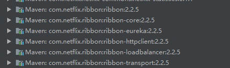

（1）ribbon-2.2.5.jar：理解为ribbon的内核级别的比较核心的一些组件

（2）ribbon-transport-2.2.5.jar：基于netty封装的特别底层的进行http、tcp、udp各种协议的网络通信的组件

（3）ribbon-core-2.2.5.jar：推测这是ribbon比较基础性的一些通用的代码组件

（4）ribbon-httpclient-2.2.5.jar：是ribbon底层的http网络通信的一些组件

（5）ribbon-loadbalancer-2.2.5.jar：都是ribbon最最核心的原生的API

**PS:最终会发现，在LoadBalancerInterceptor拦截器里，会将RestTemplate的方法和请求转发给RibbonLoadBalancerClient.execute()方法去执行**


## 2.4 核心代码LoadBalancerClient.execute(对spring cloud整合ribbon源码的初步调试)

调试下execute方法，查看负载均衡效果

```java
public class RibbonLoadBalancerClient implements LoadBalancerClient {
	@Override
	public <T> T execute(String serviceId, LoadBalancerRequest<T> request) throws IOException {
        //getLoadBalancer获取ILoadBalancer PS:2.5
		ILoadBalancer loadBalancer = getLoadBalancer(serviceId);
        //getServer就是获取负载均衡后真正调用的服务
		Server server = getServer(loadBalancer);
		if (server == null) {
			throw new IllegalStateException("No instances available for " + serviceId);
		}
		RibbonServer ribbonServer = new RibbonServer(serviceId, server, isSecure(server,
				serviceId), serverIntrospector(serviceId).getMetadata(server));

		return execute(serviceId, ribbonServer, request);
	}
}
```

第一次：

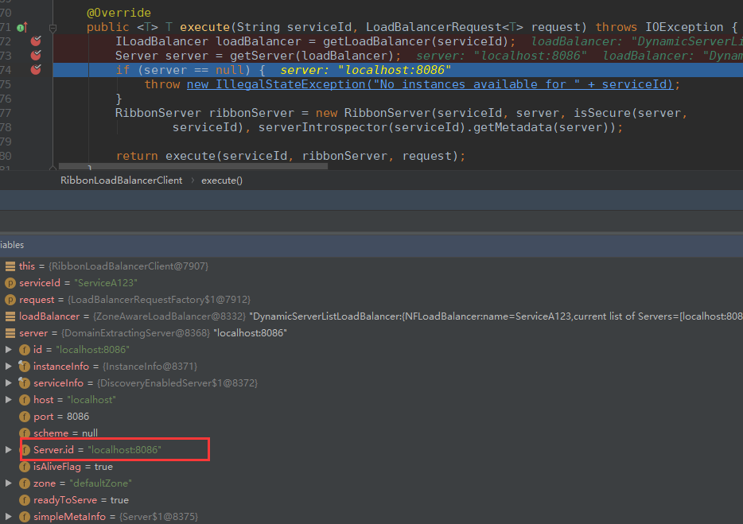

第二次：


通过断点调试得知LoadBalancerClient获取server方法通过了负载均衡的方式获取具体地址请求

## 2.5 spring cloud与ribbon整合时的默认ILoadBalancer(怎么获取到的)

核心入口：RibbonLoadBalancerClient

先来研究第一步：如何创建ILoadBalancer的，使用功能的是哪个ILoadBalancer呢？

```java
public class RibbonLoadBalancerClient implements LoadBalancerClient {
    
    //这块一定是对spring进行了一定程度上的封装，封装了一些东西，从spring里面获取bean的入口，都变成了这个spring cloud ribbon自己的SpringClientFactory
	private SpringClientFactory clientFactory;

    //我根据一个服务名，serviceId，类似ServiceA这样的一个服务名称
	protected ILoadBalancer getLoadBalancer(String serviceId) {
		return this.clientFactory.getLoadBalancer(serviceId);
	}
}

public class SpringClientFactory extends NamedContextFactory<RibbonClientSpecification> {
    public ILoadBalancer getLoadBalancer(String name) {
		return getInstance(name, ILoadBalancer.class);
	}
    
    @Override
	public <C> C getInstance(String name, Class<C> type) {
		C instance = super.getInstance(name, type);
		if (instance != null) {
			return instance;
		}
		IClientConfig config = getInstance(name, IClientConfig.class);
		return instantiateWithConfig(getContext(name), type, config);
	}
}

public abstract class NamedContextFactory<C extends NamedContextFactory.Specification>
		implements DisposableBean, ApplicationContextAware {
    
    //存放对应服务的map
    private Map<String, AnnotationConfigApplicationContext> contexts = new ConcurrentHashMap<>();
    
  	public <T> T getInstance(String name, Class<T> type) {
		AnnotationConfigApplicationContext context = getContext(name);
		if (BeanFactoryUtils.beanNamesForTypeIncludingAncestors(context,
				type).length > 0) {
			return context.getBean(type);
		}
		return null;
	}
    
    //就是说，对每个服务名称，你要调用的每个服务，对应着服务名称，都有一个对应的spring的ApplicationContext容器，ServiceA对应着一个自己的独立的spring的ApplicationContext容器
    protected AnnotationConfigApplicationContext getContext(String name) {
		if (!this.contexts.containsKey(name)) {
			synchronized (this.contexts) {
				if (!this.contexts.containsKey(name)) {
					this.contexts.put(name, createContext(name));
				}
			}
		}
		return this.contexts.get(name);
	}
}
```

​	很明确了，在SpringClientFactory里面，一个服务（比如说ServiceA） => 对应着一个独立的ApplicationContext，

​	里面包含了自己这个服务的独立的一堆的组件，比如说LoadBalancer。如果要获取一个服务对应的LoadBalancer，

​	**其实就是在自己的那个ApplicationContext里面去获取那个LoadBalancer即可。根据ILoadBalancer接口类型，获取一个ILoadBalancer接口类型的实例化的bean即可**

​	**RibbonClientConfiguration：在这个里面可以找到对应的ILoadBalancer的实例bean**

```java
@Configuration
@EnableConfigurationProperties
//Order is important here, last should be the default, first should be optional
// see https://github.com/spring-cloud/spring-cloud-netflix/issues/2086#issuecomment-316281653
@Import({HttpClientConfiguration.class, OkHttpRibbonConfiguration.class, RestClientRibbonConfiguration.class, HttpClientRibbonConfiguration.class})
public class RibbonClientConfiguration {
	@Bean
	@ConditionalOnMissingBean
	public ILoadBalancer ribbonLoadBalancer(IClientConfig config,
			ServerList<Server> serverList, ServerListFilter<Server> serverListFilter,
			IRule rule, IPing ping, ServerListUpdater serverListUpdater) {
		if (this.propertiesFactory.isSet(ILoadBalancer.class, name)) {
			return this.propertiesFactory.get(ILoadBalancer.class, config, name);
		}
        //由此可见ZoneAwareLoadBalancer就是对应对应的ILoadBalancer的实例bean(实现类)
        //ZoneAwareLoadBalancer的父类是：DynamicServerListLoadBalancer，他的父类又是：BaseLoadBalancer
		return new ZoneAwareLoadBalancer<>(config, rule, ping, serverList,
				serverListFilter, serverListUpdater);
	}
}
```

​	**PS:如果你要找一个bean，要么就在XXAutoConfiguration里面找，要么就是在XXConfiguration里面找。。。spring cloud或者是spring boot的项目的一个特点，去找bean**

**流程图：**

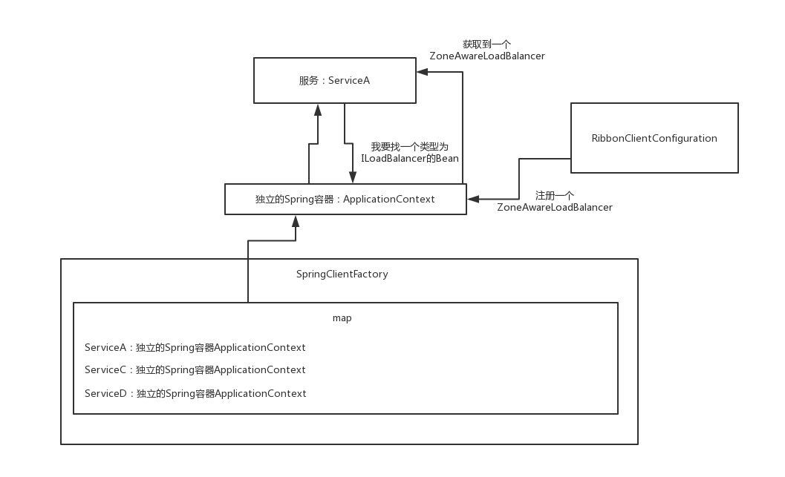

## 2.6 ribbon通过和eureka整合获取服务注册表

**LoadBalancer->ZoneAwareLoadBalancer**

​	LoadBalancer内部，必须要去获取到当前要访问的这个服务的server list。访问一个服务，那么就要获取一个LoadBalancer实例，**在LoadBalancer实例内部，必须是有这个服务的server list**。

​	这样的话，才知道如何对这个服务进行负载均衡的访问

```java
public class ZoneAwareLoadBalancer<T extends Server> extends DynamicServerListLoadBalancer<T> {
    
    //这个ServerList是一个接口
    public ZoneAwareLoadBalancer(IClientConfig clientConfig, IRule rule,
                                 IPing ping, ServerList<T> serverList, ServerListFilter<T> filter,
                                 ServerListUpdater serverListUpdater) {
        super(clientConfig, rule, ping, serverList, filter, serverListUpdater);
    }
}
```

​	1 在创建ZoneAwareLoadBalancer实例的时候，通过调用其父类DynamicServerListLoadBalancer的构造函数，调用了restOfInit()方法，调用了**updateListOfServers()方法**，

​	2 通过这个方法，从eureka client那里获取到ServiceA的server list

​	3 将获取到的serverList更新到父类BaseLoadBalancer的属性中

```java
public class DynamicServerListLoadBalancer<T extends Server> extends BaseLoadBalancer {
    
    //存放ServerList接口的实例
    volatile ServerList<T> serverListImpl;
    
    public DynamicServerListLoadBalancer(IClientConfig clientConfig, IRule rule, IPing ping,
                                         ServerList<T> serverList, ServerListFilter<T> filter,
                                         ServerListUpdater serverListUpdater) {
        super(clientConfig, rule, ping);
        //将传进来的ServerList赋给成员变量
        this.serverListImpl = serverList;
        this.filter = filter;
        this.serverListUpdater = serverListUpdater;
        if (filter instanceof AbstractServerListFilter) {
            ((AbstractServerListFilter) filter).setLoadBalancerStats(getLoadBalancerStats());
        }
        restOfInit(clientConfig);
    }
    
    void restOfInit(IClientConfig clientConfig) {
        boolean primeConnection = this.isEnablePrimingConnections();
        // turn this off to avoid duplicated asynchronous priming done in BaseLoadBalancer.setServerList()
        this.setEnablePrimingConnections(false);
        //初始化注册表更新线程
        enableAndInitLearnNewServersFeature();
		//更新server list
        updateListOfServers();
        if (primeConnection && this.getPrimeConnections() != null) {
            this.getPrimeConnections()
                    .primeConnections(getReachableServers());
        }
        this.setEnablePrimingConnections(primeConnection);
        LOGGER.info("DynamicServerListLoadBalancer for client {} initialized: {}", clientConfig.getClientName(), this.toString());
    }
    
    @VisibleForTesting
    public void updateListOfServers() {
        List<T> servers = new ArrayList<T>();
        if (serverListImpl != null) {
            //通过这个方法，从eureka client那里获取到ServiceA的server list
            servers = serverListImpl.getUpdatedListOfServers();
            LOGGER.debug("List of Servers for {} obtained from Discovery client: {}",
                    getIdentifier(), servers);

            if (filter != null) {
                servers = filter.getFilteredListOfServers(servers);
                LOGGER.debug("Filtered List of Servers for {} obtained from Discovery client: {}",
                        getIdentifier(), servers);
            }
        }
        //将获取到的serverList更新到父类BaseLoadBalancer的属性中
        updateAllServerList(servers);
    }
}
```

我现在需要去**找ServerList的具体实例化代码**，他的getUpdatedListOfServers的方法的实现，**就是从erueka那儿获取服务的注册列表的实现代码**

在spring-cloud-netflix-eureka-client工程下

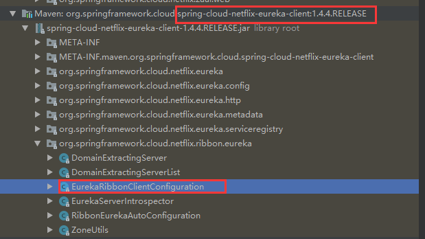

**真正实例化ServerList的代码(获取eureka注册表的serverList)**

**PS:初始化ZoneAwareLoadBalancer的RibbonClientConfiguration配置类里，也有个ServerList的bean,但是该bean是根据配置文件获取serverList的bean(ConfigurationBasedServerList)，并不是获取eureka注册表的serverList**

```java
@Configuration
public class EurekaRibbonClientConfiguration {
    
    //真正实例化ServerList的代码
	@Bean
	@ConditionalOnMissingBean
	public ServerList<?> ribbonServerList(IClientConfig config, Provider<EurekaClient> eurekaClientProvider) {
		if (this.propertiesFactory.isSet(ServerList.class, serviceId)) {
			return this.propertiesFactory.get(ServerList.class, config, serviceId);
		}
		DiscoveryEnabledNIWSServerList discoveryServerList = new DiscoveryEnabledNIWSServerList(
				config, eurekaClientProvider);
        //DomainExtractingServerList为真正获取eureka注册表的serverList
		DomainExtractingServerList serverList = new DomainExtractingServerList(
				discoveryServerList, config, this.approximateZoneFromHostname);
		return serverList;
	}
}
```

​	就在obtainServersViaDiscovery()方法里面，我们发现了一堆euerka的代码，**从eureka client中获取到注册表，从注册表里可以获取到当前这个服务的ServiceA对应的server list**

```java
public class DomainExtractingServerList implements ServerList<DiscoveryEnabledServer> {
    
    //ServerList赋值成员变量
	private ServerList<DiscoveryEnabledServer> list;

	private IClientConfig clientConfig;

	private boolean approximateZoneFromHostname;

    //传进来的ServerList
	public DomainExtractingServerList(ServerList<DiscoveryEnabledServer> list,
			IClientConfig clientConfig, boolean approximateZoneFromHostname) {
		this.list = list;
		this.clientConfig = clientConfig;
		this.approximateZoneFromHostname = approximateZoneFromHostname;
	}
	
	@Override
	public List<DiscoveryEnabledServer> getUpdatedListOfServers() {
        //this.list才是真正执行getUpdatedListOfServers逻辑
		List<DiscoveryEnabledServer> servers = setZones(this.list
				.getUpdatedListOfServers());
		return servers;
	}
}

public class DiscoveryEnabledNIWSServerList extends AbstractServerList<DiscoveryEnabledServer>{
    
    String vipAddresses;
    
    @Override
    public List<DiscoveryEnabledServer> getUpdatedListOfServers(){
        return obtainServersViaDiscovery();
    }

    //真正获取ServerList的逻辑
    private List<DiscoveryEnabledServer> obtainServersViaDiscovery() {
        List<DiscoveryEnabledServer> serverList = new ArrayList<DiscoveryEnabledServer>();

        if (eurekaClientProvider == null || eurekaClientProvider.get() == null) {
            logger.warn("EurekaClient has not been initialized yet, returning an empty list");
            return new ArrayList<DiscoveryEnabledServer>();
        }
		//获取EurekaClent
        EurekaClient eurekaClient = eurekaClientProvider.get();
        //vipAddresses就是服务名(ServiceA)
        if (vipAddresses!=null){
            for (String vipAddress : vipAddresses.split(",")) {
                // if targetRegion is null, it will be interpreted as the same region of client
                //getInstancesByVipAddress通过eurekaClient相关方法获取服务实例(注册表)
                List<InstanceInfo> listOfInstanceInfo = eurekaClient.getInstancesByVipAddress(vipAddress, isSecure, targetRegion);
                for (InstanceInfo ii : listOfInstanceInfo) {
                    if (ii.getStatus().equals(InstanceStatus.UP)) {

                        if(shouldUseOverridePort){
                            if(logger.isDebugEnabled()){
                                logger.debug("Overriding port on client name: " + clientName + " to " + overridePort);
                            }

                            // copy is necessary since the InstanceInfo builder just uses the original reference,
                            // and we don't want to corrupt the global eureka copy of the object which may be
                            // used by other clients in our system
                            InstanceInfo copy = new InstanceInfo(ii);

                            if(isSecure){
                                ii = new InstanceInfo.Builder(copy).setSecurePort(overridePort).build();
                            }else{
                                ii = new InstanceInfo.Builder(copy).setPort(overridePort).build();
                            }
                        }
					//从注册表获取对应服务(ServerA)的serverList
                        DiscoveryEnabledServer des = new DiscoveryEnabledServer(ii, isSecure, shouldUseIpAddr);
                        des.setZone(DiscoveryClient.getZone(ii));
                        serverList.add(des);
                    }
                }
                if (serverList.size()>0 && prioritizeVipAddressBasedServers){
                    break; // if the current vipAddress has servers, we dont use subsequent vipAddress based servers
                }
            }
        }
        return serverList;
    }
}
```

**总结：**

​	1 在创建ZoneAwareLoadBalancer实例的时候，通过调用其父类DynamicServerListLoadBalancer的构造函数，调用了restOfInit()方法，调用了updateListOfServers()方法，

​	2 通过这个方法，从eureka client那里获取到ServiceA的server list

​	3 将获取到的serverList更新到父类BaseLoadBalancer的属性中

**流程图：**

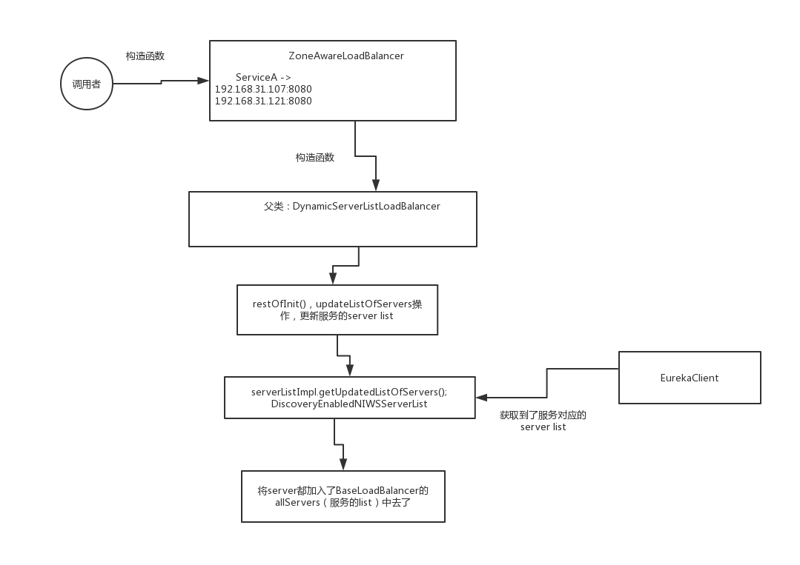

**完整流程图（2.5-2.6 如何获取到LoadBalancer及其注册表 ）：**

https://www.processon.com/view/link/60f2c66a0e3e74539274f88c

## 2.7 ribbon的服务注册表更新机制

​	eureka client自己本身，是不断的去从eureka server每隔30秒更新一次注册表，拉取增量注册表，所以说ribbon和eureka整合的机制里，肯定得有一个组件，负责每隔一定的时间，从本地的eureka client里刷新一下服务的注册表到LoadBalancer中

```java
public class DynamicServerListLoadBalancer<T extends Server> extends BaseLoadBalancer {
    
    protected volatile ServerListUpdater serverListUpdater;
    
    public DynamicServerListLoadBalancer(IClientConfig clientConfig, IRule rule, IPing ping,
                                         ServerList<T> serverList, ServerListFilter<T> filter,
                                         ServerListUpdater serverListUpdater) {
        super(clientConfig, rule, ping);
        this.serverListImpl = serverList;
        this.filter = filter;
        //构造传入serverListUpdater
        this.serverListUpdater = serverListUpdater;
        if (filter instanceof AbstractServerListFilter) {
            ((AbstractServerListFilter) filter).setLoadBalancerStats(getLoadBalancerStats());
        }
        restOfInit(clientConfig);
    }
    
    //UpdateAction更新注册表相关
    protected final ServerListUpdater.UpdateAction updateAction = new ServerListUpdater.UpdateAction() {
        @Override
        public void doUpdate() {
            //调用真正的更新方法
            updateListOfServers();
        }
    };
    
    //更新注册表
    @VisibleForTesting
    public void updateListOfServers() {
        List<T> servers = new ArrayList<T>();
        if (serverListImpl != null) {
            //获取注册表
            servers = serverListImpl.getUpdatedListOfServers();
            LOGGER.debug("List of Servers for {} obtained from Discovery client: {}",
                    getIdentifier(), servers);

            if (filter != null) {
                servers = filter.getFilteredListOfServers(servers);
                LOGGER.debug("Filtered List of Servers for {} obtained from Discovery client: {}",
                        getIdentifier(), servers);
            }
        }
        //更新注册表
        updateAllServerList(servers);
    }
    
    void restOfInit(IClientConfig clientConfig) 
        boolean primeConnection = this.isEnablePrimingConnections();
        // turn this off to avoid duplicated asynchronous priming done in BaseLoadBalancer.setServerList()
        this.setEnablePrimingConnections(false);
        //初始化注册表更新线程
        enableAndInitLearnNewServersFeature();
...............................
    public void enableAndInitLearnNewServersFeature() {
        LOGGER.info("Using serverListUpdater {}", serverListUpdater.getClass().getSimpleName());
    	//这里由serverListUpdater将updateAction放入start方法,初始化定时任务
        serverListUpdater.start(updateAction);
    }
}
```

ServerListUpdater是谁呢？在RibbonClientConfiguration中实例化bean，并传进来的

```java
@Configuration
@EnableConfigurationProperties
//Order is important here, last should be the default, first should be optional
// see https://github.com/spring-cloud/spring-cloud-netflix/issues/2086#issuecomment-316281653
@Import({HttpClientConfiguration.class, OkHttpRibbonConfiguration.class, RestClientRibbonConfiguration.class, HttpClientRibbonConfiguration.class})
public class RibbonClientConfiguration {

	@Bean
	@ConditionalOnMissingBean
	public ServerListUpdater ribbonServerListUpdater(IClientConfig config) {
		return new PollingServerListUpdater(config);
	}
}
```

​	在PollingServerListUpdater中，创建了一个Runnable线程，里面就是执行UpdateAction的行为,在延迟一定的时间过后，每隔一定的时间就执行一下那个Runnable线程，就会执行UpdateAction中的操作来刷新注册表，从eureka client中获取注册表，然后刷新到LoadBalancer中去

​	默认的是1秒钟过后，会第一次执行那个Runnable线程，以后是每隔30秒执行一下那个Runnable线程，就去从eureka client刷新注册表到自己的ribbon的LoadBalancer中来

```java
public class PollingServerListUpdater implements ServerListUpdater {
    @Override
    public synchronized void start(final UpdateAction updateAction) {
        if (isActive.compareAndSet(false, true)) {
            final Runnable wrapperRunnable = new Runnable() {
                @Override
                public void run() {
                    if (!isActive.get()) {
                        if (scheduledFuture != null) {
                            scheduledFuture.cancel(true);
                        }
                        return;
                    }
                    try {
                        //线程调用对应action的更新注册表方法
                        updateAction.doUpdate();
                        lastUpdated = System.currentTimeMillis();
                    } catch (Exception e) {
                        logger.warn("Failed one update cycle", e);
                    }
                }
            };
			//默认的是1秒钟过后，会第一次执行那个Runnable线程，以后是每隔30秒执行一下那个Runnable线程
            scheduledFuture = getRefreshExecutor().scheduleWithFixedDelay(
                    wrapperRunnable,
                	//默认1000ms,1秒
                    initialDelayMs,
                	//默认30*1000ms,30秒
                    refreshIntervalMs,
                    TimeUnit.MILLISECONDS
            );
        } else {
            logger.info("Already active, no-op");
        }
    }
}
```

**流程图：**

https://www.processon.com/view/link/60f2f3e0637689739c3b30c0

## 2.8 spring cloud与ribbon整合时的默认负载均衡算法如何选择一个server

​	通过LoadBalancer从一个服务对应的server list中选择一个server出来，保持负载均衡，将请求均匀的打到各个服务器上去

​	LoadBalancer的chooseServer()方法，通过自己内置的负载均衡算法，选择一个server出来

```java
public class RibbonLoadBalancerClient implements LoadBalancerClient {
	@Override
	public <T> T execute(String serviceId, LoadBalancerRequest<T> request) throws IOException {
		ILoadBalancer loadBalancer = getLoadBalancer(serviceId);
        //getServer选择一个server
		Server server = getServer(loadBalancer);
		if (server == null) {
			throw new IllegalStateException("No instances available for " + serviceId);
		}
		RibbonServer ribbonServer = new RibbonServer(serviceId, server, isSecure(server,
				serviceId), serverIntrospector(serviceId).getMetadata(server));

		return execute(serviceId, ribbonServer, request);
	}
    
    protected Server getServer(ILoadBalancer loadBalancer) {
		if (loadBalancer == null) {
			return null;
		}
        //这里的loadBlancer是ZoneAwareLoadBalancer
		return loadBalancer.chooseServer("default"); // TODO: better handling of key
	}
}
```

​	ZoneAwareLoadBalancer，**Zone**相关的前缀，或者代码，无需深究**Zone**相关的逻辑，因为正常来说没有 区域/多机房的概念，正常来说就就是单机房，除非是一些大公司等牵扯到 区域/多机房的概念

**PS:机房的概念，多机房的话，他这里可以感知到多机房的，将一个机房里的请求，转发给自己这个机房里部署的其他的服务实例**

```java
public class ZoneAwareLoadBalancer<T extends Server> extends DynamicServerListLoadBalancer<T> {
    
    //这里的 IRule rule就是初始化ZoneAwareLoadBalancer的RibbonClientConfiguration一起初始化的bean,对应的是ZoneAvoidanceRule
    public ZoneAwareLoadBalancer(IClientConfig clientConfig, IRule rule,
                                 IPing ping, ServerList<T> serverList, ServerListFilter<T> filter,
                                 ServerListUpdater serverListUpdater) {
        super(clientConfig, rule, ping, serverList, filter, serverListUpdater);
    }
    
    //在这里对服务的server list选择了一个出来
    @Override
    public Server chooseServer(Object key) {
        if (!ENABLED.get() || getLoadBalancerStats().getAvailableZones().size() <= 1) {
            logger.debug("Zone aware logic disabled or there is only one zone");
            //正常来说没有区域/机房的划分，都是单机房，所以会走这里，父类的方法
            return super.chooseServer(key);
        }
        //下列代码都是针对多机房/区域的情况下进行的处理
        Server server = null;
        try {
            LoadBalancerStats lbStats = getLoadBalancerStats();
            Map<String, ZoneSnapshot> zoneSnapshot = ZoneAvoidanceRule.createSnapshot(lbStats);
            logger.debug("Zone snapshots: {}", zoneSnapshot);
            if (triggeringLoad == null) {
                triggeringLoad = DynamicPropertyFactory.getInstance().getDoubleProperty(
                        "ZoneAwareNIWSDiscoveryLoadBalancer." + this.getName() + ".triggeringLoadPerServerThreshold", 0.2d);
            }

            if (triggeringBlackoutPercentage == null) {
                triggeringBlackoutPercentage = DynamicPropertyFactory.getInstance().getDoubleProperty(
                        "ZoneAwareNIWSDiscoveryLoadBalancer." + this.getName() + ".avoidZoneWithBlackoutPercetage", 0.99999d);
            }
            Set<String> availableZones = ZoneAvoidanceRule.getAvailableZones(zoneSnapshot, triggeringLoad.get(), triggeringBlackoutPercentage.get());
            logger.debug("Available zones: {}", availableZones);
            if (availableZones != null &&  availableZones.size() < zoneSnapshot.keySet().size()) {
                String zone = ZoneAvoidanceRule.randomChooseZone(zoneSnapshot, availableZones);
                logger.debug("Zone chosen: {}", zone);
                if (zone != null) {
                    //内部，一定是对每个zone，对每个机房都搞了一个LoadBalancer
                    //所以呢ZoneAwareLoadBalancer内部还是基于BaseLoadBalander在工作的，封装了多个机房，对每个机房的请求，都找每个机房自己对应的一个BaseLoadBalancer，直接调用了BaseLoadBalancer的chooseServer()方法选择了一个server出来
                    BaseLoadBalancer zoneLoadBalancer = getLoadBalancer(zone);
                    //选择对应机房来执行chooseServer
                    server = zoneLoadBalancer.chooseServer(key);
                }
            }
        } catch (Exception e) {
            logger.error("Error choosing server using zone aware logic for load balancer={}", name, e);
        }
        if (server != null) {
            return server;
        } else {
            logger.debug("Zone avoidance logic is not invoked.");
            return super.chooseServer(key);
        }
    }
}
```

实际调用父类BaseLoadBalancer的chooseServer方法

```java
public class BaseLoadBalancer extends AbstractLoadBalancer implements
        PrimeConnections.PrimeConnectionListener, IClientConfigAware {
    
    public DynamicServerListLoadBalancer(IClientConfig clientConfig, IRule rule, IPing ping,
                                         ServerList<T> serverList, ServerListFilter<T> filter,
                                         ServerListUpdater serverListUpdater) {
        super(clientConfig, rule, ping);
        this.serverListImpl = serverList;
        this.filter = filter;
        this.serverListUpdater = serverListUpdater;
        if (filter instanceof AbstractServerListFilter) {
            ((AbstractServerListFilter) filter).setLoadBalancerStats(getLoadBalancerStats());
        }
        restOfInit(clientConfig);
    }
    
    public Server chooseServer(Object key) {
        if (counter == null) {
            counter = createCounter();
        }
        counter.increment();
        if (rule == null) {
            return null;
        } else {
            try {
                //这里的rule就是通过构造层层传递的,对应的是ZoneAvoidanceRule
                return rule.choose(key);
            } catch (Exception e) {
                logger.warn("LoadBalancer [{}]:  Error choosing server for key {}", name, key, e);
                return null;
            }
        }
    }
}
```

**ZoneAvoidanceRule继承PredicateBasedRule,实际choose是在PredicateBasedRule中实现的(其实就是RoundRobinRule中的负载均衡算法加机房筛选)**

​	用的是**RibbonClientConfiguraiton中实例化的一个ZoneAvoidanceRule**，调用了他的choose()方法来选择一个server，其实是用的父类，**PredicateBasedRule.choose()方法**，先执行过滤规则，过滤掉一批server，根据你自己指定的filter规则，然后用round robin轮询算法，依次获取下一个server

```java
public class ZoneAvoidanceRule extends PredicateBasedRule {

}

public abstract class PredicateBasedRule extends ClientConfigEnabledRoundRobinRule {
   
    /**
     * Method that provides an instance of {@link AbstractServerPredicate} to be used by this class.
     * 
     */
    public abstract AbstractServerPredicate getPredicate();
        
    /**
     * Get a server by calling {@link AbstractServerPredicate#chooseRandomlyAfterFiltering(java.util.List, Object)}.
     * The performance for this method is O(n) where n is number of servers to be filtered.
     */
    @Override
    public Server choose(Object key) {
        ILoadBalancer lb = getLoadBalancer();
        Optional<Server> server = getPredicate().chooseRoundRobinAfterFiltering(lb.getAllServers(), key);
        if (server.isPresent()) {
            return server.get();
        } else {
            return null;
        }       
    }
}

public abstract class AbstractServerPredicate implements Predicate<PredicateKey> {
    
    //原子类，避免并发问题
    private final AtomicInteger nextIndex = new AtomicInteger();

    
    /**
     * Choose a server in a round robin fashion after the predicate filters a given list of servers and load balancer key. 
     */
    public Optional<Server> chooseRoundRobinAfterFiltering(List<Server> servers, Object loadBalancerKey) {
        //先执行过滤规则，过滤掉一批server，根据你自己指定的filter规则
        //在spring cloud环境中没有过滤相关，所以这里不会过滤掉server
        List<Server> eligible = getEligibleServers(servers, loadBalancerKey);
        if (eligible.size() == 0) {
            return Optional.absent();
        }
        return Optional.of(eligible.get(incrementAndGetModulo(eligible.size())));
    }
    
    //真正进行负载均衡取值的核心逻辑方法
    //round robin轮询算法
    //轮询获取对应serverList下标，达到负载均衡的效果
    //modulo=serverList长度
    private int incrementAndGetModulo(int modulo) {
        for (;;) {
            //current=nextIndex=0,初始化第一次为0
            int current = nextIndex.get();
            //加一再取模
            int next = (current + 1) % modulo;
            //将next，取模后的结果赋值给nextIndex
            if (nextIndex.compareAndSet(current, next) && current < modulo)
                //返回current
                return current;
        }
    }
}
```

**incrementAndGetModulo简单轮询算法总结(ZoneAvoidanceRule)：**

PS:初始索引为0，每次都将索引值加1，数组下标是从0开始，所以针对数组长度的取模，需要加一

​	1 因为小数%大数，较小的数对较大的数取模=小数，比如 1%2=1,3%5=3，所以每次返回的下标都加1，只要不超过数组长度

​	2 如果正好 索引值+1=数组长度，取模就直接返回0，又回到了数组0下标位置

​	3 如此即可完成简单的轮询取下标的简单算法

**流程图：**

https://www.processon.com/view/link/60f3d43a0e3e745392758e85

## 2.9 拿到了负载均衡算法选出来的server如何发起一个真正的网络请求

请求是如何发起的?是LoadBalancerRequest的apply方法，LoadBalancerRequest，是一个匿名内部类的实例

```java
public class RibbonLoadBalancerClient implements LoadBalancerClient {
	@Override
	public <T> T execute(String serviceId, LoadBalancerRequest<T> request) throws IOException {
		ILoadBalancer loadBalancer = getLoadBalancer(serviceId);
        //getServer选择一个server
		Server server = getServer(loadBalancer);
		if (server == null) {
			throw new IllegalStateException("No instances available for " + serviceId);
		}
		RibbonServer ribbonServer = new RibbonServer(serviceId, server, isSecure(server,
				serviceId), serverIntrospector(serviceId).getMetadata(server));

		return execute(serviceId, ribbonServer, request);
	}
    
	@Override
	public <T> T execute(String serviceId, ServiceInstance serviceInstance, LoadBalancerRequest<T> request) throws IOException 
...................................
        	//对这台server发起一个指定的一个请求
			T returnVal = request.apply(serviceInstance);
......................................
	
}
```

LoadBalancerRequest<T> request是拦截器传过来的组件

```java
public class LoadBalancerInterceptor implements ClientHttpRequestInterceptor {

	private LoadBalancerRequestFactory requestFactory;

	@Override
	public ClientHttpResponse intercept(final HttpRequest request, final byte[] body,
			final ClientHttpRequestExecution execution) throws IOException {
		final URI originalUri = request.getURI();
		String serviceName = originalUri.getHost();
		Assert.state(serviceName != null, "Request URI does not contain a valid hostname: " + originalUri);
        //这里requestFactory.createRequest 创建了一个LoadBalancerRequest
        //http://ServiceA/sayHello/leo，这个URL地址是封装在LoadBalancerRequest中的
		return this.loadBalancer.execute(serviceName, requestFactory.createRequest(request, body, execution));
	}
}

public class LoadBalancerRequestFactory {
    
	public LoadBalancerRequest<ClientHttpResponse> createRequest(final HttpRequest request,
			final byte[] body, final ClientHttpRequestExecution execution) {
		return new LoadBalancerRequest<ClientHttpResponse>() {
			//是调用这里的apply方法
			@Override
			public ClientHttpResponse apply(final ServiceInstance instance)
					throws Exception {
                //关键代码在这里ServiceRequestWrapper，将server转换为真正的网络请求
                //将LoadBalancerRequest和server再次封装为了一个WrapperHttpRequest
                //这个请求URL地址的替换，是最最重要的
				HttpRequest serviceRequest = new ServiceRequestWrapper(request, instance, loadBalancer);
				if (transformers != null) {
					for (LoadBalancerRequestTransformer transformer : transformers) {
						serviceRequest = transformer.transformRequest(serviceRequest, instance);
					}
				}
                //execution是spring-web处理请求相关的组件
                //将转换后的HttpRequest及body传入
                //就用这个请求，基于底层的ClientHttpRequestExecution发起一次http请求
				return execution.execute(serviceRequest, body);
			}

		};
	}
}
```

这个请求URL地址的替换，是最最重要的

传入进去了负载均衡算法选择出来的一个server，getRequest().getURI() => http://ServiceA/sayHello/leo ==> 进行重构和替换，就是将ServiceA给替换成了实际选择出来的server对应的hostname:port

```java
public class ServiceRequestWrapper extends HttpRequestWrapper {
	private final ServiceInstance instance;
	private final LoadBalancerClient loadBalancer;

	public ServiceRequestWrapper(HttpRequest request, ServiceInstance instance,
								 LoadBalancerClient loadBalancer) {
		super(request);
		this.instance = instance;
		this.loadBalancer = loadBalancer;
	}

    //这里重写了getURI方法
	@Override
	public URI getURI() {
        //ServiceRequestWrapper里面的getURI()方法重写了，基于自己的逻辑重写了，这个里面，调用了RibbonLoadBalancerClient的reconstructURI()方法，基于选择出来的server的地址，重构了请求URI
		URI uri = this.loadBalancer.reconstructURI(
				this.instance, getRequest().getURI());
		return uri;
	}
}


public class RibbonLoadBalancerClient implements LoadBalancerClient {
	@Override
	public URI reconstructURI(ServiceInstance instance, URI original) {
		Assert.notNull(instance, "instance can not be null");
		String serviceId = instance.getServiceId();
        //通过spring的上下文，获取对应bean,得到对应的RibbonLoadBalancerContext
		RibbonLoadBalancerContext context = this.clientFactory
				.getLoadBalancerContext(serviceId);
		Server server = new Server(instance.getHost(), instance.getPort());
		IClientConfig clientConfig = clientFactory.getClientConfig(serviceId);
		ServerIntrospector serverIntrospector = serverIntrospector(serviceId);
		URI uri = RibbonUtils.updateToHttpsIfNeeded(original, clientConfig,
				serverIntrospector, server);
        //这里才是真正转换的方法逻辑
		return context.reconstructURIWithServer(server, uri);
	}
}

//其实调用的是父类方法
public class RibbonLoadBalancerContext extends LoadBalancerContext {
    
}

public class LoadBalancerContext implements IClientConfigAware {
    //这里才是真正转换uri的代码
    //例:将 http://ServerA/sayHello/leo 转换为 http://localhost:8080/sayHello/leo
    //对应spring-web中相关代码就能真正发起一个网络请求了
    public URI reconstructURIWithServer(Server server, URI original) {
        String host = server.getHost();
        int port = server.getPort();
        String scheme = server.getScheme();
        
        if (host.equals(original.getHost()) 
                && port == original.getPort()
                && scheme == original.getScheme()) {
            return original;
        }
        if (scheme == null) {
            scheme = original.getScheme();
        }
        if (scheme == null) {
            scheme = deriveSchemeAndPortFromPartialUri(original).first();
        }

        try {
            StringBuilder sb = new StringBuilder();
            sb.append(scheme).append("://");
            if (!Strings.isNullOrEmpty(original.getRawUserInfo())) {
                sb.append(original.getRawUserInfo()).append("@");
            }
            sb.append(host);
            if (port >= 0) {
                sb.append(":").append(port);
            }
            sb.append(original.getRawPath());
            if (!Strings.isNullOrEmpty(original.getRawQuery())) {
                sb.append("?").append(original.getRawQuery());
            }
            if (!Strings.isNullOrEmpty(original.getRawFragment())) {
                sb.append("#").append(original.getRawFragment());
            }
            URI newURI = new URI(sb.toString());
            return newURI;            
        } catch (URISyntaxException e) {
            throw new RuntimeException(e);
        }
    }
}
```

**流程图：**

https://www.processon.com/view/link/60f3e61f1efad41bbea99f21

## 2.10 ping机制来检查服务实例是否存活

### 2.10.1 找到对应ping实例

ping实际上是由spring来实例化传入对应ZoneAwareLoadBalancer的

```java
public class ZoneAwareLoadBalancer<T extends Server> extends DynamicServerListLoadBalancer<T> {
    public ZoneAwareLoadBalancer(IClientConfig clientConfig, IRule rule,
                                 IPing ping, ServerList<T> serverList, ServerListFilter<T> filter,
                                 ServerListUpdater serverListUpdater) {
        super(clientConfig, rule, ping, serverList, filter, serverListUpdater);
    }
}
```

​	因为Ribbon和eureka整合了，所以对应ping在spring-cloud-netflix-eureka-client项目的 org.springframework.cloud.netflix.ribbon.eureka包中的**EurekaRibbonClientConfiguration**

​	而非ZoneAwareLoadBalancer对应包中的XXXconfiguation中实例化的DummyPing

```java
@Configuration
public class EurekaRibbonClientConfiguration {
	@Bean
	@ConditionalOnMissingBean
	public IPing ribbonPing(IClientConfig config) {
		if (this.propertiesFactory.isSet(IPing.class, serviceId)) {
			return this.propertiesFactory.get(IPing.class, config, serviceId);
		}
		NIWSDiscoveryPing ping = new NIWSDiscoveryPing();
		ping.initWithNiwsConfig(config);
		return ping;
	}
}
```

对应判断是否存活方法

```java
public class NIWSDiscoveryPing extends AbstractLoadBalancerPing {
		public boolean isAlive(Server server) {
		    boolean isAlive = true;
		    if (server!=null && server instanceof DiscoveryEnabledServer){
	            DiscoveryEnabledServer dServer = (DiscoveryEnabledServer)server;	            
	            InstanceInfo instanceInfo = dServer.getInstanceInfo();
	            if (instanceInfo!=null){	                
	                InstanceStatus status = instanceInfo.getStatus();
	                if (status!=null){
	                    isAlive = status.equals(InstanceStatus.UP);
	                }
	            }
	        }
		    return isAlive;
		}
}
```

### 2.10.2 初始化ping的定时请求任务

​	就是在ZoneAwareLoadBalancer实例构造的时候，一定会有一个地方，去启动一个定时调度的任务，这个定时调度的任务，一定会每隔一定的时间，就用IPing组件对server list中的每个server都执行一下isAlive()方法

对应ZoneAwareLoadBalancer的父类DynamicServerListLoadBalancer的父类BaseLoadBalancer中初始化了ping定时请求的定时任务

```java
public class BaseLoadBalancer extends AbstractLoadBalancer implements
        PrimeConnections.PrimeConnectionListener, IClientConfigAware {
    public BaseLoadBalancer(IClientConfig config, IRule rule, IPing ping) {
        initWithConfig(config, rule, ping);
    }
    
    void initWithConfig(IClientConfig clientConfig, IRule rule, IPing ping)
........................
      int pingIntervalTime = Integer.parseInt(""
                + clientConfig.getProperty(
                        CommonClientConfigKey.NFLoadBalancerPingInterval,
                        Integer.parseInt("30")));
        //初始化定时任务
    	//pingIntervalTime设置30秒
        setPingInterval(pingIntervalTime);
........................
    public void setPingInterval(int pingIntervalSeconds) 
.........................
        setupPingTask(); // since ping data changed

    void setupPingTask() 
........................
        //PingTask内部类
        //这里pingIntervalSeconds默认是10秒，但是传递进来的pingIntervalSeconds值为30秒
        //所以这里的定时任务是每隔30秒执行一次
        lbTimer.schedule(new PingTask(), 0, pingIntervalSeconds * 1000);
        forceQuickPing();
    
    
    //内部类
    class PingTask extends TimerTask {
        public void run() {
            try {
                //Pinger内部类
            	new Pinger(pingStrategy).runPinger();
            } catch (Exception e) {
                logger.error("LoadBalancer [{}]: Error pinging", name, e);
            }
        }
    }
    //内部类
    class Pinger {
        public void runPinger() throws Exception 
        ......................
            //SerialPingStrategy内部类
                results = pingerStrategy.pingServers(ping, allServers);
        ......................
    }
    
    //真正执行ping的isAlive方法的内部类
    private static class SerialPingStrategy implements IPingStrategy {

        //真正执行ping的isAlive方法
        @Override
        public boolean[] pingServers(IPing ping, Server[] servers) {
            int numCandidates = servers.length;
            boolean[] results = new boolean[numCandidates];

            logger.debug("LoadBalancer:  PingTask executing [{}] servers configured", numCandidates);

            for (int i = 0; i < numCandidates; i++) {
                results[i] = false; /* Default answer is DEAD. */
                try {
............................................
                    if (ping != null) {
                        //用IPing组件对每个server都执行一下isAlive()方法
                        results[i] = ping.isAlive(servers[i]);
                    }
                } catch (Exception e) {
                    logger.error("Exception while pinging Server: '{}'", servers[i], e);
                }
            }
            return results;
        }
    }
}
```

### 2.10.3 总结

​	1 spring cloud环境下， 默认的情况下，IPing组件，不用ribbon自己去判断server是否存活，eureka去判断的。

​	2 erueka自己会有故障发现和服务实例摘除的机制，如果某个服务实例挂了，eureka server会发现，然后摘除这个服务实例，然后所有的eureka client都会得到一个通知

​	3 eureka  client本地的ribbon，不是有一个PollingServerListUpdater组件，每隔30秒去从自己本地的eureka client去拉取注册表。

​	4 ribbon通过与eureka的整合，自动就有一套服务实例故障自动摘除的机制

​	5 下次再请求的时候，就不会找原来的那个故障的服务器去请求了

​	6 所以ribbon仅仅需要根据对应获取到eureka的serverList的状态来判断是否存活即可

# 3 对ribbon自己原生的另外几种负载均衡算法的IRule源码探究一下

## 3.1 前言

​	spring cloud的设计的哲学和思想，尽量就是说开箱即用

​	无论是zuul、eureka、feign、ribbon、hystrix，尽量刚开始上的时候，都用默认的参数就可以了，所以呢，你会发现一个问题，如果按照原生的一个round robin的负载均衡算法，会有一个问题

​	在刚才的源码里，我们可以看到，他就是非常简单的去进行一个选择这样子，就是不断的从自己本地的server list中去round robin轮询选择一个server去请求

​	他的问题就是说，可能会不断的请求一个已经不存在的，**故障的服务实例，请求失败**

​	spring cloud的哲学，对于这个问题，是通过后面的**hystrix来解决，通过hystrix来做资源隔离，熔断和降级**，对这个请求失败的服务实例，就走降级机制，可能就是这样子，可以保证某个服务实例故障了，不会因为请求他失败，而影响当前的这个服务

 	一般来说，也不太建议大家在生产环境随意的自己更改负载均衡的算法


**默认的负载均衡算法可能存在的问题:**

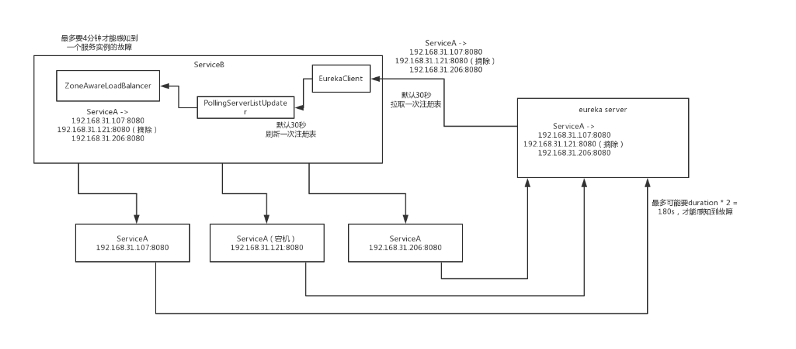

**PS:存在的问题就是服务故障需要一定的时间才能感知并下线该服务，在这个期间内轮询算法还是会访问到故障的服务**

## 3.2 探究一下IRule源码的负载均衡算法

**RoundRobinRule**：系统内置的默认负载均衡规范，直接round robin轮询，从一堆server list中，不断的轮询选择出来一个server，每个server平摊到的这个请求，基本上是平均的

这个算法，说白了是轮询，就是一台接着一台去请求，是按照顺序来的

**AvailabilityFilteringRule**：这个rule就是会考察服务器的可用性

如果3次连接失败，就会等待30秒后再次访问；如果不断失败，那么等待时间会不断边长

如果某个服务器的并发请求太高了，那么会绕过去，不再访问

先用round robin算法，轮询依次选择一台server，如果判断这个server是存活的可用的，如果这台server是不可以访问的，那么就用round robin算法再次选择下一台server，依次循环往复，10次。还是不行

**WeightedResponseTimeRule**：带着权重的，每个服务器可以有权重，权重越高优先访问，如果某个服务器响应时间比较长，那么权重就会降低，减少访问

**ZoneAvoidanceRule**：根据机房和服务器来进行负载均衡，说白了，就是机房的意思，看了源码就是知道了，这个就是所谓的spring cloud ribbon环境中的默认的Rule，选中机房后再基于轮询算法，选择出来一个server **(spring cloud默认负载均衡算法)**

**BestAvailableRule**：忽略那些请求失败的服务器，然后尽量找并发比较低的服务器来请求

**RandomRule**：随机找一个服务器，尽量将流量分散在各个服务器上

**RetryRule**：可以重试，就是通过round robin找到的服务器请求失败，可以重新找一个服务器

 **PS:AvailabilityFilteringRule、ZoneAvoidanceRule、RetryRule这些rule都是基于RoundRobinRule的轮询算法再加一些自己的东西进去**

# 4 如果在spring cloud环境下就用ribbon来做服务调用会咋样

​	比如说我们原来，其实就用了spring cloud里面的两个项目，一个是eureka，服务注册与发现；另外一个是ribbon，起码是得用的，因为要用ribbon来支持负载均衡；RestTemplate，spring-web里面的一个发送http请求的一个类库

​	比较核心的一个问题，如果仅仅是使用RestTemplate + ribbon的方式来进行服务间的这个调用，会导致我们每次去调用人家一个接口，都要单独写一些代码

​	我们追求一下极致，看看有没有办法，可以让我们不用写代码，直接用一些接口和注解一下子就可以完成对其他服务的调用呢？

​	答案：feign，就可以完成声明式的服务调用。我们不用写代码去调用一个接口


