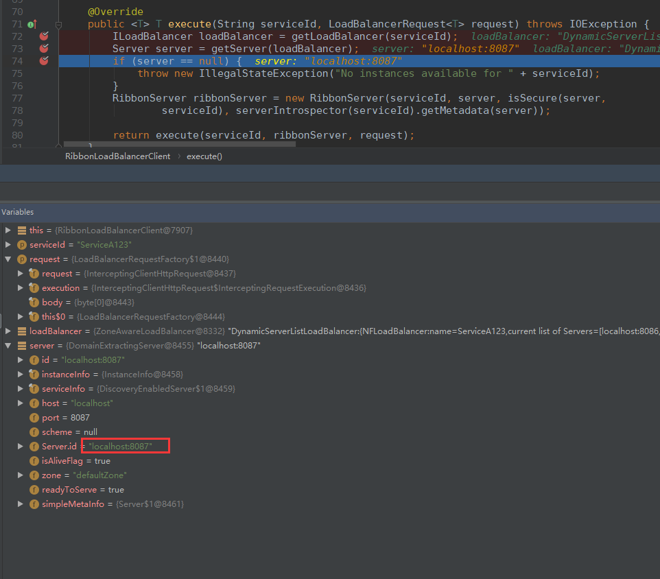

# 1 快速上手样例及基础知识

## 1.1 前言

**eureka:服务注册和发现**

1 分布式系统的环境里，特别拆分为了很多个服务，服务之间是互相调用的，可能一个请求过来，要多个服务互相调用，完成一个工作

2 就是说，服务A调用服务B，必须是得知道服务B部署在了哪些机器上，每台机器上接收请求的是哪个端口号

3 服务注册: 每个服务注册过去，eureka里就包含了每个服务部署在哪些机器上,每台机器上有哪个端口可以接受请求

4 服务发现呢: 你要调用一个服务，你就从eureka那边去拉取服务注册表，看看你要调用的那个服务部署在哪些机器上,监听的是哪个端口号

**Ribbon: 调用时的负载均衡**

1 spring cloud里面另外一个组件，ribbon也是netflix公司搞出来的

2 ribbon -> load balancer，负载均衡

3 ribbon会尽量确保说将所有的请求，均匀的分配到请求服务A的各台机器上去

**微服务!=分布式**

1 分布式不一定是微服务，可能是复杂系统的相互依赖，在不同的机器上，所以是分布式

2 微服务肯定是分布式，不同的微服务在分布式在不同的机器上，一个请求过来依赖于不同的微服务协作处理这个请求

## 1.2 基于netflix ribbon组件来一个原生的负载均衡调用demo

直接基于netflix的原生的ribbon API来做一把负载均衡的调用

```java
public class Application {

	public static void main(String[] args) throws Exception {
		// 基于ribbon的api来开发一个可以负载均衡调用一个服务的代码

		// 首先使用代码的方式对ribbon进行一下配置，配置一下ribbon要调用的那个服务的server list
		ConfigurationManager.getConfigInstance().setProperty(
				"greeting-service.ribbon.listOfServers", "localhost:8080,localhost:8088");

		// 获取指定服务的RestClient，用于请求某个服务的client
		RestClient restClient = (RestClient) ClientFactory.getNamedClient("greeting-service");

		// 你要请求哪个接口，构造一个对应的HttpRequest
		HttpRequest request = HttpRequest.newBuilder()
				.uri("/greeting/sayHello/leo")
				.build();

		// 模拟请求一个接口10次
		for(int i = 0; i < 10; i++) {
			HttpResponse response = restClient.executeWithLoadBalancer(request);
			String result = response.getEntity(String.class);
			System.out.println(result);
		}
	}

}
```

运行结果


web服务

```java
@RestController
@RequestMapping("/greeting")
public class GreetingController {
	
	@GetMapping("/sayHello/{name}") 
	public String sayHello(@PathVariable("name") String name) {
		System.out.println("接收到了一次请求调用");   
		return "hello, " + name;
	}
	
}
```

web服务被调用结果：


​	实验结果是什么呢？ribbon很棒，就是帮我们完成一个服务部署多个实例的时候，负载均衡的活儿，没问题，可以干到。10次请求，均匀分布在了两个服务实例上，每个服务实例承载了5次请求。

分布式系统的负载均衡调用图  :


## 1.3 netflix ribbon的负载均衡器的原生接口以及内置的规则(rule)

​	默认使用round robin轮询策略，直接从服务器列表里轮询

RestClient内部，底层，就是基于默认的BaseLoadBalancer来选择一个server

```java
    public static void ruleTest(){
        BaseLoadBalancer balancer = new BaseLoadBalancer();
        balancer.setRule(new MyRule(balancer));

        List<Server> servers = new ArrayList<Server>();
        servers.add(new Server("localhost", 8080));
        servers.add(new Server("lolcalhost", 8088));
        balancer.addServers(servers);

        for(int i = 0; i < 10; i++) {
            Server server = balancer.chooseServer(null);
            System.out.println(server);
        }
    }	
```

ILoadBalancer负载均衡器，底层是基于IRule，负载均衡算法，规则，来从一堆服务器list中选择一个server出来

​	负载均衡器是基于一个IRule接口指定的负载均衡规则，来从服务器列表里获取每次要请求的服务器的，所以可以自定义负载均衡规则

**自定义负载均衡规则**

```java
//**自定义负载均衡规则**
public class MyRule implements IRule {

    ILoadBalancer balancer;

    public MyRule() {

    }

    public MyRule(ILoadBalancer balancer) {
        this.balancer = balancer;
    }

    //重写choose方法，实现负载均衡算法
    public Server choose(Object key) {
        List<Server> servers = balancer.getAllServers();
        //样例，总是选择第一个
        return servers.get(0);
    }

    @Override
    public void setLoadBalancer(ILoadBalancer iLoadBalancer) {
        this.balancer = iLoadBalancer;
    }

    @Override
    public ILoadBalancer getLoadBalancer() {
        return balancer;
    }

}
```

调用结果(总是选择第一个)：


**总结：**

1 较少需要自己定制负载均衡算法的，除非是类似hash分发的那种场景，可以自己写个自定义的Rule，比如说，每次都根据某个请求参数，分发到某台机器上去。不过在分布式系统中，尽量减少这种需要hash分发的情况。

2 说这个，主要是，负载均衡的一些底层API罢了，主要是ILoadBalancer和IRule

3 但是如果在后面要把这里做的比较复杂的话，很有可能会站在一些内置的Rule的基础之上，吸收他们的源码，自己定制一个复杂的高阶的涵盖很多功能的负载均衡器

## 1.4 ribbon原生API中用于定时ping服务器判断其是否存活的接口（ping）

负载均衡器里，就是ILoadBalancer里，有IRule负责负载均衡的规则，选择一个服务器；还有一个IPing负责定时ping每个服务器，判断其是否存活

```java
    public static void pingTest() throws InterruptedException {
        BaseLoadBalancer balancer = new BaseLoadBalancer();
        List<Server> servers = new ArrayList<Server>();
        servers.add(new Server("localhost", 8080));
        servers.add(new Server("localhost", 8088));
        balancer.addServers(servers);
        // http://localhost:8080/

        balancer.setPing(new MyPing());
        // 这里就会每隔1秒去请求那两个地址
        balancer.setPingInterval(1);
        Thread.sleep(5000);

        for(int i = 0; i < 10; i++) {
            Server server = balancer.chooseServer(null);
            System.out.println(server);
        }
    }
```

不过说实话，这块一般最好稍微做的那啥一点，用个类似/health的接口来表明自己的健康状况，可以自定义一个Ping组件

**自定义一个Ping组件**

```java
//**自定义一个Ping组件**
public class MyPing implements IPing {

    @Override
    public boolean isAlive(Server server) {
        System.out.println("ping:"+server.getHost()+":"+server.getHostPort());
        return true;
    }
}
```

调用结果(两个服务各每隔1秒ping一次)：


**扩展：**

​	**ribbon比较重要的几个API，RestClient、ILoadBalancer、IRule、IPing**

## 1.5 spring cloud环境中的Ribbon使用

​	说白了，就是用一个RestTemplate来访问别的服务，RestTemplate本身很简单，就是一个http请求的组件，本身没什么负载均衡的功能，他就是指定一个url，就访问这个url就得了。但是这里用@LoadBalanced注解之后，默认底层就会用ribbon实现负载均衡了。

​	很简单的道理，这里肯定是RestTemplate底层会去基于ribbon来对一个服务的service list进行负载均衡式的访问。那service list是从哪儿拿到的？ribbon和eureka整合起来使用了，在这个ribbon里，肯定server list是从eureka client里拿到的，对吧，人家本地不是缓存了完整的注册表么？

 然后呢，请求一个服务的时候，就找那个服务对应的server list，round robin轮询一下

**eureka client服务调用的样例代码：**

```java
@LoadBalanced
@Bean
public RestTemplate getRestTemplate() {
	return new RestTemplate();
}
```


## 1.6 ribbon流程图

​	RestTemplate，请求：http://localhost:8080/sayHello，如果给：http://ServiceA/sayHello，RestTemplate绝对100%报错，因为你里面搞了一个ServiceA，他是一个服务名称，不是ip地址和主机名，也没有端口号，根本没法请求这个东西

​	ILoadBalancer里面包含IRule和IPing，IRule负责从一堆server list中根据负载均衡的算法，选择出来某个server，关键是，server list从哪儿来？


# 2 ribbon入口源码解读

## 2.1 通过LoadBalanced注解作为突破口来找找线索

这个注解的意思，其实说什么呢？将一个RestTemplate标志为底层采用LoadBalancerClient来执行实际的http请求，支持负载均衡

```java
	//LoadBalanced属于org.springframework.cloud.client.loadbalancer包下
	//属于spring-clound-commons这个项目
	@Bean
	@LoadBalanced
	public RestTemplate getRestTemplate() {
		return new RestTemplate();
	}
```

LoadBalanced注解

```java
@Target({ ElementType.FIELD, ElementType.PARAMETER, ElementType.METHOD })
@Retention(RetentionPolicy.RUNTIME)
@Documented
@Inherited
@Qualifier
public @interface LoadBalanced {
}

```

对应类，及包中相关类


一般来说，如果是spring cloud或者是spring boot相关的项目，一定会有一个XXAutoConfiguraiton的一个东西

有 AsyncLoadBalancerAutoConfiguration 及**LoadBalancerAutoConfiguration** 相关类后缀为AutoConfiguation

 AsyncLoadBalancerAutoConfiguration 一看就是为支持异步负载均衡请求相关类，目前没有涉及到异步请求，所以只需关注LoadBalancerAutoConfiguration即可

**LoadBalancerAutoConfiguration类：**Ribbon配置加载核心类

```java
@Configuration
@ConditionalOnClass(RestTemplate.class)
@ConditionalOnBean(LoadBalancerClient.class)
@EnableConfigurationProperties(LoadBalancerRetryProperties.class)
public class LoadBalancerAutoConfiguration {

	@LoadBalanced
	@Autowired(required = false)
	private List<RestTemplate> restTemplates = Collections.emptyList();

    //SmartInitializingSingleton一看就是初始化相关的东西，就是在系统启动的时候，一定会在某个时机来执行的
	@Bean
	public SmartInitializingSingleton loadBalancedRestTemplateInitializer(
			final List<RestTemplateCustomizer> customizers) {
		return new SmartInitializingSingleton() {
            
            //afterSingletonsInstantiated()这个方法，一看就是在spring singleton bean实例化完了之后来执行的
			@Override
			public void afterSingletonsInstantiated() {
                //RestTemplate list是从哪儿来的呢？是LoadBalanced对应注解方法中实例化返回的RestTemplate
                ///RestTemplate list加载涉及到spring及spring boot相关源码知识，这里就不做展开了
				for (RestTemplate restTemplate : LoadBalancerAutoConfiguration.this.restTemplates) {
					for (RestTemplateCustomizer customizer : customizers) {
                        //Cutomizer（专门用来定制化RestTemplate的组件）,用每个Customizer来定制每个RestTemplate
						customizer.customize(restTemplate);
					}
				}
			}
		};
	}

	@Autowired(required = false)
	private List<LoadBalancerRequestTransformer> transformers = Collections.emptyList();

	@Bean
	@ConditionalOnMissingBean
	public LoadBalancerRequestFactory loadBalancerRequestFactory(
			LoadBalancerClient loadBalancerClient) {
        //初始化，实例化 LoadBalancerRequestFactory
		return new LoadBalancerRequestFactory(loadBalancerClient, transformers);
	}

	@Configuration
	@ConditionalOnMissingClass("org.springframework.retry.support.RetryTemplate")
	static class LoadBalancerInterceptorConfig {
		@Bean
		public LoadBalancerInterceptor ribbonInterceptor(
				LoadBalancerClient loadBalancerClient,
				LoadBalancerRequestFactory requestFactory) {
            //设置的那个拦截器，很明显就是LoadBalancerInterceptor
            //初始化，实例化 LoadBalancerInterceptor
			return new LoadBalancerInterceptor(loadBalancerClient, requestFactory);
		}

		@Bean
		@ConditionalOnMissingBean
		public RestTemplateCustomizer restTemplateCustomizer(
				final LoadBalancerInterceptor loadBalancerInterceptor) {/
            //RestTemplateCustomizer，一看就是专门对RestTemplate进行定制化的一个组件
			return new RestTemplateCustomizer() {
				@Override
				public void customize(RestTemplate restTemplate) {
					List<ClientHttpRequestInterceptor> list = new ArrayList<>(
							restTemplate.getInterceptors());
                    //list里放了一个ClientHttpRequestInterceptor，interceptor，拦截器，给RestTemplate设置了一个拦截器
					list.add(loadBalancerInterceptor);
					restTemplate.setInterceptors(list);
				}
			};
		}
	}

........................................


}

```

**总结：**

（1）@LoadBalanced注解入手，线索直接断掉

（2）给大家一个经验技巧，从这个注解所在的项目和包下面入手，来找找相关的东西，有什么线索

（3）spring boot和spring cloud相关的类，你别想多了，直接找XXXAutoConfiguraiton的类，就知道是怎么回事

（4）找到了这个LoadBalancerAutoConfiguration，在这个类里面就有了重大的突破

（5）里面有一个List<RestTemplate>，推测就是我们创建的那个RestTemplate会放到这里来

（6）用这个RestTemplateCustomizer对每个RestTemplate进行了定制化，给每个RestTemplate设置了interceptor

（7）具体是哪个interceptor呢？LoadBalancerInterceptor，拦截器

流程图：


## 2.2 spring cloud通过拦截器机制改变了RestTemplate的行为

拦截器是干嘛用的? 就是如果你对一个东西发起一个请求，那么会被拦截器给拦截掉，由拦截器先来处理一下

​	如果我们对RestTemplate执行某个操作，比如说restTemplate.getForObject()操作，相当于是希望发起一个http请求，请求一个服务的接口，**此时不会由RestTemplate自己原生的功能来实现**

**而是会由拦截器来实现这个请求http服务的一个功能**

```java
public class LoadBalancerInterceptor implements ClientHttpRequestInterceptor {

	private LoadBalancerClient loadBalancer;
	private LoadBalancerRequestFactory requestFactory;

	public LoadBalancerInterceptor(LoadBalancerClient loadBalancer, LoadBalancerRequestFactory requestFactory) {
		this.loadBalancer = loadBalancer;
		this.requestFactory = requestFactory;
	}

	public LoadBalancerInterceptor(LoadBalancerClient loadBalancer) {
		// for backwards compatibility
		this(loadBalancer, new LoadBalancerRequestFactory(loadBalancer));
	}

    //在执行下面那行intercept的时候，其实是将这个请求给封装了一下，将http://ServiceA/sayHello/封装到了HttpRequest里面去
    //intercept(拦截)
    //然后将HttpRequest加上其他的一些组件和数据，比如说byte[] body
    //如果你发送请求的时候，带上了一个json串，一定是放请求体里面的，请求体里面的json串就会作为byte[] body传进来
    //ClientHttpRequestExecution（是负责底层的http通信的组件）
	@Override
	public ClientHttpResponse intercept(final HttpRequest request, final byte[] body,
			final ClientHttpRequestExecution execution) throws IOException {
        //获取到的就是：http://ServiceA/sayHello/leo对应URI
		final URI originalUri = request.getURI();
        //获取到的就是：ServiceA
        //serviceName，服务名称，就是获取到的那个ServiceA
		String serviceName = originalUri.getHost();
        //如果你的获取到的服务名称是null，那么就打印异常日志，告诉你，你的请求的url地址里面没有包含合格的hostname主机名
		Assert.state(serviceName != null, "Request URI does not contain a valid hostname: " + originalUri);
        //最终执行了LoadBalancerClient的execute方法
		return this.loadBalancer.execute(serviceName, requestFactory.createRequest(request, body, execution));
	}
}
```

**方法调用与拦截器**

```java
restTemplate.getForObject("http://ServiceA/sayHello/leo", String.class);

//相当于是底层调用了拦截器里的intercept()方法，实际的这个请求的逻辑，不再由RestTemplate原来原生的默认的逻辑来实现，而是由intercept()拦截方法来实现了
```

**总结：**

1 梳理清楚了一个东西：LoadBalancerInterceptor，拦截掉RestTemplate所有的执行的请求，

2 这个内部就干一件事儿，就是从你的url地址里获取hostname作为服务名称，就是你要请求的服务的名称，

3 就是找LoadBalancerClient去执行	对应的负载均衡的请求，将解析出来的服务名称穿进去，

4 还有就是基于RequestFactory创建出来的一个request

## 2.3 LoadBalancerClient是从哪来的(具体实例化代码及相关实现)

对应代码都在 spring-cloud-netflix-core这个包里面


LoadBalancerClient是一个接口，所以需要一个实现类来实例化相关操作，RibbonLoadBalancerClient就是实现类

而在RibbonAutoConfiguation就是将RibbonLoadBalancerClient实例化Bean

```java
//AutoConfigureAfter注解(after)明确说明了，这个RibbonAutoConfiguraion，是在EurekaClientAutoConfiguration之后来执行的，也就是说eureka必须先初始化完，才会轮到ribbon来初始化
//AutoConfigureBefore(before),这个RibbonAutoConfiguration，必须在之前看的那个LoadBalancerAutoConfiguration之前来执行，LoadBalancerAutoConfiguration触发的一些列的代码，是依赖于LoadBalancerClient的
@Configuration
@ConditionalOnClass({ IClient.class, RestTemplate.class, AsyncRestTemplate.class, Ribbon.class})
@RibbonClients
@AutoConfigureAfter(name = "org.springframework.cloud.netflix.eureka.EurekaClientAutoConfiguration")
@AutoConfigureBefore({LoadBalancerAutoConfiguration.class, AsyncLoadBalancerAutoConfiguration.class})
@EnableConfigurationProperties({RibbonEagerLoadProperties.class, ServerIntrospectorProperties.class})
public class RibbonAutoConfiguration {
............................
	@Bean
	@ConditionalOnMissingBean(LoadBalancerClient.class)
	public LoadBalancerClient loadBalancerClient() {
		return new RibbonLoadBalancerClient(springClientFactory());
	}
................

}
```

扩展-ribbon相关包说明：


（1）ribbon-2.2.5.jar：理解为ribbon的内核级别的比较核心的一些组件

（2）ribbon-transport-2.2.5.jar：基于netty封装的特别底层的进行http、tcp、udp各种协议的网络通信的组件

（3）ribbon-core-2.2.5.jar：推测这是ribbon比较基础性的一些通用的代码组件

（4）ribbon-httpclient-2.2.5.jar：是ribbon底层的http网络通信的一些组件

（5）ribbon-loadbalancer-2.2.5.jar：都是ribbon最最核心的原生的API

**PS:最终会发现，在LoadBalancerInterceptor拦截器里，会将RestTemplate的方法和请求转发给RibbonLoadBalancerClient.execute()方法去执行**


## 2.4 对spring cloud整合ribbon源码的初步调试

调试下execute方法，查看负载均衡效果

```java
public class RibbonLoadBalancerClient implements LoadBalancerClient {
	@Override
	public <T> T execute(String serviceId, LoadBalancerRequest<T> request) throws IOException {
		ILoadBalancer loadBalancer = getLoadBalancer(serviceId);
        //getServer就是获取负载均衡后真正调用的服务
		Server server = getServer(loadBalancer);
		if (server == null) {
			throw new IllegalStateException("No instances available for " + serviceId);
		}
		RibbonServer ribbonServer = new RibbonServer(serviceId, server, isSecure(server,
				serviceId), serverIntrospector(serviceId).getMetadata(server));

		return execute(serviceId, ribbonServer, request);
	}
}
```

第一次：


第二次：



通过断点调试得知LoadBalancerClient获取server方法通过了负载均衡的方式获取具体地址请求


