# 1 zuul基本使用及概念

## 1.1 为啥微服务架构里要搞个网关这个东西

前端工程师，就是写js、html、css之类的代码，专门放在一个工程里，浏览器全部都是请求前端工程的，前端工程也是单独部署在服务器上的，比如说用这个node.js技术。前端工程比如用node.js发起类似ajax的请求，来请求我们的后端工程的api接口，http请求。

前端工程一定会调用大量的，多达几十个，几百个后端的服务

前端工程师要熟悉和维护几十个，甚至几百个后端的服务，在真正的工程开发里，非常的不靠谱和不现实，每个服务部署了几台机器，什么地址，叫什么名字

**设计模式，阶段一，facade门面思想，对于一套复杂的类体系和接口，全部暴露一个统一的门面，门面给别人调用即可**，别人就不用去熟悉你几十个类和几百个接口，我要调用这个接口了，我还得去想想，我得找哪个类

**1、请求路由**

**屏蔽复杂的后台系统的大量的服务，然后让前端工程师调用的时候非常的简单**

**2、统一处理**

**把所有后台服务都需要做的一些通用的事情，挪到网关里面去处理**

**（1）统一安全认证**

**（2）统一限流**

**（3）统一降级**

**（4）统一异常处理**

**（5）统一请求统计**

**（6）统一超时处理**

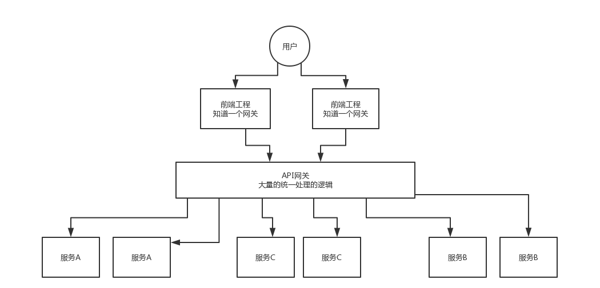

## 1.2 zuul的demo单独使用

请求过来了，然后就是直接将请求转发给一个url地址

相当于是就单独使用了zuul

pom文件

```xml
    	<dependency>
			<groupId>org.springframework.cloud</groupId>
			<artifactId>spring-cloud-starter-zuul</artifactId>
		</dependency>
		<dependency>
			<groupId>org.apache.httpcomponents</groupId>
			<artifactId>httpclient</artifactId>
		</dependency>
```

yml

```yaml
server:
  port: 9001
zuul:
  routes:
    demo:
      url: http://localhost:9090/
```

入口类

```java
@SpringBootApplication
@EnableZuulProxy
public class ZuulGatewayApplication {

	public static void main(String[] args) {
		SpringApplication.run(ZuulGatewayApplication.class, args);
	}

}
```

根据yml的配置请求:

比如：http://localhost:9001/demo/ServiceB/user/sayHello

那么他会转发给：http://localhost:9090/ServiceB/user/sayHello

**PS:说白了就是将demo后面的替换到对应配置url即可**

## 1.3 spring cloud环境下zuul的demo体使用

我们现在要将zuul和ribbon、feign、hystrix、eureka整合起来使用，是如何使用的呢？

pom

```xml
		<!--单独zuul使用-->
    	<dependency>
			<groupId>org.springframework.cloud</groupId>
			<artifactId>spring-cloud-starter-zuul</artifactId>
		</dependency>
		<dependency>
			<groupId>org.apache.httpcomponents</groupId>
			<artifactId>httpclient</artifactId>
		</dependency>
		<!--结合spring-cloud其他组件-->
		<dependency>
			<groupId>org.springframework.cloud</groupId>
			<artifactId>spring-cloud-starter-config</artifactId>
		</dependency>
		<dependency>
			<groupId>org.springframework.cloud</groupId>
			<artifactId>spring-cloud-starter-eureka</artifactId>
		</dependency>
```

yml

```yaml
server:
  port: 9001
spring:
  application:
    name: zuul-gateway
eureka:
  instance:
    hostname: localhost
  client:
    serviceUrl:
      defaultZone: http://localhost:8761/eureka/
zuul:
  routes:
    ServiceB:
      path: /demo/**
```

上面的配置，就是说，所有针对http://localhost:9001/demo/**的请求，都会转发给服务B的其中一个服务，

比如说转发给http://localhost:9090/ServiceB/user/sayHello

测试请求：http://localhost:9001/demo/ServiceB/user/sayHello

会转发给：http://localhost:9090/ServiceB/user/sayHello

## 1.4 zuul的核心工作原理(基于责任链模式的各种过滤器)

设计模式，其实在各种开源项目里，到处都是设计模式

**数字越小优先级越高**

```
pre过滤器
-3：ServletDetectionFilter
-2：Servlet30WrapperFilter
-1：FromBodyWrapperFilter
1：DebugFilter
5：PreDecorationFilter

routing过滤器
10：RibbonRoutingFilter
100：SimpleHostRoutingFilter
500：SendForwardFilter

post过滤器
1000：SendResponseFilter

#error过滤器
0：SendErrorFilter


```

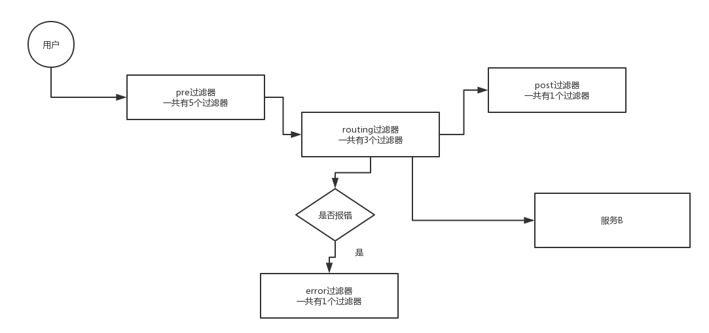

## 1.5 zuul最主要的功能(各种请求路由规则的配置)

zuul：请求路由，他作为一个网关，接收到一个请求，然后将这个请求转发给其他的服务

**1、简单路由**

spring cloud在zuul的routing阶段，搞了几个过滤器，这几个过滤器会负责将请求转发到后面的服务里去，最基本的就是SimpleHostRoutingFilter，这个大概就是这么配置的：

```yaml
zuul:
  routes:
    demo:
      path: /ServiceB/**
      url: http://localhost:9090/ServiceB
```

zuul.host.maxTotalConnections：这是配置连接到目标主机的最大http连接数，是用来配置http连接池的，默认是200

zuul.host.maxPerRouteConnections：就是每个主机的初始连接数，默认是20

**2、跳转路由**

SendForwardFilter负责进行跳转路由

这个，就是在zuul-gateway工程里，搞一个controller，然后配置一下：

```yaml
zuul:
  routes:
    demo:
      path: /test/**
      url: forward: /gateway/sayHello
```

这个说白了就是自己跳转到自己网关工程里的一个接口

**3、ribbon路由**

这个就是说基于ribbon + eureka，来转发请求到某个服务，使用ribbon来实现负载均衡

```yaml
#serviceId不设置默认就是ServiceB同名
zuul:
  routes:
    ServiceB:
      path: /demo/**
      serviceId: ServiceB

#简化的写法
zuul:
  routes:
    ServiceB:
      path: /demo/**
      
```

**4、自定义路由规则**

```java
@Configuration
public class MyRouteRuleConfig {

    @Bean
    public PatternServiceRouteMapper patternServiceRouteMapper() {
        return new PatternServiceRouteMapper("(zuul)-(?<test>.+)-(service)”, “${test}/**");
    }

}
```

请求：test/**的路径，转发给zuul-test-service

**5、忽略路由**

```yaml
zuul:
  ignoredPatterns: /ServiceB/test
```

## 1.6 zuul的相关常见配置(请求头、路由映射、hystrix、ribbon、超时)

**1、请求头配置**

默认情况下，zuul有些敏感的请求头不会转发给后端的服务

比如说：Cookie、Set-Cookie、Authorization，也可以自己配置敏感请求头

```yaml
zuul:
  sensitiveHeaders: accept-language, cookiei
  routes:
    demo:
      sensitiveHeaders: cookie
```

**2、路由映射信息**

我们在zuul-gateway中引入actuator项目，然后在配置文件中，将management.security.enabled设置为false，就可以访问/routes地址，然后可以看到路由的映射信息

**3、hystrix配置**

与ribbon整合转发时，会使用RibbonRoutingilter，转发会使用hystrix包裹请求，如果请求失败，会执行fallback逻辑

yml

```yaml
zuul:
  routes:
    ServiceB:
      path: /ServiceB/**
```

配置类

```java
public class ServiceBFallbackProvider implements ZuulFallbackProvider {

    public String getRoute() {
    	return “ServiceB”;
    }

    public ClientHttpResponse fallbackResponse() {
    	return new ClientHttpResponse() {
            public InputStream getBody() throws IOException {
                return new ByteArrayInputStream(“fallback”.getBytes());
            }

            public HttpHeaders getHeaders() {
                HttpHeaders headers = new HttpHeaders();
                headers.setContentType(MediaType.TEXT_PLAIN);
                return headers;
            }

            public HttpStatus getStatusCode() throws IOException {
                return HttpStatus.OK;
            }

            public int getRawStatusCode() throws IOException {
              return 200;
            }

            public String getStatusText() throws IOException {
               return “OK”;
            }

            public void close() {

            }
    	}
    }
}
```

注入配置类

```java
@Configuration
public class FallbackConfig {
    @Bean
    public ZuulFallbackProvider fallbackProvider() {
    	return new ServiceBFallbackProvider();
    }

}
```

上面的代码就定义了ServiceB的降级逻辑

**但是一般不会针对某个服务搞降级，最好是在getRoute()方法中，返回：*，这样子就是做一个全局的降级**

**4、ribbon客户端预加载**

默认情况下，第一次请求zuul才会初始化ribbon客户端，所以可以配置预加载

```yaml
zuul:
  ribbon:
    eager-load:
      enabled: true
```

**5、超时配置**

人zuul也是用的hystrix + ribbon那套东西，所以说，超时这里要考虑hystrix和ribbon的，而且hystrix的超时要考虑ribbon的重试次数和单次超时时间

hystrix的超时时间计算公式如下：

(ribbon.ConnectTimeout + ribbon.ReadTimeout) * (ribbon.MaxAutoRetries + 1) * (ribbon.MaxAutoRetriesNextServer + 1)

```
ribbon:
  ReadTimeout:100
  ConnectTimeout:500
  MaxAutoRetries:1
  MaxAutoRetriesNextServer:1
```

如果不配置ribbon的超时时间，默认的hystrix超时时间是4000ms

## 1.7 zuul的一些高级功能

### 1.7.1 过滤器优先级

**数字越小优先级越高**

```
pre过滤器

-3：ServletDetectionFilter
-2：Servlet30WrapperFilter
-1：FromBodyWrapperFilter
1：DebugFilter
5：PreDecorationFilter

routing过滤器

10：RibbonRoutingFilter
100：SimpleHostRoutingFilter
500：SendForwardFilter

post过滤器

1000：SendResponseFilter

error过滤器

0：SendErrorFilter
```

### 1.7.2 自定义过滤器

配置类

```java
public class MyFilter extends ZuulFilter {

    public boolean shouldFilter() {
 	   // 是否要执行过滤器
  	  return true;
    }

    publici Object run() {
  	  System.out.println(“执行过滤器”);
 	   return null;
    }

    // 在哪个阶段执行
    public String filterType() {
 	   return FilterConstants.ROUTE_TYPE;
    }

    // 这是过滤器的优先级
    public int filterOrder() {
    	return 1;
    }

}
```

加载配置类

```java
@Configuration
public class FilterConfig {

    @Bean
    public MyFilter myFilter() {
        return new MyFilter();
    }

}
```


### 1.7.3 动态加载过滤器

pom

```java
<dependency>
    <groupId>org.codehaus.groovy</groupId>
    <artifactId>groovy-all</artifactId>
    <version>2.4.12</version>
</dependency>
```

yml

```yaml
zuul:
  filter:
    root: “groovy/filters”
    refreshInterval: 5
```

在Application类里添加

```java
    @PostConstruct
    public void zuulInit() {
        FilterLoader.getInstance().setCompiler(new GroovyCompiler());
        String scriptRoot = System.getProperty(“zuul.filter.root”, “groovy/filters”);
        String refreshInterval = System.getProperty(“zuul.filter.refreshInterval”, “5”);
        if(scriptRoot.length() > 0) {
            scriptRoot = scriptRoot + File.separator;
        }
        try {
            FilterFileManager.setFilenameFilter(new GroovyFileFilter());
            FilterFileManager.init(Integer.parseInt(refreshInterval), scriptRoot + “pre“, scriptRoot + “route”, scriptRoot + “post”);
        } catch(Exception e) {
        	throw new RuntimeException(e);
        }

    }
```

在src/main/java/groovy/filters中，放一个MyFilter.groovy

```java
class MyFilter extends ZuulFilter {

    public boolean shouldFilter() {
        return true;
    }

    public Object run() {
        System.out.println(“过滤器”);
        return null;
    }

    public String filterType() {
        return FilterConstants.ROUTE_TYPE;
    }

    public int filterOrder() {
        return 1;
    }

}
```

先启动网关项目，然后将这个过滤器放到指定目录，过几秒钟就会生效

### 1.7.4 禁用过滤器

```yaml
zuul:
  SendForwardFilter:
    route:
      disable: true
```

### 1.7.5 RequestContext

在过滤器中，使用RequestContext.getCurrentContext()，可以获取到serviceId、requestURI等各种东西

### 1.7.6 @EnableZuulServer与@EnableZuulProxy

@EnableZuulProxy简单理解为@EnableZuulServer的增强版，当Zuul与Eureka、Ribbon等组件配合使用时，我们使用@EnableZuulProxy。 

@EnableZuulServer这个的话，就没有PreDecorationFilter、RibbonRoutingFilter、SimpleHostRoutingFilter等过滤器

参考：https://blog.csdn.net/hxpjava1/article/details/78334354

### 1.7.7 error过滤器

在**自定义过滤器里搞一个异常抛出来，ZuulException**

**然后写一个MyErrorController，继承BasicErrorController，统一处理异常，打印一些信息，这就是统一异常处理**

统一异常处理

统一认证

统一限流

统一降级

## 1.8 一图了解zuul在spring cloud环境下的的核心原理

spring cloud的一些组件，他的顺序，都是有原因的，eureka、ribbon、feign、hystrix、zuul（eureka、ribbon、hystrix）

**zuul的核心源码，核心就在于说接收到一个url请求之后，如何来解析这个请求，如何根据我们在application.yml配置文件中的配置，来将这个url请求转换为针对某个服务的一个url请求**

依赖ribbon进行负载均衡，依赖eureka进行服务发现，依赖hystrix进行熔断降级 

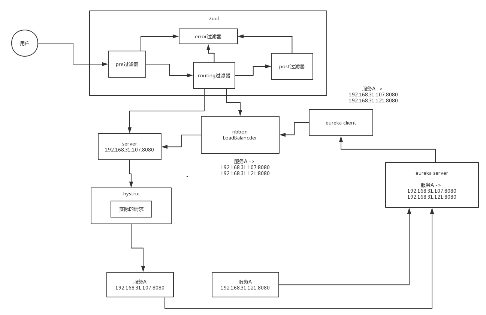

# 2 zuul源码

## 2.1 zull入口源码

### 2.1.1 相关包介绍

zuul源码相关包

1 zuul自身核心源码

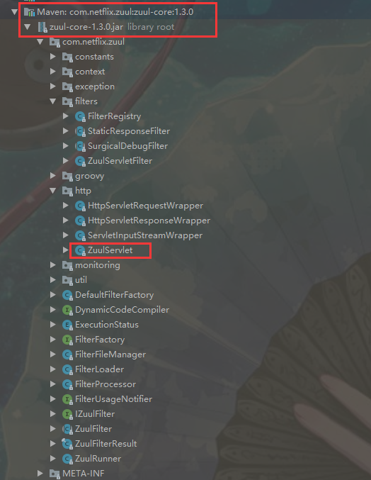

2 zuul与spring cloud结合的核心源码

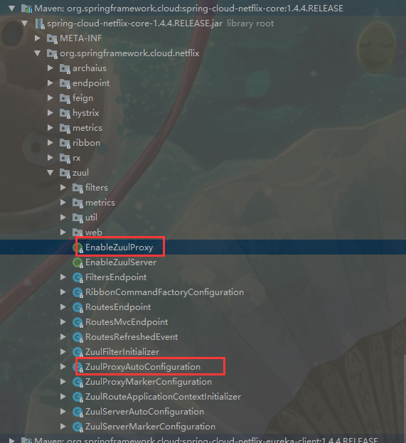

1 核心源码，以及核心功能，主要就是解析url，将解析后的url跟你的application.yml中的路由配置（route）匹配起来，对请求url选择对应的路由配置

2 根据路由配置，将对应的请求封装一下，基于eureka + ribbon实现服务的负载均衡，基于hystirx包裹实际的请求，完成熔断降级

3 zuul核心的代码都在一坨过滤器中

```
pre过滤器
    -3：ServletDetectionFilter
    -2：Servlet30WrapperFilter
    -1：FromBodyWrapperFilter
    1：DebugFilter
    5：PreDecorationFilter

routing过滤器
    10：RibbonRoutingFilter
    100：SimpleHostRoutingFilter
    500：SendForwardFilter

post过滤器
    900：LocationRewriteFilter
    1000：SendResponseFilter

error过滤器
    0：SendErrorFilter
```

### 2.1.2 spring cloud与zuul相关的源码

启动类注解@EnableZuulProxy

1 **@EnableZuulProxy注解**，一看就是非常核心的**触发了zuul相关的过滤器的执行**的这么一个注解，如果没有这个注解，很明显，zuul的一些功能就不会执行，包括zuul的各种过滤器，所以我们来以@EnableZuulProxy注解作为入口，来研究一下他在干什么

2 这个@EnableZuulProxy注解其实干了两件事情，

(1) 第一件事情就是启用一个zuul server，这个东西可以接收所有的http请求，都会被他给拦截，所以这块我们可以想象一下，这里的**zuul一定是搞了一个类似与servlet、filter、spring boot拦截器的东西。这个东西一定会拦截所有的http请求，他来处理**

(1) 第二件事情，就是给那个**zuul server（拦截器，servlet，filter）加入一些内置的filter，过滤器**，就是我们之前看到的各种过滤器解，一看就是非常核心的触发了zuul相关的过滤器的执行的这么一个注解，如果没有这个注解，很明显，zuul的一些功能就不会执行，包括zuul的各种过滤器

```java
/**
 * Sets up a Zuul server endpoint and installs some reverse proxy filters in it, so it can
 * forward requests to backend servers. The backends can be registered manually through
 * configuration or via DiscoveryClient.
 *
 * @see EnableZuulServer for how to get a Zuul server without any proxying
 *
 * @author Spencer Gibb
 * @author Dave Syer
 * @author Biju Kunjummen
 */

@EnableCircuitBreaker
@Target(ElementType.TYPE)
@Retention(RetentionPolicy.RUNTIME)
@Import(ZuulProxyMarkerConfiguration.class)
//很明显上面的那个@Import引入了另外的一个Configuration类
public @interface EnableZuulProxy {
}
```

引入的配置类

```java
/**
 * Responsible for adding in a marker bean to trigger activation of 
 * {@link ZuulProxyAutoConfiguration}
 *
 * @author Biju Kunjummen
 */
//这个ZuulProxyMarkerConfiguration是用来触发ZuulProxyAutoConfiguration的执行的
@Configuration
public class ZuulProxyMarkerConfiguration {
	@Bean
	public Marker zuulProxyMarkerBean() {
		return new Marker();
	}

	class Marker {
	}
}
```

激活的配置类

```java
/**
 * @author Spencer Gibb
 * @author Dave Syer
 * @author Biju Kunjummen
 */
//就是必须有ZuulProxyMarkerConfiguration里面的一个Marker作为spring容器中的bean，然后才能触发ZuulProxyAutoConfiguruation的执行
@Configuration
@Import({ RibbonCommandFactoryConfiguration.RestClientRibbonConfiguration.class,
		RibbonCommandFactoryConfiguration.OkHttpRibbonConfiguration.class,
		RibbonCommandFactoryConfiguration.HttpClientRibbonConfiguration.class,
		HttpClientConfiguration.class })
@ConditionalOnBean(ZuulProxyMarkerConfiguration.Marker.class)
public class ZuulProxyAutoConfiguration extends ZuulServerAutoConfiguration {
//个类里面大概来说，就是初始化了一系列的zuul的过滤器，以及其他七七八八的一些组件
..............................................................

	// pre filters
	@Bean
	public PreDecorationFilter preDecorationFilter(RouteLocator routeLocator,
			ProxyRequestHelper proxyRequestHelper) {
		return new PreDecorationFilter(routeLocator, this.server.getServletPrefix(),
				this.zuulProperties, proxyRequestHelper);
	}

	// route filters
	@Bean
	public RibbonRoutingFilter ribbonRoutingFilter(ProxyRequestHelper helper,
			RibbonCommandFactory<?> ribbonCommandFactory) {
		RibbonRoutingFilter filter = new RibbonRoutingFilter(helper, ribbonCommandFactory,
				this.requestCustomizers);
		return filter;
	}
.........................................

}

```

​	ZuulProxyAutoConfiguration，这个东西很明显就是zuul相关的组件的初始化的这么一个入口。通常spring boot整合的框架，XXXAutoConfiguration或者是XXXConfiguration就是该框架的初始化入口。

### 2.1.3 zuul自身的入口源码

**ZuulServletFilter: **这个东西是java web原生的filter，会在java web应用，在tomcat这种容器里去注册，负责拦截所有的请求

**ZuulServlet:** 也是java web原生的servlet，我们理解，就是ZuulServletFilter和ZuulServlet加起来基于java web的原生API拦截了所有的请求，然后完成了整个zuul的入口的核心功能和代码

入口主要就是ZuulServlet。其实**ZuulServletFilter跟ZuulServelt是一回事儿，里面的代码逻辑几乎都是一样的**，**他们只是基于java web原生的api提供了两种不同形式的入口而已**

**你可以基于servlet来启动zuul入口，也可以基于他的filter来启用zuul的入口**

**默认情况下是使用zuul的ZuulServlet来作为请求入口的，ZuulServletFilter是不使用的**

```java
/**
 * Core Zuul servlet which intializes and orchestrates zuulFilter execution
 *
 * @author Mikey Cohen
 *         Date: 12/23/11
 *         Time: 10:44 AM
 */
public class ZuulServlet extends HttpServlet {

    private static final long serialVersionUID = -3374242278843351500L;
    private ZuulRunner zuulRunner;


    @Override
    public void init(ServletConfig config) throws ServletException {
        super.init(config);

        String bufferReqsStr = config.getInitParameter("buffer-requests");
        boolean bufferReqs = bufferReqsStr != null && bufferReqsStr.equals("true") ? true : false;

        zuulRunner = new ZuulRunner(bufferReqs);
    }

    //入口代码就在这里service
    @Override
    public void service(javax.servlet.ServletRequest servletRequest, javax.servlet.ServletResponse servletResponse) throws ServletException, IOException {
        try {
            init((HttpServletRequest) servletRequest, (HttpServletResponse) servletResponse);

            // Marks this request as having passed through the "Zuul engine", as opposed to servlets
            // explicitly bound in web.xml, for which requests will not have the same data attached
            RequestContext context = RequestContext.getCurrentContext();
            context.setZuulEngineRan();

            try {
                //preRoute()大概来说，就是去执行pre过滤器，如果pre过滤器中有任何一个过滤器执行失败了，
                //那么会执行error(e) => 执行error过滤器，同时接着执行post过滤器
                preRoute();
            } catch (ZuulException e) {
                error(e);
                postRoute();
                return;
            }
            try {
                //如果pre过滤器都执行成功了，没有报错，然后就会执行route过滤器，
                route();
            } catch (ZuulException e) {
                //但是如果执行route过滤器报错了，那么就会执行error过滤器，然后再执行post过滤器
                error(e);
                postRoute();
                return;
            }
            try {
                //postRoute()就是去执行post过滤器，如果route过滤器没有报错的话，那么就会执行post过滤器
                postRoute();
            } catch (ZuulException e) {
                //如果post过滤器执行报错了，就会执行error过滤器
                error(e);
                return;
            }

        } catch (Throwable e) {
            error(new ZuulException(e, 500, "UNHANDLED_EXCEPTION_" + e.getClass().getName()));
        } finally {
            //本次请求执行完毕，直接清理掉RequestContext中的本次请求的RequestContext
            RequestContext.getCurrentContext().unset();
        }
    }

    /**
     * executes "post" ZuulFilters
     *
     * @throws ZuulException
     */
    void postRoute() throws ZuulException {
        zuulRunner.postRoute();
    }

    /**
     * executes "route" filters
     *
     * @throws ZuulException
     */
    void route() throws ZuulException {
        zuulRunner.route();
    }

    /**
     * executes "pre" filters
     *
     * @throws ZuulException
     */
    void preRoute() throws ZuulException {
        zuulRunner.preRoute();
    }

    /**
     * initializes request
     *
     * @param servletRequest
     * @param servletResponse
     */
    //调用了ZuulRunner初始化代码
    void init(HttpServletRequest servletRequest, HttpServletResponse servletResponse) {
        zuulRunner.init(servletRequest, servletResponse);
    }

    /**
     * sets error context info and executes "error" filters
     *
     * @param e
     */
    void error(ZuulException e) {
        RequestContext.getCurrentContext().setThrowable(e);
        zuulRunner.error();
    }


}

```

ZuulRunner初始化代码

**主要就是初始化RequestContext，将原生的ServletRequest放入其中，并作为一个增强类添加一些功能**

```java
/**
 * This class initializes servlet requests and responses into the RequestContext and wraps the FilterProcessor calls
 * to preRoute(), route(),  postRoute(), and error() methods
 *
 * @author mikey@netflix.com
 * @version 1.0
 */
public class ZuulRunner {
...........................
    /**
     * sets HttpServlet request and HttpResponse
     *
     * @param servletRequest
     * @param servletResponse
     */
    public void init(HttpServletRequest servletRequest, HttpServletResponse servletResponse) {
		//RequestContext，这个东西会作为请求的上下文，在这个东西里面包含本次请求的所有相关的数据，他其实认为是一个类似与map的这么一个结构，首先这里就会将原生的ServletRequest放入其中
        RequestContext ctx = RequestContext.getCurrentContext();
        if (bufferRequests) {
            ctx.setRequest(new HttpServletRequestWrapper(servletRequest));
        } else {
            ctx.setRequest(servletRequest);
        }
		//HttpServletResponseWrapper，包裹了ServletResponse，装饰模式，包裹了之后，对某些功能可以进行增强，在Wrapper类里，可以保存response设置的一些status状态，方便我们取用status
		//HttpServletResponseWrapper，包裹了原生的ServletResponse，都被放在了RequestContext中，里面放入了本次请求相关的所有内容
        ctx.setResponse(new HttpServletResponseWrapper(servletResponse));
    }
.......................
}
```

**RequestContext通过ThreadLocal来实现每个线程请求都能获取到独立的RequestContext**

```java
package com.netflix.zuul.context;

/**
 * The Request Context holds request, response,  state information and data for ZuulFilters to access and share.
 * The RequestContext lives for the duration of the request and is ThreadLocal.
 * extensions of RequestContext can be substituted by setting the contextClass.
 * Most methods here are convenience wrapper methods; the RequestContext is an extension of a ConcurrentHashMap
 *
 * @author Mikey Cohen
 *         Date: 10/13/11
 *         Time: 10:21 AM
 */
public class RequestContext extends ConcurrentHashMap<String, Object> {
.......................
    /**
     * Get the current RequestContext
     *
     * @return the current RequestContext
     */
    //RequestContext,用ThreadLocal来实现，本次请求就是一个线程在处理，对这个线程就可以使用ThreadLocal放入各种数据副本
    //这个RequestContext，只要保证每次请求过来的时候，当前这个线程可以获取到一个独一无二的RequestContext就可以了
    public static RequestContext getCurrentContext() {
        if (testContext != null) return testContext;

        RequestContext context = threadLocal.get();
        return context;
    }
.........................
    public void unset() {
        threadLocal.remove();
    }
.........................
}
```

## 2.2  pre过滤器源码

### 2.2.1 pre相关过滤器

```
pre过滤器

-3：ServletDetectionFilter
-2：Servlet30WrapperFilter
-1：FromBodyWrapperFilter
1：DebugFilter
5：PreDecorationFilter
```

ZuulRunner通过FilterProcessor.getInstance()获取单例FilterProcessor执行对应的preRoute方法

```java
public class ZuulRunner {
......................
    public void preRoute() throws ZuulException {
        FilterProcessor.getInstance().preRoute();
    }
......................
}
```

FilterProcessor主要是根据类型获取对应过滤器集合，并一一去执行，这里是获取了pre类型的相关5个过滤器

```java
//FilterProcessor，是一个单例类，专门用来执行各种过滤器的类
public class FilterProcessor {
.....................

    public void preRoute() throws ZuulException {
        try {
            //执行filter就是用的一个runFilters()方法，然后就传入pre字符串，通知要执行pre过滤器，
            runFilters("pre");
        } catch (ZuulException e) {
            throw e;
        } catch (Throwable e) {
            throw new ZuulException(e, 500, "UNCAUGHT_EXCEPTION_IN_PRE_FILTER_" + e.getClass().getName());
        }
    }


    public Object runFilters(String sType) throws Throwable {
        if (RequestContext.getCurrentContext().debugRouting()) {
            Debug.addRoutingDebug("Invoking {" + sType + "} type filters");
        }
        boolean bResult = false;
        //这行代码的意思，就是根据你指定的过滤器的类型，pre，来找到pre类型的过滤器，而且是按照过滤器的优先级来排序的，拿到了一个过滤器的list
        List<ZuulFilter> list = FilterLoader.getInstance().getFiltersByType(sType);
        if (list != null) {
            for (int i = 0; i < list.size(); i++) {
                ZuulFilter zuulFilter = list.get(i);
                Object result = processZuulFilter(zuulFilter);
                if (result != null && result instanceof Boolean) {
                    bResult |= ((Boolean) result);
                }
            }
        }
        return bResult;
    }
    
        public Object processZuulFilter(ZuulFilter filter) throws ZuulException {

        RequestContext ctx = RequestContext.getCurrentContext();
        boolean bDebug = ctx.debugRouting();
        final String metricPrefix = "zuul.filter-";
        long execTime = 0;
        String filterName = "";
        try {
            long ltime = System.currentTimeMillis();
            filterName = filter.getClass().getSimpleName();
            
            RequestContext copy = null;
            Object o = null;
            Throwable t = null;

            if (bDebug) {
                Debug.addRoutingDebug("Filter " + filter.filterType() + " " + filter.filterOrder() + " " + filterName);
                copy = ctx.copy();
            }
            //这里调用对应过滤器runFilter方法
            ZuulFilterResult result = filter.runFilter();
            ExecutionStatus s = result.getStatus();
            execTime = System.currentTimeMillis() - ltime;

            switch (s) {
                case FAILED:
                    t = result.getException();
                    ctx.addFilterExecutionSummary(filterName, ExecutionStatus.FAILED.name(), execTime);
                    break;
                case SUCCESS:
                    o = result.getResult();
                    ctx.addFilterExecutionSummary(filterName, ExecutionStatus.SUCCESS.name(), execTime);
                    if (bDebug) {
                        Debug.addRoutingDebug("Filter {" + filterName + " TYPE:" + filter.filterType() + " ORDER:" + filter.filterOrder() + "} Execution time = " + execTime + "ms");
                        Debug.compareContextState(filterName, copy);
                    }
                    break;
                default:
                    break;
            }
            
            if (t != null) throw t;

            usageNotifier.notify(filter, s);
            return o;

        } catch (Throwable e) {
            if (bDebug) {
                Debug.addRoutingDebug("Running Filter failed " + filterName + " type:" + filter.filterType() + " order:" + filter.filterOrder() + " " + e.getMessage());
            }
            usageNotifier.notify(filter, ExecutionStatus.FAILED);
            if (e instanceof ZuulException) {
                throw (ZuulException) e;
            } else {
                ZuulException ex = new ZuulException(e, "Filter threw Exception", 500, filter.filterType() + ":" + filterName);
                ctx.addFilterExecutionSummary(filterName, ExecutionStatus.FAILED.name(), execTime);
                throw ex;
            }
        }
    }
...................
}
```

对应需要执行的pre过滤器集合断点

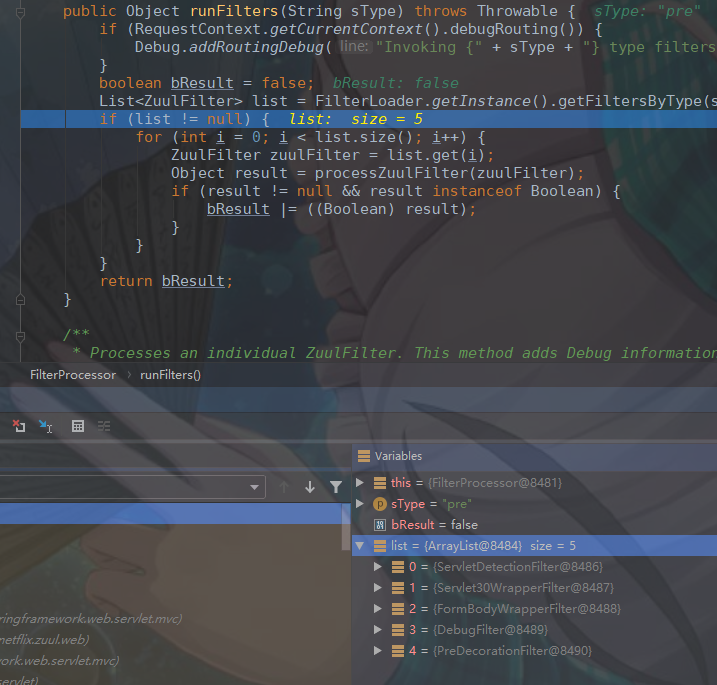

**ZuulFilter实现了Comparable接口,重写了compareTo方法,通过子类重写filterOrder方法设置返回int值大小来排序，数字小的优先执行**

```java
public abstract class ZuulFilter implements IZuulFilter, Comparable<ZuulFilter> {
....................
    //通过父类的runFilter方法调用对应过滤器的run方法
    public ZuulFilterResult runFilter() {
        ZuulFilterResult zr = new ZuulFilterResult();
        if (!isFilterDisabled()) {
            //shouldFilter决定是否调用对应过滤器逻辑(shouldFilter子类方法)
            if (shouldFilter()) {
                Tracer t = TracerFactory.instance().startMicroTracer("ZUUL::" + this.getClass().getSimpleName());
                try {
                    //调用对应过滤的run方法(run子类方法)
                    Object res = run();
                    zr = new ZuulFilterResult(res, ExecutionStatus.SUCCESS);
                } catch (Throwable e) {
                    t.setName("ZUUL::" + this.getClass().getSimpleName() + " failed");
                    zr = new ZuulFilterResult(ExecutionStatus.FAILED);
                    zr.setException(e);
                } finally {
                    t.stopAndLog();
                }
            } else {
                zr = new ZuulFilterResult(ExecutionStatus.SKIPPED);
            }
        }
        return zr;
    }
....................
}
```

下面就是各个过滤器的run方法调用了

ServletDetectionFilter

```java
public class ServletDetectionFilter extends ZuulFilter {
..................
    //默认true
	public boolean shouldFilter() {
		return true; 
	}

    
	@Override
	public Object run() {
		RequestContext ctx = RequestContext.getCurrentContext();
		HttpServletRequest request = ctx.getRequest();
		if (!(request instanceof HttpServletRequestWrapper) 
				&& isDispatcherServletRequest(request)) {
            //默认走这个if
            //就是把IS_DISPATCHER_SERVLET_REQUEST_KEY这个key值对应的value设置为true
			ctx.set(IS_DISPATCHER_SERVLET_REQUEST_KEY, true);
		} else {
			ctx.set(IS_DISPATCHER_SERVLET_REQUEST_KEY, false);
		}

		return null;
	}
..................
}
```

Servlet30WrapperFilter

```java
public class Servlet30WrapperFilter extends ZuulFilter {
..................
	@Override
	public boolean shouldFilter() {
		return true; // TODO: only if in servlet 3.0 env
	}

    //
	@Override
	public Object run() {
		RequestContext ctx = RequestContext.getCurrentContext();
		HttpServletRequest request = ctx.getRequest();
		if (request instanceof HttpServletRequestWrapper) {
			request = (HttpServletRequest) ReflectionUtils.getField(this.requestField,
					request);
			ctx.setRequest(new Servlet30RequestWrapper(request));
		}
        //走这个if
		else if (RequestUtils.isDispatcherServletRequest()) {
			// If it's going through the dispatcher we need to buffer the body
            //Servlet30RequestWrapper类包裹了一下request，装饰模式
			ctx.setRequest(new Servlet30RequestWrapper(request));
		}
		return null;
	}
..................
}


/**
 * A Servlet 3.0 compliant wrapper.
 */
class Servlet30RequestWrapper extends HttpServletRequestWrapper {
	private HttpServletRequest request;

	Servlet30RequestWrapper(HttpServletRequest request) {
		super(request);
		this.request = request;
	}
    
/**在zuul 1.2.2里有一个bug，这个bug是什么呢？在zuul 1.2.2版本里，有一个类，叫做HttpServletRequestWrapper，当时实现的时候，那个getRequest()方法返回的不是原生的ServletRequest
所以在zuul 1.3.0 版本里，其实修复了这个bug，就是搞了一个Servlet30Wrapper，是HttpServletReqeustWrapper子类，用这个东西来重写了一下getRequest()方法，这个方法会返回java web原生的一个ServletRequest类*/
	/**
	 * There is a bug in zuul 1.2.2 where HttpServletRequestWrapper.getRequest returns a wrapped request rather than the raw one.
	 * @return the original HttpServletRequest
	 */
	@Override
	public HttpServletRequest getRequest() {
		return this.request;
	}
}
```

FormBodyWrapperFilter

```java
public class FormBodyWrapperFilter extends ZuulFilter {
.......................
	@Override
	public boolean shouldFilter() {
		RequestContext ctx = RequestContext.getCurrentContext();
		HttpServletRequest request = ctx.getRequest();
		String contentType = request.getContentType();
		// Don't use this filter on GET method
    	//contentType没有设置的话就返回false
		if (contentType == null) {
			return false;
		}
		// Only use this filter for form data and only for multipart data in a
		// DispatcherServlet handler
		try {
            //默认情况下不执行的，shouldFilter()方法里的逻辑，必须是APPLICATION_FORM_URLENCODED这种media type才会执行，或者是MULTIPART_FORM_DATA这种media type才会执行，默认情况下我们的media type肯定都不是这几种特殊的形式
			MediaType mediaType = MediaType.valueOf(contentType);
			return MediaType.APPLICATION_FORM_URLENCODED.includes(mediaType)
					|| (isDispatcherServletRequest(request)
							&& MediaType.MULTIPART_FORM_DATA.includes(mediaType));
		}
		catch (InvalidMediaTypeException ex) {
			return false;
		}
	}
......................
	@Override
	public Object run() {
		RequestContext ctx = RequestContext.getCurrentContext();
		HttpServletRequest request = ctx.getRequest();
		FormBodyRequestWrapper wrapper = null;
		if (request instanceof HttpServletRequestWrapper) {
			HttpServletRequest wrapped = (HttpServletRequest) ReflectionUtils
					.getField(this.requestField, request);
			wrapper = new FormBodyRequestWrapper(wrapped);
			ReflectionUtils.setField(this.requestField, request, wrapper);
			if (request instanceof ServletRequestWrapper) {
				ReflectionUtils.setField(this.servletRequestField, request, wrapper);
			}
		}
		else {
			wrapper = new FormBodyRequestWrapper(request);
			ctx.setRequest(wrapper);
		}
		if (wrapper != null) {
			ctx.getZuulRequestHeaders().put("content-type", wrapper.getContentType());
		}
		return null;
	}
.....................
}
```

DebugFilter

```java
public class DebugFilter extends ZuulFilter {
...................
	@Override
	public boolean shouldFilter() {
		HttpServletRequest request = RequestContext.getCurrentContext().getRequest();
    //你必须在http请求中加入一个参数，debug=true，然后才会执行DebugFilter，这个DebugFilter其实就是打开几个debug的标识，然后在后面的运行中会打印一些debug的日志
		if ("true".equals(request.getParameter(DEBUG_PARAMETER.get()))) {
			return true;
		}
    	//没有设置debug参数走这个返回，默认返回fasle，不执行这个过滤器
		return ROUTING_DEBUG.get();
	}

	@Override
	public Object run() {
		RequestContext ctx = RequestContext.getCurrentContext();
		ctx.setDebugRouting(true);
		ctx.setDebugRequest(true);
		return null;
	}
...................
}
```

PreDecorationFilter(核心过滤器)

​	zuul最核心的逻辑，在这个PreDecoration中就完成了，当然了，其实解析请求uri，以及完成请求uri和application.yml中的路由规则的匹配的事儿，是zuul最最核心的事儿，但是这个里面的源码是比较琐碎没任何技术含量的源码

```java
public class PreDecorationFilter extends ZuulFilter {
.........................
	private RouteLocator routeLocator;
...........................
	@Override
	public boolean shouldFilter() {
		RequestContext ctx = RequestContext.getCurrentContext();
    	//返回true,默认执行这个过滤器
		return !ctx.containsKey(FORWARD_TO_KEY) // a filter has already forwarded
				&& !ctx.containsKey(SERVICE_ID_KEY); // a filter has already determined serviceId
	}

	@Override
	public Object run() {
		RequestContext ctx = RequestContext.getCurrentContext();
        //首先是解析了一下请求url，拿到了我们请求的url地址，/demo/ServiceB/user/sayHello/1
		final String requestURI = this.urlPathHelper.getPathWithinApplication(ctx.getRequest());
        //非常关键，他其实就是根据我们的请求url地址，去匹配我们的application.yml中的路由规则的配置，然后拿到了请求url对应的路由规则
        //2.3
		Route route = this.routeLocator.getMatchingRoute(requestURI);
        //后面就是将解析的Route及相关参数，地址赋值到RequestContext中去
		if (route != null) {
			String location = route.getLocation();
			if (location != null) {
				ctx.put(REQUEST_URI_KEY, route.getPath());
				ctx.put(PROXY_KEY, route.getId());
				if (!route.isCustomSensitiveHeaders()) {
					this.proxyRequestHelper
							.addIgnoredHeaders(this.properties.getSensitiveHeaders().toArray(new String[0]));
				}
				else {
					this.proxyRequestHelper.addIgnoredHeaders(route.getSensitiveHeaders().toArray(new String[0]));
				}

				if (route.getRetryable() != null) {
					ctx.put(RETRYABLE_KEY, route.getRetryable());
				}

				if (location.startsWith(HTTP_SCHEME+":") || location.startsWith(HTTPS_SCHEME+":")) {
					ctx.setRouteHost(getUrl(location));
					ctx.addOriginResponseHeader(SERVICE_HEADER, location);
				}
				else if (location.startsWith(FORWARD_LOCATION_PREFIX)) {
					ctx.set(FORWARD_TO_KEY,
							StringUtils.cleanPath(location.substring(FORWARD_LOCATION_PREFIX.length()) + route.getPath()));
					ctx.setRouteHost(null);
					return null;
				}
				else {
					// set serviceId for use in filters.route.RibbonRequest
					ctx.set(SERVICE_ID_KEY, location);
					ctx.setRouteHost(null);
					ctx.addOriginResponseHeader(SERVICE_ID_HEADER, location);
				}
				if (this.properties.isAddProxyHeaders()) {
					addProxyHeaders(ctx, route);
					String xforwardedfor = ctx.getRequest().getHeader(X_FORWARDED_FOR_HEADER);
					String remoteAddr = ctx.getRequest().getRemoteAddr();
					if (xforwardedfor == null) {
						xforwardedfor = remoteAddr;
					}
					else if (!xforwardedfor.contains(remoteAddr)) { // Prevent duplicates
						xforwardedfor += ", " + remoteAddr;
					}
					ctx.addZuulRequestHeader(X_FORWARDED_FOR_HEADER, xforwardedfor);
				}
				if (this.properties.isAddHostHeader()) {
					ctx.addZuulRequestHeader(HttpHeaders.HOST, toHostHeader(ctx.getRequest()));
				}
			}
		}
		else {
			log.warn("No route found for uri: " + requestURI);

			String fallBackUri = requestURI;
			String fallbackPrefix = this.dispatcherServletPath; // default fallback
																// servlet is
																// DispatcherServlet

			if (RequestUtils.isZuulServletRequest()) {
				// remove the Zuul servletPath from the requestUri
				log.debug("zuulServletPath=" + this.properties.getServletPath());
				fallBackUri = fallBackUri.replaceFirst(this.properties.getServletPath(), "");
				log.debug("Replaced Zuul servlet path:" + fallBackUri);
			}
			else {
				// remove the DispatcherServlet servletPath from the requestUri
				log.debug("dispatcherServletPath=" + this.dispatcherServletPath);
				fallBackUri = fallBackUri.replaceFirst(this.dispatcherServletPath, "");
				log.debug("Replaced DispatcherServlet servlet path:" + fallBackUri);
			}
			if (!fallBackUri.startsWith("/")) {
				fallBackUri = "/" + fallBackUri;
			}
			String forwardURI = fallbackPrefix + fallBackUri;
			forwardURI = forwardURI.replaceAll("//", "/");
			ctx.set(FORWARD_TO_KEY, forwardURI);
		}
		return null;
	}

........................
}
```

将Route路由规则中的各种信息给放在了RequestContext中了，给下一个阶段route过滤器来使用

### 2.2.2 解析请求URI以及匹配路由规则（Route）

其实是根据解析出来的请求URI，去匹配application.yml文件中我们配置的路由规则，将路由规则封装成一个Route

```java
public interface RouteLocator {

	Collection<String> getIgnoredPaths();

	List<Route> getRoutes();

	Route getMatchingRoute(String path);
}

public interface RefreshableRouteLocator extends RouteLocator {
	void refresh();
}

//执行这个实现类的getMatchingRoute方法获取Route
public class CompositeRouteLocator implements RefreshableRouteLocator {
.................
	@Override
	public Route getMatchingRoute(String path) {
		for (RouteLocator locator : routeLocators) {
            //locator.getMatchingRoute通过path解析获取Route
			Route route = locator.getMatchingRoute(path);
			if (route != null) {
				return route;
			}
		}
		return null;
	}
.................
}
```

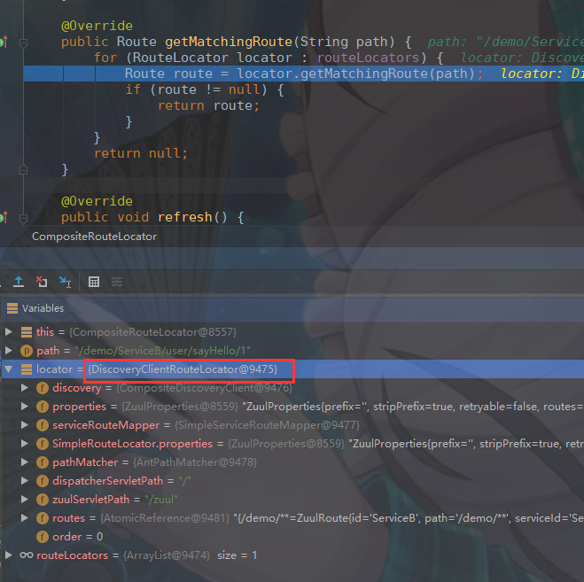

route默认核心逻辑SimpleRouteLocator

```java
//DiscoveryClientRouteLocator是包装一下，主要逻辑在父类SimpleRouteLocator中
public class DiscoveryClientRouteLocator extends SimpleRouteLocator
		implements RefreshableRouteLocator {
........................ 
}

public class SimpleRouteLocator implements RouteLocator, Ordered {
..................
	@Override
	public Route getMatchingRoute(final String path) {
		return getSimpleMatchingRoute(path);
	}
.................
	protected Route getSimpleMatchingRoute(final String path) {
    	//如果你是调试模式的话，需要他打印很多debug日志，可以在请求里面加一个debug=true的参数，然后后面的各种debug日志都会打印出来，DebugFilter中会处理这个事情的
		if (log.isDebugEnabled()) {
			log.debug("Finding route for path: " + path);
		}

		// This is called for the initialization done in getRoutesMap()
		//初始化
		getRoutesMap();

		if (log.isDebugEnabled()) {
			log.debug("servletPath=" + this.dispatcherServletPath);
			log.debug("zuulServletPath=" + this.zuulServletPath);
			log.debug("RequestUtils.isDispatcherServletRequest()="
					+ RequestUtils.isDispatcherServletRequest());
			log.debug("RequestUtils.isZuulServletRequest()="
					+ RequestUtils.isZuulServletRequest());
		}
		//默认不出来，path传进去，返回回来是一样的值
		String adjustedPath = adjustPath(path);
		//是否匹配，如果匹配的话，就直接返回ZuulRoute，就是路由规则
		ZuulRoute route = getZuulRoute(adjustedPath);

		return getRoute(route, adjustedPath);
	}
	
	protected ZuulRoute getZuulRoute(String adjustedPath) {
		if (!matchesIgnoredPatterns(adjustedPath)) {
			for (Entry<String, ZuulRoute> entry : getRoutesMap().entrySet()) {
				String pattern = entry.getKey();
				log.debug("Matching pattern:" + pattern);
                //是否匹配，如果匹配的话，就直接返回ZuulRoute
				if (this.pathMatcher.match(pattern, adjustedPath)) {
                    //对应demo匹配了，就返回对应demp的ZuulRote
					return entry.getValue();
				}
			}
		}
		return null;
	}
	
	protected Route getRoute(ZuulRoute route, String path) {
		if (route == null) {
			return null;
		}
		if (log.isDebugEnabled()) {
			log.debug("route matched=" + route);
		}
        //创建了一个Route对象，先搞到了一个ZuulRoute的这么一个东西，这个东西里面封装了一些基本的路由规则，然后对这个ZuulRoute再次进行了解析，以及一些转换，尤其是处理出来了几个数据，封装了一个Route对象
		String targetPath = path;
		String prefix = this.properties.getPrefix();
		if(prefix.endsWith("/")) {
			prefix = prefix.substring(0, prefix.length() - 1);
		}
		if (path.startsWith(prefix + "/") && this.properties.isStripPrefix()) {
			targetPath = path.substring(prefix.length());
		}
		if (route.isStripPrefix()) {
			int index = route.getPath().indexOf("*") - 1;
			if (index > 0) {
				String routePrefix = route.getPath().substring(0, index);
				targetPath = targetPath.replaceFirst(routePrefix, "");
				prefix = prefix + routePrefix;
			}
		}
		Boolean retryable = this.properties.getRetryable();
		if (route.getRetryable() != null) {
			retryable = route.getRetryable();
		}
        //通过ZuulRoute和path得到了一个Route对象
		return new Route(route.getId(), targetPath, route.getLocation(), prefix,
				retryable,
				route.isCustomSensitiveHeaders() ? route.getSensitiveHeaders() : null, 
				route.isStripPrefix());
	}
.................
    //这里面的if都不进去，就是打印个日志
	private String adjustPath(final String path) {
		String adjustedPath = path;

		if (RequestUtils.isDispatcherServletRequest()
				&& StringUtils.hasText(this.dispatcherServletPath)) {
			if (!this.dispatcherServletPath.equals("/")) {
				adjustedPath = path.substring(this.dispatcherServletPath.length());
				log.debug("Stripped dispatcherServletPath");
			}
		}
		else if (RequestUtils.isZuulServletRequest()) {
			if (StringUtils.hasText(this.zuulServletPath)
					&& !this.zuulServletPath.equals("/")) {
				adjustedPath = path.substring(this.zuulServletPath.length());
				log.debug("Stripped zuulServletPath");
			}
		}
		else {
			// do nothing
		}

		log.debug("adjustedPath=" + adjustedPath);
		return adjustedPath;
	}
.................
}
```

getZuulRoute方法中的遍历map的值，匹配到demo/** 则返回ZuulRoute

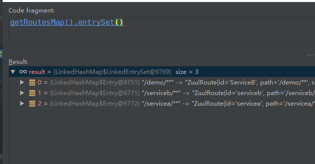

获取Route的核心方法getSimpleMatchingRoute最后return的断点

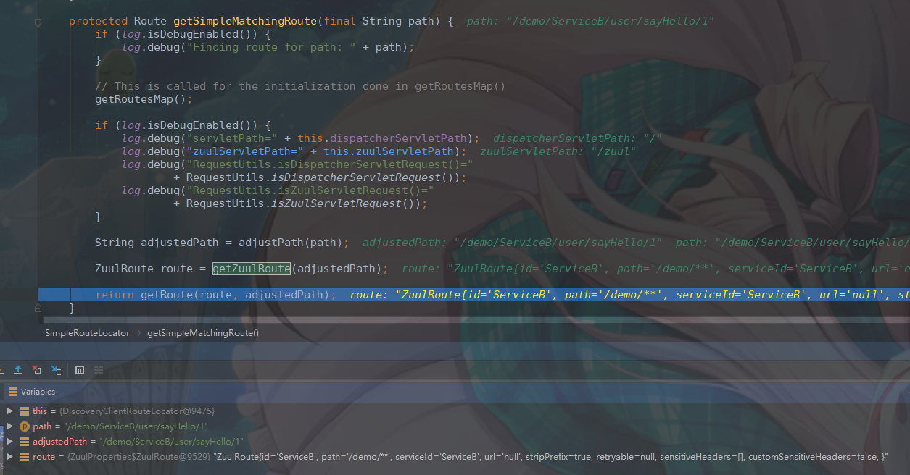


## 2.4 route过滤器源码

### 2.4.1 route相关过滤器

```
routing过滤器

10：RibbonRoutingFilter
100：SimpleHostRoutingFilter
500：SendForwardFilter
```

对应route过滤器执行，和pre过滤器套路是一样的

```java
public class ZuulRunner {
......................
    public void route() throws ZuulException {
        FilterProcessor.getInstance().route();
    }
......................
}
```

对应route过滤器执行，和pre过滤器套路是一样的

```java
public class FilterProcessor {
......................
    public void route() throws ZuulException {
        try {
            runFilters("route");
        } catch (ZuulException e) {
            throw e;
        } catch (Throwable e) {
            throw new ZuulException(e, 500, "UNCAUGHT_EXCEPTION_IN_ROUTE_FILTER_" + e.getClass().getName());
        }
    }
......................
}
```

对应runFilters方法断点

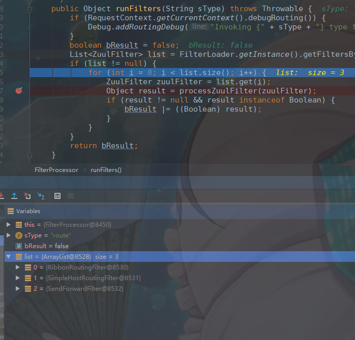

**RibbonRoutingFilter => 将请求转发到服务的(正常来说都会配置服务，走这个过滤器)**

```java
public class RibbonRoutingFilter extends ZuulFilter {
.........................
    //没有配置服务则不执行
	@Override
	public boolean shouldFilter() {
		RequestContext ctx = RequestContext.getCurrentContext();
		return (ctx.getRouteHost() == null && ctx.get(SERVICE_ID_KEY) != null
				&& ctx.sendZuulResponse());
	}

	@Override
	public Object run() {
		RequestContext context = RequestContext.getCurrentContext();
		this.helper.addIgnoredHeaders();
		try {
			RibbonCommandContext commandContext = buildCommandContext(context);
			ClientHttpResponse response = forward(commandContext);
			setResponse(response);
			return response;
		}
		catch (ZuulException ex) {
			throw new ZuulRuntimeException(ex);
		}
		catch (Exception ex) {
			throw new ZuulRuntimeException(ex);
		}
	}
.........................
}
```

**SimpleHostRoutingFilter => 将请求转发到某个url地址的(很少用，没配置则不会执行)**

如果你要转发给某个url地址，就是这个过滤器来干，源码非常简单，很少用

其实就是处理一下请求头、请求参数、请求体（json数据），然后交给底层的http组件，将这个请求发给指定的主机名:端口号，就ok了

```java
public class SimpleHostRoutingFilter extends ZuulFilter {
...................
	//没有配置RouteHost（url地址）则不执行
	@Override
	public boolean shouldFilter() {
		return RequestContext.getCurrentContext().getRouteHost() != null
				&& RequestContext.getCurrentContext().sendZuulResponse();
	}

	@Override
	public Object run() {
		RequestContext context = RequestContext.getCurrentContext();
		HttpServletRequest request = context.getRequest();
		MultiValueMap<String, String> headers = this.helper
				.buildZuulRequestHeaders(request);
		MultiValueMap<String, String> params = this.helper
				.buildZuulRequestQueryParams(request);
		String verb = getVerb(request);
		InputStream requestEntity = getRequestBody(request);
		if (request.getContentLength() < 0) {
			context.setChunkedRequestBody();
		}
		
		String uri = this.helper.buildZuulRequestURI(request);
		this.helper.addIgnoredHeaders();

		try {
            //然后交给底层的http组件，将这个请求发给指定的主机名
			CloseableHttpResponse response = forward(this.httpClient, verb, uri, request,
					headers, params, requestEntity);
			setResponse(response);
		}
		catch (Exception ex) {
			throw new ZuulRuntimeException(ex);
		}
		return null;
	}
.....................
}
```

**SendForwardFilter => 将请求转发到zuul网关服务自己的一个接口上去(很少用，没配置则不执行)**

```java
public class SendForwardFilter extends ZuulFilter {
    
.............................

    //没有配置(FORWARD_TO_KEY = "forward.to")则不执行
	@Override
	public boolean shouldFilter() {
		RequestContext ctx = RequestContext.getCurrentContext();
		return ctx.containsKey(FORWARD_TO_KEY)
				&& !ctx.getBoolean(SEND_FORWARD_FILTER_RAN, false);
	}

	@Override
	public Object run() {
		try {
			RequestContext ctx = RequestContext.getCurrentContext();
			String path = (String) ctx.get(FORWARD_TO_KEY);
            //java web的最最基础和原生的api，RequestDispacher进行请求转发，将这个请求转发给本地其他的这个接口来处理
			RequestDispatcher dispatcher = ctx.getRequest().getRequestDispatcher(path);
			if (dispatcher != null) {
				ctx.set(SEND_FORWARD_FILTER_RAN, true);
				if (!ctx.getResponse().isCommitted()) {
					dispatcher.forward(ctx.getRequest(), ctx.getResponse());
					ctx.getResponse().flushBuffer();
				}
			}
		}
		catch (Exception ex) {
			ReflectionUtils.rethrowRuntimeException(ex);
		}
		return null;
	}

}
```


### 2.4.2 RibbonRoutingFilter是如何将请求转发给服务的


```java
public class RibbonRoutingFilter extends ZuulFilter {
................
	@Override
	public Object run() {
		RequestContext context = RequestContext.getCurrentContext();
		this.helper.addIgnoredHeaders();
		try {
            //构建RibbonCommandContext
			RibbonCommandContext commandContext = buildCommandContext(context);
            //forward真正执行请求的方法
			ClientHttpResponse response = forward(commandContext);
			setResponse(response);
			return response;
		}
		catch (ZuulException ex) {
			throw new ZuulRuntimeException(ex);
		}
		catch (Exception ex) {
			throw new ZuulRuntimeException(ex);
		}
	}
    
    //这个方法就是通过RequestContext去构建一个RibbonCommandContext
	protected RibbonCommandContext buildCommandContext(RequestContext context) {
		HttpServletRequest request = context.getRequest();

		MultiValueMap<String, String> headers = this.helper
				.buildZuulRequestHeaders(request);
		MultiValueMap<String, String> params = this.helper
				.buildZuulRequestQueryParams(request);
		String verb = getVerb(request);
		InputStream requestEntity = getRequestBody(request);
		if (request.getContentLength() < 0 && !verb.equalsIgnoreCase("GET")) {
			context.setChunkedRequestBody();
		}

		String serviceId = (String) context.get(SERVICE_ID_KEY);
		Boolean retryable = (Boolean) context.get(RETRYABLE_KEY);
		Object loadBalancerKey = context.get(LOAD_BALANCER_KEY);

		String uri = this.helper.buildZuulRequestURI(request);

		// remove double slashes
		uri = uri.replace("//", "/");

		long contentLength = useServlet31 ? request.getContentLengthLong(): request.getContentLength();
		
		return new RibbonCommandContext(serviceId, verb, uri, retryable, headers, params,
				requestEntity, this.requestCustomizers, contentLength, loadBalancerKey);
	}
    
    //核心方法，发送请求
	protected ClientHttpResponse forward(RibbonCommandContext context) throws Exception {
		Map<String, Object> info = this.helper.debug(context.getMethod(),
				context.getUri(), context.getHeaders(), context.getParams(),
				context.getRequestEntity());
		//构建RibbonCommand(HttpClientRibbonCommand)
		RibbonCommand command = this.ribbonCommandFactory.create(context);
		try {
            //RibbonCommand其实就是hystrix的command，其中集成了ribbon的负载均衡逻辑
			//负载均衡选择server,发送请求到对应服务
            //返回ClientHttpResponse response
            //command.execute()很明显就是调用hystrix的command执行的方法
			ClientHttpResponse response = command.execute();
			this.helper.appendDebug(info, response.getRawStatusCode(), response.getHeaders());
			return response;
		}
		catch (HystrixRuntimeException ex) {
			return handleException(info, ex);
		}

	}
................
}
```

buildCommandContext最后构建RibbonCommandContext的相关参数

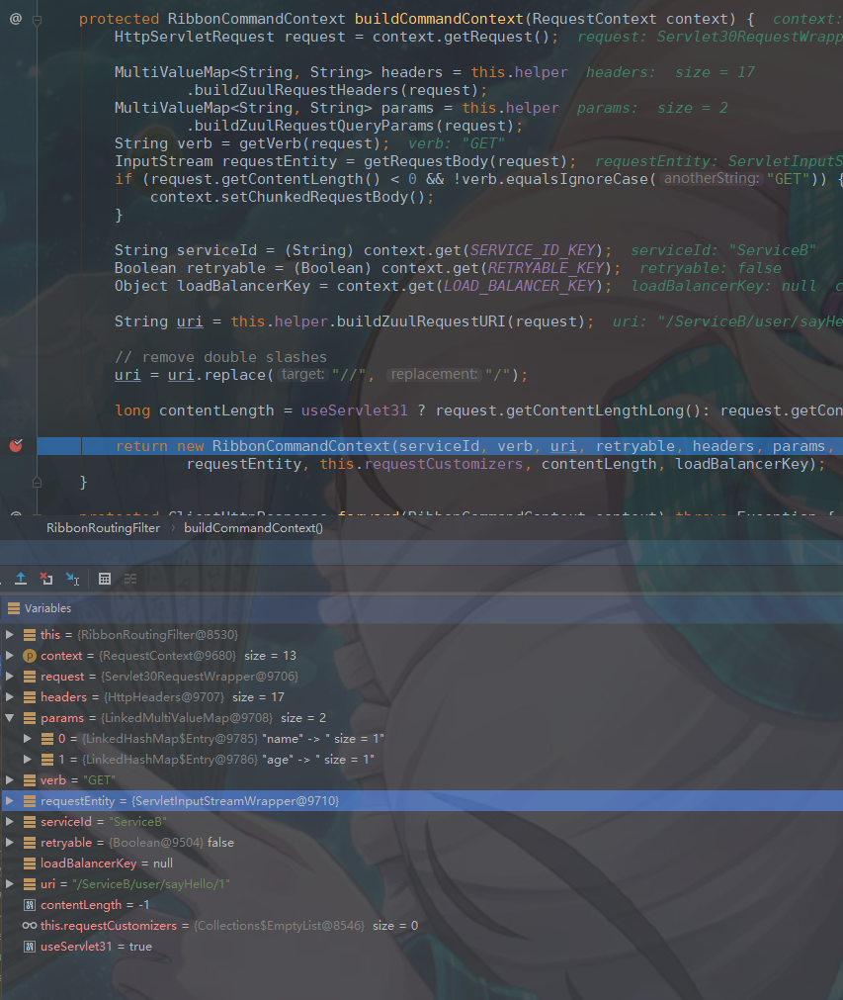

构建完成的RibbonCommandContext

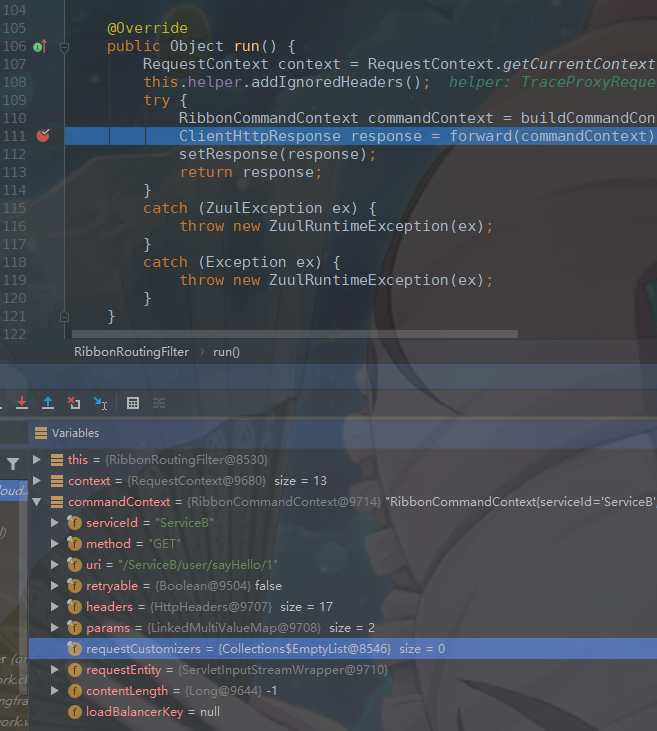

HttpClientRibbonCommand（继承自HystrixCommand），里面实现了run()逻辑，实现了这个command要发送的请求的核心逻辑

```java
public class HttpClientRibbonCommandFactory extends AbstractRibbonCommandFactory {
...................
    //构建核心组件HttpClientRibbonCommand
    //HttpClientRibbonCommand，他核心的一点就是自己设置的那个run()方法，封装了自己核心的业务逻辑，发送一个请求出去
	@Override
	public HttpClientRibbonCommand create(final RibbonCommandContext context) {
		ZuulFallbackProvider zuulFallbackProvider = getFallbackProvider(context.getServiceId());
		final String serviceId = context.getServiceId();
    	//获取对应的loadBlance
		final RibbonLoadBalancingHttpClient client = this.clientFactory.getClient(
				serviceId, RibbonLoadBalancingHttpClient.class);
    	//这里的loadBalancer就是ZoneAwareLoadBalancer
		client.setLoadBalancer(this.clientFactory.getLoadBalancer(serviceId));

		return new HttpClientRibbonCommand(serviceId, client, context, zuulProperties, zuulFallbackProvider,
				clientFactory.getClientConfig(serviceId));
	}
}
```

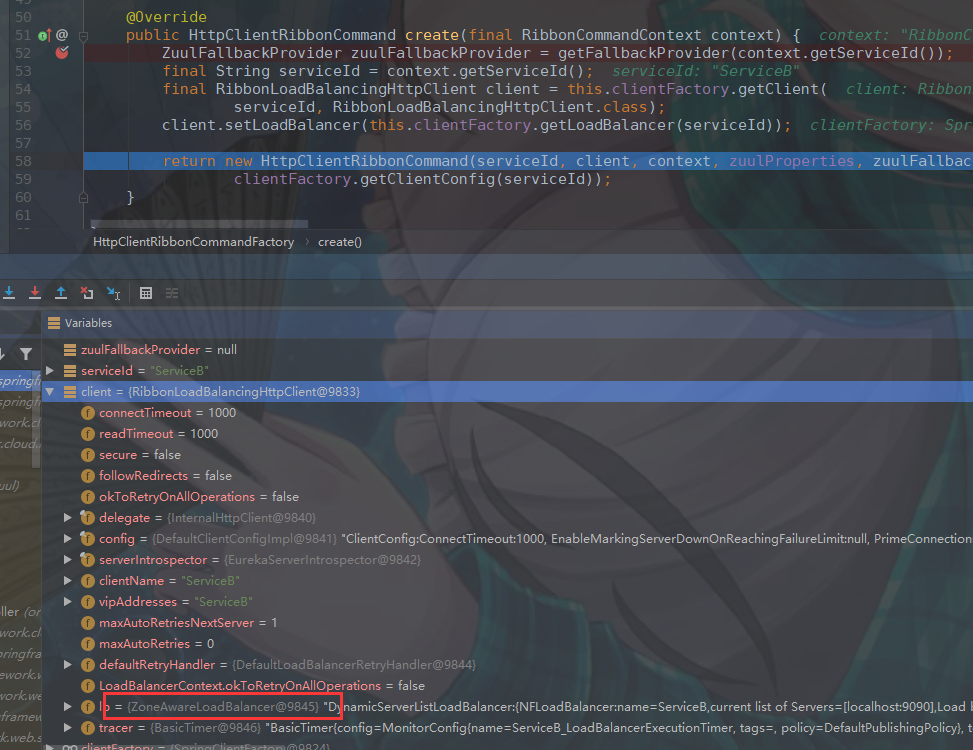

HttpClientRibbonCommand这个类里面没什么逻辑，主要逻辑在父类

```java
public class HttpClientRibbonCommand extends AbstractRibbonCommand<RibbonLoadBalancingHttpClient, RibbonApacheHttpRequest, RibbonApacheHttpResponse> {
................
//构建HttpClientRibbonCommand
public HttpClientRibbonCommand(final String commandKey,
								   final RibbonLoadBalancingHttpClient client,
								   final RibbonCommandContext context,
								   final ZuulProperties zuulProperties,
								   final ZuulFallbackProvider zuulFallbackProvider,
								   final IClientConfig config) {
		super(commandKey, client, context, zuulProperties, zuulFallbackProvider, config);
	}
................
}
//核心类AbstractRibbonCommand，结合hystrix和ribbon，发送请求
public abstract class AbstractRibbonCommand<LBC extends AbstractLoadBalancerAwareClient<RQ, RS>, RQ extends ClientRequest, RS extends HttpResponse>
		extends HystrixCommand<ClientHttpResponse> implements RibbonCommand {
...............
	public AbstractRibbonCommand(String commandKey, LBC client,
								 RibbonCommandContext context, ZuulProperties zuulProperties,
								 ZuulFallbackProvider fallbackProvider, IClientConfig config) {
		this(getSetter(commandKey, zuulProperties, config), client, context, fallbackProvider, config);
	}
............
    //run方法，发送请求
	@Override
	protected ClientHttpResponse run() throws Exception {
		final RequestContext context = RequestContext.getCurrentContext();

		RQ request = createRequest();
		RS response;
		
		boolean retryableClient = this.client instanceof AbstractLoadBalancingClient
				&& ((AbstractLoadBalancingClient)this.client).isClientRetryable((ContextAwareRequest)request);
		
		if (retryableClient) {
			response = this.client.execute(request, config);
		} else {
			response = this.client.executeWithLoadBalancer(request, config);
		}
		context.set("ribbonResponse", response);

		// Explicitly close the HttpResponse if the Hystrix command timed out to
		// release the underlying HTTP connection held by the response.
		//
		if (this.isResponseTimedOut()) {
			if (response != null) {
				response.close();
			}
		}
		//最终返回结果
		return new RibbonHttpResponse(response);
	}
}
```


## 2.5 post过滤器

```
post过滤器

LocationRewriteFilter 不执行(没有初始化)

1000：SendResponseFilter


```

LocationRewriteFilter 这个filter默认情况下没跑，看看说响应结果是否是要进行请求重定向，如果是的话才会执行，但是这里默认一般不是

对应post过滤器执行，和pre过滤器套路是一样的

```java
public class ZuulRunner {
......................
    public void postRoute() throws ZuulException {
        FilterProcessor.getInstance().postRoute();
    }
......................
}
```

对应post过滤器执行，和pre过滤器套路是一样的

```java
public class FilterProcessor {
......................
    public void postRoute() throws ZuulException {
        try {
            runFilters("post");
        } catch (ZuulException e) {
            throw e;
        } catch (Throwable e) {
            throw new ZuulException(e, 500, "UNCAUGHT_EXCEPTION_IN_POST_FILTER_" + e.getClass().getName());
        }
    }
......................
}
```

SendResponseFilter就是处理route过滤器返回的流，将输入流转换为输出流输出

```java
public class SendResponseFilter extends ZuulFilter {
................
	@Override
	public boolean shouldFilter() {
		RequestContext context = RequestContext.getCurrentContext();
		return context.getThrowable() == null
				&& (!context.getZuulResponseHeaders().isEmpty()
					|| context.getResponseDataStream() != null
					|| context.getResponseBody() != null);
	}

	@Override
	public Object run() {
		try {
            //根据请求头，处理一下输入流
			addResponseHeaders();
            //将输入流转换为输出流输出
			writeResponse();
		}
		catch (Exception ex) {
			ReflectionUtils.rethrowRuntimeException(ex);
		}
		return null;
	}

    //将输入流转换为输出流输出
	private void writeResponse() throws Exception {
		RequestContext context = RequestContext.getCurrentContext();
		// there is no body to send
		if (context.getResponseBody() == null
				&& context.getResponseDataStream() == null) {
			return;
		}
		HttpServletResponse servletResponse = context.getResponse();
		if (servletResponse.getCharacterEncoding() == null) { // only set if not set
			servletResponse.setCharacterEncoding("UTF-8");
		}
        //ServletResponse是原生的servletResponse，获取到了针对浏览器的一个输出流，outStream就是一个输出流
		OutputStream outStream = servletResponse.getOutputStream();
		InputStream is = null;
		try {
			if (RequestContext.getCurrentContext().getResponseBody() != null) {
				String body = RequestContext.getCurrentContext().getResponseBody();
				writeResponse(
						new ByteArrayInputStream(
								body.getBytes(servletResponse.getCharacterEncoding())),
						outStream);
				return;
			}
			boolean isGzipRequested = false;
			final String requestEncoding = context.getRequest()
					.getHeader(ZuulHeaders.ACCEPT_ENCODING);

			if (requestEncoding != null
					&& HTTPRequestUtils.getInstance().isGzipped(requestEncoding)) {
				isGzipRequested = true;
			}
			is = context.getResponseDataStream();
			InputStream inputStream = is;
			if (is != null) {
				if (context.sendZuulResponse()) {
					// if origin response is gzipped, and client has not requested gzip,
					// decompress stream
					// before sending to client
					// else, stream gzip directly to client
					if (context.getResponseGZipped() && !isGzipRequested) {
						// If origin tell it's GZipped but the content is ZERO bytes,
						// don't try to uncompress
						final Long len = context.getOriginContentLength();
						if (len == null || len > 0) {
							try {
								inputStream = new GZIPInputStream(is);
							}
							catch (java.util.zip.ZipException ex) {
								log.debug(
										"gzip expected but not "
												+ "received assuming unencoded response "
												+ RequestContext.getCurrentContext()
												.getRequest().getRequestURL()
												.toString());
								inputStream = is;
							}
						}
						else {
							// Already done : inputStream = is;
						}
					}
					else if (context.getResponseGZipped() && isGzipRequested) {
						servletResponse.setHeader(ZuulHeaders.CONTENT_ENCODING, "gzip");
					}
					writeResponse(inputStream, outStream);
				}
			}
		}
		finally {
			/**
			* We must ensure that the InputStream provided by our upstream pooling mechanism is ALWAYS closed
		 	* even in the case of wrapped streams, which are supplied by pooled sources such as Apache's
		 	* PoolingHttpClientConnectionManager. In that particular case, the underlying HTTP connection will
		 	* be returned back to the connection pool iif either close() is explicitly called, a read
			* error occurs, or the end of the underlying stream is reached. If, however a write error occurs, we will
			* end up leaking a connection from the pool without an explicit close()
			*
			* @author Johannes Edmeier
			*/
			if (is != null) {
				try {
					is.close();
				}
				catch (Exception ex) {
					log.warn("Error while closing upstream input stream", ex);
				}
			}

			try {
				Object zuulResponse = RequestContext.getCurrentContext()
						.get("zuulResponse");
				if (zuulResponse instanceof Closeable) {
					((Closeable) zuulResponse).close();
				}
				outStream.flush();
				// The container will close the stream for us
			}
			catch (IOException ex) {
				log.warn("Error while sending response to client: " + ex.getMessage());
			}
		}
	}

    //inputStream是服务B返回的json串读取的输入流，outStream是针对浏览器的一个输出流，他其实就是会从inputStream输入流中读取json串，然后写到outStream输出流中，写给浏览器
	private void writeResponse(InputStream zin, OutputStream out) throws Exception {
		byte[] bytes = buffers.get();
		int bytesRead = -1;
		while ((bytesRead = zin.read(bytes)) != -1) {
			out.write(bytes, 0, bytesRead);
		}
	}

    //根据请求头，处理一下输入流
	private void addResponseHeaders() {
		RequestContext context = RequestContext.getCurrentContext();
		HttpServletResponse servletResponse = context.getResponse();
		if (INCLUDE_DEBUG_HEADER.get()) {
			@SuppressWarnings("unchecked")
			List<String> rd = (List<String>) context.get(ROUTING_DEBUG_KEY);
			if (rd != null) {
				StringBuilder debugHeader = new StringBuilder();
				for (String it : rd) {
					debugHeader.append("[[[" + it + "]]]");
				}
				servletResponse.addHeader(X_ZUUL_DEBUG_HEADER, debugHeader.toString());
			}
		}
		List<Pair<String, String>> zuulResponseHeaders = context.getZuulResponseHeaders();
		if (zuulResponseHeaders != null) {
			for (Pair<String, String> it : zuulResponseHeaders) {
				servletResponse.addHeader(it.first(), it.second());
			}
		}
		// Only inserts Content-Length if origin provides it and origin response is not
		// gzipped
		if (SET_CONTENT_LENGTH.get()) {
			Long contentLength = context.getOriginContentLength();
			if ( contentLength != null && !context.getResponseGZipped()) {
				if(useServlet31) {
					servletResponse.setContentLengthLong(contentLength);
				} else {
					//Try and set some kind of content length if we can safely convert the Long to an int
					if (isLongSafe(contentLength)) {
						servletResponse.setContentLength(contentLength.intValue());
					}
				}
			}
		}
	}

	private boolean isLongSafe(long value) {
		return value <= Integer.MAX_VALUE && value >= Integer.MIN_VALUE;
	}

}
```


## 2.6 error 过滤器

```
0：SendErrorFilter
```

```java
public class ZuulServlet extends HttpServlet {
.............
    //将对应异常放到RequestContext中
    //并执行error过滤器
    void error(ZuulException e) {
        RequestContext.getCurrentContext().setThrowable(e);
        zuulRunner.error();
    }
.............
}
```

对应error过滤器执行，和pre过滤器套路是一样的

```java
public class ZuulRunner {
......................
    public void error() {
        FilterProcessor.getInstance().error();
    }
......................
}
```

对应error过滤器执行，和pre过滤器套路是一样的

```java
public class FilterProcessor {
......................
    public void error() {
        try {
            runFilters("error");
        } catch (Throwable e) {
            logger.error(e.getMessage(), e);
        }
    }
......................
}
```

**SendErrorFilter**

可以自己写一个controller（**BasicErrorController**），**专门来处理zuul的所有异常报错，继承另外一个controller的基类就可以了，这样的话就可以实现统一的异常处理**

**默认情况下，如果有异常，打印出异常日志，在控制台，将异常信息输出到浏览器中去**

```java
public class SendErrorFilter extends ZuulFilter {
..........................
	@Override
	public boolean shouldFilter() {
		RequestContext ctx = RequestContext.getCurrentContext();
		// only forward to errorPath if it hasn't been forwarded to already
		return ctx.getThrowable() != null
				&& !ctx.getBoolean(SEND_ERROR_FILTER_RAN, false);
	}
     //之前的pre阶段、route阶段、post阶段，任何一个阶段抛出了异常，都会执行SendErrorFilter
	@Override
	public Object run() {
		try {
			RequestContext ctx = RequestContext.getCurrentContext();
			ZuulException exception = findZuulException(ctx.getThrowable());
			HttpServletRequest request = ctx.getRequest();

			request.setAttribute("javax.servlet.error.status_code", exception.nStatusCode);

			log.warn("Error during filtering", exception);
			request.setAttribute("javax.servlet.error.exception", exception);

			if (StringUtils.hasText(exception.errorCause)) {
				request.setAttribute("javax.servlet.error.message", exception.errorCause);
			}
			//初始化一个RequestDispatcher去发送请求
			RequestDispatcher dispatcher = request.getRequestDispatcher(
					this.errorPath);
			if (dispatcher != null) {
				ctx.set(SEND_ERROR_FILTER_RAN, true);
				if (!ctx.getResponse().isCommitted()) {
					ctx.setResponseStatusCode(exception.nStatusCode);
                    //将错误信息发送给对应BasicErrorController
					dispatcher.forward(request, ctx.getResponse());
				}
			}
		}
		catch (Exception ex) {
			ReflectionUtils.rethrowRuntimeException(ex);
		}
		return null;
	}
..........................
}

```

对应error过滤器

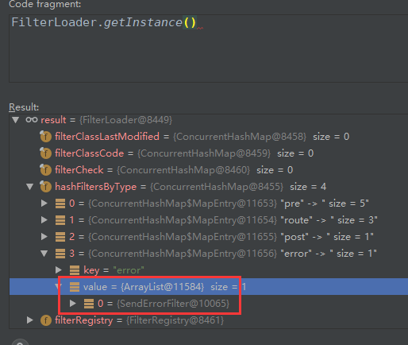

**PS:对应服务抛出异常并不会进入errorFilter,只是返回了对应的500等状态。需要zuul内部抛出异常才会进入**

​	**所以说统一异常处理需要在自定义过滤器抛出异常(检测接口返回状态去自己抛异常出来)，然后再由error过滤器转发给对应BasicErrorController才能进行统一异常处理。**

下图返回结果为对应服务抛出异常的500状态

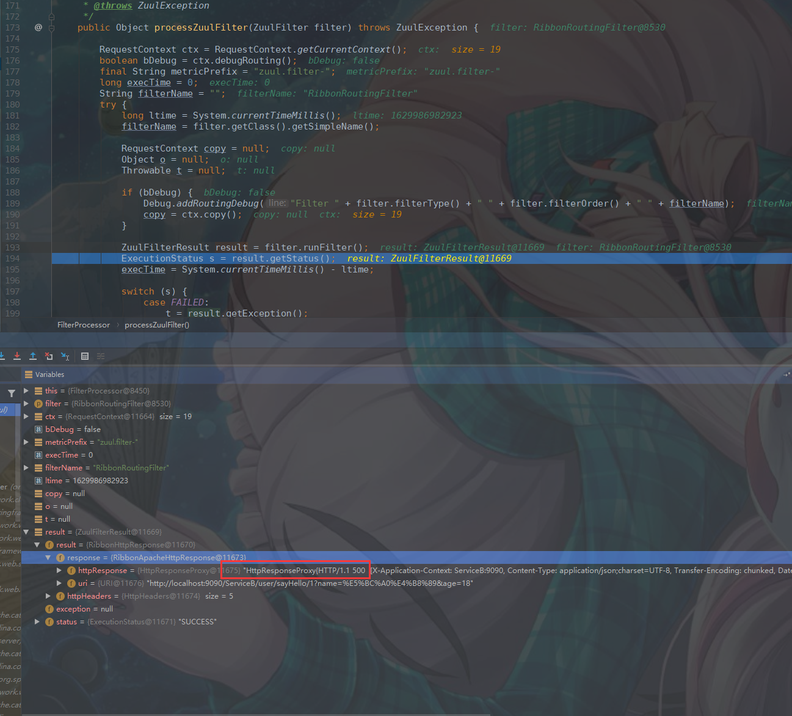

# 3 流程图

https://www.processon.com/view/link/612827461efad40d93804b3d

