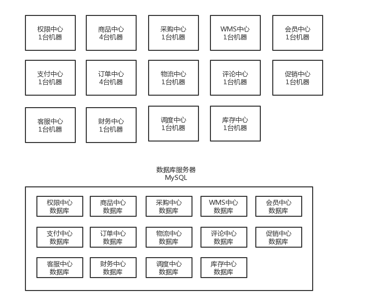

# 1 前言

## 1.1 微服务架构在团队管理及开发的意义

​	 技术团队可能会快速膨胀到50人-00人+，这里面，后端团队占个一半，20多人，是妥妥的。你作为一个技术leader，马上手下可能就是有20多人了，此时你肯定也是分为多个小team，每个小团队在3-5人之间，然后一个小团队负责一个或者多个子系统，或者是中心。比如说，有个3人的小团队，专门负责订单中心这块的开发；然后有一个4人的小团队，专门负责商品中心这块的开发。

​	你就是一个技术leader，20多人~四五十人不等，不断的在招人

​	架构出来一整套标准和规范的微服务架构，可以支持几十个人，能够以最高的效率支持业务和版本的快速迭代

## 1.2 没有微服务的复杂单系统存在的问题

1、代码重复问题

​	如果需要其他模块的弟兄提供接口。人越多，沟通成本越高，协作成本越高。码农，一般如果能自己干活儿，他就不会去找别人去干。尤其你找别人说个事儿，帮个忙， 都不太方便，人家如果让你等，你就不耐烦了，SQL，接口不要了。会自己去写。都这样干的话会造成大量重复代码。

2 、多人协作效率问题

​	在公共的模块，超过5个人修改一份代码，冲突就很常见了，修复代码冲突的时候，一般要好几个人坐在一块儿，看着那个代码，仔仔细细的解决冲突，非常影响效率。

​	修改了一点小功能去上线，都需要其他模块的开发者参与，虽然其他模块的兄弟代码完全没改，但是也需要去保障，如果每次上线需要依赖一些相关的脚本、检查日志等，都要重新操作一遍，非常麻烦。

3、扩容问题

​	不同的业务和代码对系统设计师不一样的。负责商品中心需要去扩容，而会员中心等模块完全不需要扩容，扩容会浪费资源。

​	而且其他不需要扩容的模块代码如果在内存中保存了一些访问状态，扩容会直接导致Bug的产生。

​	访问状态案例：扩容，2台机器，同一个用户的请求可能会打到不同的机器上去，可能就会出现，一台机器统计了用户A的访问次数是5次，另外一台机器统计了用户A的访问次数是3次。其实如果是在一台机器上的话，应该统计出来的是用户A的访问次数是8次。

4、可用性问题

​	某个模块写的代码有严重bug，死循环,io未关闭等，把内存或者cpu全部占用，导致服务器宕机等问题。会导致整个系统不可用

## 1.3 微服务架构概述及解决的问题

### 1.3.1 概述

​	14个中心，10万行代码，就是一个工程，部署在一台机器上，单块应用

​	14个中心，拆分成14个服务，每个服务几千行代码，14个工程，部署在14台机器上，微服务架构，通过网络通信来调用接口。订单中心，本来调用商品中心的接口，走的是本地的spring ioc，调用商品中心的service就 可以了。发送http请求，请求商品中心的一个http接口，就可以了。

### 1.2.2 代码复用性问题

​	现在每个中心拆成独立的服务，每个服务有自己的库，而且只有本中心的兄弟有访问那个库的权限，其他中心的兄弟没权限访问。就不会重复写一些查询或者其他的重复代码了。只有拜托对应的负责人提供接口。

### 1.2.3 多人协作效率问题

​	自己就搞好自己的一个小服务就行了，代码仓库是你自己的，没有冲突，测试是你自己的事儿，就部署你自己的测你自己的好了，上线就你自己的服务上线，跟人家没关系。体验过几十人开发一个单块应用之后，再来微服务，你就一个字：爽。

### 1.2.4 扩容问题 

​	同上，你就自己管自己的好了，哪儿来那么多事儿，自己需要就扩容，自己不需要就不扩容，跟人家没关系。体验过几十人开发一个单块应用之后，再来微服务，你就一个字：爽。

### 1.2.5  可用性问题

同上，人家死循环服务死掉了，是他的事儿，你做好熔断和降级就好了，他的服务死了，你就降级。体验过几十人开发一个单块应用之后，再来微服务，你就一个字：爽。56229

# 2 微服务技术架构(2018年前后)

**1、微服务技术基础架构**

​	**PS:21年前后流行的spring cloud alibaba待后续补充，欠账。。**

​	dubbo的定位RPC框架。

​	spring cloud，一站式微服务架构解决方案，微服务全家桶。

（01）服务网关：zuul

（02）服务注册发现：Eureka 

（03）负载均衡：Ribbon

（04）声明式REST调用：Feign

（05）限流熔断：Hystrix

（06）认证授权：Spring Security + OAuth2 + JWT

（07）消息中间件：RabbitMQ + Spring Cloud Stream(现在是RocketMq或kafka为主流)

（08）分布式协调：Spring Cloud ZooKeeper

（09）开发框架：Spring Boot + Spring Web MVC + Spring Core + MyBatis

（10）服务文档：SwaggerUI

（11）消费者驱动式契约：Spring Cloud Contract

简陋的微服务架构图

**2、分布式系统架构**

电商系统，就已经变成分布式系统架构了，分布式电商系统。

微服务之后就变成了分布式系统了，此时分布式事务、分布式锁、分布式会话、单点登录、分布式一致性、分布式接口幂等性，等等技术问题，都会显现出来，所以我们需要对分布式电商系统，解决各种各样的技术问题

**3、微服务高可用架构**

微服务之后，保证系统基本的可用性以及可靠性，避免服务雪崩等问题

**4、容器技术**

微服务化了之后，就会导致本来就1台机器，1个工程。几十个服务，几十台机器。管理大量的微服务，就要使用docker + k8s容器技术。

docker + k8s（kubernetes）

**5、DevOps + 持续集成 + 持续交付**

jenkins + 自动化测试 + 自动化部署

打包 -> 单元测试 -> 运行静态代码检测 -> 自动部署到集成测试环境 -> 运行自动化的集成测试 -> 自动部署到系统测试环境 -> 运行自动化的系统测试 -> 自动部署到预发布环境 -> 运行自动化的压力测试/可用性测试

手动控制，全自动化部署到线上生产环境，部署之后，自动化检查日志、监控项、线上验证测试

**6、微服务支撑运维平台**

（1）日志中心：ELK + Kafka + 自研组件，亿级大规模日志中心架构设计

（2）机器与Metrics监控：OpenFalcon

（3）配置中心：Apollo，先剖析源码，再投入使用

**7、敏捷开发和项目管理**

敏捷式的支持快速迭代的开发流程以及项目管理流程

**8、微服务治理平台**

​	自己研发。。。。先看下大众点评CAT的源码，因为CAT是开源的实现了调用链跟踪的监控系统，但是CAT实际上在国内应用不广泛，而且有很多问题，那我们还不如自己做一个包含调用链监控的整套微服务治理平台

（1）服务分层

（2）服务鉴权

（3）自动化故障诊断

（4）容量预估以及扩容告警

（5）可用性监测

（6）QPS、请求量、响应时间的监测

（7）性能瓶颈定位
（8）调用链跟踪

（9）接口版本管理

（10）服务上下线审批

（11）流量控制

（12）等等。。。。。

在这里，我们来全程自己研发一个可以投入生产环境使用的微服务治理平台v0.1，一站式满足微服务架构的治理需求

**9、100台机器部署整套系统**

​	阿里云，租用100台机器，大部分都是4核8G的标配虚拟机，把上面做好的整套系统，都部署到上百台机器的线上生产环境中去，线上环境是怎么部署的，参数怎么设置的

**10、线上生产环境的工程实践**

（1）A/B测试

（2）蓝绿部署

（3）灰度发布

（4）全链路压测

（5）系统回滚

**11、线上生产环境的4000/s压力测试以及高可用容灾演练**

（1）线上系统部署之后，压测验证可以支撑高峰期4000/s的请求，绝对没问题，系统无压力

（2）线上系统演示各种服务宕机、流量过载、服务雪崩之后的故障，同时验证系统在各种故障下可以保持可用

**12、微服务核心技术源码剖析**

（1）Spring Cloud核心技术源码剖析

（2）Dubbo学习一下&源码剖析

（3）Apollo源码剖析

**13、领域驱动建模**

业务复杂10倍的阶段去，那个时候业务复杂了10倍，我们可以来实践领域驱动建模。

