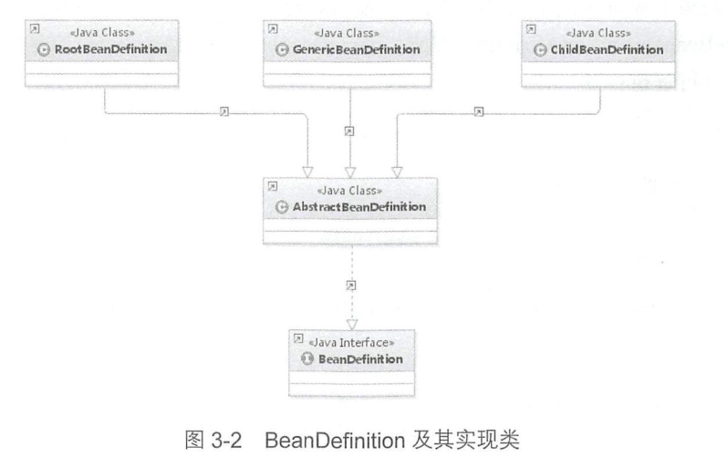
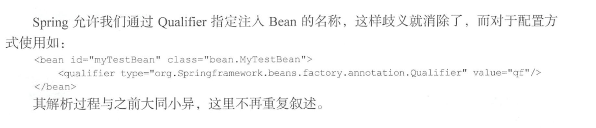
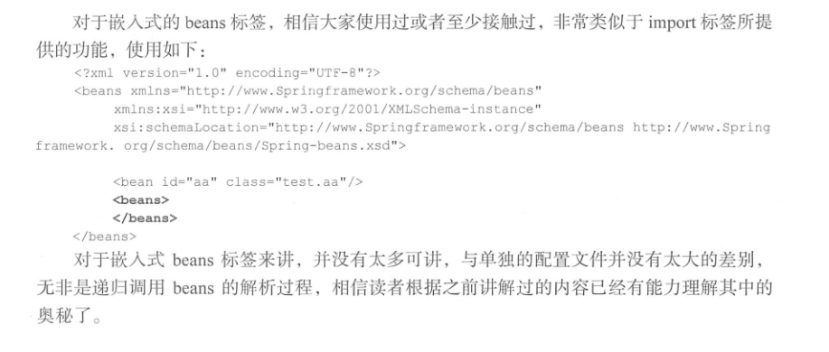

# 默认标签的解析	

默认标签的解析是在parseDefaultElement函数中进行的，函数中的功能逻辑一目了然，分别对4种不同标签( import、alias、bean和 beans）做了不同的处理

```java
public class DefaultBeanDefinitionDocumentReader implements BeanDefinitionDocumentReader	
	private void parseDefaultElement(Element ele, BeanDefinitionParserDelegate delegate) {
    	//对import标签处理
		if (delegate.nodeNameEquals(ele, IMPORT_ELEMENT)) {
			importBeanDefinitionResource(ele);
		}
    	//对alias标签的处理
		else if (delegate.nodeNameEquals(ele, ALIAS_ELEMENT)) {
			processAliasRegistration(ele);
		}
    	//对bean标签的处理
		else if (delegate.nodeNameEquals(ele, BEAN_ELEMENT)) {
			processBeanDefinition(ele, delegate);
		}
    	//对beans标签的处理
		else if (delegate.nodeNameEquals(ele, NESTED_BEANS_ELEMENT)) {
			// recurse(递归)
			doRegisterBeanDefinitions(ele);
		}
	}
```


​	对bean标签的处理(处理给定的bean元素，解析bean定义并在注册表中注册)

```java
public class DefaultBeanDefinitionDocumentReader implements BeanDefinitionDocumentReader
	/**
	 * Process the given bean element, parsing the bean definition
	 * and registering it with the registry.
	 */
	protected void processBeanDefinition(Element ele, BeanDefinitionParserDelegate delegate) {
    	//委托给parseBeanDefinitionElement进行元素解析，返回BeanDefinitionHolder实例 -- 1.1
		BeanDefinitionHolder bdHolder = delegate.parseBeanDefinitionElement(ele);
		if (bdHolder != null) {
             //bdHolder不为空的情况下，已经包含配置文件配置的各种属性了(class,name,id,alias等)，还需对标签下的自定义标签进行检查，若存在自定义标签则对			 自定义标签进行解析
			bdHolder = delegate.decorateBeanDefinitionIfRequired(ele, bdHolder);
			try {
				// Register the final decorated instance.(对bdHolder(BeanDefinitionHolder实例)进行注册)
				BeanDefinitionReaderUtils.registerBeanDefinition(bdHolder, getReaderContext().getRegistry());
			}
			catch (BeanDefinitionStoreException ex) {
				getReaderContext().error("Failed to register bean definition with name '" +
						bdHolder.getBeanName() + "'", ele, ex);
			}
			// Send registration event.(发出相应事件，通知相关监听器，告知这个bean已经加载完成了)
			getReaderContext().fireComponentRegistered(new BeanComponentDefinition(bdHolder));
		}
	}
```

# 1 bean标签的解析及注册


## 1.1  进行元素解析

```java
//用于解析XML bean定义的有状态委托类	
public class BeanDefinitionParserDelegate 

	//解析元素
	@Nullable
	public BeanDefinitionHolder parseBeanDefinitionElement(Element ele) {
		return parseBeanDefinitionElement(ele, null);
	}

	@Nullable
	public BeanDefinitionHolder parseBeanDefinitionElement(Element ele, @Nullable BeanDefinition containingBean) {
        //解析id属性
		String id = ele.getAttribute(ID_ATTRIBUTE);
        //解析name属性
		String nameAttr = ele.getAttribute(NAME_ATTRIBUTE);
		List<String> aliases = new ArrayList<>();
        //分割name属性
		if (StringUtils.hasLength(nameAttr)) {
			String[] nameArr = StringUtils.tokenizeToStringArray(nameAttr, MULTI_VALUE_ATTRIBUTE_DELIMITERS);
			aliases.addAll(Arrays.asList(nameArr));
		}

		String beanName = id;
		if (!StringUtils.hasText(beanName) && !aliases.isEmpty()) {
			beanName = aliases.remove(0);
			if (logger.isTraceEnabled()) {
				logger.trace("No XML 'id' specified - using '" + beanName +
						"' as bean name and " + aliases + " as aliases");
			}
		}

		if (containingBean == null) {
			checkNameUniqueness(beanName, aliases, ele);
		}
		//进一步解析其他所有属性并统一封装到GenericBeanDefinition(继承AbstractBeanDefinition)实例中(步骤2)
		AbstractBeanDefinition beanDefinition = parseBeanDefinitionElement(ele, beanName, containingBean);
		if (beanDefinition != null) {
			if (!StringUtils.hasText(beanName)) {
				try {
                    //如果不存在beanName那么根据Spring中提供的命名规则为当前bean生成对应的beanName
					if (containingBean != null) {
						beanName = BeanDefinitionReaderUtils.generateBeanName(
								beanDefinition, this.readerContext.getRegistry(), true);
					}
					else {
						beanName = this.readerContext.generateBeanName(beanDefinition);
						// Register an alias for the plain bean class name, if still possible,
						// if the generator returned the class name plus a suffix.
						// This is expected for Spring 1.2/2.0 backwards compatibility.
						String beanClassName = beanDefinition.getBeanClassName();
						if (beanClassName != null &&
								beanName.startsWith(beanClassName) && beanName.length() > beanClassName.length() &&
								!this.readerContext.getRegistry().isBeanNameInUse(beanClassName)) {
							aliases.add(beanClassName);
						}
					}
					if (logger.isTraceEnabled()) {
						logger.trace("Neither XML 'id' nor 'name' specified - " +
								"using generated bean name [" + beanName + "]");
					}
				}
				catch (Exception ex) {
					error(ex.getMessage(), ele);
					return null;
				}
			}
			String[] aliasesArray = StringUtils.toStringArray(aliases);
            //将获取到的信息封装到BeanDefinitionHolder实例中
			return new BeanDefinitionHolder(beanDefinition, beanName, aliasesArray);
		}

		return null;
	}

	//步骤2 进一步解析其他所有属性并统一封装到GenericBeanDefinition
	@Nullable
	public AbstractBeanDefinition parseBeanDefinitionElement(
			Element ele, String beanName, @Nullable BeanDefinition containingBean) {

		this.parseState.push(new BeanEntry(beanName));
		
		String className = null;
        //解析class属性
		if (ele.hasAttribute(CLASS_ATTRIBUTE)) {
			className = ele.getAttribute(CLASS_ATTRIBUTE).trim();
		}
		String parent = null;
        //解析parent属性
		if (ele.hasAttribute(PARENT_ATTRIBUTE)) {
			parent = ele.getAttribute(PARENT_ATTRIBUTE);
		}

		try {
            //创建用于承载属性的AbstractBeanDefinition类型的GenericBeanDefinition
			AbstractBeanDefinition bd = createBeanDefinition(className, parent);// 1.1.1
            //硬编码解析默认bean的各种属性
			parseBeanDefinitionAttributes(ele, beanName, containingBean, bd);//1.1.2
            //提取description
			bd.setDescription(DomUtils.getChildElementValueByTagName(ele, DESCRIPTION_ELEMENT));
			//解析元数据
			parseMetaElements(ele, bd);//1.1.3
            //解析lookup-method属性
			parseLookupOverrideSubElements(ele, bd.getMethodOverrides());//1.1.4
            //解析replaced-method属性
			parseReplacedMethodSubElements(ele, bd.getMethodOverrides());//1.1.5
			//解析构造函数参数
			parseConstructorArgElements(ele, bd);//1.1.6
            //解析property子元素
			parsePropertyElements(ele, bd);//1.1.7
            //解析qualifier子元素
			parseQualifierElements(ele, bd);//1.1.8

			bd.setResource(this.readerContext.getResource());
			bd.setSource(extractSource(ele));

			return bd;
		}
		catch (ClassNotFoundException ex) {
			error("Bean class [" + className + "] not found", ele, ex);
		}
		catch (NoClassDefFoundError err) {
			error("Class that bean class [" + className + "] depends on not found", ele, err);
		}
		catch (Throwable ex) {
			error("Unexpected failure during bean definition parsing", ele, ex);
		}
		finally {
			this.parseState.pop();
		}

		return null;
	}
```


### 1.1.1 用于属性承载BeanDefinition

​	BeanDefinition是一个接口，在Spring中存在三种实现:RootBeanDefinition、ChildBean-Definition以及GenericBeanDefinition。三种实现均继承了AbstractBeanDefiniton其中BeanDefinition是配置文件<bean>元素标签在容器中的内部表示形式。<bean>元素标签拥有class、scope、lazy-init等配置属性，BeanDefinition则提供了相应的beanClass、scope、lazyInit属性，BeanDefinition和<bean>中的属性是――对应的。其中RootBeanDefinition是最常用的实现类，它对应一般性的<bean>元素标签，GenericBeanDefinition是自2.5版本以后新加入的 bean文件配置属性定义类,是一站式服务类。

​	在配置文件中可以定义父<bean>和子<bean>，父<bean>用 RootBeanDefinition表示，而子bean>用 ChildBeanDefiniton表示，而没有父<bean>的<bean>就使用RootBeanDefinition表示。AbstractBeanDefinition对两者共同的类信息进行抽象。

​	Spring 通过 BeanDefinition 将配置文件中的<bean>配置信息转换为容器的内部表示，并将这些BeanDefiniton注册到BeanDefinitonRegistry 中。Spring容器的BeanDefinitionRegistry就像是Spring配置信息的内存数据库，主要是以map的形式保存，后续操作直接从BeanDefinition-Registry中读取配置信息。它们之间的关系如图3-2所示。



​	由此可知,要解析属性首先要创建用于承载属性的实例,也就是创建**GenericBeanDefinition**类型的实例。而代码createBeanDefinition(className, parent)的作用就是实现此功能。

```java
	public class BeanDefinitionParserDelegate 
     
     //创建BeanDefinition实例
	protected AbstractBeanDefinition createBeanDefinition(@Nullable String className, @Nullable String parentName)
			throws ClassNotFoundException {

		return BeanDefinitionReaderUtils.createBeanDefinition(
				parentName, className, this.readerContext.getBeanClassLoader());
	}
```


```java
public abstract class BeanDefinitionReaderUtils

 //为给定的父名称和类名称创建一个新的GenericBeanDefinition，若已指定classLoader则直接加载Bean
public static AbstractBeanDefinition createBeanDefinition(
			@Nullable String parentName, @Nullable String className, @Nullable ClassLoader classLoader) throws ClassNotFoundException {

		GenericBeanDefinition bd = new GenericBeanDefinition();
    	//parentName可能为空
		bd.setParentName(parentName);
		if (className != null) {
			if (classLoader != null) {
                //如果classLoader不为空，则使用以传入的classLoader同一虚拟机加载类对象，否则只是记录className
				bd.setBeanClass(ClassUtils.forName(className, classLoader));
			}
			else {
				bd.setBeanClassName(className);
			}
		}
		return bd;
	}
```


### 1.1.2 硬编码解析默认bean的各种属性

### 

```java
	public abstract class BeanDefinitionParserDelegate
	/**
    * 将给定bean元素的属性应用于给定bean 定义。
    * @param ele bean声明元素
    * @param beanName bean名称
    * @param containsBean包含bean定义
    * @return 返回根据bean元素属性初始化的bean定义
    */
	public AbstractBeanDefinition parseBeanDefinitionAttributes(Element ele, String beanName,
			@Nullable BeanDefinition containingBean, AbstractBeanDefinition bd) {
		//解析singletion属性
		if (ele.hasAttribute(SINGLETON_ATTRIBUTE)) {
            //singletion已弃用，应使用scope
			error("Old 1.x 'singleton' attribute in use - upgrade to 'scope' declaration", ele);
		}
        //解析scope属性
		else if (ele.hasAttribute(SCOPE_ATTRIBUTE)) {
			bd.setScope(ele.getAttribute(SCOPE_ATTRIBUTE));
		}
		else if (containingBean != null) {
			// 在嵌入beanDifinition情况下且没有单独指定scope属性则使用父类默认的属性
			bd.setScope(containingBean.getScope());
		}
		//解析abstract属性
		if (ele.hasAttribute(ABSTRACT_ATTRIBUTE)) {
			bd.setAbstract(TRUE_VALUE.equals(ele.getAttribute(ABSTRACT_ATTRIBUTE)));
		}
		//解析lazy-init属性
		String lazyInit = ele.getAttribute(LAZY_INIT_ATTRIBUTE);
		if (isDefaultValue(lazyInit)) {
			lazyInit = this.defaults.getLazyInit();
		}
        //若没有设置或设置成其他字符都会被设置为false
		bd.setLazyInit(TRUE_VALUE.equals(lazyInit));
		//解析autowire属性
		String autowire = ele.getAttribute(AUTOWIRE_ATTRIBUTE);
		bd.setAutowireMode(getAutowireMode(autowire));
		//解析depends-on属性
		if (ele.hasAttribute(DEPENDS_ON_ATTRIBUTE)) {
			String dependsOn = ele.getAttribute(DEPENDS_ON_ATTRIBUTE);
			bd.setDependsOn(StringUtils.tokenizeToStringArray(dependsOn, MULTI_VALUE_ATTRIBUTE_DELIMITERS));
		}
		//解析autowire-candidate属性
		String autowireCandidate = ele.getAttribute(AUTOWIRE_CANDIDATE_ATTRIBUTE);
		if (isDefaultValue(autowireCandidate)) {
			String candidatePattern = this.defaults.getAutowireCandidates();
			if (candidatePattern != null) {
				String[] patterns = StringUtils.commaDelimitedListToStringArray(candidatePattern);
				bd.setAutowireCandidate(PatternMatchUtils.simpleMatch(patterns, beanName));
			}
		}
		else {
			bd.setAutowireCandidate(TRUE_VALUE.equals(autowireCandidate));
		}
		//解析primary属性
		if (ele.hasAttribute(PRIMARY_ATTRIBUTE)) {
			bd.setPrimary(TRUE_VALUE.equals(ele.getAttribute(PRIMARY_ATTRIBUTE)));
		}
		//解析init-method属性
		if (ele.hasAttribute(INIT_METHOD_ATTRIBUTE)) {
			String initMethodName = ele.getAttribute(INIT_METHOD_ATTRIBUTE);
			bd.setInitMethodName(initMethodName);
		}
		else if (this.defaults.getInitMethod() != null) {
			bd.setInitMethodName(this.defaults.getInitMethod());
			bd.setEnforceInitMethod(false);
		}
		//解析destory-mothod属性
		if (ele.hasAttribute(DESTROY_METHOD_ATTRIBUTE)) {
			String destroyMethodName = ele.getAttribute(DESTROY_METHOD_ATTRIBUTE);
			bd.setDestroyMethodName(destroyMethodName);
		}
		else if (this.defaults.getDestroyMethod() != null) {
			bd.setDestroyMethodName(this.defaults.getDestroyMethod());
			bd.setEnforceDestroyMethod(false);
		}
		//解析factory-method属性
		if (ele.hasAttribute(FACTORY_METHOD_ATTRIBUTE)) {
			bd.setFactoryMethodName(ele.getAttribute(FACTORY_METHOD_ATTRIBUTE));
		}
        //解析factory-bean属性
		if (ele.hasAttribute(FACTORY_BEAN_ATTRIBUTE)) {
			bd.setFactoryBeanName(ele.getAttribute(FACTORY_BEAN_ATTRIBUTE));
		}

		return bd;
	}
```


### 1.1.3 解析元数据meta

​	meta属性的使用

```xml
<bean id="myTestBean" class="bean. MyTestBean">
	<meta key="testStr" value="aaaaaaaa"/ >
</ bean>
```


```java
public abstract class BeanDefinitionParserDelegate
	/**
	 * 解析给定元素下的meta元素（如果有）
	 */
	public void parseMetaElements(Element ele, BeanMetadataAttributeAccessor attributeAccessor) {
    	//获取当前节点的所有子元素
		NodeList nl = ele.getChildNodes();
		for (int i = 0; i < nl.getLength(); i++) {
			Node node = nl.item(i);
            //提取meta
			if (isCandidateElement(node) && nodeNameEquals(node, META_ELEMENT)) {
				Element metaElement = (Element) node;
				String key = metaElement.getAttribute(KEY_ATTRIBUTE);
				String value = metaElement.getAttribute(VALUE_ATTRIBUTE);
                //使用key、value构造BeanMetadataAttribute
				BeanMetadataAttribute attribute = new BeanMetadataAttribute(key, value);
				attribute.setSource(extractSource(metaElement));
                //记录信息
				attributeAccessor.addMetadataAttribute(attribute);
			}
		}
	}
```

### 1.1.4 解析子元素lookup-method

​	代码样例

```java
public abstract class GetBeanTest {

    public  void showMe(){
        this.getBean().showMe();
    }

    //可以被注入对应返回类型的bean
    public abstract User getBean();
}

//继承User的类可以被注入getBean接口
public class Teacher extends User{

    public  void showMe(){
        System.out.println("i'm  teacher");
    }
}

//测试类
    public static void main(String[] args) {
        ApplicationContext bf =
                new ClassPathXmlApplicationContext("beanFactoryTest.xml");
        GetBeanTest test = (GetBeanTest) bf.getBean("getBeanTest");
        test.showMe();
    }
//输出 "i'm  teacher"
```

​	xml配置

```xml
    <bean id="getBeanTest" class="com.star.jvm.demo.spring.bean.GetBeanTest">
        <lookup-method name="getBean" bean="teacher"/>
    </bean>

    <bean id="teacher" class="com.star.jvm.demo.spring.bean.Student" />
```

​	lookup-method通常称为**获取器注入**，将方法声明为对应返回类型的bean,实际返回类型的bean（子类实例等）是在配置文件中配置的，此方法可以设计可以插拔的功能上，解除程序依赖。


```java
public abstract class BeanDefinitionParserDelegate
	/**
	 * 解析给定bean元素的lookup-override子元素
	 */
	public void parseLookupOverrideSubElements(Element beanEle, MethodOverrides overrides) {
		NodeList nl = beanEle.getChildNodes();
		for (int i = 0; i < nl.getLength(); i++) {
			Node node = nl.item(i);
            //仅当在Spring默认bean的子元素下且为<lookup-method时有效>
			if (isCandidateElement(node) && nodeNameEquals(node, LOOKUP_METHOD_ELEMENT)) {
				Element ele = (Element) node;
                //获取要修饰的方法
				String methodName = ele.getAttribute(NAME_ATTRIBUTE);
                //获取配置返回的bean
				String beanRef = ele.getAttribute(BEAN_ELEMENT);
				LookupOverride override = new LookupOverride(methodName, beanRef);
				override.setSource(extractSource(ele));
				overrides.addOverride(override);
			}
		}
	}
```


### 1.1.5 解析子元素replaced-method

​	代码样例

```java
public class TestChangeMethod 
    
    //样例方法
    public void changeMe ( ){
		system.out.println ( "changeMe" ) ;
	}

//替换类
public class TestMethodReplacer implements MethodReplacer 
    @override
    public object reimplement(object obj，Method method，0bject[] args) throws Throwable{
		system.out.println("我替换了原有的方法");
		return null;
    }

//测试类
public static void main (string [ ] args){
    ApplicationContext bf = new ClassPathXmlApplicationContext ( "test/replacemethod/ replaceMethodTest.xml");
    TestChangeMethod test=(TestChangeMethod) bf.getBean ( "testChangeMethod");
    test.changeMe ( ) ;
}
```


```xml
<bean id="testChangeMethod" class="test.replacemethod.TestChangeMethod">
	<replaced-method name="changeMe" replacer="replacer" />
</bean>
<bean id="replacer" class="test.replacemethod.TestMethodReplacer"/>
```

​	**方法替换:**可以在运行时用新的方法替换现有的方法。与之前的 look-up不同的是，replaced-method不但可以动态地替换返回实体 bean，而且还能动态地更改原有方法的逻辑。

```java
public abstract class BeanDefinitionParserDelegate
	/**
	 * 解析给定bean元素的替换方法子元素
	 */
	public void parseReplacedMethodSubElements(Element beanEle, MethodOverrides overrides) {
		NodeList nl = beanEle.getChildNodes();
		for (int i = 0; i < nl.getLength(); i++) {
			Node node = nl.item(i);
            //仅当在Spring默认bean的子元素下且为<replaced-method 时有效
			if (isCandidateElement(node) && nodeNameEquals(node, REPLACED_METHOD_ELEMENT)) {
				Element replacedMethodEle = (Element) node;
                //提取要替换的旧的方法
				String name = replacedMethodEle.getAttribute(NAME_ATTRIBUTE);
                //提取对应的新的替换方法
				String callback = replacedMethodEle.getAttribute(REPLACER_ATTRIBUTE);
				ReplaceOverride replaceOverride = new ReplaceOverride(name, callback);
				// Look for arg-type match elements(寻找参数类型匹配元素)
				List<Element> argTypeEles = DomUtils.getChildElementsByTagName(replacedMethodEle, ARG_TYPE_ELEMENT);
				for (Element argTypeEle : argTypeEles) {
                    //记录参数
					String match = argTypeEle.getAttribute(ARG_TYPE_MATCH_ATTRIBUTE);
					match = (StringUtils.hasText(match) ? match : DomUtils.getTextValue(argTypeEle));
					if (StringUtils.hasText(match)) {
						replaceOverride.addTypeIdentifier(match);
					}
				}
				replaceOverride.setSource(extractSource(replacedMethodEle));
				overrides.addOverride(replaceOverride);
			}
		}
	}
```


### 1.1.6 解析子元素constructor-arg

​	xml样例

```xml
<!--默认的情况下是按照参数的顺序注入，当指定index索引后就可以改变注入参数的顺序-->
<bean id="helloBean" class="com . HelloBean ">
    <constructor-arg index="0">
    	<value>郝佳</value>
    </constructor-arg>
    <constructor-arg index="l">
    	<value>你好</value>
    </constructor-arg>
</bean>
```


xpublic abstract class BeanDefinitionParserDelegate        /**     * 解析给定bean元素的构造函数参数子元素     */    public void parseConstructorArgElements(Element beanEle, BeanDefinition bd) {        NodeList nl = beanEle.getChildNodes();        //遍历所有子元素        for (int i = 0; i < nl.getLength(); i++) {            Node node = nl.item(i);            //取得对应元素            if (isCandidateElement(node) && nodeNameEquals(node, CONSTRUCTOR_ARG_ELEMENT)) {                //解析constructor-arg                parseConstructorArgElement((Element) node, bd);            }        }    }​    /**     * 解析一个构造函数参数元素     */    public void parseConstructorArgElement(Element ele, BeanDefinition bd) {        //提取index属性        String indexAttr = ele.getAttribute(INDEX_ATTRIBUTE);        //提取type属性        String typeAttr = ele.getAttribute(TYPE_ATTRIBUTE);        //提取name属性        String nameAttr = ele.getAttribute(NAME_ATTRIBUTE);        if (StringUtils.hasLength(indexAttr)) {            try {                int index = Integer.parseInt(indexAttr);                if (index < 0) {                    error("'index' cannot be lower than 0", ele);                }                else {                    try {                        //跟踪执行位置(用于错误消息中)                        this.parseState.push(new ConstructorArgumentEntry(index));                        //解析ele对应的属性元素                        Object value = parsePropertyValue(ele, bd, null);//1.1.6.1                        //使用ConstructorArgumentValues.ValueHolder类型来封装口解析出来的元素                        ConstructorArgumentValues.ValueHolder valueHolder = new ConstructorArgumentValues.ValueHolder(value);                        if (StringUtils.hasLength(typeAttr)) {                            valueHolder.setType(typeAttr);                        }                        if (StringUtils.hasLength(nameAttr)) {                            valueHolder.setName(nameAttr);                        }                        valueHolder.setSource(extractSource(ele));                        //不允许重复指定相同参数                        if (bd.getConstructorArgumentValues().hasIndexedArgumentValue(index)) {                            error("Ambiguous constructor-arg entries for index " + index, ele);                        }                        else {                            //将type、name和 index属性一并封装在ConstructorArgumentValues.ValueHolder类型中并添加至当前BeanDefinition的constructorArgumentValues的indexedArgumentValues 属性中(有index是addIndexedArgumentValue)                            bd.getConstructorArgumentValues().addIndexedArgumentValue(index, valueHolder);                        }                    }                    finally {                        this.parseState.pop();                    }                }            }            catch (NumberFormatException ex) {                error("Attribute 'index' of tag 'constructor-arg' must be an integer", ele);            }        }        else {            //没有index属性            try {                this.parseState.push(new ConstructorArgumentEntry());                Object value = parsePropertyValue(ele, bd, null);                ConstructorArgumentValues.ValueHolder valueHolder = new ConstructorArgumentValues.ValueHolder(value);                if (StringUtils.hasLength(typeAttr)) {                    valueHolder.setType(typeAttr);                }                if (StringUtils.hasLength(nameAttr)) {                    valueHolder.setName(nameAttr);                }                valueHolder.setSource(extractSource(ele));                //没有index属性是 addGenericArgumentValue                bd.getConstructorArgumentValues().addGenericArgumentValue(valueHolder);            }            finally {                this.parseState.pop();            }        }    }


#### 1.1.6.1 配置子元素过程parsePropertyValue


```java
	public abstract class BeanDefinitionParserDelegate
	/**
	 * 获取属性元素的值。可能是一个列表等。
	* 也用于构造函数参数，“propertyName”在这种情况下为空。
	 */
	@Nullable
	public Object parsePropertyValue(Element ele, BeanDefinition bd, @Nullable String propertyName) {
		String elementName = (propertyName != null ?
				"<property> element for property '" + propertyName + "'" :
				"<constructor-arg> element");

		// Should only have one child element（一个属性只能对应一种类型）: ref, value, list, etc.
		NodeList nl = ele.getChildNodes();
		Element subElement = null;
		for (int i = 0; i < nl.getLength(); i++) {
			Node node = nl.item(i);
            //对应description或者meta不处理
			if (node instanceof Element && !nodeNameEquals(node, DESCRIPTION_ELEMENT) &&
					!nodeNameEquals(node, META_ELEMENT)) {
				// Child element is what we're looking for.
				if (subElement != null) {
					error(elementName + " must not contain more than one sub-element", ele);
				}
				else {
					subElement = (Element) node;
				}
			}
		}
		//解析construstor-arg的ref属性
		boolean hasRefAttribute = ele.hasAttribute(REF_ATTRIBUTE);
        //解析construstor-arg的value属性
		boolean hasValueAttribute = ele.hasAttribute(VALUE_ATTRIBUTE);
		if ((hasRefAttribute && hasValueAttribute) ||
				((hasRefAttribute || hasValueAttribute) && subElement != null)) {
            /**
            * 在constructor-arg上不允许:
            * 1．同时既有ref属性又有value属性
            * 2．存在ref属性或者value属性且又有子元素	
            */
			error(elementName +
					" is only allowed to contain either 'ref' attribute OR 'value' attribute OR sub-element", ele);
		}

		if (hasRefAttribute) {
            //ref属性的处理,使用RuntimeBeanReferene封装对应ref名称
			String refName = ele.getAttribute(REF_ATTRIBUTE);
			if (!StringUtils.hasText(refName)) {
				error(elementName + " contains empty 'ref' attribute", ele);
			}
			RuntimeBeanReference ref = new RuntimeBeanReference(refName);
			ref.setSource(extractSource(ele));
			return ref;
		}
		else if (hasValueAttribute) {
            //value属性的处理，使用TypedStringValue封装
			TypedStringValue valueHolder = new TypedStringValue(ele.getAttribute(VALUE_ATTRIBUTE));
			valueHolder.setSource(extractSource(ele));
			return valueHolder;
		}
		else if (subElement != null) {
            //解析子元素
			return parsePropertySubElement(subElement, bd);
		}
		else {
			// Neither child element nor "ref" or "value" attribute found(既没有ref也没有value).
			error(elementName + " must specify a ref or value", ele);
			return null;
		}
	}
```


```java
	public abstract class BeanDefinitionParserDelegate
	/**
	 * 解析属性或的值、ref或集合子元素
	 * constructor-arg元素。
	 * @param ele subelement of property element; we don't know which yet
	 * @param bd the current bean definition (if any)
	 */
	@Nullable
	public Object parsePropertySubElement(Element ele, @Nullable BeanDefinition bd) {
		return parsePropertySubElement(ele, bd, null);
	}

	/**
	 * 解析属性或的值、ref或集合子元素
	 * constructor-arg元素。
	 * @param ele subelement of property element; we don't know which yet
	 * @param bd the current bean definition (if any)
	 * @param defaultValueType the default type (class name) for any
	 * {@code <value>} tag that might be created
	 */
	@Nullable
	public Object parsePropertySubElement(Element ele, @Nullable BeanDefinition bd, @Nullable String defaultValueType) {
		if (!isDefaultNamespace(ele)) {
			return parseNestedCustomElement(ele, bd);
		}
		else if (nodeNameEquals(ele, BEAN_ELEMENT)) {
			BeanDefinitionHolder nestedBd = parseBeanDefinitionElement(ele, bd);
			if (nestedBd != null) {
				nestedBd = decorateBeanDefinitionIfRequired(ele, nestedBd, bd);
			}
			return nestedBd;
		}
		else if (nodeNameEquals(ele, REF_ELEMENT)) {
			// A generic reference to any name of any bean.(解析local).
			String refName = ele.getAttribute(BEAN_REF_ATTRIBUTE);
			boolean toParent = false;
			if (!StringUtils.hasLength(refName)) {
				// A reference to the id of another bean in a parent context(解析parent).
				refName = ele.getAttribute(PARENT_REF_ATTRIBUTE);
				toParent = true;
				if (!StringUtils.hasLength(refName)) {
					error("'bean' or 'parent' is required for <ref> element", ele);
					return null;
				}
			}
			if (!StringUtils.hasText(refName)) {
				error("<ref> element contains empty target attribute", ele);
				return null;
			}
			RuntimeBeanReference ref = new RuntimeBeanReference(refName, toParent);
			ref.setSource(extractSource(ele));
			return ref;
		}
        //对idref元素的解析
		else if (nodeNameEquals(ele, IDREF_ELEMENT)) {
			return parseIdRefElement(ele);
		}
        //对value子元素的解析
		else if (nodeNameEquals(ele, VALUE_ELEMENT)) {
			return parseValueElement(ele, defaultValueType);
		}
        //对null子元素的解析
		else if (nodeNameEquals(ele, NULL_ELEMENT)) {
			// It's a distinguished null value. Let's wrap it in a TypedStringValue
			// object in order to preserve the source location.
			TypedStringValue nullHolder = new TypedStringValue(null);
			nullHolder.setSource(extractSource(ele));
			return nullHolder;
		}
		else if (nodeNameEquals(ele, ARRAY_ELEMENT)) {
            //解析array子元素
			return parseArrayElement(ele, bd);
		}
		else if (nodeNameEquals(ele, LIST_ELEMENT)) {
            //解析list元素
			return parseListElement(ele, bd);
		}
		else if (nodeNameEquals(ele, SET_ELEMENT)) {
            //解析set元素
			return parseSetElement(ele, bd);
		}
		else if (nodeNameEquals(ele, MAP_ELEMENT)) {
            //解析map元素
			return parseMapElement(ele, bd);
		}
		else if (nodeNameEquals(ele, PROPS_ELEMENT)) {
            //解析props子元素
			return parsePropsElement(ele);
		}
		else {
			error("Unknown property sub-element: [" + ele.getNodeName() + "]", ele);
			return null;
		}
	}
```


### 1.1.7 解析子元素property

使用样例

```xml
<bean id="test" class="test .Testclass">
	<property name="testStr" value="aaa" />
</bean>
<!--或者-->
<bean id="a">
	<property name="p">
    	<list>
		    <value>aa</value>
     		<value>bb</value>
    	</list>
	</property>
</bean>


```


具体解析过程如下：

```java
	public abstract class BeanDefinitionParserDelegate
	/**
	 * Parse property sub-elements of the given bean element.
	 */
	public void parsePropertyElements(Element beanEle, BeanDefinition bd) {
		NodeList nl = beanEle.getChildNodes();
		for (int i = 0; i < nl.getLength(); i++) {
			Node node = nl.item(i);
			if (isCandidateElement(node) && nodeNameEquals(node, PROPERTY_ELEMENT)) {
				parsePropertyElement((Element) node, bd);
			}
		}
	}
	
	/**
	 * Parse a property element.
	 */
	public void parsePropertyElement(Element ele, BeanDefinition bd) {
        //获取配置元素中name的值
		String propertyName = ele.getAttribute(NAME_ATTRIBUTE);
		if (!StringUtils.hasLength(propertyName)) {
			error("Tag 'property' must have a 'name' attribute", ele);
			return;
		}
		this.parseState.push(new PropertyEntry(propertyName));
		try {
            //不允许多次对同一属性配置
			if (bd.getPropertyValues().contains(propertyName)) {
				error("Multiple 'property' definitions for property '" + propertyName + "'", ele);
				return;
			}
            //与构造函数解析子元素过程同一方法parsePropertyValue
			Object val = parsePropertyValue(ele, bd, propertyName);
			PropertyValue pv = new PropertyValue(propertyName, val);
			parseMetaElements(ele, pv);
			pv.setSource(extractSource(ele));
            //记录在了BeanDefinition中的 property Values属性中
			bd.getPropertyValues().addPropertyValue(pv);
		}
		finally {
			this.parseState.pop();
		}
	}
```


### 1.1.8 解析子元素qualifier

​	对于qualifier元素的获取，我们接触更多的是注解的形式，在使用Spring框架中进行自动注人时，Spring容器中匹配的候选Bean数目必须有且仅有一个。当找不到一个匹配的Bean时，Spring容器将抛出 BeanCreationException异常，并指出必须至少拥有一个匹配的 Bean。



## 1.2 AbstractBeanDefinition属性

GenericBeanDefinition只是子类实现，而大部分的通用属性都保存在了AbstractBeanDefinition中。

## 1.3 解析默认标签中的自定义标签元素

样例

```xml
<bean id="test" class="test.MyClass">
	<mybean : user username="aaa" />
</bean>
```


```java
public class BeanDefinitionParserDelegate {
	
	/**
	 * Decorate the given bean definition through a namespace handler, if applicable.(解析默认标签中的自定义元素)
	 * @param ele the current element
	 * @param originalDef the current bean definition
	 * @return the decorated bean definition
	 */
	public BeanDefinitionHolder decorateBeanDefinitionIfRequired(Element ele, BeanDefinitionHolder originalDef) {
        //由于该方法是为顶层配置，所以调用重载方法的containingBd参数为null（没有父bean）
		return decorateBeanDefinitionIfRequired(ele, originalDef, null);
	}
    
    /**
	 * Decorate the given bean definition through a namespace handler, if applicable.(解析默认标签中的自定义元素)
	 * @param ele the current element
	 * @param originalDef the current bean definition
	 * @param containingBd the containing bean definition (if any)（传递父bean，没有scope属性则使用父bena的scope）
	 * @return the decorated bean definition
	 */
	public BeanDefinitionHolder decorateBeanDefinitionIfRequired(
			Element ele, BeanDefinitionHolder originalDef, @Nullable BeanDefinition containingBd) {

		BeanDefinitionHolder finalDefinition = originalDef;

		// Decorate based on custom attributes first.
		NamedNodeMap attributes = ele.getAttributes();
        //遍历所有的属性，看看是否有适用于修饰的属性
		for (int i = 0; i < attributes.getLength(); i++) {
			Node node = attributes.item(i);
			finalDefinition = decorateIfRequired(node, finalDefinition, containingBd);
		}

		// Decorate based on custom nested elements.
		NodeList children = ele.getChildNodes();
        //遍历所有的子节点，看看是否有适用于修饰的子元素
		for (int i = 0; i < children.getLength(); i++) {
			Node node = children.item(i);
			if (node.getNodeType() == Node.ELEMENT_NODE) {
				finalDefinition = decorateIfRequired(node, finalDefinition, containingBd);
			}
		}
		return finalDefinition;
	}
```


```java
	public class BeanDefinitionParserDelegate {
        
	/**
	 * Decorate the given bean definition through a namespace handler, 通过命名空间处理自定义标签
	 * if applicable.
	 * @param node the current child node 当前子节点
	 * @param originalDef the current bean definition 当前bean的定义
	 * @param containingBd the containing bean definition (if any)
	 * @return the decorated bean definition
	 */
	public BeanDefinitionHolder decorateIfRequired(
			Node node, BeanDefinitionHolder originalDef, @Nullable BeanDefinition containingBd) {
		//获取自定义标签的命名空间
		String namespaceUri = getNamespaceURI(node);
        //对于非默认标签进行修饰
		if (namespaceUri != null && !isDefaultNamespace(namespaceUri)) {
            //根据命名空间找到对应的处理器
			NamespaceHandler handler = this.readerContext.getNamespaceHandlerResolver().resolve(namespaceUri);
			if (handler != null) {
                //进行修饰
				BeanDefinitionHolder decorated =
						handler.decorate(node, originalDef, new ParserContext(this.readerContext, this, containingBd));
				if (decorated != null) {
					return decorated;
				}
			}
			else if (namespaceUri.startsWith("http://www.springframework.org/schema/")) {
				error("Unable to locate Spring NamespaceHandler for XML schema namespace [" + namespaceUri + "]", node);
			}
			else {
				// A custom namespace, not to be handled by Spring - maybe "xml:...".
				if (logger.isDebugEnabled()) {
					logger.debug("No Spring NamespaceHandler found for XML schema namespace [" + namespaceUri + "]");
				}
			}
		}
		return originalDef;
	}
```


​	总结下**decorateBeanDefinitionIfRequired**方法的作用，在**decorateBeanDefinitionIfRequired**中我们可以看到对于程序默认的标签的处理其实是直接略过的,因为默认的标签到这里已经被处理完了，这里只对自定义的标签或者说对 bean 的自定义属性感兴趣。在方法中实现了寻找自定义标签并根据自定义标签寻找命名空间处理器，并进行进一步的解析。

## 1.4 注册解析的BeanDefinition


```java
public abstract class BeanDefinitionReaderUtils 
        
	/**
	 * Register the given bean definition with the given bean factory.(在注册bean工厂注册对应bean)
	 * @param definitionHolder the bean definition including name and aliases
	 * @param registry the bean factory to register with
	 * @throws BeanDefinitionStoreException if registration failed
	 */
	public static void registerBeanDefinition(
			BeanDefinitionHolder definitionHolder, BeanDefinitionRegistry registry)
			throws BeanDefinitionStoreException {

		// Register bean definition under primary name.(使用beanName做唯一标识注册)
		String beanName = definitionHolder.getBeanName();
		registry.registerBeanDefinition(beanName, definitionHolder.getBeanDefinition());

		// Register aliases for bean name, if any.(注册所有的别名)
		String[] aliases = definitionHolder.getAliases();
		if (aliases != null) {
			for (String alias : aliases) {
				registry.registerAlias(beanName, alias);
			}
		}
	}
```


### 1.4.1 通过beanName注册BeanDefinition


```java
public interface BeanDefinitionRegistry extends AliasRegistry 
    
	@Override
	public void registerBeanDefinition(String beanName, BeanDefinition beanDefinition)
			throws BeanDefinitionStoreException {

		Assert.hasText(beanName, "Bean name must not be empty");
		Assert.notNull(beanDefinition, "BeanDefinition must not be null");

		if (beanDefinition instanceof AbstractBeanDefinition) {
			try {
                /*
                * 注册前的最后一次校验，这里的校验不同于之前的XML文件校验，
                * 主要是对于AbstractBeanDefinition属性中的methodOverrides校验，
                * 校验methodOverrides是否与工厂方法并存或者methodOverrides对应的方法根本不存在
                */
				((AbstractBeanDefinition) beanDefinition).validate();
			}
			catch (BeanDefinitionValidationException ex) {
				throw new BeanDefinitionStoreException(beanDefinition.getResourceDescription(), beanName,
						"Validation of bean definition failed", ex);
			}
		}

		BeanDefinition existingDefinition = this.beanDefinitionMap.get(beanName);
        //处理已经注册的beanName情况
		if (existingDefinition != null) {
            //如果对应的beanName已经注册，且在配置中配置了bean不允许被覆盖，则抛出异常
			if (!isAllowBeanDefinitionOverriding()) {
				throw new BeanDefinitionOverrideException(beanName, beanDefinition, existingDefinition);
			}
			else if (existingDefinition.getRole() < beanDefinition.getRole()) {
				// e.g. was ROLE_APPLICATION, now overriding with ROLE_SUPPORT or ROLE_INFRASTRUCTURE
				if (logger.isInfoEnabled()) {
					logger.info("Overriding user-defined bean definition for bean '" + beanName +
							"' with a framework-generated bean definition: replacing [" +
							existingDefinition + "] with [" + beanDefinition + "]");
				}
			}
			else if (!beanDefinition.equals(existingDefinition)) {
				if (logger.isDebugEnabled()) {
					logger.debug("Overriding bean definition for bean '" + beanName +
							"' with a different definition: replacing [" + existingDefinition +
							"] with [" + beanDefinition + "]");
				}
			}
			else {
				if (logger.isTraceEnabled()) {
					logger.trace("Overriding bean definition for bean '" + beanName +
							"' with an equivalent definition: replacing [" + existingDefinition +
							"] with [" + beanDefinition + "]");
				}
			}
            //覆盖（注册beanDefinition）
			this.beanDefinitionMap.put(beanName, beanDefinition);
		}
		else {
            //检测工厂bean是否创建开始
			if (hasBeanCreationStarted()) {
				// Cannot modify startup-time collection elements anymore (for stable iteration)
                //工厂bean创建开始后，因为beanDefinitionMap是全局变量所以会出现并发访问
				synchronized (this.beanDefinitionMap) {
                    //（注册beanDefinition）
					this.beanDefinitionMap.put(beanName, beanDefinition);
					List<String> updatedDefinitions = new ArrayList<>(this.beanDefinitionNames.size() + 1);
					updatedDefinitions.addAll(this.beanDefinitionNames);
					updatedDefinitions.add(beanName);
					this.beanDefinitionNames = updatedDefinitions;
					removeManualSingletonName(beanName);
				}
			}
			else {
				// Still in startup registration phase（注册beanDefinition）
				this.beanDefinitionMap.put(beanName, beanDefinition);
                //记录beanName
				this.beanDefinitionNames.add(beanName);
				removeManualSingletonName(beanName);
			}
			this.frozenBeanDefinitionNames = null;
		}

		if (existingDefinition != null || containsSingleton(beanName)) {
			resetBeanDefinition(beanName);
		}
		else if (isConfigurationFrozen()) {
			clearByTypeCache();
		}
	}
```


### 1.4.2 通过别名注册BeanDefinition


```java
	public class SimpleAliasRegistry implements AliasRegistry
	
	@Override
	public void registerAlias(String name, String alias) {
		Assert.hasText(name, "'name' must not be empty");
		Assert.hasText(alias, "'alias' must not be empty");
		synchronized (this.aliasMap) {
            //如果beanName与alias相同的话不记录alias，并删除对应的alias
			if (alias.equals(name)) {
				this.aliasMap.remove(alias);
				if (logger.isDebugEnabled()) {
					logger.debug("Alias definition '" + alias + "' ignored since it points to same name");
				}
			}
			else {
				String registeredName = this.aliasMap.get(alias);
				if (registeredName != null) {
					if (registeredName.equals(name)) {
						// An existing alias - no need to re-register
						return;
					}
                    //如果alias不允许覆盖则抛出异常
					if (!allowAliasOverriding()) {
						throw new IllegalStateException("Cannot define alias '" + alias + "' for name '" +
								name + "': It is already registered for name '" + registeredName + "'.");
					}
					if (logger.isDebugEnabled()) {
						logger.debug("Overriding alias '" + alias + "' definition for registered name '" +
								registeredName + "' with new target name '" + name + "'");
					}
				}
                // 检查是否存在循环指向
                // 存在循环指向，则抛出异常（别名和注册名互相指向）
                //当A->B存在时,若再次出现A->C->B时候则会抛出异常
				checkForAliasCircle(name, alias);
                // 不存在循环指向，执行注册
				this.aliasMap.put(alias, name);
				if (logger.isTraceEnabled()) {
					logger.trace("Alias definition '" + alias + "' registered for name '" + name + "'");
				}
			}
		}
	}
```

## 1.5 通知监听器解析及注册完成

​	通过代码getReaderContext().fireComponentRegistered(new BeanComponentDefinition(bdHolder))完成此工作，这里的实现只为扩展，当程序开发人员需要对注册BeanDefinition事件进行监听时可以通过注册监听器的方式并将处理逻辑写入监听器中，目前在Spring 中并没有对此事件做任何逻辑处理。


# 2 alias标签的解析

样例:alias可以为bean弄个其他的别名

```xml
<bean id="testBean" class="com.test"/>
    <alias name="testBean" alias="testBean,testBean2" />
    <alias name="componentA" alias=" componentB" />
    <alias name= "componentA" alias="myApp"/>

```

代码：

```java
public class DefaultBeanDefinitionDocumentReader implements BeanDefinitionDocumentReader
    
    /**
	 * Process the given alias element, registering the alias with the registry(处理给定的别名元素，向注册表注册别名)
	 */
	protected void processAliasRegistration(Element ele) {
    //获取beanName
		String name = ele.getAttribute(NAME_ATTRIBUTE);
    //获取alias
		String alias = ele.getAttribute(ALIAS_ATTRIBUTE);
		boolean valid = true;
		if (!StringUtils.hasText(name)) {
			getReaderContext().error("Name must not be empty", ele);
			valid = false;
		}
		if (!StringUtils.hasText(alias)) {
			getReaderContext().error("Alias must not be empty", ele);
			valid = false;
		}
		if (valid) {
			try {
                //注册alias
				getReaderContext().getRegistry().registerAlias(name, alias);
			}
			catch (Exception ex) {
				getReaderContext().error("Failed to register alias '" + alias +
						"' for bean with name '" + name + "'", ele, ex);
			}
            //别名注册后通知监听器做相应处理
			getReaderContext().fireAliasRegistered(name, alias, extractSource(ele));
		
```


# 3 import标签的解析


样例:

```xml
<beans>
	<import resource="customerContext.xml"/>
     <import resource="systemContext.xml"/>
    ... ...
</beans>
```

​	**applicationContext.xml**文件中使用**import**的方式导入有模块配置文件，以后若有新模块的加入，那就可以简单修改这个文件了。这样大大简化了配置后期维护的复杂度，并使配置模块化，易于管理。

```java
	/**
	 * Parse an "import" element and load the bean definitions
	 * from the given resource into the bean factory.
	 * （解析"import"元素并加载bean定义，从给定的资源到bean工厂）
	 */
	protected void importBeanDefinitionResource(Element ele) {
        //获取resource属性（路径）
		String location = ele.getAttribute(RESOURCE_ATTRIBUTE);
		if (!StringUtils.hasText(location)) {
            //如果不存在resource属性则不做任何处理
			getReaderContext().error("Resource location must not be empty", ele);
			return;
		}

		// 解析系统属性，格式如 "${user.dir}"
		location = getReaderContext().getEnvironment().resolveRequiredPlaceholders(location);

		Set<Resource> actualResources = new LinkedHashSet<>(4);

		// 判定location是绝对 URI还是相对 URI
		boolean absoluteLocation = false;
		try {
			absoluteLocation = ResourcePatternUtils.isUrl(location) || ResourceUtils.toURI(location).isAbsolute();
		}
		catch (URISyntaxException ex) {
			// cannot convert to an URI, considering the location relative
			// unless it is the well-known Spring prefix "classpath*:"
		}

		// Absolute or relative?
        //如果是绝对URI则直接根据地址加载对应的配置文件
		if (absoluteLocation) {
			try {
				int importCount = getReaderContext().getReader().loadBeanDefinitions(location, actualResources);
				if (logger.isTraceEnabled()) {
					logger.trace("Imported " + importCount + " bean definitions from URL location [" + location + "]");
				}
			}
			catch (BeanDefinitionStoreException ex) {
				getReaderContext().error(
						"Failed to import bean definitions from URL location [" + location + "]", ele, ex);
			}
		}
		else {
			// No URL -> considering resource location as relative to the current file.
			try {
                //如果是相对地址则根据相对地址计算出绝对地址
				int importCount;
                 //Resource存在多个子实现类，如VfsResource、FilesystemResource等，
				//而每个resource的 createRelative方式实现都不一样，所以这里先使用子类的方法尝试解析
				Resource relativeResource = getReaderContext().getResource().createRelative(location);
				if (relativeResource.exists()) {
					importCount = getReaderContext().getReader().loadBeanDefinitions(relativeResource);
					actualResources.add(relativeResource);
				}
				else {
                    //如果解析不成功，则使用默认的解析器ResourcePatternResolver进行解析
					String baseLocation = getReaderContext().getResource().getURL().toString();
					importCount = getReaderContext().getReader().loadBeanDefinitions(
							StringUtils.applyRelativePath(baseLocation, location), actualResources);
				}
				if (logger.isTraceEnabled()) {
					logger.trace("Imported " + importCount + " bean definitions from relative location [" + location + "]");
				}
			}
			catch (IOException ex) {
				getReaderContext().error("Failed to resolve current resource location", ele, ex);
			}
			catch (BeanDefinitionStoreException ex) {
				getReaderContext().error(
						"Failed to import bean definitions from relative location [" + location + "]", ele, ex);
			}
		}
        //解析后进行监听器激活处理
		Resource[] actResArray = actualResources.toArray(new Resource[0]);
		getReaderContext().fireImportProcessed(location, actResArray, extractSource(ele));
	}
```


# 4 嵌入式beans标签的解析




