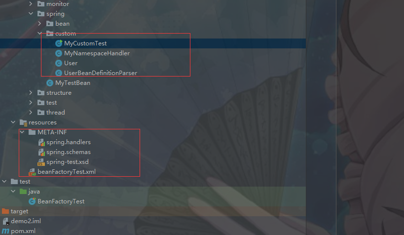

# 1 自定义标签使用

1 创建一个需要扩展的组件。
2 定义一个XSD文件描述组件内容。
3 创建一个文件，实现 BeanDefinitionParser 接口，用来解析XSD文件中的定义和组件定义。
4 创建一个Handler文件，扩展自NamespaceHandlerSupport，目的是将组件注册到Spring容器。
5 编写Spring.handlers和 Spring.schemas文件。

具体使用参考demo2样例



​	Spring加载自定义的大致流程是遇到自定义标签然后就去Spring.handlers和 Spring.schemas 中去找对应的 handler和 XSD，默认位置是/META-INF/下，进而有找到对应的 handler 以及解析元素的Parser，从而完成了整个自定义元素的解析

# 2 自定义标签解析


```java
public class BeanDefinitionParserDelegate {
	/**
	 * 解析一个自定义元素 (不在默认命名空间).
	 * @param ele the element to parse
	 * @return the resulting bean definition
	 */
	@Nullable
	public BeanDefinition parseCustomElement(Element ele) {
		return parseCustomElement(ele, null);
	}
	
    /**
	 * 解析一个自定义元素 (不在默认命名空间).
	 * @param ele the element to parse
	 * @param containingBd 为父类bean，对应的顶层元素设置为Null
	 * @return the resulting bean definition
	 */
	@Nullable
	public BeanDefinition parseCustomElement(Element ele, @Nullable BeanDefinition containingBd) {
        //获取对应的命名空间
		String namespaceUri = getNamespaceURI(ele);
        //根据命名空间找到对应的NamespaceHandler
		if (namespaceUri == null) {
			return null;
		}
		NamespaceHandler handler = this.readerContext.getNamespaceHandlerResolver().resolve(namespaceUri);
		if (handler == null) {
			error("Unable to locate Spring NamespaceHandler for XML schema namespace [" + namespaceUri + "]", ele);
			return null;
		}
        //调用自定义的NamespaceHandler进行解析
		return handler.parse(ele, new ParserContext(this.readerContext, this, containingBd));
	}
```


## 2.1 提取自定义标签处理器


```java
public class DefaultNamespaceHandlerResolver implements NamespaceHandlerResolver 
    
	/**
	 * Locate the {@link NamespaceHandler} for the supplied namespace URI
	 * from the configured mappings.
	 * @param namespaceUri the relevant namespace URI
	 * @return the located {@link NamespaceHandler}, or {@code null} if none found
	 */
	@Override
	@Nullable
	public NamespaceHandler resolve(String namespaceUri) {
        //获取所有已经配置的handler映射
		Map<String, Object> handlerMappings = getHandlerMappings();
        //根据命名空间找到对应的信息
		Object handlerOrClassName = handlerMappings.get(namespaceUri);
		if (handlerOrClassName == null) {
			return null;
		}
		else if (handlerOrClassName instanceof NamespaceHandler) {
            //已经做过解析额情况，直接从缓存读取
			return (NamespaceHandler) handlerOrClassName;
		}
		else {
            //没有做过解析，则返回的是类路径
			String className = (String) handlerOrClassName;
			try {
                //使用反射将类路径转化为类
				Class<?> handlerClass = ClassUtils.forName(className, this.classLoader);
				if (!NamespaceHandler.class.isAssignableFrom(handlerClass)) {
					throw new FatalBeanException("Class [" + className + "] for namespace [" + namespaceUri +
							"] does not implement the [" + NamespaceHandler.class.getName() + "] interface");
				}
                //初始化类
				NamespaceHandler namespaceHandler = (NamespaceHandler) BeanUtils.instantiateClass(handlerClass);
                //调用自定义的NamespaceHandler的初始化方法
				namespaceHandler.init();
                //记录在缓存
				handlerMappings.put(namespaceUri, namespaceHandler);
				return namespaceHandler;
			}
			catch (ClassNotFoundException ex) {
				throw new FatalBeanException("Could not find NamespaceHandler class [" + className +
						"] for namespace [" + namespaceUri + "]", ex);
			}
			catch (LinkageError err) {
				throw new FatalBeanException("Unresolvable class definition for NamespaceHandler class [" +
						className + "] for namespace [" + namespaceUri + "]", err);
			}
		}
	}
```


### 2.1.1 getHandlerMappings缓存Spring.handlers

```java
public class DefaultNamespaceHandlerResolver implements NamespaceHandlerResolver 
	/**
	 * Load the specified NamespaceHandler mappings lazily.
	 */
	private Map<String, Object> getHandlerMappings() {
    //如果没有被缓存则开始进行缓存
		Map<String, Object> handlerMappings = this.handlerMappings;
		if (handlerMappings == null) {
			synchronized (this) {
				handlerMappings = this.handlerMappings;
				if (handlerMappings == null) {
					if (logger.isTraceEnabled()) {
						logger.trace("Loading NamespaceHandler mappings from [" + this.handlerMappingsLocation + "]");
					}
					try {
                        //this.handlerMappingsLocation初始化值为META-INF/spring.handlers
                        //借助工具类PropertiesLoaderUtils对属性handlerMappingsLocation进行读取
						Properties mappings =
								PropertiesLoaderUtils.loadAllProperties(this.handlerMappingsLocation, this.classLoader);
						if (logger.isTraceEnabled()) {
							logger.trace("Loaded NamespaceHandler mappings: " + mappings);
						}
						handlerMappings = new ConcurrentHashMap<>(mappings.size());
						CollectionUtils.mergePropertiesIntoMap(mappings, handlerMappings);
						this.handlerMappings = handlerMappings;
					}
					catch (IOException ex) {
						throw new IllegalStateException(
								"Unable to load NamespaceHandler mappings from location [" + this.handlerMappingsLocation + "]", ex);
					}
				}
			}
		}
		return handlerMappings;
	}
```


## 2.2 标签解析

```java
public abstract class NamespaceHandlerSupport implements NamespaceHandler 
	/**
	 * Parses the supplied {@link Element} by delegating to the {@link BeanDefinitionParser} that is
	 * registered for that {@link Element}.
	 */
	@Override
	@Nullable
	public BeanDefinition parse(Element element, ParserContext parserContext) {
    //寻找解析器并进行解析操作
		BeanDefinitionParser parser = findParserForElement(element, parserContext);
		return (parser != null ? parser.parse(element, parserContext) : null);
	}
```


```java
	/**
	 * Locates the {@link BeanDefinitionParser} from the register implementations using
	 * the local name of the supplied {@link Element}.
	 */
	@Nullable
	private BeanDefinitionParser findParserForElement(Element element, ParserContext parserContext) {
        //获取元素名称(样例中<myname:user 中的user,若在示例中,此时localName为user)
		String localName = parserContext.getDelegate().getLocalName(element);
        //根据localName找到对应的解析器(样例中registerBeanDefinitionParser方法注册的解析器)
		BeanDefinitionParser parser = this.parsers.get(localName);
		if (parser == null) {
			parserContext.getReaderContext().fatal(
					"Cannot locate BeanDefinitionParser for element [" + localName + "]", element);
		}
		return parser;
	}
```


```java
public abstract class AbstractBeanDefinitionParser implements BeanDefinitionParser
	@Override
	@Nullable
	public final BeanDefinition parse(Element element, ParserContext parserContext) {
		AbstractBeanDefinition definition = parseInternal(element, parserContext);
		if (definition != null && !parserContext.isNested()) {
			try {
				String id = resolveId(element, definition, parserContext);
				if (!StringUtils.hasText(id)) {
					parserContext.getReaderContext().error(
							"Id is required for element '" + parserContext.getDelegate().getLocalName(element)
									+ "' when used as a top-level tag", element);
				}
				String[] aliases = null;
				if (shouldParseNameAsAliases()) {
					String name = element.getAttribute(NAME_ATTRIBUTE);
					if (StringUtils.hasLength(name)) {
						aliases = StringUtils.trimArrayElements(StringUtils.commaDelimitedListToStringArray(name));
					}
				}
                //将AbstractBeanDefinition转换为BeanDefinitionHolder并注册
				BeanDefinitionHolder holder = new BeanDefinitionHolder(definition, id, aliases);
				registerBeanDefinition(holder, parserContext.getRegistry());
				if (shouldFireEvents()) {
                    //需要通知监听器则进行处理
					BeanComponentDefinition componentDefinition = new BeanComponentDefinition(holder);
					postProcessComponentDefinition(componentDefinition);
					parserContext.registerComponent(componentDefinition);
				}
			}
			catch (BeanDefinitionStoreException ex) {
				String msg = ex.getMessage();
				parserContext.getReaderContext().error((msg != null ? msg : ex.toString()), element);
				return null;
			}
		}
		return definition;
	}
```


```java
public abstract class AbstractSingleBeanDefinitionParser extends AbstractBeanDefinitionParser 
	@Override
	protected final AbstractBeanDefinition parseInternal(Element element, ParserContext parserContext) {
		BeanDefinitionBuilder builder = BeanDefinitionBuilder.genericBeanDefinition();
		String parentName = getParentName(element);
		if (parentName != null) {
			builder.getRawBeanDefinition().setParentName(parentName);
		}
    //获取自定义标签中的class，此时会调用自定义解析器getBeanClass方法(getBeanClass需要子类自定义解析器实现，相当于模板方法模式)
		Class<?> beanClass = getBeanClass(element);
		if (beanClass != null) {
			builder.getRawBeanDefinition().setBeanClass(beanClass);
		}
		else {
            //若子类没有重写getBeanClass方法则尝试检查子类是否重写getBeanClassName方法
			String beanClassName = getBeanClassName(element);
			if (beanClassName != null) {
				builder.getRawBeanDefinition().setBeanClassName(beanClassName);
			}
		}
		builder.getRawBeanDefinition().setSource(parserContext.extractSource(element));
		BeanDefinition containingBd = parserContext.getContainingBeanDefinition();
		if (containingBd != null) {
			// Inner bean definition must receive same scope as containing bean.
            //若存在父类则使用父类的scope属性
			builder.setScope(containingBd.getScope());
		}
		if (parserContext.isDefaultLazyInit()) {
			// Default-lazy-init applies to custom bean definitions as well.
            //配置延迟加载
			builder.setLazyInit(true);
		}
    //调用子类重写doParse方法进行解析
		doParse(element, parserContext, builder);
		return builder.getBeanDefinition();
	}
```


