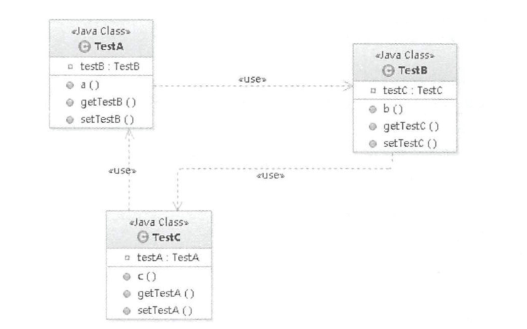
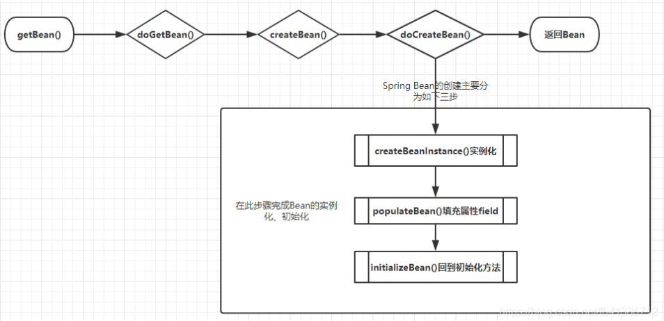

# bean的加载

样例：

```java
        BeanFactory bf = new XmlBeanFactory(new ClassPathResource("beanFactoryTest.xml"));
        MyTestBean bean = (MyTestBean)bf.getBean("myTestBean");
```

代码：

```java
public abstract class AbstractBeanFactory extends FactoryBeanRegistrySupport implements ConfigurableBeanFactory
        
	@Override
	public Object getBean(String name) throws BeansException {
		return doGetBean(name, null, null, false);
	}

	/**
	 * Return an instance, which may be shared or independent, of the specified bean.
	 * @param name the name of the bean to retrieve
	 * @param requiredType the required type of the bean to retrieve
	 * @param args arguments to use when creating a bean instance using explicit arguments
	 * (only applied when creating a new instance as opposed to retrieving an existing one)
	 * @param typeCheckOnly whether the instance is obtained for a type check,
	 * not for actual use
	 * @return an instance of the bean
	 * @throws BeansException if the bean could not be created
	 */
	@SuppressWarnings("unchecked")
	protected <T> T doGetBean(
			String name, @Nullable Class<T> requiredType, @Nullable Object[] args, boolean typeCheckOnly)
			throws BeansException {
		//提取对应的beanName
		String beanName = transformedBeanName(name);
		Object beanInstance;

        /**
		检查缓存中或者实例工厂中是否有对应的实例，为什么首先会使用这段代码呢，因为在创建单例bean的时候会存在依赖注入的情况，而在创建依赖的时候为了避免循环依赖，Spring创建bean的原则是不等bean创建完成就会将创建bean的objectFactory提早曝光，也就是将ObjectFactory加入到缓存中，一旦下个bean创建时候需要依赖上个bean则直接使用objectFactory
        **/
        // Eagerly check singleton cache for manually registered singletons(直接尝试从缓存获取或者singletonFactories中的objectFactory中获取)

		Object sharedInstance = getSingleton(beanName);
		if (sharedInstance != null && args == null) {
			if (logger.isTraceEnabled()) {
				if (isSingletonCurrentlyInCreation(beanName)) {
					logger.trace("Returning eagerly cached instance of singleton bean '" + beanName +
							"' that is not fully initialized yet - a consequence of a circular reference");
				}
				else {
					logger.trace("Returning cached instance of singleton bean '" + beanName + "'");
				}
			}
            //返回对应的实例，有时候存在诸如BeanFactory的情况并不是直接返回实例本身而是返回指定方法返回的实例
			beanInstance = getObjectForBeanInstance(sharedInstance, name, beanName, null);
		}

		else {
			// Fail if we're already creating this bean instance:
			// We're assumably within a circular reference.
            //只有在单例情况才会尝试解决循环依赖，原型模式情况下,如果存在
			//A中有B的属性,B中有A的属性，那么当依赖注入的时候，就会产生当A还未创建完的时候因为
			//对于B的创建再次返回创建A，造成循环依赖,也就是下面的情况(原型模式循环依赖直接抛出异常)
			if (isPrototypeCurrentlyInCreation(beanName)) {
				throw new BeanCurrentlyInCreationException(beanName);
			}

			// Check if bean definition exists in this factory.
            
			BeanFactory parentBeanFactory = getParentBeanFactory();
            //如果beanDefinitionMap中也就是在所有已经加载的类中不包括beanName
			//则尝试从parentBeanFactory中检测
			if (parentBeanFactory != null && !containsBeanDefinition(beanName)) {
				// Not found -> check parent.
				String nameToLookup = originalBeanName(name);
                //递归到BeanFactory中寻找
				if (parentBeanFactory instanceof AbstractBeanFactory) {
					return ((AbstractBeanFactory) parentBeanFactory).doGetBean(
							nameToLookup, requiredType, args, typeCheckOnly);
				}
				else if (args != null) {
					// Delegation to parent with explicit args.
					return (T) parentBeanFactory.getBean(nameToLookup, args);
				}
				else if (requiredType != null) {
					// No args -> delegate to standard getBean method.
					return parentBeanFactory.getBean(nameToLookup, requiredType);
				}
				else {
					return (T) parentBeanFactory.getBean(nameToLookup);
				}
			}
			//把beanName 添加到类型为set的alreadyCreated
			if (!typeCheckOnly) {
				markBeanAsCreated(beanName);
			}
			
			StartupStep beanCreation = this.applicationStartup.start("spring.beans.instantiate")
					.tag("beanName", name);
			try {
				if (requiredType != null) {
					beanCreation.tag("beanType", requiredType::toString);
				}
                //将存储XML配置文件的GernericBeanDefinition转换为RootBeanDefinition,如果指定
				//BeanName是子Bean的话同时会合并父类的相关属性
				RootBeanDefinition mbd = getMergedLocalBeanDefinition(beanName);
				checkMergedBeanDefinition(mbd, beanName, args);

				// Guarantee initialization of beans that the current bean depends on.
				String[] dependsOn = mbd.getDependsOn();
                //若存在依赖则需要递归实例化依赖的bean
				if (dependsOn != null) {
					for (String dep : dependsOn) {
                          //isDependent为递归
						if (isDependent(beanName, dep)) {
							throw new BeanCreationException(mbd.getResourceDescription(), beanName,
									"Circular depends-on relationship between '" + beanName + "' and '" + dep + "'");
						}
                        //缓存依赖调用
						registerDependentBean(dep, beanName);
						try {
							getBean(dep);
						}
						catch (NoSuchBeanDefinitionException ex) {
							throw new BeanCreationException(mbd.getResourceDescription(), beanName,
									"'" + beanName + "' depends on missing bean '" + dep + "'", ex);
						}
					}
				}

				// Create bean instance.
                //实例化依赖的bean后便可以实例化mbd本身了
                //singletion模式的创建
				if (mbd.isSingleton()) {
					sharedInstance = getSingleton(beanName, () -> {
						try {
							return createBean(beanName, mbd, args);
						}
						catch (BeansException ex) {
							// Explicitly remove instance from singleton cache: It might have been put there
							// eagerly by the creation process, to allow for circular reference resolution.
							// Also remove any beans that received a temporary reference to the bean.
							destroySingleton(beanName);
							throw ex;
						}
					});
					beanInstance = getObjectForBeanInstance(sharedInstance, name, beanName, mbd);
				}

				else if (mbd.isPrototype()) {
					// It's a prototype -> create a new instance.
                    //prototype模式的创建(new)
					Object prototypeInstance = null;
					try {
						beforePrototypeCreation(beanName);
						prototypeInstance = createBean(beanName, mbd, args);
					}
					finally {
						afterPrototypeCreation(beanName);
					}
					beanInstance = getObjectForBeanInstance(prototypeInstance, name, beanName, mbd);
				}

				else {
                    //指定的scope上实例化bean
					String scopeName = mbd.getScope();
					if (!StringUtils.hasLength(scopeName)) {
						throw new IllegalStateException("No scope name defined for bean ´" + beanName + "'");
					}
					Scope scope = this.scopes.get(scopeName);
					if (scope == null) {
						throw new IllegalStateException("No Scope registered for scope name '" + scopeName + "'");
					}
					try {
						Object scopedInstance = scope.get(beanName, () -> {
							beforePrototypeCreation(beanName);
							try {
								return createBean(beanName, mbd, args);
							}
							finally {
								afterPrototypeCreation(beanName);
							}
						});
						beanInstance = getObjectForBeanInstance(scopedInstance, name, beanName, mbd);
					}
					catch (IllegalStateException ex) {
						throw new ScopeNotActiveException(beanName, scopeName, ex);
					}
				}
			}
			catch (BeansException ex) {
				beanCreation.tag("exception", ex.getClass().toString());
				beanCreation.tag("message", String.valueOf(ex.getMessage()));
				cleanupAfterBeanCreationFailure(beanName);
				throw ex;
			}
			finally {
				beanCreation.end();
			}
		}

		return adaptBeanInstance(name, beanInstance, requiredType);
	}

	<T> T adaptBeanInstance(String name, Object bean, @Nullable Class<?> requiredType) {
		// Check if required type matches the type of the actual bean instance.
        //检查需要的类型是否符合bean的实际类型
		if (requiredType != null && !requiredType.isInstance(bean)) {
			try {
				Object convertedBean = getTypeConverter().convertIfNecessary(bean, requiredType);
				if (convertedBean == null) {
					throw new BeanNotOfRequiredTypeException(name, requiredType, bean.getClass());
				}
				return (T) convertedBean;
			}
			catch (TypeMismatchException ex) {
				if (logger.isTraceEnabled()) {
					logger.trace("Failed to convert bean '" + name + "' to required type '" +
							ClassUtils.getQualifiedName(requiredType) + "'", ex);
				}
				throw new BeanNotOfRequiredTypeException(name, requiredType, bean.getClass());
			}
		}
		return (T) bean;
	}
```

bean获取的过程


# 1 FactoryBean的使用

代码：

```java
public interface FactoryBean<T> 

	/**
	 * The name of an attribute that can be
	 * {@link org.springframework.core.AttributeAccessor#setAttribute set} on a
	 * {@link org.springframework.beans.factory.config.BeanDefinition} so that
	 * factory beans can signal their object type when it can't be deduced from
	 * the factory bean class.
	 * @since 5.2
	 */
	String OBJECT_TYPE_ATTRIBUTE = "factoryBeanObjectType";


	/**
	 *	返回由FactoryBean创建的bean实例，如果isSingleton()返回true，则该实例会放到Spring 容器中单实例缓存池中。
	 */
	@Nullable
	T getObject() throws Exception;

	/**
	 * 返回FactoryBean创建的bean类型。
	 */
	@Nullable
	Class<?> getObjectType();

	/**
	 * 返回由FactoryBean创建的bean实例的作用域是singleton还是prototype
	 */
	default boolean isSingleton() {
		return true;
	}
```

样例：


## 1.1 BeanFactory(interface)和FactoryBean(interface)的区别

​	**区别：**BeanFactory是个Factory，也就是IOC容器或对象工厂，FactoryBean是个Bean。在Spring中，所有的Bean都是由BeanFactory(也就是IOC容器)来进行管理的。但对FactoryBean而言，这个Bean不是简单的Bean，而是一个能生产或者修饰对象生成的工厂Bean,它的实现与设计模式中的工厂模式和修饰器模式类似

**1 BeanFactory**

​	BeanFactory定义了IOC容器的最基本形式，并提供了IOC容器应遵守的的最基本的接口，也就是Spring IOC所遵守的最底层和最基本的编程规范。在Spring代码中，BeanFactory只是个接口，并不是IOC容器的具体实现，但是Spring容器给出了很多种实现，如 DefaultListableBeanFactory、XmlBeanFactory、ApplicationContext等，都是附加了某种功能的实现。

```java
public interface BeanFactory {  
    String FACTORY_BEAN_PREFIX = "&";  
    Object getBean(String name) throws BeansException;  
    <T> T getBean(String name, Class<T> requiredType) throws BeansException;  
    <T> T getBean(Class<T> requiredType) throws BeansException;  
    Object getBean(String name, Object... args) throws BeansException;  
    boolean containsBean(String name);  
    boolean isSingleton(String name) throws NoSuchBeanDefinitionException;  
    boolean isPrototype(String name) throws NoSuchBeanDefinitionException;  
    boolean isTypeMatch(String name, Class<?> targetType) throws NoSuchBeanDefinitionException;  
    Class<?> getType(String name) throws NoSuchBeanDefinitionException;  
    String[] getAliases(String name);  
} 
```

**2 FactoryBean**
	一般情况下，Spring通过反射机制利用<bean>的class属性指定实现类实例化Bean，在某些情况下，实例化Bean过程比较复杂，如果按照传统的方式，则需要在<bean>中提供大量的配置信息。配置方式的灵活性是受限的，这时采用编码的方式可能会得到一个简单的方案。Spring为此提供了一个org.springframework.bean.factory.FactoryBean的工厂类接口，用户可以通过实现该接口定制实例化Bean的逻辑。
FactoryBean接口对于Spring框架来说占用重要的地位，Spring自身就提供了70多个FactoryBean的实现。它们隐藏了实例化一些复杂Bean的细节，给上层应用带来了便利。从Spring3.0开始，FactoryBean开始支持泛型，即接口声明改为FactoryBean<T>的形式

## 1.2 缓存中获取单例bean

getSingleton通过三级缓存解决循环依赖

**对应三级缓存：**

**singletonObjects：**用于存放完全初始化好的 bean，从该缓存中取出的 bean 可以直接使用

**earlySingletonObjects：**提前曝光的单例对象的cache，存放原始的 bean 对象（尚未填充属性），用于解决循环依赖

**singletonFactories：**单例对象工厂的cache，存放 bean 工厂对象，用于解决循环依赖


```java
public class DefaultSingletonBeanRegistry extends SimpleAliasRegistry implements SingletonBeanRegistry 
    
	@Override
	@Nullable
	public Object getSingleton(String beanName) {
    //参数true设置标识允许早期依赖
		return getSingleton(beanName, true);
	}

	/**
	 * Return the (raw) singleton object registered under the given name.
	 * <p>Checks already instantiated singletons and also allows for an early
	 * reference to a currently created singleton (resolving a circular reference).
	 * @param beanName the name of the bean to look for
	 * @param allowEarlyReference whether early references should be created or not
	 * @return the registered singleton object, or {@code null} if none found
	 */
	@Nullable
	protected Object getSingleton(String beanName, boolean allowEarlyReference) {
		// Quick check for existing instance without full singleton lock
        //检查缓存中是否存在实例
		Object singletonObject = this.singletonObjects.get(beanName);
		if (singletonObject == null && isSingletonCurrentlyInCreation(beanName)) {
			singletonObject = this.earlySingletonObjects.get(beanName);
			if (singletonObject == null && allowEarlyReference) {
                //如果为空，则锁定全局变量并进行处理
				synchronized (this.singletonObjects) {
					// Consistent creation of early reference within full singleton lock
					singletonObject = this.singletonObjects.get(beanName);
					if (singletonObject == null) {
						singletonObject = this.earlySingletonObjects.get(beanName);
						if (singletonObject == null) {
                            //当某些方法需要提前初始化的时候则会调用addsingletonFactory方法将对应的
                            //objectFactory初始化策略存储在singletonFactories
							ObjectFactory<?> singletonFactory = this.singletonFactories.get(beanName);
							if (singletonFactory != null) {
                                //调用预先设定的getObject方法
								singletonObject = singletonFactory.getObject();
                                //记录在缓存中,earlysingletonobjects和singletonFactories互斥
								this.earlySingletonObjects.put(beanName, singletonObject);
								this.singletonFactories.remove(beanName);
							}
						}
					}
				}
			}
		}
		return singletonObject;
	}
```


## 1.3 从bean的实例中获取对象


```java
public abstract class AbstractBeanFactory extends FactoryBeanRegistrySupport implements ConfigurableBeanFactory 
    
	/**
	 * 验证bean实例的正确性
	 * @param beanInstance the shared bean instance
	 * @param name the name that may include factory dereference prefix
	 * @param beanName the canonical bean name
	 * @param mbd the merged bean definition
	 * @return the object to expose for the bean
	 */
	protected Object getObjectForBeanInstance(
			Object beanInstance, String name, String beanName, @Nullable RootBeanDefinition mbd) {

		// Don't let calling code try to dereference the factory if the bean isn't a factory.
        //name是工厂相关的(以&为前缀)，则通过
		if (BeanFactoryUtils.isFactoryDereference(name)) {
			if (beanInstance instanceof NullBean) {
				return beanInstance;
			}
            //name为工厂相关的(以&为前缀)，类型不是则抛出异常
			if (!(beanInstance instanceof FactoryBean)) {
				throw new BeanIsNotAFactoryException(beanName, beanInstance.getClass());
			}
			if (mbd != null) {
				mbd.isFactoryBean = true;
			}
			return beanInstance;
		}

		// Now we have the bean instance, which may be a normal bean or a FactoryBean.
		// If it's a FactoryBean, we use it to create a bean instance, unless the
		// caller actually wants a reference to the factory.
	    //不是工厂bean直接返回
		if (!(beanInstance instanceof FactoryBean)) {
			return beanInstance;
		}

		Object object = null;
		if (mbd != null) {
			mbd.isFactoryBean = true;
		}
		else {
            //尝试从缓存中加载bean
			object = getCachedObjectForFactoryBean(beanName);
		}
		if (object == null) {
			// Return bean instance from factory.
             //已经明确知道是FactoryBean类型
			FactoryBean<?> factory = (FactoryBean<?>) beanInstance;
			//containsBeanDefinition检测 beanDefinitionMap 中也就是在所有已经加载的类中检测是否定义beanName
			if (mbd == null && containsBeanDefinition(beanName)) {
                //将存储XML配置文件的GernericBeanDefinition转换为RootBeanDefinition,如果指定 BeanName是子Bean的话同时会合并父类的相关属性
				mbd = getMergedLocalBeanDefinition(beanName);
			}
            //是否是用户定义的而不是应用程序本身定义的
			boolean synthetic = (mbd != null && mbd.isSynthetic());
			object = getObjectFromFactoryBean(factory, beanName, !synthetic);
		}
		return object;
	}
```


```java
public abstract class FactoryBeanRegistrySupport extends DefaultSingletonBeanRegistry 
	/**
	 * 对于单例模式的处理
	 * @param factory the FactoryBean instance
	 * @param beanName the name of the bean
	 * @param shouldPostProcess whether the bean is subject to post-processing
	 * @return the object obtained from the FactoryBean
	 * @throws BeanCreationException if FactoryBean object creation failed
	 * @see org.springframework.beans.factory.FactoryBean#getObject()
	 */
	protected Object getObjectFromFactoryBean(FactoryBean<?> factory, String beanName, boolean shouldPostProcess) {
    	//如果是单例模式
		if (factory.isSingleton() && containsSingleton(beanName)) {
			synchronized (getSingletonMutex()) {
				Object object = this.factoryBeanObjectCache.get(beanName);
				if (object == null) {
                    //从FactoryBean中getBean
					object = doGetObjectFromFactoryBean(factory, beanName);
					// Only post-process and store if not put there already during getObject() call above
					// (e.g. because of circular reference processing triggered by custom getBean calls)
					Object alreadyThere = this.factoryBeanObjectCache.get(beanName);
					if (alreadyThere != null) {
						object = alreadyThere;
					}
					else {
						if (shouldPostProcess) {
							if (isSingletonCurrentlyInCreation(beanName)) {
								// Temporarily return non-post-processed object, not storing it yet..
								return object;
							}
							beforeSingletonCreation(beanName);
							try {
                                //调用ObjectFactory的后处理器(相关子类覆盖postProcessObjectFromFactoryBean方法来进行后处理)
								object = postProcessObjectFromFactoryBean(object, beanName);
							}
							catch (Throwable ex) {
								throw new BeanCreationException(beanName,
										"Post-processing of FactoryBean's singleton object failed", ex);
							}
							finally {
								afterSingletonCreation(beanName);
							}
						}
						if (containsSingleton(beanName)) {
							this.factoryBeanObjectCache.put(beanName, object);
						}
					}
				}
				return object;
			}
		}
		else {
			Object object = doGetObjectFromFactoryBean(factory, beanName);
			if (shouldPostProcess) {
				try {
					object = postProcessObjectFromFactoryBean(object, beanName);
				}
				catch (Throwable ex) {
					throw new BeanCreationException(beanName, "Post-processing of FactoryBean's object failed", ex);
				}
			}
			return object;
		}
	}

	/**
	 * 从FactoryBean 中 getObject 获取对应实例
	 * @param factory the FactoryBean instance
	 * @param beanName the name of the bean
	 * @return the object obtained from the FactoryBean
	 * @throws BeanCreationException if FactoryBean object creation failed
	 * @see org.springframework.beans.factory.FactoryBean#getObject()
	 */
	private Object doGetObjectFromFactoryBean(FactoryBean<?> factory, String beanName) throws BeanCreationException {
		Object object;
		try {
            //权限验证
			if (System.getSecurityManager() != null) {
				AccessControlContext acc = getAccessControlContext();
				try {
					object = AccessController.doPrivileged((PrivilegedExceptionAction<Object>) factory::getObject, acc);
				}
				catch (PrivilegedActionException pae) {
					throw pae.getException();
				}
			}
			else {
                //直接调用getObject方法
				object = factory.getObject();
			}
		}
		catch (FactoryBeanNotInitializedException ex) {
			throw new BeanCurrentlyInCreationException(beanName, ex.toString());
		}
		catch (Throwable ex) {
			throw new BeanCreationException(beanName, "FactoryBean threw exception on object creation", ex);
		}

		// Do not accept a null value for a FactoryBean that's not fully
		// initialized yet: Many FactoryBeans just return null then.
		if (object == null) {
			if (isSingletonCurrentlyInCreation(beanName)) {
				throw new BeanCurrentlyInCreationException(
						beanName, "FactoryBean which is currently in creation returned null from getObject");
			}
			object = new NullBean();
		}
		return object;
	}
```

​	在getBean方法中,getObjectForBeanInstance是个高频率使用的方法。无论是从缓存中获取到的bean还是通过不同的scope策略加载的bean都只是最原始的bean状态，并不一定是我们最终想要的 bean。举个例子，假如我们需要对工厂bean进行处理，那么这里得到的其实是工厂 bean的初始状态，但是我们真正需要的是工厂 bean中定义的factory-method方法中返回的 bean，而getObjectForBeanInstance方法就是完成这个工作的。

## 1.4 获取单例

​	如果缓存中不存在已经加载的单例bean就需要从头开始bean的加载过程了，而Spring中使用getSingleton的重载方法实现bean的加载过程

```java
public class DefaultSingletonBeanRegistry extends SimpleAliasRegistry implements SingletonBeanRegistry 	
	/**
	 * Return the (raw) singleton object registered under the given name,
	 * creating and registering a new one if none registered yet.
	 * @param beanName the name of the bean
	 * @param singletonFactory the ObjectFactory to lazily create the singleton
	 * with, if necessary
	 * @return the registered singleton object
	 */
	public Object getSingleton(String beanName, ObjectFactory<?> singletonFactory) {
		Assert.notNull(beanName, "Bean name must not be null");
        //全局变量需要同步
		synchronized (this.singletonObjects) {
            //首先检查对应的bean是否已经加载过，因为singleton模式其实就是复用已创建的bean,所以这一步是必须的
			Object singletonObject = this.singletonObjects.get(beanName);
            //如果为空才可以进行singleto的bean的初始化
			if (singletonObject == null) {
				if (this.singletonsCurrentlyInDestruction) {
					throw new BeanCreationNotAllowedException(beanName,
							"Singleton bean creation not allowed while singletons of this factory are in destruction " +
							"(Do not request a bean from a BeanFactory in a destroy method implementation!)");
				}
				if (logger.isDebugEnabled()) {
					logger.debug("Creating shared instance of singleton bean '" + beanName + "'");
				}
                //加载单例前记录加载状态
				beforeSingletonCreation(beanName);
				boolean newSingleton = false;
				boolean recordSuppressedExceptions = (this.suppressedExceptions == null);
				if (recordSuppressedExceptions) {
					this.suppressedExceptions = new LinkedHashSet<>();
				}
				try {
                    //初始化bean
					singletonObject = singletonFactory.getObject();
					newSingleton = true;
				}
				catch (IllegalStateException ex) {
					// Has the singleton object implicitly appeared in the meantime ->
					// if yes, proceed with it since the exception indicates that state.
					singletonObject = this.singletonObjects.get(beanName);
					if (singletonObject == null) {
						throw ex;
					}
				}
				catch (BeanCreationException ex) {
					if (recordSuppressedExceptions) {
						for (Exception suppressedException : this.suppressedExceptions) {
							ex.addRelatedCause(suppressedException);
						}
					}
					throw ex;
				}
				finally {
					if (recordSuppressedExceptions) {
						this.suppressedExceptions = null;
					}
                    //加载单例后,移除缓存中对该bean的正在加载状态的记录
					afterSingletonCreation(beanName);
				}
				if (newSingleton) {
                    //将结果记录至缓存并删除加载bean过程中所记录的各种辅助状态
					addSingleton(beanName, singletonObject);
				}
			}
			return singletonObject;
		}
	}
```

ObjectFactory<?> singletonFactory 参数的创建方法

```java
		sharedInstance = getSingleton(beanName, () -> {
						try {
                            //核心逻辑
							return createBean(beanName, mbd, args);
						}
						catch (BeansException ex) {
							// Explicitly remove instance from singleton cache: It might have been put there
							// eagerly by the creation process, to allow for circular reference resolution.
							// Also remove any beans that received a temporary reference to the bean.
							destroySingleton(beanName);
							throw ex;
						}
					});
```


## 1.5 准备创建bean


```java
public abstract class AbstractAutowireCapableBeanFactory extends AbstractBeanFactory
		implements AutowireCapableBeanFactory 
	/**
	 * Central method of this class: creates a bean instance,
	 * populates the bean instance, applies post-processors, etc.
	 * @see #doCreateBean
	 */
	@Override
	protected Object createBean(String beanName, RootBeanDefinition mbd, @Nullable Object[] args)
			throws BeanCreationException {

		if (logger.isTraceEnabled()) {
			logger.trace("Creating instance of bean '" + beanName + "'");
		}
		RootBeanDefinition mbdToUse = mbd;

		// Make sure bean class is actually resolved at this point, and
		// clone the bean definition in case of a dynamically resolved Class
		// which cannot be stored in the shared merged bean definition.
        //锁定class,根据设置的class属性或者根据className来解析class
		Class<?> resolvedClass = resolveBeanClass(mbd, beanName);
		if (resolvedClass != null && !mbd.hasBeanClass() && mbd.getBeanClassName() != null) {
			mbdToUse = new RootBeanDefinition(mbd);
			mbdToUse.setBeanClass(resolvedClass);
		}

		// Prepare method overrides(验证及准备覆盖的方法).
		try {
			mbdToUse.prepareMethodOverrides();
		}
		catch (BeanDefinitionValidationException ex) {
			throw new BeanDefinitionStoreException(mbdToUse.getResourceDescription(),
					beanName, "Validation of method overrides failed", ex);
		}

		try {
			// Give BeanPostProcessors a chance to return a proxy instead of the target bean instance.
            //(给BeanPostProcessors一个机会来返回代理来替代真正的实例)
			Object bean = resolveBeforeInstantiation(beanName, mbdToUse);
			if (bean != null) {
				return bean;
			}
		}
		catch (Throwable ex) {
			throw new BeanCreationException(mbdToUse.getResourceDescription(), beanName,
					"BeanPostProcessor before instantiation of bean failed", ex);
		}

		try {
            //核心方法，获取bean实例
			Object beanInstance = doCreateBean(beanName, mbdToUse, args);
			if (logger.isTraceEnabled()) {
				logger.trace("Finished creating instance of bean '" + beanName + "'");
			}
			return beanInstance;
		}
		catch (BeanCreationException | ImplicitlyAppearedSingletonException ex) {
			// A previously detected exception with proper bean creation context already,
			// or illegal singleton state to be communicated up to DefaultSingletonBeanRegistry.
			throw ex;
		}
		catch (Throwable ex) {
			throw new BeanCreationException(
					mbdToUse.getResourceDescription(), beanName, "Unexpected exception during bean creation", ex);
		}
	}
```


### 1.5.1 处理override属性(验证重载方法)


```java
	/**
	 * Validate and prepare the method overrides defined for this bean.
	 * Checks for existence of a method with the specified name.
	 * @throws BeanDefinitionValidationException in case of validation failure
	 */
	public void prepareMethodOverrides() throws BeanDefinitionValidationException {
		// Check that lookup methods exist and determine their overloaded status.
		if (hasMethodOverrides()) {
			getMethodOverrides().getOverrides().forEach(this::prepareMethodOverride);
		}
	}

	/**
	 * Validate and prepare the given method override.
	 * Checks for existence of a method with the specified name,
	 * marking it as not overloaded if none found.
	 * @param mo the MethodOverride object to validate
	 * @throws BeanDefinitionValidationException in case of validation failure
	 */
	protected void prepareMethodOverride(MethodOverride mo) throws BeanDefinitionValidationException {
        //获取对应类中对应方法名的个数
		int count = ClassUtils.getMethodCountForName(getBeanClass(), mo.getMethodName());
		if (count == 0) {
			throw new BeanDefinitionValidationException(
					"Invalid method override: no method with name '" + mo.getMethodName() +
					"' on class [" + getBeanClassName() + "]");
		}
		else if (count == 1) {
			// Mark override as not overloaded, to avoid the overhead of arg type checking.
            //标记MethodOverride暂未被覆(未重载),避免参数类型检查的开销
			mo.setOverloaded(false);
		}
	}
```

### 1.5.2 实例化的前置处理


```java
public abstract class AbstractAutowireCapableBeanFactory extends AbstractBeanFactory
		implements AutowireCapableBeanFactory
    
	/**
	 * Apply before-instantiation post-processors, resolving whether there is a
	 * before-instantiation shortcut for the specified bean.
	 * @param beanName the name of the bean
	 * @param mbd the bean definition for the bean
	 * @return the shortcut-determined bean instance, or {@code null} if none
	 */
	@Nullable
	protected Object resolveBeforeInstantiation(String beanName, RootBeanDefinition mbd) {
		Object bean = null;
    //如果尚未被解析
		if (!Boolean.FALSE.equals(mbd.beforeInstantiationResolved)) {
			// Make sure bean class is actually resolved at this point.
			if (!mbd.isSynthetic() && hasInstantiationAwareBeanPostProcessors()) {
				Class<?> targetType = determineTargetType(beanName, mbd);
				if (targetType != null) {
                    //前处理器调用(模板方法模式)
					bean = applyBeanPostProcessorsBeforeInstantiation(targetType, beanName);
					if (bean != null) {
                        //后处理器调用(模板方法模式)
						bean = applyBeanPostProcessorsAfterInitialization(bean, beanName);
					}
				}
			}
			mbd.beforeInstantiationResolved = (bean != null);
		}
		return bean;
	}
```


## 1.6 循环依赖

​	循环依赖就是循环引用，就是两个或多个bean相互之间的持有对方，比如CircleA引用CircleB，CircleB引用CircleC，CircleC引用CircleA，则它们最终反映为一个环。此处不是循环调用,循环调用是方法之间的环调用，如下图所示。



循环依赖有以下三种情况：

​	**1 构造器注入：**此种循环依赖方式**是无法解决的**，只能抛出`BeanCurrentlyInCreationException`异常表示循环依赖

​	根本原因：Spring解决循环依赖依靠的是Bean的“中间态”这个概念，而这个中间态指的是`已经实例化`，但还没初始化的状态。而构造器是完成实例化的东东，所以构造器的循环依赖无法解决

 	**2 prototype(原型模式)set注入**

​	对于“prototype”作用域bean(**无法解决**)，Spring容器无法完成依赖注人，因为Spring容器不进行缓存“prototype”作用域的 bean，因此无法提前暴露一个创建中的 bean。

​	**3 单例模式,set注入** 

​	**Spring的循环依赖的理论依据基于Java的引用传递**，当获得对象的引用时，**对象的属性是可以延后设置的**

​					**Spring它创建Bean的流程**，大致调用栈绘图如下



**三级缓存**其实它更像是Spring容器工厂的内的`术语`，采用**三级缓存模式**来解决**循环依赖**问题，这三级缓存分别指：

```java
public class DefaultSingletonBeanRegistry extends SimpleAliasRegistry implements SingletonBeanRegistry 
	...
	// 从上至下 分表代表这“三级缓存”
	private final Map<String, Object> singletonObjects = new ConcurrentHashMap<>(256); //一级缓存
	private final Map<String, Object> earlySingletonObjects = new HashMap<>(16); // 二级缓存
	private final Map<String, ObjectFactory<?>> singletonFactories = new HashMap<>(16); // 三级缓存

```


## 1.7 创建Bean

​	常规bean的创建在doCreateBean中完成

```java
public abstract class AbstractAutowireCapableBeanFactory extends AbstractBeanFactory
		implements AutowireCapableBeanFactory
	/**
	 * Actually create the specified bean. Pre-creation processing has already happened
	 * at this point, e.g. checking {@code postProcessBeforeInstantiation} callbacks.
	 * <p>Differentiates between default bean instantiation, use of a
	 * factory method, and autowiring a constructor.
	 * @param beanName the name of the bean
	 * @param mbd the merged bean definition for the bean
	 * @param args explicit arguments to use for constructor or factory method invocation
	 * @return a new instance of the bean
	 * @throws BeanCreationException if the bean could not be created
	 * @see #instantiateBean
	 * @see #instantiateUsingFactoryMethod
	 * @see #autowireConstructor
	 */
	protected Object doCreateBean(String beanName, RootBeanDefinition mbd, @Nullable Object[] args)
			throws BeanCreationException {

		// Instantiate the bean.
		BeanWrapper instanceWrapper = null;
		if (mbd.isSingleton()) {
            // 单例模型，则从未完成的 FactoryBean 缓存中删除
			instanceWrapper = this.factoryBeanInstanceCache.remove(beanName);
		}
		if (instanceWrapper == null) {
            //将BeanDefinition转化为BeanWrapper( 使用合适的实例化策略，如：工厂方法，构造函数自动注入、简单初始化)
			instanceWrapper = createBeanInstance(beanName, mbd, args);
		}
		Object bean = instanceWrapper.getWrappedInstance();
		Class<?> beanType = instanceWrapper.getWrappedClass();
		if (beanType != NullBean.class) {
			mbd.resolvedTargetType = beanType;
		}

		// Allow post-processors to modify the merged bean definition.
    	// 判断是否需要应用后置处理器
		synchronized (mbd.postProcessingLock) {
			if (!mbd.postProcessed) {
				try {
					applyMergedBeanDefinitionPostProcessors(mbd, beanType, beanName);
				}
				catch (Throwable ex) {
					throw new BeanCreationException(mbd.getResourceDescription(), beanName,
							"Post-processing of merged bean definition failed", ex);
				}
				mbd.postProcessed = true;
			}
		}

		// Eagerly cache singletons to be able to resolve circular references
		// even when triggered by lifecycle interfaces like BeanFactoryAware.
        // 这里是早期引用的逻辑，用于解决单例模式的循环引用，需要满足一下三个条件：
        // 1、单例模式
        // 2、开启早期引用
        // 3、beanName正在创建中（A依赖B，B依赖A，先创建A，发现依赖B，去创建B，结果发现依赖A，又再去创建A）
        // 第三点解释如下：
        // 情景：A依赖B，B依赖A
        // 过程：
        // 1、创建A，走到这一步，A没有处于创建中，earlySingletonExposure此时为false，继续往下走，将A正在创建中写入singletonsCurrentlyInCreation
        // 2、发现依赖B，去创建B
        // 3、创建B，走到这一步，B也没有处于创建中，同步骤一继续往下走
        // 4、发现依赖A，去创建A
        // 5、创建A，此时，A已经处于singletonsCurrentlyInCreation了，此时满足条件，进入if分支
		boolean earlySingletonExposure = (mbd.isSingleton() && this.allowCircularReferences &&
				isSingletonCurrentlyInCreation(beanName));
		if (earlySingletonExposure) {
			if (logger.isTraceEnabled()) {
				logger.trace("Eagerly caching bean '" + beanName +
						"' to allow for resolving potential circular references");
			}
            //为避免后期循环依赖，可以在bean初始化完成前将创建实例的ObjectFactory加入工厂
			addSingletonFactory(beanName, () -> getEarlyBeanReference(beanName, mbd, bean));
		}

		// Initialize the bean instance.
		Object exposedObject = bean;
		try {
            //对bean进行填充，将各个属性值注入(存在依赖于其他bean的属性情况，会递归先创建其他bean)
			populateBean(beanName, mbd, instanceWrapper);
            //调用初始化方法，比如init-method(实例化bean)
			exposedObject = initializeBean(beanName, exposedObject, mbd);
		}
		catch (Throwable ex) {
			if (ex instanceof BeanCreationException && beanName.equals(((BeanCreationException) ex).getBeanName())) {
				throw (BeanCreationException) ex;
			}
			else {
				throw new BeanCreationException(
						mbd.getResourceDescription(), beanName, "Initialization of bean failed", ex);
			}
		}

		if (earlySingletonExposure) {
            // addSingletonFactory中已经将bean加入earlySingletonObjects中，这里从中获取
			Object earlySingletonReference = getSingleton(beanName, false);
            // 只有循环依赖的情况下if分支的条件才会成立
			if (earlySingletonReference != null) {
                // exposedObject初始赋值便是bean，那么说明其没有被initializeBean方法改变
				if (exposedObject == bean) {
					exposedObject = earlySingletonReference;
				}
                // allowRawInjectionDespiteWrapping：是否在循环依赖的情况下重新整理成原生bean
                // （一种理解）是为了解决循环依赖问题，之前使用了早期引用，
                // 而一旦allowRawInjectionDespiteWrapping为true，那么就将该早期引用替换成原生bean
                // 不过这里的allowRawInjectionDespiteWrapping是false的情况下else if分支成立
				else if (!this.allowRawInjectionDespiteWrapping && hasDependentBean(beanName)) {
					String[] dependentBeans = getDependentBeans(beanName);
					Set<String> actualDependentBeans = new LinkedHashSet<>(dependentBeans.length);
					for (String dependentBean : dependentBeans) {
                         // alreadyCreated 不包含dependentBean的情况下if分支成立(removeSingletonIfCreatedForTypeCheckOnly返回false表示		  alreadyCreated 不包含dependentBean)
						if (!removeSingletonIfCreatedForTypeCheckOnly(dependentBean)) {
							actualDependentBeans.add(dependentBean);
						}
					}
                    // 如果alreadyCreated不包含任何一个dependentBean，那么这里if分支成立，此时抛出异常
                    //alreadyCreated存储至少创建一次的bean名称（set集合）
					if (!actualDependentBeans.isEmpty()) {
						throw new BeanCurrentlyInCreationException(beanName,
								"Bean with name '" + beanName + "' has been injected into other beans [" +
								StringUtils.collectionToCommaDelimitedString(actualDependentBeans) +
								"] in its raw version as part of a circular reference, but has eventually been " +
								"wrapped. This means that said other beans do not use the final version of the " +
								"bean. This is often the result of over-eager type matching - consider using " +
								"'getBeanNamesForType' with the 'allowEagerInit' flag turned off, for example.");
					}
				}
			}
		}

		// Register bean as disposable.
		try {
            // 注册bean销毁逻辑
			registerDisposableBeanIfNecessary(beanName, bean, mbd);
		}
		catch (BeanDefinitionValidationException ex) {
			throw new BeanCreationException(
					mbd.getResourceDescription(), beanName, "Invalid destruction signature", ex);
		}

		return exposedObject;
	}

```


