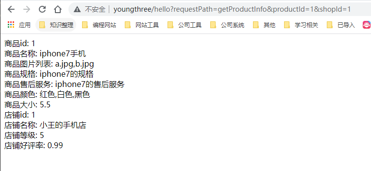

# 0 多级缓存解决的问题及意义

## 0.1 亿级流量商品详情页的多级缓存架构以及架构中每一层的意义

**1、最初级的缓存不一致问题以及解决方案**

问题：先修改数据库，再删除缓存，如果删除缓存失败了，那么会导致数据库中是新数据，缓存中是旧数据，数据出现不一致

解决思路

先删除缓存，再修改数据库，如果删除缓存成功了，如果修改数据库失败了，那么数据库中是旧数据，缓存中是空的，那么数据不会不一致

因为读的时候缓存没有，则读数据库中旧数据，然后更新到缓存中

**2、比较复杂的数据不一致问题分析**

数据发生了变更，先删除了缓存，然后要去修改数据库，此时还没修改

一个请求过来，去读缓存，发现缓存空了，去查询数据库，查到了修改前的旧数据，放到了缓存中

数据变更的程序完成了数据库的修改

完了，数据库和缓存中的数据不一样了。。。。

**3、为什么上亿流量高并发场景下，缓存会出现这个问题？**

只有在对一个数据在并发的进行读写的时候，才可能会出现这种问题

其实如果说你的并发量很低的话，特别是读并发很低，每天访问量就1万次，那么很少的情况下，会出现刚才描述的那种不一致的场景

但是问题是，如果每天的是上亿的流量，每秒并发读是几万，每秒只要有数据更新的请求，就可能会出现上述的数据库+缓存不一致的情况

高并发了以后，问题是很多的

**4、数据库与缓存更新与读取操作进行异步串行化**

更新数据的时候，根据数据的唯一标识，将操作路由之后，发送到一个jvm内部的队列中

读取数据的时候，如果发现数据不在缓存中，那么将重新读取数据+更新缓存的操作，根据唯一标识路由之后，也发送同一个jvm内部的队列中

一个队列对应一个工作线程

每个工作线程串行拿到对应的操作，然后一条一条的执行

这样的话，一个数据变更的操作，先执行，删除缓存，然后再去更新数据库，但是还没完成更新

此时如果一个读请求过来，读到了空的缓存，那么可以先将缓存更新的请求发送到队列中，此时会在队列中积压，然后同步等待缓存更新完成

这里有一个优化点，一个队列中，其实多个更新缓存请求串在一起是没意义的，因此可以做过滤，如果发现队列中已经有一个更新缓存的请求了，那么就不用再放个更新请求操作进去了，直接等待前面的更新操作请求完成即可

待那个队列对应的工作线程完成了上一个操作的数据库的修改之后，才会去执行下一个操作，也就是缓存更新的操作，此时会从数据库中读取最新的值，然后写入缓存中

如果请求还在等待时间范围内，不断轮询发现可以取到值了，那么就直接返回; 如果请求等待的时间超过一定时长，那么这一次直接从数据库中读取当前的旧值

**5、高并发的场景下，该解决方案要注意的问题**

**（1）读请求长时阻塞**

由于读请求进行了非常轻度的异步化，所以一定要注意读超时的问题，每个读请求必须在超时时间范围内返回

该解决方案，最大的风险点在于说，可能数据更新很频繁，导致队列中积压了大量更新操作在里面，然后读请求会发生大量的超时，最后导致大量的请求直接走数据库

务必通过一些模拟真实的测试，看看更新数据的频繁是怎样的

另外一点，因为一个队列中，可能会积压针对多个数据项的更新操作，因此需要根据自己的业务情况进行测试，可能需要部署多个服务，每个服务分摊一些数据的更新操作

如果一个内存队列里居然会挤压100个商品的库存修改操作，每隔库存修改操作要耗费10ms区完成，那么最后一个商品的读请求，可能等待10 * 100 = 1000ms = 1s后，才能得到数据

这个时候就导致读请求的长时阻塞

一定要做根据实际业务系统的运行情况，去进行一些压力测试，和模拟线上环境，去看看最繁忙的时候，内存队列可能会挤压多少更新操作，可能会导致最后一个更新操作对应的读请求，会hang多少时间，如果读请求在200ms返回，如果你计算过后，哪怕是最繁忙的时候，积压10个更新操作，最多等待200ms，那还可以的

如果一个内存队列可能积压的更新操作特别多，那么你就要加机器，让每个机器上部署的服务实例处理更少的数据，那么每个内存队列中积压的更新操作就会越少

其实根据之前的项目经验，一般来说数据的写频率是很低的，因此实际上正常来说，在队列中积压的更新操作应该是很少的

针对读高并发，读缓存架构的项目，一般写请求相对读来说，是非常非常少的，每秒的QPS能到几百就不错了

一秒，500的写操作，5份，每200ms，就100个写操作

单机器，20个内存队列，每个内存队列，可能就积压5个写操作，每个写操作性能测试后，一般在20ms左右就完成

那么针对每个内存队列中的数据的读请求，也就最多hang一会儿，200ms以内肯定能返回了

写QPS扩大10倍，但是经过刚才的测算，就知道，单机支撑写QPS几百没问题，那么就扩容机器，扩容10倍的机器，10台机器，每个机器20个队列，200个队列

大部分的情况下，应该是这样的，大量的读请求过来，都是直接走缓存取到数据的

少量情况下，可能遇到读跟数据更新冲突的情况，如上所述，那么此时更新操作如果先入队列，之后可能会瞬间来了对这个数据大量的读请求，但是因为做了去重的优化，所以也就一个更新缓存的操作跟在它后面

等数据更新完了，读请求触发的缓存更新操作也完成，然后临时等待的读请求全部可以读到缓存中的数据

**（2）读请求并发量过高**

这里还必须做好压力测试，确保恰巧碰上上述情况的时候，还有一个风险，就是突然间大量读请求会在几十毫秒的延时hang在服务上，看服务能不能抗的住，需要多少机器才能抗住最大的极限情况的峰值

但是因为并不是所有的数据都在同一时间更新，缓存也不会同一时间失效，所以每次可能也就是少数数据的缓存失效了，然后那些数据对应的读请求过来，并发量应该也不会特别大

按1:99的比例计算读和写的请求，每秒5万的读QPS，可能只有500次更新操作

如果一秒有500的写QPS，那么要测算好，可能写操作影响的数据有500条，这500条数据在缓存中失效后，可能导致多少读请求，发送读请求到库存服务来，要求更新缓存

一般来说，1:1，1:2，1:3，每秒钟有1000个读请求，会hang在库存服务上，每个读请求最多hang多少时间，200ms就会返回

在同一时间最多hang住的可能也就是单机200个读请求，同时hang住

单机hang200个读请求，还是ok的

1:20，每秒更新500条数据，这500秒数据对应的读请求，会有20 * 500 = 1万

1万个读请求全部hang在库存服务上，就死定了

**（3）多服务实例部署的请求路由**

可能这个服务部署了多个实例，那么必须保证说，执行数据更新操作，以及执行缓存更新操作的请求，都通过nginx服务器路由到相同的服务实例上

**（4）热点商品的路由问题，导致请求的倾斜**

万一某个商品的读写请求特别高，全部打到相同的机器的相同的队列里面去了，可能造成某台机器的压力过大

就是说，因为只有在商品数据更新的时候才会清空缓存，然后才会导致读写并发，所以更新频率不是太高的话，这个问题的影响并不是特别大

但是的确可能某些机器的负载会高一些

# 1 zookeeper安装(集群)

**1 将提供的zookeeper-3.4.5.tar.gz拷贝到/usr/local目录下。**

**2 对zookeeper-3.4.5.tar.gz进行解压缩：**

**3 对zookeeper目录进行重命名：**

```shell
mv zookeeper-3.4.5 zk
```

**4 配置zookeeper相关的环境变量**

```
vim  /etc/profile
```

**PS:zookeeper安装的前提是已经安装好了JVM**

```shell
#profile加入zk相关环境变量，并设置到path中
export ZOOKEEPER_HOME=/usr/local/zk
export PATH=$PATH:$ZOOKEEPER_HOME/bin

```

**5 设置配置文件**

```shell
cd zk/conf
cp zoo_sample.cfg zoo.cfg
vim zoo.cfg
```

修改配置文件

```shell
#zoo.cfg中修改对应data目录位置
dataDir=/usr/local/zk/data
#新增对应集群配置，放在最后面即可
server.0=eshop-cache01:2888:3888	
server.1=eshop-cache02:2888:3888
server.2=eshop-cache03:2888:3888
```

**6 建立输出目录**

```shell
cd zk
#在zk的根目录下建立data，就是对应zoo.cfg中的dataDir的位置
mkdir data
```

**7 在对应输出目录建立myid文件**

```shell
cd data
#设置myid文件的值为0即可
vi myid
0
```

**8 集群的配置**

配置3节点集群

在另外两个节点上按照上述步骤配置ZooKeeper，使用scp将zk和.bashrc拷贝到机器2和机器3上即可。唯一的区别是标识号分别设置为1和2。

**9 启动并检查是否安装成功**

分别在三台机器上执行：

```shell
#启动
zkServer.sh start
#检查ZooKeeper状态：，应该是一个leader，两个follower
zkServer.sh status
```


jps：检查三个节点是否都有QuromPeerMain进程


**扩展-scp使用：**

scp是用来将本服务器上的文件复制到其他服务器上的命令

```shell
#scp 目录/文件(目录就前加-r) 账户@ip地址:对应目录
#回车后需要验证对应服务器密码
scp -r zk root@192.168.31.102:/usr/local
scp  zk.taz root@192.168.31.102:/usr/local
```

# 2 kafka安装(集群)

## 2.1 前言简介

scala，很多比如大数据领域里面的spark（计算引擎）就是用scala编写的，kafka也是基于scala开发的

Scala 是一门多范式（multi-paradigm）的编程语言，设计初衷是要集成面向对象编程和函数式编程的各种特性。

Scala 运行在 Java 虚拟机上，并兼容现有的 Java 程序。

Scala 源代码被编译成 Java 字节码，所以它可以运行于 JVM 之上，并可以调用现有的 Java 类库。

## 2.2 scala安装

1 将课程提供的scala-2.11.4.tgz拷贝到/usr/local目录下。

2 对scala-2.11.4.tgz进行解压缩

3 对scala目录进行重命名

```shell
mv scala-2.11.4 scala
```

4 配置scala相关环境变量

```shell
vim /etc/profile
```

环境变量

```shell
export SCALA_HOME=/usr/local/scala
export PATH=$PATH:$SCALA_HOME/bin
```

5 查看scala是否安装成功：

```shell
scala -version
```


6 按照上述步骤在其他机器上都安装好scala

## 2.3 kafka安装(集群)

1 将课程提供的kafka_2.9.2-0.8.1.tgz拷贝到/usr/local目录下

2 对kafka_2.9.2-0.8.1.tgz进行解压缩：

3 对kafka目录进行改名：

```shell
mv kafka_2.9.2-0.8.1 kafka
```

4 配置kafka

```
vim /usr/local/kafka/config/server.properties
```

配置文件

```shell
#依次增长的整数，0、1、2，集群中Broker的唯一id
broker.id=0
#集群配置
zookeeper.connect=192.168.31.187:2181,192.168.31.19:2181,192.168.31.227:2181
```

5 安装slf4j

将课程提供的slf4j-1.7.6.zip解压
找到slf4j-nop-1.7.6.jar包
复制到kafka的libs目录下面


6 解决kafka Unrecognized VM option 'UseCompressedOops'问题

```shell
#修改脚本文件
vim /usr/local/kafka/bin/kafka-run-class.sh 
```

脚本文件

```shell
if [ -z "$KAFKA_JVM_PERFORMANCE_OPTS" ]; then
  KAFKA_JVM_PERFORMANCE_OPTS="-server  -XX:+UseCompressedOops -XX:+UseParNewGC -XX:+UseConcMarkSweepGC -XX:+CMSClassUnloadingEnabled -XX:+CMSScavengeBeforeRemark -XX:+DisableExplicitGC -Djava.awt.headless=true"
fi
#去掉-XX:+UseCompressedOops即可
```

去掉后


7 集群配置

按照上述步骤在另外两台机器分别安装kafka。用scp把kafka拷贝到其他机器即可。
唯一区别的，就是server.properties中的broker.id，要设置为1和2

8 启动kafka集群

在三台机器上的kafka目录下，分别执行以下命令：

```shell
#启动
nohup bin/kafka-server-start.sh config/server.properties &
```

使用jps检查启动是否成功


9 使用基本命令检查kafka是否搭建成功

```shell
#创建topic
bin/kafka-topics.sh --zookeeper 192.168.31.101:2181,192.168.31.102:2181,192.168.31.103:2181 --topic test --replication-factor 1 --partitions 1 --create

#创建生产者,这里会进入Kafka，输入相关信息，订阅对应topic的消费就能消费到
bin/kafka-console-producer.sh --broker-list 192.168.31.101:9092,192.168.31.102:9092,192.168.31.103:9092 --topic test
#创建消费者，这里也会进入kafka，就能展示对应topic生产的信息
bin/kafka-console-consumer.sh --zookeeper 192.168.31.101:2181,192.168.31.102:2181,192.168.31.103:2181 --topic test --from-beginning
```

生产


消费


# 3 亿级流量redis

参考笔记部分的redis内容

## 3.1 redis的LRU缓存清除算法

### 3.1.1、LRU算法概述

redis默认情况下就是使用LRU策略的，因为内存是有限的，但是如果你不断地往redis里面写入数据，那肯定是没法存放下所有的数据在内存的

所以**redis默认情况下，当内存中写入的数据很满之后，就会使用LRU算法清理掉部分内存中的数据，腾出一些空间来，然后让新的数据写入redis缓存中**

**LRU：Least Recently Used，最近最少使用算法**

### 3.1.2、缓存清理设置

**redis.conf**

**maxmemory**，设置redis用来存放数据的最大的内存大小，一旦超出这个内存大小之后，就会立即使用LRU算法清理掉部分数据

如果用LRU，那么就是将最近最少使用的数据从缓存中清除出去

对于64 bit的机器，如果maxmemory设置为0，那么就默认不限制内存的使用，直到耗尽机器中所有的内存为止; 但是对于32 bit的机器，有一个隐式的闲置就是3GB

**maxmemory-policy**，可以设置内存达到最大闲置后，采取什么策略来处理

（1）noeviction: 如果内存使用达到了maxmemory，client还要继续写入数据，那么就直接报错给客户端
（2）allkeys-lru: 就是我们常说的LRU算法，移除掉最近最少使用的那些keys对应的数据
（3）volatile-lru: 也是采取LRU算法，但是仅仅针对那些设置了指定存活时间（TTL）的key才会清理掉
（4）allkeys-random: 随机选择一些key来删除掉
（5）volatile-random: 随机选择一些设置了TTL的key来删除掉
（6）volatile-ttl: 移除掉部分keys，选择那些TTL时间比较短的keys

### 3.1.3、缓存清理的流程

（1）客户端执行数据写入操作
（2）redis server接收到写入操作之后，检查maxmemory的限制，如果超过了限制，那么就根据对应的policy清理掉部分数据
（3）写入操作完成执行

### 3.1.4、redis的LRU近似算法

科普一个相对来说稍微高级一丢丢的知识点

**redis采取的是LRU近似算法，也就是对keys进行采样，然后在采样结果中进行数据清理**

redis 3.0开始，在LRU近似算法中引入了pool机制，表现可以跟真正的LRU算法相当，但是还是有所差距的，不过这样可以减少内存的消耗

**redis LRU算法，是采样之后再做LRU清理的，跟真正的、传统、全量的LRU算法是不太一样的**

**maxmemory-samples**，比如5，可以设置采样的大小，如果设置为10，那么效果会更好，不过也会耗费更多的CPU资源

### 3.1.5 LRU算法实现(java)

**待补充**

### 3.1.6 扩展

在redis里面，写入key-value对的时候，是可以设置TTL，存活时间，比如你设置了60s。那么一个key-value对，在60s之后就会自动被删除

redis的使用，各种数据结构，list，set，等等

allkeys-lru

这边拓展一下思路，对技术的研究，一旦将一些技术研究的比较透彻之后，就喜欢横向对比底层的一些原理

storm，科普一下

玩儿大数据的人搞得，领域，实时计算领域，storm

storm有很多的流分组的一些策略，按shuffle分组，global全局分组，direct直接分组，fields按字段值hash后分组

分组策略也很多，但是，真正公司里99%的场景下，使用的也就是shuffle和fields，两种策略

redis，给了这么多种乱七八糟的缓存清理的算法，其实真正常用的可能也就那么一两种，allkeys-lru是最常用的

# 4 ngnix+lua缓存架构

​	**用nginx+lua去开发，所以会选择用最流行的开源方案，就是用OpenResty**

​	**nginx+lua打包在一起，而且提供了包括redis客户端，mysql客户端，http客户端在内的大量的组件**

## 4.1 OpenResty安装

1 创建目录

```shell
mkdir -p /usr/servers  
cd /usr/servers/
```

2 安装必要依赖

```shell
yum install -y readline-devel pcre-devel openssl-devel gcc
```

3 下载包并解压

**PS:这里1.7.7.2是比较旧的版本，后续kafka的脚步依赖就需要新版本才能兼容，不过新旧版本安装步骤是一样的**

```shell
#新版本
#wget https://openresty.org/download/openresty-1.19.3.2.tar.gz
wget http://openresty.org/download/ngx_openresty-1.7.7.2.tar.gz  
tar -xzvf ngx_openresty-1.7.7.2.tar.gz  
```

4 编译

```shell
#先进入对应目录
cd /usr/servers/ngx_openresty-1.7.7.2/
#先进入对应目录
#这里如果是新版本的话，注意目录对应
cd bundle/LuaJIT-2.1-20150120/  
#编译
make clean && make && make install  
#连接，这边编译完成后会提示运行这个连接命令
#这里如果是新版本的话，注意目录对应，和最后输出的连接命令的对应，直接复制编译完成最后打印的命令即可
ln -sf luajit-2.1.0-alpha /usr/local/bin/luajit
```

5 相关配置包

下载

```shell
#进入目录
cd /usr/servers/ngx_openresty-1.7.7.2/bundle  
#下载
wget https://github.com/FRiCKLE/ngx_cache_purge/archive/2.3.tar.gz  
#解压
tar -xvf 2.3.tar.gz  
#进入目录
cd /usr/servers/ngx_openresty-1.7.7.2/bundle  
#下载
wget https://github.com/yaoweibin/nginx_upstream_check_module/archive/v0.3.0.tar.gz  
#解压
tar -xvf v0.3.0.tar.gz  
```

编译

```shell
#进入目录
cd /usr/servers/ngx_openresty-1.7.7.2  
#编译
./configure --prefix=/usr/servers --with-http_realip_module  --with-pcre  --with-luajit --add-module=./bundle/ngx_cache_purge-2.3/ --add-module=./bundle/nginx_upstream_check_module-0.3.0/ -j2  
#编译
make && make install 
```

6 查看目录，启动nginx


启动nginx:

```shell
 /usr/servers/nginx/sbin/nginx
```

**PS:若对应机器安装了gitlab会有nginx冲突，需要卸载gitlab，或者临时kill进程，或者改默认端口等操作，才能启动**

**PS:如果是旧版本升级新版本，对应的lualib包，如果在其他地方引用了旧版本lualib包新版本是不兼容的，需要把旧版本的lualib包等依赖度删掉，都用新版本的lualib!!!!!!!!!!**

## 4.2 demo级应用

### 4.2.1 nginx+lua开发的demo

1 配置nginx.conf

```shell
vim /usr/servers/nginx/conf/nginx.conf
```

在http部分添加：

```shell
lua_package_path "/usr/servers/lualib/?.lua;;";  
lua_package_cpath "/usr/servers/lualib/?.so;;";  
include lua.conf;
```

2 创建lua.conf

/usr/servers/nginx/conf下，创建一个lua.conf

```shell
server {  
    listen       80;  
    server_name  _;  
    location /lua {  
    	default_type 'text/html';  
   		content_by_lua 'ngx.say("hello world")';  
	} 
}  
```

3 验证配置是否正确：

```shell
/usr/servers/nginx/sbin/nginx -t
```

4 重新nginx加载配置

```shell
/usr/servers/nginx/sbin/nginx -s reload  
```

访问http: http://192.168.31.187/lua

5 可选-独立出lua相关代码

```shell
#创建并打开
vim /usr/servers/nginx/conf/lua/hello.lua
#加入
ngx.say("hello world"); 
```

修改lua.conf

```shell
#相关代码改为引入文件
location /lua {  
    default_type 'text/html';  
    content_by_lua_file conf/lua/hello.lua; 
}
```

7 可选-查看异常日志

```
tail -f /usr/servers/nginx/logs/error.log
cat /usr/servers/nginx/logs/error.log
```


### 4.2.2 工程化的nginx+lua项目结构

项目工程结构

```
#这是目录层级
hello
    hello.conf     
    lua              
      hello.lua
    lualib            
      *.lua
      *.so
```

1 创建目录

```
mkdir /usr/hello
```

2 创建hello.conf文件

```shell
#打开并创建
vim /usr/hello/hello.conf
#加入
server {  
    listen       80;  
    server_name  _;  
  
    location /hello {  
        default_type 'text/html';  
        #lua_code_cache off;  
        content_by_lua_file /usr/hello/lua/hello.lua;  
    }  
} 

```

4 创建lua目录及对应代码文件

```shell
mkdir /usr/hello/lua
vim /usr/hello/lua/hello.lua
#加入
ngx.say("hello world 78910");
```

5 将对应包加入到hello工程目录中

```shell
cd /usr/hello/
#将之前装好的包移动到工程中
cd -r /usr/servers/lualib/ .
```

6 修改nginx配置文件，改为引用hello工程的相关配置

```shell
vim /usr/servers/nginx/conf/nginx.conf
#对应http中的配置改为
    lua_package_path "/usr/hello/lualib/?.lua;;";
    lua_package_cpath "/usr/hello/lualib/?.so;;";
    include /usr/hello/hello.conf;
```


## 4.3 基于“分发层+应用层”双层nginx架构提升缓存命中率方案分析

**1、缓存命中率低**

**如果一般来说，你默认会部署多个nginx，在里面都会放一些缓存，就默认情况下，此时缓存命中率是比较低的**


**2、如何提升缓存命中率**

**分发层+应用层，双层nginx**

**分发层nginx，负责流量分发的逻辑和策略，这个里面它可以根据你自己定义的一些规则，比如根据productId去进行hash，然后对后端的nginx数量取模**

**将某一个商品的访问的请求，就固定路由到一个nginx后端服务器上去，保证说只会从redis中获取一次缓存数据，后面全都是走nginx本地缓存了**

后端的nginx服务器，就称之为应用服务器; 最前端的nginx服务器，被称之为分发服务器

看似很简单，其实很有用，在实际的生产环境中，可以大幅度提升你的nginx本地缓存这一层的命中率，大幅度减少redis后端的压力，提升性能


## 4.4 分发层nginx以及基于lua完成基于商品id的定向流量分发策略

### 4.4.1 实现逻辑

基于OpenResty在另外两台机器上都部署一下nginx+lua的开发环境

用101和102作为应用层nginx服务器，用103作为分发层nginx

在103，也就是分发层nginx中，编写lua脚本，完成基于商品id的流量分发策略

当然了，我们这里主要会简化策略，简化业务逻辑，实际上在你的公司中，你可以随意**根据自己的业务逻辑和场景，去制定自己的流量分发策略(提高缓存命中率)**

**1、获取请求参数，比如productId**

**2、对productId进行hash**

**3、hash值对应用服务器数量取模，获取到一个应用服务器**

**4、利用http发送请求到应用层nginx**

**5、获取响应后返回**

这个就是基于商品id的定向流量分发的策略，lua脚本来编写和实现

我们作为一个流量分发的nginx，会发送http请求到后端的应用nginx上面去，所以要先引入lua http lib包

### 4.4.2 具体实现

在对应目录加入lua脚本(相当于jar包依赖)

下载解压缩，复制到目录

https://www.zixuephp.net/uploads/file/20181017/1539739400144830.rar

```shell
cd /usr/hello/lualib/resty/  
```

编辑lua脚本

```shell
vim /usr/hello/lua/hello.lua
```

编辑

```lua
local uri_args = ngx.req.get_uri_args()
local productId = uri_args["productId"]

local hosts = {"192.168.31.101", "192.168.31.102"}
local hash = ngx.crc32_long(productId)
local index = (hash % 2) + 1
backend = "http://"..hosts[index]

local requestPath = uri_args["requestPath"]
requestPath = "/"..requestPath.."?productId="..productId

local http = require("resty.http")
local httpc = http.new()

local resp, err = httpc:request_uri(backend,{
  method = "GET",
  path = requestPath,
  keepalive = false
})

if not resp then
  ngx.say("request error: ", err)
  return
end

ngx.say(resp.body)

httpc:close() 
```

发送请求测试：

http://192.168.31.103/hello?requestPath=hello&productId=1


**我们就可以看到，如果你请求的是固定的某一个商品，那么就一定会将流量打到固定的一个应用nginx上面去(提高缓存命中率)**

# 5 storm

## 5.1 概述

### 5.1.1 缓存架构和storm的关系

​	因为有些热点数据相关的一些**实时处理的一些方案，比如快速预热，热点数据的实时感知和快速降级，全部要用到storm**

​	因为我们可能需要**实时的去计算出热点缓存数据，实时计算，亿级流量，高并发**，大量的请求过来

​	这个时候，你要做一些实时的计算，那么必须涉及到**分布式的一些技术，分布式的技术**，才能处理高并发，大量的请求

​	目前在时候**计算的领域，最成熟的大数据的技术，就是storm**

​	storm分布式的大数据实时计算的技术/系统

### 5.1.2 大数据/数据处理相关技术概述

**Storm：**

​	**实时缓存热点数据统计->缓存预热->缓存热点数据自动降级**

**Hive：**

​	**Hadoop生态栈里面，做数据仓库的一个系统，高并发访问下，海量请求日志的批量统计分析，日报周报月报，接口调用情况，业务使用情况，等等**

​	在一些大公司里面，是有些人是将海量的请求日志打到hive里面，做离线的分析，然后反过来去优化自己的系统

**Spark：**

​	**离线批量数据处理，比如从DB中一次性批量处理几亿数据，清洗和处理后写入Redis中供后续的系统使用**，大型互联网公司的用户相关数据

**ZooKeeper：**

​	**分布式系统的协调，分布式锁，分布式选举->高可用HA架构，轻量级元数据存储**

​	用java开发了分布式的系统架构，你的整套系统拆分成了多个部分，每个部分都会负责一些功能，互相之间需要交互和协调

​	服务A说，我在处理某件事情的时候，服务B你就别处理了

​	服务A说，我一旦发生了某些状况，希望服务B你立即感知到，然后做出相应的对策

**HBase：**

​	**海量数据的在线存储和简单查询，替代MySQL分库分表，提供更好的伸缩性**

​	java底层，对应的是海量数据，然后要做一些简单的存储和查询，同时数据增多的时候要快速扩容

​	mysql分库分表就不太合适了，mysql分库分表扩容，还是比较麻烦的

**Elasticsearch：**

​	**海量数据的复杂检索以及搜索引擎的构建，支撑有大量数据的各种企业信息化系统的搜索引擎，电商/新闻等网站的搜索引擎，等等**

​	mysql的like "%xxxx%"，更加合适一些，性能更加好

### 5.1.3 Storm解决的问题及特点

**1、mysql，hadoop与storm**

mysql：事务性系统，面临海量数据的尴尬

hadoop：离线批处理

**storm：实时计算**

mysql、hadoop与storm的关系图：


**2、storm的特点是什么**

（1）**支撑各种实时类的项目场景：实时处理消息以及更新数据库**，基于最基础的实时计算语义和API（实时数据处理领域）；对实时的数据流持续的进行查询或计算，同时将最新的计算结果持续的推送给客户端展示，同样基于最基础的实时计算语义和API（实时数据分析领域）；对耗时的查询进行并行化，基于DRPC，即分布式RPC调用，单表30天数据，并行化，每个进程查询一天数据，最后组装结果

storm做各种实时类的项目都ok

（2）**高度的可伸缩性：如果要扩容，直接加机器**，调整storm计算作业的并行度就可以了，storm会自动部署更多的进程和线程到其他的机器上去，无缝快速扩容

扩容起来，超方便

（3）**数据不丢失的保证：storm的消息可靠机制开启后，可以保证一条数据都不丢**

数据不丢失，也不重复计算

（4）**超强的健壮性：从历史经验来看，storm比hadoop、spark等大数据类系统，健壮的多的多，因为元数据全部放zookeeper，不在内存中，随便挂都不要紧**

特别的健壮，稳定性和可用性很高

（5）**使用的便捷性：核心语义非常的简单，开发起来效率很高**

用起来很简单，开发API还是很简单的

**PS:海量高并发大数据，高并发的请求数据，分布式的系统，流式处理的分布式系统**

**3、strom相关的技术**

JStorm，阿里。Storm，clojure编程预压，Java重新写了一遍，Galaxy流式计算的系统

## 5.2 strom的核心概念

**1、Storm的集群架构**

Nimbus->Supervisor->Worker->Executor->Task

ZooKeeper

storm集群架构图:


**2、Storm的核心概念**

Topology，Spout，Bolt，Tuple，Stream

**拓扑(Topology)：务虚的一个概念(对应多个worker)**

**Spout：数据源的一个代码组件**，就是我们可以实现一个spout接口，写一个java类，**在这个spout代码中，我们可以自己去数据源获取数据**，比如说从kafka中消费数据**(对应多个executor,task)**

**bolt：一个业务处理的代码组件**，spout会将数据传送给bolt，各种bolt还可以串联成一个计算链条，java类实现了一个bolt接口

一堆spout+bolt，就会组成一个topology，就是一个拓扑，实时计算作业，spout+bolt，一个拓扑涵盖数据源获取/生产+数据处理的所有的代码逻辑，topology

**tuple：就是一条数据，每条数据都会被封装在tuple中，在多个spout和bolt之间传递**

**stream：就是一个流**，务虚的一个概念，抽象的概念，**源源不断过来的tuple，就组成了一条数据流**

**storm核心概念图(下图对应：1个Topology->4个worker->6个executor->n个task)：**


## 5.3 并行度和流分组

**并行度：Worker->Executor->Task**

**流分组：**

​	**Task与Task之间的数据流向关系**

​	**Shuffle Grouping：随机发射，负载均衡**

​	**Fields Grouping：根据某一个，或者某些个，fields(字段)，进行分组**，那一个或者多个fields如果值完全相同的话，那么这些tuple，就会发送给下游bolt的其中固定的一个task

你发射的每条数据是一个tuple，每个tuple中有多个field作为字段

比如tuple，3个字段，name，age，salary

{"name": "tom", "age": 25, "salary": 10000} -> tuple -> 3个field，name，age，salary

All Grouping
Global Grouping
None Grouping
Direct Grouping
Local or Shuffle Grouping

**并行度和流分组图:**


## 5.4 strom的demo程序

​	**大数据，入门程序，wordcount，单词计数**

​	**可以认为，storm源源不断的接收到一些句子，然后你需要实时的统计出句子中每个单词的出现次数**

 * 单词计数拓扑
 * storm，最基本的开发，就够了，**java开发广告计费系统，大量的流量的引入和接入，就是用storm做得**
 * **用storm，主要是用它的成熟的稳定的易于扩容的分布式系统的特性**
 * java工程师，来说，做一些简单的storm开发，掌握到这个程度差不多就够了

pom

```xml
  	<dependencies>
    	<dependency>
      		<groupId>junit</groupId>
      		<artifactId>junit</artifactId>
      		<version>4.6</version>
      		<scope>test</scope>
    	</dependency>
    	<dependency>
      		<groupId>org.apache.storm</groupId>
      		<artifactId>storm-core</artifactId>
      		<version>1.1.0</version>
    	</dependency>
    	<dependency>
      		<groupId>commons-collections</groupId>
      		<artifactId>commons-collections</artifactId>
      		<version>3.2.1</version>
    	</dependency>
  	</dependencies>
```

spout提供数据，正常来说是要从kafka或者mysql等外部获取数据，这里demo利用随机数，生成单词数据

```java
	/**
	 * spout
	 * 
	 * spout，继承一个基类，实现接口，这个里面主要是负责从数据源获取数据
	 * 
	 * 我们这里作为一个简化，就不从外部的数据源去获取数据了，只是自己内部不断发射一些句子
	 * 
	 * @author Administrator
	 *
	 */
	public static class RandomSentenceSpout extends BaseRichSpout {

		private static final long serialVersionUID = 3699352201538354417L;
		
		private static final Logger LOGGER = LoggerFactory.getLogger(RandomSentenceSpout.class);

		private SpoutOutputCollector collector;
		private Random random;
		
		/**
		 * open方法
		 * 
		 * open方法，是对spout进行初始化的
		 * 
		 * 比如说，创建一个线程池，或者创建一个数据库连接池，或者构造一个httpclient
		 * 
		 */
		@SuppressWarnings("rawtypes")
		public void open(Map conf, TopologyContext context,
				SpoutOutputCollector collector) {
			// 在open方法初始化的时候，会传入进来一个东西，叫做SpoutOutputCollector
			// 这个SpoutOutputCollector就是用来发射数据出去的
			this.collector = collector;
			// 构造一个随机数生产对象
			this.random = new Random();
		}
		
		/**
		 * nextTuple方法
		 * 
		 * 这个spout类，之前说过，最终会运行在task中，某个worker进程的某个executor线程内部的某个task中
		 * 那个task会负责去不断的无限循环调用nextTuple()方法
		 * 只要的话呢，无限循环调用，可以不断发射最新的数据出去，形成一个数据流
		 * 
		 */
		public void nextTuple() {
			Utils.sleep(100); 
			String[] sentences = new String[]{"the cow jumped over the moon", "an apple a day keeps the doctor away",
					"four score and seven years ago", "snow white and the seven dwarfs", "i am at two with nature"};
			String sentence = sentences[random.nextInt(sentences.length)];
			LOGGER.info("【发射句子】sentence=" + sentence);  
			// 这个values，你可以认为就是构建一个tuple
			// tuple是最小的数据单位，无限个tuple组成的流就是一个stream
			collector.emit(new Values(sentence)); 
		}

		/**
		 * declareOutputFielfs这个方法
		 * 
		 * 很重要，这个方法是定义一个你发射出去的每个tuple中的每个field的名称是什么
		 * 
		 */
		public void declareOutputFields(OutputFieldsDeclarer declarer) {
			declarer.declare(new Fields("sentence"));   
		}
		
	}
```

第一个bolt逻辑为接收spout发射的句子，然后把句子分为一个一个的单词，再去发射

```java
	/**
	 * 写一个bolt，直接继承一个BaseRichBolt基类
	 * 
	 * 实现里面的所有的方法即可，每个bolt代码，同样是发送到worker某个executor的task里面去运行
	 * 
	 * @author Administrator
	 *
	 */
	public static class SplitSentence extends BaseRichBolt {
		
		private static final long serialVersionUID = 6604009953652729483L;
		
		private OutputCollector collector;
		
		/**
		 * 对于bolt来说，第一个方法，就是prepare方法
		 * 
		 * OutputCollector，这个也是Bolt的这个tuple的发射器
		 * 
		 */
		@SuppressWarnings("rawtypes")
		public void prepare(Map conf, TopologyContext context, OutputCollector collector) {
			this.collector = collector;
		}
		
		/**
		 * execute方法
		 * 
		 * 就是说，每次接收到一条数据后，就会交给这个executor方法来执行
		 * 
		 */
		public void execute(Tuple tuple) {
			String sentence = tuple.getStringByField("sentence"); 
			String[] words = sentence.split(" "); 
			for(String word : words) {
				collector.emit(new Values(word)); 
			}
		}

		/**
		 * 定义发射出去的tuple，每个field的名称
		 */
		public void declareOutputFields(OutputFieldsDeclarer declarer) {
			declarer.declare(new Fields("word"));   
		}
		
	}
```

第二个bolt为接受单词，然后根据单词出现的次数来计数

```java
	public static class WordCount extends BaseRichBolt {

		private static final long serialVersionUID = 7208077706057284643L;
		
		private static final Logger LOGGER = LoggerFactory.getLogger(WordCount.class);

		private OutputCollector collector;
		private Map<String, Long> wordCounts = new HashMap<String, Long>();
		
		@SuppressWarnings("rawtypes")
		public void prepare(Map conf, TopologyContext context, OutputCollector collector) {
			this.collector = collector;
		}
		
		public void execute(Tuple tuple) {
			String word = tuple.getStringByField("word");
			
			Long count = wordCounts.get(word);
			if(count == null) {
				count = 0L;
			}
			count++;
			
			wordCounts.put(word, count);
			
			LOGGER.info("【单词计数】" + word + "出现的次数是" + count);  
			
			collector.emit(new Values(word, count));
		}

		public void declareOutputFields(OutputFieldsDeclarer declarer) {
			declarer.declare(new Fields("word", "count"));    
		}
		
	}
```

测试单词技术demo

```java
	public static void main(String[] args) {
		// 在main方法中，会去将spout和bolts组合起来，构建成一个拓扑
		TopologyBuilder builder = new TopologyBuilder();
	
		// 这里的第一个参数的意思，就是给这个spout设置一个名字
		// 第二个参数的意思，就是创建一个spout的对象
		// 第三个参数的意思，就是设置spout的executor有几个
		builder.setSpout("RandomSentence", new RandomSentenceSpout(), 2);
		builder.setBolt("SplitSentence", new SplitSentence(), 5)
				.setNumTasks(10)
				.shuffleGrouping("RandomSentence");
        //fieldsGrouping按字段进行分组
		// 这个很重要，就是说，相同的单词，从SplitSentence发射出来时，一定会进入到下游的指定的同一个task中
		// 只有这样子，才能准确的统计出每个单词的数量
		// 比如你有个单词，hello，下游task1接收到3个hello，task2接收到2个hello
		// 5个hello，全都进入一个task
		builder.setBolt("WordCount", new WordCount(), 10)
				.setNumTasks(20)
            //fieldsGrouping按字段进行分组,值相同的元组，一定让同一个bolt线程来处理
				.fieldsGrouping("SplitSentence", new Fields("word"));  
		
		Config config = new Config();
	
		// 说明是在命令行执行，打算提交到storm集群上去
		if(args != null && args.length > 0) {
			config.setNumWorkers(3);  
			try {
				StormSubmitter.submitTopology(args[0], config, builder.createTopology());  
			} catch (Exception e) {
				e.printStackTrace();
			}
		} else {
			// 说明是idea里面本地运行
			config.setMaxTaskParallelism(20);  
			
			LocalCluster cluster = new LocalCluster();
			cluster.submitTopology("WordCountTopology", config, builder.createTopology());  
			
           	//idea本地运行，主线程休眠60再停止，测试strom单词计数demo效果
			Utils.sleep(60000);
			cluster.shutdown();
		}
	}
```

**总结：**

storm wordcount程序，蕴含了很多的知识点(storm的核心基本原理，基本的开发已经可以了)

（1）Spout
（2）Bolt
（3）OutputCollector，Declarer
（4）Topology
（5）设置worker，executor，task，流分组

## 5.5 storm安装(集群)

1 解压压缩包

2 重命名目录(将解压处理的目录改为storm)

3 修改配置文件

```shell
#先创建目录
mkdir /var/storm
#修改配置文件
vim /usr/local/storm/conf/storm.yaml
#加入
storm.zookeeper.servers:
     - "192.168.31.101"
     - "192.168.31.102"
     - "192.168.31.103"

nimbus.seeds: ["192.168.31.101"]

storm.local.dir: "/var/storm"

supervisor.slots.ports:
    - 6700
    - 6701
    - 6702
    - 6703
    
#slots.ports，指定每个机器上可以启动多少个worker，一个端口号代表一个worker

```

4 修改环境变量

```shell
vim /etc/profile
#添加环境变量
export STORM_HOME=/usr/local/storm
export PATH=$PATH:$STORM_HOME/bin
#保存后source立即生效
source /etc/profile

```

5 利用scp将strom复制到其他机器上，并且修改对应机器的环境变量

6 启动storm集群和ui界面

```shell
#一个节点
storm nimbus >/dev/null 2>&1 &
#三个节点
storm supervisor >/dev/null 2>&1 &
#一个节点(ui界面)
storm ui >/dev/null 2>&1 &
#三个节点(ui界面内部查看对应的日志界面)
storm logviewer >/dev/null 2>&1 &
#可利用Jps查看是否启动成功nimbus、supervisor、ui(ui成功显示core)，显示了对应信息则说明启动成功了

```


7 访问一下ui界面，8080端口（如果端口被占用则ui界面启动不了）

http://192.168.31.101:8080/


8 可选查询对应日志

在根目录下的logs目录中可查看相关日志


## 5.6 storm部署

**1 strom工程打包**

**2 将jar包上传到服务器目录(哪个目录无所谓)**

**3 运行storm项目**

```shell
#jar jar包名称 main方法路径 main方法参数
#storm jar path/to/allmycode.jar org.me.MyTopology arg1 arg2 arg3
storm jar storm-helloworld-0.0.1-SNAPSHOT.jar com.roncoo.eshop.storm.WordCountTopology WordCountTopology
```

**4 查看ui界面**


**5查看日志(没有修改host文件的话，跳转名称需要将主机名(host)改为对应ip地址访问)**


**6 可选，结束storm作业**

```shell
#storm kill topology-name
storm kill WordCountTopology
```

## 5.7 storm本地与线上

本地和线上是两种不同的提交方式

```java
		if(args != null && args.length > 1) {
			config.setNumWorkers(3);  
			try {
                //这是提交到线上部署作业，需要线上相关的zk环境，nimbus，supervisor等启动
				StormSubmitter.submitTopology(args[0], config, builder.createTopology());
			} catch (Exception e) {
				e.printStackTrace();
			}
		} else {
            //这里是本地模拟storm运行，zk环境nimbus，supervisor等都不需要，只需要代码启动即可
			LocalCluster cluster = new LocalCluster();
			cluster.submitTopology("HotProductTopology", config, builder.createTopology());  
			Utils.sleep(3000000);
			cluster.shutdown();
		}
```

引用：https://www.aboutyun.com/thread-15397-1-1.html

# 6 库存服务及缓存服务

## 6.1 库存服务

### 6.1.1  在库存服务中实现缓存与数据库双写一致性保障方案

#### 6.1.1.1 方案

更新数据的时候，根据数据的唯一标识，将操作路由之后，发送到一个jvm内部的队列中

读取数据的时候，如果发现数据不在缓存中，那么将重新读取数据+更新缓存的操作，根据唯一标识路由之后，也发送同一个jvm内部的队列中

一个队列对应一个工作线程

每个工作线程串行拿到对应的操作，然后一条一条的执行

这样的话，一个数据变更的操作，先执行，删除缓存，然后再去更新数据库，但是还没完成更新

此时如果一个读请求过来，读到了空的缓存，那么可以先将缓存更新的请求发送到队列中，此时会在队列中积压，然后同步等待缓存更新完成

这里有一个优化点，一个队列中，其实多个更新缓存请求串在一起是没意义的，因此可以做过滤，如果发现队列中已经有一个更新缓存的请求了，那么就不用再放个更新请求操作进去了，直接等待前面的更新操作请求完成即可

待那个队列对应的工作线程完成了上一个操作的数据库的修改之后，才会去执行下一个操作，也就是缓存更新的操作，此时会从数据库中读取最新的值，然后写入缓存中

如果请求还在等待时间范围内，不断轮询发现可以取到值了，那么就直接返回; 如果请求等待的时间超过一定时长，那么这一次直接从数据库中读取当前的旧值

int h;
return (key == null) ? 0 : (h = key.hashCode()) ^ (h >>> 16);

(queueNum - 1) & hash

1、线程池+内存队列初始化

@Bean
public ServletListenerRegistrationBean servletListenerRegistrationBean(){
    ServletListenerRegistrationBean servletListenerRegistrationBean = new ServletListenerRegistrationBean();
    servletListenerRegistrationBean.setListener(new InitListener());
    return servletListenerRegistrationBean;
}

java web应用，做系统的初始化，一般在哪里做呢？

ServletContextListener里面做，listener，会跟着整个web应用的启动，就初始化，类似于线程池初始化的构建

spring boot应用，Application，搞一个listener的注册

2、两种请求对象封装

3、请求异步执行Service封装

4、请求处理的工作线程封装

5、两种请求Controller接口封装

6、读请求去重优化

如果一个读请求过来，发现前面已经有一个写请求和一个读请求了，那么这个读请求就不需要压入队列中了

因为那个写请求肯定会更新数据库，然后那个读请求肯定会从数据库中读取最新数据，然后刷新到缓存中，自己只要hang一会儿就可以从缓存中读到数据了

7、空数据读请求过滤优化

可能某个数据，在数据库里面压根儿就没有，那么那个读请求是不需要放入内存队列的，而且读请求在controller那一层，直接就可以返回了，不需要等待

如果数据库里都没有，就说明，内存队列里面如果没有数据库更新的请求的话，一个读请求过来了，就可以认为是数据库里就压根儿没有数据吧

如果缓存里没数据，就两个情况，第一个是数据库里就没数据，缓存肯定也没数据; 第二个是数据库更新操作过来了，先删除了缓存，此时缓存是空的，但是数据库里是有的

但是的话呢，我们做了之前的读请求去重优化，用了一个flag map，只要前面有数据库更新操作，flag就肯定是存在的，你只不过可以根据true或false，判断你前面执行的是写请求还是读请求

但是如果flag压根儿就没有呢，就说明这个数据，无论是写请求，还是读请求，都没有过

那这个时候过来的读请求，发现flag是null，就可以认为数据库里肯定也是空的，那就不会去读取了

或者说，我们也可以认为每个商品有一个最最初始的库存，但是因为最初始的库存肯定会同步到缓存中去的，有一种特殊的情况，就是说，商品库存本来在redis中是有缓存的

但是因为redis内存满了，就给干掉了，但是此时数据库中是有值得

那么在这种情况下，可能就是之前没有任何的写请求和读请求的flag的值，此时还是需要从数据库中重新加载一次数据到缓存中的

8、深入的去思考优化代码的漏洞

我的一些思考，如果大家发现了其他的漏洞，随时+我Q跟我交流一下

一个读请求过来，将数据库中的数刷新到了缓存中，flag是false，然后过了一会儿，redis内存满了，自动删除了这个额缓存

下一次读请求再过来，发现flag是false，就不会去执行刷新缓存的操作了

而是hang在哪里，反复循环，等一会儿，发现在缓存中始终查询不到数据，然后就去数据库里查询，就直接返回了

这种代码，就有可能会导致，缓存永远变成null的情况

最简单的一种，就是在controller这一块，如果在数据库中查询到了，就刷新到缓存里面去，以后的读请求就又可以从缓存里面读了

队列

对一个商品的库存的数据库更新操作已经在内存队列中了

然后对这个商品的库存的读取操作，要求读取数据库的库存数据，然后更新到缓存中，多个读

这多个读，其实只要有一个读请求操作压到队列里就可以了

其他的读操作，全部都wait那个读请求的操作，刷新缓存，就可以读到缓存中的最新数据了

如果读请求发现redis缓存中没有数据，就会发送读请求给库存服务，但是此时缓存中为空，可能是因为写请求先删除了缓存，也可能是数据库里压根儿没这条数据

如果是数据库中压根儿没这条数据的场景，那么就不应该将读请求操作给压入队列中，而是直接返回空就可以了

都是为了减少内存队列中的请求积压，内存队列中积压的请求越多，就可能导致每个读请求hang住的时间越长，也可能导致多个读请求被hang住

#### 6.1.1.2 具体实现

欠账


## 6.2 缓存服务

### 6.2.1  spring boot整合ehcache的搭建以支持服务本地堆缓存

#### 6.2.1.1 缓存数据生产服务的工作流程分析

接下来要做这个多级缓存架构，从底往上做，先做缓存数据的生产这一块

我们画图来简单介绍一下整个缓存数据生产服务的一个工作流程

1、商品详情页缓存数据生产服务的工作流程分析

（1）监听多个kafka topic，每个kafka topic对应一个服务（简化一下，监听一个kafka topic）
（2）如果一个服务发生了数据变更，那么就发送一个消息到kafka topic中
（3）缓存数据生产服务监听到了消息以后，就发送请求到对应的服务中调用接口以及拉取数据，此时是从mysql中查询的
（4）缓存数据生产服务拉取到了数据之后，会将数据在本地缓存中写入一份，就是ehcache中
（5）同时会将数据在redis中写入一份


#### 6.2.1.2 具体实现

**欠账**

### 6.2.2 基于kafka+ehcache+redis完成缓存数据生产服务的开发与测试

**1、编写业务逻辑**

（1）两种服务会发送来数据变更消息：商品信息服务，商品店铺信息服务，每个消息都包含服务名以及商品id

（2）接收到消息之后，根据商品id到对应的服务拉取数据，这一步，我们采取简化的模拟方式，就是在代码里面写死，会获取到什么数据，不去实际再写其他的服务去调用了

（3）商品信息：id，名称，价格，图片列表，商品规格，售后信息，颜色，尺寸

（4）商品店铺信息：其他维度，用这个维度模拟出来缓存数据维度化拆分，id，店铺名称，店铺等级，店铺好评率

（5）分别拉取到了数据之后，将数据组织成json串，然后分别存储到ehcache中，和redis缓存中

**2、 核心代码**

**PS:完整代码见E:\workSofeware\workspace\yjll\eshop-cache**

**欠账**

**3、测试业务逻辑**

**PS:kafka内部通信默认是根据hostname(主机名)来的,在windows和对应Linux虚拟机中都需要配置ip和hostname的映射，或者修改kafka配置，这里选择是修改hosts**

```
192.168.31.101 youngstar
192.168.31.102 youngtwo
192.168.31.103 youngthree
```

（1）创建一个kafka topic

```shell
#创建cache-message的topic
bin/kafka-topics.sh --zookeeper 192.168.31.101:2181,192.168.31.102:2181,192.168.31.103:2181 --topic cache-message --replication-factor 1 --partitions 1 --create
```

（2）在命令行启动一个kafka producer

```shell
#创建cache-message的生产者
bin/kafka-console-producer.sh --broker-list 192.168.31.101:9092,192.168.31.102:9092,192.168.31.103:9092 --topic cache-message
```

（3）启动系统，消费者开始监听kafka topic

（4）在producer中，分别发送两条消息，一个是商品信息服务的消息，一个是商品店铺信息服务的消息

```json
//商品信息服务信息
{"serviceId":"productInfoService","productId":1}
//商品店铺信息服务的消息
{"serviceId":"shopInfoService","shopId":1}
```

（5）能否接收到两条消息，并模拟拉取到两条数据，同时将数据写入ehcache中，并写入redis缓存中

**PS:在这里得注意，kafka消费端一旦抛出异常，后续生产的消息就不会消费了，具体机制不明确，会不会自动恢复不明确。**

**PS:也不能debug断点调试，一旦断点了也和抛异常一样，后续不会再消费了**

**PS:解决办法，重启。且重启之后会消费前几条kafka生成的数据，需要确保重启拉取的几条数据不能再次抛异常了，不然后续也不会继续消费了。**

（6）ehcache通过打印日志方式来观察，redis通过手工连接上去来查询


### 6.2.3 基于nginx+lua+java完成多级缓存架构的核心业务逻辑

#### 6.2.3.1 概述

分发层nginx，lua应用，会将商品id，商品店铺id，都转发到后端的应用nginx

1、应用nginx的lua脚本接收到请求

2、获取请求参数中的商品id，以及商品店铺id

3、根据商品id和商品店铺id，在nginx本地缓存中尝试获取数据

4、如果在nginx本地缓存中没有获取到数据，那么就到redis分布式缓存中获取数据，如果获取到了数据，还要设置到nginx本地缓存中

**PS:但是这里有个问题，建议不要用nginx+lua直接去获取redis数据，最后是发送http请求到缓存数据生产服务返回数据给nginx**

5、如果缓存数据生产服务没有在redis分布式缓存中没有获取到数据，那么就在自己本地ehcache中获取数据，返回数据给nginx，也要设置到nginx本地缓存中

6、如果ehcache本地缓存都没有数据，那么就需要去原始的服务中拉去数据，该服务会从mysql中查询，拉去到数据之后，返回给nginx，并重新设置到ehcache和redis中

7、nginx最终利用获取到的数据，动态渲染网页模板

#### 6.2.3.2 具体实现

**PS:本小节实现的主要是 4.3 中 分发层+应用层中的应用层逻辑**

1 先添加对应http相关lua脚本文件

```shell
#进入对应目录
cd /usr/hello/lualib/resty/  
#在该目录下载文件
wget https://raw.githubusercontent.com/pintsized/lua-resty-http/master/lib/resty/http_headers.lua  
wget https://raw.githubusercontent.com/pintsized/lua-resty-http/master/lib/resty/http.lua 
```

2 添加对应模板支持脚本文件

```shell
#进入对应目录
cd /usr/hello/lualib/resty/
#在该目录下载文件
wget https://raw.githubusercontent.com/bungle/lua-resty-template/master/lib/resty/template.lua
#创建对应目录并进入
mkdir /usr/hello/lualib/resty/html
cd /usr/hello/lualib/resty/html
#在该目录下载文件
wget https://raw.githubusercontent.com/bungle/lua-resty-template/master/lib/resty/template/html.lua
```

3 在hello.conf的server中配置模板位置

```shell
vim /usr/hello/hello.conf 
#server中加入
   set $template_location "/templates";  
   set $template_root "/usr/hello/templates"; 
```

4 创建对应模板目录及模板文件

```shell
#创建
mkdir /usr/hello/templates
#编辑
vi /usr/hello/templates/product.html
#加入
<html>
        <head>
                <meta http-equiv="Content-Type" content="text/html; charset=UTF-8">
                <title>商品详情页</title>
        </head>
<body>
商品id: {* productId *}<br/>
商品名称: {* productName *}<br/>
商品图片列表: {* productPictureList *}<br/>
商品规格: {* productSpecification *}<br/>
商品售后服务: {* productService *}<br/>
商品颜色: {* productColor *}<br/>
商品大小: {* productSize *}<br/>
店铺id: {* shopId *}<br/>
店铺名称: {* shopName *}<br/>
店铺等级: {* shopLevel *}<br/>
店铺好评率: {* shopGoodCommentRate *}<br/>
</body>
</html>

```

5 编写lua脚本文件相关逻辑

**PS:对应lua脚本中的访问接口必须返回数据，且数据必须是模板对应的结构，否则会报错**

**PS:访问参数也需要按照Lua脚本中的对应参数，否则也会报错**

**PS:keepalive = false很关键，不加访问不了接口**

**PS:虚拟机无法访问物理机的接口，可能是网关或者什么配置的原因，对应提供接口的服务需要部署在其他虚拟机上才能访问(telent对应端口不通，可以ping通)**

**PS:脚本中 cache_ngx:set(productCacheKey, productCache, 10 * 60) 代码表示缓存过期时间为10分钟，这里可以自己调整**

```shell
#创建并编辑
vim /usr/hello/lua/product.lua 
#加入
local uri_args = ngx.req.get_uri_args()
local productId = uri_args["productId"]
local shopId = uri_args["shopId"]

local cache_ngx = ngx.shared.my_cache

local productCacheKey = "product_info_"..productId
local shopCacheKey = "shop_info_"..shopId

local productCache = cache_ngx:get(productCacheKey)
local shopCache = cache_ngx:get(shopCacheKey)

if productCache == "" or productCache == nil then
	local http = require("resty.http")
	local httpc = http.new()

	local resp, err = httpc:request_uri("http://192.168.31.101:8080",{
  		method = "GET",
  		path = "/getProductInfo?productId="..productId,
         keepalive = false
	})

	productCache = resp.body
	cache_ngx:set(productCacheKey, productCache, 10 * 60)
end

if shopCache == "" or shopCache == nil then
	local http = require("resty.http")
	local httpc = http.new()

	local resp, err = httpc:request_uri("http://192.168.31.101:8080",{
  		method = "GET",
  		path = "/getShopInfo?shopId="..shopId,
         keepalive = false
	})

	shopCache = resp.body
	cache_ngx:set(shopCacheKey, shopCache, 10 * 60)
end

local cjson = require("cjson")
local productCacheJSON = cjson.decode(productCache)
local shopCacheJSON = cjson.decode(shopCache)

local context = {
	productId = productCacheJSON.id,
	productName = productCacheJSON.name,
	productPrice = productCacheJSON.price,
	productPictureList = productCacheJSON.pictureList,
	productSpecification = productCacheJSON.specification,
	productService = productCacheJSON.service,
	productColor = productCacheJSON.color,
	productSize = productCacheJSON.size,
	shopId = shopCacheJSON.id,
	shopName = shopCacheJSON.name,
	shopLevel = shopCacheJSON.level,
	shopGoodCommentRate = shopCacheJSON.goodCommentRate
}

local template = require("resty.template")
template.render("product.html", context)


```

6 重新加载配置文件，并在另一台应用层机器做相同的步骤

```
/usr/servers/nginx/sbin/nginx -s reload
```

7 修改分发层lua文件

主要是添加一些分发ip，及对应分发参数的配置

```shell
#编辑
vim /usr/hello/lua/hello.lua 
#修改
local uri_args = ngx.req.get_uri_args()
local productId = uri_args["productId"]
local shopId = uri_args["shopId"]

local hosts = {"192.168.31.101", "192.168.31.102"}
local hash = ngx.crc32_long(productId)
local index = (hash % 2) + 1
backend = "http://"..hosts[index]

local requestPath = uri_args["requestPath"]
requestPath = "/"..requestPath.."?productId="..productId.."&shopId="..shopId

local http = require("resty.http")
local httpc = http.new()

local resp, err = httpc:request_uri(backend,{
  method = "GET",
  path = requestPath,
  keepalive = false
})

if not resp then
  ngx.say("request error: ", err)
  return
end

ngx.say(resp.body)

httpc:close() 

```

8 访问分发层测试是否成功

**PS:对应缓存服务的接口必须事先通过kafka生产对应product及shop相关数据才行，不然接口返回空会报错**

http://youngthree/hello?requestPath=getProductInfo&productId=1&shopId=1


#### 6.2.3.3 总结

第一次访问的时候，其实在nginx本地缓存中是取不到的，所以会发送http请求到后端的缓存服务里去获取，会从redis中获取

**拿到数据以后，会放到nginx本地缓存里面去，过期时间是10分钟**

然后将所有数据渲染到模板中，返回模板

以后再来访问的时候，就会直接从nginx本地缓存区获取数据了

**1 缓存数据生产 -> 有数据变更 -> 主动更新两级缓存（ehcache+redis）-> 缓存维度化拆分**

**2 分发层nginx + 应用层nginx -> 自定义流量分发策略提高缓存命中率**

**3 nginx shared dict缓存 -> 缓存服务 -> redis -> ehcache -> 渲染html模板 -> 返回页面**

还差最后一个很关键的要点，就是**如果你的数据在nginx -> redis -> ehcache三级缓存都不在了，可能就是被LRU清理掉了**

这个时**候缓存服务会重新拉去数据，去更新到ehcache和redis中**

**分布式的缓存重建的并发问题6.2.4**

### 6.2.4 分布式缓存重建并发冲突问题以及zookeeper分布式锁解决方案

#### 6.2.4.1 分布式缓存重建并发冲突问题

 **问题：**缓存服务在本地的ehcache中都读取不到数据

**方案：**

1 这个时候就意味着，需要重新到源头的服务中去拉去数据，拉取到数据之后，赶紧先给nginx的请求返回，同时将数据写入ehcache和redis中

2 重建缓存：比如我们这里，数据在所有的缓存中都不存在了（LRU算法弄掉了），就需要重新查询数据写入缓存，重建缓存

3 分布式的重建缓存，在不同的机器上，不同的服务实例中，去做上面的事情，就会出现多个机器分布式重建去读取相同的数据，然后写入缓存中

**核心问题：**分布式重建缓存的并发冲突问题

**最终方案流程：**

**1、流量均匀分布到所有缓存服务实例上**

应用层nginx，是将请求流量均匀地打到各个缓存服务实例中的，可能咱们的eshop-cache那个服务，可能会部署多实例在不同的机器上

**2、应用层nginx的hash，固定商品id，走固定的缓存服务实例**

分发层的nginx的lua脚本，是怎么写的，怎么玩儿的，搞一堆应用层nginx的地址列表，对每个商品id做一个hash，然后对应用nginx数量取模

将每个商品的请求固定分发到同一个应用层nginx上面去

在应用层nginx里，发现自己本地lua shared dict缓存中没有数据的时候，就采取一样的方式，对product id取模，然后将请求固定分发到同一个缓存服务实例中去

这样的话，就不会出现说多个缓存服务实例分布式的去更新那个缓存了

**PS:如果对应服务有多个实例的话，在nginx应用层也可以通过lua根据id取模一个套路去分发对应服务实例，保证同一id一定是在一个缓存服务实例上(不过存在这种情况的话，正常来说应该通过微服务中的网关去做这种操作)**

**PS:如果对应服务实例没有取到缓存(缓存为空)的话就进行缓存重建。同一id一定是在同一实例上的最大的好处是，缓存为空的时候，不同服务实例进行多次缓存重建**

**3、源信息服务发送的变更消息，需要按照商品id去分区，固定的商品变更走固定的kafka分区，也就是固定的一个缓存服务实例获取到**

缓存服务，是监听kafka topic的，一个缓存服务实例，作为一个kafka consumer，就消费topic中的一个partition

所以你有多个缓存服务实例的话，每个缓存服务实例就消费一个kafka partition

所以这里，一般来说，你的源头信息服务，在发送消息到kafka topic的时候，都需要按照product id去分区

也就时说，同一个product id变更的消息一定是到同一个kafka partition中去的，也就是说同一个product id的变更消息，一定是同一个缓存服务实例消费到的

我们也不去做了，其实很简单，kafka producer api，里面send message的时候，多加一个参数就可以了，product id传递进去，就可以了

**PS:这里就是通过kafka去更新缓存服务的本地缓存及redis，需要保证同一id是在同一个实例上更新(提高缓存命中率)**

4、问题是，自己写的简易的hash分发，与kafka的分区，可能并不一致！！！

我们自己写的简易的hash分发策略，是按照crc32去取hash值，然后再取模的

关键你又不知道你的kafka producer的hash策略是什么，很可能说跟我们的策略是不一样的

拿就可能导致说，数据变更的消息所到的缓存服务实例，跟我们的应用层nginx分发到的那个缓存服务实例也许就不在一台机器上了

这样的话，在高并发，极端的情况下，可能就会出现冲突

**PS:前面，2(缓存重建)、3(kafka更新)两个步骤都是根据id进行hash分发，去保证同一个id在同一个实例更新，但是两个hash策略不一定是一致的，所以如果同一id，两种情况，分发在不同的实例上的话就会产生缓存冲突问题(可能导致redis更新，旧数据(kafka更新)反而覆盖了新数据(缓存重建))**

5、分布式的缓存重建并发冲突问题发生了。。。

**6、基于zookeeper分布式锁的解决方案**

分布式锁，如果你有多个机器在访问同一个共享资源，那么这个时候，如果你需要加个锁，让多个分布式的机器在访问共享资源的时候串行起来

那么这个时候，那个锁，多个不同机器上的服务共享的锁，就是分布式锁

分布式锁当然有很多种不同的实现方案，redis分布式锁，zookeeper分布式锁

zk，做分布式协调这一块，还是很流行的，大数据应用里面，hadoop，storm，都是基于zk去做分布式协调

zk分布式锁的解决并发冲突的方案

**（1）变更缓存重建以及空缓存请求重建，更新redis之前，都需要先获取对应商品id的分布式锁**

**（2）拿到分布式锁之后，需要根据时间版本去比较一下，如果自己的版本新于redis中的版本，那么就更新，否则就不更新**

**（3）如果拿不到分布式锁，那么就等待，不断轮询等待，直到自己获取到分布式的锁**

#### 6.2.4.2 zookeeper分布式锁解决方案

##### 6.2.4.2.1 方案

zk分布式锁的代码封装

**zookeeper java client api去封装连接zk，以及获取分布式锁，还有释放分布式锁的代码**

先简单介绍一下

**zk分布式锁的原理：**

我们通过**去创建zk的一个临时node，来模拟给摸一个商品id加锁**

zk会给你保证说，只会**创建一个临时node，其他请求过来如果再要创建临时node，就会报错，NodeExistsException**

那么所以说，我们的所谓上锁，其实就是去创建某个product id对应的一个临时node

如果临时node创建成功了，那么说明我们成功加锁了，此时就可以去执行对redis立面数据的操作

如果临时node创建失败了，说明有人已经在拿到锁了，在操作reids中的数据，那么就不断的等待，直到自己可以获取到锁为止

基于zk client api，去封装上面的这个代码逻辑

**释放一个分布式锁，去删除掉那个临时node就可以了，就代表释放了一个锁，那么此时其他的机器就可以成功创建临时node，获取到锁**


即使是用**zk去实现一个分布式锁，也有很多种做法，有复杂的，也有简单的**

应该说，我演示的这种分布式锁的做法，**本方案是简单的一种，但是很实用，大部分情况下，用这种简单的分布式锁都能搞定**

**业务代码：**

**1、主动更新**

**监听kafka消息队列，获取到一个商品变更的消息之后，去哪个源服务中调用接口拉取数据**，更新到ehcache和redis中

**先获取分布式锁**，然后才能更新redis，同时更新时要比较时间版本

**2、被动重建**

**直接读取源头数据，直接返回给nginx，同时推送一条消息到一个队列，后台线程异步消费**

后台现成负责**先获取分布式锁**，然后才能更新redis，同时要比较时间版本

##### 6.2.4.2.1 具体实现

**欠账**

## 6.3 商品详情页结构分析、缓存全量更新问题以及缓存维度化解决方案

我们讲解过，咱们的整个缓存的技术方案，分成两块

第一块，是做实时性比较高的那块数据，比如说库存，销量之类的这种数据，我们采取的实时的缓存+数据库双写的技术方案，双写一致性保障的方案

第二块，是做实时性要求不高的数据，比如说商品的基本信息，等等，我们采取的是三级缓存架构的技术方案，就是说由一个专门的数据生产的服务，去获取整个商品详情页需要的各种数据，经过处理后，将数据放入各级缓存中，每一级缓存都有自己的作用

我们先来看看一下，所谓的这种实时性要求不高的数据，在商品详情页中，都有哪些

1、大型电商网站中的商品详情页的数据结构分析

商品的基本信息

标题：【限时直降】Apple/苹果 iPhone 7 128G 全网通4G智能手机正品
短描述：限时优惠 原封国行 正品保障
颜色：
存储容量
图片列表
规格参数

其他信息：店铺信息，分类信息，等等，非商品维度的信息

商品介绍：放缓存，看一点，ajax异步从缓存加载一点，不放我们这里讲解

实时信息：实时广告推荐、实时价格、实时活动推送，等等，ajax加载

我们不是带着大家用几十讲的时间去做一套完整的商品详情页的系统，电商网站的话，都几百个人做好几年的

将商品的各种基本信息，分类放到缓存中，每次请求过来，动态从缓存中取数据，然后动态渲染到模板中

数据放缓存，性能高，动态渲染模板，灵活性好

2、大型缓存全量更新问题

（1）网络耗费的资源大
（2）每次对redis都存取大数据，对redis的压力也比较大
（3）大家记不记得，之前我给大家提过，redis的性能和吞吐量能够支撑到多大，基本跟数据本身的大小有很大的关系

如果数据越大，那么可能导致redis的吞吐量就会急剧下降

3、缓存维度化解决方案

维度：商品维度，商品分类维度，商品店铺维度

不同的维度，可以看做是不同的角度去观察一个东西，那么每个商品详情页中，都包含了不同的维度数据

我就跟大家举个例子，如果不维度化，就导致多个维度的数据混合在一个缓存value中

但是不同维度的数据，可能更新的频率都大不一样

比如说，现在只是将1000个商品的分类批量调整了一下，但是如果商品分类的数据和商品本身的数据混杂在一起

那么可能导致需要将包括商品在内的大缓存value取出来，进行更新，再写回去，就会很坑爹，耗费大量的资源，redis压力也很大

但是如果我们队对缓存进行围堵维度化

唯独化：将每个维度的数据都存一份，比如说商品维度的数据存一份，商品分类的数据存一份，商品店铺的数据存一份

那么在不同的维度数据更新的时候，只要去更新对应的维度就可以了

包括我们之前讲解的那种实时性较高的数据，也可以理解为一个维度，那么维度拆分后

# 7 缓存预热、热点缓存解决方案

## 7.1 缓存冷启动问题

**新系统第一次上线，此时在缓存里可能是没有数据的**

**系统在线上稳定运行着，但是突然间重要的redis缓存全盘崩溃了**，而且不幸的是，数据全都无法找回来

系统第一次上线启动，系统在redis故障的情况下重新启动，**在高并发的场景下，导致大量流量直接打到mysql上，mysql挂掉**

缓存冷启动的问题图：


## 7.2 缓存预热解决方案：基于storm实时热点统计的分布式并行缓存预热

### 7.2.1 缓存预热

缓存冷启动，redis启动后，一点数据都没有，直接就对外提供服务了，mysql就裸奔

（1）**提前给redis中灌入部分数据，再提供服务**
（2）肯定不可能将所有数据都写入redis，因为数据量太大了，第一耗费的时间太长了，第二根本redis容纳不下所有的数据
（3）**需要根据当天的具体访问情况，实时统计出访问频率较高的热数据**
（4）然后将**访问频率较高的热数据写入redis中**，肯定是热数据也比较多，我们也得多个服务并行读取数据去写，并行的分布式的缓存预热
（5）然后将**加入了热数据的redis对外提供服务**，这样就不至于冷启动，直接让数据库裸奔了

### 7.2.2 缓存预热方案

**1、nginx+lua将访问流量上报到kafka中**

要统计出来当前最新的实时的热数据是哪些，我们就得将商品详情页访问的请求对应的流浪，日志，实时上报到kafka中

**2、storm从kafka中消费数据，实时统计出每个商品的访问次数，访问次数基于LRU内存数据结构的存储方案**

优先用内存中的一个LRUMap去存放，性能高，而且没有外部依赖

我之前做过的一些项目，不光是这个项目，还有很多其他的，一些广告计费类的系统，storm

否则的话，依赖redis，我们就是要防止redis挂掉数据丢失的情况，就不合适了; 用mysql，扛不住高并发读写; 用hbase，hadoop生态系统，维护麻烦，太重了

其实我们只要统计出最近一段时间访问最频繁的商品，然后对它们进行访问计数，同时维护出一个前N个访问最多的商品list即可

热数据，最近一段时间，可以拿到最近一段，比如最近1个小时，最近5分钟，1万个商品请求，统计出最近这段时间内每个商品的访问次数，排序，做出一个排名前N的list

计算好每个task大致要存放的商品访问次数的数量，计算出大小

然后构建一个LRUMap，apache commons collections有开源的实现，设定好map的最大大小，就会自动根据LRU算法去剔除多余的数据，保证内存使用限制

即使有部分数据被干掉了，然后下次来重新开始计数，也没关系，因为如果它被LRU算法干掉，那么它就不是热数据，说明最近一段时间都很少访问了

**3、每个storm task启动的时候，基于zk分布式锁，将自己的id写入zk同一个节点中**

**4、每个storm task负责完成自己这里的热数据的统计**，每隔一段时间，就遍历一下这个map，然后**维护一个前3个商品的list，更新这个list**

5、写一个后台线程，每隔一段时间，比如1分钟，都将**排名前3的热数据list，同步到zk中去，存储到这个storm task对应的一个znode中去**

6、我们需要一个服务，比如说，代码可以跟缓存数据生产服务放一起，但是也可以放单独的服务

服务可能部署了很多个实例

每次服务启动的时候，就会去拿到一个**storm task的列表，然后根据taskid，一个一个的去尝试获取taskid对应的znode的zk分布式锁**

如果能**获取到分布式锁的话，那么就将那个storm task对应的热数据的list取出来**

然后**将数据从mysql中查询出来，写入缓存中，进行缓存的预热，多个服务实例，分布式的并行的去做，基于zk分布式锁做了协调了，分布式并行缓存的预热**

## 7.3 基于nginx+lua完成商品详情页访问流量实时上报kafka的开发

在nginx这一层，接收到访问请求的时候，就把请求的流量上报发送给kafka

这样的话，storm才能去消费kafka中的实时的访问日志，然后去进行缓存热数据的统计

用得技术方案非常简单，从lua脚本直接创建一个kafka producer，发送数据到kafka

1 添加kafka脚本及修改nginx.conf

```shell
#下载对应脚本放在任意目录，这里是放在/user/local目录
wget https://github.com/doujiang24/lua-resty-kafka/archive/master.zip
#解压，没有unzip的话则yum一下
yum install -y unzip
unzip lua-resty-kafka-master.zip
#将解压后的kafka文件夹复制到对应目录下
cp -rf /usr/local/lua-resty-kafka-master/lib/resty /usr/hello/lualib/resty
```

修改nginx.conf

```shell
vim  /usr/servers/nginx/conf/nginx.conf 
#在http里加入
resolver 8.8.8.8;
```

2 在之前product.lua脚本的基础上添加流量上报功能

```lua
local cjson = require("cjson")  
local producer = require("resty.kafka.producer")  

local broker_list = {  
    { host = "192.168.31.101", port = 9092 },  
    { host = "192.168.31.102", port = 9092 },  
    { host = "192.168.31.103", port = 9092 }
}

local log_json = {} 
log_json["request_module"] = "product_detail_info" 
log_json["headers"] = ngx.req.get_headers()  
log_json["uri_args"] = ngx.req.get_uri_args()  
log_json["body"] = ngx.req.read_body()  
log_json["http_version"] = ngx.req.http_version()  
log_json["method"] =ngx.req.get_method() 
log_json["raw_reader"] = ngx.req.raw_header()  
log_json["body_data"] = ngx.req.get_body_data()  

local message = cjson.encode(log_json);  

local uri_args = ngx.req.get_uri_args()
local productId = uri_args["productId"]
local shopId = uri_args["shopId"]

local async_producer = producer:new(broker_list, { producer_type = "async" })   
local ok, err = async_producer:send("access-log", productId, message)  

if not ok then  
    ngx.log(ngx.ERR, "kafka send err:", err)  
    return  
end

local cache_ngx = ngx.shared.my_cache

local productCacheKey = "product_info_"..productId
local shopCacheKey = "shop_info_"..shopId

local productCache = cache_ngx:get(productCacheKey)
local shopCache = cache_ngx:get(shopCacheKey)

if productCache == "" or productCache == nil then
	local http = require("resty.http")
	local httpc = http.new()

	local resp, err = httpc:request_uri("http://192.168.31.101:8080",{
  		method = "GET",
  		path = "/getProductInfo?productId="..productId,
                keepalive = false
	})

	productCache = resp.body
	cache_ngx:set(productCacheKey, productCache, 10 * 60)
end

if shopCache == "" or shopCache == nil then
	local http = require("resty.http")
	local httpc = http.new()

	local resp, err = httpc:request_uri("http://192.168.31.101:8080",{
  		method = "GET",
  		path = "/getShopInfo?shopId="..shopId,
                keepalive = false
	})

	shopCache = resp.body
	cache_ngx:set(shopCacheKey, shopCache, 10 * 60)
end

local productCacheJSON = cjson.decode(productCache)
local shopCacheJSON = cjson.decode(shopCache)

local context = {
	productId = productCacheJSON.id,
	productName = productCacheJSON.name,
	productPrice = productCacheJSON.price,
	productPictureList = productCacheJSON.pictureList,
	productSpecification = productCacheJSON.specification,
	productService = productCacheJSON.service,
	productColor = productCacheJSON.color,
	productSize = productCacheJSON.size,
	shopId = shopCacheJSON.id,
	shopName = shopCacheJSON.name,
	shopLevel = shopCacheJSON.level,
	shopGoodCommentRate = shopCacheJSON.goodCommentRate
}

local template = require("resty.template")
template.render("product.html", context)

```

3 两台机器上都这样做，才能统一上报流量到kafka

4 创建对应topic及消费命令测试

```shell
#创建access-log的topic
bin/kafka-topics.sh --zookeeper 192.168.31.101:2181,192.168.31.1022181,192.168.31.103:2181 --topic access-log --replication-factor 1 --partitions 1 --create
#创建access-log的消费者
bin/kafka-console-consumer.sh --zookeeper 192.168.31.101:2181,192.168.31.102:2181,192.168.31.103:2181 --topic access-log --from-beginning
```

5 重启ngnix并测试效果

```shell
 /usr/servers/nginx/sbin/nginx -s reload
```

http://youngthree/hello?requestPath=getProductInfo&productId=1&shopId=1

页面


服务端


流量上报消费情况


**PS:这里第一次请求就走服务端(nginx缓存过期也会走服务端)，后续就直接走nginx本地缓存了(nginx缓存在脚本中设置了10分钟过期)，无论是走服务端还是走nginx本地缓存，都会进行流量上报kafka**

## 7.4 基于storm+kafka完成商品访问次数实时统计拓扑的开发

1、kafka consumer spout

**单独的线程消费，写入队列**

nextTuple，每次都是判断队列有没有数据，有的话再去获取并发射出去，不能阻塞

2、**日志解析bolt**

3、商品访问次数统计bolt

**基于LRUMap完成统计**

代码：见E:\workSofeware\workspace\yjll\eshop-storm

**修改笔记原始给的代码：**

1 修改pom:

```xml
    <dependencies>
       <dependency>
          <groupId>junit</groupId>
          <artifactId>junit</artifactId>
          <version>4.6</version>
          <scope>test</scope>
       </dependency>
       <dependency>
          <groupId>org.apache.storm</groupId>
          <artifactId>storm-core</artifactId>
          <version>1.1.0</version>
           <!--这里需要注释这个范围，避免运行时报错-->
<!--
          <scope>provided</scope>
-->
       </dependency>
       <dependency>
          <groupId>commons-collections</groupId>
          <artifactId>commons-collections</artifactId>
          <version>3.2.1</version>
       </dependency>
       <dependency>
          <groupId>org.apache.kafka</groupId>
          <artifactId>kafka_2.9.2</artifactId>
          <version>0.8.1</version>
      </dependency>
      <dependency>
          <groupId>org.apache.zookeeper</groupId>
          <artifactId>zookeeper</artifactId>
          <version>3.4.5</version>
          <exclusions>
             <exclusion>
                <groupId>org.slf4j</groupId>
                <artifactId>slf4j-log4j12</artifactId>
             </exclusion>
          </exclusions>
      </dependency>
      <dependency>
           <groupId>com.alibaba</groupId>
           <artifactId>fastjson</artifactId>
           <version>1.1.43</version>
       </dependency>
        <!--这里需要单独加入log4j且排出对应包，避免编译报错-->
      <dependency>
         <groupId>log4j</groupId>
         <artifactId>log4j</artifactId>
         <version>1.2.15</version>
         <exclusions>
            <exclusion>
               <groupId>javax.jms</groupId>
               <artifactId>jms</artifactId>
            </exclusion>
            <exclusion>
               <groupId>com.sun.jdmk</groupId>
               <artifactId>jmxtools</artifactId>
            </exclusion>
            <exclusion>
               <groupId>com.sun.jmx</groupId>
               <artifactId>jmxri</artifactId>
            </exclusion>
         </exclusions>
      </dependency>
   </dependencies>
```

2 修改main方法中的等待时间(不加的话，storm没有启动完，主线程就给停止了，会导致样例无法消费kafka数据)

```java
//加个0即可，当然也可以多加点		
Utils.sleep(300000);
```

3 在对应storm生产数据spout及存入LRUMap加两个输出，便于查看


引用：http://www.bubuko.com/infodetail-1933318.html

引用：https://blog.csdn.net/qq_42400267/article/details/104879056

测试：

1 访问商品详情页

http://youngthree/hello?requestPath=getProductInfo&productId=1&shopId=1



2 查看日志，消费到流量上报的数据，并由strom交给LRUMap的数据结构去统计


## 7.5 基于storm完成LRUMap中topn热门商品列表的算法讲解与编写

1、storm task启动的时候，基于分布式锁将自己的taskid累加到一个znode中(这里的代码在下一节)

2、开启一个单独的后台线程，每隔1分钟算出top3热门商品list(本节的代码仅为这小点)

3、每个storm task将自己统计出的热数据list写入自己对应的znode中(这里的代码在下一节)

```java
		public void run() {
			List<Map.Entry<Long, Long>> topnProductList = new ArrayList<Map.Entry<Long, Long>>();   
			
			while(true) {
				topnProductList.clear();
				
				int topn = 3;
				
				for(Map.Entry<Long, Long> productCountEntry : productCountMap.entrySet()) {
					if(topnProductList.size() == 0) {
						topnProductList.add(productCountEntry);
					} else {
						// 比较大小，生成最热topn的算法有很多种
						// 但是我这里为了简化起见，不想引入过多的数据结构和算法的的东西
						// 很有可能还是会有漏洞，但是我已经反复推演了一下了，而且也画图分析过这个算法的运行流程了
						boolean bigger = false;
						
						for(int i = 0; i < topnProductList.size(); i++){
							Map.Entry<Long, Long> topnProductCountEntry = topnProductList.get(i);
							
							if(productCountEntry.getValue() > topnProductCountEntry.getValue()) {
								int lastIndex = topnProductList.size() < topn ? topnProductList.size() - 1 : topn - 2;
								for(int j = lastIndex; j >= i; j--) {
									topnProductList.set(j + 1, topnProductList.get(j));  
								}
								topnProductList.set(i, productCountEntry);
								bigger = true;
								break;
							}
						}
						
						if(!bigger) {
							if(topnProductList.size() < topn) {
								topnProductList.add(productCountEntry);
							}
						}
					}
				}
				
				Utils.sleep(60000); 
			}
		}
```

PS:这里的算法主要就是取出topN的数据出来，也可以自己去写个简单的算法

## 7.6 基于storm+zookeeper完成热门商品列表的分段存储

1、task初始化

2、热门商品list保存

核心代码

```java
package com.roncoo.eshop.storm.bolt;

/**
 * 商品访问次数统计bolt
 * @author Administrator
 *
 */
public class ProductCountBolt extends BaseRichBolt 
........................
	@SuppressWarnings("rawtypes")
	public void prepare(Map conf, TopologyContext context, OutputCollector collector) {
		this.zkSession = ZooKeeperSession.getInstance();
		this.taskid = context.getThisTaskId();
		
		new Thread(new ProductCountThread()).start();
		
		// 1、将自己的taskid写入一个zookeeper node中，形成taskid的列表
		// 2、然后每次都将自己的热门商品列表，写入自己的taskid对应的zookeeper节点
		// 3、然后这样的话，并行的预热程序才能从第一步中知道，有哪些taskid
		// 4、然后并行预热程序根据每个taskid去获取一个锁，然后再从对应的znode中拿到热门商品列表
		initTaskId(context.getThisTaskId());
	}
	
	private void initTaskId(int taskid) {
		// ProductCountBolt所有的task启动的时候， 都会将自己的taskid写到同一个node的值中
		// 格式就是逗号分隔，拼接成一个列表
		// 111,211,355
		
		zkSession.acquireDistributedLock();
		
		String taskidList = zkSession.getNodeData();
		if(!"".equals(taskidList)) {
			taskidList += "," + taskid;
		} else {
			taskidList += taskid;
		}
		
		zkSession.setNodeData("/taskid-list", taskidList);  
		
		zkSession.releaseDistributedLock();
	}
	
	private class ProductCountThread implements Runnable {
		
		public void run() 
		.......................
				//这里就是上一节算法得出来的topNlist
				//在这里加入到对应znode中
				String topnProductListJSON = JSONArray.toJSONString(topnProductList);
				zkSession.setNodeData("/task-hot-product-list-" + taskid, topnProductListJSON);
......................
		
```

## 7.7 基于双重zookeeper分布式锁完成分布式并行缓存预热的代码开发

**方案：**

1、服务启动的时候，进行缓存预热

2、从zk中读取taskid列表

3、依次遍历每个taskid，**尝试获取分布式锁(第一重)**，如果获取不到，

**快速报错，不要等待(代码实际上为：直接continue)，**

因为说明已经有其他服务实例在预热了

4、直接尝试获取下一个taskid的分布式锁

5、即使获取到了分布式锁，**也要检查一下这个taskid的预热状态(第二重)**，

**如果已经被预热过了，就不再预热了(代码实际上为：没有获取到锁，则while阻塞等待，直到获取到锁位置)**

6、执行预热操作，遍历productid列表，查询数据，然后写ehcache和redis

7、预热完成后，设置taskid对应的预热状态

核心代码

```java
package com.roncoo.eshop.cache.prewarm;
public class CachePrewarmThread extends Thread 
    ............................
	@Override
	public void run() {
		CacheService cacheService = (CacheService) SpringContext.
				getApplicationContext().getBean("cacheService"); 
		ZooKeeperSession zkSession = ZooKeeperSession.getInstance();
		
		// 获取storm taskid列表
		String taskidList = zkSession.getNodeData("/taskid-list"); 
		
		if(taskidList != null && !"".equals(taskidList)) {
			String[] taskidListSplited = taskidList.split(",");  
            //依次遍历每个taskid
			for(String taskid : taskidListSplited) {
				String taskidLockPath = "/taskid-lock-" + taskid;
				//尝试获取分布式锁，这里是返回布尔值
				boolean result = zkSession.acquireFastFailedDistributedLock(taskidLockPath);
                //如果获取不到，快速报错(这里是直接continue)，不要等待，因为说明已经有其他服务实例在预热了
				if(!result) {
					continue;
				}
				
				String taskidStatusLockPath = "/taskid-status-lock-" + taskid;
                //即使获取到了分布式锁，也要检查一下这个taskid的预热状态,如果已经被预热过了，就不再预热了(这里如果没有获取到锁，则是while阻塞等待，直到获取到锁位置)
				zkSession.acquireDistributedLock(taskidStatusLockPath);  
				
				String taskidStatus = zkSession.getNodeData("/taskid-status-" + taskid);
				
				if("".equals(taskidStatus)) {
                    //执行预热操作，遍历productid列表，查询数据，然后写ehcache和redis
					String productidList = zkSession.getNodeData("/task-hot-product-list-" + taskid);
					JSONArray productidJSONArray = JSONArray.parseArray(productidList);
					
					for(int i = 0; i < productidJSONArray.size(); i++) {
						Long productId = productidJSONArray.getLong(i);
						String productInfoJSON = "{\"id\": " + productId + ", \"name\": \"iphone7手机\", \"price\": 5599, \"pictureList\":\"a.jpg,b.jpg\", \"specification\": \"iphone7的规格\", \"service\": \"iphone7的售后服务\", \"color\": \"红色,白色,黑色\", \"size\": \"5.5\", \"shopId\": 1, \"modifiedTime\": \"2017-01-01 12:00:00\"}";
						ProductInfo productInfo = JSONObject.parseObject(productInfoJSON, ProductInfo.class);
						cacheService.saveProductInfo2LocalCache(productInfo);
						cacheService.saveProductInfo2ReidsCache(productInfo);  
					}
					//预热完成后，设置taskid对应的预热状态
					zkSession.setNodeData(taskidStatusLockPath, "success");   
				}
				
				zkSession.releaseDistributedLock(taskidStatusLockPath);
				
				zkSession.releaseDistributedLock(taskidLockPath);
			}
		}
	}
    ............................
```

## 7.8 缓存预热解决方案的代码运行测试

1 启动 zookeeper nginx kafka storm集群，eshop-cache缓存应用(其实还有redis,mysql，不过这两个是开机自启动的)

**2 将eshop-storm工程打包上传到storm中，运行storm拓扑**

这里有个坑：

​    (1) 需要新添加log4j才行，否则会报jdmk..找不到这种问题

​	(2) 只能用样例给的maven-shade-plugin去打包，不能搞其他的plugin

​	(3) 打包完成后需要将对应包根目录下的default.yaml删除，不删除则会包sl4j冲突等问题

​	添加

```xml
<dependency>
   <groupId>log4j</groupId>
   <artifactId>log4j</artifactId>
   <version>1.2.15</version>
   <exclusions>
      <exclusion>
         <groupId>javax.jms</groupId>
         <artifactId>jms</artifactId>
      </exclusion>
      <exclusion>
         <groupId>com.sun.jdmk</groupId>
         <artifactId>jmxtools</artifactId>
      </exclusion>
      <exclusion>
         <groupId>com.sun.jmx</groupId>
         <artifactId>jmxri</artifactId>
      </exclusion>
   </exclusions>
</dependency>
```

3 查看storm相关ui界面

1 可以通过多次访问详情页来测试，不同id不同访问次数，达到缓存热点的测试目的

http://youngthree/hello?requestPath=getProductInfo&productId=1&shopId=1

2 根据缓存热点的测试，查看对应日志输出结果是否符合预期


**核心代码：欠账**

引用：https://blog.csdn.net/qq_34635236/article/details/106242843

引用：http://www.bubuko.com/infodetail-1933318.html

# 8 热点缓存解决方案

## 8.1 热点缓存问题：促销抢购时的超级热门商品可能导致系统全盘崩溃的场景

瞬间的缓存热点


**PS:说白了就是某个热点商品流量突然特别大，按照分发策略，同一个商品会打到同一个缓存服务器上，这样该缓存服务器的压力会很大。**

## 8.2 基于nginx+lua+storm的热点缓存的流量分发策略自动降级解决方案

**1、在storm中，实时的计算出瞬间出现的热点：**

有很多种方案，这里是一种我们的比较简单的方案

某个storm task，上面算出了1万个商品的访问次数，LRUMap

频率高一些，每隔5秒，去遍历一次LRUMap，将其中的访问次数进行排序，**统计出往后排的95%的商品访问次数的平均值**

1000
999
888
777
666
50
60
80
100
120

比如说，95%的商品，访问次数的平均值是100

然后，**从最前面开始，往后遍历，去找有没有瞬间出现的热点数据**

1000，**95%的平均值（100）的10倍，这个时候要设定一个阈值，比如说超出95%平均值得n倍，5倍**

**我们就认为是瞬间出现的热点数据，判断其可能在短时间内继续扩大的访问量，甚至达到平均值几十倍，或者几百倍**

**当遍历，发现说第一个商品的访问次数，小于平均值的5倍，就安全了，就break掉这个循环**

热点数据，热数据，不是一个概念

有100个商品，前10个商品比较热，都访问量在500左右，其他的普通商品，访问量都在200左右，就说前10个商品是热数据

统计出来

预热的时候，将这些热数据放在缓存中去预热就可以了

热点，前面某个商品的访问量，瞬间超出了普通商品的10倍，或者100倍，1000倍，热点

**2、storm这里，会直接发送http请求到nginx上，nginx上用lua脚本去处理这个请求**

**storm会将热点本身对应的productId，发送到流量分发的nginx上面去，放在本地缓存中**

storm会将热点对应的**完整的缓存数据**，发送到所有的**应用nginx服务器上去，直接放在本地缓存中**

**PS:就是nginx分发层缓存热点key(productId)，nginx应用层缓存完整数据。**

**3、流量分发nginx的分发策略降级**

**流量分发nginx，加一个逻辑，就是每次访问一个商品详情页的时候，如果发现它是个热点，那么立即做流量分发策略的降级**

hash策略，同一个productId的访问都同一台应用nginx服务器上

**降级成对这个热点商品，流量分发采取随机负载均衡发送到所有的后端应用nginx服务器上去**

瞬间将热点缓存数据的访问，**从hash分发**，全部到一台nginx，**变成了，负载均衡发送到多台nginx上去**

**避免说大量的流量全部集中到一台机器，50万的访问量到一台nginx，5台应用nginx，每台就可以承载10万的访问量**

**4、storm还需要保存下来上次识别出来的热点list**

下次去识别的时候，这次的**热点list跟上次的热点list做一下diff(对比)，看看可能有的商品已经不是热点了**

**热点的取消的逻辑**，发送**http请求到流量分发的nginx上去，取消掉对应的热点数据**，从nginx本地缓存中，删除


## 8.3 在storm拓扑中加入热点缓存实时自动识别和感知的代码逻辑

eshop-storm项目

核心代码：

```java
public class ProductCountBolt extends BaseRichBolt 	
    ............................
	private class HotProductFindThread implements Runnable		
		public void run() {
			List<Map.Entry<Long, Long>> productCountList = new ArrayList<Map.Entry<Long, Long>>();
			List<Long> hotProductIdList = new ArrayList<Long>();
			
			while(true) {
				// 1、将LRUMap中的数据按照访问次数，进行全局的排序
				// 2、计算95%的商品的访问次数的平均值
				// 3、遍历排序后的商品访问次数，从最大的开始
				// 4、如果某个商品比如它的访问量是平均值的10倍，就认为是缓存的热点
				try {
					productCountList.clear();
					hotProductIdList.clear();
					
					if(productCountMap.size() == 0) {
						Utils.sleep(100);
						continue;
					}
					
					LOGGER.info("【HotProductFindThread打印productCountMap的长度】size=" + productCountMap.size());
					
					// 1、先做全局的排序
					
					for(Map.Entry<Long, Long> productCountEntry : productCountMap.entrySet()) {
						if(productCountList.size() == 0) {
							productCountList.add(productCountEntry);
						} else {
							// 比较大小，生成最热topn的算法有很多种
							// 但是我这里为了简化起见，不想引入过多的数据结构和算法的的东西
							// 很有可能还是会有漏洞，但是我已经反复推演了一下了，而且也画图分析过这个算法的运行流程了
							boolean bigger = false;
							
							for(int i = 0; i < productCountList.size(); i++){
								Map.Entry<Long, Long> topnProductCountEntry = productCountList.get(i);
								
								if(productCountEntry.getValue() > topnProductCountEntry.getValue()) {
									int lastIndex = productCountList.size() < productCountMap.size() ? productCountList.size() - 1 : productCountMap.size() - 2;
									for(int j = lastIndex; j >= i; j--) {
										if(j + 1 == productCountList.size()) {
											productCountList.add(null);
										}
										productCountList.set(j + 1, productCountList.get(j));  
									}
									productCountList.set(i, productCountEntry);
									bigger = true;
									break;
								}
							}
							
							if(!bigger) {
								if(productCountList.size() < productCountMap.size()) {
									productCountList.add(productCountEntry);
								}
							}
						}
					}
					
					// 2、计算出95%的商品的访问次数的平均值
					int calculateCount = (int)Math.floor(productCountList.size() * 0.95);
					
					Long totalCount = 0L;
					for(int i = productCountList.size() - 1; i >= productCountList.size() - calculateCount; i--) {
						totalCount += productCountList.get(i).getValue();
					}
					
					Long avgCount = totalCount / calculateCount;
					
					// 3、从第一个元素开始遍历，判断是否是平均值得10倍
					for(Map.Entry<Long, Long> productCountEntry : productCountList) {
						if(productCountEntry.getValue() > 10 * avgCount) {
							hotProductIdList.add(productCountEntry.getKey());
						}
					}
					
					Utils.sleep(5000); 
				} catch (Exception e) {
					e.printStackTrace();
				}
			}
		}
```


## 8.4 在storm拓扑中加入nginx反向推送缓存热点与缓存数据的代码逻辑

eshop-storm项目

核心代码：

```java
public class ProductCountBolt extends BaseRichBolt 	
    ............................
	private class HotProductFindThread implements Runnable		
// 3、从第一个元素开始遍历，判断是否是平均值得10倍
					for(Map.Entry<Long, Long> productCountEntry : productCountList) {
						if(productCountEntry.getValue() > 10 * avgCount) {
							hotProductIdList.add(productCountEntry.getKey());
							
							// 将缓存热点反向推送到流量分发的nginx中
							String distributeNginxURL = "http://192.168.31.227/hot?productId=" + productCountEntry.getKey();
							HttpClientUtils.sendGetRequest(distributeNginxURL);
							
							// 将缓存热点，那个商品对应的完整的缓存数据，发送请求到缓存服务去获取，反向推送到所有的后端应用nginx服务器上去
							String cacheServiceURL = "http://192.168.31.179:8080/getProductInfo?productId=" + productCountEntry.getKey();
							String response = HttpClientUtils.sendGetRequest(cacheServiceURL);
						
							String[] appNginxURLs = new String[]{
									"http://192.168.31.187/hot?productId=" + productCountEntry.getKey() + "&productInfo=" + response,
									"http://192.168.31.19/hot?productId=" + productCountEntry.getKey() + "&productInfo=" + response
							};
							
							for(String appNginxURL : appNginxURLs) {
								HttpClientUtils.sendGetRequest(appNginxURL);
							}
						}
					}
```

这里主要就是在上一小节(8.3)的基础上加上了发送缓存热点到nginx的代码


## 8.5 在流量分发+后端应用双层nginx中加入接收热点缓存数据的接口

1 在分发层，应用层的hello.conf都添加新的hot映射

```shell
vim /usr/hello/hello.conf
    #在server中加入
    location /hot {
        default_type 'text/html';
        content_by_lua_file /usr/hello/lua/hot.lua;
    }

```

2 在分发层对应目录添加hot脚本

```shell
vim /usr/hello/lua/hot.lua
#加入
local uri_args = ngx.req.get_uri_args()
local product_id = uri_args["productId"]

local cache_ngx = ngx.shared.my_cache

local hot_product_cache_key = "hot_product_"..product_id

cache_ngx:set(hot_product_cache_key, "true", 60 * 60)
```

3 在应用层对应目录添加hot脚本

```shell
vim /usr/hello/lua/hot.lua
#加入
local uri_args = ngx.req.get_uri_args()
local product_id = uri_args["productId"]
local product_info = uri_args["productInfo"]

local product_cache_key = "product_info_"..product_id

local cache_ngx = ngx.shared.my_cache

cache_ngx:set(product_cache_key,product_info,60 * 60)
```


## 8.6 nginx+lua中实现热点缓存自动降级为负载均衡流量分发策略的逻辑

直接修改分发层的lua脚本

```shell
vim /usr/hello/lua/hello.lua
```

编辑

```lua
local uri_args = ngx.req.get_uri_args()
local productId = uri_args["productId"]
local shopId = uri_args["shopId"]

local hosts = {"192.168.31.187", "192.168.31.19"}
local backend = ""

local hot_product_key = "hot_product_"..productId

local cache_ngx = ngx.shared.my_cache
local hot_product_flag = cache_ngx:get(hot_product_key)

if hot_product_flag == "true" then
  math.randomseed(tostring(os.time()):reverse():sub(1, 7))
  local index = math.random(1, 2)  
  backend = "http://"..hosts[index]
else
  local hash = ngx.crc32_long(productId)
  local index = (hash % 2) + 1
  backend = "http://"..hosts[index]
end

local requestPath = uri_args["requestPath"]
requestPath = "/"..requestPath.."?productId="..productId.."&shopId="..shopId

local http = require("resty.http")
local httpc = http.new()

local resp, err = httpc:request_uri(backend,{
  method = "GET",
  path = requestPath
})

if not resp then
  ngx.say("request error: ", err)
  return
end

ngx.say(resp.body)

httpc:close()
```

## 8.7 在storm拓扑中加入热点缓存消失的实时自动识别和感知的代码逻辑

eshop-storm项目

核心代码：

```java
public class ProductCountBolt extends BaseRichBolt 
............................
				// 4、实时感知热点数据的消失
					if(lastTimeHotProductIdList.size() == 0) {
						if(hotProductIdList.size() > 0) {
							for(Long productId : hotProductIdList) {
								lastTimeHotProductIdList.add(productId);
							}
							LOGGER.info("【HotProductFindThread保存上次热点数据】lastTimeHotProductIdList=" + lastTimeHotProductIdList);
						}
					} else {
						for(Long productId : lastTimeHotProductIdList) {
							if(!hotProductIdList.contains(productId)) {
								LOGGER.info("【HotProductFindThread发现一个热点消失了】productId=" + productId); 
								// 说明上次的那个商品id的热点，消失了
								// 发送一个http请求给到流量分发的nginx中，取消热点缓存的标识
								String url = "http://192.168.31.227/cancel_hot?productId=" + productId;
								HttpClientUtils.sendGetRequest(url);
							}
						}
						
						if(hotProductIdList.size() > 0) {
							lastTimeHotProductIdList.clear();
							for(Long productId : hotProductIdList) {
								lastTimeHotProductIdList.add(productId);
							}
							LOGGER.info("【HotProductFindThread保存上次热点数据】lastTimeHotProductIdList=" + lastTimeHotProductIdList);
						} else {
							lastTimeHotProductIdList.clear();
						}
					}

```

**PS:就是保存上一次的热点数据，然后和本次计算出来的热点数据做对比，如果不是热点了，则发送请求取消热点。**

分发层

1 hello.conf都添加新的cancel_hot映射

```shell
vim /usr/hello/hello.conf
    #在server中加入
    location /cancel_hot {
        default_type 'text/html';
        #lua_code_cache off;
        content_by_lua_file /usr/hello/lua/cancel_hot.lua;
    }

```

2 添加cancel_hot.lua脚本

脚本

```shell
vim /usr/hello/lua/cancel_hot.lua
```

编辑

```lua
local uri_args = ngx.req.get_uri_args()
local product_id = uri_args["productId"]

local cache_ngx = ngx.shared.my_cache

local hot_product_cache_key = "hot_product_"..product_id

cache_ngx:set(hot_product_cache_key, "false", 60)

```


## 8.8 热点缓存解决方案运行测试

**欠账**

# 9 高并发场景下的保护机制

## 9.1 缓存雪崩

### 9.1.1 高并发场景下恐怖的缓存雪崩现象以及导致系统全盘崩溃的后果

**已在redis/Redis常见问题及解决方案中**

https://github.com/YoungStar9527/myNotes/blob/master/redis/Redis%E5%B8%B8%E8%A7%81%E9%97%AE%E9%A2%98%E5%8F%8A%E8%A7%A3%E5%86%B3%E6%96%B9%E6%A1%88.md#211-%E7%BC%93%E5%AD%98%E9%9B%AA%E5%B4%A9%E5%87%BA%E7%8E%B0%E7%9A%84%E6%83%85%E5%86%B5%E5%8F%8A%E5%8E%9F%E5%9B%A0

### 9.1.2 缓存雪崩的基于事前+事中+事后三个层次的完美解决方案

**已在redis/Redis常见问题及解决方案中**

https://github.com/YoungStar9527/myNotes/blob/master/redis/Redis%E5%B8%B8%E8%A7%81%E9%97%AE%E9%A2%98%E5%8F%8A%E8%A7%A3%E5%86%B3%E6%96%B9%E6%A1%88.md#212-%E7%BC%93%E5%AD%98%E9%9B%AA%E5%B4%A9%E7%9A%84%E8%A7%A3%E5%86%B3%E6%96%B9%E6%A1%88

## 9.2 缓存服务访问redis保护机制(事中方案)

### 9.2.1 基于hystrix完成对redis访问的资源隔离以避免缓存服务被拖垮

**PS:hystrix相关知识在spring cloud源码笔记已经非常详细了，这里亿级流量就略过了**

给咱们的redis的访问这一块，加上保护措施，给商品服务的访问加上限流的保护措施

redis这一块，全都用hystrix的command进行封装，做**资源隔离，确保说，redis的访问只能在固定的线程池内的资源来进行访问**

哪怕

是redis访问的很慢，有等待和超时，也不要紧，只有少量额线程资源用来访问，**缓存服务不会被拖垮**

核心代码(eshop-cache工程)：

```java
@Service("cacheService")
public class CacheServiceImpl implements CacheService {
......................
	/**
	 * 将商品信息保存到redis中
	 * @param productInfo 
	 */
	public void saveProductInfo2ReidsCache(ProductInfo productInfo) {
		SaveProductInfo2ReidsCacheCommand command = new SaveProductInfo2ReidsCacheCommand(productInfo);
		command.execute();
	}
	
	/**
	 * 将店铺信息保存到redis中
	 * @param productInfo 
	 */
	public void saveShopInfo2ReidsCache(ShopInfo shopInfo) {
		SaveShopInfo2ReidsCacheCommand command = new SaveShopInfo2ReidsCacheCommand(shopInfo);
		command.execute();
	}
	
	/**
	 * 从redis中获取商品信息
	 * @param productInfo 
	 */
	public ProductInfo getProductInfoFromReidsCache(Long productId) {
		GetProductInfoFromReidsCacheCommand command = new GetProductInfoFromReidsCacheCommand(productId);
		return command.execute();
	}
	
	/**
	 * 从redis中获取店铺信息
	 * @param productInfo 
	 */
	public ShopInfo getShopInfoFromReidsCache(Long shopId) {
		GetShopInfoFromReidsCacheCommand command = new GetShopInfoFromReidsCacheCommand(shopId);
		return command.execute();
	}
```

**PS:就是将操作redis的相关方法都通过hystrix，用command去封装**

### 9.2.2 为redis集群崩溃时的访问失败增加fail silent容错机制

上一节9.13，已经通过hystrix command对redis的访问进行了资源隔离

资源隔离，避免说redis访问频繁失败，或者频繁超时的时候，耗尽大量的tomcat容器的资源去hang在redis的访问上

限定只有一部分线程资源可以用来访问redis

你是不是说，如果redis集群彻底崩溃了，这个时候，可能command对redis的访问大量的报错和timeout超时，熔断（短路）

**降级机制，fallback**

**fail silent模式，fallback里面直接返回一个空值，比如一个null，最简单了**

在外面调用redis的代码（CacheService类），是感知不到redis的访问异常的，只要你把timeout、熔断、熔断恢复、降级，都做好了

**可能会出现的情况是，当redis集群崩溃的时候，CacheService获取到的是大量的null空值**

**根据这个null空值，我们还可以去做多级缓存的降级访问，nginx本地缓存，redis分布式集群缓存，ehcache本地缓存，CacheController**

核心代码(eshop-cache工程)：

```java

public class GetShopInfoFromReidsCacheCommand extends HystrixCommand<ShopInfo> {
	
	private Long shopId;
	
	public GetShopInfoFromReidsCacheCommand(Long shopId) {
		super(HystrixCommandGroupKey.Factory.asKey("RedisGroup"));
		this.shopId = shopId;
	}
	
	@Override
	protected ShopInfo run() throws Exception {
		JedisCluster jedisCluster = (JedisCluster) SpringContext.getApplicationContext()
				.getBean("JedisClusterFactory"); 
		String key = "shop_info_" + shopId;
		String json = jedisCluster.get(key);
		if(json != null) {
			return JSONObject.parseObject(json, ShopInfo.class);
		}
		return null;
	} 
	
	@Override
	protected ShopInfo getFallback() {
		return null;
	}

}
```

**PS:就是getFallBack方法返回Null就行，就是这么简单**

### 9.2.3 为redis集群崩溃时的场景部署定制化的熔断策略

**缓存雪崩的解决方案，事中，发生缓存雪崩的时候，解决方案**

redis集群崩溃的时候，会怎么样？

（1）首先大量的等待，超时，报错
（2）如果是短时间内报错，会直接走fallback降级，直接返回null
（3）超时控制，你应该判断说redis访问超过了多长时间，就直接给timeout掉了

**不推荐说用默认的值，一般不太精准，redis的访问你首先自己先统计一下访问时长的百分比**，hystrix dashboard，TP90 TP95 TP99

**一般来说，redis访问，假设说TP99在100ms，那么此时，你的timeout稍微多给一些，100ms**

**1、timeout超时控制**

HystrixCommandProperties.Setter()
   .withExecutionTimeoutInMilliseconds(int value)

意义在于哪里，**一旦说redis出现了大面积的故障，此时肯定是访问的时候大量的超过100ms，大量的在等待和超时**

就可以确保说，大量的请求不会hang住过长的时间，比如说hang住个1s，500ms，100ms直接就报timeout，走fallback降级了

**2、熔断策略**

**（1）circuitBreaker.requestVolumeThreshold**

**设置一个rolling window，滑动窗口中，最少要有多少个请求时，才触发开启短路**

举例来说，如果设置为20（默认值），那么在一个10秒的滑动窗口内，如果只有19个请求，即使这19个请求都是异常的，也是不会触发开启短路器的

HystrixCommandProperties.Setter()
   .withCircuitBreakerRequestVolumeThreshold(int value)

**我们应该根据我们自己的平时的访问流量去设置，而不是用默认值，比如说，我们认为平时一般的时候，流量也可以在每秒在QPS 100，10秒的滑动窗口就是1000**

一般来说，你可以设置这样的一个值，根据你自己的系统的流量去设置

假如说，你设置的太少了，或者太多了，都不太合适

举个例子，你设置一个20，结果在晚上最低峰的时候，刚好是30，可能晚上的时候因为访问不频繁，大量的找不到缓存，可能超时频繁了一些，结果直接就给短路了

**（2）circuitBreaker.errorThresholdPercentage**

**设置异常请求量的百分比，当异常请求达到这个百分比时，就触发打开短路器，默认是50，也就是50%**

HystrixCommandProperties.Setter()
   .withCircuitBreakerErrorThresholdPercentage(int value)

**百分比设置高的情况：**

​	**我们最好还是自己定制，自己设置**，你说如果是要50%的时候才短路的话，会有什么情况呢，10%短路，也不太靠谱，90%异常，才短路

​	我觉得这个**值可以稍微高一些，redis集群彻底崩溃，那么基本上就是所有的请求，100%都会异常，60%，70%**

​	也有可能偶然出现网络的抖动，导致比如说就这10秒钟，访问延时高了一些，其实可能并不需要立即就短路，可能下10秒马上就恢复了

**百分比设置低的情况：**

​	**金融支付类的接口，可能这个比例就会设置的很低，因为对异常系统必须要很敏感，可能就是10%异常了，就直接短路了，不让继续访问了**

​	比如金融支付类的接口，正常来说，是很重要的，而且必须是很稳定，我们不能容忍任何的延迟或者是报错

​	一旦支付类的接口，有10%的异常的话，我们基本就可以认为这个接口已经出问题了，再继续访问的话，也许访问的就是有问题的接口，可能造成资金的错乱，等给公司造成损失

熔断，不让访问了，走降级策略

就是对整个系统，是一个安全性的保障

**（3）circuitBreaker.sleepWindowInMilliseconds**

设置在短路之后，需要在多长时间内直接reject请求，然后在这段时间之后，再重新导holf-open状态，**尝试允许请求通过以及自动恢复，默认值是5000毫秒**

HystrixCommandProperties.Setter()
   .withCircuitBreakerSleepWindowInMilliseconds(int value)

如果redis集群崩溃了，会在5s内就直接恢复，1分钟

核心代码(eshop-cache工程)：

```java
public class GetShopInfoFromReidsCacheCommand extends HystrixCommand<ShopInfo> {
	
	private Long shopId;
	
	public GetShopInfoFromReidsCacheCommand(Long shopId) {
		super(Setter.withGroupKey(HystrixCommandGroupKey.Factory.asKey("RedisGroup"))
				.andCommandPropertiesDefaults(HystrixCommandProperties.Setter()
						.withExecutionTimeoutInMilliseconds(100)
						.withCircuitBreakerRequestVolumeThreshold(1000)
						.withCircuitBreakerErrorThresholdPercentage(70)
						.withCircuitBreakerSleepWindowInMilliseconds(60 * 1000))
				);  
		this.shopId = shopId;
	}
	
	@Override
	protected ShopInfo run() throws Exception {
		JedisCluster jedisCluster = (JedisCluster) SpringContext.getApplicationContext()
				.getBean("JedisClusterFactory"); 
		String key = "shop_info_" + shopId;
		String json = jedisCluster.get(key);
		if(json != null) {
			return JSONObject.parseObject(json, ShopInfo.class);
		}
		return null;
	} 
	
	@Override
	protected ShopInfo getFallback() {
		return null;
	}

}
```

**PS:就是加了几个熔断器配置的参数，时间窗口多少访问量，异常触发熔断百分比，多少时间尝试恢复熔断**

## 9.3 源服务保护机制及降级(事中方案)

### 9.3.1 基于hystrix限流完成源服务的过载保护以避免流量洪峰打死MySQL

redis集群彻底崩溃的时候，一个是对redis本身做资源隔离、超时控制、熔断策略

大量的请求，高并发会去访问源服务，商品服务（提供商品数据），QPS 10000去访问商品服务，基于mysql去查询

QPS 10000去访问mysql，会怎么样，mysql打死，商品服务也会死掉

就是要对商品服务这种源服务的访问施加限流的措施

**限流怎么限，hystrix本身就是提供了两种机制，线程池（内部做了异步化处理，可以处理超时），semaphore（信号量**，让tomcat线程执行运行逻辑，没有内部的异步化处理，一旦超时，会导致tomcat线程就hang住了）

**一般推荐的是，线程池用来做有网络访问的这种资源隔离，因为涉及到网络，就很容易超时；sempahore是用来做对服务纯内存的一些复杂业务逻辑的操作，进行限流，因为不涉及网络访问**，就是纯粹为了避免说对内存内的复杂业务逻辑进行太高并发的访问，造成系统本身的故障

semaphore是很合适的，比如一些推荐、搜索，有部分算法，复杂的算法，是放在服务内部纯内存去运行的，一个服务暴露出来的就是某个算法的执行

这个时候，就很适合用semaphore

访问外部的商品服务，所以还是用线程池做限流了

**计算限流思路：**

​	1 假设说，**每次商品服务的访问性能在200ms，1个线程一秒可以执行5次访问**

​	2 假设说我们**一个缓存服务实例对这个商品服务的访问每秒在150次**

​	3 **所以这个时候，我们就需要30个线程，每个线程每秒可以访问5次，总共每秒30个线程可以访问150次**

​	4 这个时候呢，我们限流，要做得事情是这样子的，我们算的这个每秒150次访问时正常情况下，如果是**非正常情况下，每秒1000次，甚至1w次，此时就可以自然限流**

​	5 因为我们的线程池就30个，还要设置等待队列

**非正常情况下，直接线程池+等待队列全满，此时就会会出现大量的reject操作，然后就会去调用降级逻辑**

​	6 接下来，我们要做**限流，设置的就是线程池的大小，还有等待队列的大小，30个线程可以每秒处理150个请求**，但是偶尔会多一些出来，同时30个线程处理150个请求会快一些，不用花费1秒钟，等待队列给一些buffer，不要偶尔1秒钟来了200条请求，50条直接给reject掉，等待队列，150个，30个线程直接500ms处理完了，等待队列中的50个请求可以继续处理

核心代码(eshop-cache工程)：

```java
@Controller
public class CacheController 
............................
@RequestMapping("/getProductInfo")
	@ResponseBody
	public ProductInfo getProductInfo(Long productId) {
		ProductInfo productInfo = null;
		
		productInfo = cacheService.getProductInfoFromReidsCache(productId);
		if(productInfo != null) {
			System.out.println("=================从redis中获取缓存，商品信息=" + productInfo);   
		}
		
		if(productInfo == null) {
			productInfo = cacheService.getProductInfoFromLocalCache(productId);
			if(productInfo != null) {
				System.out.println("=================从ehcache中获取缓存，商品信息=" + productInfo); 
			}
		}
		
		if(productInfo == null) {
			// 就需要从数据源重新拉去数据，这里就是用hystrix包装获取数据的接口，去限流
			GetProductInfoCommand command = new GetProductInfoCommand(productId);
			productInfo = command.execute();
			
			// 将数据推送到一个内存队列中
			RebuildCacheQueue rebuildCacheQueue = RebuildCacheQueue.getInstance();
			rebuildCacheQueue.putProductInfo(productInfo);
		}
		
		return productInfo;
	}

............................
```

**PS:就是用hystrix包装从Mysql拉取数据的接口，通过Hystrix自带的线程池逻辑去限流，前提是计算一下业务正常的访问量，去设置对应线程池参数。**

### 9.3.2 为源头服务的限流场景增加stubbed fallback降级机制

**前言：**

​	9.3.1小结限流，计算了一下线程池的最大的大小，和这个等待队列，去限制了每秒钟最多能发送多少次请求到商品服务

​	避免大量的请求都发送到商品服务商去

​	限流过后，就会导致什么呢，比如redis集群崩溃了，雪崩，大量的请求涌入到商品服务调用的command中，是线程池不够

​	reject，被reject掉的请求就会去执行fallback降级逻辑

**降级思路1：**

​	1 理清楚一些前提，**首先一个请求都发送到这里来了，那么nginx本地缓存肯定就没了，redis已经崩溃了，ehcache中找不到这条数据对应的缓存**

​	2 **只能从源头的商品服务里面去查询，但是被限流了，这个请求只能走降级方案**

​	3 都是用之前讲解的一些技术，**stubbed fallback降级机制，残缺的降级**

​	4 **一般这种情况下，就是说，用请求参数中少量的数据，加上纯内存中缓存的少量的数据来提供残缺的数据服务**

就给大家举个例子，我们之前讲解的stubbed fallback，是从内存中加载了部分品牌数据，加载了部分城市地理位置的数据啦。。。

**降级思路2：**

​	方案，可以做，冷热分离

​	冷数据，也就是说你可以这么认为，**将一些过时的数据，比如一个商品信息一周前的版本，放入大数据的在线存储中，比如比较合适做冷数据存放的是hbase**

​	hadoop，离线批处理，hdfs分布式存储，yarn分布式资源调度（跟hbase没关系），mapreduce分布式计算

​	hbase，基于hdfs分布式存储基础之上，封装了一个系统，叫做hbase，分布式在线存储，分布式NoSQL数据库，里面可以放大量的冷数据

​	hbase，可以做商品服务热数据是放mysql，可以将一周前，一个月前的数据快照，做一份冷备放到hbase来备用

​	你本来正常情况下是直接去访问商品服务，去拉取热数据

​	发送请求去访问hbase，去加载冷数据，hbase本身是分布式的，所以也是可以承载高并发的访问的（分布式的特性比mysql），即使这个时候大量并发到了hbase，如果你集群运维够好的话，也开始以撑住的**，加载到一条冷数据的话，那么此时就是过期的数据，商品一周前或者一个月前的一个快照版本**

​	**但是至少有数据，还可以显示一下**

​	**多级降级机制，先走hbase冷备，然后再走stubbed fallback**

核心代码(eshop-cache工程)：

```java
public class GetProductInfoCommand extends HystrixCommand<ProductInfo> {

	private Long productId;
	
	public GetProductInfoCommand(Long productId) {
		super(Setter.withGroupKey(HystrixCommandGroupKey.Factory.asKey("ProductService"))
				.andThreadPoolPropertiesDefaults(HystrixThreadPoolProperties.Setter()
						.withCoreSize(10)
						.withMaximumSize(30) 
						.withAllowMaximumSizeToDivergeFromCoreSize(true) 
						.withKeepAliveTimeMinutes(1) 
						.withMaxQueueSize(50)
						.withQueueSizeRejectionThreshold(100)) 
				); 
		this.productId = productId;
	}
	
	@Override
	protected ProductInfo run() throws Exception {
		// 发送http或rpc接口调用，去调用商品服务的接口
		String productInfoJSON = "{\"id\": " + productId + ", \"name\": \"iphone7手机\", \"price\": 5599, \"pictureList\":\"a.jpg,b.jpg\", \"specification\": \"iphone7的规格\", \"service\": \"iphone7的售后服务\", \"color\": \"红色,白色,黑色\", \"size\": \"5.5\", \"shopId\": 1, \"modifiedTime\": \"2017-01-01 12:01:00\"}";
		return JSONObject.parseObject(productInfoJSON, ProductInfo.class);
	} 
	
	@Override
	protected ProductInfo getFallback() {
		HBaseColdDataCommand command = new HBaseColdDataCommand(productId);
		return command.execute();
	}
	
	private class HBaseColdDataCommand extends HystrixCommand<ProductInfo> {

		private Long productId;
		
		public HBaseColdDataCommand(Long productId) {
			super(HystrixCommandGroupKey.Factory.asKey("HBaseGroup"));
			this.productId = productId;
		}
		
		@Override
		protected ProductInfo run() throws Exception {
			// 查询hbase
			String productInfoJSON = "{\"id\": " + productId + ", \"name\": \"iphone7手机\", \"price\": 5599, \"pictureList\":\"a.jpg,b.jpg\", \"specification\": \"iphone7的规格\", \"service\": \"iphone7的售后服务\", \"color\": \"红色,白色,黑色\", \"size\": \"5.5\", \"shopId\": 1, \"modifiedTime\": \"2017-01-01 12:01:00\"}";
			return JSONObject.parseObject(productInfoJSON, ProductInfo.class);
		}
		
		@Override
		protected ProductInfo getFallback() {
			ProductInfo productInfo = new ProductInfo();
			productInfo.setId(productId);
			// 从内存中找一些残缺的数据拼装进去
			return productInfo;
		}
		
	}

}

```

**PS:这里是用了降级思路二，先差hbase冷数据(一周前,一个月前的过期数据)，如果冷数据也没有再走残缺的数据拼接，双重command降级策略**

**缓存雪崩的回顾：**

​	1、事前，redis高可用性，redis cluster，sentinal，复制，主从，从->主，双机房部署

​	2、事中，ehcache可以抗一抗，redis挂掉之后的资源隔离、超时控制、熔断，商品服务的访问限流、多级降级，缓存服务在雪崩场景下存活下来，基于ehcache和存活的商品服务提供数据

​	3、事后，快速恢复Redis，备份+恢复，快速的缓存预热的方案

## 9.4 缓存穿透

### 9.4.1 高并发场景下的缓存穿透导致MySQL压力倍增问题以及其解决方案

**已在redis/Redis常见问题及解决方案中**

https://github.com/YoungStar9527/myNotes/blob/master/redis/Redis%E5%B8%B8%E8%A7%81%E9%97%AE%E9%A2%98%E5%8F%8A%E8%A7%A3%E5%86%B3%E6%96%B9%E6%A1%88.md#22-%E7%BC%93%E5%AD%98%E7%A9%BF%E9%80%8F

### 9.4.2 在缓存服务中开发缓存穿透的保护性机制

我们的缓存穿透的解决方案，其实非常的简单，**就是说每次如果从源服务（商品服务）查询到的数据是空，就说明这个数据根本就不存在**

那么如果这个数据不存在的话，我们不要不往redis和ehcache等缓存中写入数据，我们呢，给**写入一个空的数据，比如说空的productInfo的json串**

给**nginx也是，返回一个空的productInfo的json串**咯

**因为我们有一个异步监听数据变更的机制在里面**，也就是说，如果数据变更的话，某个数据本来是没有的，可能会导致缓存穿透，所以我们给了个空数据

**如果这个数据有了，我们接收到这个变更的消息过后，就可以将数据再次从源服务中查询出来**

然后设置到各级缓存中去了

核心代码(eshop-cache工程)：

```java
public class GetProductInfoCommand extends HystrixCommand<ProductInfo> 
...............................
	@Override
	protected ProductInfo run() throws Exception {
		if(productId == 100) {
			// 我们在这里模拟的是说，从源头服务某个商品id没有查询到数据，我们这里写死了，比如就是proudctId=100
			// 在实际的生产环境中，我们其实是如果没有查询到数据，就给返回这么一个商品信息就可以了
			ProductInfo productInfo = new ProductInfo();
			productInfo.setId(productId);
			return productInfo;
		} else {
			// 发送http或rpc接口调用，去调用商品服务的接口
			String productInfoJSON = "{\"id\": " + productId + ", \"name\": \"iphone7手机\", \"price\": 5599, \"pictureList\":\"a.jpg,b.jpg\", \"specification\": \"iphone7的规格\", \"service\": \"iphone7的售后服务\", \"color\": \"红色,白色,黑色\", \"size\": \"5.5\", \"shopId\": 1, \"modifiedTime\": \"2017-01-01 12:01:00\"}";
			return JSONObject.parseObject(productInfoJSON, ProductInfo.class);
		}
	} 
...............................
```

**PS:缓存穿透就是一个不存在的数据(key/id)穿过缓存直接到数据库里了，这里的方案就是对于这种数据直接给他一个空的缓存(key/id 对应的值为空)，下次如果还访问就返回这个空数据就好了**

## 9.5 nginx缓存失效

### 9.10 高并发场景下的nginx缓存失效导致redis压力倍增问题以及解决方案

​	**nginx缓存失效类似于缓存击穿，缓存击穿就是redis热点key失效/过期了，导致大批流量打到数据库上**

**缓存击穿:**

​	是指一个Key非常热点，在不停的扛着大并发，大并发集中对这一个点进行访问，当这个Key在失效的瞬间，持续的大并发就穿破缓存，直接请求数据库，就像在一个完好无损的桶上凿开了一个洞。

**ngnix缓存失效：**

​	1 就是大家还记得，我们在nginx中设置本地的缓存的时候，会给一个过期的时间，比如说10分钟，10分钟以后自动过期，过期了以后，就会重新从redis中去获取数据，这个10分钟到期自动过期的事情，就叫做缓存的失效

​	2 如果缓存失效以后，那么实际上此时，就会有大量的请求回到redis中去查询，缓存失效的问题，如果说同一时间来了1000个请求，都将缓存cache在了nginx自己的本地，缓存失效的时间都设置了10分钟，那么是不是可能导致10分钟过后，这些数据，就自动全部在同一时间失效了

​	3 如果同一时间全部失效，会不会导致说同一时间大量的请求过来，在nginx里找不到缓存数据，全部高并发走到redis上去了，加重大量的网络请求，网络负载也会加重

**解决方案是：**

​	就是将ngnix缓存过期时间设置为一个时间段内的随机过期

### 9.11 在nginx lua脚本中开发缓存失效的保护性机制

修改应用层的缓存脚本,将过期时间设为随机时间

```lua

math.randomseed(tostring(os.time()):reverse():sub(1, 7))
local expireTime = math.random(600, 1200)  

```

**对应lua脚本修改+测试：欠账**

# 10 总结

## 10.1 支撑高并发与高可用的大型电商详情页系统的缓存架构课程总结

**1、亿级流量电商网站的商品详情页系统架构**

​	面临难题：对于每天上亿流量，拥有上亿页面的大型电商网站来说，能够支撑高并发访问，同时能够秒级让最新模板生效的商品详情页系统的架构是如何设计的？

​	解决方案：异步多级缓存架构+nginx本地化缓存+动态模板渲染的架构

**2、redis企业级集群架构**

​	面临难题：如何让redis集群支撑几十万QPS高并发+99.99%高可用+TB级海量数据+企业级数据备份与恢复？

​	解决方案：redis的企业级备份恢复方案+复制架构+读写分离+哨兵架构+redis cluster集群部署

**3、多级缓存架构设计**

​	面临难题：如何将缓存架构设计的能够支撑高性能以及高并发到极致？同时还要给缓存架构最后的一个安全保护层？

​	解决方案：nginx抗热点数据+redis抗大规模离线请求+ehcache抗redis崩溃的三级缓存架构

**4、数据库+缓存双写一致性解决方案**

​	面临难题：高并发场景下，如何解决数据库与缓存双写的时候数据不一致的情况？

​	解决方案：异步队列串行化的数据库+缓存双写一致性解决方案

**5、缓存维度化拆分解决方案**

​	面临难题：如何解决大value缓存的全量更新效率低下问题？

​	解决方案：商品缓存数据的维度化拆分解决方案

**6、缓存命中率提升解决方案**

​	面临难题：如何将缓存命中率提升到极致？

​	解决方案：双层nginx部署架构+lua脚本实现一致性hash流量分发策略

**7、缓存并发重建冲突解决方案**

​	面临难题：如何解决高并发场景下，缓存重建时的分布式并发重建的冲突问题？

​	解决方案：基于zookeeper分布式锁的缓存并发重建冲突解决方案

**8、缓存预热解决方案**

​	面临难题：如何解决高并发场景下，缓存冷启动导致MySQL负载过高，甚至瞬间被打死的问题？

​	解决方案：基于storm实时统计热数据的分布式快速缓存预热解决方案

**9、热点缓存自动降级方案**

​	面临难题：如何解决热点缓存导致单机器负载瞬间超高？

​	解决方案：基于storm的实时热点发现+毫秒级的实时热点缓存负载均衡降级

**10、高可用分布式系统架构设计**

​	面临难题：如何解决分布式系统中的服务高可用问题？避免多层服务依赖因为少量故障导致系统崩溃？

​	解决方案：基于hystrix的高可用缓存服务，资源隔离+限流+降级+熔断+超时控制

**11、复杂的高可用分布式系统架构设计**

​	面临难题：如何针对复杂的分布式系统将其中的服务设计为高可用架构？

​	解决方案：基于hystrix的容错+多级降级+手动降级+生产环境参数优化经验+可视化运维与监控

**12、缓存雪崩解决方案**

​	面临难题：如何解决恐怖的缓存雪崩问题？避免给公司带来巨大的经济损失？

​	解决方案：全网独家的事前+事中+事后三层次完美缓存雪崩解决方案

**13、缓存穿透解决方案**

​	面临难题：如何解决高并发场景下的缓存穿透问题？避免给MySQL带来过大的压力？

​	解决方案：缓存穿透解决方案

**14、缓存失效解决方案**

​	面临难题：如何解决高并发场景下的缓存失效问题？避免给redis集群带来过大的压力？

​	解决方案：基于随机过期时间的缓存失效解决方案

​	硬件规划

​	每日上亿流量，高峰QPS过1万

​	nginx部署，负载很重，16核32G，建议给3~5台以上，就非常充裕了，每台抗个几千QPS

​	缓存服务部署，4核8G，按照每台QPS支撑500，部署个10~20台

​	redis部署，每台给8核16G，根据数据量以及并发读写能力来看，部署5~10个master，每个master挂一个slave，主要是为了支撑更多数据量，1万并发读写肯定没问题了

## 10.2 如何将课程中的东西学以致用在自己目前的项目中去应用

**怎么用**

​	课程里那套东西吸收到自己的项目，有哪些地方是可以用到一些技术的，你的项目中有没有遇到我们讲解的各种问题

​	**如果有可能，建议，将课程中学到的一些东西，如果是你之前不会的，尽量用到项目中去，将项目中的架构做的牛逼一些**

​	**缓存架构，java代码操作一下redis，都不考虑数据库+缓存双写的一致性问题，类似这种技术用进去**

**怎么将学到的东西应用到项目中去？**

​	这块是这样子的，你肯定不是照搬，**需要对你学到的各种解决方案进行一些改造和你的系统去融合**

​	举个例子，你的MQ可能就不是kafka，可能就是ActiveMQ

​	分布式锁，可能不是基于zookeeper去做的，用你自己想要的锁就好

​	你要做实时的热点数据的统计，或者离线的热点数据的统计，也许量没那么大，不需要用storm，hadoop这种大数据的技术

​	你就直接用java系统自己封装自己写，不就得了

**最重要的是什么**

​	老师希望的是，这套课程学完以后，你对**自己的系统多一些思考，多一些架构上的思考和设计**

​	**不要说出去的时候，就是各种技术整合在一起，就这么一个架构，而且各种技术还没用得多么的深**

​	**架构，考虑到各种高并发情况下的问题，然后你的架构是怎么设计的，怎么演化的，怎么去解决那些问题的**

​	**你的架构，明显比一般人的要好，思考的要多，你才能有机会拿到更高阶的技术岗位**

**技巧**

​	你肯定是要将项目课程中的技术嚼烂了，吞下去，变成自己的东西，然后呢？？？

​	**跟自己的项目结合起来**

​	项目实战课程，spark电商用户行为分析，很多人没有做过电商业务，银行信用卡系统，电信计费系统，网络运营系统，游戏运营系统

​	**将一个课程中的技术全部提取出来，融合进你的项目的业务背景中**

​	**如果是游戏运营系统，变成的游戏运营系统缓存架构就行**


