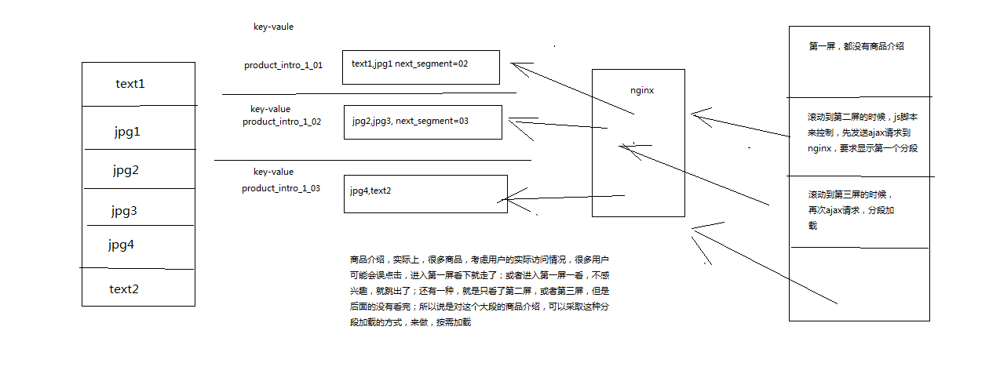
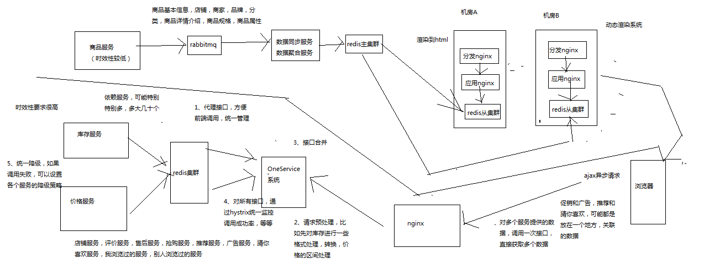

# 1 架构与设计

## 1.1 架构整体设计

纯实战,一个较为完整的亿级流量大型电商网站的商品详情页系统

商品详情页介绍

商品详情页的多模板化
	多套模板：聚划算、天猫超市、淘抢购、电器城
	不同模板的元数据一样，只是展示方式不一样
	不同的业务，商品详情页的个性化需求很多，数据来源也很多

商品详情页结构
	时效性比较低的数据
		一个商品详情包含了不同的维度
		商品维度：标题，图片，属性，等等
		主商品维度：商品介绍，规格参数，等等
		分类维度
		商家维度
		时效性比较低的数据
			其实后面会讲解，都是在一个商品详情页被访问到的时候，将数据动态直接渲染/填充到一个html模板中去的
			在浏览器展现的时候，数据写死在html里面，直接就出来了
			因为比如说，一个商品的数据变更了，可能是异步的去更新数据的，也许需要5分钟，或者10分钟的时间，才能将变更的数据反映的商品详情页中去
	实时性较高的数据
		实时价格、实时促销、广告词、配送至、预售、库存
		ajax异步加载
		在访问商品详情页的时候，价格、库存、促销活动、广告词，都没有直接写死到html中，直接是在html里放了一个js脚本
		然后在html在浏览器显示出来的时候，js脚本运行，直接发送ajax请求到后端
		后端接口，直接查询价格、库存、促销活动、广告词，最新的数据
		只要你变更了数据，那么在下一次商品详情页展示的时候，一定可以将最新的数据展示出来

在淘宝网上展示一个通用商品模板，商品详情页结构拆解说明，分析一个商品详情页的多维度构成
	
亿级流量电商网站的商品详情页访问情况
	访问量：比如双11活动，商品详情页的pv至少达到几亿次，但是经过良好设计的详情页系统，响应时间小于几十ms
	访问特点：离散访问多，热点数据少
	一般来说，访问的比较均匀，很少说集中式访问某个商品详情页，除非是那种秒杀活动，那是集中式访问某个商品详情页

## 1.2 商品详情页整体架构组成

动态渲染系统
	将页面中静的数据，直接在变更的时候推送到缓存，然后每次请求页面动态渲染新数据
	商品详情页系统（负责静的部分）：被动接收数据，存储redis，nginx+lua动态渲染
	商品详情页动态服务系统（对外提供数据接口）
		提供各种数据接口
		动态调用依赖服务的接口，产生数据并且返回响应
		从商品详情页系统处理出来的redis中，获取数据，并返回响应
		
OneService系统
	动的部分，都是走ajax异步请求的，不是走动态渲染的
	商品详情页统一服务系统（负责动的部分）
	
前端页面
	静的部分，直接被动态渲染系统渲染进去了
	动的部分，html一到浏览器，直接走js脚本，ajax异步加载
	商品详情页，分段存储，ajax异步分屏加载
	
工程运维
	限流，压测，灰度发布


## 1.3  动态渲染系统

我们先做动态渲染那套系统

（1）依赖服务 -> MQ -> 动态渲染服务 -> 多级缓存
（2）负载均衡 -> 分发层nginx -> 应用层nginx -> 多级缓存
（3）多级缓存 -> 数据直连服务
	数据闭环
	数据闭环架构
		依赖服务：商品基本信息，规格参数，商家/店铺，热力图，商品介绍，商品维度，品牌，分类，其他
		发送数据变更消息到MQ
		数据异构Worker集群，监听MQ，将原子数据存储到redis，发送消息到MQ
		数据聚合Worker集群，监听MQ，将原子数据按维度聚合后存储到redis，三个维度（商品基本信息、商品介绍、其他信息）
	数据闭环，就是数据的自我管理，所有数据原样同步后，根据自己的逻辑进行后续的数据加工，走系统流程，以及展示k
	数据形成闭环之后，依赖服务的抖动或者维护，不会影响到整个商品详情页系统的运行
	数据闭环的流程：数据异构（多种异构数据源拉取），数据原子化，数据聚合（按照维度将原子数据进行聚合），数据存储（Redis）

数据维度化
	商品基本信息：标题、扩展属性、特殊属性、图片、颜色尺码、规格参数
	商品介绍
	非商品维度其他信息：分类，商家，店铺，品牌
	商品维度其他信息：采用ajax异步加载，价格，促销，配送至，广告，推荐，最佳组合，等等

采取ssdb，这种基于磁盘的大容量/高性能的kv存储，保存商品维度、主商品维度、商品维度其他信息，数据量大，不能光靠内存去支撑
采取redis，纯内存的kv存储，保存少量的数据，比如非商品维度的其他数据，商家数据，分类数据，品牌数据

一个完整的数据，拆分成多个维度，每个维度独立存储，就避免了一个维度的数据变更就要全量更新所有数据的问题
不同维度的数据，因为数据量的不一样，可以采取不同的存储策略

系统拆分
	系统拆分更加细：依赖服务、MQ、数据异构Worker、数据同步Worker、Redis、Nginx+Lua
	每个部分的工作专注，影响少，适合团队多人协作
	异构Worker的原子数据，基于原子数据提供的服务更加灵活
	聚合Worker将数据聚合后，减少redis读取次数，提升性能
	前端展示分离为商品详情页前端展示系统和商品介绍前端展示系统，不同特点，分离部署，不同逻辑，互相不影响
	
异步化
	异步化，提升并发能力，流量削峰
	消息异步化，让各个系统解耦合，如果使用依赖服务调用商品详情页系统接口同步推送，那么就是耦合的
	缓存数据更新异步化，数据异构Worker同步调用依赖服务接口，但是异步更新redis
	
动态化
	数据获取动态化：nginx+lua获取商品详情页数据的时候，按照维度获取，比如商品基本数据、其他数据（分类、商家）
	模板渲染实时化：支持模板页面随时变化，因为采用的是每次从nginx+redis+ehcache缓存获取数据，渲染到模板的方式，因此模板变更不用重新静态化HTML
	重启应用秒级化：nginx+lua架构，重启在秒级
	需求上线快速化：使用nginx+lua架构开发商品详情页的业务逻辑，非常快速
		
多机房多活
	Worker无状态，同时部署在各自的机房时采取不同机房的配置，来读取各自机房内部部署的数据集群（redis、mysql等）
		将数据异构Worker和数据聚合Worker设计为无状态化，可以任意水平扩展
		Worker无状态化，但是配置文件有状态，不同的机房有一套自己的配置文件，只读取自己机房的redis、ssdb、mysql等数据
	每个机房配置全链路：接入nginx、商品详情页nginx+商品基本信息redis集群+其他信息redis集群、商品介绍nginx+商品介绍redis集群
	部署统一的CDN以及LVS+KeepAlived负载均衡设备


## 1.4 大型网站的多机房4级缓存架构设计

多级缓存架构
	**本地缓存**
		使用nginx shared dict作为local cache，http-lua-module的shared dict可以作为缓存，而且reload nginx不会丢失
		也可以使用nginx proxy cache做local cache
		**双层nginx部署，一层接入，一层应用，接入层用hash路由策略提升缓存命中率**
			比如库存缓存数据的TP99为5s，本地缓存命中率25%，redis命中率28%，回源命中率47%
			一次普通秒杀活动的命中率，本地缓存55%，分布式redis命中率15%，回源命中率27%
			最高可以提升命中率达到10%
		全缓存链路维度化存储，如果有3个维度的数据，只有其中1个过期了，那么只要获取那1个过期的数据即可
		nginx local cache的过期时间一般设置为30min，到后端的流量会减少至少3倍
	**4级多级缓存**
		**nginx本地缓存，抗热点数据**，小内存缓存访问最频繁的数据
		各个机房本地的**redis从集群的数据，抗大量离线数据**，采用一致性hash策略构建分布式redis缓存集群
		tomcat中的动态服务的**本地jvm堆缓存**
			支持在一个请求中多次读取一个数据，或者与该数据相关的数据
			作为redis崩溃的备用防线
			固定缓存一些较少访问频繁的数据，比如分类，品牌等数据
			堆缓存过期时间为redis过期时间的一半
		**主redis集群**
			命中率非常低，小于5%
			防止主从同步延迟导致的数据读取miss
			防止各个机房的从redis集群崩溃之后，全量走依赖服务会导致雪崩，**主redis集群是后备防线**
	**主redis集群，采取多机房一主三从的高可用部署架构**
		redis集群部署采取双机房一主三活的架构，机房A部署主集群+一个从集群，机房B部署一个从集群（从机房A主集群）+一个从集群（从机房B从集群）
		双机房一主三活的架构，保证了机房A彻底故障的时候，机房B还有一套备用的集群，可以升级为一主一从
		如果采取机房A部署一主一从，机房B一从，那么机房A故障时，机房B的一从承载所有读写压力，压力过大，很难承受


**PS:说白了就是双redis缓存+nginx+本地jvm的四级缓存**

## 1.5 复杂的消息队列架构设计

队列化
	**任务等待队列**
	**任务排重队列**（异构Worker对一个时间段内的变更消息做排重）
	**失败任务队列**（失败重试机制）
	**优先级队列**，刷数据队列（依赖服务洗数据）、高优先级队列（活动商品优先级高）


## 1.6 使用多线程并发提升系统吞吐量的设计

并发化
	数据同步服务做并发化+合并，将多个变更消息合并在一起，调用依赖服务一次接口获取多个数据，采用多线程并发调用
	数据聚合服务做并发化，每次重新聚合数据的时候，对多个原子数据用多线程并发从redis查询


## 1.7 redis批量查询性能优化设计


## 1.8 全链路高可用架构设计

高可用设计
	读链路多级降级：本机房从集群 -> 主集群 -> 直连

全链路隔离
	基于hystrix的依赖调用隔离，限流，熔断，降级
	普通服务的多机房容灾冗余部署以及隔离


## 1.9 微服务架构设计

1、领域驱动设计：我们需要对这个系统涉及到的领域模型机进行分析，然后进行领域建模，最后的话，设计出我们对应的微服务的模型
2、spring cloud：微服务的基础技术架构，我们用spring cloud来做
3、持续交付流水线，jenkins+git+自动化持续集成+自动化测试+自动化部署
4、docker：大量的微服务的部署与管理

一大块，真实的完整的亿级流量高并发高可用的电商详情页系统的架构实战

另一块，里面的服务，都会用微服务架构来做，相当于是在真实业务场景下的微服务项目实战

## 1.10 机房与机器的规划

虚拟机，要弄几台，大概怎么来部署

负载均衡：2台机器，lvs+keepalived，双机高可用

两个机房，每个机房给1台机器，总共就是2台机器，分发层nginx+应用层nginx+缓存从集群

缓存主集群：模拟跟上面的两个机房部署在一起，在实际生产环境中，的确可能是在相同的机房，但是肯定在不同的机器上

我们这里不会有真正的机房，但是会模拟出来，有些机器会在某个机房里

缓存集群分片中间件，跟缓存集群部署在一起

rabbitmq和mysql：1台机器

# 2 搭建环境

## 2.1 部署CentOS虚拟机集群

**2台3G内存的虚拟机**

1、在虚拟机中安装CentOS

过程见虚拟机安装

**yum配置**

​	yum clean all
​	yum makecache
​	yum install wget

------------------------------------------------------------------------------------------

2、在每个CentOS中都安装Java和Perl

（1）安装JDK

（2）安装Perl

yum install -y gcc

wget http://www.cpan.org/src/5.0/perl-5.16.1.tar.gz
tar -xzf perl-5.16.1.tar.gz
cd perl-5.16.1
./Configure -des -Dprefix=/usr/local/perl
make && make test && make install
perl -v

------------------------------------------------------------------------------------------

3、在另外一个虚拟机中安装CentOS集群

（1）按照上述步骤，再安装1台一模一样环境的linux机器
（2）另外三台机器的hostname分别设置为eshop-detail02
（3）安装好之后，在每台机器的hosts文件里面，配置好所有的机器的ip地址到hostname的映射关系

------------------------------------------------------------------------------------------

4、配置2台CentOS为ssh免密码互相通信

（1）首先在三台机器上配置对本机的ssh免密码登录
ssh-keygen -t rsa
生成本机的公钥，过程中不断敲回车即可，ssh-keygen命令默认会将公钥放在/root/.ssh目录下
cd /root/.ssh
cp id_rsa.pub authorized_keys
将公钥复制为authorized_keys文件，此时使用ssh连接本机就不需要输入密码了

（2）接着配置三台机器互相之间的ssh免密码登录
使用ssh-copy-id -i hostname命令将本机的公钥拷贝到指定机器的authorized_keys文件中

## 2.2 双机房部署接入层与应用层Nginx+Lua

openresty安装：略

部署了两台虚拟机

模拟的场景是什么，假设这两台虚拟机分别在不同的机房中，每个机房里都有一台机器，所以按照我们之前讲解的那套双机房的四级缓存架构

部署nginx，虚拟机，每台机器上，部署两个nginx，一个是分发层nginx，一个是应用层nginx

在实际生产环境中

1、部署第一个nginx

（1）部署openresty

（2）nginx+lua开发的hello world

（3）工程化的nginx+lua项目结构

部署结构图说明：


## 2.3 为什么是twemproxy+redis而不是redis cluster

1、LVS那块不讲解

LVS+KeepAlived，负载均衡那块，讲一讲，还是不讲了，意义不是太大

MySQL+Atlas，分库分表，鸡肋

单课，聚焦，围绕一个主题去讲解，太发散了以后，什么都讲，没有围绕主题去讲解，意义不是太大

商品详情页系统，亿级流量大电商，核心的东西

随着课程不断讲解，可能会有10%的出入，砍掉或者调整一些细枝末节，大的思路是ok的，不会改变的

对课程，更加深入的思考

每一讲的标题会不断的变更

**2、redis cluster的问题**

**twemproxy+redis去做集群，redis部署多个主实例，每个主实例可以挂载一些redis从实例，如果将不同的数据分片，写入不同的redis主实例中，twemproxy这么一个缓存集群的中间件**

**redis cluster**

**（1）不好做读写分离，读写请求全部落到主实例上的，如果要扩展写QPS，或者是扩展读QPS，都是需要扩展主实例的数量，从实例就是一个用做热备+高可用**
**（2）不好跟nginx+lua直接整合，lua->redis的client api，但是不太支持redis cluster，中间就要走一个中转的java服务**
**（3）不好做树状集群结构，比如redis主集群一主三从双机房架构，redis cluster不太好做成那种树状结构**
**（4）方便，相当于是上下线节点，集群扩容，运维工作，高可用自动切换，比较方便**

3、twemproxy+redis

（1）上线下线节点，有一些手工维护集群的成本
（2）支持redis集群+读写分离，就是最基本的多个redis主实例，twemproxy这个中间件来决定的，java/nginx+lua客户端，是连接twemproxy中间件的。每个redis主实例就挂载了多个redis从实例，高可用->哨兵，redis cluster读写都要落到主实例的限制，你自己可以决定写主，读从，等等
（3）支持redis cli协议，可以直接跟nginx+lua整合
（4）可以搭建树状集群结构

4、如何选择？

（1）看你是否一定需要那3点了，如果不需要，那么用redis cluster也ok，大多数情况下，很多应用用redis就是比较简单的，做一个缓存
（2）如果你的架构里很需要那3点，那么用twemproxy比较好，商品详情页系统的整套架构

## 2.4 redis复习以及twemproxy基础知识

1、部署redis(略)

2、twemproxy部署(略，见资料)

3、redis配置

在两台机器部署6个节点，不同端口号即可

5、twemproxy讲解

```
eshop-detail-test:  
  listen: 127.0.0.1:1111  
  hash: fnv1a_64  
  distribution: ketama  
  timeout:1000  
  redis: true  
  servers:  
```

   - 127.0.0.1:6379:1 test-redis-01 
   - 127.0.0.1:6380:1 test-redis-02

eshop-detail-test: redis集群的逻辑名称
listen：twemproxy监听的端口号
**hash：hash散列算法**
**distribution：分片算法，一致性hash，取模**，等等
timeout：跟redis连接的超时时长
redis：是否是redis，false的话是memcached
servers：redis实例列表，一定要加别名，否则默认使用ip:port:weight来计算分片，如果宕机后更换机器，那么分片就不一样了，因此加了别名后，可以确保分片一定是准确的

**你的客户端，java/nginx+lua，连接twemproxy，写数据的时候，twemproxy负责将数据分片，写入不同的redis实例**

如果某个redis机器宕机，需要自动从一致性hash环上摘掉，等恢复后自动上线

auto_eject_hosts: true，自动摘除故障节点
server_retry_timeout: 30000，每隔30秒判断故障节点是否正常，如果正常则放回一致性hash环
server_failure_limit: 2，多少次无响应，就从一致性hash环中摘除

一致性hash

## 2.5 部署双机房一主三从架构的redis主集群

在第一台虚拟机上，部署两个redis主实例+两个redis从实例，模拟一个机房的情况
在第二台虚拟机上，部署两个redis从实例，挂载到第一台虚拟机的redis从实例上; 再部署两个redis从实例，挂载到第二台虚拟机的从实例上


## 2.6 给每个机房部署一个redis从集群


## 2.7 为redis主集群部署twemproxy中间件

**PS:仅供参考，未实操**

```shell

yum install -y autoconf automake libtool

#直接将autoconf和automake、libtool都删除掉了
yum remove -y autoconf 

wget ftp://ftp.gnu.org/gnu/autoconf/autoconf-2.69.tar.gz
tar -zxvf autoconf-2.69.tar.gz
cd autoconf-2.69 
./configure --prefix=/usr
make && make install

wget http://ftp.gnu.org/gnu/automake/automake-1.14.tar.gz
tar -zxvf automake-1.14.tar.gz 
cd automake-1.14
./bootstrap.sh
./configure --prefix=/usr
make && make install

wget http://ftpmirror.gnu.org/libtool/libtool-2.4.2.tar.gz
tar -zxvf libtool-2.4.2.tar.gz
cd libtool-2.4.2
./configure --prefix=/usr
make && make install

tar -zxvf twemproxy-0.4.0.tar.gz

cd twemproxy-0.4.0

autoreconf -fvi
./configure && make

vi conf/nutcracker.yml  

server1:  
  listen: 127.0.0.1:1111  
  hash: fnv1a_64  
  distribution: ketama  
  redis: true  
  servers:  
   - 127.0.0.1:6379:1 

src/nutcracker -d -c ../conf/nutcracker.yml 

ps -aux | grep nutcracker

src/redis-cli -p 1111  

get k1
set k1 v2
get k1

```


## 2.8 为每个机房的redis从集群部署twemproxy中间件

**PS:仅供参考，未实操**

```shell

yum install -y autoconf automake libtool
#直接将autoconf和automake、libtool都删除掉了
yum remove -y autoconf 

wget ftp://ftp.gnu.org/gnu/autoconf/autoconf-2.69.tar.gz
tar -zxvf autoconf-2.69.tar.gz
cd autoconf-2.69 
./configure --prefix=/usr
make && make install

wget http://ftp.gnu.org/gnu/automake/automake-1.14.tar.gz
tar -zxvf automake-1.14.tar.gz 
cd automake-1.14
./bootstrap.sh
./configure --prefix=/usr
make && make install

wget http://ftpmirror.gnu.org/libtool/libtool-2.4.2.tar.gz
tar -zxvf libtool-2.4.2.tar.gz
cd libtool-2.4.2
./configure --prefix=/usr
make && make install

tar -zxvf twemproxy-0.4.0.tar.gz

cd twemproxy-0.4.0

autoreconf -fvi
./configure && make

vi conf/nutcracker.yml  

server1:  
  listen: 127.0.0.1:1111  
  hash: fnv1a_64  
  distribution: ketama  
  redis: true  
  servers:  
   - 127.0.0.1:6379:1 

src/nutcracker -d -c ../conf/nutcracker.yml 

ps -aux | grep nutcracker

src/redis-cli -p 1111  

get k1
set k1 v2
get k1

```


## 2.9 部署RabbitMQ消息中间件

**PS:之后如果要实操的话，这里肯定是用RocketMq的**

1、安装编译工具

yum install -y ncurses ncurses-base ncurses-devel ncurses-libs ncurses-static ncurses-term ocaml-curses ocaml-curses-devel
yum install -y openssl-devel zlib-devel
yum install -y make ncurses-devel gcc gcc-c++ unixODBC unixODBC-devel openssl openssl-devel

2、安装erlang(略)

3、安装rabbitmq(略)

## 2.10 部署MySQL数据库

**PS:MySql部署可以参考其他笔记**

用最简单的方式装一个mysql数据库，然后后面的话，就有数据库可以用来开发了

yum install -y mysql-server

chkconfig mysqld on

service mysqld start 

mysql -u root

set password for root@localhost=password('root');

mysql -uroot -proot

## 2.11 windows部署rabbitmq作为开发测试环境

之前在虚拟机linux上安装了rabbitmq，作为生产环境

在本地windows上，我们需要去搭建一套本地的开发和测试环境，数据库已经安装了，rabbitmq

从下一讲开始，我们其实就可以去将数据写入rabbitmq，然后开发同步服务，聚合服务，等等从rabbitmq里面消费数据，写入redis

**具体步骤见 163 讲**

## 2.12 windows部署redis作为开发测试环境

我们之前讲解过了，咱们因为是在我的旧电脑上玩儿，12g内存，每次都开几台虚拟机，然后启动eclipse，启动一大堆spring cloud服务，内存吃不消

所以开发、测试环境与生产部署环境隔离，虚拟机上部署的一套作为生产环境

windows上，我们启动eclipse+一大堆服务，同时将rabbitmq，mysql，redis，等，全部在windows上部署，作为咱们的测试环境

这一讲，在windows上部署一个最基本的单实例的redis，可以用就行了，可以写kv存储就可以了

上生产环境，也是直接连接twemproxy，连接twemproxy中间件+redis集群，跟本地连接单个的redis实例，是一个意思

原生的redis是不支持windows的，但是微软搞了一个可以在windows上部署的redis版本，供我们学习、开发以及测试来使用的

**具体步骤见 164 讲**

# 3 基于spring cloud的基础框架

**PS:这里spring cloud netflix相关大部分基础知识都略过，具体知识可以去看spring cloud相关笔记**

## 3.1 商品服务需求

商品服务，管理商品的数据

分类管理：增删改查
品牌管理：增删改查
商品基本信息管理：增删改查
商品规格管理：增删改查
商品属性管理：增删改查
商品介绍管理：编辑

这块很定是要基于数据库去做得，然后重点就是演示，这种服务如何跟商品详情页系统的架构串接起来

## 3.2 工程师的why-how-what思考方法

复杂电商里面，商品的价格，比较复杂的事情

（1）调整自己商品的价格，但是这个时候你可能需要引入很多的策略，比如说做各种限制，价格是不是可以为负数，在活动来临之际，突然提价再打折，你是不是要通过专门的价格服务去检测和限制，网络加盟商，你跟品牌之间有没有一些价格上的限制

（2）每个商品可能是可以有多个价格的，什么属性，土豪金，可能就会比较贵，范围内，你可能可以打包多个东西放一起，那么就是一个价格，可能你购买的是去年款的，那么会便宜一些，电商上，价格是个区间（256元~356元）

（3）但是在我们的课程里，我不打算做这些业务

**大公司里面，会给工程师培训一些软素质，比如如何正确的思考**

​	**（1）错误的思考过程：what -> how -> why，你做了很多事情，你也一直在考虑如何做到这个事情，结果你做到之后，有一天，你突然问问自己，我为什么要做这个事情？好像没有必要啊。。。**

​	**（2）正确的思考过程：why -> how -> what，考虑一个事情，为什么要做？如何去做？具体做什么？**

价格服务，很多复杂的业务

对课程来说，有什么帮助？

业务，对我们，商品详情页系统，我告诉你，对这个系统来说，是么有太大的意义，因为其实无论的价格怎么变，最终就是变化之后，反馈到商品详情页面里去，让用户可以尽快看到最新的价格，至于价格是怎么变化的，我们不关心

how，修改商品价格

给一个简单的接口，可以修改商品的价格，落地到数据库中，价格跟后面的商品详情页系统架构，串接起来，时效性比较高的服务，去讲解

商品详情页上，部分时效性要求很高的数据，比如价格，库存，是通过ajax异步加载的

what，价格服务，提供一个接口，可以修改某个商品的价格，落地到数据库中，可以跟商品详情页系统架构，串接起来

## 3.3 库存服务的场景介绍

**why-how-what思考法，库存服务**

商品服务，之所以要做一些增删改查的操作，是因为那些东西跟商品详情页系统的影响较大，做那样的一些操作

**库存服务 = 价格服务，不需要做复杂的业务，库存变化了，反应到数据库中，跟商品详情页系统架构串接起来，就ok了**

**库存的介绍，业务：**

（1）事务性关联很大，商品的购买，就要修改库存

（2）保证库存的递减一定是事务的，不能失败，不能出错，最怕的就是系统里面库存不准确，比如一个商家都没有库存了，但是还是出了bug，导致超售，用户道歉，退款

（3）电商，退货，退款，库存增加

（4）进销存，物流等系统打通，进货，退货，增减库存

主要关注库存的增加和减少，最终的结果就ok了，我们只要关注库存显示到商品详情页上去就ok了

**how&what，服务，接口，修改商品的商品库存，反应数据库中，跟商品详情页系统架构打通**

## 3.4 微服务与Spring Cloud基本介绍

**传统架构的问题**

**（1）单块应用，耦合严重**
**（2）开发速度慢，新需求**
**（3）不易于扩展和重构**
**（4）不易于技术升级**

-------------------------------------------------------

**微服务架构的几大特征：**

**（1）足够单一的职责与功能**
**（2）非常的微型**
**（3）面向服务的思想**
**（4）独立开发：团队，技术选型，前后端分离，存储分离，独立部署**
**（5）自动化开发流程：编码，自动化测试，持续集成，自动化部署**


-------------------------------------------------------

微服务的强大作用：

（1）迭代速度：你只要管好自己的服务就行了，跟别人没关系，随便你这么玩儿，修改代码，测试，部署，都是你自己的事情，不用考虑其他人，没有任何耦合
（2）复用性：拆分成一个一个服务之后，就不需要写任何重复的代码了，有一个功能别人做好了，暴露了接口出来，直接调用不就ok了么
（3）扩展性：独立，扩展，升级版本，重构，更换技术
（4）完全克服了传统单块应用的缺点

-------------------------------------------------------

微服务的缺点

（1）服务太多，难以管理
（2）微服务 = 分布式系统，你本来是一个系统，现在拆分成多块，部署在不同的服务器上，一个请求要经过不同的服务器上不同的代码逻辑处理，才能完成，这不就是分布式系统
（3）分布式一致性，分布式事务，故障+容错

-------------------------------------------------------

**微服务的技术栈**

**（1）领域驱动设计：微服务建模**

你的任何业务系统都有自己独特的复杂的业务，但是这个时候就是有一个问题，怎么拆分服务？拆成哪些服务？拆成多大？每个服务负责哪些功能？

微服务的建模，模型怎么设计

领域驱动的设计思想，可以去分析系统，完成建模的设计

这里不讲解了，一定是要拿超级复杂的业务来讲解，你才能听懂，业务采取的还是比较简单的，领域驱动

至少如果你真的很了解你的业务的话，你大概也知道应该如何去拆分这个服务

**（2）Spring Cloud：基础技术架构**

各个服务之间怎么知道对方在哪里 -> 服务的注册和发现

服务之间的调用怎么处理，rpc，负载均衡

服务故障的容错

服务调用链条的追踪怎么做

多个服务依赖的统一的配置如何管理

**（3）DevOps：自动化+持续集成+持续交付+自动化流水线，将迭代速度提升到极致**

如果要将微服务的开发效率提升到最高，DevOps，全流程标准化，自动化，大幅度提升你的开发效率

**（4）Docker：容器管理大量服务**

微服务，一个大型的系统，可以涉及到几十个，甚至是上百个服务，比较坑，怎么部署，机器怎么管理，怎么运维

-------------------------------------------------------

整个微服务技术架构，全部涉及到，全部结合我们的实际的项目，完成整套微服务架构的项目实战

## 3.5 Spring Boot与微服务的关系以及开发回顾

1、Spring Boot的特点

（1）快速开发spring应用的框架

spring mvc+spring+mybatis，首先配置一大堆xml配置文件，其次部署和安装tomcat，jetty等容器，跟java web打交道

跟servlet，listener，filter，打交道

手工部署到tomcat或者jetty等容器中，发布一个web应用

spring boot，简单来说，就是看中了这种java web应用繁琐而且重复的开发流程，采用了spring之上封装的一套框架，spring boot，简化整个这个流程

尽可能提升我们的开发效率，让我们专注于自己的业务逻辑即可

（2）内嵌tomcat和jetty容器，不需要单独安装容器，jar包直接发布一个web应用
（3）简化maven配置，parent这种方式，一站式引入需要的各种依赖
（4）基于注解的零配置思想
（5）和各种流行框架，spring web mvc，mybatis，spring cloud无缝整合

**2、Spring Boot和微服务**

**（1）spring boot不是微服务技术**
**（2）spring boot只是一个用于加速开发spring应用的基础框架，简化工作，开发单块应用很适合**
**（3）如果要直接基于spring boot做微服务，相当于需要自己开发很多微服务的基础设施，比如基于zookeeper来实现服务注册和发现**
**（4）spring cloud才是微服务技术**

3、Spring Boot的入门开发

参照之前的库存服务的spring boot，整合搭建一个spring boot

## 3.6 Spring Cloud之Eureka注册中心

**1、什么是注册中心**

**（1）就是首先有一个eureka server，服务的注册与发现的中心**
**（2）你如果写好了一个服务，就可以将其注册到eureka server上去**
**（3）然后别人的服务如果要调用你的服务，就可以从eureka server上查找你的服务所在的地址，然后调用**

**2、Eureka基本原理**

**（1）服务都会注册到eureka的注册表**
**（2）eureka有心跳机制，自动检测服务，故障时自动从注册表中摘除**
**（3）每个服务也会缓存euraka的注册表，即使eureka server挂掉，每个服务也可以基于本地注册表缓存，与其他服务进行通信**
**（4）只不过是如果eureka server挂掉了，那么无法发布新的服务了**

实验步骤

（1）启动和发布一个eureka server，注册中心，web界面可以看到所有注册的服务
（2）写一个hello world服务，注册到eureka server上去


## 3.7 Spring Cloud之Ribbon+Rest调用负载均衡

**如何开发另外一个服务，来通过eureka server发现其他服务，并且调用其他服务，通过ribbon+rest，RestTemplate调用rest服务接口，ribbon多个服务实例的负载均衡**

1、将say-hello-service的port修改为8673，再启动一个实例

在生产环境中，肯定是一个服务会发布在多台机器上，每个机器上发布的服务，就是一个服务实例，多个服务实例实际上就组成了一个集群

2、创建一个新的工程，叫做greeting-service

## 3.8 Spring Cloud之Fegion声明式服务调用

ribbon+rest是比较底层的调用方式，其实一般不常用

**fegion，声明式的服务调用，类似于rpc风格的服务调用，默认集成了ribbon做负载均衡，集成eureka做服务发现**

用fegion来重构greeting-service

## 3.9 Spring Cloud之Hystrix熔断降级

微服务架构，很重要的就是多个服务之间互相调用，很可能某个服务就死了，然后依赖它的其他服务调用大量超时，最后耗尽资源，继续死，最终导致整个系统崩盘

hystrix去做资源隔离，限流，熔断，降级

## 3.10 Spring Cloud之Zuul网关路由

常规的spring cloud的微服务架构下

前端请求先通过nginx走到zuul网关服务，zuul负责路由转发、请求过滤等网关接入层的功能，默认和ribbon整合实现了负载均衡

比如说你有20个服务，暴露出去，你的调用方，如果要跟20个服务打交道，是不是很麻烦

所以比较好的一个方式，就是开发一个通用的zuul路由转发的服务，根据请求api模式，动态将请求路由转发到对应的服务

你的前端，主要考虑跟一个服务打交道就可以了

## 3.11 Spring Cloud之Config统一配置中心

多个服务共享相同的配置，举个例子，数据库连接，redis连接，还有别的一些东西，包括一些降级开关，等等

用config统一配置中心

1、创建工程config-server

2、pom.xml

```xml
<parent>
	<groupId>org.springframework.boot</groupId>
	<artifactId>spring-boot-starter-parent</artifactId>
	<version>1.5.2.RELEASE</version>
	<relativePath/> <!-- lookup parent from repository -->
</parent>

<properties>
	<project.build.sourceEncoding>UTF-8</project.build.sourceEncoding>
	<project.reporting.outputEncoding>UTF-8</project.reporting.outputEncoding>
	<java.version>1.8</java.version>
</properties>

<dependencies>
	<dependency>
		<groupId>org.springframework.cloud</groupId>
		<artifactId>spring-cloud-config-server</artifactId>
	</dependency>

	<dependency>
		<groupId>org.springframework.boot</groupId>
		<artifactId>spring-boot-starter-test</artifactId>
		<scope>test</scope>
	</dependency>
	
	<dependency>
		<groupId>org.springframework.cloud</groupId>
		<artifactId>spring-cloud-starter-eureka</artifactId>
	</dependency>

</dependencies>

<dependencyManagement>
	<dependencies>
		<dependency>
			<groupId>org.springframework.cloud</groupId>
			<artifactId>spring-cloud-dependencies</artifactId>
			<version>Camden.SR6</version>
			<type>pom</type>
			<scope>import</scope>
		</dependency>
	</dependencies>
</dependencyManagement>

<build>
	<plugins>
		<plugin>
			<groupId>org.springframework.boot</groupId>
			<artifactId>spring-boot-maven-plugin</artifactId>
		</plugin>
	</plugins>
</build>

<repositories>
	<repository>
		<id>spring-milestones</id>
		<name>Spring Milestones</name>
		<url>https://repo.spring.io/milestone</url>
		<snapshots>
			<enabled>false</enabled>
		</snapshots>
	</repository>
</repositories>
```

2、Application

```java
@SpringBootApplication
@EnableConfigServer
public class ConfigServerApplication {

    public static void main(String[] args) {
        SpringApplication.run(ConfigServerApplication.class, args);
    }

}
```

3、公开的git仓库

spring cloud config，配置文件，用的是properties的格式，基于git去做

账号：roncoo-eshop
密码：roncoo123456
仓库地址：https://github.com/roncoo-eshop/roncoo-eshop-config

git怎么用，我不讲解了，自己百度或者找资料

3、application.properties

```properties
spring.application.name=config-server
server.port=8767

spring.cloud.config.server.git.uri=https://github.com/roncoo-eshop/roncoo-eshop-config
spring.cloud.config.server.git.searchPaths=config-file
spring.cloud.config.label=master
spring.cloud.config.server.git.username=roncoo-eshop
spring.cloud.config.server.git.password=roncoo123456
```

4、访问http://localhost:8767/name/dev

5、重构greeting-service

配置一个默认的name，如果前端没有传递name参数，直接取用默认的name

（1）pom.xml

```xml
<dependency>
	<groupId>org.springframework.cloud</groupId>
	<artifactId>spring-cloud-starter-config</artifactId>
</dependency>
```

（2）application.yml -> bootstrap.properties

```properties
spring.application.name=config-client
spring.cloud.config.label=master
spring.cloud.config.profile=dev
spring.cloud.config.uri= http://localhost:8767/
server.port=8764
eureka.client.serviceUrl.defaultZone=http://localhost:8761/eureka/
feign.hystrix.enabled=true
```

（3）controller

@Value("${defaultName}")
private String defaultName;

没有传递name的时候，默认用spring cloud config中配置的name

## 3.12 Spring Cloud之Sleuth调用链路追踪

在一个微服务系统中，一个请求过来，可能会经过一个很复杂的调用链路，经过多个服务的依次处理，才能完成

在这个调用链路过程中，可能任何一个环节都会出问题，所以如果要进行一些问题的定位，那么就要对每个调用链路进行追踪

sleuth

1、搭建sleuth server

（1）创建工程：sleuth-server

（2）pom.xml

```xml
<dependencies>
	<dependency>
		<groupId>org.springframework.boot</groupId>
		<artifactId>spring-boot-starter</artifactId>
	</dependency>

	<dependency>
		<groupId>org.springframework.boot</groupId>
		<artifactId>spring-boot-starter-web</artifactId>
	</dependency>
	<dependency>
		<groupId>org.springframework.boot</groupId>
		<artifactId>spring-boot-starter-test</artifactId>
		<scope>test</scope>
	</dependency>
	
	<dependency>
		<groupId>io.zipkin.java</groupId>
		<artifactId>zipkin-server</artifactId>
	</dependency>
	
	<dependency>
		<groupId>io.zipkin.java</groupId>
		<artifactId>zipkin-autoconfigure-ui</artifactId>
	</dependency>

</dependencies>

<dependencyManagement>
	<dependencies>
		<dependency>
			<groupId>org.springframework.cloud</groupId>
			<artifactId>spring-cloud-dependencies</artifactId>
			<version>Camden.SR6</version>
			<type>pom</type>
			<scope>import</scope>
		</dependency>
	</dependencies>
</dependencyManagement>
```

（3）Application

```java
@SpringBootApplication
@EnableZipkinServer
public class SleuthServer {

    public static void main(String[] args) {
        SpringApplication.run(SleuthServer.class, args);
    }

}
```

（4）application.yml

server.port=9411

2、在say-hello-service和greeting-service中加入sleuth支持

（1）pom.xml

```xml
<dependency>
	<groupId>org.springframework.cloud</groupId>
	<artifactId>spring-cloud-starter-zipkin</artifactId>
</dependency>
```

（2）application.yml

```properties
spring.zipkin.base-url=http://localhost:9411
```

3、调用接口，查看http://localhost:9411

## 3.13 Spring Cloud之Eureka Server安全认证

1、pom.xml

```xml
<dependency>  
    <groupId>org.springframework.boot</groupId>  
    <artifactId>spring-boot-starter-security</artifactId>  
</dependency>  
```

2、application.yml

```yaml
security:  
  basic:  
    enabled: true  
  user:  
    name: admin  
    password: 123456
```

3、访问http://localhost:8761/，需要输入用户名和密码	

基于spring cloud提供的一整套技术：服务注册与发现，声明式的服务调用，熔断降级，网关路由，统一配置，链路追踪

来开发我们的商品详情页系统


## 3.14 完成Spring Boot+Spring Cloud+MyBatis整合

spring boot+spring cloud，本身自带了spring web mvc的支持，mybatis整合起来，可以操作数据库


# 4 商品详情页动态渲染系统开发实战

## 4.1 基于Spring Cloud开发商品服务

1、基于spring cloud搭建一个商品服务，跑通基本架构

spring boot + spring cloud + spring mvc + spring + mybatis

2、在里面进行业务代码开发

商品详情页系统

分类管理：增删改查
品牌管理：增删改查
商品基本信息管理：增删改查
商品规格管理：增删改查
商品属性管理：增删改查
商品介绍管理：编辑

**代码见：eshop-product-service项目**

## 4.2 基于Spring Cloud开发价格服务

单开服务，修改商品价格

**代码见：eshop-price-service项目**

## 4.3 基于Spring Cloud开发库存服务

单开服务，修改商品库存

**代码见：eshop-inventory-service项目**

## 4.4 依赖服务将数据变更消息写入rabbitmq或双写redis

1、基于spring boot整合rabbitmq的发送与消费

2、spring boot整合redis

3、商品服务数据变更，将消息写入rabbitmq

时效性比较低的数据，走rabbitmq，然后后面就接着整套动态渲染系统去玩儿

4、价格服务和库存服务，数据变更，直接将数据双写到redis中

时效性比较高的数据，直接mysql+redis双写，不走冬天渲染系统，写到redis之后，后面走OneService服务提供页面的ajax调用

对应服务修改：

​	eshop-inventory-service

​	eshop-price-service

​	eshop-product-service

## 4.5  基于Spring Cloud开发数据同步服务

1、基于spring boot整合rabbitmq的发送与消费

2、spring boot整合redis

3、基于spring cloud开发数据同步服务

（1）接收到增删改消息

（2）直接基于Fegion调用依赖服务接口，拉取数据，对redis原子数据进行增删改操作

（3）再将数据变更消息按照维度发送到rabbitmq

4、基于spring cloud开发数据聚合服务

（1）接收到数据变更消息

（2）按照维度从redis中获取数据，聚合成一个维度数据，写入redis中维度聚合数据

对应服务修改：

​	eshop-datasync-service

​	eshop-product-service

## 4.6 基于Spring Cloud开发数据聚合服务

是这样，数据同步服务，就是去接收各个依赖服务发送过来的某个原子数据的变更消息，然后将原子数据通过fegion调用依赖服务的接口拉取过来

然后写入redis中

接着再将某个维度数据的变更消息发送到另外一个queue中

数据聚合服务，就是去监听另外一个queue，得到某个维度变化的消息之后，就从redis中将这个维度的数据全部读取出来，然后拼成一个大的聚合json串

1、基于spring boot整合rabbitmq的发送与消费

2、spring boot整合redis

3、基于spring cloud开发数据同步服务

（1）接收到增删改消息

（2）直接基于Fegion调用依赖服务接口，拉取数据，对redis原子数据进行增删改操作

（3）再将数据变更消息按照维度发送到rabbitmq

4、基于spring cloud开发数据聚合服务

（1）接收到数据变更消息

（2）按照维度从redis中获取数据，聚合成一个维度数据，写入redis中维度聚合数据

对应服务修改：

​	eshop-dataaggr-service

## 4.7 完成数据同步服务与数据聚合服务的测试

欠账

## 4.8 消息队列架构升级之去重队列

已经做好了什么

依赖服务，一个商品服务走动态渲染系统，另外两个价格服务和库存服务走mysql+redis双写+OneService系统+页面Ajax

商品服务（增删改查各种数据） -> 发送数据变更消息到queue -> 数据同步服务+原子数据更新到redis中 -> 发送维度数据变更消息到queue -> 数据聚合服务+将原子数据从redis中查询出来按照维度聚合后写入redis

对这个里面的一些细节做一些架构上的优化和升级

消息队列，rabbitmq，去重队列

动态渲染系统，就说明了，数据更新之后，要反馈到页面中，时效性并不是太高，可以接受几秒钟甚至是几分钟的延迟

在这里为了减少后面的系统，比如说数据聚合服务的压力，可以做一些优化，去重队列

数据同步服务里面，完全可以不用每次立即发送维度数据变更消息，可以将维度数据变更消息采用set的方式，在内存中先进行去重

开启一条后台线程，每隔5分钟，每隔1分钟，每隔5秒钟，将set中的数据拿出来，发送到下一个queue中，然后set中的数据清除掉

比如某一个维度数据，product，商品属性，商品规格，商品本身，短时间内变更了，可能就会发送3条一模一样的维度数据变更消息到下一个queue

数据聚合服务短时间内要执行3次聚合操作，压力比较大， 给redis带来的压力也比较大

如果做了去重之后，3个维度数据变更消息会在数据同步服务的内存中先去重，然后几分钟之后才会发送一条消息到下一个queue，数据聚合服务执行一次聚合操作即可

**影响服务：**

​	eshop-datasync-service

## 4.9 消息队列架构升级之刷数据与高优先级队列

刷数据的问题

业务系统，特别是在快速迭代过程中，可能会因为一些代码的bug，或者要上线一些新功能，导致需要对全量的数据刷一遍数据

本来有个字段，status，0，1，2这样的值，但是现在要将所有数据，status这个字段的值刷为OPEN，CLOSED，SEND之类的状态

刷数据，一般是在晚上凌晨的时候执行的，依赖服务会大量的更新数据，大量的刷数据的请求会到我们的消息队列中

此时我们的系统压力会非常的大

甚至可能会影响夜间一些正常用户的购买行为，等等

所以一般对这个问题是这样的，我们会针对刷数据的问题，单独开出来队列，专门处理刷数据的请求，对这些队列的消费，通常来说，只会在凌晨0点之后才开始执行

这样的话呢，好处在于，正常的消息不会跟刷数据的消息混杂在一个队列中，可以拆分到不同的队列中

高优先级问题

大家可以这么想，有些数据，比如说，一些特别紧急的活动对应的数据，需要尽快的反应到页面中，那么此时，一个道理，如果这种高优先级的数据

跟其他的消息混杂的一个队列中，势必需要去等待队列中其他的普通消息先处理完了，才能轮到自己

所以一般来说，也会单开高优先级的队列，然后如果业务系统有高优先级的消息，直接写到高优先的队列中，这样的话呢，后续流程全部单独处理

影响服务：

​	eshop-dataaggr-service

​	eshop-datasync-service

​	eshop-product-service

## 4.10 吞吐量优化之批量调用依赖服务接口

影响服务：

​	eshop-datasync-service

​	eshop-product-service

## 4.11 吞吐量优化之redis mget批量查询数据

影响服务：

​	eshop-dataaggr-service

## 4.12 在分发层nginx部署流量分发的lua脚本

​	欠账

## 4.13 完成应用层nginx的lua脚本的编写与部署

​	欠账

## 4.14 基于Spring Cloud开发数据直连服务

如果nginx本地，走nginx local cache没有，在本机房的通过twemproxy读本机房的从集群，如果还是没有，则发送http请求给数据直连服务

数据直连服务，先在自己本地读取ehcache（有的时候也可以忽略，我这里就不做了，因为之前已经做过了），读redis主集群，通过fegion拉取依赖服务的接口

将数据写入主集群中，主集群会同步到各个机房的从集群，同时数据直连服务将获取到的数据返回给nginx，nginx会写入自己本地的local cache

影响服务：

​	eshop-datalink-service

​	eshop-product-service

## 4.15 完成多级缓存全链路的测试多个bug修复

略

# 5 系统的维护与持续迭代

## 5.1 商品介绍分段存储以及分段加载的介绍

商品介绍，product_intro，里面可能包含大段的文字，还有大量的图片

存储的时候，完全可以将大段的东西，分段来存储，因为一般最好不要将一个特别大的value存储到redis中



## 5.2 高可用架构优化之读链路多级降级思路介绍

读链路：nginx local cache -> 本机房redis从集群 -> 数据直连服务的jvm堆缓存（之前讲解，这次没做） -> 其他机房redis主集群 -> 依赖服务

读链路的降级

本机房redis从集群可能会挂掉，可能性会大一些：降级为直接连数据直连服务

数据直连服务也可能会挂掉：降级为跨机房直接连redis主集群

nginx脚本：欠账

## 5.3 高可用架构优化之hystrix隔离与降级

这块说，hystrix之前已经深入讲解过了，在spring cloud里面，fegion去掉用其他服务接口的操作，在这里肯定是要将hystrix跟fegion整合起来的

这样的话，对后端的依赖服务的接口才能做资源隔离，不至于说某一个依赖服务故障，拖垮整个服务，有一个服务故障的时候，可以自动降级

hystrix，还可以自动做限流

依赖服务故障过多，限流，熔断，降级

hystrix.command.default.execution.isolation.thread.timeoutInMilliseconds: 5000

影响服务：

​	eshop-datasync-service

## 5.4 部署jenkins持续集成服务器

上传到github上面去，然后部署jenkins持续集成服务器，在jenkins上配置自动化部署的脚本

每次部署，都是在jenkins上执行构建，jenkins自动从github上面拉取代码，用maven打包，打成jar包，创建一个docker镜像，通过docker容器来部署spring cloud微服务

然后就可以通过这种自动化流水线的方式部署所有的微服务

所有的微服务通过这种方式部署好了之后，可以跟我们的虚拟机中的类生产环境打通，mysql，redis，rabbitmq，全部都用虚拟机中的生产环境

相当于是我们修改商品数据，那个数据直接会进入各个机房的redis从集群

我们在nginx上访问，不就可以从自己本机房的redis从集群中获取数据了么，数据直连服务都把多级缓存打通了

**具体部署及操作：欠账**

## 5.5 在CentOS安装和部署Docker

**具体部署及操作：欠账**

## 5.6 在CentOS安装maven、git以及推送github

**具体部署及操作：欠账**

## 5.7 通过jenkins+docker部署eureka服务

**具体部署及操作：欠账**

## 5.8 twemproxy hash tag+mget优化思路介绍

**我们其实twemproxy就是将Redis集群做成了很多个分片，相当于是部署了很多个redis主实例**

**然后通过twemproxy中间件，将数据散列存储到多个redis实例中去，每个redis实例中存储一部分的数据**

但是还记得，我们用了mget那个优化操作么

product_1
product_property_1
product_specification_1

这是3个key，可能会散列到不同的redis实例上去

此时直接用mget很坑，可能要走多次网络请求，连接多个redis实例才能获取到所有数据

所以这里的优化思路，就是用hash tag这个功能

通过hash tag，将一个商品关联的数据（可能会被mget一下子一起批量获取的数据），全部路由到同一个redis实例上去

这样的话呢，后面在获取数据的时候，直接就会路由到同一个redis实例，一下子mget出来多个数据

就不需要连接多次到不同的redis实例上去

**1、twemproxy中配置一个东西，hash_tag**

server1:  
  listen: 127.0.0.1:1111  
  hash: fnv1a_64  
  distribution: ketama  
  redis: true  
  hash_tag: "::"  
  servers:  

   - 127.0.0.1:6660:1 server1  
   - 127.0.0.1:6661:1 server2  

**2、写和读，都按照hash_tag格式来**

product:1:
product_property:1:
product_specification:1:

写的时候，不是按照product_1这种完整的串来计算hash值和路由的

是按照两个冒号中间的值来计算hash值和路由的

比如上面3个值，两个冒号中间都是1，那么计算出来的hash值一定是一样的，然后三个key-value对一定会路由到同一个redis实例上去

在读的时候

mget product:1: product_property:1: product_specification:1:

读的时候，同样是根据两个冒号中间的值来路由和读取，这样的话，3个key会路由到同一个redis实例上去，一次性全部读出来

## 5.9 所有服务最终修改以及jenkins+docker部署

把所有服务全部修改为生产环境的配置，然后全部代码推送带github，全部在jenkins中配置基于docker的自动化部署

整个流程串起来搞一遍看看

1、新建一个任务

2、构建一个自由风格的软件项目

3、配置Github，包括github地址，用户名和密码，分支

4、配置构建环境

增加构建步骤 -> invoker top-level-Maven targets

5、增加构建步骤 -> execute shell
docker run ..............................

6、执行一些修改

（1）修改1：在系统配置中设置maven，然后在配置中选择自己配置的maven版本，解决cannot run mvn program的错误

（2）修改2：编写DockerFile

hystrix有熔断的作用，所以一开始调用失败后，后面几次可能经常会失败，所以大家可以跟我一样，在datasync-service里加一个测试的接口，手动去调用一下product-service的接口，这样让接口调通了以后，就ok了

7、执行构建

8、访问eureka-server的页面

# 6 商品详情页OneService系统

## 6.1 整体架构设计

OneService系统
	商品详情页依赖的服务达到数十个，甚至是上百个
	需要给一个统一的入口，打造服务闭环
	请求预处理
	合并接口调用，减少ajax异步加载次数
	统一监控
	统一降级



## 6.2  基于Spring Cloud构建OneService服务

影响服务：

​	eshop-inventory-service

​	eshop-one-service

​	eshop-price-service

## 6.3 库存服务与价格服务的代理接口开发

统一入口，方便用户调用
			

影响服务：

​	eshop-one-service

## 6.4 请求预处理功能设计介绍

把一个基本的OenService系统的架子，基于spring cloud做出来，大家就能体验到一个完整的架构是怎么做的

至于里面一些具体的业务，就由我来给大家说明和介绍一下就可以了

请求预处理
	比如库存状态（有货/无货）的转换，第三方运费的处理，第三方配送时效（多少天发货）的处理
	处理主商品与配件关系，比如说iphone可能就搭载着耳机，充电器，等等
	商家运费动态计算
	
请求预处理，先做一些简单的，薄薄的一层的封装和代理，先做点业务逻辑的判断和处理

这样的话，就可以给后端的服务传递更多的参数，或者简化后端服务的计算逻辑

## 6.5 多服务接口合并设计介绍

可能页面中需要相关联的几份数据，就不用一次又一次的发送ajax请求来获取多份数据

直接就是一次请求发给一个one service系统的大接口，然后那个接口统一调用各个后端服务的接口就可以

减少浏览器和后端系统之间的交互次数

将哪些接口合并为一个接口呢？如何来设计接口的合并呢？

请求合并
	促销和广告，合并成一个接口，一次性发送请求过来，然后调用促销服务和广告服务，获取两份数据
	库存服务，配送服务，合并成一个接口，一次性过来，获取当前有多少库存，如何配送
	组合推荐服务+配件推荐服务+套装推荐服务，三个服务并发调用，合并结果

## 6.6 基于hystrix进行接口统一降级

让greeting-service支持hystrix

先保持SayHelloService启动，可以访问; 关闭SayHelloSerivce，再访问，调用失败直接走降级

包括限流，自动熔断，调用失败，都会走降级

影响服务：

​	eshop-one-service

## 6.7 基于hystrix dashboard进行统一监控

欠账

影响服务：

​	eshop-one-service

## 6.8 基于jenkins+docker部署OneService服务

欠账

## 6.9 基于jenkins+docker部署hystrix terbine服务

欠账

影响服务：

​	hystrix-terbine-server

# 7 商品详情页前端介绍&课程总结

我们最后，相当于我们已经有了两套系统

第一套：商品服务+动态渲染系统

第二套：库存/价格服务+OneService系统

第三部分：前端页面

（1）时效性比较低的数据

更新的时候发送消息到mq，专门有一套数据同步服务+数据聚合服务来进行数据的加工和处理

前端页面，请求商品详情页的时候，nginx会走多级缓存策略（nginx local cache -> 本机房redis集群 -> 数据直连服务 -> 本地jvm cache -> redis主集群 -> 依赖服务），将时效性比较低的数据，全部加载到内存中，然后动态渲染到html中

前端html展示出来的时候，上来就有一些动态渲染出来的数据

（2）时效性比较高的数据

依赖服务每次更新数据库的时候，直接就更新redis缓存了，mysql+redis双写

前端html在展示出来以后，立即会对时效性要求比较高的数据，比如库存，价格，促销，推荐，广告，发送ajax请求到后盾

后端nginx接收到请求之后，就会将请求转发给one service系统，one service系统代理了所有几十个服务的接口，统一代理，统一降级，预处理，合并接口，统一监控

由one service系统发送请求给后端的一些服务，那些服务优先读redis，如果没有则读mysql，然后再重新刷入redis

（3）商品介绍

写的时候，采取的是分段存储策略，之前介绍过了

读的时候，也是在用户滚屏的时候，动态的异步ajax加载，分段加载商品介绍，不要一次性将所有的商品介绍都加载出来

总结

第一版：深入redis，缓存架构，hystrix高可用

第二版：完整的亿级流量商品详情页的系统架构，spring cloud+jenkins+docker的微服务项目实战

