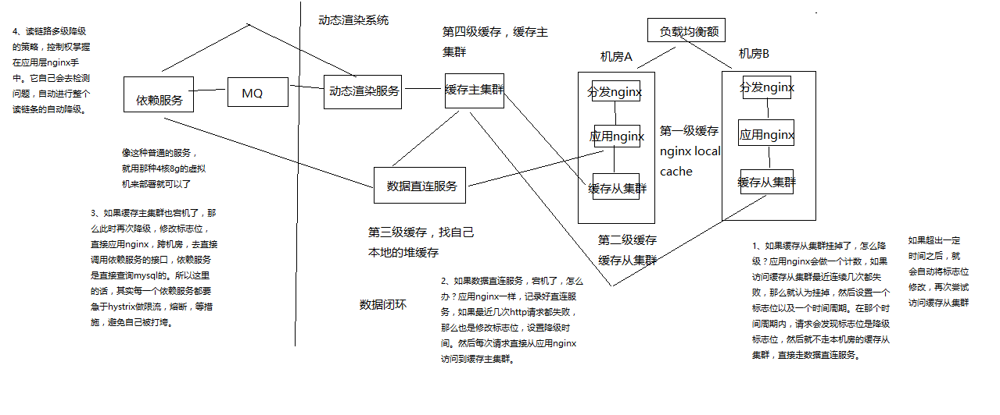

# 1 架构与设计

## 1.1 架构整体设计

纯实战,一个较为完整的亿级流量大型电商网站的商品详情页系统

商品详情页介绍

商品详情页的多模板化
	多套模板：聚划算、天猫超市、淘抢购、电器城
	不同模板的元数据一样，只是展示方式不一样
	不同的业务，商品详情页的个性化需求很多，数据来源也很多

商品详情页结构
	时效性比较低的数据
		一个商品详情包含了不同的维度
		商品维度：标题，图片，属性，等等
		主商品维度：商品介绍，规格参数，等等
		分类维度
		商家维度
		时效性比较低的数据
			其实后面会讲解，都是在一个商品详情页被访问到的时候，将数据动态直接渲染/填充到一个html模板中去的
			在浏览器展现的时候，数据写死在html里面，直接就出来了
			因为比如说，一个商品的数据变更了，可能是异步的去更新数据的，也许需要5分钟，或者10分钟的时间，才能将变更的数据反映的商品详情页中去
	实时性较高的数据
		实时价格、实时促销、广告词、配送至、预售、库存
		ajax异步加载
		在访问商品详情页的时候，价格、库存、促销活动、广告词，都没有直接写死到html中，直接是在html里放了一个js脚本
		然后在html在浏览器显示出来的时候，js脚本运行，直接发送ajax请求到后端
		后端接口，直接查询价格、库存、促销活动、广告词，最新的数据
		只要你变更了数据，那么在下一次商品详情页展示的时候，一定可以将最新的数据展示出来

在淘宝网上展示一个通用商品模板，商品详情页结构拆解说明，分析一个商品详情页的多维度构成
	
亿级流量电商网站的商品详情页访问情况
	访问量：比如双11活动，商品详情页的pv至少达到几亿次，但是经过良好设计的详情页系统，响应时间小于几十ms
	访问特点：离散访问多，热点数据少
	一般来说，访问的比较均匀，很少说集中式访问某个商品详情页，除非是那种秒杀活动，那是集中式访问某个商品详情页

## 1.2 商品详情页整体架构组成

动态渲染系统
	将页面中静的数据，直接在变更的时候推送到缓存，然后每次请求页面动态渲染新数据
	商品详情页系统（负责静的部分）：被动接收数据，存储redis，nginx+lua动态渲染
	商品详情页动态服务系统（对外提供数据接口）
		提供各种数据接口
		动态调用依赖服务的接口，产生数据并且返回响应
		从商品详情页系统处理出来的redis中，获取数据，并返回响应
		
OneService系统
	动的部分，都是走ajax异步请求的，不是走动态渲染的
	商品详情页统一服务系统（负责动的部分）
	
前端页面
	静的部分，直接被动态渲染系统渲染进去了
	动的部分，html一到浏览器，直接走js脚本，ajax异步加载
	商品详情页，分段存储，ajax异步分屏加载
	
工程运维
	限流，压测，灰度发布


## 1.3  动态渲染系统

我们先做动态渲染那套系统

（1）依赖服务 -> MQ -> 动态渲染服务 -> 多级缓存
（2）负载均衡 -> 分发层nginx -> 应用层nginx -> 多级缓存
（3）多级缓存 -> 数据直连服务
	数据闭环
	数据闭环架构
		依赖服务：商品基本信息，规格参数，商家/店铺，热力图，商品介绍，商品维度，品牌，分类，其他
		发送数据变更消息到MQ
		数据异构Worker集群，监听MQ，将原子数据存储到redis，发送消息到MQ
		数据聚合Worker集群，监听MQ，将原子数据按维度聚合后存储到redis，三个维度（商品基本信息、商品介绍、其他信息）
	数据闭环，就是数据的自我管理，所有数据原样同步后，根据自己的逻辑进行后续的数据加工，走系统流程，以及展示k
	数据形成闭环之后，依赖服务的抖动或者维护，不会影响到整个商品详情页系统的运行
	数据闭环的流程：数据异构（多种异构数据源拉取），数据原子化，数据聚合（按照维度将原子数据进行聚合），数据存储（Redis）

数据维度化
	商品基本信息：标题、扩展属性、特殊属性、图片、颜色尺码、规格参数
	商品介绍
	非商品维度其他信息：分类，商家，店铺，品牌
	商品维度其他信息：采用ajax异步加载，价格，促销，配送至，广告，推荐，最佳组合，等等

采取ssdb，这种基于磁盘的大容量/高性能的kv存储，保存商品维度、主商品维度、商品维度其他信息，数据量大，不能光靠内存去支撑
采取redis，纯内存的kv存储，保存少量的数据，比如非商品维度的其他数据，商家数据，分类数据，品牌数据

一个完整的数据，拆分成多个维度，每个维度独立存储，就避免了一个维度的数据变更就要全量更新所有数据的问题
不同维度的数据，因为数据量的不一样，可以采取不同的存储策略

系统拆分
	系统拆分更加细：依赖服务、MQ、数据异构Worker、数据同步Worker、Redis、Nginx+Lua
	每个部分的工作专注，影响少，适合团队多人协作
	异构Worker的原子数据，基于原子数据提供的服务更加灵活
	聚合Worker将数据聚合后，减少redis读取次数，提升性能
	前端展示分离为商品详情页前端展示系统和商品介绍前端展示系统，不同特点，分离部署，不同逻辑，互相不影响
	
异步化
	异步化，提升并发能力，流量削峰
	消息异步化，让各个系统解耦合，如果使用依赖服务调用商品详情页系统接口同步推送，那么就是耦合的
	缓存数据更新异步化，数据异构Worker同步调用依赖服务接口，但是异步更新redis
	
动态化
	数据获取动态化：nginx+lua获取商品详情页数据的时候，按照维度获取，比如商品基本数据、其他数据（分类、商家）
	模板渲染实时化：支持模板页面随时变化，因为采用的是每次从nginx+redis+ehcache缓存获取数据，渲染到模板的方式，因此模板变更不用重新静态化HTML
	重启应用秒级化：nginx+lua架构，重启在秒级
	需求上线快速化：使用nginx+lua架构开发商品详情页的业务逻辑，非常快速
		
多机房多活
	Worker无状态，同时部署在各自的机房时采取不同机房的配置，来读取各自机房内部部署的数据集群（redis、mysql等）
		将数据异构Worker和数据聚合Worker设计为无状态化，可以任意水平扩展
		Worker无状态化，但是配置文件有状态，不同的机房有一套自己的配置文件，只读取自己机房的redis、ssdb、mysql等数据
	每个机房配置全链路：接入nginx、商品详情页nginx+商品基本信息redis集群+其他信息redis集群、商品介绍nginx+商品介绍redis集群
	部署统一的CDN以及LVS+KeepAlived负载均衡设备


## 1.4 大型网站的多机房4级缓存架构设计

多级缓存架构
	**本地缓存**
		使用nginx shared dict作为local cache，http-lua-module的shared dict可以作为缓存，而且reload nginx不会丢失
		也可以使用nginx proxy cache做local cache
		**双层nginx部署，一层接入，一层应用，接入层用hash路由策略提升缓存命中率**
			比如库存缓存数据的TP99为5s，本地缓存命中率25%，redis命中率28%，回源命中率47%
			一次普通秒杀活动的命中率，本地缓存55%，分布式redis命中率15%，回源命中率27%
			最高可以提升命中率达到10%
		全缓存链路维度化存储，如果有3个维度的数据，只有其中1个过期了，那么只要获取那1个过期的数据即可
		nginx local cache的过期时间一般设置为30min，到后端的流量会减少至少3倍
	**4级多级缓存**
		**nginx本地缓存，抗热点数据**，小内存缓存访问最频繁的数据
		各个机房本地的**redis从集群的数据，抗大量离线数据**，采用一致性hash策略构建分布式redis缓存集群
		tomcat中的动态服务的**本地jvm堆缓存**
			支持在一个请求中多次读取一个数据，或者与该数据相关的数据
			作为redis崩溃的备用防线
			固定缓存一些较少访问频繁的数据，比如分类，品牌等数据
			堆缓存过期时间为redis过期时间的一半
		**主redis集群**
			命中率非常低，小于5%
			防止主从同步延迟导致的数据读取miss
			防止各个机房的从redis集群崩溃之后，全量走依赖服务会导致雪崩，**主redis集群是后备防线**
	**主redis集群，采取多机房一主三从的高可用部署架构**
		redis集群部署采取双机房一主三活的架构，机房A部署主集群+一个从集群，机房B部署一个从集群（从机房A主集群）+一个从集群（从机房B从集群）
		双机房一主三活的架构，保证了机房A彻底故障的时候，机房B还有一套备用的集群，可以升级为一主一从
		如果采取机房A部署一主一从，机房B一从，那么机房A故障时，机房B的一从承载所有读写压力，压力过大，很难承受


**PS:说白了就是双redis缓存+nginx+本地jvm的四级缓存**

## 1.5 复杂的消息队列架构设计

队列化
	**任务等待队列**
	**任务排重队列**（异构Worker对一个时间段内的变更消息做排重）
	**失败任务队列**（失败重试机制）
	**优先级队列**，刷数据队列（依赖服务洗数据）、高优先级队列（活动商品优先级高）


## 1.6 使用多线程并发提升系统吞吐量的设计

并发化
	数据同步服务做并发化+合并，将多个变更消息合并在一起，调用依赖服务一次接口获取多个数据，采用多线程并发调用
	数据聚合服务做并发化，每次重新聚合数据的时候，对多个原子数据用多线程并发从redis查询


## 1.7 redis批量查询性能优化设计


## 1.8 全链路高可用架构设计

高可用设计
	读链路多级降级：本机房从集群 -> 主集群 -> 直连

全链路隔离
	基于hystrix的依赖调用隔离，限流，熔断，降级
	普通服务的多机房容灾冗余部署以及隔离



## 1.9 微服务架构设计

1、领域驱动设计：我们需要对这个系统涉及到的领域模型机进行分析，然后进行领域建模，最后的话，设计出我们对应的微服务的模型
2、spring cloud：微服务的基础技术架构，我们用spring cloud来做
3、持续交付流水线，jenkins+git+自动化持续集成+自动化测试+自动化部署
4、docker：大量的微服务的部署与管理

一大块，真实的完整的亿级流量高并发高可用的电商详情页系统的架构实战

另一块，里面的服务，都会用微服务架构来做，相当于是在真实业务场景下的微服务项目实战

## 1.10 机房与机器的规划

虚拟机，要弄几台，大概怎么来部署

负载均衡：2台机器，lvs+keepalived，双机高可用

两个机房，每个机房给1台机器，总共就是2台机器，分发层nginx+应用层nginx+缓存从集群

缓存主集群：模拟跟上面的两个机房部署在一起，在实际生产环境中，的确可能是在相同的机房，但是肯定在不同的机器上

我们这里不会有真正的机房，但是会模拟出来，有些机器会在某个机房里

缓存集群分片中间件，跟缓存集群部署在一起

rabbitmq和mysql：1台机器

# 2 搭建环境

## 2.1 部署CentOS虚拟机集群

**2台3G内存的虚拟机**

1、在虚拟机中安装CentOS

过程见虚拟机安装

**yum配置**

​	yum clean all
​	yum makecache
​	yum install wget

------------------------------------------------------------------------------------------

2、在每个CentOS中都安装Java和Perl

（1）安装JDK

（2）安装Perl

yum install -y gcc

wget http://www.cpan.org/src/5.0/perl-5.16.1.tar.gz
tar -xzf perl-5.16.1.tar.gz
cd perl-5.16.1
./Configure -des -Dprefix=/usr/local/perl
make && make test && make install
perl -v

------------------------------------------------------------------------------------------

3、在另外一个虚拟机中安装CentOS集群

（1）按照上述步骤，再安装1台一模一样环境的linux机器
（2）另外三台机器的hostname分别设置为eshop-detail02
（3）安装好之后，在每台机器的hosts文件里面，配置好所有的机器的ip地址到hostname的映射关系

------------------------------------------------------------------------------------------

4、配置2台CentOS为ssh免密码互相通信

（1）首先在三台机器上配置对本机的ssh免密码登录
ssh-keygen -t rsa
生成本机的公钥，过程中不断敲回车即可，ssh-keygen命令默认会将公钥放在/root/.ssh目录下
cd /root/.ssh
cp id_rsa.pub authorized_keys
将公钥复制为authorized_keys文件，此时使用ssh连接本机就不需要输入密码了

（2）接着配置三台机器互相之间的ssh免密码登录
使用ssh-copy-id -i hostname命令将本机的公钥拷贝到指定机器的authorized_keys文件中

## 2.2 双机房部署接入层与应用层Nginx+Lua

openresty安装：略

部署了两台虚拟机

模拟的场景是什么，假设这两台虚拟机分别在不同的机房中，每个机房里都有一台机器，所以按照我们之前讲解的那套双机房的四级缓存架构

部署nginx，虚拟机，每台机器上，部署两个nginx，一个是分发层nginx，一个是应用层nginx

在实际生产环境中

1、部署第一个nginx

（1）部署openresty

（2）nginx+lua开发的hello world

（3）工程化的nginx+lua项目结构

部署结构图说明：


## 2.3 为什么是twemproxy+redis而不是redis cluster

1、LVS那块不讲解

LVS+KeepAlived，负载均衡那块，讲一讲，还是不讲了，意义不是太大

MySQL+Atlas，分库分表，鸡肋

单课，聚焦，围绕一个主题去讲解，太发散了以后，什么都讲，没有围绕主题去讲解，意义不是太大

商品详情页系统，亿级流量大电商，核心的东西

随着课程不断讲解，可能会有10%的出入，砍掉或者调整一些细枝末节，大的思路是ok的，不会改变的

对课程，更加深入的思考

每一讲的标题会不断的变更

**2、redis cluster的问题**

**twemproxy+redis去做集群，redis部署多个主实例，每个主实例可以挂载一些redis从实例，如果将不同的数据分片，写入不同的redis主实例中，twemproxy这么一个缓存集群的中间件**

**redis cluster**

**（1）不好做读写分离，读写请求全部落到主实例上的，如果要扩展写QPS，或者是扩展读QPS，都是需要扩展主实例的数量，从实例就是一个用做热备+高可用**
**（2）不好跟nginx+lua直接整合，lua->redis的client api，但是不太支持redis cluster，中间就要走一个中转的java服务**
**（3）不好做树状集群结构，比如redis主集群一主三从双机房架构，redis cluster不太好做成那种树状结构**
**（4）方便，相当于是上下线节点，集群扩容，运维工作，高可用自动切换，比较方便**

3、twemproxy+redis

（1）上线下线节点，有一些手工维护集群的成本
（2）支持redis集群+读写分离，就是最基本的多个redis主实例，twemproxy这个中间件来决定的，java/nginx+lua客户端，是连接twemproxy中间件的。每个redis主实例就挂载了多个redis从实例，高可用->哨兵，redis cluster读写都要落到主实例的限制，你自己可以决定写主，读从，等等
（3）支持redis cli协议，可以直接跟nginx+lua整合
（4）可以搭建树状集群结构

4、如何选择？

（1）看你是否一定需要那3点了，如果不需要，那么用redis cluster也ok，大多数情况下，很多应用用redis就是比较简单的，做一个缓存
（2）如果你的架构里很需要那3点，那么用twemproxy比较好，商品详情页系统的整套架构

## 2.4 redis复习以及twemproxy基础知识

1、部署redis(略)

2、twemproxy部署(略，见资料)

3、redis配置

在两台机器部署6个节点，不同端口号即可

5、twemproxy讲解

```
eshop-detail-test:  
  listen: 127.0.0.1:1111  
  hash: fnv1a_64  
  distribution: ketama  
  timeout:1000  
  redis: true  
  servers:  
```

   - 127.0.0.1:6379:1 test-redis-01 
   - 127.0.0.1:6380:1 test-redis-02

eshop-detail-test: redis集群的逻辑名称
listen：twemproxy监听的端口号
**hash：hash散列算法**
**distribution：分片算法，一致性hash，取模**，等等
timeout：跟redis连接的超时时长
redis：是否是redis，false的话是memcached
servers：redis实例列表，一定要加别名，否则默认使用ip:port:weight来计算分片，如果宕机后更换机器，那么分片就不一样了，因此加了别名后，可以确保分片一定是准确的

**你的客户端，java/nginx+lua，连接twemproxy，写数据的时候，twemproxy负责将数据分片，写入不同的redis实例**

如果某个redis机器宕机，需要自动从一致性hash环上摘掉，等恢复后自动上线

auto_eject_hosts: true，自动摘除故障节点
server_retry_timeout: 30000，每隔30秒判断故障节点是否正常，如果正常则放回一致性hash环
server_failure_limit: 2，多少次无响应，就从一致性hash环中摘除

一致性hash

## 2.5 部署双机房一主三从架构的redis主集群

在第一台虚拟机上，部署两个redis主实例+两个redis从实例，模拟一个机房的情况
在第二台虚拟机上，部署两个redis从实例，挂载到第一台虚拟机的redis从实例上; 再部署两个redis从实例，挂载到第二台虚拟机的从实例上


## 2.6 给每个机房部署一个redis从集群


## 2.7 为redis主集群部署twemproxy中间件

**PS:仅供参考，未实操**

```shell

yum install -y autoconf automake libtool

#直接将autoconf和automake、libtool都删除掉了
yum remove -y autoconf 

wget ftp://ftp.gnu.org/gnu/autoconf/autoconf-2.69.tar.gz
tar -zxvf autoconf-2.69.tar.gz
cd autoconf-2.69 
./configure --prefix=/usr
make && make install

wget http://ftp.gnu.org/gnu/automake/automake-1.14.tar.gz
tar -zxvf automake-1.14.tar.gz 
cd automake-1.14
./bootstrap.sh
./configure --prefix=/usr
make && make install

wget http://ftpmirror.gnu.org/libtool/libtool-2.4.2.tar.gz
tar -zxvf libtool-2.4.2.tar.gz
cd libtool-2.4.2
./configure --prefix=/usr
make && make install

tar -zxvf twemproxy-0.4.0.tar.gz

cd twemproxy-0.4.0

autoreconf -fvi
./configure && make

vi conf/nutcracker.yml  

server1:  
  listen: 127.0.0.1:1111  
  hash: fnv1a_64  
  distribution: ketama  
  redis: true  
  servers:  
   - 127.0.0.1:6379:1 

src/nutcracker -d -c ../conf/nutcracker.yml 

ps -aux | grep nutcracker

src/redis-cli -p 1111  

get k1
set k1 v2
get k1

```


## 2.8 为每个机房的redis从集群部署twemproxy中间件

**PS:仅供参考，未实操**

```shell

yum install -y autoconf automake libtool
#直接将autoconf和automake、libtool都删除掉了
yum remove -y autoconf 

wget ftp://ftp.gnu.org/gnu/autoconf/autoconf-2.69.tar.gz
tar -zxvf autoconf-2.69.tar.gz
cd autoconf-2.69 
./configure --prefix=/usr
make && make install

wget http://ftp.gnu.org/gnu/automake/automake-1.14.tar.gz
tar -zxvf automake-1.14.tar.gz 
cd automake-1.14
./bootstrap.sh
./configure --prefix=/usr
make && make install

wget http://ftpmirror.gnu.org/libtool/libtool-2.4.2.tar.gz
tar -zxvf libtool-2.4.2.tar.gz
cd libtool-2.4.2
./configure --prefix=/usr
make && make install

tar -zxvf twemproxy-0.4.0.tar.gz

cd twemproxy-0.4.0

autoreconf -fvi
./configure && make

vi conf/nutcracker.yml  

server1:  
  listen: 127.0.0.1:1111  
  hash: fnv1a_64  
  distribution: ketama  
  redis: true  
  servers:  
   - 127.0.0.1:6379:1 

src/nutcracker -d -c ../conf/nutcracker.yml 

ps -aux | grep nutcracker

src/redis-cli -p 1111  

get k1
set k1 v2
get k1

```


## 2.9 部署RabbitMQ消息中间件

**PS:之后如果要实操的话，这里肯定是用RocketMq的**

1、安装编译工具

yum install -y ncurses ncurses-base ncurses-devel ncurses-libs ncurses-static ncurses-term ocaml-curses ocaml-curses-devel
yum install -y openssl-devel zlib-devel
yum install -y make ncurses-devel gcc gcc-c++ unixODBC unixODBC-devel openssl openssl-devel

2、安装erlang(略)

3、安装rabbitmq(略)

## 2.10 部署MySQL数据库

**PS:MySql部署可以参考其他笔记**

用最简单的方式装一个mysql数据库，然后后面的话，就有数据库可以用来开发了

yum install -y mysql-server

chkconfig mysqld on

service mysqld start 

mysql -u root

set password for root@localhost=password('root');

mysql -uroot -proot

## 2.11 商品服务需求

商品服务，管理商品的数据

分类管理：增删改查
品牌管理：增删改查
商品基本信息管理：增删改查
商品规格管理：增删改查
商品属性管理：增删改查
商品介绍管理：编辑

这块很定是要基于数据库去做得，然后重点就是演示，这种服务如何跟商品详情页系统的架构串接起来
