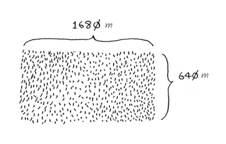
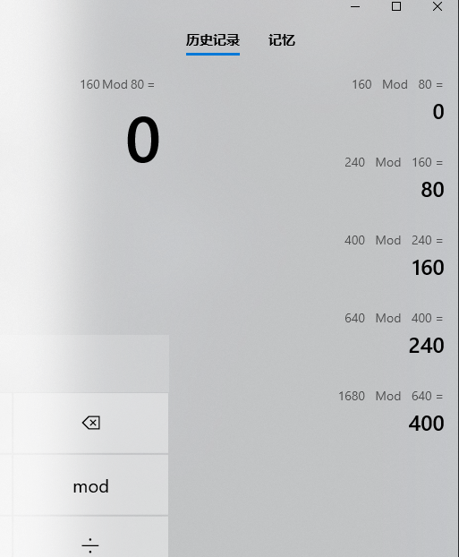

# 1 算法简介

## 1.1 二分查找

仅在有序的数组中才能使用

查找次数是最多log₂N

每次都查找中间的元素，对就返回，不对就继续查找，直到找到为止，或者未找到返回null

```java
public static Integer binarySearch(int[] list,int item){
    //指定下标查找范围
    int low = 0;
    int high = list.length-1;
    while(low<=high){
        //在java中int除法不是整数就向下取整
        int mid = (low+high)/2;
        //取中间元素
        int guess = list[mid];
        if(guess == item){
            //找到直接返回
            return mid;
        }
        //item比mid对应值小
        if(guess > item){
            high = mid-1;
        //数字大了
        }else{
            low = mid + 1;
        }
    }
    return null;
}
```

## 1.2 大O表示法

常见的大O表示

O(log n) 对数时间 -- n越大对数时间增长的越慢

O(n) 线性时间

O(n * log n)

O(n²) 

O(n!) 阶乘

大O表示法是指出算法有多快，表示操作数的

大O表示法指出了最糟糕情况下的运行时间

## 1.3 旅行商算法

旅行商要前往5个城市，计算出旅途最短的路径。为此需要考虑前往这些城市的各种可能途径。

该算法目前只有通过O(n!) 阶乘的方式去计算

## 1.4 总结

O(log n) 比 O(n)快，n越大，就快越多

算法的运行时间是从其增速的角度考考量的

算法的运行时间用大O表示法来表示

# 2 选择排序

## 2.1 数组与链表

**内存的工作原理：超市的寄存东西的抽屉，计算机内存就像是很多抽屉的集合，每个抽屉都有地址。**


**数组：**

​	1 数组在内存中是相连的

​	2 每次新增，如果相连后续地址没位置，就需要整个数组重新转移

​	3 每次删除，都需要重新转移删除下标的后面所有的地址

​	4 插入中间元素则需要整个后续元素移动地址，还可能导致整个数组重新转移

​	5 数组知道每个数组元素的地址，因为数组是相连的，知道起始数组的位置，根据简单的数学运算就知道每个数组下标的位置

​	6 所以数组的新增、删除效率较低，查询效率较高

**PS:可以建立数组时预留一些地址占用，这样新增数据就不用担心，整个数组转移的问题。不过该方案也有，占用额外空间和预留地址用完后的局限性的问题。**

**链表：**

​	1 链表元素可以存储在内存中的任何地方

​	2 链表的每个元素都存储了下一个元素的地址，从而使一系列的随机内存地址串在一起

​	3 链表的新增、插入中间元素、删除都很快，只需要对应元素修改内存地址的指针即可

​	4 链表的想查询靠后的链表数据，需要从第一个开始查，一直查到对应位置才行。因为链表对应元素只知道下一个元素的地址，无法直接查询到对应的链表数据，需要遍历链表的每个元素

​	5 如果不知道需要插入、删除元素的地址，也需要遍历链表找到对应地址才能进行插入、删除

​	6 所以链表的插入，删除很快，查询较慢

## 2.2 选择排序/冒泡排序

### 2.2.1 算法图解选择排序

算法图解选择排序思路：

1 先写一个找出最小元素的方法

2 循环数组找出最小元素赋值给新数组

**3 每次赋值给新数组的动作，都会将原数组对应最小元素出队,原数组的长度-1**

4 所以查找的次数为 n + (n-1) + (n-2)...1

5 约为 n * (1/2*(n+1))

6 大O 表示法为 O(n²)

```java
    /**
     * 算法图解选择排序，python数组有根据下标出队的功能
     * java 模拟一个出队功能
     */
    public static int[] arrPop(int[] arr,int index){
        //排除index,则新数组长度-1
        int[] arrNew = new int[arr.length-1];
        int j = 0;
        for(int i = 0; i < arr.length;i++){
            //将除了index对应的数据重新复制到新数组
            if(i != index){
                arrNew[j]=arr[i];
                j++;
            }
        }
        return arrNew;
    }

    /**
     * 找出数组中最小的元素下标
     */
    public static int findSmall(int[] arr){
        int minIndex = 0;
        //从第1位开始找，因为第0位无须再重复比较
        for(int i = 1;i < arr.length; i++){
            if(arr[i]<arr[minIndex]){
                minIndex = i;
            }
        }
        return minIndex;
    }

    /**
     * 选择排序实现
     */
    public static int[] selectionSort(int[] arr){
        int[] arrNew = new int[arr.length];
        int length = arr.length;
        //找n次
        for(int i = 0; i < length; i++){
            //取得最小下标
            int smallIndex = findSmall(arr);
            //将最小下标给到新数组第一位
            arrNew[i] = arr[smallIndex];
            //将最小下标从数组中排出，原数组的长度-1
            arr = arrPop(arr,smallIndex);
        }
        return arrNew;
    }
```


### 2 正常套路选择排序

正常套路选择排序思路：

1 查找n次

**2 每次查找都将最小的值找出来，和当前下标换位置**

**3 然后从当前下标开始再继续找，所以每换一次位置，后续的查找就-1次查找次数**

4 所以查找的次数为 n + (n-1) + (n-2)...1

5 约为 n * (1/2*(n+1))

6 大O 表示法为 O(n²)

查找次数和思路，算法图解版是一样的，实现略有差别

```java
    /**
     * 正常套路选择排序实现
     * @param arr
     * @return
     */
    public static int[] selectionSortJava(int[] arr){
        //查找n次
        for(int i = 0; i < arr.length; i++){
            //当前下标
            int minItem = i;
            for(int j = i+1; j < arr.length;j++){
                //从当前下标往后找，找到最小
                if(arr[j]<arr[minItem]){
                    minItem = j;
                }
            }
            //如果当前下标不是最小的，则当前下标和最小下标换位置
            if(minItem!=i){
                int item = arr[i];
                arr[i] = arr[minItem];
                arr[minItem] = item;
            }
        }
        return arr;
    }
```


### 3 冒泡排序

冒泡排序思路：

1 查找n次

**2 每次都从第0位开始比对，比下一位大，马上就换位置**

3 继续往后比对，换位置，比对到最后一位为止

**4 每次比对到最后一位，说明最后一位就是最大的数值，因为全部都两两比较了一遍，最大的会被换位置到最后一位**

**5 下一次查询次数就-1，因为最大的已经再最后，无须再比较，以此类推**

6 所以查找的次数为 n + (n-1) + (n-2)...1

7 约为 n * (1/2*(n+1))

8 大O 表示法为 O(n²)

**PS:因为冒泡排序交换的次数比选择排序多，相对而言选择排序的效率更高**

**PS:冒泡排序如果某一次冒泡没有发生任何的交换，可以提前终止，这算是一个小优化**

```java
    /**
     * 冒泡排序
     * @param arr
     * @return
     */
    public static int[] bubbleSort(int[] arr){
        //查找n次
        for(int i = 0; i < arr.length; i++){
            //每次比较后，最后一位都无须再比较了,查找次数-1
            //每次都-1，i次就是-i
            for(int j = 1; j < arr.length-i-1;j++){
                //每次都两两前后比较,后面大就换位置
                if(arr[j-1]>arr[j]){
                    int item = arr[j-1];
                    arr[j-1] = arr[j];
                    arr[j] = item;
                }
            }
        }
        return arr;
    }
```


# 3 递归

## 3.1 递归相关知识

递归指的是调用自己的函数。

编写递归函数时，必须告诉它何时停止递归，

正因为如此，每个递归函数都有两部分：基线条件（base case）和递归条件（recursive case）。递归条件指的是函数调用自己，而基线条件则指的是函数不再调用自己，从而避免形成无限循环。

```python
#我们来给函数countdown添加基线条件。
def  countdown(i):
    print  i
    if  i  <=  0:    ←------基线条件
        return
    else:    ←------递归条件
        countdown(i-1)

```

## 3.2栈

1 栈有两种操作：压入和弹出。栈顶压入，栈顶弹出，类似于羽毛球桶。

2 调用方法，方法执行就是压入栈，方法执行完成就弹出栈

3 计算机在内部使用被称为调用栈

4 所有函数调用都进入调用栈。

5 调用栈可能很长，这将占用大量的内存。

**PS:尾递归**

**递归调用放在方法最后(return)，而且没有其他条件参与就是尾递归。部分语言会对尾递归进行优化(java没有尾递归优化)**

# 4 快速排序

## 4.1 分而治之

### 4.4.1 简介

分而治之（divide and conquer，D&C）——一种著名的递归式问题解决方法。

案例：

何将一块地均匀地分成方块，并确保分出的方块是最大的呢？使用D&C策略！D&C算法是递归的。使用D&C解决问题的过程包括两个步骤。
(1) 找出基线条件，这种条件必须尽可能简单。
(2) 不断将问题分解（或者说缩小规模），直到符合基线条件。




欧几里得算法

```
是用来求两个正整数最大公约数的算法。古希腊数学家欧几里得在其著作《The Elements》中最早描述了这种算法,所以被命名为欧几里得算法。

扩展欧几里得算法可用于[RSA](https://baike.baidu.com/item/RSA)加密等领域。

假如需要求 1997 和 615 两个正整数的最大公约数,用欧几里得算法，是这样进行的：

1997 / 615 = 3 (余 152)

615 / 152 = 4(余7)

152 / 7 = 21(余5)

7 / 5 = 1 (余2)

5 / 2 = 2 (余1)

2 / 1 = 2 (余0)

至此，最大公约数为1

以除数和余数反复做除法运算，当余数为 0 时，取当前算式除数为最大公约数，所以就得出了 1997 和 615 的最大公约数 1。
```



80就是分地的最大方块

### 4.1.2 代码

D&C的工作原理：

1 找出简单的基线条件；

2 确定如何缩小问题的规模，使其符合基线条件。

3 D&C将问题逐步分解。使用D&C处理列表时，基线条件很可能是空数组或只包含一个元素的数组。

D&C并非可用于解决问题的算法，而是一种解决问题的思路。


利用分治算法计算数组之和

```java
/**
* 算法图解，python数组有根据下标出队的功能
* java 模拟一个出队功能
*/
public static int[] arrPop(int[] arr,int index){
    //排除index,则新数组长度-1
    int[] arrNew = new int[arr.length-1];
    int j = 0;
    for(int i = 0; i < arr.length;i++){
        //将除了index对应的数据重新复制到新数组
        if(i != index){
            arrNew[j]=arr[i];
            j++;
        }
    }
    return arrNew;
}

/**
* 分治算法
* 递归调用，计算数组之和
*/
public static int arrSum(int[] arr){
    //基线条件，数组最后一个元素直接返回
    //或arr.length = 0 返回0,效果是一样的
    if(arr.length == 1){
        return arr[0];
    }
    //每次都将第一个数取出，再加上数组剩下的数
    return arr[0] + arrSum(arrPop(arr,0));
    //arr.length = 0 ,返回0，再1 + arrSum(arrPop(arr,0))就是用递归计算数组的元素数(长度)
}

/**
* 分治算法
* 递归调用，找出数组最大数字
*/
public static int arrMax(int[] arr){
    if(arr.length == 2){
        return arr[0]>arr[1]?arr[0]:arr[1];
    }
    int smallIndex = arr[0]<arr[1]?0:1;
    return arrMax(arrPop(arr,smallIndex));
}

/**
* 分治算法
* 递归调用，二分法找出对应数字下标
*/
public static Integer binarySearch(int[] arr,int item,int low,int high){
    int mid = (low+high)/2;
    if(arr[mid]==item){
        return mid;
    }
    if(low>=high){
        return null;
    }
    if(item > arr[mid]){
         return binarySearch(arr,item,mid+1,high);
    }else{
         return binarySearch(arr,item,low,mid-1);
    }
}
```

## 4.2 快速排序

快速排序使用了D&C

1 首先，从数组中选择一个元素，这个元素被称为基准值（pivot）

2 出比基准值小的元素以及比基准值大的元素

3 这被称为分区（partitioning）

4 这里只是进行了分区，得到的两个子数组是无序的

5 如果子数组是有序的，就可以像下面这样合并得到一个有序的数组：左边的数组 + 基准值 + 右边的数组

6 然后对左右两边的数组继续根据基准值分区递归，最终分区到数组长度为1时，排序就完成了

算法图解python版快速排序

```python
def  quicksort(array):
    if  len(array)  <  2:
         return  array    ←------基线条件：为空或只包含一个元素的数组是“有序”的
        else:
            pivot  =  array[0]    ←------递归条件
            less  =  [i  for  i  in  array[1:]  if  i  <=  pivot]    ←------由所有小于基准值的元素组成的子数组
            greater  =  [i  for  i  in  array[1:]  if  i  >  pivot]    ←------由所有大于基准值的元素组成的子数组
            return  quicksort(less)  +  [pivot]  +  quicksort(greater)
        print  quicksort([10,  5,  2,  3])
```

java版快速排序

```java
    /**
     * 分而治之 快速排序
     * @param arr 排序数组
     * @param lf 左下标 传入0
     * @param rt 右下标 传入 数组长度-1
     */
    public static void quickSort(int[] arr,int lf,int rt){
        //基线条件，如果左右边界相等，说明排序完成
        //相当于分割到最后的数组为长度为1，可以直接return
        if(lf>=rt){
            return;
        }
        //使用局部变量，以基准值进行左右分界
        int i = lf;
        int j = rt;
        //基准值
        int x = arr[i];
        while (i < j){
            while (i<j && arr[j] > x){
                // 从右向左找第一个小于x的数
                //因为是从尾部(右)往前面(左)找，所以j后面的必然是比基准值大的数，找到比基准值小的数，马上换位置
                j--;
            }
            if(i<j){
                //比基准值小的数放到前面(左边)(i)
                //右边找到的比基准值小的数放到左边
                arr[i++] = arr[j];
            }
            while (i<j && arr[i] < x){
                // 从左向右找第一个大于x的数
                //因为是从头部(左)往后面(右)找，所以i前面必然是比基准值小的数，找到比基准值大的数马上换位置
                i++;
            }
            if(i<j){
                //比基准值大的数放到后面(右边)(j)
                //左边找到比基准值大的数放到右边
                arr[j--] = arr[i];
            }
        }
        //最后i=j，比i,j(i,j指下标)小的都在左边，比i,j大的都在右边
        //再将最开始被覆盖的基准值，赋值到a[i](a[j]也一样)
        //这样就完成了一次以基准值为标准的排序，比基准值大的在右边，比基准值小的在左边
        arr[i] = x;
        //以i为划分，递归调用i左右两边
        quickSort(arr,lf,i-1);
        quickSort(arr,i+1,rt);
    }
```

参考：https://www.cnblogs.com/skywang12345/p/3596746.html

## 4.3 归并排序

​	算法所需的固定时间量，被称为常量。例如，print_items所需的时间可能是10毫秒 * n，而print_items2所需的时间为1秒 * n。

​	有时候，常量的影响可能很大，对快速查找和合并查找来说就是如此。快速查找的常量比合并查找小，因此如果它们的运行时间都为O(nlog n)，快速查找的速度将更快。实际上，快速查找的速度确实更快，因为相对于遇上最糟情况，它遇上平均情况的可能性要大得多。

```java
package com.arithmetic.dc;

/**
 * 归并排序：Java
 *
 * @author skywang
 * @date 2014/03/12
 */

public class MergeSort {

    /*
     * 将一个数组中的两个相邻有序区间合并成一个
     *
     * 参数说明：
     *     a -- 包含两个有序区间的数组
     *     start -- 第1个有序区间的起始地址。
     *     mid   -- 第1个有序区间的结束地址。也是第2个有序区间的起始地址。
     *     end   -- 第2个有序区间的结束地址。
     */
    public static void merge(int[] a, int start, int mid, int end) {
        // tmp是汇总2个有序区的临时区域
        //start,end分别为数组下标。这里temp临时数组长度自然要+1
        //start=0 mid=0 end=1 (end-start+1)=2
        int[] tmp = new int[end-start+1];
        // 第1个有序区的索引
        int i = start;
        // 第2个有序区的索引
        int j = mid + 1;
        // 临时区域的索引
        int k = 0;

        //i超过区间mid就结束循环
        //j超过区间end就结束循环
        //说白了就是对比两个有序数组，小的就放入temp临时数组，然后该区间的下标就前进一位，直到两个有序数组其中一个全部放入temp为止
        while(i <= mid && j <= end) {
            if (a[i] <= a[j])
                //i小就把i放入
                //放入后就i++前进一位，j不变，直到i > mid跳出循环为止
                tmp[k++] = a[i++];
            else
                //j小就把j放入
                //放入后就j++前进一位，i不变，直到j>end跳出循环为止
                tmp[k++] = a[j++];
        }
        //理解合并的逻辑，有序!!!，很重要，该合并逻辑都是基于有序来进行的
        //因为i~mid,j~end两个区间的数据都是有序的
        //所以经过上面一个循环排序，比对两个有序数组后
        //i~mid,j~end会出现一个数组全部加入到了temp临时数组
        //另一个还存在1个及以上的有序数组，另一个有序数组数据必然是都大于temp的
        //所以将另一个有序数组后续的数据直接加入到temp临时数组即可
        //下面两个while只会进去一个

        //如果i <= mid说明(i-mid)还有数据没放入temp
        while(i <= mid)
            tmp[k++] = a[i++];
        //如果j <= end说明(j-end)还有数据没放入temp
        while(j <= end)
            tmp[k++] = a[j++];

        // 将排序后的元素，全部都整合到数组a中。
        //将两个有序数组全部放入临时数组后，k相当于temp的length了，i<k等同于i<temp.length
        for (i = 0; i < k; i++)
            a[start + i] = tmp[i];

        //出栈就回收temp局部变量了，无须置为null
        //tmp=null;
        //上面while循环会将(i~mid)(j~end)循环一遍，所以该方法的时间复杂度为O(n)
        //也就是说遍历一次的时间复杂度为O(n)
    }

    /*
     * 归并排序(从上往下)
     *
     * 参数说明：
     *     a -- 待排序的数组
     *     start -- 数组的起始地址
     *     endi -- 数组的结束地址
     *     时间复杂度为 n * log n 为 O(n * log n)
     */
    public static void mergeSortUp2Down(int[] a, int start, int end) {
        if(a==null || start >= end)
            return ;
        //二分区分数组的的次数为O(log n)
        int mid = (end + start)/2;
        mergeSortUp2Down(a, start, mid); // 递归排序a[start...mid]
        mergeSortUp2Down(a, mid+1, end); // 递归排序a[mid+1...end]

        // a[start...mid] 和 a[mid...end]是两个有序空间，
        // 将它们排序成一个有序空间a[start...end]
        // merge排序合并，遍历一次的时间复杂度为O(n)
        merge(a, start, mid, end);
    }


    /*
     * 对数组a做若干次合并：数组a的总长度为len，将它分为若干个长度为gap的子数组；
     *             将"每2个相邻的子数组" 进行合并排序。
     *
     * 参数说明：
     *     a -- 待排序的数组
     *     len -- 数组的长度
     *     gap -- 子数组的长度
     */
    public static void mergeGroups(int[] a, int len, int gap) {
        System.out.println();
        int i;
        //int twolen = 2 * gap;    // 两个相邻的子数组的长度

        //gap是对应子数组的长度
        // 将"每2个相邻的子数组" 进行合并排序。
        // i+=(2*gap) 每次增加两个相邻子数组的长度
        // i+(2*gap)-1 < len，为merge的end参数，对应子数组区间就是  (i~(i+gap-1)) 和 (i+gap)~(i+(2*gap)-1)
        // 如 gap=2 i=0,(0~(0+2-1))=(0~1)  (0+2)~(0+(2*2)-1)=(2~3)
        //(0~1) 和 (2~3) 两个子数组就分别是长度为2的待排序子数组
        for(i = 0; i+(2*gap)-1 < len; i+=(2*gap))
            //gap是对应子数组的长度，merge方法传递的参数是下标，所以对应参数传递要-1
            merge(a, i, i+gap-1, i+(2*gap)-1);

        // 若 i+gap-1 < len-1，则剩余一个子数组没有配对。
        // 将该子数组合并到已排序的数组中。
        //i+gap-1 < len-1 与 i+gap < len 是一样的
        // 这里两边对比都用-1 实际上是为了和下面传递下标的merge方法写法上保持一直都写-1
        if ( i+gap-1 < len-1)
            merge(a, i, i + gap - 1, len - 1);
        //merge方法，排序对应两个区间的有序数组时间复杂度是O(n)
        //所以对应mergeGroups方法的时间复杂度也是O(n)
    }

    /*
     * 归并排序(从下往上)
     *
     * 参数说明：
     *     a -- 待排序的数组
     */
    public static void mergeSortDown2Up(int[] a) {
        if (a==null)
            return ;
        // 两两分组，从1,2,4,8...
        // 先用1,2..长度小的分割排序,再用...4,8长度大的分割排序，从下往上排序
        // 从1长度最小的到...8长度最大的，每次长度大的排序都是基于之前排序好的长度小的数组
        // 直到最后排序完成
        //从下往上排序
        for(int n = 1; n < a.length; n*=2)
            mergeGroups(a, a.length, n);
        //mergeGroups时间复杂度是O(n)
        //for循环分割的次数是O(long n)
        //所以mergeSortDown2Up 的时间复杂度是O(n * log n)
    }

    /**
     * 总结
     * 从下往上，从上往下的归并排序最主要的区别就是分割数组的区别
     * 一个是递归方式从大往小分割数组，分治的思想，再基于小数组的顺序归并成大数组，最后完成归并排序
     * 一个是循环分割的方式，从小往大分割数组，先把数组分割成最小1的长度排序，然后2,4,8..的长度分割数组进行排序，当分割的长度=>数组长度之前，最后一次排序两个有序数组就完成了归并排序
     * @param args
     */
    public static void main(String[] args) {
        int i;
        int a[] = {80,30,60,40,20,10,50,70};

        System.out.printf("before sort:");
        for (i=0; i<a.length; i++)
            System.out.printf("%d ", a[i]);
        System.out.printf("\n");

        //mergeSortUp2Down(a, 0, a.length-1);        // 归并排序(从上往下)
        mergeSortDown2Up(a);                    // 归并排序(从下往上)

        System.out.printf("after  sort:");
        for (i=0; i<a.length; i++)
            System.out.printf("%d ", a[i]);
        System.out.printf("\n");
    }
}

```

参考：https://www.cnblogs.com/skywang12345/p/3602369.html


