# 1 算法简介

## 1.1 二分查找

仅在有序的数组中才能使用

查找次数是最多log₂N

每次都查找中间的元素，对就返回，不对就继续查找，直到找到为止，或者未找到返回null

```java
public static Integer binarySearch(int[] list,int item){
    //指定下标查找范围
    int low = 0;
    int high = list.length-1;
    while(low<=high){
        //在java中int除法不是整数就向下取整
        int mid = (low+high)/2;
        //取中间元素
        int guess = list[mid];
        if(guess == item){
            //找到直接返回
            return mid;
        }
        //item比mid对应值小
        if(guess > item){
            high = mid-1;
        //数字大了
        }else{
            low = mid + 1;
        }
    }
    return null;
}
```

## 1.2 大O表示法

常见的大O表示

O(log n) 对数时间 -- n越大对数时间增长的越慢

O(n) 线性时间

O(n * log n)

O(n²) 

O(n!) 阶乘

大O表示法是指出算法有多快，表示操作数的

大O表示法指出了最糟糕情况下的运行时间

## 1.3 旅行商算法

旅行商要前往5个城市，计算出旅途最短的路径。为此需要考虑前往这些城市的各种可能途径。

该算法目前只有通过O(n!) 阶乘的方式去计算

## 1.4 总结

O(log n) 比 O(n)快，n越大，就快越多

算法的运行时间是从其增速的角度考考量的

算法的运行时间用大O表示法来表示

# 2 选择排序

## 2.1 数组与链表

**内存的工作原理：超市的寄存东西的抽屉，计算机内存就像是很多抽屉的集合，每个抽屉都有地址。**

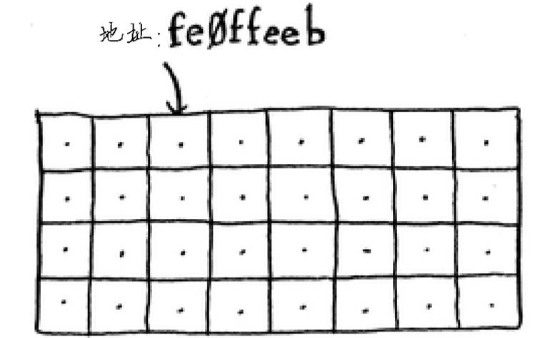

**数组：**

​	1 数组在内存中是相连的

​	2 每次新增，如果相连后续地址没位置，就需要整个数组重新转移

​	3 每次删除，都需要重新转移删除下标的后面所有的地址

​	4 插入中间元素则需要整个后续元素移动地址，还可能导致整个数组重新转移

​	5 数组知道每个数组元素的地址，因为数组是相连的，知道起始数组的位置，根据简单的数学运算就知道每个数组下标的位置

​	6 所以数组的新增、删除效率较低，查询效率较高

**PS:可以建立数组时预留一些地址占用，这样新增数据就不用担心，整个数组转移的问题。不过该方案也有，占用额外空间和预留地址用完后的局限性的问题。**

**链表：**

​	1 链表元素可以存储在内存中的任何地方

​	2 链表的每个元素都存储了下一个元素的地址，从而使一系列的随机内存地址串在一起

​	3 链表的新增、插入中间元素、删除都很快，只需要对应元素修改内存地址的指针即可

​	4 链表的想查询靠后的链表数据，需要从第一个开始查，一直查到对应位置才行。因为链表对应元素只知道下一个元素的地址，无法直接查询到对应的链表数据，需要遍历链表的每个元素

​	5 如果不知道需要插入、删除元素的地址，也需要遍历链表找到对应地址才能进行插入、删除

​	6 所以链表的插入，删除很快，查询较慢

## 2.2 选择排序/冒泡排序

### 2.2.1 算法图解选择排序

算法图解选择排序思路：

1 先写一个找出最小元素的方法

2 循环数组找出最小元素赋值给新数组

**3 每次赋值给新数组的动作，都会将原数组对应最小元素出队,原数组的长度-1**

4 所以查找的次数为 n + (n-1) + (n-2)...1

5 约为 n * (1/2*(n+1))

6 大O 表示法为 O(n²)

```java
    /**
     * 算法图解选择排序，python数组有根据下标出队的功能
     * java 模拟一个出队功能
     */
    public static int[] arrPop(int[] arr,int index){
        //排除index,则新数组长度-1
        int[] arrNew = new int[arr.length-1];
        int j = 0;
        for(int i = 0; i < arr.length;i++){
            //将除了index对应的数据重新复制到新数组
            if(i != index){
                arrNew[j]=arr[i];
                j++;
            }
        }
        return arrNew;
    }

    /**
     * 找出数组中最小的元素下标
     */
    public static int findSmall(int[] arr){
        int minIndex = 0;
        //从第1位开始找，因为第0位无须再重复比较
        for(int i = 1;i < arr.length; i++){
            if(arr[i]<arr[minIndex]){
                minIndex = i;
            }
        }
        return minIndex;
    }

    /**
     * 选择排序实现
     */
    public static int[] selectionSort(int[] arr){
        int[] arrNew = new int[arr.length];
        int length = arr.length;
        //找n次
        for(int i = 0; i < length; i++){
            //取得最小下标
            int smallIndex = findSmall(arr);
            //将最小下标给到新数组第一位
            arrNew[i] = arr[smallIndex];
            //将最小下标从数组中排出，原数组的长度-1
            arr = arrPop(arr,smallIndex);
        }
        return arrNew;
    }
```


### 2 正常套路选择排序

正常套路选择排序思路：

1 查找n次

**2 每次查找都将最小的值找出来，和当前下标换位置**

**3 然后从当前下标开始再继续找，所以每换一次位置，后续的查找就-1次查找次数**

4 所以查找的次数为 n + (n-1) + (n-2)...1

5 约为 n * (1/2*(n+1))

6 大O 表示法为 O(n²)

查找次数和思路，算法图解版是一样的，实现略有差别

```java
    /**
     * 正常套路选择排序实现
     * @param arr
     * @return
     */
    public static int[] selectionSortJava(int[] arr){
        //查找n次
        for(int i = 0; i < arr.length; i++){
            //当前下标
            int minItem = i;
            for(int j = i+1; j < arr.length;j++){
                //从当前下标往后找，找到最小
                if(arr[j]<arr[minItem]){
                    minItem = j;
                }
            }
            //如果当前下标不是最小的，则当前下标和最小下标换位置
            if(minItem!=i){
                int item = arr[i];
                arr[i] = arr[minItem];
                arr[minItem] = item;
            }
        }
        return arr;
    }
```


### 3 冒泡排序

冒泡排序思路：

1 查找n次

**2 每次都从第0位开始比对，比下一位大，马上就换位置**

3 继续往后比对，换位置，比对到最后一位为止

**4 每次比对到最后一位，说明最后一位就是最大的数值，因为全部都两两比较了一遍，最大的会被换位置到最后一位**

**5 下一次查询次数就-1，因为最大的已经再最后，无须再比较，以此类推**

6 所以查找的次数为 n + (n-1) + (n-2)...1

7 约为 n * (1/2*(n+1))

8 大O 表示法为 O(n²)

**PS:因为冒泡排序交换的次数比选择排序多，相对而言选择排序的效率更高**

**PS:冒泡排序如果某一次冒泡没有发生任何的交换，可以提前终止，这算是一个小优化**

```java
    /**
     * 冒泡排序
     * @param arr
     * @return
     */
    public static int[] bubbleSort(int[] arr){
        //查找n次
        for(int i = 0; i < arr.length; i++){
            //每次比较后，最后一位都无须再比较了,查找次数-1
            //每次都-1，i次就是-i
            for(int j = 1; j < arr.length-i-1;j++){
                //每次都两两前后比较,后面大就换位置
                if(arr[j-1]>arr[j]){
                    int item = arr[j-1];
                    arr[j-1] = arr[j];
                    arr[j] = item;
                }
            }
        }
        return arr;
    }
```


# 3 递归

## 3.1 递归相关知识

递归指的是调用自己的函数。

编写递归函数时，必须告诉它何时停止递归，

正因为如此，每个递归函数都有两部分：基线条件（base case）和递归条件（recursive case）。递归条件指的是函数调用自己，而基线条件则指的是函数不再调用自己，从而避免形成无限循环。

```python
#我们来给函数countdown添加基线条件。
def  countdown(i):
    print  i
    if  i  <=  0:    ←------基线条件
        return
    else:    ←------递归条件
        countdown(i-1)

```

## 3.2栈

1 栈有两种操作：压入和弹出。栈顶压入，栈顶弹出，类似于羽毛球桶。

2 调用方法，方法执行就是压入栈，方法执行完成就弹出栈

3 计算机在内部使用被称为调用栈

4 所有函数调用都进入调用栈。

5 调用栈可能很长，这将占用大量的内存。

**PS:尾递归**

**递归调用放在方法最后(return)，而且没有其他条件参与就是尾递归。部分语言会对尾递归进行优化(java没有尾递归优化)**

# 4 快速排序

## 4.1 分而治之

### 4.4.1 简介

分而治之（divide and conquer，D&C）——一种著名的递归式问题解决方法。

案例：

何将一块地均匀地分成方块，并确保分出的方块是最大的呢？使用D&C策略！D&C算法是递归的。使用D&C解决问题的过程包括两个步骤。
(1) 找出基线条件，这种条件必须尽可能简单。
(2) 不断将问题分解（或者说缩小规模），直到符合基线条件。


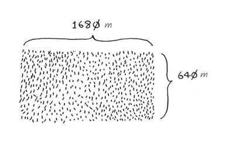

欧几里得算法

```
是用来求两个正整数最大公约数的算法。古希腊数学家欧几里得在其著作《The Elements》中最早描述了这种算法,所以被命名为欧几里得算法。

扩展欧几里得算法可用于[RSA](https://baike.baidu.com/item/RSA)加密等领域。

假如需要求 1997 和 615 两个正整数的最大公约数,用欧几里得算法，是这样进行的：

1997 / 615 = 3 (余 152)

615 / 152 = 4(余7)

152 / 7 = 21(余5)

7 / 5 = 1 (余2)

5 / 2 = 2 (余1)

2 / 1 = 2 (余0)

至此，最大公约数为1

以除数和余数反复做除法运算，当余数为 0 时，取当前算式除数为最大公约数，所以就得出了 1997 和 615 的最大公约数 1。
```

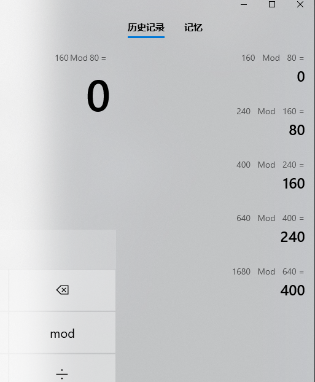

80就是分地的最大方块

### 4.1.2 代码

D&C的工作原理：

1 找出简单的基线条件；

2 确定如何缩小问题的规模，使其符合基线条件。

3 D&C将问题逐步分解。使用D&C处理列表时，基线条件很可能是空数组或只包含一个元素的数组。

D&C并非可用于解决问题的算法，而是一种解决问题的思路。


利用分治算法计算数组之和

```java
/**
* 算法图解，python数组有根据下标出队的功能
* java 模拟一个出队功能
*/
public static int[] arrPop(int[] arr,int index){
    //排除index,则新数组长度-1
    int[] arrNew = new int[arr.length-1];
    int j = 0;
    for(int i = 0; i < arr.length;i++){
        //将除了index对应的数据重新复制到新数组
        if(i != index){
            arrNew[j]=arr[i];
            j++;
        }
    }
    return arrNew;
}

/**
* 分治算法
* 递归调用，计算数组之和
*/
public static int arrSum(int[] arr){
    //基线条件，数组最后一个元素直接返回
    //或arr.length = 0 返回0,效果是一样的
    if(arr.length == 1){
        return arr[0];
    }
    //每次都将第一个数取出，再加上数组剩下的数
    return arr[0] + arrSum(arrPop(arr,0));
    //arr.length = 0 ,返回0，再1 + arrSum(arrPop(arr,0))就是用递归计算数组的元素数(长度)
}

/**
* 分治算法
* 递归调用，找出数组最大数字
*/
public static int arrMax(int[] arr){
    if(arr.length == 2){
        return arr[0]>arr[1]?arr[0]:arr[1];
    }
    int smallIndex = arr[0]<arr[1]?0:1;
    return arrMax(arrPop(arr,smallIndex));
}

/**
* 分治算法
* 递归调用，二分法找出对应数字下标
*/
public static Integer binarySearch(int[] arr,int item,int low,int high){
    int mid = (low+high)/2;
    if(arr[mid]==item){
        return mid;
    }
    if(low>=high){
        return null;
    }
    if(item > arr[mid]){
         return binarySearch(arr,item,mid+1,high);
    }else{
         return binarySearch(arr,item,low,mid-1);
    }
}
```

## 4.2 快速排序

快速排序使用了D&C

1 首先，从数组中选择一个元素，这个元素被称为基准值（pivot）

2 出比基准值小的元素以及比基准值大的元素

3 这被称为分区（partitioning）

4 这里只是进行了分区，得到的两个子数组是无序的

5 如果子数组是有序的，就可以像下面这样合并得到一个有序的数组：左边的数组 + 基准值 + 右边的数组

6 然后对左右两边的数组继续根据基准值分区递归，最终分区到数组长度为1时，排序就完成了

算法图解python版快速排序

```python
def  quicksort(array):
    if  len(array)  <  2:
         return  array    ←------基线条件：为空或只包含一个元素的数组是“有序”的
        else:
            pivot  =  array[0]    ←------递归条件
            less  =  [i  for  i  in  array[1:]  if  i  <=  pivot]    ←------由所有小于基准值的元素组成的子数组
            greater  =  [i  for  i  in  array[1:]  if  i  >  pivot]    ←------由所有大于基准值的元素组成的子数组
            return  quicksort(less)  +  [pivot]  +  quicksort(greater)
        print  quicksort([10,  5,  2,  3])
```

java版快速排序

```java
    /**
     * 分而治之 快速排序
     * @param arr 排序数组
     * @param lf 左下标 传入0
     * @param rt 右下标 传入 数组长度-1
     */
    public static void quickSort(int[] arr,int lf,int rt){
        //基线条件，如果左右边界相等，说明排序完成
        //相当于分割到最后的数组为长度为1，可以直接return
        if(lf>=rt){
            return;
        }
        //使用局部变量，以基准值进行左右分界
        int i = lf;
        int j = rt;
        //基准值
        int x = arr[i];
        while (i < j){
            while (i<j && arr[j] > x){
                // 从右向左找第一个小于x的数
                //因为是从尾部(右)往前面(左)找，所以j后面的必然是比基准值大的数，找到比基准值小的数，马上换位置
                j--;
            }
            if(i<j){
                //比基准值小的数放到前面(左边)(i)
                //右边找到的比基准值小的数放到左边
                arr[i++] = arr[j];
            }
            while (i<j && arr[i] < x){
                // 从左向右找第一个大于x的数
                //因为是从头部(左)往后面(右)找，所以i前面必然是比基准值小的数，找到比基准值大的数马上换位置
                i++;
            }
            if(i<j){
                //比基准值大的数放到后面(右边)(j)
                //左边找到比基准值大的数放到右边
                arr[j--] = arr[i];
            }
        }
        //最后i=j，比i,j(i,j指下标)小的都在左边，比i,j大的都在右边
        //再将最开始被覆盖的基准值，赋值到a[i](a[j]也一样)
        //这样就完成了一次以基准值为标准的排序，比基准值大的在右边，比基准值小的在左边
        arr[i] = x;
        //以i为划分，递归调用i左右两边
        quickSort(arr,lf,i-1);
        quickSort(arr,i+1,rt);
    }
```

参考：https://www.cnblogs.com/skywang12345/p/3596746.html

## 4.3 归并排序

​	算法所需的固定时间量，被称为常量。例如，print_items所需的时间可能是10毫秒 * n，而print_items2所需的时间为1秒 * n。

​	有时候，常量的影响可能很大，对快速查找和合并查找来说就是如此。快速查找的常量比合并查找小，因此如果它们的运行时间都为O(nlog n)，快速查找的速度将更快。实际上，快速查找的速度确实更快，因为相对于遇上最糟情况，它遇上平均情况的可能性要大得多。

```java
package com.arithmetic.dc;

/**
 * 归并排序：Java
 *
 * @author skywang
 * @date 2014/03/12
 */

public class MergeSort {

    /*
     * 将一个数组中的两个相邻有序区间合并成一个
     *
     * 参数说明：
     *     a -- 包含两个有序区间的数组
     *     start -- 第1个有序区间的起始地址。
     *     mid   -- 第1个有序区间的结束地址。也是第2个有序区间的起始地址。
     *     end   -- 第2个有序区间的结束地址。
     */
    public static void merge(int[] a, int start, int mid, int end) {
        // tmp是汇总2个有序区的临时区域
        //start,end分别为数组下标。这里temp临时数组长度自然要+1
        //start=0 mid=0 end=1 (end-start+1)=2
        int[] tmp = new int[end-start+1];
        // 第1个有序区的索引
        int i = start;
        // 第2个有序区的索引
        int j = mid + 1;
        // 临时区域的索引
        int k = 0;

        //i超过区间mid就结束循环
        //j超过区间end就结束循环
        //说白了就是对比两个有序数组，小的就放入temp临时数组，然后该区间的下标就前进一位，直到两个有序数组其中一个全部放入temp为止
        while(i <= mid && j <= end) {
            if (a[i] <= a[j])
                //i小就把i放入
                //放入后就i++前进一位，j不变，直到i > mid跳出循环为止
                tmp[k++] = a[i++];
            else
                //j小就把j放入
                //放入后就j++前进一位，i不变，直到j>end跳出循环为止
                tmp[k++] = a[j++];
        }
        //理解合并的逻辑，有序!!!，很重要，该合并逻辑都是基于有序来进行的
        //因为i~mid,j~end两个区间的数据都是有序的
        //所以经过上面一个循环排序，比对两个有序数组后
        //i~mid,j~end会出现一个数组全部加入到了temp临时数组
        //另一个还存在1个及以上的有序数组，另一个有序数组数据必然是都大于temp的
        //所以将另一个有序数组后续的数据直接加入到temp临时数组即可
        //下面两个while只会进去一个

        //如果i <= mid说明(i-mid)还有数据没放入temp
        while(i <= mid)
            tmp[k++] = a[i++];
        //如果j <= end说明(j-end)还有数据没放入temp
        while(j <= end)
            tmp[k++] = a[j++];

        // 将排序后的元素，全部都整合到数组a中。
        //将两个有序数组全部放入临时数组后，k相当于temp的length了，i<k等同于i<temp.length
        for (i = 0; i < k; i++)
            a[start + i] = tmp[i];

        //出栈就回收temp局部变量了，无须置为null
        //tmp=null;
        //上面while循环会将(i~mid)(j~end)循环一遍，所以该方法的时间复杂度为O(n)
        //也就是说遍历一次的时间复杂度为O(n)
    }

    /*
     * 归并排序(从上往下)
     *
     * 参数说明：
     *     a -- 待排序的数组
     *     start -- 数组的起始地址
     *     endi -- 数组的结束地址
     *     时间复杂度为 n * log n 为 O(n * log n)
     */
    public static void mergeSortUp2Down(int[] a, int start, int end) {
        if(a==null || start >= end)
            return ;
        //二分区分数组的的次数为O(log n)
        int mid = (end + start)/2;
        mergeSortUp2Down(a, start, mid); // 递归排序a[start...mid]
        mergeSortUp2Down(a, mid+1, end); // 递归排序a[mid+1...end]

        // a[start...mid] 和 a[mid...end]是两个有序空间，
        // 将它们排序成一个有序空间a[start...end]
        // merge排序合并，遍历一次的时间复杂度为O(n)
        merge(a, start, mid, end);
    }


    /*
     * 对数组a做若干次合并：数组a的总长度为len，将它分为若干个长度为gap的子数组；
     *             将"每2个相邻的子数组" 进行合并排序。
     *
     * 参数说明：
     *     a -- 待排序的数组
     *     len -- 数组的长度
     *     gap -- 子数组的长度
     */
    public static void mergeGroups(int[] a, int len, int gap) {
        System.out.println();
        int i;
        //int twolen = 2 * gap;    // 两个相邻的子数组的长度

        //gap是对应子数组的长度
        // 将"每2个相邻的子数组" 进行合并排序。
        // i+=(2*gap) 每次增加两个相邻子数组的长度
        // i+(2*gap)-1 < len，为merge的end参数，对应子数组区间就是  (i~(i+gap-1)) 和 (i+gap)~(i+(2*gap)-1)
        // 如 gap=2 i=0,(0~(0+2-1))=(0~1)  (0+2)~(0+(2*2)-1)=(2~3)
        //(0~1) 和 (2~3) 两个子数组就分别是长度为2的待排序子数组
        for(i = 0; i+(2*gap)-1 < len; i+=(2*gap))
            //gap是对应子数组的长度，merge方法传递的参数是下标，所以对应参数传递要-1
            merge(a, i, i+gap-1, i+(2*gap)-1);

        // 若 i+gap-1 < len-1，则剩余一个子数组没有配对。
        // 将该子数组合并到已排序的数组中。
        //i+gap-1 < len-1 与 i+gap < len 是一样的
        // 这里两边对比都用-1 实际上是为了和下面传递下标的merge方法写法上保持一直都写-1
        if ( i+gap-1 < len-1)
            merge(a, i, i + gap - 1, len - 1);
        //merge方法，排序对应两个区间的有序数组时间复杂度是O(n)
        //所以对应mergeGroups方法的时间复杂度也是O(n)
    }

    /*
     * 归并排序(从下往上)
     *
     * 参数说明：
     *     a -- 待排序的数组
     */
    public static void mergeSortDown2Up(int[] a) {
        if (a==null)
            return ;
        // 两两分组，从1,2,4,8...
        // 先用1,2..长度小的分割排序,再用...4,8长度大的分割排序，从下往上排序
        // 从1长度最小的到...8长度最大的，每次长度大的排序都是基于之前排序好的长度小的数组
        // 直到最后排序完成
        //从下往上排序
        for(int n = 1; n < a.length; n*=2)
            mergeGroups(a, a.length, n);
        //mergeGroups时间复杂度是O(n)
        //for循环分割的次数是O(long n)
        //所以mergeSortDown2Up 的时间复杂度是O(n * log n)
    }

    /**
     * 总结
     * 从下往上，从上往下的归并排序最主要的区别就是分割数组的区别
     * 一个是递归方式从大往小分割数组，分治的思想，再基于小数组的顺序归并成大数组，最后完成归并排序
     * 一个是循环分割的方式，从小往大分割数组，先把数组分割成最小1的长度排序，然后2,4,8..的长度分割数组进行排序，当分割的长度=>数组长度之前，最后一次排序两个有序数组就完成了归并排序
     * @param args
     */
    public static void main(String[] args) {
        int i;
        int a[] = {80,30,60,40,20,10,50,70};

        System.out.printf("before sort:");
        for (i=0; i<a.length; i++)
            System.out.printf("%d ", a[i]);
        System.out.printf("\n");

        //mergeSortUp2Down(a, 0, a.length-1);        // 归并排序(从上往下)
        mergeSortDown2Up(a);                    // 归并排序(从下往上)

        System.out.printf("after  sort:");
        for (i=0; i<a.length; i++)
            System.out.printf("%d ", a[i]);
        System.out.printf("\n");
    }
}

```

参考：https://www.cnblogs.com/skywang12345/p/3602369.html

# 5 散列表/哈希表(hash)

## 5.1 简介

​	Hash表也称散列表，也有直接译作哈希表，Hash表是一种根据关键字值（key - value）而直接进行访问的数据结构。它基于数组，通过把关键字映射到数组的某个下标来加快查找速度，但是又**和数组、链表、树等数据结构不同，在这些数据结构中查找某个关键字，通常要遍历整个数据结构，也就是O(N)的时间级，但是对于哈希表来说，只是O(1)的时间级。**

　　**PS:这里有个重要的问题就是如何把关键字转换为数组的下标，这个转换的函数称为哈希函数（也称散列函数），转换的过程称为哈希化。**

​	任一优秀的语言都提供了散列表实现，java提供的散列表为HashMap


## 5.2 散列表的查询效率

**在平均情况下，**散列表的查找（获取给定索引处的值）速度与数组一样快，而插入和删除速度与链表一样快，因此它兼具两者的优点！

**但在最糟情况下，**散列表的各种操作的速度都很慢。因此，在使用散列表时，避开最糟情况至关重要。

为此，需要避免冲突。而要**避免冲突，需要有：**

**较低的填装因子/负载因子**

**良好的散列函数**

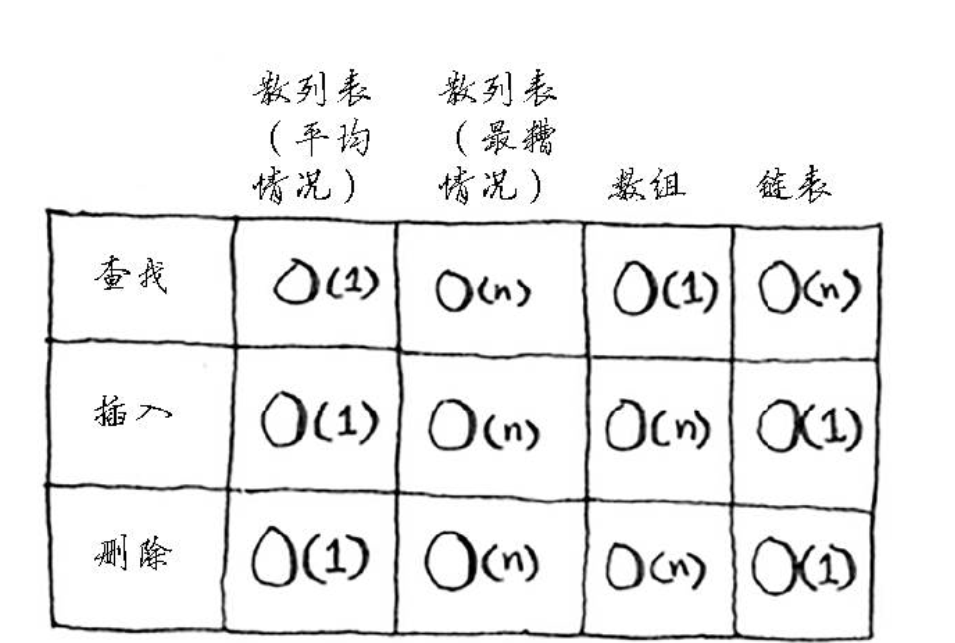

## 5.3 负载因子/装填因子(loadFactor)

临界值(*threshold*) = *负载因子*(loadFactor) * 容量(capacity)

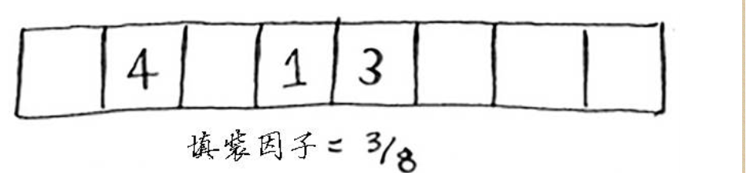

​	**负载因子就是已有数据占了数组长度多少百分比，一般建议百分比大于0.7的时候就对数组进行扩容。在java的hashMap中，*负载因子*(loadFactor)默认0.75**

## 5.4 hash算法/哈希函数/散列函数-简介

**问题：**

​	想在内存中存储5000个英文单词。我们可能想到每个单词会占用一个数组单元，那么数组的大小是5000，同时可以用数组下标存取单词，这样设想很完美，但是数组下标和单词怎么建立联系呢

**方案：**

　首先我们要建立单词和数字（数组下标）的关系：

​	我们知道 ASCII 是一种编码，其中 a 表示97，b表示98，以此类推，一直到122表示z，而每个单词都是由这26个字母组成，我们可以不用 ASCII 编码那么大的数字，自己设计一套类似 ASCII的编码，比如a表示1，b表示2，依次类推，z表示26，那么表示方法我们就知道了。

　　接下来如何把单个字母的数字**组合成代表整个单词的数字**呢？

​	**1 把数字相加**

​		首先第一种**简单的方法就是把单词的每个字母表示的数字相加，得到的和便是数组的下标。**

​		比如单词 cats 转换成数字：cats = 3 + 1 + 20 + 19 = 43。

​		但是**会有个问题就是范围太小**，10个单词最后一个字母：zzzzzzzzzz = 26*10 = 260，单词编码的范围是从1-260。很显然，这个范围是不够存储5000个单词的，这样就引出第二个方案了。

**PS:主要问题是单词每加一位变化的范围是26的n次方级别的，这个数字相加，加一位支持的范围太小了**

​	**2 幂的连乘**

​	我们将**单词表示的数拆成数列，用适当的 27 的幂乘以这些位数（因为有26个可能的字符，以及空格，一共27个），然后把乘积相加，这样就得出了每个单词独一无二的数字**。

　　**比如把单词cats 转换为数字(27的0次幂-27的n-1次幂)：**

　　cats = 3 * 273 + 1 * 272 + 20 * 271 + 19 * 270 = 59049 + 729 + 540 + 19 = 60337

**PS:这里转换数字就是根据每加一位的的变化范围，得出一个较大范围的数字**

​	**虽然为每个单词都分配了独一无二的下标，但是只有一小部分存放了单词**，很大一部分都是空着的。那么现在就需要一种方法，把数位幂的连乘系统中得到的巨大的**整数范围压缩到可接受的数组范围中**。

​	**取余压缩范围：**得到一个数被另一个整数除后的余数，比如单词cats =60337，数组长度=10，60337%10=7**，所以幂的连乘得出的数字再根据数组长度取余，得出数字范围一定在数组范围之内**。

​	smallNumber(范围内压缩后的数值) = largeNumber(数值) % smallRange(范围)

​	**这也就是哈希函数。它把一个大范围的数字哈希（转化）成一个小范围的数字，这个小范围的数对应着数组的下标。使用哈希函数向数组插入数据后，这个数组就是哈希表。**

**PS:良好的散列函数让数组中的值呈均匀分布,比如java中HashMap实现，这里就不扩展了**

## 5.5 hash/哈希冲突-方案

​	**把巨大的数字范围压缩到较小的数字范围，那么肯定会有几个不同的单词哈希化到同一个数组下标，即产生了冲突。**

### 5.5.1 开发地址法

​	当冲突产生时，一个方法是通过系统的方法找到数组的一个空位，并把这个单词填入，而不再用哈希函数得到数组的下标，这种方法称为开放地址法。

​	**比如加入单词 cats 哈希化的结果为5421，但是它的位置已经被单词parsnip占用了，那么我们会考虑将单词 cats 存放在parsnip后面的一个位置 5422 上。**

​	开发地址法中，若数据项不能直接存放在由哈希函数所计算出来的数组下标时，就要寻找其他的位置。**分别有三种方法：线性探测、二次探测以及再哈希法。**

**PS:这三种方法参考引用的文章，这里就不记录了。**

### 5.5.2 链地址法(常用)

​	数组的每个数据项都创建一个子链表或子数组，那么数组内不直接存放单词，**当产生冲突时，新的数据项直接存放到这个数组下标表示的链表中，这种方法称为链地址法**。

**PS:具体实现参考HashMap的实现，简单来说就是链表数组，Hash冲突时同一个数组下标链表再添加一个节点。**

**扩展:桶**

　　另外一种方法**类似于链地址法，它是在每个数据项中使用子数组，而不是链表。这样的数组称为桶。**

　　这个方法显然**不如链表有效，因为桶的容量不好选择，如果容量太小，可能会溢出，如果太大，又造成性能浪费，而链表是动态分配的，不存在此问题。所以一般不使用桶。**


## 5.6 总结

　　哈希表基于数组，类似于key-value的存储形式，关键字值通过哈希函数映射为数组的下标，如果一个关键字哈希化到已占用的数组单元，这种情况称为冲突。用来解决冲突的有两种方法：开放地址法和链地址法。在开发地址法中，把冲突的数据项放在数组的其它位置；在链地址法中，每个单元都包含一个链表，把所有映射到同一数组下标的数据项都插入到这个链表中。

引用：https://www.cnblogs.com/ysocean/p/8032656.html

# 6 广度优先搜索

## 6.1 广度优先搜索与图

双子峰不同路线到金门大桥图

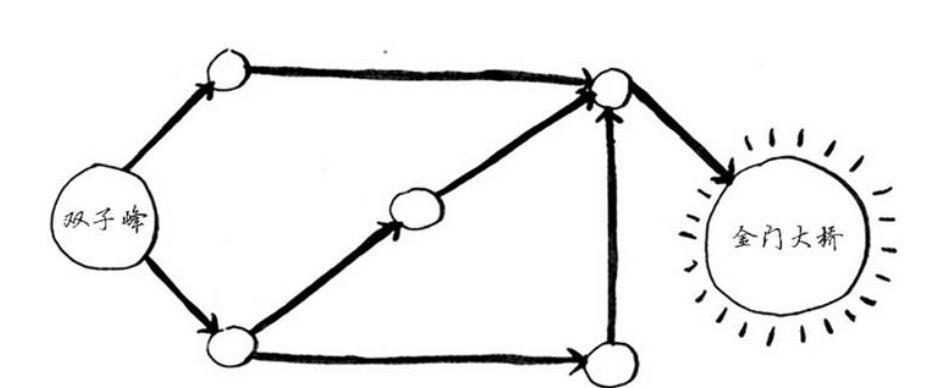

前往金门大桥的最短路径需要几步。
	**这种问题被称为最短路径问题 （shorterst-pathproblem）**。你经常要找出最短路径，这可能是前往朋友家的最短路径，也可能是国际象棋中把对方将死的最少步数。
	**解决最短路径问题的算法被称为广度优先搜索 。**

解决最短路径问题，需要两个步骤：

**(1) 使用图来创建问题模型。**

**(2) 使用广度优先搜索解决问题。**

## 6.2 图简介

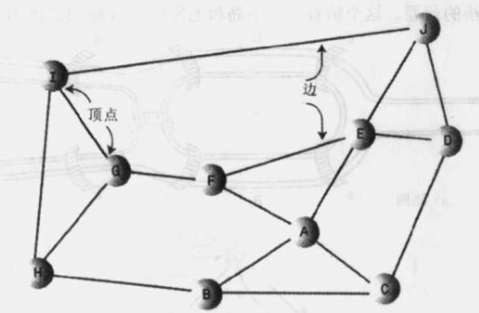

**定义：**图是由 顶点(节点)与边构成

**邻接(邻居)：**居如果两个顶点被同一条边连接，就称这两个顶点是邻接(邻居)的，如上图 I 和 G 就是邻接(邻居)的，而 I 和 F 就不是。比如顶点 G 的邻居是 I、H、F。

**联通图和非联通图：**

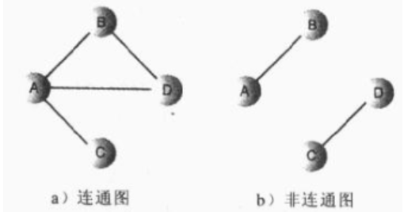

　如果至少有一条路径可以连接起所有的顶点，那么这个图称作连通的；如果假如存在从某个顶点不能到达另外一个顶点，则称为非联通的。

**有向图和无向图：**

​	如果图中的边没有方向，可以从任意一边到达另一边，则称为无向图；比如双向高速公路，A城市到B城市可以开车从A驶向B，也可以开车从B城市驶向A城市。但是如果只能从A城市驶向B城市的图，那么则称为有向图。

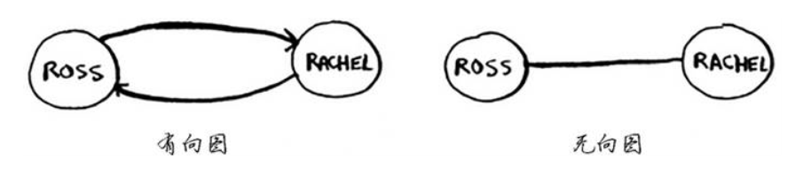

**有权图和无权图：**

​	图中的边被赋予一个权值，权值是一个数字，它能代表两个顶点间的物理距离，或者从一个顶点到另一个顶点的时间，这种图被称为有权图；反之边没有赋值的则称为无权图。

## 6.3  广度优先搜索实现

**广度有限搜索(BFS)**

**问题：**假设你经营着一个芒果农场，需要寻找芒果销售商，在你的朋友，或者朋友的朋友，中找出芒果经销商。

第一类问题：朋友人际关系网有芒果经销商吗
第二类问题：哪个芒果经销商和你关系最近

**PS:相邻的节点就是朋友，BOB是你的朋友，ANUJ是朋友的朋友(这里是无权有向图)**

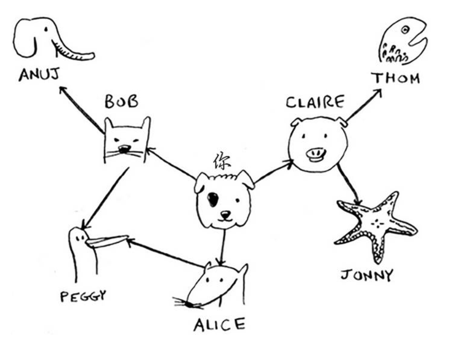

**实现思路：**

1 用散列表实现图

2 用队列存入每个节点的所有朋友

3 总共有8个节点，每个节点都存入散列表。key为"当前节点"，value为"当前节点"的所有朋友，对应节点的朋友如果没有的话，比如ANUJ就存入空数组

4 从 "你" 开始，将你对应散列表中的队列数据取出来存入待检查队列

5 检查待检查队列，如果是芒果经销商则返回true,不是的话，就本次检查的"朋友"对应散列表节点中的队列数据取出来，存入待检查队列

6 依次执行第"5"个步骤，直到待检查队列为空。

7 执行第五个步骤的时候，应该先判断是否检查过，如果检查过了，则不检查了。避免两个节点互为邻居，陷入无线循环检查

**PS:散列表中的节点，存的值为队列，数组都行。核心的数据结构为 散列表 和 待检查队列，这两个。**

​	**散列表对应"图"的对应关系。**

​	**待检查队列利用队列的先进先出的特性实现广度优先搜索，优先找出关系近的对象。**

**PS:这里至少找到最近的"邻居"，并没有明确路径，如果是最短路径问题，算法还需要修改**

**Java实现：**

```java
    /**
     * 这个函数检查人的姓名是否以m结尾：如果是，他就是芒果销售商。这种判断方法有点搞笑，
     * 但就这个示例而言是可行的。下面来看看广度优先搜索的执行过程
     */
    private static boolean isDistributor(String name){
        if(name.substring(name.length()-1,name.length()).equals("m")){
            return true;
        }
        System.out.println("验证过的不是的老哥："+name);
        return false;
    }

    private static void test1(){
        //图-哈希表
        Map<String,String[]> mapData = new HashMap<>();
        mapData.put("you",new String[]{"alice","bob","claire"});
        mapData.put("bob",new String[]{"anuj","peggy"});
        mapData.put("alice",new String[]{"peggy"});
        mapData.put("claire",new String[]{"thom","jonny"});
        mapData.put("anuj",new String[]{});
        mapData.put("peggy",new String[]{});
        mapData.put("thom",new String[]{});
        mapData.put("jonny",new String[]{});
        //待检查队列
        Queue<String> checkQueue = new ArrayBlockingQueue(50);
        checkQueue.addAll(Arrays.asList(mapData.get("you")));
        Iterator<String> iterator = checkQueue.iterator();
        //已经检查过的数组
        List<String> checkDo = new ArrayList<>();
        while (iterator.hasNext()){
            String next = iterator.next();
            if(checkDo.contains(next)){
                //System.out.println("这个老哥已经检查过啦:"+next);
                continue;
            }
            if(isDistributor(next)){
                System.out.println("找到啦:"+next);
                break;
            }else {
                checkQueue.addAll(Arrays.asList(mapData.get(next)));
            }
            checkDo.add(next);
        }
    }
```


## 6.4 深度优先搜索

**深度优先搜索(DFS)**

就是将广度优先搜索的待检查队列用栈实现。

扩展：略

# 7 狄克斯特拉算法

## 7.1 加权图简介

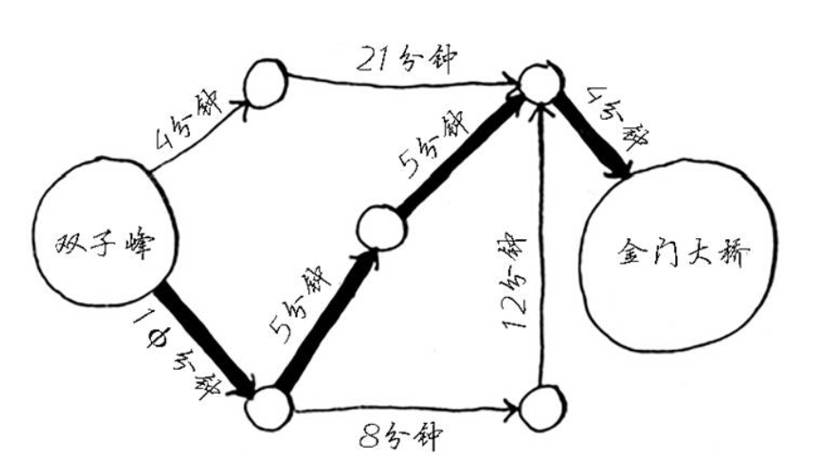

​	在前一章使用了广度优先搜索，它找出的是段数最少的路径。如果你要找出最快的路径(如图所示)，该如何办呢？为此，可使用另一种算法狄克斯特拉算法 （Dijkstra's algorithm)

​	加权图——提高或降低某些边的权重。

**不同情况适合的算法**

​	**广度优先搜索**用于在非加权图中查找最短路径。

​	**狄克斯特拉算法**用于在加权图中查找最短路径。

​	仅当权重为正时狄克斯特拉算法才管用。

​	如果图中包含负权边，请使用**贝尔曼-福德算法**。

## 7.2 相关名词及术语简介

**狄克斯特拉算法用于每条边都有关联数字的图，这些数字称为权重 （weight）。**

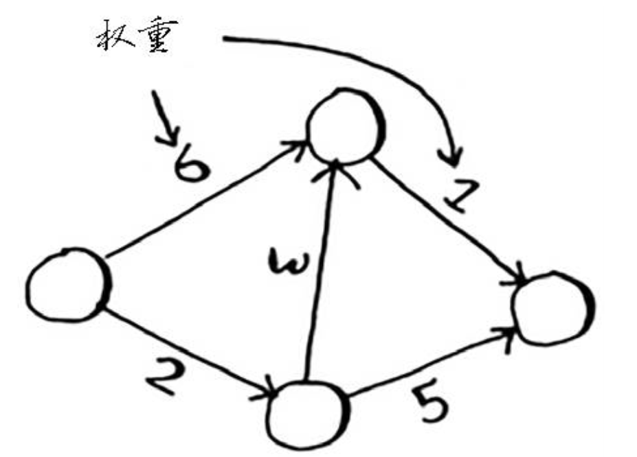

带权重的图称为加权图 （weightedgraph），不带权重的图称为非加权图 （unweightedgraph）。

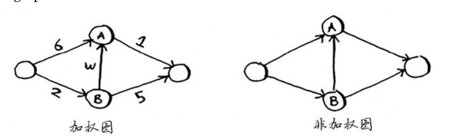

向图意味着两个节点彼此指向对方，其实就是**环**！

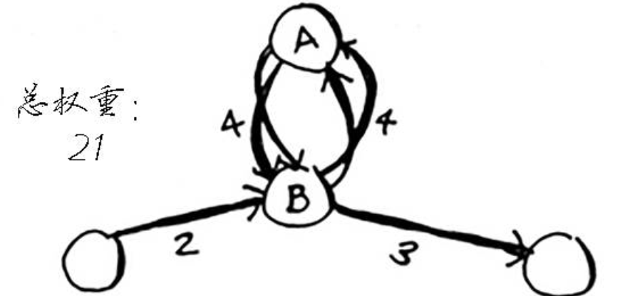

在无向图中，每条边都是一个环。**狄克斯特拉算法只适用于有向无环图** （directed acyclic graph，DAG)

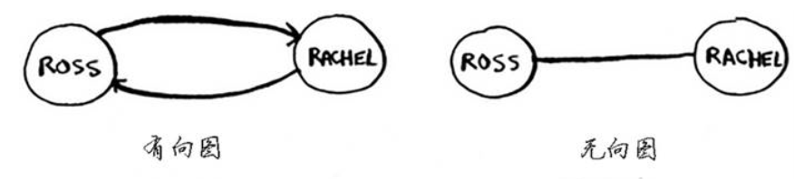

最短路径：

​	计算两点或两人之间的最短路径。最短路径指的并不一定是物理距离，也可能是让某种度量(权重)指标最小。

负权边：

​	对应加权的路径/数字，为负数。负权边对应使用尔曼-福德算法还没去研究。

## 7.3 加权有向图的问题及解决思路

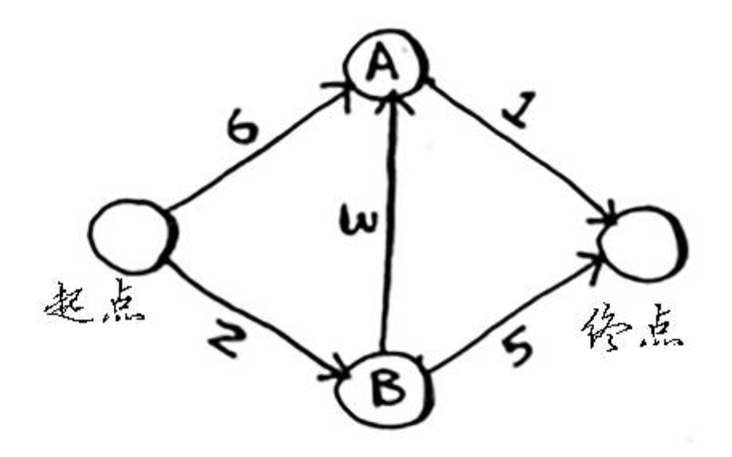

问题：找出上图(加权有向图)的最短路径。

**实现思路：**

​	要编写解决这个问题的代码，需要三个散列表。

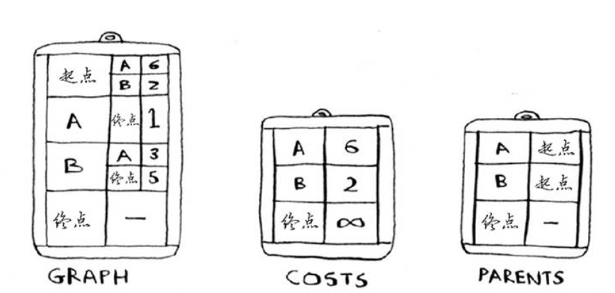

​	graph：图-散列表，对应到每个节点的权重为子散列表

​	costs：起点到每一个节点的开销的散列表，如果不能直接到达，就暂时设置为无限大，因为还不知道具体多少开销

​	parents：每个节点的父节点的散列表。

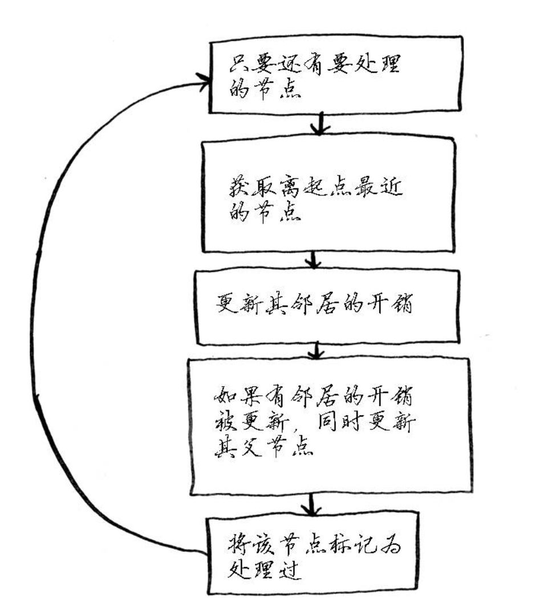

## 7.4 狄克斯特拉算法实现

java实现

```java
/**
 * 狄克斯特拉算法
 */
public class DijkstraMath {

    //图,对应key的map记录对应节点到所有相邻节点的权重
    static Map<String, Map<String,Double>> graph = new HashMap<>();

    //起点到所有其他节点花费的时间
    static Map<String,Double> costs = new HashMap<>();

    //每个节点的父节点，主要是通过父节点来维护路径，最终形成的就是最短路径
    static Map<String,String> parents = new HashMap<>();

    //已检查数组
    static List<String> checkNode = new ArrayList<>();

    public static void main(String[] args) {
        //初始化图数据
        init();
        //被检查过的节点
        //获取距离起点开销最小的节点
        String minCostNode = getMinCostNode(costs);
        Double cost = costs.get(minCostNode);
        while (minCostNode!=null){
            //获取开销最小节点的相邻节点
            Map<String, Double> neighborMap = graph.get(minCostNode);
            //判断经过当前节点到达的开销是否小于初始化的开销，如果小于则更新开销及其父节点
            for (Map.Entry<String, Double> neighborItem : neighborMap.entrySet()) {
                if((neighborItem.getValue()+cost)<costs.get(neighborItem.getKey())){
                    //更新开销
                    costs.put(neighborItem.getKey(),(neighborItem.getValue()+cost));
                    //更新其父节点
                    parents.put(neighborItem.getKey(),minCostNode);
                }
            }
            //检查完成所有相邻节点，就加入已检查数组
            checkNode.add(minCostNode);
            //开销，已检查节点，都更新完了，接着下一轮检查，直到检查完所有节点为止
            minCostNode = getMinCostNode(costs);
            cost = costs.get(minCostNode);
        }
        //对应父节点map结果
        System.out.println("parents"+parents);
        //对应开销map结果
        System.out.println("costs"+costs);
        String nodeStr = "fin";
        //新增一个集合，根据将最短路径根据经过顺序加入集合
        List<String> nodeWay = new ArrayList<>();
        nodeWay.add(nodeStr);
        while (!nodeStr.equals("start")){
            nodeWay.add(parents.get(nodeStr));
            nodeStr = parents.get(nodeStr);
        }
        Collections.reverse(nodeWay);
        //加权有向图，最短路径结果
        System.out.println(nodeWay);
    }

    public static String getMinCostNode(Map<String,Double> map){
        Double min = Double.POSITIVE_INFINITY;
        String minStr = null;
        for (Map.Entry<String, Double> stringDoubleEntry : map.entrySet()) {
            boolean anyMatch = checkNode.stream().anyMatch(a -> a.equals(stringDoubleEntry.getKey()));
            //最小开销，且不存在已检查数组中则更新
            if(stringDoubleEntry.getValue()<min && !anyMatch){
                minStr = stringDoubleEntry.getKey();
                min = stringDoubleEntry.getValue();
            }
        }
        return minStr;
    }

    public static void init(){
        //初始化数据
        graph.put("start",new HashMap<>());
        graph.put("A",new HashMap<>());
        graph.put("B",new HashMap<>());
        graph.put("fin",new HashMap<>());
        graph.get("start").put("A",6.0);
        graph.get("start").put("B",2.0);
        graph.get("A").put("fin",1.0);
        graph.get("B").put("A",3.0);
        graph.get("B").put("fin",5.0);
        //初始化数据
        costs.put("A",6.0);
        costs.put("B",2.0);
        costs.put("fin",Double.POSITIVE_INFINITY);
        //初始化数据
        parents.put("A","start");
        parents.put("B","start");
        parents.put("fin",null);
    }

}
```

输出结果：

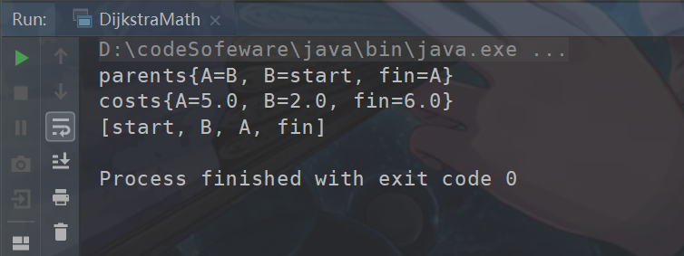


# 8 贪婪算法

## 8.1 经典案例及思想简介

**教室调度问题：**

​	假设有如下课程表，你希望将尽可能多的课程安排在某间教室。

​	你没法让这些课都在这间教室上，因为有些课的**上课时间有冲突，你希望在这间教室上尽可能多的课**。如何选出尽可能多且时间不冲突的课程呢？

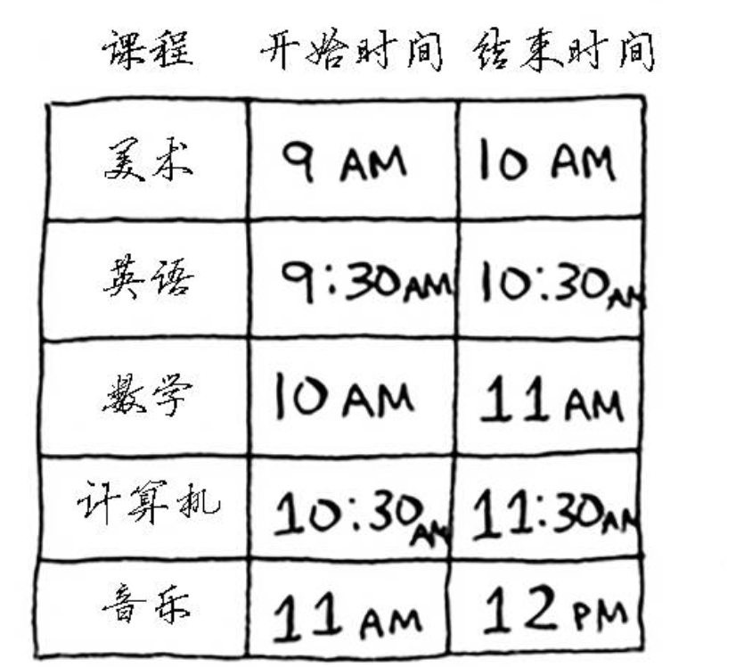

​	**解决方案：**

​		(1) 选出结束最早的课，它就是要在这间教室上的第一堂课。

​		(2) 接下来，必须选择第一堂课结束后才开始的课。同样，你选择结束最早的课，这将是要在这间教室上的第二堂课。重复这样做就能找出答案

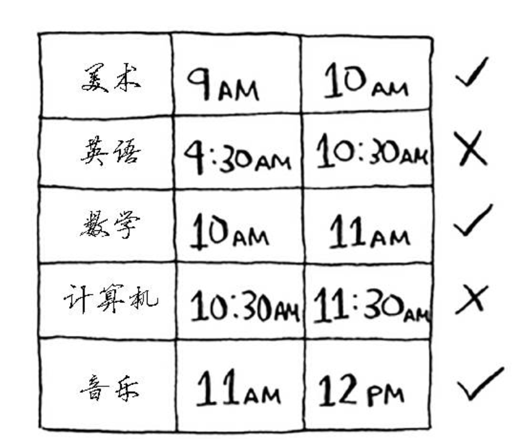

​	通过案例引出**贪婪算法思想：每步都采取最优的做法。在这个示例中，你每次都选择结束最早的课。用专业术语说，就是你每步都选择局部最优解，最终得到的就是全局最优解**

**背包问题：**

​	假设你是个贪婪的小偷，背着可装35磅（1磅≈0.45千克）

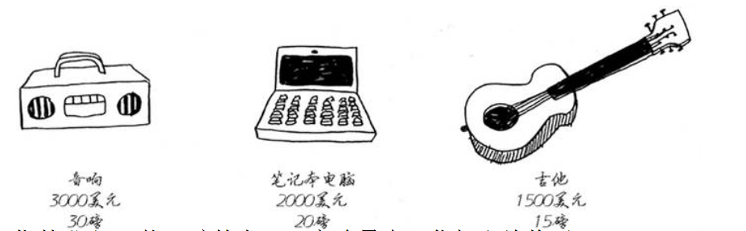

​	**方案：**

​		同样，你采取贪婪策略，这非常简单。

​		(1) 盗窃可装入背包的最贵商品。
​		(2) 再盗窃还可装入背包的最贵商品，以此类推。
​		只是这次这种贪婪策略不好使了！例如，
​		你可盗窃的商品有下面三种。

​	你的背包可装35磅的东西。音响最贵，你把它给偷了，
​	但背包没有空间装其他东西了。你偷到了价值3000美元的东西。且慢！如果不是偷音响，
而是偷笔记本电脑和吉他，总价将为3500美元！在这里，贪婪策略显然不能获得最优解，但非常接近

**总结：**

​	**只需找到一个能够大致解决问题的算法，此时贪婪算法正好可派上用场，因为它们实现起来很容易，得到的结果又与正确结果相当接近。**

## 8.2 集合覆盖问题及算法的实现

**问题：**

​	假设你办了个广播节目，要让全美50个州的听众都收听得到。为此，你需要决定在哪些广播台播出。在每个广播台播出都需要支付费用，因此你力图在尽可能少的广播台播出

现有广播台名单如下，每个广播台都覆盖特定的区域，不同广播台的覆盖区域可能重叠。

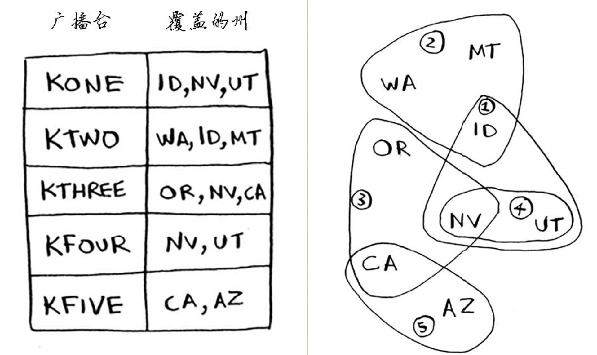

**解决方案：**

​	**正常套路：**

1) 列出每个可能的广播台集合，这被称为幂集 （powerset）。可能的子集有2的n次方个。

​	2 在这些集合中，选出覆盖全美50个州的最小集合。问题是计算每个可能的广播台子集需要很长时间。由于可能的集合有2 n 个，因此运行时间为O (2 n)。如果广播台不多，只有5～10个，这是可行的。

​	但如果广播台很多，结果将如何呢？随着广播台的增多，需要的时间将激增。假设你每秒可计算10个子集，
所需的时间将如下

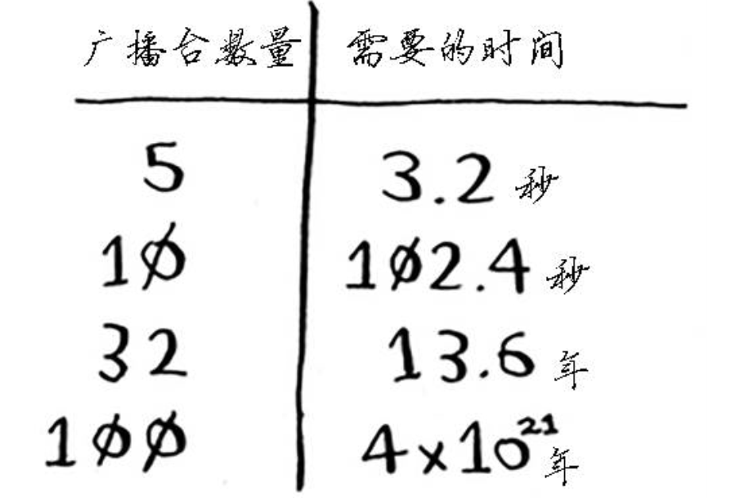

**贪婪算法-近似算法：**

​	使用下面的贪婪算法可得到非常接近的解。

​	(1) **选出这样一个广播台，即它覆盖了最多的未覆盖州**。即便这个广播台覆盖了一些已覆盖的州，也没有关系。

​	(2) **重复第一步，直到覆盖了所有的州**。

**判断近似算法优劣的标准如下：**

​	速度有多快；

​	得到的近似解与最优解的接近程度。

**贪婪算法场景：**

​	贪婪算法是不错的选择，它们不仅简单，而且通常运行速度很快。在这个例子中，贪婪算法的运行时间为O (n 2 )，其中n 为广播台数量。

​	近似算法 （approximationalgorithm）。在获得精确解需要的时间太长时，可使用近似算法。

**近似算法python实现**

​	需要遍历所有的广播台，从中选择覆盖了最多的未覆盖州的广播台

```python
# 地域集合
states_needed = set(["mt", "wa", "or", "id", "nv", "ut","ca", "az"])
# 广播台覆盖地域的散列表
stations = {}
stations["kone"] = set(["id", "nv", "ut"])
stations["ktwo"] = set(["wa", "id", "mt"])
stations["kthree"] = set(["or", "nv", "ca"])
stations["kfour"] = set(["nv", "ut"])
stations["kfive"] = set(["ca", "az"])
# 循环遍历地域集合
while states_needed:
  # 当前覆盖最多未覆盖地域的最佳广播台
  best_station = None
  # 上一个广播台已经覆盖的地域
  states_covered = set()
  # 循环遍历广播台
  for station, states in stations.items():
    # 计算地域集合与当前广播台的地域交集，得出当前广播台可以覆盖的地域
    covered = states_needed & states
    # 当前广播台可以覆盖的地域，大于上一次广播台可以覆盖的地域
    if len(covered) > len(states_covered):
      # 比上一次大就将当前广播台设置为best_station
      best_station = station
      # 当前广播台覆盖的地域赋值给上一次广播台地域的变量
      states_covered = covered
      # 这里应该是结束循环
    
      # 到这里应该循环完了一遍广播台,添加对应数据进入下一次循环
      # 地域集合减去当前广播台可以覆盖的地域
      # 这里减去集合的个数，直到集合为空则停止遍历
      states_needed -= states_covered
      # 广播台数组添加当前广播台
      final_stations.add(best_station)
      >>> print final_stations
```

**java实现**

```java
    public static void main(String[] args) {
        Set<String> statesNeeded = new HashSet<>();
        statesNeeded.addAll(Arrays.asList("mt","wa","or","id","nv","ut","ca","az"));
        Map<String,Set<String>> stations = new HashMap<>();
        stations.put("kone",new HashSet<>());
        stations.get("kone").addAll((Arrays.asList("id","nv","ut")));
        stations.put("ktwo",new HashSet<>());
        stations.get("ktwo").addAll((Arrays.asList("wa","id","mt")));
        stations.put("kthree",new HashSet<>());
        stations.get("kthree").addAll((Arrays.asList("or","nv","ca")));
        stations.put("kfour",new HashSet<>());
        stations.get("kfour").addAll((Arrays.asList("nv","ut")));
        stations.put("kfive",new HashSet<>());
        stations.get("kfive").addAll((Arrays.asList("ca","az")));
        //最佳广播台集合
        List<Set<String>> result = new ArrayList<>();
        //循环地域
        while (!statesNeeded.isEmpty()){
            //当前最佳集合
            Set<String> bestSet = null;
            //已经被覆盖的地域/上一次的集合之间的交集
            Set<String> interSet = new HashSet<>();
            //遍历广播台散列表
            for (Map.Entry<String, Set<String>> entry : stations.entrySet()) {
                Set<String> interItem = getIntersection(entry.getValue(), statesNeeded);
                //这一次的交集，大于上一次的交集，说明这一次广播台覆盖的区域更多
                if(interItem.size() > interSet.size()){
                    bestSet = entry.getValue();
                    interSet = interItem;
                }
            }
            //去除已经覆盖的地域
            removeSet(statesNeeded,interSet);
            //将最佳广播台添加到结果
            result.add(bestSet);
        }
        System.out.println(result);
    }

    /**
     * 获取两个Set集合之间的交集
     * @param oneSet
     * @param twoSet
     * @return
     */
    private static Set<String> getIntersection(Set<String> oneSet,Set<String> twoSet){
        Set<String> result = new HashSet<>();
        Iterator<String> iterator = oneSet.iterator();
        while (iterator.hasNext()){
            String next = iterator.next();
            if(twoSet.contains(next)){
                result.add(next);
            }
        }
        return result;
    }

    /**
     * 根据源集合去除已存在的数据
     * @param sourceSet
     * @param removeSet
     */
    private static void removeSet(Set<String> sourceSet,Set<String> removeSet){
        Iterator<String> iterator = removeSet.iterator();
        while (iterator.hasNext()){
            String next = iterator.next();
            sourceSet.remove(next);
        }
    }
```

## 8.3 NP完全问题

**概念：**

​	你需要计算所有的解，并从中选出最小/最短的那个。就为NP完全问题。

**旅行商问题：**

​	旅行商要前往5个城市，计算出旅途最短的路径。为此需要考虑前往这些城市的各种可能途径

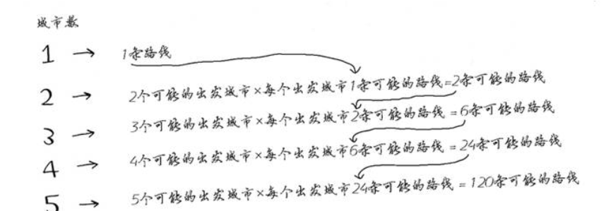

​	这被称为阶乘函数 （factorial function)

​	因此，如果涉及的城市很多，根本就无法找出旅行商问题的正确解。旅行商问题和集合覆盖问题有一些共同之处：你需要计算所有的解，并从中选出最小/最短的那个。这两个问题都属于NP完全问题。

​	**通过近似算法求解：**

​		随便选择出发城市，然后每次选择要去的下一个城市时，都选择还没去的最近的城市。

​		假设旅行商从马林出发，总旅程为71英里。这条路径可能不是最短的，但也相当短了

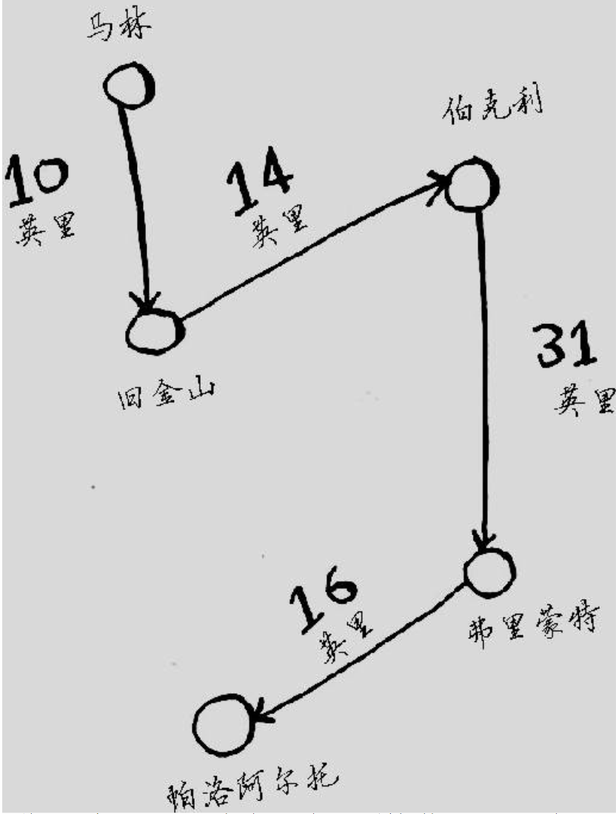

**如何识别NP完全问题：**

​	**样例：**

​		Jonah正为其虚构的橄榄球队挑选队员。他列了一个清单，指出了对球队的要求：优秀的四分卫，优秀的跑卫，擅长雨中作战，以及能承受压力等。他有一个候选球员名单，其中每个球员都满足某些要求。Jonah需要组建一个满足所有这些要求的球队，可名额有限。

​		这就是一个集合覆盖问题(广播台问题一个套路)

Jonah可使用前面介绍的近似算法来组建球队。
	(1) 找出符合最多要求的球员。
	(2)不断重复这个过程，直到球队满足要求（或球队名额已满）。

**规律：**

​	涉及“所有组合”的问题通常是NP完全问题。不能将问题分成小问题，必须考虑各种可能的情况。这可能是NP完全问题。

​	如果问题涉及序列（如旅行商问题中的城市序列）且难以解决，它可能就是NP完全问题。

​	如果问题涉及集合（如广播台集合）且难以解决，它可能就是NP完全问题。

​	如果问题可转换为集合覆盖问题或旅行商问题，那它肯定是NP完全问题。

## 8.4 总结

​	贪婪算法寻找局部最优解，企图以这种方式获得全局最优解。

​	对于NP完全问题，还没有找到快速解决方案。

​	面临NP完全问题时，最佳的做法是使用近似算法。

​	贪婪算法易于实现、运行速度快，是不错的近似算法。

# 9 动态规划

## 9.1 经典案例及思想简介

**基本概念：**

​	它将问题分成小问题，并先着手解决这些小问题

**背包问题：**

​	假设你是个小偷，背着一个可装4磅东西的背包。你可盗窃的商品有如下3件。


​	**简单算法：**

​		尝试各种可能的商品组合，并找出价值最高的组合。样可行，但速度非常慢。在有3件商品的情况下，你需要计算8个不同的集合；有4件商品时，你需要计算16个集合。每增加一件商品，需要计算的集合数都将翻倍！这种算法的运行时间为O (2的n次方)

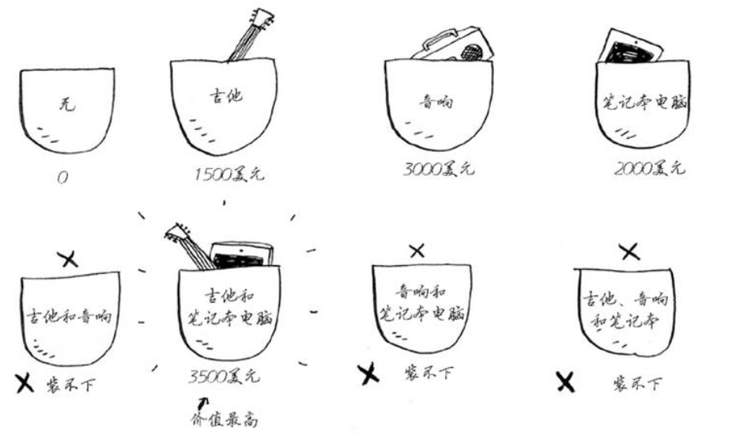

​	**动态规划：**

​		动态规划先解决子问题，再逐步解决大问题。对于背包问题，你先解决小背包（子背包）问题，再逐步解决原来的问题。

​		每个动态规划算法都从一个网格开始，背包问题的网格如下。

​		对应每一行只能放当前及之前行的商品，比如音响这一行能放吉他及音响，不能放笔记本电脑

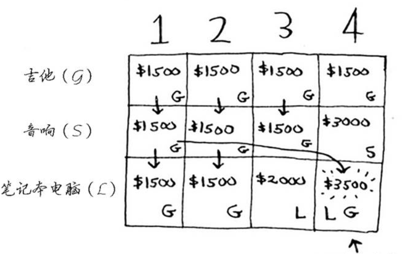

​		计算每个单元格的公式如下

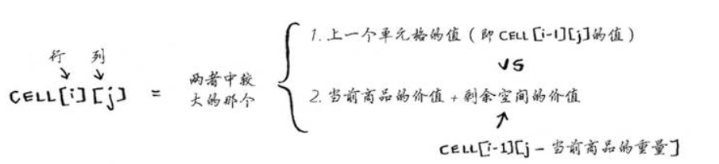

​	1 子问题解决了对应小格子，也就是对应空间(1-4空间)的最大价值(可以确定余下的空间可装入哪些商品)

​	2 子问题解决了当前空间可以放的下哪些商品	

​	以合并两个子问题的解来得到更大问题的解

假设你发现还有第四件商品可偷——一个iPhone(2000美元/1磅)！

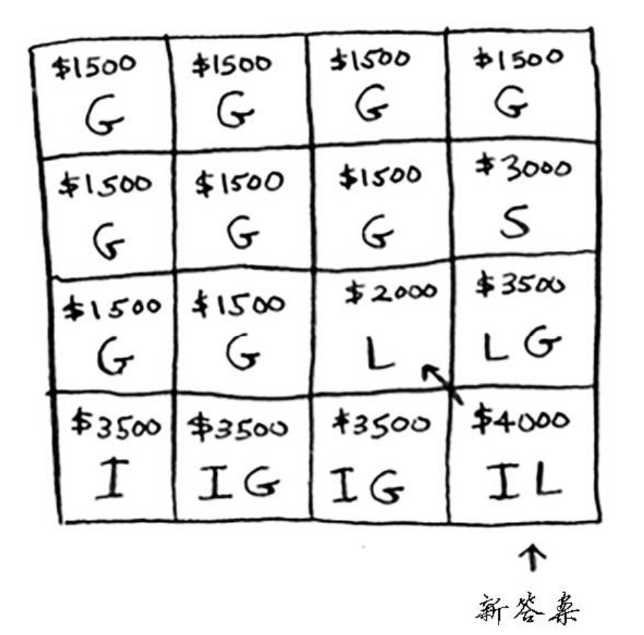

问题：沿着一列往下走时，最大价值有可能降低吗？

答案：不可能。每次迭代时，你都存储当前的最大价值。最大价值不可能比以前低(对应每一行只能放当前及之前行的商品)

问题：行的排列顺序发生变化时结果将如何，答案会随之变化吗？

答案：

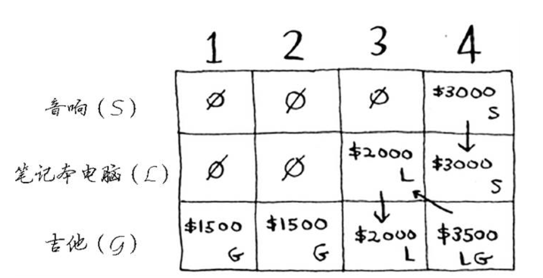

​	答案没有变化。也就是说，各行的排列顺序无关紧要。	

问题：可以逐列而不是逐行填充网格吗

答案：就这个问题而言，这没有任何影响，但对于其他问题，可能有影响。

问题：增加一件更小的商品将如何呢，

​			假设你还可以偷一条项链，它重0.5磅，价值1000美元

答案：由于项链的加入，你需要考虑的粒度更细，因此必须调整网格。

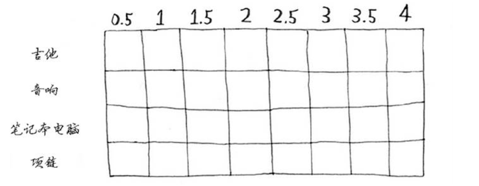

问题：可以偷商品的一部分吗

​		假设你在杂货店行窃，可偷成袋的扁豆和大米，但如果整袋装不下，可打开包装，再将背包倒满。而是可偷商品的一部分。如何使用动态规划来处理这种情形呢？

答案：

​			没法处理。使用动态规划时，要么考虑拿走整件商品，要么考虑不拿，而没法判断该不该拿走商品的一部分。
​			但使用贪婪算法可轻松地处理这种情况！首先，尽可能多地拿价值最高的商品；如果拿光了，再尽可能多地拿价值次高的商品，以此类推

**旅游行程问题：**
